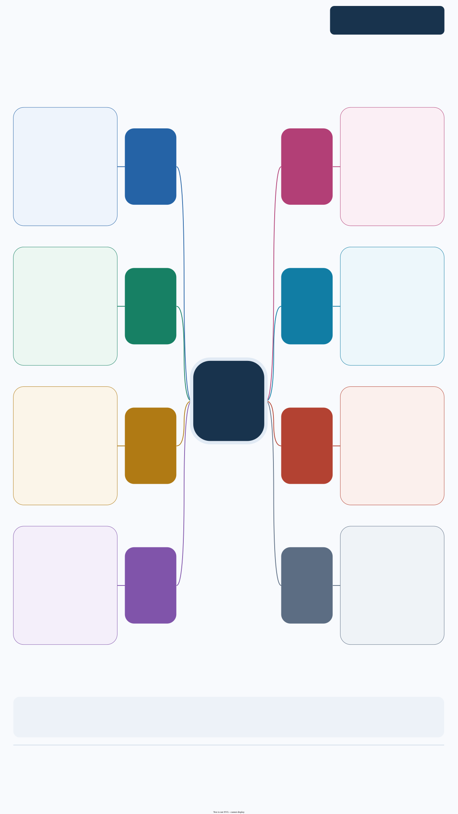

因果推断与效应异质性：倾向评分加权 / 匹配、因果森林与解释、亚组规则与稳定性、效应修饰筛选和敏感性分析。

本页集中展示三张图：先看功能总览，再查接口索引，最后看处理流程与返回对象。**点击图片可放大查看**，也可下载图源继续编辑。

[下载 draw.io 图源](../assets/module-maps/causalr/causalr-package-mindmap.drawio){.btn .btn-outline-primary download="causalr-package-mindmap.drawio"}
[下载三页 PDF](../assets/module-maps/causalr/causalr-package-mindmap.drawio.pdf){.btn .btn-outline-secondary download="causalr-package-mindmap.drawio.pdf"}

图谱快照：**2026-10-07**，源码基线 **`d4aeb78`**。开发版本仍为 **0.0.0.9000**；索引逐项对应当前 `NAMESPACE` 的 **24 个显式导出函数**。`predict.hte_tree()` 是已注册的 S3 方法，另列，不重复计数。具体参数和返回值以当前源码或安装版本的帮助页为准。

## 此次补齐的接口与阅读入口

| 入口 | 返回对象与用途 | 完整教程 |
|---|---|---|
| `get_evalue()` | RR / OR / HR 的 E-value 表；独立于 `sens_res` | [输入比值、区间与 rare 假设](evalue-guide.qmd) |
| `get_hte_pdp()` | 完整森林的加权 PDP；分位数网格与解释预算 | [参数对照、抽样与森林权重](pdp-guide.qmd) |
| `get_hte_ale()` | 局部 ALE 表；分类水平排序及空水平记录 | [相关变量、分箱与分类示例](ale-guide.qmd) |
| `get_hte_shp()` | `shapviz`；默认代理模型，可选 Kernel | [图形展示与留出集保真度](shap-guide.qmd) |
| `get_hte_tree_stability()` | 重复状态、变量频率、切点与叶子重叠 | [稳定性与既有规则预测](tree-stability-guide.qmd) |

图中三种森林解释描述模型的 CATE 预测，不能替代独立效应修饰检验。代理 SHAP 的 R² 衡量近似森林的程度；E-value 需要按研究设计判断比值换算假设。

## get_PSW()：含空格或连字符的变量名 {#psw-column-names}

2026-10-03 的源码修复 `4582e7f` 让 PS 拟合可以使用 `Age (years)`、`chol-level` 等列名。内部为 WeightIt 建立合法占位名，返回拟合对象的 `covs` 恢复原名，避免变量被误当成函数或在平衡诊断中遗漏。

```r
library(causalR)
set.seed(20261005)
d_psw <- data.frame(age = rnorm(300, 50, 10), chol = rnorm(300))
d_psw[["z"]] <- rbinom(300, 1,
  plogis(-1 + 0.02 * d_psw[["age"]] + 0.4 * d_psw[["chol"]]))
names(d_psw) <- c("Age (years)", "chol-level", "treatment arm")
psw <- get_PSW(d_psw, treat = "treatment arm",
  adj_var = c("Age (years)", "chol-level"), estimand = "ATE", balance = TRUE)
psw[["stats"]]
names(psw[["fit"]][["covs"]])
# "Age (years)" "chol-level"
```

下面为实际合成数据运行结果；已确认改名前后的 PS 数值一致，且拟合对象保留两个原始调整列名。

::: {.table-responsive}

| estimand | n | n_treat | n_ctrl | ess | ess_treat | ess_ctrl | ess_pct | w_min | w_max | w_mean | w_sd | w_cv | smd_max | smd_over |
| :-- | :-- | :-- | :-- | :-- | :-- | :-- | :-- | :-- | :-- | :-- | :-- | :-- | :-- | :-- |
| ATE | 300 | 148 | 152 | 287.5 | 142.3 | 145.3 | 0.9584 | 1.32 | 3.774 | 2 | 0.4172 | 0.2086 | 0.003106 | 0 |

:::

此修复针对列名兼容，不改变估计目标、修剪或权重截断。依然需要检查权重、重叠和平衡；它不是让任意模型后端接受任意额外参数。

## 功能模块总览

{width=100% fig-alt="causalR 的功能模块总览；点击图片可放大阅读。"}

[查看原尺寸 PNG](../assets/module-maps/causalr/causalr-package-mindmap-p1.drawio.png)

## 完整导出项索引

{width=100% fig-alt="causalR 的完整导出项索引；点击图片可放大阅读。"}

[查看原尺寸 PNG](../assets/module-maps/causalr/causalr-package-mindmap-p2.drawio.png)

## 分析流程与对象流

{width=100% fig-alt="causalR 的分析流程与对象流；点击图片可放大阅读。"}

[查看原尺寸 PNG](../assets/module-maps/causalr/causalr-package-mindmap-p3.drawio.png)

三页分别用于了解模块分工、定位公共接口和衔接输入输出。图中的流程分支按具体任务选择。
