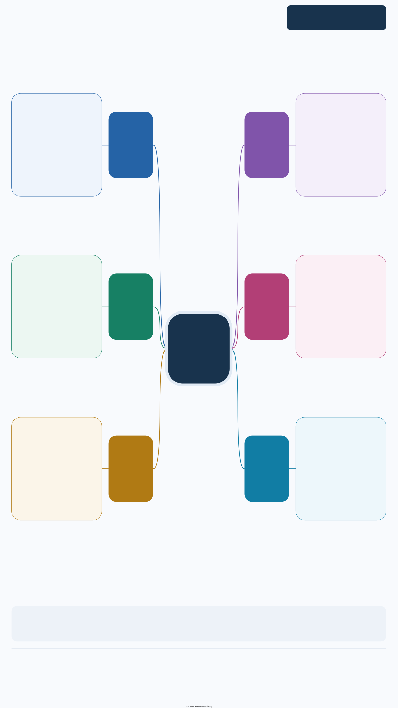
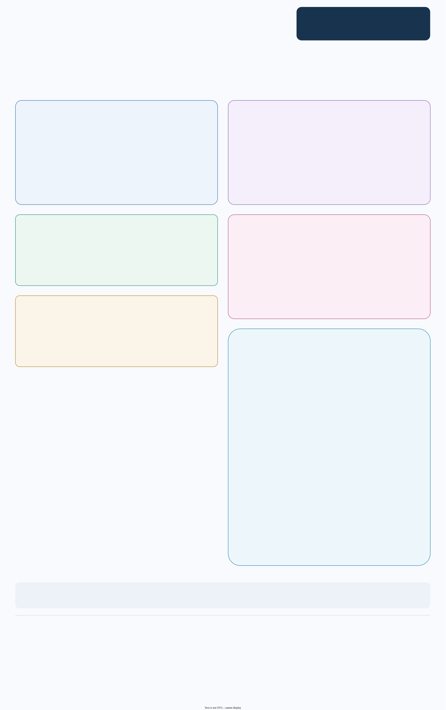
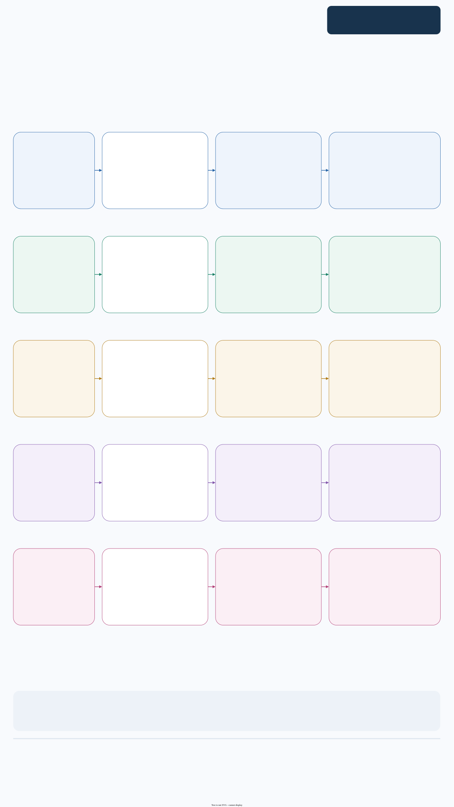

基础实验绘图：WB / qPCR、CCK-8、真实散点、定量矩阵，以及主题与配色。

本页集中展示三张图：先看功能总览，再查接口索引，最后看处理流程与返回对象。**点击图片可放大查看**，也可下载图源继续编辑。

[下载 draw.io 图源](../assets/module-maps/labr/labr-package-mindmap.drawio){.btn .btn-outline-primary download="labr-package-mindmap.drawio"}
[下载三页 PDF](../assets/module-maps/labr/labr-package-mindmap.drawio.pdf){.btn .btn-outline-secondary download="labr-package-mindmap.drawio.pdf"}

图谱快照：**2026-09-30**。对应包版本：**0.1.0**。具体参数和返回值以当前安装版本的帮助页为准。

## 功能模块总览

{width=100% fig-alt="LabR 的功能模块总览；点击图片可放大阅读。"}

[查看原尺寸 PNG](../assets/module-maps/labr/labr-package-mindmap-p1.drawio.png)

## 完整导出项索引

{width=100% fig-alt="LabR 的完整导出项索引；点击图片可放大阅读。"}

[查看原尺寸 PNG](../assets/module-maps/labr/labr-package-mindmap-p2.drawio.png)

## 分析流程与对象流

{width=100% fig-alt="LabR 的分析流程与对象流；点击图片可放大阅读。"}

[查看原尺寸 PNG](../assets/module-maps/labr/labr-package-mindmap-p3.drawio.png)

三页分别用于了解模块分工、定位公共接口和衔接输入输出。图中的流程分支按具体任务选择。
