校准评估预测概率与观测概率是否一致，DCA 根据决策阈值计算净获益。本页分两组实际图展示参数如何改变估计对象和显示，避免把校准、区分和决策价值混为一个结论。

**版本与执行范围：** 按 MLR 0.1.13 当前源码核对，使用 WSL R 4.4.3 实际导出本页 **14 张参数对照图**。实际运行生存与二分类的校准/DCA；使用 12 次重采样演示分组、correction_scope、来源、区间、平滑及 crank 近似映射，生成 14 张图。


## 示例准备与读图规则 {#data}

生存示例使用 `ToyData::toy_ptc_m1_cnd` 的 598 人 M1 PTC 队列，175 个疾病特异死亡事件，time 单位为月，与 [ToyData 介绍](../toydata/index.qmd)一致。模型使用 Age、Sex、Tum_3；Unknown 是原有因子水平。二分类示例为固定种子的 300 行模拟数据，正类明确为 Yes，避免把删失生存记录直接当成完整二分类结局。

生存模型固定 Cox、Age/Sex/Tum_3；分类模型固定 Logistic 与四个模拟特征。生存校准横纵轴为 S(t)，DCA 模型输入为事件概率 1 − S(t)；分类两类工具都使用 P(Outcome = Yes)。time 单位为月，分类没有 times 参数。

```r
library(MLR)
library(ToyData)
library(ggplot2)

d <- as.data.frame(ToyData::toy_ptc_m1_cnd[,
  c("time", "DSS", "Age", "Sex", "Tum_3", "Race")])
d <- droplevels(d[complete.cases(d), ])
vars <- c("Age", "Sex", "Tum_3")
set.seed(246)
n <- 300L
dc <- data.frame(Age = runif(n, 20, 85),
  Sex = factor(sample(c("Female", "Male"), n, TRUE)),
  Marker = rnorm(n), Group = factor(sample(c("A", "B"), n, TRUE)))
prob <- plogis(-0.4 + (dc[["Age"]] - 50) / 20 +
  0.5 * (dc[["Sex"]] == "Male") + 0.8 * dc[["Marker"]] +
  0.7 * dc[["Marker"]] * (dc[["Group"]] == "B"))
dc[["Outcome"]] <- factor(ifelse(runif(n) < prob, "Yes", "No"),
  levels = c("No", "Yes"))
cvars <- c("Age", "Sex", "Marker", "Group")

library(mlr3)
library(mlr3proba)
library(mlr3learners)
task_s <- mlr3proba::as_task_surv(d[, c("time", "DSS", vars)],
  time = "time", event = "DSS", id = "ptc_demo")
task_c <- as_task_classif(dc[, c("Outcome", cvars)],
  target = "Outcome", positive = "Yes", id = "binary_demo")
cox <- lrn("surv.coxph")
logistic <- lrn("classif.log_reg", predict_type = "prob")
cs <- get_model_calibration(task_s, cox, times = c(30, 60, 90),
  n_groups = 4, R = 12, correction_scope = "calibration",
  backend = "sequential", seed = 246)
cs8 <- get_model_calibration(task_s, cox, times = c(30, 60, 90),
  n_groups = 8, R = 12, correction_scope = "calibration",
  backend = "sequential", seed = 246)
csfull <- get_model_calibration(task_s, cox, times = c(30, 60, 90),
  n_groups = 4, R = 12, correction_scope = "full",
  backend = "sequential", seed = 246)
csoob <- get_model_calibration(task_s, cox, times = c(30, 60, 90),
  n_groups = 4, R = 12, correction_scope = "oob",
  backend = "sequential", seed = 246)
cc <- get_model_calibration(task_c, logistic, n_groups = 5, R = 12,
  correction_scope = "full", positive = "Yes", backend = "sequential", seed = 246)
ds <- get_model_dca(task_s, cox, times = c(30, 60, 90),
  thresholds = seq(0.05, 0.5, 0.025), bootstrap = TRUE, R = 12,
  backend = "sequential", seed = 246)
dc0 <- get_model_dca(task_c, logistic, thresholds = seq(0.05, 0.8, 0.025),
  bootstrap = TRUE, R = 12, positive = "Yes", backend = "sequential", seed = 246)
dcwide <- get_model_dca(task_c, logistic, thresholds = seq(0.01, 0.95, 0.02),
  bootstrap = FALSE, positive = "Yes", backend = "sequential", seed = 246)
cscrank <- get_model_calibration(task_s, cox, times = 60,
  prediction_source = "crank", correction_scope = "full", n_groups = 4, R = 12,
  backend = "sequential", seed = 246)
dscrank <- get_model_dca(task_s, cox, times = 60, prediction_source = "crank",
  thresholds = seq(0.05, 0.5, 0.025), bootstrap = FALSE,
  backend = "sequential", seed = 246)
```


## 接口、返回对象与分析流程 {#interface}

`get_model_calibration()` 返回 `mlr_model_calibration`：learner、prediction、curves、resample_curves、resample_result 和 settings；分类另带 classif 类，增加 smooth_curves、metrics 等结果。生存 curves 保留 KM / KM.corrected 及相应区间。

| correction_scope | 重采样范围 | 对“校正”的解释 |
|:--|:--|:--|
| calibration | 固定已拟合模型，仅重抽样校准估计 | 校准估计的不确定性，没有学习器乐观偏差校正 |
| full | bootstrap 重新训练提供的学习器 | 包含学习器训练与校准的校正范围 |
| oob | bootstrap 训练，OOB 预测做校准 | 留出校准；与表观曲线对象不同 |

full 仅包含提供学习器内部的流程，不会自动重做外部手工特征筛选。分类校准使用分组阳性频率及 logit 概率上的 3 自由度自然样条；绘图沿用 km / km_corrected 名称，不能解释为删失生存 KM。

`get_model_dca()` 返回 `mlr_model_dca`，含 learner、prediction、apparent_dca、apparent_curves、resample_result、resample_curves、curve_summary、settings；分类另带 classif 类。`bootstrap = FALSE` 只有表观曲线；TRUE 增加 OOB 曲线和经验分位数汇总。

生存 `prediction_source = probability` 使用学习器原生 S(t)；crank 路径会将排序分数通过 Cox 近似映射为概率。后者是在映射后的概率上评估，不能声称验证了学习器原生的绝对风险。分类不接受 prediction_source。

二分类净获益可写作 `TP/n − FP/n × pt/(1−pt)`，阈值 pt 表达假阳性与真阳性的相对权衡。生存曲线使用处理删失的时间特异 DCA，不能直接套用未处理删失的二分类计数。

## 生存校准：分组与曲线

校准图使用生存概率，而下面 DCA 使用事件风险 1 − S(t)。先核对纵轴方向；不能因为名字相近而混用。

::: {.panel-tabset}


### 原始分组 KM {.unnumbered}


横轴预测 S(t)、纵轴分组 KM 生存概率；对角线代表一致。


```r
plt_model_calibration(cs, curve = "km", show_interval = TRUE)
```


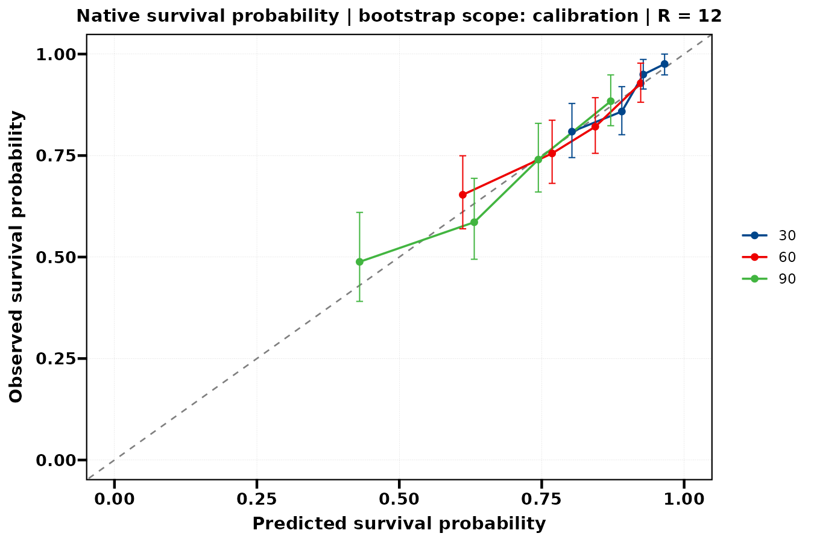{fig-alt="横轴预测 S(t)、纵轴分组 KM 生存概率；对角线代表一致。"}


### 校准层校正 {.unnumbered}


固定模型，仅校准层 bootstrap；没有包含训练模型的不确定性。


```r
plt_model_calibration(cs, curve = "km_corrected", show_interval = TRUE)
```


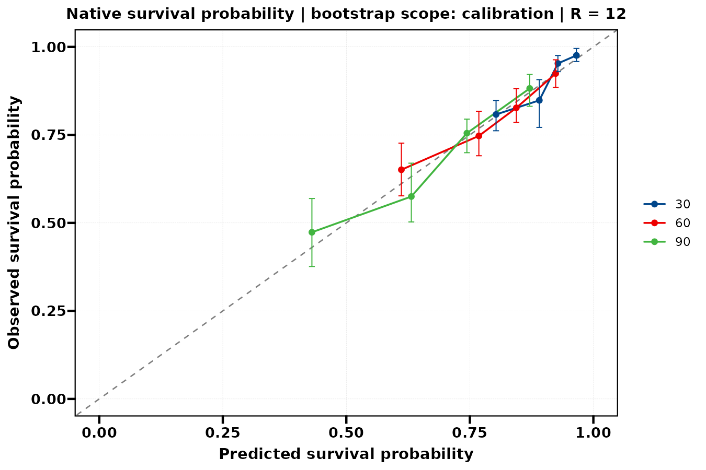{fig-alt="固定模型，仅校准层 bootstrap；没有包含训练模型的不确定性。"}


### 8 组与单个时间 {.unnumbered}


n_groups 增加到 8，重新计算分组；曲线更细不代表更稳定。


```r
plt_model_calibration(cs8, curve = "km", times = 60, show_interval = FALSE)
```


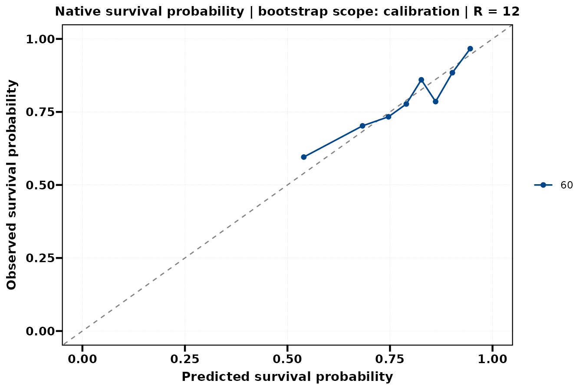{fig-alt="n_groups 增加到 8，重新计算分组；曲线更细不代表更稳定。"}


:::


## 校正范围与任务

correction_scope 指定 bootstrap 包含的计算范围。full 不会自动重做提供学习器之外的手工特征选择或数据分析。

::: {.panel-tabset}


### 模型重拟合校正 {.unnumbered}


full scope 每次 bootstrap 重新训练提供的学习器，比固定模型校正覆盖更多步骤。


```r
plt_model_calibration(csfull, curve = "km_corrected", times = 60)
```


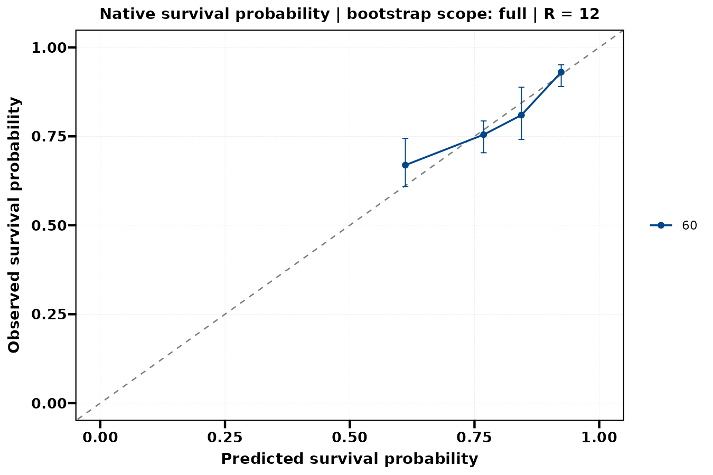{fig-alt="full scope 每次 bootstrap 重新训练提供的学习器，比固定模型校正覆盖更多步骤。"}


### OOB 校准 {.unnumbered}


oob scope 的留出预测校准曲线，和原始分组 KM 的统计对象不同。


```r
plt_model_calibration(csoob, curve = "km_corrected", times = c(30, 60), show_interval = FALSE)
```


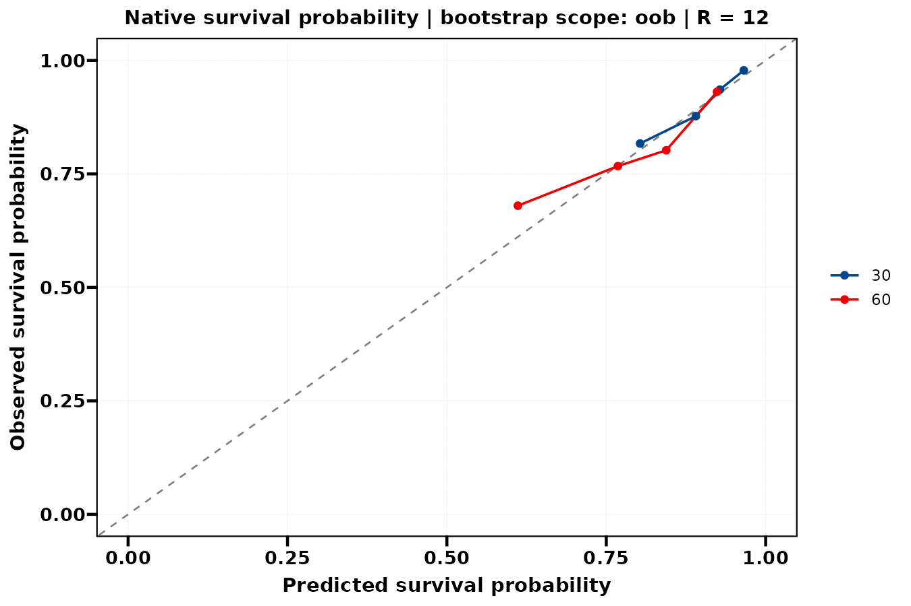{fig-alt="oob scope 的留出预测校准曲线，和原始分组 KM 的统计对象不同。"}


### 二分类校准 {.unnumbered}


二分类纵轴是观测阳性概率；沿用 km 参数名，但未使用删失生存 KM。


```r
plt_model_calibration(cc, curve = "km_corrected", ylim = c(0, 1))
```


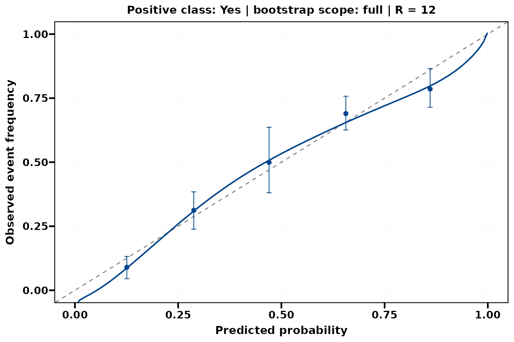{fig-alt="二分类纵轴是观测阳性概率；沿用 km 参数名，但未使用删失生存 KM。"}


:::


## 生存 DCA：来源与显示

净获益取决于阈值的权衡含义。曲线不构成临床治疗建议；本页只演示模型阈值工具。

::: {.panel-tabset}


### 表观、未平滑 {.unnumbered}


多时间事件风险的决策曲线，同时比较 Treat all / Treat none。


```r
plt_model_dca(ds, source = "apparent", smooth = FALSE, time_labels = c("30 months", "60 months", "90 months"))
```


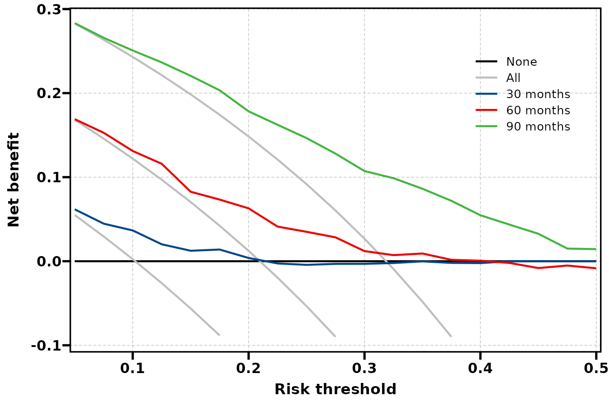{fig-alt="多时间事件风险的决策曲线，同时比较 Treat all / Treat none。"}


### 60 月平滑 {.unnumbered}


平滑只用于显示，不改变原始阈值点的净获益。


```r
plt_model_dca(ds, source = "apparent", times = 60, smooth = TRUE)
```


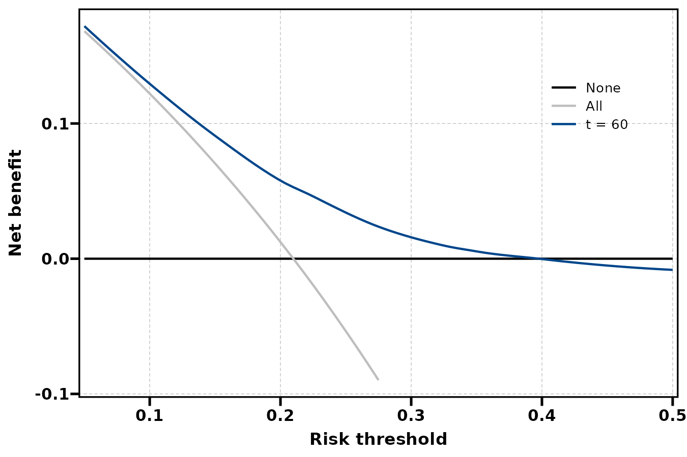{fig-alt="平滑只用于显示，不改变原始阈值点的净获益。"}


### OOB 与区间 {.unnumbered}


bootstrap = TRUE 才有 OOB 结果；本例仅 12 次重复，区间仅作示意。


```r
plt_model_dca(ds, source = "oob", times = 60, show_interval = TRUE, smooth = FALSE)
```


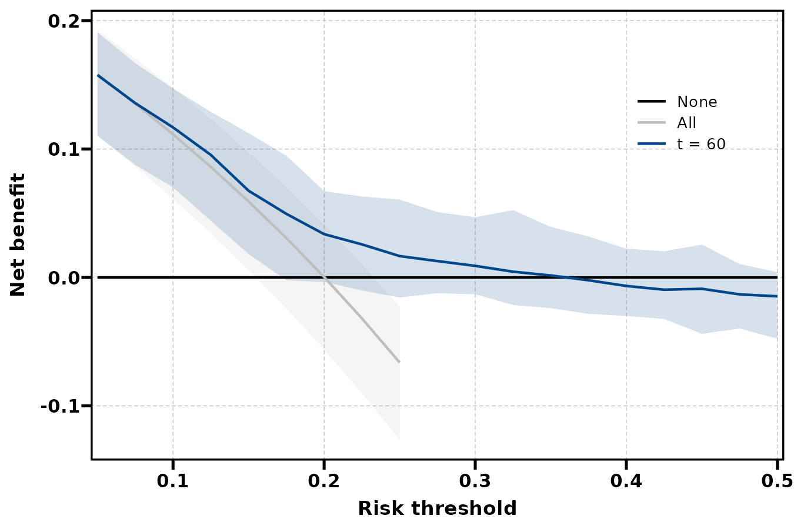{fig-alt="bootstrap = TRUE 才有 OOB 结果；本例仅 12 次重复，区间仅作示意。"}


:::


## 二分类 DCA：阈值网格

改变 thresholds 要重算，smooth 和 ylim 只改显示。min_net_benefit 会过滤低于界限的行，显式关闭后可检查完整曲线。

::: {.panel-tabset}


### 二分类表观 {.unnumbered}


阈值针对 P(Outcome = Yes)，没有生存时间维度。


```r
plt_model_dca(dc0, source = "apparent", smooth = FALSE)
```


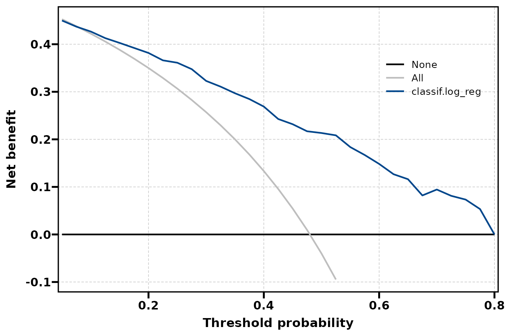{fig-alt="阈值针对 P(Outcome = Yes)，没有生存时间维度。"}


### 二分类 OOB {.unnumbered}


留出净获益与表观曲线对照，不能据最高点自动选择最佳治疗阈值。


```r
plt_model_dca(dc0, source = "oob", show_interval = TRUE, smooth = FALSE)
```


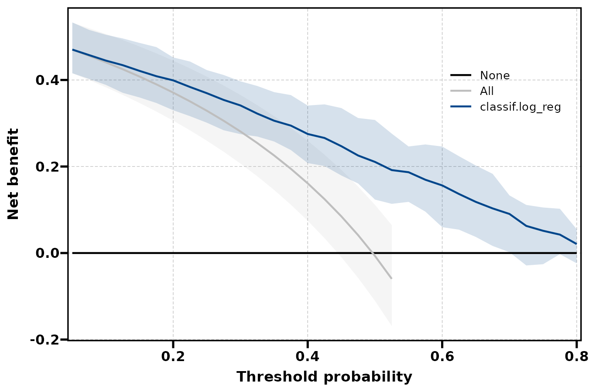{fig-alt="留出净获益与表观曲线对照，不能据最高点自动选择最佳治疗阈值。"}


### 宽阈值与完整计算 {.unnumbered}


扩展阈值到 0.95，取消低净获益过滤，并用 coord_cartesian 观察指定区间。


```r
plt_model_dca(dcwide, smooth = FALSE, min_net_benefit = NULL, ylim = c(-0.15, 0.3))
```


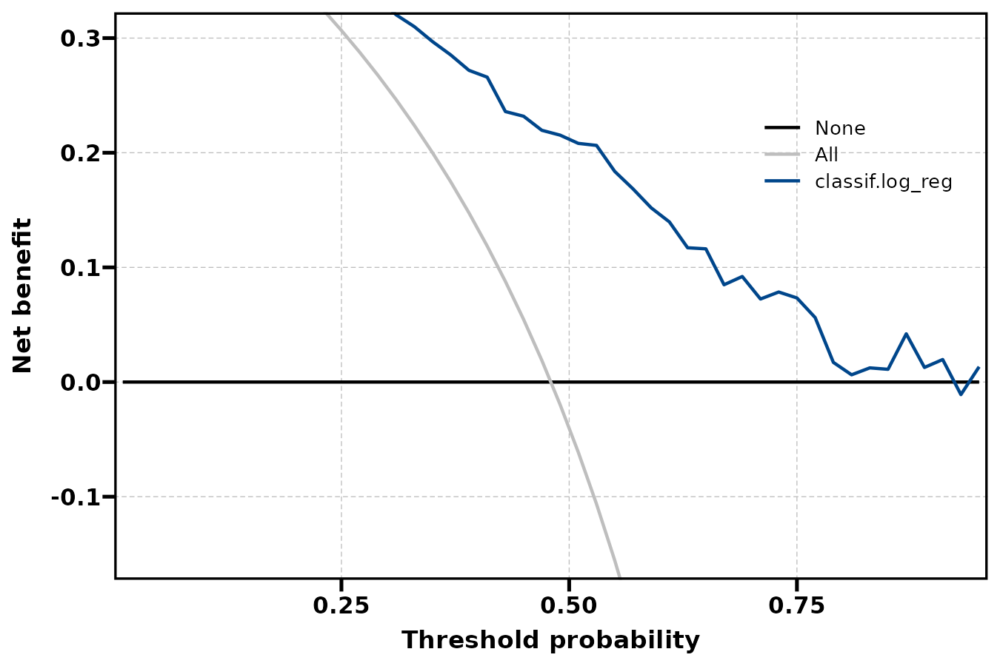{fig-alt="扩展阈值到 0.95，取消低净获益过滤，并用 coord_cartesian 观察指定区间。"}


:::


## 概率来源：原生与 crank 映射

有些学习器只支持 crank。通过 Cox 映射后可以使用概率工具，但所得结果具有额外映射步骤，不能与原生概率的验证合同混同。

::: {.panel-tabset}


### crank 近似映射 {.unnumbered}


排序分数先经 Cox 近似映射为生存概率；评估的是映射模型，而非原生概率。


```r
plt_model_calibration(cscrank, curve = "km_corrected", times = 60)
```


{fig-alt="排序分数先经 Cox 近似映射为生存概率；评估的是映射模型，而非原生概率。"}


### 映射概率的 DCA {.unnumbered}


同一时间的事件概率 1 − S(t)，先经过 crank 的 Cox 映射。


```r
plt_model_dca(dscrank, smooth = FALSE)
```


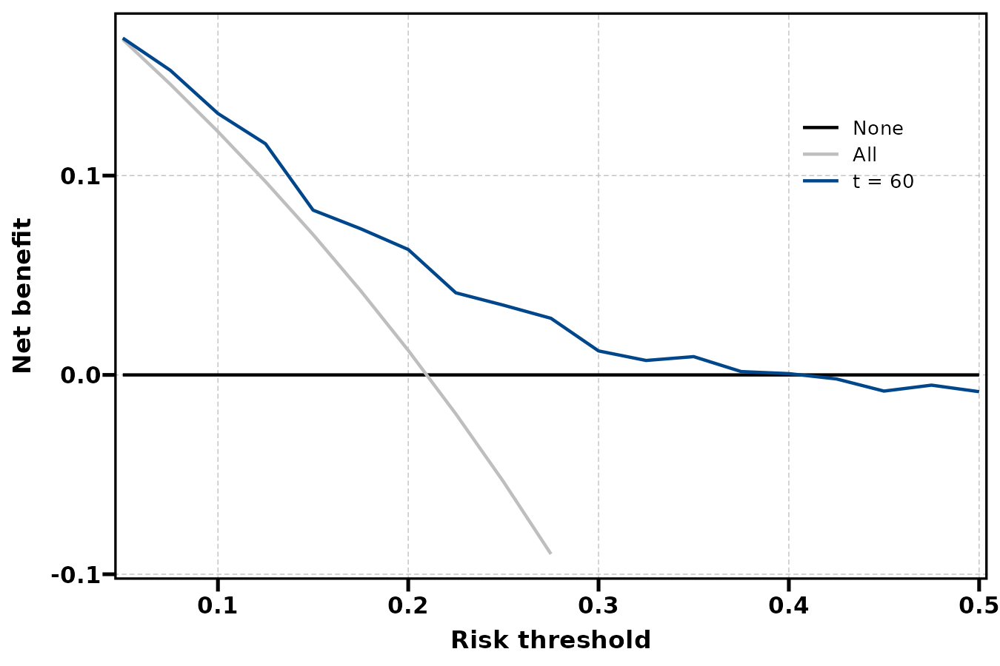{fig-alt="同一时间的事件概率 1 − S(t)，先经过 crank 的 Cox 映射。"}


:::


## 参数调整、保存与使用边界 {#parameters}

| 参数 | 作用 | 本页展示 |
|:--|:--|:--|
| times / prediction_source | 生存估计时间与概率来源 | 30/60/90 月；原生概率 |
| n_groups | 校准分组细度 | 4 与 8，需重算 |
| correction_scope / R / conf_level | 校准重采样范围与分位数 | 三种范围，R = 12 仅示意 |
| curve / show_interval / times | 选择已有校准图内容 | km 与 km_corrected；单/多时间 |
| thresholds / bootstrap | DCA 计算网格与 OOB | 窄/宽网格，OOB 需 TRUE |
| source / smooth / show_interval | DCA 来源和显示 | apparent/OOB，原始/平滑 |
| min_net_benefit / ylim | 行过滤与观察窗 | NULL 保留完整行；ylim 只改观察窗 |

`min_net_benefit = -0.1` 默认会删除净获益太低的绘图行，曲线可能提前终止；它不是统计显著性阈值。设置 NULL 后，原始计算仍可结合 ylim 查看。smooth 只改变线的显示，不重新计算阈值净获益。

```r
csfull[["curves"]]
cc[["smooth_curves"]]
cc[["metrics"]]
ds[["curve_summary"]]
ds[["resample_curves"]]
p <- plt_model_dca(ds, source = "oob", times = 60,
  show_interval = TRUE, smooth = FALSE)
ggplot2::ggsave("dca-oob-60-months.pdf", p, width = 9, height = 6)
```

分类工具不接受 times / prediction_source，作图也不能传生存 time_labels。OOB 和 full 反映的验证范围不同；这些小规模示例没有涵盖完整模型选择的不确定性。

同一模型可有良好 AUC 但校准不足；校准接近对角线也不保证在所有阈值下有净获益。阈值范围应由真实决策权衡确定，不能从图上最高点自动挑选治疗阈值。

## 相关页面与源码 {#references}

- [模型评估](model-evaluation-guide.qmd)
- [超参数调优](hyper-tuning-guide.qmd)
- [特征筛选](feature-selection-guide.qmd)
- [MLR 校准源码](https://github.com/HUI950319/MLR/blob/master/R/model-calibration.R)
- [MLR DCA 源码](https://github.com/HUI950319/MLR/blob/master/R/model-dca.R)
- [dcurves 官方源码与文档](https://github.com/ddsjoberg/dcurves)

本页图片来自上面的实际公共调用。使用固定示例、固定随机种子和注明的小规模设置，图形用于学习接口及解释预测结果。
三种生存校正范围、两种分组、二分类校准、两类 DCA 的表观/OOB 及 crank 映射路径全部实际完成，14 张图通过构建与导出。R = 12 的区间仅用于展示参数，不适合最终研究报告。
