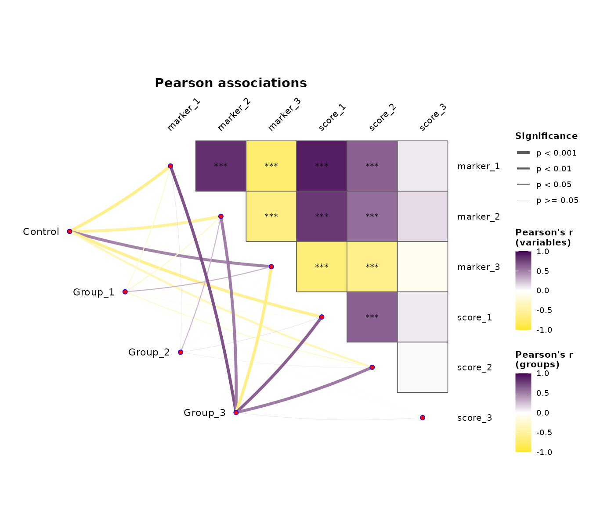
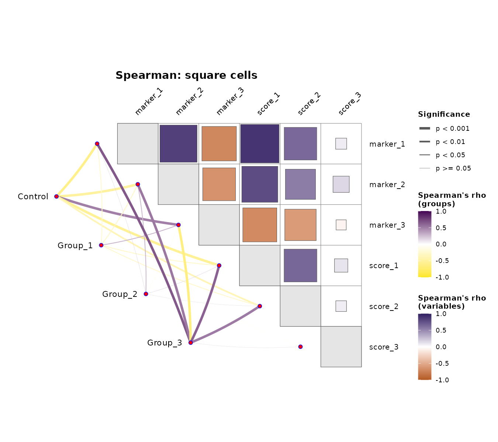
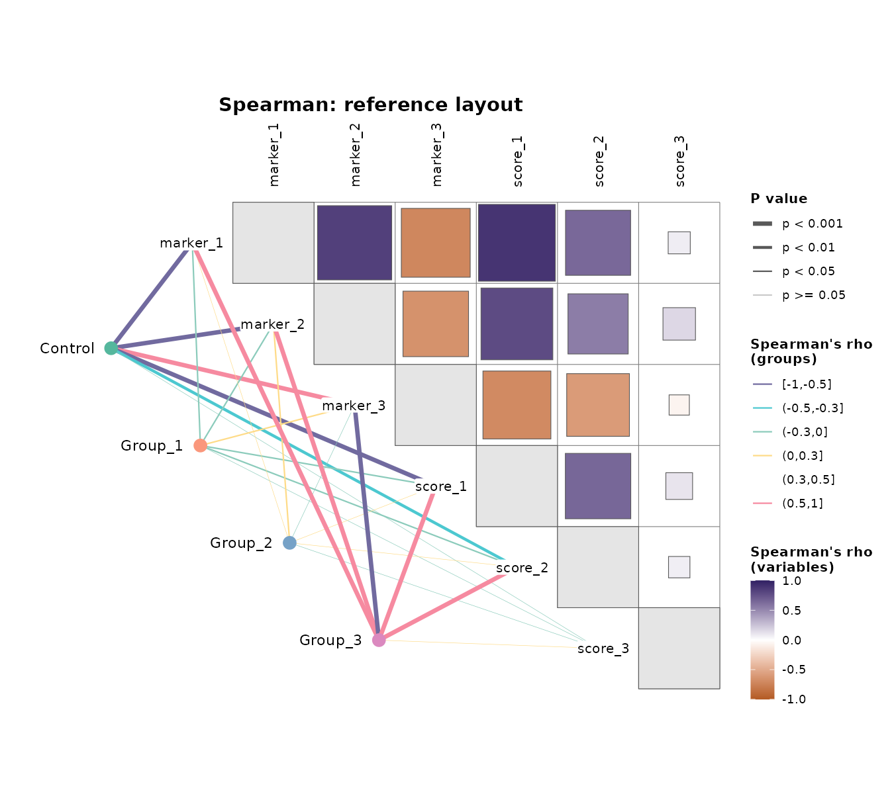
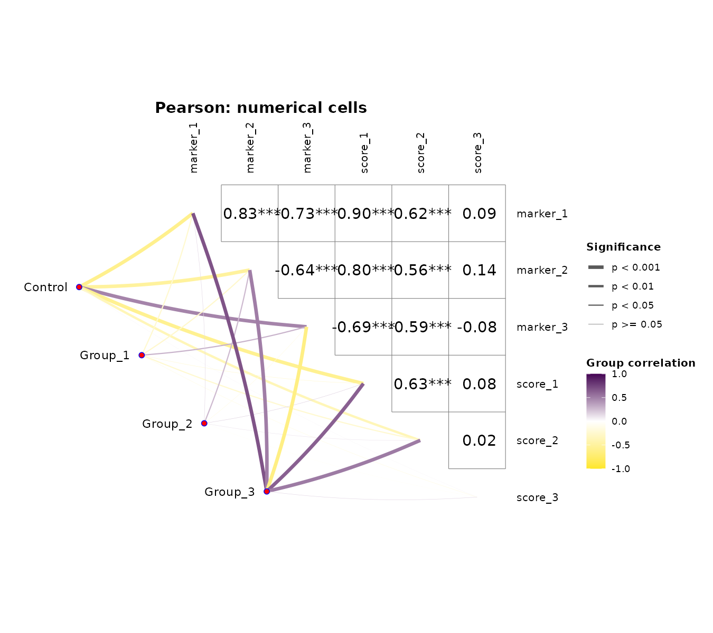
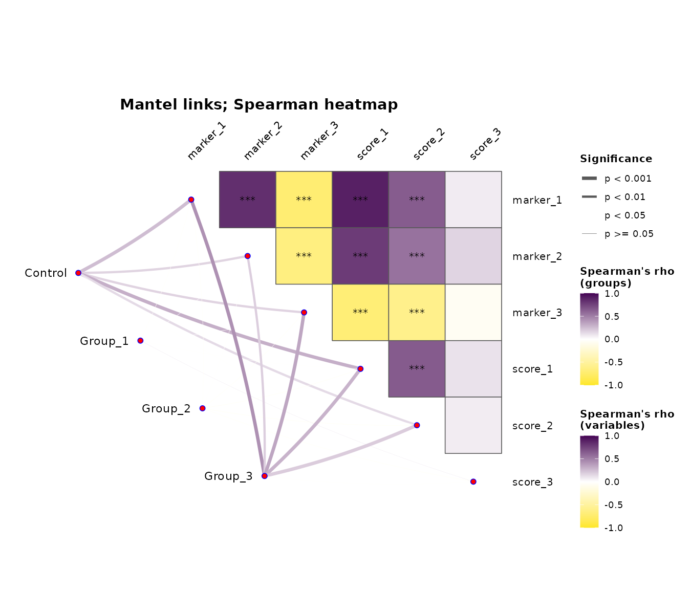
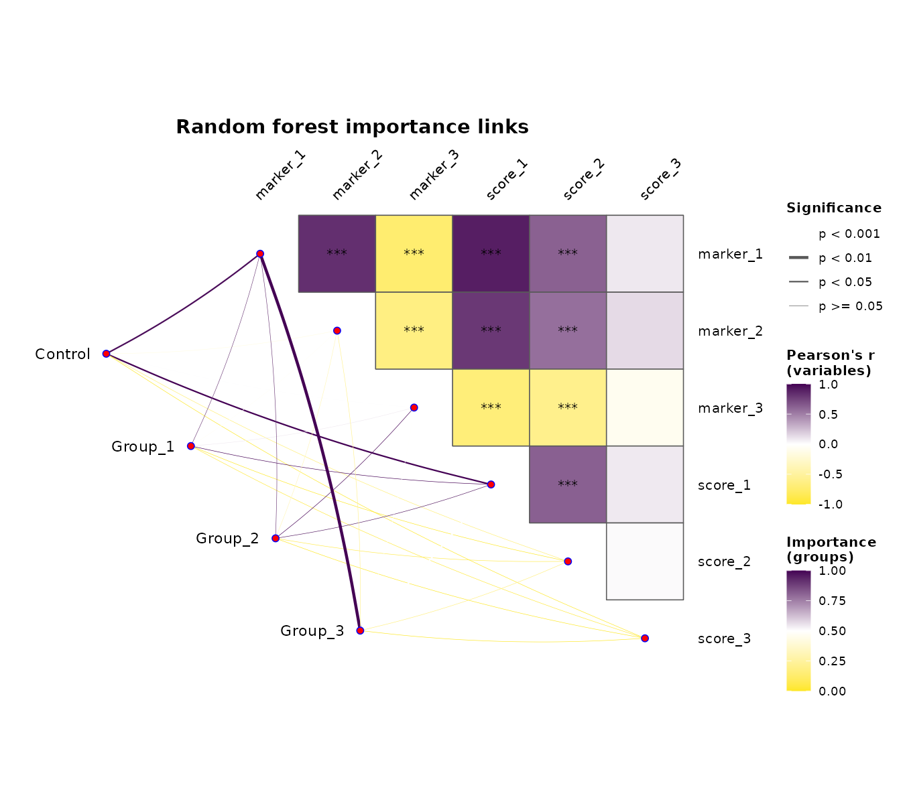

`plt_couple()` 把数值变量的相关热图与“分组—变量”连线放在同一张图上。热图、连线颜色和线宽各表达不同量，读图前应分别核对。

::: {.callout-note}
本页按 **本地 MLR 开发提交 `48d1a3b`**、包版本 0.1.13，在 WSL R 4.4.3 实际执行六组示例。核对时公开 GitHub 仍停在 [`95d3204`](https://github.com/HUI950319/MLR/tree/95d3204)，尚不包含这里的五组样式 list 与新布局。安装公开版本后，不能直接复制这些新参数；先用 `names(formals(MLR::plt_couple))` 核对。图片全部来自模拟数据。
:::

## 数据与环境 {#data}

函数依赖 `linkET`，Mantel 分支还需 `vegan`，重要性分支需相应学习器。ggplot2 ≥ 4.0.0 下使用 `geom_type = "square"` 时，linkET 需包含其 [ggplot2 兼容修复](https://github.com/Hy4m/linkET/pull/37)。本次已实际构建和导出方块图。

```r
library(MLR)
set.seed(1010)
dat <- data.frame(group = factor(rep(c("Control", "Group_1", "Group_2", "Group_3"),
  each = 18), levels = c("Control", "Group_1", "Group_2", "Group_3")))
signal <- rnorm(nrow(dat), mean = rep(c(-1.2, -0.4, 0.4, 1.2), each = 18), sd = 0.75)
dat$marker_1 <- signal + rnorm(72, sd = 0.35)
dat$marker_2 <- 0.75 * signal + rnorm(72, sd = 0.55)
dat$marker_3 <- -0.60 * signal + rnorm(72, sd = 0.65)
dat$score_1 <- signal + rnorm(72, sd = 0.45)
dat$score_2 <- 0.50 * signal + rnorm(72, sd = 0.80)
dat$score_3 <- rnorm(72)
vars <- setdiff(names(dat), "group")
stopifnot(all(c("heatmap_args", "link_args", "label_args", "node_args", "legend_args") %in%
  names(formals(MLR::plt_couple))))
```

`group` 是一个分组列名；`vars` 是数值列名，默认选取除 group 外的数值列。类别水平决定节点顺序。这里没有缺失值；热图采用所有选定数值列的完整行，相关连线则逐变量调用 `cor.test()`，缺失数据时有效样本可能不同。先处理常数列、缺失值和空组，再比较图形。

## 三种连线分别计算什么 {#meaning}

:::: {.table-responsive tabindex="0" role="region" aria-label="连线统计含义，可横向滚动"}

| 设置 | 热图 | 连线颜色 | 连线宽度 |
|:--|:--|:--|:--|
| `link_method = "correlation"` | 数值变量之间的相关 | 每组的 0/1 指示变量与每个数值变量的相关 | 该相关检验的 p 值分档 |
| `link_method = "mantel"` | 同上 | 分组指示变量距离与单变量距离之间的 Mantel 相关 | Mantel 置换 p 值分档 |
| `link_method = "importance"` | 同上 | 模型的重要性在每组内作 min–max 归一化至 [0,1] | 分组标签置换的重要性 p 值分档 |

::::

`cor_method` 同时选择热图及 correlation / Mantel 连线的 Pearson、Spearman 或 Kendall。correlation 连线表示“属于该组 vs 其余组”的关联，**不是在该组内部计算变量间相关**。Mantel 分支在当前源码固定使用 999 次置换；`n_perm` 和 `seed` 仅控制 importance 分支。Mantel 示例应在调用前另设随机种子。

热图星号来自变量相关检验，线宽来自连线检验，当前均未做多重检验校正；线细也不代表效应小。重要性依赖模型与归一化规则，不是相关系数，也不能当作因果效应。

## 五组样式参数 {#styles}

新的样式参数均为命名 list，只写需要覆盖的子项，其余保留默认值；未知项和重复项会报错。旧版的平铺样式参数需迁入对应 list，不能继续作为同名顶层参数传入。

:::: {.table-responsive tabindex="0" role="region" aria-label="样式参数，可横向滚动"}

| 参数 | 常用子项与默认值 | 作用 |
|:--|:--|:--|
| `heatmap_args` | `geom_type="shaping"`，`diag=FALSE`，`diag_color=NULL`，`colors=c("#FDE725","white","#440154")` | 热图形状、对角线与负 / 零 / 正相关配色 |
| `heatmap_args` | `show_sig_stars=TRUE`，`star_size=3.5`，`star_color="black"` | 非对角格的显著性星号 |
| `link_args` | `colors` 同上，`breaks=NULL`，`curvature=0.05` | 连续或分档颜色；0 为直线 |
| `link_args` | `sig_breaks=c(0.001,0.01,0.05)`，`sig_sizes=c(1.5,1,0.5,0.15)` | p 值分档与对应线宽；线宽数等于阈值数 + 1 |
| `label_args` | `position="axis"`，`size=10`，`angle=45`，`nudge_x=0.2` | 变量标签位置、pt 字号、顶部旋转角度与组名偏移 |
| `node_args` | `colors=NULL`，`size=2`，`endpoint_size=2` | 分组节点颜色、大小和变量端点；大小为 mm，0 隐藏 |
| `legend_args` | `position="right"`，`fill_title=NULL`，`line_title=NULL`，`sig_title="Significance"` | 图例位置与标题；NULL 自动按统计方法命名 |

::::

`heatmap_args$geom_type` 可选 shaping、mark、square；square 的面积编码绝对相关。`diag_color` 只改变对角填色，不改变 r=1 或相关色标。`label_args$position="diagonal"` 将变量名移到对角格左侧；`angle=90` 让顶部标签竖直并在列上居中。默认省略坐标轴标题和总标题。

## 热图与布局实图 {#gallery}

::: {.panel-tabset}

### 默认 Pearson

```r
p_default <- plt_couple(dat, group = "group", vars = vars,
  title = "Pearson associations")
p_default
```

{fig-alt="六个模拟数值变量的 Pearson 热图，左侧四组连向变量，右侧分别显示热图颜色、连线颜色和 p 值线宽图例。"}

### Spearman 方块与中性对角线

```r
p_square <- plt_couple(dat, group = "group", vars = vars, cor_method = "spearman",
  heatmap_args = list(geom_type = "square", diag = TRUE, diag_color = "grey90",
    colors = c("#B35A23", "white", "#302063"), show_sig_stars = FALSE),
  title = "Spearman: square cells")
p_square
```

{fig-alt="Spearman 相关热图使用面积编码的方块，完整浅灰对角线与彩色非对角格区分。"}

### 对角标签与分档直线

```r
p_reference <- plt_couple(dat, group = "group", vars = vars, cor_method = "spearman",
  heatmap_args = list(geom_type = "square", diag = TRUE, diag_color = "grey90",
    colors = c("#B35A23", "white", "#302063"), show_sig_stars = FALSE),
  link_args = list(breaks = c(-0.5, -0.3, 0, 0.3, 0.5), curvature = 0,
    colors = c("#716A9F", "#4CC8D0", "#8BCBBB", "#FEDB88", "#FAA66C", "#F68AA0")),
  label_args = list(position = "diagonal", angle = 90),
  node_args = list(colors = c(Control = "#55B79D", Group_1 = "#FA977C",
    Group_2 = "#76A2C7", Group_3 = "#DB89BF"), size = 4, endpoint_size = 0),
  legend_args = list(sig_title = "P value"), title = "Spearman: reference layout")
p_reference
```

{fig-alt="Spearman 方块热图采用对角变量标签与顶部竖直标签，左侧四个实心节点使用各组配色，连线按六个相关区间着色且为直线。"}

### 数值标注与隐藏端点

```r
p_mark <- plt_couple(dat, group = "group", vars = vars,
  heatmap_args = list(geom_type = "mark", show_sig_stars = FALSE),
  node_args = list(endpoint_size = 0), label_args = list(angle = 90),
  legend_args = list(fill_title = "Variable correlation", line_title = "Group correlation"),
  title = "Pearson: numerical cells")
p_mark
```

{fig-alt="Pearson 热图显示格内相关系数，顶部变量标签竖直，对角连线终点不显示圆点。"}

:::

分档 `breaks` 需严格递增且位于 correlation / Mantel 的 (-1,1) 或 importance 的 (0,1) 内；颜色数等于断点数 + 1。区间包含右端点，首档同时包含最小值，例如 -0.5 落在第一档。分组节点的命名颜色必须覆盖每个水平，与连线颜色独立。

## 更换连线方法 {#methods}

::: {.panel-tabset}

### Mantel 距离关联

```r
set.seed(1010)
p_mantel <- plt_couple(dat, group = "group", vars = vars, link_method = "mantel",
  cor_method = "spearman", title = "Mantel links; Spearman heatmap")
p_mantel
```

{fig-alt="上三角为 Spearman 热图，四组节点连线使用 Mantel 距离相关和置换 p 值。"}

### randomForest 重要性

```r
p_importance <- plt_couple(dat, group = "group", vars = vars,
  link_method = "importance", model = "randomForest", n_perm = 100L, seed = 1010L,
  title = "Random forest importance links")
p_importance
```

{fig-alt="Pearson 热图连接四组 randomForest 重要性，连线颜色图例标为 Importance，线宽显示重要性置换检验。"}

:::

此 importance 示例使用 100 次分组标签置换，p 值采用加一校正，最小可能值为 1/101；不能通过加粗线条制造更精确的 p 值。当前 randomForest 分支每次拟合 500 棵树并汇总局部重要性；`get_imp()` 的 300 棵树默认值不适用于此函数。Mantel 关联、模型重要性与分组相关应分别解读。

## 返回对象与 PDF 保存 {#output}

函数返回 ggplot，可继续添加主题；它没有公开的“图 + 统计表”返回 list。下面保存已有对象，不重新计算置换。

```r
RegR::save_plt(p_reference, filename = file.path(tempdir(), "couple-reference.pdf"),
  width = 9, height = 8)
```

也可在 `plt_couple(..., save = list(filename=..., width=9, height=8))` 内保存。该函数的 save 当前只接受 filename、width、height；空 list 或 NULL 不保存。设备细节见 [RegR PDF 保存说明](../regr/flow-guide.qmd#pdf-device)。

六张图已实际构建和导出；方块 / 参考布局的热图数据及连线 r、p 值逐项相同，改布局不改变统计结果。本页涉及的新增接口尚处本地开发快照，公开版本的参数以 [现有帮助页](https://hui950319.github.io/MLR/reference/plt_couple.html) 为准。
