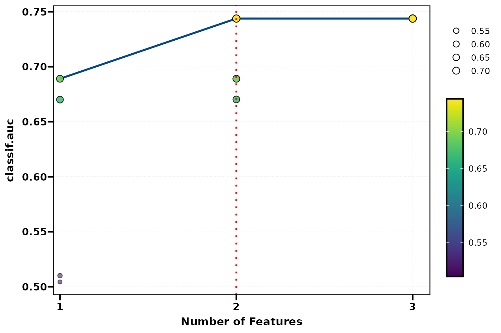
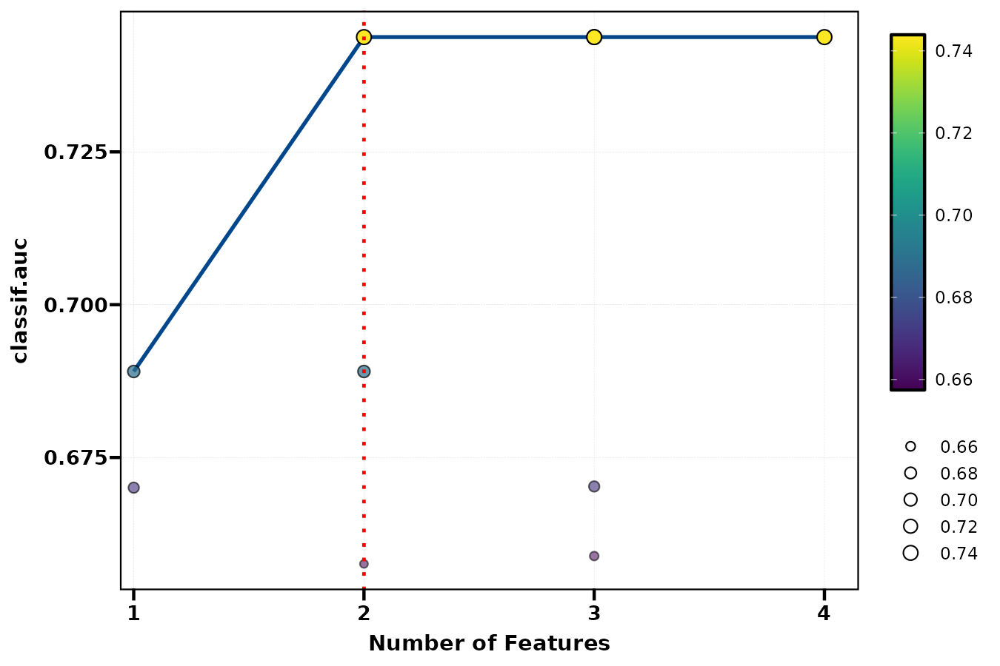
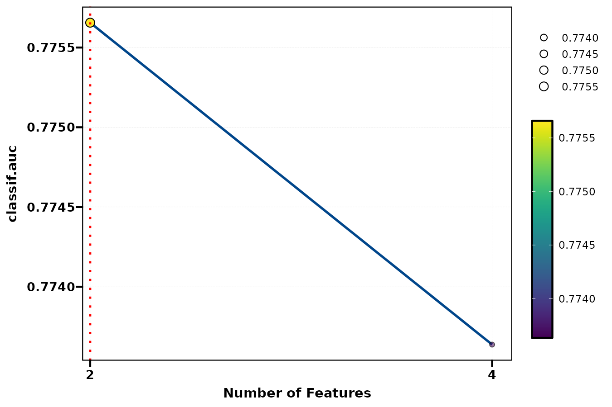
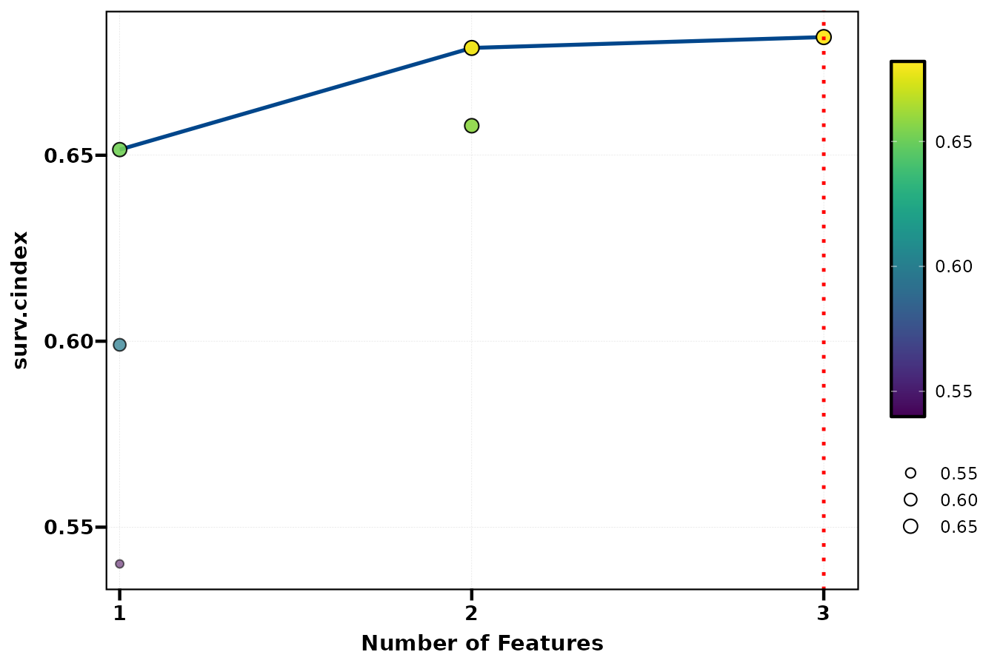
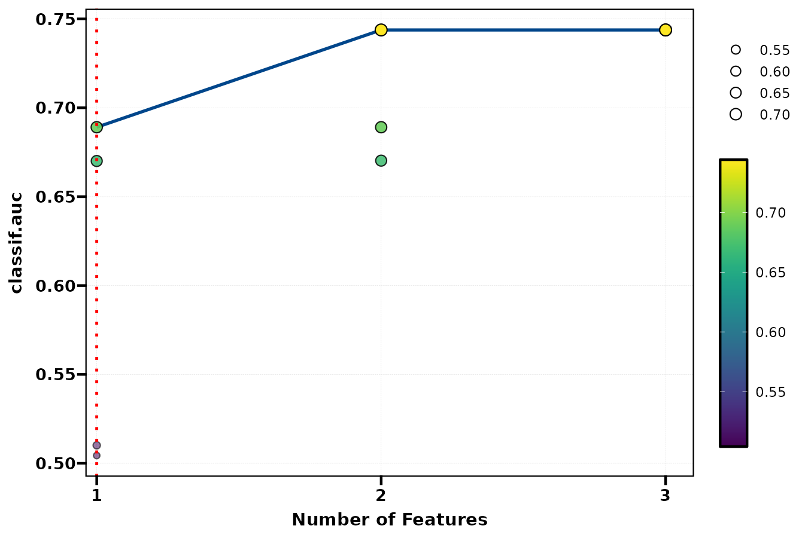
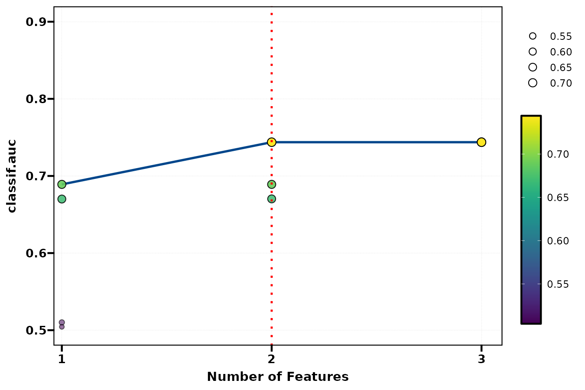
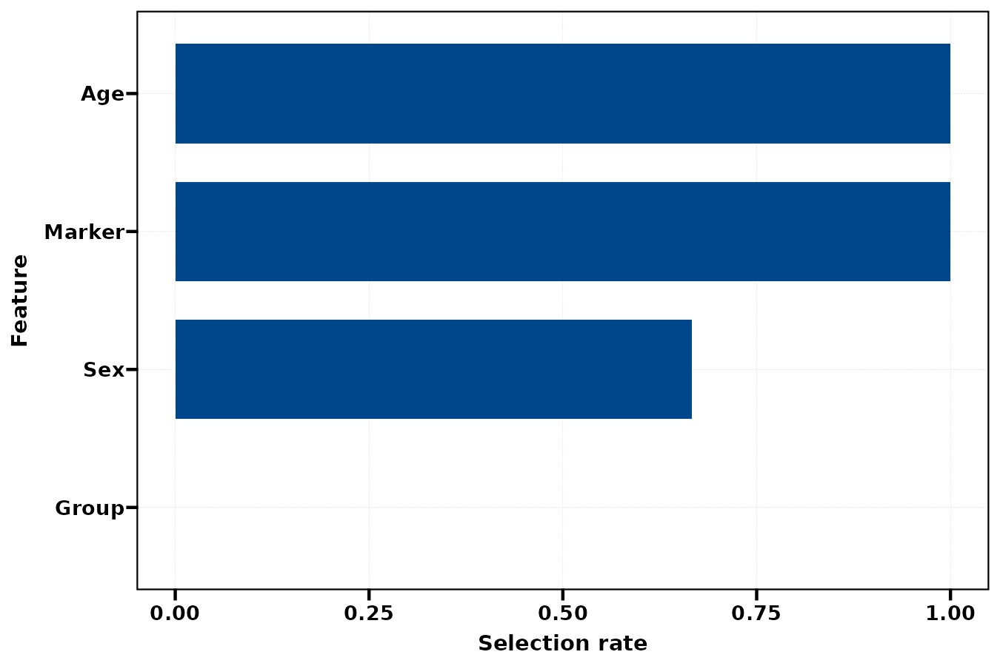
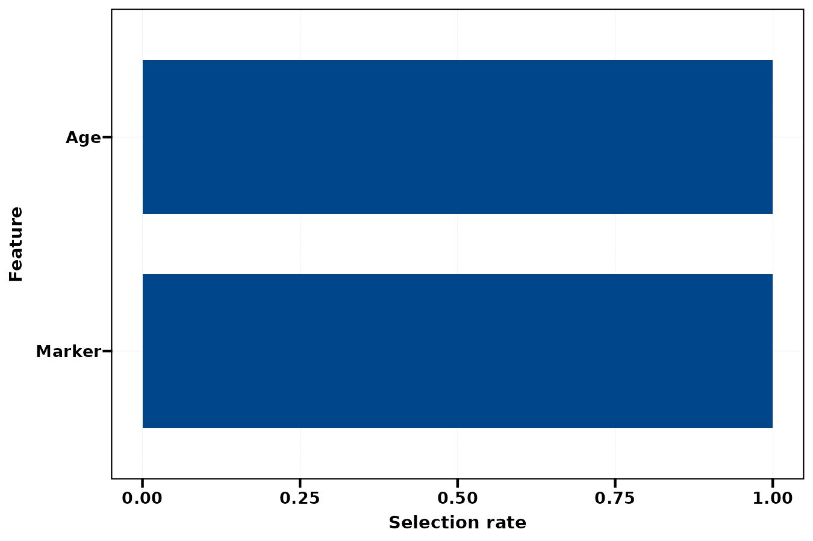
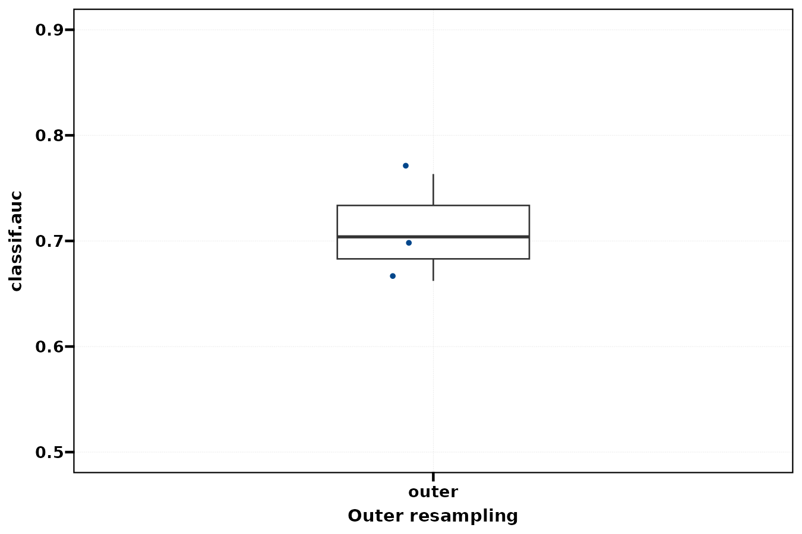

`get_model_FeaSel()` 保留已评估子集与每个特征数的最佳结果。先查看搜索路径，再用 `get_selected_features()` 明确取出对应候选，最后在嵌套划分中观察选择频率和留出性能。

**版本与执行范围：** 按 MLR 0.1.13 当前源码核对，使用 WSL R 4.4.3 实际导出本页 **9 张参数对照图**。实际运行 SFS、SBS、RFE、生存 SFS 和嵌套 SFS，生成 9 张参数对照图；同时验证选择结果和公开表格输出。


## 示例准备与读图规则 {#data}

生存示例使用 `ToyData::toy_ptc_m1_cnd` 的 598 人 M1 PTC 队列，175 个疾病特异死亡事件，time 单位为月，与 [ToyData 介绍](../toydata/index.qmd)一致。模型使用 Age、Sex、Tum_3；Unknown 是原有因子水平。二分类示例为固定种子的 300 行模拟数据，正类明确为 Yes，避免把删失生存记录直接当成完整二分类结局。

分类的前向/后向和嵌套示例固定 rpart；RFE 需要 importance 属性，使用 80 棵树的 ranger。因此 RFE 与前向图同时改变了算法和学习器，不能把差异归因于单一参数。生存示例固定 Cox，并优化 C-index。

```r
library(MLR)
library(ToyData)
library(ggplot2)

d <- as.data.frame(ToyData::toy_ptc_m1_cnd[,
  c("time", "DSS", "Age", "Sex", "Tum_3", "Race")])
d <- droplevels(d[complete.cases(d), ])
vars <- c("Age", "Sex", "Tum_3")
set.seed(246)
n <- 300L
dc <- data.frame(Age = runif(n, 20, 85),
  Sex = factor(sample(c("Female", "Male"), n, TRUE)),
  Marker = rnorm(n), Group = factor(sample(c("A", "B"), n, TRUE)))
prob <- plogis(-0.4 + (dc[["Age"]] - 50) / 20 +
  0.5 * (dc[["Sex"]] == "Male") + 0.8 * dc[["Marker"]] +
  0.7 * dc[["Marker"]] * (dc[["Group"]] == "B"))
dc[["Outcome"]] <- factor(ifelse(runif(n) < prob, "Yes", "No"),
  levels = c("No", "Yes"))
cvars <- c("Age", "Sex", "Marker", "Group")

library(mlr3)
library(mlr3proba)
library(mlr3learners)
task_c <- as_task_classif(dc[, c("Outcome", cvars)],
  target = "Outcome", positive = "Yes", id = "binary_demo")
task_s <- mlr3proba::as_task_surv(d[, c("time", "DSS", vars)],
  time = "time", event = "DSS", id = "ptc_demo")
tree <- lrn("classif.rpart", predict_type = "prob")
fsf <- get_model_FeaSel(task_c, learner = tree, method = "sfs",
  selector_args = list(max_features = 3), inner_resampling = rsmp("cv", folds = 3),
  backend = "sequential", seed = 246)
fsb <- get_model_FeaSel(task_c, learner = tree, method = "sbs",
  inner_resampling = rsmp("cv", folds = 3), backend = "sequential", seed = 246)
fsr <- get_model_FeaSel(task_c,
  learner = lrn("classif.ranger", predict_type = "prob", num.trees = 80,
    num.threads = 1, importance = "impurity"), method = "rfe",
  inner_resampling = rsmp("cv", folds = 3), backend = "sequential", seed = 246)
fsn <- get_model_FeaSel(task_c, learner = tree, method = "sfs",
  selector_args = list(max_features = 3), nested = TRUE,
  inner_resampling = rsmp("cv", folds = 2), outer_resampling = rsmp("cv", folds = 3),
  backend = "sequential", seed = 246)
fss <- get_model_FeaSel(task_s, learner = lrn("surv.coxph"), method = "sfs",
  selector_args = list(max_features = 3), inner_resampling = rsmp("cv", folds = 3),
  backend = "sequential", seed = 246)
```


## 接口、返回对象与分析流程 {#interface}

返回 `mlr_feature_selection`（另带任务类别），含 instance、archive、best_by_n、selected_features、selected_summary、tables 和 settings 等字段；嵌套时还提供 nested_result、nested_selections、outer_scores 和 stability。`archive` 是实际评估过的子集，不代表枚举了全部可能组合。

| 方法 | 选择规则与条件 |
|:--|:--|
| sfs / sbs | 前向加入 / 后向删去；selector_args 管理方法专用设置 |
| random_search / exhaustive_search | 随机搜索 / 枚举；高维枚举代价大 |
| rfe / rfecv | 重要性驱动的递归消除；要求学习器支持 importance |
| shadow_variable_search / genetic_search | 影子变量 / 遗传搜索；需要相应可选依赖 |

`n_evals` 主要是随机/遗传搜索的预算；顺序或递归路径要用方法专用配置，例如 max_features，不能仅凭较小 n_evals 假定限制了变量数量。

`get_selected_features(x)` 返回最终最佳子集。给定 n_features 时，从已经评估的该规模子集中取最佳结果；未评估规模会报错。改变 plt 的 n_features 只是移动高亮线，不会运行新的筛选。

该入口返回筛选结果，不提供已经用全部样本训练的最终 learner；需要取出变量后自行训练。nested = TRUE 在每个外层训练集重新筛选；频率表示外层选择稳定性，不表示变量的真实因果作用或统计显著性。

## 选择方法与搜索路径

同一变量数可能评估多个子集。默认红线标出最终选择数目；它不是对特征数的显著性检验。

::: {.panel-tabset}


### 前向选择 {.unnumbered}


每个点为已评估子集的内层 CV 分数；连线连接各特征数的最佳子集。


```r
plt_model_FeaSel(fsf, type = "path")
```


{fig-alt="每个点为已评估子集的内层 CV 分数；连线连接各特征数的最佳子集。"}


### 后向选择 {.unnumbered}


从更多变量向少数变量删减；路径和前向搜索不同。


```r
plt_model_FeaSel(fsb, type = "path")
```


{fig-alt="从更多变量向少数变量删减；路径和前向搜索不同。"}


### 递归重要性消除 {.unnumbered}


RFE 需支持 importance 的学习器，本例换用 ranger；同时改变算法与学习器。


```r
plt_model_FeaSel(fsr, type = "path")
```


{fig-alt="RFE 需支持 importance 的学习器，本例换用 ranger；同时改变算法与学习器。"}


### 生存 Cox {.unnumbered}


同一公开入口也支持生存，当前指标为 C-index，不能与 AUC 数值直接混用。


```r
plt_model_FeaSel(fss, type = "path")
```


{fig-alt="同一公开入口也支持生存，当前指标为 C-index，不能与 AUC 数值直接混用。"}


:::


## 候选规模与观察窗

`n_features` 从已评估集合中选择对应规模；它不会补算没有出现过的特征数。

::: {.panel-tabset}


### 强调 1 个变量 {.unnumbered}


红线改为已评估的一变量候选，未重新筛选或训练。


```r
plt_model_FeaSel(fsf, type = "path", n_features = 1)
```


{fig-alt="红线改为已评估的一变量候选，未重新筛选或训练。"}


### 强调 2 个变量 {.unnumbered}


两变量规模与观察窗一起改变；统计归档保持相同。


```r
plt_model_FeaSel(fsf, type = "path", n_features = 2, ylim = c(0.5, 0.9))
```


{fig-alt="两变量规模与观察窗一起改变；统计归档保持相同。"}


:::


## 嵌套筛选与外层证据

每个外层训练集独立做内层筛选，外层测试集评估整个流程。频率只来自三个外层划分，用于接口演示。

::: {.panel-tabset}


### 全部变量频率 {.unnumbered}


嵌套外层训练集分别筛选，显示被选择的频率。


```r
plt_model_FeaSel(fsn, type = "stability")
```


{fig-alt="嵌套外层训练集分别筛选，显示被选择的频率。"}


### 前 2 个变量 {.unnumbered}


top_n 控制显示项数；频率不是因果效应或假发现率。


```r
plt_model_FeaSel(fsn, type = "stability", top_n = 2, ylim = c(0, 1))
```


{fig-alt="top_n 控制显示项数；频率不是因果效应或假发现率。"}


### 外层性能 {.unnumbered}


留出集分数反映训练折内筛选流程，和最高内层分数含义不同。


```r
plt_model_FeaSel(fsn, type = "outer_performance", ylim = c(0.5, 0.9))
```


{fig-alt="留出集分数反映训练折内筛选流程，和最高内层分数含义不同。"}


:::


## 参数调整、保存与使用边界 {#parameters}

| 参数 | 影响 | 对照 |
|:--|:--|:--|
| method / learner | 子集搜索与打分模型 | SFS、SBS、RFE；Cox/rpart/ranger |
| selector_args | 方法专用设置 | SFS 的 max_features = 3 |
| measure / positive | 优化指标与方向 | C-index / AUC；分类正类 Yes |
| inner_resampling / nested / outer_resampling | 搜索和评估划分 | 全数据搜索与嵌套外层 |
| n_features | 展示或读取已评估规模 | 1 / 2；不补算未评估规模 |
| top_n / ylim | 稳定性显示与观察窗 | 所有变量 / 前两项；0–1 频率 |

## 取出结果与表格

```r
get_selected_features(fsf)
get_selected_features(fsf, n_features = 2)
tb_model_FeaSel(fsf, type = "path")
tb_model_FeaSel(fsf, type = "selected")
tb_model_FeaSel(fsn, type = "stability", top_n = 2)
tb_model_FeaSel(fsn, type = "outer_performance")
```

公开入口实际读回的分类 SFS 结果：

| 规模 | 变量 |
| :-- | :-- |
| best | Age, Marker |
| one | Marker |
| two | Age, Marker |

```r
p <- plt_model_FeaSel(fsf, type = "path", n_features = 2)
ggplot2::ggsave("feature-selection.pdf", p, width = 9, height = 6)
chosen <- get_selected_features(fsf)
task_final <- task_c$clone(deep = TRUE)
task_final$select(chosen)
fit <- tree$clone(deep = TRUE)
fit$train(task_final)
```

如果后续只把全数据选出的变量交给普通 CV，筛选信息已经泄露到测试折。评估时需在每个训练折重做筛选，或直接保留本入口的嵌套流程。三个外层折的稳定频率只适合演示，没有足够精度支撑“稳定生物标志物”的结论。

## 相关页面与源码 {#references}

- [模型筛选](model-selection-guide.qmd)
- [超参数调优](hyper-tuning-guide.qmd)
- [模型评估](model-evaluation-guide.html)
- [MLR 特征筛选源码](https://github.com/HUI950319/MLR/blob/master/R/model-fea-sel.R)
- [mlr3fselect 官方文档](https://mlr3fselect.mlr-org.com/)

本页图片来自上面的实际公共调用。使用固定示例、固定随机种子和注明的小规模设置，图形用于学习接口及解释预测结果。
五条实际筛选路径完成；九张图通过构建，get_selected_features 的默认与 1/2 变量读回成功；path / stability 的 flextable 返回已实际验证。
