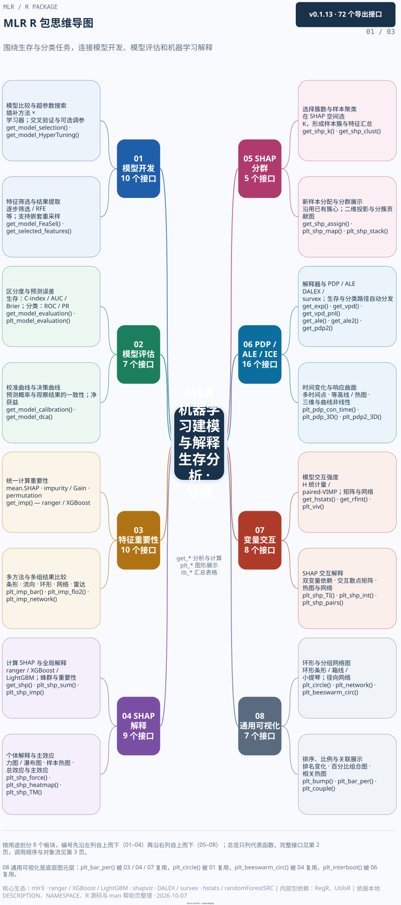
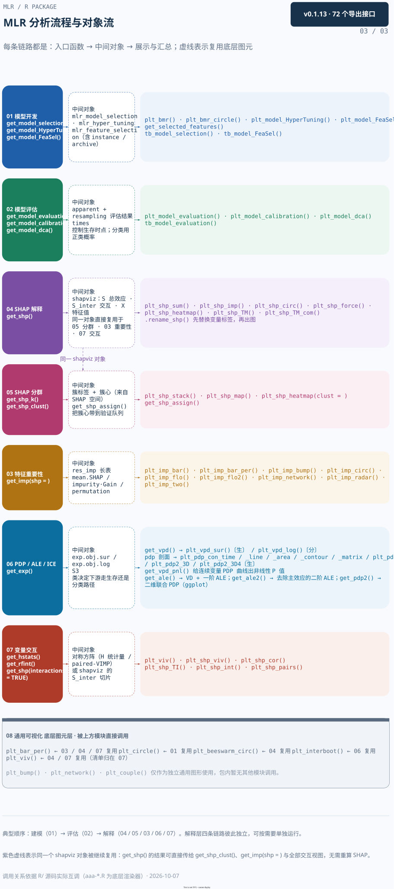

机器学习模型开发与解释：特征选择、评估、重要性、SHAP、PDP / ICE 和变量交互。

本页集中展示三张图：先看功能总览，再查接口索引，最后看处理流程与返回对象。**点击图片可放大查看**，也可下载图源继续编辑。

[下载 draw.io 图源](../assets/module-maps/mlr/mlr-package-mindmap.drawio){.btn .btn-outline-primary download="mlr-package-mindmap.drawio"}
[下载三页 PDF](../assets/module-maps/mlr/mlr-package-mindmap.drawio.pdf){.btn .btn-outline-secondary download="mlr-package-mindmap.drawio.pdf"}

图谱快照：**2026-09-12**。对应包版本：**0.1.13**。具体参数和返回值以当前安装版本的帮助页为准。

## 功能总览

{width=100% fig-alt="MLR 的功能总览；点击图片可放大阅读。"}

[查看原尺寸 PNG](../assets/module-maps/mlr/mlr-package-mindmap-p1.drawio.png)

## 完整函数索引

{width=100% fig-alt="MLR 的完整函数索引；点击图片可放大阅读。"}

[查看原尺寸 PNG](../assets/module-maps/mlr/mlr-package-mindmap-p2.drawio.png)

## 分析流程与对象流

{width=100% fig-alt="MLR 的分析流程与对象流；点击图片可放大阅读。"}

[查看原尺寸 PNG](../assets/module-maps/mlr/mlr-package-mindmap-p3.drawio.png)

三页分别用于了解模块分工、定位公共接口和衔接输入输出。图中的流程分支按具体任务选择。
