`get_model_HyperTuning()` 把搜索空间、内层重采样、最优学习器与可选的外层验证组织在一起。11 张实际图比较两个重要森林参数以及搜索和显示设置。

**版本与执行范围：** 按 MLR 0.1.13 当前源码核对，使用 WSL R 4.4.3 实际导出本页 **11 张参数对照图**。模拟二分类数据，实际运行三次小规模调参流程；所有图来自公共返回对象，搜索归档与插值显示明确区分。


## 示例准备与读图规则 {#data}

使用固定种子的 300 行模拟二分类数据，与 [变量分布页](vpd-guide.qmd) 的分类示例相同。正类为 Yes，四个特征为 Age、Sex、Marker、Group。固定 ranger 的 num.trees = 80、num.threads = 1，只调 mtry 和 min.node.size；优化 ROC AUC。

```r
library(MLR)
library(ggplot2)
set.seed(246)
n <- 300L
dc <- data.frame(Age = runif(n, 20, 85),
  Sex = factor(sample(c("Female", "Male"), n, TRUE)),
  Marker = rnorm(n), Group = factor(sample(c("A", "B"), n, TRUE)))
prob <- plogis(-0.4 + (dc[["Age"]] - 50) / 20 +
  0.5 * (dc[["Sex"]] == "Male") + 0.8 * dc[["Marker"]] +
  0.7 * dc[["Marker"]] * (dc[["Group"]] == "B"))
dc[["Outcome"]] <- factor(ifelse(runif(n) < prob, "Yes", "No"),
  levels = c("No", "Yes"))
cvars <- c("Age", "Sex", "Marker", "Group")

library(mlr3)
library(mlr3learners)
library(paradox)
task_c <- as_task_classif(dc[, c("Outcome", cvars)],
  target = "Outcome", positive = "Yes", id = "binary_demo")
forest <- lrn("classif.ranger", predict_type = "prob",
  num.trees = 80, num.threads = 1)
space <- paradox::ps(mtry = paradox::p_int(1, 4),
  min.node.size = paradox::p_int(3, 15))
tg <- get_model_HyperTuning(task_c, learner = forest, search_space = space,
  tuner = "grid_search", resolution = 3, n_evals = 9, batch_size = 3,
  inner_resampling = rsmp("cv", folds = 2), backend = "sequential", seed = 246)
tr <- get_model_HyperTuning(task_c, learner = forest, search_space = space,
  tuner = "random_search", n_evals = 9, batch_size = 3,
  inner_resampling = rsmp("cv", folds = 2), backend = "sequential", seed = 246)
tn <- get_model_HyperTuning(task_c, learner = forest, search_space = space,
  tuner = "grid_search", resolution = 2, n_evals = 4, batch_size = 2,
  nested = TRUE, inner_resampling = rsmp("cv", folds = 2),
  outer_resampling = rsmp("cv", folds = 3), backend = "sequential", seed = 246)
```


## 接口、返回对象与分析流程 {#interface}

返回 `mlr_hyper_tuning`（另带任务类别）：`instance` / `archive` 保留搜索对象和配置；`best_params`、`best_learner_param_vals`、`best_score` 保留最佳结果；`learner` 是用全数据训练的最终学习器。嵌套时还提供 nested_result、inner_archives、outer_scores 和 parameter_stability。

全数据内层搜索的最高 best_score 用于选择配置，存在选择偏差。`nested = TRUE` 在各外层训练折重新调参，用外层留出预测评估整个流程；最后仍会得到全数据上的最终模型。外层分数不等同最终全数据模型的外部验证。

| plt_model_HyperTuning 的 type | 内容 |
|:--|:--|
| auto | 一参数选 marginal；二参数网格选 heatmap、其他搜索选 points；更多参数选 performance |
| heatmap / points | 实际评估配置的分数 |
| surface | 插值后的二维显示，叠加已评估配置 |
| marginal | 按参数查看已评估配置 |
| performance | 搜索进度与最佳分数演化 |
| outer_performance / parameter_stability | 嵌套外层的性能和配置选择变化 |

所有 type 返回 ggplot；后两种需要 nested = TRUE。二维图的 params 必须指定两项已搜索参数，marginal 可以只选一项。

## 搜索策略与配置分数

本页固定正类 Yes、ROC AUC 和 2 折内层 CV。网格搜索与随机搜索均用较小预算；最佳配置是此重采样方案的结果。

::: {.panel-tabset}


### 自动选择热图 {.unnumbered}


二维 grid_search 的 auto 使用热图，每格对应实际评估的配置。


```r
plt_model_HyperTuning(tg, type = "auto")
```


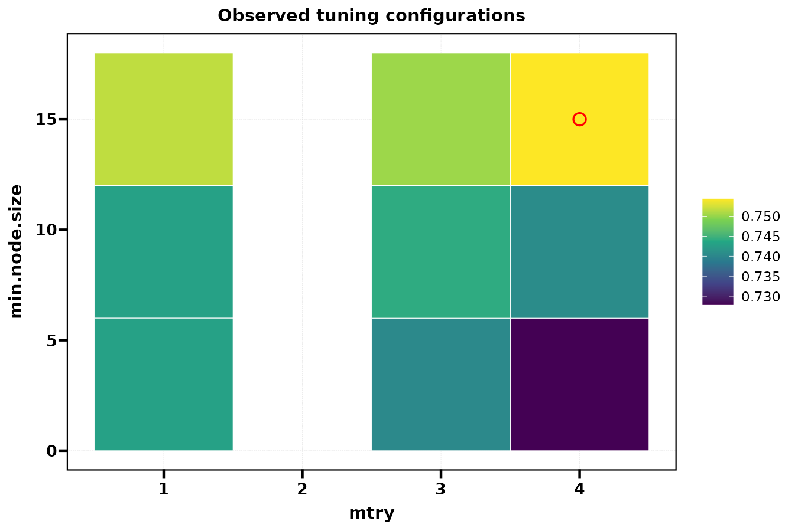{fig-alt="二维 grid_search 的 auto 使用热图，每格对应实际评估的配置。"}


### 交换参数轴 {.unnumbered}


通过 params 调整横纵轴顺序，不改变归档中的分数。


```r
plt_model_HyperTuning(tg, type = "heatmap", params = c("min.node.size", "mtry"))
```


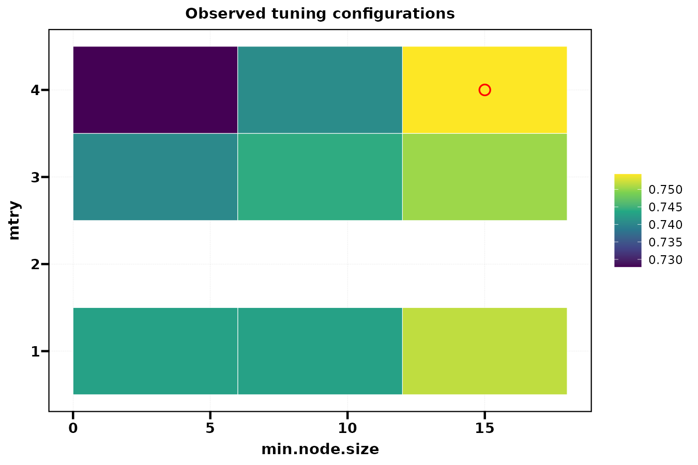{fig-alt="通过 params 调整横纵轴顺序，不改变归档中的分数。"}


### 配置散点 {.unnumbered}


相同九组配置用散点表示，大小和颜色对应指标。


```r
plt_model_HyperTuning(tg, type = "points")
```


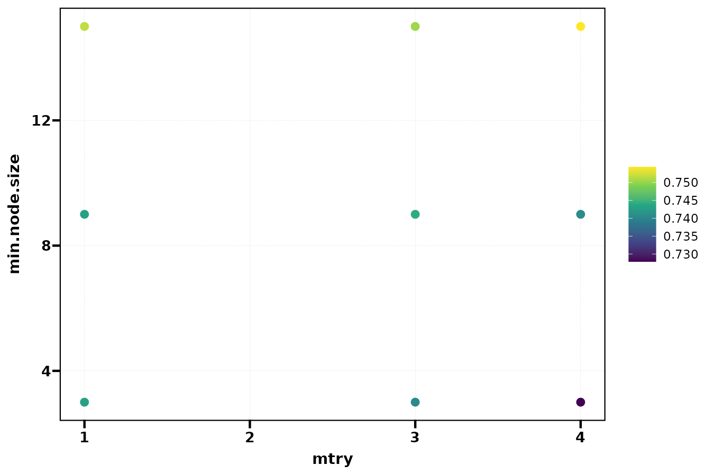{fig-alt="相同九组配置用散点表示，大小和颜色对应指标。"}


### 随机搜索 {.unnumbered}


二维 random_search 的 auto 使用实际配置散点；随机样本可能覆盖不均。


```r
plt_model_HyperTuning(tr, type = "auto")
```


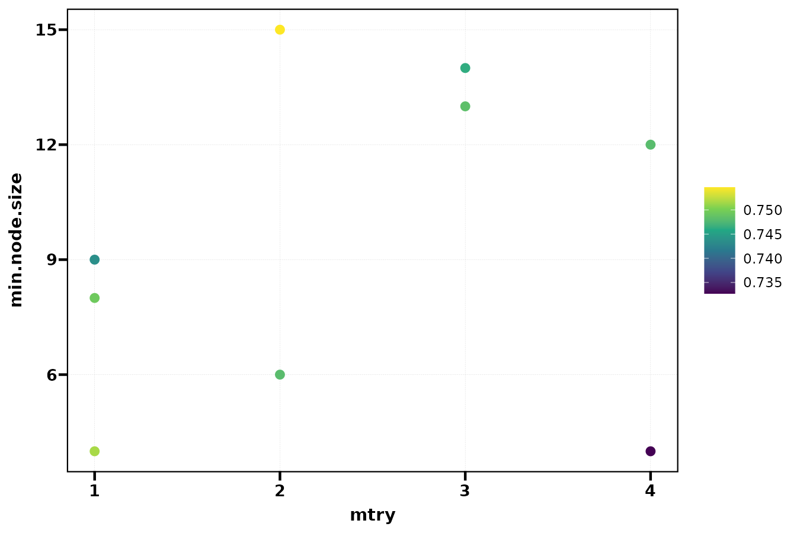{fig-alt="二维 random_search 的 auto 使用实际配置散点；随机样本可能覆盖不均。"}


:::


## 插值密度与边际图

surface 返回 ggplot 的插值显示；原始搜索结果仍只有九组配置。不能把更细 grid_resolution 当成更大搜索预算。

::: {.panel-tabset}


### 25 × 25 插值 {.unnumbered}


曲面型显示使用插值网格；网格点不是新增模型评估。


```r
plt_model_HyperTuning(tg, type = "surface", grid_resolution = 25)
```


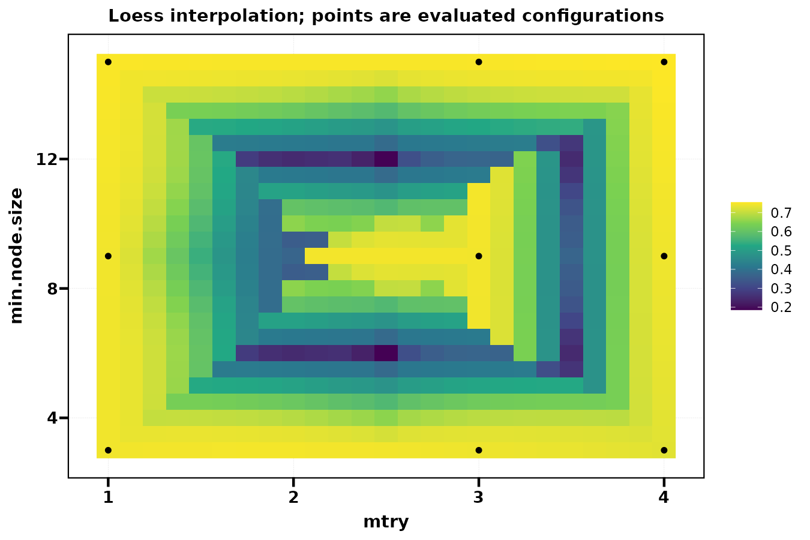{fig-alt="曲面型显示使用插值网格；网格点不是新增模型评估。"}


### 75 × 75 与统一色标 {.unnumbered}


细化显示并显式统一分数色标，以便跨图比较。


```r
plt_model_HyperTuning(tg, type = "surface", grid_resolution = 75, score_limits = c(0.6, 0.85))
```


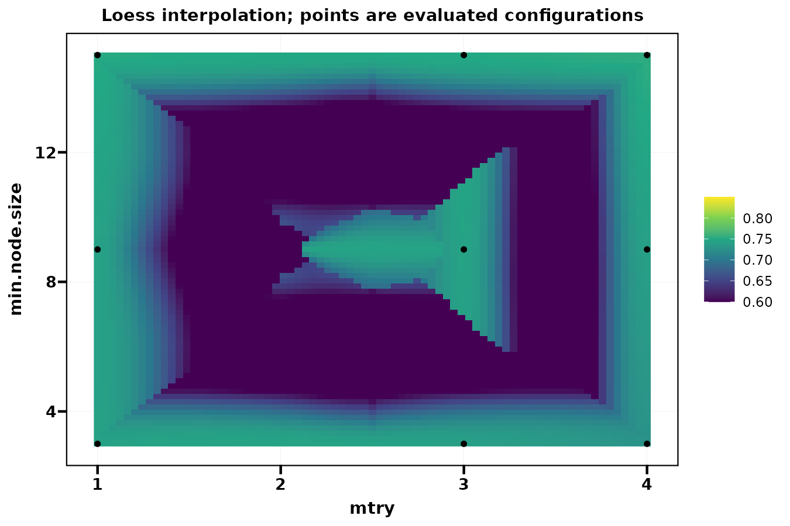{fig-alt="细化显示并显式统一分数色标，以便跨图比较。"}


### 所有参数边际 {.unnumbered}


对各参数展示配置分数，需要同时考虑其他参数的组合。


```r
plt_model_HyperTuning(tg, type = "marginal")
```


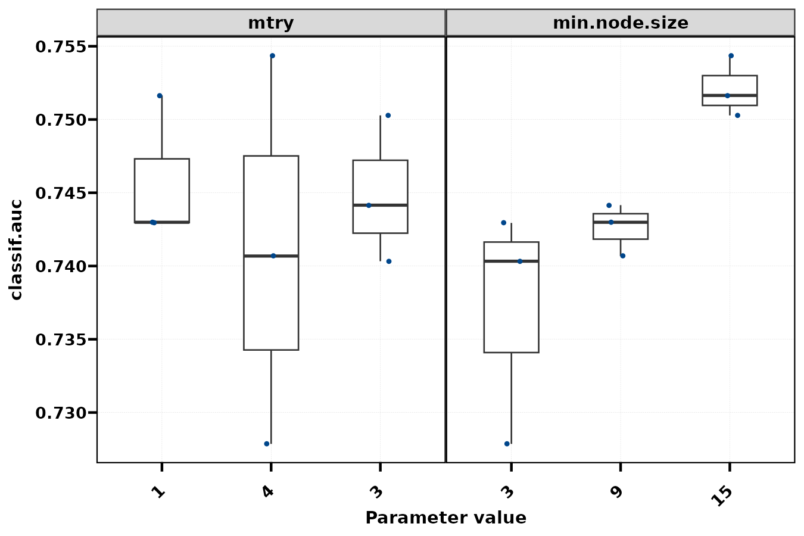{fig-alt="对各参数展示配置分数，需要同时考虑其他参数的组合。"}


### 仅 mtry {.unnumbered}


params 选择一个变量；不是因果边际效应。


```r
plt_model_HyperTuning(tg, type = "marginal", params = "mtry")
```


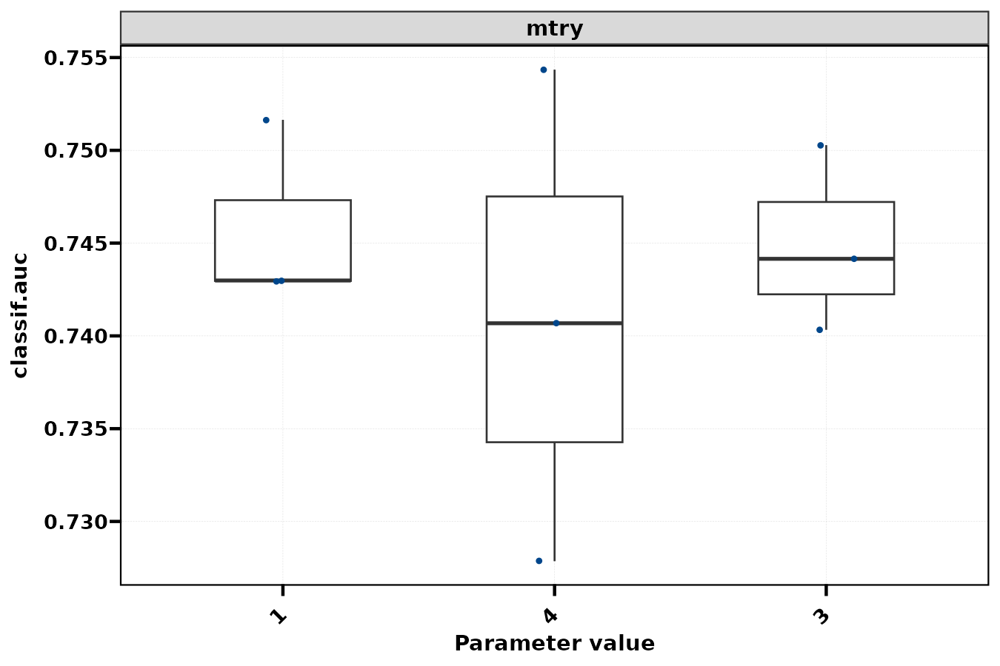{fig-alt="params 选择一个变量；不是因果边际效应。"}


:::


## 预算进度与嵌套验证

nested = TRUE 在每个外层训练集重新调参，用外层留出集估计整个调参流程的性能。它还会生成全数据上的最终调参结果。

::: {.panel-tabset}


### 预算进度 {.unnumbered}


观察已评估配置和当前最优分数，避免把最高点作为验证性能。


```r
plt_model_HyperTuning(tr, type = "performance")
```


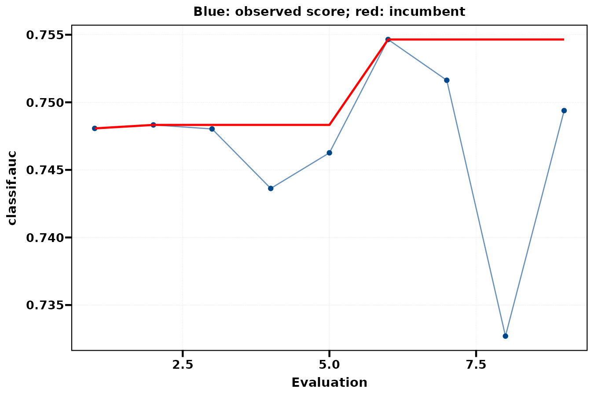{fig-alt="观察已评估配置和当前最优分数，避免把最高点作为验证性能。"}


### 外层性能 {.unnumbered}


三个外层分数只演示接口；正式分析需要足够重复次数。


```r
plt_model_HyperTuning(tn, type = "outer_performance")
```


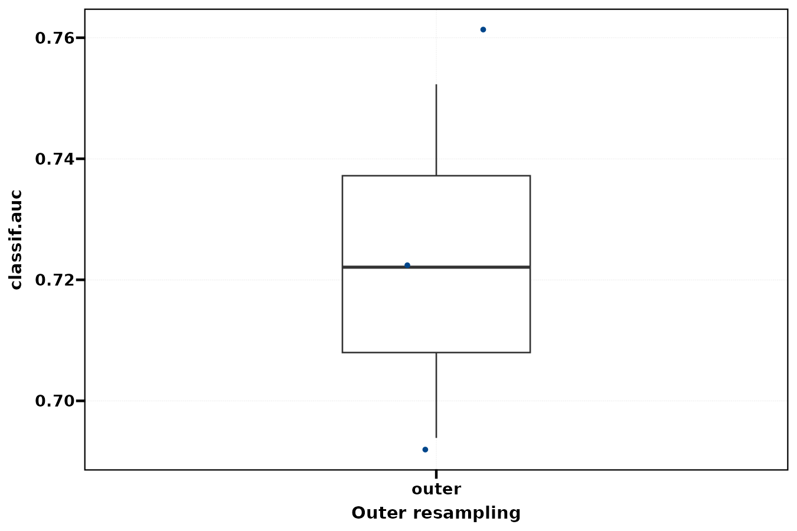{fig-alt="三个外层分数只演示接口；正式分析需要足够重复次数。"}


### 参数稳定性 {.unnumbered}


外层各折最优参数可不同，说明选择对样本划分的依赖。


```r
plt_model_HyperTuning(tn, type = "parameter_stability")
```


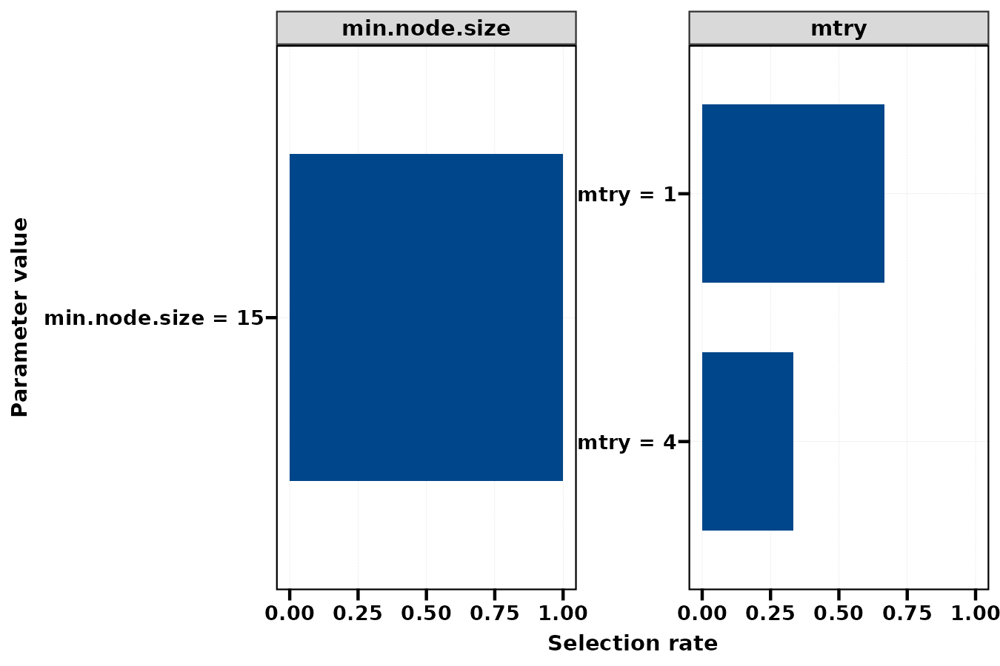{fig-alt="外层各折最优参数可不同，说明选择对样本划分的依赖。"}


:::


## 参数调整、保存与使用边界 {#parameters}

| 参数 | 控制层次 | 使用提示 |
|:--|:--|:--|
| search_space | 参数名称、类型与范围 | 使用 paradox::ps；与学习器公开参数一致 |
| tuner / resolution / n_evals | 搜索策略和计算预算 | 二维网格每轴 3 值，本例评估九组；随机搜索九组 |
| batch_size / terminator | 批次与停止规则 | 显式 terminator 可覆盖默认停止设置 |
| inner_resampling / measure | 配置打分 | 本例 2 折 CV 与二分类默认 AUC |
| nested / outer_resampling | 调参流程评估 | 本例三个外层折仅作演示 |
| params | 配置图选择参数和轴顺序 | 不会新增评估 |
| grid_resolution | surface 插值显示密度 | 25 与 75；与搜索 resolution 不同 |
| score_limits | 统一图形色标/显示尺度 | 不改变归档中原始分数 |

surface 的颜色是插值结果，稀疏九点可能产生人工谷底或边缘形状；应同时读 heatmap / points 的实际配置。边际图也包含其他参数组合的影响，不能当作参数的单独因果作用。

```r
tg[["best_params"]]
tg[["best_learner_param_vals"]]
tg[["archive"]]
tn[["outer_scores"]]
p <- plt_model_HyperTuning(tg, type = "heatmap")
ggplot2::ggsave("tuning-grid.pdf", p, width = 9, height = 6)
```

增加搜索参数、resolution 或嵌套层数会成倍增加训练次数。并行与 GPU 的收益取决于学习器，教程用顺序运行和单线程森林控制资源。生存任务默认指标是 C-index，分类自动改为 AUC，并要求正类概率。

## 相关页面与源码 {#references}

- [模型与缺失处理筛选](model-selection-guide.qmd)
- [特征筛选](feature-selection-guide.html)
- [模型评估](model-evaluation-guide.html)
- [MLR 调优源码](https://github.com/HUI950319/MLR/blob/master/R/hyper-tuning.R)
- [mlr3tuning 官方文档](https://mlr3tuning.mlr-org.com/)

本页图片来自上面的实际公共调用。使用固定示例、固定随机种子和注明的小规模设置，图形用于学习接口及解释预测结果。
grid_search、random_search 与 nested 三条路径实际完成，11 张图通过 ggplot 构建和 PNG 导出。参数图、插值密度与外层稳定性均来自公开入口。
