本页先说明 `get_imp()` 如何组织多种重要性，再用同一份结果比较全部 9 个 `plt_imp_*()` 函数。关键选项放在标签页中，代码与图片相邻；点击图片可放大。重要性回答变量对预测贡献有多大，方向与个体解释接着看 [SHAP 页](shap-guide.qmd)。

**版本与执行范围：** 按 MLR 0.1.13 当前源码核对，使用 WSL R 4.4.3 实际导出本页 **25 张参数对照图**。绘图复用 ToyData::toy_imp，没有重新训练 get_imp 的模型。环形图按实际基础绘图设备导出；其余图检查构建或实际保存边界。


## 示例准备与读图规则 {#data}

`toy_imp` 含 **15 个变量 × 3 种方法 = 45 行**。所有图复用原始数值；圆形网络和雷达图使用 `imp8`，按 SHAP 排名前八项取出相同变量集合。

| 字段 | 用途 | 读图规则 |
|:--|:--|:--|
| `var` | 原始变量名 | 三种方法之间按名称对应 |
| `imp_type` | mean.SHAP、impurity、permutation | 每个方法各有自己的原始单位 |
| `yhat_raw` | 原始重要性 | 保留方法的实际幅度 |
| `yhat` | 方法内部 min–max 值 | 映射到 0–1；不是解释方差 |
| `order` | 方法内部排名 | 第一名是本方法最重要的变量 |

百分比图优先使用非负 `yhat_raw`，原始值缺失或全部非正时回退到 `yhat`。筛选到八个变量之后，份额以这八项为分母。变量名称用自定义标签覆盖，避免把图中名称映射当作疾病定义。

```r
library(MLR)
library(ToyData)
library(ggplot2)

imp <- ToyData::toy_imp
labels <- setNames(gsub("_", " ", unique(imp[["var"]])),
                   unique(imp[["var"]]))
shap_vars <- imp[["var"]][imp[["imp_type"]] == "mean.SHAP"]
imp8 <- imp[imp[["var"]] %in% head(shap_vars, 8), ]
```


## 2026-10-09：当前默认森林与重新计算示例 {#current-importance}

按 MLR 0.1.13 源码 `95d3204` 核对，`get_imp()` 的 ranger 路径现在使用 **300 棵树**，此前为 500 棵。减少树数会影响随机森林近似和重要性排序，不能当成只改变运行时间。这个数量是内部设置，不是当前 `get_imp()` 的公开参数。

缺少 Python SHAP 后端时，treeshap 路径可复用已训练的 impurity 森林；置换重要性仍使用相应模型设置。按工作量选择线程和保留调用者 RNG 的加载处理属于计算优化，不改变各重要性的定义。

原有图使用 `ToyData::toy_imp` 的保存表，展示布局与绘图参数；它们不代表当前默认森林重新拟合的结果。下面另用 300 行合成二分类数据实际运行当前 `get_imp()`，在 WSL R 4.4.3 中计算并导出图形。

```r
library(MLR)
library(ggplot2)
set.seed(246)
n <- 300L
dc <- data.frame(Age = runif(n, 20, 85),
  Sex = factor(sample(c("Female", "Male"), n, TRUE)),
  Marker = rnorm(n), Group = factor(sample(c("A", "B"), n, TRUE)))
prob <- plogis(-0.4 + (dc[["Age"]] - 50) / 20 +
  0.5 * (dc[["Sex"]] == "Male") + 0.8 * dc[["Marker"]] +
  0.7 * dc[["Marker"]] * (dc[["Group"]] == "B"))
dc[["Outcome"]] <- factor(ifelse(runif(n) < prob, "Yes", "No"),
  levels = c("No", "Yes"))
cvars <- c("Age", "Sex", "Marker", "Group")

imp_current <- get_imp(dc, vars = cvars, surv = "Outcome", model = "ranger")
plt_imp_bar(imp_current, display = "b")
```

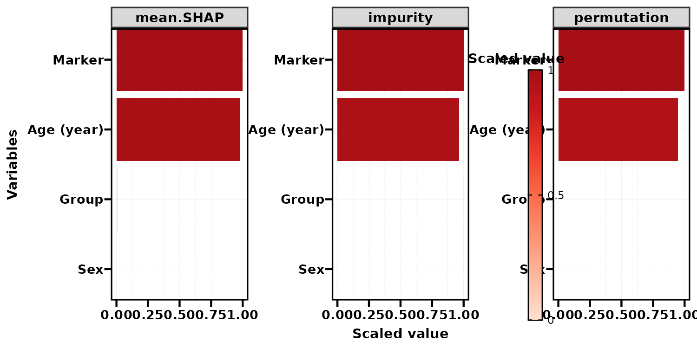{fig-alt="合成二分类队列的当前 ranger 重要性，分别显示平均绝对 SHAP、impurity 和 permutation，使用当前 300 棵树设置。"}

`yhat_raw` 保留各方法的原始值，`yhat` 在每个类型内缩放。不同方法的单位与定义不同，不能把缩放后的大小当成同一统计量，也不能据此确定变量的因果作用。旧版本的计时见 [2026-10-06 性能记录](../regr/mlr-imp-speedup-20261006.qmd)。

## 接口、返回对象与分析流程 {#interface}

`get_imp()` 按 `surv` 类型与模型分派：逻辑值进入生存任务，字符值指定二分类结局列。生存路径读取 `time` / `DSS`；`surv = FALSE` 仍进入生存路径。

| 模型 | 原生重要性 | 共用方法 | 编码 |
|:--|:--|:--|:--|
| ranger | impurity | mean.SHAP、permutation | 分类特征保留因子 |
| xgboost | gain | mean.SHAP、permutation | 生存仅 onehot；二分类可 onehot / target |

`get_imp()` 返回长格式数据框，计算过程中还会打印柱形组合、标准和带间隙流向图。它不返回一个装满图的 list。提供 `shp` 会复用平均绝对 SHAP；XGBoost 仍训练模型以计算 Gain 和 permutation。只有数据、变量和预测目标相匹配时才应复用 SHAP。

原生重要性、置换后的性能损失与平均绝对 SHAP 具有不同定义；0–1 缩放方便查看排序，不能据此把三种方法的原始大小作等量比较。

```r
get_imp(data, vars, surv = TRUE, shp = NULL,
        model = c("ranger", "xgboost"),
        boosting_encoding = c("onehot", "target"))

# 重新计算时传自己的数据；下面只展示写法，本页未执行。
# res <- get_imp(d, vars = c("Age", "Sex", "T_stage"), surv = TRUE)
```


## `plt_imp_bar()`：柱形与棒棒糖

`display` 只改变图形几何；`yhat` 是每个方法内部的 min–max 值，不能把不同方法的同一高度当成相同原始贡献。

::: {.panel-tabset}


### 棒棒糖 {.unnumbered}


三种方法分别显示其 0–1 归一化重要性。


```r
plt_imp_bar(imp, display = "l", add_name = labels)
```


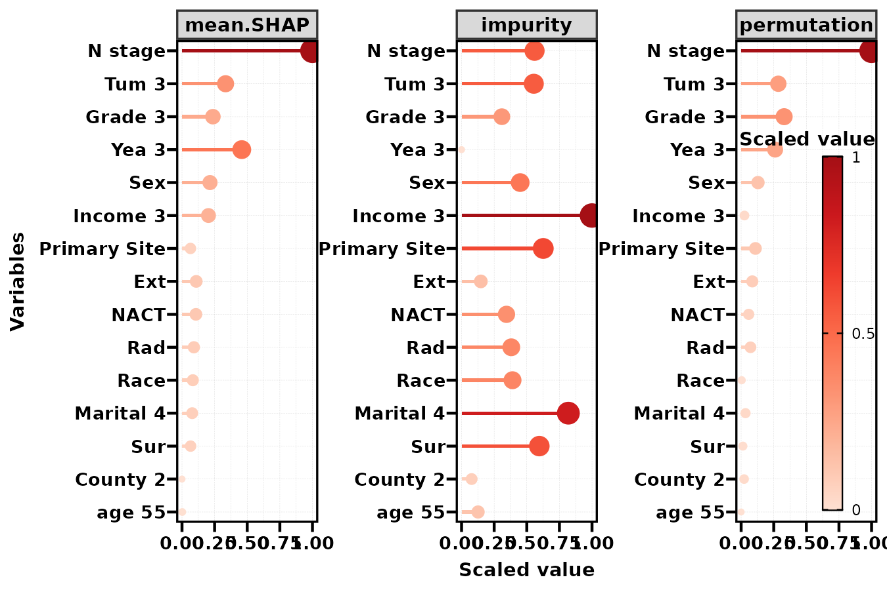{fig-alt="三种方法分别显示其 0–1 归一化重要性。"}


### 实心柱形 {.unnumbered}


同一结果切换为柱形，方法内部的排序和数值保持一致。


```r
plt_imp_bar(imp, display = "b", add_name = labels)
```


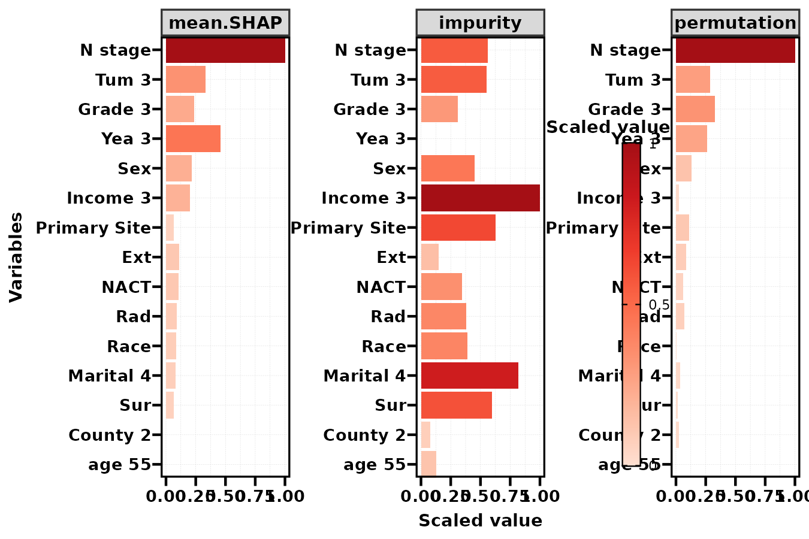{fig-alt="同一结果切换为柱形，方法内部的排序和数值保持一致。"}


:::


## `plt_imp_bar_per()`：五种组合模式

`mode` 覆盖单独条形、单环、双环和两种组合；`bar_display` 控制棒棒糖/柱形，`bar_per_palette` 分别控制条形与环图配色。

::: {.panel-tabset}


### bar {.unnumbered}


mode = bar；百分比优先用非负原始重要性计算。


```r
plt_imp_bar_per(imp, mode = "bar", add_name = labels)
```


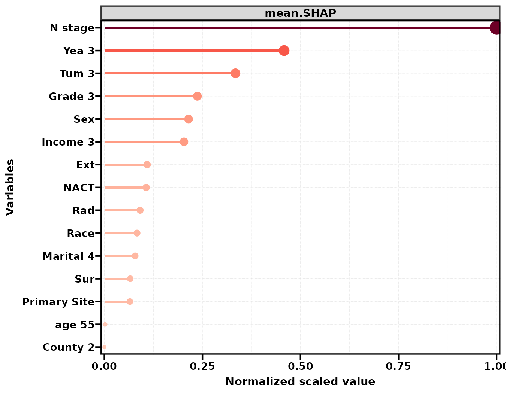{fig-alt="mode = bar；百分比优先用非负原始重要性计算。"}


### per {.unnumbered}


mode = per；百分比优先用非负原始重要性计算。


```r
plt_imp_bar_per(imp, mode = "per", add_name = labels)
```


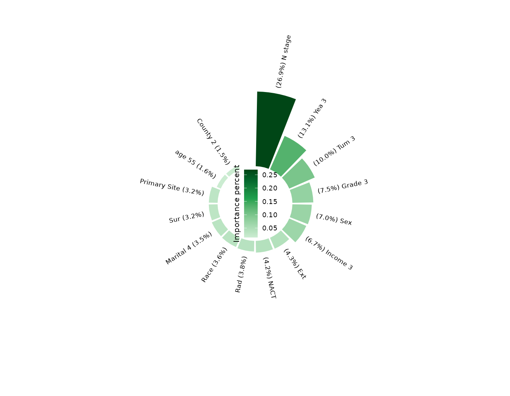{fig-alt="mode = per；百分比优先用非负原始重要性计算。"}


### per2 {.unnumbered}


mode = per2；百分比优先用非负原始重要性计算。


```r
plt_imp_bar_per(imp, mode = "per2", add_name = labels)
```


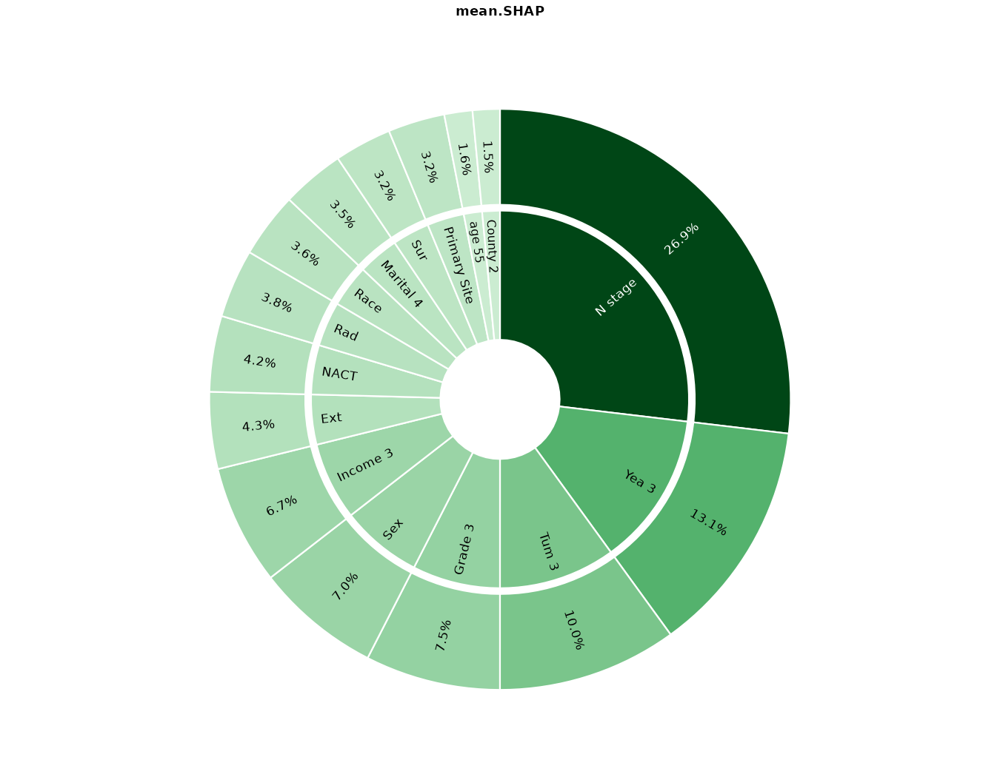{fig-alt="mode = per2；百分比优先用非负原始重要性计算。"}


### bar_per {.unnumbered}


mode = bar_per；百分比优先用非负原始重要性计算。


```r
plt_imp_bar_per(imp, mode = "bar_per", add_name = labels)
```


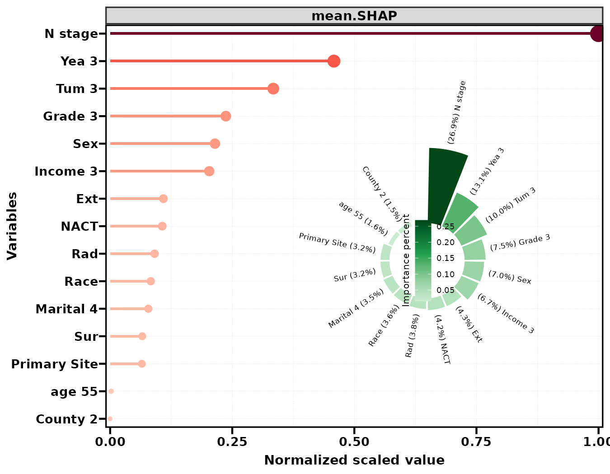{fig-alt="mode = bar_per；百分比优先用非负原始重要性计算。"}


### bar_per2 {.unnumbered}


mode = bar_per2；百分比优先用非负原始重要性计算。


```r
plt_imp_bar_per(imp, mode = "bar_per2", add_name = labels)
```


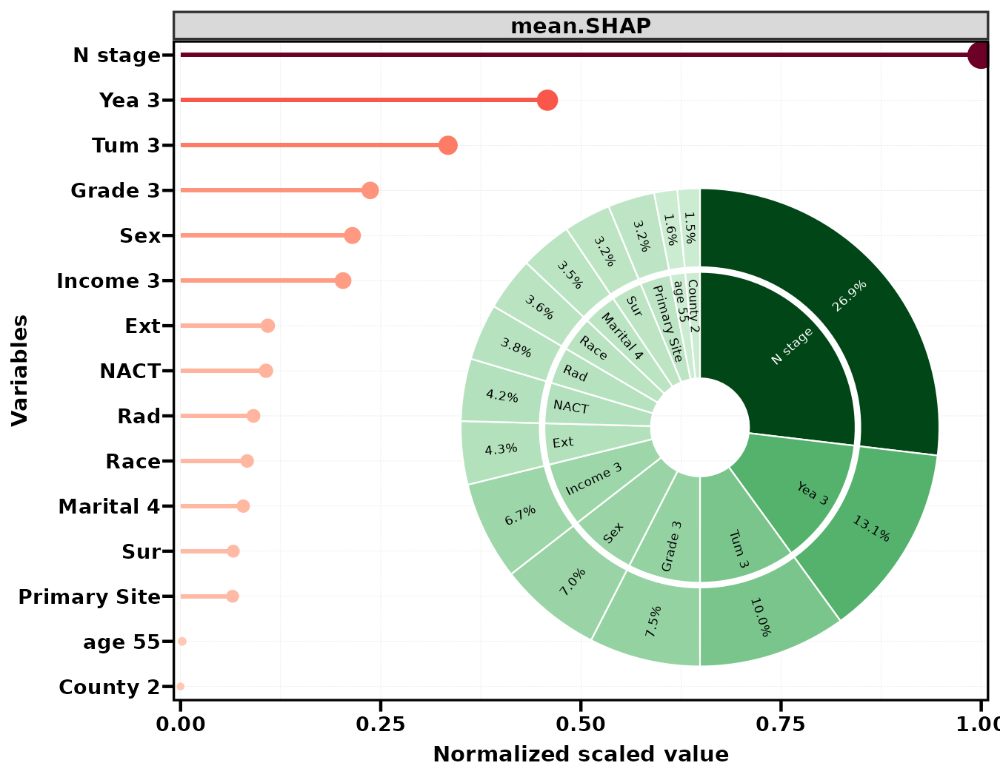{fig-alt="mode = bar_per2；百分比优先用非负原始重要性计算。"}


:::


## `plt_imp_bar_per()`：方法、配色与布局

方法选择和变量删减会改变比较集合；`per_position` 只改变插图位置。

::: {.panel-tabset}


### 选择与排列方法 {.unnumbered}


只选 permutation、mean.SHAP，并按所给顺序组成面板。


```r
plt_imp_bar_per(imp, imp_type = c("permutation", "mean.SHAP"), mode = "bar", bar_display = "b", add_name = labels)
```


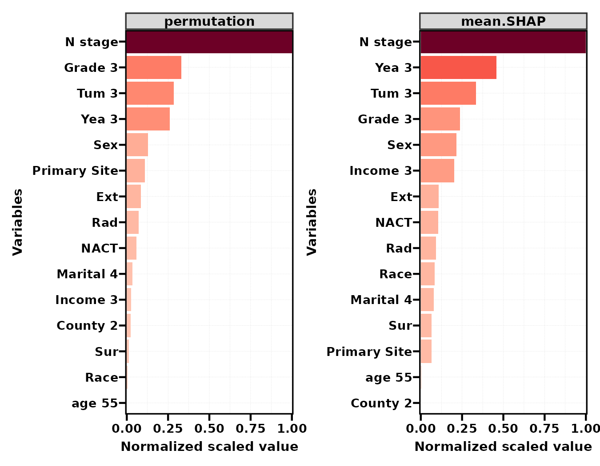{fig-alt="只选 permutation、mean.SHAP，并按所给顺序组成面板。"}


### 配色与插图位置 {.unnumbered}


蓝色柱形配橙色双环；移动并缩小插图，为变量标签留空间。


```r
plt_imp_bar_per(imp, mode = "bar_per2", bar_display = "b", bar_per_palette = c("Blues", "Oranges"), per_position = c(0.36, 0.07, 0.62, 0.8), add_name = labels)
```


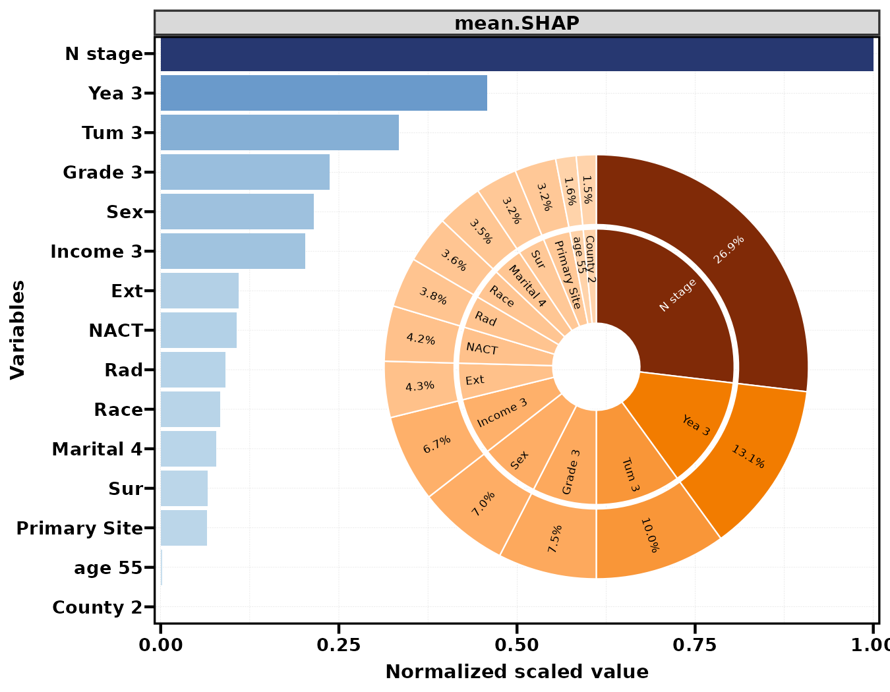{fig-alt="蓝色柱形配橙色双环；移动并缩小插图，为变量标签留空间。"}


:::


## `plt_imp_flo()`：标准流向图

流线表示变量的对应关系，不表示患者流动，也不是因果路径。

流线追踪同一变量在三种重要性方法间的排序变化。


```r
plt_imp_flo(imp, add_name = labels)
```


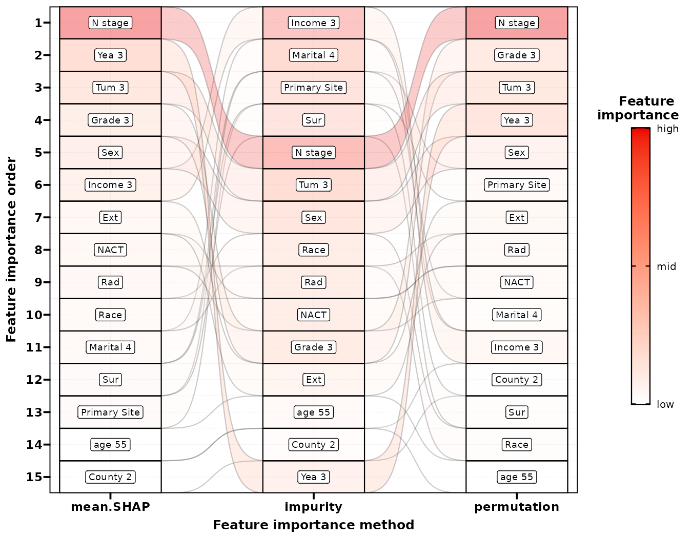{fig-alt="流线追踪同一变量在三种重要性方法间的排序变化。"}


## `plt_imp_flo2()`：高度、颜色与间隙

至少选择两个方法。`height_by` 控制条块高度；`color_by = first` 沿用第一个方法的颜色，便于追踪变量。`gap` 是条块间隙。

::: {.panel-tabset}


### 按百分比分配高度 {.unnumbered}


height_by = pct、color_by = method；每个方法按自己的份额着色。


```r
plt_imp_flo2(imp, add_name = labels, label.size = 2.5, base.size = 12)
```


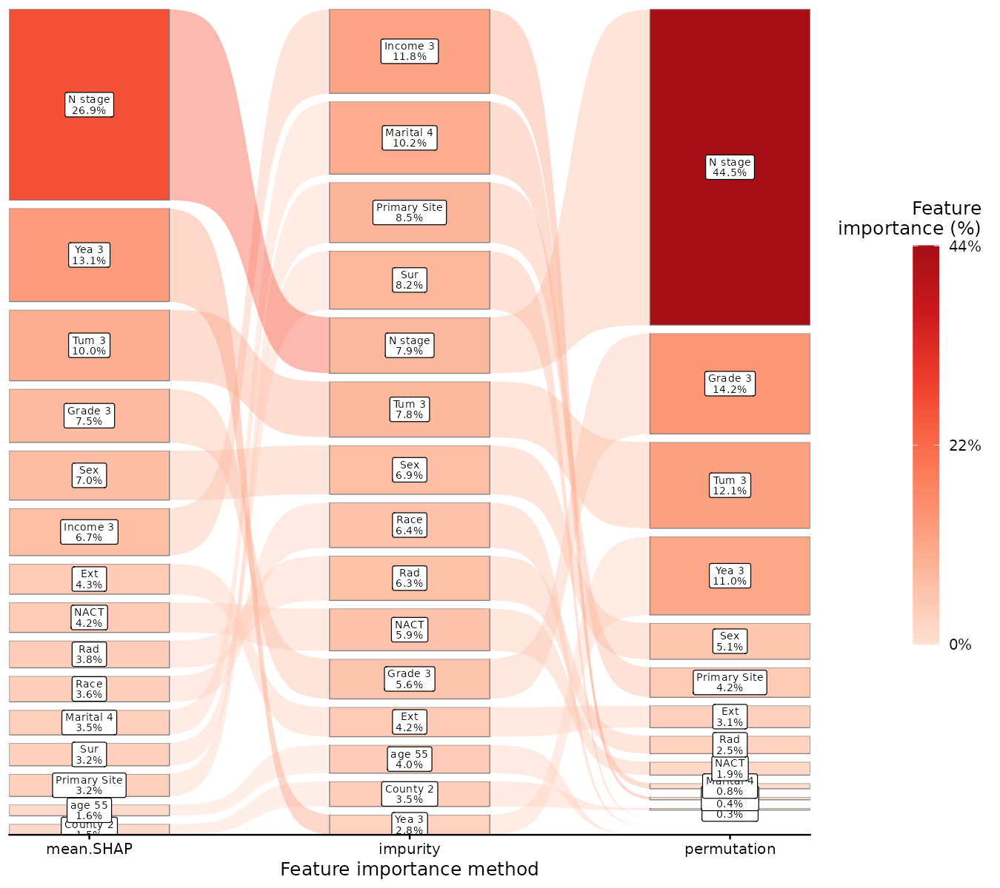{fig-alt="height_by = pct、color_by = method；每个方法按自己的份额着色。"}


### 等高与固定颜色 {.unnumbered}


所有变量等高，颜色沿用第一个方法，隐藏百分比文字。


```r
plt_imp_flo2(imp, height_by = "equal", color_by = "first", pct.style = "none", add_name = labels, label.size = 2.5, base.size = 12)
```


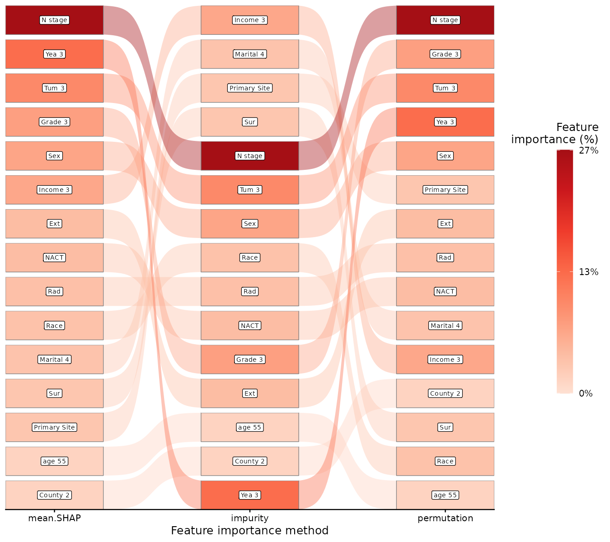{fig-alt="所有变量等高，颜色沿用第一个方法，隐藏百分比文字。"}


### 两方法、直线与大间隙 {.unnumbered}


改变方法顺序、曲线类型和留白；对应关系仍由变量名称决定。


```r
plt_imp_flo2(imp, imp_type = c("permutation", "mean.SHAP"), gap = 0.025, curve.type = "linear", pct.style = "pct", add_name = labels, label.size = 2.5, base.size = 12)
```


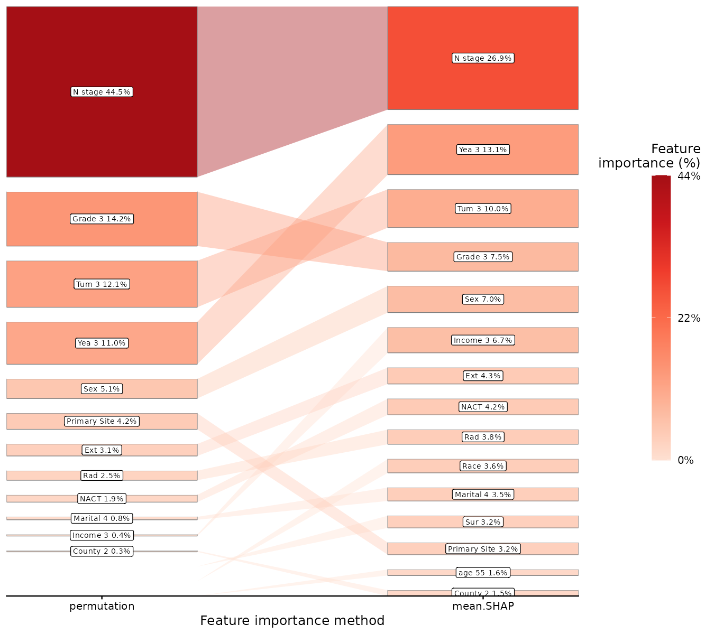{fig-alt="改变方法顺序、曲线类型和留白；对应关系仍由变量名称决定。"}


:::


## `plt_imp_two()`：排名一致性

此图比较排名，不比较原始重要性幅度；`imp_type = NULL` 展示所有方法对。

::: {.panel-tabset}


### 指定两个方法 {.unnumbered}


横纵轴是排名；偏离对角线表示排序不一致。


```r
plt_imp_two(imp, imp_type = c("mean.SHAP", "permutation"), add_name = labels)
```


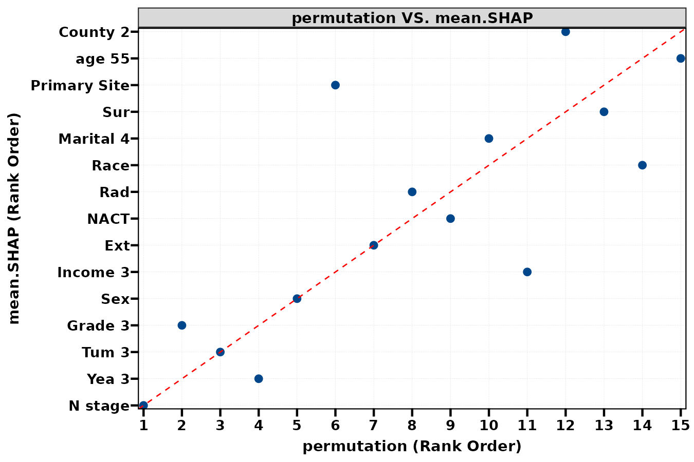{fig-alt="横纵轴是排名；偏离对角线表示排序不一致。"}


### 全部方法对 {.unnumbered}


全部三对排名比较使用同一输入。


```r
plt_imp_two(imp, imp_type = NULL, add_name = labels)
```


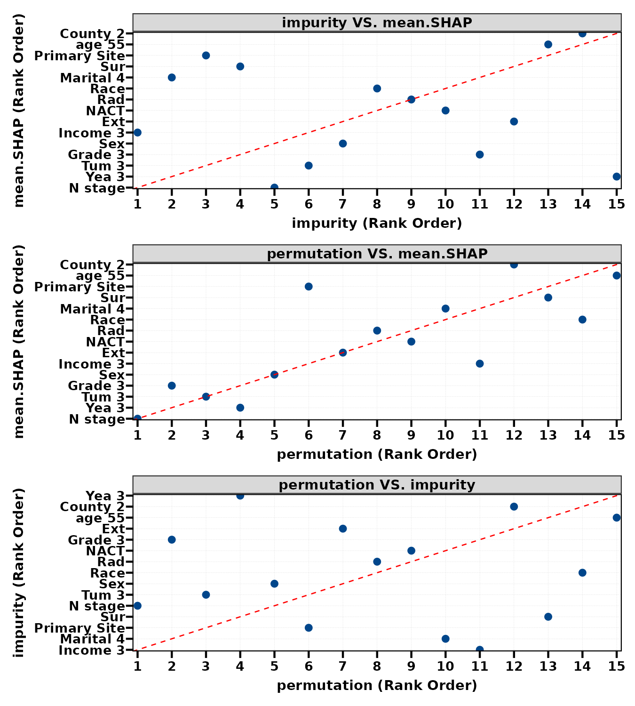{fig-alt="全部三对排名比较使用同一输入。"}


:::


## `plt_imp_bump()`：变量数量与数字显示

`value_type` 控制节点附近的数字；`reverse_y = TRUE` 让第一名在上方。它们不会重新估计重要性。

::: {.panel-tabset}


### 前八项与归一化值 {.unnumbered}


top_n 依据第一种方法选取变量；方法变换后仍追踪同一集合。


```r
plt_imp_bump(imp, top_n = 8, add_name = labels, bump_args = list(value_size = 10, rank_label_size = 10, group_label_size = 10, rank_circle_size = 6, point_size = 5))
```


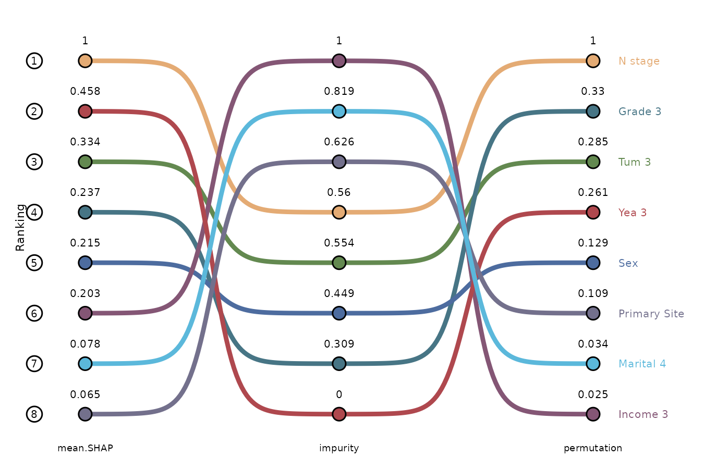{fig-alt="top_n 依据第一种方法选取变量；方法变换后仍追踪同一集合。"}


### 原始值 {.unnumbered}


节点数字切换为 yhat_raw；不同方法的单位与范围各不相同。


```r
plt_imp_bump(imp, top_n = 6, value_type = "raw", add_name = labels, bump_args = list(value_size = 10, rank_label_size = 10, group_label_size = 10, rank_circle_size = 6, point_size = 5))
```


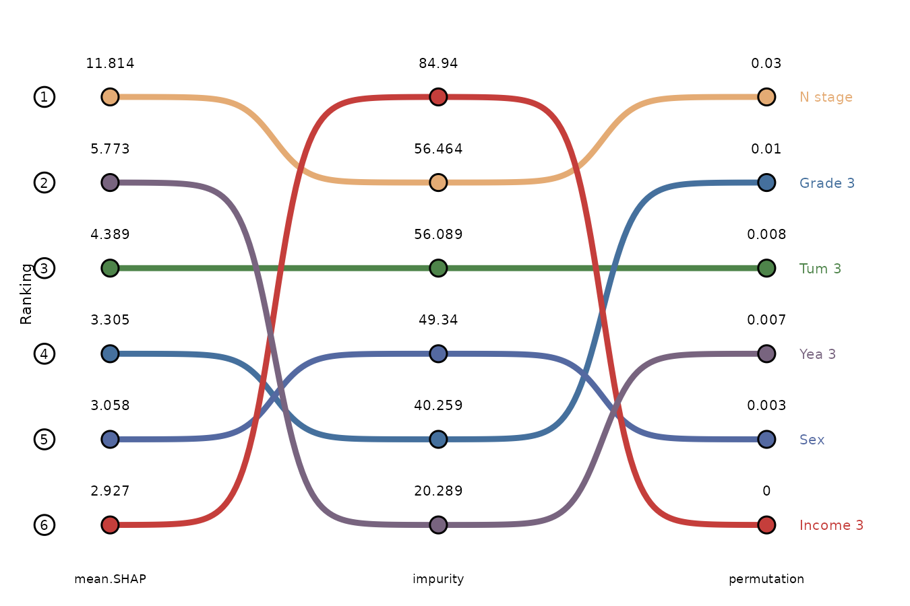{fig-alt="节点数字切换为 yhat_raw；不同方法的单位与范围各不相同。"}


### 隐藏数值与直线连接 {.unnumbered}


降低曲线平滑度并隐藏数值，突出排名路径。


```r
plt_imp_bump(imp, top_n = 8, smooth = 1, add_name = labels, bump_args = list(show_value = FALSE, point_size = 5, rank_label_size = 10, group_label_size = 10, rank_circle_size = 6))
```


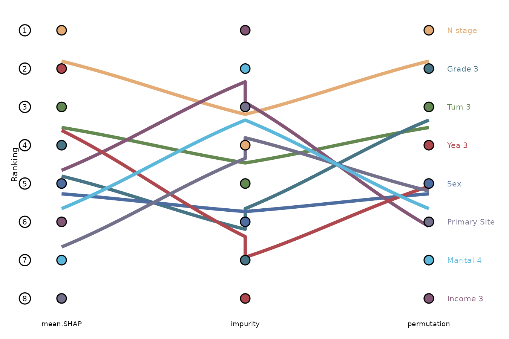{fig-alt="降低曲线平滑度并隐藏数值，突出排名路径。"}


:::


## `plt_imp_circ()`：两方法环形布局

这是 circlize 基础绘图设备输出，不能用 ggplot 的 `+ theme()` 调整。`start_position`、`gap`、`cell.padding` 控制起点与留白。

::: {.panel-tabset}


### 从顶部开始 {.unnumbered}


展示 SHAP 前八项的两方法环形对照；百分比分母是所选八项。


```r
plt_imp_circ(imp8, add_name = labels, cell.padding = c(0.02, 0, 0.02, 0), gap = c(3, 12))
```


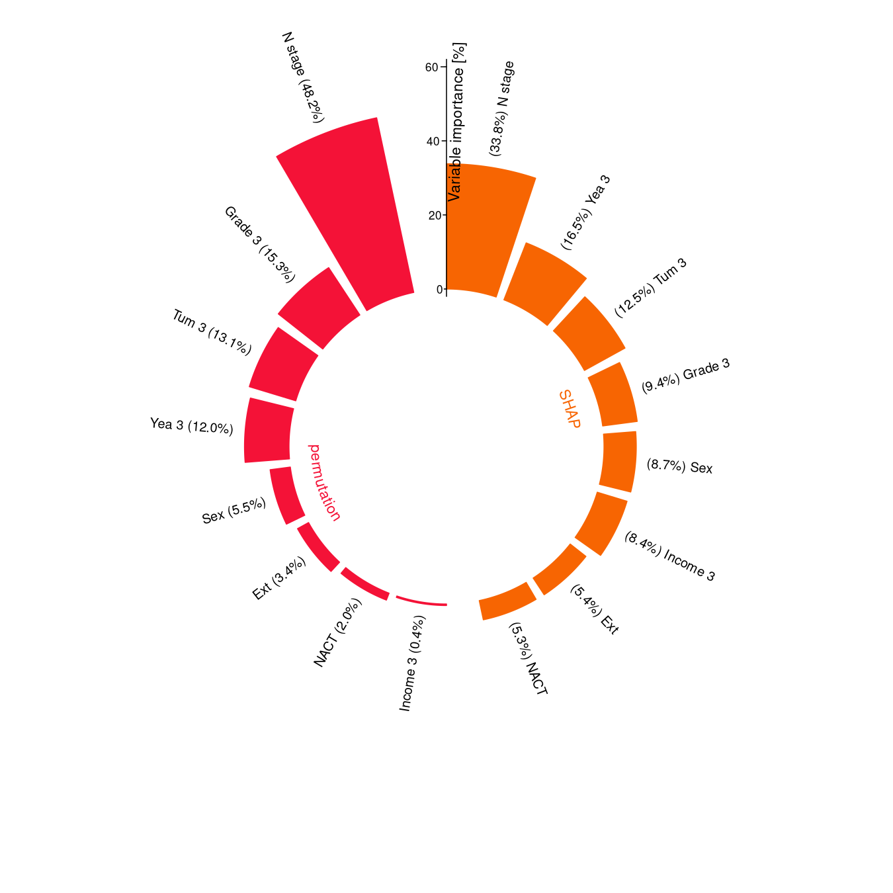{fig-alt="展示 SHAP 前八项的两方法环形对照；百分比分母是所选八项。"}


### 改变起点并隐藏百分比 {.unnumbered}


交换内外方法、从右侧开始，并增加方法组之间的间隔。


```r
plt_imp_circ(imp8, imp_type = c("permutation", "mean.SHAP"), add_name = labels, start_position = "right", show_percent = FALSE, cell.padding = c(0.02, 0, 0.02, 0), gap = c(2, 18))
```


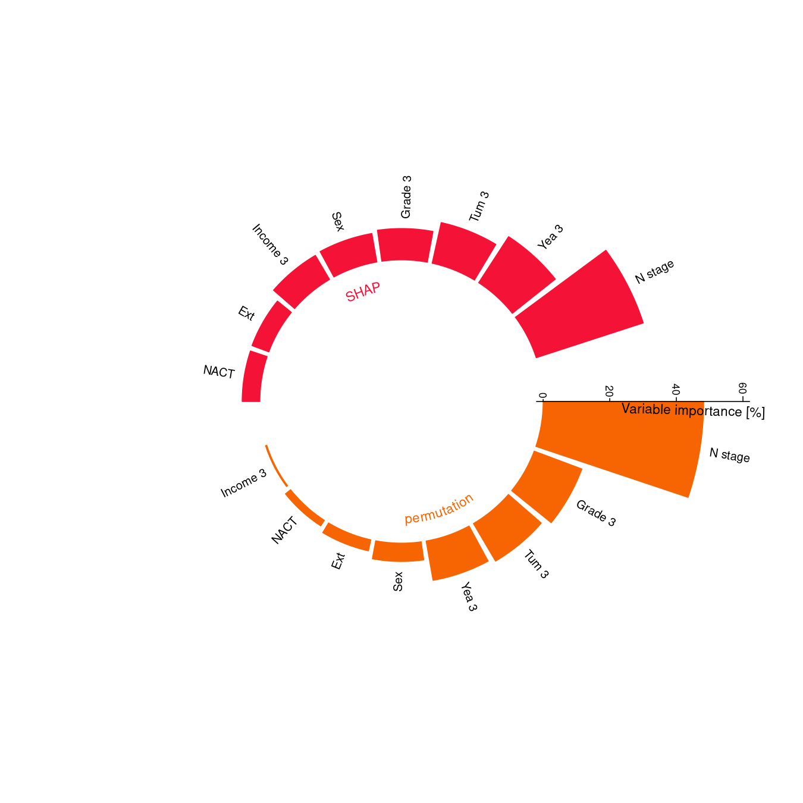{fig-alt="交换内外方法、从右侧开始，并增加方法组之间的间隔。"}


:::


## `plt_imp_network()`：柱形、气泡与百分比

此网络连接的是方法与特征，边不是变量间交互。`y_hat` 选择 scale_value / percent；`network_args` 可局部覆盖标签配置。

::: {.panel-tabset}


### 外圈柱形 {.unnumbered}


方法节点连接其变量，外圈柱长表示方法内部的归一化值。


```r
plt_imp_network(imp8, add_name = labels, outer_style = "bar", network_args = list(label_size = 2.6))
```


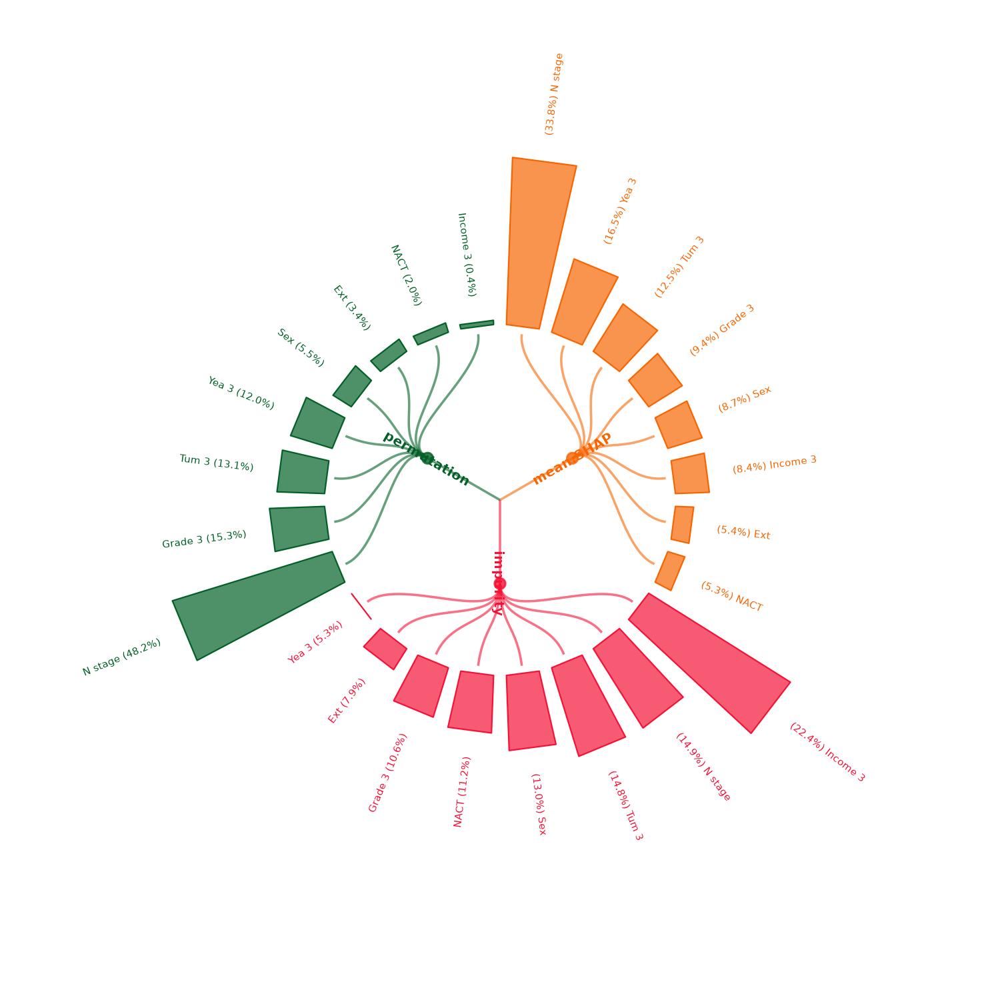{fig-alt="方法节点连接其变量，外圈柱长表示方法内部的归一化值。"}


### 外圈气泡与百分比 {.unnumbered}


以方法内份额控制气泡大小，起点转到右侧。


```r
plt_imp_network(imp8, add_name = labels, outer_style = "bubble", y_hat = "percent", start_position = "right", network_args = list(label_size = 2.6))
```


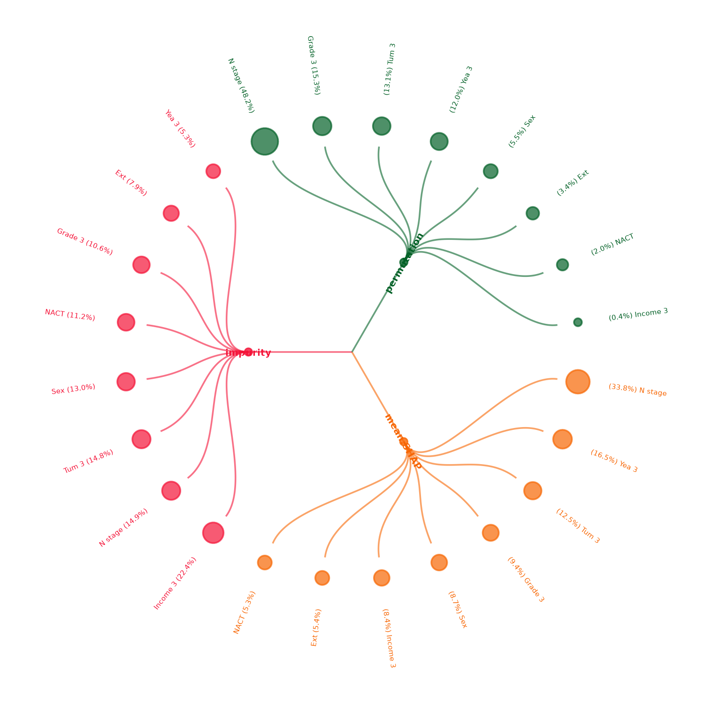{fig-alt="以方法内份额控制气泡大小，起点转到右侧。"}


:::


## `plt_imp_radar()`：归一化与分面

`normalize = max` 展示相对于本方法最大值的幅度；`sum` 展示所选变量中的份额。`output = gg` 返回 ggplot，可继续排版。

::: {.panel-tabset}


### 按最大值归一化 {.unnumbered}


每个方法最大的非负原始重要性映射为 1；并非 min–max 归一化。


```r
plt_imp_radar(imp8, normalize = "max", output = "gg", add_name = labels)
```


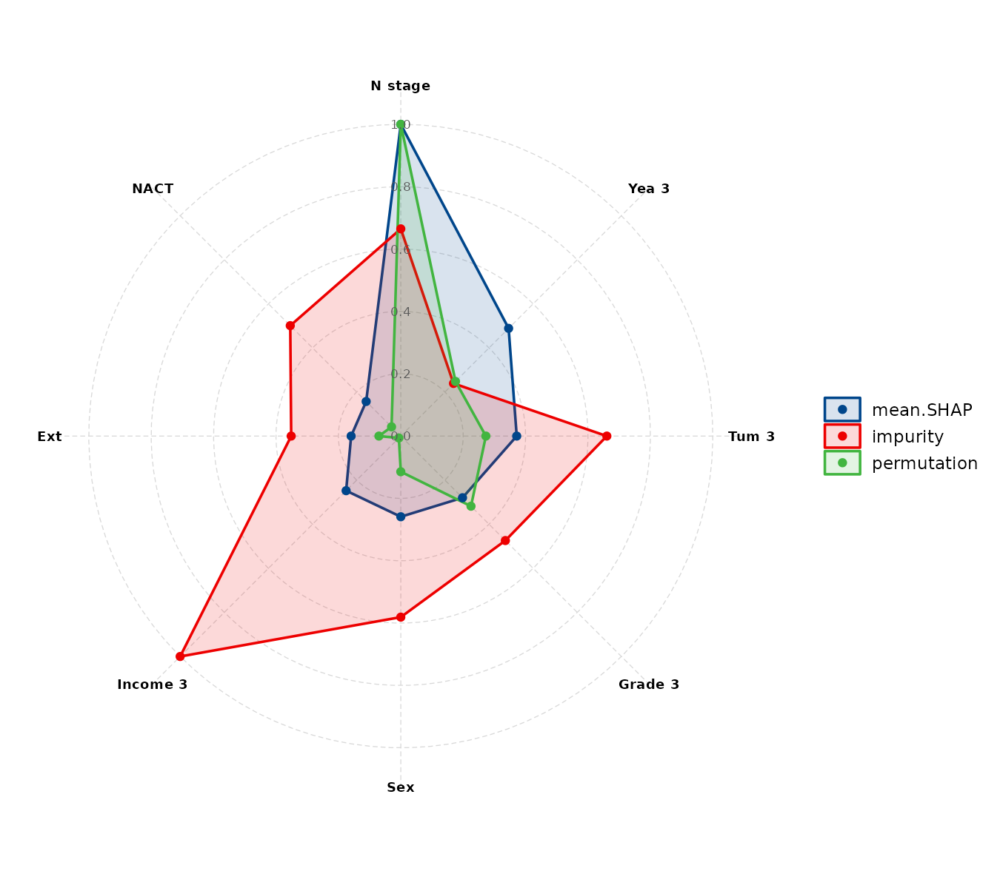{fig-alt="每个方法最大的非负原始重要性映射为 1；并非 min–max 归一化。"}


### 按总和归一化 {.unnumbered}


每个方法的轴值总和为 1；图形变化来自归一化规则。


```r
plt_imp_radar(imp8, normalize = "sum", output = "gg", add_name = labels)
```


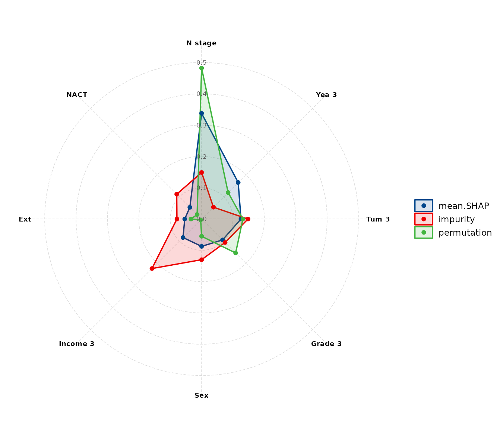{fig-alt="每个方法的轴值总和为 1；图形变化来自归一化规则。"}


### 选择方法并分面 {.unnumbered}


把两种方法分别绘制，减少雷达轮廓重叠。


```r
plt_imp_radar(imp8, imp_type = c("mean.SHAP", "permutation"), normalize = "max", output = "gg", facet = TRUE, n_breaks = 4, add_name = labels)
```


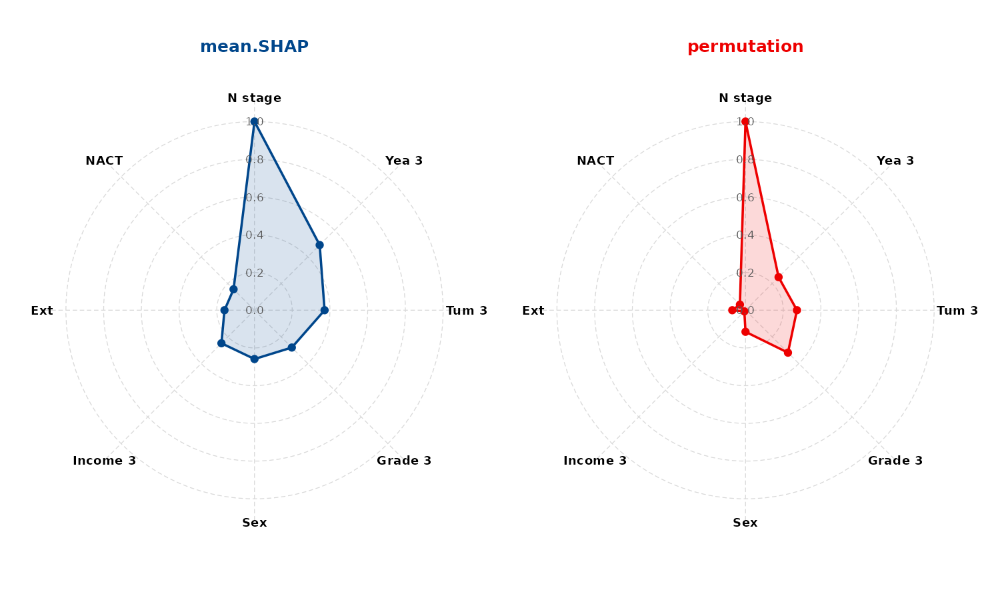{fig-alt="把两种方法分别绘制，减少雷达轮廓重叠。"}


:::


## 参数调整、保存与使用边界 {#parameters}

| 调整目标 | 参数 | 是否改变图中数值 |
|:--|:--|:--|
| 指定方法及顺序 | `imp_type` | 改比较集合，不重新计算重要性 |
| 截取变量 | `top_n` 或先筛选输入 | 排名图聚焦；百分比分母可能改变 |
| 比较排名 | `plt_imp_two()`、`plt_imp_bump()` | 纵横轴为名次 |
| 显示原始值 | `value_type = raw` | 数字换回各方法的原始单位 |
| 修改流向图 | `height_by`、`color_by`、`gap`、`curve.type` | 高度/颜色含义随选项改变 |
| 调整径向图 | `outer_style`、`start_position`、`network_args` | 改图形几何与标签 |
| 雷达归一化 | `normalize = max / sum` | 改相对数值定义 |
| 自定义名称 | `add_name` | 仅改标签 |

`fmt_args$cha_mult` 会改变贡献数值，不能当成普通字体设置；本页没有使用倍乘。重要性网络的边连接方法与变量，不代表变量交互。多方法排序相近说明在此对象上排序一致，不保证外部稳定性或因果重要性。

```r
p <- plt_imp_bump(imp, top_n = 8,
                  bump_args = list(show_value = FALSE))
ggplot2::ggsave("importance-ranks.pdf", p, width = 10, height = 6)

# 有 save 参数的函数可直接转交保存设置。
plt_imp_network(imp8, add_name = labels,
                save = list(filename = "importance-network.pdf",
                            width = 10, height = 10))

# circlize 图使用基础绘图设备。
pdf("importance-circle.pdf", width = 9, height = 9)
plt_imp_circ(imp8, add_name = labels)
dev.off()
```

不同函数的保存接口并不完全相同，复制时查看实际签名；不要把 `save` 传给不支持它的入口。

## 相关页面与源码 {#references}

- [SHAP：get_shp 与 14 个绘图函数](shap-guide.qmd)
- [ToyData 数据对象介绍](../toydata/index.qmd)
- [MLR 函数参考站点](https://hui950319.github.io/MLR/)
- [get_imp 源码](https://github.com/HUI950319/MLR/blob/master/R/imp-get.R)
- [重要性绘图源码](https://github.com/HUI950319/MLR/blob/master/R/imp-plt.R)

本页图片来自上面的实际公共调用。使用固定示例、固定随机种子和注明的小规模设置，图形用于学习接口及解释预测结果。
核对绘图前后输入数据框序列化结果完全一致。旧版主题或图例依赖可能给出兼容提示；实际图形均完成导出。这里验证的是绘图及参数表现，没有把预计算对象当成重新训练模型的证据。
