`get_hstats()` 与 `get_rfint()` 将不同的交互计算结果组织成同一 VIV 矩阵，`plt_viv()` 负责热图和网络展示。本页重点展示计算参数与图形参数分别改变什么。

**版本与执行范围：** 按 MLR 0.1.13 当前源码核对，使用 WSL R 4.4.3 实际导出本页 **12 张参数对照图**。实际训练 ranger / randomForestSRC，并生成 12 张图；使用小规模网格和单线程设置。交互统计量用于预测结构探索，本文没有进行模型交互项的显著性检验。


## 示例准备与读图规则 {#data}

生存示例使用 `ToyData::toy_ptc_m1_cnd` 的 598 人 M1 PTC 队列，175 个疾病特异死亡事件，time 单位为月，与 [ToyData 介绍](../toydata/index.qmd)一致。模型使用 Age、Sex、Tum_3；Unknown 是原有因子水平。二分类示例为固定种子的 300 行模拟数据，正类明确为 Yes，避免把删失生存记录直接当成完整二分类结局。

模拟生成过程含 Marker 与 Group 的乘积项；森林可能学到其他预测交互，不能用某一张热图证明恢复了全部真实结构。

```r
library(MLR)
library(ToyData)
library(ggplot2)

d <- as.data.frame(ToyData::toy_ptc_m1_cnd[,
  c("time", "DSS", "Age", "Sex", "Tum_3", "Race")])
d <- droplevels(d[complete.cases(d), ])
vars <- c("Age", "Sex", "Tum_3")
set.seed(246)
n <- 300L
dc <- data.frame(Age = runif(n, 20, 85),
  Sex = factor(sample(c("Female", "Male"), n, TRUE)),
  Marker = rnorm(n), Group = factor(sample(c("A", "B"), n, TRUE)))
prob <- plogis(-0.4 + (dc[["Age"]] - 50) / 20 +
  0.5 * (dc[["Sex"]] == "Male") + 0.8 * dc[["Marker"]] +
  0.7 * dc[["Marker"]] * (dc[["Group"]] == "B"))
dc[["Outcome"]] <- factor(ifelse(runif(n) < prob, "Yes", "No"),
  levels = c("No", "Yes"))
cvars <- c("Age", "Sex", "Marker", "Group")

# 较小网格只用于示例；正式分析应检查更细网格的稳定性
hs_args <- list(approx = TRUE, grid_size = 10, n_max = 60)
h <- get_hstats(dc, vars = cvars, surv = "Outcome", class = "Yes",
  num.trees = 100, Num.sample = 250, hstats_args = hs_args,
  seed = 246, verbose = FALSE, num.threads = 1)
hr <- get_hstats(dc, vars = cvars, surv = "Outcome", class = "Yes",
  num.trees = 100, Num.sample = 250, scale_interaction = FALSE,
  hstats_args = hs_args, seed = 246, verbose = FALSE, num.threads = 1)
ha <- get_hstats(dc, vars = cvars, surv = "Outcome", class = "Yes",
  num.trees = 100, Num.sample = 250, normalize = FALSE, squared = FALSE,
  scale_interaction = FALSE, hstats_args = hs_args,
  seed = 246, verbose = FALSE, num.threads = 1)
hchf <- get_hstats(d, vars = vars, surv = TRUE, num.trees = 80,
  Num.sample = 250, hstats_args = hs_args, seed = 246,
  verbose = FALSE, num.threads = 1)
hprob <- get_hstats(d, vars = vars, surv = 60, num.trees = 80,
  Num.sample = 250, hstats_args = hs_args, seed = 246,
  verbose = FALSE, num.threads = 1)
rf <- get_rfint(dc, vars = cvars, surv = "Outcome", num.trees = 100,
  Num.sample = 250, nrep = 2, seed = 246, verbose = FALSE, nthread = 1)
```


## 接口、返回对象与分析流程 {#interface}

| 路线 | 模型 / 交互定义 | 预测目标 |
|:--|:--|:--|
| get_hstats | ranger + hstats，比较联合 PDP 与可加 PDP | 生存 TRUE 为 CHF；数值 surv 为固定时间生存概率；字符 surv 为指定正类概率 |
| get_rfint | randomForestSRC + paired-VIMP，比较变量联合扰动与单独扰动 | 生存或分类森林的重要性尺度 |
| SHAP interaction | 分配预测贡献的交互分量 | 见现有 SHAP 专题，依赖模型输出尺度 |

返回值是带行列变量名的数值矩阵：对角线为变量重要性，非对角线为交互强度。矩阵附带原始交互等属性；例如 `attr(h, "interaction_raw")` 可检查缩放前数值。`plt_viv()` 返回 ggplot，使用两套色标分别表示对角线与非对角线。

H² 是预测尺度上的交互强度，不是交互 HR、置信区间或 P 值。`normalize = FALSE` 改成绝对量，`squared = FALSE` 改成 H，`scale_interaction` 仅控制最终展示缩放。数值 surv 使用森林实际时间网格，因此应检查所选时间附近的支持。

## H 统计量：定义与展示缩放

`normalize` 决定 H 的相对/绝对定义，`squared` 决定 H²/H；`scale_interaction` 是最后一步的可视化缩放，不能混为同一个设置。

::: {.panel-tabset}


### 默认缩放 {.unnumbered}


对角线是缩放后的重要性，非对角线是展示用缩放交互；两个色条分别解释。


```r
plt_viv(h, mode = "heatmap", fixed_size = FALSE)
```


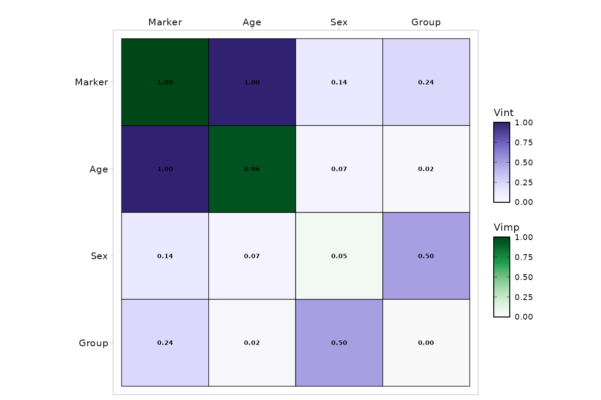{fig-alt="对角线是缩放后的重要性，非对角线是展示用缩放交互；两个色条分别解释。"}


### 保留相对 H² {.unnumbered}


关闭 scale_interaction，非对角线保留相对 H²；仍需留意对角线另用重要性色标。


```r
plt_viv(hr, mode = "heatmap", fixed_size = FALSE)
```


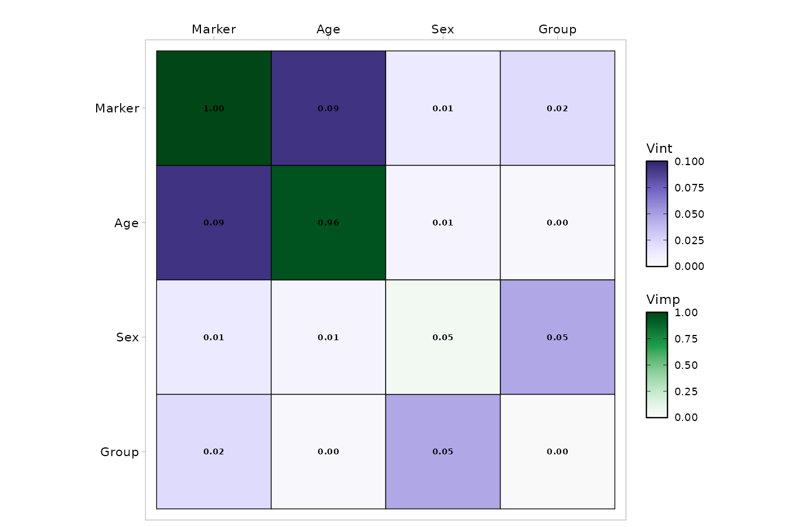{fig-alt="关闭 scale_interaction，非对角线保留相对 H²；仍需留意对角线另用重要性色标。"}


### 未归一化 H {.unnumbered}


normalize = FALSE、squared = FALSE；幅度依赖当前正类概率的预测尺度。


```r
plt_viv(ha, mode = "heatmap", fixed_size = FALSE)
```


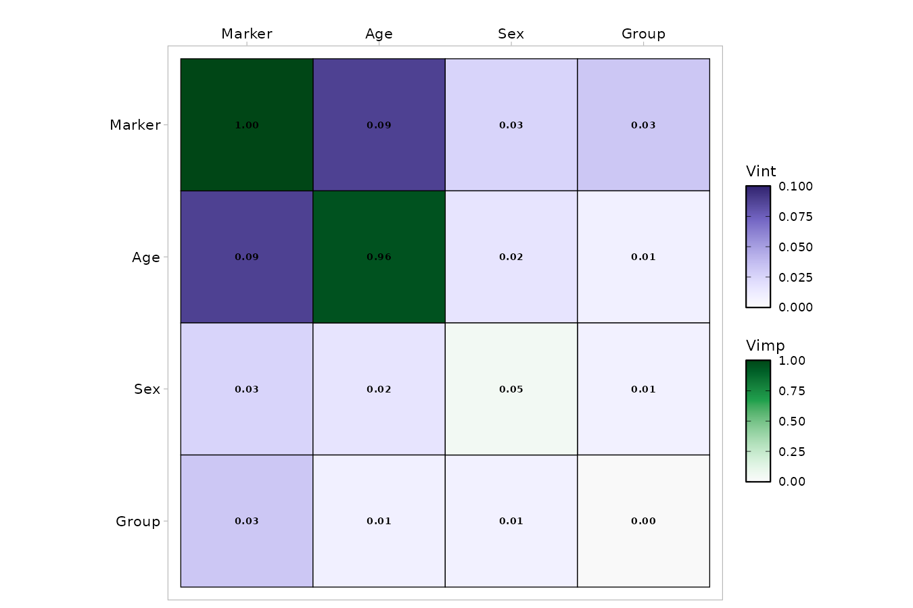{fig-alt="normalize = FALSE、squared = FALSE；幅度依赖当前正类概率的预测尺度。"}


:::


## `plt_viv()`：热图参数

热图参数可局部覆盖。数字、轴顺序和色标应一起阅读；调配色不会改变交互统计量。

::: {.panel-tabset}


### 颜色、边框和标签角度 {.unnumbered}


保持矩阵数值不变，切换配色并提高数字可读性。


```r
plt_viv(h, color = "blue_red", heatmap_arg = list(border = TRUE, angle = 45, text_size = 4), fixed_size = FALSE)
```


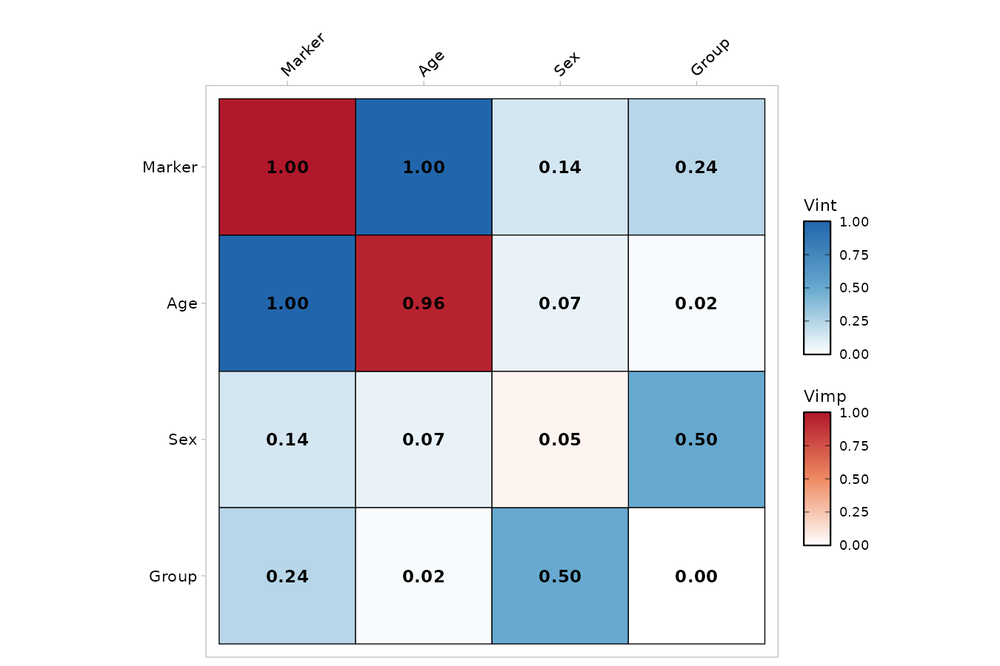{fig-alt="保持矩阵数值不变，切换配色并提高数字可读性。"}


### 隐藏数字 {.unnumbered}


关闭单元格文字，保留重要性和交互两套色标。


```r
plt_viv(h, color = "purple_gold", heatmap_arg = list(text = FALSE), fixed_size = FALSE)
```


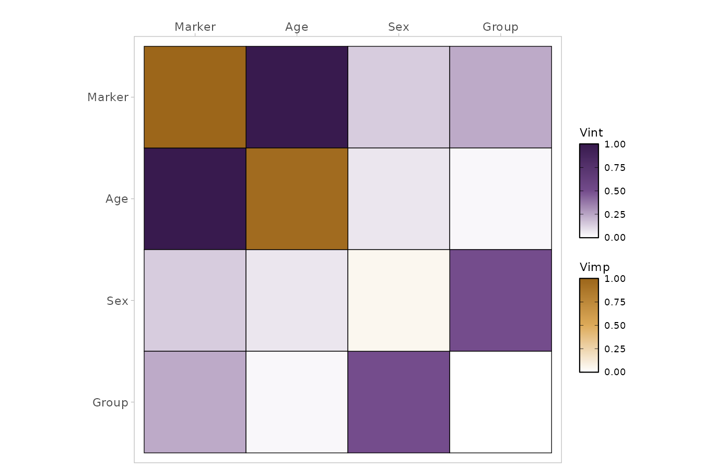{fig-alt="关闭单元格文字，保留重要性和交互两套色标。"}


:::


## `plt_viv()`：网络阈值与节点

`intThreshold` 筛选边，`removeNode` 决定是否移除没有保留边的节点。网络阈值不是统计显著性阈值。

::: {.panel-tabset}


### 较低边阈值 {.unnumbered}


保留交互强度至少 0.2 的边；阈值针对当前矩阵的展示尺度。


```r
plt_viv(h, mode = "network", network_arg = list(intThreshold = 0.2, removeNode = FALSE), fixed_size = FALSE)
```


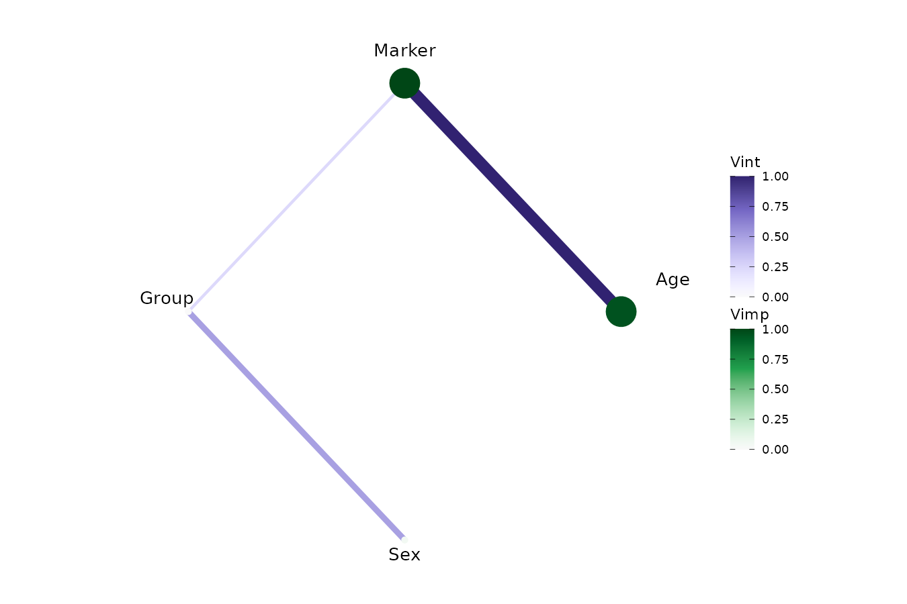{fig-alt="保留交互强度至少 0.2 的边；阈值针对当前矩阵的展示尺度。"}


### 较高阈值与去除孤点 {.unnumbered}


提高阈值并移除孤点，突出少量较强连接。


```r
plt_viv(h, mode = "network", network_arg = list(intThreshold = 0.7, removeNode = TRUE), fixed_size = FALSE)
```


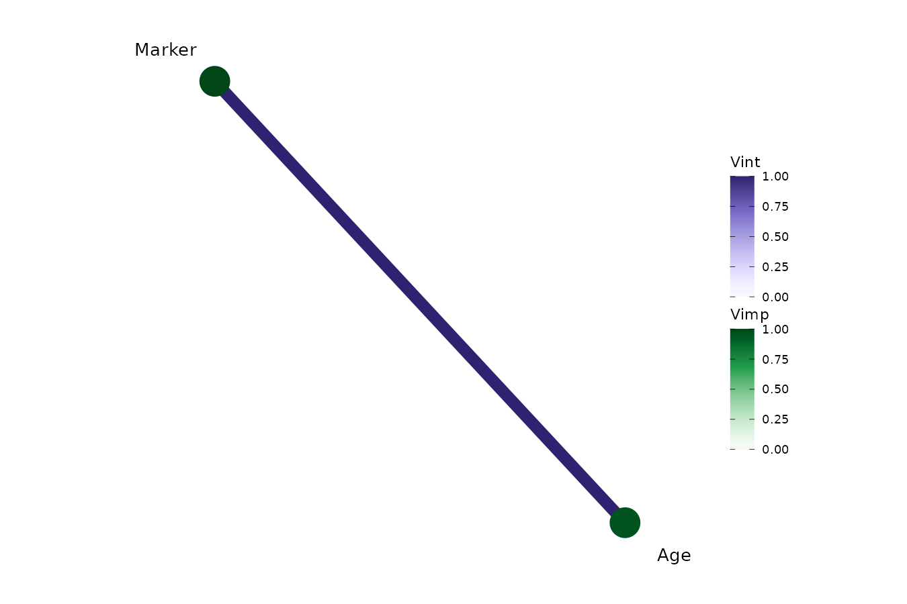{fig-alt="提高阈值并移除孤点，突出少量较强连接。"}


### 力导向布局与边宽 {.unnumbered}


相同矩阵换为力导向布局，并扩大边宽差异。


```r
plt_viv(h, mode = "network", network_arg = list(intThreshold = 0.2, layout = igraph::layout_with_fr, edgeWidths = c(1, 6)), fixed_size = FALSE)
```


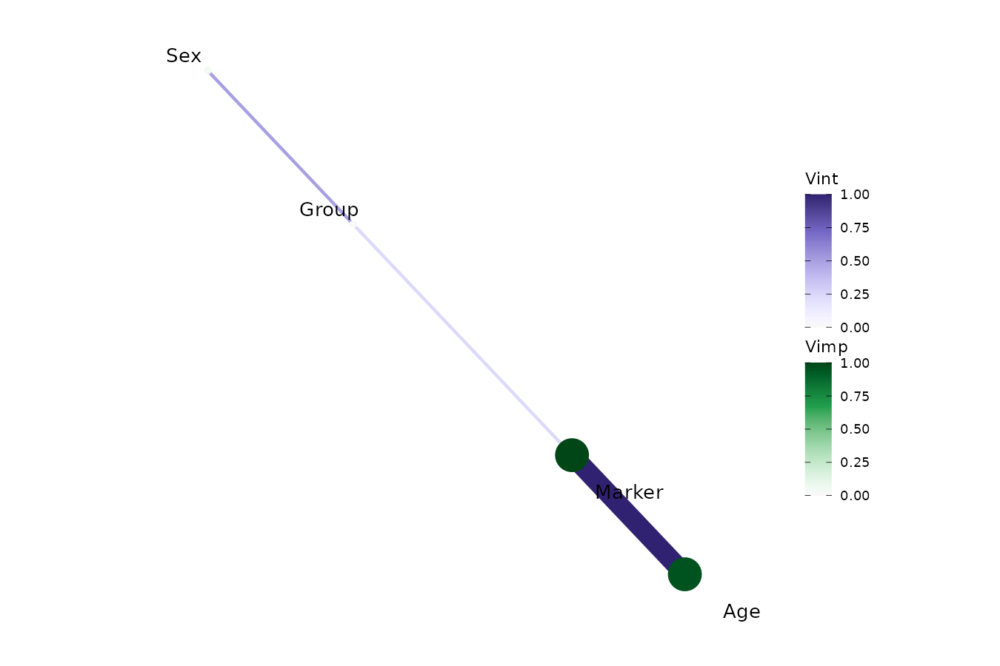{fig-alt="相同矩阵换为力导向布局，并扩大边宽差异。"}


:::


## 生存预测目标：CHF 与固定时间

`surv = TRUE` 使用 CHF 路线；数值 surv 指定生存概率时间。两个目标不同，数值不能当成同一统计量直接比较。

::: {.panel-tabset}


### 总体 CHF {.unnumbered}


对累积风险函数的多时间输出计算并汇总交互，适合整体筛查。


```r
plt_viv(hchf, fixed_size = FALSE)
```


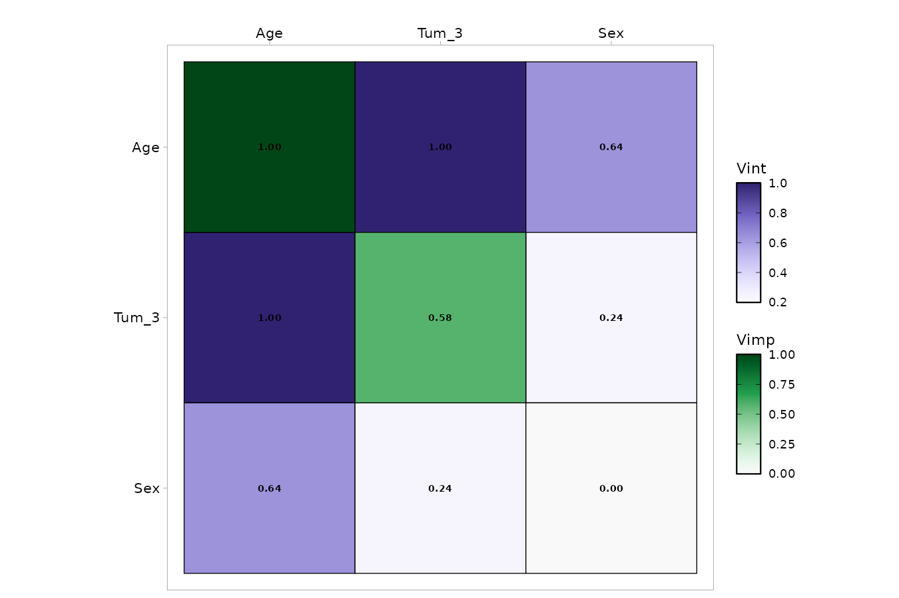{fig-alt="对累积风险函数的多时间输出计算并汇总交互，适合整体筛查。"}


### 60 月生存概率 {.unnumbered}


交互限定在当前实现映射的 60 月附近生存概率预测上。


```r
plt_viv(hprob, fixed_size = FALSE)
```


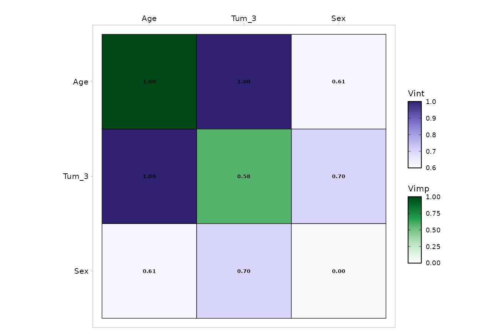{fig-alt="交互限定在当前实现映射的 60 月附近生存概率预测上。"}


:::


## `get_rfint()`：paired-VIMP 路线

该入口训练 randomForestSRC，并调用 paired-VIMP 交互计算。`importance`、`nrep`、`pairwise_m` 控制扰动方法、重复次数及候选变量。

::: {.panel-tabset}


### paired-VIMP 热图 {.unnumbered}


另一套随机森林、另一种交互定义；观察结构，不能把其数值等同 H²。


```r
plt_viv(rf, fixed_size = FALSE)
```


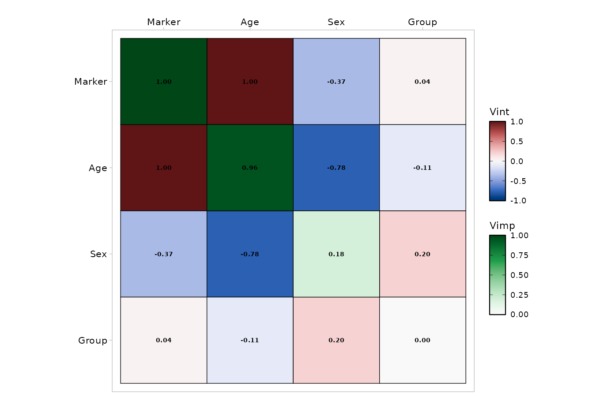{fig-alt="另一套随机森林、另一种交互定义；观察结构，不能把其数值等同 H²。"}


### paired-VIMP 网络 {.unnumbered}


对 paired-VIMP 的展示矩阵应用 0.4 阈值。


```r
plt_viv(rf, mode = "network", network_arg = list(intThreshold = 0.4), fixed_size = FALSE)
```


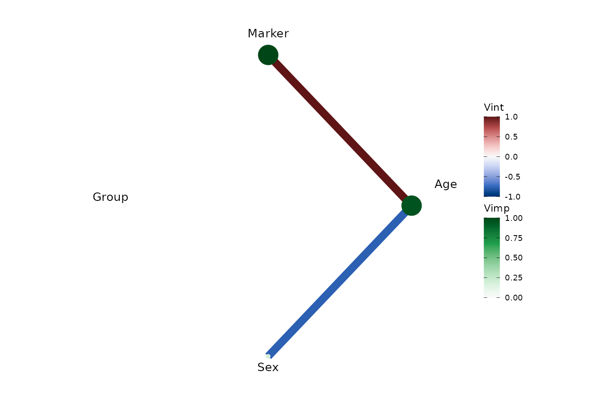{fig-alt="对 paired-VIMP 的展示矩阵应用 0.4 阈值。"}


:::


## 参数调整、保存与使用边界 {#parameters}

| 目的 | 参数 | 影响 |
|:--|:--|:--|
| 固定正类 | class；分类结局为字符 surv | 明确 H 统计量的预测输出 |
| 计算资源与精度 | Num.sample、hstats_args 中 grid_size / n_max / approx | 抽样和 PDP 网格近似；需重新计算 |
| 候选交互对 | pairwise_m | 控制候选变量集合 |
| 改重要性和排序 | importance、order_by | 对角线定义与变量排列 |
| 扰动交互重复 | get_rfint 的 nrep | 重算 paired-VIMP，低值只是演示 |
| 热图呈现 | color、heatmap_arg | 边框、角度、数字开关与字号 |
| 网络呈现 | intThreshold、removeNode、layout、edgeWidths | 边筛选、孤点、布局与宽度 |

`heatmap_arg` / `network_arg` 支持命名 list 的局部覆盖。网络阈值作用于传入矩阵的当前尺度；把缩放关掉后仍沿用 0.7，可能得到完全不同的网络。阈值没有统计显著性的含义。

本页所有图形先通过 `ggplot_build()`，再保存实际 PNG；颜色切换和布局切换复用同一矩阵。模型、预测输出或交互定义发生变化时需要重新计算，不能只换图例。

```r
raw <- attr(h, "interaction_raw")
dim(h)
p <- plt_viv(h, mode = "network", fixed_size = FALSE,
  network_arg = list(intThreshold = 0.2))
ggplot2::ggsave("interaction-network.pdf", p, width = 9, height = 6)
```

## 相关页面与源码 {#references}

- [SHAP 解释与交互](shap-guide.qmd)
- [变量分布与 PDP](vpd-guide.qmd)
- [特征重要性](imp-guide.qmd)
- [MLR 参考手册](https://hui950319.github.io/MLR/)
- [hstats 官方源码与方法](https://github.com/ModelOriented/hstats)
- [randomForestSRC 官方文档](https://www.randomforestsrc.org/)

本页图片来自上面的实际公共调用。使用固定示例、固定随机种子和注明的小规模设置，图形用于学习接口及解释预测结果。
12 张图均由公开入口实际生成，覆盖两套交互算法、三种 H 缩放/定义、生存 CHF 与固定时间概率、两种热图呈现和多种网络阈值/布局。小样本网格和较低 nrep 用于教程速度，不能替代正式分析的重复性检查。
