`get_model_evaluation()` 从指定学习器得到表观预测与重采样留出预测，返回标量指标、曲线和表格。本页用相同重采样方案对照不同指标及图形参数。

**版本与执行范围：** 按 MLR 0.1.13 当前源码核对，使用 WSL R 4.4.3 实际导出本页 **13 张参数对照图**。实际训练 Cox / Logistic，执行八次 bootstrap 的留出评估，并生成 13 张图。低重复次数用于演示接口与参数，不能据此报告精确的临床性能区间。


## 示例准备与读图规则 {#data}

生存示例使用 `ToyData::toy_ptc_m1_cnd` 的 598 人 M1 PTC 队列，175 个疾病特异死亡事件，time 单位为月，与 [ToyData 介绍](../toydata/index.qmd)一致。模型使用 Age、Sex、Tum_3；Unknown 是原有因子水平。二分类示例为固定种子的 300 行模拟数据，正类明确为 Yes，避免把删失生存记录直接当成完整二分类结局。

生存模型使用 Age、Sex、Tum_3；时间单位为月。分类模型使用 Age、Sex、Marker、Group，正类 Yes。两个数据对象不同，不比较其 AUC / C-index 大小。阈值 0.5 与 0.3 的分类评估固定种子与模型，改变分类决策规则。

```r
library(MLR)
library(ToyData)
library(ggplot2)

d <- as.data.frame(ToyData::toy_ptc_m1_cnd[,
  c("time", "DSS", "Age", "Sex", "Tum_3", "Race")])
d <- droplevels(d[complete.cases(d), ])
vars <- c("Age", "Sex", "Tum_3")
set.seed(246)
n <- 300L
dc <- data.frame(Age = runif(n, 20, 85),
  Sex = factor(sample(c("Female", "Male"), n, TRUE)),
  Marker = rnorm(n), Group = factor(sample(c("A", "B"), n, TRUE)))
prob <- plogis(-0.4 + (dc[["Age"]] - 50) / 20 +
  0.5 * (dc[["Sex"]] == "Male") + 0.8 * dc[["Marker"]] +
  0.7 * dc[["Marker"]] * (dc[["Group"]] == "B"))
dc[["Outcome"]] <- factor(ifelse(runif(n) < prob, "Yes", "No"),
  levels = c("No", "Yes"))
cvars <- c("Age", "Sex", "Marker", "Group")

library(mlr3)
library(mlr3proba)
library(mlr3learners)
task_s <- mlr3proba::as_task_surv(d[, c("time", "DSS", vars)],
  time = "time", event = "DSS", id = "ptc_demo")
task_c <- as_task_classif(dc[, c("Outcome", cvars)],
  target = "Outcome", positive = "Yes", id = "binary_demo")
cox <- lrn("surv.coxph")
logistic <- lrn("classif.log_reg", predict_type = "prob")
bs <- rsmp("bootstrap", repeats = 8, ratio = 1)
evs <- get_model_evaluation(task_s, learner = cox,
  times = c(12, 30, 60, 90, 120), roc_times = c(30, 60, 90),
  resampling = bs, apparent = TRUE, conf_level = 0.95,
  backend = "sequential", seed = 246)
evc <- get_model_evaluation(task_c, learner = logistic,
  resampling = bs, apparent = TRUE, threshold = 0.5, curve_points = 51,
  positive = "Yes", backend = "sequential", seed = 246)
evc30 <- get_model_evaluation(task_c, learner = logistic,
  resampling = bs, apparent = TRUE, threshold = 0.3, curve_points = 51,
  positive = "Yes", backend = "sequential", seed = 246)
```


## 接口、返回对象与分析流程 {#interface}

返回 `mlr_model_evaluation`，分类另带 `mlr_model_evaluation_classif`。主要字段为 learner、prediction、apparent、resample_result、resample_metrics、metric_summary、resample_curves、curve_summary、roc_resamples、roc_summary、tables 和 settings；分类还含 PR、阈值和混淆矩阵的逐次结果与汇总。

`learner` 是全数据训练的最终学习器。`apparent` 在训练数据评估；`resampling` 使用相应的留出集。本例 mlr3 bootstrap 的训练样本有放回抽样，测试集是 OOB 样本。换成 CV 时，resampling 就是 CV 留出结果。

| 图形 type | 生存 | 二分类 |
|:--|:--|:--|
| auc / brier | 时间指标曲线 | 不适用，用 metrics |
| roc | 指定 times 的时间 ROC | 普通 ROC |
| metrics | 标量指标的分布 | 概率/分类指标的分布 |
| resamples | auc / brier 的逐次时间曲线 | 标量指标分布 |
| pr / threshold / confusion | 不适用 | PR、阈值指标、混淆矩阵 |

`show_interval` 控制已有区间的显示。留出汇总主要使用经验分位数；默认 timeROC 的表观 AUC 可使用 iid 近似区间，其来源不同。图中的小规模分位数带不是最终选择流程的外部验证置信区间。

生存默认指标为 cindex、iauc、ibs；分类默认指标包含 auc、prauc、brier、logloss，以及 acc、bacc、sensitivity、specificity、ppv、npv、f1、mcc。正类方向、缺失值与有限指标数量应一起检查。

## 生存评估：时间与概率

time 单位为月。AUC 曲线与 Brier 曲线使用同一重采样预测；演示仅八次 bootstrap，区间不是精确临床推断。

::: {.panel-tabset}


### 留出时间 AUC {.unnumbered}


对各 bootstrap 留出集计算时间 AUC，区间为折次分布汇总。


```r
plt_model_evaluation(evs, type = "auc", source = "resampling")
```


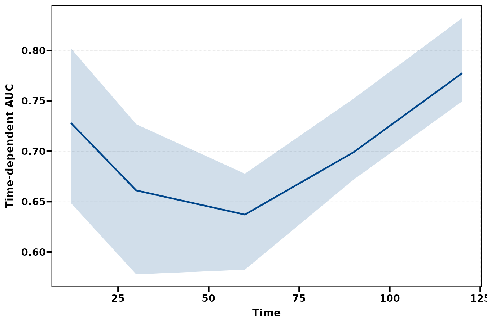{fig-alt="对各 bootstrap 留出集计算时间 AUC，区间为折次分布汇总。"}


### 表观时间 AUC {.unnumbered}


全数据训练并在全数据预测的表观性能，可能偏乐观。


```r
plt_model_evaluation(evs, type = "auc", source = "apparent", show_interval = FALSE)
```


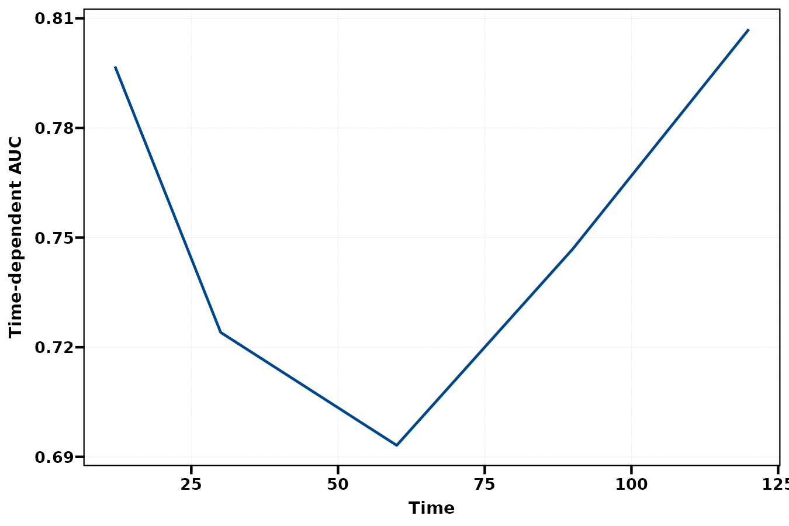{fig-alt="全数据训练并在全数据预测的表观性能，可能偏乐观。"}


### 留出 Brier {.unnumbered}


时间上的概率平方误差，越低越好；包含删失权重。


```r
plt_model_evaluation(evs, type = "brier", source = "resampling", show_interval = TRUE)
```


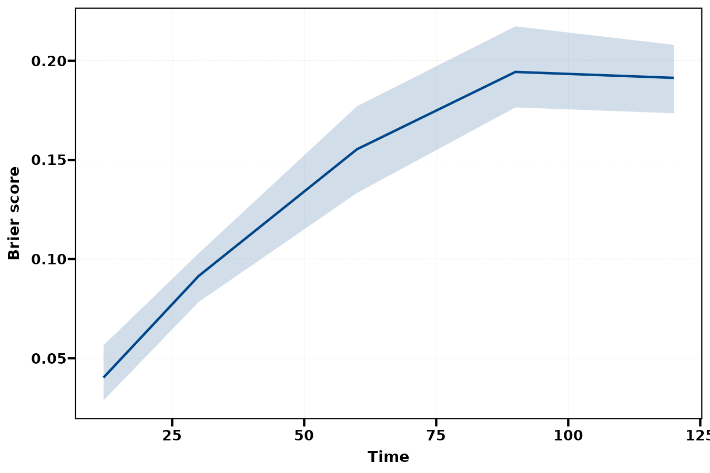{fig-alt="时间上的概率平方误差，越低越好；包含删失权重。"}


### 60 月 ROC {.unnumbered}


选择已计算的一个 ROC 时间点，不能从此图推断所有时间的区分能力。


```r
plt_model_evaluation(evs, type = "roc", times = 60, source = "resampling")
```


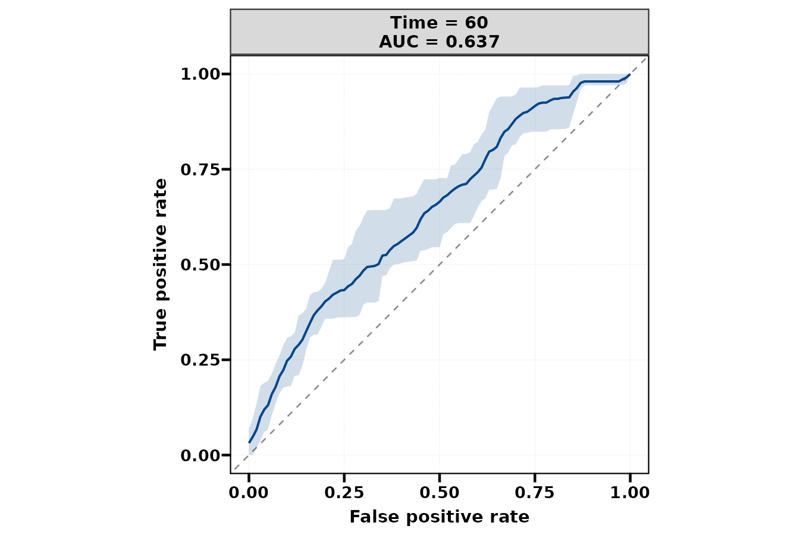{fig-alt="选择已计算的一个 ROC 时间点，不能从此图推断所有时间的区分能力。"}


### 三个 ROC 时间 {.unnumbered}


移除区间，比较多个时间的汇总 ROC。


```r
plt_model_evaluation(evs, type = "roc", times = c(30, 60, 90), show_interval = FALSE)
```


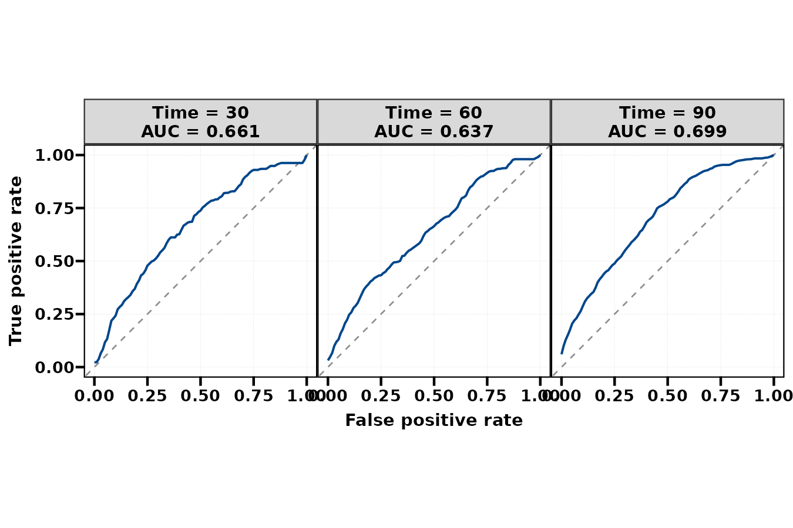{fig-alt="移除区间，比较多个时间的汇总 ROC。"}


:::


## 指标汇总与折次变化

性能不确定性、模型选择和最终外部验证是不同问题。该入口重采样指定学习器，不会自动重新运行之前的手工变量筛选。

::: {.panel-tabset}


### 汇总指标 {.unnumbered}


分别查看 C-index、iAUC 和 IBS，指标的优劣方向不同。


```r
plt_model_evaluation(evs, type = "metrics", source = "resampling")
```


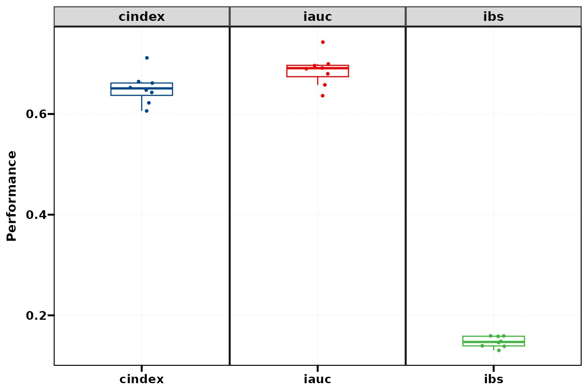{fig-alt="分别查看 C-index、iAUC 和 IBS，指标的优劣方向不同。"}


### 逐次 AUC 曲线 {.unnumbered}


浅线为各次留出 AUC 曲线，黑线为汇总；resamples 在生存路径接受 auc 或 brier。


```r
plt_model_evaluation(evs, type = "resamples", metric = "auc", ylim = c(0.5, 0.85))
```


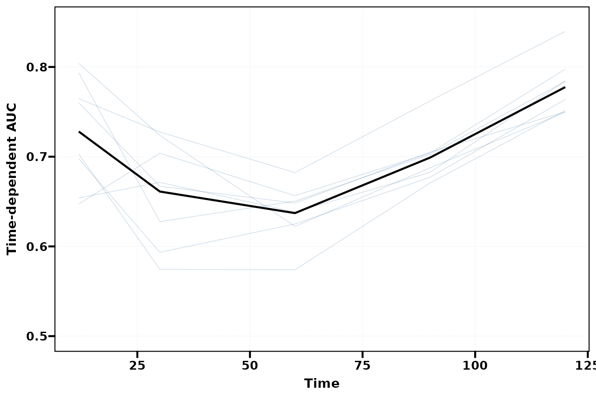{fig-alt="浅线为各次留出 AUC 曲线，黑线为汇总；resamples 在生存路径接受 auc 或 brier。"}


### 概率与区分指标 {.unnumbered}


AUC / PR AUC 越高越好；Brier / log loss 越低越好。


```r
plt_model_evaluation(evc, type = "metrics", metric = c("auc", "prauc", "brier", "logloss"))
```


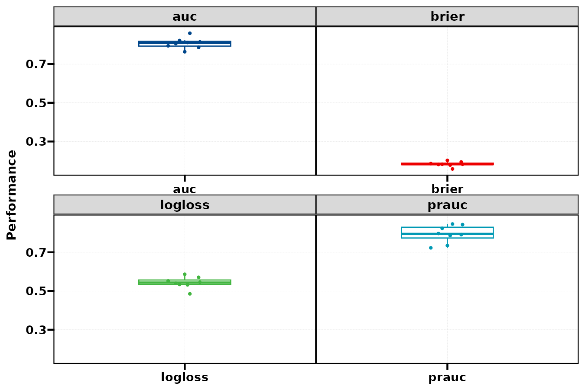{fig-alt="AUC / PR AUC 越高越好；Brier / log loss 越低越好。"}


:::


## 二分类：ROC、PR 与阈值

二分类没有生存 times 参数。ROC / PR 用概率排序，混淆矩阵和灵敏度等指标依赖 threshold。

::: {.panel-tabset}


### 二分类 ROC {.unnumbered}


正类为 Yes，ROC 从预测概率计算。


```r
plt_model_evaluation(evc, type = "roc", source = "resampling")
```


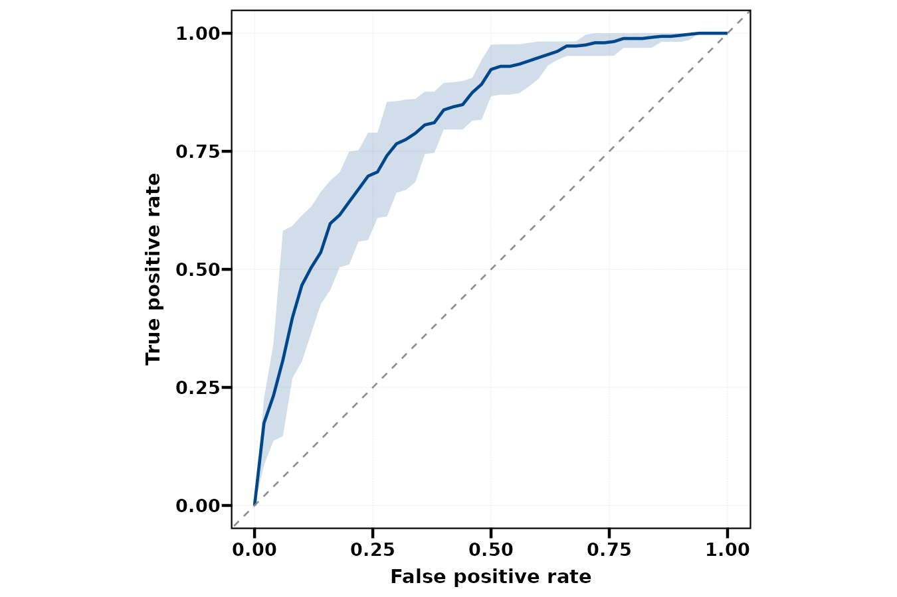{fig-alt="正类为 Yes，ROC 从预测概率计算。"}


### PR 曲线 {.unnumbered}


取消区间展示 Precision / Recall；曲线依赖正类比例。


```r
plt_model_evaluation(evc, type = "pr", source = "resampling", show_interval = FALSE)
```


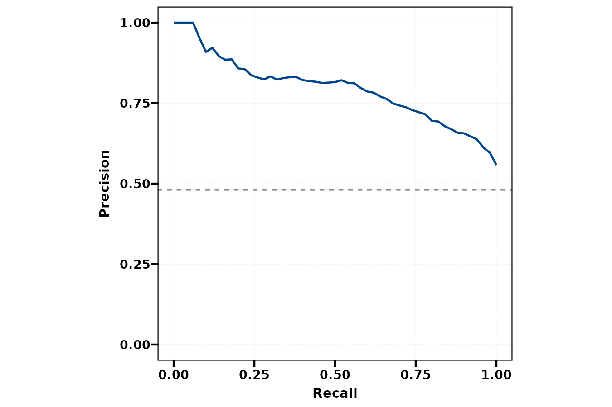{fig-alt="取消区间展示 Precision / Recall；曲线依赖正类比例。"}


### 灵敏度与特异度 {.unnumbered}


选择两个阈值指标，虚线标出计算对象的 threshold = 0.5。


```r
plt_model_evaluation(evc, type = "threshold", metric = c("sensitivity", "specificity"), show_interval = FALSE)
```


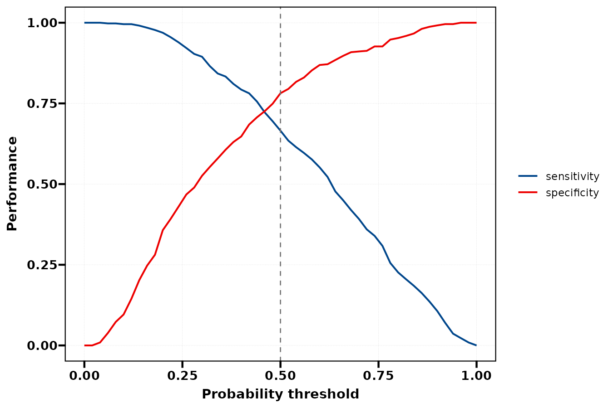{fig-alt="选择两个阈值指标，虚线标出计算对象的 threshold = 0.5。"}


### 阈值 0.5 {.unnumbered}


表观混淆矩阵，是全数据上的分类计数。


```r
plt_model_evaluation(evc, type = "confusion", source = "apparent")
```


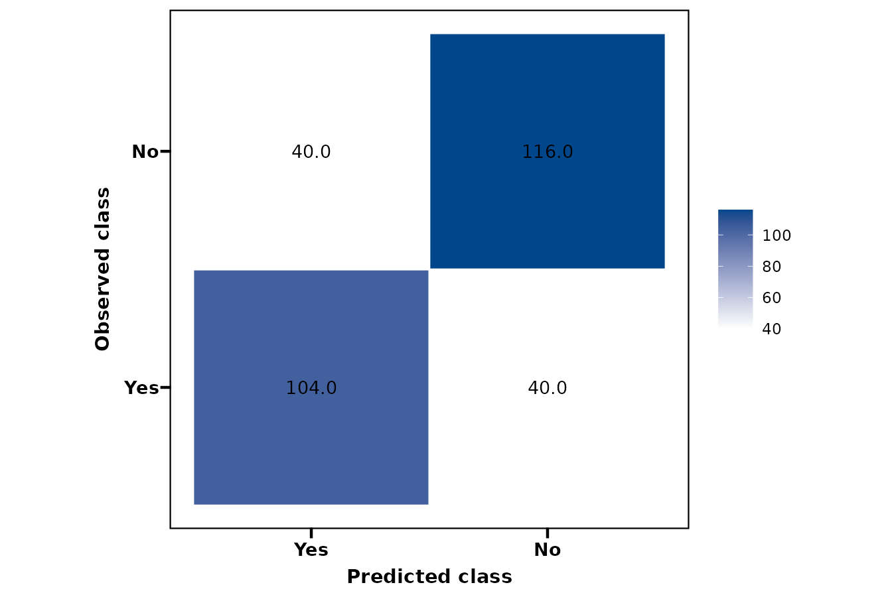{fig-alt="表观混淆矩阵，是全数据上的分类计数。"}


### 阈值 0.3 {.unnumbered}


降低阈值通常增加阳性预测；它不改变同一模型的排序 AUC。


```r
plt_model_evaluation(evc30, type = "confusion", source = "apparent")
```


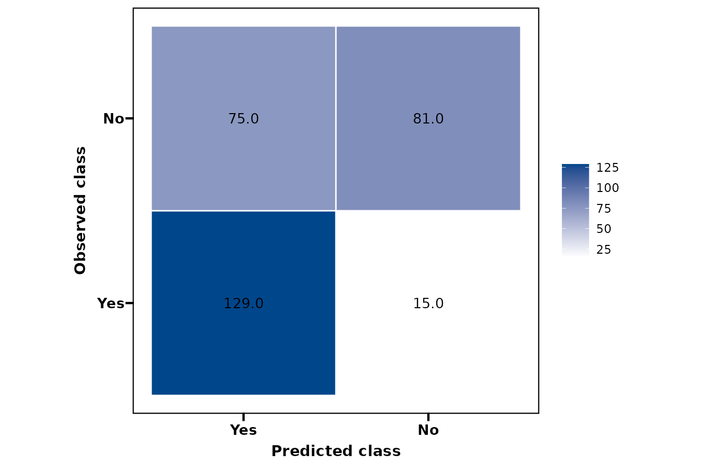{fig-alt="降低阈值通常增加阳性预测；它不改变同一模型的排序 AUC。"}


:::


## 参数调整、保存与使用边界 {#parameters}

| 参数 | 作用 | 示例 |
|:--|:--|:--|
| times / roc_times | 生存曲线和 ROC 计算时间 | 12/30/60/90/120 与 30/60/90 |
| auc_method / brier_method | 生存指标后端 | 本页默认 timeROC / mlr3proba |
| resampling / apparent | 留出设计与表观计算 | 八次 bootstrap，保留表观结果 |
| conf_level / show_interval | 计算分位数/区间与显示 | 0.95；图形开关不重算 |
| threshold / curve_points | 分类决策与曲线网格 | 0.5 / 0.3；51 个网格点 |
| source / metric / times | 从已有结果选择图形内容 | times 只用于生存 ROC 选择 |
| colors / ylim | 图形呈现 | ROC / PR 坐标固定 0–1，ylim 不生效 |

分类的计算与作图都不接受生存 times；也不能传 auc_method / brier_method 这些生存专用设置。生存 `type = resamples` 选择的是时间曲线，所以 metric 为 auc / brier；读取单次 C-index 应用 metrics 或表格。

```r
tb_model_evaluation(evs, type = "summary")
tb_model_evaluation(evs, type = "curves", times = 60)
tb_model_evaluation(evs, type = "resamples", metric = "cindex")
tb_model_evaluation(evc, type = "pr")
tb_model_evaluation(evc, type = "threshold")
tb_model_evaluation(evc, type = "confusion", source = "apparent")
p <- plt_model_evaluation(evc, type = "roc")
ggplot2::ggsave("validation-roc.pdf", p, width = 8, height = 6)
```

ROC / PR 由概率排序计算；阈值影响混淆矩阵和灵敏度等指标。不同阈值不会给同一个固定模型带来新的排序区分能力。分类的重采样混淆矩阵汇总是各留出集计数的均值，可能出现非整数，不能当作单一队列总人数。

如果在全数据上先调参或筛选变量，再只重采样固定学习器，性能仍可能乐观。需要把这些步骤放在训练折内，参见调优/特征筛选的嵌套选项；该函数不会自动重做外部手工选择。

## 相关页面与源码 {#references}

- [模型筛选](model-selection-guide.qmd)
- [超参数调优](hyper-tuning-guide.qmd)
- [特征筛选](feature-selection-guide.qmd)
- [校准与 DCA](calibration-dca-guide.html)
- [MLR 评估源码](https://github.com/HUI950319/MLR/blob/master/R/model-evaluation.R)
- [mlr3 官方书：评估](https://mlr3book.mlr-org.com/chapters/chapter3/evaluation_and_benchmarking.html)

本页图片来自上面的实际公共调用。使用固定示例、固定随机种子和注明的小规模设置，图形用于学习接口及解释预测结果。
两类任务、两个分类阈值均成功计算。13 张图通过实际构建/导出；生存 summary 与分类 confusion 的公共 flextable 输出已验证。本页刻意保留少量重采样作为教程预算。
