`get_model_selection()` 组织学习器与缺失处理组合，保留 benchmark、分数和表格；`plt_bmr()` 与 `plt_bmr_circle()` 从同一结果绘制不同指标。本页以固定参数的自定义学习器减少调参干扰。

**版本与执行范围：** 按 MLR 0.1.13 当前源码核对，使用 WSL R 4.4.3 实际导出本页 **11 张参数对照图**。实际执行生存与二分类的 3 折 × 2 次重复 CV，绘制 11 张图并读回三种公开表格。自定义学习器不含待调参数，因此本例没有调参。


## 示例准备与读图规则 {#data}

生存示例使用 `ToyData::toy_ptc_m1_cnd` 的 598 人 M1 PTC 队列，175 个疾病特异死亡事件，time 单位为月，与 [ToyData 介绍](../toydata/index.qmd)一致。模型使用 Age、Sex、Tum_3；Unknown 是原有因子水平。二分类示例为固定种子的 300 行模拟数据，正类明确为 Yes，避免把删失生存记录直接当成完整二分类结局。

为了展示缺失处理，固定种子随机置空生存队列 60 个 Age、二分类 30 个 Age。完整案例分别保留 538 / 270 人，median_mode 保留 598 / 300 人。插补在各训练折内学习；`tasks` 中的预览插补数据用于数据摘要，不能替代折内管线。

```r
library(MLR)
library(ToyData)
library(ggplot2)

d <- as.data.frame(ToyData::toy_ptc_m1_cnd[,
  c("time", "DSS", "Age", "Sex", "Tum_3", "Race")])
d <- droplevels(d[complete.cases(d), ])
vars <- c("Age", "Sex", "Tum_3")
set.seed(246)
n <- 300L
dc <- data.frame(Age = runif(n, 20, 85),
  Sex = factor(sample(c("Female", "Male"), n, TRUE)),
  Marker = rnorm(n), Group = factor(sample(c("A", "B"), n, TRUE)))
prob <- plogis(-0.4 + (dc[["Age"]] - 50) / 20 +
  0.5 * (dc[["Sex"]] == "Male") + 0.8 * dc[["Marker"]] +
  0.7 * dc[["Marker"]] * (dc[["Group"]] == "B"))
dc[["Outcome"]] <- factor(ifelse(runif(n) < prob, "Yes", "No"),
  levels = c("No", "Yes"))
cvars <- c("Age", "Sex", "Marker", "Group")

library(mlr3)
library(mlr3proba)
library(mlr3learners)
library(mlr3extralearners)
set.seed(246)
dm <- d
dm[sample(seq_len(nrow(dm)), 60), "Age"] <- NA_real_
dcm <- dc
dcm[sample(seq_len(nrow(dcm)), 30), "Age"] <- NA_real_
task_s <- mlr3proba::as_task_surv(dm[, c("time", "DSS", vars)],
  time = "time", event = "DSS", id = "ptc_demo")
task_c <- mlr3::as_task_classif(dcm[, c("Outcome", cvars)],
  target = "Outcome", positive = "Yes", id = "binary_demo")
ms_models <- list(Cox = lrn("surv.coxph"),
  Forest = lrn("surv.ranger", num.trees = 80, num.threads = 1))
mc_models <- list(Logistic = lrn("classif.log_reg", predict_type = "prob"),
  Forest = lrn("classif.ranger", predict_type = "prob",
    num.trees = 80, num.threads = 1))
ms <- get_model_selection(task_s, imputations = c("complete", "median_mode"),
  models = ms_models, outer_folds = 3, outer_repeats = 2,
  auto_tuner = FALSE, backend = "sequential", seed = 246)
mc <- get_model_selection(task_c, imputations = c("complete", "median_mode"),
  models = mc_models, outer_folds = 3, outer_repeats = 2,
  auto_tuner = FALSE, backend = "sequential", seed = 246, positive = "Yes")
```


## 接口、返回对象与分析流程 {#interface}

返回 `mlr_model_selection`：`benchmark_result` 是原生 mlr3 BenchmarkResult；`scores` 保存逐折分数；`tasks` 是缺失处理后的数据预览；`learners`、`model_parameters`、`tables` 与 `settings` 保留学习器、表格和分析设置。

`models` 可为内置名称向量，或命名 list 中的自定义 mlr3 学习器。本页自定义的学习器没有 TuneToken，使用固定超参数。

**`auto_tuner = FALSE` 的含义需要特别注意：** 对有内置搜索空间的模型，它先在全数据上调参一次，再冻结参数执行外层 benchmark。这不是严格嵌套评估。`auto_tuner = TRUE` 才会在每个外层训练折内重新调参。原始内置名字 ranger 与本页的固定参数自定义 Forest 不是相同调参流程。

| 指标 | 任务 | 方向 |
|:--|:--|:--|
| cindex | 生存区分 | 越高越好 |
| ibs | 生存概率综合误差 | 越低越好 |
| brier + time | 固定时间生存概率误差 | 越低越好 |
| auc / prauc | 二分类区分 | 越高越好；PR AUC 依赖正类比例 |
| brier / bbrier / logloss | 二分类概率误差 | 越低越好 |

生存概率指标需要 distr 预测；`predict_type = crank` 的学习器只提供排序分数，不能据此计算原生生存概率的 Brier。二分类始终要求正类概率，不能传生存专用 predict_type 或 survdnn_device。

## 生存模型 × 缺失处理

演示随机删去部分 Age 后的 complete 与 median_mode。插补在训练折内学习；完整案例的患者集合改变，不是相同目标人群的严格配对比较。

::: {.panel-tabset}


### C-index {.unnumbered}


两个学习器和两种缺失处理；点为外层折次分数，越高越好。


```r
plt_bmr(ms, measure = "cindex", ncol = 2)
```


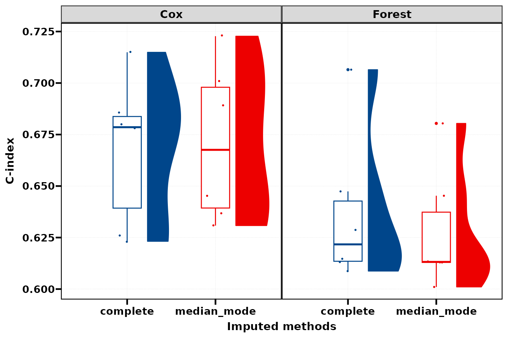{fig-alt="两个学习器和两种缺失处理；点为外层折次分数，越高越好。"}


### IBS 与单列布局 {.unnumbered}


综合 Brier 分数越低越好；概率预测与删失权重影响该指标。


```r
plt_bmr(ms, measure = "ibs", ncol = 1)
```


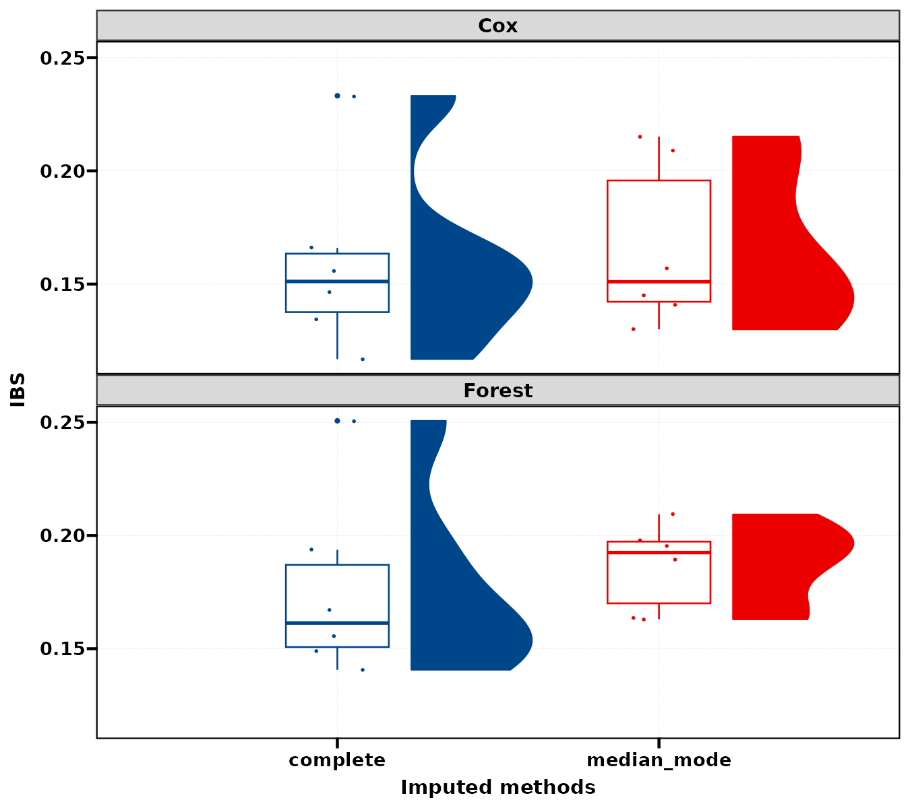{fig-alt="综合 Brier 分数越低越好；概率预测与删失权重影响该指标。"}


### 60 月 Brier {.unnumbered}


显式设置 time = 60，单位为月；与 IBS 的汇总维度不同。


```r
plt_bmr(ms, measure = "brier", time = 60, ncol = 2)
```


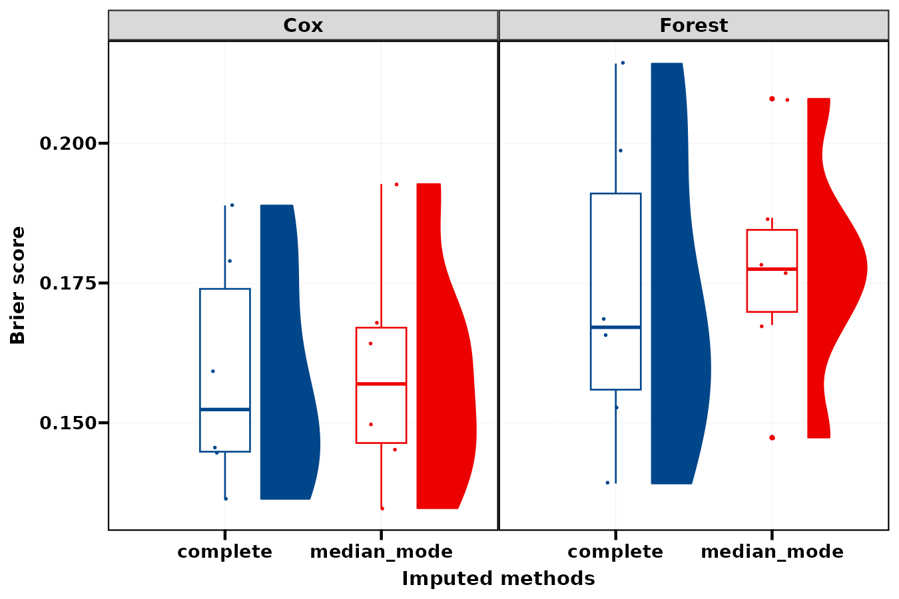{fig-alt="显式设置 time = 60，单位为月；与 IBS 的汇总维度不同。"}


### 颜色与观察窗 {.unnumbered}


coord_cartesian 改显示范围；分数和表格汇总保持原样。


```r
plt_bmr(ms, measure = "cindex", ncol = 2, ylim = c(0.5, 0.85), colors = c("#1B9E77", "#D95F02"))
```


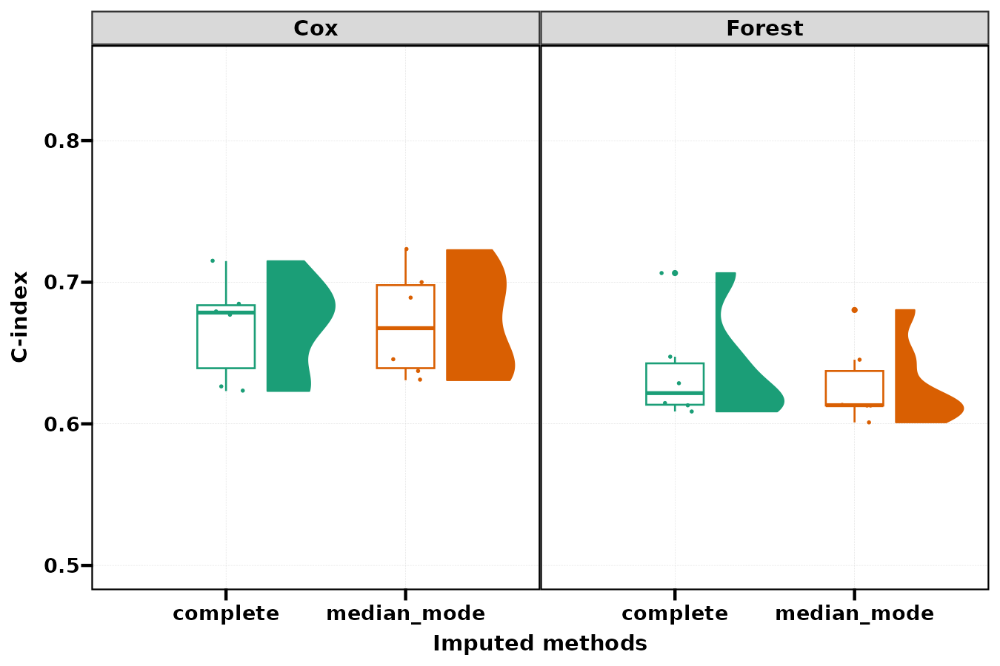{fig-alt="coord_cartesian 改显示范围；分数和表格汇总保持原样。"}


:::


## 二分类：区分与概率误差

同一 benchmark 使用不同指标，不需要重新训练。不能只凭 AUC 忽略概率误差；PR AUC 还受正类比例影响。

::: {.panel-tabset}


### ROC AUC {.unnumbered}


固定正类 Yes，ROC AUC 越高越好。


```r
plt_bmr(mc, measure = "auc", ncol = 2)
```


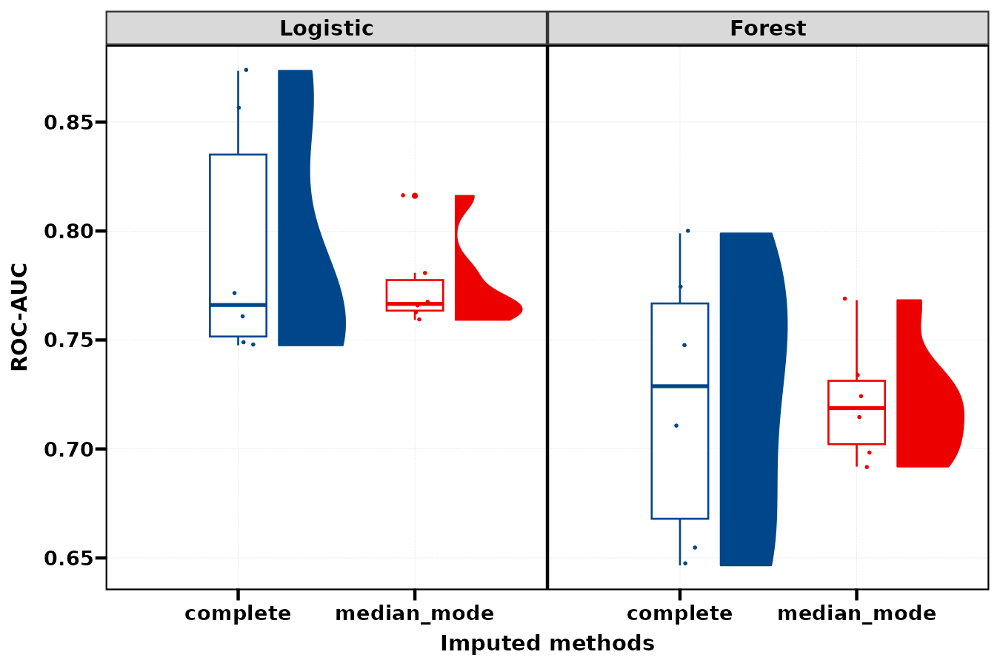{fig-alt="固定正类 Yes，ROC AUC 越高越好。"}


### PR AUC {.unnumbered}


关注 precision / recall，比较时保留正类定义和样本比例。


```r
plt_bmr(mc, measure = "prauc", ncol = 2)
```


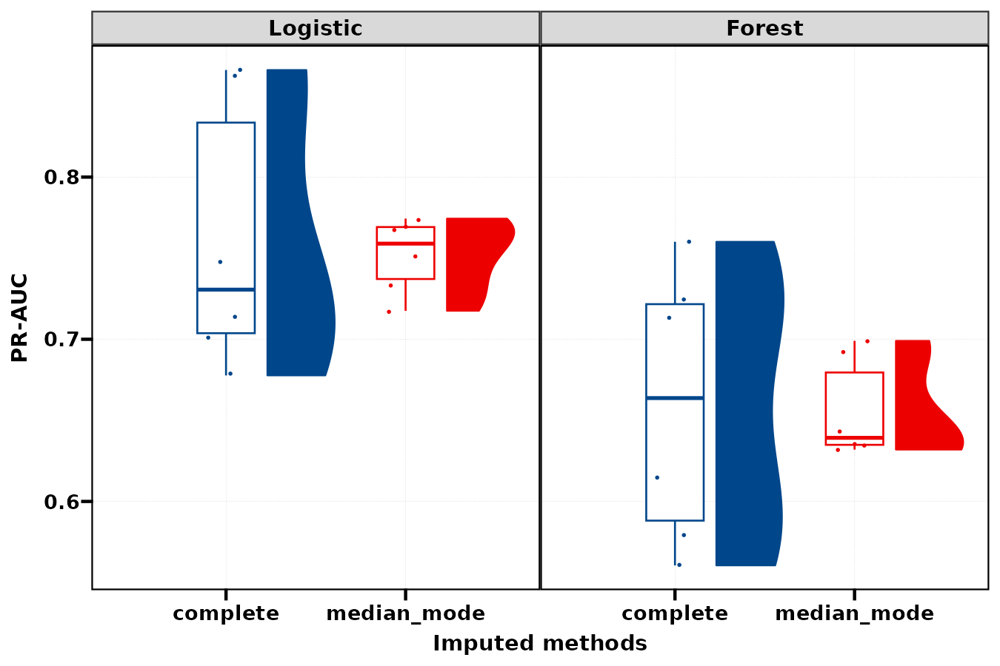{fig-alt="关注 precision / recall，比较时保留正类定义和样本比例。"}


### Brier {.unnumbered}


二分类 brier / bbrier 指向阳性概率的平方误差，越低越好。


```r
plt_bmr(mc, measure = "brier", ncol = 2)
```


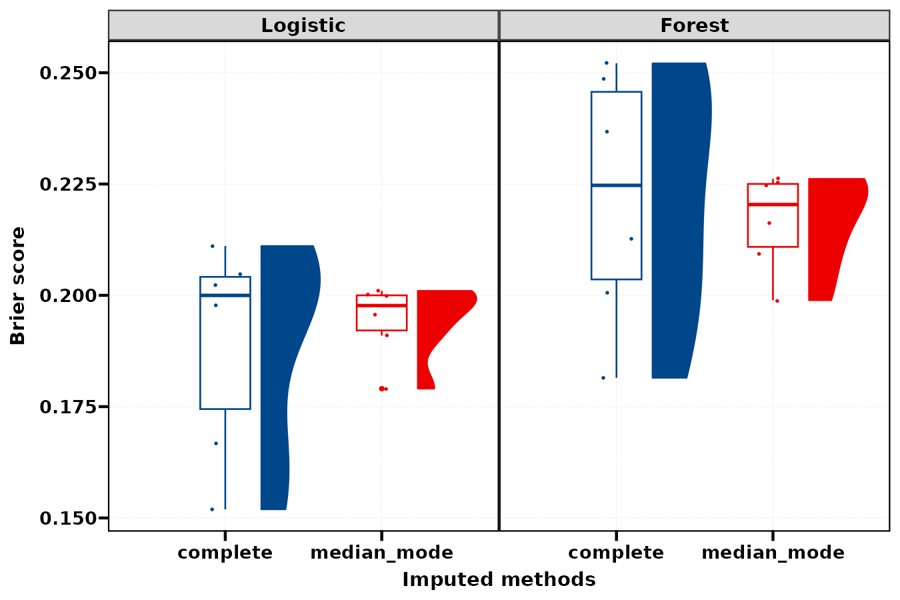{fig-alt="二分类 brier / bbrier 指向阳性概率的平方误差，越低越好。"}


### Log loss {.unnumbered}


更惩罚自信但错误的概率预测，越低越好。


```r
plt_bmr(mc, measure = "logloss", ncol = 2)
```


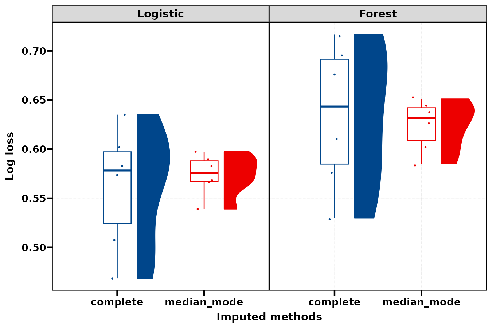{fig-alt="更惩罚自信但错误的概率预测，越低越好。"}


:::


## 环形展示：分布与均值

环形图由基础图形设备绘制。bar 聚合均值，violin / boxplot 保留原始分数；各组仅六个外层分数，分布形状不宜过度解释。

::: {.panel-tabset}


### 生存环形小提琴 {.unnumbered}


同一组折次分数改变为环形分布，使用固定 0–1 范围。


```r
plt_bmr_circle(ms, measure = "cindex", ylim = c(0, 1), circle_args = list(type = "violin", show_points = TRUE))
```


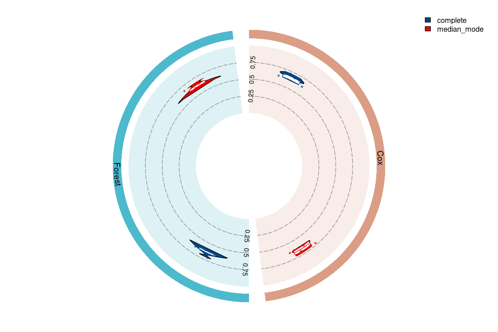{fig-alt="同一组折次分数改变为环形分布，使用固定 0–1 范围。"}


### 二分类环形均值 {.unnumbered}


每根柱为一组外层折次分数均值，不能从该图读取分布。


```r
plt_bmr_circle(mc, measure = "auc", ylim = c(0, 1), circle_args = list(type = "bar"))
```


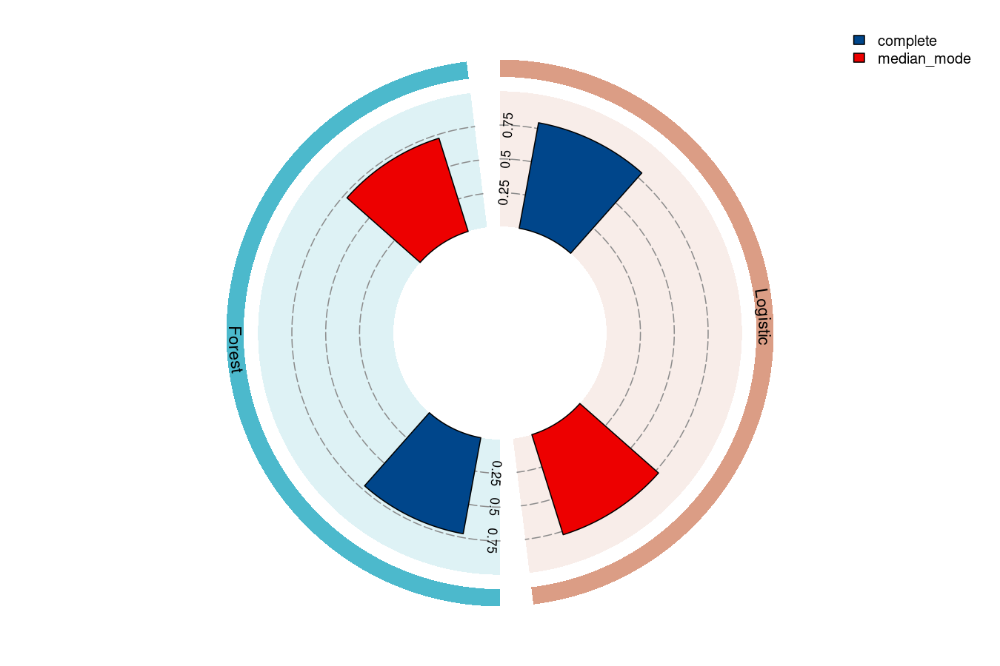{fig-alt="每根柱为一组外层折次分数均值，不能从该图读取分布。"}


### 环形箱线与点 {.unnumbered}


箱线与折次点共享固定尺度，便于判断均值之外的变化。


```r
plt_bmr_circle(mc, measure = "auc", ylim = c(0, 1), circle_args = list(type = "boxplot", show_points = TRUE))
```


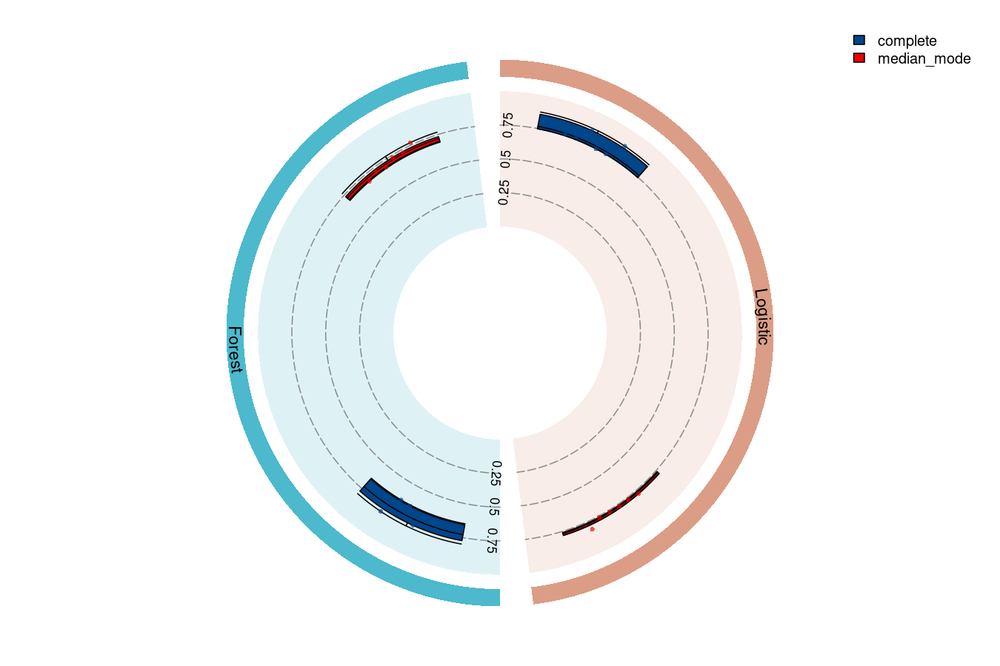{fig-alt="箱线与折次点共享固定尺度，便于判断均值之外的变化。"}


:::


## 参数调整、保存与使用边界 {#parameters}

| 参数 | 作用 | 示例取舍 |
|:--|:--|:--|
| models / imputations | 选择学习器与缺失管线 | 两类模型、两种缺失处理 |
| auto_tuner / inner_folds / n_evals | 调参范围与预算 | 本页固定自定义参数；内置模型需按上文理解 FALSE |
| outer_folds / outer_repeats | 外层验证划分 | 3×2 共六个分数，重复 CV 分数不独立 |
| positive / tune_measure | 二分类方向与优化指标 | Yes；默认分类优化为 AUC |
| backend / workers / store_models | 计算与保存规模 | 顺序运行，不保留每折模型 |
| measure / time / ncol / colors / ylim | 图形指标与呈现 | 同一分数无需重训即可切换 |
| circle_args 的 type / scales / show_points | 环形图统计与尺度 | 分布图与均值图不能互相替代 |

## 表格与实际结果

```r
tb_model_selection(mc, type = "performance", output_format = "data.frame")
tb_model_selection(mc, type = "imputation", output_format = "flextable")
tb_model_selection(mc, type = "model_parameters", output_format = "gt")
```

下面由公开表格的实际 data.frame 结果生成：

| Models | Dataset | AUC | PR-AUC | Brier | Log loss |
| :-- | :-- | :-- | :-- | :-- | :-- |
| Logistic | complete | 0.793 (0.057) | 0.761 (0.083) | 0.189 (0.024) | 0.562 (0.062) |
| Logistic | median_mode | 0.775 (0.021) | 0.752 (0.023) | 0.194 (0.008) | 0.574 (0.021) |
| Forest | complete | 0.722 (0.063) | 0.659 (0.084) | 0.222 (0.028) | 0.634 (0.074) |
| Forest | median_mode | 0.722 (0.028) | 0.656 (0.031) | 0.217 (0.011) | 0.624 (0.026) |

自定义固定参数模型的搜索空间表显示横线；这表示没有配置搜索空间，不是超参数没有实际值。学习器的固定值可通过 `ms_models[["Forest"]][["param_set"]][["values"]]` 查看。

```r
p <- plt_bmr(ms, measure = "cindex")
ggplot2::ggsave("benchmark.pdf", p, width = 9, height = 6)
# 环形图直接绘制到基础设备，不能传给 ggsave
pdf("benchmark-circle.pdf", width = 9, height = 7)
plt_bmr_circle(ms, measure = "cindex", ylim = c(0, 1))
dev.off()
```

完整案例与插补的有效患者集合不同，图中的差异兼有模型和样本选择因素。本页的最高 benchmark 分数是候选比较结果；如果据此选择最优模型，后续仍需独立评估最终选择流程。缺失处理预览表中的组间 P 值也不能证明插补正确。

## 相关页面与源码 {#references}

- [超参数调优](hyper-tuning-guide.qmd)
- [特征筛选](feature-selection-guide.qmd)
- [模型评估](model-evaluation-guide.qmd)
- [MLR 模型筛选源码](https://github.com/HUI950319/MLR/blob/master/R/model-selection.R)
- [mlr3 官方书：重采样](https://mlr3book.mlr-org.com/chapters/chapter3/evaluation_and_benchmarking.html)

本页图片来自上面的实际公共调用。使用固定示例、固定随机种子和注明的小规模设置，图形用于学习接口及解释预测结果。
两类任务的四个组合均成功得到有限分数；ggplot 图形通过实际构建，环形图使用基础设备导出；performance、imputation、model_parameters 三类 data.frame 均实际读回。
