生存 PDP 除变量网格之外，还包含时间维度。本页复用同一个预测剖面，比较固定时间曲线、固定 Age 曲线、等高线、分箱矩阵和三维面；再展示真正二维 PDP。

**版本与执行范围：** 按 MLR 0.1.13 当前源码核对，使用 WSL R 4.4.3 实际导出本页 **16 张参数对照图**。实际训练 Cox 模型，使用 survex 公开入口计算剖面，保存 10 张 R 图形与 6 张交互图预览；每张三维交互预览同时链接完整 HTML，可在页面展开旋转、缩放和悬停。


## 示例准备与读图规则 {#data}

第一套模型使用 598 人 M1 PTC 队列中的 Age、Sex、Tum_3、Race；原始 time 单位为月。第二套连续 × 连续模型使用完整的 Age、Tum、Sex、Race，共 531 人、147 个 DSS 事件；Tum 缺失导致样本集合不同。二者都来自 `ToyData::toy_ptc_m1_cnd`。

纵轴为模型平均 S(t)，不是患者的 Kaplan–Meier 估计或干预效果。横轴组合可能超出实际观测的联合支持；尤其连续变量二维网格需要结合原始样本分布阅读。含两个特征和时间的图，仍称二维 PDP：二维指扫描的特征数量。

```r
library(MLR)
library(ToyData)
library(survex)
library(ggplot2)

d <- as.data.frame(ToyData::toy_ptc_m1_cnd[,
  c("time", "DSS", "Age", "Sex", "Tum_3", "Race")])
d <- droplevels(d[complete.cases(d), ])
e60 <- get_exp(d, vars = c("Age", "Sex", "Tum_3", "Race"), surv = 60)
ex <- e60[["EXP"]]
# 多时间解释器：显式设定完整预测时间网格
ex[["times"]] <- seq(0, 120, 10)
set.seed(246)
pdp <- survex::model_profile(ex, variables = "Age", N = 100,
  variable_splits = list(Age = seq(20, 90, 5)), grid_points = 15)
set.seed(246)
pdp2 <- survex::model_profile_2d(ex,
  variables = list(c("Age", "Sex")), N = 80, grid_points = 8)

d2 <- as.data.frame(ToyData::toy_ptc_m1_cnd[,
  c("time", "DSS", "Age", "Tum", "Sex", "Race")])
d2 <- droplevels(d2[complete.cases(d2), ])
e2 <- get_exp(d2, vars = c("Age", "Tum", "Sex", "Race"), surv = 60)
ex2 <- e2[["EXP"]]
ex2[["times"]] <- seq(0, 120, 10)
set.seed(246)
pdp4 <- survex::model_profile_2d(ex2,
  variables = list(c("Age", "Tum")), N = 80, grid_points = 8)

# 检查绘图器将精确匹配哪些值
sort(unique(pdp[["result"]][["_times_"]]))
sort(unique(pdp[["result"]][["_x_"]]))
```


## get_pdp2()：两列同时替换的联合响应 {#get-pdp2}

本节按 MLR 0.1.13 源码 `95d3204` 核对，以下合成二分类示例在 WSL R 4.4.3 中实际执行。

`get_pdp2()` 同时将两列设为每个网格组合，再对同一批背景患者平均预测。它同时包含主效应和交互，不能把二维表面本身当作“纯交互”。与本页之前基于 survex 的多时间绘图对象不同，这个入口直接返回 ggplot。

```r
get_pdp2(EXP.obj, exp_var, N = 1000, scale = c("prob", "link"),
  engine = c("iml", "pdp"), cores = NULL, save = list())
```

```r
library(MLR)
library(ggplot2)
set.seed(246)
n <- 300L
dc <- data.frame(Age = runif(n, 20, 85),
  Sex = factor(sample(c("Female", "Male"), n, TRUE)),
  Marker = rnorm(n), Group = factor(sample(c("A", "B"), n, TRUE)))
prob <- plogis(-0.4 + (dc[["Age"]] - 50) / 20 +
  0.5 * (dc[["Sex"]] == "Male") + 0.8 * dc[["Marker"]] +
  0.7 * dc[["Marker"]] * (dc[["Group"]] == "B"))
dc[["Outcome"]] <- factor(ifelse(runif(n) < prob, "Yes", "No"),
  levels = c("No", "Yes"))
cvars <- c("Age", "Sex", "Marker", "Group")

ec_joint <- get_exp(dc, vars = cvars, surv = "Outcome", model = "ranger", cores = 1)
joint_pd <- get_pdp2(ec_joint, c("Marker", "Group"), N = 300, scale = "prob", cores = 1)
joint_pd
head(joint_pd$data)   # x1、x2、pd；data 属性还记录 vars 和 kind
```

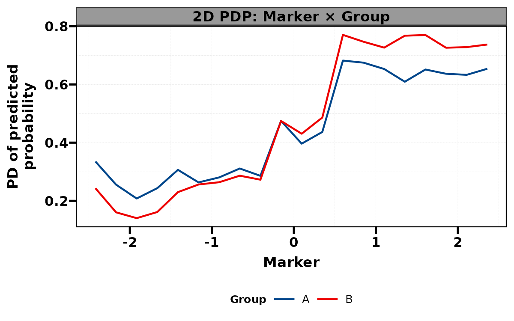{fig-alt="ranger 分类模型的 Marker 与 Group 二维 PDP，纵轴为平均预测事件概率，包括两列主效应与交互。"}

默认 `N=1000`；超过 N 时使用当前行顺序上的等间隔背景行，所有网格共享这些行，不消耗随机数。这里的 MLR 抽样规则与 causalR 的固定种子随机抽样不同。`N=NULL` 使用全部背景行，预测成本随网格大小乘背景人数增长。

`scale="prob"` 显示 S(t) 或事件概率；`"link"` 是 log 累积风险或 logit，对 Cox、Logistic 等对应工作模型有明确解释。随机森林建议显式使用概率尺度。`engine="iml"` 是本例执行后端；另一后端须满足当前帮助中的 pdp 版本要求。

若要去除主效应观察二阶交互，使用 [get_ale2 的同模型对照](vpd-guide.qmd)。它依然是模型解释，不是正式交互显著性检验。

## 接口、返回对象与分析流程 {#interface}

计算采用 survex 的公开 `model_profile()` / `model_profile_2d()`；MLR 的 `.get_profile_sur()` 是内部 helper，本文示例无需调用它。绘图读取聚合后的 `pdp[["result"]]`；个体剖面与平均 PDP 不应混用。

| MLR 绘图入口 | 呈现 | 返回 |
|:--|:--|:--|
| plt_pdp_con_time | 固定 timepoints 的变量曲线 | ggplot |
| plt_pdp_con_line | 固定 con_value 的生存时间曲线 | ggplot |
| plt_pdp_con_area | 按连续变量渐变着色的时间曲线 | ggplot |
| plt_pdp_con_contour | bins / binwidth 控制的等高线 | ggplot |
| plt_pdp_con_matrix | n_col × n_row 分箱平均 | ggplot |
| plt_pdp_3D | display 1 静态、2 交互曲面 | NULL / plotly |
| plt_pdp2_3D | 连续 × 分类的多面、散点或水平差 | plotly |
| plt_pdp2_3D4 | 连续 × 连续，按时间着色 | plotly |

`get_vpd(exp_var = c(group, focus))` 生成分组一维曲线；这里的 `model_profile_2d()` 同时扫描两个特征，在同一个参考样本上平均，是二维联合响应。水平差曲面描述预测差，没有显著性检验或因果解释。

## 固定时间与固定变量值

时间和变量值必须实际存在于网格；这些绘图器使用精确匹配，不会自动插值。

::: {.panel-tabset}


### 30 / 60 月 {.unnumbered}


同一平均预测剖面切出两个随访时间。


```r
plt_pdp_con_time(pdp, timepoints = c(30, 60))
```


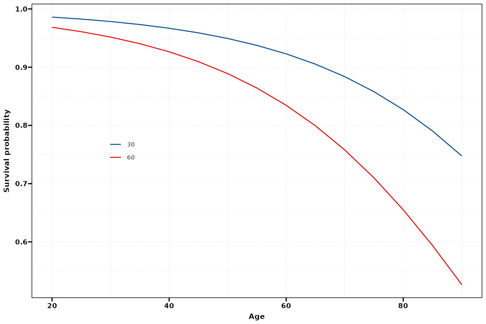{fig-alt="同一平均预测剖面切出两个随访时间。"}


### 60 / 90 / 120 月 {.unnumbered}


改变 timepoints 后，比较的是不同 S(t)，不是新的模型。


```r
plt_pdp_con_time(pdp, timepoints = c(60, 90, 120))
```


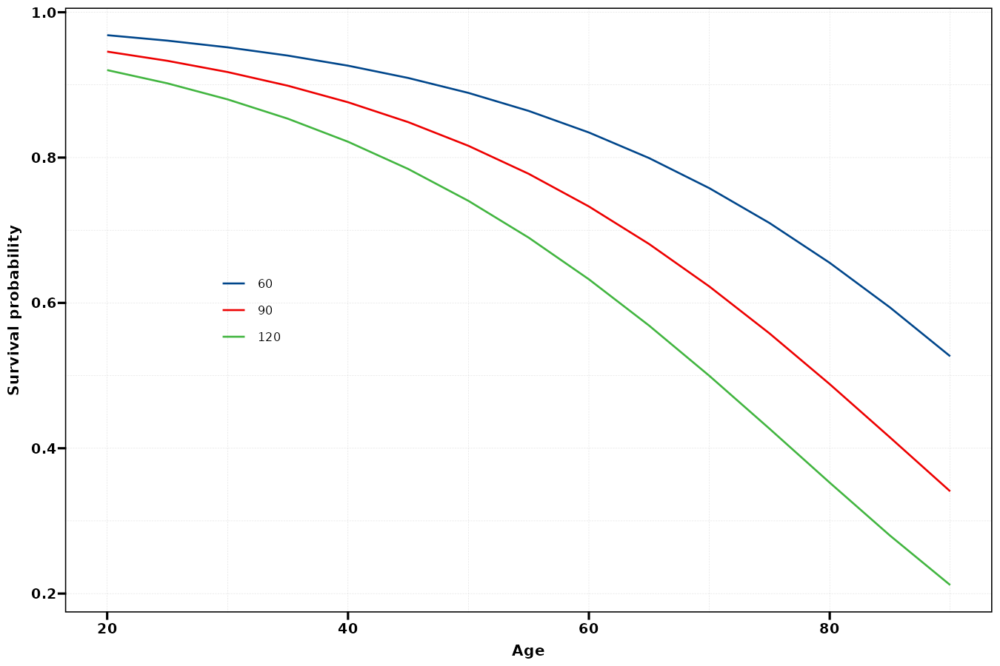{fig-alt="改变 timepoints 后，比较的是不同 S(t)，不是新的模型。"}


### 四个 Age 值 {.unnumbered}


固定年龄，观察平均生存曲线随时间的变化。


```r
plt_pdp_con_line(pdp, con_value = c(30, 50, 70, 90))
```


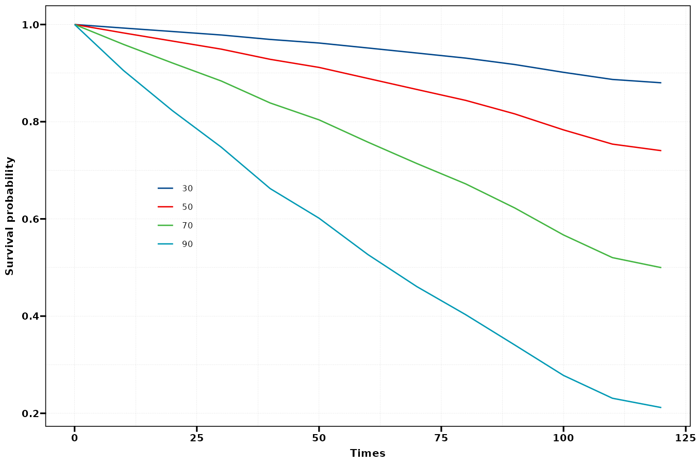{fig-alt="固定年龄，观察平均生存曲线随时间的变化。"}


### 密集 Age 值 {.unnumbered}


更多曲线会自动扩展色板，增加密度也增加读图负担。


```r
plt_pdp_con_line(pdp, con_value = seq(20, 90, 5))
```


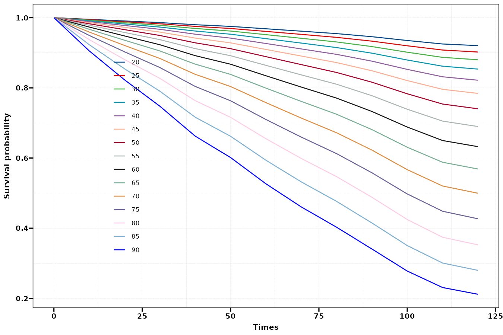{fig-alt="更多曲线会自动扩展色板，增加密度也增加读图负担。"}


:::


## 曲线、等高线与矩阵

同一个预测面可以用曲线、等高线或分箱矩阵展示。分箱平均与连续网格的单点预测不同。

::: {.panel-tabset}


### 连续颜色曲线 {.unnumbered}


area 名称对应渐变着色的多条曲线，没有表示置信区间的带状区域。


```r
plt_pdp_con_area(pdp)
```


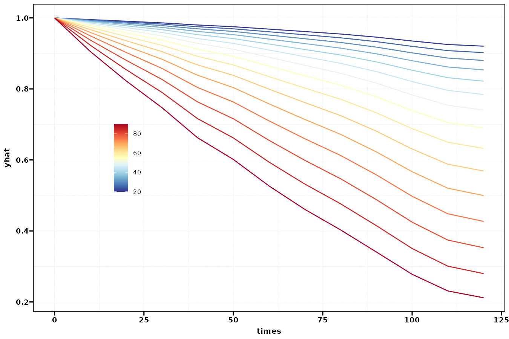{fig-alt="area 名称对应渐变着色的多条曲线，没有表示置信区间的带状区域。"}


### 5 档等高线 {.unnumbered}


较少颜色层级，突出大范围变化。


```r
plt_pdp_con_contour(pdp, bins = 5)
```


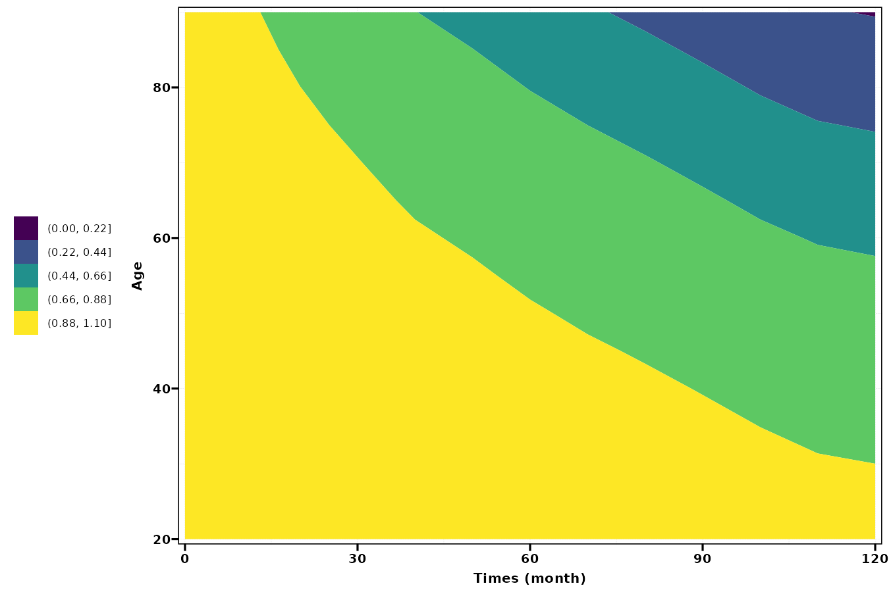{fig-alt="较少颜色层级，突出大范围变化。"}


### 10 档等高线 {.unnumbered}


只增加显示层级，没有增加估计精度。


```r
plt_pdp_con_contour(pdp, bins = 10)
```


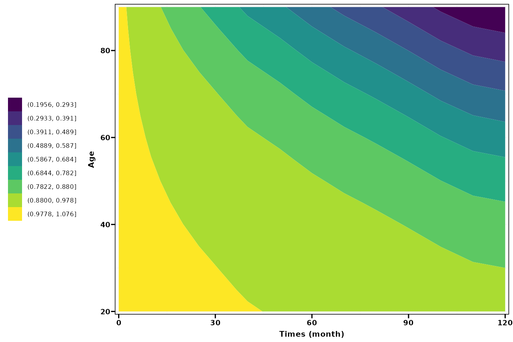{fig-alt="只增加显示层级，没有增加估计精度。"}


### 4 × 4 分箱 {.unnumbered}


每格为时间与 Age 分箱后的平均预测，标注三位小数。


```r
plt_pdp_con_matrix(pdp, n_col = 4, n_row = 4)
```


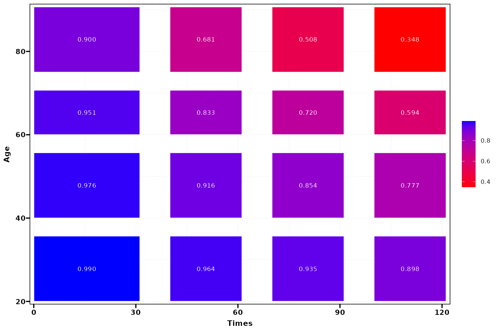{fig-alt="每格为时间与 Age 分箱后的平均预测，标注三位小数。"}


### 6 × 7 分箱 {.unnumbered}


分箱变细，格内预测点较少；不等于新增观测。


```r
plt_pdp_con_matrix(pdp, n_col = 6, n_row = 7)
```


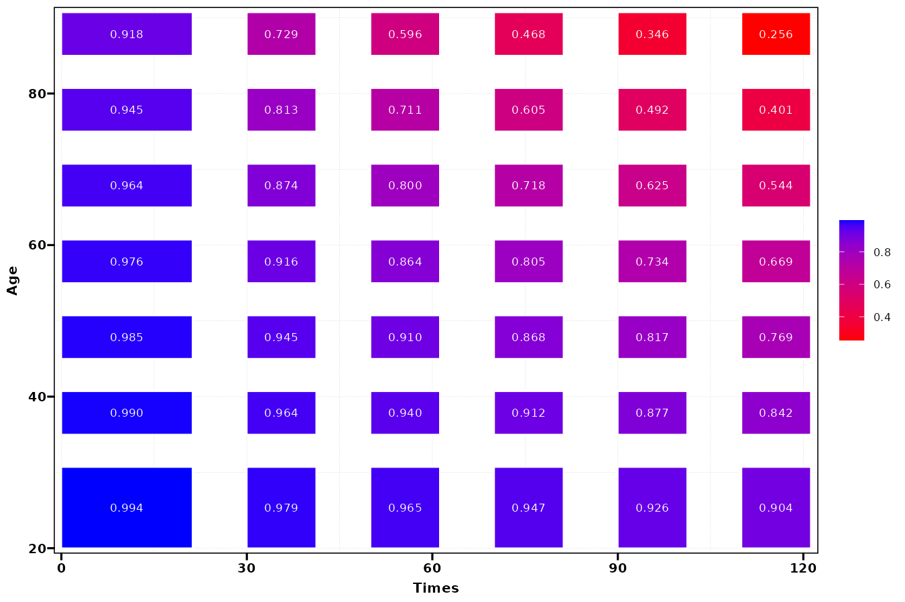{fig-alt="分箱变细，格内预测点较少；不等于新增观测。"}


:::


## 三维预测面

本节同时保留静态预览与可旋转的 Plotly 实例。三维坐标里的时间方向应结合轴标题阅读。

::: {.panel-tabset}


### 静态三维面 {.unnumbered}


plot3D 后端在图形设备直接绘图，返回 invisible(NULL)。


```r
plt_pdp_3D(pdp, display = "1")
```


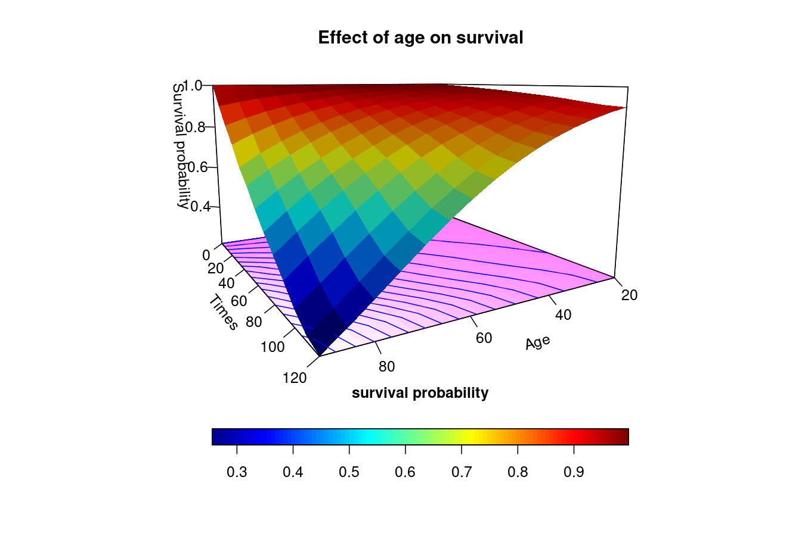{fig-alt="plot3D 后端在图形设备直接绘图，返回 invisible(NULL)。"}


### 一维变量 × 时间 {.unnumbered}


Plotly 预测面；可旋转、缩放和悬停查看模型的平均 S(t)。


```r
plt_pdp_3D(pdp, display = "2")
```


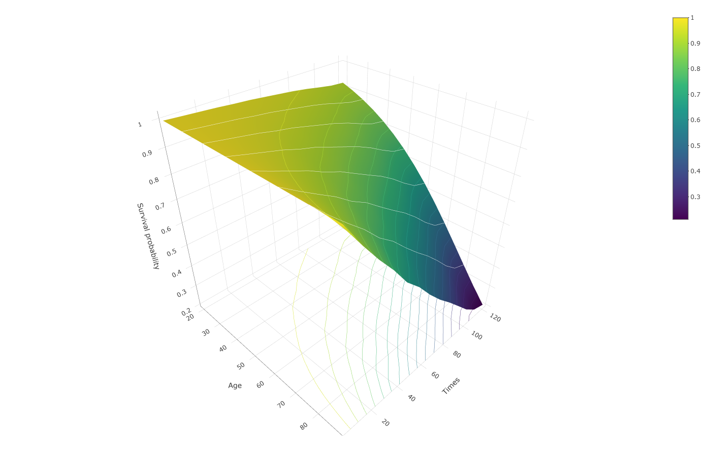{fig-alt="Plotly 预测面；可旋转、缩放和悬停查看模型的平均 S(t)。"}


[打开可旋转的交互图](images/pdp-guide/surface-interactive.html)


<details><summary>展开交互图：旋转、缩放和悬停</summary><iframe src="images/pdp-guide/surface-interactive.html" title="一维变量 × 时间" loading="lazy" style="width:100%;height:650px;border:0;"></iframe></details>


:::


## 真正二维 PDP：连续 × 分类


::: {.panel-tabset}


### Age × Sex：多曲面 {.unnumbered}


分别固定 Sex 水平和 Age，同时在同一参考样本上平均；半透明曲面可能互相遮挡。


```r
plt_pdp2_3D(pdp2, display = "1")
```


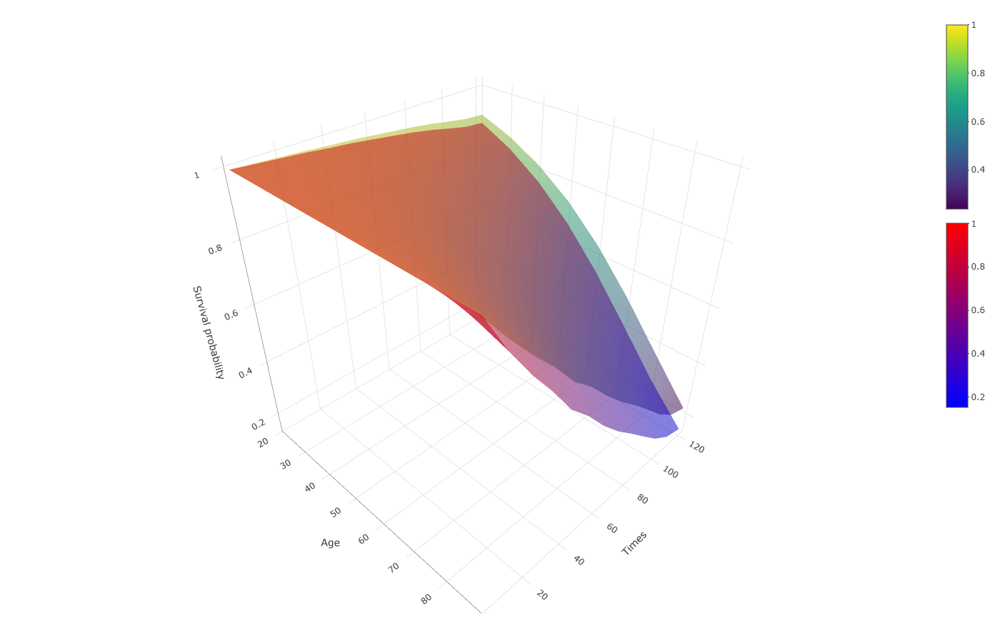{fig-alt="分别固定 Sex 水平和 Age，同时在同一参考样本上平均；半透明曲面可能互相遮挡。"}


[打开可旋转的交互图](images/pdp-guide/pair-surfaces.html)


<details><summary>展开交互图：旋转、缩放和悬停</summary><iframe src="images/pdp-guide/pair-surfaces.html" title="Age × Sex：多曲面" loading="lazy" style="width:100%;height:650px;border:0;"></iframe></details>


### Age × Sex：散点 {.unnumbered}


相同二维结果换成分类着色散点；坐标依次为 Age、时间与生存概率。


```r
plt_pdp2_3D(pdp2, display = "2")
```


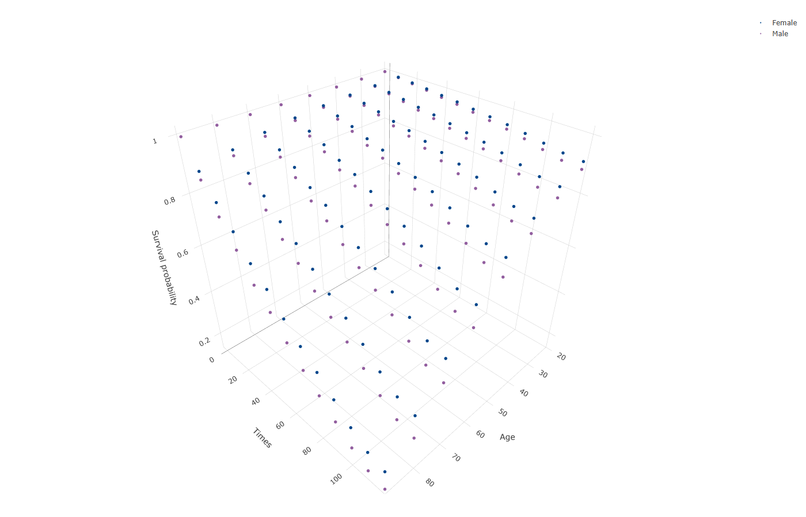{fig-alt="相同二维结果换成分类着色散点；坐标依次为 Age、时间与生存概率。"}


[打开可旋转的交互图](images/pdp-guide/pair-scatter.html)


<details><summary>展开交互图：旋转、缩放和悬停</summary><iframe src="images/pdp-guide/pair-scatter.html" title="Age × Sex：散点" loading="lazy" style="width:100%;height:650px;border:0;"></iframe></details>


### Female − Male {.unnumbered}


固定变量组合的平均 S(t) 差，顺序为 Female 减 Male；不是因果效应或交互检验。


```r
plt_pdp2_3D(pdp2, vs_vars = c("Female", "Male"), display = "3")
```


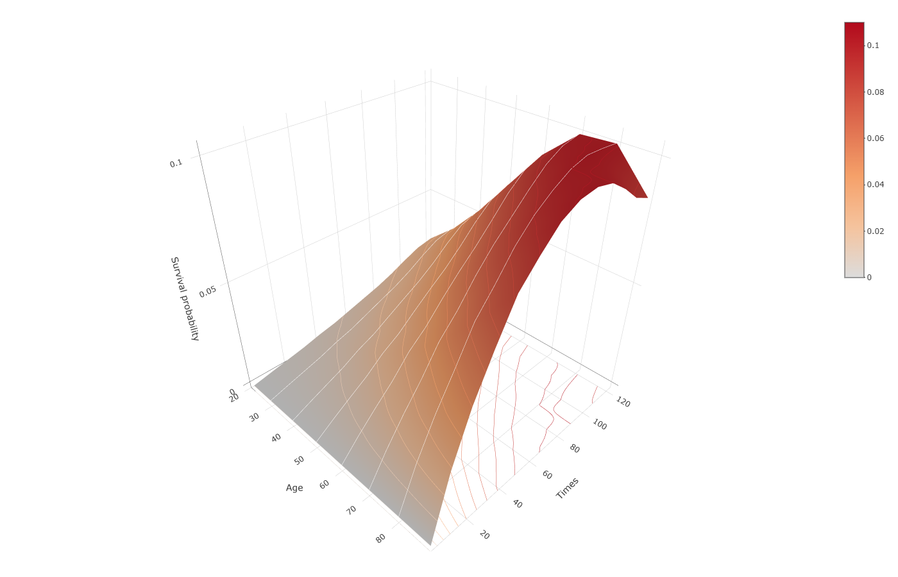{fig-alt="固定变量组合的平均 S(t) 差，顺序为 Female 减 Male；不是因果效应或交互检验。"}


[打开可旋转的交互图](images/pdp-guide/pair-difference.html)


<details><summary>展开交互图：旋转、缩放和悬停</summary><iframe src="images/pdp-guide/pair-difference.html" title="Female − Male" loading="lazy" style="width:100%;height:650px;border:0;"></iframe></details>


:::


## 真正二维 PDP：连续 × 连续


::: {.panel-tabset}


### Age × Tum：60 月 {.unnumbered}


两个连续变量的联合网格，颜色对应一个固定时间；此示例重新拟合 Age、Tum、Sex、Race 模型。


```r
plt_pdp2_3D4(pdp4, timepoints = 60)
```


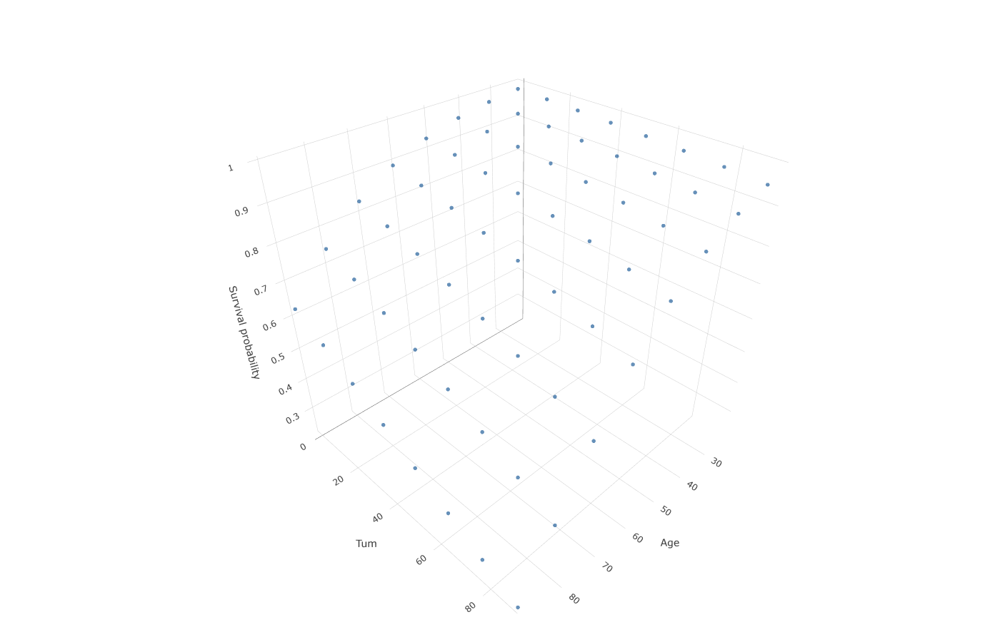{fig-alt="两个连续变量的联合网格，颜色对应一个固定时间；此示例重新拟合 Age、Tum、Sex、Race 模型。"}


[打开可旋转的交互图](images/pdp-guide/numeric-60.html)


<details><summary>展开交互图：旋转、缩放和悬停</summary><iframe src="images/pdp-guide/numeric-60.html" title="Age × Tum：60 月" loading="lazy" style="width:100%;height:650px;border:0;"></iframe></details>


### 三个时间层 {.unnumbered}


在三维散点中用颜色区分预测时间；同一变量组合可有三点。


```r
plt_pdp2_3D4(pdp4, timepoints = c(30, 60, 120), type = "scatter3d")
```


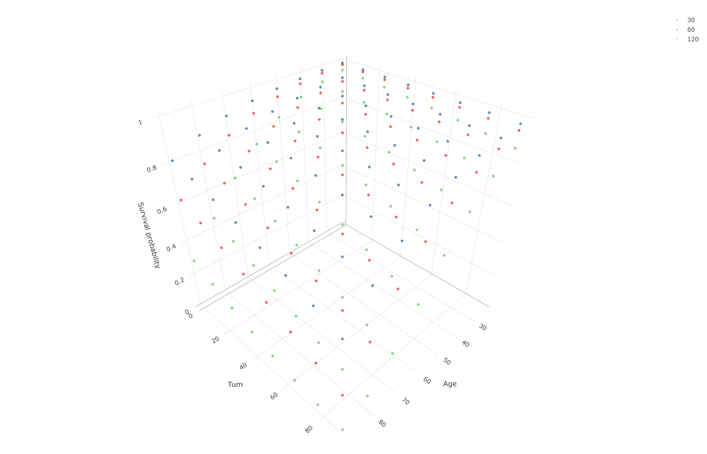{fig-alt="在三维散点中用颜色区分预测时间；同一变量组合可有三点。"}


[打开可旋转的交互图](images/pdp-guide/numeric-multi.html)


<details><summary>展开交互图：旋转、缩放和悬停</summary><iframe src="images/pdp-guide/numeric-multi.html" title="三个时间层" loading="lazy" style="width:100%;height:650px;border:0;"></iframe></details>


:::


## 参数调整、保存与使用边界 {#parameters}

| 参数 | 作用 | 本页对照 |
|:--|:--|:--|
| N / grid_points / variable_splits | 参考样本与特征计算网格 | 100 / 80 人；明确 Age 网格 |
| explainer 的 times | 生存预测计算时间网格 | 0–120 月，间隔 10 月 |
| timepoints | 从已有时间中精确筛选 | 30/60 与 60/90/120 |
| con_value | 从已有特征值中精确筛选 | 稀疏与密集 Age 值 |
| bins / binwidth | 等高线色阶 | 5 档与 10 档 |
| n_col / n_row | 时间 × 特征分箱 | 4×4 与 6×7 |
| display | 静态/交互；多面/散点/差值 | 本页所有支持模式 |
| vs_vars | display 3 的相减方向 | Female − Male |

`plt_pdp_con_time()` / `plt_pdp_con_line()` / `plt_pdp2_3D4()` 不会为不存在的值插值；先核对 result，否则可能得到空图。`plt_pdp_con_area()` 实际画渐变曲线，名称不表示置信区间。

```r
p <- plt_pdp_con_time(pdp, timepoints = c(30, 60))
ggplot2::ggsave("pdp-time.pdf", p, width = 9, height = 6)
w <- plt_pdp_3D(pdp, display = "2")
htmlwidgets::saveWidget(w, "pdp-surface.html", selfcontained = TRUE)
```

survex 1.2.0 的二维实现，在扫描两列后仅剩一列时可能因自动降维而丢失列名；本页实际使用四特征解释器完成验证。小规模参考抽样可产生无事件子样本的上游提示，本文图形仍是已拟合 Cox 的平均预测，不包含模型开发不确定性。三维多曲面可能互相遮挡，宜同时查看散点和二维切片。

## 相关页面与源码 {#references}

- [变量分布与一维 PDP](vpd-guide.qmd)
- [预测交互统计量](interaction-guide.qmd)
- [MLR PDP 绘图源码](https://github.com/HUI950319/MLR/blob/master/R/vpd-pdp-plt.R)
- [survex 官方文档](https://modeloriented.github.io/survex/)
- [Plotly R 官方文档](https://plotly.com/r/)

本页图片来自上面的实际公共调用。使用固定示例、固定随机种子和注明的小规模设置，图形用于学习接口及解释预测结果。
8 个公开入口全部实际运行；静态图经过构建/图形设备导出，交互对象经过 plotly_build 与浏览器渲染预览。HTML 自包含，网页中不依赖本机 R 运行时。
