在 SHAP 空间中聚类，可以把相似的模型解释放在一起。先用 `get_shp_k()` 诊断 K，再用 `get_shp_clust()` 得到分组、簇内贡献与轮廓，最后由 `get_shp_assign()` 演示固定中心的样本分配。

**版本与执行范围：** 按 MLR 0.1.13 当前源码核对，使用 WSL R 4.4.3 实际导出本页 **15 张参数对照图**。使用已有预计算 SHAP 对象，实际运行聚类与所有图形；未重新训练预测模型或重新计算 SHAP。


## 示例准备与读图规则 {#data}

复用 [SHAP 页面](shap-guide.qmd)中的 `ToyData::toy_shp`：SEER PDAC、TNM I 期示例分析的 400 个观测、14 个变量。它是 shapviz 对象，含 S、X、baseline 和 S_inter。聚类只需要 S，不需要交互数组。

该对象 baseline = 0，因此图中的解释输出按 `baseline + rowSums(S)` 构造；它不是已经校准的死亡概率或 HR。标准化只用于聚类距离，热图和堆叠贡献保留原始单位。簇编号只是标签，不代表风险顺序，也没有临床亚型有效性的含义。

```r
library(MLR)
library(ToyData)
library(ggplot2)
sv <- ToyData::toy_shp
kobj <- get_shp_k(sv, k_range = 2:6,
  method = c("elbow", "silhouette", "gap", "clustree"),
  nboot = 10, nstart = 10, seed = 246)
kraw <- get_shp_k(sv, k_range = 2:6,
  method = c("elbow", "silhouette"), scale = FALSE,
  nstart = 10, seed = 246)
kh <- get_shp_k(sv, k_range = 2:6,
  method = c("elbow", "silhouette"), cluster_fun = "hclust", seed = 246)
c2 <- get_shp_clust(sv, k = 2)
c3 <- get_shp_clust(sv, k = 3, compare = TRUE)
c4 <- get_shp_clust(sv, k = 4)
ch <- get_shp_clust(sv, k = 3, cluster_fun = "hclust")
cr <- get_shp_clust(sv, k = 3, scale = FALSE)

# 从同一预计算解释对象切分样本，演示接口，不是外部验证
train_sv <- sv[["S"]][1:300, , drop = FALSE]
test_sv <- sv[["S"]][301:400, , drop = FALSE]
ct <- get_shp_clust(train_sv, k = 3)
ae <- get_shp_assign(ct, test_sv, distance = "euclidean")
am <- get_shp_assign(ct, test_sv, distance = "manhattan")
assigned <- rbind(
  data.frame(cluster = ae[["cluster"]], dist = ae[["dist"]], distance = "Euclidean"),
  data.frame(cluster = am[["cluster"]], dist = am[["dist"]], distance = "Manhattan"))
```


## 接口、返回对象与分析流程 {#interface}

| 入口 | 返回字段 | 主要用途 |
|:--|:--|:--|
| get_shp_k | k、tab、plt、obj | K 诊断曲线、方法建议与中间对象 |
| get_shp_clust | k、cluster、size、tab、sil、compare、obj | 标签、簇规模、贡献汇总、轮廓和模型 |
| get_shp_assign | cluster、dist、centers | 新样本的固定中心标签与距离 |

`kobj[["k"]]` 对提供数值建议的方法进行多数票汇总，平票取较小 K；clustree 是关系诊断，不参与数值投票。方法还支持 nbclust 和 consensus，分别需 NbClust 和 ConsensusClusterPlus；可用 `nbclust_args` / `consensus_args` 调整其诊断。

`compare = TRUE` 在 X 上另外聚类，返回与 SHAP 标签的比较，包括 ARI。它描述输入空间与解释空间的一致性，没有验证亚型的生物学或预后意义。`size` 中 mean_fx 是解释输出的簇均值，mean_sil 是轮廓宽度均值；`tab` 保留每簇的 mean_shap、mean_abs_shap 和原始特征摘要。

分配使用训练空间的中心及训练均值/标准差；新样本不能自行标准化后再替换进来。需要相同变量、同一模型输出单位和兼容 SHAP 背景。为新队列重新训练模型会改变解释坐标，不能直接视为同一个固定中心验证。

```r
get_shp_k(shp, k_range = 2:10,
  method = c("elbow", "silhouette", "gap", "clustree"),
  cluster_fun = c("kmeans", "hclust"), scale = TRUE,
  nboot = 50, nstart = 25, hc_method = "ward.D2", seed = 246,
  nbclust_args = list(), consensus_args = list(), ncol = 2, save = list())
get_shp_clust(shp, k, cluster_fun = c("kmeans", "hclust"),
  scale = TRUE, nstart = 25, hc_method = "ward.D2", seed = 246,
  silhouette = TRUE, compare = FALSE)
get_shp_assign(clust, shp, distance = c("euclidean", "manhattan"))
```


## 选择 K：多诊断与尺度

不要仅凭投票选 K。诊断可能不一致，需要结合簇规模、轮廓宽度与解释内容判断。

::: {.panel-tabset}


### 四种 K 诊断 {.unnumbered}


肘部、轮廓、Gap 和 clustree；clustree 展示分组关系，不参与数值投票。


```r
kobj[["plt"]]
```


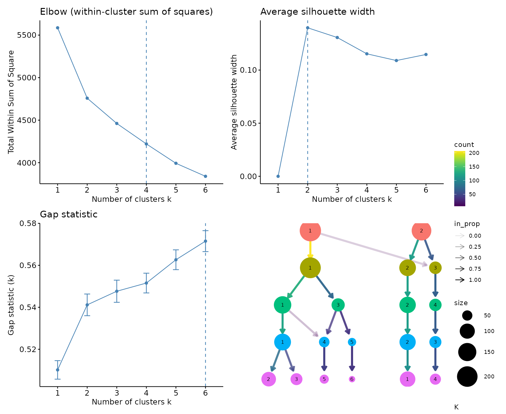{fig-alt="肘部、轮廓、Gap 和 clustree；clustree 展示分组关系，不参与数值投票。"}


### 不标准化 SHAP {.unnumbered}


scale = FALSE 保留原始贡献幅度，贡献方差大的特征更影响距离。


```r
kraw[["plt"]]
```


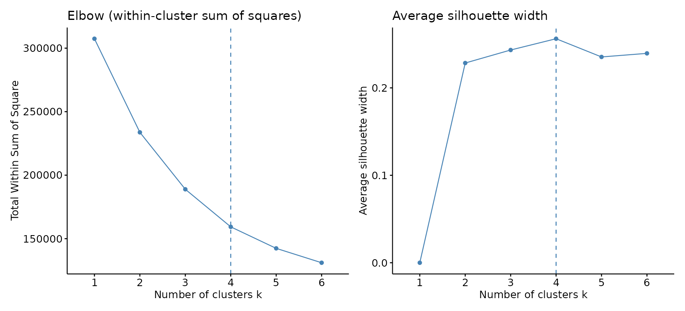{fig-alt="scale = FALSE 保留原始贡献幅度，贡献方差大的特征更影响距离。"}


### 层次聚类 {.unnumbered}


使用 hclust + ward.D2，K 的诊断依赖聚类算法。


```r
kh[["plt"]]
```


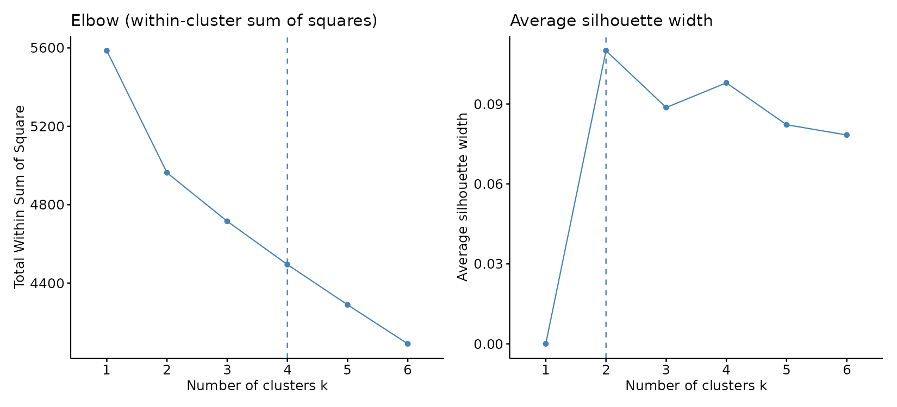{fig-alt="使用 hclust + ward.D2，K 的诊断依赖聚类算法。"}


:::


## K 与算法对分组的影响

每次只改 K 或算法，投影方向由输入空间决定。二维重叠不等于原空间没有分离。

::: {.panel-tabset}


### K = 2 {.unnumbered}


PCA 投影显示两个簇；颜色来自原 SHAP 空间聚类。


```r
plt_shp_map(sv, clust = c2, embed = "pca")
```


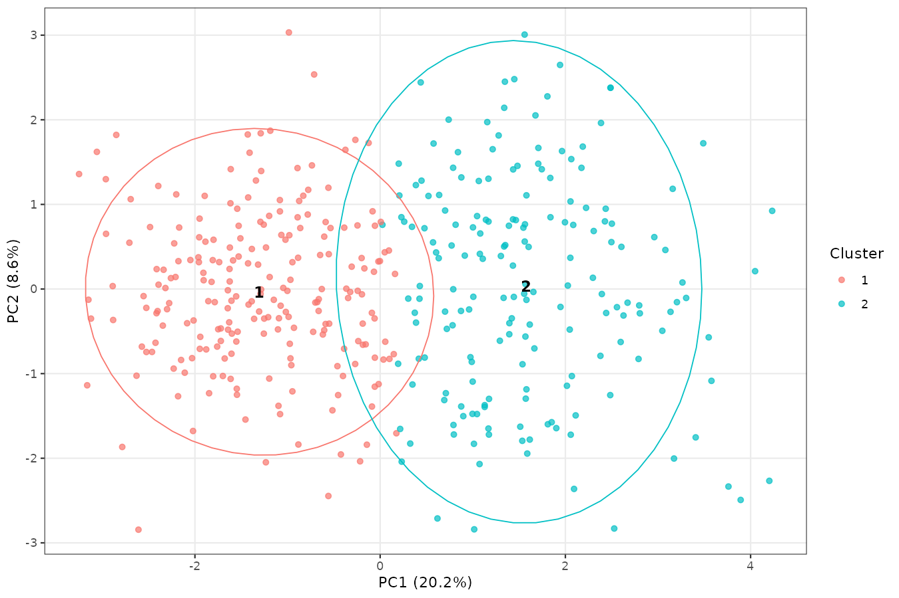{fig-alt="PCA 投影显示两个簇；颜色来自原 SHAP 空间聚类。"}


### K = 3 {.unnumbered}


固定 K = 3，以中心聚类得到解释分组。


```r
plt_shp_map(sv, clust = c3, embed = "pca")
```


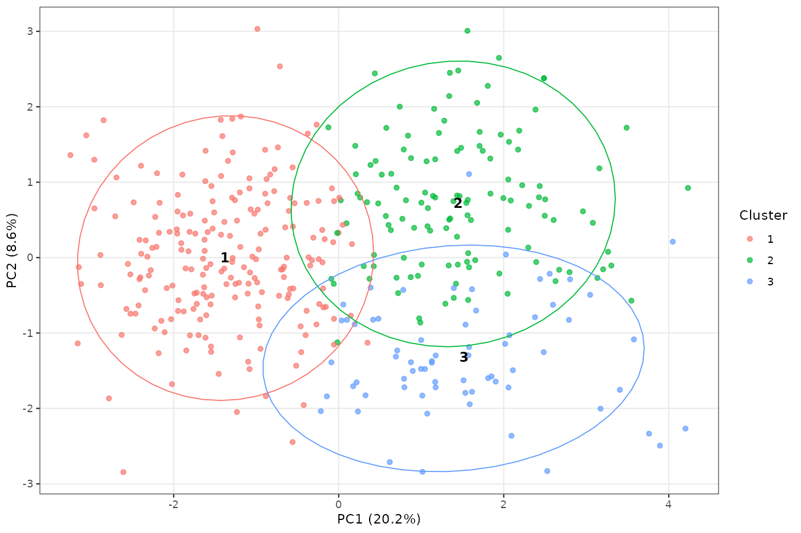{fig-alt="固定 K = 3，以中心聚类得到解释分组。"}


### K = 4 {.unnumbered}


更细分组会改变簇规模与解释内容。


```r
plt_shp_map(sv, clust = c4, embed = "pca")
```


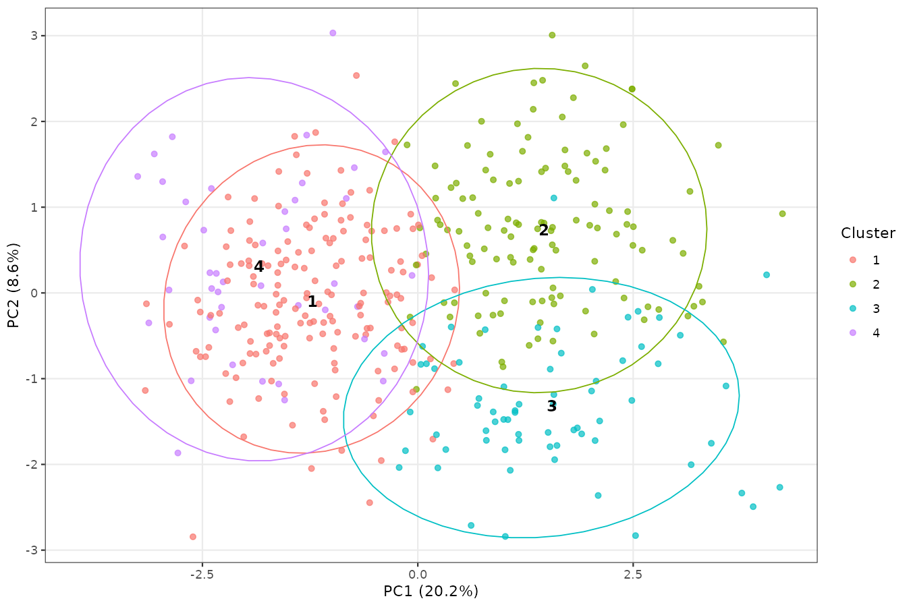{fig-alt="更细分组会改变簇规模与解释内容。"}


### 层次聚类与凸包 {.unnumbered}


同样 K = 3，更换算法；outline = hull 只改变边界显示。


```r
plt_shp_map(sv, clust = ch, outline = "hull")
```


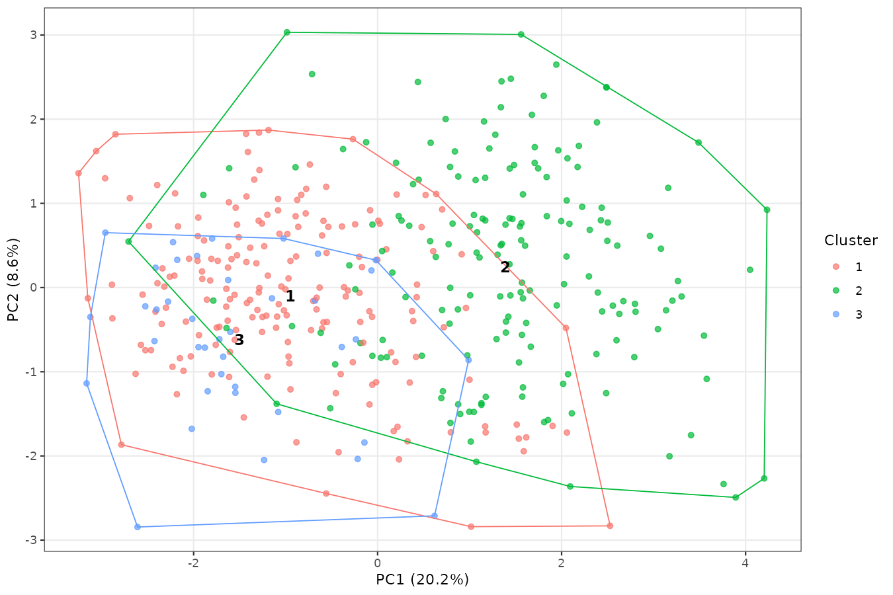{fig-alt="同样 K = 3，更换算法；outline = hull 只改变边界显示。"}


### 原始幅度空间 {.unnumbered}


scale = FALSE 的聚类空间与其投影一致，颜色不能直接对齐其他图的簇编号。


```r
plt_shp_map(sv, clust = cr)
```


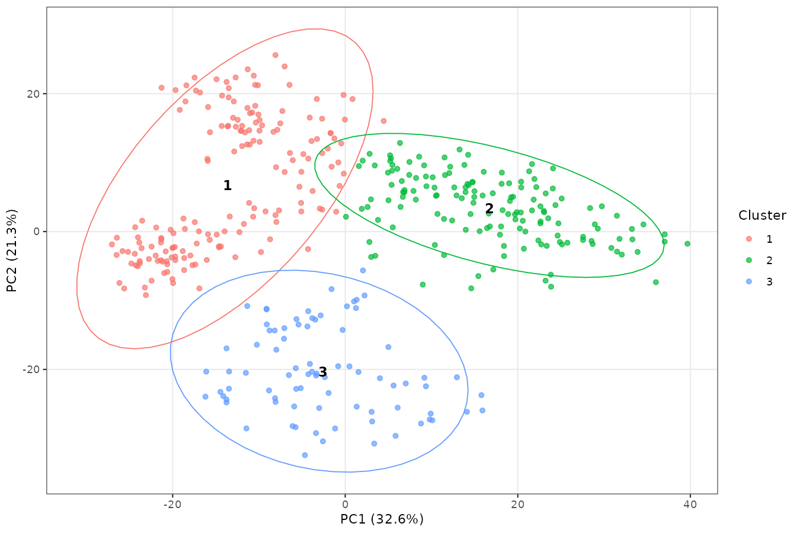{fig-alt="scale = FALSE 的聚类空间与其投影一致，颜色不能直接对齐其他图的簇编号。"}


:::


## 展示贡献结构

K 在高维 SHAP 空间中确定；PCA/UMAP 用于展示。聚类计算的标准化不改变下面热图和堆叠图的原始 SHAP 单位。

::: {.panel-tabset}


### UMAP {.unnumbered}


投影改为 UMAP，复用 c3 标签；它没有重新定义聚类。


```r
plt_shp_map(sv, clust = c3, embed = "umap", embed_args = list(n_neighbors = 20, min_dist = 0.3), outline = "none", seed = 246)
```


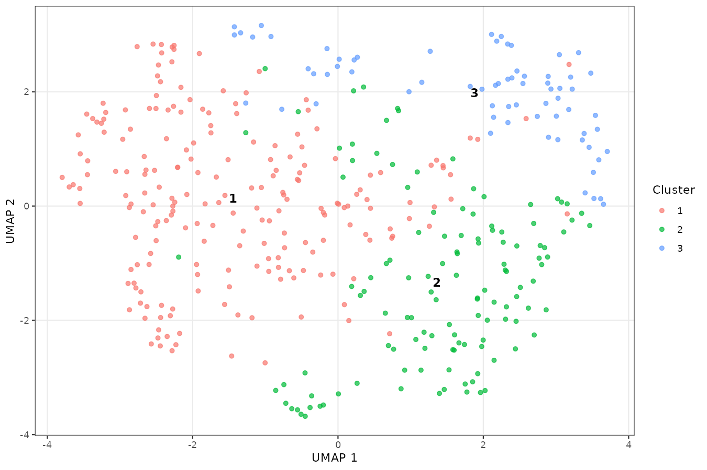{fig-alt="投影改为 UMAP，复用 c3 标签；它没有重新定义聚类。"}


### 按簇排列热图 {.unnumbered}


保留前 7 项与其他贡献合计，展示原始 SHAP 的正负结构。


```r
plt_shp_heatmap(sv, clust = c3, display.ncol = 8, sample_order = "cluster")
```


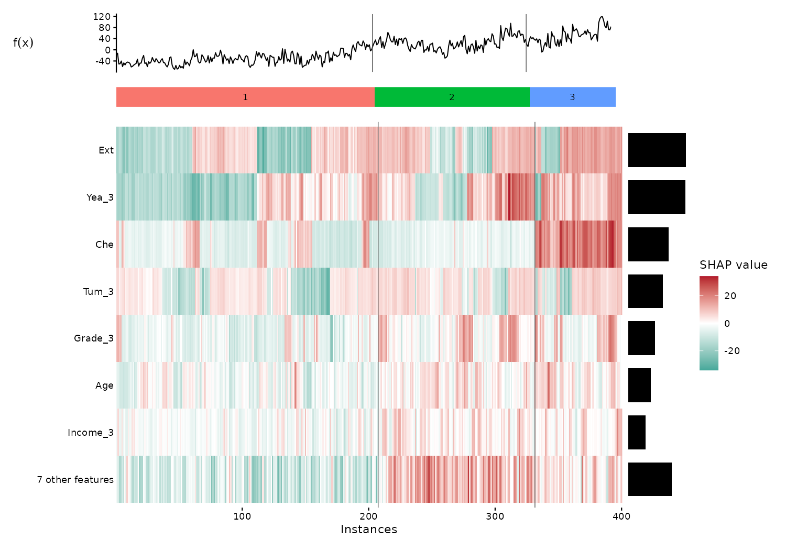{fig-alt="保留前 7 项与其他贡献合计，展示原始 SHAP 的正负结构。"}


### 按预测排序 {.unnumbered}


更少特征和预测排序，折叠的其他贡献仍保留行和。


```r
plt_shp_heatmap(sv, clust = c3, display.ncol = 5, sample_order = "prediction")
```


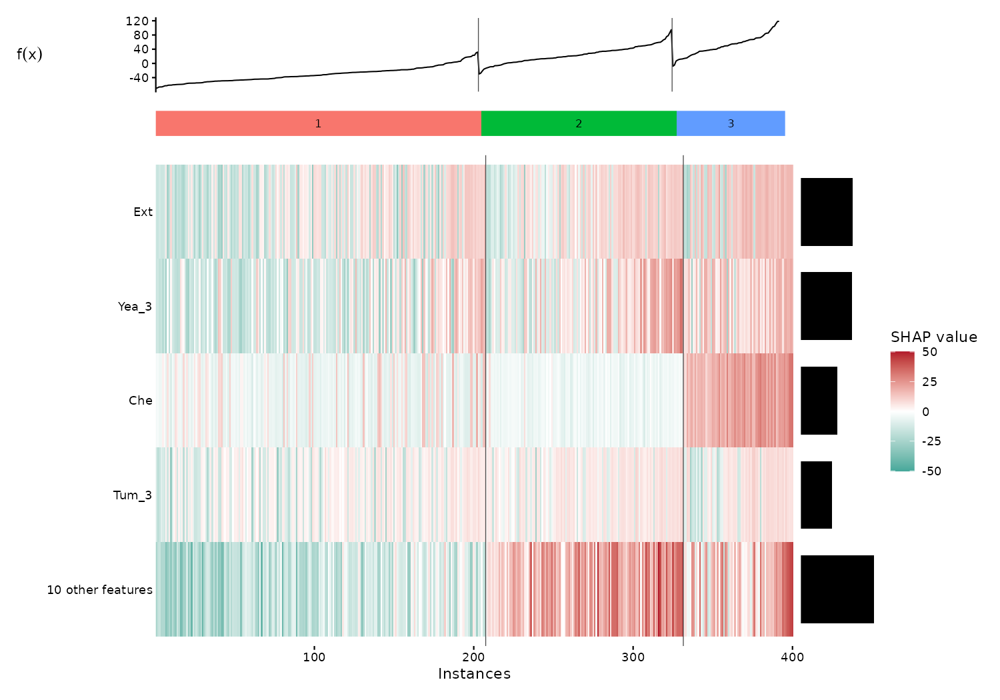{fig-alt="更少特征和预测排序，折叠的其他贡献仍保留行和。"}


### 分簇堆叠 {.unnumbered}


每个面板的横轴是簇内样本顺序；正负贡献分别堆叠。


```r
plt_shp_stack(c3, display.ncol = 6, ncol = 2)
```


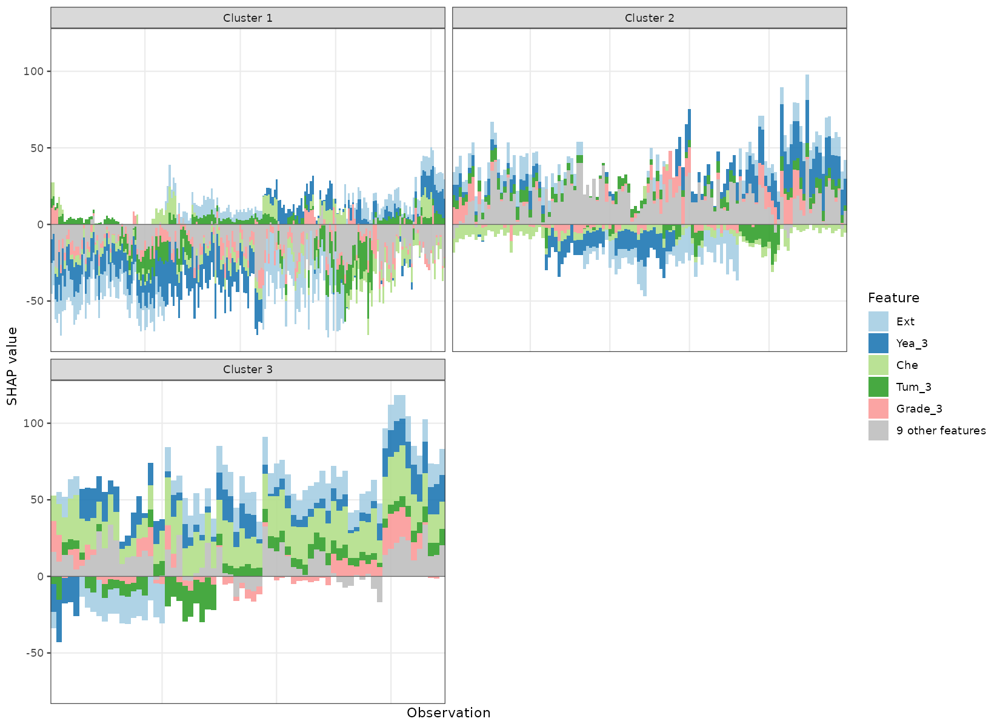{fig-alt="每个面板的横轴是簇内样本顺序；正负贡献分别堆叠。"}


### 簇内预测排序 {.unnumbered}


改变 display.ncol、sample_order、ncol，便于观察簇内连续变化。


```r
plt_shp_stack(c3, display.ncol = 4, sample_order = "prediction", ncol = 1)
```


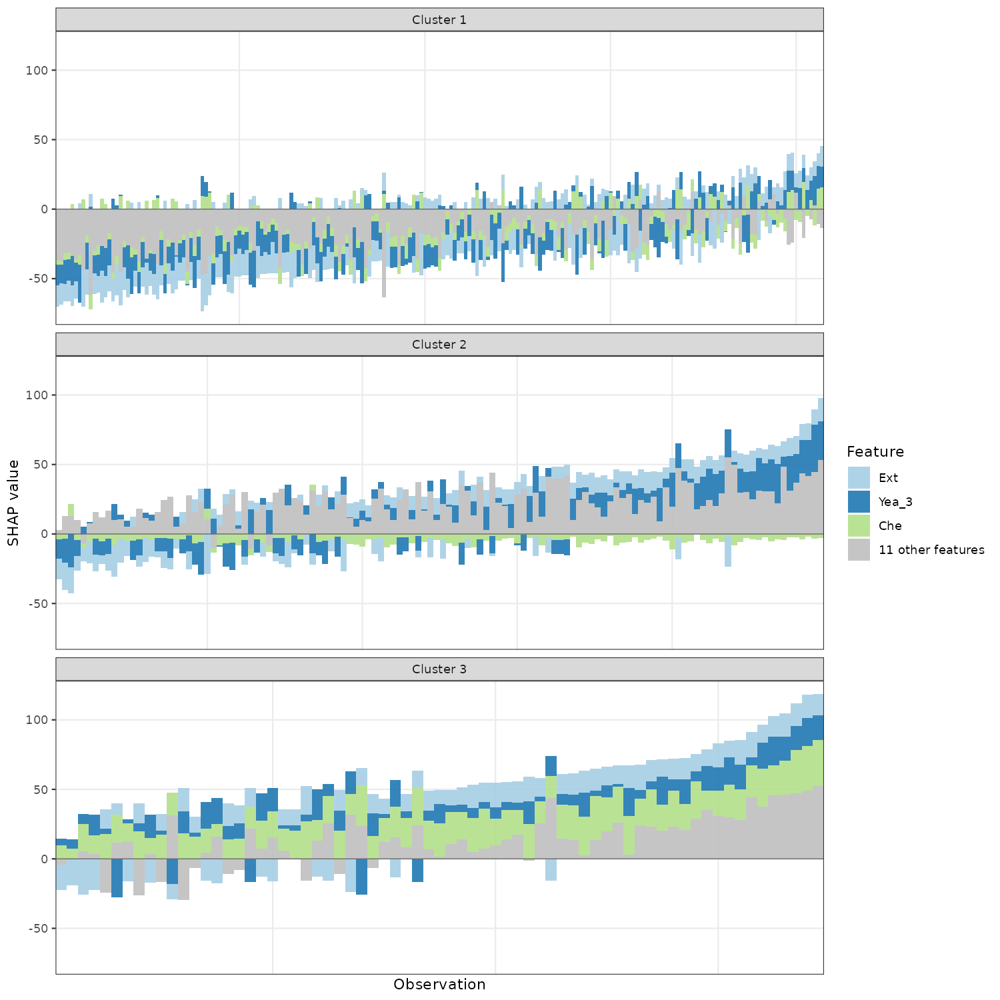{fig-alt="改变 display.ncol、sample_order、ncol，便于观察簇内连续变化。"}


:::


## 诊断与固定中心分配

簇编号是任意标签，不代表从低风险到高风险。轮廓和中心距离描述几何结构；没有外部效应、预后或生物学验证。

::: {.panel-tabset}


### 逐簇轮廓分布 {.unnumbered}


读取公共返回 sil，负值标记更接近邻簇的样本；这不是 P 值。


```r
ggplot(c3[["sil"]], aes(cluster, sil_width, fill = cluster)) + geom_violin(trim = FALSE) + geom_hline(yintercept = 0, linetype = 2) + theme_bw() + guides(fill = "none") + labs(x = "Cluster", y = "Silhouette width")
```


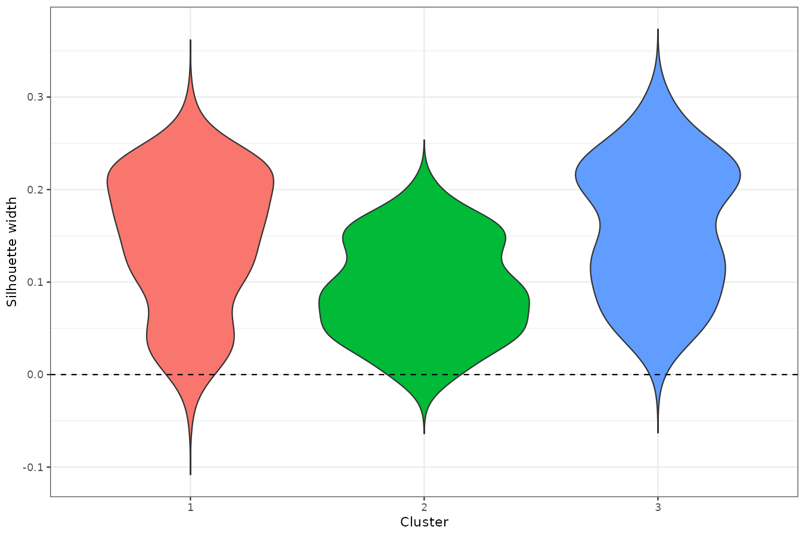{fig-alt="读取公共返回 sil，负值标记更接近邻簇的样本；这不是 P 值。"}


### 两种分配距离 {.unnumbered}


两个距离单位不同，使用独立纵轴；同一预计算解释对象的样本切分只演示接口。


```r
ggplot(assigned, aes(cluster, dist, fill = cluster)) + geom_boxplot() + facet_wrap(~distance, scales = "free_y") + theme_bw() + guides(fill = "none") + labs(x = "Assigned cluster", y = "Distance to assigned centre")
```


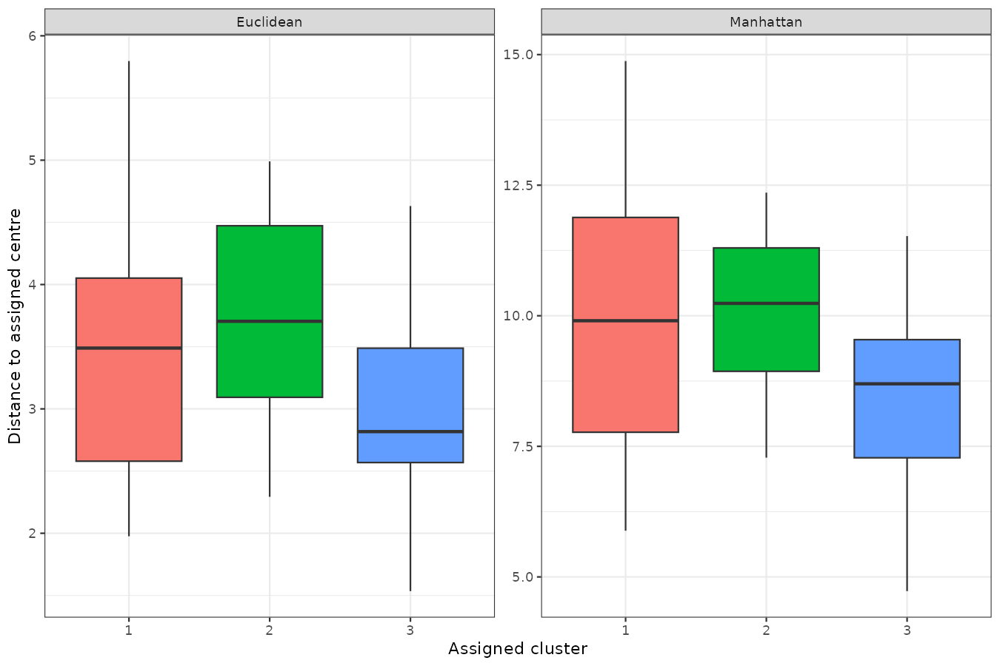{fig-alt="两个距离单位不同，使用独立纵轴；同一预计算解释对象的样本切分只演示接口。"}


:::


## 参数调整、保存与使用边界 {#parameters}

| 参数 | 改变什么 | 读图提示 |
|:--|:--|:--|
| k_range / method | 候选 K 与诊断 | 方法不一致时阅读完整曲线 |
| scale | 距离中的特征权重 | TRUE 每列标准化；FALSE 保留贡献幅度 |
| cluster_fun / hc_method / nstart | 分组算法与初始化 | 重新聚类，簇编号无需对齐 |
| nboot / seed | Gap 重抽样与随机性 | 本页 nboot = 10 只用于演示 |
| embed / embed_args | PCA、UMAP、t-SNE 投影 | 保留已给出的簇标签；投影不是聚类有效性证明 |
| outline / label / point_args | 轮廓、标签、点大小和透明度 | 不改变标签或原始贡献 |
| display.ncol / sample_order / ncol | 展示项数、簇内排序与面板布局 | 其余特征合并求和；总贡献仍保留 |
| distance | 新样本中心分配度量 | Euclidean 与 Manhattan 单位不同 |

```r
kobj[["tab"]]
c3[["size"]]
c3[["tab"]]
c3[["compare"]]
summary(ae[["dist"]])
p <- plt_shp_map(sv, clust = c3)
ggplot2::ggsave("shap-clusters.pdf", p, width = 9, height = 6)
```

大分配距离标记不适合现有中心的样本，可以用于进一步检查漂移；本页没有为它设定临床阈值。图形提供了接口示范，正式分析仍需检查分组对采样、模型和 SHAP 背景的稳定性。

## 相关页面与源码 {#references}

- [SHAP 全部绘图函数](shap-guide.qmd)
- [特征重要性](imp-guide.qmd)
- [MLR 聚类源码](https://github.com/HUI950319/MLR/blob/master/R/shp-clust.R)
- [MLR K 诊断源码](https://github.com/HUI950319/MLR/blob/master/R/shp-clust-k.R)
- [shapviz 官方源码与文档](https://github.com/ModelOriented/shapviz)

本页图片来自上面的实际公共调用。使用固定示例、固定随机种子和注明的小规模设置，图形用于学习接口及解释预测结果。
K 诊断、K = 2/3/4、kmeans/hclust、标准化开关、PCA/UMAP、热图/堆叠排序及两种分配距离均实际运行。
