这一页分为两部分：先介绍 `get_shp()` 如何训练树模型、计算 SHAP 并组织结果，再用已经计算好的 `ToyData::toy_shp` 展示全部 14 个 `plt_shp_*()` 函数。图形选项放在各节的标签页中，可切换比较，并点击图片放大。

**版本与执行范围：** 接口按 MLR **0.1.13** 的实际源码核对。下面的 34 张图均用现有 SHAP 对象实际绘制；`get_shp()` 的代码仅作接口说明，本页没有重新训练模型或计算 SHAP。

## 示例准备与读图规则 {#data}

`toy_shp` 是从 SEER 胰腺导管腺癌（PDAC）、TNM I 期示例分析中抽取的生存随机森林解释对象，含 **400 个观测、14 个变量**。它与本站 ToyData 目录中的 **598 人 M1 PTC 队列**是两个不同的数据对象，详细来源见 [ToyData 数据介绍](../toydata/index.qmd)。

::: {.table-responsive}

| 成分 | 维度 / 内容 | 用途 |
|:--|:--|:--|
| `S` | 400 × 14 | 每个观测的特征总 SHAP |
| `X` | 400 × 14 | 解释样本的原始特征值；用于横轴与着色 |
| `S_inter` | 400 × 14 × 14 | 主效应与两两交互分解 |
| `baseline` | 0 | 该对象存储的解释基线 |

:::


```r
library(MLR)
library(ToyData)
library(ggplot2)

# 胰腺癌示例的 Ext 使用通用名称，避免套用甲状腺专用标签。
# .rename_shp() 是 MLR 导出的名称同步工具；同时更新 S、X 和 S_inter。
shp <- MLR::.rename_shp(ToyData::toy_shp,
                        name_map = c(Ext = "Extension"))

# 插图和环形图使用较短标签；只改名称，不改数值。
short_names <- c(
  Age = "age", Sex = "sex", Race = "race", Marital_4 = "marital",
  Income_3 = "income", County_2 = "county", Primary_Site = "site",
  Yea_3 = "year", Grade_3 = "grade", Tum_3 = "size", Extension = "extent",
  Sur = "surgery", Rad = "rt", Che = "chemo"
)
shp_labels <- MLR::.rename_shp(shp, name_map = short_names)

# 仅为演示分组图固定为 3 簇，使用默认的 SHAP 列标准化。
clu <- get_shp_clust(shp, k = 3, seed = 246, silhouette = FALSE)
```

变量包括年龄、性别、种族、婚姻、收入、城乡、原发部位、诊断年份、分级、肿瘤大小、扩展、手术、放疗和化疗。`Che` 的水平是 `No/Unknown` 与 `Yes`；前者含治疗信息未知，不能当作完全明确的未治疗组。

### 总贡献、主效应、交互与重要性

对观测 $i$ 与变量 $j$，记总 SHAP 为 $\phi_{ij}$，交互矩阵为 $\Phi_{ijk}$：

$$
\begin{aligned}
\phi_{ij}&=\sum_k\Phi_{ijk},\\
\text{主效应}_{ij}&=\Phi_{ijj},\\
\text{完整变量对贡献}_{i,jk}&=2\Phi_{ijk}\;(j\ne k).
\end{aligned}
$$

矩阵非对角项对称；一对变量的贡献分在两个对称位置，所以本页的配对交互图使用两倍非对角项。这与 [SHAP TreeExplainer 的交互分解定义](https://shap.readthedocs.io/en/latest/generated/shap.TreeExplainer.html)一致。当前对象已核验 $\max|\sum_k\Phi_{ijk}-\phi_{ij}|<10^{-12}$。

全局重要性为 $I_j=n^{-1}\sum_i|\phi_{ij}|$。它衡量平均贡献幅度，取绝对值后不保留方向；百分比是所选变量集合内的重要性份额，不能解释成死亡风险占比或解释方差。

::: {.callout-note}
SHAP 解释的是已拟合模型的输出。生存森林的风险尺度不是死亡概率或 HR，治疗变量的 SHAP 分布也不直接等于因果治疗效果。`toy_shp` 的基线存储为 0；热图和力图中的 `f(x)` 按 `baseline + rowSums(S)` 构造，不能据此把它认作已经校准的绝对风险或原模型的平均预测。
:::

## get_shp()：接口与分析流程 {#get-shp}

`get_shp()` 把任务选择、训练样本处理、树模型训练、SHAP 计算和常用图形组装放在一个入口。`vars` 必须是**列名字符向量**，例如 `c("Age", "Che", "Tum_3")`。以下签名仅展示当前接口：

```r
get_shp(
  data, vars, surv = TRUE,
  interactions = TRUE, int_var = NULL, ...,
  Num.sample = 2000, exp.sample = 400,
  sample_args = list(
    Down.sample = TRUE, Outcome.Ratio = NULL,
    Num.sample = 2000, exp.sample = 400
  ),
  model = c("ranger", "xgboost", "lightgbm"),
  boosting_encoding = c("onehot", "target"),
  engine = c("python", "treeshap"),
  device = c("auto", "cpu", "gpu"),
  render_plots = TRUE
)
```


### 任务由 surv 的类型决定

::: {.table-responsive}

| `surv` 的写法 | 实际任务 | 数据要求 |
|:--|:--|:--|
| `surv = TRUE` | 生存分析 | 当前实现固定读取 `time` 与 `DSS`；预测变量列由 `vars` 指定 |
| `surv = FALSE` | 仍然是生存分析 | 当前分派条件为 `is.logical(surv)`，不是逻辑值本身 |
| `surv = "outcome"` | 二分类 | 指定结局列；应有明确的 0/1 或两水平因子编码 |

:::


二分类分支把因子结局转换为 `as.numeric(outcome) - 1`，所以第二个因子水平对应正类。分析前应明确这个水平的临床含义；此入口不是一般的多分类接口。生存分析建议写 `surv = TRUE`，二分类则显式写结局列名。

### model 与变量编码

::: {.table-responsive}

| 模型 | 生存任务 | 二分类任务 | 编码与模型边界 |
|:--|:--|:--|:--|
| `"ranger"`（默认） | 支持 | 支持 | 分类变量保持因子；默认 200 棵树；生存解释使用森林风险输出 |
| `"xgboost"` | 支持 | 支持 | 生存任务使用 `onehot`；二分类可用 `onehot` 或 `target` |
| `"lightgbm"` | 不支持 | 支持 | 二分类可用 `onehot` 或 `target` |

:::


`onehot` 将分类特征展开成编码列；`target` 是分类任务中的交叉拟合、平滑目标编码。Boosting 模型产生的编码列 SHAP 会按原始变量归并，交互块也按原始变量求和，因此下游绘图仍面对原始特征层级。

### 数值变量的自动分箱 {#numeric-binning}

**当前行为（2026-10-07 核对）：** `get_shp()` 会检查 `vars` 中的数值预测变量。
如果某列有 **超过 200 个不同的非缺失值**，就先用整份输入数据的分位数构造最多
200 个箱，再把每个值替换为其所在箱的中位数。重复的分位数边界会合并，因此实际箱数
可能少于 200。恰好 200 个不同值的数值列，以及因子、字符列，不走这一步。

分箱发生在训练抽样和解释抽样**之前**，适用于当前入口支持的所有模型、任务和 SHAP
引擎。它会改变拟合数据与模型；当前接口没有关闭自动分箱的参数。

::: {.table-responsive}

| 位置 | 分箱后的含义 |
|:--|:--|
| 模型训练与解释输入 | 使用箱中位数；模型不再区分同一箱内的原始数值 |
| `res$shp$X` | 解释样本中相应列保存箱中位数；其余列按原有编码处理 |
| 依赖图横轴、数值着色 | 对应 `shp$X` 的箱中位数，可能出现重复横坐标或颜色；不能据此读取箱内的精细变化 |
| `res$par_lis$data` | 保留调用时的原始数据；不会被分箱后的拟合副本覆盖 |

:::

调用前可先检查哪些变量会触发分箱：

```r
bin_vars <- Filter(function(v) {
  is.numeric(data[[v]]) &&
    length(unique(stats::na.omit(data[[v]]))) > 200L
}, intersect(vars, names(data)))
bin_vars
```

本页下面的图形仍来自此前保存的 `ToyData::toy_shp`，补充说明没有重新计算这个对象。
不要仅凭当前分箱规则反推旧对象是否经过相同预处理。验证集应先从原始数据划分；
上述分位数边界基于传给 `get_shp()` 的整份数据，不能把混入验证集后的结果当作独立验证。
运行耗时的历史实测见 [get_shp 提速记录](../regr/mlr-shp-speedup-20261006.qmd)。

### 训练样本与解释样本是两件事

::: {.table-responsive}

| 参数 | 当前默认 / 行为 | 选择时要注意 |
|:--|:--|:--|
| `Down.sample` | `TRUE` | 先处理结局比例，再限制训练样本量 |
| `Outcome.Ratio` | `NULL` 保留任务默认：生存 9、二分类 3 | 指负类 / 正类的目标比例；不是每次都强制达到此比例 |
| `Num.sample` | 2000 | 默认路径中的训练样本上限，不是树的数量 |
| `exp.sample` | 400 | 从处理后的数据中抽取解释样本；整数时不超过可用行数 |
| `sample_args` | 命名 list，允许局部覆盖 | 只允许上述四个字段，未知名称、重复字段或与显式参数重复指定会报错 |

:::


当前采样 helper 仅在负类 / 正类比例 **大于 9** 时触发比例下采样，再按任务的 `Outcome.Ratio` 取负类。因此二分类默认比例 3 并不代表比例为 4–9 时也会自动平衡到 3。生存任务中的正类按 `DSS` 的事件编码判断。

另一个容易忽略的细节是：`Down.sample = FALSE` 会提前返回训练数据，**同时跳过 `Num.sample` 上限**。这时不能把 `Num.sample = 2000` 当作仍然有效的限额。

`exp.sample` 的整数控制解释行数；生存分支还支持按 `sampling::strata()` 约定给出分层抽样 list。当前二分类分支按数值样本量处理，不能照搬生存分支的分层 list。若需稳定复现，抽样前设置 R 随机种子。

配置可以集中写成 `sample_args = list(Num.sample = 1000, exp.sample = 200)`；也可以只用显式的 `Num.sample` 与 `exp.sample`。同一个设置选一种位置即可。`...` 不应被当成任意模型超参数的通用转发口。

### engine 与 device

::: {.table-responsive}

| 选项 | 作用 | 环境与含义 |
|:--|:--|:--|
| `engine = "python"`（默认） | Python SHAP 树解释器 | 通过 reticulate；需先选择可用的 Python SHAP 环境 |
| `engine = "treeshap"` | R 端树解释器 | 可在 R 端完成计算；`device` 不控制这个后端 |
| `device = "auto"` | 自动选择可用的 Python 计算路径 | GPU 是否可用取决于环境与已安装扩展 |
| `device = "cpu"` / `"gpu"` | 指定 Python SHAP 的计算设备 | 这不等于把 R 端模型训练也转移到 GPU |

:::


若使用项目的 Python 环境，应在 reticulate 初始化前选定 `MLR-shap`。本页绘图读取已存储的 SHAP，因此不需要启动这个环境。

比较两个计算引擎时还要控制模型本身：当前 ranger 生存路径在 Python 引擎下设 `max.depth = 30`，R treeshap 路径没有相同的默认深度限制。直接比较两次默认 `get_shp()` 的数值，可能同时比较了模型训练差异与解释器差异。

### interactions、int_var 与 render_plots

`interactions = TRUE` 请求交互矩阵，便于展示主效应、变量对贡献、交互排名与网络；关闭后，依赖 `S_inter` 的图形无法生成。交互存储量随解释样本数与变量数按 $n\times p\times p$ 增长，变量较多时可先缩小解释样本或关闭交互。

`int_var` 主要指定预生成交互图中需要查看的变量对，例如 `c("Age", "Che")`，并不意味着只计算这两个变量的交互。后续可以继续对同一个完整对象选择其他变量。

`render_plots = FALSE` 保留 SHAP 计算，但把下面六个预生成图字段全部置为 `NULL`。需要自己选图、自己调参数时，这个开关可以减少不必要的作图。

### 返回对象如何使用

::: {.table-responsive}

| 字段 | 内容 | 条件 |
|:--|:--|:--|
| `shp` | `shapviz` 对象，含 `S`、`X`、`baseline`，以及可选 `S_inter` | 核心绘图输入 |
| `plt.sum` | 总体蜂群 / 百分比组合图 | `render_plots = TRUE` |
| `plt.viv` | 总体交互可视化 | 还需 `S_inter` |
| `plt.tot` | 各变量总 SHAP 依赖图 | `render_plots = TRUE` |
| `plt.mai` | 各变量主效应图 | 还需 `S_inter` |
| `plt.int1` | `int_var` 两个方向的总贡献 / 配对交互图 | 还需 `S_inter` 与 `int_var` |
| `plt.int2` | 两个锚点各自的交互排名与自动配对插图 | 自动选择各自最强搭档，不保证就是 `int_var` 的另一个变量 |
| `cat_vars` | 原始 `vars` 中因子或字符列的名称 | 用于变量分类 |
| `con_vars` | 原始 `vars` 中数值列的名称 | 用于变量分类 |
| `par_lis` | 原始 `data` 与 `vars` | 参数记录；保存完整结果时也会保存原始数据 |

:::


返回值中没有单独的已拟合 learner 字段。大部分绘图入口既可接收完整结果 `res`，也可接收 `res[["shp"]]`；`plt_shp_stack()` 的首个参数是聚类结果，`plt_shp_circ()` 还可接收命名的多组 SHAP 对象列表。

## 绘图函数速查 {#plot-index}

::: {.table-responsive}

| 函数 | 主要用途 | 重点比较 |
|:--|:--|:--|
| [`plt_shp_sum()`](#plt-shp-sum) | 总体蜂群与组合图 | mode、显示数量、横轴与插图位置 |
| [`plt_shp_imp()`](#plt-shp-imp) | 全局重要性与百分比 | 原始 / 归一化、条形 / 百分比 |
| [`plt_shp_TM()`](#plt-shp-tm) | 总贡献与主效应 | T / M / TM、共享纵轴 |
| [`plt_shp_TM_com()`](#plt-shp-tm-com) | 分类变量的分布组合 | 分类变量、标签 |
| [`plt_shp_TI()`](#plt-shp-ti) | 变量对的交互依赖 | 配对选择、共享纵轴 |
| [`plt_shp_int()`](#plt-shp-int) | 以一个变量为锚点的交互排名 | 锚点、搭档、排名数量 |
| [`plt_shp_viv()`](#plt-shp-viv) | 全局交互矩阵与网络 | 矩阵 / 网络、边阈值 |
| [`plt_shp_cor()`](#plt-shp-cor) | 交互矩阵与总交互柱形 | 布局、排序、分级色阶 |
| [`plt_shp_pairs()`](#plt-shp-pairs) | 配对矩阵 | 变量选择、点密度 |
| [`plt_shp_heatmap()`](#plt-shp-heatmap) | 观测 × 特征热图 | 观测排序、分组与聚合 |
| [`plt_shp_map()`](#plt-shp-map) | SHAP 空间的二维投影 | PCA / UMAP、着色与轮廓 |
| [`plt_shp_stack()`](#plt-shp-stack) | 各簇的贡献堆叠 | 簇内排序、聚合与列数 |
| [`plt_shp_circ()`](#plt-shp-circ) | 环形蜂群与组间尺度 | 全局 / 组内尺度 |
| [`plt_shp_force()`](#plt-shp-force) | 单个观测的力图与瀑布图 | 力图 / 瀑布图、展示数量 |

:::


## `plt_shp_sum()`： 总体蜂群与组合图 {#plt-shp-sum}

蜂群图同时展示变量的重要性顺序、每个观测的贡献方向和特征值着色。下列标签页比较纯蜂群、横轴缩放，以及两种插图组合。

- `mode = "sum"`：纯蜂群；`"sum_per"`：加重要性百分比环图；`"sum_tot"`：加 `tot_var` 的总 SHAP 分布。
- `display.ncol = 8` 在纯蜂群示例中保留前 8 项；当前组合模式的内部调用没有转发这个参数，因此示例保留全部变量。
- `show_numbers = TRUE` 的纯蜂群百分比以**展示的 8 项**为分母；全变量百分比组合以全部 14 项为分母，数值会不同。
- `scale_x = list(xlim = ..., xbre = ...)` 设置观察范围与刻度；`xlim` 使用坐标缩放，不重新计算 SHAP 或重要性。
- `per_position` / `tot_position` 为 `c(x, y, width, height)`，使用组合画布的相对坐标；组合示例通过扩展横轴，在右边给插图留空间。

::: {.panel-tabset}

### 蜂群图 {.unnumbered}

前 8 项的分母与全 14 项图不同；图例移至右侧，避免挡住散点。

```r
plt_shp_sum(shp, mode = "sum", display.ncol = 8,
            show_numbers = TRUE) +
  ggplot2::theme(legend.position = "right")
```

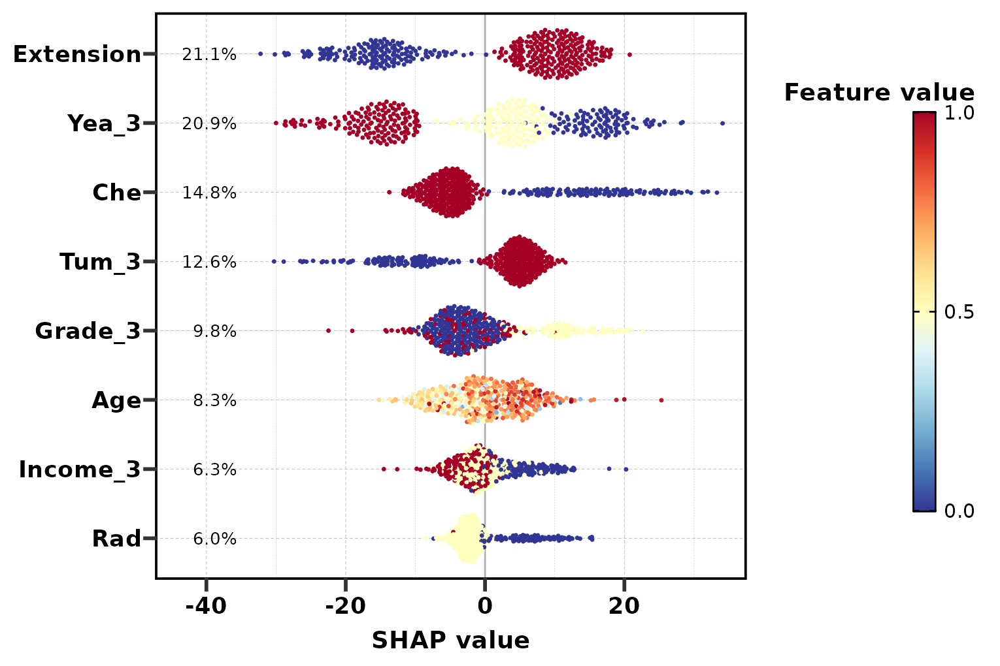{fig-alt="总体蜂群与组合图；蜂群图；数据为 toy_shp 的 400 个观测。"}

### 缩放横轴 {.unnumbered}

以绝对 SHAP 的第 95 百分位设置对称观察窗。窗外点仍参与重要性计算。

```r
lim <- as.numeric(quantile(abs(shp[["S"]]), 0.95))
plt_shp_sum(shp, mode = "sum", display.ncol = 8,
            scale_x = list(xlim = c(-lim, lim), xbre = c(-lim, 0, lim)),
            colors = c("#2166AC", "#F7F7F7", "#B2182B")) +
  ggplot2::theme(legend.position = "right")
```

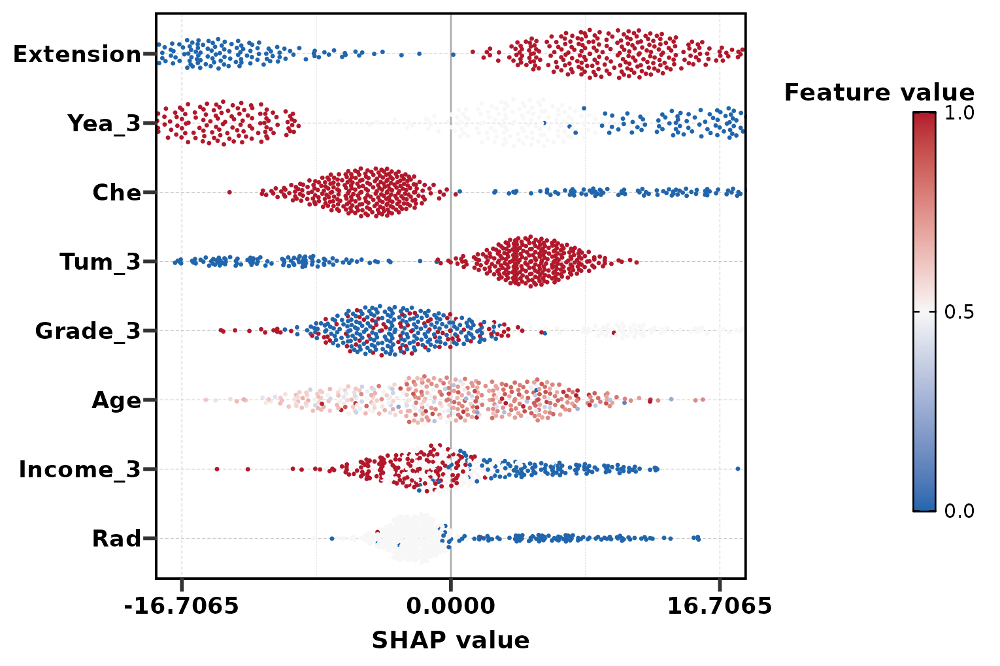{fig-alt="总体蜂群与组合图；缩放横轴；数据为 toy_shp 的 400 个观测。"}

### 蜂群与百分比 {.unnumbered}

给右侧环形插图预留横轴空间；标签副本与原对象具有相同数值。

```r
plt_shp_sum(shp_labels, mode = "sum_per",
            scale_x = list(xlim = c(-90, 110)),
            per_position = c(0.59, 0.17, 0.38, 0.63))
```

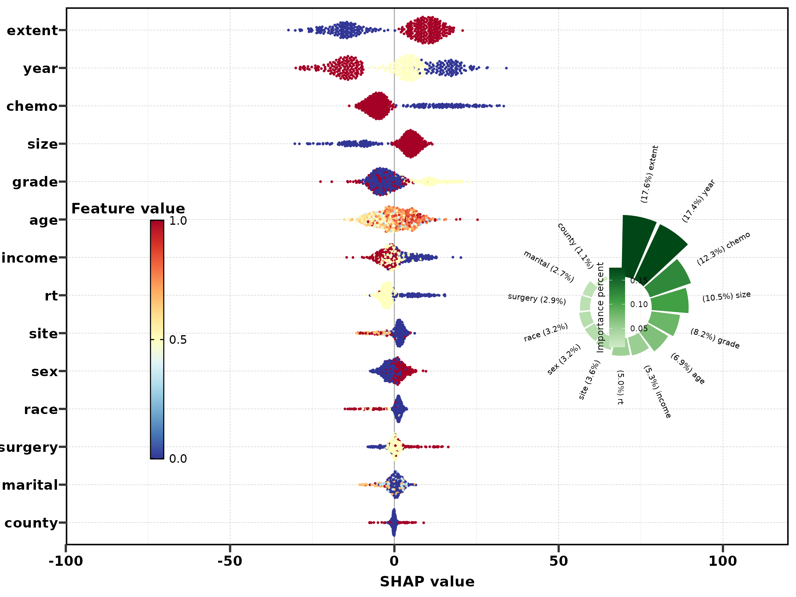{fig-alt="总体蜂群与组合图；蜂群与百分比；数据为 toy_shp 的 400 个观测。"}

### 蜂群与分组依赖 {.unnumbered}

右侧查看 chemo（原 Che）的总贡献分布；横轴分组含 No/Unknown。

```r
plt_shp_sum(shp_labels, mode = "sum_tot", tot_var = "chemo",
            scale_x = list(xlim = c(-90, 110)),
            tot_position = c(0.59, 0.14, 0.37, 0.42))
```

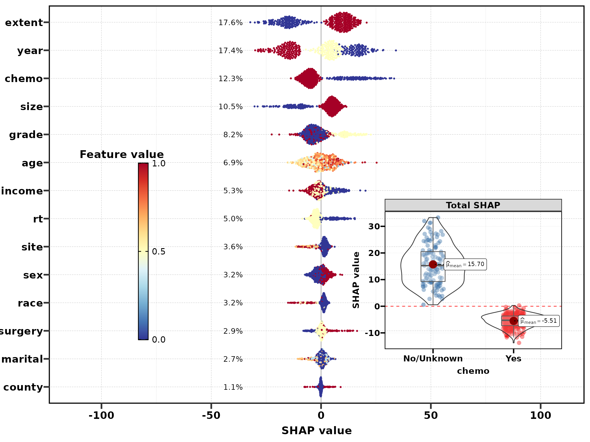{fig-alt="总体蜂群与组合图；蜂群与分组依赖；数据为 toy_shp 的 400 个观测。"}

:::

## `plt_shp_imp()`： 全局重要性与百分比 {#plt-shp-imp}

这组图把 $I_j=\mathrm{mean}(|\phi_j|)$ 汇总为排名。它适合回答“模型主要使用哪些信息”，不提供贡献正负方向。

- `mode` 选择 `"bar"`、`"per"` 或 `"bar_per"`。
- `bar_display = "l"` 画棒棒糖，`"b"` 画柱形；`bar_rescale = TRUE` 将条形数值重新缩放到 0–1。
- 当前条形图的默认轴标题会写为 Normalized scaled value；在 `bar_rescale = FALSE` 时应按原始平均绝对 SHAP 读数。
- `per_position` 调组合插图位置；`per_args` 中的 `empty_bar_ratio` 与 `text_height` 调环形留白和标签偏移，不改变重要性。

::: {.panel-tabset}

### 原始重要性 {.unnumbered}

条形数值是原始平均绝对 SHAP，保留该解释对象的单位。

```r
plt_shp_imp(shp_labels, mode = "bar", bar_display = "l")
```

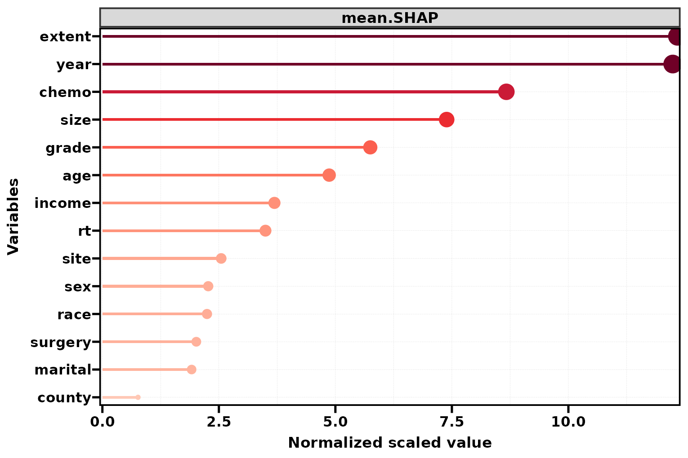{fig-alt="全局重要性与百分比；原始重要性；数据为 toy_shp 的 400 个观测。"}

### 归一化柱形 {.unnumbered}

改用柱形并归一化到 0–1，突出相对排名，单位随之改变。

```r
plt_shp_imp(shp_labels, mode = "bar", bar_display = "b",
            bar_rescale = TRUE)
```

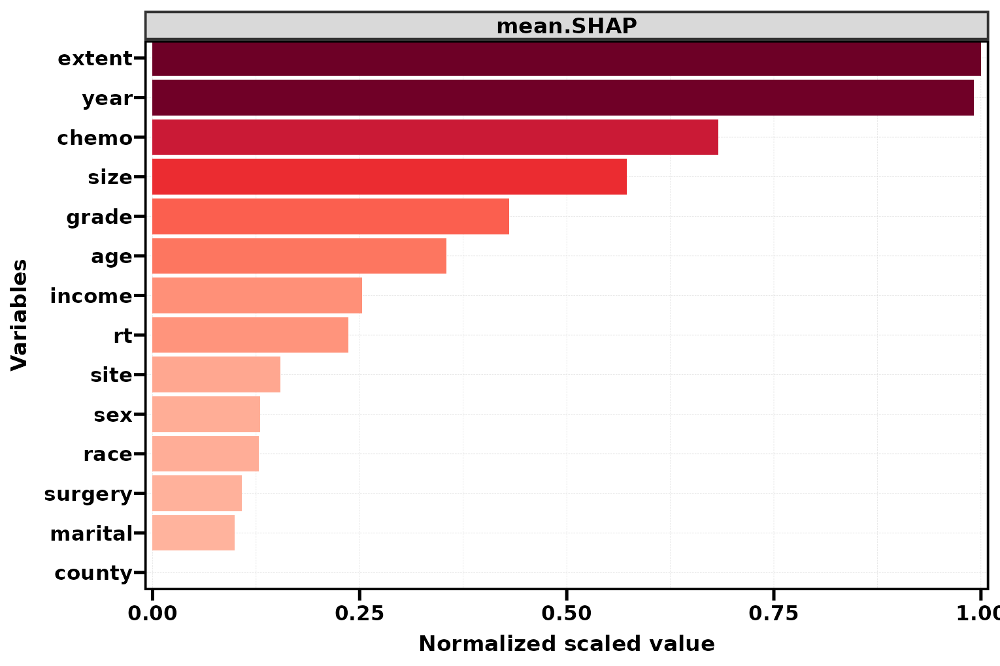{fig-alt="全局重要性与百分比；归一化柱形；数据为 toy_shp 的 400 个观测。"}

### 组合图 {.unnumbered}

条形与百分比组合；`per_position` 控制插图大小及位置。

```r
plt_shp_imp(shp_labels, mode = "bar_per",
            per_position = c(0.40, 0.10, 0.48, 0.70))
```

{fig-alt="全局重要性与百分比；组合图；数据为 toy_shp 的 400 个观测。"}

### 百分比图 {.unnumbered}

增加环形留白，并调整标签偏移；重要性份额保持不变。

```r
plt_shp_imp(shp_labels, mode = "per",
            per_args = list(empty_bar_ratio = 0.18, text_height = 0.025))
```

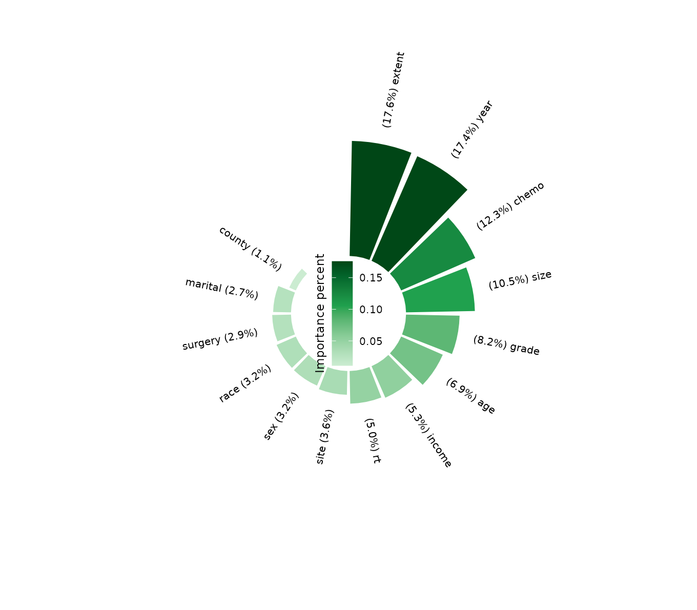{fig-alt="全局重要性与百分比；百分比图；数据为 toy_shp 的 400 个观测。"}

:::

## `plt_shp_TM()`： 总贡献与主效应 {#plt-shp-tm}

同一个特征的总 SHAP 可以包含大量交互。`display = "TM"` 把总贡献与交互矩阵对角线的主效应并排，便于判断两者分布是否相似。

- `x_var` 可为一个列名、多个列名，或 `"fct"` / `"num"`；本页分别展示 `Age` 与 `Che`。
- `display = "T"` / `"M"` / `"TM"` 选择总贡献、主效应或两者；主效应必须有 `S_inter`。
- `axis_arg = list(share_y = "var", hide_y = TRUE)` 给同一变量共用纵轴范围，并隐藏重复纵轴；`"all"` 则在所有面板间共享范围。
- `strip_arg` 控制条带开关、文字与颜色；`ylim` 可显式限定纵轴，但不应通过裁剪制造分布差异。

::: {.panel-tabset}

### 连续变量 {.unnumbered}

总贡献与主效应共用纵轴，避免面板自动缩放掩盖幅度差异。

```r
plt_shp_TM(shp, x_var = "Age", display = "TM",
           axis_arg = list(share_y = "var", hide_y = TRUE))
```

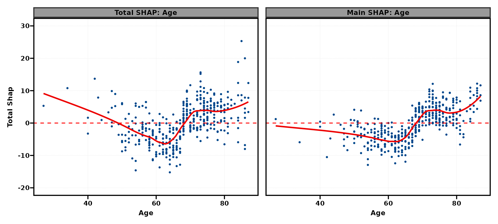{fig-alt="总贡献与主效应；连续变量；数据为 toy_shp 的 400 个观测。"}

### 分类变量 {.unnumbered}

分类变量也可比较总贡献与主效应；条带颜色区分两个面板。

```r
plt_shp_TM(shp, x_var = "Che", display = "TM",
           axis_arg = list(share_y = "var", hide_y = TRUE),
           strip_arg = list(strip_fill = c("#BCD9EA", "#D4E9DD")))
```

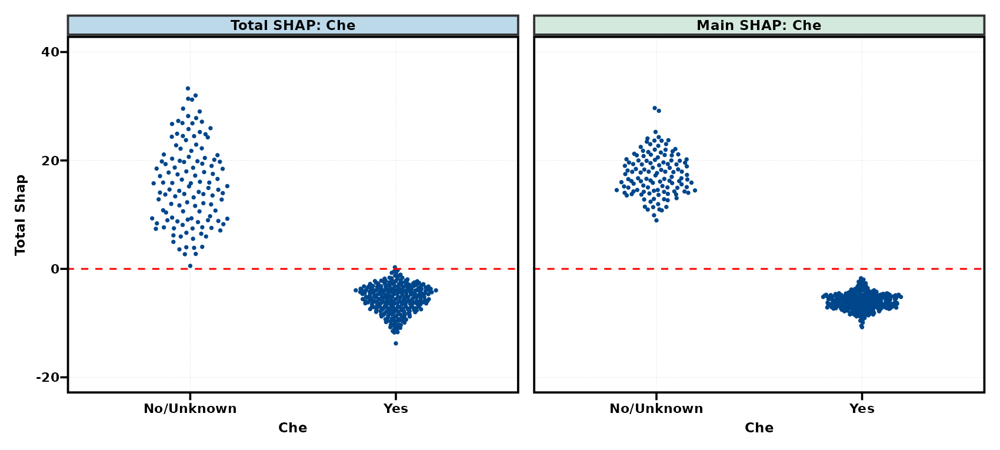{fig-alt="总贡献与主效应；分类变量；数据为 toy_shp 的 400 个观测。"}

:::

## `plt_shp_TM_com()`： 分类变量的分布组合 {#plt-shp-tm-com}

针对一个分类变量，把总贡献与主效应的抖动点、小提琴、箱线与中心值放在两张组合图中。图中均值标签是描述统计，不能直接读作治疗效果。

- `x_var` 在这里应选择分类列，例如 `"Che"`；默认的 `"surgery"` 不在 `toy_shp` 中，所以需要显式指定。
- `add_name` 自定义展示名称；`color` 调分组颜色；`fmt_tag` 控制面板标签。
- 当前函数没有 `save` 参数；可对返回图使用 `ggplot2::ggsave()`。

箱线、小提琴、散点与均值提供互补的分布描述。

```r
plt_shp_TM_com(shp, x_var = "Che",
               add_name = c(Che = "Chemotherapy"), fmt_tag = TRUE)
```

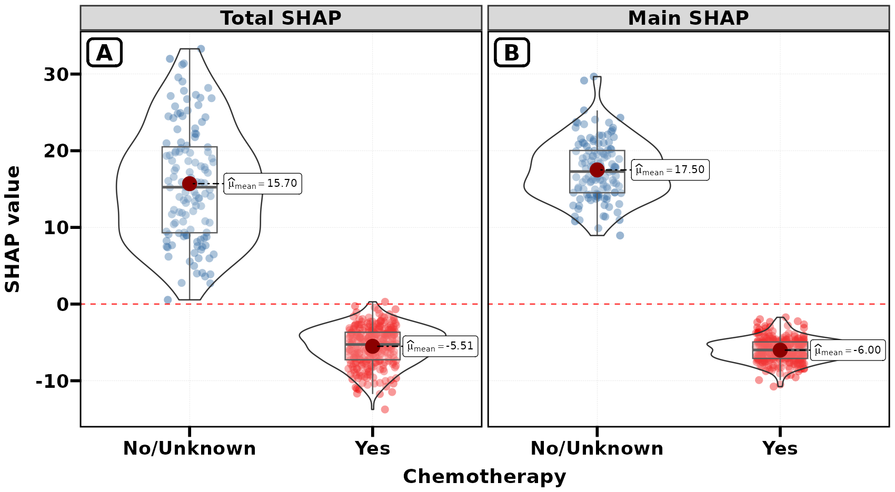{fig-alt="分类变量的分布组合；分布组合；数据为 toy_shp 的 400 个观测。"}

## `plt_shp_TI()`： 变量对的交互依赖 {#plt-shp-ti}

横轴是锚点变量，颜色是搭档变量。`display = "TI"` 的上部显示完整变量对贡献 $2\Phi_{jk}$，下部显示锚点的总 SHAP；也可只展示其中一层。

- `two_var = c("Age", "Che")` 指定一对变量；`display = "T"` / `"I"` / `"TI"` 控制展示层。
- `c("Che", "Age", "Tum_3")` 是同一锚点 Che 分别与 Age、Tum_3 配对，并不自动穷举三个变量的所有组合。
- `axis_arg$share_y = "all"` 让多个面板使用相同尺度；`hide_x = TRUE` 隐藏上下重复横轴，`hide_y = TRUE` 隐藏重复纵轴。
- `color` 可用调色板名或颜色向量；连续搭档与分类搭档分别使用连续色阶与离散颜色。

::: {.panel-tabset}

### 总贡献与交互 {.unnumbered}

上方是两倍配对交互，下方是 Age 的总贡献；同一纵轴范围。

```r
plt_shp_TI(shp, two_var = c("Age", "Che"), display = "TI",
           axis_arg = list(share_y = "all", hide_x = TRUE),
           color = "RdYlBu")
```

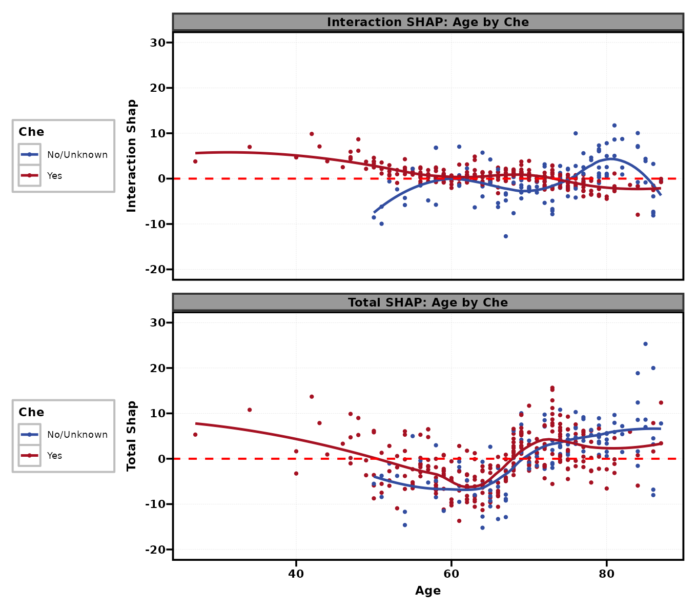{fig-alt="变量对的交互依赖；总贡献与交互；数据为 toy_shp 的 400 个观测。"}

### 同一锚点多配对 {.unnumbered}

Che 与 Age、Tum_3 两个搭档的配对贡献采用共同纵轴。

```r
plt_shp_TI(shp, two_var = c("Che", "Age", "Tum_3"), display = "I",
           axis_arg = list(share_y = "all", hide_y = TRUE),
           color = "RdYlBu")
```

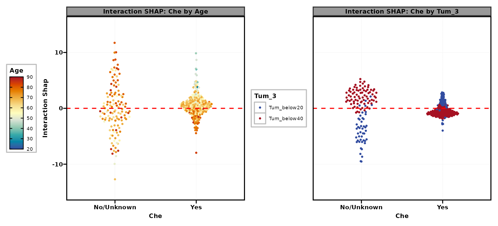{fig-alt="变量对的交互依赖；同一锚点多配对；数据为 toy_shp 的 400 个观测。"}

:::

## `plt_shp_int()`： 以一个变量为锚点的交互排名 {#plt-shp-int}

先把锚点与各搭档的绝对交互值在样本间求和、去掉对角线，再归一化并排名。它关注交互幅度，排名本身不保留交互方向。

- `int_var = "Che"` 固定锚点；`mode` 支持 `"bar_per"`、`"bar"`、`"per"` 与 `"bar_shp"`。
- `fmt_args = list(dis_ncol = 6)` 显示前 6 个搭档；`del_var` 可排除指定搭档。归一化在筛选前进行，因此修改显示数量不等于对保留项重新定标。环形百分比随后基于这些归一化值、在展示搭档内重新求份额，不是原始绝对交互总和的比例。
- `"bar_shp"` 默认选择最强搭档；显式 `oth_var = "Age"` 可以查看另一个指定配对。`int_position` 与 `legend_position` 调插图和图例位置。
- 使用 `add_name` 时，示例同时包含锚点 `Che` 和搭档 `Age` 的映射，保证变量选择与重命名后的维度一致。
- `fmt_args$cha_mult` 会改变排名数值；`int_args` 中的平移或倍乘改变配对散点显示，不能把这些设置都当作纯布局调整。

::: {.panel-tabset}

### 交互排名与百分比 {.unnumbered}

归一化交互排名与所选搭档的百分比视图。

```r
plt_shp_int(shp, int_var = "Che", mode = "bar_per",
            fmt_args = list(dis_ncol = 6))
```

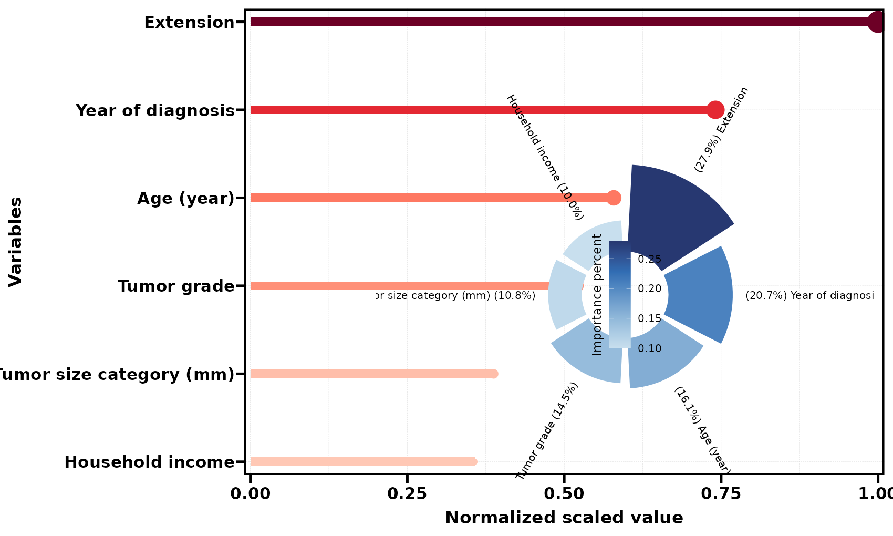{fig-alt="以一个变量为锚点的交互排名；交互排名与百分比；数据为 toy_shp 的 400 个观测。"}

### 交互柱形 {.unnumbered}

前 6 个搭档的归一化交互排名，柱形显示。

```r
plt_shp_int(shp, int_var = "Che", mode = "bar", display = "b",
            fmt_args = list(dis_ncol = 6))
```

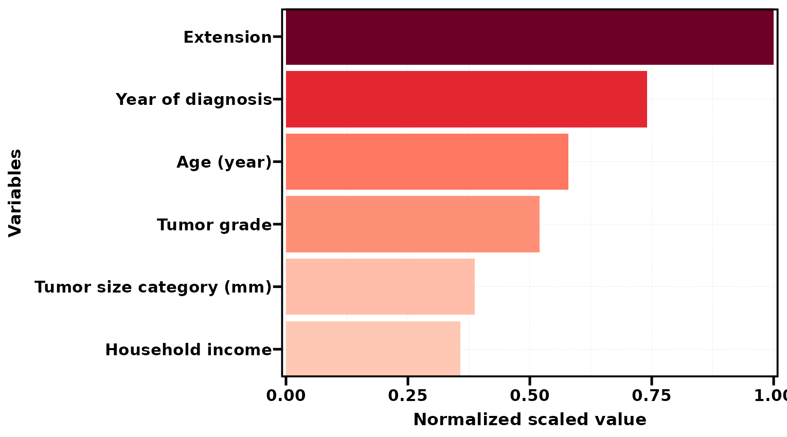{fig-alt="以一个变量为锚点的交互排名；交互柱形；数据为 toy_shp 的 400 个观测。"}

### 交互百分比 {.unnumbered}

所展示搭档的归一化交互值份额，不是原始交互总和或总 SHAP 重要性份额。

```r
plt_shp_int(shp, int_var = "Che", mode = "per",
            fmt_args = list(dis_ncol = 6))
```

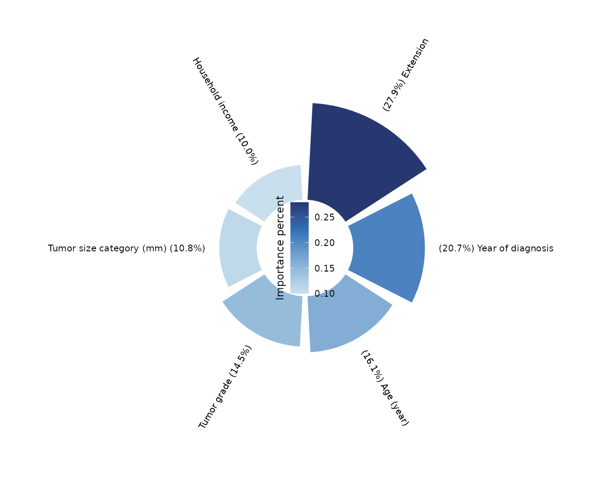{fig-alt="以一个变量为锚点的交互排名；交互百分比；数据为 toy_shp 的 400 个观测。"}

### 指定配对与插图 {.unnumbered}

显式选择 Age，而不是自动使用最强搭档；散点保留贡献正负方向。

```r
plt_shp_int(shp, int_var = "Che", mode = "bar_shp", oth_var = "Age",
  add_name = c(Che = "Chemotherapy", Age = "Age", Yea_3 = "Diagnosis year", Tum_3 = "Tumor size",
               Grade_3 = "Grade", Income_3 = "Income"),
            fmt_args = list(dis_ncol = 6),
            bar_int_palette = list("Reds", "RdYlBu"),
            int_position = c(0.51, 0.15, 0.46, 0.57),
            strip_label = "Chemotherapy interactions")
```

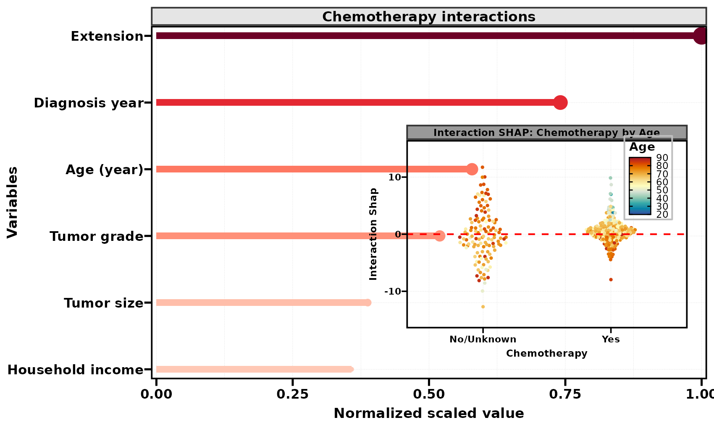{fig-alt="以一个变量为锚点的交互排名；指定配对与插图；数据为 toy_shp 的 400 个观测。"}

:::

## `plt_shp_viv()`： 全局交互矩阵与网络 {#plt-shp-viv}

热图对角线放变量总重要性，非对角线放绝对交互汇总；它们分别归一化。网络把变量画为节点，以边展示交互关系。

- `mode = "heatmap"` / `"network"` 切换图形；`display.ncol = 8` 聚焦前 8 项。
- `heatmap_arg = list(text = TRUE, text_size = 2.5)` 控制单元格数字；`color` 统一配色方案。
- `network_arg$intThreshold = 0.20` 在归一化尺度上筛边；不是 P 值阈值。`removeNode = FALSE` 保留没有达到边阈值的节点。
- `network_arg` 还可设 `layout`、`cluster`、`edgeWidths`；布局改变位置，不改变原始交互值。
- 默认 `fixed_size = TRUE` 固定面板物理尺寸；导出画布应至少容纳 `attr(p, "plot_size")` 的宽、高。

::: {.panel-tabset}

### 交互矩阵 {.unnumbered}

对角线与非对角线采用两种归一化量，应分别读图例。

```r
plt_shp_viv(shp_labels, display.ncol = 8, mode = "heatmap",
            color = "blue_red", heatmap_arg = list(text = TRUE))
```

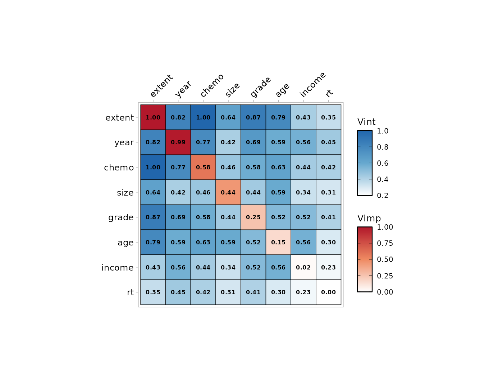{fig-alt="全局交互矩阵与网络；交互矩阵；数据为 toy_shp 的 400 个观测。"}

### 交互网络 {.unnumbered}

边阈值是 0.20 的归一化强度；没有达到边阈值的节点仍保留。

```r
plt_shp_viv(shp_labels, display.ncol = 8, mode = "network",
            color = "blue_red",
            network_arg = list(intThreshold = 0.20, removeNode = FALSE, nudge_x = 0.10))
```

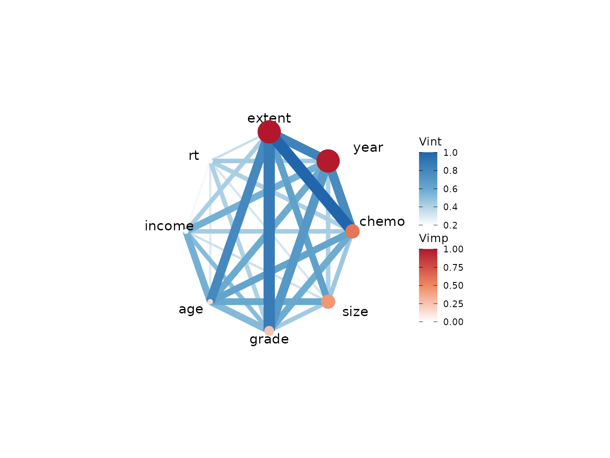{fig-alt="全局交互矩阵与网络；交互网络；数据为 toy_shp 的 400 个观测。"}

:::

## `plt_shp_cor()`： 交互矩阵与总交互柱形 {#plt-shp-cor}

名称中虽然有 `cor`，这里画的是 SHAP 交互汇总矩阵，**不是 Pearson 或 Spearman 相关矩阵**。旁边的柱形表示该变量与全部其他变量的绝对交互总和。

- `bar_layout = "square"` 在三角矩阵下叠加柱形；`"side_upper"` 把柱形放到三角矩阵右侧；`"rotate"` 旋转三角矩阵并省略柱形。另有 `"side"`、`"stacked"` 与 `"none"`。
- `order_by = "importance"` / `"interaction"` / `"none"` 控制变量顺序，也决定 `display.ncol` 从哪个排名取前几项。
- `color_bins = 4` 使用分级色阶；0–1 是归一化显示值，不是相关系数。
- 侧边模式的对角线显示单独归一化的重要性；柱形仍汇总全部搭档，包括没有显示在前 8 项矩阵中的变量。
- `fixed_size` 的物理尺寸规则与上一节相同；本页导出时给画布额外留白，避免字体和色条被裁掉。

::: {.panel-tabset}

### 三角矩阵与柱形 {.unnumbered}

三角矩阵叠加总交互柱形，柱形数值保留原始汇总量。

```r
plt_shp_cor(shp, display.ncol = 8, bar_layout = "square")
```

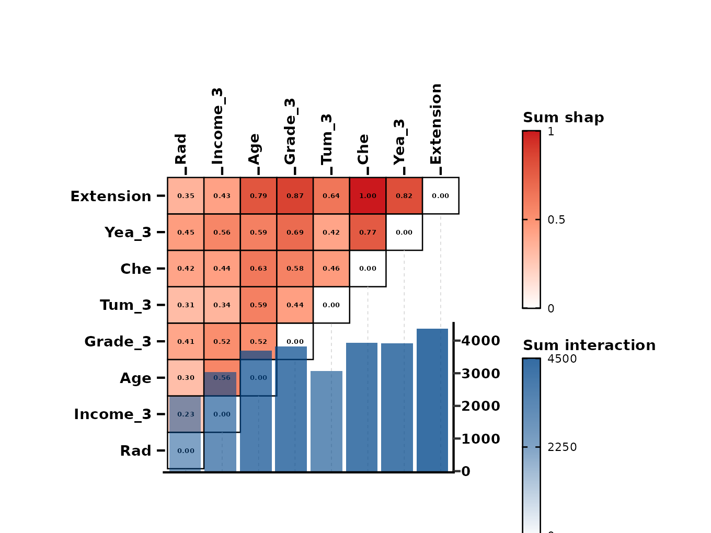{fig-alt="交互矩阵与总交互柱形；三角矩阵与柱形；数据为 toy_shp 的 400 个观测。"}

### 侧边柱形 {.unnumbered}

改为按交互强度排序；矩阵仅画前 8 项，柱形仍汇总全部搭档。

```r
plt_shp_cor(shp, display.ncol = 8, bar_layout = "side_upper",
            order_by = "interaction", color = "blue_red")
```

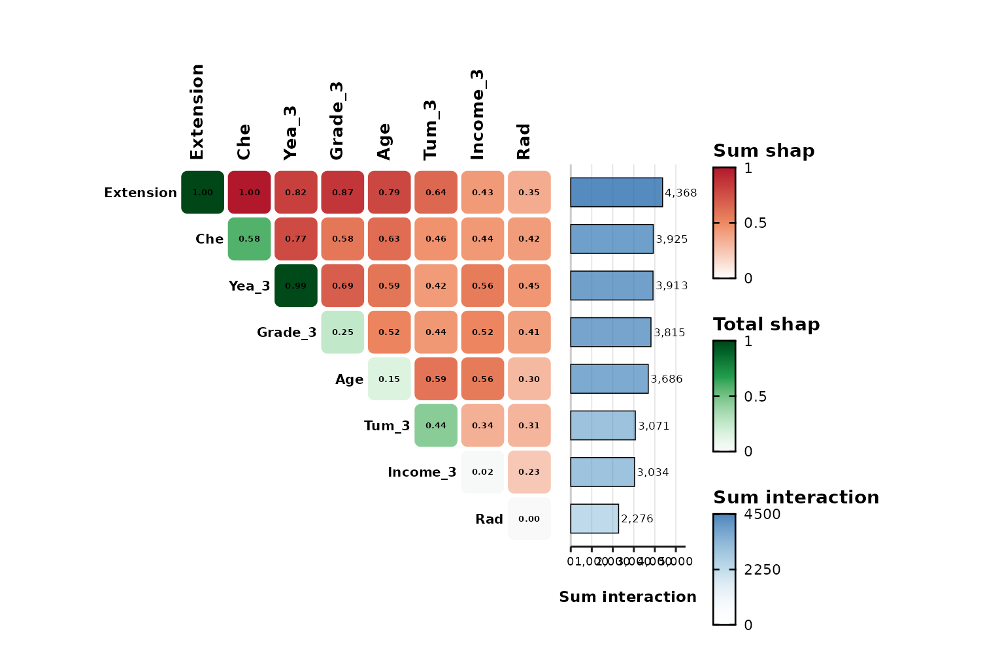{fig-alt="交互矩阵与总交互柱形；侧边柱形；数据为 toy_shp 的 400 个观测。"}

### 旋转矩阵与分级色阶 {.unnumbered}

旋转三角矩阵，并将色阶分为 4 档。

```r
plt_shp_cor(shp, display.ncol = 8, bar_layout = "rotate",
            color = "purple_green", color_bins = 4)
```

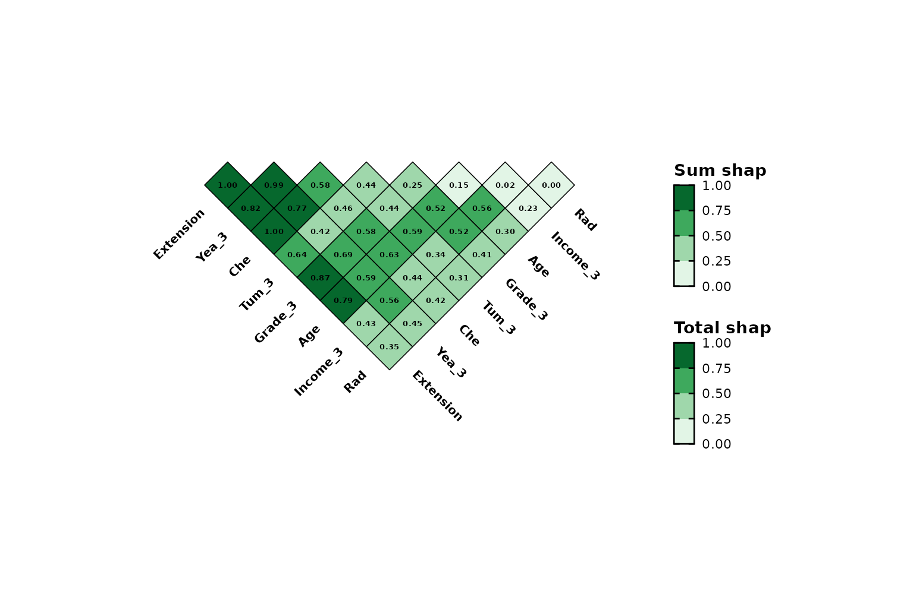{fig-alt="交互矩阵与总交互柱形；旋转矩阵与分级色阶；数据为 toy_shp 的 400 个观测。"}

:::

## `plt_shp_pairs()`： 配对矩阵 {#plt-shp-pairs}

一张图同时放主效应和变量对关系：对角线为特征值与主 SHAP；下三角为两个特征值构成的散点、用完整配对贡献 $2\Phi_{jk}$ 着色；上三角为该配对贡献的平均绝对值。

- `vars` 明确选择顺序，`display.ncol` 限制面板数。示例使用 Age、Sur、Che 与 Tum_3，避免 14 × 14 面板过密。
- `point.size`、`alpha` 调点密度；`text`、`digits` 控制上三角数值。
- 颜色使用稳健的分位范围处理极端值；色阶饱和不表示极端点被删除，也不能据此推断显著性。

用 4 个变量控制面板密度；颜色表示有符号贡献，上三角为幅度汇总。

```r
plt_shp_pairs(shp, vars = c("Age", "Sur", "Che", "Tum_3"),
              display.ncol = 4, point.size = 0.65, alpha = 0.65,
              text = TRUE, digits = 2)
```

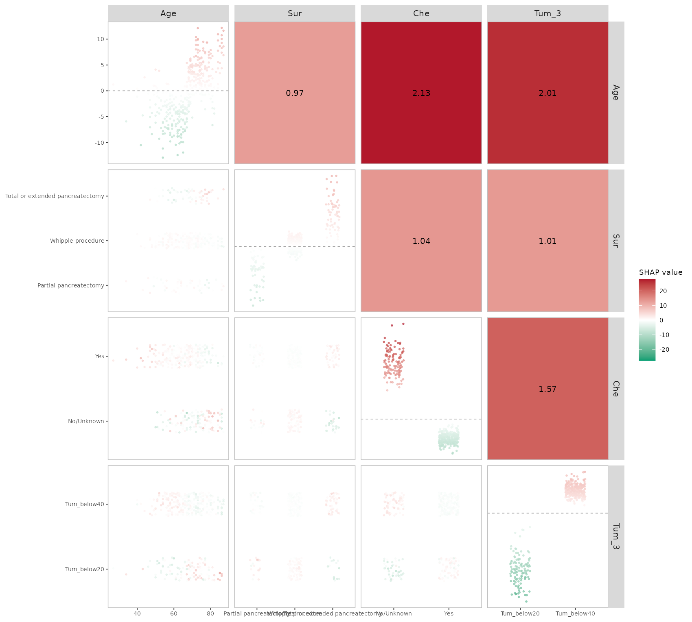{fig-alt="配对矩阵；配对矩阵；数据为 toy_shp 的 400 个观测。"}

## `plt_shp_heatmap()`： 观测 × 特征热图 {#plt-shp-heatmap}

每一列是一个观测；主热图是各特征的有符号 SHAP，上部是对象定义的模型输出，右侧是全局重要性。可以按解释相似度排序，也可以在预先得到的簇内按模型输出排序。

- `sample_order = "cluster"` 使用 SHAP 距离的层次聚类顺序；`"prediction"` 按 `baseline + rowSums(S)` 从低到高排列。
- `clust = clu` 加聚类条带，并把排序限制在各簇内；两个例图同时展示排序和分组方式的改变。
- `display.ncol = 8` 包含聚合行：此处保留 7 个单变量，另外 7 个按观测求和为 `7 other features`，不会简单丢掉贡献。
- `colors` 依次指定负值、零值、正值的颜色。

::: {.panel-tabset}

### 相似解释排序 {.unnumbered}

按 SHAP 相似性排序；保留 7 个变量，另外 7 个合并成一行。

```r
plt_shp_heatmap(shp, display.ncol = 8, sample_order = "cluster")
```

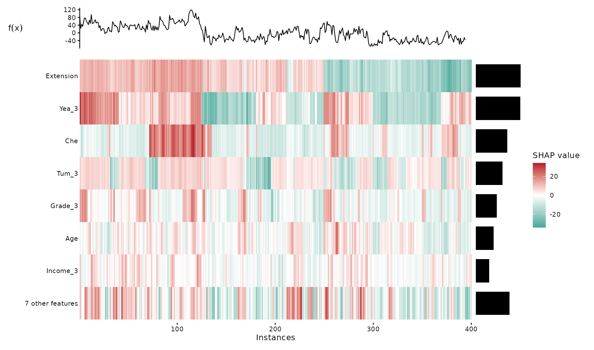{fig-alt="观测 × 特征热图；相似解释排序；数据为 toy_shp 的 400 个观测。"}

### 簇内预测排序 {.unnumbered}

展示固定 3 簇，并在簇内按解释输出排列。

```r
plt_shp_heatmap(shp, clust = clu, display.ncol = 8,
                sample_order = "prediction")
```

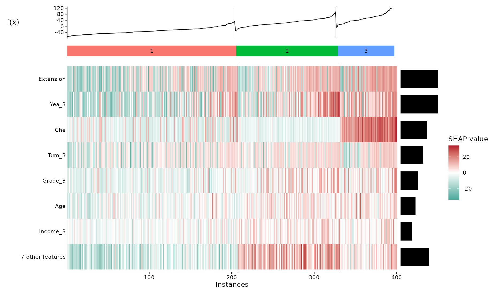{fig-alt="观测 × 特征热图；簇内预测排序；数据为 toy_shp 的 400 个观测。"}

:::

## `plt_shp_map()`： SHAP 空间的二维投影 {#plt-shp-map}

把每个观测的 SHAP 向量投影到二维，观察模型解释模式是否成团。PCA 和 UMAP 的坐标没有相同单位，图中的距离也不是患者的临床距离。

- `embed = "pca"` / `"umap"` / `"tsne"`，或直接提供两列坐标；`embed_args` 放相应算法参数。
- `color_by = "prediction"` 按对象定义的模型输出着色；`color_by = "Che"` 按 **Che 的 SHAP 值**着色，不是按 X 中的治疗水平着色。
- `clust = clu` 使用同一聚类结果的输入矩阵；`outline = "ellipse"` / `"hull"` / `"none"` 调轮廓，`label` 控制簇标签。
- UMAP 示例固定 `seed = 246`，比较 `n_neighbors = 20`、`min_dist = 0.15` 的嵌入；算法与环境版本也可能影响坐标。
- 本页固定的 3 簇仅用于教学展示，没有通过选 K 流程证明最优簇数，也不意味着发现了临床亚型。

::: {.panel-tabset}

### PCA 与模型输出 {.unnumbered}

按解释输出着色，椭圆显示固定簇的范围。

```r
plt_shp_map(shp, clust = clu, embed = "pca",
            color_by = "prediction", outline = "ellipse",
            point_args = list(size = 1.5, alpha = 0.7))
```

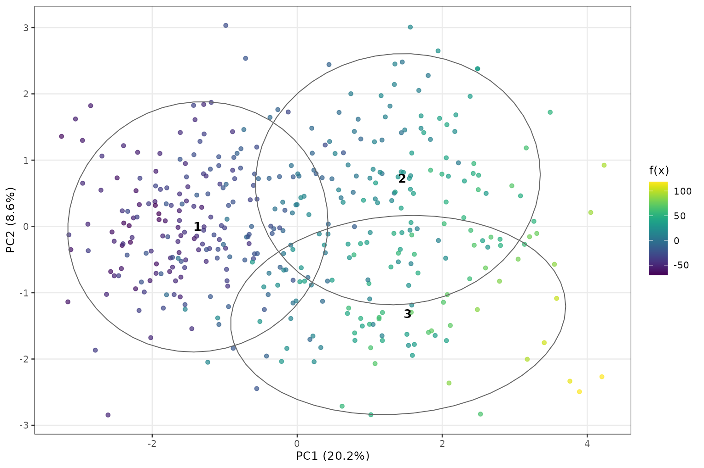{fig-alt="SHAP 空间的二维投影；PCA 与模型输出；数据为 toy_shp 的 400 个观测。"}

### UMAP 与单变量 SHAP {.unnumbered}

按 Che 的 SHAP 值着色，并使用凸包；颜色并不是治疗水平。

```r
plt_shp_map(shp, clust = clu, embed = "umap", color_by = "Che",
            embed_args = list(n_neighbors = 20, min_dist = 0.15),
            outline = "hull", seed = 246)
```

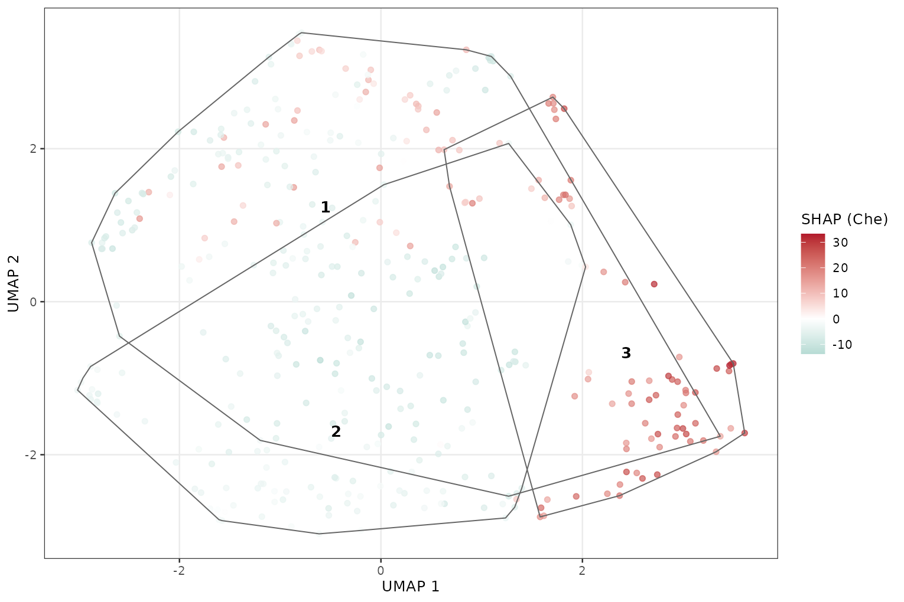{fig-alt="SHAP 空间的二维投影；UMAP 与单变量 SHAP；数据为 toy_shp 的 400 个观测。"}

:::

## `plt_shp_stack()`： 各簇的贡献堆叠 {#plt-shp-stack}

每个簇单独作图，按观测把正、负 SHAP 堆叠起来，便于观察解释组成与模型输出方向。不同特征的正、负贡献可以相互抵消。

- 首个参数是 `clust`，例如 `plt_shp_stack(clu, ...)`；如果只传分组向量，还需通过 `shp` 提供解释对象。
- `sample_order = "prediction"` 在每簇内按对象定义的模型输出排序；`ncol = 3` 把本页的 3 簇并列。
- `display.ncol = 6` 包含聚合项：保留 5 个特征，另 9 个按观测相加。这样保留总体贡献的可加性。

3 簇并列；5 个单变量加 9 个变量的汇总项。

```r
plt_shp_stack(clu, display.ncol = 6,
              sample_order = "prediction", ncol = 3)
```

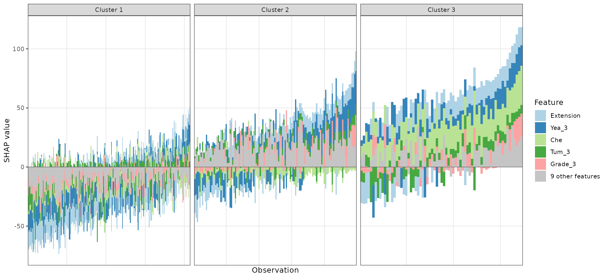{fig-alt="各簇的贡献堆叠；分组堆叠贡献；数据为 toy_shp 的 400 个观测。"}

## `plt_shp_circ()`： 环形蜂群与组间尺度 {#plt-shp-circ}

外圈的点沿半径显示有符号 SHAP、按特征值着色；内圈条形显示各组的平均绝对重要性。单组图用于概览，多组图用于对照解释分布。

- `display.ncol` 或 `vars` 选择变量；多组会使用共同变量并按合并重要性排序。
- `shp_scale = "global"` 在各组间共用径向尺度，可以比较贡献幅度；`"group"` 每组独立定标，只适合比较组内形状，不能用半径直接比较组间绝对幅度。
- `group_labels` 的名称必须完整匹配列表名；本例为 `"No/Unknown"` 与 `"Yes"`。
- `layout_args$group_gap = 10` 调组间留白；`point_args` 调点大小、透明度和蜂群宽度。
- 治疗组的预测解释差异也可能来自其他特征分布与模型关系；此图不构成因果疗效比较。

按治疗水平切分现有对象，直接切分已经存储的矩阵，不重新计算 SHAP：

```r
che_groups <- lapply(
  split(seq_len(nrow(shp[["S"]])), shp[["X"]][["Che"]]),
  function(i) shapviz::shapviz(
    shp[["S"]][i, , drop = FALSE],
    X = shp[["X"]][i, , drop = FALSE],
    baseline = shp[["baseline"]],
    S_inter = shp[["S_inter"]][i, , , drop = FALSE]
  )
)
che_groups_labels <- lapply(che_groups, MLR::.rename_shp,
                           name_map = short_names)
```

::: {.panel-tabset}

### 单组环形概览 {.unnumbered}

单组环形概览，外圈看分布，内圈看贡献幅度。

```r
plt_shp_circ(shp, display.ncol = 8, shp_scale = "global",
             point_args = list(size = 0.55, alpha = 0.55))
```

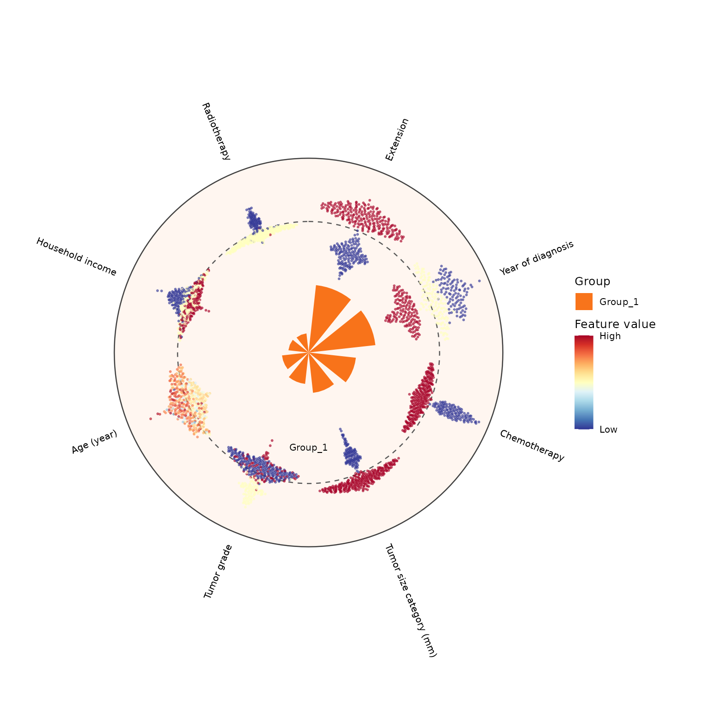{fig-alt="环形蜂群与组间尺度；单组环形概览；数据为 toy_shp 的 400 个观测。"}

### 两组共用尺度 {.unnumbered}

两组共用径向尺度，适合比较贡献幅度。

```r
plt_shp_circ(che_groups_labels, display.ncol = 6, shp_scale = "global",
             group_labels = c("No/Unknown" = "No/Unknown", Yes = "Yes"),
             layout_args = list(group_gap = 10))
```

{fig-alt="环形蜂群与组间尺度；两组共用尺度；数据为 toy_shp 的 400 个观测。"}

### 两组各自尺度 {.unnumbered}

两组分别定标，相同半径不再表示相同的绝对贡献。

```r
plt_shp_circ(che_groups_labels, display.ncol = 6, shp_scale = "group",
             group_labels = c("No/Unknown" = "No/Unknown", Yes = "Yes"),
             layout_args = list(group_gap = 10))
```

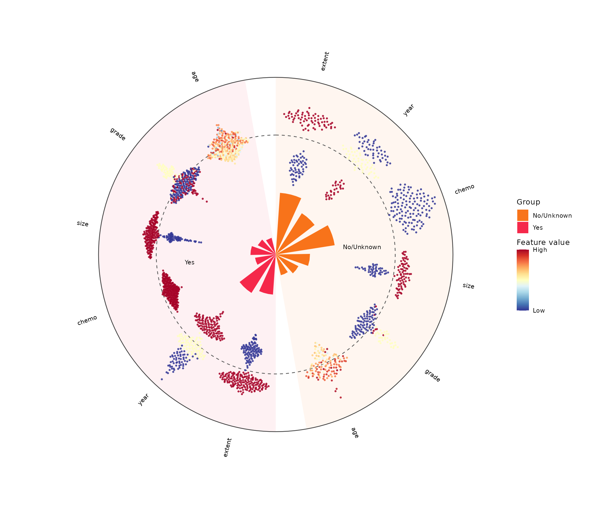{fig-alt="环形蜂群与组间尺度；两组各自尺度；数据为 toy_shp 的 400 个观测。"}

:::

## `plt_shp_force()`： 单个观测的力图与瀑布图 {#plt-shp-force}

展示一个观测如何从存储的基线得到解释输出。正向贡献推高输出，负向贡献降低输出；瀑布图用逐步加和的方式表达同一分解。

- `row_id = 1` 固定同一个解释样本；`display.ncol` 限制显式特征数，剩余特征按有符号贡献求和。
- `mode = "shapviz"` / `"custom"` / `"waterfall"` 均可在 R 端绘图；本页不调用需要 Python 环境的 `"python"` 模式。
- `colors` 顺序为正贡献、负贡献；`show_annotation` 控制数值与特征注释。
- 当前对象的 `baseline = 0`，例如负的 `f(x)` 是解释尺度上的值，不代表负的死亡概率。
- 此函数的 PDF 保存走自身实现；它与大多数绘图函数转发到 `RegR::save_plt()` 的路径不同。

::: {.panel-tabset}

### 标准力图 {.unnumbered}

同一解释样本的标准力图。

```r
plt_shp_force(shp, row_id = 1, display.ncol = 6,
              mode = "shapviz", show_annotation = TRUE)
```

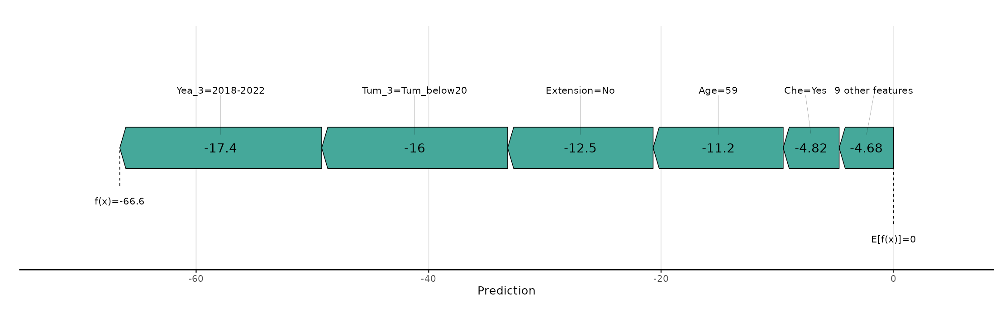{fig-alt="单个观测的力图与瀑布图；标准力图；数据为 toy_shp 的 400 个观测。"}

### 自定义力图 {.unnumbered}

同一分解换成自定义力图，并改变正、负贡献颜色。

```r
plt_shp_force(shp, row_id = 1, display.ncol = 6,
              mode = "custom", colors = c("#B2182B", "#2166AC"))
```

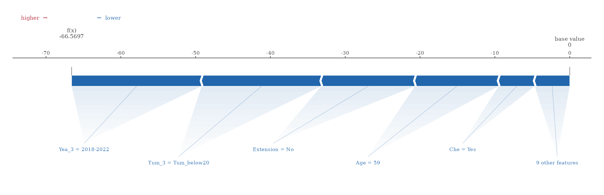{fig-alt="单个观测的力图与瀑布图；自定义力图；数据为 toy_shp 的 400 个观测。"}

### 瀑布图 {.unnumbered}

逐步累加贡献的瀑布图；剩余变量求和后展示。

```r
plt_shp_force(shp, row_id = 1, display.ncol = 8,
              mode = "waterfall", show_annotation = TRUE)
```

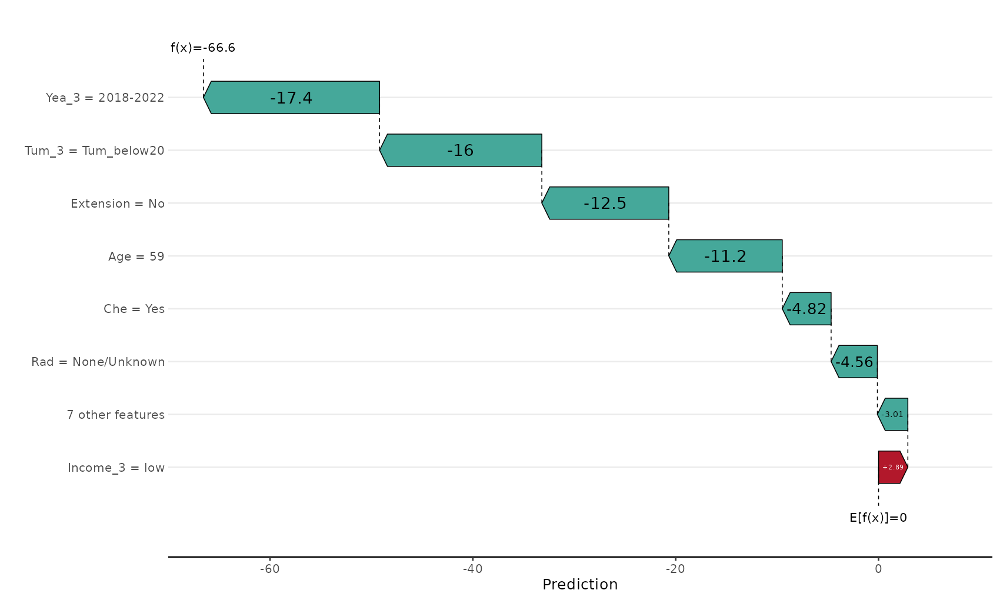{fig-alt="单个观测的力图与瀑布图；瀑布图；数据为 toy_shp 的 400 个观测。"}

:::

## 参数调整与保存 {#parameters}

::: {.table-responsive}

| 调整目标 | 参数 | 对解释量的影响 |
|:--|:--|:--|
| 提高可读性 | 点大小、透明度、颜色、条带、插图位置 | 不改变 SHAP 数值 |
| 比较幅度 | `axis_arg$share_y`、`shp_scale` | 改显示尺度；共用尺度更适合直接比较 |
| 聚焦部分变量 | `display.ncol`、`vars`、`fmt_args$dis_ncol` | 不同图的聚合、百分比分母与归一化方式不同 |
| 限制观察窗 | `scale_x$xlim`、`ylim` | 窗外值可能不可见；不能当作没有对应观测 |
| 倍乘或平移贡献 | `fmt_args$cha_mult`、`cha_add`、`int_args` | 改变解释数值；不宜再按原始 SHAP 的单位或可加性读图 |
| 改观测位置 | `sample_order`、`embed`、`embed_args` | 改排序或投影；二维成团不证明统计显著性 |

:::

大部分函数的 `save = list()` 默认不写文件，指定时转交 `RegR::save_plt()` 保存 PDF。下面仅展示保存写法；`plt_shp_TM_com()` 没有这个参数，`plt_shp_force()` 使用自身的 PDF 保存实现。

```r
p <- plt_shp_TM(shp, x_var = "Age", display = "TM",
                save = list(filename = "shap-age.pdf", width = 10, height = 4.5))

# 外部导出同样可用；矩阵 / 网络图注意固定面板需要的画布尺寸。
p2 <- plt_shp_cor(shp, display.ncol = 8)
attr(p2, "plot_size")  # 顺序为 width、height，单位为英寸
# ggplot2::ggsave("shap-interactions.png", p2, width = 9, height = 7, dpi = 300)
```

本页未对 SHAP 做倍乘或平移。所有绘图示例已通过实际导出验证，并核对输入对象的 SHAP、原始特征和交互值保持一致。环形留白相关图可能提示少量占位行被坐标范围移除；蜂群与旧版相关热图依赖也可能给出主题或弃用提示，图形仍能完成。这里的验证范围是已有解释对象的绘图，没有运行模型训练、比较计算后端或检验临床效应。

## 参考与源码 {#references}

- [MLR 参考站点](https://hui950319.github.io/MLR/)
- [get_shp 的当前源码](https://github.com/HUI950319/MLR/blob/03f373b374e0a937db8d965804631e3b629f7701/R/shp-get.R)
- [SHAP TreeExplainer：主效应、交互与可加性](https://shap.readthedocs.io/en/latest/generated/shap.TreeExplainer.html)
- [ToyData 数据对象介绍](../toydata/index.qmd)
