`get_exp()` 构建预测解释器，`get_vpd()` 将变量分布（VD）与部分依赖（PD）放在一起。本页用实际图形解释两块面板的差别，并对照主要任务和分组路径。

**版本与执行范围：** 按 MLR 0.1.13 当前源码核对，使用 WSL R 4.4.3 实际导出本页 **12 张参数对照图**。Cox、Logistic 和生存随机森林均实际训练，图形来自公开入口；使用已有临床示例和模拟二分类数据，未执行外部临床验证。


## 示例准备与读图规则 {#data}

生存示例使用 `ToyData::toy_ptc_m1_cnd` 的 598 人 M1 PTC 队列，175 个疾病特异死亡事件，time 单位为月，与 [ToyData 介绍](../toydata/index.qmd)一致。模型使用 Age、Sex、Tum_3；Unknown 是原有因子水平。二分类示例为固定种子的 300 行模拟数据，正类明确为 Yes，避免把删失生存记录直接当成完整二分类结局。

| 面板 | 如何得到预测 | 解释范围 |
|:--|:--|:--|
| VD | 每个观测保留其实际特征，展示变量值与模型预测 | 有混杂特征与其他变量差异 |
| PD | 扫描关注变量并对参考样本预测平均 | 已拟合模型的平均响应；不是回归系数 |
| 生存 y 轴 | S(t) | 当前预测时间的生存概率 |
| 二分类 y 轴 | P(Outcome = Yes) | 正类预测概率 |

横轴上的密集区域反映观测分布。超出数据支持的变量组合需要结合样本密度判断；曲线也不能直接解释为干预效果。

```r
library(MLR)
library(ToyData)
library(ggplot2)

d <- as.data.frame(ToyData::toy_ptc_m1_cnd[,
  c("time", "DSS", "Age", "Sex", "Tum_3", "Race")])
d <- droplevels(d[complete.cases(d), ])
vars <- c("Age", "Sex", "Tum_3")
e60 <- get_exp(d, vars = vars, surv = 60)
e120 <- get_exp(d, vars = vars, surv = 120)

set.seed(246)
n <- 300L
dc <- data.frame(Age = runif(n, 20, 85),
  Sex = factor(sample(c("Female", "Male"), n, TRUE)),
  Marker = rnorm(n), Group = factor(sample(c("A", "B"), n, TRUE)))
prob <- plogis(-0.4 + (dc[["Age"]] - 50) / 20 +
  0.5 * (dc[["Sex"]] == "Male") + 0.8 * dc[["Marker"]] +
  0.7 * dc[["Marker"]] * (dc[["Group"]] == "B"))
dc[["Outcome"]] <- factor(ifelse(runif(n) < prob, "Yes", "No"),
  levels = c("No", "Yes"))
cvars <- c("Age", "Sex", "Marker", "Group")
ec <- get_exp(dc, vars = cvars, surv = "Outcome")

set.seed(246)
erf <- get_exp(d, vars = vars, surv = 60, model = "ranger")
```


## get_ale2()：去除主效应后的二阶 ALE {#get-ale2}

本节按 MLR 0.1.13 源码 `95d3204` 核对；复用 [二维 PDP 页的 300 行合成数据与 cvars](pdp-guide.qmd#get-pdp2)，在 WSL R 4.4.3 中实际执行。

原有 `get_vpd(exp_var=c("Group","Marker"))` 是按组展示的一维响应曲线。`get_ale2()` 计算两个变量的局部二阶变化、累积并去除低阶项，用于观察模型中的二阶交互；它与包含主效应的 `get_pdp2()` 有不同含义。

```r
get_ale2(EXP.obj, exp_var, N = 10000, scale = c("link", "prob"),
  engine = c("iml", "ale"), cores = NULL, save = list())
```

::: {.panel-tabset}

### 随机森林的概率尺度

```r
ec_joint <- get_exp(dc, vars = cvars, surv = "Outcome", model = "ranger", cores = 1)
interaction_ale <- get_ale2(ec_joint, c("Marker", "Group"),
  N = 300, scale = "prob", cores = 1)
interaction_ale
```

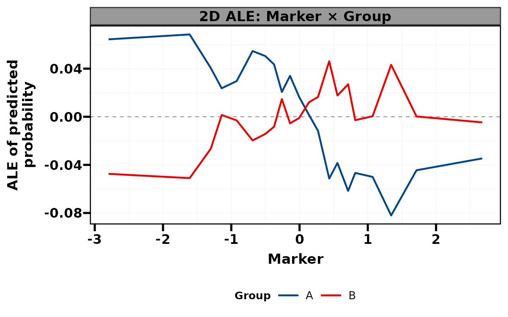{fig-alt="同一合成队列的 ranger 二阶 ALE，去除低阶项后展示 Marker 与 Group 的预测事件概率变化。"}

### 加性 Logistic 的 link 尺度

```r
ec_linear <- get_exp(dc, vars = cvars, surv = "Outcome", model = "default")
linear_ale <- get_ale2(ec_linear, c("Marker", "Group"),
  N = 300, scale = "link", cores = 1)
linear_ale
```

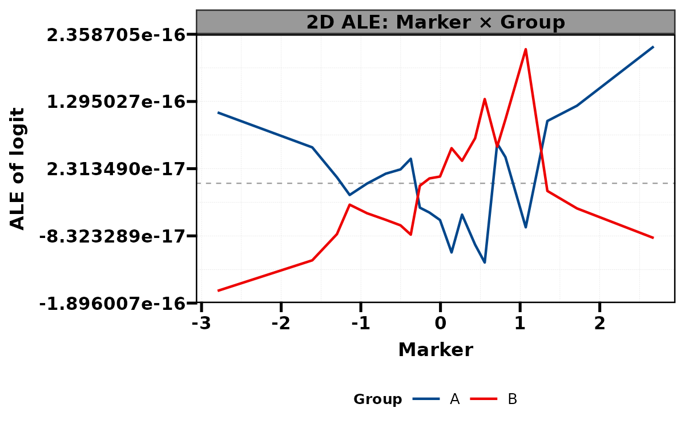{fig-alt="只含主效应的 Logistic 模型在 logit 尺度上的二阶 ALE 接近数值零，反映所拟合模型而不是生成数据的交互。"}

:::

模拟数据含有 Marker × Group，但默认 Logistic 工作模型只拟合主效应，所以第二张图的 link 尺度交互应接近零。图解释的是实际拟合模型；不能据此否定真实数据生成过程中的交互。概率尺度与 link 尺度的交互含义也不同。

默认 `N=10000`，`N=NULL` 使用全部数据；超过 N 时等间隔取行，不消耗 RNG。二阶 ALE 的成本主要是每个有效局部区间四角预测。随机森林没有对应的拟合 link，显式使用 `scale="prob"`；Cox / Logistic 的 link 则对应模型工作尺度。

本例执行默认 `engine="iml"`；其他引擎和分类水平排序应按当前帮助选择。二阶 ALE 是模型解释图，不提供交互 P 值，也不能替代临床效应修饰检验。

## 接口、返回对象与分析流程 {#interface}

| `surv` | 实际任务 | 预测时间 |
|:--|:--|:--|
| TRUE / FALSE | 生存 | 默认 120；FALSE 仍走生存路径 |
| 数值，如 60 | 生存 | 使用该数值，单位跟随 time |
| 字符结局名 | 二分类 | 没有随访时间维度 |

`model = default` 对生存是 Cox，对二分类是 Logistic；另外支持 ranger 和 xgboost。`get_exp()` 返回统一的 12 字段 list：核心解释器在 `EXP`，追加预测的原始数据在 `dat`，类型名称在 `cat_vars` / `con_vars`，原始设置在 `par_lis`。`per`、`imp_res`、`imp_plot` 等随任务填充；默认生存简化路径中的预生成重要性/PDP 字段可为 NULL。

`get_vpd()` 接受完整解释结果或构建参数 list，返回组合图。`exp_var = c(group, focus)` 的第一项必须为分类变量。这是分组的一维 PDP。当前生存分组路径会按组重建解释器；分类路径使用 DALEX 的分组剖面。因此不能把组间曲线直接当成同一模型的二维联合响应。真正二维生存 PDP 的接口和图谱见后续专题。

```r
get_exp(data, vars, surv = 120,
        model = c("default", "ranger", "xgboost"))
get_vpd(EXP.obj, exp_var, tidy_plot = TRUE, cores = NULL)
get_vpd_pnl(EXP.obj, exp_var, N = 300, cores = NULL)
```


## 生存任务：四种变量组合

`exp_var` 为一个变量时直接展示该变量；两个变量时第一项必须为分类分组，第二项为关注变量。纵轴是选定时间点的预测生存概率 S(t)，不是 HR。

::: {.panel-tabset}


### 单连续变量 {.unnumbered}


生存模型在 60 月的 Age：VD 保留其他观测特征，PD 在参考样本上平均。


```r
get_vpd(e60, exp_var = "Age", cores = 1)
```


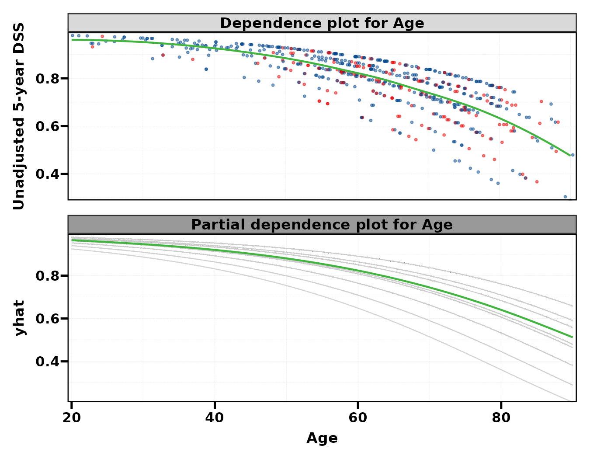{fig-alt="生存模型在 60 月的 Age：VD 保留其他观测特征，PD 在参考样本上平均。"}


### 单分类变量 {.unnumbered}


比较性别两水平的预测分布与平均部分依赖。


```r
get_vpd(e60, exp_var = "Sex", cores = 1)
```


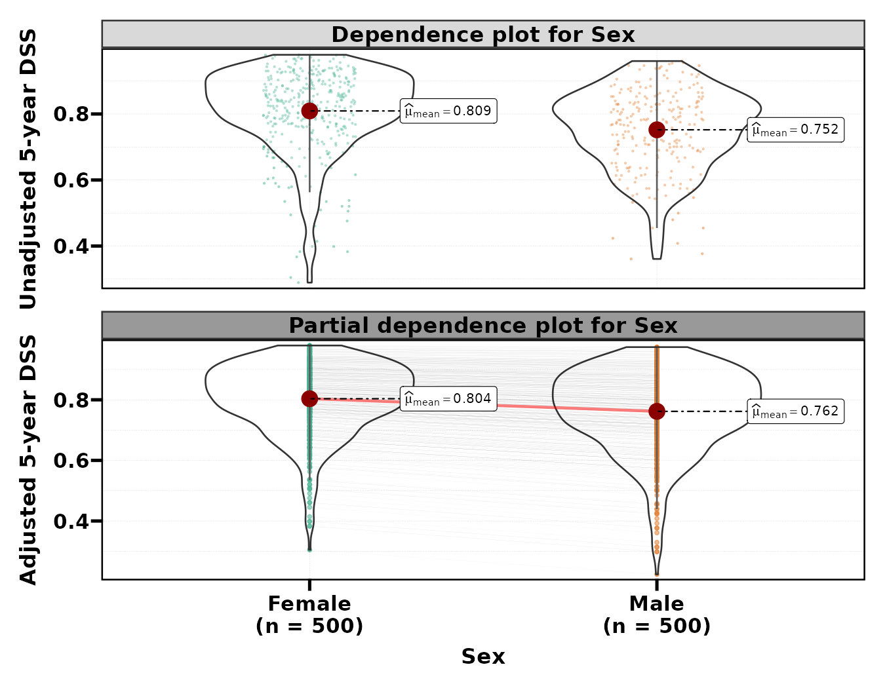{fig-alt="比较性别两水平的预测分布与平均部分依赖。"}


### 分类 × 分类 {.unnumbered}


按 Sex 分组查看 Tum_3；这是分组一维剖面。


```r
get_vpd(e60, exp_var = c("Sex", "Tum_3"), cores = 1)
```


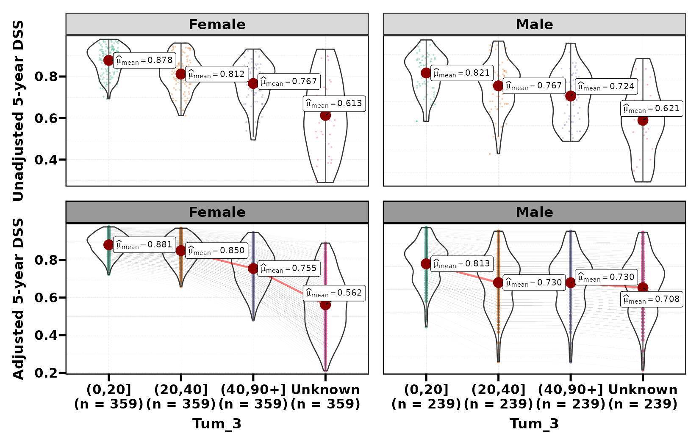{fig-alt="按 Sex 分组查看 Tum_3；这是分组一维剖面。"}


### 分类 × 连续 {.unnumbered}


按 Sex 分组查看 Age；当前生存路径在各组内重建模型。


```r
get_vpd(e60, exp_var = c("Sex", "Age"), cores = 1)
```


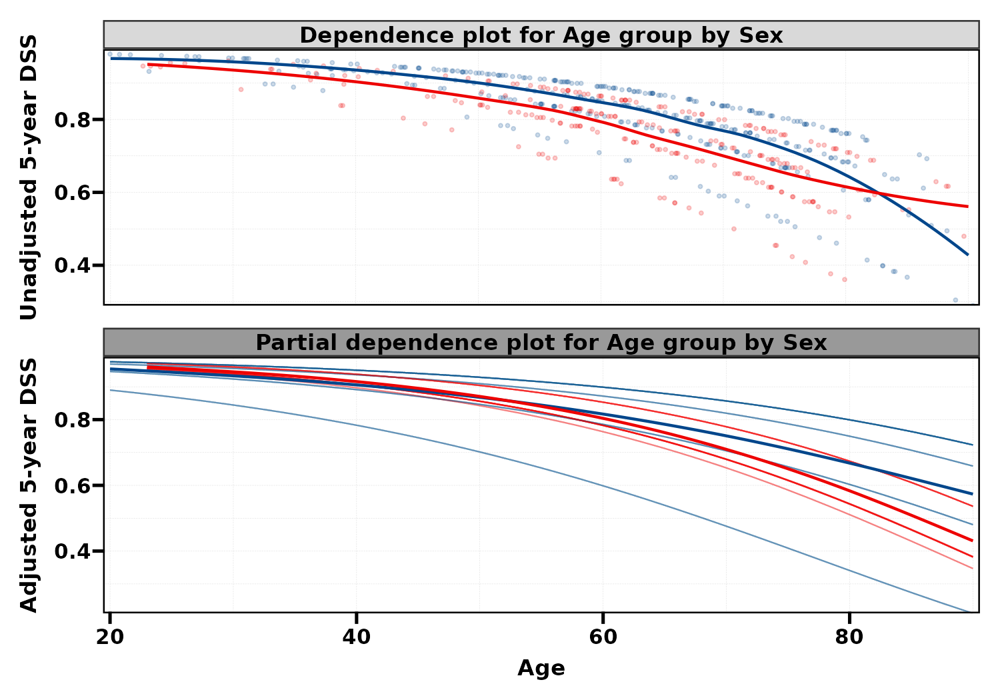{fig-alt="按 Sex 分组查看 Age；当前生存路径在各组内重建模型。"}


:::


## 预测时间与布局

数值 `surv` 是预测时间，单位跟随数据的 time。`tidy_plot` 只整理组合图坐标，`cores` 控制生存剖面的计算线程。

::: {.panel-tabset}


### 120 月 {.unnumbered}


把预测时间改为 120 月；对应的预测量从 S(60) 改成 S(120)。


```r
get_vpd(e120, exp_var = "Age", cores = 1)
```


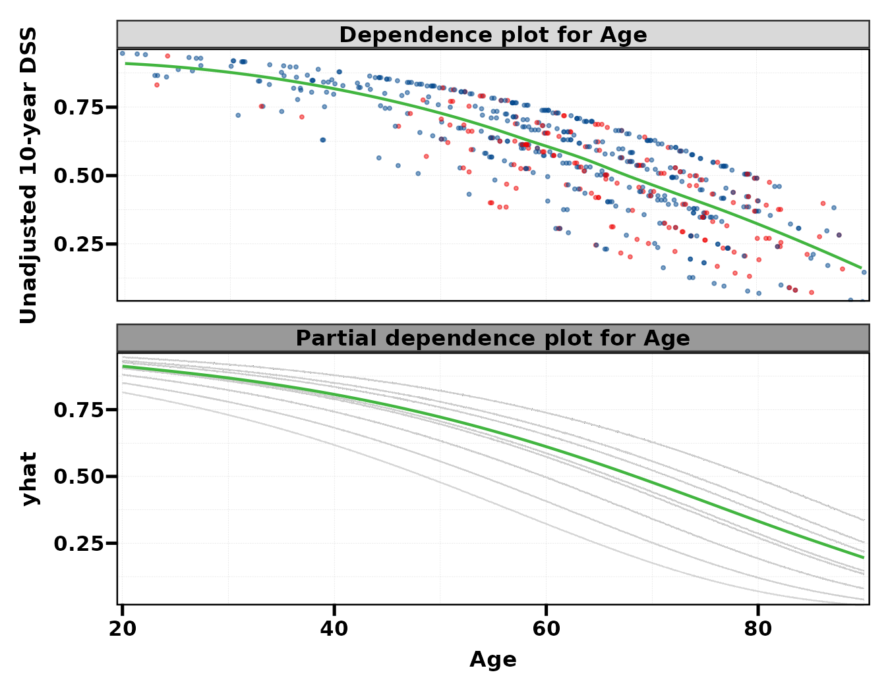{fig-alt="把预测时间改为 120 月；对应的预测量从 S(60) 改成 S(120)。"}


### 关闭轴整理 {.unnumbered}


关闭 tidy_plot，保留原始组合布局；模型与预测目标不变。


```r
get_vpd(e60, exp_var = "Age", tidy_plot = FALSE, cores = 1)
```


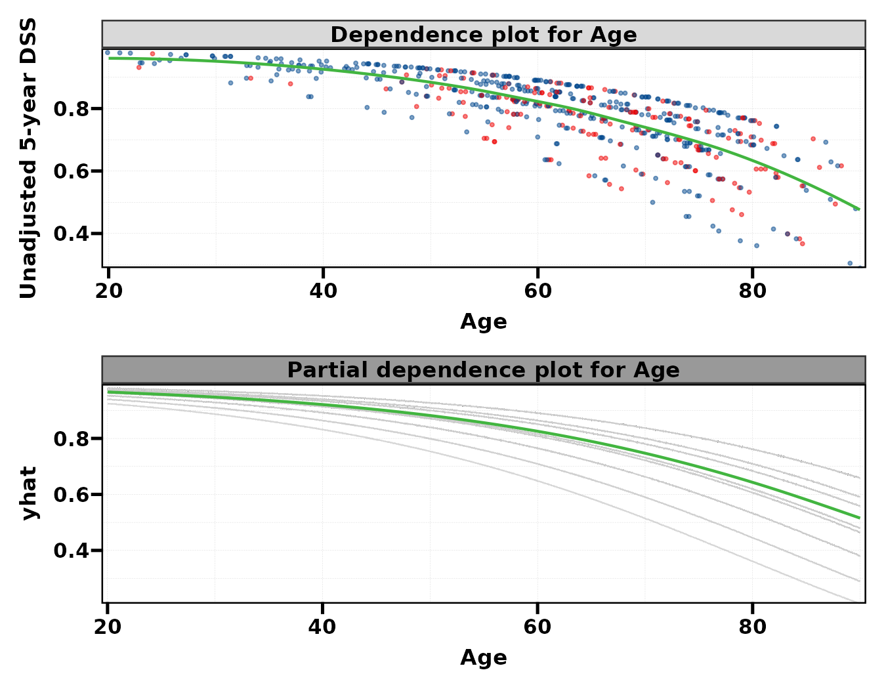{fig-alt="关闭 tidy_plot，保留原始组合布局；模型与预测目标不变。"}


:::


## 二分类任务：四种变量组合

`surv = Outcome` 指定二分类目标；结局水平设为 No / Yes。分类概率没有随访时间维度。

::: {.panel-tabset}


### 单连续变量 {.unnumbered}


二分类纵轴为预测 Outcome = Yes 的概率，数据是明确标注的模拟样本。


```r
get_vpd(ec, exp_var = "Age")
```


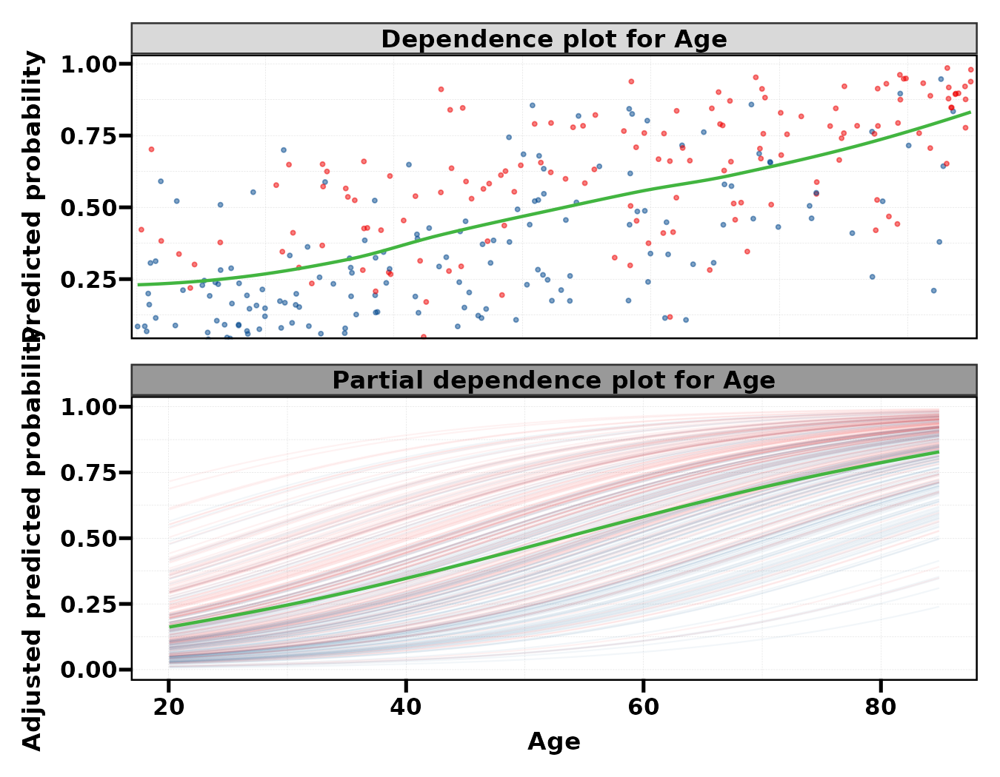{fig-alt="二分类纵轴为预测 Outcome = Yes 的概率，数据是明确标注的模拟样本。"}


### 单分类变量 {.unnumbered}


比较模拟样本的 Sex 与预测阳性概率。


```r
get_vpd(ec, exp_var = "Sex")
```


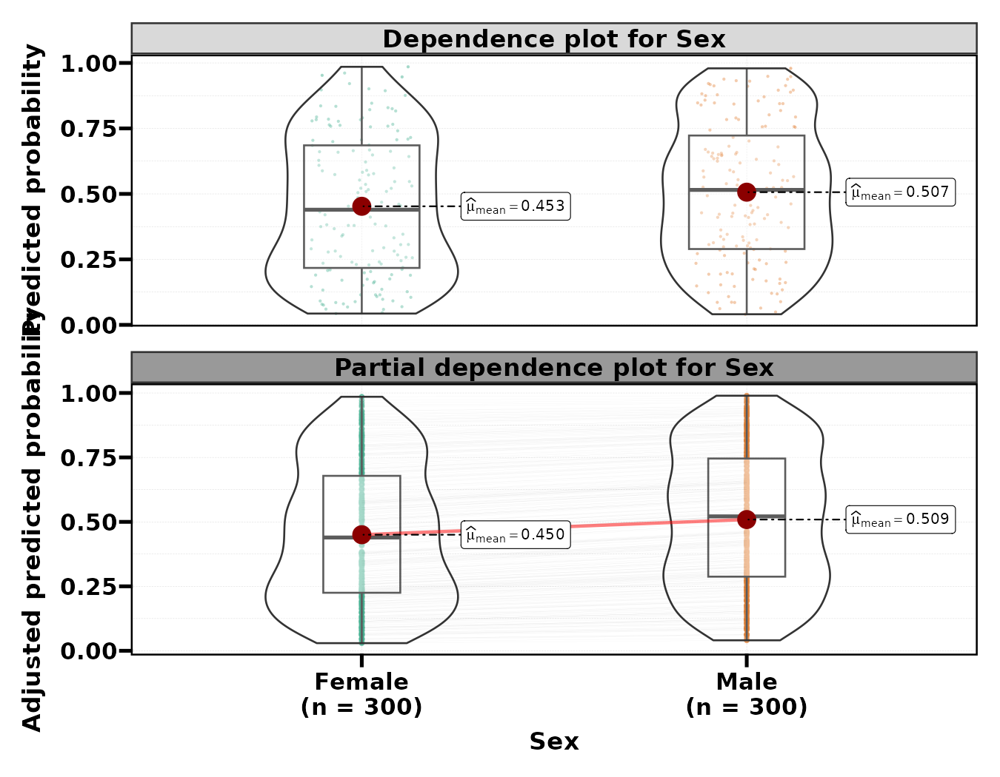{fig-alt="比较模拟样本的 Sex 与预测阳性概率。"}


### 分类 × 分类 {.unnumbered}


按 Sex 分组查看 Group；二分类路径使用 DALEX 分组剖面。


```r
get_vpd(ec, exp_var = c("Sex", "Group"))
```


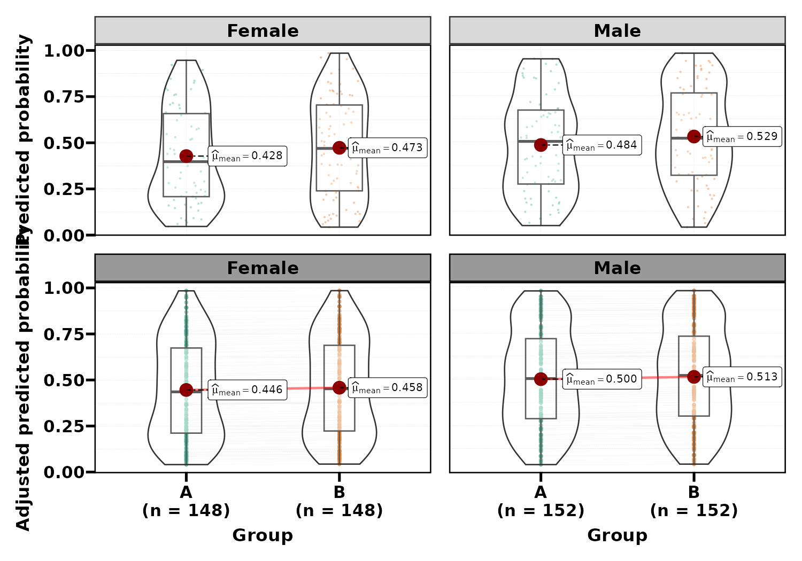{fig-alt="按 Sex 分组查看 Group；二分类路径使用 DALEX 分组剖面。"}


### 分类 × 连续 {.unnumbered}


按 Sex 分组查看 Age 的平均响应，不能把组间曲线差读作因果效果。


```r
get_vpd(ec, exp_var = c("Sex", "Age"))
```


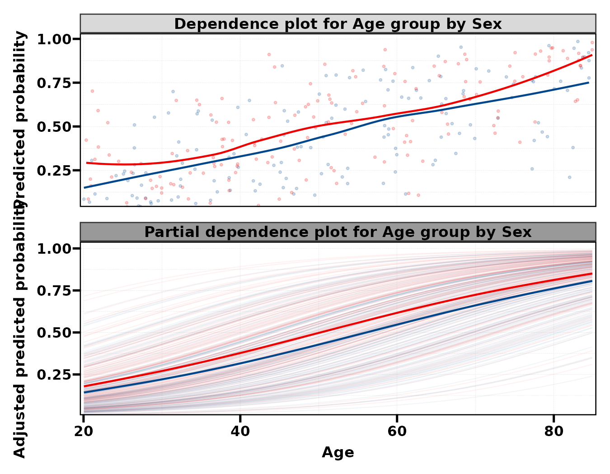{fig-alt="按 Sex 分组查看 Age 的平均响应，不能把组间曲线差读作因果效果。"}


:::


## 模型后端与对象输入

`model = default` 对应 Cox / Logistic；`ranger` 对应随机森林；`xgboost` 对应相应任务的 boosting 模型。改变模型须重新计算解释对象。

::: {.panel-tabset}


### 生存随机森林 {.unnumbered}


随机森林的响应形状可与上面的 Cox 结果比较；模型本身已改变。


```r
get_vpd(erf, exp_var = "Age", cores = 1)
```


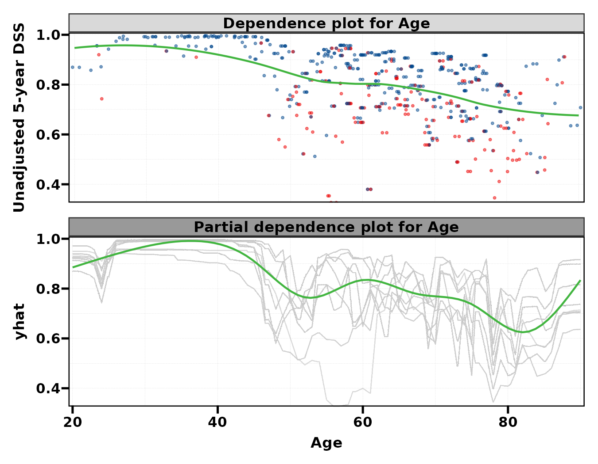{fig-alt="随机森林的响应形状可与上面的 Cox 结果比较；模型本身已改变。"}


### 参数列表自动构建 {.unnumbered}


传入 get_exp 参数列表时，get_vpd 先训练模型并构建解释器，再绘图。


```r
get_vpd(list(data = dc, vars = cvars, surv = "Outcome"), exp_var = "Marker")
```


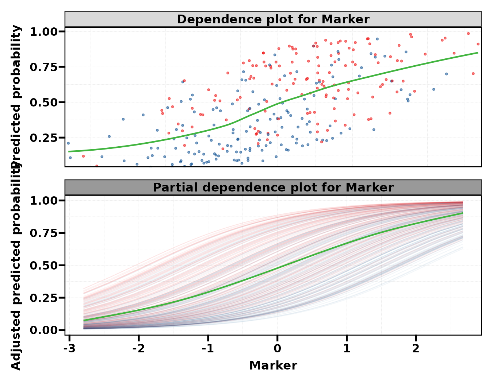{fig-alt="传入 get_exp 参数列表时，get_vpd 先训练模型并构建解释器，再绘图。"}


:::


## 参数调整、保存与使用边界 {#parameters}

| 需求 | 参数 | 是否需要重算 |
|:--|:--|:--|
| 修改预测时间 | get_exp 的数值 surv | 重建解释器，再作图 |
| 改模型 | model | 重新训练 |
| 选择变量/分组 | exp_var | 重算相应剖面，分组生存还会重建组内模型 |
| 整理组合图 | tidy_plot | 改呈现 |
| 控制计算线程 | cores | 生存有效；分类忽略 |
| 检查曲线非线性 | get_vpd_pnl 的 N | 重新抽样/计算曲线 |

`get_vpd_pnl()` 对拟合模型的 PDP 曲线调用 `RegR::get_pnl_curve()`，其 P 值描述所生成曲线的形状。它不是原始患者结局模型的非线性检验，也不包含完整模型开发过程的不确定性。

```r
get_vpd_pnl(e60, exp_var = "Age", N = 100, cores = 1)
get_vpd_pnl(e60, exp_var = c("Sex", "Age"), N = 100, cores = 1)

p <- get_vpd(e60, exp_var = "Age", cores = 1)
ggplot2::ggsave("age-pdp-60-months.pdf", p, width = 9, height = 7)
```

多数 VD/PD 图由内部平滑层显示趋势；原始剖面、统计尺度和共享轴应结合条带与本文说明阅读。get_exp 控制台打印的训练分数是表观性能，需要另外的重采样或外部数据评估。

## 相关页面与源码 {#references}

- [SHAP 解释](shap-guide.qmd)
- [特征重要性图谱](imp-guide.qmd)
- [ToyData 数据来源](../toydata/index.qmd)
- [MLR 参考手册](https://hui950319.github.io/MLR/)
- [get_exp 源码](https://github.com/HUI950319/MLR/blob/master/R/vpd-exp.R)
- [get_vpd 源码](https://github.com/HUI950319/MLR/blob/master/R/vpd-get.R)
- [survex 官方文档](https://modeloriented.github.io/survex/)

本页图片来自上面的实际公共调用。使用固定示例、固定随机种子和注明的小规模设置，图形用于学习接口及解释预测结果。
12 张图覆盖两类任务各四种变量组合、60/120 月、tidy_plot 和 ranger 后端。生存剖面限制为单线程以控制资源；小规模曲线形状计算可能提示某些重采样无事件，不能把相关提示当成临床效应证据。
