先用 `get_cat()` 计算曲线和效应表，再用 `plt_cat1()`、`plt_cat2()` 或 `plt_cat3()` 选择布局。本页参照 [MLR 的 SHAP 页面](../mlr/shap-guide.qmd)：**每个参数选项配可复制代码与实绘图片，在标签页中切换比较，点击图片可放大。**

**版本与执行范围：** 接口按 RegR **0.1.3**（本机源码 `0add2bb`）核对，使用 WSL R **4.4.3** 实际拟合并绘制 **20 张图**。执行了未调整分析、`direct` 标准化、多分类暴露，以及 CIF 的 `CSC` 标准化；IPTW、PSM 和 FGR 标准化只说明接口。本页显示保存的汇总图形，不提供患者级数据下载。

## 示例准备与读图规则 {#data}

使用 **RegR 自带**的 `seer_thyroid_mtc_2026`：4,387 人甲状腺髓样癌（MTC）队列，Female 2,537 人、Male 1,850 人。甲状腺癌死亡 597 人、其他原因死亡 583 人，存活 / 删失 3,207 人。它与本站 [森林图教程](forest-guide.qmd) 使用的 598 人 M1 PTC 队列是不同的示例数据，不能跨页直接比较结果。

本页以 `Sex` 为分类变量，明确 Female 为第一水平；调整变量为 `Age` 与 `Race`。随访单位是月，单时点概率取 120 月，多时点差值取 60、120、180 月，主图显示 0–180 月，统一采用 95% CI。只检查本页需要的分析列，不对所有原始列做完整案例筛选或插补。

<!-- cat-run: setup -->
```r
library(RegR)
library(ggplot2)

data("seer_thyroid_mtc_2026", package = "RegR")
d <- as.data.frame(seer_thyroid_mtc_2026)
used <- c("Sex", "Age", "Race", "DSS", "time", "event")
d <- droplevels(d[complete.cases(d[, used]) & d[["time"]] > 0, ])
d[["Sex"]] <- factor(d[["Sex"]], levels = c("Female", "Male"))
d[["status"]] <- factor(d[["event"]], levels = 0:2)

# 分析一次，后面的布局示例复用同一对象。
cat_fit <- get_cat(
  d, cat_var = "Sex", adj_var = c("Age", "Race"),
  surv = TRUE, conf_level = 0.95,
  timepoint = 120, time_dif = c(60, 120, 180),
  methods = c("unadj", "direct")
)
```

::: {.table-responsive}

| 图上的量 | 本页的含义与方向 | 参考值 / 范围 |
|:--|:--|:--|
| HR | Cox 危险比，Male 相对 Female；不是死亡概率比 | 1 |
| sHR | 竞争风险 Fine–Gray 亚分布危险比；不是原因特异 HR | 1 |
| $S(t)$ | DSS 的生存概率；其他原因死亡按该终点删失 | 0–1 |
| $\Delta S(t)$ | **Female − Male** 的生存概率差 | 0；概率单位 |
| $CIF_1(t)$ | 存在其他死因竞争时，甲状腺癌死亡的累计发生概率 | 0–1 |
| $\Delta CIF_1(t)$ | **Female − Male** 的甲状腺癌死亡 CIF 差 | 0；概率单位 |
| Event/total | 目标事件 / 分析组总人数 | 不是随时间变化的在险人数 |
| Number at risk | 指定随访时刻仍在风险集中的人数 | 位于 `plt_cat3()` 的曲线下方 |

:::

例如概率差 0.10 是 **10 个百分点**，不是 HR = 0.10；CIF 差为负表示第一组的累计发生概率较低。改变表头或曲线颜色不会改变差值方向，若要反向比较，应先改变因子水平，再重新调用 `get_cat()`。

::: {.callout-note}
DSS 生存概率与竞争风险 CIF 是不同的统计量：存在其他死因时，不能把 $1-S_{\mathrm{DSS}}(t)$ 当作甲状腺癌死亡 CIF，概率定义可参阅 [survival 官方竞争风险教程](https://cran.r-project.org/web/packages/survival/vignettes/compete.pdf)。这里展示的是观察性队列中的模型与绘图行为，调整曲线不自动等于因果效果；曲线置信带是逐时点区间，见 [adjustedCurves 方法说明](https://robindenz1.github.io/adjustedCurves/articles/adjustedCurves.html)。
:::

## get_cat()：分析设置与返回对象 {#get-cat}

### 当前接口

```r
get_cat(
  data, cat_var = NULL, adj_var = NULL,
  surv = TRUE, conf_level = 0.95,
  cif_args = list(model = c("FGR", "CSC")),
  timepoint = 120, time_dif = c(60, 120, 180),
  methods = c("unadj", "direct"),
  methods_obj = methods,
  methods_haz = methods,
  methods_sur = methods,
  cat_var_combine = NULL
)
```

::: {.table-responsive}

| 参数 | 作用与边界 |
|:--|:--|
| `cat_var` | 一个分类变量；本页用列名字符串，并明确因子水平 |
| `adj_var` | 调整项；本页为 Age 与 Race |
| `surv = TRUE` | 需要 `time` 和 0/1 的 `DSS`，生存模式 |
| `surv = FALSE` | 竞争风险模式，需要 `time`、`event` 和 `status`；本页 0 = 删失、1 = 甲状腺癌死亡、2 = 其他原因死亡 |
| `timepoint` | `UM` 表中单时点概率 / 差值的时间；不是图的显示终点 |
| `time_dif` | `Mul` 表中多个时点的差值；只对二分类变量产生该表 |
| `methods` | 一次设置曲线、比值表、概率表所用的方法；默认 `c("unadj", "direct")` |
| `methods_obj` | 单独设置 `obj` 中的曲线方法 |
| `methods_haz` | 设置 HR / sHR 表，**也控制 `Mul` 的多时点差值方法** |
| `methods_sur` | 设置单时点概率 / 差值表的方法 |
| `cat_var_combine` | 两列以上合并为 `.cat_combined` 分类变量，覆盖 `cat_var`；组合成分自动移出调整项 |
| `conf_level` | 默认 0.95；改变区间需要重新分析 |

:::

`methods_obj`、`methods_haz`、`methods_sur` 虽可分别配置，本页三个绘图函数按**两个曲线对象及对应的未调整 / 调整表**组织面板。复现这些组合图时，保留默认的 `c("unadj", "direct")` 最直接；单个方法生成的分析对象不能当作同样的两列绘图输入。

### 方法与 CIF 后端

::: {.table-responsive}

| 方法 | 主要行为 | 本页执行范围 |
|:--|:--|:--|
| `"unadj"` | 生存模式用 KM；CIF 模式用 Aalen–Johansen；回归比值未调整 | 实际展示 |
| `"direct"` | 用结局模型标准化得到组别曲线，回归比值另行估计 | 实际展示 |
| `"iptw"` | 倾向评分加权；当前二分类和多分类默认均按 ATE | 应先检查重叠、权重与加权平衡 |
| `"psm"` | 二分类 1:1 近邻匹配，分析匹配后的子队列 | 未执行；不支持多分类暴露 |

:::

`cif_args$model` 只影响 **CIF + direct 的标准化概率路径**。默认 FGR 使用 Fine–Gray 模型和 bootstrap；本页显式选择 CSC，用各原因 Cox 模型与解析方差绘制 CIF。**即使选择 CSC，HR 类表格仍是 Fine–Gray sHR**；不能把它改读为原因特异 HR。更详细的模型与性能比较见 [FGR / CSC 基准页](get-eff-cif-benchmark.qmd)。

### cat_res 的四个部分

```r
class(cat_fit)                 # "cat_res"
names(cat_fit[["cat"]])       # "obj" "UM" "Mul" "par"
names(cat_fit[["cat"]][["obj"]])
names(cat_fit[["cat"]][["UM"]])
cat_fit                       # 打印效应范围和可复制的坐标参数
```

::: {.table-responsive}

| 路径 | 内容 | 用法 |
|:--|:--|:--|
| `cat_fit$cat$obj` | 每个方法的生存 / CIF 曲线对象 | 三个绘图函数的曲线输入 |
| `cat_fit$cat$UM` | `haz_unadj`、`haz_direct`、`sur_unadj`、`sur_direct` 效应表 | HR / sHR、单时点概率与差值 |
| `cat_fit$cat$Mul` | 未调整 / 调整的多时点差值表 | `plt_cat2()` 的下排森林表；多分类时为 NULL |
| `cat_fit$cat$par` | 原始分析数据、变量、方法、时间点与水平等 | 核对分析设置；保存完整对象会保留原数据 |

:::

`Mul` 不是“多变量调整表”的简称。`get_cat()` 不负责把所有布局画好；改变图形参数可复用 `cat_fit`，改变结局、方法、调整变量或时间点则需要重新分析。

## get_cat()：多个独立暴露与曲线计算 {#get-cat-multiple}

2026-10-05 源码 `3411eb0` 支持一次传入多个 `cat_var`：每个暴露独立调用 get_cat，返回具名 `cat_res` list，不把它们组合成一个暴露。`cat_var_combine` 则建立联合分类，含义不同。下面重新抽取 800 人作为独立补充例子，与本页前面的全队列图分开阅读。

```r
d_multi <- as.data.frame(seer_thyroid_mtc_2026)
used <- c("Sex", "Age", "Race", "DSS", "time", "event", "T_stage")
d_multi <- droplevels(d_multi[complete.cases(d_multi[used]) &
                               d_multi[["time"]] > 0, ])
d_multi[["Sex"]] <- factor(d_multi[["Sex"]], levels = c("Female", "Male"))
d_multi[["stage"]] <- factor(ifelse(d_multi[["T_stage"]] %in% c("T1", "T2"),
                                   "Early", "Other"))
set.seed(20261005)
d_multi <- droplevels(d_multi[sample.int(nrow(d_multi), 800L), ])
cat_multi <- run_quiet(get_cat(d_multi,
  cat_var = c(Sex = "Sex", Stage = "stage"), adj_var = c("Age", "Race"),
  timepoint = 120, time_dif = NULL,
  curve_args = list(ci = TRUE, max_times = 25L, contrasts = "reference")))
names(cat_multi)                    # "Sex" "Stage"
class(cat_multi[["Sex"]])           # "cat_res"
cat_multi[["Sex"]][["cat"]][["UM"]]
```

本次核对确认多暴露调用中的 Sex 效应表与相同参数的单独 Sex 调用一致。名称来自字符向量的 names；不命名时用列名。

`curve_args` 的公共默认值为 `list(ci = TRUE, max_times = 50L, contrasts = c("reference", "all"))`，实际默认选择 reference。`ci = FALSE` 仅省去 direct 曲线区间；`max_times = NULL` 保留完整网格，不小于 10 的整数控制调整曲线抽点；`contrasts = "all"` 请求全部曲线对比。它们不改变未调整 KM 或单时点效应表。未知、重复或空字段名会报错。

单时点 `timepoint` 与多时点 `time_dif` 会按组别随访上限处理，不能将自动截短的概率结果仍报告为原请求时点。IPTW 二分类默认已统一为 ATE；CIF 的 IPTW 曲线采用加权 Aalen–Johansen，不是加权 Fine–Gray 曲线。回归 sHR 与加权 CIF 是不同的估计量。`conf_level != 0.95` 时，应按帮助页区分从显示区间回推的 `p_value` 与保留的 `p.value_0.95`。

## 绘图入口速查 {#plot-index}

::: {.table-responsive}

| 函数 | 图形内容 | 适用条件 / 默认布局 |
|:--|:--|:--|
| [`plt_cat1()`](#plt-cat1) | 曲线与单时点效应表 | 二分类或多分类；默认 `display = "v"` |
| [`plt_cat2()`](#plt-cat2) | 2×2：上排曲线 + HR，下排差值曲线 + 多时点差值表 | **仅二分类**，需要 `Mul` |
| [`plt_cat3()`](#plt-cat3) | 曲线、单时点表与在险人数表 | 默认 `display = "h"`；CIF 不提供在险人数表 |

:::

当前 `NAMESPACE` 中导出的是上述三个 `plt_cat*()` 函数，没有名为 `plt_cat()` 的公共入口。

## plt_cat1()：曲线与内嵌森林表 {#plt-cat1}

`display` 决定表与曲线的位置，`show.noDif` 决定内嵌概率列显示差值还是各组概率。所有标签页使用同一个 `cat_fit`，没有重新拟合模型。

::: {.panel-tabset}

### 纵向组合 {.unnumbered}

默认纵向布局：未调整在上、调整后在下，内嵌表包含 HR 与 120 月生存概率差。

<!-- cat-run: cat1-vertical -->
```r
plt_cat1(cat_fit, display = "v", max_t = 180,
         xbreaks = seq(0, 180, 36),
         sur_arg = list(ylim = c(0.5, 1), ybre = seq(0.5, 1, 0.1)))
```

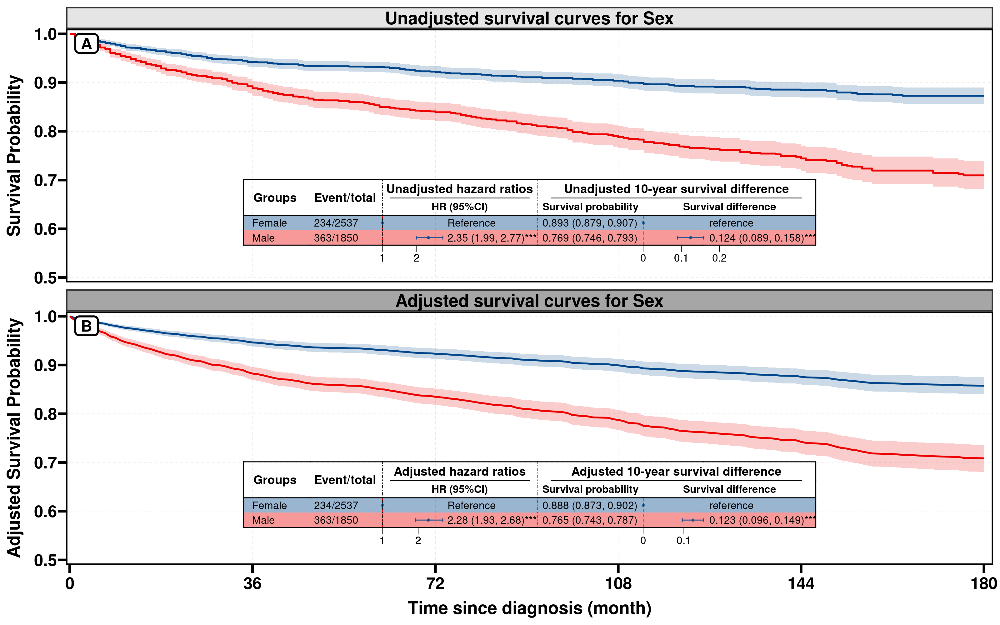{fig-alt="Female 与 Male 的未调整和调整 DSS 生存曲线，纵向排列并嵌入效应表。"}

### 横向组合 {.unnumbered}

`h` 并列比较两种分析。图片较宽，点击放大阅读内嵌表。

<!-- cat-run: cat1-horizontal -->
```r
plt_cat1(cat_fit, display = "h", max_t = 180,
         xbreaks = seq(0, 180, 36),
         sur_arg = list(ylim = c(0.5, 1), ybre = seq(0.5, 1, 0.1)))
```

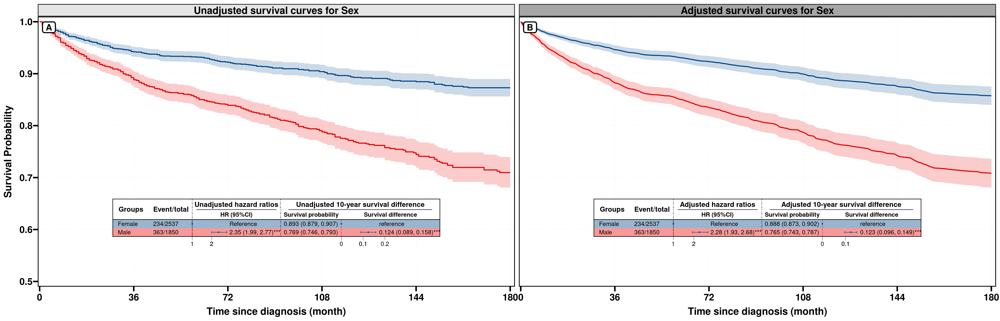{fig-alt="同一未调整和调整 DSS 生存曲线横向排列，数值分析不变。"}

### 曲线与表分开 {.unnumbered}

`s+f` 将曲线放左侧、森林表放右侧，适合减少曲线内部的文字遮挡。本页分栏与横向人数表预览采用较宽画布；在较小的 RStudio 绘图窗口中查看时，应放大窗口或导出后检查表格是否裁切。

<!-- cat-run: cat1-separate -->
```r
plt_cat1(cat_fit, display = "s+f", max_t = 180,
         xbreaks = seq(0, 180, 36),
         sur_arg = list(ylim = c(0.5, 1), ybre = seq(0.5, 1, 0.1)))
```

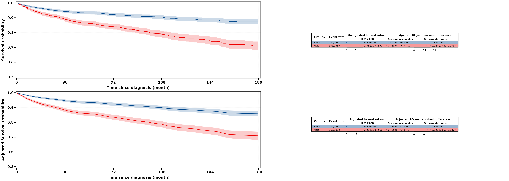{fig-alt="DSS 曲线位于左列，未调整和调整的效应表位于右列。"}

### 仅曲线 {.unnumbered}

`sur` 不绘制森林表。适合先比较曲线形状和置信带。

<!-- cat-run: cat1-curves -->
```r
plt_cat1(cat_fit, display = "sur", max_t = 180,
         xbreaks = seq(0, 180, 36),
         sur_arg = list(ylim = c(0.5, 1), ybre = seq(0.5, 1, 0.1)))
```

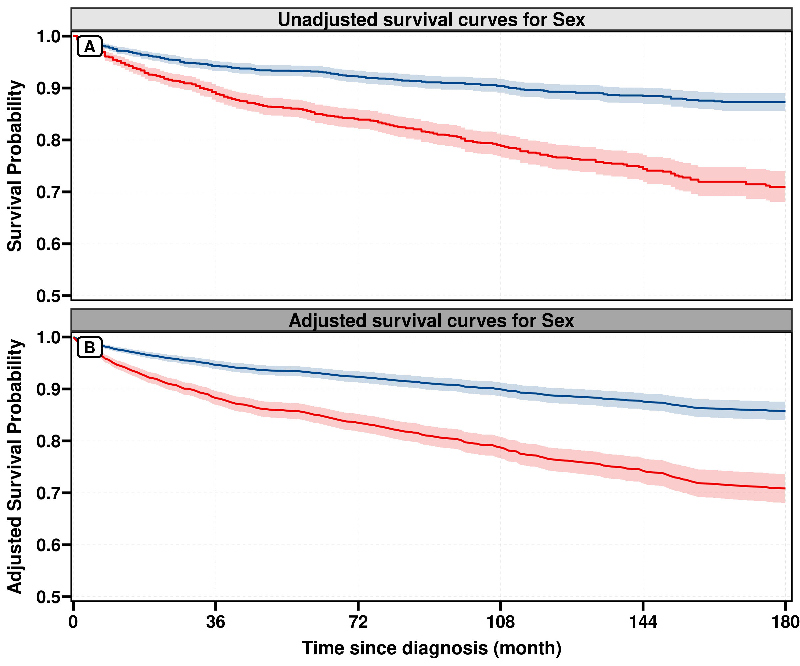{fig-alt="两行仅显示生存曲线和置信带，不嵌入森林表。"}

### 显示各组概率 {.unnumbered}

`show.noDif = TRUE` 改为展示各组的 120 月生存概率及区间；HR 列不变。

<!-- cat-run: cat1-probability -->
```r
plt_cat1(cat_fit, display = "v", show.noDif = TRUE,
         max_t = 180, xbreaks = seq(0, 180, 36),
         sur_arg = list(ylim = c(0.5, 1), ybre = seq(0.5, 1, 0.1)))
```

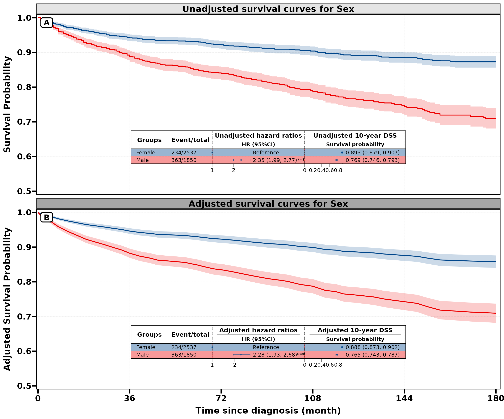{fig-alt="内嵌森林表显示 Female 和 Male 各自的 120 月生存概率。"}

### 坐标、颜色与条带 {.unnumbered}

缩短显示时间、设置两种颜色并自定义条带。`sur_arg$ylim` 控制曲线纵轴，`sur_arg$xlim` 控制内嵌森林图的横轴，两个 `xlim` 不能混读。

<!-- cat-run: cat1-style -->
```r
plt_cat1(cat_fit, display = "v", max_t = 120,
         xbreaks = seq(0, 120, 24),
         curve_color = c("#0072B2", "#D55E00"),
         sur_arg = list(ylim = c(0.6, 1), ybre = seq(0.6, 1, 0.1)),
         strip_arg = list(strip_label = c("KM: Female / Male",
                                          "Direct: adjusted for Age + Race"),
                          strip_fill = c("#E8F1F8", "#FFF0E6")))
```

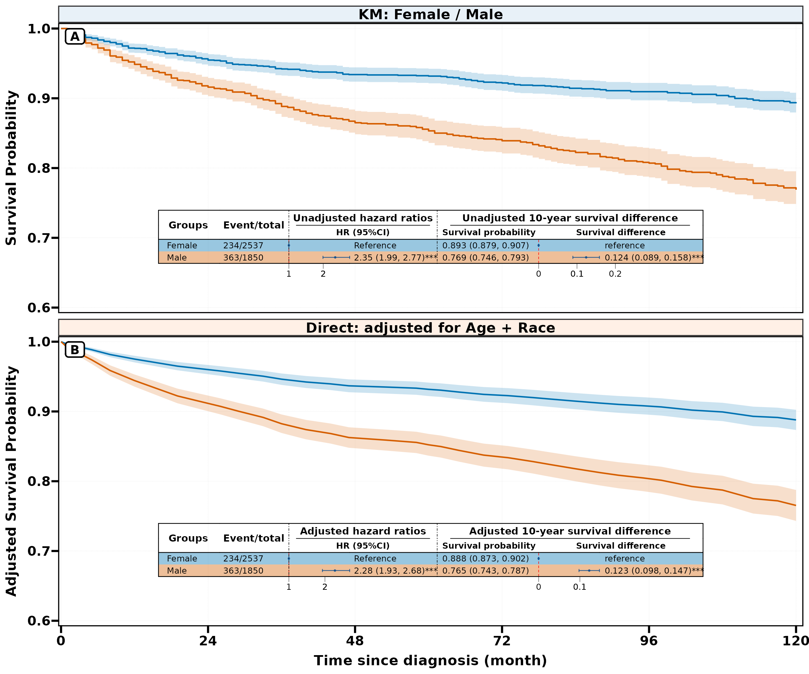{fig-alt="将 DSS 曲线显示到 120 月，并采用蓝橙配色和自定义方法条带。"}

### 内嵌表去掉森林线 {.unnumbered}

`del_forrest = TRUE` 保留数值表而隐藏森林线；这是参数的实际拼写。

<!-- cat-run: cat1-table -->
```r
plt_cat1(cat_fit, display = "v", del_forrest = TRUE,
         max_t = 180, xbreaks = seq(0, 180, 36),
         sur_arg = list(ylim = c(0.5, 1), ybre = seq(0.5, 1, 0.1)))
```

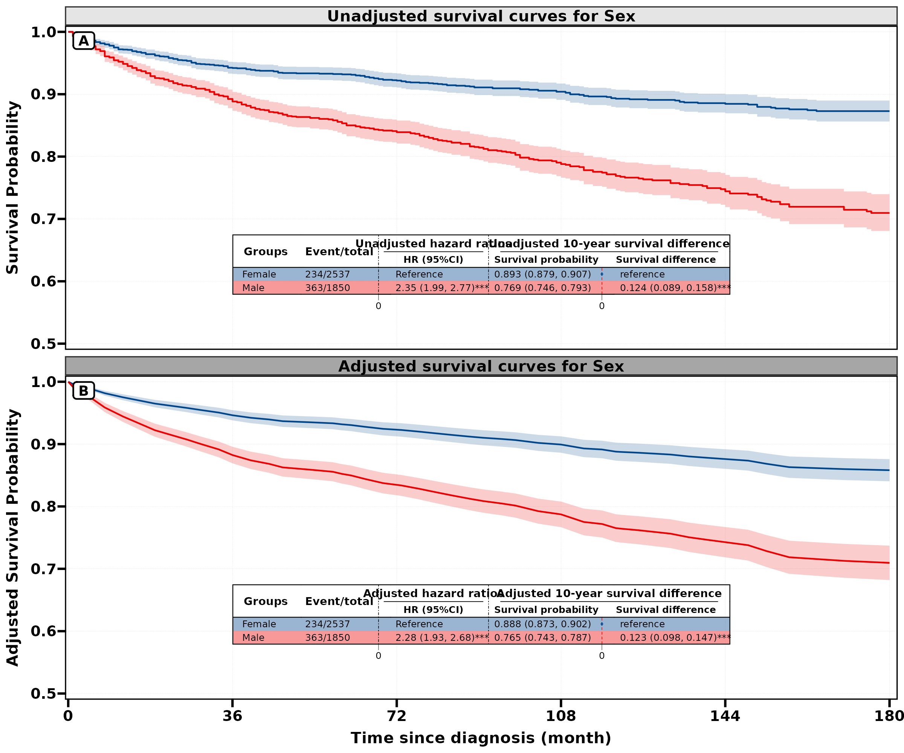{fig-alt="两种方法的曲线中保留 HR 和概率差数值，森林线被隐藏。"}

### 多分类暴露 {.unnumbered}

`Race` 有三个观测水平，可生成多组曲线。此时 `Mul` 为 NULL，不能使用二分类专用的 `plt_cat2()`；这里选择仅曲线布局。

<!-- cat-run: cat1-multicategory -->
```r
cat_multi <- get_cat(d, cat_var = "Race", adj_var = c("Age", "Sex"),
                     timepoint = 120)
plt_cat1(cat_multi, plot.margin = 12, display = "sur", max_t = 180,
         xbreaks = seq(0, 180, 36),
         sur_arg = list(ylim = c(0.5, 1), ybre = seq(0.5, 1, 0.1)))
```

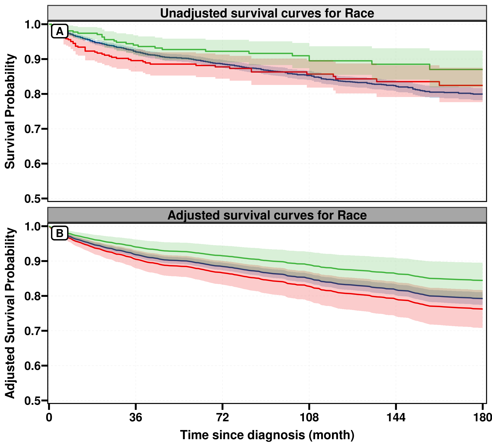{fig-alt="Race 三分类的未调整与调整 DSS 生存曲线。"}

:::

## plt_cat1()：多个 cat_res 合并成图 {#plt-cat1-multiple}

直接传入上节的 `cat_multi`，每个暴露仍有自己的未调整与调整面板。`display = "v"` / `"sur"` 将暴露左右排列，`"h"` / `"s+f"` 将暴露上下排列；面板标签连续编号。多个暴露的组别含义不同，不应跨暴露将曲线编号当成相同患者。

::: {.panel-tabset}

### 左右排列与逐暴露标题

并排示例使用 `sur` 省去内嵌表；带表的上下布局使用 30 × 16 英寸画布，并减小 `core_size` 单元格留白。导出图与页面代码采用相同参数。

```r
plt_cat1(cat_multi, plot.margin = 12, display = "sur", max_t = 180,
  xbreaks = seq(0, 180, 36),
  strip_arg = list(strip_label = list(
    c("Sex: unadjusted", "Sex: adjusted"),
    c("Stage: unadjusted", "Stage: adjusted"))))
```

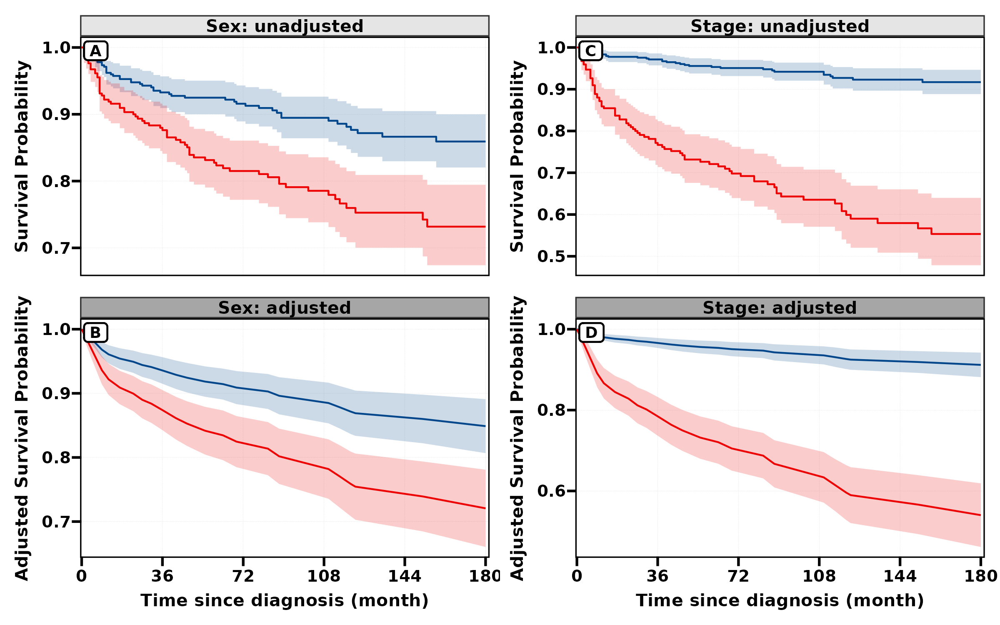{fig-alt="Sex 和演示分期两个独立暴露的四面板曲线。"}

### 上下排列

```r
plt_cat1(cat_multi, plot.margin = 12, display = "h", core_size = c(0.5, 1), max_t = 180,
  xbreaks = seq(0, 180, 36))
```

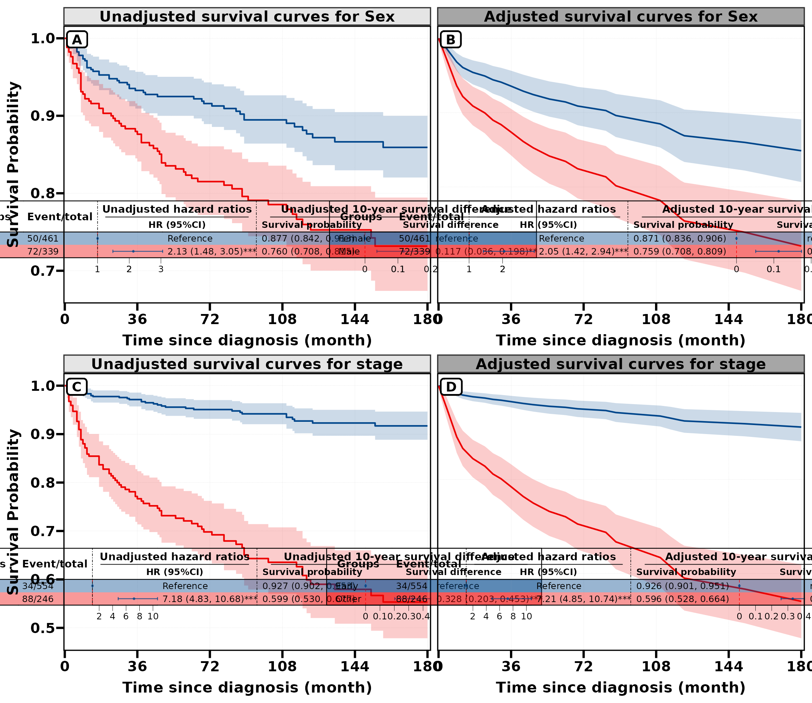{fig-alt="多个暴露的横向面板上下组合。"}

:::

`strip_arg$strip_label` 可以是一组共享标题，也可以是长度等于暴露数的 list，每个元素含该暴露的两个标题。list 长度不匹配会报错。`save` 默认页面尺寸随暴露数扩展；明确给 width/height 时仍使用指定尺寸。此扩展针对 `plt_cat1()`，不能直接假定 `plt_cat2()` / `plt_cat3()` 也接收多个 cat_res。

## plt_cat2()：生存曲线与多时点差值 {#plt-cat2}

固定 2×2 布局：左列未调整、右列调整；上排曲线与 HR 表，下排概率差曲线与多时点差值表。上排不是 `plt_cat1()` 完整的单时点表；下排的 5、10、15 年对应分析时给出的 60、120、180 月。

`sur_arg` 和 `dif_arg` 都使用 `ylim / ybre / xlim / ticks_at / ticks_digits`，但前者作用于上排，后者作用于下排。不要再使用旧的 `.2` 后缀参数。

::: {.panel-tabset}

### 默认条带 {.unnumbered}

四个面板各自带方法标题；下排的差值方向是 Female − Male。

<!-- cat-run: cat2-basic -->
```r
plt_cat2(cat_fit, max_t = 180, xbreaks = seq(0, 180, 36),
         sur_arg = list(ylim = c(0.5, 1), ybre = seq(0.5, 1, 0.1)))
```

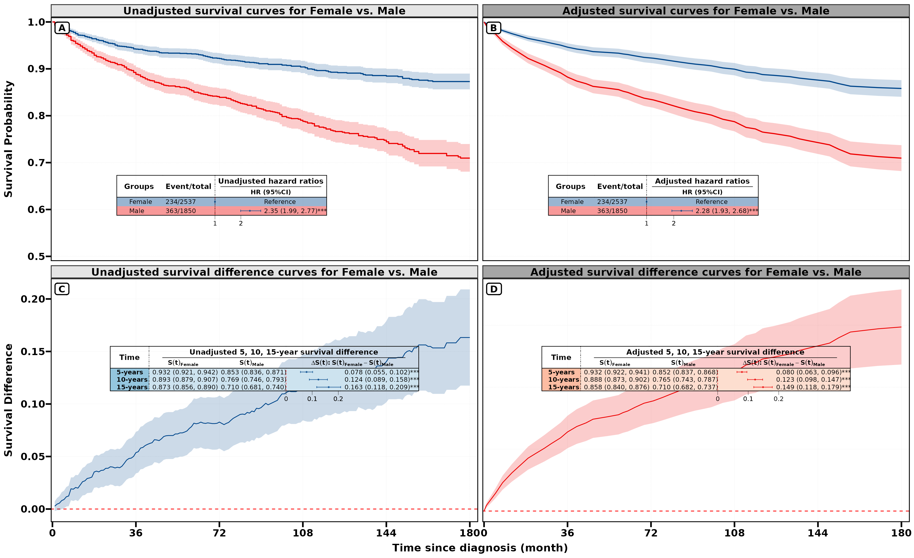{fig-alt="二分类 Sex 的 2×2 生存和差值组合图。"}

### 共用行列条带 {.unnumbered}

非空 `strip2_arg` 启用整张图的行列条带，替代每个面板的条带；`strip2_arg = list()` 保持原样。

<!-- cat-run: cat2-grid -->
```r
plt_cat2(cat_fit, max_t = 180, xbreaks = seq(0, 180, 36),
         sur_arg = list(ylim = c(0.5, 1), ybre = seq(0.5, 1, 0.1)),
         strip2_arg = list(top_label = c("Unadjusted", "Age + Race adjusted"),
                           right_label = c("DSS survival", "Female - Male"),
                           top_right_fill = c("Grays", "Greens")))
```

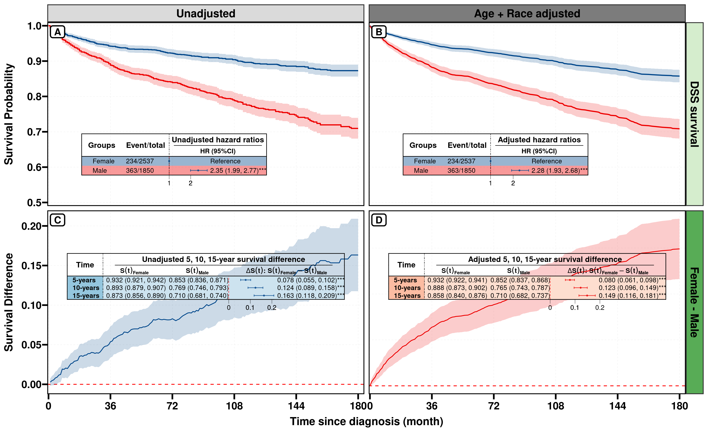{fig-alt="2×2 图的两列用方法条带，两行用生存与差值条带。"}

### 差值坐标与标题 {.unnumbered}

`dif_arg$ylim` 控制下排曲线，`dif_arg$xlim` 控制下排的差值森林图。`show_dif_header = FALSE` 省去方法标题行，保留列标题与数值。

<!-- cat-run: cat2-axis -->
```r
plt_cat2(cat_fit, max_t = 180, xbreaks = seq(0, 180, 36),
         sur_arg = list(ylim = c(0.5, 1), ybre = seq(0.5, 1, 0.1)),
         dif_arg = list(ylim = c(-0.05, 0.25), ybre = seq(0, 0.25, 0.05),
                        xlim = c(0, 0.25), ticks_at = c(0, 0.1, 0.2),
                        ticks_digits = 2),
         show_dif_header = FALSE)
```

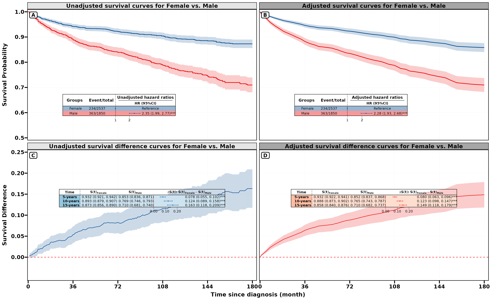{fig-alt="上排生存纵轴和下排概率差纵轴分别配置，下排森林图显示 0 到 0.25 的差值刻度。"}

### 配色与隐藏条带 {.unnumbered}

`color_pal` 统一组别颜色；下排差值是一条对比曲线，不是两条组别曲线。

<!-- cat-run: cat2-style -->
```r
plt_cat2(cat_fit, max_t = 180, xbreaks = seq(0, 180, 36),
         sur_arg = list(ylim = c(0.5, 1), ybre = seq(0.5, 1, 0.1)),
         color_pal = "OkabeIto", strip_arg = list(strip = FALSE),
         tag_position = NULL)
```

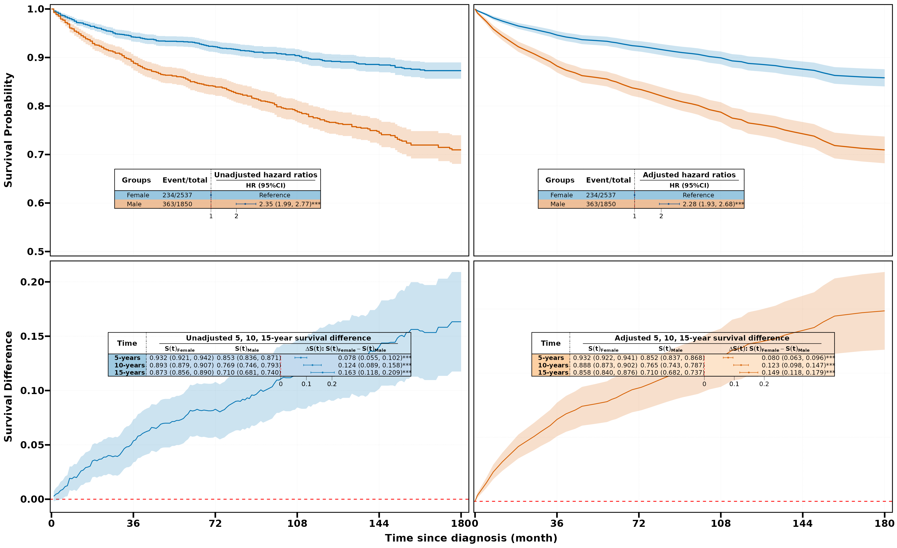{fig-alt="移除条带与面板标签的 2×2 生存和差值组合图。"}

:::

## plt_cat3()：曲线、森林表与在险人数表 {#plt-cat3}

`plt_cat3()` 在 `plt_cat1()` 的布局基础上添加在险人数表，默认横向 `h`。`risk_table_args` 是命名 list，可以局部覆盖；人数表的位置、字体与是否分组由此配置。嵌入森林表的位置则由 `forest.position` / `fmt.fst.h` 调整。

这里内嵌表使用 `fmt.fst.h = 0.1`，人数表占比 0.25；曲线纵轴从 0.4 开始，为表格预留空间。若改变人数表高度，应一起检查森林表是否挡住曲线。`risk_table_args$height` 是图形相对高度，不是英寸。

::: {.panel-tabset}

### 横向与人数表 {.unnumbered}

每条方法曲线下方给出在险人数，与内嵌表中固定的 Event/total 区分。

<!-- cat-run: cat3-horizontal -->
```r
plt_cat3(cat_fit, display = "h", fmt.fst.h = 0.1,
         max_t = 180, xbreaks = seq(0, 180, 36),
         sur_arg = list(ylim = c(0.4, 1), ybre = seq(0.4, 1, 0.1)),
         tag_position = NULL,
         risk_table_args = list(height = 0.25, size = 5, warn = FALSE))
```

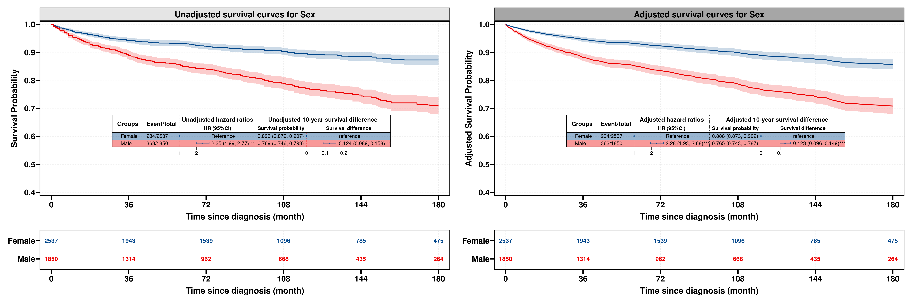{fig-alt="未调整与调整曲线横向并列，每幅曲线下方显示 Female 和 Male 在险人数。"}

### 纵向与人数表 {.unnumbered}

纵向布局增加页面高度，但在网页中便于阅读每个方法的数值。

<!-- cat-run: cat3-vertical -->
```r
plt_cat3(cat_fit, display = "v", fmt.fst.h = 0.1,
         max_t = 180, xbreaks = seq(0, 180, 36),
         sur_arg = list(ylim = c(0.4, 1), ybre = seq(0.4, 1, 0.1)),
         tag_position = NULL,
         risk_table_args = list(height = 0.25, size = 5, warn = FALSE))
```

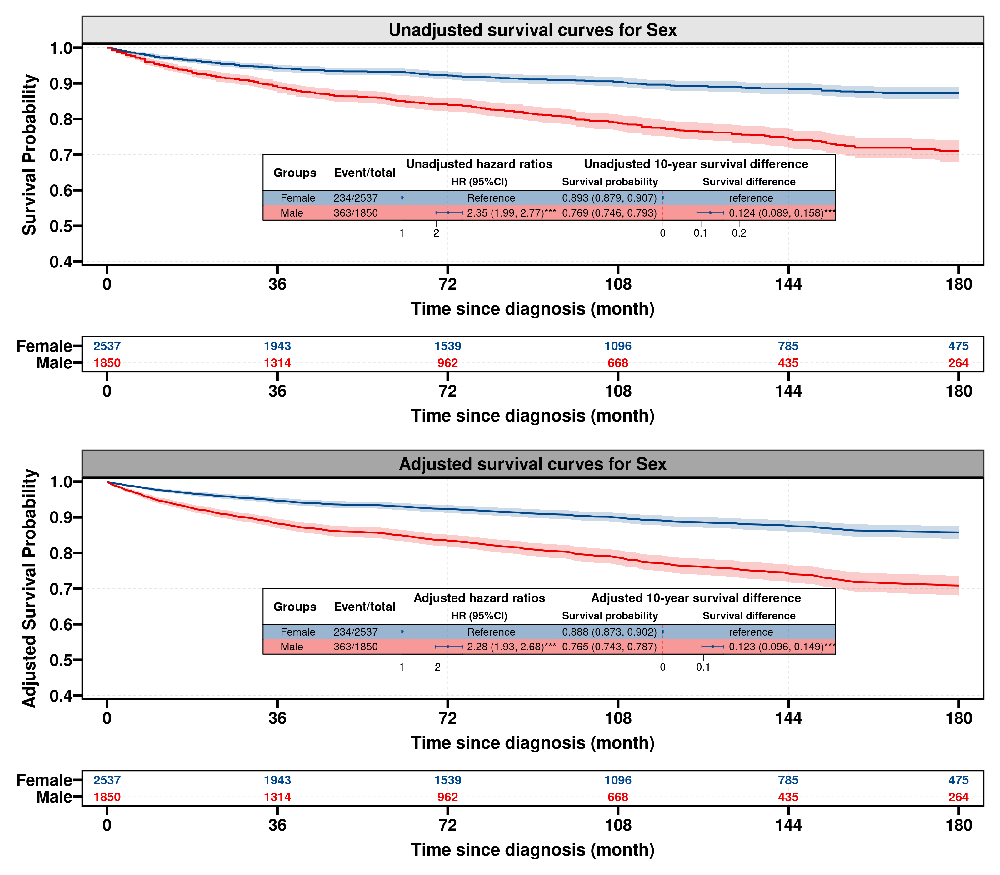{fig-alt="未调整与调整曲线纵向排列，各自带有内嵌森林表和分组在险人数。"}

### 曲线与森林表分栏 {.unnumbered}

`s+f` 把森林表移到右侧，曲线下方仍保留人数表。

<!-- cat-run: cat3-separate -->
```r
plt_cat3(cat_fit, display = "s+f", max_t = 180,
         xbreaks = seq(0, 180, 36),
         sur_arg = list(ylim = c(0.5, 1), ybre = seq(0.5, 1, 0.1)),
         risk_table_args = list(height = 0.25, size = 5, warn = FALSE))
```

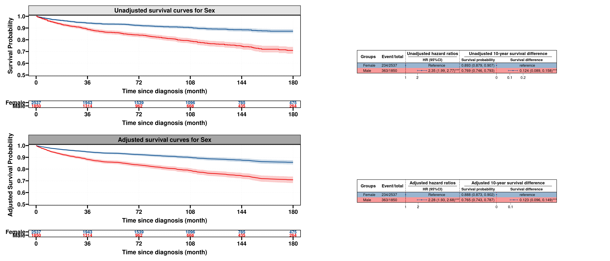{fig-alt="两种方法的曲线与在险人数表位于左列，效应森林表位于右列。"}

### 只保留曲线和人数 {.unnumbered}

`sur` 仅省去森林表，不会关闭人数表。

<!-- cat-run: cat3-curves -->
```r
plt_cat3(cat_fit, display = "sur", max_t = 180,
         xbreaks = seq(0, 180, 36),
         sur_arg = list(ylim = c(0.5, 1), ybre = seq(0.5, 1, 0.1)),
         risk_table_args = list(height = 0.25, size = 5, warn = FALSE))
```

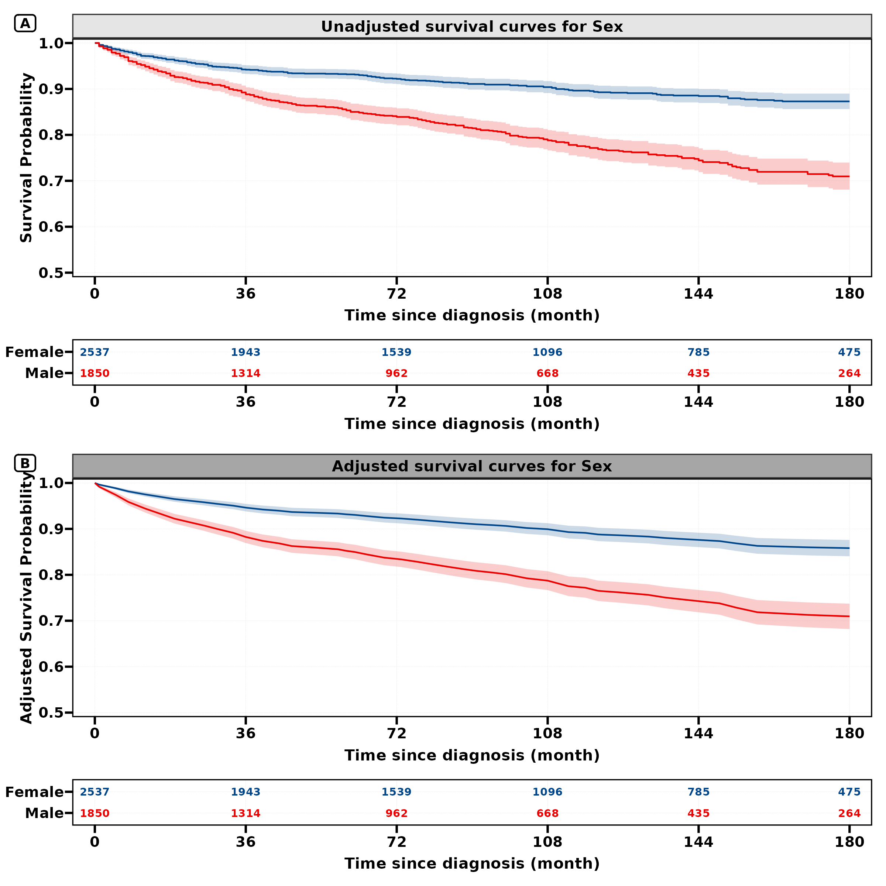{fig-alt="未调整和调整曲线各自带人数表，不显示内嵌森林表。"}

### 合并人数与文字设置 {.unnumbered}

`stratify = FALSE` 将人数合并成一行。只改变人数表的汇总显示，曲线仍按 Sex 分组。

<!-- cat-run: cat3-risk-style -->
```r
plt_cat3(cat_fit, display = "sur", max_t = 180,
         xbreaks = seq(0, 180, 36),
         sur_arg = list(ylim = c(0.5, 1), ybre = seq(0.5, 1, 0.1)),
         risk_table_args = list(stratify = FALSE, height = 0.18,
                                size = 4, fontface = "plain",
                                ylab = "All patients", warn = FALSE))
```

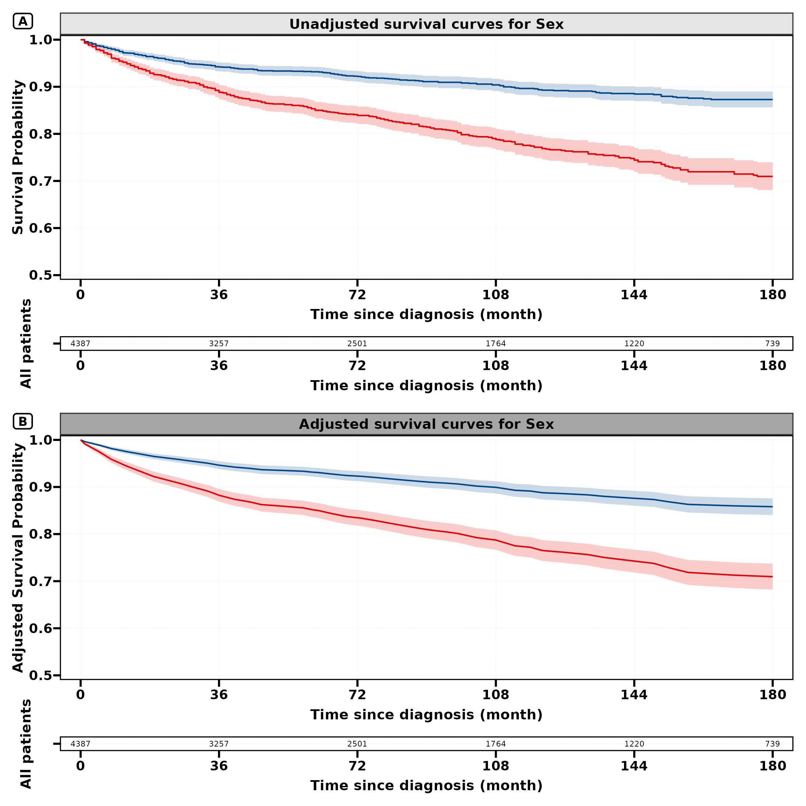{fig-alt="两种方法下的 Sex 分组曲线，每张曲线下合并显示总在险人数。"}

### 关闭人数表 {.unnumbered}

`risk_table = FALSE` 保留曲线与内嵌森林表；需要相应调整内嵌表的纵向位置。

<!-- cat-run: cat3-no-risk -->
```r
plt_cat3(cat_fit, display = "v", risk_table = FALSE,
         fmt.fst.h = 0, max_t = 180, xbreaks = seq(0, 180, 36),
         sur_arg = list(ylim = c(0.5, 1), ybre = seq(0.5, 1, 0.1)))
```

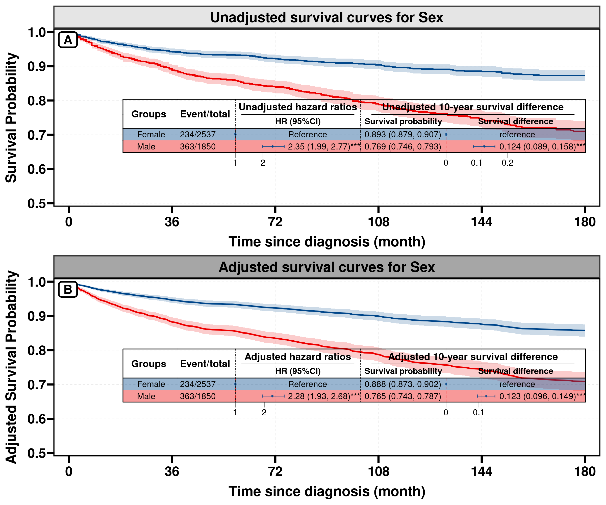{fig-alt="关闭人数表后的纵向曲线与森林表。"}

:::

风险表在本页 `unadj` / `direct` 示例中使用原队列的风险集人数，不能称为“标准化后的预测人数”。IPTW 时 `use_weights = TRUE` 会使用加权人数，可能不是整数；PSM 时风险表对应匹配后的子队列。

## 竞争风险 CIF：同一绘图接口 {#cif}

先重新计算 CIF 对象。`surv = FALSE` 改变分析目标，不是把生存曲线纵轴标签改成 CIF；`status` 的第一水平为删失，目标事件编码为 1。

<!-- cat-run: cif-setup -->
```r
cif_fit <- get_cat(
  d, cat_var = "Sex", adj_var = c("Age", "Race"),
  surv = FALSE, cif_args = list(model = "CSC"),
  timepoint = 120, time_dif = c(60, 120, 180),
  methods = c("unadj", "direct")
)
```

::: {.panel-tabset}

### CIF 与单时点概率 {.unnumbered}

`show.noDif = TRUE` 显示各组 120 月 CIF；此图的比值列仍为 sHR。曲线采用 CSC 标准化，不能把 sHR 当作 CSC 模型的系数。

<!-- cat-run: cif-cat1 -->
```r
plt_cat1(cif_fit, display = "h", show.noDif = TRUE,
         max_t = 180, xbreaks = seq(0, 180, 36),
         sur_arg = list(ylim = c(0, 0.4), ybre = seq(0, 0.4, 0.1)))
```

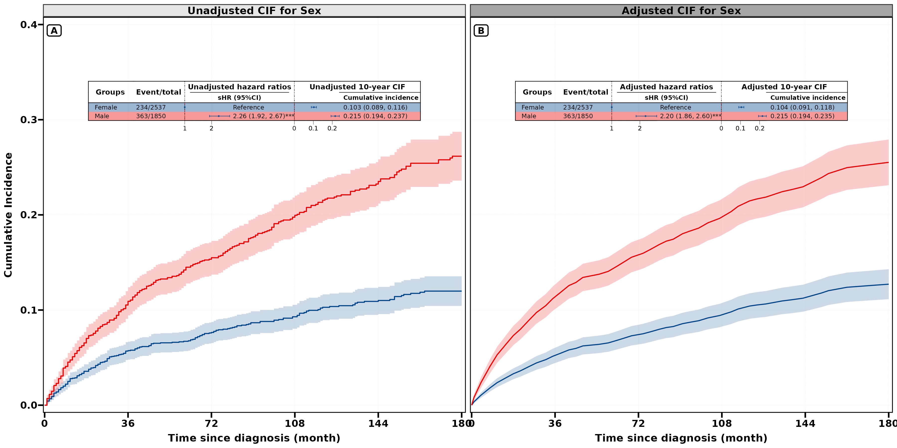{fig-alt="竞争风险 CIF 横向比较，内嵌表包含 Fine–Gray sHR 与 120 月累计发生概率。"}

### CIF 与差值曲线 {.unnumbered}

下排展示 Female − Male 的 CIF 差，负值意味着 Female 的目标事件发生概率更低。

<!-- cat-run: cif-cat2 -->
```r
plt_cat2(cif_fit, max_t = 180, xbreaks = seq(0, 180, 36),
         sur_arg = list(ylim = c(0, 0.4), ybre = seq(0, 0.4, 0.1)),
         dif_arg = list(xlim = c(-0.2, 0), ticks_at = c(-0.2, -0.1, 0),
                        ticks_digits = 2),
         strip2_arg = list(top_label = c("Aalen-Johansen", "CSC standardized"),
                           right_label = c("CIF", "Female - Male CIF")))
```

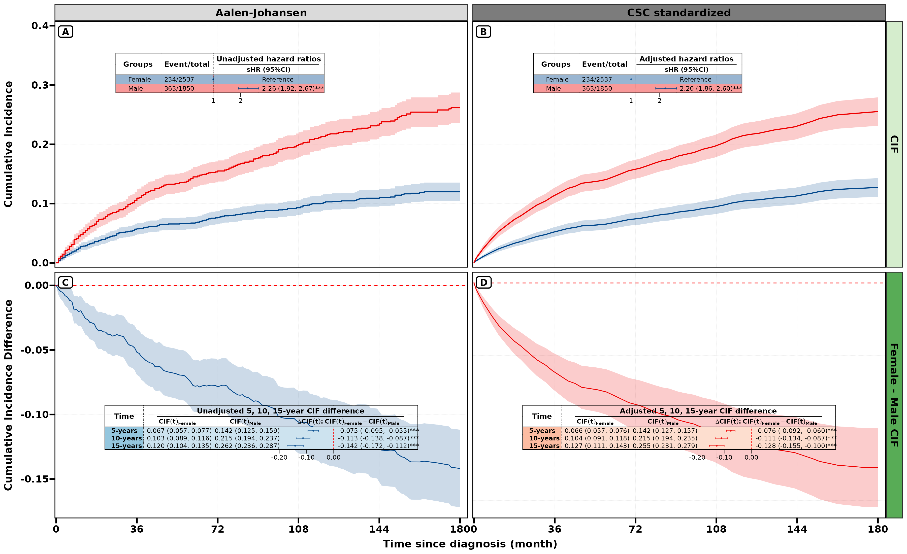{fig-alt="2×2 图的上排为目标事件 CIF，下排为 Female 减 Male 的 CIF 差。"}

:::

`plt_cat3()` 遇到 CIF 输入会关闭人数表并提示使用 `plt_cat1()`，或显式设置 `risk_table = FALSE`。本页采用前者，不把不存在的 CIF 人数表当作已支持功能。

## 参数调整与保存 {#parameters}

::: {.table-responsive}

| 想调整什么 | 参数 | 是否需要重新分析 |
|:--|:--|:--|
| 并列 / 上下 / 分栏 | `plt_cat1/3(display = ...)` | 否 |
| 曲线时间窗与刻度 | `max_t`、`xbreaks` | 否；不向观测支持范围外外推 |
| 上排曲线纵轴 / 内嵌森林横轴 | `sur_arg$ylim` / `sur_arg$xlim` | 否 |
| 差值曲线纵轴 / 差值森林横轴 | `plt_cat2(dif_arg = ...)` | 否 |
| 单时点概率与差值切换 | `plt_cat1/3(show.noDif = ...)` | 否；使用已有 `UM` 表 |
| 条带 / 面板标签 / 外边距 | `strip_arg`、`strip2_arg`、`tag_position`、`plot.margin` | 否 |
| 人数表 | `plt_cat3(risk_table, risk_table_args)` | 否 |
| 单时点 / 多时点表的时间 | `get_cat(timepoint, time_dif)` | **是** |
| 分析方法、调整项、结局与组别参考水平 | `get_cat()` 参数与数据 | **是** |

:::

三个绘图函数最后都有 `save = list()`，默认不保存。需要导出 PDF 时使用同一个命名配置入口：

```r
p <- plt_cat2(cat_fit, max_t = 180, xbreaks = seq(0, 180, 36),
              strip2_arg = list(strip = TRUE),
              save = list(filename = "sex-survival-difference.pdf",
                          width = 16.5, height = 10))
p
```

`save` 交给 `RegR::save_plt()`，保存后仍返回原图形对象。页面图片是本次实际运行的 PNG 预览；PDF 导出代码用于说明保存方式，本页没有执行该文件写入。复用结果对象能避免调一次布局就重跑模型，但保存 `cat_fit` / `cif_fit` 本身会连同 `par$data` 保存原始数据。

## 参考与源码 {#references}

- [RegR 源码仓库](https://github.com/HUI950319/RegR)：`R/cat-get.R`、`R/cat-plt.R`、`R/cat-plt2.R`。
- [RegR 函数参考](https://hui950319.github.io/RegR/reference/index.html)：以安装版本的 `?get_cat`、`?plt_cat1`、`?plt_cat2`、`?plt_cat3` 和 `formals()` 为准。
- [adjustedCurves 的生存与竞争风险方法说明](https://robindenz1.github.io/adjustedCurves/articles/adjustedCurves.html)。
- [survival 官方竞争风险教程](https://cran.r-project.org/web/packages/survival/vignettes/compete.pdf)。
- 本站相关教程：[效应估计与森林图](forest-guide.qmd)、[分面生存曲线](facet-guide.qmd)、[CIF 的 FGR / CSC 基准](get-eff-cif-benchmark.qmd)。
