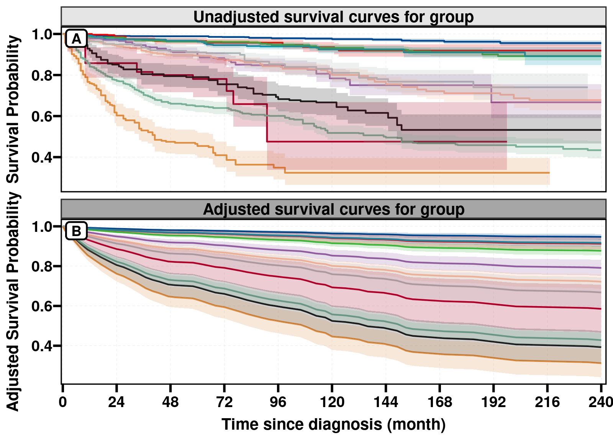
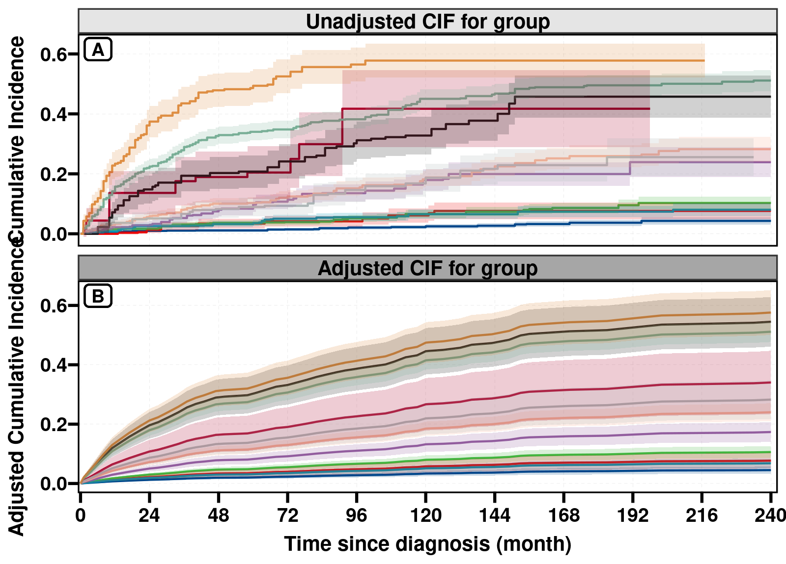
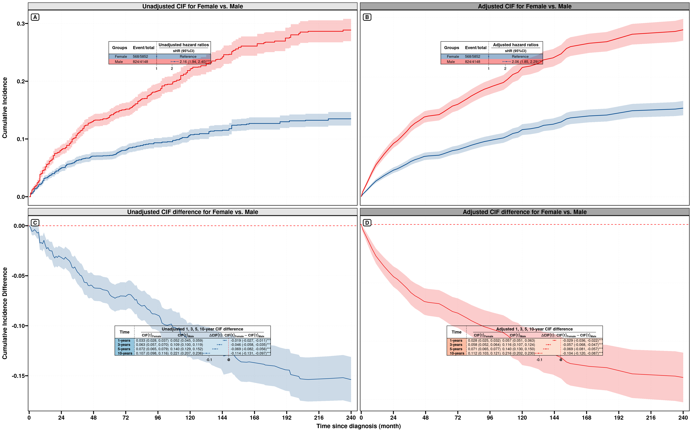
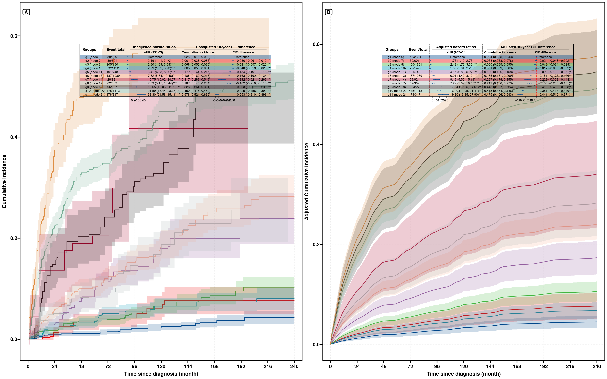
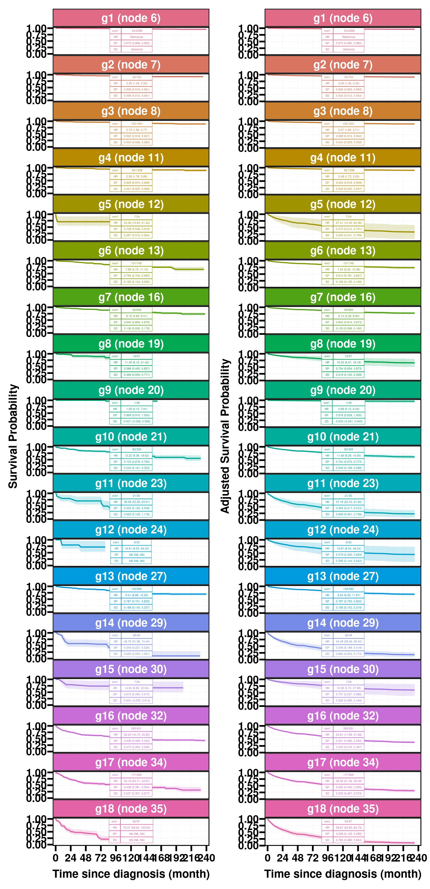
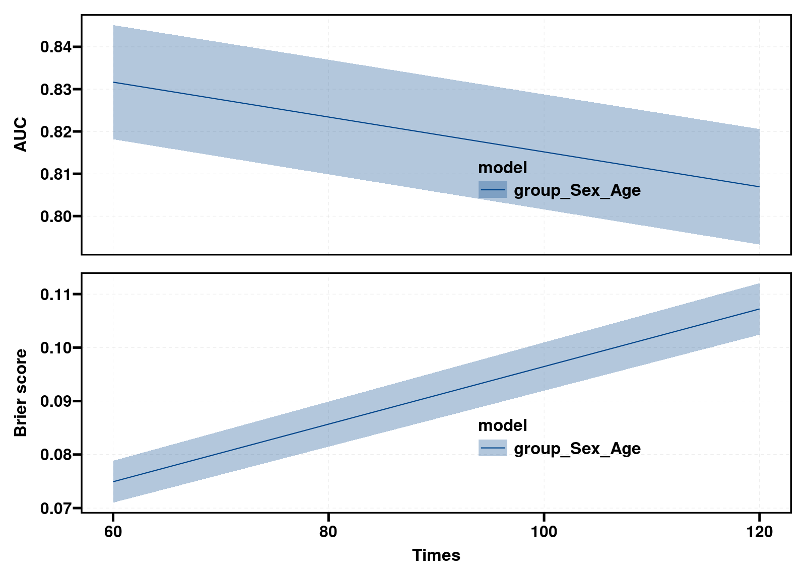

```{r}
#| label: setup
#| include: false
library(ggplot2)
prefix <- "bench/cox_cif_20261002_"
tm <- read.csv(paste0(prefix, "timing.csv"), stringsAsFactors = FALSE)
sm <- read.csv(paste0(prefix, "summary.csv"), stringsAsFactors = FALSE)
ag <- read.csv(paste0(prefix, "agreement.csv"), stringsAsFactors = FALSE)
tests <- read.csv(paste0(prefix, "tests.csv"), stringsAsFactors = FALSE)
env <- read.csv(paste0(prefix, "environment.csv"), stringsAsFactors = FALSE)
cls <- read.csv(paste0(prefix, "classes.csv"), stringsAsFactors = FALSE)
txt <- read.csv(paste0(prefix, "tables.csv"), stringsAsFactors = FALSE)
commits <- read.csv(paste0(prefix, "commits.csv"), stringsAsFactors = FALSE)
case_labels <- c(
  fit_hazard = "单次 Cox / Fine–Gray 拟合",
  get_eff = "get_eff：HR/sHR + 120 月结局",
  get_eff_sub = "get_eff：亚组与交互 P",
  get_cat = "get_cat：默认曲线与表",
  curve_direct = ".get.obj：直接调整曲线",
  curve_CSC = ".get.obj：CSC 调整 CIF",
  get_cat_no_ci = "get_cat：curve_args$ci = FALSE",
  get_facet = "get_facet：默认并行",
  get_facet_serial = "get_facet：parallel = 1",
  get_facet_diff = "get_facet_diff：默认并行",
  get_facet_diff_serial = "get_facet_diff：parallel = 1",
  get_inter = "get_inter：相对尺度交互",
  get_inter_abs = "get_inter_abs：绝对风险交互",
  get_eff_cat = "get_eff_cat：未调整 + 调整 HR/sHR",
  get_score = "get_score：R = 0",
  get_score_boot = "get_score：R = 10",
  get_rpa = "get_rpa：cit 建树及全部输出",
  get_rpa_mp1_mlr = "get_rpa_mp1：mlr3，R = 10",
  get_rpa_mp1_rr = "get_rpa_mp1：riskRegression，R = 10",
  get_rpa_mp2 = "get_rpa_mp2：六指标，R = 10",
  get_fit_stats = "get_fit_stats：AIC/BIC/PVE，R = 0",
  get_fit_stats_boot = "get_fit_stats：AIC/BIC/PVE，R = 10",
  get_rpa_mp2_raw = "get_rpa_mp2：单队列，R = 0",
  get_fit_stats_simple = "get_fit_stats：简单模型，R = 0",
  get_fit_stats_simple_boot = "get_fit_stats：简单模型，R = 10",
  get_score_all = "get_score：全部五指标，R = 0",
  get_score_all_boot = "get_score：全部五指标，R = 10"
)
fmt <- function(x) ifelse(is.na(x), "—", ifelse(x < 0.1, sprintf("%.3f", x), sprintf("%.2f", x)))
pick <- function(os, model, n, case, version) {
  z <- sm[sm$os == os & sm$model == model & sm$n == n & sm$case == case & sm$version == version, ]
  if (nrow(z)) z[1, ] else NULL
}
cell <- function(z) {
  if (is.null(z)) return("—")
  if (grepl("timeout", z$status)) return(paste0(">180 s（超时）"))
  if (z$status != "ok") return("失败")
  fmt(z$median)
}
timing_table <- function(os, model, latest = FALSE) {
  cases <- if (latest) c("get_score", "get_score_boot", "get_score_all", "get_score_all_boot",
    "get_fit_stats", "get_fit_stats_boot", "get_fit_stats_simple", "get_fit_stats_simple_boot") else
    names(case_labels)[names(case_labels) %in% sm$case[sm$os == os & sm$model == model & sm$version %in% c("before", "after")]]
  atag <- if (latest) "latest" else "after"
  btag <- if (latest) "after" else "before"
  out <- data.frame(`函数 / 配置` = unname(case_labels[cases]), check.names = FALSE)
  for (n in c(5000, 10000, 30000, 50000, 100000)) {
    out[[format(n, big.mark = ",", scientific = FALSE, trim = TRUE)]] <- vapply(cases, function(ca) {
      a <- pick(os, model, n, ca, atag); b <- pick(os, model, n, ca, btag)
      if (is.null(b)) return(paste0("新增 / 对照 → ", cell(a)))
      ratio <- if (!is.null(a) && b$status == "ok" && a$status == "ok" && a$median > 0)
        paste0("（", sprintf("%.1f", b$median / a$median), "×）") else ""
      paste0(cell(b), " → ", cell(a), ratio)
    }, character(1))
  }
  knitr::kable(out, align = c("l", rep("r", 5)))
}
raw_table <- function(case, path, model, columns = NULL, n = 10000L, version = "after", max_rows = NULL) {
  z <- txt[txt$os == "windows" & txt$version == version & txt$model == model &
             txt$n == n & txt$case == case & txt$path == path, ]
  if (!nrow(z)) return(knitr::kable(data.frame(`结果` = "该配置未返回可用表；见失败记录。")))
  fields <- unique(z$field)
  if (!is.null(columns)) fields <- intersect(columns, fields)
  out <- data.frame(row = sort(unique(z$row)))
  for (f in fields) out[[f]] <- z$value[match(paste(out$row, f), paste(z$row, z$field))]
  if (!is.null(max_rows)) out <- head(out, max_rows)
  knitr::kable(out[-1], row.names = FALSE)
}
core <- c("fit_hazard", "get_eff", "get_cat")
plot_core <- function(model) {
  z <- sm[sm$model == model & sm$case %in% core, ]
  z$os <- factor(z$os, c("windows", "linux"), c("Windows", "Linux / WSL2"))
  z$case <- factor(z$case, core, c("Model fit", "get_eff", "get_cat"))
  z$version <- factor(z$version, c("before", "after"), c("Before", "After"))
  ok <- z[z$status == "ok", ]; timeout <- z[grepl("timeout", z$status), ]
  ggplot(ok, aes(n, median, colour = version)) +
    geom_linerange(aes(ymin = min, ymax = max), linewidth = 0.45, alpha = 0.7) +
    geom_line(linewidth = 0.65) + geom_point(size = 1.7) +
    geom_point(data = timeout, aes(y = 180), shape = 2, size = 2.6) +
    facet_grid(os ~ case, scales = "free_y") +
    scale_x_log10(breaks = c(5000, 10000, 30000, 50000, 100000), labels = c("5k", "10k", "30k", "50k", "100k")) +
    scale_y_log10() + scale_colour_manual(values = c(Before = "#b3533a", After = "#187660")) +
    labs(x = "Sample size", y = "Elapsed time (s, log scale)", colour = NULL) +
    theme_minimal(base_size = 11) + theme(legend.position = "bottom", panel.grid.minor = element_blank())
}
```

本页评估 **2026-10-02 截至 `12406e3` 的提交**。优化前版本是当天首个优化之前的 [`2e56cc6`](https://github.com/HUI950319/RegR/commit/2e56cc6e06d548786b0a43d3449e463a0b36b252)，优化后版本是 [`12406e3`](https://github.com/HUI950319/RegR/commit/12406e338f9daf2c1d3b5c115065bccd5e0a81ad)。两版都从 Git 导出到临时目录，分别安装到隔离测试库；源码工作区的未提交修改没有进入计时。

测试期间新增的本地提交 `ea06c28`（22:16）扩展了 `get_score()` 的可选指标和共同拟合。本页在独立附录实测该提交及受影响的 `get_fit_stats()`，主矩阵的优化后版本仍为 `12406e3`；[附录源码补丁](bench/cox_cif_20261002_ea06c28.patch)提供两个提交之间的完整差异。

**版本边界：**计时跨至 10 月 3 日完成。发布前本地仓库已新增 10 月 3 日的后续提交，检查时 HEAD 为 `6d3d7af`。它们没有进入本轮固定快照的计时；下述 gradient 拒绝、普通 CIF 差值 SE 和并行行为均指本页实测版本，不能直接归于更新后的 HEAD。后续提交清单见审计范围。

测试覆盖 **Windows / Linux（WSL2）、Cox / Fine–Gray、5,000 / 10,000 / 30,000 / 50,000 / 100,000 行**。核心拟合、`get_eff()`、`get_cat()` 每格计划三次，其余配置一次。超时和无法估计的结果保留在表中。

```{r}
#| label: tbl-run-coverage
#| echo: false
coverage <- do.call(rbind, lapply(c("windows", "linux"), function(system) {
  z <- tm[tm$os == system, ]
  data.frame(`系统` = system, `配置格数` = nrow(sm[sm$os == system, ]),
             `实际执行次数` = nrow(z), `成功` = sum(z$status == "ok"),
             `超时` = sum(z$status == "timeout"), `报错` = sum(z$status == "error"),
             check.names = FALSE)
}))
knitr::kable(coverage, row.names = FALSE)
```

这里的 `crr` 指竞争风险的 Fine–Gray 分析分支：旧版用 `tidycmprsk::crr()`，新版的效应及直接 CIF 用 `mets`；`get_score()` 继续用 `riskRegression::FGR()`，仅关闭不使用的系数方差。`CSC` 作为独立的 CIF 工作模型另列。

## 应怎样阅读结果

**优先看同一系统、同一模型和同一入口的前后比较。**Cox/CSC 减少对比数及限制时间网格的优化，应检查共同保留时点的估计与 SE；Fine–Gray 后端、CI 方法、RPA bootstrap 队列和分组规则的变化，需要同时阅读数值与统计边界。

下方所有秒数来自本轮实测，不混入[早期 Cox 基准](rpa-cox-benchmark.qmd)或[早期 FGR/CSC 基准](get-eff-cif-benchmark.qmd)的历史计时。计时 CSV 保留每次重复及失败原因。非核心配置只测一次，不能据此给出稳定的耗时区间；小幅倍数差异及小于 0.1 秒的单次拟合只用于判断量级。

### 10 万行的主要结果

以下集中列出最大规模的核心入口；完整五档结果和全部配置见后续表格。超时配置只报告下界。

```{r}
#| label: tbl-largest-core
#| echo: false
headline <- do.call(rbind, lapply(c("windows", "linux"), function(system) {
  do.call(rbind, lapply(c("cox", "crr"), function(model) {
    do.call(rbind, lapply(core, function(case) {
      before <- pick(system, model, 100000, case, "before")
      after <- pick(system, model, 100000, case, "after")
      data.frame(`系统` = system, `模型` = model, `入口` = unname(case_labels[case]),
                 `优化前 / 秒` = cell(before), `优化后 / 秒` = cell(after), check.names = FALSE)
    }))
  }))
}))
knitr::kable(headline, row.names = FALSE)
```

本轮主要收益集中在调整曲线及竞争风险入口，单次 Cox 拟合本身仍处于亚秒量级。改善也不均匀：Windows 10 万行的 mlr3 RPA 评分为 121.56 → 120.12 秒，单次差异很小；新版 `get_rpa()` 在两系统的 10 万行配置均超过 180 秒。完整 Fine–Gray 拟合统计及部分 RPA 排名仍有报错，不能把所有函数概括为同等提速。

::: {.callout-important title="数据与估计量边界"}
使用 RegR 自带的 4,387 例示例队列，按行有放回抽样放大。各规模是同一 100,000 行抽样序列的前缀，两个系统读取相同 RDS 文件。**这些行用于评估计算规模，不能当作新增的独立患者。**整月随访及重复行保留了并列事件时间（ties），放大没有增加变量数或原有的独特随访时间。实际大队列若有更多变量或不同事件时间，计算成本可能更高。Cox 使用 `Surv(time, DSS)`；Fine–Gray 使用 `event` 的目标事件 1。数值一致性在相同模型族内比较，HR 与 sHR 对应不同估计量。
:::

## 今天的优化覆盖哪些函数

| 变化 | 直接入口 / 内部引擎 | 评价方式与边界 |
|:--|:--|:--|
| Cox 与 CSC 的 `ate()` 只算参照组对其他组 | `.get.obj()` → `get_cat()`、`get_facet()`、`get_rpa()` | 默认保留组曲线及逐点 SE；减少不使用的两两对比 |
| 直接调整曲线最多 50 点，并保留时点和终点 | `.get.obj()`、`get_cat()`、`get_facet()` | 保留点与曲线插值分开比较；基于稀疏曲线的中位生存期/RMST 是近似值 |
| `curve_args` / `cat_arg` | `get_cat()`、`get_rpa()` | 无置信带作为单独配置计时；不改变效应表的 CI |
| sHR 拟合切换 `mets` | `.fit_fg()`、`.get.fit()` → `get_eff()`、`get_eff_cat()` | 拟合器、ties 及 fallback 都需核对 |
| 交互 P 与相对尺度交互切换 `mets` | `.get.interP()`、`get_inter()`、`get_eff(sub_var =)` | 联合 Wald 检验及表格结果核对 |
| 直接标准化 CIF 由一个 `mets` 拟合求影响函数 SE | `.cif_direct_mets()`、`.get.obj()` → `get_eff()`、`get_cat()`、`get_facet()`、`get_facet_diff()` | CI 从 50 次 bootstrap 百分位区间变为 Wald 区间 |
| CIF 分层并行及按规模选时间点 worker | `get_facet()`、`get_facet_diff()`、`.eff_pblapply()` | 默认与 `parallel = 1` 使用同一数据对照；检查实际方法 |
| 绝对 CIF 交互的完整联合协方差 | `.inter_abs_surv_pass()` → `get_inter_abs()` | 默认 delta；显式 boot 仍用共同抽样，不能用各格独立 SE 代替联合协方差 |
| 关闭评分中不使用的 Fine–Gray 系数方差 | `get_score()` | AUC/Brier 的 SE/CI 仍由 `Score()` 计算；R=0 与 R=10 分开计时 |
| Cox 评分准备、拟合及 bootstrap 复用 | `get_rpa_mp1()` | mlr3 与 riskRegression 分开；保留原时间网格；新表显示经验评分分位范围 |
| 六项排名共享一次 bootstrap、全队列、失败抽样处理 | `get_rpa_mp2()` | 超过 10,000 行时旧版会截断；无法估计时不能把报错耗时当作提速 |
| AIC/BIC/PVE 从共同拟合提取 | `get_fit_stats()` | 新增函数，无旧版同名接口；R=0 与 R=10；Cox/Fine–Gray 分开 |
| 保存后在新会话绘图的 S3 方法加载修复 | `.plot.obj()` → `plt_cat1/2/3()`、`plt_rpa_km()` | 聚焦绘图测试与新会话读回验证，不重复拟合来计绘图时间 |
| RPA 新模型、事件数保护和省去默认 `Mul` | `get_rpa()` | 矩阵固定默认 `cit`；新增树模型通过专门测试验证。`get_rpa(surv = FALSE)` 仍进入 Cox 路径 |
| 22:16 新增可选指标、返回汇总与绘图 | `get_score()`、`get_score_summary()`、`plt_score()` | 独立附录实测；五指标结果表与新会话绘图分别检查 |

今天的 GBTM 优化属于纵向轨迹模型，另见[GBTM 教程](gbtm-guide.qmd)，没有混入 Cox/CIF 的模型计时。

### 提交与审计范围

主矩阵两个快照之间共有 36 个提交，其中 35 项涉及 Cox/CIF、RPA、评分或相应文档；测试期间的 `ea06c28` 再另测一项。文档修订没有当作独立的性能改进；同一调用链内的连续优化按快照共同测试，倍数不拆分归因到单个提交。

```{r}
#| label: tbl-commits
#| echo: false
cc <- data.frame(
  `提交` = sprintf("[%s](https://github.com/HUI950319/RegR/commit/%s)",
                   substr(commits$commit, 1, 7), commits$commit),
  `时间` = substr(commits$date, 12, 16),
  `内容` = commits$subject,
  `范围` = ifelse(commits$scope == "excluded_GBTM", "范围外：GBTM", "本轮相关"),
  check.names = FALSE)
late_row <- commits$scope == "Cox_CIF_related_late"
cc[late_row, "提交"] <- sprintf("[%s](bench/cox_cif_20261002_ea06c28.patch)", substr(commits$commit[late_row], 1, 7))
cc[late_row, "范围"] <- "附录：本地提交"
knitr::kable(cc)
```

### 10 月 3 日的后续提交（未计入本轮计时）

这些提交在原定的 10 月 2 日审计日期之后出现。提交及源码差异显示，后续版本已调整 Fine–Gray 拟合稳定性判定、普通直接 CIF 差值的联合协方差、网格与拟合复用、CPU 预算和评分图层。这里仅记录源码进展，没有用旧快照的数值替代新版本实测。

| 提交 | 时间（UTC+8） | 内容 |
|:--|:--|:--|
| `ddea45c` | 05:41 | 在效应推断前检查 Fine–Gray 拟合稳定性，并对齐拟合统计判定 |
| `768e5f5` | 05:46 | 保留下一事件前的小数 CIF 请求时点 |
| `c83e9df` | 05:52 | 保留单模型 RPA 评分矩阵维度 |
| `1281f78` | 05:55 | 使用所有原因的事件时点限制直接 CIF 网格 |
| `2fcdea1` | 06:01 | 直接 Fine–Gray 风险差使用联合协方差 |
| `30ff476` | 06:11 | `get_cat()` 各分析面板复用 Fine–Gray 拟合 |
| `8f6665b` | 06:21 | CIF 与 bootstrap worker 遵守 CPU 预算 |
| `40b1cd4` | 06:29 | 在列选择上下文中求值选择器 |
| `15a8165` | 06:40 | 各评分指标复用绘图图层 |
| `6d3d7af` | 06:54 | 对齐联合风险及 CPU 接口测试 |

## 试验设置

- **硬件：**Intel Core Ultra 9 275HX，24 逻辑核，Windows 报告物理内存总量 127.68 GiB；WSL2 报告总内存约 117.9 GiB。同一台机器上顺序运行两个系统。
- **系统：**Windows 11 专业版 10.0.26200；Ubuntu 22.04.2 / WSL2，内核 `6.6.87.2-microsoft-standard-WSL2`。
- **R 与依赖：**R 4.4.3；`survival 3.8.12`、`mets 1.3.13`、`riskRegression 2026.3.11`、`cmprsk 2.2.12`。两系统的 `adjustedCurves` 与 `mlr3` 存在版本差异，完整环境如下。
- **数据：**原队列 `event = 0/1/2` 为 3,207/597/583。固定原队列 `Age + T_stage` 的 `cit` 分组，得到 11 组。曲线、效应和评分使用 `group + Sex + Age`，共 12 个回归系数。`get_rpa()` 本身按各规模重新建树。
- **分层与交互：**`AgeGrp`（55 岁界值）和 `g3`（45/65 岁界值）由 `Age` 生成，用于分层和交互的计算测试；调整 `Age` 后的组间对照不解释为改变年龄组的因果效应。
- **时点：**主结局 120 月；`get_score()` 60/120 月；分面差值 12/36/60/120 月。`get_rpa_mp1()` 保留自身默认时间网格，不能与两时点评分视为同一个任务。
- **模型对照表：**`get_eff_cat()` 使用未调整与一个 `Sex + Age` 调整模型；保持 `abs_args$enabled = FALSE`，只计算 HR/sHR。Unix 默认对独立模型使用 fork，Windows 顺序拟合；不能将它与默认包含时点结局的 `get_eff()` 当作相同工作量。
- **重抽样：**评分和拟合统计的附加配置 R=10；`get_inter_abs()` 明确用 `n_boot=50`（公共默认为 500）。这用于性能与接口验证，bootstrap 分位范围的精度不作为推断结论。
- **补充配置：**另测 `get_fit_stats()` 的 `Age + Sex` / `Age` 两个简单模型，以及 `get_rpa_mp2(R=0)` 的单队列结果。沿用同一数据、五档规模和两种系统，单独列行；不替换主配置的失败记录。
- **计时：**预加载依赖，数据读取、`gc()`、随机数初始化和结果导出位于计时外；计时内包括公共函数的拟合、推断、进程启动、表格和图形对象构造。调用顺序在每个 n 内打乱，两版本使用同一固定种子序列。核心三次取中位数，同时公开范围。
- **并行：**BLAS/OMP/MKL 限为 1；`mc.cores=4`，分面默认并行及旧/新版本原有 bootstrap 策略保留。每次调用前恢复 `future::sequential`。R 堆峰值不包括其他进程的内存。
- **超时：**单次函数执行超过 180 秒停止该次并记录。核心配置首次出现超时后停止余下重复；未完成三次的配置不冒充三次中位数。`>180` 是下界，不是估算的完整耗时。

```{r}
#| label: tbl-environment
#| echo: false
ev <- unique(env[env$version == "after", c("os", "package", "package_version")])
ev <- reshape(ev, idvar = "package", timevar = "os", direction = "wide")
knitr::kable(ev, row.names = FALSE)
```

系统间绝对耗时包含操作系统、进程启动、依赖版本及虚拟化环境的共同影响。本页保留这些环境差异，前后提速比在同一系统内部计算。

### 优化后的 Windows / Linux 核心耗时

以下每格为 **Windows 秒数 / Linux 秒数**，均取 `12406e3` 的三次中位数。相同机器上的这两种运行环境可直接查看耗时，但不能把差异全部归因于操作系统。

```{r}
#| label: tbl-os-core-timing
#| echo: false
os_core <- do.call(rbind, lapply(c("cox", "crr"), function(model) {
  out <- data.frame(`模型 / 入口` = paste(model, unname(case_labels[core])), check.names = FALSE)
  for (n in c(5000, 10000, 30000, 50000, 100000)) {
    out[[format(n, big.mark = ",", scientific = FALSE, trim = TRUE)]] <- vapply(core, function(case) {
      paste(cell(pick("windows", model, n, case, "after")),
            cell(pick("linux", model, n, case, "after")), sep = " / ")
    }, character(1))
  }
  out
}))
knitr::kable(os_core, row.names = FALSE)
```

本轮 10 万行的新 CRR `get_cat()` 中位数在 Linux 更低，而 Fine–Gray 单次拟合及 `get_eff()` 在 Windows 更低。部分三次实测范围重叠，系统选择应结合实际入口，不能给出统一的系统排名。

## 核心入口的耗时随样本量变化

::: {.panel-tabset}

### Cox

```{r}
#| label: fig-cox
#| echo: false
#| fig-width: 10
#| fig-height: 5.4
#| fig-cap: "Cox：核心拟合、get_eff、get_cat 的墙钟时间。点为三次中位数，线段为实测最小–最大范围；三角形表示一次执行超过 180 秒。各面板的纵轴均为对数。"
plot_core("cox")
```

### Fine–Gray / CIF

```{r}
#| label: fig-crr
#| echo: false
#| fig-width: 10
#| fig-height: 5.4
#| fig-cap: "Fine–Gray/CIF：旧 crr/boot 路径与新 mets 路径。点为三次中位数，线段为实测范围，三角形为超时下界。get_score 的 FGR 路径独立列在完整表中。"
plot_core("crr")
```

:::

## 全部函数与配置的实测表

单元格为 **优化前秒数 → 优化后秒数（前/后倍数）**；所有格子的参数在本页与复现脚本中固定。`新增 / 对照` 表示新接口或只在新版本增加的参数/串行对照。失败原因在后文逐条列出。Cox 专用的 RPA 函数不添加虚构的 CRR 耗时。

::: {.panel-tabset}

### Windows · Cox

::: {.column-page}
```{r}
#| echo: false
timing_table("windows", "cox")
```
:::

### Windows · CRR/CIF

::: {.column-page}
```{r}
#| echo: false
timing_table("windows", "crr")
```
:::

### Linux · Cox

::: {.column-page}
```{r}
#| echo: false
timing_table("linux", "cox")
```
:::

### Linux · CRR/CIF

::: {.column-page}
```{r}
#| echo: false
timing_table("linux", "crr")
```
:::

:::

### 同一新版本的参数对照

`curve_args = list(ci = FALSE)` 保留调整曲线的点估计，省去曲线置信带；`cat$UM` 的效应和时点结局仍计算 CI。Cox/CSC 能跳过曲线的方差计算；本次 `mets::survivalGtime()` 的 FGR 路径即使不显示 CI 仍计算风险 SE，因此不能预先假定也有相同收益。

Windows 的 PSOCK 启动需要额外时间。`get_facet()` / `get_facet_diff()` 的默认并行与 `parallel=1` 已在每个规模下各自实测。`parallel=1` 只让外层分层串行，CIF 引擎仍按规模选择内部时间点 worker，不等同于强制整个调用单进程。其阈值是 Unix 100,000/250,000，Windows 1,000,000/2,000,000（完整行数 × 正时间点数）。嵌套 RegR worker 内部保持串行。

## 22:16 新增提交：get_score 共同拟合与五指标

`ea06c28` 增加 `metrics = c("AUC", "BS", "AIC", "BIC", "PVE")`。默认仍计算 AUC/BS，并增加汇总表和图形对象；只选一个预测指标时省去另一项。新增似然统计从同一个拟合提取，混合指标的 bootstrap 复用 `Score()` 的训练拟合。**AUC/BS 在袋外样本评价，似然统计描述 bootstrap 训练样本，两种区间的含义不同。**

新增生存 `AUC.BS.AIC` 汇总表中的 AUC/BS 是请求的 60/120 月数值均值，逐点采样 CI 仍在 `AUC$score`、`Brier$score` 及图中。`get_score_summary()` 的旧兼容 `C-index` 字段也表示时点 AUC 均值；其旧字符串范围取自时点间变异，不能解释为受试者抽样 CI，也不能当作 Harrell C-index。

附录每格实测一次；单元格是 **`12406e3` → `ea06c28`**。全部五指标的配置没有前一快照的同名调用，直接列新配置耗时。`get_score(crr)` 的 AIC/BIC/PVE 使用 FGR/cmprsk 似然，`get_fit_stats(crr)` 使用 mets 似然，整月 ties 下不能把两个后端的 AIC 数值当成完全相同的标准。

::: {.panel-tabset}

### Windows · Cox

```{r}
#| echo: false
timing_table("windows", "cox", latest = TRUE)
```

### Windows · CRR/CIF

```{r}
#| echo: false
timing_table("windows", "crr", latest = TRUE)
```

### Linux · Cox

```{r}
#| echo: false
timing_table("linux", "cox", latest = TRUE)
```

### Linux · CRR/CIF

```{r}
#| echo: false
timing_table("linux", "crr", latest = TRUE)
```

:::

```{r}
#| label: tbl-late-agreement
#| echo: false
ll <- ag[ag$label == "after_latest", ]
if (nrow(ll)) {
  lv <- aggregate(max_abs ~ os + model + case + field, ll, max)
  lv$max_abs <- format(lv$max_abs, digits = 5, scientific = TRUE)
  knitr::kable(lv, row.names = FALSE)
}
```

新提交的 10,000 行 CRR 五指标返回表：

```{r}
#| echo: false
raw_table("get_score_all", "result/summary", "crr", version = "latest")
raw_table("get_score_all", "result/fit.stats/stats", "crr", version = "latest")
```

最后提交增加功能后的默认调用并未在所有配置下更快。例如 Windows 50,000 行 CRR 的默认 R=10 为 56.07 → 66.85 秒；同一新提交的五指标调用为 66.64 秒。后两项接近，说明本次共享拟合减少了新增指标的额外工作，但默认入口的总耗时仍应单独评价。这些评分配置只测一次，小幅差异不能解释为稳定的性能变化。

## 数值一致性与结果变化

下表比较同一数据第一次重复返回的数值，按表/字段与组别/时点对应。只包含两版都成功且字段可匹配的配置，超时格不用于判断数值一致性。曲线先比较共同保留的时点；CI、SE、P 值另列。全部精确数值与更细的差异记录可以下载。

::: {.panel-tabset}

### 点估计

```{r}
#| label: tbl-agreement
#| echo: false
keep <- ag$label == "before_after" & ag$field %in% c("beta", "probability", "surv", "cif", "estimate", "estimate_sur", "AUC", "Brier")
aa <- ag[keep, ]
if (nrow(aa)) {
  av <- aggregate(max_abs ~ os + model + case + field, aa, max)
  av$max_abs <- format(av$max_abs, digits = 5, scientific = TRUE)
  knitr::kable(av, row.names = FALSE)
}
```

### SE / CI / P 值

```{r}
#| label: tbl-uncertainty-agreement
#| echo: false
uu <- ag[ag$label == "before_after" & ag$field %in% c("se", "SE", "std.error", "conf.low", "conf.high",
          "conf.low_sur", "conf.high_sur", "ci_lower", "ci_upper", "lower", "upper", "p_value", "p.value"), ]
if (nrow(uu)) {
  uv <- aggregate(max_abs ~ os + model + case + field, uu, max)
  uv$max_abs <- format(uv$max_abs, digits = 5, scientific = TRUE)
  knitr::kable(uv, row.names = FALSE)
}
```

:::

### Windows 与 Linux 的结果对照

```{r}
#| label: tbl-os-agreement
#| echo: false
oo <- ag[ag$label == "windows_linux" & ag$field %in% c("beta", "probability", "surv", "cif", "estimate", "estimate_sur", "AUC", "Brier"), ]
if (nrow(oo)) {
  ov <- aggregate(max_abs ~ model + case + field, oo, max)
  ov$max_abs <- format(ov$max_abs, digits = 5, scientific = TRUE)
  knitr::kable(ov, row.names = FALSE)
}
```

在两版均成功且具有共同路径、组别和时点的汇总结果中，Cox 拟合系数的最大绝对差为 0；`curve/direct` 曲线概率的最大差为 0，SE 最大差为 `3.47e-17`。Fine–Gray 拟合系数的最大差为 `0.00581`，该路径曲线概率最大差为 `0.00203`，SE 最大差为 `0.00670`。这些数字只覆盖可配对结果，不能替代超时配置的正确性验证，也不说明新旧 CIF 推断方法等价。

**统计边界：**

1. **Cox/CSC 减少无用对比与保留时点：**检查共同点上的估计、SE 和 CI；时间点减少后的曲线需要插值，中位生存期/RMST 不能据此声称与完整网格严格一致。
2. **`mets` 与旧 `crr`：**整月并列事件时间的处理及拟合容差不同。连续时间下的模型一致性另由聚焦测试验证；本轮保留真实的整数月差异。旧版时点汇总优先读取 `boot_adj`，新版读取解析 `adj`；本页比较实际展示的值，不把两个对象层的点估计预设为相同。
3. **CIF 的 CI：**旧直接曲线默认是 bootstrap 百分位区间，新直接曲线是影响函数 Wald 区间并裁剪到 [0,1]。区间和 P 值改变属于推断方法变化，不能用“完全相同”概括。
4. **普通组间 CIF 差值：**共享曲线差值函数调用 `adjustedCurves::adjusted_curve_diff()`。解析分支使用两组 SE 的平方和，未利用两个标准化风险的联合协方差；绝对风险交互的 `get_inter_abs()` 已使用完整联合协方差。两者的 CI 计算应分别解释。
5. **RPA：**旧 `mob` 使用调整变量，新 `mob` 忽略调整变量；新 `mob_adj` 的检验参数及事件数保护也会改变树。计时固定 `cit`，新树选项不作为相同树的提速对照。新版默认还省去了多时点差值 `cat$Mul`，需要时可通过 `cat_arg$time_dif` 指定，因此 RPA 总入口的前后计算内容也有变化。
6. **评分与排名：**`get_rpa_mp1()` 的 bootstrap 经验分位范围、`get_rpa_mp2()` 的全队列与排名方向修复都改变旧表的解释。旧版超 1 万行的排名 bootstrap 不能与新版全队列直接当作同等工作量。
7. **AIC/BIC/PVE：**Cox 使用部分似然，Fine–Gray 使用 mets 加权部分似然；BIC 的惩罚样本为目标事件数，PVE 为 Cox–Snell 型伪 R²。比较条件需使用同一结局、样本和似然约定。

## 实际返回结果示例

以下为本轮 10,000 行、Windows、新版本的结果；完整五档、双系统的数值与格式化表均在下载文件中。

```{r}
#| label: tbl-return-classes
#| echo: false
returns <- cls[cls$os == "windows" & cls$version == "after" & cls$n == 10000,
               c("model", "case", "status", "class", "actual_method")]
returns$case <- unname(case_labels[returns$case])
knitr::kable(returns, row.names = FALSE)
```

::: {.panel-tabset}

### Cox 效应表

```{r}
#| echo: false
raw_table("get_eff", "result/haz_direct", "cox", c("label", "effect", "p_value", "num1", "eve1"))
```

### Fine–Gray 效应表

```{r}
#| echo: false
raw_table("get_eff", "result/haz_direct", "crr", c("label", "effect", "p_value", "num1", "eve1"))
```

### 120 月 CIF

```{r}
#| echo: false
raw_table("get_eff", "result/sur_direct", "crr", c("label", "Effect_sur", "effect", "p_value", "num1", "eve1"))
```

### 相对尺度交互

```{r}
#| echo: false
raw_table("get_inter", "result/Adjus", "crr")
```

### 绝对风险交互

```{r}
#| echo: false
raw_table("get_inter_abs", "result/risks", "crr")
raw_table("get_inter_abs", "result/estimates", "crr")
```

### 亚组效应

```{r}
#| echo: false
raw_table("get_eff_sub", "result/haz_direct", "crr",
          c("variable", "label", "effect", "p_value", "p_inter", "num1", "eve1"))
```

### 分面差值

前 12 行作为示例，全部时点与分层结果保留在下载文件中。

```{r}
#| echo: false
raw_table("get_facet_diff", "result/forest.data", "crr",
          c("g3", "time", "group1", "group2", "estimate", "conf.low", "conf.high", "p_value", "methods"),
          max_rows = 12L)
```

### RPA 终末组

```{r}
#| echo: false
raw_table("get_rpa", "tree_groups", "cox")
```

### AUC / Brier

```{r}
#| echo: false
raw_table("get_score", "result/AUC/score", "crr")
raw_table("get_score", "result/Brier/score", "crr")
```

### RPA 评分

```{r}
#| echo: false
raw_table("get_rpa_mp1_mlr", "result/body", "cox")
raw_table("get_rpa_mp1_rr", "result/body", "cox")
```

### AIC / BIC / PVE

```{r}
#| echo: false
raw_table("get_fit_stats", "result/stats", "cox")
raw_table("get_fit_stats_simple", "result/stats", "crr")
```

### 六项排名（单队列）

这里的 `R=0` 调用正常返回，但 10,000 行例子的部分标准化分数和总体排名仍为 NA；不能把返回表当作六项指标均可估计的证明。

```{r}
#| echo: false
raw_table("get_rpa_mp2_raw", "result/body", "cox")
```

:::

## 失败与限制

```{r}
#| label: tbl-failures
#| echo: false
ee <- tm[tm$status == "error", ]
err <- do.call(rbind, lapply(split(ee, interaction(ee[c("os", "version", "model", "case", "error")], drop = TRUE)), function(z) {
  data.frame(z[1, c("os", "version", "model", "case")], n = paste(sort(unique(z$n)), collapse = ", "), error = z$error[1])
}))
err$error <- gsub("[\r\n]+", " ", err$error)
knitr::kable(err, row.names = FALSE)
```

### get_fit_stats 的 Fine–Gray 拟合拒绝

在固定的 11 组 SEER 重抽样模型中，`get_fit_stats()` 报告 `Fine-Gray fit is singular or did not converge`。本页的 `12406e3` 与 `ea06c28` 快照在 `R/msr-fit-stats.R` 用 `max(abs(fit$gradient)) > 1e-5 * (1 + events)` 判断。

5,000 行诊断中，设计矩阵满秩（12/12），系数与 SE 有限；默认拟合的最大 gradient 为 2.64118，阈值为 0.00699。把优化容差收紧到 `1e-10` 后 gradient 仍为 0.04129，且两系统的诊断一致。这一拒绝需要继续核对，不能用失败前消耗的秒数宣称新函数很快。效应引擎 `.fit_fg()` 对 tied-time gradient 已采用不同的判定规则。

### get_rpa_mp2 的无法估计指标

此基准使用 11 个 RPA 终末组作为基本组，比较 `Sex` 与 `T_stage`。部分 remss 指标无法估计；新版本在原始队列阶段明确报错，旧版可能在后续 bootstrap 的非有限值处理中报错。这组数据未给出可用的 R=10 排名表，不能据此计算有效提速比。六指标共享 bootstrap、全队列及失败抽样合同仍通过独立聚焦测试检查。

补充的 `R=0`、默认 `show_both=FALSE` 单队列调用可完成返回，但仍包含不可估计的原始指标、标准化分数和总体排名。它与主矩阵的 `R=10, show_both=TRUE` 工作量不同，也没有消除原主配置的失败。

### 成功返回时的统计警告

`ok` 表示函数完成返回。RPA 的 `T_stage` 评分模型仍可能提示系数趋于无穷；部分新版排名 bootstrap 丢弃了失败的共同抽样。以下列出影响估计解释的警告，图形编码及弃用信息保留在完整计时 CSV。

```{r}
#| label: tbl-statistical-warnings
#| echo: false
ww <- unique(tm[tm$status == "ok" & grepl("coefficient may be infinite|bootstrap replicates failed|Rare event|No analytic variance|Non-finite|falling back", tm$warnings),
                 c("os", "version", "model", "n", "case", "warnings")])
ww$warnings <- gsub("[\r\n]+", " ", ww$warnings)
knitr::kable(ww, row.names = FALSE)
```

### 聚焦测试

```{r}
#| label: tbl-focused-tests
#| echo: false
tt <- aggregate(cbind(passed, failed, error, warning, skipped) ~ os, tests, sum)
knitr::kable(tt, row.names = FALSE)
```

原有 `get_fit_stats` 共同抽样断言在两个系统各有一项失败：两组表的行名不同。独立诊断显示 AIC/BIC/PVE bootstrap 数值最大差为 **0**。本页保留原断言失败，区分数字与属性。Windows 的 Unix 并行专用测试按原规则跳过。测试覆盖模型后端、tibble、fallback、曲线网格、CI 控制、交互协方差、RPA 事件保护、共享拟合及随机状态；没有把这轮检查称为全包测试。

22:16 提交的评分、汇总、绘图与拟合统计断言另列，避免混用主矩阵测试计数：

```{r}
#| label: tbl-latest-tests
#| echo: false
latest_tests <- read.csv(paste0(prefix, "latest_tests.csv"), stringsAsFactors = FALSE)
knitr::kable(aggregate(cbind(passed, failed, error, warning, skipped) ~ os, latest_tests, sum), row.names = FALSE)
```

### 保存结果后在新会话绘图

读取 10,000 行模型返回对象，每个绘图函数均在独立 R 会话里构造并实际输出 PNG。RPA 用同一个 Linux 生成的 RDS 在两系统读回，检验跨会话及跨系统绘图；其他图读取各系统自己生成的结果。这里的耗时包含绘制，单独报告，不混入拟合计时。

```{r}
#| label: tbl-plot-readback
#| echo: false
plot_tests <- read.csv(paste0(prefix, "plot_readback.csv"), stringsAsFactors = FALSE)
plot_tests$error <- gsub("[\r\n]+", " ", plot_tests$error)
knitr::kable(plot_tests[c("os", "model", "function_name", "configuration", "version", "status", "elapsed", "error")], row.names = FALSE, digits = 2)
```

首次双系统的 18 次绘图检查中，12 次成功、6 次报错：11 组输入没有二组差值表，因而不满足 `plt_cat2()` 的二组合同；18 个 RPA 终末组超出默认 15 色调色板。保留这 6 条原始记录后，改用 `Sex` 二组、调整 `Age` 的结果补验 `plt_cat2()`，并给 RPA 显式提供 `hcl.colors(18, "Dark3")`，两系统的 6 次补验全部成功。

`ok` 表示构造图形并写出 PNG。初始 1600 × 1150 画布上的组合表有裁剪；供本页展示的 Linux `plt_cat2/3()` 另用 4800 × 3000 画布读回输出，记录为 `*_gallery`。绘图范围内未修改 RegR 源码。

以下是 Linux 新会话实际输出的代表图，点击可放大。曲线及 RPA 图对应主矩阵 `12406e3`；评分图对应 `ea06c28`，只画请求的 60/120 月时点，连线用于展示。

::: {.panel-tabset}

### Cox 曲线



### CIF 曲线



### 二组 CIF 差值

`cat_var="Sex"`、`adj_var="Age"`，12/36/60/120 月差值；差值 CI 使用前述普通曲线差值的 SE 规则。



### CIF 与效应组合



### RPA 终末组曲线

18 组使用显式 18 色，图中原有的不可估计时点仍显示 NA。



### 新提交的评分图



:::

## 复现与下载

### 使用与后续优化建议

- **Windows 少量分层：**先查看同规模 `parallel=1` 的对照。PSOCK 启动可能抵消并行收益，不能仅按 CPU 核数决定 worker 数。
- **需要完整曲线摘要：**明确时间网格。默认 50 点适合曲线展示及保留时点的估计；依赖中位生存期或 RMST 时，应检查稀疏网格近似是否满足分析目的。
- **需要 RPA 多时点差值：**通过 `cat_arg$time_dif` 显式指定。默认省去 `Mul` 的总入口计时，不能解释成所有旧输出都以相同比例提速。
- **需要相同推断：**固定模型后端和 CI 方法再比较。CIF bootstrap 与 Wald 区间、全队列与截断队列 bootstrap、不同似然的 AIC 都应独立标注。
- **后续性能验证：**10 月 3 日已加入面板拟合复用及 CPU 预算变更，应固定新快照重新比较其收益。无曲线 CI 时省去不使用的影响函数仍可另行检查；拟合复用需要覆盖事件编码、完整行、因子参照组、权重、后端及拟合控制。
- **后续正确性验证：**对新版本的 tied-time Fine–Gray 稳定性规则、普通 CIF 风险差联合协方差及保留时点分别复测。保留本页旧快照的失败和不可估计排名，避免把源码变化当作已经通过相同矩阵的证据。

### 下载文件与运行方法

公开的是模型、曲线、计时及组级汇总结果，个体行数据和完整拟合对象没有上传。数值与格式化结果保留每格第 1 次返回值；计时文件保留全部重复。复现脚本会从 RegR 自带数据生成同一抽样序列。

完整数值文件按 CSV 无损压缩为 `.csv.gz`，解压后保留全部字段和数值精度；在 R 中也可直接用 `read.csv(gzfile("文件.csv.gz"), fileEncoding = "UTF-8")` 读取。

- [全部原始计时 CSV](bench/cox_cif_20261002_timing.csv)
- [各格中位数、范围与完成数](bench/cox_cif_20261002_summary.csv)
- [Windows 数值结果（压缩 CSV）](bench/cox_cif_20261002_numeric_windows.csv.gz) · [Linux 数值结果（压缩 CSV）](bench/cox_cif_20261002_numeric_linux.csv.gz)
- [全部格式化结果表](bench/cox_cif_20261002_tables.csv) · [返回类型与实际曲线方法](bench/cox_cif_20261002_classes.csv)
- [数值差异核对](bench/cox_cif_20261002_agreement.csv) · [聚焦测试明细](bench/cox_cif_20261002_tests.csv)
- [22:16 新提交的评分与拟合统计测试](bench/cox_cif_20261002_latest_tests.csv)
- [新会话绘图读回与耗时](bench/cox_cif_20261002_plot_readback.csv)
- [ea06c28 相对主矩阵版本的源码补丁](bench/cox_cif_20261002_ea06c28.patch)
- [环境版本](bench/cox_cif_20261002_environment.csv) · [提交清单](bench/cox_cif_20261002_commits.csv)
- [共用数据文件的 SHA-256](bench/cox_cif_20261002_data_hashes.csv)
- [五档数据的样本与事件汇总](bench/cox_cif_20261002_data_summary.csv)
- [测试批次、计划次数与起止记录](bench/cox_cif_20261002_run_manifest.csv)
- [完整计时脚本](bench/cox_cif_20261002_benchmark.R) · [汇总导出脚本](bench/cox_cif_20261002_export.R)
- [聚焦测试脚本](bench/cox_cif_20261002_test_focused.R) · [拟合与共同抽样诊断](bench/cox_cif_20261002_diagnostics.R) · [新会话绘图脚本](bench/cox_cif_20261002_plot_readback.R)

先用 `git archive` 分别导出两个提交，在项目外建立 `src_before`、`src_after` 与 `lib_windows_before/after` 或 `lib_linux_before/after`，安装对应版本。然后使用脚本：

```bash
# 先在一个系统生成数据，两个系统共用同一目录 / 同一 RDS。
Rscript cox_cif_20261002_benchmark.R prepare /path/to/benchmark

# Windows 与 Linux 顺序运行；脚本自动识别系统和对应隔离库。
Rscript cox_cif_20261002_benchmark.R matrix /path/to/benchmark

# 主矩阵后补充简单模型与单队列排名，每格一次。
Rscript cox_cif_20261002_benchmark.R supplement /path/to/benchmark

# ea06c28 单独导出并安装到 lib_windows_latest / lib_linux_latest 后：
Rscript cox_cif_20261002_benchmark.R late /path/to/benchmark

# 每个系统运行聚焦测试及诊断；原断言失败也保留结果 CSV。
Rscript cox_cif_20261002_test_focused.R /path/to/benchmark after
Rscript cox_cif_20261002_diagnostics.R /path/to/benchmark
Rscript cox_cif_20261002_test_focused.R /path/to/benchmark latest
Rscript cox_cif_20261002_plot_readback.R /path/to/benchmark /path/to/benchmark/plots
# 本页的 Linux 两张组合图另用较大画布输出，保留独立绘图记录。
Rscript cox_cif_20261002_plot_readback.R /path/to/benchmark /path/to/benchmark/plots gallery

# 两系统完成后，只导出聚合结果。
Rscript cox_cif_20261002_export.R /path/to/benchmark /path/to/report
```

若远端暂未包含 `ea06c28`，先把 `12406e3` 的干净源码导出为 `src_latest`，在该目录应用本页提供的 `cox_cif_20261002_ea06c28.patch`，再安装到 `lib_<系统>_latest`。补丁已在主矩阵的干净源码上通过应用检查。

典型公共调用的参数如下，源码安装版本应固定到本页的提交：

```r
get_cat(d, cat_var = "group", adj_var = c("Sex", "Age"),
        surv = FALSE, timepoint = 120)
get_cat(d, cat_var = "group", adj_var = c("Sex", "Age"),
        surv = TRUE, timepoint = 120, curve_args = list(ci = FALSE))
get_facet(d, split_var = "g3", cat_var = "Sex", adj_var = "Age",
          surv = FALSE, method = "direct", timepoint = 120, parallel = 1L)
get_score(d, vars = list(c("group", "Sex", "Age")),
          surv = FALSE, timepoint = c(60, 120), R = 10L)
get_fit_stats(d, vars = list(full = c("group", "Sex", "Age"),
                            simple = c("Sex", "Age")), surv = TRUE, R = 10L)
```
