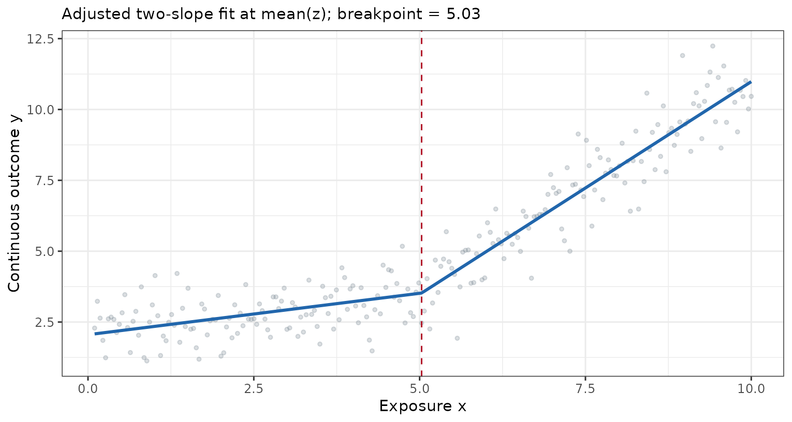
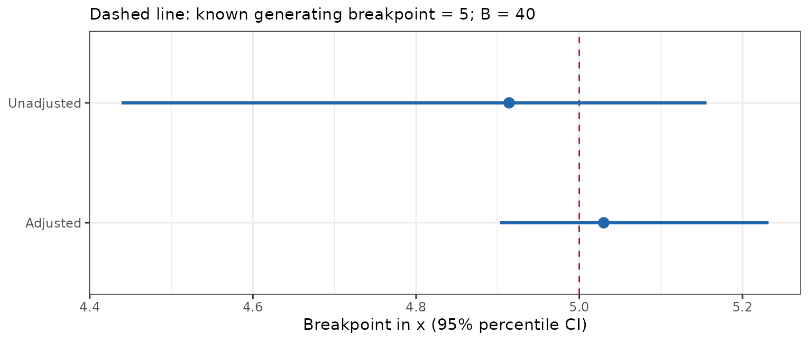

这三个入口共享两段回归思路，但分析对象与返回值不同。先辨认要分析的是原始结局还是模型曲线，再决定是否需要切点本身的区间。本页沿用 [SHAP 示例页](../mlr/shap-guide.qmd) 的标签页展示方式，配实际表格、代码与放大图；RCS 组合模式见 [get_rcs_all 教程](rcs-guide.qmd)。

**版本与执行范围：** 按 RegR **0.1.3**、本机源码快照 `0add2bb` 核对，在 WSL R **4.4.3** 实际运行 **13 个切点 / 展示示例**，包括原始数据的 Cox、Logistic、线性模型，RCS 面板切点，以及 B = 40 的 bootstrap。表格是本次真实 flextable 输出；页面只包含汇总结果。

```{=html}
<style>
.cut-web-table { overflow-x: auto; background: #fff; color: #111; padding: .8rem; border: 1px solid #dee2e6; border-radius: .35rem; margin: 1rem 0; }
.cut-web-table .tabwid { width: max-content; min-width: 100%; }
.cut-web-table table { min-width: 620px; margin: auto; }
.cut-web-table caption { caption-side: top; }
.cut-web-table span { font-size: 13px !important; }
</style>
```

## 三个入口如何选择 {#overview}

| 入口 | 分析对象 | 返回值 | 主要问题 |
|:--|:--|:--|:--|
| [`get_cut()`](#get-cut) | 受试者原始结局：Cox / Logistic / 线性 | flextable；attr(params) 保留输入与切点来源 | 切点两侧的每单位效应、两段与单斜率模型比较 |
| [`get_cut_ci()`](#get-cut-ci) | 对完整受试者行进行 bootstrap，每次重估切点 | 每个模型一行的 data.frame | 切点的固定 95% percentile 区间、拟合失败比例 |
| [`get_cut_plot()`](#get-cut-plot) | 已附在 RCS / VPD 图上的 x 与 yhat | cut_plot_result list | 拟合曲线在响应尺度上的两段线性近似切点 |

**本页实际结果：** 临床队列的 Cox 自动切点约为 **51 岁**；调整后年龄 HR 曲线上的切点约为 **52.096 岁**。后者分析的是 **200 个预测网格点**，前者分析的是 **598 位受试者**。数值接近不能使两个分析目标等同。

### 两段回归的表达

给定切点 $c$，构造

$$
X_1=\min(x-c,0),\qquad X_2=\max(x-c,0).
$$

左段和右段分别有斜率，模型在切点处连续。`get_cut()` 先拟合单斜率模型，自动切点时调用 `segmented()`，再按选定切点拟合两段模型。[segmented 官方文档](https://search.r-project.org/CRAN/refmans/segmented/html/segmented.html)说明了断点及斜率的估计流程。

| 模型 | 表中的量 | 单位解释 |
|:--|:--|:--|
| Cox | HR (95% CI) | 暴露增加 1 单位的危险比；年龄为增加 1 岁 |
| Logistic | OR (95% CI) | 暴露增加 1 单位的优势比 |
| 线性回归 | β (95% CI) | 暴露增加 1 单位的结局变化 |

切点左右 HR 不等于“高年龄组相对低年龄组”的 HR。表中的模型比较是 Cox / Logistic 的似然比检验、线性模型的 F 检验。

## 示例数据 {#data}

临床示例与 [RCS 页](rcs-guide.qmd#data) 同源：598 人、175 个目标死亡，time 单位月。为使模型可比，本页统一按同一组分析列取 complete cases；不输出个体水平数据。

```r
library(RegR)
library(ToyData)
library(ggplot2)
library(survival)

vars <- c("time", "DSS", "event", "Age", "Sex", "Race", "Tum_3")
d <- as.data.frame(ToyData::toy_ptc_m1_cnd[, vars])
d <- droplevels(d[complete.cases(d), , drop = FALSE])
adj <- c("Sex", "Race", "Tum_3")

# 保留函数直接返回的图，供切点提取。
p_cox <- get_rcs_all(d, rcs_var = "Age", adj_var = adj,
                     surv = TRUE, panel_show = "haz")
p_fg <- get_rcs_all(d, rcs_var = "Age", adj_var = adj,
                    surv = FALSE, panel_show = "haz")
p_rate <- get_rcs_all(
  d, rcs_var = c("Sex", "Age"), adj_var = c("Race", "Tum_3"),
  surv = TRUE, poi_time = 12 * 1000, panel_show = "haz_poi",
  strip_list = list(strip_style = "grid", adj_position = "right")
)
```

线性与 Logistic 示例使用完全模拟数据，已知生成曲线在 **x = 5** 改变斜率。它便于比较算法输出与生成机制，不代表临床人群的真实切点。

```r
set.seed(246)
sim <- data.frame(x = seq(0.1, 10, length.out = 240), z = rnorm(240))
sim[["y"]] <- with(sim,
  2 + 0.3 * x + 1.2 * pmax(x - 5, 0) + 0.5 * z + rnorm(240, sd = 0.65))
sim[["binary"]] <- rbinom(240, 1,
  with(sim, plogis(-2 + 0.2 * x + 0.65 * pmax(x - 5, 0) + 0.3 * z)))
```

## get_cut()：原始结局的两段效应表 {#get-cut}

```r
get_cut(
  data, con_var, adj_var = NULL,
  surv = TRUE, breakpoint = NULL,
  outcome_time = "time", outcome_event = "DSS", save_arg = NULL
)
```

| 参数 | 当前行为 |
|:--|:--|
| `con_var` | 一个连续暴露列；本页使用字符列名 |
| `adj_var` | NULL 只分析未调整模型；非空时再分析调整模型并合并表格 |
| `surv = TRUE` 或数值 | Cox，使用 outcome_time / outcome_event；数值不指定预测时间 |
| `surv = "列名"` | 数值结局有超过两个不同值时用线性回归；否则用二分类 Logistic |
| `breakpoint = NULL` | 未调整与调整模型分别估计一个切点 |
| 数值 `breakpoint` | 两个模型共用指定切点；本页以 55 岁或 x = 5 演示 |
| `outcome_time` / `outcome_event` | 指定 Cox 时间和事件列；默认 time / DSS |
| `save_arg` | NULL 不保存；非 NULL 可含 path、title、note；空 list 会按默认名称写文件 |

该入口没有 Fine–Gray 模型分支；不要把 `get_rcs_all(surv = FALSE)` 的用法移植到原始数据切点分析。Cox 事件列需要符合 0/1 事件编码，其他死亡如何处理应在分析前确定。

### 自动切点与固定切点

::: {.panel-tabset}

### Cox：自动估计 {.unnumbered}

```r
set.seed(246)
tb_cox <- RegR::run_quiet(get_cut(d, con_var = "Age", adj_var = adj, surv = TRUE))
tb_cox
```

```{=html}
<div class="cut-web-table">
<style></style>
<div class="tabwid"><style>.cl-317872da{}.cl-316cbd64{font-family:'Times New Roman';font-size:8pt;font-weight:normal;font-style:normal;text-decoration:none;color:rgba(0, 0, 0, 1.00);background-color:transparent;}.cl-316cbd78{font-family:'Times New Roman';font-size:8pt;font-weight:bold;font-style:normal;text-decoration:none;color:rgba(0, 0, 0, 1.00);background-color:transparent;}.cl-3171eb5e{margin:0;text-align:left;border-bottom: 0 solid rgba(0, 0, 0, 1.00);border-top: 0 solid rgba(0, 0, 0, 1.00);border-left: 0 solid rgba(0, 0, 0, 1.00);border-right: 0 solid rgba(0, 0, 0, 1.00);padding-bottom:4pt;padding-top:4pt;padding-left:4pt;padding-right:4pt;line-height: 1;background-color:transparent;}.cl-3171eb72{margin:0;text-align:center;border-bottom: 0 solid rgba(0, 0, 0, 1.00);border-top: 0 solid rgba(0, 0, 0, 1.00);border-left: 0 solid rgba(0, 0, 0, 1.00);border-right: 0 solid rgba(0, 0, 0, 1.00);padding-bottom:4pt;padding-top:4pt;padding-left:4pt;padding-right:4pt;line-height: 1;background-color:transparent;}.cl-3171eb86{margin:0;text-align:left;border-bottom: 0 solid rgba(0, 0, 0, 1.00);border-top: 0 solid rgba(0, 0, 0, 1.00);border-left: 0 solid rgba(0, 0, 0, 1.00);border-right: 0 solid rgba(0, 0, 0, 1.00);padding-bottom:5pt;padding-top:5pt;padding-left:5pt;padding-right:5pt;line-height: 1;background-color:transparent;}.cl-3172157a{width:1.65in;background-color:rgba(191, 191, 191, 1.00);vertical-align: middle;border-bottom: 0 solid rgba(0, 0, 0, 1.00);border-top: 1.5pt solid rgba(0, 0, 0, 1.00);border-left: 0 solid rgba(0, 0, 0, 1.00);border-right: 0 solid rgba(0, 0, 0, 1.00);margin-bottom:0;margin-top:0;margin-left:0;margin-right:0;}.cl-3172158e{width:1.45in;background-color:rgba(191, 191, 191, 1.00);vertical-align: middle;border-bottom: 1.5pt solid rgba(0, 0, 0, 1.00);border-top: 1.5pt solid rgba(0, 0, 0, 1.00);border-left: 0 solid rgba(0, 0, 0, 1.00);border-right: 0 solid rgba(0, 0, 0, 1.00);margin-bottom:0;margin-top:0;margin-left:0;margin-right:0;}.cl-31721598{width:0.85in;background-color:rgba(191, 191, 191, 1.00);vertical-align: middle;border-bottom: 1.5pt solid rgba(0, 0, 0, 1.00);border-top: 1.5pt solid rgba(0, 0, 0, 1.00);border-left: 0 solid rgba(0, 0, 0, 1.00);border-right: 0 solid rgba(0, 0, 0, 1.00);margin-bottom:0;margin-top:0;margin-left:0;margin-right:0;}.cl-31721599{width:0.2in;background-color:rgba(191, 191, 191, 1.00);vertical-align: middle;border-bottom: 0 solid rgba(0, 0, 0, 1.00);border-top: 1.5pt solid rgba(0, 0, 0, 1.00);border-left: 0 solid rgba(0, 0, 0, 1.00);border-right: 0 solid rgba(0, 0, 0, 1.00);margin-bottom:0;margin-top:0;margin-left:0;margin-right:0;}.cl-317215a2{width:1.65in;background-color:rgba(191, 191, 191, 1.00);vertical-align: middle;border-bottom: 1pt solid rgba(0, 0, 0, 1.00);border-top: 0 solid rgba(0, 0, 0, 1.00);border-left: 0 solid rgba(0, 0, 0, 1.00);border-right: 0 solid rgba(0, 0, 0, 1.00);margin-bottom:0;margin-top:0;margin-left:0;margin-right:0;}.cl-317215b6{width:1.45in;background-color:rgba(191, 191, 191, 1.00);vertical-align: middle;border-bottom: 1pt solid rgba(0, 0, 0, 1.00);border-top: 1.5pt solid rgba(0, 0, 0, 1.00);border-left: 0 solid rgba(0, 0, 0, 1.00);border-right: 0 solid rgba(0, 0, 0, 1.00);margin-bottom:0;margin-top:0;margin-left:0;margin-right:0;}.cl-317215c0{width:0.85in;background-color:rgba(191, 191, 191, 1.00);vertical-align: middle;border-bottom: 1pt solid rgba(0, 0, 0, 1.00);border-top: 1.5pt solid rgba(0, 0, 0, 1.00);border-left: 0 solid rgba(0, 0, 0, 1.00);border-right: 0 solid rgba(0, 0, 0, 1.00);margin-bottom:0;margin-top:0;margin-left:0;margin-right:0;}.cl-317215ca{width:0.2in;background-color:rgba(191, 191, 191, 1.00);vertical-align: middle;border-bottom: 1pt solid rgba(0, 0, 0, 1.00);border-top: 0 solid rgba(0, 0, 0, 1.00);border-left: 0 solid rgba(0, 0, 0, 1.00);border-right: 0 solid rgba(0, 0, 0, 1.00);margin-bottom:0;margin-top:0;margin-left:0;margin-right:0;}.cl-317215de{width:1.65in;background-color:transparent;vertical-align: middle;border-bottom: 0 solid rgba(0, 0, 0, 1.00);border-top: 0 solid rgba(0, 0, 0, 1.00);border-left: 0 solid rgba(0, 0, 0, 1.00);border-right: 0 solid rgba(0, 0, 0, 1.00);margin-bottom:0;margin-top:0;margin-left:0;margin-right:0;}.cl-317215df{width:1.45in;background-color:transparent;vertical-align: middle;border-bottom: 0 solid rgba(0, 0, 0, 1.00);border-top: 0 solid rgba(0, 0, 0, 1.00);border-left: 0 solid rgba(0, 0, 0, 1.00);border-right: 0 solid rgba(0, 0, 0, 1.00);margin-bottom:0;margin-top:0;margin-left:0;margin-right:0;}.cl-31721606{width:0.85in;background-color:transparent;vertical-align: middle;border-bottom: 0 solid rgba(0, 0, 0, 1.00);border-top: 0 solid rgba(0, 0, 0, 1.00);border-left: 0 solid rgba(0, 0, 0, 1.00);border-right: 0 solid rgba(0, 0, 0, 1.00);margin-bottom:0;margin-top:0;margin-left:0;margin-right:0;}.cl-31721607{width:0.2in;background-color:transparent;vertical-align: middle;border-bottom: 0 solid rgba(0, 0, 0, 1.00);border-top: 0 solid rgba(0, 0, 0, 1.00);border-left: 0 solid rgba(0, 0, 0, 1.00);border-right: 0 solid rgba(0, 0, 0, 1.00);margin-bottom:0;margin-top:0;margin-left:0;margin-right:0;}.cl-3172161a{width:1.65in;background-color:transparent;vertical-align: middle;border-bottom: 0 solid rgba(0, 0, 0, 1.00);border-top: 0 solid rgba(0, 0, 0, 1.00);border-left: 0 solid rgba(0, 0, 0, 1.00);border-right: 0 solid rgba(0, 0, 0, 1.00);margin-bottom:0;margin-top:0;margin-left:0;margin-right:0;}.cl-3172162e{width:1.45in;background-color:transparent;vertical-align: middle;border-bottom: 0 solid rgba(0, 0, 0, 1.00);border-top: 0 solid rgba(0, 0, 0, 1.00);border-left: 0 solid rgba(0, 0, 0, 1.00);border-right: 0 solid rgba(0, 0, 0, 1.00);margin-bottom:0;margin-top:0;margin-left:0;margin-right:0;}.cl-31721642{width:0.85in;background-color:transparent;vertical-align: middle;border-bottom: 0 solid rgba(0, 0, 0, 1.00);border-top: 0 solid rgba(0, 0, 0, 1.00);border-left: 0 solid rgba(0, 0, 0, 1.00);border-right: 0 solid rgba(0, 0, 0, 1.00);margin-bottom:0;margin-top:0;margin-left:0;margin-right:0;}.cl-31721656{width:0.2in;background-color:transparent;vertical-align: middle;border-bottom: 0 solid rgba(0, 0, 0, 1.00);border-top: 0 solid rgba(0, 0, 0, 1.00);border-left: 0 solid rgba(0, 0, 0, 1.00);border-right: 0 solid rgba(0, 0, 0, 1.00);margin-bottom:0;margin-top:0;margin-left:0;margin-right:0;}.cl-31721674{width:1.65in;background-color:transparent;vertical-align: middle;border-bottom: 1.5pt solid rgba(0, 0, 0, 1.00);border-top: 0 solid rgba(0, 0, 0, 1.00);border-left: 0 solid rgba(0, 0, 0, 1.00);border-right: 0 solid rgba(0, 0, 0, 1.00);margin-bottom:0;margin-top:0;margin-left:0;margin-right:0;}.cl-3172167e{width:1.45in;background-color:transparent;vertical-align: middle;border-bottom: 1.5pt solid rgba(0, 0, 0, 1.00);border-top: 0 solid rgba(0, 0, 0, 1.00);border-left: 0 solid rgba(0, 0, 0, 1.00);border-right: 0 solid rgba(0, 0, 0, 1.00);margin-bottom:0;margin-top:0;margin-left:0;margin-right:0;}.cl-31721692{width:0.85in;background-color:transparent;vertical-align: middle;border-bottom: 1.5pt solid rgba(0, 0, 0, 1.00);border-top: 0 solid rgba(0, 0, 0, 1.00);border-left: 0 solid rgba(0, 0, 0, 1.00);border-right: 0 solid rgba(0, 0, 0, 1.00);margin-bottom:0;margin-top:0;margin-left:0;margin-right:0;}.cl-317216b0{width:0.2in;background-color:transparent;vertical-align: middle;border-bottom: 1.5pt solid rgba(0, 0, 0, 1.00);border-top: 0 solid rgba(0, 0, 0, 1.00);border-left: 0 solid rgba(0, 0, 0, 1.00);border-right: 0 solid rgba(0, 0, 0, 1.00);margin-bottom:0;margin-top:0;margin-left:0;margin-right:0;}.cl-317216c4{width:1.65in;background-color:transparent;vertical-align: middle;border-bottom: 0 solid rgba(0, 0, 0, 1.00);border-top: 0 solid rgba(0, 0, 0, 1.00);border-left: 0 solid rgba(0, 0, 0, 1.00);border-right: 0 solid rgba(0, 0, 0, 1.00);margin-bottom:0;margin-top:0;margin-left:0;margin-right:0;}.cl-317216d8{width:1.45in;background-color:transparent;vertical-align: middle;border-bottom: 0 solid rgba(0, 0, 0, 1.00);border-top: 0 solid rgba(0, 0, 0, 1.00);border-left: 0 solid rgba(0, 0, 0, 1.00);border-right: 0 solid rgba(0, 0, 0, 1.00);margin-bottom:0;margin-top:0;margin-left:0;margin-right:0;}.cl-317216e2{width:0.85in;background-color:transparent;vertical-align: middle;border-bottom: 0 solid rgba(0, 0, 0, 1.00);border-top: 0 solid rgba(0, 0, 0, 1.00);border-left: 0 solid rgba(0, 0, 0, 1.00);border-right: 0 solid rgba(0, 0, 0, 1.00);margin-bottom:0;margin-top:0;margin-left:0;margin-right:0;}.cl-317216f6{width:0.2in;background-color:transparent;vertical-align: middle;border-bottom: 0 solid rgba(0, 0, 0, 1.00);border-top: 0 solid rgba(0, 0, 0, 1.00);border-left: 0 solid rgba(0, 0, 0, 1.00);border-right: 0 solid rgba(0, 0, 0, 1.00);margin-bottom:0;margin-top:0;margin-left:0;margin-right:0;}.cl-316150dc{font-family:'Times New Roman';font-size:8pt;font-weight:bold;font-style:normal;text-decoration:none;color:rgba(0, 0, 0, 1.00);background-color:transparent;}</style><table data-quarto-disable-processing='true' class='cl-317872da'><caption style="display:table-caption;margin:0pt;text-align:left;border-bottom: 0.00pt solid transparent;border-top: 0.00pt solid transparent;border-left: 0.00pt solid transparent;border-right: 0.00pt solid transparent;padding-top:3pt;padding-bottom:3pt;padding-left:3pt;padding-right:3pt;line-height: 1;background-color:transparent;"><span class="cl-316150dc">Table 1. Threshold effect analysis of Age on DSS.</span></caption><thead><tr style="overflow-wrap:break-word;"><th class="cl-3172157a"><p class="cl-3171eb5e"><span class="cl-316cbd64"></span></p></th><th  colspan="2" class="cl-3172158e"><p class="cl-3171eb72"><span class="cl-316cbd64">Unadjusted Cox model</span></p></th><th class="cl-31721599"><p class="cl-3171eb72"><span class="cl-316cbd64"></span></p></th><th  colspan="2" class="cl-3172158e"><p class="cl-3171eb72"><span class="cl-316cbd64">Adjusted Cox model</span></p></th></tr><tr style="overflow-wrap:break-word;"><th class="cl-317215a2"><p class="cl-3171eb5e"><span class="cl-316cbd64"></span></p></th><th class="cl-317215b6"><p class="cl-3171eb72"><span class="cl-316cbd64">HR (95% CI)</span></p></th><th class="cl-317215c0"><p class="cl-3171eb72"><span class="cl-316cbd64">P value</span></p></th><th class="cl-317215ca"><p class="cl-3171eb72"><span class="cl-316cbd64"></span></p></th><th class="cl-317215b6"><p class="cl-3171eb72"><span class="cl-316cbd64">HR (95% CI)</span></p></th><th class="cl-317215c0"><p class="cl-3171eb72"><span class="cl-316cbd64">P value</span></p></th></tr></thead><tbody><tr style="overflow-wrap:break-word;"><td class="cl-317215de"><p class="cl-3171eb5e"><span class="cl-316cbd64">Model 1 fitting model by Cox regression</span></p></td><td class="cl-317215df"><p class="cl-3171eb72"><span class="cl-316cbd64">1.044 (1.031–1.057)</span></p></td><td class="cl-31721606"><p class="cl-3171eb72"><span class="cl-316cbd64">&lt;0.001***</span></p></td><td class="cl-31721607"><p class="cl-3171eb72"><span class="cl-316cbd64"></span></p></td><td class="cl-317215df"><p class="cl-3171eb72"><span class="cl-316cbd64">1.045 (1.031–1.058)</span></p></td><td class="cl-31721606"><p class="cl-3171eb72"><span class="cl-316cbd64">&lt;0.001***</span></p></td></tr><tr style="overflow-wrap:break-word;"><td class="cl-317215de"><p class="cl-3171eb5e"><span class="cl-316cbd64">Model 2 fitting model by two-piecewise Cox regression</span></p></td><td class="cl-317215df"><p class="cl-3171eb72"><span class="cl-316cbd64"></span></p></td><td class="cl-31721606"><p class="cl-3171eb72"><span class="cl-316cbd64"></span></p></td><td class="cl-31721607"><p class="cl-3171eb72"><span class="cl-316cbd64"></span></p></td><td class="cl-317215df"><p class="cl-3171eb72"><span class="cl-316cbd64"></span></p></td><td class="cl-31721606"><p class="cl-3171eb72"><span class="cl-316cbd64"></span></p></td></tr><tr style="overflow-wrap:break-word;"><td class="cl-3172161a"><p class="cl-3171eb5e"><span class="cl-316cbd64">Inflection point</span></p></td><td class="cl-3172162e"><p class="cl-3171eb72"><span class="cl-316cbd64">51</span></p></td><td class="cl-31721642"><p class="cl-3171eb72"><span class="cl-316cbd64"></span></p></td><td class="cl-31721656"><p class="cl-3171eb72"><span class="cl-316cbd64"></span></p></td><td class="cl-3172162e"><p class="cl-3171eb72"><span class="cl-316cbd64">51</span></p></td><td class="cl-31721642"><p class="cl-3171eb72"><span class="cl-316cbd64"></span></p></td></tr><tr style="overflow-wrap:break-word;"><td class="cl-317215de"><p class="cl-3171eb5e"><span class="cl-316cbd64">Age ≤ inflection point</span></p></td><td class="cl-317215df"><p class="cl-3171eb72"><span class="cl-316cbd64">1.100 (1.036–1.169)</span></p></td><td class="cl-31721606"><p class="cl-3171eb72"><span class="cl-316cbd64">0.002**</span></p></td><td class="cl-31721607"><p class="cl-3171eb72"><span class="cl-316cbd64"></span></p></td><td class="cl-317215df"><p class="cl-3171eb72"><span class="cl-316cbd64">1.099 (1.034–1.168)</span></p></td><td class="cl-31721606"><p class="cl-3171eb72"><span class="cl-316cbd64">0.002**</span></p></td></tr><tr style="overflow-wrap:break-word;"><td class="cl-317215de"><p class="cl-3171eb5e"><span class="cl-316cbd64">Age &gt; inflection point</span></p></td><td class="cl-317215df"><p class="cl-3171eb72"><span class="cl-316cbd64">1.033 (1.016–1.050)</span></p></td><td class="cl-31721606"><p class="cl-3171eb72"><span class="cl-316cbd64">&lt;0.001***</span></p></td><td class="cl-31721607"><p class="cl-3171eb72"><span class="cl-316cbd64"></span></p></td><td class="cl-317215df"><p class="cl-3171eb72"><span class="cl-316cbd64">1.034 (1.017–1.052)</span></p></td><td class="cl-31721606"><p class="cl-3171eb72"><span class="cl-316cbd64">&lt;0.001***</span></p></td></tr><tr style="overflow-wrap:break-word;"><td class="cl-31721674"><p class="cl-3171eb5e"><span class="cl-316cbd64">P for likelihood ratio test</span></p></td><td class="cl-3172167e"><p class="cl-3171eb72"><span class="cl-316cbd64"></span></p></td><td class="cl-31721692"><p class="cl-3171eb72"><span class="cl-316cbd64">0.042*</span></p></td><td class="cl-317216b0"><p class="cl-3171eb72"><span class="cl-316cbd64"></span></p></td><td class="cl-3172167e"><p class="cl-3171eb72"><span class="cl-316cbd64"></span></p></td><td class="cl-31721692"><p class="cl-3171eb72"><span class="cl-316cbd64">0.060</span></p></td></tr></tbody><tfoot><tr style="overflow-wrap:break-word;"><td  colspan="6" class="cl-317216c4"><p class="cl-3171eb86"><span class="cl-316cbd78">Note:</span><span class="cl-316cbd64"> Model 1 represents the standard single-slope model. Model 2 represents the two-piecewise model. Inflection points were estimated separately for the unadjusted and adjusted models. The adjusted model was adjusted for Sex, Race, Tum_3.</span><br><span class="cl-316cbd78">Abbreviations:</span><span class="cl-316cbd64"> CI, confidence interval; HR, hazard ratio.</span><br><span class="cl-316cbd78">Significance levels:</span><span class="cl-316cbd64"> *** p &lt; 0.001, ** p &lt; 0.01, * p &lt; 0.05.</span></p></td></tr></tfoot></table></div>
</div>
```

本次两套 Cox 模型均估计到约 51 岁；右段 HR 是该段内年龄每增加 1 岁的效应。模型比较 P 值未调整约 0.042、调整后约 0.060，不能据此宣布存在已验证的临床分界。

### Cox：预设 55 岁 {.unnumbered}

```r
tb_fixed <- RegR::run_quiet(get_cut(d, con_var = "Age", adj_var = adj,
                        surv = TRUE, breakpoint = 55))
tb_fixed
```

```{=html}
<div class="cut-web-table">
<style></style>
<div class="tabwid"><style>.cl-31c8048a{}.cl-31be97ce{font-family:'Times New Roman';font-size:8pt;font-weight:normal;font-style:normal;text-decoration:none;color:rgba(0, 0, 0, 1.00);background-color:transparent;}.cl-31be97e2{font-family:'Times New Roman';font-size:8pt;font-weight:bold;font-style:normal;text-decoration:none;color:rgba(0, 0, 0, 1.00);background-color:transparent;}.cl-31c2c04c{margin:0;text-align:left;border-bottom: 0 solid rgba(0, 0, 0, 1.00);border-top: 0 solid rgba(0, 0, 0, 1.00);border-left: 0 solid rgba(0, 0, 0, 1.00);border-right: 0 solid rgba(0, 0, 0, 1.00);padding-bottom:4pt;padding-top:4pt;padding-left:4pt;padding-right:4pt;line-height: 1;background-color:transparent;}.cl-31c2c060{margin:0;text-align:center;border-bottom: 0 solid rgba(0, 0, 0, 1.00);border-top: 0 solid rgba(0, 0, 0, 1.00);border-left: 0 solid rgba(0, 0, 0, 1.00);border-right: 0 solid rgba(0, 0, 0, 1.00);padding-bottom:4pt;padding-top:4pt;padding-left:4pt;padding-right:4pt;line-height: 1;background-color:transparent;}.cl-31c2c074{margin:0;text-align:left;border-bottom: 0 solid rgba(0, 0, 0, 1.00);border-top: 0 solid rgba(0, 0, 0, 1.00);border-left: 0 solid rgba(0, 0, 0, 1.00);border-right: 0 solid rgba(0, 0, 0, 1.00);padding-bottom:5pt;padding-top:5pt;padding-left:5pt;padding-right:5pt;line-height: 1;background-color:transparent;}.cl-31c2e630{width:1.65in;background-color:rgba(191, 191, 191, 1.00);vertical-align: middle;border-bottom: 0 solid rgba(0, 0, 0, 1.00);border-top: 1.5pt solid rgba(0, 0, 0, 1.00);border-left: 0 solid rgba(0, 0, 0, 1.00);border-right: 0 solid rgba(0, 0, 0, 1.00);margin-bottom:0;margin-top:0;margin-left:0;margin-right:0;}.cl-31c2e644{width:1.45in;background-color:rgba(191, 191, 191, 1.00);vertical-align: middle;border-bottom: 1.5pt solid rgba(0, 0, 0, 1.00);border-top: 1.5pt solid rgba(0, 0, 0, 1.00);border-left: 0 solid rgba(0, 0, 0, 1.00);border-right: 0 solid rgba(0, 0, 0, 1.00);margin-bottom:0;margin-top:0;margin-left:0;margin-right:0;}.cl-31c2e658{width:0.85in;background-color:rgba(191, 191, 191, 1.00);vertical-align: middle;border-bottom: 1.5pt solid rgba(0, 0, 0, 1.00);border-top: 1.5pt solid rgba(0, 0, 0, 1.00);border-left: 0 solid rgba(0, 0, 0, 1.00);border-right: 0 solid rgba(0, 0, 0, 1.00);margin-bottom:0;margin-top:0;margin-left:0;margin-right:0;}.cl-31c2e662{width:0.2in;background-color:rgba(191, 191, 191, 1.00);vertical-align: middle;border-bottom: 0 solid rgba(0, 0, 0, 1.00);border-top: 1.5pt solid rgba(0, 0, 0, 1.00);border-left: 0 solid rgba(0, 0, 0, 1.00);border-right: 0 solid rgba(0, 0, 0, 1.00);margin-bottom:0;margin-top:0;margin-left:0;margin-right:0;}.cl-31c2e66c{width:1.65in;background-color:rgba(191, 191, 191, 1.00);vertical-align: middle;border-bottom: 1pt solid rgba(0, 0, 0, 1.00);border-top: 0 solid rgba(0, 0, 0, 1.00);border-left: 0 solid rgba(0, 0, 0, 1.00);border-right: 0 solid rgba(0, 0, 0, 1.00);margin-bottom:0;margin-top:0;margin-left:0;margin-right:0;}.cl-31c2e676{width:1.45in;background-color:rgba(191, 191, 191, 1.00);vertical-align: middle;border-bottom: 1pt solid rgba(0, 0, 0, 1.00);border-top: 1.5pt solid rgba(0, 0, 0, 1.00);border-left: 0 solid rgba(0, 0, 0, 1.00);border-right: 0 solid rgba(0, 0, 0, 1.00);margin-bottom:0;margin-top:0;margin-left:0;margin-right:0;}.cl-31c2e680{width:0.85in;background-color:rgba(191, 191, 191, 1.00);vertical-align: middle;border-bottom: 1pt solid rgba(0, 0, 0, 1.00);border-top: 1.5pt solid rgba(0, 0, 0, 1.00);border-left: 0 solid rgba(0, 0, 0, 1.00);border-right: 0 solid rgba(0, 0, 0, 1.00);margin-bottom:0;margin-top:0;margin-left:0;margin-right:0;}.cl-31c2e694{width:0.2in;background-color:rgba(191, 191, 191, 1.00);vertical-align: middle;border-bottom: 1pt solid rgba(0, 0, 0, 1.00);border-top: 0 solid rgba(0, 0, 0, 1.00);border-left: 0 solid rgba(0, 0, 0, 1.00);border-right: 0 solid rgba(0, 0, 0, 1.00);margin-bottom:0;margin-top:0;margin-left:0;margin-right:0;}.cl-31c2e695{width:1.65in;background-color:transparent;vertical-align: middle;border-bottom: 0 solid rgba(0, 0, 0, 1.00);border-top: 0 solid rgba(0, 0, 0, 1.00);border-left: 0 solid rgba(0, 0, 0, 1.00);border-right: 0 solid rgba(0, 0, 0, 1.00);margin-bottom:0;margin-top:0;margin-left:0;margin-right:0;}.cl-31c2e69e{width:1.45in;background-color:transparent;vertical-align: middle;border-bottom: 0 solid rgba(0, 0, 0, 1.00);border-top: 0 solid rgba(0, 0, 0, 1.00);border-left: 0 solid rgba(0, 0, 0, 1.00);border-right: 0 solid rgba(0, 0, 0, 1.00);margin-bottom:0;margin-top:0;margin-left:0;margin-right:0;}.cl-31c2e6a8{width:0.85in;background-color:transparent;vertical-align: middle;border-bottom: 0 solid rgba(0, 0, 0, 1.00);border-top: 0 solid rgba(0, 0, 0, 1.00);border-left: 0 solid rgba(0, 0, 0, 1.00);border-right: 0 solid rgba(0, 0, 0, 1.00);margin-bottom:0;margin-top:0;margin-left:0;margin-right:0;}.cl-31c2e6b2{width:0.2in;background-color:transparent;vertical-align: middle;border-bottom: 0 solid rgba(0, 0, 0, 1.00);border-top: 0 solid rgba(0, 0, 0, 1.00);border-left: 0 solid rgba(0, 0, 0, 1.00);border-right: 0 solid rgba(0, 0, 0, 1.00);margin-bottom:0;margin-top:0;margin-left:0;margin-right:0;}.cl-31c2e6b3{width:1.65in;background-color:transparent;vertical-align: middle;border-bottom: 0 solid rgba(0, 0, 0, 1.00);border-top: 0 solid rgba(0, 0, 0, 1.00);border-left: 0 solid rgba(0, 0, 0, 1.00);border-right: 0 solid rgba(0, 0, 0, 1.00);margin-bottom:0;margin-top:0;margin-left:0;margin-right:0;}.cl-31c2e6bc{width:1.45in;background-color:transparent;vertical-align: middle;border-bottom: 0 solid rgba(0, 0, 0, 1.00);border-top: 0 solid rgba(0, 0, 0, 1.00);border-left: 0 solid rgba(0, 0, 0, 1.00);border-right: 0 solid rgba(0, 0, 0, 1.00);margin-bottom:0;margin-top:0;margin-left:0;margin-right:0;}.cl-31c2e6d0{width:0.85in;background-color:transparent;vertical-align: middle;border-bottom: 0 solid rgba(0, 0, 0, 1.00);border-top: 0 solid rgba(0, 0, 0, 1.00);border-left: 0 solid rgba(0, 0, 0, 1.00);border-right: 0 solid rgba(0, 0, 0, 1.00);margin-bottom:0;margin-top:0;margin-left:0;margin-right:0;}.cl-31c2e6ee{width:0.2in;background-color:transparent;vertical-align: middle;border-bottom: 0 solid rgba(0, 0, 0, 1.00);border-top: 0 solid rgba(0, 0, 0, 1.00);border-left: 0 solid rgba(0, 0, 0, 1.00);border-right: 0 solid rgba(0, 0, 0, 1.00);margin-bottom:0;margin-top:0;margin-left:0;margin-right:0;}.cl-31c2e6f8{width:1.65in;background-color:transparent;vertical-align: middle;border-bottom: 1.5pt solid rgba(0, 0, 0, 1.00);border-top: 0 solid rgba(0, 0, 0, 1.00);border-left: 0 solid rgba(0, 0, 0, 1.00);border-right: 0 solid rgba(0, 0, 0, 1.00);margin-bottom:0;margin-top:0;margin-left:0;margin-right:0;}.cl-31c2e702{width:1.45in;background-color:transparent;vertical-align: middle;border-bottom: 1.5pt solid rgba(0, 0, 0, 1.00);border-top: 0 solid rgba(0, 0, 0, 1.00);border-left: 0 solid rgba(0, 0, 0, 1.00);border-right: 0 solid rgba(0, 0, 0, 1.00);margin-bottom:0;margin-top:0;margin-left:0;margin-right:0;}.cl-31c2e716{width:0.85in;background-color:transparent;vertical-align: middle;border-bottom: 1.5pt solid rgba(0, 0, 0, 1.00);border-top: 0 solid rgba(0, 0, 0, 1.00);border-left: 0 solid rgba(0, 0, 0, 1.00);border-right: 0 solid rgba(0, 0, 0, 1.00);margin-bottom:0;margin-top:0;margin-left:0;margin-right:0;}.cl-31c2e720{width:0.2in;background-color:transparent;vertical-align: middle;border-bottom: 1.5pt solid rgba(0, 0, 0, 1.00);border-top: 0 solid rgba(0, 0, 0, 1.00);border-left: 0 solid rgba(0, 0, 0, 1.00);border-right: 0 solid rgba(0, 0, 0, 1.00);margin-bottom:0;margin-top:0;margin-left:0;margin-right:0;}.cl-31c2e72a{width:1.65in;background-color:transparent;vertical-align: middle;border-bottom: 0 solid rgba(0, 0, 0, 1.00);border-top: 0 solid rgba(0, 0, 0, 1.00);border-left: 0 solid rgba(0, 0, 0, 1.00);border-right: 0 solid rgba(0, 0, 0, 1.00);margin-bottom:0;margin-top:0;margin-left:0;margin-right:0;}.cl-31c2e73e{width:1.45in;background-color:transparent;vertical-align: middle;border-bottom: 0 solid rgba(0, 0, 0, 1.00);border-top: 0 solid rgba(0, 0, 0, 1.00);border-left: 0 solid rgba(0, 0, 0, 1.00);border-right: 0 solid rgba(0, 0, 0, 1.00);margin-bottom:0;margin-top:0;margin-left:0;margin-right:0;}.cl-31c2e75c{width:0.85in;background-color:transparent;vertical-align: middle;border-bottom: 0 solid rgba(0, 0, 0, 1.00);border-top: 0 solid rgba(0, 0, 0, 1.00);border-left: 0 solid rgba(0, 0, 0, 1.00);border-right: 0 solid rgba(0, 0, 0, 1.00);margin-bottom:0;margin-top:0;margin-left:0;margin-right:0;}.cl-31c2e766{width:0.2in;background-color:transparent;vertical-align: middle;border-bottom: 0 solid rgba(0, 0, 0, 1.00);border-top: 0 solid rgba(0, 0, 0, 1.00);border-left: 0 solid rgba(0, 0, 0, 1.00);border-right: 0 solid rgba(0, 0, 0, 1.00);margin-bottom:0;margin-top:0;margin-left:0;margin-right:0;}.cl-31b0c2f2{font-family:'Times New Roman';font-size:8pt;font-weight:bold;font-style:normal;text-decoration:none;color:rgba(0, 0, 0, 1.00);background-color:transparent;}</style><table data-quarto-disable-processing='true' class='cl-31c8048a'><caption style="display:table-caption;margin:0pt;text-align:left;border-bottom: 0.00pt solid transparent;border-top: 0.00pt solid transparent;border-left: 0.00pt solid transparent;border-right: 0.00pt solid transparent;padding-top:3pt;padding-bottom:3pt;padding-left:3pt;padding-right:3pt;line-height: 1;background-color:transparent;"><span class="cl-31b0c2f2">Table 1. Threshold effect analysis of Age on DSS.</span></caption><thead><tr style="overflow-wrap:break-word;"><th class="cl-31c2e630"><p class="cl-31c2c04c"><span class="cl-31be97ce"></span></p></th><th  colspan="2" class="cl-31c2e644"><p class="cl-31c2c060"><span class="cl-31be97ce">Unadjusted Cox model</span></p></th><th class="cl-31c2e662"><p class="cl-31c2c060"><span class="cl-31be97ce"></span></p></th><th  colspan="2" class="cl-31c2e644"><p class="cl-31c2c060"><span class="cl-31be97ce">Adjusted Cox model</span></p></th></tr><tr style="overflow-wrap:break-word;"><th class="cl-31c2e66c"><p class="cl-31c2c04c"><span class="cl-31be97ce"></span></p></th><th class="cl-31c2e676"><p class="cl-31c2c060"><span class="cl-31be97ce">HR (95% CI)</span></p></th><th class="cl-31c2e680"><p class="cl-31c2c060"><span class="cl-31be97ce">P value</span></p></th><th class="cl-31c2e694"><p class="cl-31c2c060"><span class="cl-31be97ce"></span></p></th><th class="cl-31c2e676"><p class="cl-31c2c060"><span class="cl-31be97ce">HR (95% CI)</span></p></th><th class="cl-31c2e680"><p class="cl-31c2c060"><span class="cl-31be97ce">P value</span></p></th></tr></thead><tbody><tr style="overflow-wrap:break-word;"><td class="cl-31c2e695"><p class="cl-31c2c04c"><span class="cl-31be97ce">Model 1 fitting model by Cox regression</span></p></td><td class="cl-31c2e69e"><p class="cl-31c2c060"><span class="cl-31be97ce">1.044 (1.031–1.057)</span></p></td><td class="cl-31c2e6a8"><p class="cl-31c2c060"><span class="cl-31be97ce">&lt;0.001***</span></p></td><td class="cl-31c2e6b2"><p class="cl-31c2c060"><span class="cl-31be97ce"></span></p></td><td class="cl-31c2e69e"><p class="cl-31c2c060"><span class="cl-31be97ce">1.045 (1.031–1.058)</span></p></td><td class="cl-31c2e6a8"><p class="cl-31c2c060"><span class="cl-31be97ce">&lt;0.001***</span></p></td></tr><tr style="overflow-wrap:break-word;"><td class="cl-31c2e695"><p class="cl-31c2c04c"><span class="cl-31be97ce">Model 2 fitting model by two-piecewise Cox regression</span></p></td><td class="cl-31c2e69e"><p class="cl-31c2c060"><span class="cl-31be97ce"></span></p></td><td class="cl-31c2e6a8"><p class="cl-31c2c060"><span class="cl-31be97ce"></span></p></td><td class="cl-31c2e6b2"><p class="cl-31c2c060"><span class="cl-31be97ce"></span></p></td><td class="cl-31c2e69e"><p class="cl-31c2c060"><span class="cl-31be97ce"></span></p></td><td class="cl-31c2e6a8"><p class="cl-31c2c060"><span class="cl-31be97ce"></span></p></td></tr><tr style="overflow-wrap:break-word;"><td class="cl-31c2e6b3"><p class="cl-31c2c04c"><span class="cl-31be97ce">Inflection point</span></p></td><td class="cl-31c2e6bc"><p class="cl-31c2c060"><span class="cl-31be97ce">55</span></p></td><td class="cl-31c2e6d0"><p class="cl-31c2c060"><span class="cl-31be97ce"></span></p></td><td class="cl-31c2e6ee"><p class="cl-31c2c060"><span class="cl-31be97ce"></span></p></td><td class="cl-31c2e6bc"><p class="cl-31c2c060"><span class="cl-31be97ce">55</span></p></td><td class="cl-31c2e6d0"><p class="cl-31c2c060"><span class="cl-31be97ce"></span></p></td></tr><tr style="overflow-wrap:break-word;"><td class="cl-31c2e695"><p class="cl-31c2c04c"><span class="cl-31be97ce">Age ≤ inflection point</span></p></td><td class="cl-31c2e69e"><p class="cl-31c2c060"><span class="cl-31be97ce">1.081 (1.035–1.128)</span></p></td><td class="cl-31c2e6a8"><p class="cl-31c2c060"><span class="cl-31be97ce">&lt;0.001***</span></p></td><td class="cl-31c2e6b2"><p class="cl-31c2c060"><span class="cl-31be97ce"></span></p></td><td class="cl-31c2e69e"><p class="cl-31c2c060"><span class="cl-31be97ce">1.079 (1.033–1.127)</span></p></td><td class="cl-31c2e6a8"><p class="cl-31c2c060"><span class="cl-31be97ce">0.001***</span></p></td></tr><tr style="overflow-wrap:break-word;"><td class="cl-31c2e695"><p class="cl-31c2c04c"><span class="cl-31be97ce">Age &gt; inflection point</span></p></td><td class="cl-31c2e69e"><p class="cl-31c2c060"><span class="cl-31be97ce">1.032 (1.014–1.050)</span></p></td><td class="cl-31c2e6a8"><p class="cl-31c2c060"><span class="cl-31be97ce">&lt;0.001***</span></p></td><td class="cl-31c2e6b2"><p class="cl-31c2c060"><span class="cl-31be97ce"></span></p></td><td class="cl-31c2e69e"><p class="cl-31c2c060"><span class="cl-31be97ce">1.034 (1.015–1.052)</span></p></td><td class="cl-31c2e6a8"><p class="cl-31c2c060"><span class="cl-31be97ce">&lt;0.001***</span></p></td></tr><tr style="overflow-wrap:break-word;"><td class="cl-31c2e6f8"><p class="cl-31c2c04c"><span class="cl-31be97ce">P for likelihood ratio test</span></p></td><td class="cl-31c2e702"><p class="cl-31c2c060"><span class="cl-31be97ce"></span></p></td><td class="cl-31c2e716"><p class="cl-31c2c060"><span class="cl-31be97ce">0.063</span></p></td><td class="cl-31c2e720"><p class="cl-31c2c060"><span class="cl-31be97ce"></span></p></td><td class="cl-31c2e702"><p class="cl-31c2c060"><span class="cl-31be97ce"></span></p></td><td class="cl-31c2e716"><p class="cl-31c2c060"><span class="cl-31be97ce">0.089</span></p></td></tr></tbody><tfoot><tr style="overflow-wrap:break-word;"><td  colspan="6" class="cl-31c2e72a"><p class="cl-31c2c074"><span class="cl-31be97e2">Note:</span><span class="cl-31be97ce"> Model 1 represents the standard single-slope model. Model 2 represents the two-piecewise model. Inflection points were estimated separately for the unadjusted and adjusted models. The adjusted model was adjusted for Sex, Race, Tum_3.</span><br><span class="cl-31be97e2">Abbreviations:</span><span class="cl-31be97ce"> CI, confidence interval; HR, hazard ratio.</span><br><span class="cl-31be97e2">Significance levels:</span><span class="cl-31be97ce"> *** p &lt; 0.001, ** p &lt; 0.01, * p &lt; 0.05.</span></p></td></tr></tfoot></table></div>
</div>
```

这里是把 55 岁作为给定分析设定。它不再是这次数据自动选出的切点。

### 线性：自动切点 {.unnumbered}

```r
set.seed(246)
tb_lm <- RegR::run_quiet(get_cut(sim, con_var = "x", adj_var = "z", surv = "y"))
tb_lm
```

```{=html}
<div class="cut-web-table">
<style></style>
<div class="tabwid"><style>.cl-327eb5e0{}.cl-327530d8{font-family:'Times New Roman';font-size:8pt;font-weight:normal;font-style:normal;text-decoration:none;color:rgba(0, 0, 0, 1.00);background-color:transparent;}.cl-327530ec{font-family:'Times New Roman';font-size:8pt;font-weight:bold;font-style:normal;text-decoration:none;color:rgba(0, 0, 0, 1.00);background-color:transparent;}.cl-32799c54{margin:0;text-align:left;border-bottom: 0 solid rgba(0, 0, 0, 1.00);border-top: 0 solid rgba(0, 0, 0, 1.00);border-left: 0 solid rgba(0, 0, 0, 1.00);border-right: 0 solid rgba(0, 0, 0, 1.00);padding-bottom:4pt;padding-top:4pt;padding-left:4pt;padding-right:4pt;line-height: 1;background-color:transparent;}.cl-32799c68{margin:0;text-align:center;border-bottom: 0 solid rgba(0, 0, 0, 1.00);border-top: 0 solid rgba(0, 0, 0, 1.00);border-left: 0 solid rgba(0, 0, 0, 1.00);border-right: 0 solid rgba(0, 0, 0, 1.00);padding-bottom:4pt;padding-top:4pt;padding-left:4pt;padding-right:4pt;line-height: 1;background-color:transparent;}.cl-32799c90{margin:0;text-align:left;border-bottom: 0 solid rgba(0, 0, 0, 1.00);border-top: 0 solid rgba(0, 0, 0, 1.00);border-left: 0 solid rgba(0, 0, 0, 1.00);border-right: 0 solid rgba(0, 0, 0, 1.00);padding-bottom:5pt;padding-top:5pt;padding-left:5pt;padding-right:5pt;line-height: 1;background-color:transparent;}.cl-3279c31e{width:1.65in;background-color:rgba(191, 191, 191, 1.00);vertical-align: middle;border-bottom: 0 solid rgba(0, 0, 0, 1.00);border-top: 1.5pt solid rgba(0, 0, 0, 1.00);border-left: 0 solid rgba(0, 0, 0, 1.00);border-right: 0 solid rgba(0, 0, 0, 1.00);margin-bottom:0;margin-top:0;margin-left:0;margin-right:0;}.cl-3279c332{width:1.45in;background-color:rgba(191, 191, 191, 1.00);vertical-align: middle;border-bottom: 1.5pt solid rgba(0, 0, 0, 1.00);border-top: 1.5pt solid rgba(0, 0, 0, 1.00);border-left: 0 solid rgba(0, 0, 0, 1.00);border-right: 0 solid rgba(0, 0, 0, 1.00);margin-bottom:0;margin-top:0;margin-left:0;margin-right:0;}.cl-3279c33c{width:0.85in;background-color:rgba(191, 191, 191, 1.00);vertical-align: middle;border-bottom: 1.5pt solid rgba(0, 0, 0, 1.00);border-top: 1.5pt solid rgba(0, 0, 0, 1.00);border-left: 0 solid rgba(0, 0, 0, 1.00);border-right: 0 solid rgba(0, 0, 0, 1.00);margin-bottom:0;margin-top:0;margin-left:0;margin-right:0;}.cl-3279c350{width:0.2in;background-color:rgba(191, 191, 191, 1.00);vertical-align: middle;border-bottom: 0 solid rgba(0, 0, 0, 1.00);border-top: 1.5pt solid rgba(0, 0, 0, 1.00);border-left: 0 solid rgba(0, 0, 0, 1.00);border-right: 0 solid rgba(0, 0, 0, 1.00);margin-bottom:0;margin-top:0;margin-left:0;margin-right:0;}.cl-3279c35a{width:1.65in;background-color:rgba(191, 191, 191, 1.00);vertical-align: middle;border-bottom: 1pt solid rgba(0, 0, 0, 1.00);border-top: 0 solid rgba(0, 0, 0, 1.00);border-left: 0 solid rgba(0, 0, 0, 1.00);border-right: 0 solid rgba(0, 0, 0, 1.00);margin-bottom:0;margin-top:0;margin-left:0;margin-right:0;}.cl-3279c364{width:1.45in;background-color:rgba(191, 191, 191, 1.00);vertical-align: middle;border-bottom: 1pt solid rgba(0, 0, 0, 1.00);border-top: 1.5pt solid rgba(0, 0, 0, 1.00);border-left: 0 solid rgba(0, 0, 0, 1.00);border-right: 0 solid rgba(0, 0, 0, 1.00);margin-bottom:0;margin-top:0;margin-left:0;margin-right:0;}.cl-3279c36e{width:0.85in;background-color:rgba(191, 191, 191, 1.00);vertical-align: middle;border-bottom: 1pt solid rgba(0, 0, 0, 1.00);border-top: 1.5pt solid rgba(0, 0, 0, 1.00);border-left: 0 solid rgba(0, 0, 0, 1.00);border-right: 0 solid rgba(0, 0, 0, 1.00);margin-bottom:0;margin-top:0;margin-left:0;margin-right:0;}.cl-3279c36f{width:0.2in;background-color:rgba(191, 191, 191, 1.00);vertical-align: middle;border-bottom: 1pt solid rgba(0, 0, 0, 1.00);border-top: 0 solid rgba(0, 0, 0, 1.00);border-left: 0 solid rgba(0, 0, 0, 1.00);border-right: 0 solid rgba(0, 0, 0, 1.00);margin-bottom:0;margin-top:0;margin-left:0;margin-right:0;}.cl-3279c38c{width:1.65in;background-color:transparent;vertical-align: middle;border-bottom: 0 solid rgba(0, 0, 0, 1.00);border-top: 0 solid rgba(0, 0, 0, 1.00);border-left: 0 solid rgba(0, 0, 0, 1.00);border-right: 0 solid rgba(0, 0, 0, 1.00);margin-bottom:0;margin-top:0;margin-left:0;margin-right:0;}.cl-3279c38d{width:1.45in;background-color:transparent;vertical-align: middle;border-bottom: 0 solid rgba(0, 0, 0, 1.00);border-top: 0 solid rgba(0, 0, 0, 1.00);border-left: 0 solid rgba(0, 0, 0, 1.00);border-right: 0 solid rgba(0, 0, 0, 1.00);margin-bottom:0;margin-top:0;margin-left:0;margin-right:0;}.cl-3279c3a0{width:0.85in;background-color:transparent;vertical-align: middle;border-bottom: 0 solid rgba(0, 0, 0, 1.00);border-top: 0 solid rgba(0, 0, 0, 1.00);border-left: 0 solid rgba(0, 0, 0, 1.00);border-right: 0 solid rgba(0, 0, 0, 1.00);margin-bottom:0;margin-top:0;margin-left:0;margin-right:0;}.cl-3279c3aa{width:0.2in;background-color:transparent;vertical-align: middle;border-bottom: 0 solid rgba(0, 0, 0, 1.00);border-top: 0 solid rgba(0, 0, 0, 1.00);border-left: 0 solid rgba(0, 0, 0, 1.00);border-right: 0 solid rgba(0, 0, 0, 1.00);margin-bottom:0;margin-top:0;margin-left:0;margin-right:0;}.cl-3279c3b4{width:1.65in;background-color:transparent;vertical-align: middle;border-bottom: 0 solid rgba(0, 0, 0, 1.00);border-top: 0 solid rgba(0, 0, 0, 1.00);border-left: 0 solid rgba(0, 0, 0, 1.00);border-right: 0 solid rgba(0, 0, 0, 1.00);margin-bottom:0;margin-top:0;margin-left:0;margin-right:0;}.cl-3279c3c8{width:1.45in;background-color:transparent;vertical-align: middle;border-bottom: 0 solid rgba(0, 0, 0, 1.00);border-top: 0 solid rgba(0, 0, 0, 1.00);border-left: 0 solid rgba(0, 0, 0, 1.00);border-right: 0 solid rgba(0, 0, 0, 1.00);margin-bottom:0;margin-top:0;margin-left:0;margin-right:0;}.cl-3279c3d2{width:0.85in;background-color:transparent;vertical-align: middle;border-bottom: 0 solid rgba(0, 0, 0, 1.00);border-top: 0 solid rgba(0, 0, 0, 1.00);border-left: 0 solid rgba(0, 0, 0, 1.00);border-right: 0 solid rgba(0, 0, 0, 1.00);margin-bottom:0;margin-top:0;margin-left:0;margin-right:0;}.cl-3279c3dc{width:0.2in;background-color:transparent;vertical-align: middle;border-bottom: 0 solid rgba(0, 0, 0, 1.00);border-top: 0 solid rgba(0, 0, 0, 1.00);border-left: 0 solid rgba(0, 0, 0, 1.00);border-right: 0 solid rgba(0, 0, 0, 1.00);margin-bottom:0;margin-top:0;margin-left:0;margin-right:0;}.cl-3279c3f0{width:1.65in;background-color:transparent;vertical-align: middle;border-bottom: 1.5pt solid rgba(0, 0, 0, 1.00);border-top: 0 solid rgba(0, 0, 0, 1.00);border-left: 0 solid rgba(0, 0, 0, 1.00);border-right: 0 solid rgba(0, 0, 0, 1.00);margin-bottom:0;margin-top:0;margin-left:0;margin-right:0;}.cl-3279c404{width:1.45in;background-color:transparent;vertical-align: middle;border-bottom: 1.5pt solid rgba(0, 0, 0, 1.00);border-top: 0 solid rgba(0, 0, 0, 1.00);border-left: 0 solid rgba(0, 0, 0, 1.00);border-right: 0 solid rgba(0, 0, 0, 1.00);margin-bottom:0;margin-top:0;margin-left:0;margin-right:0;}.cl-3279c40e{width:0.85in;background-color:transparent;vertical-align: middle;border-bottom: 1.5pt solid rgba(0, 0, 0, 1.00);border-top: 0 solid rgba(0, 0, 0, 1.00);border-left: 0 solid rgba(0, 0, 0, 1.00);border-right: 0 solid rgba(0, 0, 0, 1.00);margin-bottom:0;margin-top:0;margin-left:0;margin-right:0;}.cl-3279c418{width:0.2in;background-color:transparent;vertical-align: middle;border-bottom: 1.5pt solid rgba(0, 0, 0, 1.00);border-top: 0 solid rgba(0, 0, 0, 1.00);border-left: 0 solid rgba(0, 0, 0, 1.00);border-right: 0 solid rgba(0, 0, 0, 1.00);margin-bottom:0;margin-top:0;margin-left:0;margin-right:0;}.cl-3279c422{width:1.65in;background-color:transparent;vertical-align: middle;border-bottom: 0 solid rgba(0, 0, 0, 1.00);border-top: 0 solid rgba(0, 0, 0, 1.00);border-left: 0 solid rgba(0, 0, 0, 1.00);border-right: 0 solid rgba(0, 0, 0, 1.00);margin-bottom:0;margin-top:0;margin-left:0;margin-right:0;}.cl-3279c436{width:1.45in;background-color:transparent;vertical-align: middle;border-bottom: 0 solid rgba(0, 0, 0, 1.00);border-top: 0 solid rgba(0, 0, 0, 1.00);border-left: 0 solid rgba(0, 0, 0, 1.00);border-right: 0 solid rgba(0, 0, 0, 1.00);margin-bottom:0;margin-top:0;margin-left:0;margin-right:0;}.cl-3279c440{width:0.85in;background-color:transparent;vertical-align: middle;border-bottom: 0 solid rgba(0, 0, 0, 1.00);border-top: 0 solid rgba(0, 0, 0, 1.00);border-left: 0 solid rgba(0, 0, 0, 1.00);border-right: 0 solid rgba(0, 0, 0, 1.00);margin-bottom:0;margin-top:0;margin-left:0;margin-right:0;}.cl-3279c454{width:0.2in;background-color:transparent;vertical-align: middle;border-bottom: 0 solid rgba(0, 0, 0, 1.00);border-top: 0 solid rgba(0, 0, 0, 1.00);border-left: 0 solid rgba(0, 0, 0, 1.00);border-right: 0 solid rgba(0, 0, 0, 1.00);margin-bottom:0;margin-top:0;margin-left:0;margin-right:0;}.cl-326dddd8{font-family:'Times New Roman';font-size:8pt;font-weight:bold;font-style:normal;text-decoration:none;color:rgba(0, 0, 0, 1.00);background-color:transparent;}</style><table data-quarto-disable-processing='true' class='cl-327eb5e0'><caption style="display:table-caption;margin:0pt;text-align:left;border-bottom: 0.00pt solid transparent;border-top: 0.00pt solid transparent;border-left: 0.00pt solid transparent;border-right: 0.00pt solid transparent;padding-top:3pt;padding-bottom:3pt;padding-left:3pt;padding-right:3pt;line-height: 1;background-color:transparent;"><span class="cl-326dddd8">Table 1. Threshold effect analysis of x on y.</span></caption><thead><tr style="overflow-wrap:break-word;"><th class="cl-3279c31e"><p class="cl-32799c54"><span class="cl-327530d8"></span></p></th><th  colspan="2" class="cl-3279c332"><p class="cl-32799c68"><span class="cl-327530d8">Unadjusted Linear model</span></p></th><th class="cl-3279c350"><p class="cl-32799c68"><span class="cl-327530d8"></span></p></th><th  colspan="2" class="cl-3279c332"><p class="cl-32799c68"><span class="cl-327530d8">Adjusted Linear model</span></p></th></tr><tr style="overflow-wrap:break-word;"><th class="cl-3279c35a"><p class="cl-32799c54"><span class="cl-327530d8"></span></p></th><th class="cl-3279c364"><p class="cl-32799c68"><span class="cl-327530d8">β (95% CI)</span></p></th><th class="cl-3279c36e"><p class="cl-32799c68"><span class="cl-327530d8">P value</span></p></th><th class="cl-3279c36f"><p class="cl-32799c68"><span class="cl-327530d8"></span></p></th><th class="cl-3279c364"><p class="cl-32799c68"><span class="cl-327530d8">β (95% CI)</span></p></th><th class="cl-3279c36e"><p class="cl-32799c68"><span class="cl-327530d8">P value</span></p></th></tr></thead><tbody><tr style="overflow-wrap:break-word;"><td class="cl-3279c38c"><p class="cl-32799c54"><span class="cl-327530d8">Model 1 fitting model by linear regression</span></p></td><td class="cl-3279c38d"><p class="cl-32799c68"><span class="cl-327530d8">0.899 (0.845–0.953)</span></p></td><td class="cl-3279c3a0"><p class="cl-32799c68"><span class="cl-327530d8">&lt;0.001***</span></p></td><td class="cl-3279c3aa"><p class="cl-32799c68"><span class="cl-327530d8"></span></p></td><td class="cl-3279c38d"><p class="cl-32799c68"><span class="cl-327530d8">0.900 (0.852–0.949)</span></p></td><td class="cl-3279c3a0"><p class="cl-32799c68"><span class="cl-327530d8">&lt;0.001***</span></p></td></tr><tr style="overflow-wrap:break-word;"><td class="cl-3279c38c"><p class="cl-32799c54"><span class="cl-327530d8">Model 2 fitting model by two-piecewise linear regression</span></p></td><td class="cl-3279c38d"><p class="cl-32799c68"><span class="cl-327530d8"></span></p></td><td class="cl-3279c3a0"><p class="cl-32799c68"><span class="cl-327530d8"></span></p></td><td class="cl-3279c3aa"><p class="cl-32799c68"><span class="cl-327530d8"></span></p></td><td class="cl-3279c38d"><p class="cl-32799c68"><span class="cl-327530d8"></span></p></td><td class="cl-3279c3a0"><p class="cl-32799c68"><span class="cl-327530d8"></span></p></td></tr><tr style="overflow-wrap:break-word;"><td class="cl-3279c3b4"><p class="cl-32799c54"><span class="cl-327530d8">Inflection point</span></p></td><td class="cl-3279c3c8"><p class="cl-32799c68"><span class="cl-327530d8">4.914</span></p></td><td class="cl-3279c3d2"><p class="cl-32799c68"><span class="cl-327530d8"></span></p></td><td class="cl-3279c3dc"><p class="cl-32799c68"><span class="cl-327530d8"></span></p></td><td class="cl-3279c3c8"><p class="cl-32799c68"><span class="cl-327530d8">5.03</span></p></td><td class="cl-3279c3d2"><p class="cl-32799c68"><span class="cl-327530d8"></span></p></td></tr><tr style="overflow-wrap:break-word;"><td class="cl-3279c3b4"><p class="cl-32799c54"><span class="cl-327530d8">x ≤ inflection point</span></p></td><td class="cl-3279c3c8"><p class="cl-32799c68"><span class="cl-327530d8">0.238 (0.155–0.321)</span></p></td><td class="cl-3279c3d2"><p class="cl-32799c68"><span class="cl-327530d8">&lt;0.001***</span></p></td><td class="cl-3279c3dc"><p class="cl-32799c68"><span class="cl-327530d8"></span></p></td><td class="cl-3279c3c8"><p class="cl-32799c68"><span class="cl-327530d8">0.292 (0.225–0.360)</span></p></td><td class="cl-3279c3d2"><p class="cl-32799c68"><span class="cl-327530d8">&lt;0.001***</span></p></td></tr><tr style="overflow-wrap:break-word;"><td class="cl-3279c3b4"><p class="cl-32799c54"><span class="cl-327530d8">x &gt; inflection point</span></p></td><td class="cl-3279c3c8"><p class="cl-32799c68"><span class="cl-327530d8">1.508 (1.430–1.586)</span></p></td><td class="cl-3279c3d2"><p class="cl-32799c68"><span class="cl-327530d8">&lt;0.001***</span></p></td><td class="cl-3279c3dc"><p class="cl-32799c68"><span class="cl-327530d8"></span></p></td><td class="cl-3279c3c8"><p class="cl-32799c68"><span class="cl-327530d8">1.501 (1.434–1.567)</span></p></td><td class="cl-3279c3d2"><p class="cl-32799c68"><span class="cl-327530d8">&lt;0.001***</span></p></td></tr><tr style="overflow-wrap:break-word;"><td class="cl-3279c3f0"><p class="cl-32799c54"><span class="cl-327530d8">P for F test</span></p></td><td class="cl-3279c404"><p class="cl-32799c68"><span class="cl-327530d8"></span></p></td><td class="cl-3279c40e"><p class="cl-32799c68"><span class="cl-327530d8">&lt;0.001***</span></p></td><td class="cl-3279c418"><p class="cl-32799c68"><span class="cl-327530d8"></span></p></td><td class="cl-3279c404"><p class="cl-32799c68"><span class="cl-327530d8"></span></p></td><td class="cl-3279c40e"><p class="cl-32799c68"><span class="cl-327530d8">&lt;0.001***</span></p></td></tr></tbody><tfoot><tr style="overflow-wrap:break-word;"><td  colspan="6" class="cl-3279c422"><p class="cl-32799c90"><span class="cl-327530ec">Note:</span><span class="cl-327530d8"> Model 1 represents the standard single-slope model. Model 2 represents the two-piecewise model. Inflection points were estimated separately for the unadjusted and adjusted models. The adjusted model was adjusted for z.</span><br><span class="cl-327530ec">Abbreviations:</span><span class="cl-327530d8"> CI, confidence interval; β, regression coefficient.</span><br><span class="cl-327530ec">Significance levels:</span><span class="cl-327530d8"> *** p &lt; 0.001, ** p &lt; 0.01, * p &lt; 0.05.</span></p></td></tr></tfoot></table></div>
</div>
```

两侧 β 保持结局 y 的原始单位，模型比较使用 F 检验。

### Logistic：固定切点 {.unnumbered}

```r
tb_log <- RegR::run_quiet(get_cut(sim, con_var = "x", adj_var = "z",
                        surv = "binary", breakpoint = 5))
tb_log
```

```{=html}
<div class="cut-web-table">
<style></style>
<div class="tabwid"><style>.cl-32b95722{}.cl-32af5a92{font-family:'Times New Roman';font-size:8pt;font-weight:normal;font-style:normal;text-decoration:none;color:rgba(0, 0, 0, 1.00);background-color:transparent;}.cl-32af5aa6{font-family:'Times New Roman';font-size:8pt;font-weight:bold;font-style:normal;text-decoration:none;color:rgba(0, 0, 0, 1.00);background-color:transparent;}.cl-32b4227a{margin:0;text-align:left;border-bottom: 0 solid rgba(0, 0, 0, 1.00);border-top: 0 solid rgba(0, 0, 0, 1.00);border-left: 0 solid rgba(0, 0, 0, 1.00);border-right: 0 solid rgba(0, 0, 0, 1.00);padding-bottom:4pt;padding-top:4pt;padding-left:4pt;padding-right:4pt;line-height: 1;background-color:transparent;}.cl-32b422a2{margin:0;text-align:center;border-bottom: 0 solid rgba(0, 0, 0, 1.00);border-top: 0 solid rgba(0, 0, 0, 1.00);border-left: 0 solid rgba(0, 0, 0, 1.00);border-right: 0 solid rgba(0, 0, 0, 1.00);padding-bottom:4pt;padding-top:4pt;padding-left:4pt;padding-right:4pt;line-height: 1;background-color:transparent;}.cl-32b422a3{margin:0;text-align:left;border-bottom: 0 solid rgba(0, 0, 0, 1.00);border-top: 0 solid rgba(0, 0, 0, 1.00);border-left: 0 solid rgba(0, 0, 0, 1.00);border-right: 0 solid rgba(0, 0, 0, 1.00);padding-bottom:5pt;padding-top:5pt;padding-left:5pt;padding-right:5pt;line-height: 1;background-color:transparent;}.cl-32b44a0c{width:1.65in;background-color:rgba(191, 191, 191, 1.00);vertical-align: middle;border-bottom: 0 solid rgba(0, 0, 0, 1.00);border-top: 1.5pt solid rgba(0, 0, 0, 1.00);border-left: 0 solid rgba(0, 0, 0, 1.00);border-right: 0 solid rgba(0, 0, 0, 1.00);margin-bottom:0;margin-top:0;margin-left:0;margin-right:0;}.cl-32b44a16{width:1.45in;background-color:rgba(191, 191, 191, 1.00);vertical-align: middle;border-bottom: 1.5pt solid rgba(0, 0, 0, 1.00);border-top: 1.5pt solid rgba(0, 0, 0, 1.00);border-left: 0 solid rgba(0, 0, 0, 1.00);border-right: 0 solid rgba(0, 0, 0, 1.00);margin-bottom:0;margin-top:0;margin-left:0;margin-right:0;}.cl-32b44a2a{width:0.85in;background-color:rgba(191, 191, 191, 1.00);vertical-align: middle;border-bottom: 1.5pt solid rgba(0, 0, 0, 1.00);border-top: 1.5pt solid rgba(0, 0, 0, 1.00);border-left: 0 solid rgba(0, 0, 0, 1.00);border-right: 0 solid rgba(0, 0, 0, 1.00);margin-bottom:0;margin-top:0;margin-left:0;margin-right:0;}.cl-32b44a3e{width:0.2in;background-color:rgba(191, 191, 191, 1.00);vertical-align: middle;border-bottom: 0 solid rgba(0, 0, 0, 1.00);border-top: 1.5pt solid rgba(0, 0, 0, 1.00);border-left: 0 solid rgba(0, 0, 0, 1.00);border-right: 0 solid rgba(0, 0, 0, 1.00);margin-bottom:0;margin-top:0;margin-left:0;margin-right:0;}.cl-32b44a52{width:1.65in;background-color:rgba(191, 191, 191, 1.00);vertical-align: middle;border-bottom: 1pt solid rgba(0, 0, 0, 1.00);border-top: 0 solid rgba(0, 0, 0, 1.00);border-left: 0 solid rgba(0, 0, 0, 1.00);border-right: 0 solid rgba(0, 0, 0, 1.00);margin-bottom:0;margin-top:0;margin-left:0;margin-right:0;}.cl-32b44a66{width:1.45in;background-color:rgba(191, 191, 191, 1.00);vertical-align: middle;border-bottom: 1pt solid rgba(0, 0, 0, 1.00);border-top: 1.5pt solid rgba(0, 0, 0, 1.00);border-left: 0 solid rgba(0, 0, 0, 1.00);border-right: 0 solid rgba(0, 0, 0, 1.00);margin-bottom:0;margin-top:0;margin-left:0;margin-right:0;}.cl-32b44a70{width:0.85in;background-color:rgba(191, 191, 191, 1.00);vertical-align: middle;border-bottom: 1pt solid rgba(0, 0, 0, 1.00);border-top: 1.5pt solid rgba(0, 0, 0, 1.00);border-left: 0 solid rgba(0, 0, 0, 1.00);border-right: 0 solid rgba(0, 0, 0, 1.00);margin-bottom:0;margin-top:0;margin-left:0;margin-right:0;}.cl-32b44a84{width:0.2in;background-color:rgba(191, 191, 191, 1.00);vertical-align: middle;border-bottom: 1pt solid rgba(0, 0, 0, 1.00);border-top: 0 solid rgba(0, 0, 0, 1.00);border-left: 0 solid rgba(0, 0, 0, 1.00);border-right: 0 solid rgba(0, 0, 0, 1.00);margin-bottom:0;margin-top:0;margin-left:0;margin-right:0;}.cl-32b44aa2{width:1.65in;background-color:transparent;vertical-align: middle;border-bottom: 0 solid rgba(0, 0, 0, 1.00);border-top: 0 solid rgba(0, 0, 0, 1.00);border-left: 0 solid rgba(0, 0, 0, 1.00);border-right: 0 solid rgba(0, 0, 0, 1.00);margin-bottom:0;margin-top:0;margin-left:0;margin-right:0;}.cl-32b44aac{width:1.45in;background-color:transparent;vertical-align: middle;border-bottom: 0 solid rgba(0, 0, 0, 1.00);border-top: 0 solid rgba(0, 0, 0, 1.00);border-left: 0 solid rgba(0, 0, 0, 1.00);border-right: 0 solid rgba(0, 0, 0, 1.00);margin-bottom:0;margin-top:0;margin-left:0;margin-right:0;}.cl-32b44aad{width:0.85in;background-color:transparent;vertical-align: middle;border-bottom: 0 solid rgba(0, 0, 0, 1.00);border-top: 0 solid rgba(0, 0, 0, 1.00);border-left: 0 solid rgba(0, 0, 0, 1.00);border-right: 0 solid rgba(0, 0, 0, 1.00);margin-bottom:0;margin-top:0;margin-left:0;margin-right:0;}.cl-32b44ab6{width:0.2in;background-color:transparent;vertical-align: middle;border-bottom: 0 solid rgba(0, 0, 0, 1.00);border-top: 0 solid rgba(0, 0, 0, 1.00);border-left: 0 solid rgba(0, 0, 0, 1.00);border-right: 0 solid rgba(0, 0, 0, 1.00);margin-bottom:0;margin-top:0;margin-left:0;margin-right:0;}.cl-32b44aca{width:1.65in;background-color:transparent;vertical-align: middle;border-bottom: 0 solid rgba(0, 0, 0, 1.00);border-top: 0 solid rgba(0, 0, 0, 1.00);border-left: 0 solid rgba(0, 0, 0, 1.00);border-right: 0 solid rgba(0, 0, 0, 1.00);margin-bottom:0;margin-top:0;margin-left:0;margin-right:0;}.cl-32b44ade{width:1.45in;background-color:transparent;vertical-align: middle;border-bottom: 0 solid rgba(0, 0, 0, 1.00);border-top: 0 solid rgba(0, 0, 0, 1.00);border-left: 0 solid rgba(0, 0, 0, 1.00);border-right: 0 solid rgba(0, 0, 0, 1.00);margin-bottom:0;margin-top:0;margin-left:0;margin-right:0;}.cl-32b44af2{width:0.85in;background-color:transparent;vertical-align: middle;border-bottom: 0 solid rgba(0, 0, 0, 1.00);border-top: 0 solid rgba(0, 0, 0, 1.00);border-left: 0 solid rgba(0, 0, 0, 1.00);border-right: 0 solid rgba(0, 0, 0, 1.00);margin-bottom:0;margin-top:0;margin-left:0;margin-right:0;}.cl-32b44afc{width:0.2in;background-color:transparent;vertical-align: middle;border-bottom: 0 solid rgba(0, 0, 0, 1.00);border-top: 0 solid rgba(0, 0, 0, 1.00);border-left: 0 solid rgba(0, 0, 0, 1.00);border-right: 0 solid rgba(0, 0, 0, 1.00);margin-bottom:0;margin-top:0;margin-left:0;margin-right:0;}.cl-32b44b10{width:1.65in;background-color:transparent;vertical-align: middle;border-bottom: 1.5pt solid rgba(0, 0, 0, 1.00);border-top: 0 solid rgba(0, 0, 0, 1.00);border-left: 0 solid rgba(0, 0, 0, 1.00);border-right: 0 solid rgba(0, 0, 0, 1.00);margin-bottom:0;margin-top:0;margin-left:0;margin-right:0;}.cl-32b44b24{width:1.45in;background-color:transparent;vertical-align: middle;border-bottom: 1.5pt solid rgba(0, 0, 0, 1.00);border-top: 0 solid rgba(0, 0, 0, 1.00);border-left: 0 solid rgba(0, 0, 0, 1.00);border-right: 0 solid rgba(0, 0, 0, 1.00);margin-bottom:0;margin-top:0;margin-left:0;margin-right:0;}.cl-32b44b38{width:0.85in;background-color:transparent;vertical-align: middle;border-bottom: 1.5pt solid rgba(0, 0, 0, 1.00);border-top: 0 solid rgba(0, 0, 0, 1.00);border-left: 0 solid rgba(0, 0, 0, 1.00);border-right: 0 solid rgba(0, 0, 0, 1.00);margin-bottom:0;margin-top:0;margin-left:0;margin-right:0;}.cl-32b44b42{width:0.2in;background-color:transparent;vertical-align: middle;border-bottom: 1.5pt solid rgba(0, 0, 0, 1.00);border-top: 0 solid rgba(0, 0, 0, 1.00);border-left: 0 solid rgba(0, 0, 0, 1.00);border-right: 0 solid rgba(0, 0, 0, 1.00);margin-bottom:0;margin-top:0;margin-left:0;margin-right:0;}.cl-32b44b4c{width:1.65in;background-color:transparent;vertical-align: middle;border-bottom: 0 solid rgba(0, 0, 0, 1.00);border-top: 0 solid rgba(0, 0, 0, 1.00);border-left: 0 solid rgba(0, 0, 0, 1.00);border-right: 0 solid rgba(0, 0, 0, 1.00);margin-bottom:0;margin-top:0;margin-left:0;margin-right:0;}.cl-32b44b56{width:1.45in;background-color:transparent;vertical-align: middle;border-bottom: 0 solid rgba(0, 0, 0, 1.00);border-top: 0 solid rgba(0, 0, 0, 1.00);border-left: 0 solid rgba(0, 0, 0, 1.00);border-right: 0 solid rgba(0, 0, 0, 1.00);margin-bottom:0;margin-top:0;margin-left:0;margin-right:0;}.cl-32b44b60{width:0.85in;background-color:transparent;vertical-align: middle;border-bottom: 0 solid rgba(0, 0, 0, 1.00);border-top: 0 solid rgba(0, 0, 0, 1.00);border-left: 0 solid rgba(0, 0, 0, 1.00);border-right: 0 solid rgba(0, 0, 0, 1.00);margin-bottom:0;margin-top:0;margin-left:0;margin-right:0;}.cl-32b44b6a{width:0.2in;background-color:transparent;vertical-align: middle;border-bottom: 0 solid rgba(0, 0, 0, 1.00);border-top: 0 solid rgba(0, 0, 0, 1.00);border-left: 0 solid rgba(0, 0, 0, 1.00);border-right: 0 solid rgba(0, 0, 0, 1.00);margin-bottom:0;margin-top:0;margin-left:0;margin-right:0;}.cl-32a41e48{font-family:'Times New Roman';font-size:8pt;font-weight:bold;font-style:normal;text-decoration:none;color:rgba(0, 0, 0, 1.00);background-color:transparent;}</style><table data-quarto-disable-processing='true' class='cl-32b95722'><caption style="display:table-caption;margin:0pt;text-align:left;border-bottom: 0.00pt solid transparent;border-top: 0.00pt solid transparent;border-left: 0.00pt solid transparent;border-right: 0.00pt solid transparent;padding-top:3pt;padding-bottom:3pt;padding-left:3pt;padding-right:3pt;line-height: 1;background-color:transparent;"><span class="cl-32a41e48">Table 1. Threshold effect analysis of x on binary.</span></caption><thead><tr style="overflow-wrap:break-word;"><th class="cl-32b44a0c"><p class="cl-32b4227a"><span class="cl-32af5a92"></span></p></th><th  colspan="2" class="cl-32b44a16"><p class="cl-32b422a2"><span class="cl-32af5a92">Unadjusted Logistic model</span></p></th><th class="cl-32b44a3e"><p class="cl-32b422a2"><span class="cl-32af5a92"></span></p></th><th  colspan="2" class="cl-32b44a16"><p class="cl-32b422a2"><span class="cl-32af5a92">Adjusted Logistic model</span></p></th></tr><tr style="overflow-wrap:break-word;"><th class="cl-32b44a52"><p class="cl-32b4227a"><span class="cl-32af5a92"></span></p></th><th class="cl-32b44a66"><p class="cl-32b422a2"><span class="cl-32af5a92">OR (95% CI)</span></p></th><th class="cl-32b44a70"><p class="cl-32b422a2"><span class="cl-32af5a92">P value</span></p></th><th class="cl-32b44a84"><p class="cl-32b422a2"><span class="cl-32af5a92"></span></p></th><th class="cl-32b44a66"><p class="cl-32b422a2"><span class="cl-32af5a92">OR (95% CI)</span></p></th><th class="cl-32b44a70"><p class="cl-32b422a2"><span class="cl-32af5a92">P value</span></p></th></tr></thead><tbody><tr style="overflow-wrap:break-word;"><td class="cl-32b44aa2"><p class="cl-32b4227a"><span class="cl-32af5a92">Model 1 fitting model by logistic regression</span></p></td><td class="cl-32b44aac"><p class="cl-32b422a2"><span class="cl-32af5a92">1.688 (1.477–1.928)</span></p></td><td class="cl-32b44aad"><p class="cl-32b422a2"><span class="cl-32af5a92">&lt;0.001***</span></p></td><td class="cl-32b44ab6"><p class="cl-32b422a2"><span class="cl-32af5a92"></span></p></td><td class="cl-32b44aac"><p class="cl-32b422a2"><span class="cl-32af5a92">1.697 (1.483–1.941)</span></p></td><td class="cl-32b44aad"><p class="cl-32b422a2"><span class="cl-32af5a92">&lt;0.001***</span></p></td></tr><tr style="overflow-wrap:break-word;"><td class="cl-32b44aa2"><p class="cl-32b4227a"><span class="cl-32af5a92">Model 2 fitting model by two-piecewise logistic regression</span></p></td><td class="cl-32b44aac"><p class="cl-32b422a2"><span class="cl-32af5a92"></span></p></td><td class="cl-32b44aad"><p class="cl-32b422a2"><span class="cl-32af5a92"></span></p></td><td class="cl-32b44ab6"><p class="cl-32b422a2"><span class="cl-32af5a92"></span></p></td><td class="cl-32b44aac"><p class="cl-32b422a2"><span class="cl-32af5a92"></span></p></td><td class="cl-32b44aad"><p class="cl-32b422a2"><span class="cl-32af5a92"></span></p></td></tr><tr style="overflow-wrap:break-word;"><td class="cl-32b44aca"><p class="cl-32b4227a"><span class="cl-32af5a92">Inflection point</span></p></td><td class="cl-32b44ade"><p class="cl-32b422a2"><span class="cl-32af5a92">5</span></p></td><td class="cl-32b44af2"><p class="cl-32b422a2"><span class="cl-32af5a92"></span></p></td><td class="cl-32b44afc"><p class="cl-32b422a2"><span class="cl-32af5a92"></span></p></td><td class="cl-32b44ade"><p class="cl-32b422a2"><span class="cl-32af5a92">5</span></p></td><td class="cl-32b44af2"><p class="cl-32b422a2"><span class="cl-32af5a92"></span></p></td></tr><tr style="overflow-wrap:break-word;"><td class="cl-32b44aca"><p class="cl-32b4227a"><span class="cl-32af5a92">x ≤ inflection point</span></p></td><td class="cl-32b44ade"><p class="cl-32b422a2"><span class="cl-32af5a92">1.069 (0.824–1.388)</span></p></td><td class="cl-32b44af2"><p class="cl-32b422a2"><span class="cl-32af5a92">0.616</span></p></td><td class="cl-32b44afc"><p class="cl-32b422a2"><span class="cl-32af5a92"></span></p></td><td class="cl-32b44ade"><p class="cl-32b422a2"><span class="cl-32af5a92">1.087 (0.838–1.411)</span></p></td><td class="cl-32b44af2"><p class="cl-32b422a2"><span class="cl-32af5a92">0.530</span></p></td></tr><tr style="overflow-wrap:break-word;"><td class="cl-32b44aca"><p class="cl-32b4227a"><span class="cl-32af5a92">x &gt; inflection point</span></p></td><td class="cl-32b44ade"><p class="cl-32b422a2"><span class="cl-32af5a92">2.640 (1.939–3.596)</span></p></td><td class="cl-32b44af2"><p class="cl-32b422a2"><span class="cl-32af5a92">&lt;0.001***</span></p></td><td class="cl-32b44afc"><p class="cl-32b422a2"><span class="cl-32af5a92"></span></p></td><td class="cl-32b44ade"><p class="cl-32b422a2"><span class="cl-32af5a92">2.648 (1.939–3.616)</span></p></td><td class="cl-32b44af2"><p class="cl-32b422a2"><span class="cl-32af5a92">&lt;0.001***</span></p></td></tr><tr style="overflow-wrap:break-word;"><td class="cl-32b44b10"><p class="cl-32b4227a"><span class="cl-32af5a92">P for likelihood ratio test</span></p></td><td class="cl-32b44b24"><p class="cl-32b422a2"><span class="cl-32af5a92"></span></p></td><td class="cl-32b44b38"><p class="cl-32b422a2"><span class="cl-32af5a92">&lt;0.001***</span></p></td><td class="cl-32b44b42"><p class="cl-32b422a2"><span class="cl-32af5a92"></span></p></td><td class="cl-32b44b24"><p class="cl-32b422a2"><span class="cl-32af5a92"></span></p></td><td class="cl-32b44b38"><p class="cl-32b422a2"><span class="cl-32af5a92">&lt;0.001***</span></p></td></tr></tbody><tfoot><tr style="overflow-wrap:break-word;"><td  colspan="6" class="cl-32b44b4c"><p class="cl-32b422a3"><span class="cl-32af5aa6">Note:</span><span class="cl-32af5a92"> Model 1 represents the standard single-slope model. Model 2 represents the two-piecewise model. Inflection points were estimated separately for the unadjusted and adjusted models. The adjusted model was adjusted for z.</span><br><span class="cl-32af5aa6">Abbreviations:</span><span class="cl-32af5a92"> CI, confidence interval; OR, odds ratio.</span><br><span class="cl-32af5aa6">Significance levels:</span><span class="cl-32af5a92"> *** p &lt; 0.001, ** p &lt; 0.01, * p &lt; 0.05.</span></p></td></tr></tfoot></table></div>
</div>
```

`binary` 为模拟的 0/1 结局；表中报告每单位 x 的 OR。

:::

### 返回值、打印与中位数回退

返回的是 **flextable**，不是含 breakpoint 字段的 list。函数完成时会打印表并以 invisible 形式返回；`run_quiet()` 可用于把计算结果赋给对象，再在需要时显示。

```r
tb <- RegR::run_quiet(get_cut(d, con_var = "Age", adj_var = adj, surv = TRUE))
tb

# 检查每个模型的切点来源，尤其关注 method 与 reason。
attr(tb, "params")[["breakpoint_source"]]

# 格式化后的汇总单元格；原始输入数据保留在 params 中。
tb[["body"]][["dataset"]]
```

自动 segmented 拟合失败或没有有限切点时，`get_cut()` 会警告并改用暴露的中位数；`breakpoint_source` 中的 method 为 `median`。这时有一张能打印的表，并不表示断点估计成功。保存整个对象时，attr(params) 还包含原始 data，应遵守数据共享范围。

::: {.callout-note title="切点筛选与表中推断"}
斜率区间和模型比较 P 值由**切点已选定后的两段模型**计算；自动选切点的不确定性没有完整传播到这些区间和检验。应把它们作为探索性结果，另看切点稳定性、模型假设和外部验证。Cox 还需检查比例风险假设。
:::

### 把同一两段模型画出来

下面从 `tb_lm` 取调整后的切点，按相同 X1 / X2 构造重拟合，并在平均 z 处展示预测。散点来自模拟数据，蓝线是补充的 ggplot 可视化；**get_cut() 本身返回表格**。

```r
bp <- attr(tb_lm, "params")[["breakpoint_source"]][["adjusted"]][["breakpoint"]]
hinge <- transform(sim, X1 = pmin(x - bp, 0), X2 = pmax(x - bp, 0))
fit <- lm(y ~ X1 + X2 + z, data = hinge)
grid_d <- data.frame(x = seq(min(sim[["x"]]), max(sim[["x"]]), length.out = 200),
                     z = mean(sim[["z"]]))
grid_d[["X1"]] <- pmin(grid_d[["x"]] - bp, 0)
grid_d[["X2"]] <- pmax(grid_d[["x"]] - bp, 0)
grid_d[["fitted"]] <- as.numeric(predict(fit, grid_d))
ggplot(sim, aes(x, y)) +
  geom_point(alpha = 0.28, size = 1.2, color = "#7A8793") +
  geom_line(data = grid_d, aes(x, fitted), linewidth = 1.2, color = "#2166AC") +
  geom_vline(xintercept = bp, linetype = 2, color = "#B2182B") +
  labs(x = "Exposure x", y = "Continuous outcome y",
       subtitle = paste("Adjusted two-slope fit at mean(z); breakpoint =", bp)) +
  theme_bw(base_size = 13)
```

{fig-alt="线性模拟数据的两段拟合；红虚线为调整后的估计切点。"}

## get_cut_ci()：切点的 bootstrap 区间 {#get-cut-ci}

```r
get_cut_ci(
  data, con_var, adj_var = NULL, surv = TRUE,
  outcome_time = "time", outcome_event = "DSS", B = 100
)
```

函数对完整受试者行有放回抽样，在每个重抽样里重新拟合并重新估计切点，再取成功切点的 2.5% 与 97.5% 分位数。未调整、调整模型分别运行；Cox 抽样保留同一人的时间 / 事件配对。固定 **95% percentile CI**，没有 conf_level、seed 或并行控制参数。

### 本次 B = 40 的实际结果

```r
RNGkind("L'Ecuyer-CMRG")
set.seed(246)
ci <- get_cut_ci(sim, con_var = "x", adj_var = "z", surv = "y", B = 40)
ci
```

| Model | Breakpoint | CI_low | CI_high | B | Success | Failed | Failure_rate |
| :-- | :-- | :-- | :-- | :-- | :-- | :-- | :-- |
| Unadjusted | 4.914 | 4.439 | 5.156 | 40 | 40 | 0 | 0 |
| Adjusted | 5.03 | 4.903 | 5.232 | 40 | 40 | 0 | 0 |

本机使用 `pblapply-fork`，自动选取 8 个 worker；两模型各 **40 / 40 次成功**。B = 40 用于快速展示接口，尾部分位数仍较粗；正式分析应增加重复次数并检查稳定性。随机数类型、并行后端与包版本可能使不同环境的精确结果有差异。

```r
ggplot(ci, aes(x = Breakpoint, y = Model)) +
  geom_vline(xintercept = 5, linetype = 2, color = "#B2182B") +
  geom_segment(aes(x = CI_low, xend = CI_high, yend = Model),
               linewidth = 1.2, color = "#2166AC") +
  geom_point(size = 3.5, color = "#2166AC") +
  labs(x = "Breakpoint in x (95% percentile CI)", y = NULL,
       subtitle = "Dashed line: known generating breakpoint = 5; B = 40") +
  theme_bw(base_size = 13)
```

{fig-alt="未调整与调整切点的固定 95% bootstrap percentile 区间；红虚线为已知生成切点 x = 5。"}

### 失败记录与缺失区间

| 返回列 | 内容 |
|:--|:--|
| `Model` / `Breakpoint` | 模型名、原始数据估计的切点 |
| `CI_low` / `CI_high` | 成功 bootstrap 切点的 95% percentile 区间 |
| `Method` / `B` | 估计方式与请求的重抽样次数 |
| `Success` / `Failed` / `Failure_rate` | 成功、失败次数与失败比例 |

当 bootstrap 失败率 **大于 20%** 时，函数警告并将该模型 CI 置为 NA；不会把失败抽样填成中位数后继续缩窄区间。若原始数据的断点拟合已经失败，则标记 `median fallback`，也不报告有效 CI。

```r
attr(ci, "params")[["parallel"]]
attr(ci, "params")[["failure_reasons"]]
attr(ci, "params")[["breakpoint_source"]]
```

`get_cut_ci()` 按各模型所需列分别取 complete cases；若要比较同一人群的调整前后切点，应像本页一样先统一分析样本。该区间描述断点位置的抽样变异，并不自动验证“真实存在一个断点”或给斜率做筛选后的完整校正。segmented 内部的 bootstrap restarting 用于优化求解，与这里的外层区间重抽样用途不同。

## get_cut_plot()：拟合曲线上的切点 {#get-cut-plot}

```r
get_cut_plot(
  plot, panel = "auto", group = NULL,
  breakpoint = NULL, which = NULL, save_arg = NULL
)
```

它读取图对象附带的连续曲线数据，把 `yhat` 作为**连续结局**交给 `get_cut()`。因此原图即使是 HR 或 subHR，切点表仍是 yhat 对 x 的**线性两段拟合**，报告 β 与 F 检验。它没有重新拟合原始患者的 Cox 或 Fine–Gray 模型。

RCS 通常使用预测网格；VD 可使用观测位置上的预测，PD 则先对同一 x / 分组的 ICE 预测求平均。此类网格或预测点不是新的独立患者，曲线表的 CI 和 P 值不代表原始结局效应的推断，也没有传播第一阶段模型的估计误差。

### 默认面板、并列表与固定切点

::: {.panel-tabset}

### 默认：调整后 RCS {.unnumbered}

```r
curve_one <- RegR::run_quiet(get_cut_plot(p_cox))
curve_one
```

| 曲线 ID | 组别 / 对比 | 分析点数 | 切点 | 方法 |
| :-- | :-- | :-- | :-- | :-- |
| rcs_adjusted | — | 200 | 52.096 | segmented |

```{=html}
<div class="cut-web-table">
<style></style>
<div class="tabwid"><style>.cl-32fc901e{}.cl-32f37e2a{font-family:'Times New Roman';font-size:8pt;font-weight:normal;font-style:normal;text-decoration:none;color:rgba(0, 0, 0, 1.00);background-color:transparent;}.cl-32f37e48{font-family:'Times New Roman';font-size:8pt;font-weight:bold;font-style:normal;text-decoration:none;color:rgba(0, 0, 0, 1.00);background-color:transparent;}.cl-32f7762e{margin:0;text-align:left;border-bottom: 0 solid rgba(0, 0, 0, 1.00);border-top: 0 solid rgba(0, 0, 0, 1.00);border-left: 0 solid rgba(0, 0, 0, 1.00);border-right: 0 solid rgba(0, 0, 0, 1.00);padding-bottom:4pt;padding-top:4pt;padding-left:4pt;padding-right:4pt;line-height: 1;background-color:transparent;}.cl-32f7764c{margin:0;text-align:center;border-bottom: 0 solid rgba(0, 0, 0, 1.00);border-top: 0 solid rgba(0, 0, 0, 1.00);border-left: 0 solid rgba(0, 0, 0, 1.00);border-right: 0 solid rgba(0, 0, 0, 1.00);padding-bottom:4pt;padding-top:4pt;padding-left:4pt;padding-right:4pt;line-height: 1;background-color:transparent;}.cl-32f77660{margin:0;text-align:left;border-bottom: 0 solid rgba(0, 0, 0, 1.00);border-top: 0 solid rgba(0, 0, 0, 1.00);border-left: 0 solid rgba(0, 0, 0, 1.00);border-right: 0 solid rgba(0, 0, 0, 1.00);padding-bottom:5pt;padding-top:5pt;padding-left:5pt;padding-right:5pt;line-height: 1;background-color:transparent;}.cl-32f79a00{width:3in;background-color:rgba(191, 191, 191, 1.00);vertical-align: middle;border-bottom: 0 solid rgba(0, 0, 0, 1.00);border-top: 1.5pt solid rgba(0, 0, 0, 1.00);border-left: 0 solid rgba(0, 0, 0, 1.00);border-right: 0 solid rgba(0, 0, 0, 1.00);margin-bottom:0;margin-top:0;margin-left:0;margin-right:0;}.cl-32f79a0a{width:2.2in;background-color:rgba(191, 191, 191, 1.00);vertical-align: middle;border-bottom: 1.5pt solid rgba(0, 0, 0, 1.00);border-top: 1.5pt solid rgba(0, 0, 0, 1.00);border-left: 0 solid rgba(0, 0, 0, 1.00);border-right: 0 solid rgba(0, 0, 0, 1.00);margin-bottom:0;margin-top:0;margin-left:0;margin-right:0;}.cl-32f79a1e{width:1.2in;background-color:rgba(191, 191, 191, 1.00);vertical-align: middle;border-bottom: 1.5pt solid rgba(0, 0, 0, 1.00);border-top: 1.5pt solid rgba(0, 0, 0, 1.00);border-left: 0 solid rgba(0, 0, 0, 1.00);border-right: 0 solid rgba(0, 0, 0, 1.00);margin-bottom:0;margin-top:0;margin-left:0;margin-right:0;}.cl-32f79a28{width:3in;background-color:rgba(191, 191, 191, 1.00);vertical-align: middle;border-bottom: 1pt solid rgba(0, 0, 0, 1.00);border-top: 0 solid rgba(0, 0, 0, 1.00);border-left: 0 solid rgba(0, 0, 0, 1.00);border-right: 0 solid rgba(0, 0, 0, 1.00);margin-bottom:0;margin-top:0;margin-left:0;margin-right:0;}.cl-32f79a32{width:2.2in;background-color:rgba(191, 191, 191, 1.00);vertical-align: middle;border-bottom: 1pt solid rgba(0, 0, 0, 1.00);border-top: 1.5pt solid rgba(0, 0, 0, 1.00);border-left: 0 solid rgba(0, 0, 0, 1.00);border-right: 0 solid rgba(0, 0, 0, 1.00);margin-bottom:0;margin-top:0;margin-left:0;margin-right:0;}.cl-32f79a3c{width:1.2in;background-color:rgba(191, 191, 191, 1.00);vertical-align: middle;border-bottom: 1pt solid rgba(0, 0, 0, 1.00);border-top: 1.5pt solid rgba(0, 0, 0, 1.00);border-left: 0 solid rgba(0, 0, 0, 1.00);border-right: 0 solid rgba(0, 0, 0, 1.00);margin-bottom:0;margin-top:0;margin-left:0;margin-right:0;}.cl-32f79a46{width:3in;background-color:transparent;vertical-align: middle;border-bottom: 0 solid rgba(0, 0, 0, 1.00);border-top: 0 solid rgba(0, 0, 0, 1.00);border-left: 0 solid rgba(0, 0, 0, 1.00);border-right: 0 solid rgba(0, 0, 0, 1.00);margin-bottom:0;margin-top:0;margin-left:0;margin-right:0;}.cl-32f79a64{width:2.2in;background-color:transparent;vertical-align: middle;border-bottom: 0 solid rgba(0, 0, 0, 1.00);border-top: 0 solid rgba(0, 0, 0, 1.00);border-left: 0 solid rgba(0, 0, 0, 1.00);border-right: 0 solid rgba(0, 0, 0, 1.00);margin-bottom:0;margin-top:0;margin-left:0;margin-right:0;}.cl-32f79a78{width:1.2in;background-color:transparent;vertical-align: middle;border-bottom: 0 solid rgba(0, 0, 0, 1.00);border-top: 0 solid rgba(0, 0, 0, 1.00);border-left: 0 solid rgba(0, 0, 0, 1.00);border-right: 0 solid rgba(0, 0, 0, 1.00);margin-bottom:0;margin-top:0;margin-left:0;margin-right:0;}.cl-32f79a82{width:3in;background-color:transparent;vertical-align: middle;border-bottom: 0 solid rgba(0, 0, 0, 1.00);border-top: 0 solid rgba(0, 0, 0, 1.00);border-left: 0 solid rgba(0, 0, 0, 1.00);border-right: 0 solid rgba(0, 0, 0, 1.00);margin-bottom:0;margin-top:0;margin-left:0;margin-right:0;}.cl-32f79a96{width:2.2in;background-color:transparent;vertical-align: middle;border-bottom: 0 solid rgba(0, 0, 0, 1.00);border-top: 0 solid rgba(0, 0, 0, 1.00);border-left: 0 solid rgba(0, 0, 0, 1.00);border-right: 0 solid rgba(0, 0, 0, 1.00);margin-bottom:0;margin-top:0;margin-left:0;margin-right:0;}.cl-32f79a97{width:1.2in;background-color:transparent;vertical-align: middle;border-bottom: 0 solid rgba(0, 0, 0, 1.00);border-top: 0 solid rgba(0, 0, 0, 1.00);border-left: 0 solid rgba(0, 0, 0, 1.00);border-right: 0 solid rgba(0, 0, 0, 1.00);margin-bottom:0;margin-top:0;margin-left:0;margin-right:0;}.cl-32f79abe{width:3in;background-color:transparent;vertical-align: middle;border-bottom: 1.5pt solid rgba(0, 0, 0, 1.00);border-top: 0 solid rgba(0, 0, 0, 1.00);border-left: 0 solid rgba(0, 0, 0, 1.00);border-right: 0 solid rgba(0, 0, 0, 1.00);margin-bottom:0;margin-top:0;margin-left:0;margin-right:0;}.cl-32f79ac8{width:2.2in;background-color:transparent;vertical-align: middle;border-bottom: 1.5pt solid rgba(0, 0, 0, 1.00);border-top: 0 solid rgba(0, 0, 0, 1.00);border-left: 0 solid rgba(0, 0, 0, 1.00);border-right: 0 solid rgba(0, 0, 0, 1.00);margin-bottom:0;margin-top:0;margin-left:0;margin-right:0;}.cl-32f79ac9{width:1.2in;background-color:transparent;vertical-align: middle;border-bottom: 1.5pt solid rgba(0, 0, 0, 1.00);border-top: 0 solid rgba(0, 0, 0, 1.00);border-left: 0 solid rgba(0, 0, 0, 1.00);border-right: 0 solid rgba(0, 0, 0, 1.00);margin-bottom:0;margin-top:0;margin-left:0;margin-right:0;}.cl-32f79ad2{width:3in;background-color:transparent;vertical-align: middle;border-bottom: 0 solid rgba(0, 0, 0, 1.00);border-top: 0 solid rgba(0, 0, 0, 1.00);border-left: 0 solid rgba(0, 0, 0, 1.00);border-right: 0 solid rgba(0, 0, 0, 1.00);margin-bottom:0;margin-top:0;margin-left:0;margin-right:0;}.cl-32f79ae6{width:2.2in;background-color:transparent;vertical-align: middle;border-bottom: 0 solid rgba(0, 0, 0, 1.00);border-top: 0 solid rgba(0, 0, 0, 1.00);border-left: 0 solid rgba(0, 0, 0, 1.00);border-right: 0 solid rgba(0, 0, 0, 1.00);margin-bottom:0;margin-top:0;margin-left:0;margin-right:0;}.cl-32f79af0{width:1.2in;background-color:transparent;vertical-align: middle;border-bottom: 0 solid rgba(0, 0, 0, 1.00);border-top: 0 solid rgba(0, 0, 0, 1.00);border-left: 0 solid rgba(0, 0, 0, 1.00);border-right: 0 solid rgba(0, 0, 0, 1.00);margin-bottom:0;margin-top:0;margin-left:0;margin-right:0;}.cl-32ed2476{font-family:'Times New Roman';font-size:8pt;font-weight:bold;font-style:normal;text-decoration:none;color:rgba(0, 0, 0, 1.00);background-color:transparent;}</style><table data-quarto-disable-processing='true' class='cl-32fc901e'><caption style="display:table-caption;margin:0pt;text-align:left;border-bottom: 0.00pt solid transparent;border-top: 0.00pt solid transparent;border-left: 0.00pt solid transparent;border-right: 0.00pt solid transparent;padding-top:3pt;padding-bottom:3pt;padding-left:3pt;padding-right:3pt;line-height: 1;background-color:transparent;"><span class="cl-32ed2476">Table 1. Threshold effect analysis of Age on yhat.</span></caption><thead><tr style="overflow-wrap:break-word;"><th class="cl-32f79a00"><p class="cl-32f7762e"><span class="cl-32f37e2a"></span></p></th><th  colspan="2" class="cl-32f79a0a"><p class="cl-32f7764c"><span class="cl-32f37e2a">Unadjusted Linear model</span></p></th></tr><tr style="overflow-wrap:break-word;"><th class="cl-32f79a28"><p class="cl-32f7762e"><span class="cl-32f37e2a"></span></p></th><th class="cl-32f79a32"><p class="cl-32f7764c"><span class="cl-32f37e2a">β (95% CI)</span></p></th><th class="cl-32f79a3c"><p class="cl-32f7764c"><span class="cl-32f37e2a">P value</span></p></th></tr></thead><tbody><tr style="overflow-wrap:break-word;"><td class="cl-32f79a46"><p class="cl-32f7762e"><span class="cl-32f37e2a">Model 1 fitting model by linear regression</span></p></td><td class="cl-32f79a64"><p class="cl-32f7764c"><span class="cl-32f37e2a">0.034 (0.033–0.035)</span></p></td><td class="cl-32f79a78"><p class="cl-32f7764c"><span class="cl-32f37e2a">&lt;0.001***</span></p></td></tr><tr style="overflow-wrap:break-word;"><td class="cl-32f79a46"><p class="cl-32f7762e"><span class="cl-32f37e2a">Model 2 fitting model by two-piecewise linear regression</span></p></td><td class="cl-32f79a64"><p class="cl-32f7764c"><span class="cl-32f37e2a"></span></p></td><td class="cl-32f79a78"><p class="cl-32f7764c"><span class="cl-32f37e2a"></span></p></td></tr><tr style="overflow-wrap:break-word;"><td class="cl-32f79a82"><p class="cl-32f7762e"><span class="cl-32f37e2a">Inflection point</span></p></td><td class="cl-32f79a96"><p class="cl-32f7764c"><span class="cl-32f37e2a">52.096</span></p></td><td class="cl-32f79a97"><p class="cl-32f7764c"><span class="cl-32f37e2a"></span></p></td></tr><tr style="overflow-wrap:break-word;"><td class="cl-32f79a46"><p class="cl-32f7762e"><span class="cl-32f37e2a">Age ≤ inflection point</span></p></td><td class="cl-32f79a64"><p class="cl-32f7764c"><span class="cl-32f37e2a">0.017 (0.016–0.017)</span></p></td><td class="cl-32f79a78"><p class="cl-32f7764c"><span class="cl-32f37e2a">&lt;0.001***</span></p></td></tr><tr style="overflow-wrap:break-word;"><td class="cl-32f79a46"><p class="cl-32f7762e"><span class="cl-32f37e2a">Age &gt; inflection point</span></p></td><td class="cl-32f79a64"><p class="cl-32f7764c"><span class="cl-32f37e2a">0.046 (0.045–0.046)</span></p></td><td class="cl-32f79a78"><p class="cl-32f7764c"><span class="cl-32f37e2a">&lt;0.001***</span></p></td></tr><tr style="overflow-wrap:break-word;"><td class="cl-32f79abe"><p class="cl-32f7762e"><span class="cl-32f37e2a">P for F test</span></p></td><td class="cl-32f79ac8"><p class="cl-32f7764c"><span class="cl-32f37e2a"></span></p></td><td class="cl-32f79ac9"><p class="cl-32f7764c"><span class="cl-32f37e2a">&lt;0.001***</span></p></td></tr></tbody><tfoot><tr style="overflow-wrap:break-word;"><td  colspan="3" class="cl-32f79ad2"><p class="cl-32f77660"><span class="cl-32f37e48">Note:</span><span class="cl-32f37e2a"> Model 1 represents the standard single-slope model. Model 2 represents the two-piecewise model. The inflection point was estimated from the unadjusted linear model.</span><br><span class="cl-32f37e48">Abbreviations:</span><span class="cl-32f37e2a"> CI, confidence interval; β, regression coefficient.</span><br><span class="cl-32f37e48">Significance levels:</span><span class="cl-32f37e2a"> *** p &lt; 0.001, ** p &lt; 0.01, * p &lt; 0.05.</span></p></td></tr></tfoot></table></div>
</div>
```

本次读出 rcs_adjusted 的 200 个网格点，切点约 52.096 岁。

### 两个子图并列 {.unnumbered}

```r
curve_pair <- RegR::run_quiet(get_cut_plot(p_cox, which = c(1, 2)))
curve_pair
```

| 曲线 ID | 组别 / 对比 | 分析点数 | 切点 | 方法 |
| :-- | :-- | :-- | :-- | :-- |
| rcs_unadjusted | — | 200 | 49.006 | segmented |
| rcs_adjusted | — | 200 | 52.096 | segmented |

```{=html}
<div class="cut-web-table">
<style></style>
<div class="tabwid"><style>.cl-33954dfe{}.cl-33884186{font-family:'Times New Roman';font-size:8pt;font-weight:normal;font-style:normal;text-decoration:none;color:rgba(0, 0, 0, 1.00);background-color:transparent;}.cl-338841b8{font-family:'Times New Roman';font-size:8pt;font-weight:bold;font-style:normal;text-decoration:none;color:rgba(0, 0, 0, 1.00);background-color:transparent;}.cl-338c2576{margin:0;text-align:left;border-bottom: 0 solid rgba(0, 0, 0, 1.00);border-top: 0 solid rgba(0, 0, 0, 1.00);border-left: 0 solid rgba(0, 0, 0, 1.00);border-right: 0 solid rgba(0, 0, 0, 1.00);padding-bottom:4pt;padding-top:4pt;padding-left:4pt;padding-right:4pt;line-height: 1;background-color:transparent;}.cl-338c258a{margin:0;text-align:center;border-bottom: 0 solid rgba(0, 0, 0, 1.00);border-top: 0 solid rgba(0, 0, 0, 1.00);border-left: 0 solid rgba(0, 0, 0, 1.00);border-right: 0 solid rgba(0, 0, 0, 1.00);padding-bottom:4pt;padding-top:4pt;padding-left:4pt;padding-right:4pt;line-height: 1;background-color:transparent;}.cl-338c2594{margin:0;text-align:left;border-bottom: 0 solid rgba(0, 0, 0, 1.00);border-top: 0 solid rgba(0, 0, 0, 1.00);border-left: 0 solid rgba(0, 0, 0, 1.00);border-right: 0 solid rgba(0, 0, 0, 1.00);padding-bottom:5pt;padding-top:5pt;padding-left:5pt;padding-right:5pt;line-height: 1;background-color:transparent;}.cl-338c5b40{width:1.65in;background-color:rgba(191, 191, 191, 1.00);vertical-align: middle;border-bottom: 0 solid rgba(0, 0, 0, 1.00);border-top: 1.5pt solid rgba(0, 0, 0, 1.00);border-left: 0 solid rgba(0, 0, 0, 1.00);border-right: 0 solid rgba(0, 0, 0, 1.00);margin-bottom:0;margin-top:0;margin-left:0;margin-right:0;}.cl-338c5b72{width:1.45in;background-color:rgba(191, 191, 191, 1.00);vertical-align: middle;border-bottom: 1.5pt solid rgba(0, 0, 0, 1.00);border-top: 1.5pt solid rgba(0, 0, 0, 1.00);border-left: 0 solid rgba(0, 0, 0, 1.00);border-right: 0 solid rgba(0, 0, 0, 1.00);margin-bottom:0;margin-top:0;margin-left:0;margin-right:0;}.cl-338c5b73{width:0.85in;background-color:rgba(191, 191, 191, 1.00);vertical-align: middle;border-bottom: 1.5pt solid rgba(0, 0, 0, 1.00);border-top: 1.5pt solid rgba(0, 0, 0, 1.00);border-left: 0 solid rgba(0, 0, 0, 1.00);border-right: 0 solid rgba(0, 0, 0, 1.00);margin-bottom:0;margin-top:0;margin-left:0;margin-right:0;}.cl-338c5b90{width:0.2in;background-color:rgba(191, 191, 191, 1.00);vertical-align: middle;border-bottom: 0 solid rgba(0, 0, 0, 1.00);border-top: 1.5pt solid rgba(0, 0, 0, 1.00);border-left: 0 solid rgba(0, 0, 0, 1.00);border-right: 0 solid rgba(0, 0, 0, 1.00);margin-bottom:0;margin-top:0;margin-left:0;margin-right:0;}.cl-338c5b9a{width:1.65in;background-color:rgba(191, 191, 191, 1.00);vertical-align: middle;border-bottom: 1pt solid rgba(0, 0, 0, 1.00);border-top: 0 solid rgba(0, 0, 0, 1.00);border-left: 0 solid rgba(0, 0, 0, 1.00);border-right: 0 solid rgba(0, 0, 0, 1.00);margin-bottom:0;margin-top:0;margin-left:0;margin-right:0;}.cl-338c5ba4{width:1.45in;background-color:rgba(191, 191, 191, 1.00);vertical-align: middle;border-bottom: 1pt solid rgba(0, 0, 0, 1.00);border-top: 1.5pt solid rgba(0, 0, 0, 1.00);border-left: 0 solid rgba(0, 0, 0, 1.00);border-right: 0 solid rgba(0, 0, 0, 1.00);margin-bottom:0;margin-top:0;margin-left:0;margin-right:0;}.cl-338c5bae{width:0.85in;background-color:rgba(191, 191, 191, 1.00);vertical-align: middle;border-bottom: 1pt solid rgba(0, 0, 0, 1.00);border-top: 1.5pt solid rgba(0, 0, 0, 1.00);border-left: 0 solid rgba(0, 0, 0, 1.00);border-right: 0 solid rgba(0, 0, 0, 1.00);margin-bottom:0;margin-top:0;margin-left:0;margin-right:0;}.cl-338c5bb8{width:0.2in;background-color:rgba(191, 191, 191, 1.00);vertical-align: middle;border-bottom: 1pt solid rgba(0, 0, 0, 1.00);border-top: 0 solid rgba(0, 0, 0, 1.00);border-left: 0 solid rgba(0, 0, 0, 1.00);border-right: 0 solid rgba(0, 0, 0, 1.00);margin-bottom:0;margin-top:0;margin-left:0;margin-right:0;}.cl-338c5bc2{width:1.65in;background-color:transparent;vertical-align: middle;border-bottom: 0 solid rgba(0, 0, 0, 1.00);border-top: 0 solid rgba(0, 0, 0, 1.00);border-left: 0 solid rgba(0, 0, 0, 1.00);border-right: 0 solid rgba(0, 0, 0, 1.00);margin-bottom:0;margin-top:0;margin-left:0;margin-right:0;}.cl-338c5bcc{width:1.45in;background-color:transparent;vertical-align: middle;border-bottom: 0 solid rgba(0, 0, 0, 1.00);border-top: 0 solid rgba(0, 0, 0, 1.00);border-left: 0 solid rgba(0, 0, 0, 1.00);border-right: 0 solid rgba(0, 0, 0, 1.00);margin-bottom:0;margin-top:0;margin-left:0;margin-right:0;}.cl-338c5bcd{width:0.85in;background-color:transparent;vertical-align: middle;border-bottom: 0 solid rgba(0, 0, 0, 1.00);border-top: 0 solid rgba(0, 0, 0, 1.00);border-left: 0 solid rgba(0, 0, 0, 1.00);border-right: 0 solid rgba(0, 0, 0, 1.00);margin-bottom:0;margin-top:0;margin-left:0;margin-right:0;}.cl-338c5bd6{width:0.2in;background-color:transparent;vertical-align: middle;border-bottom: 0 solid rgba(0, 0, 0, 1.00);border-top: 0 solid rgba(0, 0, 0, 1.00);border-left: 0 solid rgba(0, 0, 0, 1.00);border-right: 0 solid rgba(0, 0, 0, 1.00);margin-bottom:0;margin-top:0;margin-left:0;margin-right:0;}.cl-338c5bd7{width:1.65in;background-color:transparent;vertical-align: middle;border-bottom: 0 solid rgba(0, 0, 0, 1.00);border-top: 0 solid rgba(0, 0, 0, 1.00);border-left: 0 solid rgba(0, 0, 0, 1.00);border-right: 0 solid rgba(0, 0, 0, 1.00);margin-bottom:0;margin-top:0;margin-left:0;margin-right:0;}.cl-338c5be0{width:1.45in;background-color:transparent;vertical-align: middle;border-bottom: 0 solid rgba(0, 0, 0, 1.00);border-top: 0 solid rgba(0, 0, 0, 1.00);border-left: 0 solid rgba(0, 0, 0, 1.00);border-right: 0 solid rgba(0, 0, 0, 1.00);margin-bottom:0;margin-top:0;margin-left:0;margin-right:0;}.cl-338c5bf4{width:0.85in;background-color:transparent;vertical-align: middle;border-bottom: 0 solid rgba(0, 0, 0, 1.00);border-top: 0 solid rgba(0, 0, 0, 1.00);border-left: 0 solid rgba(0, 0, 0, 1.00);border-right: 0 solid rgba(0, 0, 0, 1.00);margin-bottom:0;margin-top:0;margin-left:0;margin-right:0;}.cl-338c5bfe{width:0.2in;background-color:transparent;vertical-align: middle;border-bottom: 0 solid rgba(0, 0, 0, 1.00);border-top: 0 solid rgba(0, 0, 0, 1.00);border-left: 0 solid rgba(0, 0, 0, 1.00);border-right: 0 solid rgba(0, 0, 0, 1.00);margin-bottom:0;margin-top:0;margin-left:0;margin-right:0;}.cl-338c5c08{width:1.65in;background-color:transparent;vertical-align: middle;border-bottom: 1.5pt solid rgba(0, 0, 0, 1.00);border-top: 0 solid rgba(0, 0, 0, 1.00);border-left: 0 solid rgba(0, 0, 0, 1.00);border-right: 0 solid rgba(0, 0, 0, 1.00);margin-bottom:0;margin-top:0;margin-left:0;margin-right:0;}.cl-338c5c09{width:1.45in;background-color:transparent;vertical-align: middle;border-bottom: 1.5pt solid rgba(0, 0, 0, 1.00);border-top: 0 solid rgba(0, 0, 0, 1.00);border-left: 0 solid rgba(0, 0, 0, 1.00);border-right: 0 solid rgba(0, 0, 0, 1.00);margin-bottom:0;margin-top:0;margin-left:0;margin-right:0;}.cl-338c5c12{width:0.85in;background-color:transparent;vertical-align: middle;border-bottom: 1.5pt solid rgba(0, 0, 0, 1.00);border-top: 0 solid rgba(0, 0, 0, 1.00);border-left: 0 solid rgba(0, 0, 0, 1.00);border-right: 0 solid rgba(0, 0, 0, 1.00);margin-bottom:0;margin-top:0;margin-left:0;margin-right:0;}.cl-338c5c1c{width:0.2in;background-color:transparent;vertical-align: middle;border-bottom: 1.5pt solid rgba(0, 0, 0, 1.00);border-top: 0 solid rgba(0, 0, 0, 1.00);border-left: 0 solid rgba(0, 0, 0, 1.00);border-right: 0 solid rgba(0, 0, 0, 1.00);margin-bottom:0;margin-top:0;margin-left:0;margin-right:0;}.cl-338c5c26{width:1.65in;background-color:transparent;vertical-align: middle;border-bottom: 0 solid rgba(0, 0, 0, 1.00);border-top: 0 solid rgba(0, 0, 0, 1.00);border-left: 0 solid rgba(0, 0, 0, 1.00);border-right: 0 solid rgba(0, 0, 0, 1.00);margin-bottom:0;margin-top:0;margin-left:0;margin-right:0;}.cl-338c5c3a{width:1.45in;background-color:transparent;vertical-align: middle;border-bottom: 0 solid rgba(0, 0, 0, 1.00);border-top: 0 solid rgba(0, 0, 0, 1.00);border-left: 0 solid rgba(0, 0, 0, 1.00);border-right: 0 solid rgba(0, 0, 0, 1.00);margin-bottom:0;margin-top:0;margin-left:0;margin-right:0;}.cl-338c5c44{width:0.85in;background-color:transparent;vertical-align: middle;border-bottom: 0 solid rgba(0, 0, 0, 1.00);border-top: 0 solid rgba(0, 0, 0, 1.00);border-left: 0 solid rgba(0, 0, 0, 1.00);border-right: 0 solid rgba(0, 0, 0, 1.00);margin-bottom:0;margin-top:0;margin-left:0;margin-right:0;}.cl-338c5c4e{width:0.2in;background-color:transparent;vertical-align: middle;border-bottom: 0 solid rgba(0, 0, 0, 1.00);border-top: 0 solid rgba(0, 0, 0, 1.00);border-left: 0 solid rgba(0, 0, 0, 1.00);border-right: 0 solid rgba(0, 0, 0, 1.00);margin-bottom:0;margin-top:0;margin-left:0;margin-right:0;}.cl-3381fbe6{font-family:'Times New Roman';font-size:8pt;font-weight:bold;font-style:normal;text-decoration:none;color:rgba(0, 0, 0, 1.00);background-color:transparent;}</style><table data-quarto-disable-processing='true' class='cl-33954dfe'><caption style="display:table-caption;margin:0pt;text-align:left;border-bottom: 0.00pt solid transparent;border-top: 0.00pt solid transparent;border-left: 0.00pt solid transparent;border-right: 0.00pt solid transparent;padding-top:3pt;padding-bottom:3pt;padding-left:3pt;padding-right:3pt;line-height: 1;background-color:transparent;"><span class="cl-3381fbe6">Table 1. Threshold effect analysis of Age plot curves.</span></caption><thead><tr style="overflow-wrap:break-word;"><th class="cl-338c5b40"><p class="cl-338c2576"><span class="cl-33884186"></span></p></th><th  colspan="2" class="cl-338c5b72"><p class="cl-338c258a"><span class="cl-33884186">Unadjusted RCS</span></p></th><th class="cl-338c5b90"><p class="cl-338c258a"><span class="cl-33884186"></span></p></th><th  colspan="2" class="cl-338c5b72"><p class="cl-338c258a"><span class="cl-33884186">Adjusted RCS</span></p></th></tr><tr style="overflow-wrap:break-word;"><th class="cl-338c5b9a"><p class="cl-338c2576"><span class="cl-33884186"></span></p></th><th class="cl-338c5ba4"><p class="cl-338c258a"><span class="cl-33884186">β (95% CI)</span></p></th><th class="cl-338c5bae"><p class="cl-338c258a"><span class="cl-33884186">P value</span></p></th><th class="cl-338c5bb8"><p class="cl-338c258a"><span class="cl-33884186"></span></p></th><th class="cl-338c5ba4"><p class="cl-338c258a"><span class="cl-33884186">β (95% CI)</span></p></th><th class="cl-338c5bae"><p class="cl-338c258a"><span class="cl-33884186">P value</span></p></th></tr></thead><tbody><tr style="overflow-wrap:break-word;"><td class="cl-338c5bc2"><p class="cl-338c2576"><span class="cl-33884186">Model 1 fitting model by linear regression</span></p></td><td class="cl-338c5bcc"><p class="cl-338c258a"><span class="cl-33884186">0.033 (0.032–0.033)</span></p></td><td class="cl-338c5bcd"><p class="cl-338c258a"><span class="cl-33884186">&lt;0.001***</span></p></td><td class="cl-338c5bd6"><p class="cl-338c258a"><span class="cl-33884186"></span></p></td><td class="cl-338c5bcc"><p class="cl-338c258a"><span class="cl-33884186">0.034 (0.033–0.035)</span></p></td><td class="cl-338c5bcd"><p class="cl-338c258a"><span class="cl-33884186">&lt;0.001***</span></p></td></tr><tr style="overflow-wrap:break-word;"><td class="cl-338c5bc2"><p class="cl-338c2576"><span class="cl-33884186">Model 2 fitting model by two-piecewise linear regression</span></p></td><td class="cl-338c5bcc"><p class="cl-338c258a"><span class="cl-33884186"></span></p></td><td class="cl-338c5bcd"><p class="cl-338c258a"><span class="cl-33884186"></span></p></td><td class="cl-338c5bd6"><p class="cl-338c258a"><span class="cl-33884186"></span></p></td><td class="cl-338c5bcc"><p class="cl-338c258a"><span class="cl-33884186"></span></p></td><td class="cl-338c5bcd"><p class="cl-338c258a"><span class="cl-33884186"></span></p></td></tr><tr style="overflow-wrap:break-word;"><td class="cl-338c5bd7"><p class="cl-338c2576"><span class="cl-33884186">Inflection point</span></p></td><td class="cl-338c5be0"><p class="cl-338c258a"><span class="cl-33884186">49.006</span></p></td><td class="cl-338c5bf4"><p class="cl-338c258a"><span class="cl-33884186"></span></p></td><td class="cl-338c5bfe"><p class="cl-338c258a"><span class="cl-33884186"></span></p></td><td class="cl-338c5be0"><p class="cl-338c258a"><span class="cl-33884186">52.096</span></p></td><td class="cl-338c5bf4"><p class="cl-338c258a"><span class="cl-33884186"></span></p></td></tr><tr style="overflow-wrap:break-word;"><td class="cl-338c5bc2"><p class="cl-338c2576"><span class="cl-33884186">Age ≤ inflection point</span></p></td><td class="cl-338c5bcc"><p class="cl-338c258a"><span class="cl-33884186">0.015 (0.015–0.016)</span></p></td><td class="cl-338c5bcd"><p class="cl-338c258a"><span class="cl-33884186">&lt;0.001***</span></p></td><td class="cl-338c5bd6"><p class="cl-338c258a"><span class="cl-33884186"></span></p></td><td class="cl-338c5bcc"><p class="cl-338c258a"><span class="cl-33884186">0.017 (0.016–0.017)</span></p></td><td class="cl-338c5bcd"><p class="cl-338c258a"><span class="cl-33884186">&lt;0.001***</span></p></td></tr><tr style="overflow-wrap:break-word;"><td class="cl-338c5bc2"><p class="cl-338c2576"><span class="cl-33884186">Age &gt; inflection point</span></p></td><td class="cl-338c5bcc"><p class="cl-338c258a"><span class="cl-33884186">0.041 (0.041–0.041)</span></p></td><td class="cl-338c5bcd"><p class="cl-338c258a"><span class="cl-33884186"></span></p></td><td class="cl-338c5bd6"><p class="cl-338c258a"><span class="cl-33884186"></span></p></td><td class="cl-338c5bcc"><p class="cl-338c258a"><span class="cl-33884186">0.046 (0.045–0.046)</span></p></td><td class="cl-338c5bcd"><p class="cl-338c258a"><span class="cl-33884186">&lt;0.001***</span></p></td></tr><tr style="overflow-wrap:break-word;"><td class="cl-338c5c08"><p class="cl-338c2576"><span class="cl-33884186">P for F test</span></p></td><td class="cl-338c5c09"><p class="cl-338c258a"><span class="cl-33884186"></span></p></td><td class="cl-338c5c12"><p class="cl-338c258a"><span class="cl-33884186">&lt;0.001***</span></p></td><td class="cl-338c5c1c"><p class="cl-338c258a"><span class="cl-33884186"></span></p></td><td class="cl-338c5c09"><p class="cl-338c258a"><span class="cl-33884186"></span></p></td><td class="cl-338c5c12"><p class="cl-338c258a"><span class="cl-33884186">&lt;0.001***</span></p></td></tr></tbody><tfoot><tr style="overflow-wrap:break-word;"><td  colspan="6" class="cl-338c5c26"><p class="cl-338c2594"><span class="cl-338841b8">Note:</span><span class="cl-33884186"> Each column block is an independent linear threshold analysis of the curve extracted from the named plot panel. Inflection points were estimated separately for the selected plot curves.</span><br><span class="cl-338841b8">Abbreviations:</span><span class="cl-33884186"> CI, confidence interval; β, regression coefficient.</span><br><span class="cl-338841b8">Significance levels:</span><span class="cl-33884186"> *** p &lt; 0.001, ** p &lt; 0.01, * p &lt; 0.05.</span></p></td></tr></tfoot></table></div>
</div>
```

表头为 Unadjusted RCS 与 Adjusted RCS；每条曲线各自估计切点。

### 两图共同固定 55 岁 {.unnumbered}

```r
curve_fixed <- RegR::run_quiet(get_cut_plot(p_cox, which = c(1, 2), breakpoint = 55))
curve_fixed
```

| 曲线 ID | 组别 / 对比 | 分析点数 | 切点 | 方法 |
| :-- | :-- | :-- | :-- | :-- |
| rcs_unadjusted | — | 200 | 55 | user |
| rcs_adjusted | — | 200 | 55 | user |

```{=html}
<div class="cut-web-table">
<style></style>
<div class="tabwid"><style>.cl-341b6d26{}.cl-34137b5c{font-family:'Times New Roman';font-size:8pt;font-weight:normal;font-style:normal;text-decoration:none;color:rgba(0, 0, 0, 1.00);background-color:transparent;}.cl-34137b7a{font-family:'Times New Roman';font-size:8pt;font-weight:bold;font-style:normal;text-decoration:none;color:rgba(0, 0, 0, 1.00);background-color:transparent;}.cl-3416f52a{margin:0;text-align:left;border-bottom: 0 solid rgba(0, 0, 0, 1.00);border-top: 0 solid rgba(0, 0, 0, 1.00);border-left: 0 solid rgba(0, 0, 0, 1.00);border-right: 0 solid rgba(0, 0, 0, 1.00);padding-bottom:4pt;padding-top:4pt;padding-left:4pt;padding-right:4pt;line-height: 1;background-color:transparent;}.cl-3416f552{margin:0;text-align:center;border-bottom: 0 solid rgba(0, 0, 0, 1.00);border-top: 0 solid rgba(0, 0, 0, 1.00);border-left: 0 solid rgba(0, 0, 0, 1.00);border-right: 0 solid rgba(0, 0, 0, 1.00);padding-bottom:4pt;padding-top:4pt;padding-left:4pt;padding-right:4pt;line-height: 1;background-color:transparent;}.cl-3416f566{margin:0;text-align:left;border-bottom: 0 solid rgba(0, 0, 0, 1.00);border-top: 0 solid rgba(0, 0, 0, 1.00);border-left: 0 solid rgba(0, 0, 0, 1.00);border-right: 0 solid rgba(0, 0, 0, 1.00);padding-bottom:5pt;padding-top:5pt;padding-left:5pt;padding-right:5pt;line-height: 1;background-color:transparent;}.cl-34171366{width:1.65in;background-color:rgba(191, 191, 191, 1.00);vertical-align: middle;border-bottom: 0 solid rgba(0, 0, 0, 1.00);border-top: 1.5pt solid rgba(0, 0, 0, 1.00);border-left: 0 solid rgba(0, 0, 0, 1.00);border-right: 0 solid rgba(0, 0, 0, 1.00);margin-bottom:0;margin-top:0;margin-left:0;margin-right:0;}.cl-34171370{width:1.45in;background-color:rgba(191, 191, 191, 1.00);vertical-align: middle;border-bottom: 1.5pt solid rgba(0, 0, 0, 1.00);border-top: 1.5pt solid rgba(0, 0, 0, 1.00);border-left: 0 solid rgba(0, 0, 0, 1.00);border-right: 0 solid rgba(0, 0, 0, 1.00);margin-bottom:0;margin-top:0;margin-left:0;margin-right:0;}.cl-3417137a{width:0.85in;background-color:rgba(191, 191, 191, 1.00);vertical-align: middle;border-bottom: 1.5pt solid rgba(0, 0, 0, 1.00);border-top: 1.5pt solid rgba(0, 0, 0, 1.00);border-left: 0 solid rgba(0, 0, 0, 1.00);border-right: 0 solid rgba(0, 0, 0, 1.00);margin-bottom:0;margin-top:0;margin-left:0;margin-right:0;}.cl-34171398{width:0.2in;background-color:rgba(191, 191, 191, 1.00);vertical-align: middle;border-bottom: 0 solid rgba(0, 0, 0, 1.00);border-top: 1.5pt solid rgba(0, 0, 0, 1.00);border-left: 0 solid rgba(0, 0, 0, 1.00);border-right: 0 solid rgba(0, 0, 0, 1.00);margin-bottom:0;margin-top:0;margin-left:0;margin-right:0;}.cl-34171399{width:1.65in;background-color:rgba(191, 191, 191, 1.00);vertical-align: middle;border-bottom: 1pt solid rgba(0, 0, 0, 1.00);border-top: 0 solid rgba(0, 0, 0, 1.00);border-left: 0 solid rgba(0, 0, 0, 1.00);border-right: 0 solid rgba(0, 0, 0, 1.00);margin-bottom:0;margin-top:0;margin-left:0;margin-right:0;}.cl-341713a2{width:1.45in;background-color:rgba(191, 191, 191, 1.00);vertical-align: middle;border-bottom: 1pt solid rgba(0, 0, 0, 1.00);border-top: 1.5pt solid rgba(0, 0, 0, 1.00);border-left: 0 solid rgba(0, 0, 0, 1.00);border-right: 0 solid rgba(0, 0, 0, 1.00);margin-bottom:0;margin-top:0;margin-left:0;margin-right:0;}.cl-341713ac{width:0.85in;background-color:rgba(191, 191, 191, 1.00);vertical-align: middle;border-bottom: 1pt solid rgba(0, 0, 0, 1.00);border-top: 1.5pt solid rgba(0, 0, 0, 1.00);border-left: 0 solid rgba(0, 0, 0, 1.00);border-right: 0 solid rgba(0, 0, 0, 1.00);margin-bottom:0;margin-top:0;margin-left:0;margin-right:0;}.cl-341713b6{width:0.2in;background-color:rgba(191, 191, 191, 1.00);vertical-align: middle;border-bottom: 1pt solid rgba(0, 0, 0, 1.00);border-top: 0 solid rgba(0, 0, 0, 1.00);border-left: 0 solid rgba(0, 0, 0, 1.00);border-right: 0 solid rgba(0, 0, 0, 1.00);margin-bottom:0;margin-top:0;margin-left:0;margin-right:0;}.cl-341713c0{width:1.65in;background-color:transparent;vertical-align: middle;border-bottom: 0 solid rgba(0, 0, 0, 1.00);border-top: 0 solid rgba(0, 0, 0, 1.00);border-left: 0 solid rgba(0, 0, 0, 1.00);border-right: 0 solid rgba(0, 0, 0, 1.00);margin-bottom:0;margin-top:0;margin-left:0;margin-right:0;}.cl-341713de{width:1.45in;background-color:transparent;vertical-align: middle;border-bottom: 0 solid rgba(0, 0, 0, 1.00);border-top: 0 solid rgba(0, 0, 0, 1.00);border-left: 0 solid rgba(0, 0, 0, 1.00);border-right: 0 solid rgba(0, 0, 0, 1.00);margin-bottom:0;margin-top:0;margin-left:0;margin-right:0;}.cl-341713f2{width:0.85in;background-color:transparent;vertical-align: middle;border-bottom: 0 solid rgba(0, 0, 0, 1.00);border-top: 0 solid rgba(0, 0, 0, 1.00);border-left: 0 solid rgba(0, 0, 0, 1.00);border-right: 0 solid rgba(0, 0, 0, 1.00);margin-bottom:0;margin-top:0;margin-left:0;margin-right:0;}.cl-341713fc{width:0.2in;background-color:transparent;vertical-align: middle;border-bottom: 0 solid rgba(0, 0, 0, 1.00);border-top: 0 solid rgba(0, 0, 0, 1.00);border-left: 0 solid rgba(0, 0, 0, 1.00);border-right: 0 solid rgba(0, 0, 0, 1.00);margin-bottom:0;margin-top:0;margin-left:0;margin-right:0;}.cl-34171406{width:1.65in;background-color:transparent;vertical-align: middle;border-bottom: 0 solid rgba(0, 0, 0, 1.00);border-top: 0 solid rgba(0, 0, 0, 1.00);border-left: 0 solid rgba(0, 0, 0, 1.00);border-right: 0 solid rgba(0, 0, 0, 1.00);margin-bottom:0;margin-top:0;margin-left:0;margin-right:0;}.cl-3417142e{width:1.45in;background-color:transparent;vertical-align: middle;border-bottom: 0 solid rgba(0, 0, 0, 1.00);border-top: 0 solid rgba(0, 0, 0, 1.00);border-left: 0 solid rgba(0, 0, 0, 1.00);border-right: 0 solid rgba(0, 0, 0, 1.00);margin-bottom:0;margin-top:0;margin-left:0;margin-right:0;}.cl-3417142f{width:0.85in;background-color:transparent;vertical-align: middle;border-bottom: 0 solid rgba(0, 0, 0, 1.00);border-top: 0 solid rgba(0, 0, 0, 1.00);border-left: 0 solid rgba(0, 0, 0, 1.00);border-right: 0 solid rgba(0, 0, 0, 1.00);margin-bottom:0;margin-top:0;margin-left:0;margin-right:0;}.cl-34171442{width:0.2in;background-color:transparent;vertical-align: middle;border-bottom: 0 solid rgba(0, 0, 0, 1.00);border-top: 0 solid rgba(0, 0, 0, 1.00);border-left: 0 solid rgba(0, 0, 0, 1.00);border-right: 0 solid rgba(0, 0, 0, 1.00);margin-bottom:0;margin-top:0;margin-left:0;margin-right:0;}.cl-3417144c{width:1.65in;background-color:transparent;vertical-align: middle;border-bottom: 1.5pt solid rgba(0, 0, 0, 1.00);border-top: 0 solid rgba(0, 0, 0, 1.00);border-left: 0 solid rgba(0, 0, 0, 1.00);border-right: 0 solid rgba(0, 0, 0, 1.00);margin-bottom:0;margin-top:0;margin-left:0;margin-right:0;}.cl-34171460{width:1.45in;background-color:transparent;vertical-align: middle;border-bottom: 1.5pt solid rgba(0, 0, 0, 1.00);border-top: 0 solid rgba(0, 0, 0, 1.00);border-left: 0 solid rgba(0, 0, 0, 1.00);border-right: 0 solid rgba(0, 0, 0, 1.00);margin-bottom:0;margin-top:0;margin-left:0;margin-right:0;}.cl-34171461{width:0.85in;background-color:transparent;vertical-align: middle;border-bottom: 1.5pt solid rgba(0, 0, 0, 1.00);border-top: 0 solid rgba(0, 0, 0, 1.00);border-left: 0 solid rgba(0, 0, 0, 1.00);border-right: 0 solid rgba(0, 0, 0, 1.00);margin-bottom:0;margin-top:0;margin-left:0;margin-right:0;}.cl-3417146a{width:0.2in;background-color:transparent;vertical-align: middle;border-bottom: 1.5pt solid rgba(0, 0, 0, 1.00);border-top: 0 solid rgba(0, 0, 0, 1.00);border-left: 0 solid rgba(0, 0, 0, 1.00);border-right: 0 solid rgba(0, 0, 0, 1.00);margin-bottom:0;margin-top:0;margin-left:0;margin-right:0;}.cl-34171492{width:1.65in;background-color:transparent;vertical-align: middle;border-bottom: 0 solid rgba(0, 0, 0, 1.00);border-top: 0 solid rgba(0, 0, 0, 1.00);border-left: 0 solid rgba(0, 0, 0, 1.00);border-right: 0 solid rgba(0, 0, 0, 1.00);margin-bottom:0;margin-top:0;margin-left:0;margin-right:0;}.cl-341714a6{width:1.45in;background-color:transparent;vertical-align: middle;border-bottom: 0 solid rgba(0, 0, 0, 1.00);border-top: 0 solid rgba(0, 0, 0, 1.00);border-left: 0 solid rgba(0, 0, 0, 1.00);border-right: 0 solid rgba(0, 0, 0, 1.00);margin-bottom:0;margin-top:0;margin-left:0;margin-right:0;}.cl-341714ba{width:0.85in;background-color:transparent;vertical-align: middle;border-bottom: 0 solid rgba(0, 0, 0, 1.00);border-top: 0 solid rgba(0, 0, 0, 1.00);border-left: 0 solid rgba(0, 0, 0, 1.00);border-right: 0 solid rgba(0, 0, 0, 1.00);margin-bottom:0;margin-top:0;margin-left:0;margin-right:0;}.cl-341714c4{width:0.2in;background-color:transparent;vertical-align: middle;border-bottom: 0 solid rgba(0, 0, 0, 1.00);border-top: 0 solid rgba(0, 0, 0, 1.00);border-left: 0 solid rgba(0, 0, 0, 1.00);border-right: 0 solid rgba(0, 0, 0, 1.00);margin-bottom:0;margin-top:0;margin-left:0;margin-right:0;}.cl-3409ce5e{font-family:'Times New Roman';font-size:8pt;font-weight:bold;font-style:normal;text-decoration:none;color:rgba(0, 0, 0, 1.00);background-color:transparent;}</style><table data-quarto-disable-processing='true' class='cl-341b6d26'><caption style="display:table-caption;margin:0pt;text-align:left;border-bottom: 0.00pt solid transparent;border-top: 0.00pt solid transparent;border-left: 0.00pt solid transparent;border-right: 0.00pt solid transparent;padding-top:3pt;padding-bottom:3pt;padding-left:3pt;padding-right:3pt;line-height: 1;background-color:transparent;"><span class="cl-3409ce5e">Table 1. Threshold effect analysis of Age plot curves.</span></caption><thead><tr style="overflow-wrap:break-word;"><th class="cl-34171366"><p class="cl-3416f52a"><span class="cl-34137b5c"></span></p></th><th  colspan="2" class="cl-34171370"><p class="cl-3416f552"><span class="cl-34137b5c">Unadjusted RCS</span></p></th><th class="cl-34171398"><p class="cl-3416f552"><span class="cl-34137b5c"></span></p></th><th  colspan="2" class="cl-34171370"><p class="cl-3416f552"><span class="cl-34137b5c">Adjusted RCS</span></p></th></tr><tr style="overflow-wrap:break-word;"><th class="cl-34171399"><p class="cl-3416f52a"><span class="cl-34137b5c"></span></p></th><th class="cl-341713a2"><p class="cl-3416f552"><span class="cl-34137b5c">β (95% CI)</span></p></th><th class="cl-341713ac"><p class="cl-3416f552"><span class="cl-34137b5c">P value</span></p></th><th class="cl-341713b6"><p class="cl-3416f552"><span class="cl-34137b5c"></span></p></th><th class="cl-341713a2"><p class="cl-3416f552"><span class="cl-34137b5c">β (95% CI)</span></p></th><th class="cl-341713ac"><p class="cl-3416f552"><span class="cl-34137b5c">P value</span></p></th></tr></thead><tbody><tr style="overflow-wrap:break-word;"><td class="cl-341713c0"><p class="cl-3416f52a"><span class="cl-34137b5c">Model 1 fitting model by linear regression</span></p></td><td class="cl-341713de"><p class="cl-3416f552"><span class="cl-34137b5c">0.033 (0.032–0.033)</span></p></td><td class="cl-341713f2"><p class="cl-3416f552"><span class="cl-34137b5c">&lt;0.001***</span></p></td><td class="cl-341713fc"><p class="cl-3416f552"><span class="cl-34137b5c"></span></p></td><td class="cl-341713de"><p class="cl-3416f552"><span class="cl-34137b5c">0.034 (0.033–0.035)</span></p></td><td class="cl-341713f2"><p class="cl-3416f552"><span class="cl-34137b5c">&lt;0.001***</span></p></td></tr><tr style="overflow-wrap:break-word;"><td class="cl-341713c0"><p class="cl-3416f52a"><span class="cl-34137b5c">Model 2 fitting model by two-piecewise linear regression</span></p></td><td class="cl-341713de"><p class="cl-3416f552"><span class="cl-34137b5c"></span></p></td><td class="cl-341713f2"><p class="cl-3416f552"><span class="cl-34137b5c"></span></p></td><td class="cl-341713fc"><p class="cl-3416f552"><span class="cl-34137b5c"></span></p></td><td class="cl-341713de"><p class="cl-3416f552"><span class="cl-34137b5c"></span></p></td><td class="cl-341713f2"><p class="cl-3416f552"><span class="cl-34137b5c"></span></p></td></tr><tr style="overflow-wrap:break-word;"><td class="cl-34171406"><p class="cl-3416f52a"><span class="cl-34137b5c">Inflection point</span></p></td><td class="cl-3417142e"><p class="cl-3416f552"><span class="cl-34137b5c">55</span></p></td><td class="cl-3417142f"><p class="cl-3416f552"><span class="cl-34137b5c"></span></p></td><td class="cl-34171442"><p class="cl-3416f552"><span class="cl-34137b5c"></span></p></td><td class="cl-3417142e"><p class="cl-3416f552"><span class="cl-34137b5c">55</span></p></td><td class="cl-3417142f"><p class="cl-3416f552"><span class="cl-34137b5c"></span></p></td></tr><tr style="overflow-wrap:break-word;"><td class="cl-341713c0"><p class="cl-3416f52a"><span class="cl-34137b5c">Age ≤ inflection point</span></p></td><td class="cl-341713de"><p class="cl-3416f552"><span class="cl-34137b5c">0.021 (0.020–0.021)</span></p></td><td class="cl-341713f2"><p class="cl-3416f552"><span class="cl-34137b5c">&lt;0.001***</span></p></td><td class="cl-341713fc"><p class="cl-3416f552"><span class="cl-34137b5c"></span></p></td><td class="cl-341713de"><p class="cl-3416f552"><span class="cl-34137b5c">0.019 (0.019–0.020)</span></p></td><td class="cl-341713f2"><p class="cl-3416f552"><span class="cl-34137b5c">&lt;0.001***</span></p></td></tr><tr style="overflow-wrap:break-word;"><td class="cl-341713c0"><p class="cl-3416f52a"><span class="cl-34137b5c">Age &gt; inflection point</span></p></td><td class="cl-341713de"><p class="cl-3416f552"><span class="cl-34137b5c">0.044 (0.043–0.044)</span></p></td><td class="cl-341713f2"><p class="cl-3416f552"><span class="cl-34137b5c">&lt;0.001***</span></p></td><td class="cl-341713fc"><p class="cl-3416f552"><span class="cl-34137b5c"></span></p></td><td class="cl-341713de"><p class="cl-3416f552"><span class="cl-34137b5c">0.047 (0.047–0.048)</span></p></td><td class="cl-341713f2"><p class="cl-3416f552"><span class="cl-34137b5c">&lt;0.001***</span></p></td></tr><tr style="overflow-wrap:break-word;"><td class="cl-3417144c"><p class="cl-3416f52a"><span class="cl-34137b5c">P for F test</span></p></td><td class="cl-34171460"><p class="cl-3416f552"><span class="cl-34137b5c"></span></p></td><td class="cl-34171461"><p class="cl-3416f552"><span class="cl-34137b5c">&lt;0.001***</span></p></td><td class="cl-3417146a"><p class="cl-3416f552"><span class="cl-34137b5c"></span></p></td><td class="cl-34171460"><p class="cl-3416f552"><span class="cl-34137b5c"></span></p></td><td class="cl-34171461"><p class="cl-3416f552"><span class="cl-34137b5c">&lt;0.001***</span></p></td></tr></tbody><tfoot><tr style="overflow-wrap:break-word;"><td  colspan="6" class="cl-34171492"><p class="cl-3416f566"><span class="cl-34137b7a">Note:</span><span class="cl-34137b5c"> Each column block is an independent linear threshold analysis of the curve extracted from the named plot panel. The user-specified breakpoint (55) was applied to both selected plot curves.</span><br><span class="cl-34137b7a">Abbreviations:</span><span class="cl-34137b5c"> CI, confidence interval; β, regression coefficient.</span><br><span class="cl-34137b7a">Significance levels:</span><span class="cl-34137b5c"> *** p &lt; 0.001, ** p &lt; 0.01, * p &lt; 0.05.</span></p></td></tr></tfoot></table></div>
</div>
```

此调用把给定 55 岁用于两个子图，而不是分别搜索切点。

### 所有面板：汇总列表 {.unnumbered}

```r
curve_all <- RegR::run_quiet(get_cut_plot(p_cox, panel = "all"))
curve_all
```

| 曲线 ID | 组别 / 对比 | 分析点数 | 切点 | 方法 |
| :-- | :-- | :-- | :-- | :-- |
| rcs_unadjusted | — | 200 | 49.006 | segmented |
| rcs_adjusted | — | 200 | 52.096 | segmented |

不用 which 且同时产生多条分析时，table 为 NULL；各表保存在 tables 中。

:::

### 分组与 Fine–Gray 曲线

::: {.panel-tabset}

### 男性的调整死亡率 {.unnumbered}

```r
curve_group <- RegR::run_quiet(get_cut_plot(p_rate, panel = "poisson_adjusted", group = "Male"))
curve_group
```

| 曲线 ID | 组别 / 对比 | 分析点数 | 切点 | 方法 |
| :-- | :-- | :-- | :-- | :-- |
| poisson_adjusted | Male | 200 | 39.41 | segmented |

```{=html}
<div class="cut-web-table">
<style></style>
<div class="tabwid"><style>.cl-349808e0{}.cl-3491b616{font-family:'Times New Roman';font-size:8pt;font-weight:normal;font-style:normal;text-decoration:none;color:rgba(0, 0, 0, 1.00);background-color:transparent;}.cl-3491b634{font-family:'Times New Roman';font-size:8pt;font-weight:bold;font-style:normal;text-decoration:none;color:rgba(0, 0, 0, 1.00);background-color:transparent;}.cl-34948468{margin:0;text-align:left;border-bottom: 0 solid rgba(0, 0, 0, 1.00);border-top: 0 solid rgba(0, 0, 0, 1.00);border-left: 0 solid rgba(0, 0, 0, 1.00);border-right: 0 solid rgba(0, 0, 0, 1.00);padding-bottom:4pt;padding-top:4pt;padding-left:4pt;padding-right:4pt;line-height: 1;background-color:transparent;}.cl-3494847c{margin:0;text-align:center;border-bottom: 0 solid rgba(0, 0, 0, 1.00);border-top: 0 solid rgba(0, 0, 0, 1.00);border-left: 0 solid rgba(0, 0, 0, 1.00);border-right: 0 solid rgba(0, 0, 0, 1.00);padding-bottom:4pt;padding-top:4pt;padding-left:4pt;padding-right:4pt;line-height: 1;background-color:transparent;}.cl-34948490{margin:0;text-align:left;border-bottom: 0 solid rgba(0, 0, 0, 1.00);border-top: 0 solid rgba(0, 0, 0, 1.00);border-left: 0 solid rgba(0, 0, 0, 1.00);border-right: 0 solid rgba(0, 0, 0, 1.00);padding-bottom:5pt;padding-top:5pt;padding-left:5pt;padding-right:5pt;line-height: 1;background-color:transparent;}.cl-34949f98{width:3in;background-color:rgba(191, 191, 191, 1.00);vertical-align: middle;border-bottom: 0 solid rgba(0, 0, 0, 1.00);border-top: 1.5pt solid rgba(0, 0, 0, 1.00);border-left: 0 solid rgba(0, 0, 0, 1.00);border-right: 0 solid rgba(0, 0, 0, 1.00);margin-bottom:0;margin-top:0;margin-left:0;margin-right:0;}.cl-34949fa2{width:2.2in;background-color:rgba(191, 191, 191, 1.00);vertical-align: middle;border-bottom: 1.5pt solid rgba(0, 0, 0, 1.00);border-top: 1.5pt solid rgba(0, 0, 0, 1.00);border-left: 0 solid rgba(0, 0, 0, 1.00);border-right: 0 solid rgba(0, 0, 0, 1.00);margin-bottom:0;margin-top:0;margin-left:0;margin-right:0;}.cl-34949fac{width:1.2in;background-color:rgba(191, 191, 191, 1.00);vertical-align: middle;border-bottom: 1.5pt solid rgba(0, 0, 0, 1.00);border-top: 1.5pt solid rgba(0, 0, 0, 1.00);border-left: 0 solid rgba(0, 0, 0, 1.00);border-right: 0 solid rgba(0, 0, 0, 1.00);margin-bottom:0;margin-top:0;margin-left:0;margin-right:0;}.cl-34949fb6{width:3in;background-color:rgba(191, 191, 191, 1.00);vertical-align: middle;border-bottom: 1pt solid rgba(0, 0, 0, 1.00);border-top: 0 solid rgba(0, 0, 0, 1.00);border-left: 0 solid rgba(0, 0, 0, 1.00);border-right: 0 solid rgba(0, 0, 0, 1.00);margin-bottom:0;margin-top:0;margin-left:0;margin-right:0;}.cl-34949fca{width:2.2in;background-color:rgba(191, 191, 191, 1.00);vertical-align: middle;border-bottom: 1pt solid rgba(0, 0, 0, 1.00);border-top: 1.5pt solid rgba(0, 0, 0, 1.00);border-left: 0 solid rgba(0, 0, 0, 1.00);border-right: 0 solid rgba(0, 0, 0, 1.00);margin-bottom:0;margin-top:0;margin-left:0;margin-right:0;}.cl-34949fd4{width:1.2in;background-color:rgba(191, 191, 191, 1.00);vertical-align: middle;border-bottom: 1pt solid rgba(0, 0, 0, 1.00);border-top: 1.5pt solid rgba(0, 0, 0, 1.00);border-left: 0 solid rgba(0, 0, 0, 1.00);border-right: 0 solid rgba(0, 0, 0, 1.00);margin-bottom:0;margin-top:0;margin-left:0;margin-right:0;}.cl-34949fe8{width:3in;background-color:transparent;vertical-align: middle;border-bottom: 0 solid rgba(0, 0, 0, 1.00);border-top: 0 solid rgba(0, 0, 0, 1.00);border-left: 0 solid rgba(0, 0, 0, 1.00);border-right: 0 solid rgba(0, 0, 0, 1.00);margin-bottom:0;margin-top:0;margin-left:0;margin-right:0;}.cl-34949ffc{width:2.2in;background-color:transparent;vertical-align: middle;border-bottom: 0 solid rgba(0, 0, 0, 1.00);border-top: 0 solid rgba(0, 0, 0, 1.00);border-left: 0 solid rgba(0, 0, 0, 1.00);border-right: 0 solid rgba(0, 0, 0, 1.00);margin-bottom:0;margin-top:0;margin-left:0;margin-right:0;}.cl-3494a010{width:1.2in;background-color:transparent;vertical-align: middle;border-bottom: 0 solid rgba(0, 0, 0, 1.00);border-top: 0 solid rgba(0, 0, 0, 1.00);border-left: 0 solid rgba(0, 0, 0, 1.00);border-right: 0 solid rgba(0, 0, 0, 1.00);margin-bottom:0;margin-top:0;margin-left:0;margin-right:0;}.cl-3494a01a{width:3in;background-color:transparent;vertical-align: middle;border-bottom: 0 solid rgba(0, 0, 0, 1.00);border-top: 0 solid rgba(0, 0, 0, 1.00);border-left: 0 solid rgba(0, 0, 0, 1.00);border-right: 0 solid rgba(0, 0, 0, 1.00);margin-bottom:0;margin-top:0;margin-left:0;margin-right:0;}.cl-3494a024{width:2.2in;background-color:transparent;vertical-align: middle;border-bottom: 0 solid rgba(0, 0, 0, 1.00);border-top: 0 solid rgba(0, 0, 0, 1.00);border-left: 0 solid rgba(0, 0, 0, 1.00);border-right: 0 solid rgba(0, 0, 0, 1.00);margin-bottom:0;margin-top:0;margin-left:0;margin-right:0;}.cl-3494a02e{width:1.2in;background-color:transparent;vertical-align: middle;border-bottom: 0 solid rgba(0, 0, 0, 1.00);border-top: 0 solid rgba(0, 0, 0, 1.00);border-left: 0 solid rgba(0, 0, 0, 1.00);border-right: 0 solid rgba(0, 0, 0, 1.00);margin-bottom:0;margin-top:0;margin-left:0;margin-right:0;}.cl-3494a038{width:3in;background-color:transparent;vertical-align: middle;border-bottom: 1.5pt solid rgba(0, 0, 0, 1.00);border-top: 0 solid rgba(0, 0, 0, 1.00);border-left: 0 solid rgba(0, 0, 0, 1.00);border-right: 0 solid rgba(0, 0, 0, 1.00);margin-bottom:0;margin-top:0;margin-left:0;margin-right:0;}.cl-3494a042{width:2.2in;background-color:transparent;vertical-align: middle;border-bottom: 1.5pt solid rgba(0, 0, 0, 1.00);border-top: 0 solid rgba(0, 0, 0, 1.00);border-left: 0 solid rgba(0, 0, 0, 1.00);border-right: 0 solid rgba(0, 0, 0, 1.00);margin-bottom:0;margin-top:0;margin-left:0;margin-right:0;}.cl-3494a04c{width:1.2in;background-color:transparent;vertical-align: middle;border-bottom: 1.5pt solid rgba(0, 0, 0, 1.00);border-top: 0 solid rgba(0, 0, 0, 1.00);border-left: 0 solid rgba(0, 0, 0, 1.00);border-right: 0 solid rgba(0, 0, 0, 1.00);margin-bottom:0;margin-top:0;margin-left:0;margin-right:0;}.cl-3494a056{width:3in;background-color:transparent;vertical-align: middle;border-bottom: 0 solid rgba(0, 0, 0, 1.00);border-top: 0 solid rgba(0, 0, 0, 1.00);border-left: 0 solid rgba(0, 0, 0, 1.00);border-right: 0 solid rgba(0, 0, 0, 1.00);margin-bottom:0;margin-top:0;margin-left:0;margin-right:0;}.cl-3494a060{width:2.2in;background-color:transparent;vertical-align: middle;border-bottom: 0 solid rgba(0, 0, 0, 1.00);border-top: 0 solid rgba(0, 0, 0, 1.00);border-left: 0 solid rgba(0, 0, 0, 1.00);border-right: 0 solid rgba(0, 0, 0, 1.00);margin-bottom:0;margin-top:0;margin-left:0;margin-right:0;}.cl-3494a061{width:1.2in;background-color:transparent;vertical-align: middle;border-bottom: 0 solid rgba(0, 0, 0, 1.00);border-top: 0 solid rgba(0, 0, 0, 1.00);border-left: 0 solid rgba(0, 0, 0, 1.00);border-right: 0 solid rgba(0, 0, 0, 1.00);margin-bottom:0;margin-top:0;margin-left:0;margin-right:0;}.cl-348c4f0a{font-family:'Times New Roman';font-size:8pt;font-weight:bold;font-style:normal;text-decoration:none;color:rgba(0, 0, 0, 1.00);background-color:transparent;}</style><table data-quarto-disable-processing='true' class='cl-349808e0'><caption style="display:table-caption;margin:0pt;text-align:left;border-bottom: 0.00pt solid transparent;border-top: 0.00pt solid transparent;border-left: 0.00pt solid transparent;border-right: 0.00pt solid transparent;padding-top:3pt;padding-bottom:3pt;padding-left:3pt;padding-right:3pt;line-height: 1;background-color:transparent;"><span class="cl-348c4f0a">Table 1. Threshold effect analysis of Age on yhat.</span></caption><thead><tr style="overflow-wrap:break-word;"><th class="cl-34949f98"><p class="cl-34948468"><span class="cl-3491b616"></span></p></th><th  colspan="2" class="cl-34949fa2"><p class="cl-3494847c"><span class="cl-3491b616">Unadjusted Linear model</span></p></th></tr><tr style="overflow-wrap:break-word;"><th class="cl-34949fb6"><p class="cl-34948468"><span class="cl-3491b616"></span></p></th><th class="cl-34949fca"><p class="cl-3494847c"><span class="cl-3491b616">β (95% CI)</span></p></th><th class="cl-34949fd4"><p class="cl-3494847c"><span class="cl-3491b616">P value</span></p></th></tr></thead><tbody><tr style="overflow-wrap:break-word;"><td class="cl-34949fe8"><p class="cl-34948468"><span class="cl-3491b616">Model 1 fitting model by linear regression</span></p></td><td class="cl-34949ffc"><p class="cl-3494847c"><span class="cl-3491b616">1.447 (1.409–1.484)</span></p></td><td class="cl-3494a010"><p class="cl-3494847c"><span class="cl-3491b616">&lt;0.001***</span></p></td></tr><tr style="overflow-wrap:break-word;"><td class="cl-34949fe8"><p class="cl-34948468"><span class="cl-3491b616">Model 2 fitting model by two-piecewise linear regression</span></p></td><td class="cl-34949ffc"><p class="cl-3494847c"><span class="cl-3491b616"></span></p></td><td class="cl-3494a010"><p class="cl-3494847c"><span class="cl-3491b616"></span></p></td></tr><tr style="overflow-wrap:break-word;"><td class="cl-3494a01a"><p class="cl-34948468"><span class="cl-3491b616">Inflection point</span></p></td><td class="cl-3494a024"><p class="cl-3494847c"><span class="cl-3491b616">39.41</span></p></td><td class="cl-3494a02e"><p class="cl-3494847c"><span class="cl-3491b616"></span></p></td></tr><tr style="overflow-wrap:break-word;"><td class="cl-34949fe8"><p class="cl-34948468"><span class="cl-3491b616">Age ≤ inflection point</span></p></td><td class="cl-34949ffc"><p class="cl-3494847c"><span class="cl-3491b616">0.419 (0.244–0.595)</span></p></td><td class="cl-3494a010"><p class="cl-3494847c"><span class="cl-3491b616">&lt;0.001***</span></p></td></tr><tr style="overflow-wrap:break-word;"><td class="cl-34949fe8"><p class="cl-34948468"><span class="cl-3491b616">Age &gt; inflection point</span></p></td><td class="cl-34949ffc"><p class="cl-3494847c"><span class="cl-3491b616">1.599 (1.560–1.637)</span></p></td><td class="cl-3494a010"><p class="cl-3494847c"><span class="cl-3491b616">&lt;0.001***</span></p></td></tr><tr style="overflow-wrap:break-word;"><td class="cl-3494a038"><p class="cl-34948468"><span class="cl-3491b616">P for F test</span></p></td><td class="cl-3494a042"><p class="cl-3494847c"><span class="cl-3491b616"></span></p></td><td class="cl-3494a04c"><p class="cl-3494847c"><span class="cl-3491b616">&lt;0.001***</span></p></td></tr></tbody><tfoot><tr style="overflow-wrap:break-word;"><td  colspan="3" class="cl-3494a056"><p class="cl-34948490"><span class="cl-3491b634">Note:</span><span class="cl-3491b616"> Model 1 represents the standard single-slope model. Model 2 represents the two-piecewise model. The inflection point was estimated from the unadjusted linear model.</span><br><span class="cl-3491b634">Abbreviations:</span><span class="cl-3491b616"> CI, confidence interval; β, regression coefficient.</span><br><span class="cl-3491b634">Significance levels:</span><span class="cl-3491b616"> *** p &lt; 0.001, ** p &lt; 0.01, * p &lt; 0.05.</span></p></td></tr></tfoot></table></div>
</div>
```

`group = "Male"` 指定原始组别名称。对于性别 HR 对比，组名可能为 `Male vs Female`；应先查看结果图附带的曲线属性再选择。

### 调整后的 subHR 曲线 {.unnumbered}

```r
curve_fg <- RegR::run_quiet(get_cut_plot(p_fg))
curve_fg
```

| 曲线 ID | 组别 / 对比 | 分析点数 | 切点 | 方法 |
| :-- | :-- | :-- | :-- | :-- |
| rcs_adjusted | — | 201 | 40.306 | segmented |

```{=html}
<div class="cut-web-table">
<style></style>
<div class="tabwid"><style>.cl-34db9380{}.cl-34c88790{font-family:'Times New Roman';font-size:8pt;font-weight:normal;font-style:normal;text-decoration:none;color:rgba(0, 0, 0, 1.00);background-color:transparent;}.cl-34c887a4{font-family:'Times New Roman';font-size:8pt;font-weight:bold;font-style:normal;text-decoration:none;color:rgba(0, 0, 0, 1.00);background-color:transparent;}.cl-34d079dc{margin:0;text-align:left;border-bottom: 0 solid rgba(0, 0, 0, 1.00);border-top: 0 solid rgba(0, 0, 0, 1.00);border-left: 0 solid rgba(0, 0, 0, 1.00);border-right: 0 solid rgba(0, 0, 0, 1.00);padding-bottom:4pt;padding-top:4pt;padding-left:4pt;padding-right:4pt;line-height: 1;background-color:transparent;}.cl-34d079fa{margin:0;text-align:center;border-bottom: 0 solid rgba(0, 0, 0, 1.00);border-top: 0 solid rgba(0, 0, 0, 1.00);border-left: 0 solid rgba(0, 0, 0, 1.00);border-right: 0 solid rgba(0, 0, 0, 1.00);padding-bottom:4pt;padding-top:4pt;padding-left:4pt;padding-right:4pt;line-height: 1;background-color:transparent;}.cl-34d07a22{margin:0;text-align:left;border-bottom: 0 solid rgba(0, 0, 0, 1.00);border-top: 0 solid rgba(0, 0, 0, 1.00);border-left: 0 solid rgba(0, 0, 0, 1.00);border-right: 0 solid rgba(0, 0, 0, 1.00);padding-bottom:5pt;padding-top:5pt;padding-left:5pt;padding-right:5pt;line-height: 1;background-color:transparent;}.cl-34d0a68c{width:3in;background-color:rgba(191, 191, 191, 1.00);vertical-align: middle;border-bottom: 0 solid rgba(0, 0, 0, 1.00);border-top: 1.5pt solid rgba(0, 0, 0, 1.00);border-left: 0 solid rgba(0, 0, 0, 1.00);border-right: 0 solid rgba(0, 0, 0, 1.00);margin-bottom:0;margin-top:0;margin-left:0;margin-right:0;}.cl-34d0a6aa{width:2.2in;background-color:rgba(191, 191, 191, 1.00);vertical-align: middle;border-bottom: 1.5pt solid rgba(0, 0, 0, 1.00);border-top: 1.5pt solid rgba(0, 0, 0, 1.00);border-left: 0 solid rgba(0, 0, 0, 1.00);border-right: 0 solid rgba(0, 0, 0, 1.00);margin-bottom:0;margin-top:0;margin-left:0;margin-right:0;}.cl-34d0a6be{width:1.2in;background-color:rgba(191, 191, 191, 1.00);vertical-align: middle;border-bottom: 1.5pt solid rgba(0, 0, 0, 1.00);border-top: 1.5pt solid rgba(0, 0, 0, 1.00);border-left: 0 solid rgba(0, 0, 0, 1.00);border-right: 0 solid rgba(0, 0, 0, 1.00);margin-bottom:0;margin-top:0;margin-left:0;margin-right:0;}.cl-34d0a6e6{width:3in;background-color:rgba(191, 191, 191, 1.00);vertical-align: middle;border-bottom: 1pt solid rgba(0, 0, 0, 1.00);border-top: 0 solid rgba(0, 0, 0, 1.00);border-left: 0 solid rgba(0, 0, 0, 1.00);border-right: 0 solid rgba(0, 0, 0, 1.00);margin-bottom:0;margin-top:0;margin-left:0;margin-right:0;}.cl-34d0a6f0{width:2.2in;background-color:rgba(191, 191, 191, 1.00);vertical-align: middle;border-bottom: 1pt solid rgba(0, 0, 0, 1.00);border-top: 1.5pt solid rgba(0, 0, 0, 1.00);border-left: 0 solid rgba(0, 0, 0, 1.00);border-right: 0 solid rgba(0, 0, 0, 1.00);margin-bottom:0;margin-top:0;margin-left:0;margin-right:0;}.cl-34d0a722{width:1.2in;background-color:rgba(191, 191, 191, 1.00);vertical-align: middle;border-bottom: 1pt solid rgba(0, 0, 0, 1.00);border-top: 1.5pt solid rgba(0, 0, 0, 1.00);border-left: 0 solid rgba(0, 0, 0, 1.00);border-right: 0 solid rgba(0, 0, 0, 1.00);margin-bottom:0;margin-top:0;margin-left:0;margin-right:0;}.cl-34d0a740{width:3in;background-color:transparent;vertical-align: middle;border-bottom: 0 solid rgba(0, 0, 0, 1.00);border-top: 0 solid rgba(0, 0, 0, 1.00);border-left: 0 solid rgba(0, 0, 0, 1.00);border-right: 0 solid rgba(0, 0, 0, 1.00);margin-bottom:0;margin-top:0;margin-left:0;margin-right:0;}.cl-34d0a75e{width:2.2in;background-color:transparent;vertical-align: middle;border-bottom: 0 solid rgba(0, 0, 0, 1.00);border-top: 0 solid rgba(0, 0, 0, 1.00);border-left: 0 solid rgba(0, 0, 0, 1.00);border-right: 0 solid rgba(0, 0, 0, 1.00);margin-bottom:0;margin-top:0;margin-left:0;margin-right:0;}.cl-34d0a768{width:1.2in;background-color:transparent;vertical-align: middle;border-bottom: 0 solid rgba(0, 0, 0, 1.00);border-top: 0 solid rgba(0, 0, 0, 1.00);border-left: 0 solid rgba(0, 0, 0, 1.00);border-right: 0 solid rgba(0, 0, 0, 1.00);margin-bottom:0;margin-top:0;margin-left:0;margin-right:0;}.cl-34d0a772{width:3in;background-color:transparent;vertical-align: middle;border-bottom: 0 solid rgba(0, 0, 0, 1.00);border-top: 0 solid rgba(0, 0, 0, 1.00);border-left: 0 solid rgba(0, 0, 0, 1.00);border-right: 0 solid rgba(0, 0, 0, 1.00);margin-bottom:0;margin-top:0;margin-left:0;margin-right:0;}.cl-34d0a786{width:2.2in;background-color:transparent;vertical-align: middle;border-bottom: 0 solid rgba(0, 0, 0, 1.00);border-top: 0 solid rgba(0, 0, 0, 1.00);border-left: 0 solid rgba(0, 0, 0, 1.00);border-right: 0 solid rgba(0, 0, 0, 1.00);margin-bottom:0;margin-top:0;margin-left:0;margin-right:0;}.cl-34d0a7a4{width:1.2in;background-color:transparent;vertical-align: middle;border-bottom: 0 solid rgba(0, 0, 0, 1.00);border-top: 0 solid rgba(0, 0, 0, 1.00);border-left: 0 solid rgba(0, 0, 0, 1.00);border-right: 0 solid rgba(0, 0, 0, 1.00);margin-bottom:0;margin-top:0;margin-left:0;margin-right:0;}.cl-34d0a7ae{width:3in;background-color:transparent;vertical-align: middle;border-bottom: 1.5pt solid rgba(0, 0, 0, 1.00);border-top: 0 solid rgba(0, 0, 0, 1.00);border-left: 0 solid rgba(0, 0, 0, 1.00);border-right: 0 solid rgba(0, 0, 0, 1.00);margin-bottom:0;margin-top:0;margin-left:0;margin-right:0;}.cl-34d0a7b8{width:2.2in;background-color:transparent;vertical-align: middle;border-bottom: 1.5pt solid rgba(0, 0, 0, 1.00);border-top: 0 solid rgba(0, 0, 0, 1.00);border-left: 0 solid rgba(0, 0, 0, 1.00);border-right: 0 solid rgba(0, 0, 0, 1.00);margin-bottom:0;margin-top:0;margin-left:0;margin-right:0;}.cl-34d0a7c2{width:1.2in;background-color:transparent;vertical-align: middle;border-bottom: 1.5pt solid rgba(0, 0, 0, 1.00);border-top: 0 solid rgba(0, 0, 0, 1.00);border-left: 0 solid rgba(0, 0, 0, 1.00);border-right: 0 solid rgba(0, 0, 0, 1.00);margin-bottom:0;margin-top:0;margin-left:0;margin-right:0;}.cl-34d0a7d6{width:3in;background-color:transparent;vertical-align: middle;border-bottom: 0 solid rgba(0, 0, 0, 1.00);border-top: 0 solid rgba(0, 0, 0, 1.00);border-left: 0 solid rgba(0, 0, 0, 1.00);border-right: 0 solid rgba(0, 0, 0, 1.00);margin-bottom:0;margin-top:0;margin-left:0;margin-right:0;}.cl-34d0a7ea{width:2.2in;background-color:transparent;vertical-align: middle;border-bottom: 0 solid rgba(0, 0, 0, 1.00);border-top: 0 solid rgba(0, 0, 0, 1.00);border-left: 0 solid rgba(0, 0, 0, 1.00);border-right: 0 solid rgba(0, 0, 0, 1.00);margin-bottom:0;margin-top:0;margin-left:0;margin-right:0;}.cl-34d0a7f4{width:1.2in;background-color:transparent;vertical-align: middle;border-bottom: 0 solid rgba(0, 0, 0, 1.00);border-top: 0 solid rgba(0, 0, 0, 1.00);border-left: 0 solid rgba(0, 0, 0, 1.00);border-right: 0 solid rgba(0, 0, 0, 1.00);margin-bottom:0;margin-top:0;margin-left:0;margin-right:0;}.cl-34bf40d6{font-family:'Times New Roman';font-size:8pt;font-weight:bold;font-style:normal;text-decoration:none;color:rgba(0, 0, 0, 1.00);background-color:transparent;}</style><table data-quarto-disable-processing='true' class='cl-34db9380'><caption style="display:table-caption;margin:0pt;text-align:left;border-bottom: 0.00pt solid transparent;border-top: 0.00pt solid transparent;border-left: 0.00pt solid transparent;border-right: 0.00pt solid transparent;padding-top:3pt;padding-bottom:3pt;padding-left:3pt;padding-right:3pt;line-height: 1;background-color:transparent;"><span class="cl-34bf40d6">Table 1. Threshold effect analysis of Age on yhat.</span></caption><thead><tr style="overflow-wrap:break-word;"><th class="cl-34d0a68c"><p class="cl-34d079dc"><span class="cl-34c88790"></span></p></th><th  colspan="2" class="cl-34d0a6aa"><p class="cl-34d079fa"><span class="cl-34c88790">Unadjusted Linear model</span></p></th></tr><tr style="overflow-wrap:break-word;"><th class="cl-34d0a6e6"><p class="cl-34d079dc"><span class="cl-34c88790"></span></p></th><th class="cl-34d0a6f0"><p class="cl-34d079fa"><span class="cl-34c88790">β (95% CI)</span></p></th><th class="cl-34d0a722"><p class="cl-34d079fa"><span class="cl-34c88790">P value</span></p></th></tr></thead><tbody><tr style="overflow-wrap:break-word;"><td class="cl-34d0a740"><p class="cl-34d079dc"><span class="cl-34c88790">Model 1 fitting model by linear regression</span></p></td><td class="cl-34d0a75e"><p class="cl-34d079fa"><span class="cl-34c88790">0.025 (0.025–0.026)</span></p></td><td class="cl-34d0a768"><p class="cl-34d079fa"><span class="cl-34c88790">&lt;0.001***</span></p></td></tr><tr style="overflow-wrap:break-word;"><td class="cl-34d0a740"><p class="cl-34d079dc"><span class="cl-34c88790">Model 2 fitting model by two-piecewise linear regression</span></p></td><td class="cl-34d0a75e"><p class="cl-34d079fa"><span class="cl-34c88790"></span></p></td><td class="cl-34d0a768"><p class="cl-34d079fa"><span class="cl-34c88790"></span></p></td></tr><tr style="overflow-wrap:break-word;"><td class="cl-34d0a772"><p class="cl-34d079dc"><span class="cl-34c88790">Inflection point</span></p></td><td class="cl-34d0a786"><p class="cl-34d079fa"><span class="cl-34c88790">40.306</span></p></td><td class="cl-34d0a7a4"><p class="cl-34d079fa"><span class="cl-34c88790"></span></p></td></tr><tr style="overflow-wrap:break-word;"><td class="cl-34d0a740"><p class="cl-34d079dc"><span class="cl-34c88790">Age ≤ inflection point</span></p></td><td class="cl-34d0a75e"><p class="cl-34d079fa"><span class="cl-34c88790">0.013 (0.012–0.014)</span></p></td><td class="cl-34d0a768"><p class="cl-34d079fa"><span class="cl-34c88790">&lt;0.001***</span></p></td></tr><tr style="overflow-wrap:break-word;"><td class="cl-34d0a740"><p class="cl-34d079dc"><span class="cl-34c88790">Age &gt; inflection point</span></p></td><td class="cl-34d0a75e"><p class="cl-34d079fa"><span class="cl-34c88790">0.028 (0.027–0.028)</span></p></td><td class="cl-34d0a768"><p class="cl-34d079fa"><span class="cl-34c88790">&lt;0.001***</span></p></td></tr><tr style="overflow-wrap:break-word;"><td class="cl-34d0a7ae"><p class="cl-34d079dc"><span class="cl-34c88790">P for F test</span></p></td><td class="cl-34d0a7b8"><p class="cl-34d079fa"><span class="cl-34c88790"></span></p></td><td class="cl-34d0a7c2"><p class="cl-34d079fa"><span class="cl-34c88790">&lt;0.001***</span></p></td></tr></tbody><tfoot><tr style="overflow-wrap:break-word;"><td  colspan="3" class="cl-34d0a7d6"><p class="cl-34d07a22"><span class="cl-34c887a4">Note:</span><span class="cl-34c88790"> Model 1 represents the standard single-slope model. Model 2 represents the two-piecewise model. The inflection point was estimated from the unadjusted linear model.</span><br><span class="cl-34c887a4">Abbreviations:</span><span class="cl-34c88790"> CI, confidence interval; β, regression coefficient.</span><br><span class="cl-34c887a4">Significance levels:</span><span class="cl-34c88790"> *** p &lt; 0.001, ** p &lt; 0.01, * p &lt; 0.05.</span></p></td></tr></tfoot></table></div>
</div>
```

该表仍是 subHR 响应尺度上的 β 与 F 检验，不是原始受试者的 Fine–Gray 两段效应表。

:::

### panel、which 与结果组件

| 选择方式 | 行为 |
|:--|:--|
| `panel = "auto"` | get_rcs_all 优先 rcs_adjusted；独立 get_vpd 图优先 pd；连续子图取唯一曲线 |
| `panel = "all"` | 分析所有可用连续曲线；可以返回多张表 |
| 稳定 ID | 如 rcs_unadjusted、rcs_adjusted、poisson_adjusted、pd；以实际属性中存在的 ID 为准 |
| `which = 1` / `c(1, 2)` | 选择 patchwork 中 1–2 个位置；panel 必须保持 auto |
| 两个分组子图 | 每个仅一组 / 一对比时自动合并；任一有多组时，group 必须选定一个 |
| `breakpoint = NULL` / 数值 | 各曲线独立估计 / 所选曲线共用给定切点 |

`which` 使用**当前排版的子图位置**，条带方向转置后要重新核对。对跨布局分析，优先使用稳定 panel ID。`haz_vpd` 组合的 auto 仍优先调整后 RCS，不会自动切换到底部 PD。

```r
result <- RegR::run_quiet(get_cut_plot(p_cox, which = c(1, 2)))
result[["summary"]]    # 每条曲线一行：面板、组别、n、切点、估计方法等
result[["tables"]]     # 各条曲线的 flextable
result[["curve_data"]] # 实际进入线性两段分析的 x / yhat
result[["plot"]]       # 原图
result[["table"]]      # 单张表或两个 which 子图的并列表

# 原始曲线规格；含各曲线 ID、组名与预测数据。
attr(p_rate, "cut_curve_data")
```

旧版本的保存图、普通 ggplot、截图或分类变量 VPD 不具备所需连续曲线属性，应使用当前入口重新生成。当前 `fmt_rcs()` 会同步变换后的曲线属性；随后取出的切点就描述该变换后曲线，不能据此代替原始模型结果。

## Word 保存与无文件输出 {#save}

`get_cut()` 与 `get_cut_plot()` 的保存接口是 **save_arg**，与 `get_rcs_all()` 的 **save** 名称和默认值不同。下面两种 Word 输出均已在临时目录实际运行并检查内容。

```r
# 原始结局切点表：支持 path、title、note。
get_cut(
  d, con_var = "Age", adj_var = adj, surv = TRUE, breakpoint = 55,
  save_arg = list(path = tempdir(), title = "Age outcome threshold",
                 note = "The breakpoint was fixed at 55 years.")
)

# 两个 RCS 子图的并列表：支持 path、title，需有一个非 NULL table。
get_cut_plot(
  p_cox, which = c(1, 2), breakpoint = 55,
  save_arg = list(path = tempdir(), title = "Age curve threshold")
)
```

两个入口的 `save_arg = NULL` 默认没有文件输出，**`save_arg = list()` 会保存**，这与 `get_rcs_all(save = list())` 的无输出行为不同。`get_cut_plot(panel = "all")` 产生多张表且 table 为 NULL 时，不能用一个 save_arg 直接输出为单表，应明确选择一个面板或两个 which 位置。

手动使用 `save_tb_cut()` 时，保存位置由 `title` 中的文件路径或当前工作目录决定；它没有独立 path 参数。`get_cut_ci()` 返回普通 data.frame，不提供同名的保存参数。

## 源码入口与复现记录 {#source}

| 文件 | 责任 |
|:--|:--|
| [get-cutoff.R](https://github.com/HUI950319/RegR/blob/main/R/get-cutoff.R) | 原始结局模型、切点 / 回退、两段模型、flextable 与 Word 保存 |
| [get-cutoff-ci.R](https://github.com/HUI950319/RegR/blob/main/R/get-cutoff-ci.R) | 完整行重抽样、自动并行、失败记录和 percentile CI |
| [get-cut-plot.R](https://github.com/HUI950319/RegR/blob/main/R/get-cut-plot.R) | 连续曲线提取、面板 / 分组选择、单表或并列表 |

本页使用 segmented **2.1.1**、survival **3.8.12**、flextable **0.9.10**、UtilsR **0.6.8**。验证包括真实模型与图片输出、面板数量 / 固定切点断言、bootstrap 成功记录，以及 Word 的实际文件内容；没有为本教程修改 RegR 源码或重新安装包。
