`get_facet()` 把生存 / 竞争风险曲线、分面条带和每个面板的效应表组织在一张图中。本页沿用 [SHAP 可视化页](../mlr/shap-guide.qmd) 的展示方式：**实际图形配可运行代码，相关参数放在标签页中比较，点击图片可以放大**。

**核对记录：** 最近核对 **2026-10-10**，RegR **0.1.3** 公开源码 `e7e8b10`（包含此前 `7b71032` 的分层重拟合与提示修复）。最初的 **22 张布局图**按源码快照 `0add2bb`，使用 WSL R **4.4.3** 和 ToyData **0.1.0** 拟合并导出；直接曲线与差值图保留 2026-10-09 的重跑记录，新增层内重拟合图与本次轴标题示例于 2026-10-10 实际执行。执行了 `unadj`、`direct`、两种方法组合，以及 CIF 的 `CSC` 标准化；IPTW / PSM 和 FGR 标准化仅说明接口。本页显示保存的汇总图形，未提供患者级数据下载。复现时需使用含本页布局、条带映射与缓存功能的 RegR 版本。

## 示例准备与读图规则 {#data}

继续使用 [森林图页](forest-guide.qmd) 的 `ToyData::toy_ptc_m1_cnd`：**598 人 M1 乳头状甲状腺癌（PTC）队列**，CND 233 人、No CND 365 人。甲状腺癌死亡 175 人、其他原因死亡 95 人，存活 / 删失 328 人；随访单位为月，范围 1–239。CND 是原研究依据登记字段定义的操作性分组，来源和字段说明见 [ToyData 数据介绍](../toydata/index.qmd)。

本页固定 No CND 为参考组，选择 60 月计算表中的概率与差值，主要图形显示 0–120 月。`Age`、`Sex`、`Race`、`Tum_3` 为候选调整项；函数自动移除暴露和当前分层变量。年龄标签沿用 `Below 55`（<55 岁）与 `Above 55`（≥55 岁）。本页使用的分析列无缺失。

<!-- facet-run: setup -->
```r
library(RegR)
library(ToyData)
library(ggplot2)

d <- as.data.frame(ToyData::toy_ptc_m1_cnd)
d[["N_4"]] <- stats::relevel(d[["N_4"]], ref = "No CND")
d[["status"]] <- factor(d[["event"]], levels = 0:2)
adj <- c("Age", "Sex", "Race", "Tum_3")

# 共用显示设置；局部覆盖用 modifyList() 保留其他设置。
plot_base <- list(
  color = c("#2166AC", "#D6604D"),
  xlim = c(0, 120), xbre = seq(0, 120, 24),
  ylim = c(0, 1), ybre = seq(0, 1, 0.2),
  conf_int = TRUE, base_size = 11, unadj_steps = TRUE,
  leg_position = "top", flip = FALSE,
  strip_merge = TRUE, strip_map = NULL
)
table_base <- list(
  base_size_table = 9, core_table = c(0.8, 0.6), fmt.fst.h = 0,
  tb.vars = c("eve1", "HR"), tb.vars_name = c(N_4 = "CND group"),
  insert_table = TRUE, add_p_value = "none", fmt.p_value.h = 0,
  text_size = 11, show_SP.time = FALSE
)
```

### 曲线、比值和差值的含义

::: {.table-responsive}

| 图中内容 | 本页的实际含义 | 阅读方向 |
|:--|:--|:--|
| `surv = TRUE` 的纵轴 | 将其他原因死亡作为删失的疾病特异生存 $S(t)$ | 越高表示该尺度的生存概率越高 |
| `surv = FALSE` 的纵轴 | 纳入其他原因死亡作为竞争事件的甲状腺癌累积发生概率 $CIF(t)$ | 越高表示目标事件概率越高 |
| 表中 `HR` | Cox 的 HR；竞争风险模式为 Fine–Gray 的 sHR | CND 相对 No CND，参考值 1 |
| 表中 `SP` | 所选 `timepoint` 的各组 $S(t)$ 或 $CIF(t)$ | 原始比例 0–1；不是百分数或 HR |
| 表中 `SD` | 参考组概率减当前组概率 | 本页为 **No CND − CND**，参考值 0 |
| `eve1` / `eve12` | 目标事件 / 总人数；目标事件 / 其他事件 / 总人数 | 基线分析组的事件计数，**不是随时间变化的风险人数表** |

:::

这里 `SD` 的方向与 [森林图页](forest-guide.qmd) 显式指定的 CND − No CND 相反；`get_facet()` 没有 `group_1` / `group_2` 公共参数，方向跟随因子参考水平。改表头不会反转差值。存在竞争事件时，这里的 DSS 生存曲线不能直接当作 $1-CIF_{\mathrm{DSS}}$，概率定义见 [survival 官方竞争风险教程](https://cran.r-project.org/web/packages/survival/vignettes/compete.pdf)。

这些示例展示观察性队列的拟合与绘图行为。调整曲线的组间差异和亚组中的 P 值不能单独证明 CND 的因果作用；“一组显著、另一组不显著”也不能替代交互检验。

## 层内调整项、奇异拟合与差值区间 {#current-strata}

本节按 RegR 0.1.3 源码 `7b71032` 实际核对（恒定变量处理始于 `40515e1`）；这些修复现已推送到公开 GitHub 仓库。复现仍需安装含这些提交的版本。`get_facet()` 现在会检查每个分析层的调整变量：若某变量只在该层恒定，函数只从该层模型中剔除它并给出含层名的提示，其他层仍保留该变量。曲线和层内表使用同一套实际调整项；不能把所有层描述成完全相同的调整模型。

```r
# 人为设置示例边界：仅 Female 层中的 Race 恒定。
d_constant <- d
i <- d_constant[["Sex"]] == "Female"
d_constant[["Race"]][i] <- levels(d_constant[["Race"]])[1]
constant_fit <- get_facet(
  d_constant, split_var = "Sex", cat_var = "N_4",
  adj_var = adj, method = "direct", surv = TRUE,
  timepoint = 60, parallel = 1L, subgroup_model = "separate"
)
# 检查提示和返回对象；本例更改仅用于验证恒定变量边界。
```

### 奇异模型：只在失败层重新拟合

直接模型出现相关奇异错误后，函数只在该层依次尝试：去掉空因子水平；删除与暴露或较早调整项共线的变量；删除含零目标事件水平的因子；若仍失败，再按最少事件数逐个删减调整变量。每一步只有前一步失败才执行；全模型正常拟合的层保持原设置。其他类型错误保留原有方法回退，不能把所有失败都解释成已成功修复。

下面人为构造一个边界：Female 层的 `Cov2` 完全复制 `Cov1`，且 `Site` 保留空水平 C；Male 层中两个变量不同。本例用于验证接口，新增变量不代表临床协变量。默认 `show_surdiff = TRUE` 保留概率与区间计算：能画出点估计不等于区间路径也能拟合。

<!-- facet-refit: setup -->
```r
d_sparse <- d
d_sparse[["Cov1"]] <- factor(ifelse(seq_len(nrow(d_sparse)) %% 3L == 0L, "Yes", "No"))
d_sparse[["Cov2"]] <- d_sparse[["Cov1"]]
male <- d_sparse[["Sex"]] == "Male"
flip <- which(male)[seq(1L, sum(male), 4L)]
d_sparse[["Cov2"]][flip] <- ifelse(d_sparse[["Cov2"]][flip] == "Yes", "No", "Yes")
d_sparse[["Site"]] <- factor(ifelse(male & seq_len(nrow(d_sparse)) %% 5L == 0L,
  "C", ifelse(seq_len(nrow(d_sparse)) %% 2L == 0L, "A", "B")), levels = c("A", "B", "C"))
```

<!-- facet-refit: fit -->
```r
notices <- character()
f_sparse <- withCallingHandlers(
  get_facet(d_sparse, split_var = "Sex", cat_var = "N_4",
    adj_var = c("Age", "Cov1", "Cov2", "Site"), method = "both", surv = TRUE,
    timepoint = 60, max_t = 120, parallel = 1L, subgroup_model = "separate",
    table_params = list(tb.vars = c("eve1", "HR"), show_SP.time = FALSE)),
  message = function(m) {
    notices <<- c(notices, conditionMessage(m))
    invokeRestart("muffleMessage")
  }
)
notices[grepl("adjustment model was singular", notices)]
f_sparse[["plt"]]
```

本次实际提示为 `Stratum "Female": adjustment model was singular; refitted without Cov2.`；Female 的调整曲线与显式去掉 `Cov2`、空水平后的模型一致，Male 保留全部调整变量。串行与 `parallel = 2L` 的结果一致，两 worker 的提示也在主会话读到。

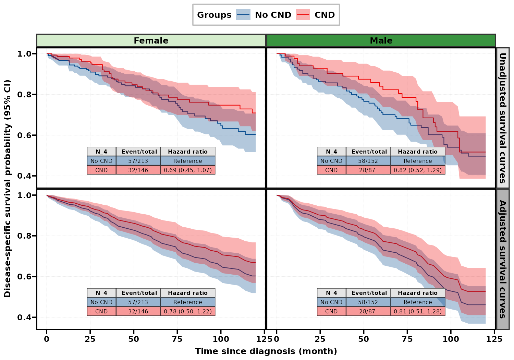{fig-alt="598 人演示队列的未调整与调整生存曲线；Female 层删除 Cov2 后重拟合，Male 层保持 Age、Cov1、Cov2、Site。"}

**提示与报告：** 提示在合并 worker 结果前由主会话统一输出，源码覆盖 Windows PSOCK 的通知路径；本页实际并行验证在 WSL 完成。用 `run_quiet()` 或全局抑制消息会隐藏这些提示。应记录层名与实际删减项，并确认 `.final_method`；各层不能被描述成相同调整集合。删减变量是计算上的兼容处理，不保证调整集合在研究设计上充分。

`get_facet_diff()` 的直接 Cox / CSC 概率差使用联合区间；正常多时点路径和兼容回退均保留组间协方差，不能退回“假定两组独立”的区间。下方直接 Cox、CSC 及直接差值示例已于本次重新生成；其他布局图保留原执行记录。

## 接口、模型与返回对象 {#interface}

### 分析设置与显示设置

以下是当前接口的主要参数，完整默认值可直接查看 `formals(RegR::get_facet)` 或 `?RegR::get_facet`。

```r
get_facet(
  data,
  split_var = c("Tum_3", "age_55"), cat_var = "Sur_3", adj_var = "Sex",
  cat_var_combine = NULL,
  surv = TRUE, method = "unadj", conf_level = 0.95,
  cif_args = list(model = c("FGR", "CSC")), parallel = NULL,
  timepoint = 120, show_surdiff = TRUE, max_t = NULL,
  forest_plot = FALSE, subgroup_model = c("interaction", "separate"),
  save = list(),
  plot_params = list(...), table_params = list(...)
)
```

::: {.table-responsive}

| 参数 | 作用与边界 |
|:--|:--|
| `data` | 原始数据框运行分析；已有 `facet_res` / 结果 list 仅重绘 |
| `cat_var` | 一个暴露列名；二列形式 `c(E, M)` 把 E 作为暴露、M 作为第一分面 / 效应修饰变量 |
| `split_var` | 一个或多个分类分层变量，顺序影响交互模型和默认布局 |
| `adj_var` | 调整项；暴露与所有分层变量自动移除 |
| `cat_var_combine` | 将两列以上组合为 `Groups` 分类暴露，覆盖 `cat_var`；与二列 `cat_var` 不能同时使用 |
| `surv = TRUE` | 数据需有 `time` 和 0/1 的 `DSS`；绘制生存概率 |
| `surv = FALSE` | 数据需有 `time`、`status`、`event`；本页 0 = 删失，1 = 甲状腺癌死亡，2 = 其他原因死亡 |
| `conf_level` | 默认 0.95；改变模型区间及相关检验计算，需要重新分析 |
| `timepoint` | 表中 `SP` / `SD` 的时间点，单位与 `time` 一致；不是曲线的截止时间 |
| `max_t` | 曲线的共同显示终点；在已保存支持范围内补出该时刻，不向支持范围外外推 |
| `show_surdiff = FALSE` | 跳过表的概率 / 差值计算，保留曲线和 HR；`SP`、`SD`、`p_SD` 留为 NA |
| `forest_plot` | 拟合时构造内嵌森林图；需要 `show_surdiff = TRUE` |
| `parallel` | 外层分层 worker 数；本页用 1 控制开销，内部模型仍可能并行 |
| `plot_params` / `table_params` | 命名 list；控制曲线、分面、表与文字，不重新定义参考组 |
| `save` | 默认 `list()` 不保存；命名配置交给 `RegR::save_plt()` 保存 PDF |

:::

帮助页还列出字符型 `surv` 转交 Logistic 结局路径的接口。本页验证的是生存 / CIF 绘图，没有执行该路径。

### method 与 CIF 后端

::: {.table-responsive}

| `method` | 曲线与模型 | 本页执行情况 |
|:--|:--|:--|
| `"unadj"` | 生存模式 KM；竞争风险模式 Aalen–Johansen；表中比值为未调整回归结果 | 实际展示 |
| `"direct"` | 在各分层数据内拟合结局模型，标准化得到组别曲线；比值表另行组织 | 实际展示 |
| `"both"` | `c("unadj", "direct")` 的兼容写法，增加 methods 分面 | 实际展示 |
| `c("unadj", "direct")` | 两个不同方法组成的向量；顺序决定方法条带顺序 | 与 `"both"` 同义 |
| `"iptw"` / `"psm"` | 倾向评分加权 / 匹配路径 | 未执行；先完成平衡、重叠与有效样本诊断 |

:::

方法向量必须恰好包含两个不同方法。`subgroup_model = "interaction"` 只支持 `unadj` / `direct` 及其组合；加权、匹配或多分类暴露需要使用 `"separate"`。

`cif_args = list(model = "FGR")` 与 `list(model = "CSC")` 只影响 **CIF + direct 的标准化概率路径**。FGR 当前优先使用 `mets::cifregFG()` 的 Fine–Gray 模型与解析区间；该拟合失败后才可能进入 adjustedCurves/FGR 的 bootstrap 回退。CSC 使用各原因 Cox 模型与解析方差。即使选 CSC，内嵌比值表仍显示 Fine–Gray sHR，不能把它改读为原因特异 HR。模型假设与实测耗时见 [FGR 与 CSC 基准页](get-eff-cif-benchmark.qmd)。

### subgroup_model 与分层顺序

::: {.table-responsive}

| 设置 | 表中 HR / sHR 的来源 | 曲线与概率 |
|:--|:--|:--|
| `"interaction"`（默认） | `cat_var * split_var[1]` 模型中的简单效应；`split_var[-1]` 先将数据分层，每层各拟合一个交互模型 | 保留各分面内原来的计算 |
| `"separate"` | 在每个完整分层单元内独立拟合暴露模型 | 保留各分面内原来的计算 |

:::

交互模式要求二分类暴露和至少一个分类分层变量，每个分层变量至少有两个观测水平。因此 `split_var = c("Sex", "age_55")` 是**先在每个年龄组内分析 CND × Sex**；交换这两个名字会改变效应修饰变量，不能把它当作单纯转置图形。仅改变布局时使用 `plot_params$flip`。

### 返回对象与缓存

`get_facet()` 自动绘制图形，并不可见地返回具有 `facet_res` 类的 list。下面第一幅图会创建 `f_unadj`，随后可查看：

```r
names(f_unadj)
# "sur.data" "insert.data" "plt"

f_unadj[["sur.data"]]                  # 长格式曲线数据，含 yhat
f_unadj[["insert.data"]][["table_tb"]] # 每个面板的内嵌表 list
attr(f_unadj[["insert.data"]], "p_inter")
attr(f_unadj, "analysis")              # 分析设置与布局元数据
f_unadj[["plt"]]                       # 完整 ggplot
```

在当前版本中，单独打印 `f_unadj` 显示分析与面板摘要；要再次显示图形，使用 `f_unadj[["plt"]]`。`.final_method` 记录曲线实际采用的方法，应确认 direct 没有回退到其他方法。

## 单个分层：KM、调整曲线与两种方法 {#single}

Sex 的两个水平放在两列，曲线颜色表示 No CND / CND，**条带颜色表示分层水平，不表示组别风险**。共用的表设置隐藏独立 P 值文字，仅展示事件人数和 HR。

::: {.panel-tabset}

### 未调整 KM

```r
f_unadj <- get_facet(
  d, split_var = "Sex", cat_var = "N_4", adj_var = adj,
  surv = TRUE, method = "unadj", subgroup_model = "interaction",
  timepoint = 60, max_t = 120, parallel = 1,
  plot_params = plot_base, table_params = table_base
)
```

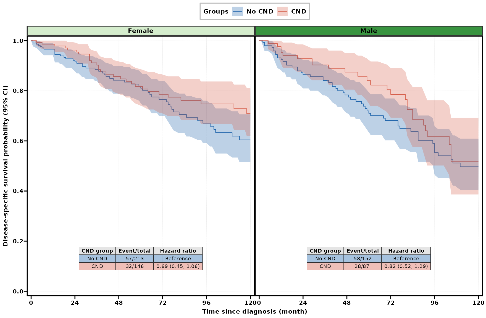{#fig-km-basic fig-alt="女性与男性两个面板，各有 No CND 和 CND 两条 KM 曲线及事件人数、HR 表。"}

### 协变量调整

```r
f_direct <- get_facet(
  d, split_var = "Sex", cat_var = "N_4", adj_var = adj,
  surv = TRUE, method = "direct", subgroup_model = "interaction",
  timepoint = 60, max_t = 120, parallel = 1,
  plot_params = plot_base, table_params = table_base
)
```

{#fig-sur-direct fig-alt="两个 Sex 面板中的协变量标准化生存曲线，带 95% CI 与调整 HR。"}

### 两种方法同图

```r
f_both <- get_facet(
  d, split_var = "Sex", cat_var = "N_4", adj_var = adj,
  surv = TRUE, method = "both", subgroup_model = "interaction",
  timepoint = 60, max_t = 120, parallel = 1,
  plot_params = plot_base, table_params = table_base
)
```

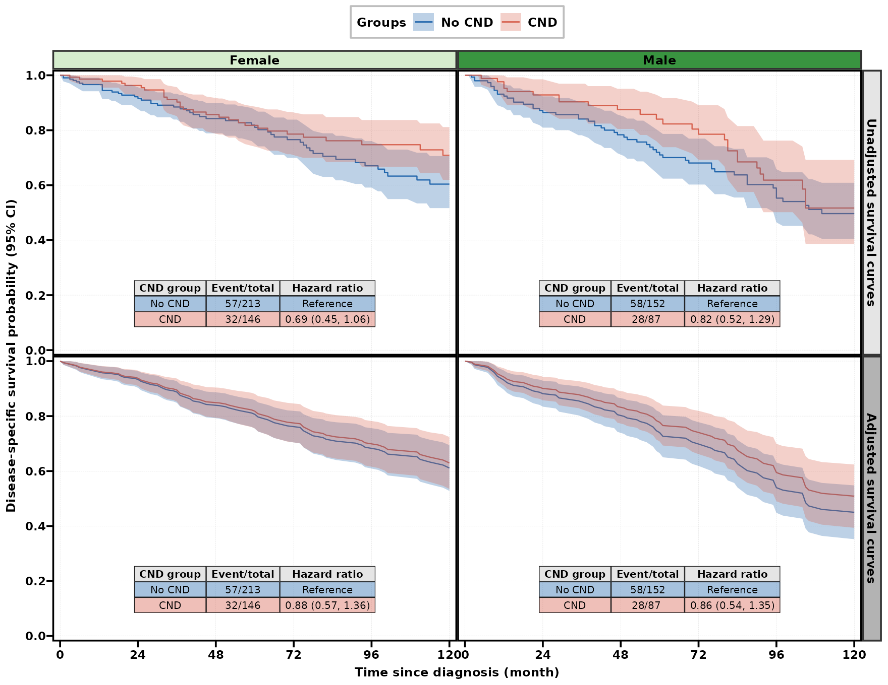{#fig-sur-both fig-alt="2 行 2 列，按未调整与调整方法以及女性与男性比较 CND 生存曲线。"}

:::

未调整曲线默认使用阶梯，调整曲线使用线段。`unadj_steps = FALSE` 只改变几何画法，未调整估计仍是 KM / Aalen–Johansen，并不会变成平滑模型。

## 亚组模型与分面布局 {#layout}

### 独立拟合与行列转置

`f_direct` 默认使用交互模型的简单效应。第一张图重新拟合每个 Sex 层内的 Cox 模型；第二张图只转置已计算的 `f_both`。

::: {.panel-tabset}

#### 各层独立模型

```r
f_separate <- get_facet(
  d, split_var = "Sex", cat_var = "N_4", adj_var = adj,
  surv = TRUE, method = "direct", subgroup_model = "separate",
  timepoint = 60, max_t = 120, parallel = 1,
  plot_params = plot_base, table_params = table_base
)
```

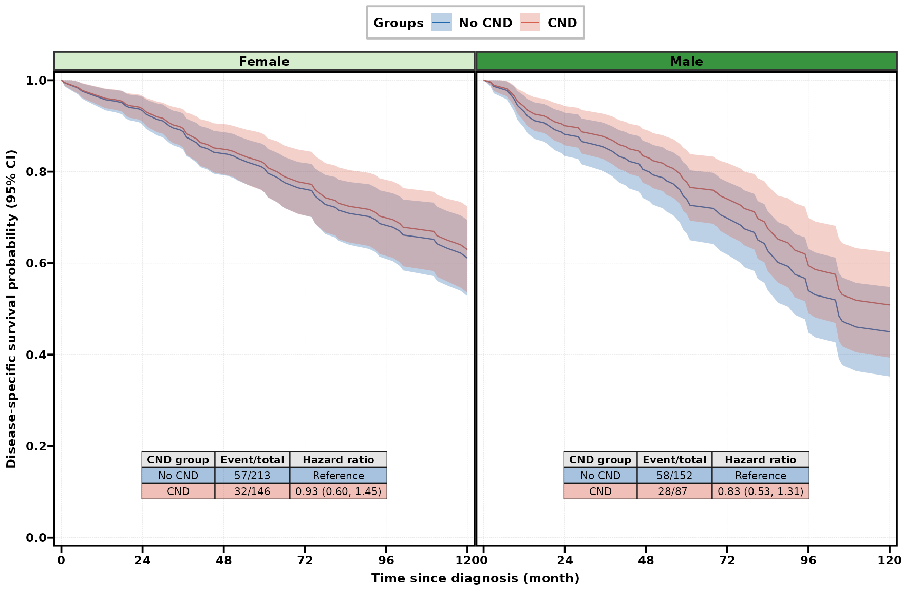{#fig-sur-separate fig-alt="每个 Sex 水平内分别拟合调整模型，内嵌表显示独立模型的 HR。"}

#### flip 转置

```r
f_flipped <- get_facet(
  f_both,
  plot_params = modifyList(plot_base, list(flip = TRUE)),
  table_params = table_base
)
```

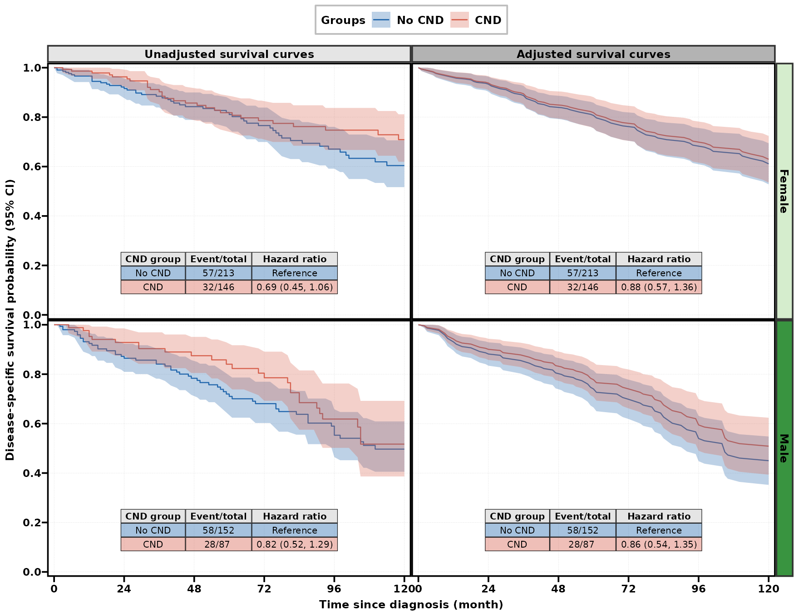{#fig-sur-flip fig-alt="转置为女性和男性两行、未调整与调整两列，数值与原始四面板结果相同。"}

:::

### 两个分层变量与嵌套条带

下面使用 `split_var = c("Sex", "age_55")`，共有 2 个 Sex 水平 × 2 个年龄水平 × 2 种方法 = **8 个面板**。先在年龄层内拟合 CND × Sex，随后根据 `flip` 安排位置。分层后样本更少，这组布局示例仅调整连续年龄 `Age`，避免在稀疏单元内加入较多分类调整项。

::: {.panel-tabset}

#### 默认布局

```r
f_multi <- get_facet(
  d, split_var = c("Sex", "age_55"), cat_var = "N_4", adj_var = "Age",
  surv = TRUE, method = "both", subgroup_model = "interaction",
  timepoint = 60, max_t = 120, parallel = 1,
  plot_params = plot_base, table_params = table_base
)
```

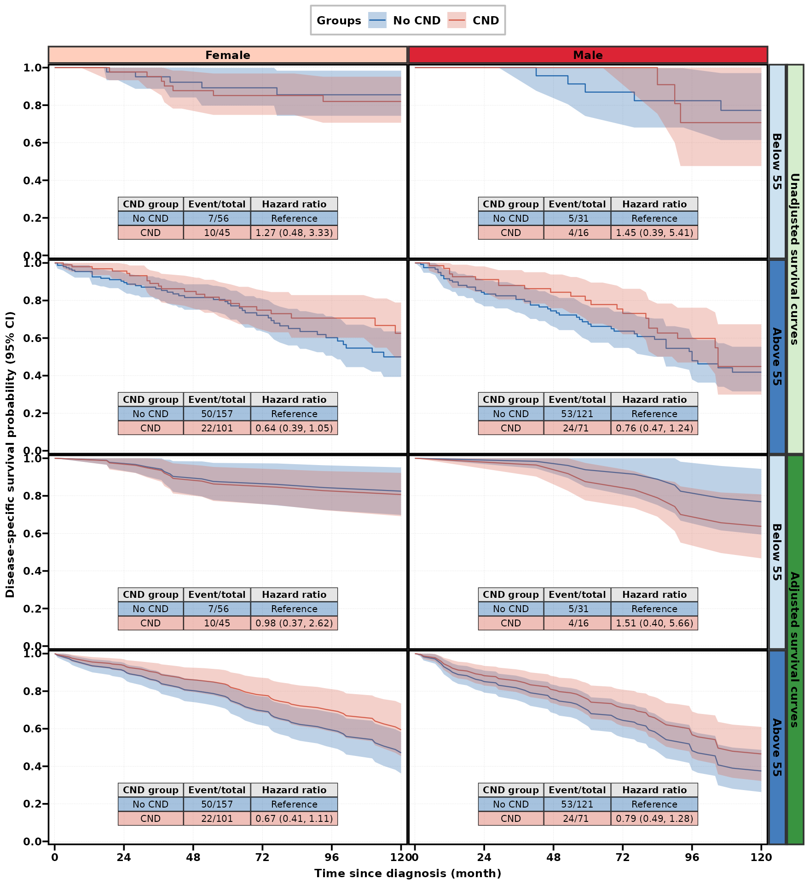{#fig-multi-default fig-alt="2 列 4 行，Sex 为列，方法及两个年龄组嵌套为行。"}

#### 布尔转置

```r
f_multi_flip <- get_facet(
  f_multi,
  plot_params = modifyList(plot_base, list(flip = TRUE)),
  table_params = table_base
)
```

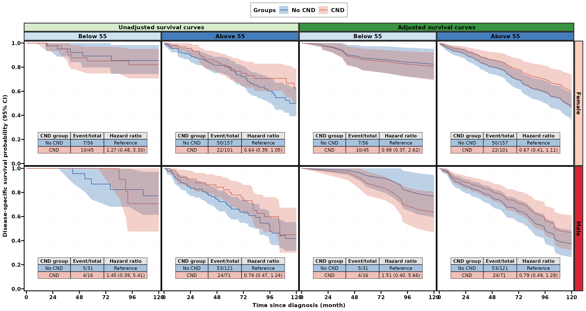{#fig-multi-flip fig-alt="4 列 2 行，Sex 为行，方法各覆盖两个年龄组的列。"}

#### 指定每侧变量

```r
f_multi_list <- get_facet(
  f_multi,
  plot_params = modifyList(plot_base, list(
    flip = list(rows = c("age_55", "Sex"), cols = "methods")
  )),
  table_params = table_base
)
```

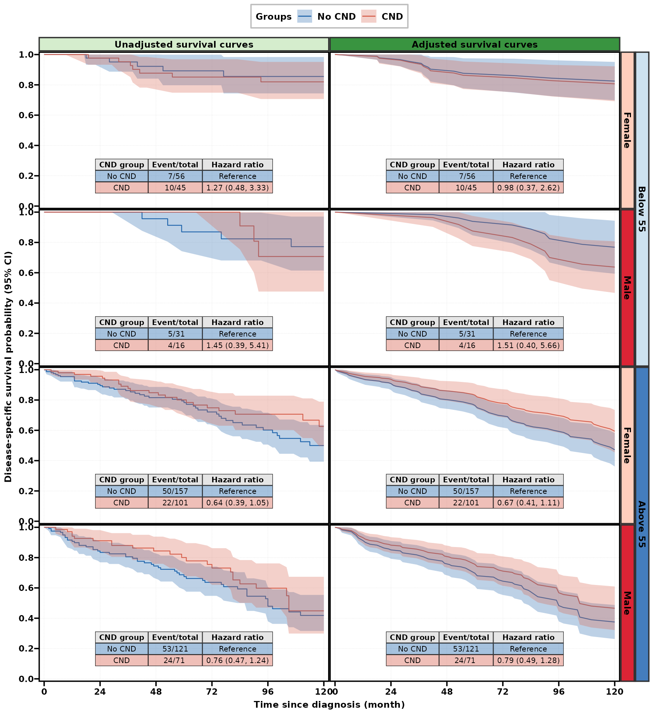{#fig-multi-list fig-alt="方法为两列，两个年龄层中分别嵌套女性和男性，共四行。"}

#### 逐格重复条带

```r
f_multi_unmerged <- get_facet(
  f_multi,
  plot_params = modifyList(plot_base, list(flip = TRUE, strip_merge = FALSE)),
  table_params = table_base
)
```

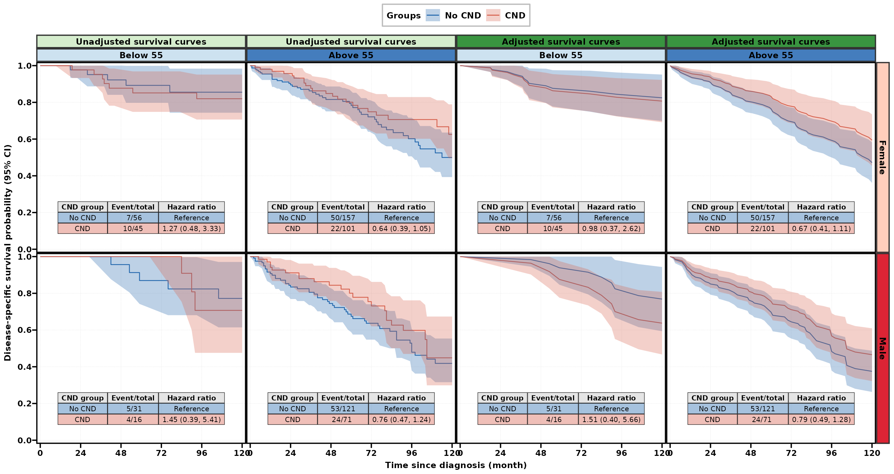{#fig-multi-unmerged fig-alt="4 列 2 行，每个年龄列分别重复方法条带。"}

#### 映射显示标签

```r
f_multi_labels <- get_facet(
  f_multi,
  plot_params = modifyList(plot_base, list(
    flip = list(cols = "methods"),
    strip_map = c(
      "Unadjusted survival curves" = "KM", "Adjusted survival curves" = "Adjusted",
      "Female" = "Women", "Male" = "Men", "Below 55" = "Age <55",
      "Above 55" = "Age >=55"
    )
  )),
  table_params = table_base
)
```

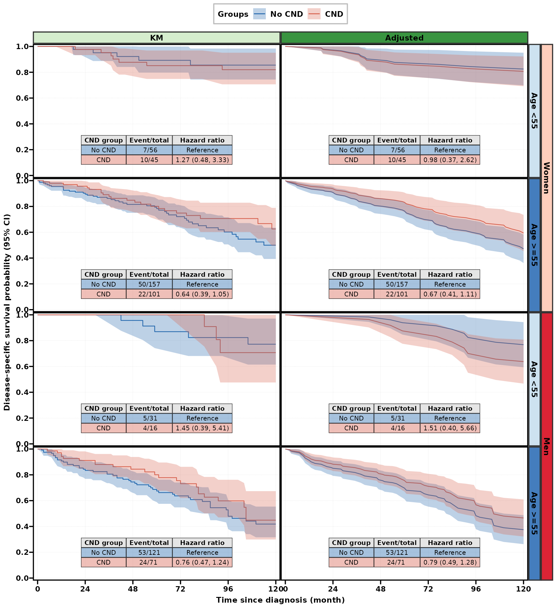{#fig-multi-labels fig-alt="方法列命名 KM 与 Adjusted，Sex 和年龄条带使用短标签。"}

:::

`flip` 的 list 中，`rows` / `cols` 按**外层 → 内层**填写，可用原变量名或内部 `strata` / `strata1` 等名字。只指定一侧时，另一侧自动接收剩余层；同时指定两侧时，必须覆盖全部层，不能重名或漏层。`strip_merge` 仅在同一方向包含多个条带层时才有明显效果。

二列 `cat_var` 可把暴露与修饰变量写在一起：以下调用与上面的 `cat_var = "N_4", split_var = c("Sex", "age_55")` 具有相同的变量组织方式，不表示联合暴露。

```r
get_facet(d, cat_var = c("N_4", "Sex"), split_var = "age_55",
          adj_var = "Age", method = "both", timepoint = 60, max_t = 120,
          subgroup_model = "interaction", parallel = 1,
          plot_params = plot_base, table_params = table_base)
```

## 联合分组与竞争风险 {#groups-cif}

### 将多个变量组合为一个暴露

`cat_var_combine = c("N_4", "Sex")` 将两列组合为四个实际观测到的水平，曲线表示这些联合类别；年龄用于分面。它与二列 `cat_var` 的含义不同：后者仍然只对 CND 暴露画两条曲线。联合类别的比值是相对组合因子首水平的比较，不能直接当作交互检验。

```r
f_combined <- get_facet(
  d, split_var = "age_55", cat_var_combine = c("N_4", "Sex"),
  adj_var = c("Age", "Race", "Tum_3"), surv = TRUE, method = "unadj",
  subgroup_model = "separate", show_surdiff = FALSE,
  timepoint = 60, max_t = 120, parallel = 1,
  plot_params = modifyList(plot_base, list(
    color = c("#2166AC", "#67A9CF", "#D6604D", "#F4A582")
  )),
  table_params = modifyList(table_base, list(tb.vars_name = c(Groups = "Joint group")))
)
```

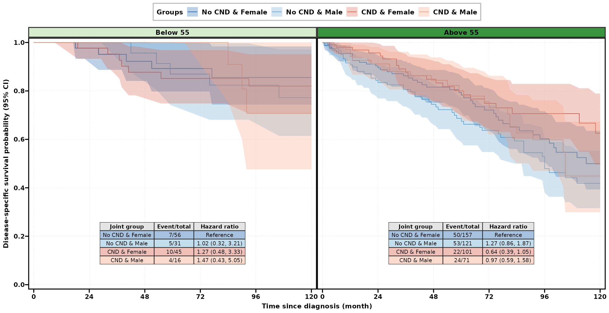{#fig-combine-groups fig-alt="两个年龄面板，每个面板四条联合分组的 KM 曲线，内嵌组合组别、事件计数和 HR 表。"}

### 未调整 CIF 与 CSC 标准化

下面的曲线从 0 上升，纵轴是目标事件累积发生概率。包括**缓存重绘 CIF 时也显式传入 `surv = FALSE`**，并通过 `tb.vars_name` 明确把比值列标题写为 sHR。

::: {.panel-tabset}

#### Aalen–Johansen

```r
f_cif <- get_facet(
  d, split_var = "Sex", cat_var = "N_4", adj_var = adj,
  surv = FALSE, method = "unadj", subgroup_model = "interaction",
  timepoint = 60, max_t = 120, parallel = 1,
  plot_params = plot_base,
  table_params = modifyList(table_base, list(
    fmt.fst.h = -0.05, tb.vars_name = c(N_4 = "CND group", HR = "sHR (95% CI)")
  ))
)
```

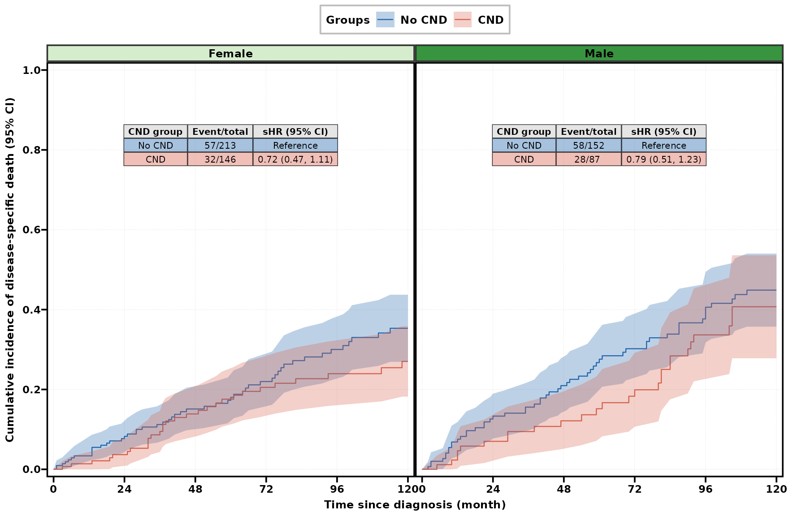{#fig-cif-unadj fig-alt="女性与男性两个面板的甲状腺癌累积发生概率，从 0 上升，并有事件计数及 sHR 表。"}

#### CSC 标准化

```r
f_csc <- get_facet(
  d, split_var = "Sex", cat_var = "N_4", adj_var = adj,
  surv = FALSE, method = "direct", cif_args = list(model = "CSC"),
  subgroup_model = "interaction", timepoint = 60, max_t = 120, parallel = 1,
  plot_params = plot_base,
  table_params = modifyList(table_base, list(
    fmt.fst.h = -0.05, tb.vars_name = c(N_4 = "CND group", HR = "sHR (95% CI)")
  ))
)
```

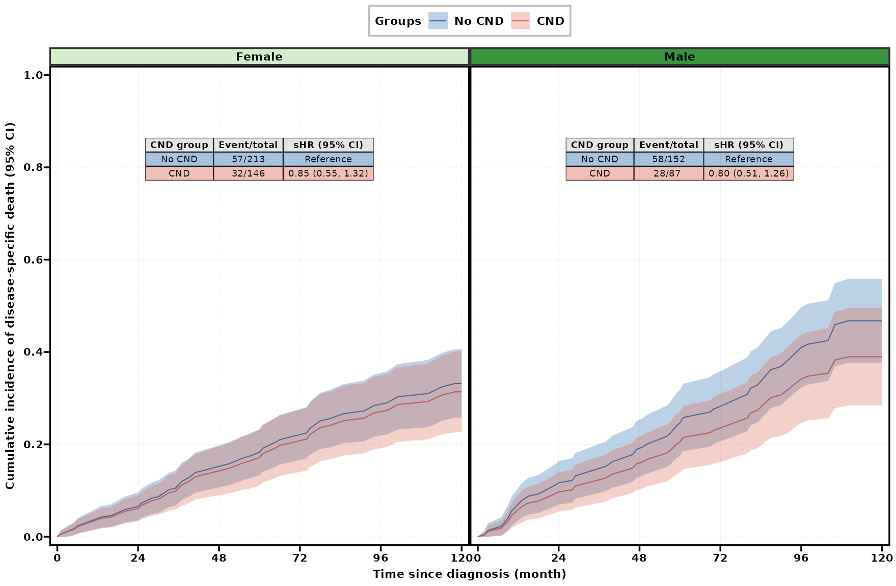{#fig-cif-csc fig-alt="两个 Sex 面板的 CSC 标准化 CIF 及区间，表中展示调整后的 Fine–Gray sHR。"}

:::

选择后端会改变拟合的工作模型，不是只换画图方式。HR / sHR 和曲线差值来自不同的估计步骤；不能从曲线间距反推出 HR，也不能把 sHR 解读成 60 月风险比。

## 曲线显示：区间、阶梯、图例和观察窗 {#curve-style}

下面四张图直接重绘 `f_unadj`，复用原曲线与内嵌表。显示选项不改变模型结果。

::: {.panel-tabset}

### 隐藏置信区间

```r
f_no_ci <- get_facet(
  f_unadj,
  plot_params = modifyList(plot_base, list(conf_int = FALSE)),
  table_params = table_base
)
```

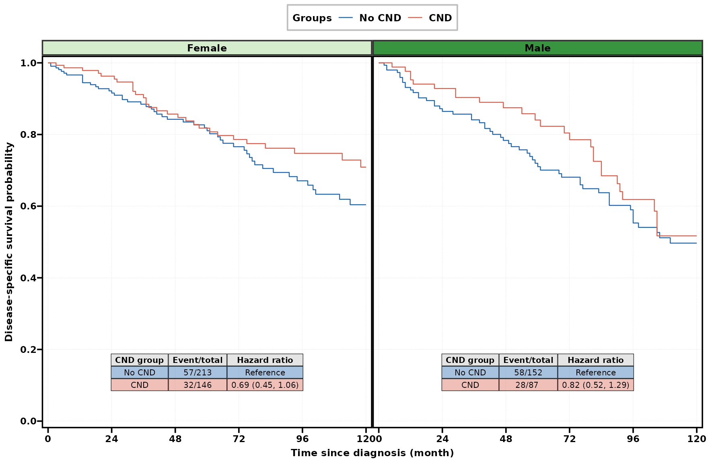{#fig-curve-no-ci fig-alt="无区间阴影的阶梯 KM 曲线，表格仍展示 HR 的 95% CI。"}

### 改用线段

```r
f_lines <- get_facet(
  f_unadj,
  plot_params = modifyList(plot_base, list(unadj_steps = FALSE)),
  table_params = table_base
)
```

{#fig-curve-lines fig-alt="KM 估计点以线段连接，数据与 HR 表保持相同。"}

### 图例放入面板

```r
f_legend <- get_facet(
  f_unadj,
  plot_params = modifyList(plot_base, list(leg_position = "left")),
  table_params = table_base
)
```

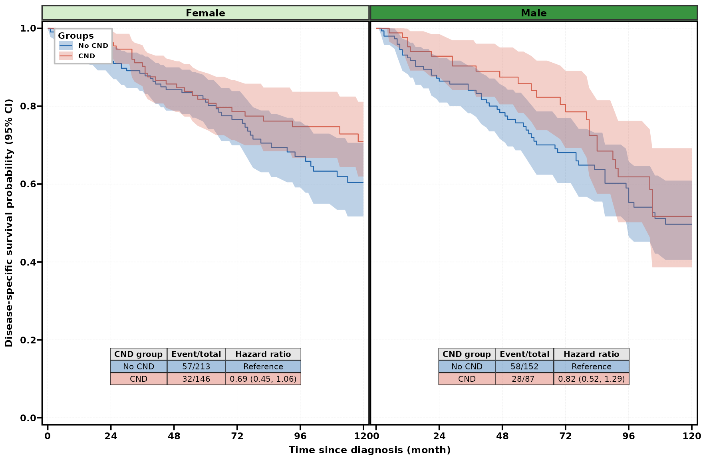{#fig-curve-legend fig-alt="共享组别图例放在女性面板左上角，男性面板不重复显示图例。"}

### 窗口与配色

```r
f_zoom <- get_facet(
  f_unadj, max_t = 90,
  plot_params = modifyList(plot_base, list(
    color = c("#1B9E77", "#D95F02"),
    xlim = c(0, 90), xbre = seq(0, 90, 18),
    ylim = c(0.3, 1), ybre = seq(0.3, 1, 0.1)
  )),
  table_params = modifyList(table_base, list(fmt.fst.h = 0.04))
)
```

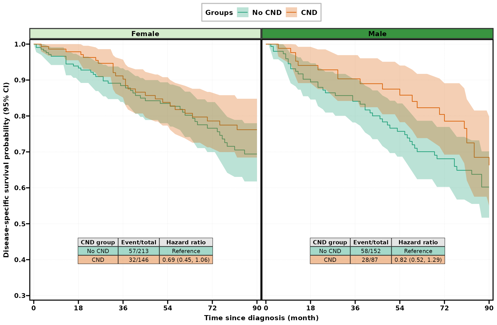{#fig-curve-zoom-colors fig-alt="绿橙两条 KM 曲线，横轴 0 到 90 月，纵轴 0.3 到 1，表格背景随曲线颜色改变。"}

:::

`leg_position` 还支持 0–1 的面板内坐标，例如 `c(0.02, 0.98)`。`max_t` 控制曲线终点，`xlim` / `ylim` 控制显示范围；本页同时给出 `xbre` / `ybre`。截短坐标不会改变 60 月的内嵌表时间点，也不会按窗口重新截断 Cox 模型的随访。

## 内嵌表、P 值和迷你森林图 {#table}

### 选择与命名表格列

`tb.vars` 用内部字段名选择列，组别列自动保留；列顺序依照表的既定顺序。`tb.vars_name` 用 **旧字段名 = 新显示名称** 的命名向量改标题。这里显式命名 `SP = "S(60 months)"`，避免把时间点误读成默认 120 月。

::: {.panel-tabset}

#### 各组生存概率

```r
f_prob_table <- get_facet(
  f_unadj,
  plot_params = plot_base,
  table_params = modifyList(table_base, list(
    tb.vars = c("eve1", "SP"),
    tb.vars_name = c(N_4 = "CND group", SP = "S(60 months)"),
    base_size_table = 8
  ))
)
```

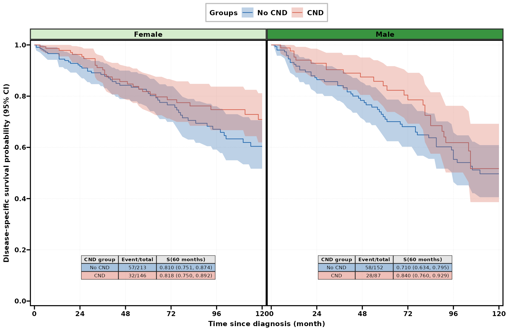{#fig-table-prob fig-alt="KM 曲线下方显示各组事件计数及 60 月生存概率和区间。"}

#### 比值与概率差同表

```r
f_full_table <- get_facet(
  f_unadj,
  plot_params = plot_base,
  table_params = modifyList(table_base, list(
    tb.vars = c("HR", "SP", "SD"),
    tb.vars_name = c(N_4 = "CND group", HR = "HR (95% CI)",
                    SP = "S(60 months)", SD = "No CND - CND"),
    base_size_table = 7, core_table = c(0.55, 0.5)
  ))
)
```

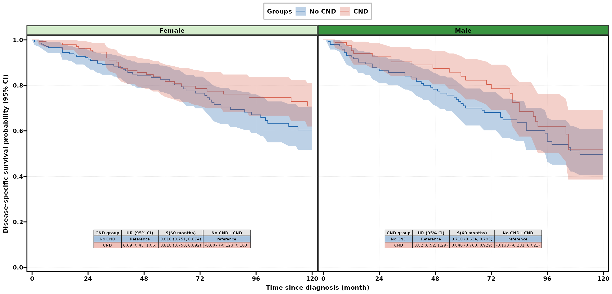{#fig-table-full fig-alt="每个面板内展示 HR、60 月生存概率，以及参考组减 CND 的概率差和区间。"}

:::

`base_size_table` 控制表格字体，`core_table` 控制单元格内边距，`fmt.fst.h` 是表格相对默认位置的竖向偏移。生存图默认靠下，CIF 默认靠上。`show_SP.time = TRUE` 当前使用固定的 10-year 前缀；本页保持 FALSE 并用 `tb.vars_name` 明确实际时间点。

### 用独立文字展示 P 值

`p_HR` 检验面板内 CND 的 HR，`p_SD` 检验选定时间点的概率差，**都不是全局交互 P 值**。`HR1` / `SD1` 仅显示简短 `p value`；`HR` / `SD` 加上组别比较名称，`all` 同时显示两个命名比较。

::: {.panel-tabset}

#### HR 的 P 值

```r
f_p_haz <- get_facet(
  f_unadj,
  plot_params = plot_base,
  table_params = modifyList(table_base, list(
    add_p_value = "HR1", fmt.p_value.h = 0.08
  ))
)
```

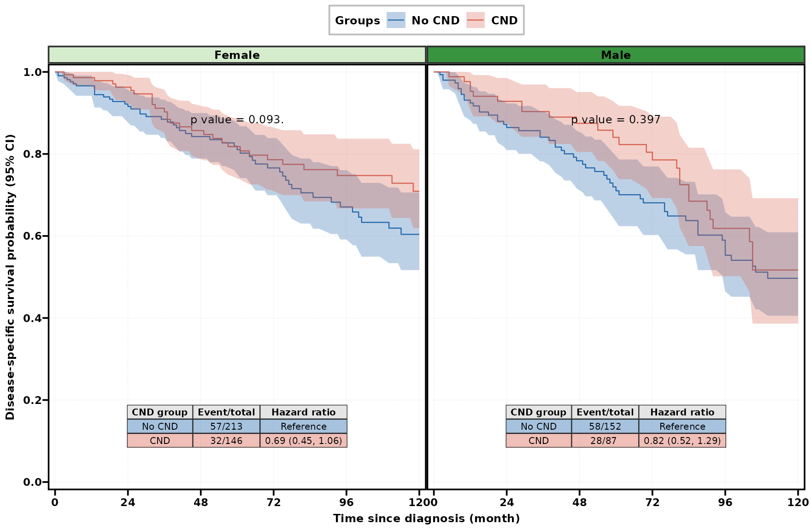{#fig-pvalue-haz fig-alt="两个 Sex 面板各显示 CND HR 的 P 值文字，与下方 HR 表对应。"}

#### 60 月差值的 P 值

```r
f_p_diff <- get_facet(
  f_unadj,
  plot_params = plot_base,
  table_params = modifyList(table_base, list(
    tb.vars = c("eve1", "SP"),
    tb.vars_name = c(N_4 = "CND group", SP = "S(60 months)"),
    add_p_value = "SD1", fmt.p_value.h = 0.08, base_size_table = 8
  ))
)
```

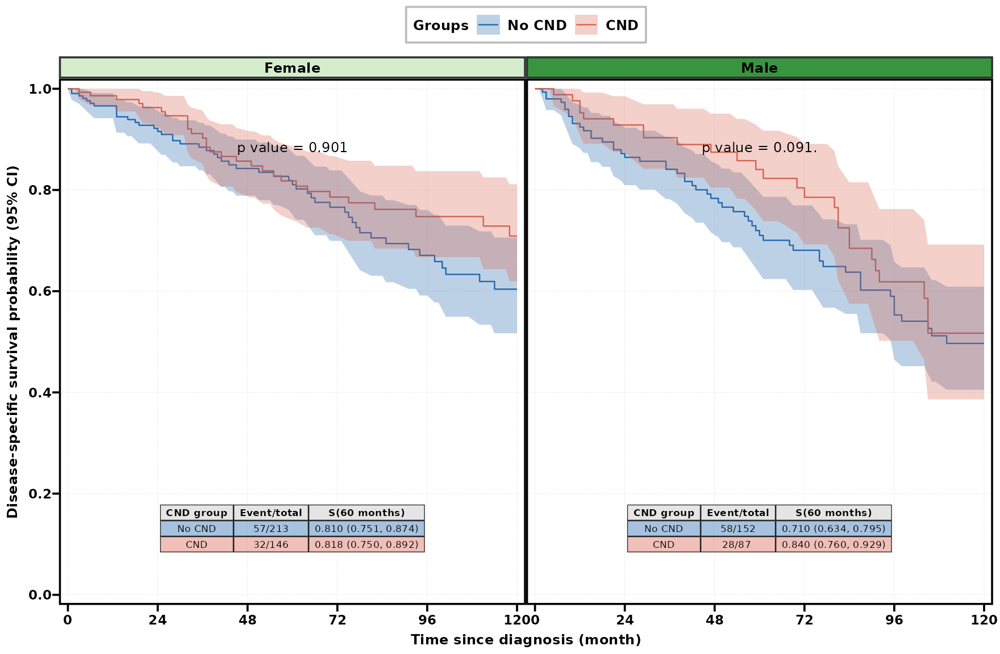{#fig-pvalue-diff fig-alt="显示 60 月 No CND 减 CND 的生存概率差 P 值，下方是各组生存概率表。"}

:::

全局 Sex 交互 P 值可在 `attr(f_both[["insert.data"]], "p_inter")` 中查阅；它与上述面板内 P 值具有不同的检验目标。多分层时，该属性按外层分层单元和方法组织。

### 森林图模式的当前输出

必须从原始数据创建 `forest_plot = TRUE` 的结果，再把 `table_params$insert_table` 设为 FALSE。仅在普通缓存上切换 `forest_plot = TRUE` 不会补算森林图。当前模板实际插入的是 **HR 与各组生存概率的组合表，并附有零刻度；没有呈现可读的效应区间图形**。其列头固定写为 10-year DSS，故本例改为实际计算 120 月，不能把 60 月结果放在这个固定标题下。需要完整森林图时，使用 [森林图页](forest-guide.qmd) 的专用绘图函数。

已有森林图缓存的 `insert_table = FALSE` 会显示这个组件；仅想要纯曲线时，用没有森林图组件的缓存，并同时设置 `add_p_value = "none"`。

```r
f_forest <- get_facet(
  d, split_var = "Sex", cat_var = "N_4", adj_var = adj,
  surv = TRUE, method = "unadj", subgroup_model = "interaction",
  timepoint = 120, max_t = 120, parallel = 1,
  forest_plot = TRUE, show_surdiff = TRUE,
  plot_params = plot_base,
  table_params = modifyList(table_base, list(
    insert_table = FALSE, fmt.fst.h = 0.08
  ))
)
```

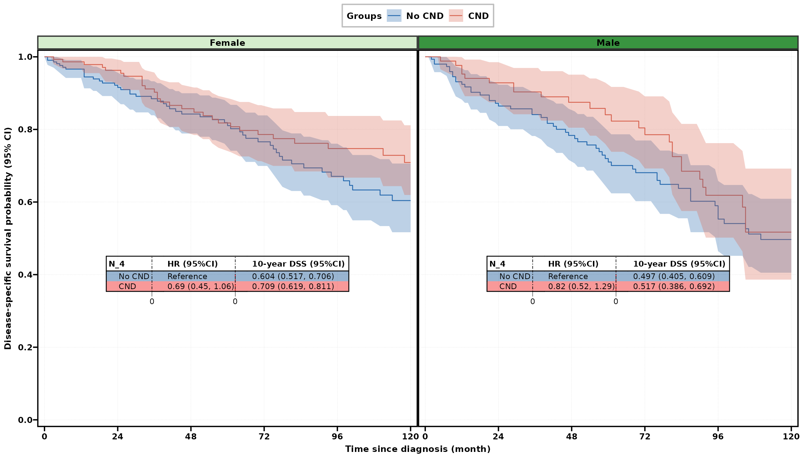{#fig-mini-forest fig-alt="每个 Sex 面板的 KM 曲线中嵌入 HR 与 10 年 DSS 生存概率的组合表，列间有零刻度，没有可读的森林区间。"}

<!-- facet-extension: start -->

## get_facet_diff()：直接绘制组间概率差 {#facet-diff}

本节于 2026-10-01 按当前源码补充，继续使用前文 598 人 ToyData 队列，实际拟合 KM/直接标准化生存差与未调整 CIF 差。get_facet 展示各组曲线；get_facet_diff 则把差值本身作为纵轴，并可内嵌指定时点的差值森林图。

**方向必须明确：** 每个 group_pairs 的第一组减第二组。下面指定 CND − No CND，与本页前面 get_facet 表中默认 No CND − CND 相反；不是改标签就能反转数值。生存差为正表示 CND 的 S(t) 更高；CIF 差为正表示 CND 的目标事件概率更高。所有差值均为 0–1 比例，0.10 表示十个百分点；它们不是 HR/sHR。

返回 list 的 diff.data 是整条差值曲线，forest.data 是 time_dif 的结果，plt 为图，cat.obj 缓存拟合对象。输入数据后按 split_var×method 拟合一次；已有缓存可重绘，或从 cat.obj 提取新的组对，不再拟合。缓存保留首次 method/conf_level/time_dif/max_t，不能传一个新 time_dif 就假定已重新分析。

time_dif 按本接口的月单位输入，内嵌表默认转换成年显示；time_dif=c(36,60) 在图内写为 3/5 年。conf_int 控制曲线的点态区间；各时点星号来自上游点态 P 值，没有多时点校正，也不是同时置信带。parallel=1 限制外层资源。

内嵌表的 position、vp.width 和字体需要一起调整；增加表宽时同时把位置靠近面板左侧，避免越过右边界。本例关闭时点标题，时间仍由每行的 3/5-year 标明。

本例生存差图的绘图记录提示三行区间因缺失或超出范围未绘出；保留这一提示，不把未显示的区间补成零宽。

```r
diff_sur <- run_quiet(get_facet_diff(d, split_var = "Sex", cat_var = "N_4",
  adj_var = adj, surv = TRUE, method = "both", parallel = 1L,
  group_pairs = list(c("CND", "No CND")), time_dif = c(36, 60), max_t = 120,
  plot_params = list(xlim = c(0, 120), xbre = seq(0, 120, 24),
    base_size = 11, color = "OkabeIto"),
  forest_params = list(position = c(0.06, 0.86), show_dif_header = FALSE,
    vp.width = 0.82, vp.height = 0.38, base_size = 7, ticks_digits = 2)))
diff_cif <- run_quiet(get_facet_diff(d, split_var = "Sex", cat_var = "N_4",
  surv = FALSE, method = "unadj", parallel = 1L,
  group_pairs = list(c("CND", "No CND")), time_dif = c(36, 60), max_t = 120,
  plot_params = list(xlim = c(0, 120), xbre = seq(0, 120, 24),
    base_size = 11, color = "TolHighContrast"),
  forest_params = list(position = c(0.06, 0.86), show_dif_header = FALSE,
    vp.width = 0.82, vp.height = 0.38, base_size = 7, ticks_digits = 2)))
```

::: {.panel-tabset}

### 两种生存差 {.unnumbered}

各 Sex 内 CND−No CND；两列为 KM 与协变量标准化，都是 DSS 生存差。

```r
diff_sur[["plt"]]
```

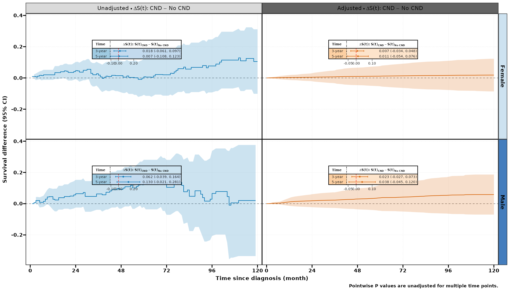{fig-alt="各 Sex 内 CND−No CND；两列为 KM 与协变量标准化，都是 DSS 生存差。"}

### CIF 差 {.unnumbered}

未调整 Aalen–Johansen 目标事件 CIF 差，保留其他原因死亡的竞争事件。

```r
diff_cif[["plt"]]
```

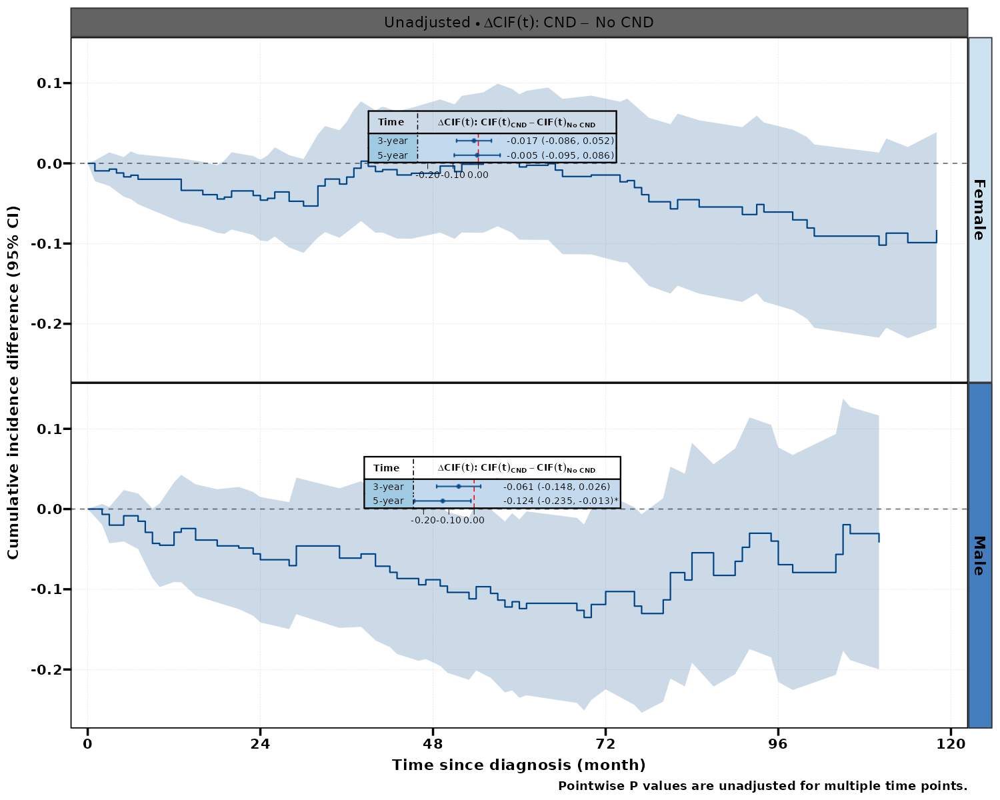{fig-alt="未调整 Aalen–Johansen 目标事件 CIF 差，保留其他原因死亡的竞争事件。"}

### 缓存重绘 {.unnumbered}

保留数值，关闭主曲线置信带、隐藏时点标题并显示两组概率；森林区间仍在。

```r
redraw <- run_quiet(get_facet_diff(diff_sur,
  plot_params = list(color = "BrBG", conf_int = FALSE),
  forest_params = list(show_group_surv = TRUE, show_dif_header = FALSE,
    position = c(0.03, 0.85), vp.width = 0.90, vp.height = 0.30,
    base_size = 7, ticks_digits = 2)))
redraw[["plt"]]
```

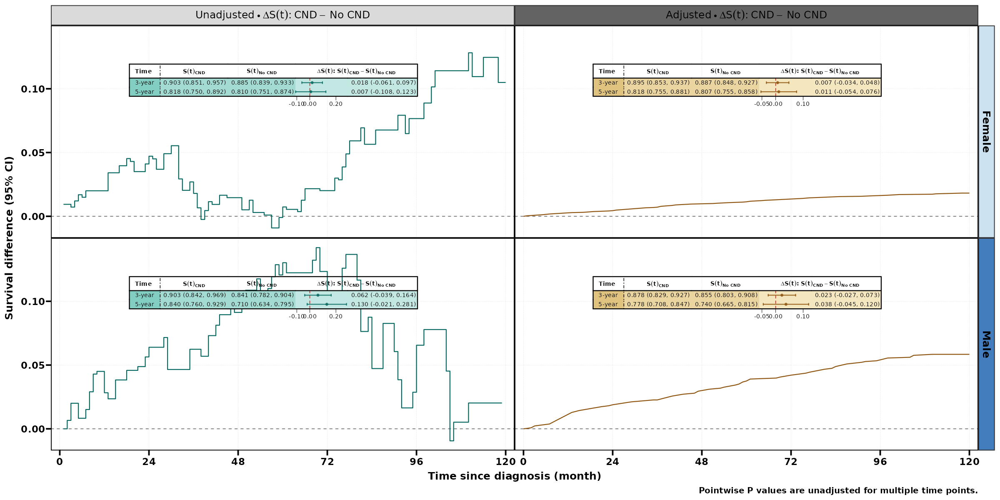{fig-alt="保留数值，关闭主曲线置信带、隐藏时点标题并显示两组概率；森林区间仍在。"}

:::

## 差值提取与多组缓存

多水平 cat_var 可用 group_pairs=list(c(1,2),c(1,3)) 或明确水平名称；数字索引遵循已解析的因子水平。每个组对必须在所有分层中出现，不能混用数字与字符。多水平且 group_pairs=NULL 时只拟合并返回 cat.obj，前三个字段为空；此时不能保存不存在的图。切换 FGR/CSC 调整 CIF 时须回到数据拟合，缓存重绘不能换模型。本节没有调用 FGR 的重采样路径。

实际 forest.data 汇总，只显示概率与差值字段；各层差值方向与组对一致。

```r
z <- diff_sur[["forest.data"]]
keep <- intersect(c("Sex", "methods", "time", "estimate", "conf.low",
  "conf.high", "p_value", "p.value", "group_1", "group_2"), names(z))
z[, keep, drop = FALSE]
```

::: {.table-responsive}

<div id="ytulrexsmd" style="padding-left:0px;padding-right:0px;padding-top:10px;padding-bottom:10px;overflow-x:auto;overflow-y:auto;width:auto;height:auto;">

  <table class="gt_table" data-quarto-disable-processing="false" data-quarto-bootstrap="false" style="-webkit-font-smoothing: antialiased; -moz-osx-font-smoothing: grayscale; font-family: system-ui, 'Segoe UI', Roboto, Helvetica, Arial, sans-serif, 'Apple Color Emoji', 'Segoe UI Emoji', 'Segoe UI Symbol', 'Noto Color Emoji'; display: table; border-collapse: collapse; line-height: normal; margin-left: auto; margin-right: auto; color: #333333; font-size: 16px; font-weight: normal; font-style: normal; background-color: #FFFFFF; width: auto; border-top-style: solid; border-top-width: 2px; border-top-color: #A8A8A8; border-right-style: none; border-right-width: 2px; border-right-color: #D3D3D3; border-bottom-style: solid; border-bottom-width: 2px; border-bottom-color: #A8A8A8; border-left-style: none; border-left-width: 2px; border-left-color: #D3D3D3;" bgcolor="#FFFFFF">
  <thead style="border-style: none;">
    <tr class="gt_col_headings" style="border-style: none; border-top-style: solid; border-top-width: 2px; border-top-color: #D3D3D3; border-bottom-style: solid; border-bottom-width: 2px; border-bottom-color: #D3D3D3; border-left-style: none; border-left-width: 1px; border-left-color: #D3D3D3; border-right-style: none; border-right-width: 1px; border-right-color: #D3D3D3;">
      <th class="gt_col_heading gt_columns_bottom_border gt_center" rowspan="1" colspan="1" scope="col" id="Sex" style="border-style: none; color: #333333; background-color: #FFFFFF; font-size: 100%; font-weight: normal; text-transform: inherit; border-left-style: none; border-left-width: 1px; border-left-color: #D3D3D3; border-right-style: none; border-right-width: 1px; border-right-color: #D3D3D3; vertical-align: bottom; padding-top: 5px; padding-bottom: 6px; padding-left: 5px; padding-right: 5px; overflow-x: hidden; text-align: center;" bgcolor="#FFFFFF" valign="bottom" align="center">Sex</th>
      <th class="gt_col_heading gt_columns_bottom_border gt_center" rowspan="1" colspan="1" scope="col" id="methods" style="border-style: none; color: #333333; background-color: #FFFFFF; font-size: 100%; font-weight: normal; text-transform: inherit; border-left-style: none; border-left-width: 1px; border-left-color: #D3D3D3; border-right-style: none; border-right-width: 1px; border-right-color: #D3D3D3; vertical-align: bottom; padding-top: 5px; padding-bottom: 6px; padding-left: 5px; padding-right: 5px; overflow-x: hidden; text-align: center;" bgcolor="#FFFFFF" valign="bottom" align="center">methods</th>
      <th class="gt_col_heading gt_columns_bottom_border gt_right" rowspan="1" colspan="1" scope="col" id="time" style="border-style: none; color: #333333; background-color: #FFFFFF; font-size: 100%; font-weight: normal; text-transform: inherit; border-left-style: none; border-left-width: 1px; border-left-color: #D3D3D3; border-right-style: none; border-right-width: 1px; border-right-color: #D3D3D3; vertical-align: bottom; padding-top: 5px; padding-bottom: 6px; padding-left: 5px; padding-right: 5px; overflow-x: hidden; text-align: right; font-variant-numeric: tabular-nums;" bgcolor="#FFFFFF" valign="bottom" align="right">time</th>
      <th class="gt_col_heading gt_columns_bottom_border gt_right" rowspan="1" colspan="1" scope="col" id="estimate" style="border-style: none; color: #333333; background-color: #FFFFFF; font-size: 100%; font-weight: normal; text-transform: inherit; border-left-style: none; border-left-width: 1px; border-left-color: #D3D3D3; border-right-style: none; border-right-width: 1px; border-right-color: #D3D3D3; vertical-align: bottom; padding-top: 5px; padding-bottom: 6px; padding-left: 5px; padding-right: 5px; overflow-x: hidden; text-align: right; font-variant-numeric: tabular-nums;" bgcolor="#FFFFFF" valign="bottom" align="right">estimate</th>
      <th class="gt_col_heading gt_columns_bottom_border gt_right" rowspan="1" colspan="1" scope="col" id="conf.low" style="border-style: none; color: #333333; background-color: #FFFFFF; font-size: 100%; font-weight: normal; text-transform: inherit; border-left-style: none; border-left-width: 1px; border-left-color: #D3D3D3; border-right-style: none; border-right-width: 1px; border-right-color: #D3D3D3; vertical-align: bottom; padding-top: 5px; padding-bottom: 6px; padding-left: 5px; padding-right: 5px; overflow-x: hidden; text-align: right; font-variant-numeric: tabular-nums;" bgcolor="#FFFFFF" valign="bottom" align="right">conf.low</th>
      <th class="gt_col_heading gt_columns_bottom_border gt_right" rowspan="1" colspan="1" scope="col" id="conf.high" style="border-style: none; color: #333333; background-color: #FFFFFF; font-size: 100%; font-weight: normal; text-transform: inherit; border-left-style: none; border-left-width: 1px; border-left-color: #D3D3D3; border-right-style: none; border-right-width: 1px; border-right-color: #D3D3D3; vertical-align: bottom; padding-top: 5px; padding-bottom: 6px; padding-left: 5px; padding-right: 5px; overflow-x: hidden; text-align: right; font-variant-numeric: tabular-nums;" bgcolor="#FFFFFF" valign="bottom" align="right">conf.high</th>
      <th class="gt_col_heading gt_columns_bottom_border gt_right" rowspan="1" colspan="1" scope="col" id="p_value" style="border-style: none; color: #333333; background-color: #FFFFFF; font-size: 100%; font-weight: normal; text-transform: inherit; border-left-style: none; border-left-width: 1px; border-left-color: #D3D3D3; border-right-style: none; border-right-width: 1px; border-right-color: #D3D3D3; vertical-align: bottom; padding-top: 5px; padding-bottom: 6px; padding-left: 5px; padding-right: 5px; overflow-x: hidden; text-align: right; font-variant-numeric: tabular-nums;" bgcolor="#FFFFFF" valign="bottom" align="right">p_value</th>
    </tr>
  </thead>
  <tbody class="gt_table_body" style="border-style: none; border-top-style: solid; border-top-width: 2px; border-top-color: #D3D3D3; border-bottom-style: solid; border-bottom-width: 2px; border-bottom-color: #D3D3D3;">
    <tr style="border-style: none;"><td headers="Sex" class="gt_row gt_center" style="border-style: none; padding-top: 8px; padding-bottom: 8px; padding-left: 5px; padding-right: 5px; margin: 10px; border-top-style: solid; border-top-width: 1px; border-top-color: #D3D3D3; border-left-style: none; border-left-width: 1px; border-left-color: #D3D3D3; border-right-style: none; border-right-width: 1px; border-right-color: #D3D3D3; vertical-align: middle; overflow-x: hidden; text-align: center;" valign="middle" align="center">Female</td>
<td headers="methods" class="gt_row gt_center" style="border-style: none; padding-top: 8px; padding-bottom: 8px; padding-left: 5px; padding-right: 5px; margin: 10px; border-top-style: solid; border-top-width: 1px; border-top-color: #D3D3D3; border-left-style: none; border-left-width: 1px; border-left-color: #D3D3D3; border-right-style: none; border-right-width: 1px; border-right-color: #D3D3D3; vertical-align: middle; overflow-x: hidden; text-align: center;" valign="middle" align="center">Unadjusted</td>
<td headers="time" class="gt_row gt_right" style="border-style: none; padding-top: 8px; padding-bottom: 8px; padding-left: 5px; padding-right: 5px; margin: 10px; border-top-style: solid; border-top-width: 1px; border-top-color: #D3D3D3; border-left-style: none; border-left-width: 1px; border-left-color: #D3D3D3; border-right-style: none; border-right-width: 1px; border-right-color: #D3D3D3; vertical-align: middle; overflow-x: hidden; text-align: right; font-variant-numeric: tabular-nums;" valign="middle" align="right">36</td>
<td headers="estimate" class="gt_row gt_right" style="border-style: none; padding-top: 8px; padding-bottom: 8px; padding-left: 5px; padding-right: 5px; margin: 10px; border-top-style: solid; border-top-width: 1px; border-top-color: #D3D3D3; border-left-style: none; border-left-width: 1px; border-left-color: #D3D3D3; border-right-style: none; border-right-width: 1px; border-right-color: #D3D3D3; vertical-align: middle; overflow-x: hidden; text-align: right; font-variant-numeric: tabular-nums;" valign="middle" align="right">0.017941087</td>
<td headers="conf.low" class="gt_row gt_right" style="border-style: none; padding-top: 8px; padding-bottom: 8px; padding-left: 5px; padding-right: 5px; margin: 10px; border-top-style: solid; border-top-width: 1px; border-top-color: #D3D3D3; border-left-style: none; border-left-width: 1px; border-left-color: #D3D3D3; border-right-style: none; border-right-width: 1px; border-right-color: #D3D3D3; vertical-align: middle; overflow-x: hidden; text-align: right; font-variant-numeric: tabular-nums;" valign="middle" align="right">-0.06090662</td>
<td headers="conf.high" class="gt_row gt_right" style="border-style: none; padding-top: 8px; padding-bottom: 8px; padding-left: 5px; padding-right: 5px; margin: 10px; border-top-style: solid; border-top-width: 1px; border-top-color: #D3D3D3; border-left-style: none; border-left-width: 1px; border-left-color: #D3D3D3; border-right-style: none; border-right-width: 1px; border-right-color: #D3D3D3; vertical-align: middle; overflow-x: hidden; text-align: right; font-variant-numeric: tabular-nums;" valign="middle" align="right">0.09678879</td>
<td headers="p_value" class="gt_row gt_right" style="border-style: none; padding-top: 8px; padding-bottom: 8px; padding-left: 5px; padding-right: 5px; margin: 10px; border-top-style: solid; border-top-width: 1px; border-top-color: #D3D3D3; border-left-style: none; border-left-width: 1px; border-left-color: #D3D3D3; border-right-style: none; border-right-width: 1px; border-right-color: #D3D3D3; vertical-align: middle; overflow-x: hidden; text-align: right; font-variant-numeric: tabular-nums;" valign="middle" align="right">0.65561732</td></tr>
    <tr style="border-style: none;"><td headers="Sex" class="gt_row gt_center" style="border-style: none; padding-top: 8px; padding-bottom: 8px; padding-left: 5px; padding-right: 5px; margin: 10px; border-top-style: solid; border-top-width: 1px; border-top-color: #D3D3D3; border-left-style: none; border-left-width: 1px; border-left-color: #D3D3D3; border-right-style: none; border-right-width: 1px; border-right-color: #D3D3D3; vertical-align: middle; overflow-x: hidden; text-align: center;" valign="middle" align="center">Female</td>
<td headers="methods" class="gt_row gt_center" style="border-style: none; padding-top: 8px; padding-bottom: 8px; padding-left: 5px; padding-right: 5px; margin: 10px; border-top-style: solid; border-top-width: 1px; border-top-color: #D3D3D3; border-left-style: none; border-left-width: 1px; border-left-color: #D3D3D3; border-right-style: none; border-right-width: 1px; border-right-color: #D3D3D3; vertical-align: middle; overflow-x: hidden; text-align: center;" valign="middle" align="center">Unadjusted</td>
<td headers="time" class="gt_row gt_right" style="border-style: none; padding-top: 8px; padding-bottom: 8px; padding-left: 5px; padding-right: 5px; margin: 10px; border-top-style: solid; border-top-width: 1px; border-top-color: #D3D3D3; border-left-style: none; border-left-width: 1px; border-left-color: #D3D3D3; border-right-style: none; border-right-width: 1px; border-right-color: #D3D3D3; vertical-align: middle; overflow-x: hidden; text-align: right; font-variant-numeric: tabular-nums;" valign="middle" align="right">60</td>
<td headers="estimate" class="gt_row gt_right" style="border-style: none; padding-top: 8px; padding-bottom: 8px; padding-left: 5px; padding-right: 5px; margin: 10px; border-top-style: solid; border-top-width: 1px; border-top-color: #D3D3D3; border-left-style: none; border-left-width: 1px; border-left-color: #D3D3D3; border-right-style: none; border-right-width: 1px; border-right-color: #D3D3D3; vertical-align: middle; overflow-x: hidden; text-align: right; font-variant-numeric: tabular-nums;" valign="middle" align="right">0.007324786</td>
<td headers="conf.low" class="gt_row gt_right" style="border-style: none; padding-top: 8px; padding-bottom: 8px; padding-left: 5px; padding-right: 5px; margin: 10px; border-top-style: solid; border-top-width: 1px; border-top-color: #D3D3D3; border-left-style: none; border-left-width: 1px; border-left-color: #D3D3D3; border-right-style: none; border-right-width: 1px; border-right-color: #D3D3D3; vertical-align: middle; overflow-x: hidden; text-align: right; font-variant-numeric: tabular-nums;" valign="middle" align="right">-0.10822848</td>
<td headers="conf.high" class="gt_row gt_right" style="border-style: none; padding-top: 8px; padding-bottom: 8px; padding-left: 5px; padding-right: 5px; margin: 10px; border-top-style: solid; border-top-width: 1px; border-top-color: #D3D3D3; border-left-style: none; border-left-width: 1px; border-left-color: #D3D3D3; border-right-style: none; border-right-width: 1px; border-right-color: #D3D3D3; vertical-align: middle; overflow-x: hidden; text-align: right; font-variant-numeric: tabular-nums;" valign="middle" align="right">0.12287805</td>
<td headers="p_value" class="gt_row gt_right" style="border-style: none; padding-top: 8px; padding-bottom: 8px; padding-left: 5px; padding-right: 5px; margin: 10px; border-top-style: solid; border-top-width: 1px; border-top-color: #D3D3D3; border-left-style: none; border-left-width: 1px; border-left-color: #D3D3D3; border-right-style: none; border-right-width: 1px; border-right-color: #D3D3D3; vertical-align: middle; overflow-x: hidden; text-align: right; font-variant-numeric: tabular-nums;" valign="middle" align="right">0.90112539</td></tr>
    <tr style="border-style: none;"><td headers="Sex" class="gt_row gt_center" style="border-style: none; padding-top: 8px; padding-bottom: 8px; padding-left: 5px; padding-right: 5px; margin: 10px; border-top-style: solid; border-top-width: 1px; border-top-color: #D3D3D3; border-left-style: none; border-left-width: 1px; border-left-color: #D3D3D3; border-right-style: none; border-right-width: 1px; border-right-color: #D3D3D3; vertical-align: middle; overflow-x: hidden; text-align: center;" valign="middle" align="center">Male</td>
<td headers="methods" class="gt_row gt_center" style="border-style: none; padding-top: 8px; padding-bottom: 8px; padding-left: 5px; padding-right: 5px; margin: 10px; border-top-style: solid; border-top-width: 1px; border-top-color: #D3D3D3; border-left-style: none; border-left-width: 1px; border-left-color: #D3D3D3; border-right-style: none; border-right-width: 1px; border-right-color: #D3D3D3; vertical-align: middle; overflow-x: hidden; text-align: center;" valign="middle" align="center">Unadjusted</td>
<td headers="time" class="gt_row gt_right" style="border-style: none; padding-top: 8px; padding-bottom: 8px; padding-left: 5px; padding-right: 5px; margin: 10px; border-top-style: solid; border-top-width: 1px; border-top-color: #D3D3D3; border-left-style: none; border-left-width: 1px; border-left-color: #D3D3D3; border-right-style: none; border-right-width: 1px; border-right-color: #D3D3D3; vertical-align: middle; overflow-x: hidden; text-align: right; font-variant-numeric: tabular-nums;" valign="middle" align="right">36</td>
<td headers="estimate" class="gt_row gt_right" style="border-style: none; padding-top: 8px; padding-bottom: 8px; padding-left: 5px; padding-right: 5px; margin: 10px; border-top-style: solid; border-top-width: 1px; border-top-color: #D3D3D3; border-left-style: none; border-left-width: 1px; border-left-color: #D3D3D3; border-right-style: none; border-right-width: 1px; border-right-color: #D3D3D3; vertical-align: middle; overflow-x: hidden; text-align: right; font-variant-numeric: tabular-nums;" valign="middle" align="right">0.062386247</td>
<td headers="conf.low" class="gt_row gt_right" style="border-style: none; padding-top: 8px; padding-bottom: 8px; padding-left: 5px; padding-right: 5px; margin: 10px; border-top-style: solid; border-top-width: 1px; border-top-color: #D3D3D3; border-left-style: none; border-left-width: 1px; border-left-color: #D3D3D3; border-right-style: none; border-right-width: 1px; border-right-color: #D3D3D3; vertical-align: middle; overflow-x: hidden; text-align: right; font-variant-numeric: tabular-nums;" valign="middle" align="right">-0.03899283</td>
<td headers="conf.high" class="gt_row gt_right" style="border-style: none; padding-top: 8px; padding-bottom: 8px; padding-left: 5px; padding-right: 5px; margin: 10px; border-top-style: solid; border-top-width: 1px; border-top-color: #D3D3D3; border-left-style: none; border-left-width: 1px; border-left-color: #D3D3D3; border-right-style: none; border-right-width: 1px; border-right-color: #D3D3D3; vertical-align: middle; overflow-x: hidden; text-align: right; font-variant-numeric: tabular-nums;" valign="middle" align="right">0.16376533</td>
<td headers="p_value" class="gt_row gt_right" style="border-style: none; padding-top: 8px; padding-bottom: 8px; padding-left: 5px; padding-right: 5px; margin: 10px; border-top-style: solid; border-top-width: 1px; border-top-color: #D3D3D3; border-left-style: none; border-left-width: 1px; border-left-color: #D3D3D3; border-right-style: none; border-right-width: 1px; border-right-color: #D3D3D3; vertical-align: middle; overflow-x: hidden; text-align: right; font-variant-numeric: tabular-nums;" valign="middle" align="right">0.22777328</td></tr>
    <tr style="border-style: none;"><td headers="Sex" class="gt_row gt_center" style="border-style: none; padding-top: 8px; padding-bottom: 8px; padding-left: 5px; padding-right: 5px; margin: 10px; border-top-style: solid; border-top-width: 1px; border-top-color: #D3D3D3; border-left-style: none; border-left-width: 1px; border-left-color: #D3D3D3; border-right-style: none; border-right-width: 1px; border-right-color: #D3D3D3; vertical-align: middle; overflow-x: hidden; text-align: center;" valign="middle" align="center">Male</td>
<td headers="methods" class="gt_row gt_center" style="border-style: none; padding-top: 8px; padding-bottom: 8px; padding-left: 5px; padding-right: 5px; margin: 10px; border-top-style: solid; border-top-width: 1px; border-top-color: #D3D3D3; border-left-style: none; border-left-width: 1px; border-left-color: #D3D3D3; border-right-style: none; border-right-width: 1px; border-right-color: #D3D3D3; vertical-align: middle; overflow-x: hidden; text-align: center;" valign="middle" align="center">Unadjusted</td>
<td headers="time" class="gt_row gt_right" style="border-style: none; padding-top: 8px; padding-bottom: 8px; padding-left: 5px; padding-right: 5px; margin: 10px; border-top-style: solid; border-top-width: 1px; border-top-color: #D3D3D3; border-left-style: none; border-left-width: 1px; border-left-color: #D3D3D3; border-right-style: none; border-right-width: 1px; border-right-color: #D3D3D3; vertical-align: middle; overflow-x: hidden; text-align: right; font-variant-numeric: tabular-nums;" valign="middle" align="right">60</td>
<td headers="estimate" class="gt_row gt_right" style="border-style: none; padding-top: 8px; padding-bottom: 8px; padding-left: 5px; padding-right: 5px; margin: 10px; border-top-style: solid; border-top-width: 1px; border-top-color: #D3D3D3; border-left-style: none; border-left-width: 1px; border-left-color: #D3D3D3; border-right-style: none; border-right-width: 1px; border-right-color: #D3D3D3; vertical-align: middle; overflow-x: hidden; text-align: right; font-variant-numeric: tabular-nums;" valign="middle" align="right">0.130266135</td>
<td headers="conf.low" class="gt_row gt_right" style="border-style: none; padding-top: 8px; padding-bottom: 8px; padding-left: 5px; padding-right: 5px; margin: 10px; border-top-style: solid; border-top-width: 1px; border-top-color: #D3D3D3; border-left-style: none; border-left-width: 1px; border-left-color: #D3D3D3; border-right-style: none; border-right-width: 1px; border-right-color: #D3D3D3; vertical-align: middle; overflow-x: hidden; text-align: right; font-variant-numeric: tabular-nums;" valign="middle" align="right">-0.02059266</td>
<td headers="conf.high" class="gt_row gt_right" style="border-style: none; padding-top: 8px; padding-bottom: 8px; padding-left: 5px; padding-right: 5px; margin: 10px; border-top-style: solid; border-top-width: 1px; border-top-color: #D3D3D3; border-left-style: none; border-left-width: 1px; border-left-color: #D3D3D3; border-right-style: none; border-right-width: 1px; border-right-color: #D3D3D3; vertical-align: middle; overflow-x: hidden; text-align: right; font-variant-numeric: tabular-nums;" valign="middle" align="right">0.28112493</td>
<td headers="p_value" class="gt_row gt_right" style="border-style: none; padding-top: 8px; padding-bottom: 8px; padding-left: 5px; padding-right: 5px; margin: 10px; border-top-style: solid; border-top-width: 1px; border-top-color: #D3D3D3; border-left-style: none; border-left-width: 1px; border-left-color: #D3D3D3; border-right-style: none; border-right-width: 1px; border-right-color: #D3D3D3; vertical-align: middle; overflow-x: hidden; text-align: right; font-variant-numeric: tabular-nums;" valign="middle" align="right">0.09056531</td></tr>
    <tr style="border-style: none;"><td headers="Sex" class="gt_row gt_center" style="border-style: none; padding-top: 8px; padding-bottom: 8px; padding-left: 5px; padding-right: 5px; margin: 10px; border-top-style: solid; border-top-width: 1px; border-top-color: #D3D3D3; border-left-style: none; border-left-width: 1px; border-left-color: #D3D3D3; border-right-style: none; border-right-width: 1px; border-right-color: #D3D3D3; vertical-align: middle; overflow-x: hidden; text-align: center;" valign="middle" align="center">Female</td>
<td headers="methods" class="gt_row gt_center" style="border-style: none; padding-top: 8px; padding-bottom: 8px; padding-left: 5px; padding-right: 5px; margin: 10px; border-top-style: solid; border-top-width: 1px; border-top-color: #D3D3D3; border-left-style: none; border-left-width: 1px; border-left-color: #D3D3D3; border-right-style: none; border-right-width: 1px; border-right-color: #D3D3D3; vertical-align: middle; overflow-x: hidden; text-align: center;" valign="middle" align="center">Adjusted</td>
<td headers="time" class="gt_row gt_right" style="border-style: none; padding-top: 8px; padding-bottom: 8px; padding-left: 5px; padding-right: 5px; margin: 10px; border-top-style: solid; border-top-width: 1px; border-top-color: #D3D3D3; border-left-style: none; border-left-width: 1px; border-left-color: #D3D3D3; border-right-style: none; border-right-width: 1px; border-right-color: #D3D3D3; vertical-align: middle; overflow-x: hidden; text-align: right; font-variant-numeric: tabular-nums;" valign="middle" align="right">36</td>
<td headers="estimate" class="gt_row gt_right" style="border-style: none; padding-top: 8px; padding-bottom: 8px; padding-left: 5px; padding-right: 5px; margin: 10px; border-top-style: solid; border-top-width: 1px; border-top-color: #D3D3D3; border-left-style: none; border-left-width: 1px; border-left-color: #D3D3D3; border-right-style: none; border-right-width: 1px; border-right-color: #D3D3D3; vertical-align: middle; overflow-x: hidden; text-align: right; font-variant-numeric: tabular-nums;" valign="middle" align="right">0.007150061</td>
<td headers="conf.low" class="gt_row gt_right" style="border-style: none; padding-top: 8px; padding-bottom: 8px; padding-left: 5px; padding-right: 5px; margin: 10px; border-top-style: solid; border-top-width: 1px; border-top-color: #D3D3D3; border-left-style: none; border-left-width: 1px; border-left-color: #D3D3D3; border-right-style: none; border-right-width: 1px; border-right-color: #D3D3D3; vertical-align: middle; overflow-x: hidden; text-align: right; font-variant-numeric: tabular-nums;" valign="middle" align="right">-0.05034712</td>
<td headers="conf.high" class="gt_row gt_right" style="border-style: none; padding-top: 8px; padding-bottom: 8px; padding-left: 5px; padding-right: 5px; margin: 10px; border-top-style: solid; border-top-width: 1px; border-top-color: #D3D3D3; border-left-style: none; border-left-width: 1px; border-left-color: #D3D3D3; border-right-style: none; border-right-width: 1px; border-right-color: #D3D3D3; vertical-align: middle; overflow-x: hidden; text-align: right; font-variant-numeric: tabular-nums;" valign="middle" align="right">0.06464724</td>
<td headers="p_value" class="gt_row gt_right" style="border-style: none; padding-top: 8px; padding-bottom: 8px; padding-left: 5px; padding-right: 5px; margin: 10px; border-top-style: solid; border-top-width: 1px; border-top-color: #D3D3D3; border-left-style: none; border-left-width: 1px; border-left-color: #D3D3D3; border-right-style: none; border-right-width: 1px; border-right-color: #D3D3D3; vertical-align: middle; overflow-x: hidden; text-align: right; font-variant-numeric: tabular-nums;" valign="middle" align="right">0.80743895</td></tr>
    <tr style="border-style: none;"><td headers="Sex" class="gt_row gt_center" style="border-style: none; padding-top: 8px; padding-bottom: 8px; padding-left: 5px; padding-right: 5px; margin: 10px; border-top-style: solid; border-top-width: 1px; border-top-color: #D3D3D3; border-left-style: none; border-left-width: 1px; border-left-color: #D3D3D3; border-right-style: none; border-right-width: 1px; border-right-color: #D3D3D3; vertical-align: middle; overflow-x: hidden; text-align: center;" valign="middle" align="center">Female</td>
<td headers="methods" class="gt_row gt_center" style="border-style: none; padding-top: 8px; padding-bottom: 8px; padding-left: 5px; padding-right: 5px; margin: 10px; border-top-style: solid; border-top-width: 1px; border-top-color: #D3D3D3; border-left-style: none; border-left-width: 1px; border-left-color: #D3D3D3; border-right-style: none; border-right-width: 1px; border-right-color: #D3D3D3; vertical-align: middle; overflow-x: hidden; text-align: center;" valign="middle" align="center">Adjusted</td>
<td headers="time" class="gt_row gt_right" style="border-style: none; padding-top: 8px; padding-bottom: 8px; padding-left: 5px; padding-right: 5px; margin: 10px; border-top-style: solid; border-top-width: 1px; border-top-color: #D3D3D3; border-left-style: none; border-left-width: 1px; border-left-color: #D3D3D3; border-right-style: none; border-right-width: 1px; border-right-color: #D3D3D3; vertical-align: middle; overflow-x: hidden; text-align: right; font-variant-numeric: tabular-nums;" valign="middle" align="right">60</td>
<td headers="estimate" class="gt_row gt_right" style="border-style: none; padding-top: 8px; padding-bottom: 8px; padding-left: 5px; padding-right: 5px; margin: 10px; border-top-style: solid; border-top-width: 1px; border-top-color: #D3D3D3; border-left-style: none; border-left-width: 1px; border-left-color: #D3D3D3; border-right-style: none; border-right-width: 1px; border-right-color: #D3D3D3; vertical-align: middle; overflow-x: hidden; text-align: right; font-variant-numeric: tabular-nums;" valign="middle" align="right">0.011356254</td>
<td headers="conf.low" class="gt_row gt_right" style="border-style: none; padding-top: 8px; padding-bottom: 8px; padding-left: 5px; padding-right: 5px; margin: 10px; border-top-style: solid; border-top-width: 1px; border-top-color: #D3D3D3; border-left-style: none; border-left-width: 1px; border-left-color: #D3D3D3; border-right-style: none; border-right-width: 1px; border-right-color: #D3D3D3; vertical-align: middle; overflow-x: hidden; text-align: right; font-variant-numeric: tabular-nums;" valign="middle" align="right">-0.07000860</td>
<td headers="conf.high" class="gt_row gt_right" style="border-style: none; padding-top: 8px; padding-bottom: 8px; padding-left: 5px; padding-right: 5px; margin: 10px; border-top-style: solid; border-top-width: 1px; border-top-color: #D3D3D3; border-left-style: none; border-left-width: 1px; border-left-color: #D3D3D3; border-right-style: none; border-right-width: 1px; border-right-color: #D3D3D3; vertical-align: middle; overflow-x: hidden; text-align: right; font-variant-numeric: tabular-nums;" valign="middle" align="right">0.09272110</td>
<td headers="p_value" class="gt_row gt_right" style="border-style: none; padding-top: 8px; padding-bottom: 8px; padding-left: 5px; padding-right: 5px; margin: 10px; border-top-style: solid; border-top-width: 1px; border-top-color: #D3D3D3; border-left-style: none; border-left-width: 1px; border-left-color: #D3D3D3; border-right-style: none; border-right-width: 1px; border-right-color: #D3D3D3; vertical-align: middle; overflow-x: hidden; text-align: right; font-variant-numeric: tabular-nums;" valign="middle" align="right">0.78442580</td></tr>
    <tr style="border-style: none;"><td headers="Sex" class="gt_row gt_center" style="border-style: none; padding-top: 8px; padding-bottom: 8px; padding-left: 5px; padding-right: 5px; margin: 10px; border-top-style: solid; border-top-width: 1px; border-top-color: #D3D3D3; border-left-style: none; border-left-width: 1px; border-left-color: #D3D3D3; border-right-style: none; border-right-width: 1px; border-right-color: #D3D3D3; vertical-align: middle; overflow-x: hidden; text-align: center;" valign="middle" align="center">Male</td>
<td headers="methods" class="gt_row gt_center" style="border-style: none; padding-top: 8px; padding-bottom: 8px; padding-left: 5px; padding-right: 5px; margin: 10px; border-top-style: solid; border-top-width: 1px; border-top-color: #D3D3D3; border-left-style: none; border-left-width: 1px; border-left-color: #D3D3D3; border-right-style: none; border-right-width: 1px; border-right-color: #D3D3D3; vertical-align: middle; overflow-x: hidden; text-align: center;" valign="middle" align="center">Adjusted</td>
<td headers="time" class="gt_row gt_right" style="border-style: none; padding-top: 8px; padding-bottom: 8px; padding-left: 5px; padding-right: 5px; margin: 10px; border-top-style: solid; border-top-width: 1px; border-top-color: #D3D3D3; border-left-style: none; border-left-width: 1px; border-left-color: #D3D3D3; border-right-style: none; border-right-width: 1px; border-right-color: #D3D3D3; vertical-align: middle; overflow-x: hidden; text-align: right; font-variant-numeric: tabular-nums;" valign="middle" align="right">36</td>
<td headers="estimate" class="gt_row gt_right" style="border-style: none; padding-top: 8px; padding-bottom: 8px; padding-left: 5px; padding-right: 5px; margin: 10px; border-top-style: solid; border-top-width: 1px; border-top-color: #D3D3D3; border-left-style: none; border-left-width: 1px; border-left-color: #D3D3D3; border-right-style: none; border-right-width: 1px; border-right-color: #D3D3D3; vertical-align: middle; overflow-x: hidden; text-align: right; font-variant-numeric: tabular-nums;" valign="middle" align="right">0.022665332</td>
<td headers="conf.low" class="gt_row gt_right" style="border-style: none; padding-top: 8px; padding-bottom: 8px; padding-left: 5px; padding-right: 5px; margin: 10px; border-top-style: solid; border-top-width: 1px; border-top-color: #D3D3D3; border-left-style: none; border-left-width: 1px; border-left-color: #D3D3D3; border-right-style: none; border-right-width: 1px; border-right-color: #D3D3D3; vertical-align: middle; overflow-x: hidden; text-align: right; font-variant-numeric: tabular-nums;" valign="middle" align="right">-0.04953802</td>
<td headers="conf.high" class="gt_row gt_right" style="border-style: none; padding-top: 8px; padding-bottom: 8px; padding-left: 5px; padding-right: 5px; margin: 10px; border-top-style: solid; border-top-width: 1px; border-top-color: #D3D3D3; border-left-style: none; border-left-width: 1px; border-left-color: #D3D3D3; border-right-style: none; border-right-width: 1px; border-right-color: #D3D3D3; vertical-align: middle; overflow-x: hidden; text-align: right; font-variant-numeric: tabular-nums;" valign="middle" align="right">0.09486869</td>
<td headers="p_value" class="gt_row gt_right" style="border-style: none; padding-top: 8px; padding-bottom: 8px; padding-left: 5px; padding-right: 5px; margin: 10px; border-top-style: solid; border-top-width: 1px; border-top-color: #D3D3D3; border-left-style: none; border-left-width: 1px; border-left-color: #D3D3D3; border-right-style: none; border-right-width: 1px; border-right-color: #D3D3D3; vertical-align: middle; overflow-x: hidden; text-align: right; font-variant-numeric: tabular-nums;" valign="middle" align="right">0.53838854</td></tr>
    <tr style="border-style: none;"><td headers="Sex" class="gt_row gt_center" style="border-style: none; padding-top: 8px; padding-bottom: 8px; padding-left: 5px; padding-right: 5px; margin: 10px; border-top-style: solid; border-top-width: 1px; border-top-color: #D3D3D3; border-left-style: none; border-left-width: 1px; border-left-color: #D3D3D3; border-right-style: none; border-right-width: 1px; border-right-color: #D3D3D3; vertical-align: middle; overflow-x: hidden; text-align: center;" valign="middle" align="center">Male</td>
<td headers="methods" class="gt_row gt_center" style="border-style: none; padding-top: 8px; padding-bottom: 8px; padding-left: 5px; padding-right: 5px; margin: 10px; border-top-style: solid; border-top-width: 1px; border-top-color: #D3D3D3; border-left-style: none; border-left-width: 1px; border-left-color: #D3D3D3; border-right-style: none; border-right-width: 1px; border-right-color: #D3D3D3; vertical-align: middle; overflow-x: hidden; text-align: center;" valign="middle" align="center">Adjusted</td>
<td headers="time" class="gt_row gt_right" style="border-style: none; padding-top: 8px; padding-bottom: 8px; padding-left: 5px; padding-right: 5px; margin: 10px; border-top-style: solid; border-top-width: 1px; border-top-color: #D3D3D3; border-left-style: none; border-left-width: 1px; border-left-color: #D3D3D3; border-right-style: none; border-right-width: 1px; border-right-color: #D3D3D3; vertical-align: middle; overflow-x: hidden; text-align: right; font-variant-numeric: tabular-nums;" valign="middle" align="right">60</td>
<td headers="estimate" class="gt_row gt_right" style="border-style: none; padding-top: 8px; padding-bottom: 8px; padding-left: 5px; padding-right: 5px; margin: 10px; border-top-style: solid; border-top-width: 1px; border-top-color: #D3D3D3; border-left-style: none; border-left-width: 1px; border-left-color: #D3D3D3; border-right-style: none; border-right-width: 1px; border-right-color: #D3D3D3; vertical-align: middle; overflow-x: hidden; text-align: right; font-variant-numeric: tabular-nums;" valign="middle" align="right">0.037503447</td>
<td headers="conf.low" class="gt_row gt_right" style="border-style: none; padding-top: 8px; padding-bottom: 8px; padding-left: 5px; padding-right: 5px; margin: 10px; border-top-style: solid; border-top-width: 1px; border-top-color: #D3D3D3; border-left-style: none; border-left-width: 1px; border-left-color: #D3D3D3; border-right-style: none; border-right-width: 1px; border-right-color: #D3D3D3; vertical-align: middle; overflow-x: hidden; text-align: right; font-variant-numeric: tabular-nums;" valign="middle" align="right">-0.06471095</td>
<td headers="conf.high" class="gt_row gt_right" style="border-style: none; padding-top: 8px; padding-bottom: 8px; padding-left: 5px; padding-right: 5px; margin: 10px; border-top-style: solid; border-top-width: 1px; border-top-color: #D3D3D3; border-left-style: none; border-left-width: 1px; border-left-color: #D3D3D3; border-right-style: none; border-right-width: 1px; border-right-color: #D3D3D3; vertical-align: middle; overflow-x: hidden; text-align: right; font-variant-numeric: tabular-nums;" valign="middle" align="right">0.13971784</td>
<td headers="p_value" class="gt_row gt_right" style="border-style: none; padding-top: 8px; padding-bottom: 8px; padding-left: 5px; padding-right: 5px; margin: 10px; border-top-style: solid; border-top-width: 1px; border-top-color: #D3D3D3; border-left-style: none; border-left-width: 1px; border-left-color: #D3D3D3; border-right-style: none; border-right-width: 1px; border-right-color: #D3D3D3; vertical-align: middle; overflow-x: hidden; text-align: right; font-variant-numeric: tabular-nums;" valign="middle" align="right">0.47206103</td></tr>
  </tbody>

</table>
</div>


:::

本次补充的源码依据：[facet_diff-get.R](https://github.com/HUI950319/RegR/blob/2e56cc6e06d548786b0a43d3449e463a0b36b252/R/facet_diff-get.R)。

<!-- facet-extension: end -->

## 缓存重绘、保存与参数速查 {#save}

### 哪些更改需要重新分析

::: {.table-responsive}

| 更改内容 | 可以直接重绘缓存 | 原因 |
|:--|:--:|:--|
| 颜色、区间是否显示、字体、图例、flip、条带映射 | 是 | 修改呈现方式 |
| 表的列、列名、字体、位置，P 值文字显示方式 | 是 | 只能展示缓存已有结果 |
| `max_t` | 在原支持范围内 | 旧缓存若截到更短时间，不能补回更长随访 |
| 数据、暴露、分层、调整项、方法、CIF 后端、CI 水平 | 否 | list 输入复用原曲线与表，不重新拟合 |
| `timepoint`、`show_surdiff` | 否 | 缓存的时间点与 NA 列不会因重绘而改变 |
| `subgroup_model` | 否 | 切换模型策略必须传原始数据 |
| 新增森林图组件 | 否 | 森林图在拟合阶段构建 |

:::

检查实际曲线方法和交互 P 值：

```r
unique(f_both[["sur.data"]][c("methods", ".final_method")])
attr(f_both[["insert.data"]], "p_inter")

# CIF 缓存重绘时保持 surv = FALSE。
get_facet(f_cif, surv = FALSE,
  plot_params = modifyList(plot_base, list(conf_int = FALSE)),
  table_params = table_base)
```

### 保存 PDF 与 PNG

`save = list()` / `NULL` 不写文件。PDF 配置交给 `RegR::save_plt()`；只写 filename 会补入当前分面网格推荐的英寸尺寸，可显式指定 width / height。控制台也会给出可复制的保存调用。

```r
get_facet(f_both,
  plot_params = plot_base, table_params = table_base,
  save = list(filename = "CND-by-Sex-survival.pdf", width = 11, height = 8)
)

# 使用返回的 ggplot 导出 PNG；不要把整个结果 list 交给 ggsave。
ggplot2::ggsave("CND-by-Sex-survival.png", f_both[["plt"]],
               width = 11, height = 8, units = "in", dpi = 300)
```

### plot_params / table_params 速查

::: {.table-responsive}

| 设置 | 允许的写法与作用 |
|:--|:--|
| `color` | 颜色向量或支持的调色板名；没有单独指定表颜色时，表格底色随曲线同步 |
| `hcl_colors` | 分面条带的 HCL 调色板名向量，与曲线颜色是两套设置 |
| `xlab, ylab` | NULL 保留默认标题；空字符串隐藏；自定义字符串原样使用，不追加 CI 后缀，不换算时间或概率 |
| `xlim, xbre, ylim, ybre` | 数值范围与刻度向量；本页按月和原始比例显示 |
| `conf_int` | TRUE / FALSE，显示 / 隐藏曲线区间 |
| `unadj_steps` | TRUE / FALSE，未调整曲线的阶梯 / 线段画法 |
| `leg_position` | `"top"`、`"left"` 或两个 0–1 数值 |
| `flip` | TRUE / FALSE；或 `list(rows = ..., cols = ...)` 指定分面方向 |
| `strip_merge, strip_map` | 是否合并外层条带；旧标签到新标签的命名字符向量 |
| `base_size` | 主图字体大小，与表格字体分别设置 |
| `tb.vars, tb.vars_name` | 内嵌表字段选择与标题映射 |
| `base_size_table, core_table` | 表格字体与内边距 |
| `fmt.fst.h` | 内嵌表 / 森林图的竖向偏移 |
| `insert_table` | TRUE 显示表；FALSE 在已有森林图组件时显示森林图，否则仅保留曲线 |
| `add_p_value` | `"none"`、`"HR"`、`"HR1"`、`"SD"`、`"SD1"`、`"all"` |
| `fmt.p_value.h, text_size` | P 值文字位置与字号 |
| `show_SP.time` | 当前 TRUE 加固定 10-year 前缀；其他时间点宜用自定义列名 |

:::

所有图片均由上述公共调用实际导出；缓存重绘核对曲线与内嵌表保持一致，并检查 `.final_method`。旧绘图接口可能产生弃用提示，预防性暴露的交互计算也可能提示部分加法交互指标不可估计；本页没有把这些未展示指标当作已验证结论。

## 轴标题与缓存重绘 {#axis-labels}

`plot_params$xlab` / `ylab` 自公开提交 `e7e8b10` 起控制 KM、生存标准化和 CIF 曲线的轴标题。`NULL` 保留原默认值；`""` 隐藏；自定义文本原样显示。设置 `ylab` 后不会自动追加 `(95% CI)`，需要该信息时自行写入。修改标签不会换算 time，也不会把 0–1 概率乘以 100。

下面先计算一次未调整 KM，再从 `facet_res` 重绘两个版本。本次已核对缓存重绘前后的 `sur.data` 完全一致。

<!-- facet-axis:start -->
```r
f_axis <- get_facet(d, split_var = "Sex", cat_var = "N_4", adj_var = adj,
  surv = TRUE, method = "unadj", timepoint = 60, max_t = 120, parallel = 1,
  plot_params = plot_base, table_params = table_base)
```

::: {.panel-tabset}

### 自定义标题

```r
f_axis_named <- get_facet(f_axis,
  plot_params = modifyList(plot_base, list(xlab = "Months from diagnosis",
    ylab = "Survival probability (95% CI)")), table_params = table_base)
f_axis_named[["plt"]]
```

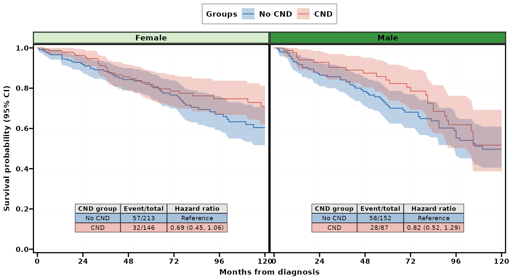{fig-alt="女性与男性两幅 KM 图，横轴为诊断后月数，纵轴明确标注生存概率和 95% CI。"}

### 隐藏标题

```r
f_axis_blank <- get_facet(f_axis,
  plot_params = modifyList(plot_base, list(xlab = "", ylab = "")),
  table_params = table_base)
f_axis_blank[["plt"]]
```

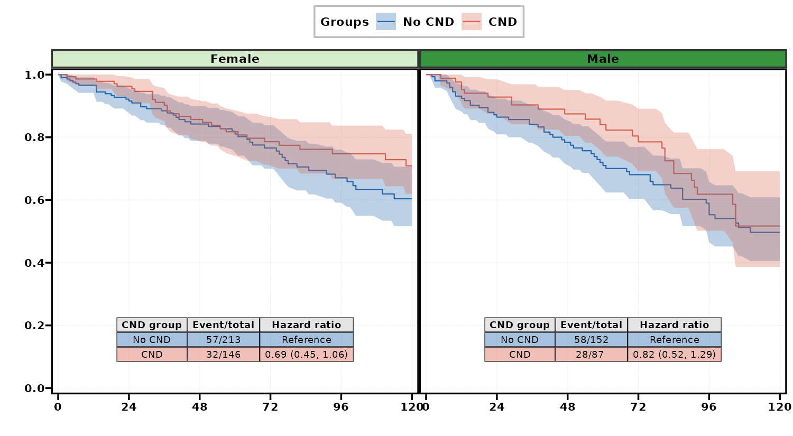{fig-alt="同一缓存 KM 图不显示横纵轴标题，保留轴刻度、曲线与 HR 表。"}

:::
<!-- facet-axis:end -->

同样设置也适用于 CIF；应把纵轴写为累积发生概率，并保留正确的事件编码。只改绘图 list 可重用结果，改模型、输入时间单位或数据则需要重新拟合。`plot_params` 现在拒绝未知、重复或未命名字段，拼写错误会显式报错。

## 相关页面与源码 {#references}

- [效应估计与森林图：get_eff 和 4 个绘图函数](forest-guide.qmd)
- [竞争风险 CIF 的 FGR 与 CSC：get_eff、get_cat、get_facet 基准](get-eff-cif-benchmark.qmd)
- [SHAP：get_shp 与 14 个绘图函数](../mlr/shap-guide.qmd)
- [ToyData 数据介绍](../toydata/index.qmd)
- [当前公开的 facet-get.R](https://github.com/HUI950319/RegR/blob/e7e8b10/R/facet-get.R) 与 [函数参考站点](https://hui950319.github.io/RegR/reference/index.html)
- [survival：Multi-state models and competing risks](https://cran.r-project.org/web/packages/survival/vignettes/compete.pdf)
