`get_flt()` 执行筛选并记录每一步人数，`plt_flo()` 把这些记录画成流程图，`plt_flo2()` 用阶段说明和队列人数绘制彩色研究流程。本页沿用 [MLR 的 SHAP 页](../mlr/shap-guide.qmd) 的展示方式：**实际图形配可运行代码，重要参数放在标签页中比较，点击图片可以放大**。

**版本与执行范围：** 接口按本机 RegR **0.1.3**（源码快照 `0add2bb`）核对，使用 WSL R **4.4.3** 实际执行筛选、绘制 **12 张 `plt_flo` 图和 8 张 `plt_flo2` 图**并验证 PDF 保存。网页展示保存的汇总结果；先运行下面的共用准备代码，再运行所选标签页代码即可复现。

**本次更新：** 保留上述历史流程图与筛选结果；按公开提交 `857677a` 新增 `save_plt()` 的 Cairo 设备说明，并实际导出、读回含 ≥、± 和希腊字母的 PDF。包版本仍为 0.1.3，设备默认值以安装源码为准。

## 示例数据与共用准备 {#data}

使用 RegR 自带的 `seer_thyroid_mtc_2026`：**4,387 人、92 列甲状腺髓样癌（MTC）示例数据**。它已经过预筛选并带有 15 步历史；本页在副本上清除该属性，从现有 4,387 人重新演示三步筛选。图中的起始人数因此对应这份预筛选数据。

<!-- flow-run: setup -->
```r
library(RegR)
library(ggplot2)

data("seer_thyroid_mtc_2026", package = "RegR")
start <- as.data.frame(seer_thyroid_mtc_2026)

# 仅为本页示例重新记录历史；真实分析应保留完整的原始筛选链。
attr(start, "flt") <- NULL
cohort <- get_flt(
  start,
  Age >= 18,
  Race %in% c("White", "Black"),
  !is.na(Tum) & Tum > 0
)

# get_flt 的条件表示“保留谁”；流程图上的标签表示“移除谁”。
reasons <- c(
  Age = "Age < 18 years",
  Race = "Race other than White or Black",
  Tum = "Tumor size missing or <= 0"
)

# 集中保存共用调用参数，标签页中用 modifyList() 局部覆盖。
flow_args <- list(
  data = cohort, inclu_row = 0,
  cohort = list(label = "Medullary thyroid carcinoma cohort"),
  analysis_label = "Patients eligible for analysis",
  name_map = reasons,
  exc_args = list(text_fs = 9),
  box_args = list(text_fs = 12, equal_width = TRUE)
)
```

页面中的 `flow_args` 交给 `do.call()` 展开为函数参数；`modifyList()` 合并局部设置，例如增加 `exc_args$pct` 时会保留已设定的 `text_fs = 9`。若直接调用 `plt_flo()`，命名 list 参数也支持局部覆盖，未指定的字段使用函数默认值。

## get_flt()：筛选、历史与返回对象 {#get-flt}

```r
get_flt(data, ...)
attr(cohort, "flt")
```

`...` 接收**不带参数名的筛选表达式**。每个表达式单独执行，产生一行记录；一条合并表达式则只有一行记录。以上示例依次保留成年人、White / Black 族裔、肿瘤大小非缺失且大于 0 的患者，实际人数为：

::: {.table-responsive}

| 步骤 | 保留条件 | 筛选前 `all_pat` | 保留 `res_pat` | 本步移除 `del_pat` | 累计移除 `del_pat_sum` |
|:--|:--|--:|--:|--:|--:|
| 1 | `Age >= 18` | 4,387 | 4,249 | 138 | 138 |
| 2 | `Race %in% c("White", "Black")` | 4,249 | 3,948 | 301 | 439 |
| 3 | `!is.na(Tum) & Tum > 0` | 3,948 | 3,606 | 342 | 781 |

:::

每一步均满足 `all_pat - res_pat = del_pat`，本例累计移除 **781 人**，最终保留 **3,606 人**。改变筛选顺序可能改变每一步的移除人数，因为每步只对上一步剩余的数据执行；不能把各条件在原始数据上分别统计的人数直接相加。

::: {.table-responsive}

| 返回值 / 历史字段 | 含义 |
|:--|:--|
| 返回值 | 带 `flt` 属性的筛选后数据框，单数据框路径为不可见返回；应赋值给对象 |
| `order` | 筛选顺序；已有历史时继续累计 |
| `var` | 表达式涉及的第一个数据列，用于名称映射 |
| `filter` | 实际筛选表达式的文本 |
| `label` | 内置字典提供的标签；不应代替对实际条件的核对 |
| `all_pat, res_pat` | 本步筛选前后人数 |
| `del_pat, del_pat_sum` | 本步及累计移除人数 |

:::

`get_flt()` 会打印历史，但打印出的 tibble 不是函数的返回对象。输入命名的数据框列表时，会返回逐个筛选后的列表；`plt_flo()` 接收其中一个数据框，不能直接把整个列表作为流程图数据。

## plt_flo()：共用设置与重要参数 {#plt-flo}

完整签名及默认值可查看 `formals(RegR::plt_flo)` 或 `?RegR::plt_flo`。以下设置最常影响流程图：

::: {.table-responsive}

| 参数 | 当前默认 / 行为 | 本页重点 |
|:--|:--|:--|
| `inclu_row` | `3`；前若干条历史归为未满足纳入条件 | `0` 把全部历史归入排除条件；`1` 将第一步与后两步分开 |
| `cohort` | `list(sel_his = "differentiated thyroid carcinoma", year_var = "Yea", label = NULL)` | 本例是 MTC，显式指定 `label`；自定义标签会覆盖组织学与年份标题，人数仍自动追加 |
| `analysis_label` | `NULL` 使用默认分析框标题 | 自定义文字；人数仍来自最终筛选数据 |
| `name_map` | `NULL` | 按历史中的 `var` 映射移除原因；不改变筛选条件或人数 |
| `count_style` | `"prefix"` | 四种人数位置 / 对齐方式，见下一节 |
| `exc_args` | 排除框的命名 list | 汇总、百分比、字号、缩进、留白与箭头 |
| `box_args` | `list(text_fs = 10, corner_radius = 0.08, equal_width = FALSE)` | 主框及分组等框的字号 / 圆角；等宽只作用于起始框和分析框 |
| `split_var / split_label / split_N` | 均为 `NULL` | 自动分组或手动提供标签与人数 |
| `split2` | `list(label = NULL, N = NULL, merge = NULL)` | 一一对应的第二级分组与汇合框 |
| `content_labels` | `NULL` | 分组之后的研究内容框 |
| `gap_args` | `list(group = NULL, content = 0.3)` | 分组 / 内容框间的横向间距，单位英寸 |
| `phase_labels, phase_style` | 无阶段标签；`"bracket"` | 纳排、分组、研究内容三个结构阶段；可切换为 `"box"` |
| `fixed_size` | `TRUE` | 保持推荐物理尺寸；`FALSE` 适配绘图区；正数指定宽度，单位英寸 |
| `return_data` | `FALSE` 返回 ggplot | `TRUE` 保留原数据用于管道 |
| `save` | `list()` 无保存副作用 | 命名 list 转交 `save_plt()`；只指定文件名时使用流程图推荐尺寸 |

:::

### 纳入与排除分开显示 {#inclusion}

`inclu_row` 只改变历史如何归类显示，不会重新筛选数据。本例 `inclu_row = 1` 将 138 人归为未满足年龄纳入条件，把后两步共 643 人归为满足排除条件，总移除人数仍为 781。

::: {.panel-tabset}

### 全部作为排除条件 {.unnumbered}

<!-- flow-run: basic -->
```r
do.call(plt_flo, flow_args)
```

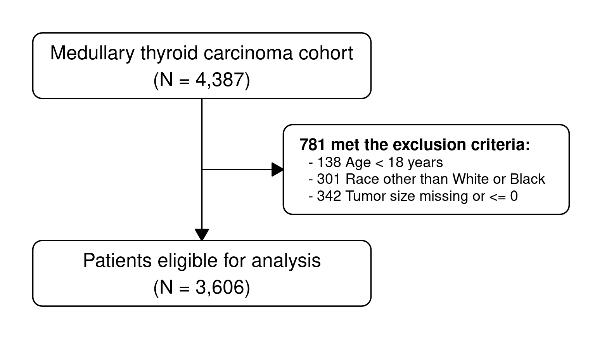{fig-alt="起始 4387 人，三步移除 138、301、342 人，最终 3606 人。"}

### 纳入与排除分开 {.unnumbered}

同时演示 `header_style = "n_suffix"` 的汇总格式和起始样本百分比。`bullet` 仅用于明细行；`summary_fs_bump` 的两项分别增加总汇总与分块汇总的字号。

<!-- flow-run: inclusion -->
```r
do.call(plt_flo, modifyList(flow_args, list(
  inclu_row = 1, count_style = "prefix_aligned",
  exc_args = list(
    header_style = "n_suffix", pct = TRUE, bullet = "- ",
    detail_indent = 3, count_gap = 3, sub_header_gap = 0.6,
    summary_fs_bump = c(2, 1)
  )
)))
```

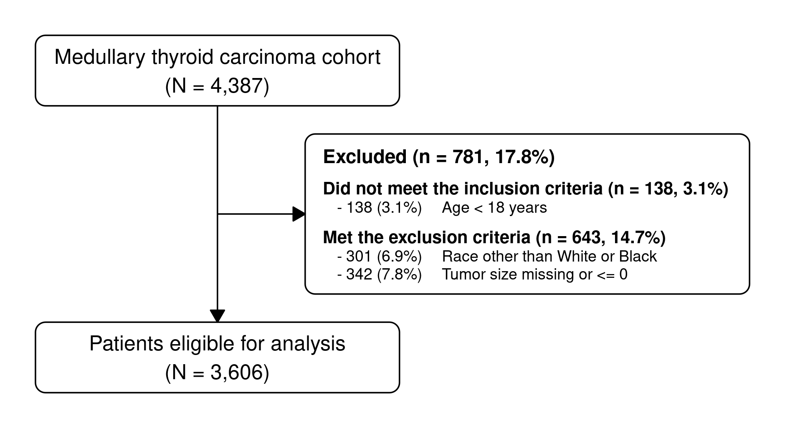{fig-alt="移除合计 781 人，占起始样本 17.8%；按纳入与排除原因分块。"}

:::

## 计数位置、对齐与百分比 {#counts}

四个标签页固定同一份筛选历史与 `pct = TRUE`，只改变 `count_style`。**百分比始终以起始 4,387 人为分母**，不是每一步筛选前的人数。138、301、342 人对应 3.1%、6.9%、7.8%，总计 17.8%；分别四舍五入后，明细百分比之和不一定等于显示的总百分比。

`prefix_aligned` 对齐人数后的原因列；`suffix_aligned` 对齐原因后的人数列。`exc_args$count_gap` 是这两列间的近似空格宽度，只在 `_aligned` 模式中生效；它不是英寸或像素。

::: {.panel-tabset}

### prefix：人数在前 {.unnumbered}

<!-- flow-run: count-prefix -->
```r
do.call(plt_flo, modifyList(flow_args, list(
  count_style = "prefix", exc_args = list(pct = TRUE)
)))
```

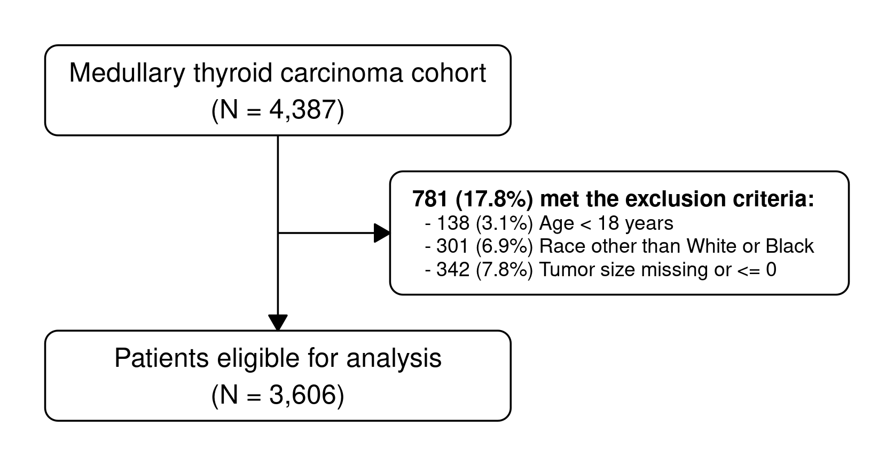{fig-alt="人数在前，百分比使用起始样本为分母。"}

### prefix_aligned：对齐原因 {.unnumbered}

<!-- flow-run: count-prefix-aligned -->
```r
do.call(plt_flo, modifyList(flow_args, list(
  count_style = "prefix_aligned",
  exc_args = list(pct = TRUE, count_gap = 3)
)))
```

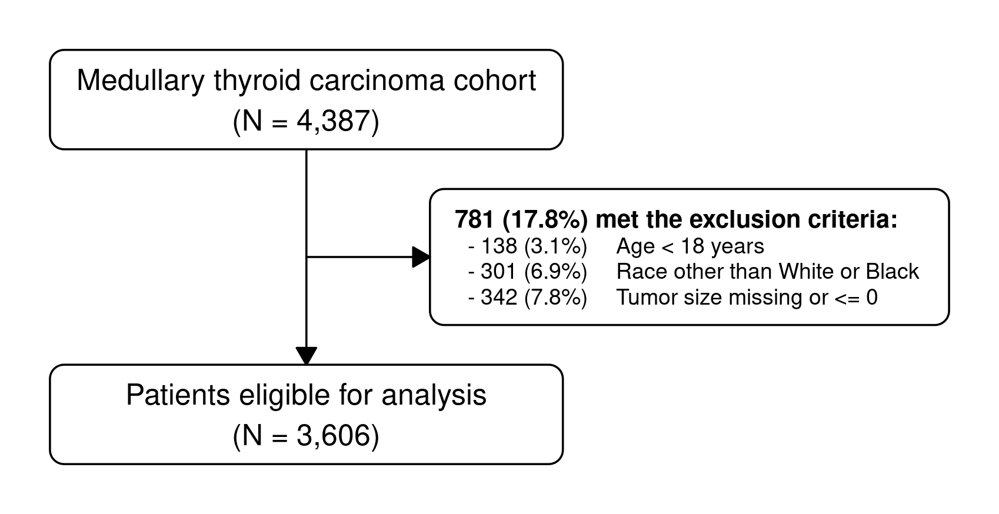{fig-alt="人数及百分比在前，原因从统一位置开始。"}

### suffix：人数在后 {.unnumbered}

<!-- flow-run: count-suffix -->
```r
do.call(plt_flo, modifyList(flow_args, list(
  count_style = "suffix", exc_args = list(pct = TRUE)
)))
```

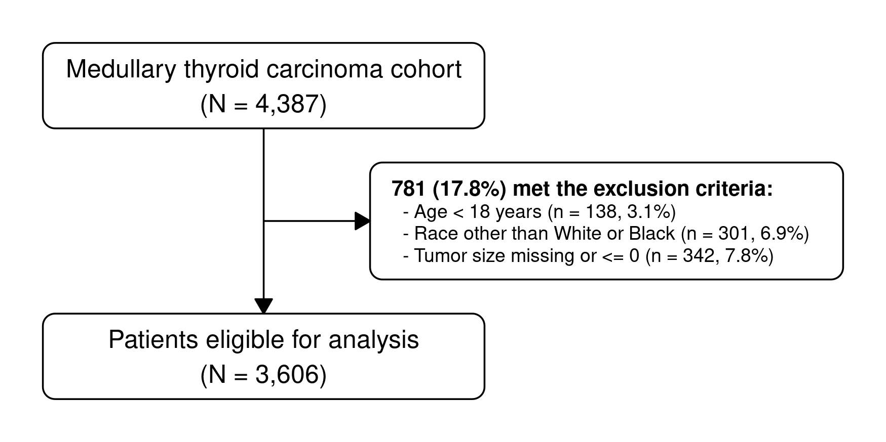{fig-alt="原因之后附人数和起始样本百分比。"}

### suffix_aligned：对齐人数 {.unnumbered}

<!-- flow-run: count-suffix-aligned -->
```r
do.call(plt_flo, modifyList(flow_args, list(
  count_style = "suffix_aligned",
  exc_args = list(pct = TRUE, count_gap = 3)
)))
```

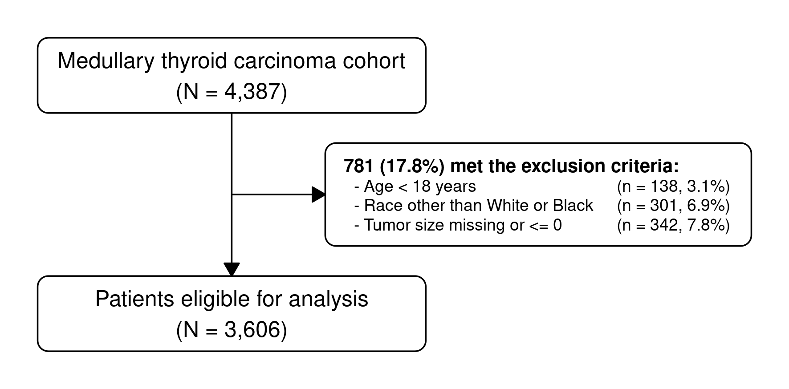{fig-alt="原因之后的 n 和百分比从统一位置开始。"}

:::

## 自动分组、手动计数与第二级分组 {#groups}

最终数据中 Female **2,114 人**、Male **1,492 人**。`split_var` 从数据自动生成标签与人数；若不提供 `split_var`，必须同时提供 `split_label` 和 `split_N`。提供自动分组列后，也可以只覆盖标签或人数。

手动人数必须为非负、有限的整数，长度与标签一致；函数检查结构，不替用户验证这些数字是否与分析数据一致。本页所有手动人数均从同一份 `cohort` 计算。

::: {.panel-tabset}

### 按列自动计数 {.unnumbered}

<!-- flow-run: split-auto -->
```r
do.call(plt_flo, modifyList(flow_args, list(split_var = "Sex")))
```

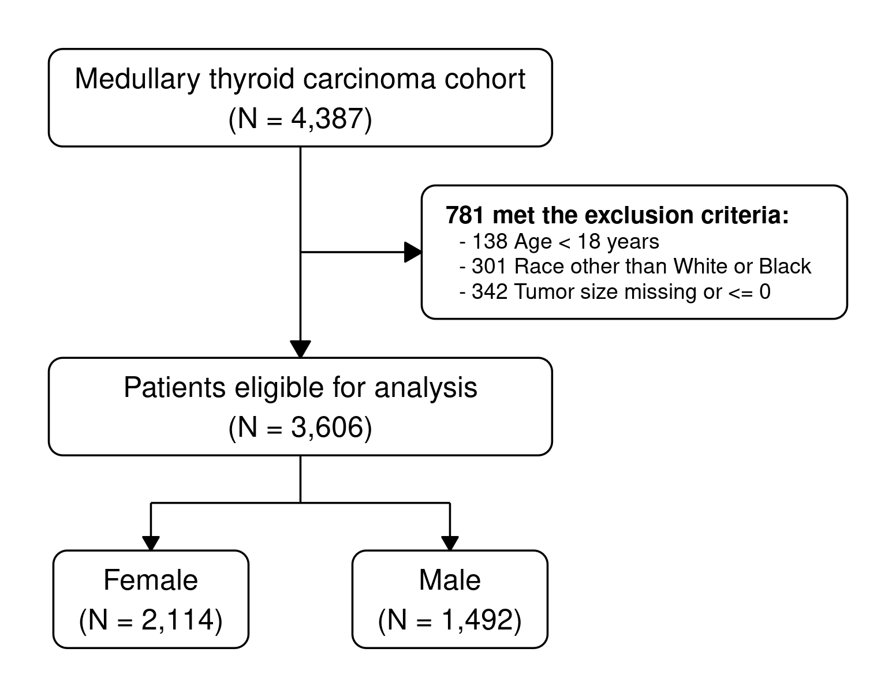{fig-alt="女性 2114 人，男性 1492 人，合计 3606 人。"}

### 手动指定标签与人数 {.unnumbered}

<!-- flow-run: split-manual -->
```r
groups <- c("Female", "Male")
group_n <- vapply(groups, function(sex) {
  sum(cohort[["Sex"]] == sex, na.rm = TRUE)
}, integer(1))

do.call(plt_flo, modifyList(flow_args, list(
  split_label = c("Female patients", "Male patients"),
  split_N = group_n,
  gap_args = list(group = 0.5)
)))
```

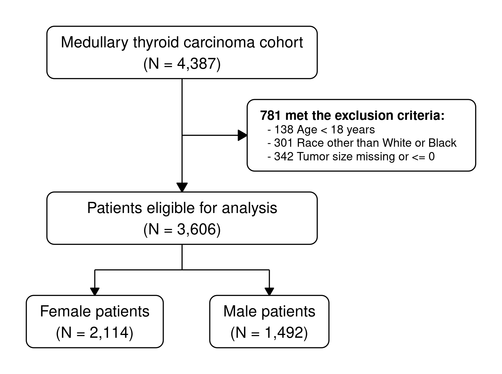{fig-alt="两个分组的标签改变，人数仍为女性 2114、男性 1492。"}

### 第二级分组与汇合 {.unnumbered}

第二行演示各性别中记录的随访时间满 60 个月的样本：Female **1,408 人**、Male **886 人**，合计 **2,294 人**。这只是二级分组的计数与排版示例，并未拟合生存模型。

`split2$label` 与第一行一一对应；`N = NULL` 沿用第一行人数，本例则显式给出重新计算的人数。`merge` 设置汇合框文字；研究内容框接在汇合框之后。

<!-- flow-run: split-second -->
```r
groups <- c("Female", "Male")
group_n <- vapply(groups, function(sex) {
  sum(cohort[["Sex"]] == sex, na.rm = TRUE)
}, integer(1))
followup_n <- vapply(groups, function(sex) {
  sum(cohort[["Sex"]] == sex & cohort[["time"]] >= 60, na.rm = TRUE)
}, integer(1))

do.call(plt_flo, modifyList(flow_args, list(
  split_label = c("Female patients", "Male patients"), split_N = group_n,
  split2 = list(
    label = c("Female: follow-up >= 60 months", "Male: follow-up >= 60 months"),
    N = followup_n,
    merge = sprintf("Follow-up subset (N = %s)",
                    format(sum(followup_n), big.mark = ",", trim = TRUE))
  ),
  content_labels = c("Clinical characteristics", "Survival endpoints"),
  gap_args = list(group = 0.5, content = 0.5),
  phase_labels = c("Patient selection", "Follow-up groups", "Study contents"),
  phase_style = "box"
)))
```

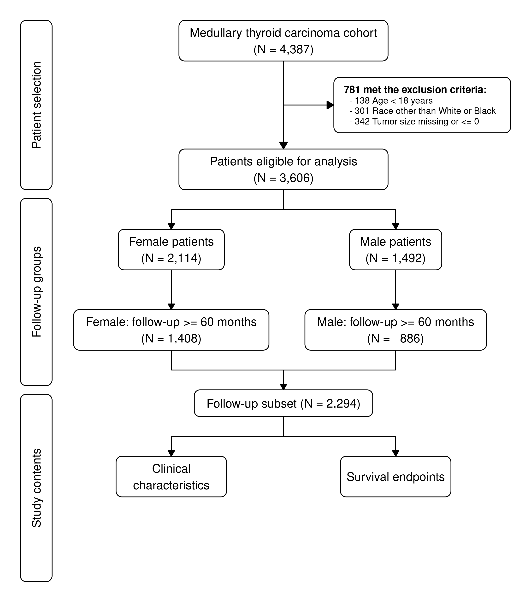{fig-alt="第二级女性 1408 人、男性 886 人，汇合为 2294 人，连接临床特征和生存结局内容框。"}

:::

## 研究内容与阶段标记 {#phases}

`content_labels` 在分组之后增加研究内容框；没有分组时不会单独生成这些内容框。省略 `split2$merge` 时，分组通过中央汇合连接线接到研究内容。`phase_labels` 按**纳排、分组、研究内容**的结构顺序给出，最多使用三个阶段。

两个标签页只切换 `phase_style`，其他设置相同。长阶段标签可用 `\n` 换行；阶段框需要容纳旋转后的文字，较长的标签会增加整图的推荐尺寸。

::: {.panel-tabset}

### 方括号阶段标记 {.unnumbered}

<!-- flow-run: phase-bracket -->
```r
do.call(plt_flo, modifyList(flow_args, list(
  split_var = "Sex",
  content_labels = c("Clinical characteristics", "Survival analysis"),
  phase_labels = c("Patient selection", "Sex subgroups", "Study contents"),
  phase_style = "bracket", count_style = "suffix_aligned",
  exc_args = list(pct = TRUE)
)))
```

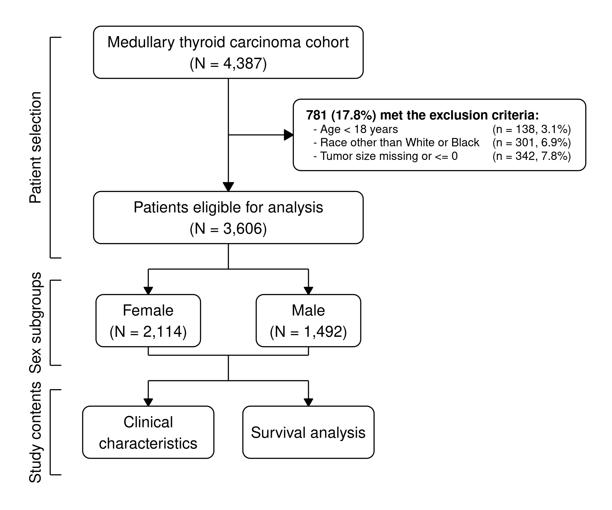{fig-alt="纳排、性别分组、研究内容使用左侧方括号和旋转标签。"}

### 阶段框 {.unnumbered}

<!-- flow-run: phase-box -->
```r
do.call(plt_flo, modifyList(flow_args, list(
  split_var = "Sex",
  content_labels = c("Clinical characteristics", "Survival analysis"),
  phase_labels = c("Patient selection", "Sex subgroups", "Study contents"),
  phase_style = "box", count_style = "suffix_aligned",
  exc_args = list(pct = TRUE)
)))
```

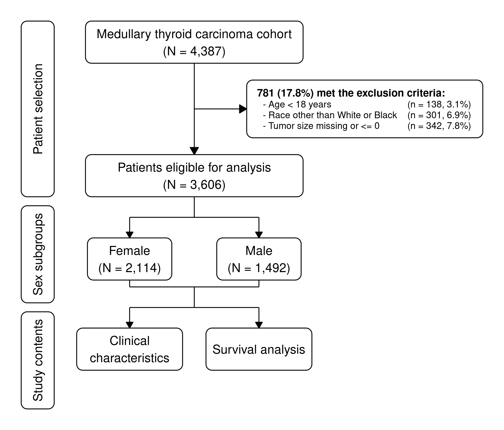{fig-alt="与方括号示例相同的计数、分组和研究内容，左侧改为阶段框。"}

:::

## 字号、框形、间距与 PDF 保存 {#layout-save}

::: {.table-responsive}

| 设置 | 单位 / 作用 |
|:--|:--|
| `exc_args$text_fs` | pt；排除明细字号，不控制主框字号 |
| `exc_args$summary_fs_bump` | pt；在排除明细字号基础上增加汇总字号，默认 `c(2, 1)` |
| `exc_args$bold_summary` | 默认 `TRUE`；只将汇总行加粗 |
| `exc_args$detail_indent` | 近似空格宽度；控制明细相对汇总行的缩进 |
| `exc_args$sub_header_gap` | 明细行高的倍数；增加纳入 / 排除分块标题前的间距 |
| `exc_args$right_gap` | 英寸；排除文字与框右边缘的内留白，默认 `0.14` |
| `exc_args$arrow_length` | 英寸；主轴到排除框的水平箭头长度，默认 `0.7` |
| `box_args$text_fs` | pt；主框、分组、汇合、研究内容与阶段标签字号 |
| `box_args$corner_radius` | 英寸；默认 `0.08`，`0` 为方角 |
| `box_args$equal_width` | 仅统一顶部队列框与分析框宽度；不把所有框统一为一个宽度 |
| `gap_args$group, gap_args$content` | 英寸；相邻分组框和研究内容框的横向间距 |

:::

下面在前一节的综合流程上增加箭头长度和排除框留白，并改用方角。只指定 PDF 文件名时，`plt_flo()` 会把该图的推荐宽高交给 `save_plt()`，无需套用通用的设备尺寸。

<!-- flow-run: layout-save -->
```r
# 可把 pdf_file 改为自己的输出路径。
pdf_file <- file.path(tempdir(), "cohort-flow.pdf")
p <- do.call(plt_flo, modifyList(flow_args, list(
  split_var = "Sex",
  content_labels = c("Clinical characteristics", "Survival analysis"),
  phase_labels = c("Patient selection", "Sex subgroups", "Study contents"),
  phase_style = "bracket", count_style = "suffix_aligned",
  exc_args = list(pct = TRUE, text_fs = 10, right_gap = 0.22, arrow_length = 0.9),
  box_args = list(corner_radius = 0),
  gap_args = list(group = 0.8, content = 0.5),
  fixed_size = TRUE,
  save = list(filename = pdf_file)
)))
attr(p, "flo_size")  # 推荐宽高，单位英寸
pdf_file             # 查看已保存的 PDF 路径
p
```

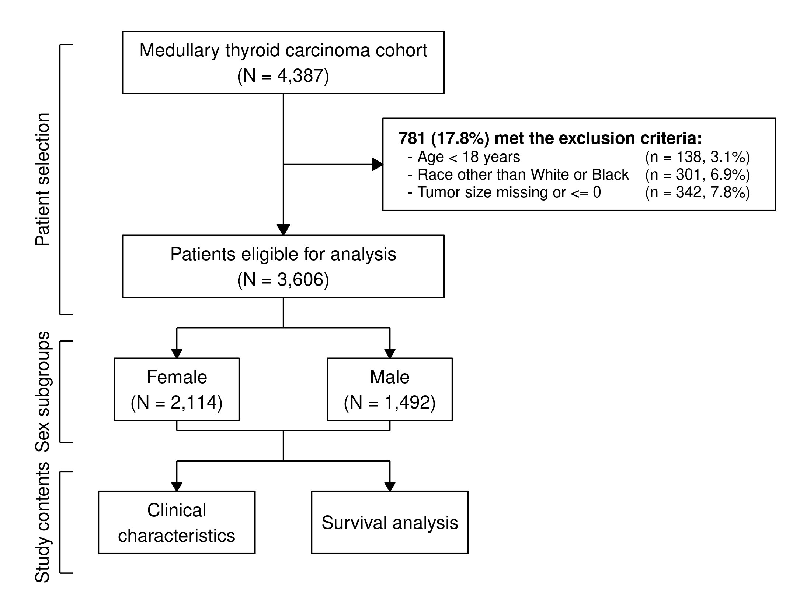{fig-alt="方角主框与分组框，排除框使用更长箭头和更大右侧留白，按推荐尺寸保存 PDF。"}

[下载此例生成的 PDF](images/flow-guide/cohort-flow.pdf)。

`fixed_size = TRUE` 保持布局的物理宽度；设备过窄会裁剪，放大设备主要增加空白。`FALSE` 可让图适配较小绘图区，文字仍使用设定的 pt 字号。正数可指定绘制宽度，单位英寸；图形通过固定纵横比例保持框形，不会任意拉伸高度。

保存 PNG 时也可读取推荐尺寸：

<!-- flow-run: save-png -->
```r
size <- attr(p, "flo_size")
ggsave(file.path(tempdir(), "cohort-flow.png"), p,
       width = size[["width"]], height = size[["height"]],
       units = "in", dpi = 300, bg = "white")
```

## 管道返回与复现检查 {#return-checks}

如果后续步骤还需要筛选后的数据，可使用 `return_data = TRUE`。保存功能仍然可以使用；默认的 `FALSE` 则返回 ggplot 对象供排版或保存。

<!-- flow-run: return-data -->
```r
same_data <- do.call(plt_flo, modifyList(flow_args, list(return_data = TRUE)))
stopifnot(identical(same_data, cohort))

h <- attr(cohort, "flt")
stopifnot(
  all(h[["all_pat"]] - h[["res_pat"]] == h[["del_pat"]]),
  all(cumsum(h[["del_pat"]]) == h[["del_pat_sum"]]),
  sum(h[["del_pat"]]) == nrow(start) - nrow(cohort)
)
```

复现时先确认安装版本支持页面使用的命名 list 字段。常见核对点包括：

- **历史是否连续：** 已有历史会继续追加，真实分析不要中途清除 `flt`。
- **标签是否准确：** `name_map` 按 `var` 映射；同一变量出现多次时会同步替换那些历史行的标签，不能把不同阈值都写成同一个移除原因。
- **人数是否可追溯：** 手动分组人数要从相应数据计算；更改显示参数不会重新筛选或验证分析队列。
- **内容与阶段是否有对应结构：** 研究内容依附于分组；阶段标签应对应实际存在的结构。
- **图是否被裁剪：** 使用推荐尺寸保存，或在小绘图区采用 `fixed_size = FALSE`；不要仅靠改变文字大小修正设备尺寸。

## plt_flo2()：彩色研究流程 {#plt-flo2}

`plt_flo2()` 的左侧是彩色阶段框，右侧是自动编号的说明框；还可以在顶部增加队列筛选，在左边增加旋转的阶段标签。输入是**阶段文字和队列人数**，`get_flt()` 的历史需要转换成 `cohorts` 后再传入。

:::: {.table-responsive tabindex="0" role="region" aria-label="表格，可横向滚动"}

| 函数 | 输入 | 主要展示内容 |
|:--|:--|:--|
| `plt_flo()` | 带 `flt` 历史的数据 | 连续筛选、排除明细、分组与汇合 |
| `plt_flo2()` | `stages` 与可选的 `cohorts` | 队列选择与数据准备、建模、验证、解释等研究阶段 |

::::

下面的建模阶段是**研究流程文字示例**；本页实际执行的是队列筛选和绘图，并未拟合、验证模型或计算 SHAP。

### 共用阶段与队列人数 {#flo2-setup}

先运行 [共用准备代码](#data)，再运行以下代码。`stages` 必须有名称：名称是阶段标题，值是该阶段的一条或多条说明；两者的顺序决定图中的顺序。

<!-- flow2-run: setup -->
```r
stages <- list(
  "Data preparation" = c(
    "Check variables, missingness and outcome definition",
    "Separate development and validation data before preprocessing",
    "Estimate transformations using development data only"
  ),
  "Model selection" = c(
    "Compare candidate algorithms with cross-validation",
    "Choose tuning parameters within the development data"
  ),
  "Model development" = "Fit the selected model with the chosen parameters",
  "Model validation" = c(
    "Evaluate discrimination and calibration on held-out data",
    "Report performance and uncertainty"
  ),
  "Model explanation" = "Summarize feature contributions with SHAP"
)

# 从前面三步连续筛选的历史提取互不重复的移除人数。
h <- attr(cohort, "flt")
excluded <- setNames(h[["del_pat"]], unname(reasons[h[["var"]]]))
cohort_spec <- list(
  label = "Medullary thyroid carcinoma cohort",
  N = nrow(start),
  exclude = excluded,
  final_label = "Patients eligible for analysis"
)
stopifnot(cohort_spec[["N"]] - sum(excluded) == nrow(cohort))

# 标签页用这份参数组合添加单队列与两个阶段标签。
workflow_args <- list(
  stages = stages,
  cohorts = cohort_spec,
  phase_labels = c("Patient selection", "Study workflow")
)
```

本例起始 **4,387 人**，三项移除人数分别为 **138、301、342**，最终 **3,606 人**。`cohorts$exclude` 会从 `N` 中减去各项人数，必须使用连续筛选的新增移除人数，避免把同一患者在多个条件下重复计数。

### 阶段、单队列与双队列 {#flo2-cohorts}

::: {.panel-tabset}

#### 仅研究阶段 {.unnumbered}

`cohorts = NULL` 是默认值，适合只展示研究步骤。左侧标题自动换行，右侧说明按条目编号，默认统一说明框高度。

<!-- flow2-run: flo2-basic -->
```r
plt_flo2(stages = stages)
```

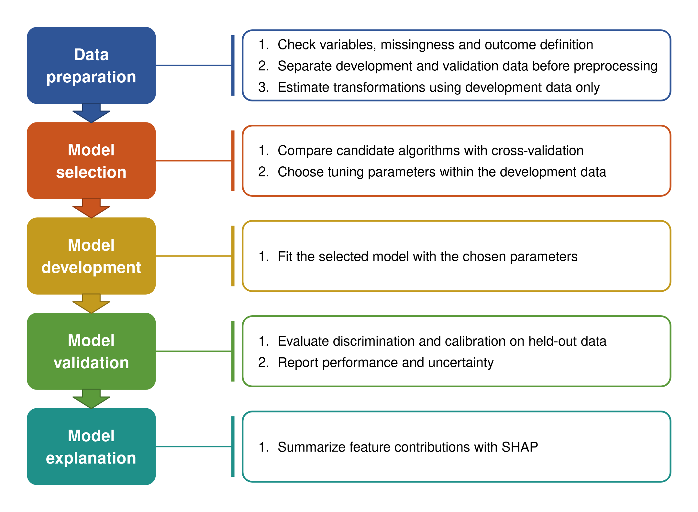{fig-alt="五个彩色阶段框用块状箭头连接，右侧对应编号说明，说明框默认等高。"}

#### 单队列与阶段标签 {.unnumbered}

单队列可直接传入一份 specification，无需再包一层 list。`phase_labels` 按**顶部队列区、下方研究步骤区**对应两个标签；它不会逐个标记五个建模步骤。

<!-- flow2-run: flo2-cohort -->
```r
do.call(plt_flo2, workflow_args)
```

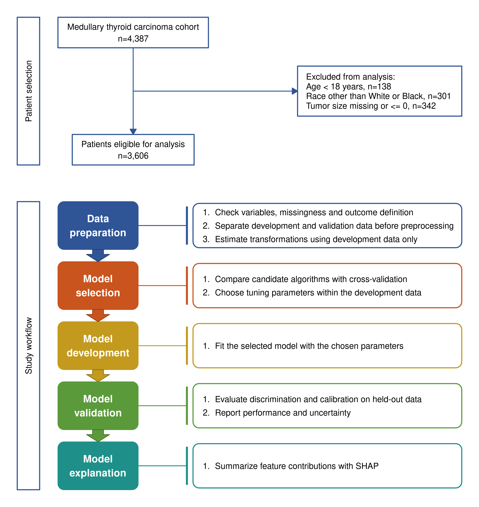{fig-alt="顶部队列从4387人排除三项合计781人后纳入3606人，下方绘制五个研究步骤。"}

#### 双队列并列 {.unnumbered}

传入外层 list 后，各队列从左到右独立绘制。本例分别在原始女性、男性子集中重新执行相同筛选；两个队列均是同一示例数据的性别子集，不能据此称为独立外部验证队列。

<!-- flow2-run: flo2-cohorts -->
```r
sex_cohorts <- lapply(c("Female", "Male"), function(sex) {
  d <- start[start[["Sex"]] == sex & !is.na(start[["Sex"]]), ]
  attr(d, "flt") <- NULL
  kept <- get_flt(d, Age >= 18, Race %in% c("White", "Black"),
                  !is.na(Tum) & Tum > 0)
  history <- attr(kept, "flt")
  removed <- setNames(history[["del_pat"]],
                      unname(reasons[history[["var"]]]))
  stopifnot(nrow(d) - sum(removed) == nrow(kept))
  list(label = paste(sex, "MTC patients"), N = nrow(d), exclude = removed,
       final_label = paste(sex, "patients included"))
})
plt_flo2(stages = stages, cohorts = sex_cohorts,
         phase_labels = c("Patient selection", "Study workflow"))
```

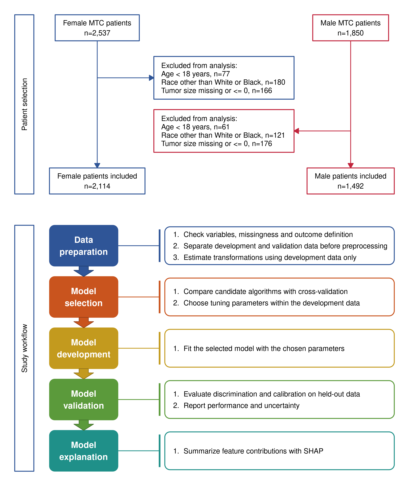{fig-alt="女性与男性子队列各自显示起始人数、三项排除人数和最终人数，女性2114人、男性1492人。"}

:::

### 配色、换行与框高 {#flo2-boxes}

::: {.panel-tabset}

#### 配色与方角 {.unnumbered}

`palette` 同时控制阶段框、块状箭头、横线和说明框边框；颜色不足时循环使用。队列默认取调色板首尾颜色，也可通过每个 specification 的 `color` 单独指定。`corner_radius = 0` 把阶段框和说明框改成方角；队列与阶段标签框始终为方角。

<!-- flow2-run: flo2-palette -->
```r
do.call(plt_flo2, modifyList(workflow_args, list(
  palette = c("#264653", "#287271", "#8E3B46"),
  cohorts = list(color = "#65518A"),
  box_args = list(corner_radius = 0)
)))
```

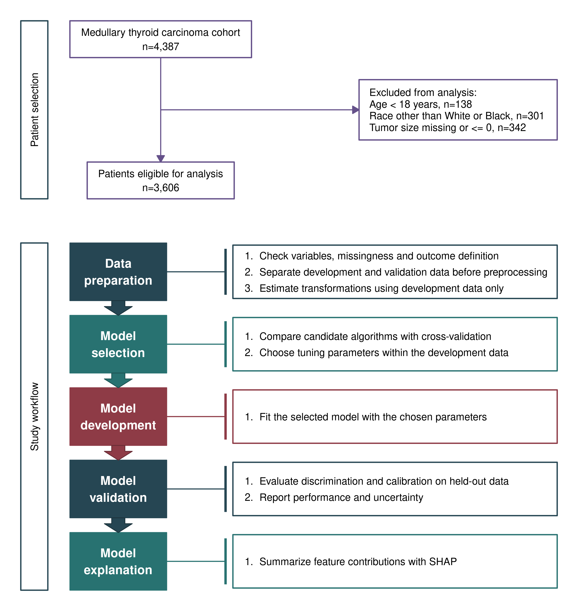{fig-alt="五个研究阶段循环使用三色调色板，顶部队列使用紫色，阶段与说明框均为方角。"}

#### 控制文本换行 {.unnumbered}

`stage_width` 指定标题内宽；`desc_width` 与 `exc_width` 是说明、排除文字的换行上限，单位都是英寸。后两者并不强制框宽：实际框仍按最长的换行文本贴合。排除行的宽度包含末尾的 `n=...`，续行自动悬挂缩进。

<!-- flow2-run: flo2-wrap -->
```r
do.call(plt_flo2, modifyList(workflow_args, list(
  box_args = list(stage_width = 1.5, desc_width = 3.2, exc_width = 2.2)
)))
```

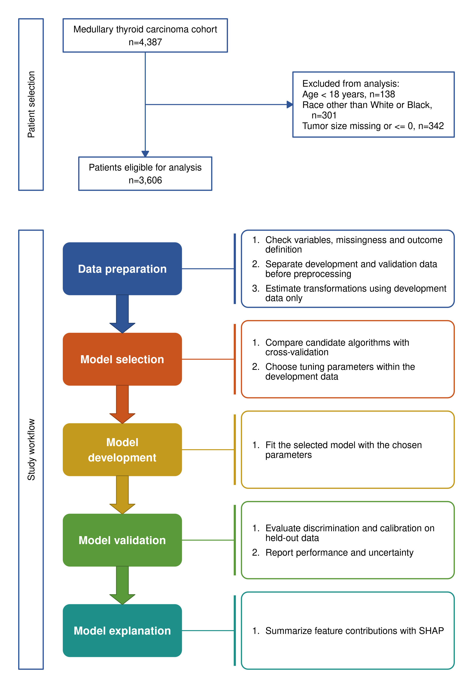{fig-alt="标题使用1.5英寸内宽，说明按3.2英寸上限换行，排除原因按2.2英寸上限换行并保留缩进。"}

#### 说明框随内容收紧 {.unnumbered}

与 [默认等高示例](#flo2-cohorts) 比较：`equal_height = FALSE` 让每个说明框贴合自身内容，单条说明的框更矮，多条说明的框更高。阶段框仍保持统一高度，垂直箭头随行高变化。

<!-- flow2-run: flo2-height -->
```r
plt_flo2(stages = stages, box_args = list(equal_height = FALSE))
```

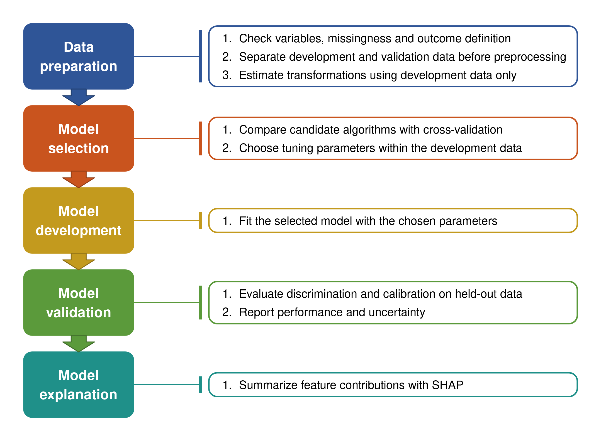{fig-alt="数据准备阶段的三项说明框较高，模型开发与解释的单项说明框较矮。"}

:::

### 字号、间距与保存 {#flo2-save}

::: {.panel-tabset}

#### 加大字号与间距，保存 PDF {.unnumbered}

字号用 **pt**，宽度和间距用**英寸**。增大 `text_fs` 时，应同步增大 `gap_args$line`，它不会自动随字号调整。

<!-- flow2-run: flo2-spacing-save -->
```r
pdf_file2 <- file.path(tempdir(), "flo2-workflow.pdf")
p_flo2 <- do.call(plt_flo2, modifyList(workflow_args, list(
  box_args = list(text_fs = 12, stage_fs = 14, desc_width = 4.8),
  gap_args = list(connector = 1, row = 0.35, line = 0.20,
                  item = 0.32, exclude = 0.8, section = 0.8),
  fixed_size = TRUE,
  save = list(filename = pdf_file2)
)))
attr(p_flo2, "flo_size")  # 推荐宽高，单位英寸
pdf_file2
p_flo2
```

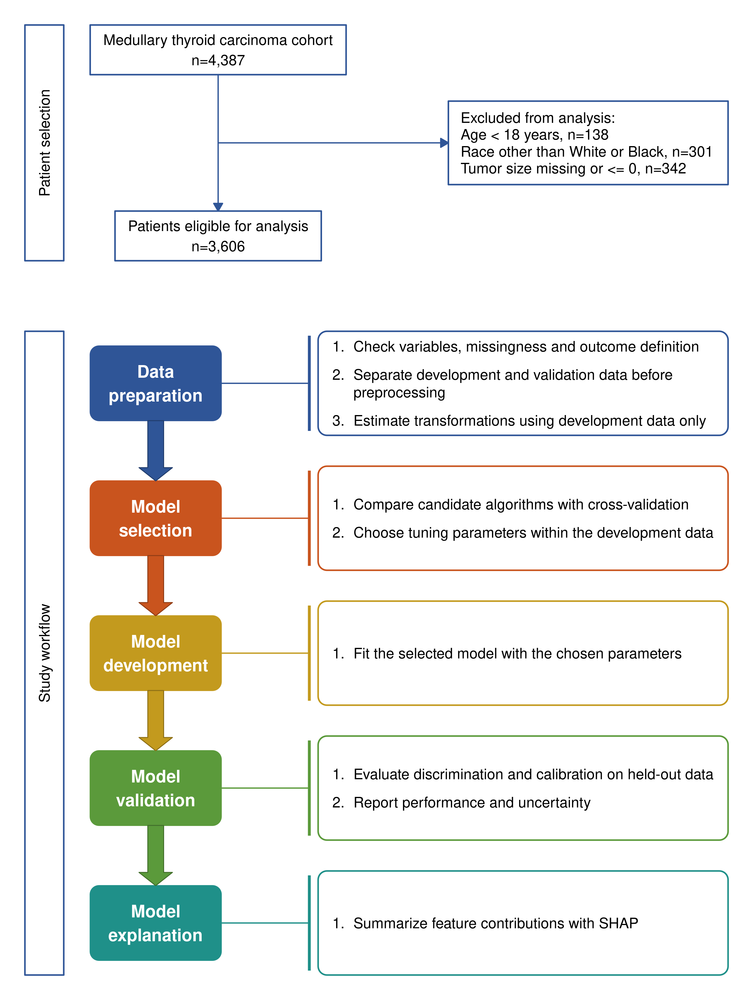{fig-alt="研究流程使用12pt正文字号和14pt阶段标题，扩大连线、行、条目与队列区间距。"}

[下载此例生成的 PDF](images/flow-guide/flo2-workflow.pdf)。只指定文件名时，保存功能自动采用 `flo_size` 的推荐尺寸；`save = list()` 或 `NULL` 不保存文件。

#### 小设备整体缩放 {.unnumbered}

默认 `fixed_size = TRUE` 的对象带有 `flo2_plot` 打印方法：小设备会把**图形、文字和线宽一起缩小**，完整显示布局。下面把单队列示例保存到 4 × 4 英寸 PNG；点击图片可放大查看。

<!-- flow2-run: flo2-small-device -->
```r
p_small <- do.call(plt_flo2, workflow_args)
ggsave(file.path(tempdir(), "flo2-small-device.png"), p_small,
       width = 4, height = 4, units = "in", dpi = 300, bg = "white")
p_small
```

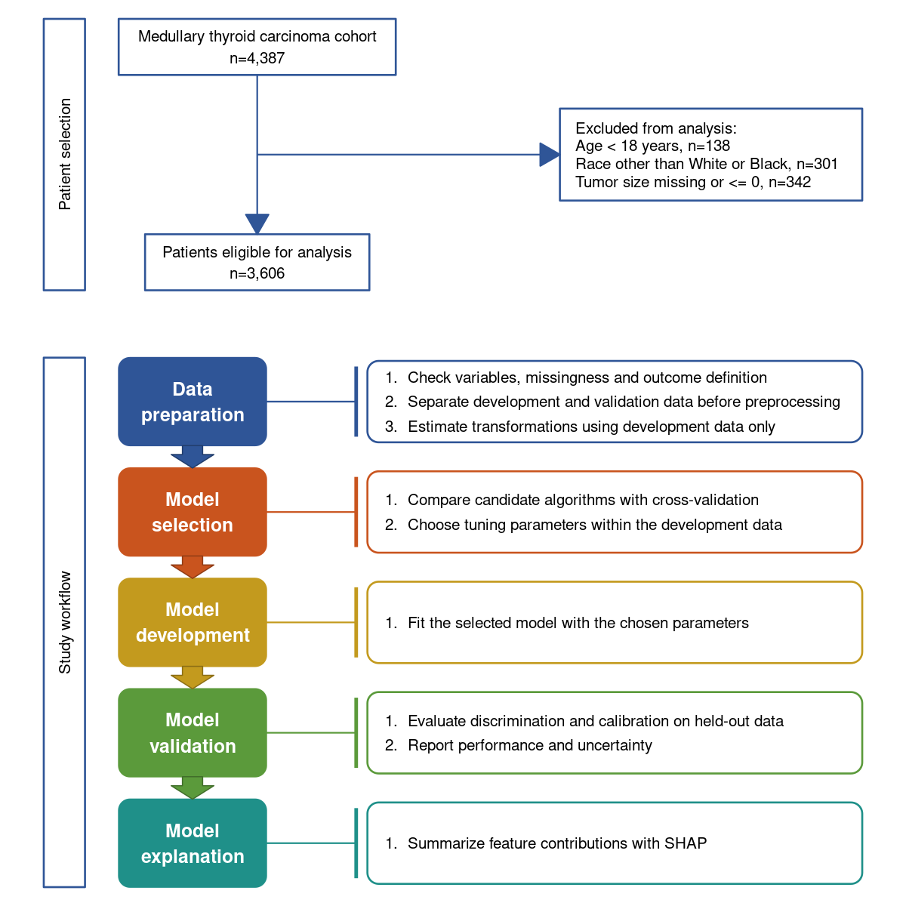{fig-alt="默认固定尺寸研究流程在4乘4英寸设备上整体缩放，文字、框和箭头保持相对比例。"}

`fixed_size = FALSE` 返回普通 ggplot，布局随设备变化，但文字保留 pt 字号，可能超出框。正数可指定固定面板宽度，单位英寸；常规保存建议使用默认值和 `flo_size`，需要更小的输出时直接指定保存设备的宽高。

:::

:::: {.table-responsive tabindex="0" role="region" aria-label="表格，可横向滚动"}

| 参数 | 默认值与作用 |
|:--|:--|
| `gap_args$connector` | `0.8` 英寸；阶段框到说明框前竖线的横向连线长度 |
| `gap_args$row` | `0.2` 英寸；相邻阶段行的最小垂直间距 |
| `gap_args$line` | `0.145` 英寸；同一说明条目内的换行间距，不影响队列和阶段标签的行距 |
| `gap_args$item` | `0.22` 英寸；当前条目末行到下一条目首行的间距 |
| `gap_args$exclude` | `0.5` 英寸；队列主轴到排除框的最小箭头长度 |
| `gap_args$section` | `0.6` 英寸；队列区到研究步骤区的垂直间距 |
| `box_args$text_fs / stage_fs` | `10 / 12` pt；说明、队列和阶段标签 / 彩色阶段标题的字号 |
| `box_args$stage_width` | `NULL`；按最宽单词自动换行；数值指定标题内宽 |
| `box_args$desc_width / exc_width` | `5.5 / 3.5` 英寸；说明 / 排除文字的换行上限 |
| `box_args$corner_radius` | `0.1` 英寸；阶段框与说明框圆角半径 |
| `box_args$equal_height` | `TRUE`；说明框统一为最高说明框的高度 |

::::

## PDF 设备与特殊字符 {#pdf-device}

当前 `RegR::save_plt()` 默认 `device = "cairo"`，支持普通文本标签里的 ≥、± 和希腊字母，并嵌入字体。宽高以英寸计，默认 10 × 11；文件名没有扩展名时补 `.pdf`，其他扩展名会报错。图形采用测量布局时，优先用前面的推荐尺寸。

```r
p_unicode <- ggplot(data.frame(x = 1:3, y = c(0.8, 1, 1.2)), aes(x, y)) +
  geom_point(size = 3) + theme_minimal(base_size = 13) +
  labs(title = "Unicode labels: α, β, Δ ± 1", x = "Value ≥ 1", y = "Ratio")
pdf_unicode <- file.path(tempdir(), "unicode-cairo.pdf")
RegR::save_plt(p_unicode, filename = pdf_unicode, width = 7, height = 4.5)
```

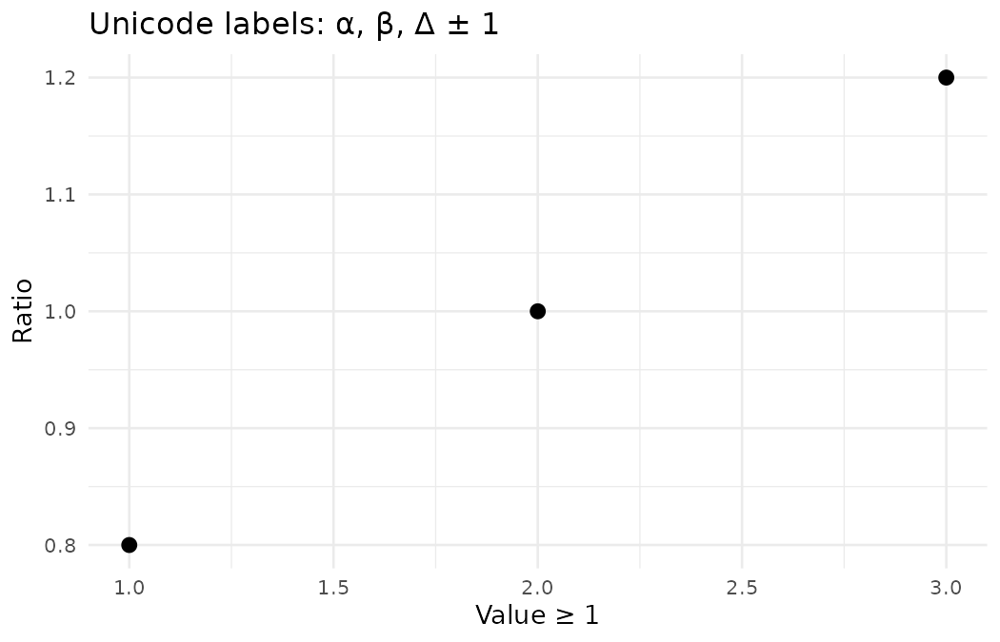{fig-alt="散点图标题含 α、β、Δ 和 ±，横轴标题含 ≥，对应 PDF 已读回确认字符与嵌入字体。"}

[下载本例 Cairo PDF](images/flow-guide/unicode-cairo.pdf)。本次读回确认 **1 页、7 × 4.5 英寸**，文本提取包含上述字符，字体已嵌入；PNG 用于网页预览，PDF 为独立矢量输出。

需要旧版设备时，在独立保存调用中使用 `device = "pdf"`。它通常使用未嵌入的 base-14 字体，不能可靠保存普通字符串中的 Unicode；plotmath 表达式仍可用于两种设备。R 没有 Cairo 支持时，默认调用会发出警告并回退到 pdf。

函数内部的 `save` 接受哪些子项，应看该函数的帮助页；例如 `plt_couple()` 当前只接受 filename / width / height，选择设备可先取得图，再调用 `save_plt()`。`save = list()` / NULL 不保存；保存不会代替函数原本的返回对象。

源码：[PDF 保存与设备选择](https://github.com/HUI950319/RegR/blob/857677a/R/plot-save.R)。相关示例见 [RPA 直接保存](rpa-guide.qmd#rpa-time-unit)。

本站只提供上述汇总表、图形和调用代码，不提供患者级数据下载。
