先用 `get_eff()` 生成效应表，再根据展示目的选择森林图函数。本页沿用 [SHAP 示例页](../mlr/shap-guide.qmd) 的方式：每个绘图入口配实际图形和代码，关键参数放在标签页中比较；点击图片可以放大。

**版本与执行范围：** 接口按本机 RegR **0.1.3**（源码快照 `0add2bb`）核对，使用 WSL R **4.4.3** 实际拟合模型并绘制 **24 张原有图**；本次另运行并增加 set_eff 的三张图与一张数值表。页面显示已保存的结果；代码可在装有 RegR、ToyData 及相关依赖的 R 环境中复现。

原有图和数值保留 2026-10-01 的执行记录。下方 `cat_var_rpa` 补充示例按 2026-10-05 源码 `3411eb0` 实际运行，使用另外的 800 人 MTC 演示样本。

## 示例数据与读图规则 {#data}

使用 `ToyData::toy_ptc_m1_cnd`，即之前整理的 **598 人、95 列 M1 乳头状甲状腺癌（PTC）队列**。数据来源、筛选流程及字段边界见 [ToyData 数据介绍](../toydata/index.qmd)。CND / No CND 是原研究依据登记的淋巴结字段定义的操作性分组。

::: {.table-responsive}

| 内容 | 本页的数据与设置 |
|:--|:--|
| CND / No CND | 233 / 365 人；分析副本将 **No CND 设为参考水平** |
| 结局 | 甲状腺癌死亡 175 人，其他原因死亡 95 人，存活 / 删失 328 人 |
| 随访 | `time`，单位月；范围 1–239 |
| 主要暴露与亚组 | `N_4`；`Sex` 与 `age_55` |
| 年龄分组 | `Below 55` 为 <55 岁，`Above 55` 为 ≥55 岁，沿用数据标签 |
| 调整变量 | `Age`、`Sex`、`Race`、`Tum_3`；当前亚组变量由函数从该层的调整项中处理 |
| 概率时间点 | 60 月；原有图使用 95% CI，set_eff 小节另示 90% 显示区间 |
| 缺失值 | 本页使用的分析列无缺失；其他原始列仍可能有缺失，未对整份数据插补 |

:::

### 比值、概率差与概率

::: {.table-responsive}

| 图上的量 | 含义 | 无效应值 / 范围 |
|:--|:--|:--|
| HR | Cox 模型中的危险比；本页 CND 相对 No CND | 1 |
| sHR | Fine–Gray 模型中的亚分布危险比 | 1；不能当作普通 HR 或风险比 |
| OR | Logistic 模型中的优势比；本页不拟合此模式 | 1 |
| $\Delta S(60)$ | `S(CND) - S(No CND)` | 0；正值表示 CND 组的 S 更高 |
| $\Delta CIF(60)$ | `CIF(CND) - CIF(No CND)` | 0；正值表示 CND 组的目标事件概率更高 |
| `S(60)` / `CIF(60)` | 各组在 60 月的生存概率 / 目标事件累积发生概率 | 0–1 |

:::

概率和概率差都以 **0–1 的原始比例**显示。例如 $\Delta S=0.10$ 表示 10 个百分点；它不是 HR，也不是相对增加 10%。比值图可用对数轴，概率差图使用线性轴。

本页 `surv = TRUE` 以 DSS 为事件，将其他原因死亡作为删失，得到疾病特异生存尺度；`surv = FALSE` 将其他原因死亡作为竞争事件，得到甲状腺癌 CIF。存在竞争事件时，**这里的 DSS 生存概率并不等于 $1-CIF_{\mathrm{DSS}}$**。Aalen–Johansen 和竞争风险状态概率的定义可参见 [survival 官方竞争风险教程](https://cran.r-project.org/web/packages/survival/vignettes/compete.pdf)。

::: {.callout-note}
这些图展示观察性队列的模型结果和接口行为，不能仅凭 HR、P 值或某一亚组的星号认定 CND 的因果效果。亚组间差异应检查交互检验，不能用“一组显著、另一组不显著”代替交互检验。图中的通用 `Low risk / High risk` 箭头是绘图模板标签；读概率差时，应以上表的组别方向和正负值为准。
:::

## get_eff()：从分析设置到结果表 {#get-eff}

`get_eff()` 负责模型拟合、概率估计、亚组与分层组织，返回带有绘图元数据的结果表。森林图函数读取这些表中的数值，调整布局和文字。

### 当前接口

```r
get_eff(
  data,
  cat_var = NULL, sub_var = NULL, adj_var = NULL,
  surv = TRUE,
  methods = c("unadj", "direct"),
  methods_haz = methods, methods_sur = methods,
  conf_level = 0.95,
  cif_args = list(model = c("FGR", "CSC")),
  time = 120, show_surdiff = TRUE,
  group_1 = NULL, group_2 = NULL,
  all = "Age",
  cat_var_combine = NULL, cat_var_rpa = NULL, split_var = NULL,
  direct_replace = NULL,
  subgroup_model = c("separate", "interaction")
)
```

### 变量与任务选择

::: {.table-responsive}

| 参数 | 作用与选择方式 |
|:--|:--|
| `data` | 数据框；列名与结局编码必须符合所选任务 |
| `cat_var` | 主要暴露或待估计变量的列名向量；分类变量的首水平为参考组。数值型且不同取值超过 5 个时按连续变量处理 |
| `sub_var = NULL` | 单因素 / 多因素变量效应表；`direct` 的多因素模型同时包含选定的 `cat_var` 和调整项 |
| `sub_var` 非空 | 主要暴露在各亚组中的效应；不是把亚组变量本身当成暴露 |
| `adj_var` | 调整项列名；主要暴露、外层分层变量及当前亚组变量不会重复充当同一项调整变量 |
| `surv = TRUE` | Cox 路径：要求 `time` 与 0/1 的 `DSS` |
| `surv = FALSE` | 竞争风险路径：`time`、`status` 与 `event`；本页 0 = 删失，1 = 甲状腺癌死亡，2 = 其他原因死亡 |
| `surv = "结局列名"` | 二分类 Logistic 路径，输出 OR；必须核对事件与参考编码 |
| `time` | 指定概率 / 概率差的时间点；不代表把 Cox 随访截断到这个时间 |
| `group_1, group_2` | 概率差的组别方向；本页明确指定 CND 减 No CND |

:::

连续暴露主要用于比值估计，不能直接套用分类暴露的组间概率差流程。分类变量水平、事件编码、时间单位应在拟合前确认；绘图时改标签不会重新定义参考组或重算模型。

### 方法与估计目标

::: {.table-responsive}

| 方法 | `haz_*` 比值表 | `sur_*` 概率与差值表 | 需要理解的边界 |
|:--|:--|:--|:--|
| `unadj` | 未调整的 Cox / Fine–Gray / Logistic 效应 | 生存模式 KM；竞争风险模式 Aalen–Johansen | 描述性组间比较 |
| `direct` | 协变量调整后的回归系数 | 结局模型标准化后的组别概率与差值 | 调整后的回归系数与标准化概率是不同的量 |
| `iptw` | 倾向评分加权后的效应 | 加权概率与差值 | 当前默认二分类与多分类均以 ATE 为目标；须检查权重、重叠与平衡 |
| `psm` | 匹配后的效应 | 匹配后概率与差值 | 当前二分类匹配为 1:1、ATT；有效分析样本可能减少 |

:::

`methods` 是两个结果家族的默认方法列表。若只要比值，使用 `show_surdiff = FALSE`；若只要概率结果，使用 `methods_haz = character()` 并指定 `methods_sur`。本页实际比较 **unadj 与 direct**；加权 / 匹配示例还需要完成相应设计和诊断。

`cif_args` 仅控制 **竞争风险的 direct 概率路径**：`FGR` 使用 Fine–Gray 标准化，并在当前实现中采用 bootstrap（50 次）；`CSC` 使用各原因 Cox 模型的标准化与解析方差。这不把 `haz_direct` 的 sHR 改成原因特异 HR。后端、耗时与区间的详细比较见 [CIF 的 FGR 与 CSC](get-eff-cif-benchmark.qmd)。本页竞争风险概率图实际使用未调整的 Aalen–Johansen 结果。

### 亚组模型、交互与外层分层

::: {.table-responsive}

| 设置 | 实际分析方式 | 适合展示 |
|:--|:--|:--|
| `subgroup_model = "separate"` | 在各亚组内分别拟合暴露效应；交互指标另由交互模型计算 | 各亚组分别建模的结果 |
| `subgroup_model = "interaction"` | 对每个亚组变量建立暴露 × 亚组模型，再提取各水平的简单效应和交互指标 | 同一模型中的亚组效应与层级交互 |
| `split_var = "age_55"` | 先分成两个年龄层，各层独立分析，再合并结果表并保留分层列 | 年龄块内的 Sex 亚组结果 |
| `all` | 控制二分类亚组路径的总体行；默认 `"Age"` 要求数据有 Age。此路径可用 NULL 省略总体行 | 汇总行；不等于“所有协变量” |

:::

本页采用 `interaction` 生成可比较的简单效应、全局交互 P 值和层级交互信息。当前该模式要求单个二分类主要暴露，亚组至少有两个观测水平，且比值方法为 `unadj` / `direct`。多水平亚组的 `p_inter` 是整体 Wald 检验；`stra_p_inter` 比较某层与亚组参考层的交互。

`MS` 为乘法交互指标，参考值为 1；`RERI` 为模型比值尺度计算的加法交互指标，参考值为 0。Cox / Fine–Gray 下，它们来自 HR / sHR 的组合，不能直接称为绝对风险尺度的交互。调整后的全局 Sex 交互 P 值在本页为 0.932，年龄组为 0.182；切换布局不会改变这些数值。

`split_var` 与 `sub_var` 有不同含义：前者让模型在各外层数据子集中分别拟合，后者定义某个分析中的效应修饰变量。缺失的分层值不进入该层分析，层内不变的调整变量会被去除。

另有两个针对特定任务的参数：`cat_var_combine` 将多列组合为联合分类变量，联合类别本身不等于交互检验；`direct_replace` 为单因素 / 多因素比值路径指定目标变量的调整组合，不同步改变概率表。

### 多个分期方案分别调整 {#cat-var-rpa}

`cat_var_rpa` 用于比较多列分期方案：每一列与 `adj_var` 分别建立 direct 模型。普通 `cat_var = c(...)` 在多因素路径中把这些列同时放入模型；`cat_var_combine` 则交叉成联合暴露。三者回答的问题不同。`cat_var_rpa` 与 `cat_var_combine` 不能同时指定；若同时提供 `cat_var`，函数提示并优先采用 `cat_var_rpa`。

下面使用 RegR 自带 MTC 队列，演示分期与大小分组的独立模型，未使用前面的 598 人 PTC 队列。

```r
d_scheme <- as.data.frame(RegR::seer_thyroid_mtc_2026)
used <- c("time", "DSS", "Age", "Tum", "Sex", "Race", "T_stage", "Sur")
d_scheme <- droplevels(d_scheme[complete.cases(d_scheme[used]) &
  d_scheme[["time"]] > 0 & d_scheme[["Tum"]] > 0 & d_scheme[["Tum"]] < 200, ])
d_scheme[["DSS"]] <- as.integer(as.character(d_scheme[["DSS"]]))
d_scheme[["Sex"]] <- factor(d_scheme[["Sex"]], levels = c("Female", "Male"))
d_scheme[["stage"]] <- factor(ifelse(d_scheme[["T_stage"]] %in% c("T1", "T2"),
                                      "Early", "Other"))
d_scheme[["size_stage"]] <- cut(d_scheme[["Tum"]], c(0, 20, 40, Inf),
                                  labels = c("Small", "Medium", "Large"))
set.seed(20261005)
d_scheme <- droplevels(d_scheme[sample.int(nrow(d_scheme), 800L), ])
eff_scheme <- run_quiet(get_eff(d_scheme,
  cat_var_rpa = c("stage", "size_stage"), adj_var = c("Age", "Sex"),
  show_surdiff = FALSE))
plt_eff(eff_scheme, show.sur = FALSE, fixed_size = FALSE)
```

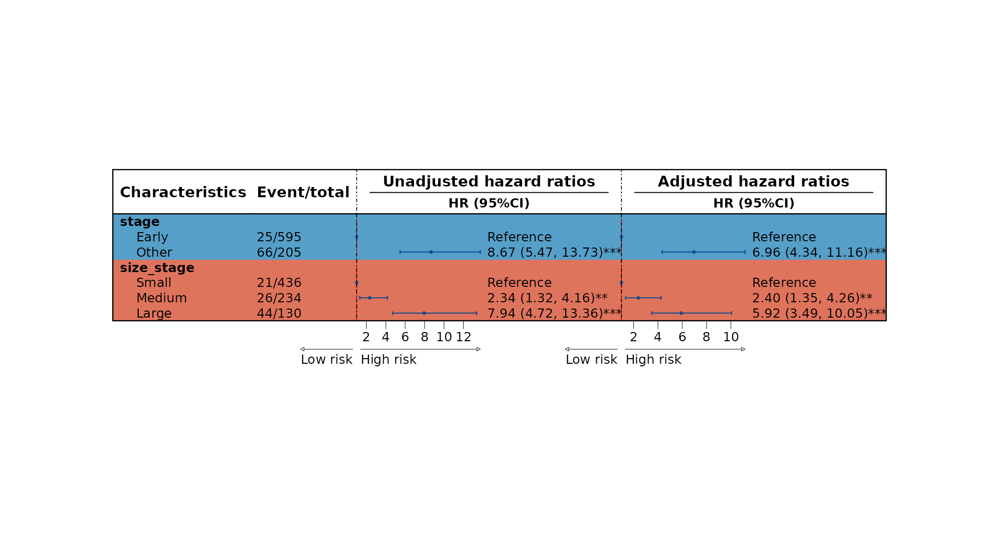{fig-alt="stage 与 size_stage 的独立 Cox 模型森林图。"}

调整表的实际数值如下。已核对两列方案的估计与分别调用 `get_eff(cat_var = ...)` 一致；此处没有把两个方案互相调整。

::: {.table-responsive}

| label | estimate | conf.low | conf.high |
| :-- | :-- | :-- | :-- |
| stage |  |  |  |
| Early | 1 | 1 | 1 |
| Other | 6.96 | 4.34 | 11.16 |
| size_stage |  |  |  |
| Small | 1 | 1 | 1 |
| Medium | 2.395 | 1.346 | 4.261 |
| Large | 5.923 | 3.49 | 10.05 |

:::

方案类别和切点仅用于接口演示；较大的 HR 不代表方案的预测性能更好。若方案来自同一数据的 RPA 选树，节点效应仍是选择后的样本内估计。

### plt_eff()：缺失或无穷区间的展示 {#missing-bounds}

2026-10-05 的森林图实现会把非有限区间端点作为缺失处理；数值列保留点估计，缺失端点不会变成有限区间；后端可能同时省去对应的图形标记。默认横轴没有可用范围时，会结合有限点估计展开画布。后端仍可能提示缺失区间；图能画出不意味着该区间可以解释。

下面复用[分期方案示例](#cat-var-rpa)的 `eff_scheme`，**人为修改一个区间，仅测试显示**。这张图不是新的临床估计。

```r
plot_fixture <- eff_scheme
z <- plot_fixture[["haz_direct"]]
i <- which(is.finite(z[["estimate"]]) & z[["estimate"]] != 1)[1]
z[["conf.low"]][i] <- NA_real_
z[["conf.high"]][i] <- Inf
z[["effect"]][i] <- paste0(round(z[["estimate"]][i], 2), " (CI unavailable)")
plot_fixture[["haz_direct"]] <- z
plt_eff(plot_fixture, show.sur = FALSE, fixed_size = FALSE)
```

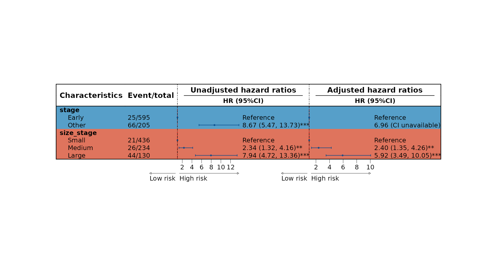{fig-alt="人为修改区间的森林图显示测试，与原始估计区分。"}

`fixed_size = FALSE` 让此网页示例随导出画布缩放。默认 `TRUE` 固定底层表格尺寸；需要导出时，应按函数提示的尺寸或更大尺寸保存，并检查最终图片。

### 返回对象及字段

本页的 `eff_sub` 返回以下四张表：

```r
names(eff_sub)
# "haz_unadj" "haz_direct" "sur_unadj" "sur_direct"

# 原始数值用于森林区，格式化文字用于表格。
eff_sub[["haz_direct"]][c("label", "estimate", "conf.low", "conf.high")]
attr(eff_sub[["haz_direct"]], "ci_range")
# c(0.54, 3.06)
```

::: {.table-responsive}

| 字段 / 属性 | 用途 |
|:--|:--|
| `estimate, conf.low, conf.high` | 比值或概率差的数值与置信区间；森林区直接读取 |
| `effect` | 带 CI、可能含星号的格式化效应文字 |
| `num1, eve1, eve12` | 人数 / 比例、目标事件 / 总人数、目标事件 / 其他事件 / 总人数的汇总 |
| 分组概率列与 CI | `sur_*` 表还保存每组 S(t) 或 CIF(t)，供 `plt_eff_sur()` 使用 |
| `p_inter, stra_p_inter, MS, RERI` | 可用的交互列由拟合模式决定，绘图参数只负责选择显示 |
| `model, method, measure, time` 等属性 | 标识模型、方法、量纲和时间点，用于图标题、轴与分组 |
| `ci_range` / `ci_range_sur` | 区间范围提示；前者为当前效应轴，后者在适用表中为组别概率轴 |

:::

建议保留完整 R 对象，例如使用 `saveRDS()`；CSV 往返会丢掉模型、量纲和分层等属性。本页实际调整模型的总体 HR 为 **0.87（95% CI 0.63–1.19）**；此处只是一个核对示例，不是治疗结论。

当前实现会根据置信区间重算显示用的 `p_value`，原 95% P 值另存为 `p.value_0.95`。非 95% 的 `conf_level` 会影响显示 P 值与星号，因此本页固定 0.95，不把不同置信水平的 P 值当作同一检验比较。人数列是数据汇总，其他数据的缺失值仍可能让具体模型的有效人数与汇总人数不同。

## 可复现的分析准备 {#prepare}

只在副本 `d` 上修改参考水平和竞争风险编码，ToyData 中保存的对象保持原样。图中的短英文名称只用于展示。

```r
library(RegR)
library(ToyData)

d <- as.data.frame(ToyData::toy_ptc_m1_cnd)
d[["N_4"]] <- stats::relevel(d[["N_4"]], ref = "No CND")
d[["status"]] <- factor(d[["event"]], levels = 0:2)

adj <- c("Age", "Sex", "Race", "Tum_3")
labels <- list(
  N_4 = "CND", Sex = "Sex", age_55 = "Age group",
  Tum_3 = "Tumor size", Race = "Race"
)

# 多变量比值表：direct 同时包含 N_4、Sex、Tum_3、Age 和 Race。
eff_um <- get_eff(
  d, cat_var = c("N_4", "Sex", "Tum_3"), adj_var = c("Age", "Race"),
  surv = TRUE, methods = c("unadj", "direct"), show_surdiff = FALSE
)

# 二分类暴露的亚组：HR 与 60 月生存概率差。
eff_sub <- get_eff(
  d, cat_var = "N_4", sub_var = c("Sex", "age_55"), adj_var = adj,
  surv = TRUE, methods = c("unadj", "direct"), time = 60,
  group_1 = "CND", group_2 = "No CND", subgroup_model = "interaction"
)

# 外层按年龄分层，内层看 Sex 亚组。
eff_split <- get_eff(
  d, cat_var = "N_4", sub_var = "Sex", adj_var = adj,
  split_var = "age_55", surv = TRUE, methods = c("unadj", "direct"),
  show_surdiff = FALSE, subgroup_model = "interaction"
)

# Fine–Gray 比值；不调用调整 CIF 的 bootstrap。
eff_cif <- get_eff(
  d, cat_var = "N_4", sub_var = c("Sex", "age_55"), adj_var = adj,
  surv = FALSE, methods = c("unadj", "direct"), show_surdiff = FALSE,
  subgroup_model = "interaction"
)

# Aalen–Johansen 组别 CIF；关闭比值结果。
eff_cif_prob <- get_eff(
  d, cat_var = "N_4", sub_var = c("Sex", "age_55"), surv = FALSE,
  methods_haz = character(), methods_sur = "unadj", time = 60,
  group_1 = "CND", group_2 = "No CND"
)

# 多水平主要分组：用于四组概率展示。
eff_multi_prob <- get_eff(
  d, cat_var = "Tum_3", sub_var = "Sex", surv = TRUE,
  methods_haz = character(), methods_sur = "unadj", time = 60, all = NULL
)

# 同一个队列的三种调整方案。
eff_crude <- get_eff(
  d, cat_var = "N_4", surv = TRUE, methods = "unadj", show_surdiff = FALSE
)
eff_age <- get_eff(
  d, cat_var = "N_4", adj_var = "Age", surv = TRUE,
  methods = "direct", show_surdiff = FALSE
)
eff_full <- get_eff(
  d, cat_var = "N_4", adj_var = adj, surv = TRUE,
  methods = "direct", show_surdiff = FALSE
)
model_blocks <- list(
  Crude = eff_crude, "Age adjusted" = eff_age, "Full model" = eff_full
)
```

`eff_multi_prob` 走多水平概率路径，当前返回中仍有总体行；不要假定该路径的 `all = NULL` 与二分类亚组路径行为完全一致。需要在图上隐藏总体行时，可使用绘图函数的 `del_AllPatients = TRUE`。

## 四个绘图入口怎么选 {#plot-choice}

::: {.table-responsive}

| 函数 | 主要用途 | 输入与返回 | 本页图数 |
|:--|:--|:--|--:|
| `plt_eff()` | 多个结果表并列、上下 / 左右布局；比值与概率差一起展示 | `get_eff()` 结果；ggplot / patchwork | 7 |
| `plt_eff2()` | 经典森林图；单表、多方法叠加、命名模型分块 | 比值表或模型结果列表；forestplot 对象 | 6 |
| `plt_eff_pair()` | 多方法共用森林区；HR / sHR 与差值联合展示 | 选定的结果子列表；ggplot / patchwork | 6 |
| `plt_eff_sur()` | 在同一行画各组 S(t) / CIF(t)，支持多水平组别 | 含分组概率的 `sur_*` 表；ggplot | 5 |

:::

以下代码仅改变显示设置。除示例准备中明确区分的模型外，同一标签组使用同一批结果表。

## plt_eff()：多表布局与字段展示 {#plt-eff}

适合在一张图中同时展示未调整、调整后的效应与时间点概率差。原始 `eff_sub` 的表序为 `haz_unadj, haz_direct, sur_unadj, sur_direct`；`display` 决定这些表的组织方式。

::: {.table-responsive}

| 参数 | 作用 |
|:--|:--|
| `display` | `c` 按输入顺序合并；四表时 `c_order` 按同方法配对，`v` 上下，`h` 左右。少于四表时合并显示 |
| `summary_vars` | 左侧汇总字段，例如 `c("label", "eve1")` |
| `show_event_bylevel` | 二分类亚组表中把事件 / 总人数分成各暴露组的列 |
| `show_pinter` | `p_inter`、`stra_p_inter`、`MS`、`RERI` 或 `none`；必须先有对应结果列 |
| `header_list` / `label_column_list` | 前者改列头与面板标题，后者映射行标签；不改变参考组或估计值 |
| `forest_nchar` / `core_size` | 森林区预留宽度与单元格留白；多面板和长 CI 文字时可增加 |
| `xlim, ticks_at, ticks_digits, x_trans` | 轴范围、刻度与变换；本入口默认线性轴，HR 可设 `log2` |
| `type` / `fill_col` | `h` 按变量 / 分层块，`v` 按面板，`i` / `i2` 交替行底色，`n` 无底色 |
| `del_AllPatients, forest_position, show_side_border` | 总体行、森林区前后位置与左右边框 |
| `show.sur` | 将森林区切换到组别概率；专门的概率展示也可直接用 `plt_eff_sur()` |

:::

### 坐标与参考水平

::: {.panel-tabset}

#### 线性坐标

HR 的无效应值是 1；线性轴上相同的数值差占相同距离。

```r
plt_eff(eff_um, display = "c", type = "h",
  label_column_list = labels, forest_nchar = 40,
  xlim = c(0.4, 5.5), ticks_at = c(0.5, 1, 2, 4, 5),
  ticks_digits = 1, x_trans = "none", base_size = 10, core_size = c(6, 3),
  fill_col = c("#EAF2F8", "#F9F1E7"),
  header_list = list(label = "Variable", eve1 = "Deaths/N",
                     header_title = c("Unadjusted", "Adjusted")))
```

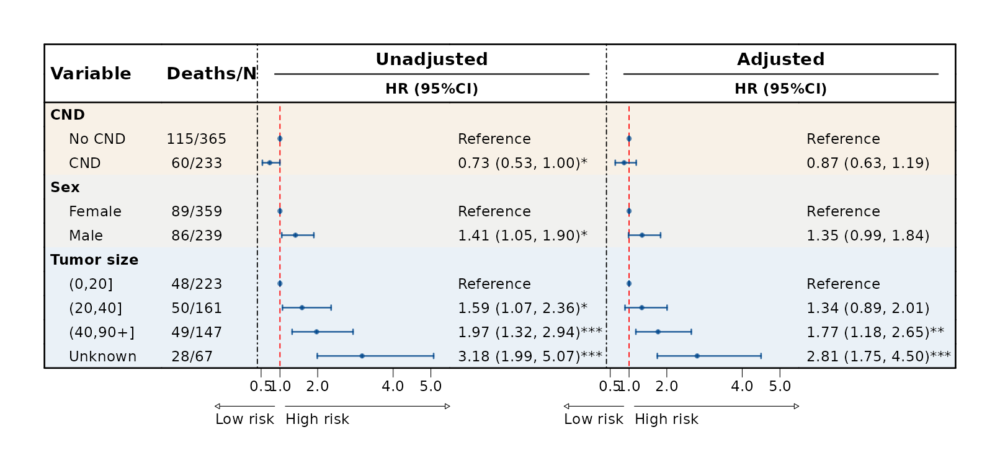{#fig-eff-um-linear fig-alt="plt_eff：线性坐标；598 人 M1 PTC 队列"}

#### 对数坐标

模型结果与上一图相同。对数轴使 0.5 与 2 相对 1 呈对称距离；刻度仍显示原始 HR。

```r
plt_eff(eff_um, display = "c", type = "h",
  label_column_list = labels, forest_nchar = 40,
  xlim = c(0.5, 8), ticks_at = c(0.5, 1, 2, 4, 8),
  ticks_digits = 1, x_trans = "log2", base_size = 10, core_size = c(6, 3),
  fill_col = c("#EAF2F8", "#F9F1E7"),
  header_list = list(label = "Variable", eve1 = "Deaths/N",
                     header_title = c("Unadjusted", "Adjusted")))
```

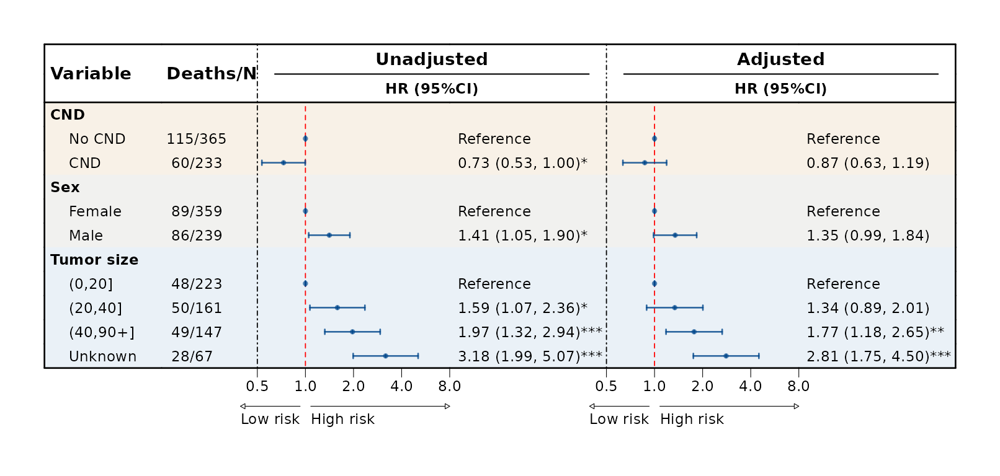{#fig-eff-um-log fig-alt="plt_eff：对数坐标；598 人 M1 PTC 队列"}

:::

### 四表布局

三张图使用相同的 HR、两组 S(60) 与 $\Delta S(60)$。四表较宽，点击放大查看文字；正文中的 `v` 布局更适合逐行阅读。

::: {.panel-tabset}

#### 同方法相邻

display = c_order 将未调整的 HR 与 ΔS 放在一起，再放调整后的两项结果；每项指标保留自己的轴。

```r
plt_eff(eff_sub, display = "c_order", type = "v", fill_col = c("#EAF2F8", "#F9F1E7"),
  label_column_list = labels, forest_nchar = 36, base_size = 10, core_size = c(6, 3),
  header_list = list(label = "Variable", eve1 = "Deaths/N", p_inter1 = "P(inter)", p_inter2 = "P(inter)",
    header_title = c("Unadjusted HR", "Adjusted HR", "Unadjusted Delta S", "Adjusted Delta S")))
```

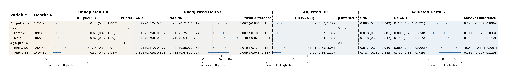{#fig-eff-sub-combined fig-alt="plt_eff：同方法相邻；598 人 M1 PTC 队列"}

#### 上下布局

当前四表输入下，v 的上排是调整结果，下排是未调整结果。HR 的参考值为 1，ΔS 的参考值为 0。

```r
plt_eff(eff_sub, display = "v", type = "v", fill_col = c("#EAF2F8", "#F9F1E7"),
  label_column_list = labels, forest_nchar = 36, base_size = 10, core_size = c(6, 3),
  header_list = list(label = "Variable", eve1 = "Deaths/N", p_inter1 = "P(inter)", p_inter2 = "P(inter)",
    header_title = c("Unadjusted HR", "Adjusted HR", "Unadjusted Delta S", "Adjusted Delta S")))
```

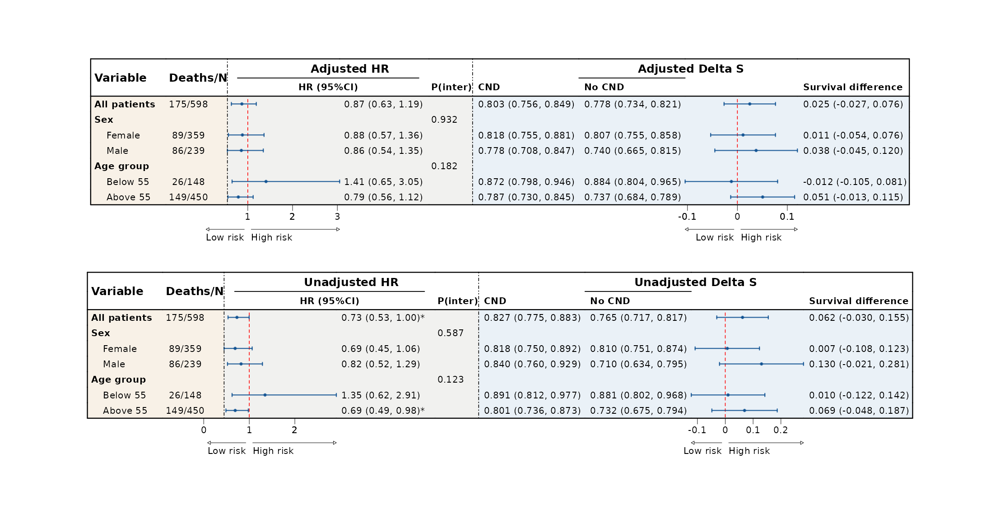{#fig-eff-sub-vertical fig-alt="plt_eff：上下布局；598 人 M1 PTC 队列"}

#### 左右布局

当前四表输入下，h 的左侧是调整结果，右侧是未调整结果；两个分组各含 HR 与 ΔS。

```r
plt_eff(eff_sub, display = "h", type = "v", fill_col = c("#EAF2F8", "#F9F1E7"),
  label_column_list = labels, forest_nchar = 36, base_size = 10, core_size = c(6, 3),
  header_list = list(label = "Variable", eve1 = "Deaths/N", p_inter1 = "P(inter)", p_inter2 = "P(inter)",
    header_title = c("Unadjusted HR", "Adjusted HR", "Unadjusted Delta S", "Adjusted Delta S")))
```

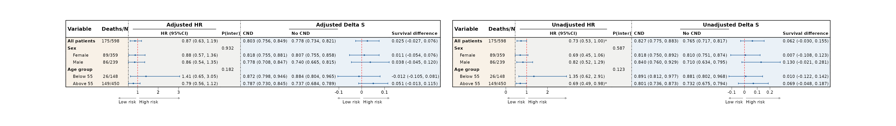{#fig-eff-sub-horizontal fig-alt="plt_eff：左右布局；598 人 M1 PTC 队列"}

:::

### 外层分层与精简展示

`split_var` 的模型已经在分析准备时分别拟合；绘图只能显示或隐藏分层信息。删除总体行也不会重新拟合其余亚组。

::: {.panel-tabset}

#### 外层分层

split_var 的年龄层分别拟合模型；每一块内部再按 Sex 展示 CND 效应。事件/人数可分 CND 与 No CND 两列。

```r
plt_eff(eff_split, display = "c", type = "h",
  show_event_bylevel = TRUE, label_column_list = labels,
  forest_nchar = 40, xlim = c(0.25, 8),
  ticks_at = c(0.25, 0.5, 1, 2, 4, 8), x_trans = "log2", base_size = 10, core_size = c(6, 3))
```

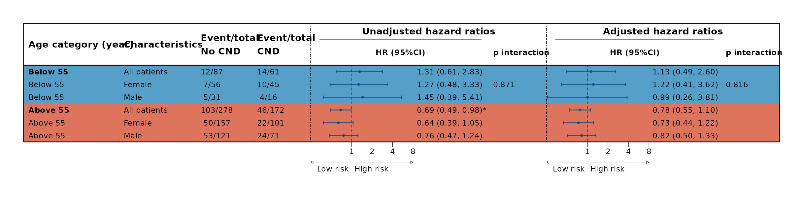{#fig-eff-split fig-alt="plt_eff：外层分层；598 人 M1 PTC 队列"}

#### 精简亚组表

只选调整后的 HR；删除总体行，显示层级交互 P 值，森林区移到文本之后，并去掉左右边框。

```r
plt_eff(eff_sub["haz_direct"], type = "i",
  show_event_bylevel = TRUE, show_pinter = "stra_p_inter",
  del_AllPatients = TRUE, forest_position = "after",
  show_side_border = FALSE, label_column_list = labels,
  forest_nchar = 40, base_size = 10, core_size = c(6, 3))
```

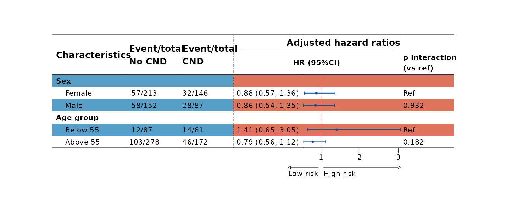{#fig-eff-clean fig-alt="plt_eff：精简亚组表；598 人 M1 PTC 队列"}

:::

## plt_eff2()：经典森林图、叠加与模型分块 {#plt-eff2}

此入口使用 `forestplot` 后端，返回 `eff_gforge_forestplot / forestplot` 对象。它读取比值类表，适合 HR、OR、sHR；`sur_*` 概率差表应选其他入口。

::: {.table-responsive}

| 参数 | 作用与关系 |
|:--|:--|
| `which` | NULL 取首张比值表；单个名称 / 索引选单表；多个名称 / 索引叠加同一行的不同方法 |
| `num_per, show_pvalue` | 人数比例替代事件人数；单表可加 P 值列 |
| `axis_args` | `xlim, xticks, ticks_digits, x_trans`；本页明确设 `x_trans = "log"`。显式 xlim 下 `auto` 不保证对数轴 |
| `ci_shape, box_col, legend_labels` | 每个序列的菱形 / 方形、颜色和图例；顺序跟随 `which` |
| `effect_args` | `overlap` 将多方法文字堆在一列；`lineheight` 与 `align` 控制堆叠文字 |
| `ci_args` | `vertices, vertices_height, lwd, lty, gap` 控制 CI；gap 是叠加序列间距占行高的比例 |
| `row_args` | `height, fit_text, header`；堆叠文本时增加行高并允许按文本扩展 |
| `graph_pos, graphwidth` | 森林区的位置和占总图宽度的比例 |
| `fill_type` | `none`、`zebra`、`var`，分别为无底色、交替行、变量块 |
| `label_column_list, label_list` | 行标签映射与列头替换；模型分块必须有一致的列及列头 |

:::

多方法叠加的表应具有一致的行键和量纲。普通交互 P 值取第一张选中表；`MS` / `RERI` 则可堆叠展示各方法。不能为叠加而把不同患者群、不同暴露对比或概率差混进 HR 轴。

### 单表、CI 形状与轴截断

::: {.panel-tabset}

#### 菱形与变量底色

which 明确选择调整后的 HR。P 值列可显示，fill_type = var 用底色划分变量块。

```r
plt_eff2(eff_um, which = "haz_direct",
  show_pvalue = TRUE, fill_type = "var", fill_col = c("#EAF2F8", "#F9F1E7"), label_column_list = labels,
  axis_args = list(xlim = c(0.5, 8), xticks = c(0.5, 1, 2, 4, 8),
                   x_trans = "log"),
  title = "Adjusted Cox model", base_size = 12,
  label_list = list(label = "Variable", count1 = "Deaths/N\nNo CND",
                    count2 = "Deaths/N\nCND", p.interaction = "Interaction P"))
```

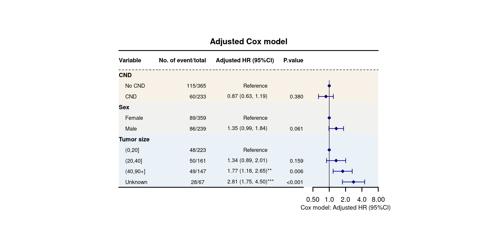{#fig-fp-basic fig-alt="plt_eff2：菱形与变量底色；598 人 M1 PTC 队列"}

#### 方形、左置与截断

CI 形状改为 normal，森林区放左侧，缩窄横轴以展示超界箭头。文本中的完整 CI 不随裁剪改变。

```r
plt_eff2(eff_sub, which = "haz_direct",
  ci_shape = "normal", graph_pos = "left", fill_type = "zebra",
  label_column_list = labels,
  axis_args = list(xlim = c(0.6, 1.6),
                   xticks = c(0.6, 0.8, 1, 1.2, 1.6), x_trans = "log"), base_size = 12,
  label_list = list(label = "Variable", count1 = "Deaths/N\nNo CND",
                    count2 = "Deaths/N\nCND", p.interaction = "Interaction P"))
```

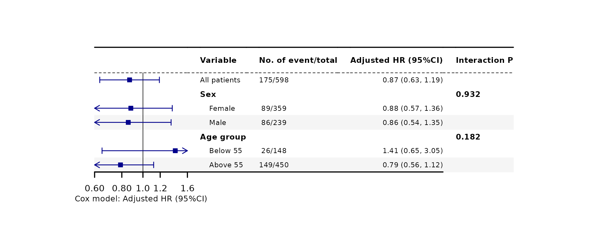{#fig-fp-normal fig-alt="plt_eff2：方形、左置与截断；598 人 M1 PTC 队列"}

:::

### 双方法叠加与行高

`ci_args` 的 `gap` 分离同一行的图形，`effect_args` 的 `lineheight` 控制文字间距；二者不互相替代。

::: {.panel-tabset}

#### 双方法叠加

which 的顺序同时决定图例、颜色与第一张表的交互 P 值来源。本图先放调整结果。

```r
plt_eff2(eff_sub, which = c("haz_direct", "haz_unadj"),
  show_event_bylevel = TRUE, label_column_list = labels,
  legend_labels = c("Adjusted", "Unadjusted"),
  ci_shape = c("diamond", "normal"), box_col = c("#2166AC", "#B35806"),
  axis_args = list(xlim = c(0.4, 4), xticks = c(0.5, 1, 2, 4),
                   x_trans = "log"), base_size = 12,
  label_list = list(label = "Variable", count1 = "Deaths/N\nNo CND",
                    count2 = "Deaths/N\nCND", p.interaction = "Interaction P"))
```

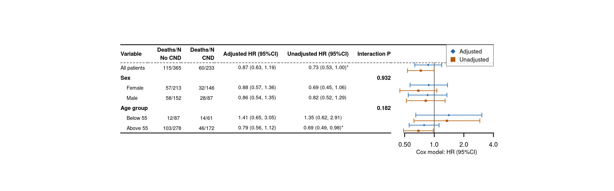{#fig-fp-overlay fig-alt="plt_eff2：双方法叠加；598 人 M1 PTC 队列"}

#### 效应文本堆叠

同一行的两个区间用 `ci_args` 的 `gap` 分开；效应文字放进同一列，row_args 扩展行高以容纳两行文本。

```r
plt_eff2(eff_sub, which = c("haz_direct", "haz_unadj"),
  show_event_bylevel = TRUE, label_column_list = labels,
  legend_labels = c("Adjusted", "Unadjusted"),
  box_col = c("#2166AC", "#B35806"), fill_type = "var", fill_col = c("#EAF2F8", "#F9F1E7"),
  effect_args = list(overlap = TRUE, lineheight = 1.1, align = "left"),
  ci_args = list(gap = 0.35),
  row_args = list(height = 1.7, fit_text = TRUE, header = 2.1),
  axis_args = list(xlim = c(0.4, 4), xticks = c(0.5, 1, 2, 4),
                   x_trans = "log"), base_size = 12,
  label_list = list(label = "Variable", count1 = "Deaths/N\nNo CND",
                    count2 = "Deaths/N\nCND", p.interaction = "Interaction P"))
```

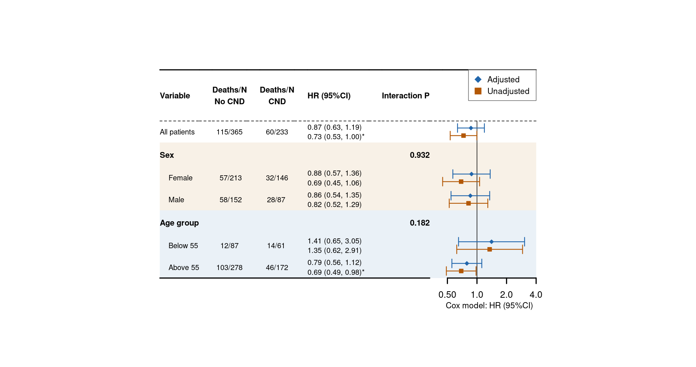{#fig-fp-overlap fig-alt="plt_eff2：效应文本堆叠；598 人 M1 PTC 队列"}

:::

### 命名模型分块与年龄层

`model_blocks` 三块来自同一队列，分别为未调整、仅调整年龄、完整调整。它们不是三个独立研究，不能把此图当作荟萃分析。未调整与调整模型的默认效应列标题不同，示例用 `label_list = list(effect = "HR (95% CI)")` 统一列头后组合。

::: {.panel-tabset}

#### 三个模型分块

命名 list 的名称成为块标题。which = 1L 对每个结果取第一张表；label_list 统一效应列标题，使未调整与调整模型的表列保持一致。

```r
plt_eff2(model_blocks, which = 1L,
  show_pvalue = TRUE, num_per = TRUE,
  label_column_list = labels, fill_type = "var", fill_col = c("#EAF2F8", "#F9F1E7"), graphwidth = 0.35,
  axis_args = list(xlim = c(0.4, 2), xticks = c(0.5, 1, 2),
                   x_trans = "log"),
  title = "Three Cox models", base_size = 12,
  label_list = list(label = "Variable", effect = "HR (95% CI)", count1 = "Deaths/N\nNo CND",
                    count2 = "Deaths/N\nCND", p.interaction = "Interaction P"))
```

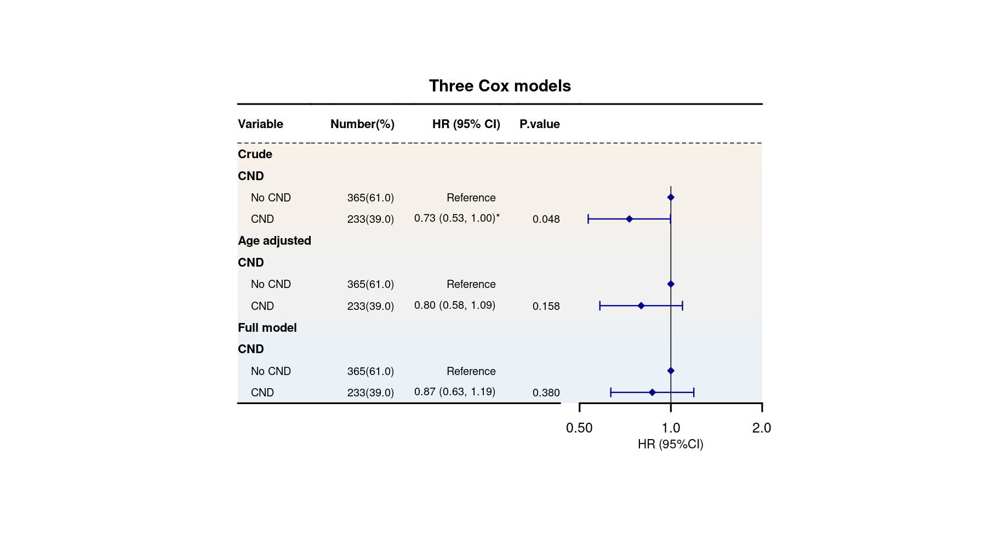{#fig-fp-modelblocks fig-alt="plt_eff2：三个模型分块；598 人 M1 PTC 队列"}

#### 年龄层与层级交互

split_var 的信息保留为前置分层列；show_pinter = stra_p_inter 展示交互模型中的层级检验。

```r
plt_eff2(eff_split, which = "haz_direct",
  show_event_bylevel = TRUE, show_pinter = "stra_p_inter",
  label_column_list = labels, fill_type = "var", fill_col = c("#EAF2F8", "#F9F1E7"),
  axis_args = list(xlim = c(0.25, 8),
                   xticks = c(0.25, 0.5, 1, 2, 4, 8), x_trans = "log"), base_size = 12,
  label_list = list(label = "Variable", count1 = "Deaths/N\nNo CND",
                    count2 = "Deaths/N\nCND", p.interaction = "Interaction P"))
```

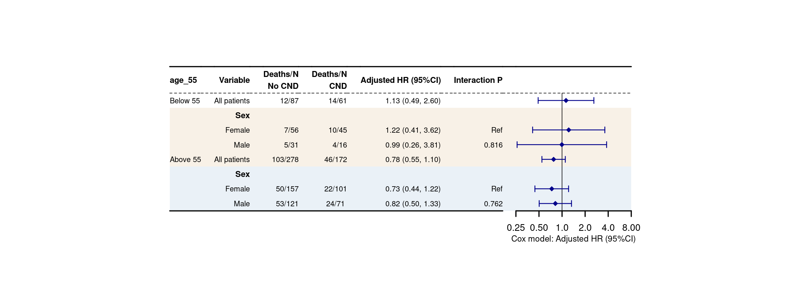{#fig-fp-split fig-alt="plt_eff2：年龄层与层级交互；598 人 M1 PTC 队列"}

:::

## plt_eff_pair()：方法配对与双指标展示 {#plt-eff-pair}

多种方法共用一个森林区，点和区间使用不同颜色 / 形状。当前接口没有 `methods` 参数；用 `eff_sub[c(...)]` 选择和排序输入表，函数读取输入中所有可用的方法。可展示两种或更多方法。

::: {.table-responsive}

| 参数 | 作用 |
|:--|:--|
| `measure = "hr"` | 比值类选择器，按模型属性显示 HR / OR / sHR；参考线默认 1 |
| `measure = "dif"` | 概率差；参考线默认 0，线性轴 |
| `measure = "haz_diff"` | 左表共用，右侧同时放比值与概率差两个指标区 |
| `measure = c("hr", "dif")` | 分别生成两个完整森林表，再按 `layout` 组合 |
| `method_labels, colors, nudge_y` | 方法名称、颜色与同一行的序列偏移 |
| `effect_overlap, effect_text_lineheight` | 效应文字分列 / 堆叠与行间距 |
| `show_effect_text` | 可隐藏 CI 文字，仅保留图形和汇总 |
| `xlim, ticks_at, ticks_digits, x_trans, ref_line` | 可传统一值，也可按 `hr` / `dif` 命名 list 分开控制 |
| `show_pinter` | 全局 / 层级交互 P 值或 MS / RERI；普通 P 值由第一方法提供 |

:::

`haz_diff` 输入中两类表的**方法顺序必须一致**，例如均为 direct 再 unadj。叠加是展示同一问题的不同估计，不自动检验两种方法之间是否有统计学差异。

### HR 配对、堆叠文字与层级交互

::: {.panel-tabset}

#### HR 叠加

先对子结果列表选表，再传给绘图函数；两种方法共享一个 HR 森林区。

```r
plt_eff_pair(eff_sub[c("haz_direct", "haz_unadj")], measure = "hr",
  method_labels = c("Adjusted", "Unadjusted"),
  colors = c("#2166AC", "#B35806"), type = "h", fill_col = "#EDF3F8",
  label_column_list = labels, forest_nchar = 40,
  xlim = c(0.4, 4), ticks_at = c(0.5, 1, 2, 4), ticks_digits = 1, base_size = 10, core_size = c(10, 3))
```

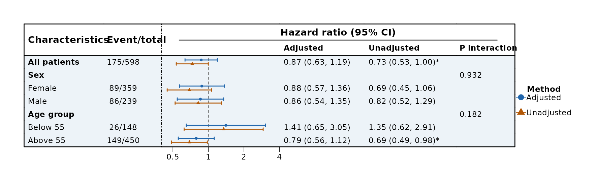{#fig-pair-hr fig-alt="plt_eff_pair：HR 叠加；598 人 M1 PTC 队列"}

#### 文本叠加与交互列

effect_overlap 把方法结果堆在一列；层级交互 P 值来自第一张表，即本图的调整模型。

```r
plt_eff_pair(eff_sub[c("haz_direct", "haz_unadj")], measure = "hr",
  method_labels = c("Adjusted", "Unadjusted"),
  colors = c("#2166AC", "#B35806"), label_column_list = labels,
  effect_overlap = TRUE, effect_text_lineheight = 1.1,
  show_pinter = "stra_p_inter", nudge_y = 0.3, forest_nchar = 40,
  xlim = c(0.4, 4), ticks_at = c(0.5, 1, 2, 4), ticks_digits = 1, base_size = 10, core_size = c(10, 3))
```

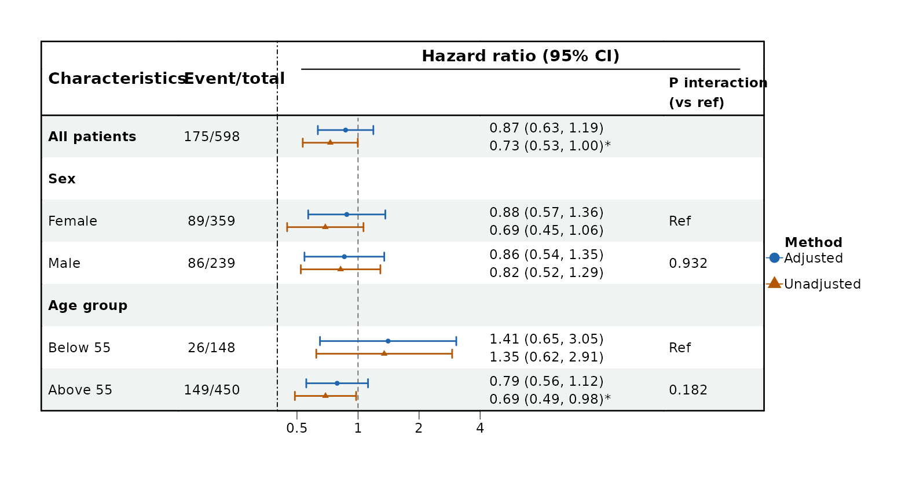{#fig-pair-overlap fig-alt="plt_eff_pair：文本叠加与交互列；598 人 M1 PTC 队列"}

:::

### 概率差与双指标布局

$\Delta S(60)$ 的方向是 CND 减 No CND，与 HR 的“较小比值”含义不同。联合展示时为每种量指定自己的轴。

::: {.panel-tabset}

#### 60 月生存概率差

dif 读取概率差，采用线性轴与零参考线；0.10 表示 10 个百分点，不能作为 HR 读取。

```r
plt_eff_pair(eff_sub[c("sur_direct", "sur_unadj")], measure = "dif",
  method_labels = c("Adjusted", "Unadjusted"),
  colors = c("#2166AC", "#B35806"), label_column_list = labels,
  forest_nchar = 40, xlim = c(-0.15, 0.30),
  ticks_at = c(-0.1, 0, 0.1, 0.2, 0.3), ticks_digits = 2, base_size = 10, core_size = c(10, 3))
```

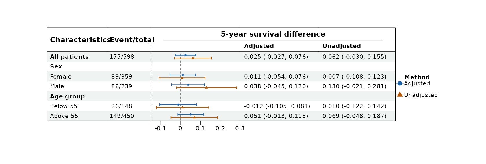{#fig-pair-difference fig-alt="plt_eff_pair：60 月生存概率差；598 人 M1 PTC 队列"}

#### 共享表、两个指标区

haz_diff 共用左侧汇总表，同时展示 HR 与 ΔS。haz 与 sur 的方法顺序必须一致。

```r
plt_eff_pair(
  eff_sub[c("haz_direct", "haz_unadj", "sur_direct", "sur_unadj")],
  measure = "haz_diff", show_event_bylevel = TRUE, effect_overlap = TRUE,
  method_labels = c("Adjusted", "Unadjusted"),
  colors = c("#2166AC", "#B35806"), label_column_list = labels,
  forest_nchar = 40,
  xlim = list(hr = c(0.4, 4), dif = c(-0.15, 0.30)),
  ticks_at = list(hr = c(0.5, 1, 2, 4), dif = c(-0.1, 0, 0.1, 0.2, 0.3)),
  ticks_digits = list(hr = 1, dif = 2), base_size = 10, core_size = c(10, 3))
```

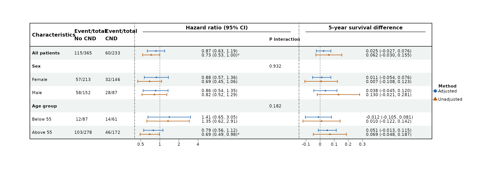{#fig-pair-hazdiff fig-alt="plt_eff_pair：共享表、两个指标区；598 人 M1 PTC 队列"}

#### 两个独立森林图

measure 同时选择 hr 与 dif 时，各自生成完整的森林表，再用 layout = v 上下组合。

```r
plt_eff_pair(
  eff_sub[c("haz_direct", "haz_unadj", "sur_direct", "sur_unadj")],
  measure = c("hr", "dif"), layout = "v",
  method_labels = c("Adjusted", "Unadjusted"),
  colors = c("#2166AC", "#B35806"), label_column_list = labels,
  forest_nchar = 40,
  xlim = list(hr = c(0.4, 4), dif = c(-0.15, 0.30)),
  ticks_at = list(hr = c(0.5, 1, 2, 4), dif = c(-0.1, 0, 0.1, 0.2, 0.3)),
  ticks_digits = list(hr = 1, dif = 2), base_size = 10, core_size = c(10, 3))
```

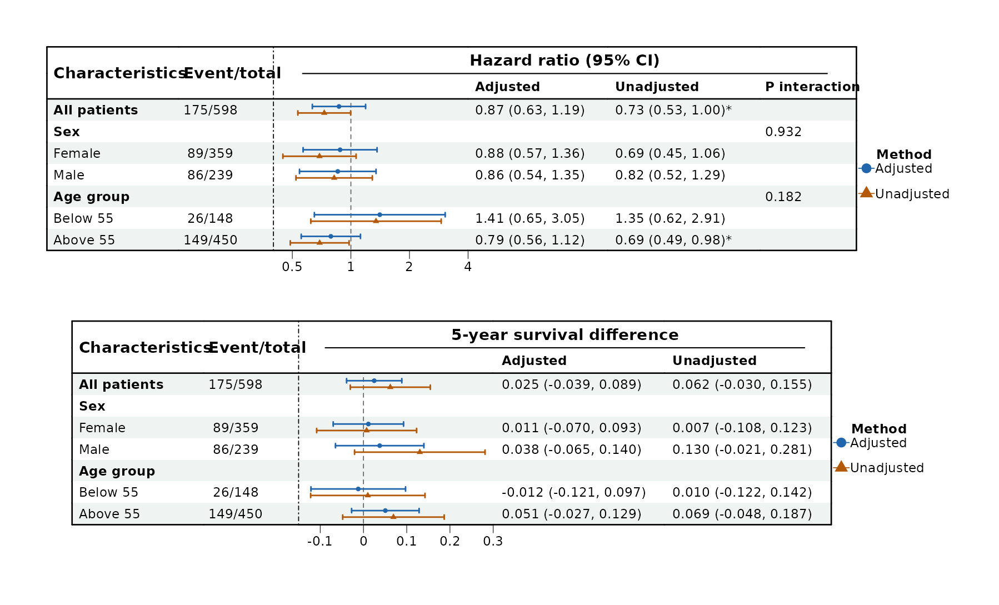{#fig-pair-measures fig-alt="plt_eff_pair：两个独立森林图；598 人 M1 PTC 队列"}

:::

### 竞争风险比值与 MS

虽然选择器写 `measure = "hr"`，下图读取的是 Fine–Gray 结果，标题和文字显示 **sHR**。图中的 MS 来自模型比值，不是组别 CIF 差的交互。

::: {.panel-tabset}

#### Fine–Gray 与 MS 列

hr 是比值类表的选择器；本图依据模型属性显示 sHR。MS 是相对效应尺度的乘法交互指标，不是绝对风险交互。

```r
plt_eff_pair(eff_cif[c("haz_direct", "haz_unadj")], measure = "hr",
  method_labels = c("Adjusted", "Unadjusted"), show_pinter = "MS",
  colors = c("#2166AC", "#B35806"), label_column_list = labels,
  effect_overlap = TRUE, forest_nchar = 40,
  xlim = c(0.4, 4), ticks_at = c(0.5, 1, 2, 4), ticks_digits = 1, base_size = 10, core_size = c(10, 3))
```

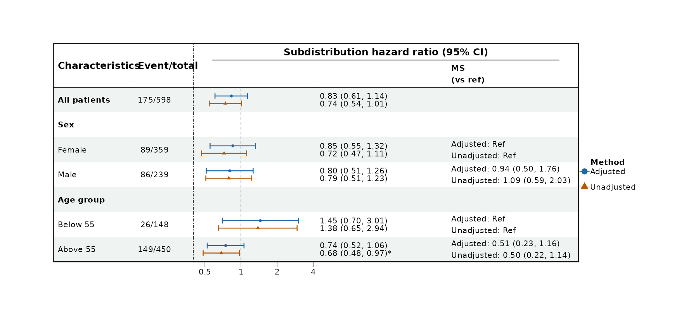{#fig-pair-cif fig-alt="plt_eff_pair：Fine–Gray 与 MS 列；598 人 M1 PTC 队列"}

:::

## plt_eff_sur()：各组概率森林图 {#plt-eff-sur}

本入口从 `sur_*` 表中读取各组 S(t) 或 CIF(t)。每种方法一个面板，在同一行用颜色区分主要暴露的各组；二分类和多水平主要分组均可展示。传完整 `get_eff()` 结果时，比值表会被筛掉。

::: {.table-responsive}

| 参数 | 作用 |
|:--|:--|
| `summary_vars` | 默认 `label1, eve1`；本页用 `label, eve1` 保持单行标签 |
| `label_column_list` | 映射行标签；不改组别编码与概率 |
| `xlim, ticks_at, ticks_digits` | 概率轴；可统一指定，也可按 `sur_unadj` / `sur_direct` 等表名设 list |
| `forest_nchar, core_size, base_size` | 绘图区宽度、单元格留白和字体大小 |
| `fill_col, del_AllPatients` | 行底色与总体行的显示 |

:::

自动范围主要依据概率点估计，未必覆盖每个 CI；需要完整概率域时显式设置 `xlim = c(0, 1)`。CI 超出范围时看截断箭头，文字仍显示完整区间。

当前模板的左侧列头固定为 `Age groups`，图例可能保留 `N_4 groups` / `Tum_3 groups` 这样的原始变量名。实际分组以行标签和图例水平为准；这不会把 Sex 亚组变成年龄组，也不会改变数值。

### 范围、单方法与底色

::: {.panel-tabset}

#### 自动概率范围

每种方法一个森林区，每个区间展示 CND 与 No CND 的 60 月 S(t)，不是两组的差值。

```r
plt_eff_sur(eff_sub, summary_vars = c("label", "eve1"),
  label_column_list = labels, forest_nchar = 40, base_size = 10, core_size = c(10, 3))
```

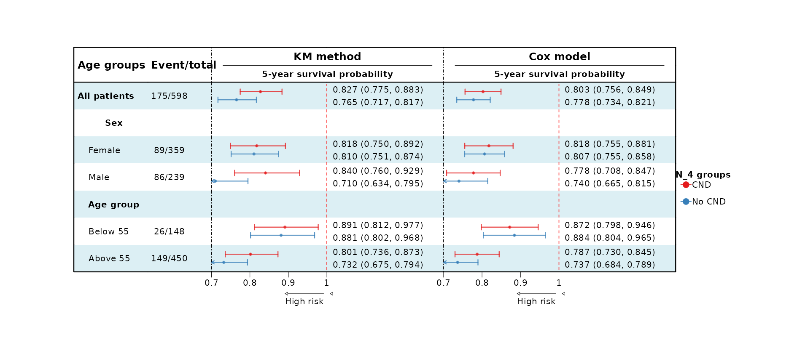{#fig-sur-two fig-alt="plt_eff_sur：自动概率范围；598 人 M1 PTC 队列"}

#### 完整 0–1 范围

两张表与上一图完全相同；固定 0–1 范围让不同分析的概率图有共同坐标。

```r
plt_eff_sur(eff_sub, summary_vars = c("label", "eve1"),
  label_column_list = labels, forest_nchar = 40,
  xlim = c(0, 1), ticks_at = seq(0, 1, by = 0.2), ticks_digits = 1, base_size = 10, core_size = c(10, 3))
```

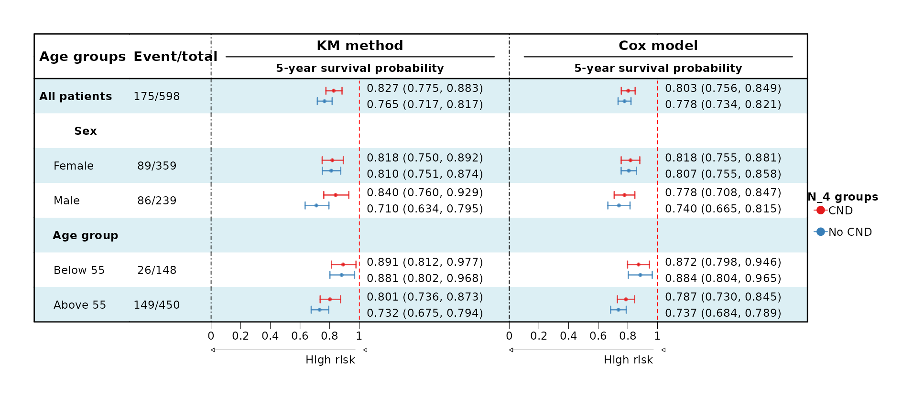{#fig-sur-fullrange fig-alt="plt_eff_sur：完整 0–1 范围；598 人 M1 PTC 队列"}

#### 单方法与底色

只显示调整后的标准化生存概率，删除总体行，并使用统一底色。

```r
plt_eff_sur(eff_sub["sur_direct"], summary_vars = c("label", "eve1"),
  label_column_list = labels, del_AllPatients = TRUE,
  fill_col = "#EAF2F8", forest_nchar = 40,
  xlim = c(0.5, 1), ticks_at = c(0.5, 0.75, 1), ticks_digits = 2, base_size = 10, core_size = c(10, 3))
```

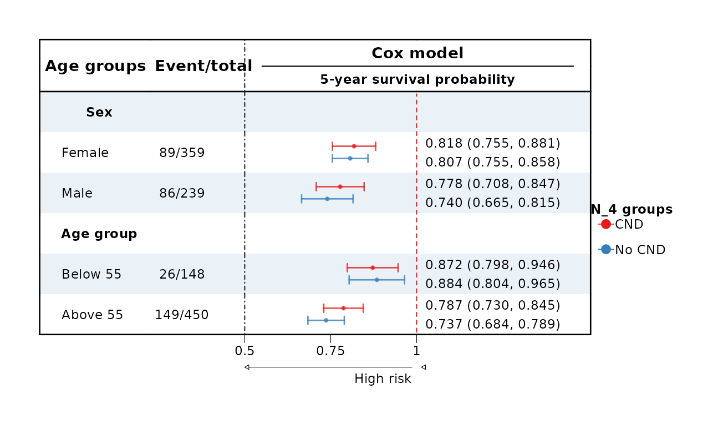{#fig-sur-single fig-alt="plt_eff_sur：单方法与底色；598 人 M1 PTC 队列"}

:::

### CIF 与多水平组别

CIF 图的“death probability”是**甲状腺癌死亡的累积发生概率**。四组图则改用 `Tum_3` 作为主要分组，每个 Sex 水平有四个生存概率区间；它不是 CND 两组比较。

::: {.panel-tabset}

#### 甲状腺癌 CIF

Aalen–Johansen 估计纳入其他原因死亡这一竞争事件，显示 60 月甲状腺癌累积发生概率。

```r
plt_eff_sur(eff_cif_prob, summary_vars = c("label", "eve1"),
  label_column_list = labels, forest_nchar = 40,
  xlim = c(0, 0.6), ticks_at = c(0, 0.2, 0.4, 0.6), ticks_digits = 1, base_size = 10, core_size = c(10, 3))
```

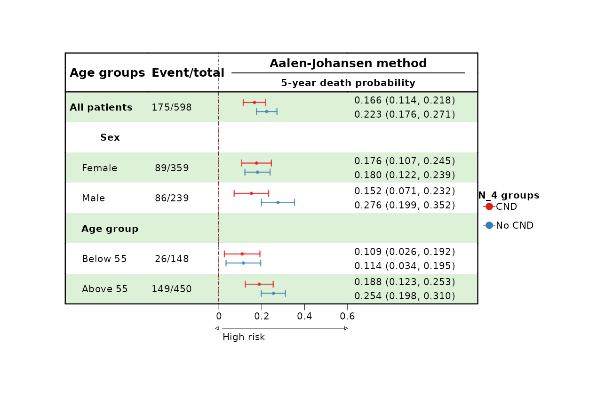{#fig-sur-cif fig-alt="plt_eff_sur：甲状腺癌 CIF；598 人 M1 PTC 队列"}

#### 四组肿瘤大小

此例把主要分组变量改为 Tum_3，在 Sex 的各层同时展示四组 S(t)；Unknown 是数据水平，不是肿瘤大小区间。

```r
plt_eff_sur(eff_multi_prob, summary_vars = c("label", "eve1"),
  label_column_list = labels, forest_nchar = 50,
  xlim = c(0, 1), ticks_at = c(0, 0.25, 0.5, 0.75, 1), ticks_digits = 2, base_size = 10, core_size = c(10, 3))
```

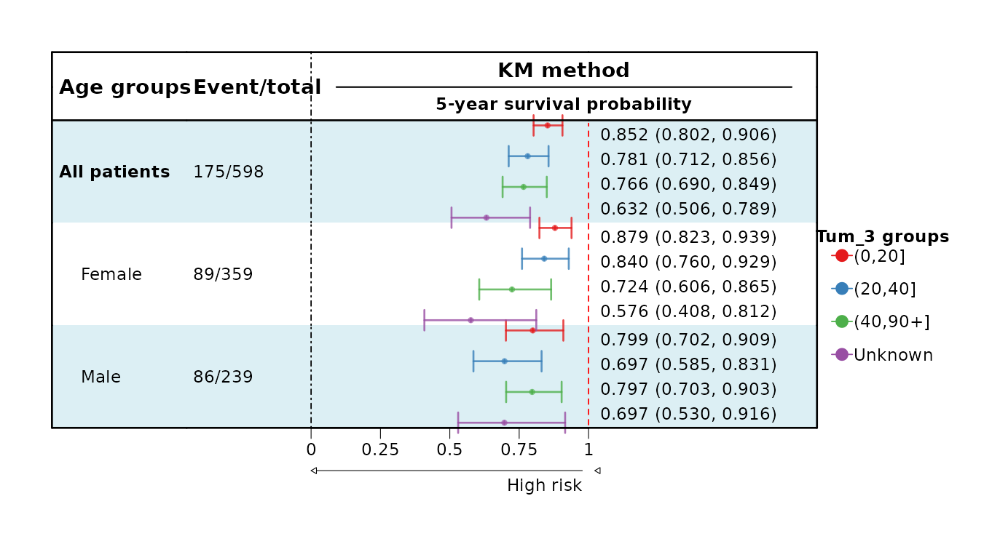{#fig-sur-multigroup fig-alt="plt_eff_sur：四组肿瘤大小；598 人 M1 PTC 队列"}

:::

<!-- forest-extension: start -->

## set_eff()：改写结果与调整区间 {#set-eff}

本节于 2026-10-01 按当前源码补充，并在 WSL R 4.4.3 运行。复用前文 598 人队列与 eff_crude；原有 24 张参数图之外，再增加三张对照图和数值表。

set_eff **会改变结果表的数值**，适用于注明来源的外部估计或敏感性展示，不重新拟合模型。默认 inplace=TRUE 会写回传入变量；以下均显式设为 FALSE，保留原对象。多个比值表时必须指定 which；sur_* 概率差表不支持。

| 输入 | 实际行为 |
|:--|:--|
| CND="1.20 (0.90, 1.60)" | 将字符串视为 95% 比值区间，重写点估计、上下限、P 值、星号与 effect 文本 |
| CND=1.20 / estimate=list(CND=1.20) | 保留由原 95% 区间推算的 log-SE，移动点估计和区间，重新计算 P 值 |
| CND="conf_0.90" | 点估计不变，改变该行显示置信水平；原模型 p.value_0.95 保留 |
| effect=list(N_4=c(CND="conf_0.90")) | 按“标题块→行标签”定位；重复标签时比直接按 label 更明确 |
| header / 数字名称 | header 限定标签所在块；数字名称为行号，包含标题行，数据变化后需重新核对 |

**P 值边界：** 由区间反推使用 log 正态近似，受输入小数精度影响。非 95% 展示时 p_value/星号遵循当前显示区间，不能直接当作原来的模型 P 值；原 95% 值见 p.value_0.95。数字 0.90 是新比值，字符串 conf_0.90 才是置信水平。区间换级记录在 conf_level_rows 属性中；重排行后不应继续沿用该属性。

以下改用 plt_eff2(label_list=list(effect=...)) 明确写出显示区间水平；set_eff 不会自动把所有绘图模板中的 95% 表头改成该行的实际水平。

```r
eff_crude <- run_quiet(get_eff(d, cat_var = "N_4", surv = TRUE,
  methods = "unadj", show_surdiff = FALSE))
eff90 <- set_eff(eff_crude, CND = "conf_0.90", which = "haz_unadj", inplace = FALSE)
# 只用于说明替换接口的虚拟敏感性结果，不是重新拟合的临床估计。
eff_scenario <- set_eff(eff_crude, CND = "1.20 (0.90, 1.60)",
  which = "haz_unadj", inplace = FALSE)
```

::: {.panel-tabset}

### 原始估计 {.unnumbered}

598 人原始 Cox HR 和 95% CI；由模型拟合所得。

```r
p <- plt_eff2(eff_crude, which = "haz_unadj",
  label_list = list(label = "CND group", eve1 = "DSS/N", effect = "HR (95% CI)"),
  title = "Original model", base_size = 12, graphwidth = 0.3, xlab = "Cox HR (95% CI)",
  axis_args = list(xlim = c(0.25, 2), xticks = c(0.25, 0.5, 1, 2),
    ticks_digits = 2, x_trans = "log"), fixed_size = FALSE)
print(p)
```

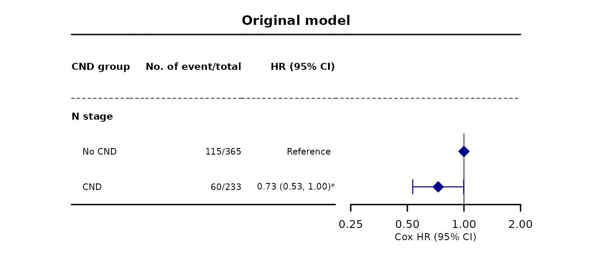{fig-alt="598 人原始 Cox HR 和 95% CI；由模型拟合所得。"}

### 90% 显示区间 {.unnumbered}

点估计未改变；仅该行换成 90% 区间，不能与前文的 95% CI 混称。

```r
p <- plt_eff2(eff90, which = "haz_unadj",
  label_list = list(label = "CND group", eve1 = "DSS/N", effect = "HR (90% CI)"),
  title = "Display with 90% CI", base_size = 12, graphwidth = 0.3, xlab = "Cox HR (90% CI)",
  axis_args = list(xlim = c(0.25, 2), xticks = c(0.25, 0.5, 1, 2),
    ticks_digits = 2, x_trans = "log"), fixed_size = FALSE)
print(p)
```

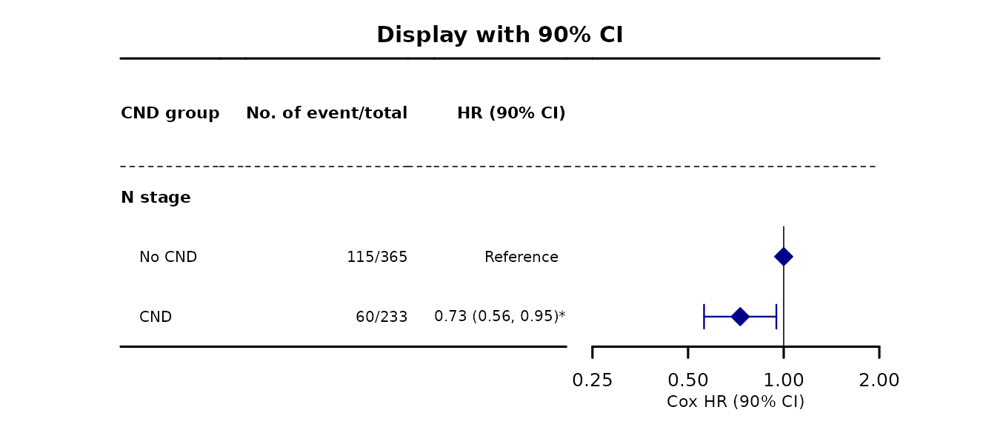{fig-alt="点估计未改变；仅该行换成 90% 区间，不能与前文的 95% CI 混称。"}

### 虚拟替换结果 {.unnumbered}

人为输入 1.20 (0.90, 1.60)，只说明替换行为，不能当作本队列临床估计。

```r
p <- plt_eff2(eff_scenario, which = "haz_unadj",
  label_list = list(label = "CND group", eve1 = "DSS/N", effect = "HR (95% CI)"),
  title = "Illustrative replacement", base_size = 12, graphwidth = 0.3, xlab = "Cox HR (95% CI)",
  axis_args = list(xlim = c(0.25, 2), xticks = c(0.25, 0.5, 1, 2),
    ticks_digits = 2, x_trans = "log"), fixed_size = FALSE)
print(p)
```

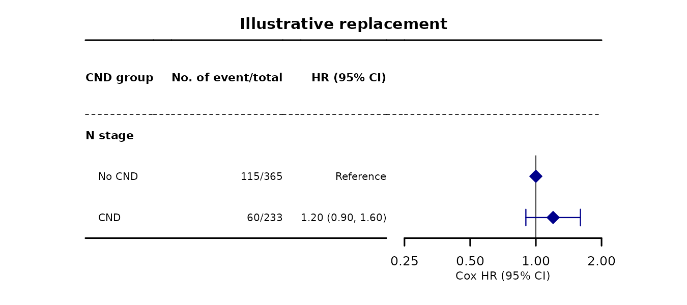{fig-alt="人为输入 1.20 (0.90, 1.60)，只说明替换行为，不能当作本队列临床估计。"}

:::

## 数值同步核对

下表只保留 CND 那一行。患者数、标签与拟合对象没有随字符串修改而重新估计；需要新的分析结果时，应回到 get_eff 重新拟合。

实际返回值核对：点估计、区间、显示 P 值和原 95% P 值。

```r
objects <- list(Original = eff_crude, CI90 = eff90, Scenario = eff_scenario)
do.call(rbind, lapply(names(objects), function(nm) {
  z <- objects[[nm]][["haz_unadj"]]
  z <- z[z[["label"]] == "CND", , drop = FALSE]
  data.frame(display = nm, z[, c("estimate", "conf.low", "conf.high",
    "p_value", "p.value_0.95", "effect")], row.names = NULL)
}))
```

::: {.table-responsive}

<div id="wmaagdgvnn" style="padding-left:0px;padding-right:0px;padding-top:10px;padding-bottom:10px;overflow-x:auto;overflow-y:auto;width:auto;height:auto;">

  <table class="gt_table" data-quarto-disable-processing="false" data-quarto-bootstrap="false" style="-webkit-font-smoothing: antialiased; -moz-osx-font-smoothing: grayscale; font-family: system-ui, 'Segoe UI', Roboto, Helvetica, Arial, sans-serif, 'Apple Color Emoji', 'Segoe UI Emoji', 'Segoe UI Symbol', 'Noto Color Emoji'; display: table; border-collapse: collapse; line-height: normal; margin-left: auto; margin-right: auto; color: #333333; font-size: 16px; font-weight: normal; font-style: normal; background-color: #FFFFFF; width: auto; border-top-style: solid; border-top-width: 2px; border-top-color: #A8A8A8; border-right-style: none; border-right-width: 2px; border-right-color: #D3D3D3; border-bottom-style: solid; border-bottom-width: 2px; border-bottom-color: #A8A8A8; border-left-style: none; border-left-width: 2px; border-left-color: #D3D3D3;" bgcolor="#FFFFFF">
  <thead style="border-style: none;">
    <tr class="gt_col_headings" style="border-style: none; border-top-style: solid; border-top-width: 2px; border-top-color: #D3D3D3; border-bottom-style: solid; border-bottom-width: 2px; border-bottom-color: #D3D3D3; border-left-style: none; border-left-width: 1px; border-left-color: #D3D3D3; border-right-style: none; border-right-width: 1px; border-right-color: #D3D3D3;">
      <th class="gt_col_heading gt_columns_bottom_border gt_left" rowspan="1" colspan="1" scope="col" id="display" style="border-style: none; color: #333333; background-color: #FFFFFF; font-size: 100%; font-weight: normal; text-transform: inherit; border-left-style: none; border-left-width: 1px; border-left-color: #D3D3D3; border-right-style: none; border-right-width: 1px; border-right-color: #D3D3D3; vertical-align: bottom; padding-top: 5px; padding-bottom: 6px; padding-left: 5px; padding-right: 5px; overflow-x: hidden; text-align: left;" bgcolor="#FFFFFF" valign="bottom" align="left">display</th>
      <th class="gt_col_heading gt_columns_bottom_border gt_right" rowspan="1" colspan="1" scope="col" id="estimate" style="border-style: none; color: #333333; background-color: #FFFFFF; font-size: 100%; font-weight: normal; text-transform: inherit; border-left-style: none; border-left-width: 1px; border-left-color: #D3D3D3; border-right-style: none; border-right-width: 1px; border-right-color: #D3D3D3; vertical-align: bottom; padding-top: 5px; padding-bottom: 6px; padding-left: 5px; padding-right: 5px; overflow-x: hidden; text-align: right; font-variant-numeric: tabular-nums;" bgcolor="#FFFFFF" valign="bottom" align="right">estimate</th>
      <th class="gt_col_heading gt_columns_bottom_border gt_right" rowspan="1" colspan="1" scope="col" id="conf.low" style="border-style: none; color: #333333; background-color: #FFFFFF; font-size: 100%; font-weight: normal; text-transform: inherit; border-left-style: none; border-left-width: 1px; border-left-color: #D3D3D3; border-right-style: none; border-right-width: 1px; border-right-color: #D3D3D3; vertical-align: bottom; padding-top: 5px; padding-bottom: 6px; padding-left: 5px; padding-right: 5px; overflow-x: hidden; text-align: right; font-variant-numeric: tabular-nums;" bgcolor="#FFFFFF" valign="bottom" align="right">conf.low</th>
      <th class="gt_col_heading gt_columns_bottom_border gt_right" rowspan="1" colspan="1" scope="col" id="conf.high" style="border-style: none; color: #333333; background-color: #FFFFFF; font-size: 100%; font-weight: normal; text-transform: inherit; border-left-style: none; border-left-width: 1px; border-left-color: #D3D3D3; border-right-style: none; border-right-width: 1px; border-right-color: #D3D3D3; vertical-align: bottom; padding-top: 5px; padding-bottom: 6px; padding-left: 5px; padding-right: 5px; overflow-x: hidden; text-align: right; font-variant-numeric: tabular-nums;" bgcolor="#FFFFFF" valign="bottom" align="right">conf.high</th>
      <th class="gt_col_heading gt_columns_bottom_border gt_right" rowspan="1" colspan="1" scope="col" id="p_value" style="border-style: none; color: #333333; background-color: #FFFFFF; font-size: 100%; font-weight: normal; text-transform: inherit; border-left-style: none; border-left-width: 1px; border-left-color: #D3D3D3; border-right-style: none; border-right-width: 1px; border-right-color: #D3D3D3; vertical-align: bottom; padding-top: 5px; padding-bottom: 6px; padding-left: 5px; padding-right: 5px; overflow-x: hidden; text-align: right; font-variant-numeric: tabular-nums;" bgcolor="#FFFFFF" valign="bottom" align="right">p_value</th>
      <th class="gt_col_heading gt_columns_bottom_border gt_right" rowspan="1" colspan="1" scope="col" id="p.value_0.95" style="border-style: none; color: #333333; background-color: #FFFFFF; font-size: 100%; font-weight: normal; text-transform: inherit; border-left-style: none; border-left-width: 1px; border-left-color: #D3D3D3; border-right-style: none; border-right-width: 1px; border-right-color: #D3D3D3; vertical-align: bottom; padding-top: 5px; padding-bottom: 6px; padding-left: 5px; padding-right: 5px; overflow-x: hidden; text-align: right; font-variant-numeric: tabular-nums;" bgcolor="#FFFFFF" valign="bottom" align="right">p.value_0.95</th>
      <th class="gt_col_heading gt_columns_bottom_border gt_right" rowspan="1" colspan="1" scope="col" id="effect" style="border-style: none; color: #333333; background-color: #FFFFFF; font-size: 100%; font-weight: normal; text-transform: inherit; border-left-style: none; border-left-width: 1px; border-left-color: #D3D3D3; border-right-style: none; border-right-width: 1px; border-right-color: #D3D3D3; vertical-align: bottom; padding-top: 5px; padding-bottom: 6px; padding-left: 5px; padding-right: 5px; overflow-x: hidden; text-align: right; font-variant-numeric: tabular-nums;" bgcolor="#FFFFFF" valign="bottom" align="right">effect</th>
    </tr>
  </thead>
  <tbody class="gt_table_body" style="border-style: none; border-top-style: solid; border-top-width: 2px; border-top-color: #D3D3D3; border-bottom-style: solid; border-bottom-width: 2px; border-bottom-color: #D3D3D3;">
    <tr style="border-style: none;"><td headers="display" class="gt_row gt_left" style="border-style: none; padding-top: 8px; padding-bottom: 8px; padding-left: 5px; padding-right: 5px; margin: 10px; border-top-style: solid; border-top-width: 1px; border-top-color: #D3D3D3; border-left-style: none; border-left-width: 1px; border-left-color: #D3D3D3; border-right-style: none; border-right-width: 1px; border-right-color: #D3D3D3; vertical-align: middle; overflow-x: hidden; text-align: left;" valign="middle" align="left">Original</td>
<td headers="estimate" class="gt_row gt_right" style="border-style: none; padding-top: 8px; padding-bottom: 8px; padding-left: 5px; padding-right: 5px; margin: 10px; border-top-style: solid; border-top-width: 1px; border-top-color: #D3D3D3; border-left-style: none; border-left-width: 1px; border-left-color: #D3D3D3; border-right-style: none; border-right-width: 1px; border-right-color: #D3D3D3; vertical-align: middle; overflow-x: hidden; text-align: right; font-variant-numeric: tabular-nums;" valign="middle" align="right">0.7296147</td>
<td headers="conf.low" class="gt_row gt_right" style="border-style: none; padding-top: 8px; padding-bottom: 8px; padding-left: 5px; padding-right: 5px; margin: 10px; border-top-style: solid; border-top-width: 1px; border-top-color: #D3D3D3; border-left-style: none; border-left-width: 1px; border-left-color: #D3D3D3; border-right-style: none; border-right-width: 1px; border-right-color: #D3D3D3; vertical-align: middle; overflow-x: hidden; text-align: right; font-variant-numeric: tabular-nums;" valign="middle" align="right">0.5338983</td>
<td headers="conf.high" class="gt_row gt_right" style="border-style: none; padding-top: 8px; padding-bottom: 8px; padding-left: 5px; padding-right: 5px; margin: 10px; border-top-style: solid; border-top-width: 1px; border-top-color: #D3D3D3; border-left-style: none; border-left-width: 1px; border-left-color: #D3D3D3; border-right-style: none; border-right-width: 1px; border-right-color: #D3D3D3; vertical-align: middle; overflow-x: hidden; text-align: right; font-variant-numeric: tabular-nums;" valign="middle" align="right">0.9970768</td>
<td headers="p_value" class="gt_row gt_right" style="border-style: none; padding-top: 8px; padding-bottom: 8px; padding-left: 5px; padding-right: 5px; margin: 10px; border-top-style: solid; border-top-width: 1px; border-top-color: #D3D3D3; border-left-style: none; border-left-width: 1px; border-left-color: #D3D3D3; border-right-style: none; border-right-width: 1px; border-right-color: #D3D3D3; vertical-align: middle; overflow-x: hidden; text-align: right; font-variant-numeric: tabular-nums;" valign="middle" align="right">0.04789079</td>
<td headers="p.value_0.95" class="gt_row gt_right" style="border-style: none; padding-top: 8px; padding-bottom: 8px; padding-left: 5px; padding-right: 5px; margin: 10px; border-top-style: solid; border-top-width: 1px; border-top-color: #D3D3D3; border-left-style: none; border-left-width: 1px; border-left-color: #D3D3D3; border-right-style: none; border-right-width: 1px; border-right-color: #D3D3D3; vertical-align: middle; overflow-x: hidden; text-align: right; font-variant-numeric: tabular-nums;" valign="middle" align="right">0.04789079</td>
<td headers="effect" class="gt_row gt_right" style="border-style: none; padding-top: 8px; padding-bottom: 8px; padding-left: 5px; padding-right: 5px; margin: 10px; border-top-style: solid; border-top-width: 1px; border-top-color: #D3D3D3; border-left-style: none; border-left-width: 1px; border-left-color: #D3D3D3; border-right-style: none; border-right-width: 1px; border-right-color: #D3D3D3; vertical-align: middle; overflow-x: hidden; text-align: right; font-variant-numeric: tabular-nums;" valign="middle" align="right">0.73 (0.53, 1.00)*</td></tr>
    <tr style="border-style: none;"><td headers="display" class="gt_row gt_left" style="border-style: none; padding-top: 8px; padding-bottom: 8px; padding-left: 5px; padding-right: 5px; margin: 10px; border-top-style: solid; border-top-width: 1px; border-top-color: #D3D3D3; border-left-style: none; border-left-width: 1px; border-left-color: #D3D3D3; border-right-style: none; border-right-width: 1px; border-right-color: #D3D3D3; vertical-align: middle; overflow-x: hidden; text-align: left;" valign="middle" align="left">CI90</td>
<td headers="estimate" class="gt_row gt_right" style="border-style: none; padding-top: 8px; padding-bottom: 8px; padding-left: 5px; padding-right: 5px; margin: 10px; border-top-style: solid; border-top-width: 1px; border-top-color: #D3D3D3; border-left-style: none; border-left-width: 1px; border-left-color: #D3D3D3; border-right-style: none; border-right-width: 1px; border-right-color: #D3D3D3; vertical-align: middle; overflow-x: hidden; text-align: right; font-variant-numeric: tabular-nums;" valign="middle" align="right">0.7296147</td>
<td headers="conf.low" class="gt_row gt_right" style="border-style: none; padding-top: 8px; padding-bottom: 8px; padding-left: 5px; padding-right: 5px; margin: 10px; border-top-style: solid; border-top-width: 1px; border-top-color: #D3D3D3; border-left-style: none; border-left-width: 1px; border-left-color: #D3D3D3; border-right-style: none; border-right-width: 1px; border-right-color: #D3D3D3; vertical-align: middle; overflow-x: hidden; text-align: right; font-variant-numeric: tabular-nums;" valign="middle" align="right">0.5613905</td>
<td headers="conf.high" class="gt_row gt_right" style="border-style: none; padding-top: 8px; padding-bottom: 8px; padding-left: 5px; padding-right: 5px; margin: 10px; border-top-style: solid; border-top-width: 1px; border-top-color: #D3D3D3; border-left-style: none; border-left-width: 1px; border-left-color: #D3D3D3; border-right-style: none; border-right-width: 1px; border-right-color: #D3D3D3; vertical-align: middle; overflow-x: hidden; text-align: right; font-variant-numeric: tabular-nums;" valign="middle" align="right">0.9482483</td>
<td headers="p_value" class="gt_row gt_right" style="border-style: none; padding-top: 8px; padding-bottom: 8px; padding-left: 5px; padding-right: 5px; margin: 10px; border-top-style: solid; border-top-width: 1px; border-top-color: #D3D3D3; border-left-style: none; border-left-width: 1px; border-left-color: #D3D3D3; border-right-style: none; border-right-width: 1px; border-right-color: #D3D3D3; vertical-align: middle; overflow-x: hidden; text-align: right; font-variant-numeric: tabular-nums;" valign="middle" align="right">0.01840673</td>
<td headers="p.value_0.95" class="gt_row gt_right" style="border-style: none; padding-top: 8px; padding-bottom: 8px; padding-left: 5px; padding-right: 5px; margin: 10px; border-top-style: solid; border-top-width: 1px; border-top-color: #D3D3D3; border-left-style: none; border-left-width: 1px; border-left-color: #D3D3D3; border-right-style: none; border-right-width: 1px; border-right-color: #D3D3D3; vertical-align: middle; overflow-x: hidden; text-align: right; font-variant-numeric: tabular-nums;" valign="middle" align="right">0.04789079</td>
<td headers="effect" class="gt_row gt_right" style="border-style: none; padding-top: 8px; padding-bottom: 8px; padding-left: 5px; padding-right: 5px; margin: 10px; border-top-style: solid; border-top-width: 1px; border-top-color: #D3D3D3; border-left-style: none; border-left-width: 1px; border-left-color: #D3D3D3; border-right-style: none; border-right-width: 1px; border-right-color: #D3D3D3; vertical-align: middle; overflow-x: hidden; text-align: right; font-variant-numeric: tabular-nums;" valign="middle" align="right">0.73 (0.56, 0.95)*</td></tr>
    <tr style="border-style: none;"><td headers="display" class="gt_row gt_left" style="border-style: none; padding-top: 8px; padding-bottom: 8px; padding-left: 5px; padding-right: 5px; margin: 10px; border-top-style: solid; border-top-width: 1px; border-top-color: #D3D3D3; border-left-style: none; border-left-width: 1px; border-left-color: #D3D3D3; border-right-style: none; border-right-width: 1px; border-right-color: #D3D3D3; vertical-align: middle; overflow-x: hidden; text-align: left;" valign="middle" align="left">Scenario</td>
<td headers="estimate" class="gt_row gt_right" style="border-style: none; padding-top: 8px; padding-bottom: 8px; padding-left: 5px; padding-right: 5px; margin: 10px; border-top-style: solid; border-top-width: 1px; border-top-color: #D3D3D3; border-left-style: none; border-left-width: 1px; border-left-color: #D3D3D3; border-right-style: none; border-right-width: 1px; border-right-color: #D3D3D3; vertical-align: middle; overflow-x: hidden; text-align: right; font-variant-numeric: tabular-nums;" valign="middle" align="right">1.2000000</td>
<td headers="conf.low" class="gt_row gt_right" style="border-style: none; padding-top: 8px; padding-bottom: 8px; padding-left: 5px; padding-right: 5px; margin: 10px; border-top-style: solid; border-top-width: 1px; border-top-color: #D3D3D3; border-left-style: none; border-left-width: 1px; border-left-color: #D3D3D3; border-right-style: none; border-right-width: 1px; border-right-color: #D3D3D3; vertical-align: middle; overflow-x: hidden; text-align: right; font-variant-numeric: tabular-nums;" valign="middle" align="right">0.9000000</td>
<td headers="conf.high" class="gt_row gt_right" style="border-style: none; padding-top: 8px; padding-bottom: 8px; padding-left: 5px; padding-right: 5px; margin: 10px; border-top-style: solid; border-top-width: 1px; border-top-color: #D3D3D3; border-left-style: none; border-left-width: 1px; border-left-color: #D3D3D3; border-right-style: none; border-right-width: 1px; border-right-color: #D3D3D3; vertical-align: middle; overflow-x: hidden; text-align: right; font-variant-numeric: tabular-nums;" valign="middle" align="right">1.6000000</td>
<td headers="p_value" class="gt_row gt_right" style="border-style: none; padding-top: 8px; padding-bottom: 8px; padding-left: 5px; padding-right: 5px; margin: 10px; border-top-style: solid; border-top-width: 1px; border-top-color: #D3D3D3; border-left-style: none; border-left-width: 1px; border-left-color: #D3D3D3; border-right-style: none; border-right-width: 1px; border-right-color: #D3D3D3; vertical-align: middle; overflow-x: hidden; text-align: right; font-variant-numeric: tabular-nums;" valign="middle" align="right">0.21418199</td>
<td headers="p.value_0.95" class="gt_row gt_right" style="border-style: none; padding-top: 8px; padding-bottom: 8px; padding-left: 5px; padding-right: 5px; margin: 10px; border-top-style: solid; border-top-width: 1px; border-top-color: #D3D3D3; border-left-style: none; border-left-width: 1px; border-left-color: #D3D3D3; border-right-style: none; border-right-width: 1px; border-right-color: #D3D3D3; vertical-align: middle; overflow-x: hidden; text-align: right; font-variant-numeric: tabular-nums;" valign="middle" align="right">0.21418199</td>
<td headers="effect" class="gt_row gt_right" style="border-style: none; padding-top: 8px; padding-bottom: 8px; padding-left: 5px; padding-right: 5px; margin: 10px; border-top-style: solid; border-top-width: 1px; border-top-color: #D3D3D3; border-left-style: none; border-left-width: 1px; border-left-color: #D3D3D3; border-right-style: none; border-right-width: 1px; border-right-color: #D3D3D3; vertical-align: middle; overflow-x: hidden; text-align: right; font-variant-numeric: tabular-nums;" valign="middle" align="right">1.20 (0.90, 1.60)</td></tr>
  </tbody>

</table>
</div>


:::

本次补充的源码依据：[eff-set.R](https://github.com/HUI950319/RegR/blob/2e56cc6e06d548786b0a43d3449e463a0b36b252/R/eff-set.R)。

<!-- forest-extension: end -->

## 尺寸、保存与复用 {#save}

森林图的文字表需要足够的宽度。先用 `forest_nchar` / `graphwidth` 调整图形空间，再用字体、留白与行高调整可读性；只增加导出分辨率不会解决文字挤压。

四个入口均有末尾的 `save = list()`。空 list 不保存；非空配置交给 `RegR::save_plt()`。默认 `fixed_size = TRUE` 固定自然绘图尺寸，`attr(p, "plot_size")` 返回以英寸为单位的 width / height；数值型 fixed_size 指定整图宽度，FALSE 让图随设备伸展。

```r
# 最后一个参数统一用于保存 PDF。
p <- plt_eff_pair(
  eff_sub[c("haz_direct", "haz_unadj")],
  measure = "hr",
  save = list(filename = "CND-forest.pdf")
)

attr(p, "plot_size")
```

`plt_eff2()` 返回 forestplot 对象，输出 PNG 时可直接使用绘图设备并 `print()`，不直接当作 ggplot 调用 `ggsave()`。本页为经典森林图额外留出导出边距，防止长标题、图例或轴文字接近画布边缘。

```r
p2 <- plt_eff2(
  eff_sub, which = c("haz_direct", "haz_unadj"),
  label_column_list = labels
)
size <- attr(p2, "plot_size")

ragg::agg_png(
  "CND-classic-forest.png",
  width = size[["width"]] + 4,
  height = size[["height"]] + 0.7,
  units = "in", res = 170, background = "white"
)
grid::grid.newpage()
print(p2)
grDevices::dev.off()
```

本页以保存的汇总图形提供浏览，未公开患者级数据文件。公开源码见 [RegR 仓库](https://github.com/HUI950319/RegR)，完整函数帮助见 [RegR 参考文档](https://hui950319.github.io/RegR/reference/index.html)。本页示例按上述本机源码快照验证，公开参考文档与安装版本的接口可能有差异。
