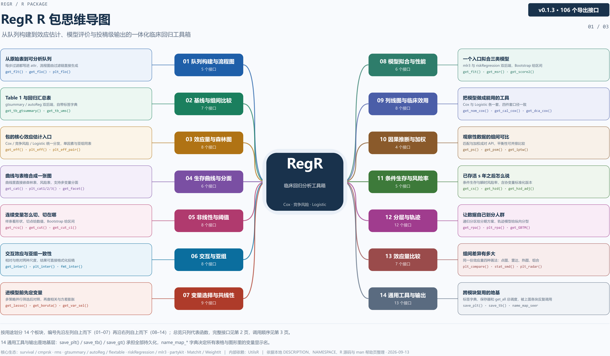
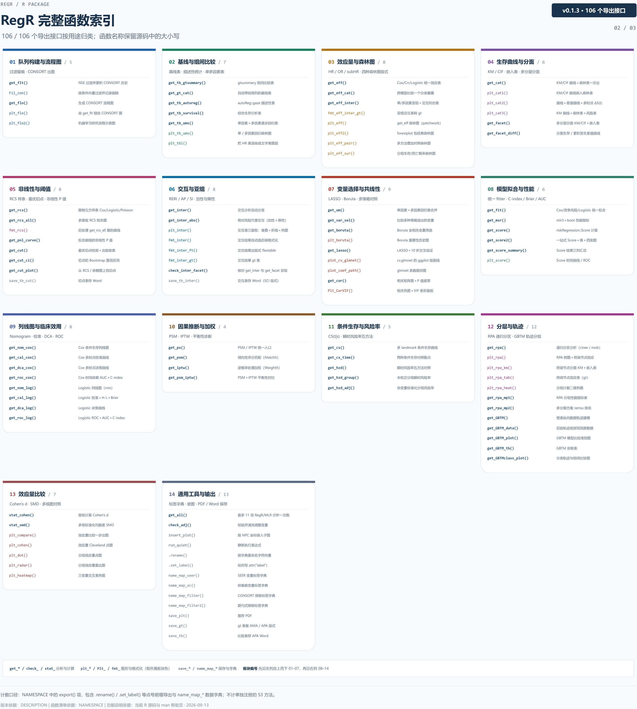
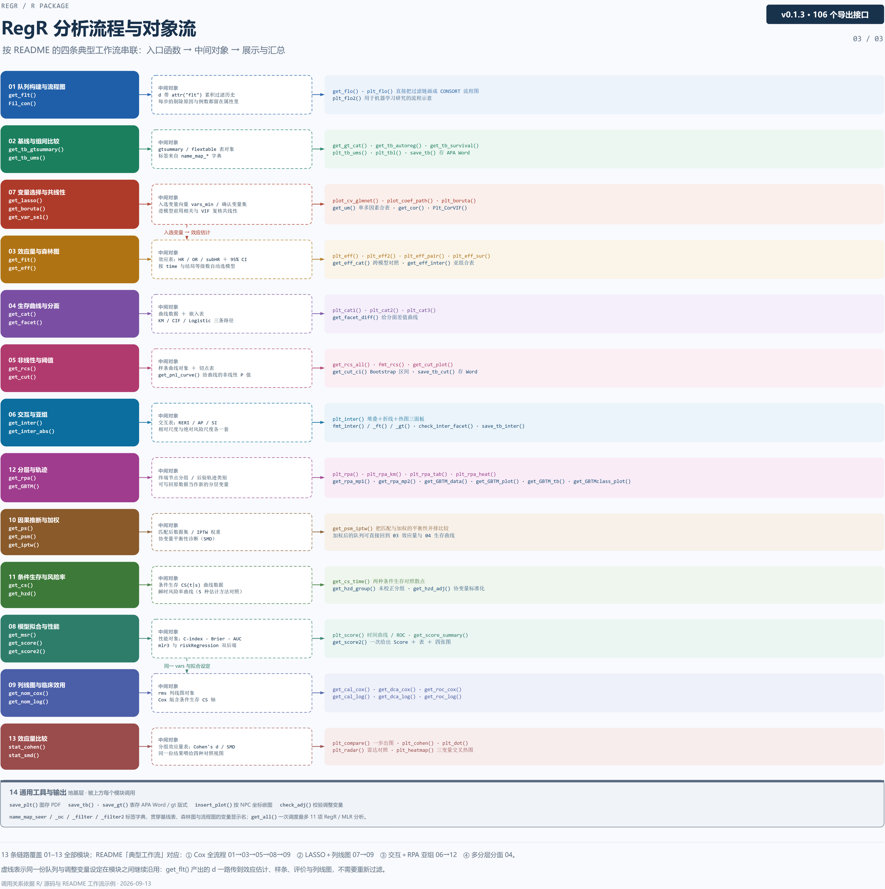

临床回归工具箱：队列筛选、基线表、效应估计、生存曲线、变量选择、交互与非线性展示。

本页集中展示三张图：先看功能总览，再查接口索引，最后看处理流程与返回对象。**点击图片可放大查看**，也可下载图源继续编辑。

[下载 draw.io 图源](../assets/module-maps/regr/regr-package-mindmap.drawio){.btn .btn-outline-primary download="regr-package-mindmap.drawio"}
[下载三页 PDF](../assets/module-maps/regr/regr-package-mindmap.drawio.pdf){.btn .btn-outline-secondary download="regr-package-mindmap.drawio.pdf"}

图谱快照：**2026-09-13**。对应包版本：**0.1.3**。具体参数和返回值以当前安装版本的帮助页为准。

::: {.callout-note title="图谱快照与当前接口"}
这份图谱记录 2026-09-13 的 106 个导出接口。2026-09-30 核对本地 `NAMESPACE` 时有 107 个导出项，新增的 `set_eff()` 尚未列入这份图的索引；请同时查看该函数的帮助页。
:::

## 功能总览

{width=100% fig-alt="RegR 的功能总览；点击图片可放大阅读。"}

[查看原尺寸 PNG](../assets/module-maps/regr/regr-package-mindmap-p1.drawio.png)

## 完整函数索引

{width=100% fig-alt="RegR 的完整函数索引；点击图片可放大阅读。"}

[查看原尺寸 PNG](../assets/module-maps/regr/regr-package-mindmap-p2.drawio.png)

## 分析流程与对象流

{width=100% fig-alt="RegR 的分析流程与对象流；点击图片可放大阅读。"}

[查看原尺寸 PNG](../assets/module-maps/regr/regr-package-mindmap-p3.drawio.png)

三页分别用于了解模块分工、定位公共接口和衔接输入输出。图中的流程分支按具体任务选择。
