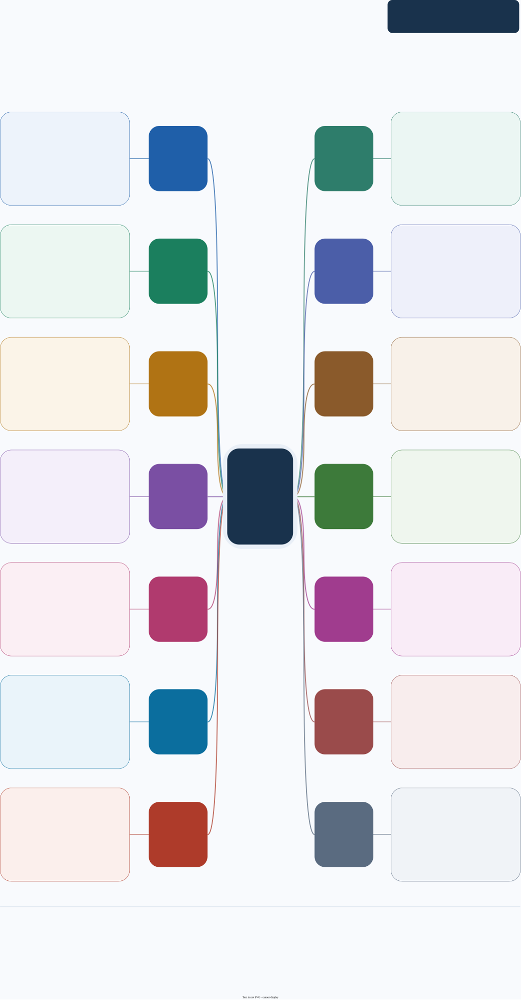

临床回归工具箱：队列筛选、基线表、效应估计、生存曲线、变量选择、交互与非线性展示。

本页集中展示三张图：先看功能总览，再查接口索引，最后看处理流程与返回对象。**点击图片可放大查看**，也可下载图源继续编辑。

[下载 draw.io 图源](../assets/module-maps/regr/regr-package-mindmap.drawio){.btn .btn-outline-primary download="regr-package-mindmap.drawio"}
[下载三页 PDF](../assets/module-maps/regr/regr-package-mindmap.drawio.pdf){.btn .btn-outline-secondary download="regr-package-mindmap.drawio.pdf"}

图谱快照：**2026-09-13**。对应包版本：**0.1.3**。具体参数和返回值以当前安装版本的帮助页为准。

函数示例：[队列筛选与流程图：plt_flo / plt_flo2](flow-guide.qmd) · [效应估计与森林图](forest-guide.qmd) · [KM/CIF 组合图：get_cat 与 plt_cat1/2/3](cat-guide.qmd) · [交互分析、绝对风险与 Word 表格导出](interaction-guide.qmd)。各页均提供参数标签页、实际图形与可复现代码。

::: {.callout-note title="图谱快照与当前接口"}
这份图谱记录 2026-09-13 的 106 个导出接口。2026-10-01 核对本地 `NAMESPACE` 时有 107 个导出项，新增的 `set_eff()` 尚未列入这份图的索引；可直接查看[数值替换与置信区间示例](forest-guide.qmd#set-eff)。
:::

## 功能总览

{width=100% fig-alt="RegR 的功能总览；点击图片可放大阅读。"}

[查看原尺寸 PNG](../assets/module-maps/regr/regr-package-mindmap-p1.drawio.png)

## 完整函数索引

{width=100% fig-alt="RegR 的完整函数索引；点击图片可放大阅读。"}

[查看原尺寸 PNG](../assets/module-maps/regr/regr-package-mindmap-p2.drawio.png)

## 分析流程与对象流

{width=100% fig-alt="RegR 的分析流程与对象流；点击图片可放大阅读。"}

[查看原尺寸 PNG](../assets/module-maps/regr/regr-package-mindmap-p3.drawio.png)

三页分别用于了解模块分工、定位公共接口和衔接输入输出。图中的流程分支按具体任务选择。

## RCS 与切点分析教程

- [RCS 组合图：get_rcs_all 的 7 种模式，16 张实际图形](rcs-guide.qmd)
- [get_cut、get_cut_ci 与 get_cut_plot：两段模型、曲线切点与 bootstrap 区间](cut-guide.qmd)

## 新增教程目录

以下页面按 RegR 0.1.3 当前源码核对，使用 WSL R 4.4.3 实际运行示例。沿用 SHAP 页的参数标签页、代码与实际结果展示方式；表格页面直接嵌入汇总表。

| 分析任务 | 页面与主要入口 |
|:--|:--|
| 递归分区与节点结局 | [RPA：get_rpa、树图、节点曲线与汇总](rpa-guide.qmd) |
| 倾向评分、匹配与加权 | [PS：get_psm、get_iptw、get_ps 与平衡诊断](ps-guide.qmd) |
| 变量筛选 | [筛选、LASSO、Boruta、相关性与 VIF](variable-selection-guide.qmd) |
| 描述性与模型表格 | [基线表、回归表与生存汇总](table-guide.qmd) |
| 单因素与多因素模型 | [get_um 的变量选择、比值与绝对效应](um-guide.qmd) |
| 同一暴露的多个模型 | [get_eff_cat：调整集合、结局与分层](eff-cat-guide.qmd) |
| 模型评价 | [AUC、Brier、AIC 与独立留出样本](model-evaluation-guide.qmd) |
| 预测模型可视化 | [Cox/Logistic 列线图、ROC、校准与 DCA](nomogram-guide.qmd) |
| 条件生存 | [get_cs、get_cs_time 与 KM 比值](conditional-survival-guide.qmd) |
| 瞬时风险 | [get_hzd、get_hzd_group 与协变量标准化](hazard-guide.qmd) |
| 纵向分组轨迹 | [GBTM：拟合、组数比较与后验分类](gbtm-guide.qmd) |
| 组间特征差异 | [SMD、Cohen's d、点图、雷达图与类别格图](effect-comparison-guide.qmd) |

三个原有页面同时补充了[森林图的 set_eff](forest-guide.qmd#set-eff)、[亚组效应与交互合并表](interaction-guide.qmd#get-eff-inter)和[分面概率差曲线](facet-guide.qmd#facet-diff)。各页单独说明参考水平、估计量、时间单位及当前实现的限制。
