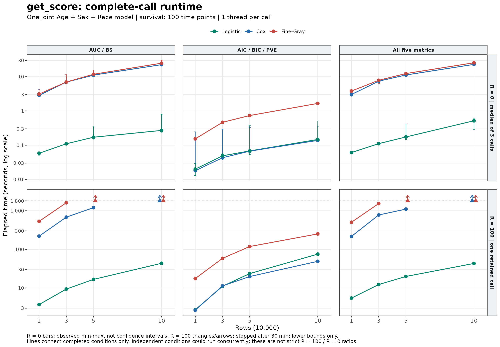

本页属于 [跨包性能评估](performance-evaluation.qmd)，补充 [Logistic 与 Fine–Gray 拟合评估](scoring-fit-benchmark-20261003.qmd) 之后的完整 `get_score()` 实测。这里的计时包括拟合、评分和结果对象构造，范围大于单次 `glm()`、`coxph()` 或 `FGR()`。

::: {.callout-note title="2026-10-07 更新"}
新的 [Windows / WSL 对照与四项优化](get-score-optimization-20261007.qmd) 已发布，包含指标复用、bootstrap 任务融合、worker 环境精简及单模型大时间网格分块。本文保留 10 月 3 日源码快照的大样本和超时记录；新实测不替换旧结果，也不补全旧矩阵中停止的条件。
:::

## 主要结果 {#get-score-bootstrap-20261003}

- **不重采样（R=0）**：10万行默认 AUC/BS 调用中位数为 Logistic **0.270秒**、Cox **22.486秒**、Fine–Gray **24.817秒**。
- **100次 bootstrap（R=100）**：1万行默认调用为 **3.721 / 219.249 / 530.509秒**；3万行为 **9.367 / 681.876 / 1608.497秒**，顺序同上。
- **36个 R=100 条件中30个完整完成、6个超过30分钟后停止**。5万 Fine–Gray 的默认/全部指标、10万 Cox 与 Fine–Gray 的默认/全部指标均为超时记录。
- 仅计算 AIC/BIC/PVE 的100次 bootstrap，10万行为 Logistic **75.285秒**、Cox **48.996秒**、Fine–Gray **251.173秒**。

::: {.callout-important}
### 超时不是完成100次评估

超时条件均完成了1次原始拟合、100次重拟合和100次预测，但验证集指标计算尚未全部完成。表中的 **>30分钟** 是实测下界，不是完整调用耗时，也没有用于推算最终运行时间。
:::

## 耗时图

{#fig-get-score-runtime width=100% fig-alt="三个模型、四档样本量、三种指标组合的耗时；R=100 六个超时条件用1800秒下界箭头表示。"}

[下载耗时图 PDF](bench/get_score_20261003_runtime.pdf)。误差线是 R=0 三次计时的最小—最大值，**不是统计置信区间**；R=100 没有重复运行完整100次矩阵，因此不展示计时误差线。

## 测试口径

| 项目 | 设置 |
|:--|:--|
| 日期、环境 | 2026-10-03；WSL Ubuntu-22.04；R 4.4.3；Intel Core Ultra 9 275HX；WSL总内存约117 GiB |
| 依赖版本 | RegR 0.1.3；riskRegression 2026.3.11；cmprsk 2.2.12；survival 3.8.12；prodlim 2026.3.11 |
| 原始数据 | `seer_thyroid_mtc_2026`；`time/DSS/event/Age/Sex/Race` 共同完整且 `time > 0`，4387行 |
| 扩样 | 数据种子20261003；有放回抽取10万行，再取1万、3万、5万、10万行嵌套前缀；保留原始月份与并列时间 |
| 模型 | 一个 `Age + Sex + Race` 联合模型；`vars = list(full = c("Age", "Sex", "Race"))` |
| 分支 | Logistic：`surv = "DSS"`；Cox：`surv = TRUE`（time/DSS）；Fine–Gray：`surv = FALSE`（time/event，cause=1），`FGR(variance = FALSE)` |
| 生存时间网格 | `timepoint = seq(2, 200, 2)`，100个时点；Logistic是二分类终点评估，不使用时间网格 |
| 评分输出 | `score_args = list(plots = "auto", n_cores = 1L)`；保留原生指标标准误和区间计算 |
| 单次调用线程 | BLAS / OpenMP / MKL均1线程；R=100另设 `mc.cores = 1`、data.table 1线程 |
| R=0运行安排 | 样本量/模型独立进程；1000行预热；三种指标配置轮换顺序，每格3次；108次正式调用全部完成 |
| R=100运行安排 | bootstrap种子20261004；每格保留一次正式测量；最多4个独立条件并发，10万条件最多2个；补测对5万及以上高内存条件合计限制为2个 |
| 计时边界 | 包含原始拟合、重采样、预测、指标计算、表格整理和ggplot对象构造；排除加载包/数据、预热、计时前GC与实际图形渲染 |

**扩展到10万行不等于增加到10万名独立患者。** 本页用于计算性能评估，不用于估计扩大队列后的统计精度或泛化能力。参数维数、事件时间、时间网格、缺失情况和硬件变化都可能改变耗时。

R=0记录的源码提交为 `535c303a75763a4a399ac33587772f5ce3b421e5`；R=100记录为 `851b40f4eafa0dc5abc3d5b6bffd100a16d22ba8`。两轮的目标文件 `R/msr-riskRegression.R`、`R/msr-fit-stats.R` MD5相同，R=100结束时源码/数据哈希及依赖版本核对一致；完整记录见证据包。源码入口为 `get_score()` 的模型分派、`riskRegression::Score()` 调用和 `.fit_stats_result()` 似然指标提取。

::: {.callout-note}
### 两轮不能计算严格的速度倍数

R=0为各条件独立运行3次的中位数，R=100为一次保留测量且存在条件间并发。R=100的预测指标使用bootcv验证集，R=0未重采样；评估方式也不同。本页不将两轮差异解释为严格加速比，也不把指标数值差异当作后端误差。
:::

## 完整调用耗时

::: {.panel-tabset}

### R=0：不重采样

单位为秒，格式为 **中位数 [最小–最大]**；每格3次。

| 模型 | 指标 | 1万 | 3万 | 5万 | 10万 |
|:--|:--|--:|--:|--:|--:|
| Logistic | 默认 AUC/BS | 0.058 [0.051–0.064] | 0.110 [0.103–0.119] | 0.171 [0.150–0.347] | 0.270 [0.239–0.794] |
| Logistic | 仅 AIC/BIC/PVE | 0.020 [0.013–0.029] | 0.049 [0.038–0.058] | 0.068 [0.053–0.372] | 0.147 [0.142–0.508] |
| Logistic | 全部五项 | 0.061 [0.061–0.066] | 0.111 [0.103–0.118] | 0.174 [0.147–0.415] | 0.517 [0.284–0.616] |
| Cox | 默认 AUC/BS | 2.855 [2.573–4.170] | 6.934 [6.662–9.902] | 11.125 [10.879–14.701] | 22.486 [21.945–26.608] |
| Cox | 仅 AIC/BIC/PVE | 0.018 [0.018–0.245] | 0.043 [0.043–0.285] | 0.067 [0.066–0.327] | 0.138 [0.134–0.360] |
| Cox | 全部五项 | 3.028 [2.693–3.053] | 7.411 [6.372–7.575] | 11.225 [10.928–12.604] | 22.887 [22.473–23.167] |
| Fine–Gray | 默认 AUC/BS | 3.114 [2.812–4.338] | 6.988 [6.945–11.463] | 11.790 [11.161–15.076] | 24.817 [24.697–29.910] |
| Fine–Gray | 仅 AIC/BIC/PVE | 0.153 [0.147–0.173] | 0.466 [0.443–0.468] | 0.735 [0.734–0.742] | 1.660 [1.631–1.692] |
| Fine–Gray | 全部五项 | 3.815 [2.944–3.950] | 7.856 [6.282–8.389] | 12.351 [11.794–12.578] | 25.498 [25.408–26.053] |

### R=100：100次 bootstrap

单位为秒；完成条件是一次保留的完整调用，超时条件按30分钟预算停止。

| 模型 | 指标 | 1万 | 3万 | 5万 | 10万 |
|:--|:--|--:|--:|--:|--:|
| Logistic | 默认 AUC/BS | 3.721 | 9.367 | 16.690 | 43.599 |
| Logistic | 仅 AIC/BIC/PVE | 2.728 | 11.077 | 23.598 | 75.285 |
| Logistic | 全部五项 | 5.470 | 12.275 | 19.880 | 43.178 |
| Cox | 默认 AUC/BS | 219.249 | 681.876 | 1202.621 | **>30分钟，已停止** |
| Cox | 仅 AIC/BIC/PVE | 2.666 | 11.324 | 19.784 | 48.996 |
| Cox | 全部五项 | 216.430 | 775.923 | 1102.536 | **>30分钟，已停止** |
| Fine–Gray | 默认 AUC/BS | 530.509 | 1608.497 | **>30分钟，已停止** | **>30分钟，已停止** |
| Fine–Gray | 仅 AIC/BIC/PVE | 17.539 | 58.472 | 118.455 | 251.173 |
| Fine–Gray | 全部五项 | 503.733 | 1531.875 | **>30分钟，已停止** | **>30分钟，已停止** |

仅似然指标与全部指标耗时不必单调增加：两者采用的重采样/评估方式不同，还混合了进程运行波动。不能由 Logistic 的43.178秒与75.285秒推断“多计算指标反而更快”。

:::

## 30分钟停止记录 {#bootstrap-timeouts}

监控以调用开始的墙钟时间判断1800秒预算，另预留10秒用于计时前GC和轮询。`stopped_elapsed_wall_s` 保存实际停止时间；它不是已完成的调用耗时。进度每10次写入，因此验证集数量是停止前最近快照的**下界**。RSS也是快照值，不是峰值内存。

| 样本量 | 模型 | 指标 | 已完成拟合 | 已完成预测 | 验证集计算至少 | 最近RSS（GiB） |
|--:|:--|:--|--:|--:|--:|--:|
| 50,000 | Fine–Gray | 全部五项 | 101/101 | 100/100 | **≥60/100** | 25.27 |
| 100,000 | Cox | 全部五项 | 101/101 | 100/100 | **≥80/100** | 45.15 |
| 100,000 | Fine–Gray | 全部五项 | 101/101 | 100/100 | **≥20/100** | 56.55 |
| 50,000 | Fine–Gray | 默认 AUC/BS | 101/101 | 100/100 | **≥60/100** | 25.72 |
| 100,000 | Cox | 默认 AUC/BS | 101/101 | 100/100 | **≥90/100** | 45.13 |
| 100,000 | Fine–Gray | 默认 AUC/BS | 101/101 | 100/100 | **≥30/100** | 50.00 |

两个10万生存模型的进程内存曾达到约45–57 GiB，这也是补测限制高内存条件并发数的原因。这里没有完整测量峰值，也不能将快照内存当作所有场景的最低内存要求。

## 阶段耗时与结果核验

本轮完成的生存预测评估中，大部分耗时在 `Score()` 及其内部验证计算。例如3万行 Fine–Gray 默认调用为 **1608.497秒**：原始拟合 **0.560秒**，100次重拟合合计 **65.832秒**，`Score()` **1607.844秒**。

::: {.callout-warning}
### 阶段计时不能直接相加

`Score()` 包含它内部的100次重拟合，**不能再把100次拟合合计加到Score上**。仅似然指标的普通bootstrap没有Score阶段。各列用于定位耗时范围，不是互斥的分解。
:::

<details>
<summary>展开30个完整条件的阶段计时（秒）</summary>

| 样本量 | 模型 | 指标 | 总秒数 | 原始拟合 | 100次重拟合合计 | Score |
|--:|:--|:--|--:|--:|--:|--:|
| 10,000 | Logistic | 默认 AUC/BS | 3.721 | 0.009 | 1.567 | 3.687 |
| 30,000 | Logistic | 默认 AUC/BS | 9.367 | 0.027 | 5.396 | 9.320 |
| 50,000 | Logistic | 默认 AUC/BS | 16.690 | 0.067 | 12.205 | 16.601 |
| 100,000 | Logistic | 默认 AUC/BS | 43.599 | 0.192 | 33.695 | 43.375 |
| 10,000 | Logistic | 仅 AIC/BIC/PVE | 2.728 | 0.010 | 2.123 | 0.000 |
| 30,000 | Logistic | 仅 AIC/BIC/PVE | 11.077 | 0.054 | 9.511 | 0.000 |
| 50,000 | Logistic | 仅 AIC/BIC/PVE | 23.598 | 0.096 | 20.096 | 0.000 |
| 100,000 | Logistic | 仅 AIC/BIC/PVE | 75.285 | 0.965 | 60.784 | 0.000 |
| 10,000 | Logistic | 全部五项 | 5.470 | 0.009 | 3.418 | 5.437 |
| 30,000 | Logistic | 全部五项 | 12.275 | 0.053 | 8.649 | 12.197 |
| 50,000 | Logistic | 全部五项 | 19.880 | 0.087 | 14.903 | 19.762 |
| 100,000 | Logistic | 全部五项 | 43.178 | 0.187 | 31.955 | 42.951 |
| 10,000 | Cox | 默认 AUC/BS | 219.249 | 0.016 | 1.631 | 219.132 |
| 30,000 | Cox | 默认 AUC/BS | 681.876 | 0.067 | 6.147 | 681.734 |
| 50,000 | Cox | 默认 AUC/BS | 1202.621 | 0.111 | 10.418 | 1202.372 |
| 10,000 | Cox | 仅 AIC/BIC/PVE | 2.666 | 0.015 | 1.839 | 0.000 |
| 30,000 | Cox | 仅 AIC/BIC/PVE | 11.324 | 0.053 | 7.841 | 0.000 |
| 50,000 | Cox | 仅 AIC/BIC/PVE | 19.784 | 0.093 | 14.321 | 0.000 |
| 100,000 | Cox | 仅 AIC/BIC/PVE | 48.996 | 0.567 | 37.074 | 0.000 |
| 10,000 | Cox | 全部五项 | 216.430 | 0.013 | 1.389 | 216.332 |
| 30,000 | Cox | 全部五项 | 775.923 | 0.056 | 6.908 | 775.800 |
| 50,000 | Cox | 全部五项 | 1102.536 | 0.110 | 12.262 | 1102.283 |
| 10,000 | Fine–Gray | 默认 AUC/BS | 530.509 | 0.178 | 19.976 | 530.277 |
| 30,000 | Fine–Gray | 默认 AUC/BS | 1608.497 | 0.560 | 65.832 | 1607.844 |
| 10,000 | Fine–Gray | 仅 AIC/BIC/PVE | 17.539 | 0.138 | 15.787 | 0.000 |
| 30,000 | Fine–Gray | 仅 AIC/BIC/PVE | 58.472 | 0.446 | 53.523 | 0.000 |
| 50,000 | Fine–Gray | 仅 AIC/BIC/PVE | 118.455 | 1.442 | 111.232 | 0.000 |
| 100,000 | Fine–Gray | 仅 AIC/BIC/PVE | 251.173 | 2.822 | 233.225 | 0.000 |
| 10,000 | Fine–Gray | 全部五项 | 503.733 | 0.139 | 16.617 | 503.510 |
| 30,000 | Fine–Gray | 全部五项 | 1531.875 | 0.434 | 51.166 | 1531.266 |

</details>

- R=0的108次正式调用均成功，警告总数为0；每次一个原始拟合。12组模型/样本量中，全部指标与对应子集的AUC/Brier、标准误/区间及似然指标在1e-10容差内一致。
- R=100的30个完成条件均确认 **101次拟合**；预测条件确认100次预测和100次验证集计算；含似然指标的完成条件确认 `R_success = 100`，完成调用没有警告。
- R=100具有完整对照结果的9组中，默认与全部指标的AUC/Brier、SE、CI和最终随机数状态一致（容差1e-10）；全部与仅似然的原始AIC/BIC/PVE点估计也一致。
- 超时条件没有最终评分区间，不能据此验证尚未完成的全部指标与默认指标是否一致。

## 三种指标配置的含义

| 配置 | R=100时的评估对象 | 适用问题 |
|:--|:--|:--|
| AUC/BS | bootcv训练模型的验证集预测性能 | 判别与预测误差 |
| AIC/BIC/PVE | 原始模型点估计，以及普通受试者bootstrap的似然指标区间 | 使用同一后端和分析样本比较拟合/模型选择指标 |
| 全部五项 | 预测指标为bootcv；似然指标复用对应训练模型，不再另拟合100次 | 同时获得预测与似然指标 |

全部与仅似然使用的重采样方式不同，**似然区间不要求数值相同**；原始模型的AIC/BIC/PVE点估计已核对一致。Fine–Gray使用 `variance = FALSE` 保留本轮需要的拟合/预测信息，Score的指标区间和bootstrap工作仍存在；它不能消除本页实测的验证计算耗时。

## 复现调用与返回对象

以下为可复制的调用示例；网页构建只整理既有实测，**不重新运行大样本100次bootstrap矩阵**。

```r
library(RegR)
data(seer_thyroid_mtc_2026, package = "RegR")
raw <- as.data.frame(seer_thyroid_mtc_2026)
need <- c("time", "DSS", "event", "Age", "Sex", "Race")
source <- droplevels(raw[complete.cases(raw[need]) & raw[["time"]] > 0, need])
set.seed(20261003)
big <- source[sample.int(nrow(source), 100000L, replace = TRUE), ]
rownames(big) <- NULL
d <- big[seq_len(10000L), ]  # 改为30000、50000或100000需保留同一big

# 控制单个调用的线程；基准驱动还会在每个子进程设置data.table/BLAS线程
options(mc.cores = 1L)
RhpcBLASctl::blas_set_num_threads(1L)
RhpcBLASctl::omp_set_num_threads(1L)
data.table::setDTthreads(1L)
set.seed(20261004)
res <- RegR::get_score(
  d, vars = list(full = c("Age", "Sex", "Race")),
  surv = FALSE,  # "DSS"：Logistic；TRUE：Cox；FALSE：Fine–Gray
  timepoint = seq(2, 200, 2), R = 100,
  metrics = c("AUC", "BS", "AIC", "BIC", "PVE"),
  score_args = list(plots = "auto", n_cores = 1L)
)
res[["AUC.BS.AIC"]]       # 汇总表
res[["fit.stats"]][["stats"]]  # 似然点估计及区间
res[["fit.stats"]][["info"]]   # 包括R_success
res[["plt.combined"]]    # 本轮计时构造对象，实际渲染排除在计时外
```

只需似然指标时，改为 `metrics = c("AIC", "BIC", "PVE")`；这不提供AUC/Brier评估。仅似然调用返回列表，包含 `fit.stats` 和汇总表，预测绘图对象为空；预测调用保留Score结构，选择似然指标时另带 `fit.stats`。用字符向量 `vars = c("Age", "Sex", "Race")` 会分别拟合多个模型，不能直接套用本页的联合模型耗时。

## 证据下载与审计记录

[下载完整证据包（CSV、逐次拟合耗时、环境、校验和与脚本）](bench/get_score_20261003_evidence.zip)。其中不包含患者原始数据；`README.md`说明每类文件、源码快照、失败/重跑记录与复现步骤。

- R=0：36格汇总与108次原始计时、阶段耗时、环境/源码哈希。
- R=100：36格状态、30次完成计时、3030条原始/重拟合计时、6次超时进度、9组完整对照核验及元数据。
- `get-score-bootstrap-run.R`是按条件限时、跳过已有完成/超时记录的驱动；与`get-score-bootstrap-benchmark.R`一起复制到已存在的新输出目录，再执行。最初脚本的旧控制器预算不能单独代表运行中追加的30分钟限制。

```bash
# 具备相同WSL依赖；将上述两份脚本复制到新的输出目录
Rscript /absolute/output/get-score-bootstrap-run.R /absolute/output
```

<details>
<summary>展开预热、调度中断和补测说明</summary>

3万Cox的1000行、R=2预热出现区间格式化错误，正式R=100计时尚未开始；补测采用R=0预热，正式评估仍为R=100。补测调度曾短暂重复启动5万Fine–Gray默认与10万Cox全指标条件，已停止并排除重复调用；原10万Cox全指标曾短暂增加并发负载，限制了其精细计时/进度比较。

5万Fine–Gray默认条件达到预算后，调度器读取已关闭日志连接时退出，连带中断了未超时的10万Cox默认调用。修正日志读取后重新运行该条件；被中断调用不计入正式结果。关闭日志处理已做聚焦验证，最终两个超时条件处理后驱动正常结束。原始status中的进程error包含这些人为终止和预热失败；最终条件状态以 `get-score-bootstrap-summary.csv` 为准。

这些是基准执行过程记录，不是将超时误报为模型拟合失败。本页没有把超时调用当作100次完整评估，也没有修改包默认参数来降低本轮工作量。

</details>
