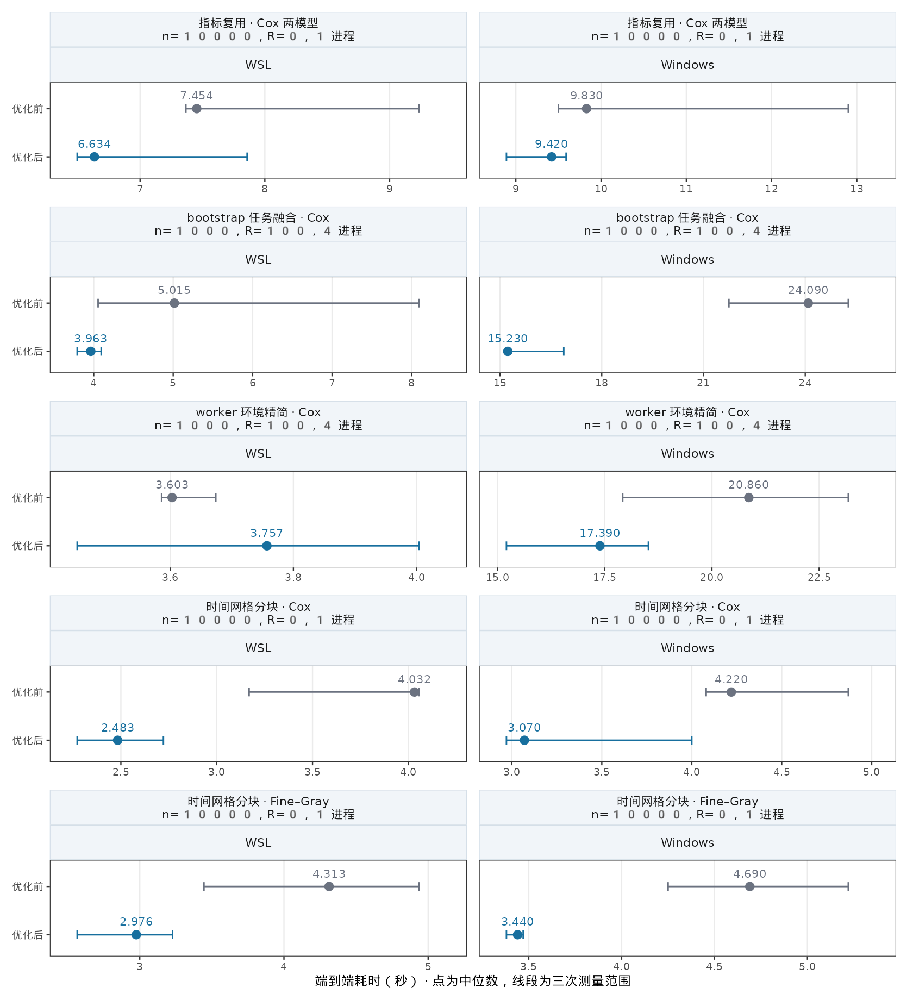

本页属于 [跨包性能评估](performance-evaluation.qmd)，记录 `RegR::get_score()` 在同一台机器上的 Windows / WSL 比较，以及随后四项优化的端到端计时。当前实现对应 RegR 0.1.3 的提交 [`b8a3337`](https://github.com/HUI950319/RegR/commit/b8a33371de0436ff3abe0c007a050677cc9ed154)。接口与返回对象见[模型评价教程](model-evaluation-guide.qmd#get-score-current)。

## 主要结果

- **单模型、1 万行、100 个时间点、R=0：** 时间网格分块后，Cox 中位耗时在 WSL 为 **4.032 → 2.483 秒**，Windows 为 **4.220 → 3.070 秒**；Fine–Gray 分别为 **4.313 → 2.976 秒**、**4.690 → 3.440 秒**。
- **Cox、1000 行、R=100、4 个工作进程：** 将拟合、预测与评分放在同一 bootstrap 任务内，WSL 为 **5.015 → 3.963 秒**，Windows 为 **24.090 → 15.230 秒**。
- **Windows worker 环境精简：** 配对中位耗时为 **20.860 → 17.390 秒**；任务序列化体积减少约 **51%**。同配置的 WSL 耗时为 **3.603 → 3.757 秒**，没有显示提速。
- 混合请求直接 `AUC/BS` 与 `AUC_score/BS_score` 时，复用已有结果与删失预处理。两模型 Cox 的 WSL / Windows 配对中位耗时分别下降 **11.0% / 4.2%**。

::: {.callout-important title="每项都有自己的前一版本基线"}
下表按同一系统、同一数据、同一参数的 before/after 各三次交替测量，报告中位数与范围。四项并非同一个累计对照，降幅不能相加；尤其不能将 Windows 的 `24.090 → 15.230` 与另一轮的 `20.860 → 17.390` 串成一条计时序列。
:::

## 优化前后耗时图

{#fig-score-optimization width=100% fig-alt="Windows 与 WSL 的五种代表配置优化前后耗时，包含未显示收益的 WSL worker 精简配置。"}

[下载耗时图 PDF](bench/get_score_20261007_optimization.pdf){.btn .btn-outline-secondary download="get_score_20261007_optimization.pdf"}

## 三次配对的完整结果

单位为秒，格式为 **中位数 [最小–最大]**。时间网格均为 `seq(2, 200, 2)`；默认预测指标是 `AUC_score/BS_score`。

::: {.panel-tabset}

### 单模型大时间网格

配置：1 万行、R=0、一个 Age + Sex + Race 联合模型、1 个进程；两边都先以完整代表规模预热。

| 模型 | 系统 | 优化前 | 优化后 | 中位耗时下降 |
|:--|:--|--:|--:|--:|
| Cox | WSL | 4.032 [3.169–4.056] | **2.483 [2.272–2.722]** | 38.4% |
| Cox | Windows | 4.220 [4.080–4.870] | **3.070 [2.970–4.000]** | 27.3% |
| Fine–Gray | WSL | 4.313 [3.445–4.937] | **2.976 [2.566–3.227]** | 31.0% |
| Fine–Gray | Windows | 4.690 [4.250–5.220] | **3.440 [3.380–3.470]** | 26.7% |

完整原生 Score 返回对象、点估计、SE/CI、ROC 数据及最终 RNG 状态一致。分块只改变中间计算规模，100 个时间点全部保留。

### bootstrap 与 worker 环境

配置：Cox、1000 行、R=100、一个联合模型、默认预测指标。

| 优化项 | 系统 | 进程数 | 优化前 | 优化后 |
|:--|:--|--:|--:|--:|
| 合并拟合、预测、评分任务 | WSL | 2 | 6.235 [5.576–9.208] | **4.976 [4.373–5.115]** |
| 合并拟合、预测、评分任务 | WSL | 4 | 5.015 [4.055–8.095] | **3.963 [3.792–4.094]** |
| 合并拟合、预测、评分任务 | Windows | 4 | 24.090 [21.750–25.270] | **15.230 [15.190–16.880]** |
| 精简 worker 环境 | WSL | 2 | 4.402 [4.091–4.582] | 4.436 [4.435–4.659] |
| 精简 worker 环境 | WSL | 4 | 3.603 [3.586–3.674] | 3.757 [3.449–4.004] |
| 精简 worker 环境 | Windows | 4 | 20.860 [17.920–23.180] | **17.390 [15.210–18.520]** |

合并任务采用 300 行、R=4、同核数预热；环境精简的最终测量采用完整 1000 行、R=100 预热。WSL 环境精简的中位耗时略增，不能描述成跨平台普遍提速。

### 混合指标复用

配置：Cox、1 万行、R=0、1 个进程；两个联合模型 Basic = Age + Sex、Full = Age + Sex + Race。同时请求 `AUC_score/BS_score/AUC/BS/AIC/BIC/PVE`，先以 300 行预热。

| 系统 | 优化前 | 优化后 | 中位耗时下降 |
|:--|--:|--:|--:|
| WSL | 7.454 [7.367–9.236] | **6.634 [6.496–7.858]** | 11.0% |
| Windows | 9.830 [9.500–12.900] | **9.420 [8.890–9.590]** | 4.2% |

同一分析样本和时间网格下复用已计算的直接指标及 SE，只补缺少的指标。跨模型共用删失预处理；新抽样仍需重新准备，不能跨 bootstrap 使用旧缓存。

:::

## 四项实现与适用边界 {#implementation-boundaries}

| 提交 | 改动 | 保留的计算与回退 |
|:--|:--|:--|
| [`d2c1d9a`](https://github.com/HUI950319/RegR/commit/d2c1d9a3c72513f2e8fdd85476567e46c4b4da5a) | 复用直接 AUC/BS 与公共预处理 | 样本和时间网格必须一致；只请求 BS 不要求 AUC 可定义；均值不匹配时仍不展示补算区间。 |
| [`7aee186`](https://github.com/HUI950319/RegR/commit/7aee18650facfa6a940faba160ab459804e4e790) | 每个并行 bootstrap 任务预测后立即评分 | 原生训练/验证划分、删失权重、配对失败剔除与百分位区间保留；第二轮指标循环复用结果；未知上游循环形状回退原路径。 |
| [`5cc7e6c`](https://github.com/HUI950319/RegR/commit/5cc7e6cea018134a5a443251057a830e59f46ff0) | 缩小闭包和 worker 输入 | 只传表达式实际引用的绑定；仅在请求拟合指标时携带其回调；索引函数和随机种子调用保持。基础 PSOCK 包装器不会仅因父环境加载整个 RegR。 |
| [`b8a3337`](https://github.com/HUI950319/RegR/commit/b8a33371de0436ff3abe0c007a050677cc9ed154) | 单模型大时间网格分块 | 仅用于无重采样的完整生存数据；`行数 × 时间点数 > 500000`，时点为正数、递增、无重复且在随访内。每块目标约 100000 个体×时间行，仍只拟合一次。多模型与不规则网格保留原路径。 |

Windows 的任务序列化诊断为 **670937 → 329442 bytes**，减少 50.9%。这衡量发送任务的体积。bootstrap 仍保留原生全量预测验证表，本轮没有测得整次调用的峰值内存降幅。

时间网格分块保留原生逐时点推断。汇总列的时间平均区间继续采用现有直接评分近似，含义见[时间平均的区间说明](model-evaluation-guide.qmd#get-score-current)；这项性能优化没有新增跨时点协方差估计，也没有把简单时间平均改为 IBS。

## Windows 与 WSL 的优化前基准 {#cross-platform-baseline}

这组基准使用同一个源码提交 [`0af26ef`](https://github.com/HUI950319/RegR/commit/0af26ef88b916a51ea25f304453e5eaa227bb0af) 与固定输入，共 54 次正式调用。它是实施上述四项优化之前的环境比较，与后续独立 A/B 表分开。

### R=0：1 万行、1 个进程

| 模型 | WSL | Windows | Windows / WSL |
|:--|--:|--:|--:|
| Logistic | 0.115 [0.104–0.121] | 0.150 [0.140–0.190] | 1.30× |
| Cox | 5.575 [5.479–6.051] | 6.050 [6.030–6.360] | 1.09× |
| Fine–Gray | 6.153 [6.028–6.589] | 6.990 [6.930–7.200] | 1.14× |

### R=100：1000 行

| 模型 | 进程数 | WSL | Windows | Windows / WSL |
|:--|--:|--:|--:|--:|
| Logistic | 1 | 1.031 [1.001–1.068] | 1.370 [1.230–1.390] | 1.33× |
| Logistic | 4 | 1.150 [1.056–1.182] | 19.010 [18.890–19.170] | 16.53× |
| Cox | 1 | 10.154 [9.699–11.020] | 11.780 [11.000–12.700] | 1.16× |
| Cox | 4 | 8.056 [7.792–8.101] | 28.850 [28.240–30.280] | 3.58× |
| Fine–Gray | 1 | 11.733 [11.508–12.020] | 16.200 [14.860–16.530] | 1.38× |
| Fine–Gray | 4 | 8.753 [8.669–9.099] | 30.570 [29.810–32.440] | 3.49× |

Windows 强制 4 个进程在这份优化前基准中更慢。后续融合任务和缩小闭包确实降低该路径耗时，但没有重新完成最终版本的三模式 1/2/4 进程矩阵，因此不能据此宣布 Windows 并行已全面超过串行。

54 次调用全部成功、无评分警告，R=100 均保留 100 个有效重复。45 组跨系统及同系统串行/4 进程比较通过，AUC/Brier、SE/CI 最大绝对差为 `8.3266727e-17`，格式化摘要、返回字段/类别及 RNG 状态一致。图形字体与实际渲染差异未纳入数值对照。

## 未采用的候选与核数选择

- **小 Logistic bootstrap 强制串行：** 新的 WSL 三次核数对照，1000 行、R=100 的 1/2/4 进程中位数为 **0.774 / 0.743 / 0.554 秒**；1 万行为 **3.354 / 1.578 / 1.429 秒**。新证据不支持收紧该配置的自动并行阈值；优化前基准的一次环境结果不能作为固定阈值。
- **原生 Score iid 复用平均指标 SE：** 1 万行 Cox 的直接 CI 补算与 `keep="iid"` 路径分别为 **2.794 / 3.086 秒**。结果一致，但没有性能收益，未合入。
- **多模型并行时间分块：** WSL 两模型、2 进程、混合指标为 **6.090 → 6.328 秒**，没有显示收益。最终实现限定为单模型。

`score_args$n_cores = NULL` 继续使用自适应策略：Windows 的 Score bootstrap 默认串行，WSL 在工作量足够时最多用 4 个工作进程；显式核数优先，仍受可用核数和 `options(mc.cores)` 上限限制。本页计时固定 BLAS/OpenMP/data.table 为 1 线程，工作进程数与数值库线程数应分别设置。

## 可复制调用

以下调用复用本轮输入准备方式。网页仅展示已有测量，不在构建时重跑 R=100 矩阵。复制后会实际运行对应规模。

```r
library(RegR)
data("seer_thyroid_mtc_2026", package = "RegR")
required <- c("time", "DSS", "event", "Age", "Sex", "Race")
raw <- as.data.frame(seer_thyroid_mtc_2026)
d <- droplevels(raw[complete.cases(raw[required]) & raw[["time"]] > 0,
                   required])
set.seed(20261007)
bench <- d[sample.int(nrow(d), 10000L, replace = TRUE), , drop = FALSE]
rownames(bench) <- NULL
models <- list(full = c("Age", "Sex", "Race"))
options(mc.cores = 4L)

set.seed(20261008)
score_full <- run_quiet(get_score(
  bench, vars = models, surv = TRUE, R = 0,
  timepoint = seq(2, 200, 2), score_args = list(n_cores = 1L)))
score_full[["AUC.BS.AIC"]]

set.seed(20261008)
score_boot <- run_quiet(get_score(
  bench[1:1000, ], vars = models, surv = TRUE, R = 100,
  timepoint = seq(2, 200, 2), score_args = list(n_cores = 1L)))
score_boot[["AUC.BS.AIC"]]
attr(score_boot[["AUC.BS.AIC"]], "valid_reps")
```

要对照 4 个进程，应在相同输入和种子下只将 `n_cores` 改为 `4L`。Fine–Gray 改为 `surv = FALSE`，Logistic 为 `surv = "DSS"`。`R=0/1` 是传入队列的表观评价；R≥2 的 Score 指标是原生 bootcv 验证评价。直接 `AUC/BS/AIC/BIC/PVE` 复用的是训练拟合，不能与袋外指标混同。扩展输入行数只用于性能测试，不代表新增独立患者。

严格复现计时还需按下载脚本将 BLAS/OpenMP/MKL/data.table 线程设为 1，预热后交替重复三次；只调用一次 `system.time()` 不等同于本页协议。

## 环境、版本与验证

| 项目 | 本轮设置 |
|:--|:--|
| 硬件与系统 | 同机 Intel Core Ultra 9 275HX，24 个逻辑 CPU；WSL2 Ubuntu 22.04 / Linux 6.6.87.2，Windows 11 build 26200；均 R 4.4.3。 |
| 相同主要依赖 | riskRegression 2026.3.11、survival 3.8.12、prodlim 2026.3.11、cmprsk 2.2.12、mets 1.3.13、ggplot2 4.0.3。 |
| 仍有环境差异 | WSL 为 OpenBLAS，Windows 为该 R 发行版的 BLAS；data.table 1.17.8 / 1.18.2.1、parallelly 1.38.0 / 1.47.0 等版本不同。完整 sessionInfo 与环境记录见证据包。 |
| 输入与种子 | 自带 SEER 数据共同完整且 time>0 的 4387 行，种子 20261007 扩展到 1 万行；bootstrap 取前 1000 行；计时种子 20261008；整数月时间保留。 |
| 配对协议 | 端到端耗时含拟合、评分和返回对象构造；不含提前加载、数据准备、预热、计时前 GC 和文件保存。每格三次，before/after 顺序交替，重型调用串行安排。 |
| 保护上限 | 单次计时 180 秒；独立子进程另有总上限。正式表中条件均完成，没有用失败/超时调用计算中位数。 |

这比较的是当前两套实际环境，不能将所有差异归因于操作系统。正式分块计时在增加“仅单模型”的限制前完成；限制只改变多模型分支，单模型执行体未变，已有四格单模型证据继续有效，并通过最终定向检查。

优化配对调用核对估计、SE/CI、摘要、拟合统计、bootstrap 记录、有效重复与最终 RNG，容差 `1e-10`；分块独立原生 Score 参考与早期无事件时点、BS 单指标、额外 `times` 列等边界对照使用 `1e-12`。最终 Windows 相关检查通过 166 条断言；WSL 新增分块与原模型调度检查通过 38 条断言。

共享并行包装器修改后运行全包检查一次：93 个测试文件、2 个文件调度进程、759.41 秒，90 个文件通过。`test-get-eff-helpers.R`、`test-get-rpa-mp1.R`、`test-get-score-stage.R` 的 13 个失败断言与 2 个错误，在关闭本轮评分和并行优化后完全复现，记录为已有基线失败；不能将全包检查描述为全绿。`get_score` 主测试及并行工具测试通过，最终分块补做受影响用例。

10 月 3 日的 [1 万到 10 万行、30 分钟停止记录](get-score-benchmark-20261003.qmd) 保留其原始版本和统计状态。本轮没有补完旧矩阵的超时条件，也不把这里的降幅外推到其他样本量。

## 下载与复现证据

- [四项优化的 72 次正式配对耗时 CSV](bench/get_score_20261007_timings.csv) 与[逐格中位数和范围 CSV](bench/get_score_20261007_summary.csv)。
- [耗时图 PNG](bench/get_score_20261007_optimization.png) 与[矢量 PDF](bench/get_score_20261007_optimization.pdf)。
- [证据与复现脚本 ZIP](bench/get_score_20261007_evidence.zip)：优化前跨系统 CSV/一致性结果、正式与否定候选的逐次计时、逐项源码快照、环境/哈希、复现脚本与基线失败记录。只提供汇总和复现来源，不附队列逐行输入。

证据中的 `compare-step.R` 以源码快照和当前源码做独立 A/B；固定输入可用 `prepare.R` 从包内数据再生成。现有脚本沿用 `E:/Rpackage/RegR` 或 `/mnt/e/Rpackage/RegR`，其他目录需要修改 root；全量复现的计算成本高于构建此网页。
