先选择交互分析的尺度，再把原始结果交给格式化、保存或绘图函数。本页沿用 [SHAP 示例页](../mlr/shap-guide.qmd) 的展示方式：关键参数放在标签页中对照，每个示例配代码和实际结果，点击图片可以放大。

**版本与执行范围：** 接口按 RegR **0.1.3** 的本机源码快照 `0add2bb` 核对，使用 WSL R **4.4.3** 实际拟合模型，生成 **21 张不同的结果图**，并验证 3 份 Word 导出文件。页面展示已保存的汇总结果；代码可在装有相应版本 RegR 及依赖的 R 环境中复现。

Word 保存函数的正式名称是 **`save_tb_inter()`**；当前没有 `save_inter_tb` 这个别名。下文统一使用实际接口。

## 示例数据与分析尺度 {#data}

本页使用 RegR 自带的 `seer_thyroid_mtc_2026`，即 **4,387 人的甲状腺髓样癌（MTC）队列**。它与 [森林图示例](forest-guide.qmd) 使用的 M1 乳头状甲状腺癌（PTC）队列不同。

示例比较性别与种族、性别与年龄组的交互。`Female`、`White`、`<55` 显式设为参考水平；年龄组的 `>=55` 包含恰好 55 岁。按所用变量完整病例及正随访筛选，不对整个数据集插补。

```r
library(RegR)

data("seer_thyroid_mtc_2026", package = "RegR")
cohort <- as.data.frame(seer_thyroid_mtc_2026)
inter_data <- cohort[
  complete.cases(cohort[, c("Sex", "Age", "Race", "DSS", "time")]) &
    cohort$time > 0,
]
inter_data <- droplevels(inter_data)
inter_data$DSS <- as.numeric(inter_data$DSS)
inter_data$Sex <- factor(inter_data$Sex, levels = c("Female", "Male"))
inter_data$Race <- stats::relevel(factor(inter_data$Race), ref = "White")
inter_data$Age_group <- factor(
  ifelse(inter_data$Age < 55, "<55", ">=55"),
  levels = c("<55", ">=55")
)
```

下文代码共用这份 `inter_data`。各标签页分别建立有明确名称的分析对象；格式化、Word 导出和绘图部分继续使用这些对象。`run_quiet()` 只控制控制台输出，不改变模型计算。

::: {.table-responsive}

| 入口与设置 | 估计量 | 时间与结局的含义 |
|:--|:--|:--|
| `get_inter(surv = TRUE)` | Cox HR，以及基于 HR 的乘性与加性指标 | 使用 `time` 与 0/1 的 `DSS`；其他原因死亡作为删失 |
| `get_inter(surv = FALSE)` | Fine–Gray sHR，以及基于 sHR 的交互指标 | 使用 `time` 与 `event`；0 为删失、1 为目标事件、其他事件为竞争事件 |
| `get_inter(surv = "DSS")` | Logistic OR，以及基于 OR 的交互指标 | 将 `DSS` 当作二分类结局，未利用随访时间 |
| `get_inter_abs(surv = TRUE, sur_time = 120)` | 标准化的 Cox 事件风险及风险交互 | 本数据时间单位为月；120 月为 10 年，风险为 `1 - S(120)` |
| `get_inter_abs(surv = FALSE, sur_time = 120)` | 标准化的目标事件 CIF 及其交互 | 保留竞争事件；CIF 与上一行的 `1 - S` 不是同一个量 |
| `get_inter_abs(poi_time = 12 * 1000)` | Poisson 人时发生率及发生率交互 | 使用完整随访；本数据按每 1,000 人年报告 |
| `get_inter_abs(surv = "DSS")` | 标准化的 Logistic 概率及概率交互 | 对观察到的二分类结局建模；不能标为某个固定随访年限的风险 |

:::

::: {.callout-note title="读数与解释边界"}
`surv = FALSE` 选择竞争风险路径；选择 Logistic 应传入结局列名字符串。

HR、sHR、OR 是三个不同的比值尺度。由它们计算的 RERI / AP / SI 不能直接当作风险差；尤其 HR / sHR 上的加性指标并不等于固定时点的绝对风险交互。OR 也不能普遍当作风险比使用。

本页用于说明观察性队列的模型与接口行为。模型交互依赖参考组、调整项与所选尺度，不自动建立因果识别；“一组显著、另一组不显著”不能替代交互检验。
:::

## 函数与结果对象总览 {#workflow}

::: {.table-responsive}

| 函数 | 输入与职责 | 返回值与下一步 |
|:--|:--|:--|
| [`get_inter()`](#get-inter) | 从数据拟合比值尺度的交互 | `get_inter` 结果；交给 `fmt_inter()` / `save_tb_inter()`，单个 8×4 表可交给 `plt_inter()` |
| [`get_inter_abs()`](#get-inter-abs) | 从数据估计标准化风险、CIF 或发生率的交互 | `get_inter_abs` 结果；含主要加性指标 IC，可格式化或导出 |
| [`fmt_inter()`](#fmt-inter) | 自动识别结果形状，选择表格后端 | 默认 `flextable`；也可返回 `gt_tbl` 或相应 `gt_group` |
| [`fmt_inter_ft()`](#fmt-inter-ft) | 直接选择 Word 表格后端 | `flextable`；继续排版或交给 `save_tb_inter()` |
| [`fmt_inter_gt()`](#fmt-inter-gt) | 直接选择网页表格后端 | `gt_tbl`；单结果分开显示时可为 `gt_group` |
| [`save_tb_inter()`](#save-tb-inter) | 组织发表用表格并按需写入 Word | 始终返回 `flextable`；`title` 非空时另写 `.docx` |
| [`plt_inter()`](#plt-inter) | 从一个二分类×二分类的 8×4 交互表绘图 | `stack`、`line`、`add`、`combined` 四个图对象 |

:::

### 比值尺度与绝对尺度的加性交互

令两个二分类暴露为 $A,B$，`00` 为共同参考组。比值尺度中，联合效应为 $\theta_{11}$，单独效应为 $\theta_{10},\theta_{01}$，参考值 $\theta_{00}=1$：

$$
\begin{aligned}
M &= \frac{\theta_{11}}{\theta_{10}\theta_{01}},\\
\mathrm{RERI} &= \theta_{11}-\theta_{10}-\theta_{01}+1,\\
\mathrm{AP} &= \frac{\mathrm{RERI}}{\theta_{11}},\\
\mathrm{SI} &= \frac{\theta_{11}-1}{\theta_{10}+\theta_{01}-2}.
\end{aligned}
$$

`M` 的无交互值为 1，RERI / AP 为 0，SI 为 1。SI 的分母接近 0 时可能不稳定；保护性效应或改变参考组也会影响这些指标的含义，不能仅凭一行星号归纳交互。

绝对尺度则先估计四个标准化量 $p_{00},p_{10},p_{01},p_{11}$，再计算：

$$
\mathrm{IC}=p_{11}-p_{10}-p_{01}+p_{00}.
$$

风险 / CIF 模式的 IC 是**概率差的差**，无加性交互值为 0。例如 IC 为 0.05 表示额外 5 个百分点；发生率模式的 IC 带有人时发生率单位。绝对结果中的 RERI 是 IC 相对 $p_{00}$ 的归一化量，AP 是 IC 相对 $p_{11}$ 的归一化量，两者均不同于 IC 本身。

## get_inter()：比值尺度与模型组织 {#get-inter}

### 当前接口

```r
# 接口签名（不执行）
get_inter(
  data, exposure_names, adj_var = NULL,
  surv = TRUE, conf_level = 0.95,
  split_var = NULL, binary_ref = NULL,
  multicat_model = c("interaction", "separate"),
  eff_inter = FALSE
)
```

::: {.table-responsive}

| 参数 | 使用方式与影响 |
|:--|:--|
| `exposure_names` | 两个列名对应一对暴露。多于两个时，第一个为二分类主暴露，其余逐一作为修饰变量；此时需 `multicat_model = "separate"` |
| `adj_var` | 调整变量列名；结果保留 `Unadj` 与 `Adjus` 模型。修改调整项会重算模型 |
| `surv` | `TRUE` 为 Cox，`FALSE` 为 Fine–Gray，结局列名字符串为 Logistic |
| `conf_level` | 置信水平，默认 0.95；影响区间和显著性显示 |
| `split_var` | 先按一个或多个变量分层，再在层内计算交互；分层变量从调整项移除 |
| `binary_ref` | 按多水平因子的参考水平**索引**合并成二分类，其余水平归为 `Oth`；会改变研究对比，不是只改显示名称 |
| `multicat_model` | 二分类×多水平时，`"interaction"` 用一个完整交互模型；`"separate"` 用 K−1 个参考组对照的子集模型 |
| `eff_inter` | 默认 `FALSE` 返回交互指标表；`TRUE` 转发至 `get_eff_inter()` 的效应表路径，返回合同随之改变 |

:::

`multicat_model = "interaction"` 是当前默认值。二分类×二分类保持单个结果；二分类×多水平从一个包含所有联合水平的模型中提取对比，并保存总体 K−1 自由度 Wald 交互检验。`"separate"` 每次只保留参考水平与一个非参考水平，各模型的样本和估计值可能不同。

### 五种设置对照

::: {.panel-tabset}

### 完整多水平模型 {.unnumbered}

性别×种族，调整年龄。所有种族水平共同进入一个模型，结果类型为 `multicat`；表内各水平以 White 为参考。

```r
inter_multi <- RegR::run_quiet({
  get_inter(
    inter_data, exposure_names = c("Sex", "Race"),
    adj_var = "Age", surv = TRUE, multicat_model = "interaction"
  )
})
fmt_inter_gt(inter_multi)
```

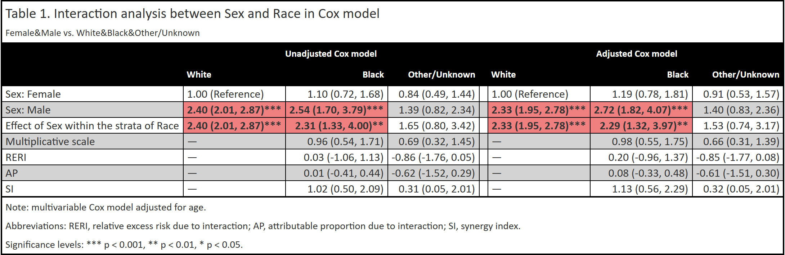{fig-alt="完整多水平交互模型，显示未调整和年龄调整后的 HR、乘性交互以及 RERI、AP、SI。"}

### 二分类组合 {.unnumbered}

性别×年龄组，调整种族，返回 `single`。共同参考组为 Female 且年龄 <55 岁；联合效应与层内效应的参考关系应分别阅读。

```r
inter_single <- RegR::run_quiet({
  get_inter(
    inter_data, exposure_names = c("Sex", "Age_group"),
    adj_var = "Race", surv = TRUE
  )
})
fmt_inter_gt(inter_single)
```

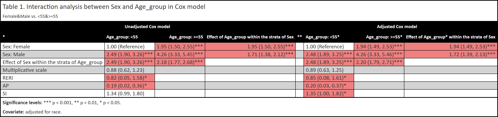{fig-alt="二分类乘积模型，Female 与小于 55 岁为参考水平，显示种族调整前后的 HR 交互。"}

### 逐对模型 {.unnumbered}

把完整多水平模型切换为 `"separate"`，分别拟合 White vs Black、White vs Other/Unknown。两份子集模型合并展示，结果类型为 `mul`。与第一个标签页的差别来自模型与样本，不只是布局。

```r
inter_pairs <- RegR::run_quiet({
  get_inter(
    inter_data, exposure_names = c("Sex", "Race"),
    adj_var = "Age", surv = TRUE, multicat_model = "separate"
  )
})
fmt_inter_gt(inter_pairs)
```

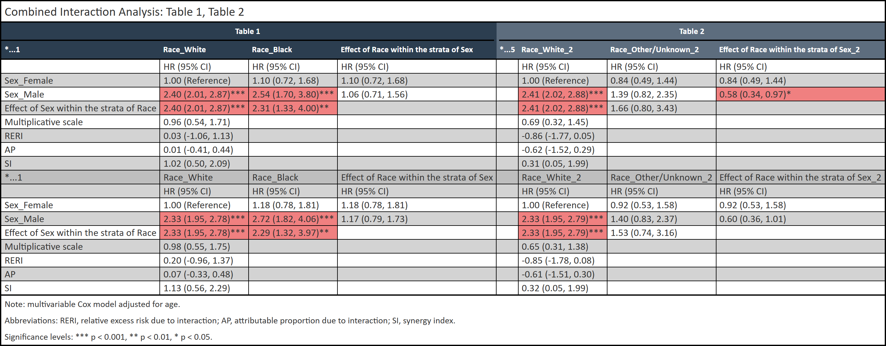{fig-alt="性别与种族的两份逐对交互模型，White 为共同的种族参考组，各模型使用对应的两水平子集。"}

### 分层分析 {.unnumbered}

按 Race 分层，再分别估计性别×年龄组，调整连续年龄。这里“按种族分层”和“种族作为交互变量”是不同的分析。

```r
inter_grid <- RegR::run_quiet({
  get_inter(
    inter_data, exposure_names = c("Sex", "Age_group"),
    adj_var = "Age", surv = TRUE, split_var = "Race"
  )
})
fmt_inter_gt(inter_grid)
```

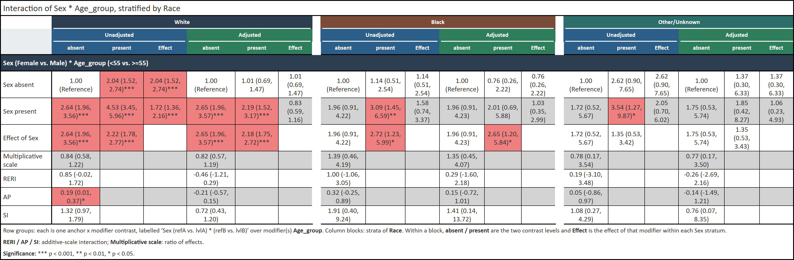{fig-alt="按 White、Black、Other/Unknown 分层，分别显示性别与年龄组交互的未调整和年龄调整模型。"}

### Logistic 结局 {.unnumbered}

将 `surv` 改为结局列名，估计观察到的疾病特异死亡的 OR。此模型没有利用随访时间，因此与前面 Cox HR 的数值和含义均不同。

```r
inter_or <- RegR::run_quiet({
  get_inter(
    inter_data, exposure_names = c("Sex", "Age_group"),
    adj_var = "Race", surv = "DSS"
  )
})
fmt_inter_gt(inter_or)
```

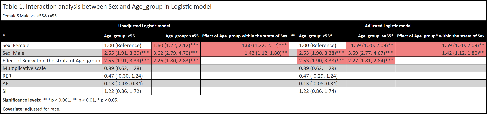{fig-alt="以 DSS 为二分类结局、调整种族的 Logistic 交互表，联合效应与交互指标基于 OR。"}

:::

### 返回对象与下游选择

::: {.table-responsive}

| `attr(result, "inter_type")` | 组织方式 | 读取与使用 |
|:--|:--|:--|
| `single` | `list(Unadj, Adjus)`；每个表 8×4 | 整体交给格式化 / 保存函数；一个表交给 `plt_inter()` |
| `mul` | 每个修饰变量 / 水平对比一个 `list(Unadj, Adjus)` | `table_names` 等元数据提供各对比标签 |
| `grid` | `result[[contrast]][[stratum]]` | 退化单元为 `NULL`；对比与层分别保存名称属性 |
| `multicat` | `list(Unadj, Adjus)`；每表 7 行，多水平对应列 | 单个表的 `estimates` 保存未四舍五入的对比，`global_interaction` 保存总体检验 |
| `multicat_grid` | 按层命名的完整多水平结果列表 | 每一层独立拟合一个完整交互模型 |

:::

```r
attr(inter_single, "inter_type")
dim(inter_single[["Adjus"]])
attr(inter_multi[["Adjus"]], "global_interaction")
attr(inter_multi[["Adjus"]], "estimates")
```

多重分层由分层变量水平的组合形成，缺失层值和空层会被丢弃；层内暴露缺少水平的单元可能为空。只观察到一个非空层时，函数会警告并忽略 `split_var`。这些情况需要检查样本构成，空白不表示“无交互”。

`eff_inter = TRUE` 是另一种结果路径：第一个暴露传为 `cat_var`，其余传为 `sub_var`，采用完整交互模型的层内效应表，而非上述 RERI / AP / SI 指标表；可返回数据框或分层的 `eff_inter_split` 对象，且不接受 `binary_ref`。这一路径与 [效应估计与森林图](forest-guide.qmd) 的工作流衔接。

## get_inter_abs()：固定时点风险与人时发生率 {#get-inter-abs}

### 当前接口

```r
# 接口签名（不执行）
get_inter_abs(
  data, exposure_names, adj_var = NULL,
  surv = TRUE, sur_time = 120, poi_time = 12 * 1000,
  conf_level = 0.95, split_var = NULL, binary_ref = NULL,
  multicat_model = c("separate", "interaction"),
  ci_method = c("delta", "boot"),
  cif_args = list(model = c("FGR", "CSC")),
  n_boot = 500, n_cores = 1
)
```

这个入口在未调整与协变量调整两条路径中估计四个联合暴露状态的风险 / CIF / 发生率。调整模型通过 g-computation，将同一分析人群依次置于四个暴露状态，预测后取人群平均，再组合为 IC 等指标。

::: {.table-responsive}

| 参数 | 作用与注意点 |
|:--|:--|
| `sur_time` | 固定时点，单位与 `time` 一致；默认 120。不能把其他时间单位的数据直接称为“10 年风险” |
| `poi_time` | 显式传入即切换为完整随访的人时发生率；`sur_time = NULL` 也会切换到发生率尺度 |
| 两个时间参数 | 生存模式下，不能同时显式传入非空的 `sur_time` 与 `poi_time`；Logistic 不使用这两个参数 |
| `multicat_model` | **默认 `"separate"`**，与 `get_inter()` 的默认值不同；完整模型与逐对子集模型的标准化人群也不同 |
| `ci_method` | `"delta"` 为解析近似区间，速度快；`"boot"` 为联合 bootstrap 百分位区间 |
| `n_boot, n_cores` | bootstrap 次数与核数；默认 500 次、1 核。较小次数适合运行检查，正式区间需要充分的重复次数和稳定性检查 |
| `cif_args` | 竞争风险标准化的工作模型：默认 `FGR`，可选 `CSC`。模型假设不同，不能只按速度认定两者等价 |

:::

当前 Fine–Gray **调整分支的交互区间始终使用 bootstrap**，选择 `ci_method = "delta"` 时会警告并回退；不能因为设置了 `cif_args = list(model = "CSC")` 就认定这组交互区间走解析法。本页用 Cox / Logistic / Poisson 的 delta 路径展示结果，没有为这组图运行竞争风险 bootstrap。

### 四种尺度设置

::: {.panel-tabset}

### 120 月风险 {.unnumbered}

四个联合状态的标准化事件风险与 IC。风险以 0–1 比例显示，IC 同样采用比例单位。

```r
inter_abs120 <- RegR::run_quiet({
  get_inter_abs(
    inter_data, exposure_names = c("Sex", "Age_group"),
    adj_var = "Race", surv = TRUE, sur_time = 120, ci_method = "delta"
  )
})
fmt_inter(inter_abs120, output_format = "flextable")
```

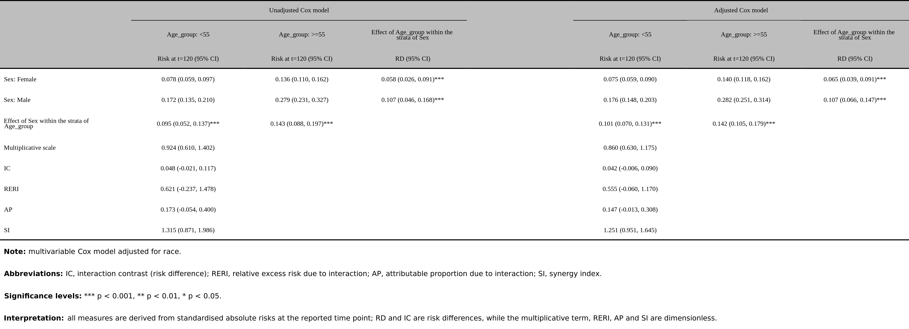{fig-alt="性别与年龄组在 120 月的未调整和种族标准化风险，含乘性交互、IC、RERI、AP 和 SI。"}

### 60 月风险 {.unnumbered}

只修改评估时间点。即使暴露与调整项相同，四个风险及其交互也可能随时间改变；不能把 120 月的交互结论直接移到 60 月。

```r
inter_abs60 <- RegR::run_quiet({
  get_inter_abs(
    inter_data, exposure_names = c("Sex", "Age_group"),
    adj_var = "Race", surv = TRUE, sur_time = 60, ci_method = "delta"
  )
})
fmt_inter(inter_abs60, output_format = "flextable")
```

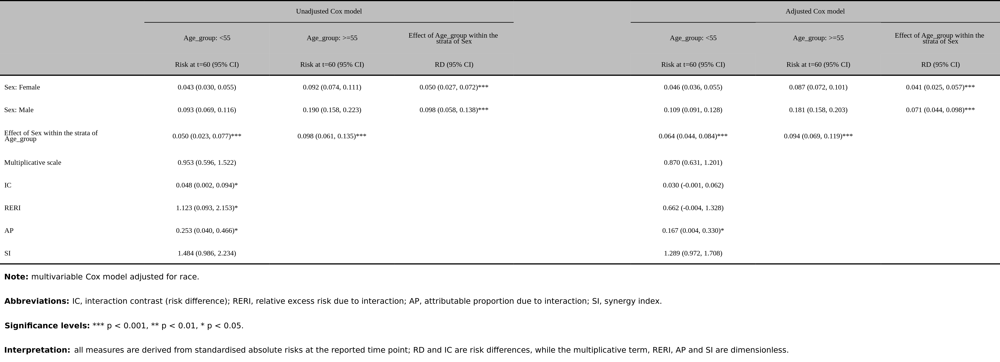{fig-alt="与 120 月示例相同的暴露和调整项，在 60 月重新估计风险与交互。"}

### 每千人年发生率 {.unnumbered}

显式设置 `poi_time`，保留完整随访；此时使用带人时 offset 的 Poisson 模型。IC 的单位也是每 1,000 人年的事件数，不是风险百分点。

```r
inter_rate <- RegR::run_quiet({
  get_inter_abs(
    inter_data, exposure_names = c("Sex", "Age_group"),
    adj_var = "Race", surv = TRUE, poi_time = 12 * 1000,
    ci_method = "delta"
  )
})
fmt_inter(inter_rate, output_format = "flextable")
```

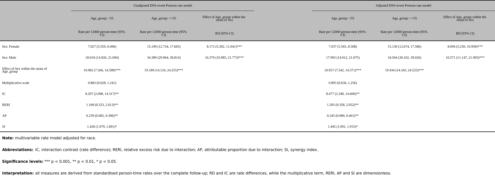{fig-alt="完整随访的 Poisson 人时发生率表，每 1000 人年报告事件率与发生率交互 IC。"}

### Logistic 概率 {.unnumbered}

同样的二分类结局，在 `get_inter()` 中报告 OR，在这里报告标准化概率与概率差的差。代码不指定评估时间。

```r
inter_abs_or <- RegR::run_quiet({
  get_inter_abs(
    inter_data, exposure_names = c("Sex", "Age_group"),
    adj_var = "Race", surv = "DSS", ci_method = "delta"
  )
})
fmt_inter(inter_abs_or, output_format = "flextable")
```

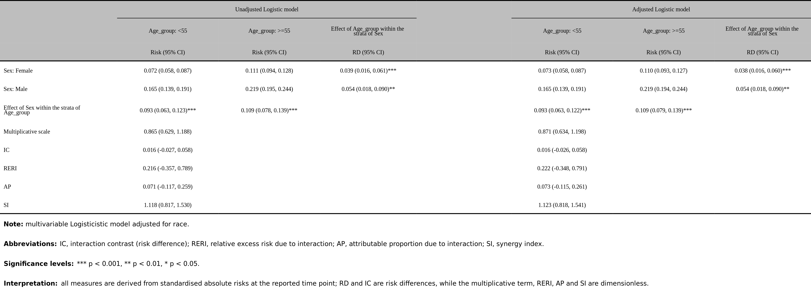{fig-alt="Logistic 标准化的四组概率与 IC，未使用随访时间，不表示固定年限风险。"}

:::

返回对象带 `get_inter_abs` 类与相应的 `inter_type`。二分类单结果仍分为 `Unadj` / `Adjus`，表为 **9×4**，比相对尺度多 IC 一行；多对比与分层结果可继续交给同一套格式化与 Word 导出函数。`plt_inter()` 的 8×4 比值表输入要求不适用于这些绝对结果。

## fmt_inter()：自动选择表格后端 {#fmt-inter}

```r
# 接口签名（不执行）
fmt_inter(
  df_inter, table_map = NULL,
  output_format = c("flextable", "gt"),
  layout = c("auto", "horizontal", "vertical"),
  table_names = NULL, gt_args = list(), ft_args = list()
)
```

这个入口识别比值 / 绝对尺度以及 single / mul / grid / multicat 等形状。更改 `output_format` 只选择渲染后端，不重新拟合模型。后端特有选项放在命名 list 中：`gt_args` 支持 `show_combine`、`spanner_colors`，`ft_args` 支持 `show_subeffect`、`show_measure`；未知、重复或未命名字段会被拒绝。

::: {.panel-tabset}

### flextable {.unnumbered}

默认后端适合 Word 排版。下面与 `fmt_inter_ft(inter_single)` 使用同一份 Cox 结果。

```r
fmt_inter(inter_single, output_format = "flextable")
```

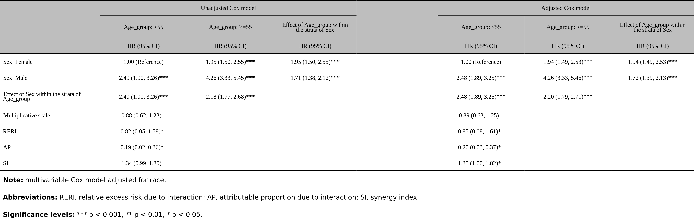{fig-alt="fmt_inter 的默认 flextable 输出，展示未调整与种族调整后的二分类交互结果。"}

### gt {.unnumbered}

网页表格后端；单个结果默认将未调整和调整模型合并在一个 `gt_tbl` 中。

```r
fmt_inter(inter_single, output_format = "gt")
```

{fig-alt="与 flextable 标签页使用相同的原始结果，fmt_inter 的 gt 后端合并两个模型。"}

:::

## fmt_inter_ft()：Word 表格的细节控制 {#fmt-inter-ft}

```r
# 接口签名（不执行）
fmt_inter_ft(
  df_inter, table_map = NULL,
  layout = c("auto", "horizontal", "vertical"),
  table_names = NULL,
  show_subeffect = c("both", "column", "row", "none"),
  show_measure = c("above_header", "below_header", "none")
)
```

`show_subeffect` 控制两个层内效应摘要：`"column"` 保留效应列，`"row"` 保留主暴露效应行，`"both"` 两者都保留，`"none"` 两者都隐藏。隐藏摘要不会改写模型。

`show_measure` 控制 HR / Risk 等度量行的位置：`"above_header"` 在表头，`"below_header"` 在表体首行，`"none"` 不显示。`layout` 组织多对比 / 分层表；完整多水平结果使用固定的模型并排布局。

::: {.panel-tabset}

### 默认摘要 {.unnumbered}

保留两类层内效应，度量行位于表头。

```r
fmt_inter_ft(inter_single)
```

{fig-alt="flextable 默认布局，包含联合效应、两个层内效应摘要及交互指标。"}

### 精简表格 {.unnumbered}

隐藏两类层内摘要，将度量行放在表体。联合效应和交互指标仍来自同一份分析。

```r
fmt_inter_ft(
  inter_single, show_subeffect = "none", show_measure = "below_header"
)
```

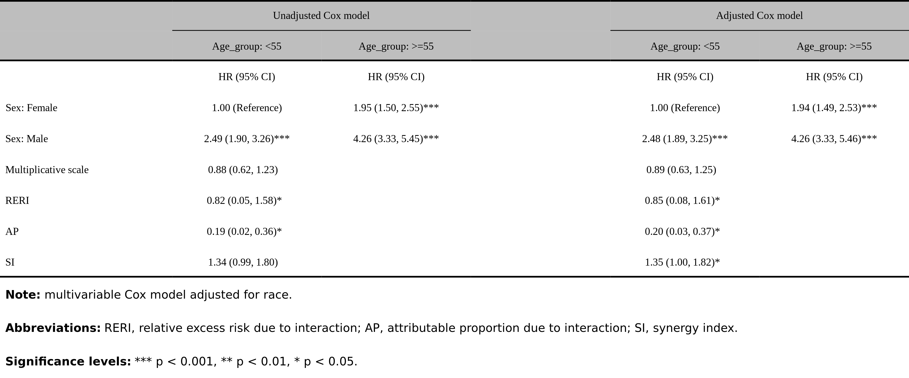{fig-alt="设置 show_subeffect 为 none 和 show_measure 为 below_header 的精简交互表。"}

:::

## fmt_inter_gt()：网页表格与分组表头 {#fmt-inter-gt}

```r
# 接口签名（不执行）
fmt_inter_gt(
  df_inter, table_map = NULL,
  layout = c("auto", "horizontal", "vertical"),
  show_combine = TRUE, table_names = NULL,
  spanner_colors = c("#2C3E50", "#5D6D7E", "#7B4B3A", "#4A6155")
)
```

`show_combine = TRUE` 将单个交互结果的 Unadjusted / Adjusted 合成一个 `gt_tbl`；`FALSE` 返回 `gt_group`。`table_names` 用于多对比标签，`spanner_colors` 循环应用于 `mul` 的分组表头。`layout = "auto"` 对带 `table_names` 的多修饰变量结果采用纵向，其余通常横向；`single` / `grid` 的 gt 渲染不使用这个布局开关。

::: {.panel-tabset}

### 完整多水平表 {.unnumbered}

直接识别 `multicat`，并排显示未调整与调整模型，不需要先拆成逐对表。

```r
fmt_inter_gt(inter_multi)
```

{fig-alt="fmt_inter_gt 自动识别完整多水平结果，使用各种族水平作为列。"}

### 逐对表与颜色 {.unnumbered}

对 `mul` 结果选择纵向布局，用两种紫色区分对比表头。颜色与布局只改变显示。

```r
fmt_inter_gt(
  inter_pairs, layout = "vertical",
  spanner_colors = c("#5B3F8C", "#7857A4")
)
```

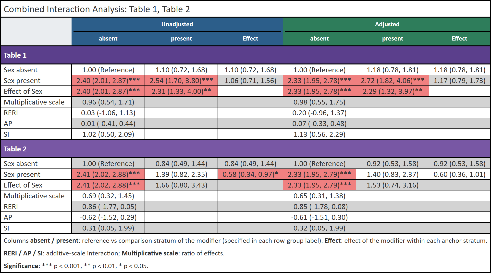{fig-alt="两份种族逐对交互结果采用纵向布局与自定义紫色分组表头。"}

:::

## save_tb_inter()：Word 导出与发表用表 {#save-tb-inter}

### 当前接口

```r
# 接口签名（不执行）
save_tb_inter(
  inter_result, title = NULL,
  layout = c("vertical", "horizontal"),
  table_map = NULL, note = NULL, note_covar = NULL,
  landscape = FALSE, note_below = TRUE, show_ap_si = TRUE,
  show_subeffect = c("both", "column", "row", "none"),
  show_measure = c("above_header", "below_header", "none"),
  show_model = c("both", "unadjusted", "adjusted"),
  covar_map = name_map_seer,
  font_name = "Times New Roman", font_size = 8
)
```

函数接受原始交互结果，也接受已经排好的 `flextable`。返回值始终是 `flextable`，因此可以先预览，再保存；**`title = NULL` 不写文件**。非空 `title` 为输出路径，可带或不带 `.docx`，目录决定保存位置，去掉扩展名后的文件名用于表题。下面的文件示例写入 R 的临时目录；实际使用时换成自己的输出路径。

::: {.table-responsive}

| 参数 | 用途与适用范围 |
|:--|:--|
| `layout` | 默认 `"vertical"`，对比 / 层向下堆叠；`"horizontal"` 横向排列。完整多水平表保留固定布局 |
| `landscape` | Word 页面横向；独立于表格的横 / 纵布局 |
| `show_model` | 两个模型都保留，或只保留 `"unadjusted"` / `"adjusted"` |
| `show_ap_si = FALSE` | 比值结果保留乘性交互与主要加性指标 RERI；绝对结果保留乘性交互与 IC |
| `show_subeffect, show_measure` | 与 `fmt_inter_ft()` 同义，控制层内摘要和度量行位置 |
| `table_map` | 变量 / 水平文字映射；是正则子串替换，不改变编码、参考组或估计值 |
| `covar_map, note_covar` | 调整项注释的名称映射与手动覆盖；`note_covar` 覆盖显示文字，不能改变已拟合的调整模型 |
| `note` | 在标准注释之后追加说明 |
| `note_below` | 默认在 Word 表格下写可编辑段落；返回的 flextable 仍以 footer 行预览注释。缺少相关注释元数据的单表会回退到 footer |
| `font_name, font_size` | 默认 Times New Roman、8 pt；本页预览使用 10 pt |

:::

传入已经格式化的 `flextable` 时，函数保留其布局；`layout`、`table_map`、`show_subeffect`、`show_measure` 不重新应用，`show_ap_si` 也会警告并忽略。需要筛选指标时应直接传原始分析结果。`show_model` 可用于已有表，但应确认模型标识仍完整。

### 五种导出与预览设置

::: {.panel-tabset}

### 纵向 Word 表 {.unnumbered}

默认按种族对比向下排，两个模型并排，写入 `Table 1. Sex by race.docx` 并返回表格。

```r
table <- save_tb_inter(
  inter_pairs, title = file.path(tempdir(), "Table 1. Sex by race"),
  layout = "vertical", font_size = 10
)
table
```

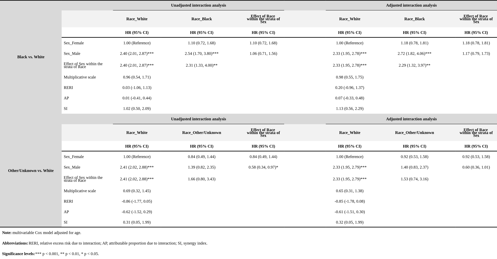{fig-alt="用于 Word 导出的纵向种族逐对交互表，保留未调整与年龄调整模型及注释。"}

### 横向表与横向页面 {.unnumbered}

`layout` 改表内排列，`landscape` 改 Word 纸张方向。宽表应同时考虑这两个设置。

```r
table <- save_tb_inter(
  inter_pairs, title = file.path(tempdir(), "Table 2. Horizontal interaction"),
  layout = "horizontal", landscape = TRUE, font_size = 10
)
table
```

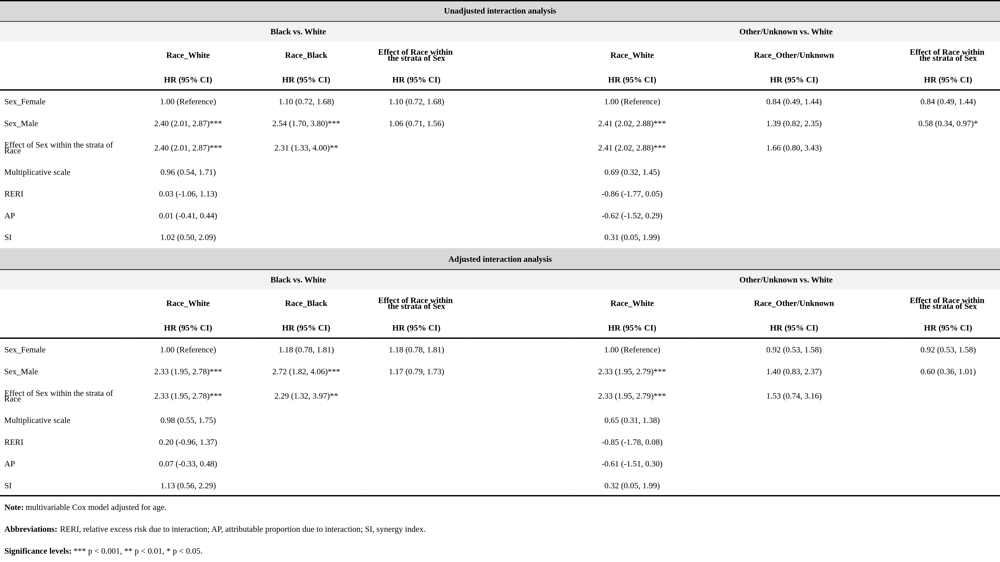{fig-alt="种族对比横向排列，并使用横向 Word 页面保存；页面方向不改变估计值。"}

### 只显示调整模型 {.unnumbered}

保留 Adjusted 的模型标识与调整项注释。`title = NULL` 只预览，不产生 Word 文件。

```r
table <- save_tb_inter(
  inter_pairs, title = NULL, show_model = "adjusted", font_size = 10
)
table
```

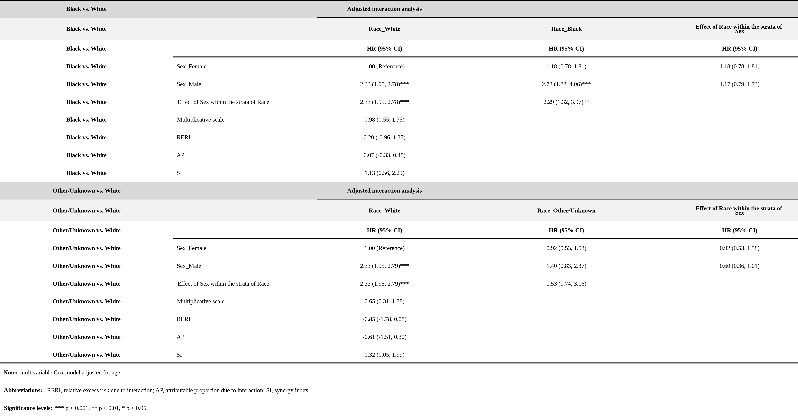{fig-alt="show_model 为 adjusted，仅保留年龄调整后的种族逐对交互及协变量注释。"}

### 绝对结果保留 IC {.unnumbered}

传入 120 月的风险结果，关闭次要加性指标；此时保留的是 IC，不能按相对尺度的 RERI 解释。

```r
table <- save_tb_inter(
  inter_abs120, title = NULL, show_ap_si = FALSE, font_size = 10
)
table
```

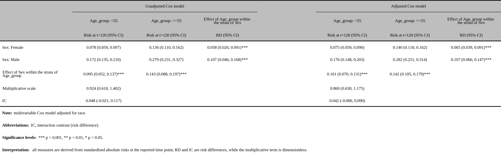{fig-alt="120 月风险表设置 show_ap_si 为 FALSE，保留乘性交互与 IC，并同步指标注释。"}

### 分层结果导出 {.unnumbered}

按种族分层的结果纵向排版，保存为横向 Word 页面；保留层标签、模型标签和注释。

```r
table <- save_tb_inter(
  inter_grid, title = file.path(tempdir(), "Table 3. Stratified interaction"),
  layout = "vertical", landscape = TRUE, font_size = 10
)
table
```

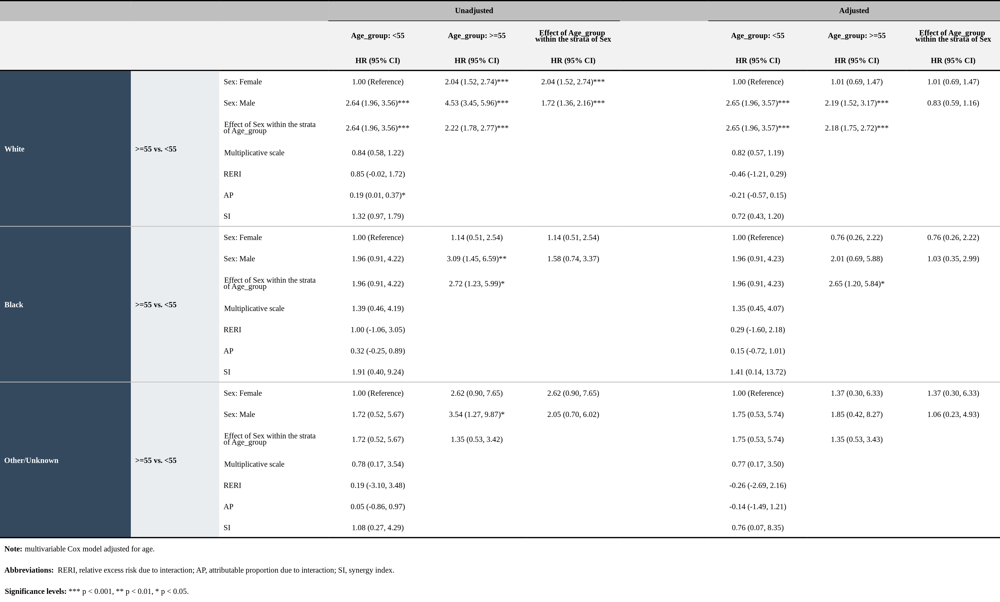{fig-alt="按种族分层的性别与年龄组交互表纵向排版，并导出到横向 Word 页面。"}

:::

图片展示的是返回表格的内容。实际 Word 导出另外核验了文档内的表格与横向页面设置；`note_below` 的段落编码只影响 Word 文件，图片无法单独证明这一文件结构。

## plt_inter()：组合图、分解与热图 {#plt-inter}

```r
# 接口签名（不执行）
plt_inter(table_result, theme_use = UtilsR::theme_my, base_size = 14)
```

输入必须是**一个二分类×二分类的 8×4 比值交互表**，例如 `inter_or[["Adjus"]]`；不能直接传整个分析列表、完整多水平结果、分层 grid 或 `get_inter_abs()` 的 9×4 表。

当前图形坐标标题固定为 **OR**，所以本节使用前面的 **Logistic** 结果，避免把 Cox HR 图按 OR 标注。图从显示表中的已四舍五入数值构造，适合展示交互形态；精确统计报告仍应读取原始模型与未舍入估计。

```r
plots <- plt_inter(inter_or[["Adjus"]])
```

::: {.panel-tabset}

### 组合图 {.unnumbered}

左侧为加性分解，右侧为乘性交互折线。两张图描述同一份 Logistic 比值结果的不同组合方式。

```r
plots[["combined"]]
```

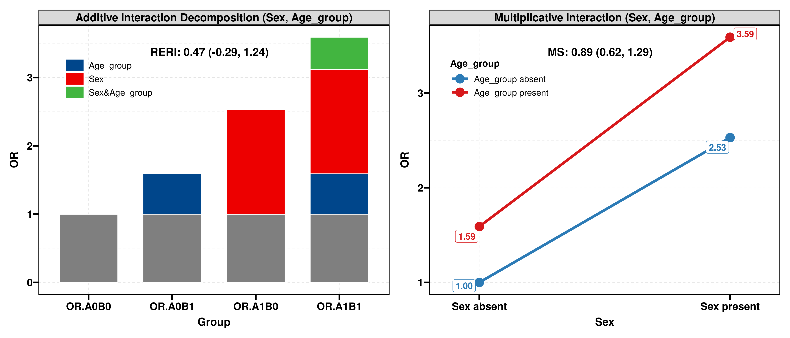{fig-alt="调整种族后的 Logistic OR 交互图，左侧四组加性分解、右侧性别与年龄组交互折线。"}

### 联合效应热图 {.unnumbered}

四个暴露组合相对于共同参考组的 OR。颜色展示数值大小，不单独检验交互。

```r
plots[["add"]]
```

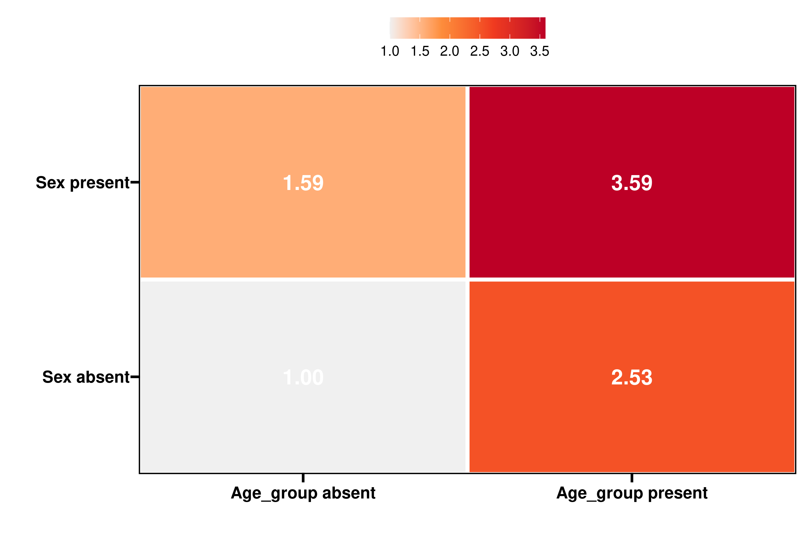{fig-alt="Female 与小于 55 岁为共同参考组，展示性别与年龄组四个联合状态的 Logistic OR。"}

### 加性分解 {.unnumbered}

按 Reference、OnlyB、OnlyA、RERI 分解联合比值。这里的 RERI 基于 OR；柱高不能读成死亡概率或人数。

```r
plots[["stack"]]
```

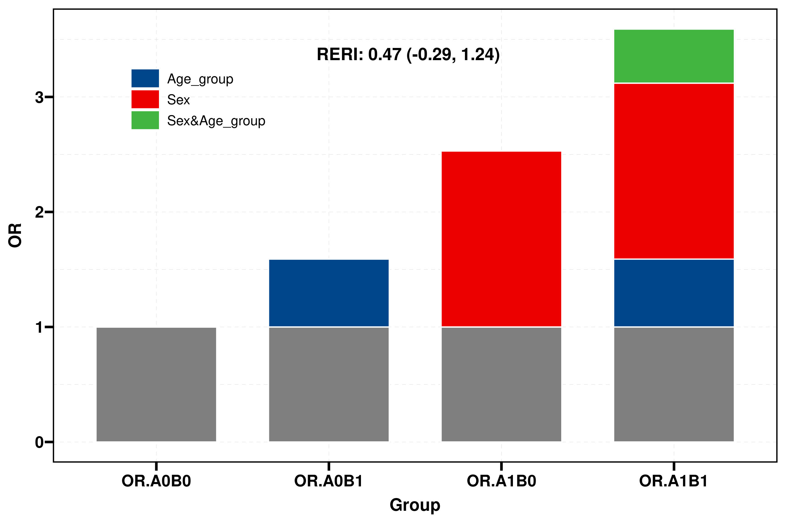{fig-alt="Logistic OR 的参考项、两个单独效应项与 RERI 堆叠分解，数值不是绝对死亡风险。"}

### 乘性交互折线 {.unnumbered}

用线条比较年龄组内的性别联合 OR。图形受坐标尺度影响，是否存在交互应结合模型检验与区间阅读。

```r
plots[["line"]]
```

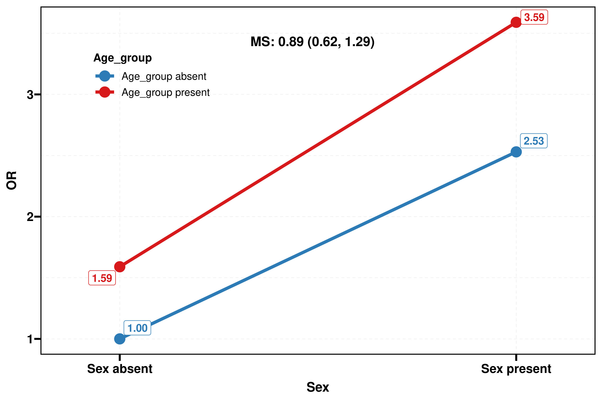{fig-alt="以性别为横轴，按年龄组连接 Logistic 联合 OR，展示乘性交互形态。"}

:::

`stack`、`line`、`add` 返回 ggplot，`combined` 为 patchwork，可以继续调整主题或保存。`theme_use` 接受主题对象、主题函数或函数名字符串，`base_size` 设置基础字号。这些参数不重新拟合模型。

## 选择入口与复现 {#reproduce}

::: {.table-responsive}

| 要回答的问题 | 使用入口与检查点 |
|:--|:--|
| HR / sHR / OR 尺度是否存在交互？ | `get_inter()`；先明确 `surv`、参考水平和完整模型 / 逐对模型 |
| 在某个时间点，两个暴露是否产生额外风险？ | `get_inter_abs(sur_time = ...)`；报告 IC、时间点、概率单位与标准化人群 |
| 完整随访的人时发生率交互？ | `get_inter_abs(poi_time = ...)`；报告发生率单位，区分固定时点风险 |
| 多水平修饰变量的总体交互？ | 显式选择 `multicat_model = "interaction"`；检查总体 Wald 检验及逐水平对比 |
| 同一结果需要网页与 Word 两种展示？ | `fmt_inter()` 选后端，或直接 `fmt_inter_gt()` / `fmt_inter_ft()`；格式化不改变分析 |
| 只导出调整模型，附协变量注释？ | 原始结果传给 `save_tb_inter(show_model = "adjusted", title = ...)` |
| 展示二分类 OR 的交互形态？ | 单个 Logistic 8×4 表传给 `plt_inter()`，结合数值表与统计检验解释 |

:::

页面仅公开汇总表格和图形，不提供患者级数据文件。公开源码见 [RegR 仓库](https://github.com/HUI950319/RegR)，完整函数帮助见 [RegR 参考文档](https://hui950319.github.io/RegR/reference/index.html)。复现时请核对安装版本；同一版本号下的本机开发快照与公开参考文档也可能存在接口差异。
