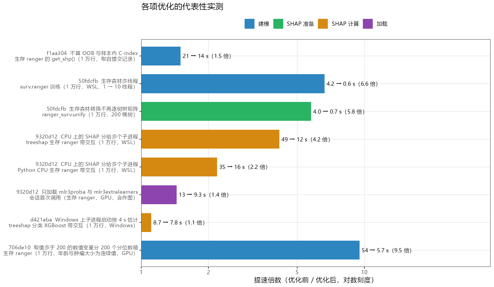
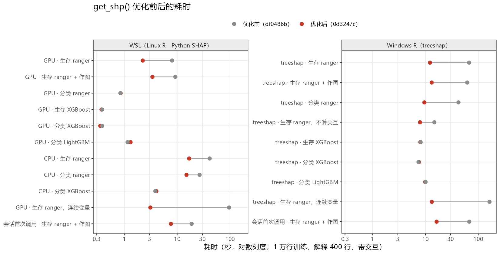
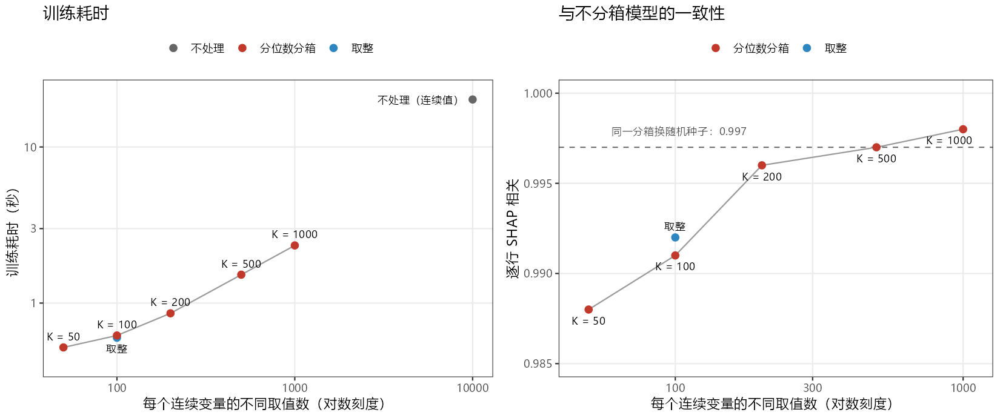

本页属于 [跨包性能评估](performance-evaluation.qmd)，评估对象是 MLR（[pkgdown 站点](https://hui950319.github.io/MLR/)）的 `get_shp()`。它先训练一个树模型（ranger、XGBoost 或 LightGBM，生存或二分类），再用 Python `shap`（GPU 或 CPU）或 R 的 treeshap 计算 SHAP 值和交互值，最后预渲染 6 张图。[get_imp 提速页](mlr-imp-speedup-20261006.qmd)的多进程 TreeSHAP 复用了本页第 4 项的函数。

## 主要结果

- **Windows R 提速最多。**本机 Windows 版 R 没有 Python `shap`，只能用 treeshap 引擎：带交互的生存 ranger 67.0 → **12.2 s**，分类 ranger 42.1 → **9.5 s**，会话第一次调用 67.5 → **16.3 s**。
- **有 GPU 时（WSL 里的 Python SHAP）**，生存 ranger 8.0 → **2.2 s**（含作图 9.2 → 3.4 s），会话第一次调用 18.8 → **7.6 s**。Python 走 CPU 时，生存 41.2 → **16.9 s**，分类 26.6 → **15.0 s**。
- **连续预测变量曾经是最慢的情形。**年龄和肿瘤大小为连续值时，生存 ranger 在 WSL 上 95.8 → **3.1 s**，Windows 上 163.2 → **13.2 s**。
- **XGBoost、LightGBM 和 GPU 上的分类 ranger 前后持平**（0.4–10 s）。它们本来就快，多进程的自适应判断让它们留在单进程，没有因为启动子进程而变慢。

| 场景（1 万行训练，解释 400 行，带交互，不作图） | 优化前 | 优化后 |
|:--|--:|--:|
| Windows，treeshap，生存 ranger | 67.0 s | **12.2 s** |
| Windows，treeshap，分类 ranger | 42.1 s | **9.5 s** |
| Windows，treeshap，会话第一次调用（含作图） | 67.5 s | **16.3 s** |
| WSL，Python GPU，生存 ranger | 8.0 s | **2.2 s** |
| WSL，Python CPU，生存 ranger | 41.2 s | **16.9 s** |
| WSL，Python GPU，会话第一次调用（含作图） | 18.8 s | **7.6 s** |
| 年龄、肿瘤大小为连续值，生存 ranger（WSL GPU / Windows） | 95.8 / 163.2 s | **3.1 / 13.2 s** |

::: {.callout-note}
### 只有分箱会改变数值

6 项改动里 5 项只改实现方式：统一口径的 16 个可比场景，新旧两版的 SHAP 矩阵逐位相同（`identical()` 为真）。会改变数值的是连续变量分箱：两个连续变量场景里，SHAP 与优化前的逐行相关为 0.995，与同一森林只换随机种子的差异（0.997）相当，留出集 C-index 不降。另有一处是改正：旧版在每个会话里，第一次设了种子的调用与之后的调用结果不同，现在一致。
:::

## 优化前的耗时构成

有 GPU 时，旧版一次调用约 8 s，SHAP 本身只占 0.27 s；九成时间花在 R 端两个只用单核的步骤：训练生存森林和把森林转成 TreeSHAP 的树表。没有 GPU 时，单核的 TreeSHAP 交互值成为大头，而 Windows 版 R 没有 Python `shap`，只能走更慢的 treeshap。

| 步骤（WSL，1 万行，解释 400 行，带交互） | 耗时（秒） | 说明 |
|:--|--:|:--|
| `surv.ranger` 训练 | 4.24 | mlr3 学习器默认 1 线程 |
| 森林转换 `treeshap::ranger_surv.unify()` | 3.98 | `rowSums` 1.64 s、逐树 `rbind` 约 1.2 s |
| 转成 Python 树字典 | 0.03 | |
| Python GPU TreeSHAP | 0.27 | |
| 抽样、建任务、打印、shapviz 等 | 0.61 | |
| 6 张预渲染图 | 1.23 | `plt_shp_sum()` 构建时就渲染蜂群图 |
| 会话第一次调用另加 | 9.54 | 导入 `shap` 3.91 s、加载 mlr3verse 3.54 s 等 |
| *没有 GPU 时替代 GPU 那一行：* | | |
| Python CPU TreeSHAP（单核） | 30.0 | 2000 行 150 s，1 万行 763 s |
| treeshap R 引擎（单核） | 约 52 | 按 40 行实测外推 |

## 优化策略

下表中每项的“代表性实测”取自当次提交时的记录，各自的数据和调用不同，只能看同一行的前后对比；统一口径的前后对照见下一节。

{#fig-mlr-shp-commits width=100% fig-alt="各项优化的提速倍数横向条形图，按建模、SHAP 准备、SHAP 计算、加载四类着色，每条标注优化前后的秒数。"}

| 提交 | 策略 | 代表性实测 | 耗时（秒） | 结果 |
|:--|:--|:--|:--|:--|
| f1aa304 | 不算 OOB 与样本内 C-index（此前已完成） | 生存 ranger 的 `get_shp()`，1 万行 | 21 → **14** | 一致 |
| 50fdcfb | 生存森林多线程 | `surv.ranger` 训练，1 万行，1 → 10 线程 | 4.24 → **0.64** | 一致 |
| 50fdcfb | 生存森林转换不再逐树拼矩阵 | `ranger_surv.unify`，1 万行、200 棵树 | 3.98 → **0.69** | 逐位一致 |
| 9320d12 | CPU 上的 SHAP 分给多个子进程 | treeshap 生存 ranger 带交互，1 万行 | 49.5 → **11.9** | 逐位一致 |
| 9320d12 | 同上 | Python CPU 生存 ranger 带交互，1 万行 | 35.4 → **16.2** | 逐位一致 |
| 9320d12 | 只加载 mlr3proba 与 mlr3extralearners | 会话首次调用（GPU，含作图） | 13.5 → **9.3** | 首次调用改为与后续一致 |
| d421aba | Windows 上子进程启动按 4 s 估计 | Windows treeshap 分类 XGBoost 带交互 | 8.7 → **7.8** | 一致 |
| 706de10 | 取值多于 200 的数值变量分 200 个分位数箱 | 生存 ranger，年龄与肿瘤大小为连续值 | 54.2 → **5.7** | 在种子噪声范围内变化 |

### 1. 生存森林多线程

生存路径通过 mlr3 的 `surv.ranger` 训练森林，而 mlr3 的学习器默认 `num.threads = 1`；ranger 自己的默认值是用满所有核心（分类路径直接调 ranger，所以一直很快）。现在按包内 `get_exp()` 同样的规则取线程数：每 1000 行训练数据 1 个，最多 16 个，留出 2 个逻辑核。

ranger 每棵树的随机种子由主种子派生，与线程数无关。同一个 `set.seed()` 下，1 线程和 10 线程长出的森林逐位相同，之后的随机数流也相同，所以这项改动不影响任何结果。

### 2. 生存森林转换不再逐树拼矩阵

TreeSHAP 需要先把森林转成统一的树表。`treeshap::ranger_surv.unify(type = "risk")` 对每棵树把所有节点的累积风险向量 `do.call(rbind, ...)` 成矩阵（两次），再 `rowSums` 得到每个叶子的风险；剖析显示单是 `rowSums` 就占 1.64 s。新增的 `.shp_ranger_surv_unify()` 直接对每个节点的向量求和，再交给 treeshap 自己的组装函数，返回对象与原函数逐位相同（`identical()` 为真），1 万行从 4.0 s 降到 0.7 s。代价是要用 `:::` 调用 treeshap 的未导出函数 `ranger_unify.common()`，测试里直接与原函数比对，treeshap 升级改动它时会立即报错。

### 3. 连续变量分 200 个分位数箱

这是唯一会改变数值的一项。ranger 的生存分裂（logrank）对每个节点、每个候选变量，要比较节点里每个样本和每个候选分裂值，耗时随连续变量的不同取值数近似平方增长，详见下文[专项剖析](#sec-ranger-logrank)。SEER 里年龄是整数岁（约 90 个取值），不受影响；但同样 1 万行，年龄和肿瘤大小一旦是连续值，生存调用就要近一分钟。

现在 `get_shp()` 在抽样和建模之前，对 `vars` 里不同取值多于 200 个的数值变量，在全部数据上按分位数分成 200 箱，每个值换成所在箱的中位数；所有模型和任务都生效，调用开头的信息框会列出被分箱的变量（如 `200 quantile bins: Age, Tum`）。因子、取值不超过 200 个的变量、时间与结局列都不动。`shp$X` 和各张图里这些变量显示箱中位数，`par_lis$data` 保留传入的原始数据。为什么选 200 箱，见[分箱取多少箱](#sec-bins)。

### 4. CPU 上的 SHAP 分给多个子进程

没有 GPU 时，SHAP 交互值是最大的开销，而 Python 和 R 的 TreeSHAP 都只用一个核。新的 `.shp_explain_rows()` 先在本进程算前 20 行、据此估计剩余耗时；只有剩余耗时超过子进程启动时间的两倍，才把剩下的行分给 PSOCK 子进程（最多 16 个，留出 2 个核，每个至少 4 行）。启动时间按实测取：treeshap 2 s（Windows 4 s），Python 6 s（每个子进程要导入 `shap`）。适用于 `engine = "treeshap"`，以及 Python 实际走 CPU 时（`device = "cpu"`，或 `"auto"` 而没有 CUDA 扩展，由适配器新增的 `gpu_available()` 判断）；GPU 调用保持一次完成。

TreeSHAP 对每一行单独计算，所以分块后按行拼回，与一次算完逐位相同；测试里对具名行名和自动行名、有无交互都做了 `identical()` 比对。子进程只需要 treeshap 或 reticulate，不需要加载 MLR。XGBoost 这类快的模型估计耗时不够，会留在单进程。[get_imp 提速页](mlr-imp-speedup-20261006.qmd)的多进程 TreeSHAP 复用的就是这个函数。

为什么不用线程：shap 的 C++ 扩展计算时不释放 GIL，线程池完全没有加速，见[专项剖析](#sec-gil)。

### 5. 只加载需要的 mlr3 包

生存路径原来 `loadNamespace("mlr3verse")` 来注册 `surv.ranger`，而这个学习器其实由 mlr3extralearners 注册。mlr3verse 会连带加载 mlr3torch 与 torch，新会话要 3.5 s；只加载 mlr3proba 和 mlr3extralearners 需要 1.3 s。

这项改动还修好了一个可复现性问题：torch 加载时会调用一次 `sample()`，推动 R 的随机数流。所以旧版在每个会话里，第一次设了种子的 `get_shp()` 与之后的调用结果不同。实测旧版同一进程里第 1 次与第 2 次结果不同；新版两次相同，且等于旧版的第 2 次。

### 6. 其他

- treeshap 引擎原来每次调用都执行 `future::plan("multisession")`，而 treeshap 0.4.0 根本不用 future，这行只会改掉调用方的全局设置，已删除（50fdcfb）。
- 帮助页新增 Speed 小节，汇总上述耗时与使用建议（0d3247c），`?MLR::get_shp` 可见。

## 优化前后实测

同一份数据和调用，优化前（`df0486b`）与优化后（`0d3247c`）各在全新的 R 进程里跑一遍；口径见[测试口径](#sec-method)。

{#fig-mlr-shp-before-after width=100% fig-alt="两个分面的点线图，左为 WSL，右为 Windows，纵轴是场景，横轴是秒的对数刻度，灰点为优化前、红点为优化后；ranger 与连续变量场景的红点明显左移，XGBoost 与 LightGBM 前后重合。"}

### Linux（WSL）：Python SHAP

| 场景 | 优化前（秒） | 优化后（秒） | SHAP 与优化前 |
|:--|--:|--:|:--|
| GPU，生存 ranger | 8.00 | **2.23** | 逐位相同 |
| GPU，生存 ranger，含作图 | 9.23 | **3.40** | 逐位相同 |
| GPU，分类 ranger | 0.84 | 0.85 | 逐位相同 |
| GPU，生存 XGBoost | 0.38 | 0.37 | 逐位相同 |
| GPU，分类 XGBoost | 0.38 | 0.35 | 逐位相同 |
| GPU，分类 LightGBM | 1.15 | 1.31 | 逐位相同 |
| CPU，生存 ranger | 41.18 | **16.88** | 逐位相同 |
| CPU，分类 ranger | 26.58 | **15.02** | 逐位相同 |
| CPU，分类 XGBoost | 3.85 | 4.03 | 逐位相同 |
| GPU，生存 ranger，年龄与肿瘤大小为连续值 | 95.83 | **3.11** | 逐行相关 0.995 |
| 会话第一次调用，生存 ranger，含作图 | 18.77 | **7.62** | — |

GPU 上的生存 ranger 剩下约 2.2 s：训练 0.6 s、森林转换 0.7 s、SHAP 0.3 s，其余是抽样和整理结果。Python 走 CPU 时只快了 1.8–2.4 倍，因为每个子进程都要导入 `shap`（4–5 s，并行进行），解释 400 行时这段启动占了相当比例；解释的行越多收益越大，2000 行时从 150 s 降到 22 s。

### Windows R：treeshap

| 场景 | 优化前（秒） | 优化后（秒） | SHAP 与优化前 |
|:--|--:|--:|:--|
| 生存 ranger | 67.01 | **12.20** | 逐位相同 |
| 生存 ranger，含作图 | 61.84 | **13.14** | 逐位相同 |
| 分类 ranger | 42.12 | **9.54** | 逐位相同 |
| 生存 ranger，不算交互 | 14.76 | **7.89** | 逐位相同 |
| 生存 XGBoost | 8.11 | 8.00 | 逐位相同 |
| 分类 XGBoost | 7.39 | 7.54 | 逐位相同 |
| 分类 LightGBM | 10.07 | 9.89 | 逐位相同 |
| 生存 ranger，年龄与肿瘤大小为连续值 | 163.17 | **13.19** | 逐行相关 0.995 |
| 会话第一次调用，生存 ranger，含作图 | 67.50 | **16.28** | — |

treeshap 的子进程不需要 Python，启动快，带交互的 ranger 场景提速 4.4–5.5 倍；连续变量场景同时受益于分箱和多进程，提速 12 倍。会话第一次调用从 67.5 s 降到 16.3 s，除了多进程，还少了加载 mlr3verse。旧版“含作图”比“不作图”还快 5 s，是单次测量的波动：慢场景都只跑了 1 次。

## 专项剖析

### ranger 生存分裂与连续变量 {#sec-ranger-logrank}

ranger 开发版 `src/TreeSurvival.cpp` 的 logrank 分裂：

```cpp
// :403  每个节点、每个候选变量，分配 (不同取值数 × 事件时间数) 的计数数组
std::vector<size_t> num_deaths_right_child(num_splits * num_timepoints);
// :364-371  节点里每个样本，逐个与每个候选分裂值比较
for (size_t pos = start_pos[nodeID]; pos < end_pos[nodeID]; ++pos) {
  for (size_t i = 0; i < num_splits; ++i) {
    if (value > possible_split_values[i]) { ... } else { break; }
```

每个节点的开销约为“样本数 × 不同取值数”，另加“不同取值数 × 事件时间数”大小的数组分配与清零。所以连续变量越多、取值越密，训练越慢，而大部分时间花在内存上，加线程反而更慢。下表是 1 万行、200 棵树的直接 ranger 训练（10 线程），年龄与肿瘤大小加了小扰动使每个约有 1 万个取值：

| 数据 | 训练（秒） | 每棵树节点数 |
|:--|--:|--:|
| 原始数据（年龄 91 个、肿瘤大小 87 个取值） | 1.95 | 967 |
| 仅年龄为连续值 | 20.9 | 1010 |
| 仅肿瘤大小为连续值 | 28.4 | 1081 |
| 两者均为连续值 | **53.9** | 1104 |
| 同上，22 线程 | 68.9 | 1104 |
| 同上，取整回整数 | 0.79 | 1068 |
| 同上，`splitrule = "extratrees"` | 0.54 | 930 |
| 同上，`sample.fraction = 0.3` | 2.50 | 485 |
| 同上，`min.node.size = 20` | 55.9 | 709 |
| 两者均为连续值，5000 行（5 线程） | 7.22 | 639 |
| 原始数据，事件时间按天（967 个） | 4.41 | 973 |

行数减半，耗时约降到 1/7.5；`min.node.size` 只影响深层节点，对开销最大的顶层节点没有帮助；事件时间数的影响远小于预测变量的取值数。`extratrees` 和 `sample.fraction` 也很快，但会改变森林的类型或每棵树看到的数据，没有采用。

### 分箱取多少箱 {#sec-bins}

用同一份数据（8000 行训练、2000 行留出，8 线程），比较不同箱数下的训练耗时、留出集 C-index，以及 400 行 SHAP 与不分箱森林的一致性；参照是同一分箱下只换随机种子的差异：

{#fig-mlr-shp-binning width=100% fig-alt="左图横轴是每个连续变量的不同取值数（对数刻度），纵轴是训练秒数，不处理时约 20 秒，分 200 箱约 0.9 秒；右图纵轴是逐行 SHAP 相关，200 到 1000 箱都在 0.996 以上，接近换种子的 0.997。"}

| 处理 | 不同取值数（年龄 / 肿瘤大小） | 训练（秒） | 留出 C-index | 重要性排序相关 | 重要性最大偏差 | 逐行 SHAP 相关 |
|:--|--:|--:|--:|--:|--:|--:|
| 不处理 | 10000 / 9966 | 20.2 | 0.935 | — | — | — |
| 取整 | 91 / 100 | 0.60 | 0.946 | 1.000 | 5.1% | 0.992 |
| 分 1000 箱 | 1000 / 997 | 2.34 | 0.938 | 1.000 | 4.0% | 0.998 |
| 分 500 箱 | 500 / 499 | 1.52 | 0.937 | 1.000 | 1.7% | 0.997 |
| **分 200 箱** | 200 / 200 | **0.86** | 0.937 | 1.000 | 2.2% | **0.996** |
| 分 100 箱 | 100 / 100 | 0.62 | 0.935 | 1.000 | 1.8% | 0.991 |
| 分 50 箱 | 50 / 50 | 0.52 | 0.938 | 1.000 | 6.2% | 0.988 |
| 参照：200 箱换随机种子 | — | — | — | 1.000 | 3.3% | 0.997 |

200 到 1000 箱与不分箱模型的差异和换随机种子相当，预测能力不降；分到 50 箱才开始比随机噪声差一点。直接取整只适合取值范围小的变量（年龄约 90 个整数）：范围大的化验值取整后可能仍有几千个取值；0–1 之间的比值取整后只剩 2 个值。按分位数分箱对这两种情况都适用，所以内置的是分位数分箱而不是取整。

### Python TreeSHAP 不释放 GIL {#sec-gil}

把 480 行带交互的 CPU SHAP 交给 Python 线程池，4、8 线程与单线程一样慢，16 线程反而更慢；改成 R 的 PSOCK 子进程才有效（结果都与单进程逐位相同）：

| 方式 | 行数 | 线程 / 进程数 | 耗时（秒） |
|:--|--:|--:|--:|
| Python 单线程 | 480 | 1 | 37.3 |
| Python 线程池 | 480 | 4 / 8 / 16 | 37.1 / 37.7 / 54.6 |
| Python 单进程 | 2000 | 1 | 150.4 |
| PSOCK 子进程（含启动） | 2000 | 8 / 16 | 27.6 / 22.0 |

### 子进程启动：Windows 比 Linux 慢

16 个 PSOCK 子进程启动并加载 treeshap，Windows 要 3.1 s，Linux（WSL）1.8 s（8 个分别为 2.0 s 和 1.3 s），还不含把模型传给每个子进程的时间。最初两边都按 2 s 估计，Windows 上 XGBoost（单进程 7.9 s）也被拆分，反而慢到 8.7 s；改为 Windows 按 4 s 估计后，它留在单进程，ranger 仍然拆分。

### 作图开销

`render_plots = TRUE` 时，`plt_shp_sum()` 为了把蜂群图和环形小图拼在一起，构建时就用 `ggplotGrob()` 把图完整渲染了一遍（约 0.6 s），`plt_shp_viv()` 也一样（约 0.2 s）。所以作图开销在 `get_shp()` 里就实打实花掉，而不是等打印时才算；解释行数增加到 1 万时作图也只多 0.5 s 左右，不是瓶颈。

### 试过但没有采用

- **调大 `min.node.size`**：树变小，CPU SHAP 从 30 s 降到 21.7 s（20）和 13.8 s（50），但重要性幅度偏差分别达 33% 和 54%，取 50 时排序都变了。
- **`num.trees` 从 200 降到 100**：训练、转换和 SHAP 都约减半，与 200 棵树的差异和换随机种子相当（排序相关 1.000，逐行相关 0.996），但它是源码保真的固定值，改默认需要另行决定。
- **生存森林用 `splitrule = "extratrees"` 或 `sample.fraction = 0.3`**：连续变量时训练只要 0.5–2.5 s，但改变森林本身，分箱已经解决同一问题。
- **Python 线程池**：GIL 不释放，见上文。

## 使用建议

- `Num.sample` 默认只用 2000 行训练（GPU 上整个调用约 1.5 s）；要用 1 万行训练需显式传 `Num.sample = 10000`。
- 有 GPU 时，把 `exp.sample` 从 400 提到 1 万行只多约 3 s，可以解释全部样本。
- 没有 GPU 时，交互值是大头：不需要交互图就设 `interactions = FALSE`（Windows treeshap 生存调用约从 11 s 降到 5 s；`plt.viv`、`plt.mai`、`plt.int*` 随之为 `NULL`）。
- 只要数值时设 `render_plots = FALSE`，省 1–1.5 s。
- Windows R 没有装 Python `shap` 时，必须用 `engine = "treeshap"`；默认的 Python 引擎会先花约 6 s 找 Python，然后报错。若在 WSL 里有 GPU（本机 WSL 里装了 RStudio Server），Python 引擎会快得多。
- 对速度敏感时可考虑 `model = "xgboost"`：它的树浅，CPU 上带交互也只要 4–8 s。

## 测试口径 {#sec-method}

- **数据**：RegR 自带的 SEER 甲状腺髓样癌队列 `seer_thyroid_mtc_2026`（去缺失后 4017 行），有放回重抽到 1 万行；6 个预测变量 `Age`、`T_stage`、`N_stage`、`Sex`、`Sur`、`Tum`，生存结局 `time` / `DSS`，分类结局 `DSS`。“连续变量”场景给年龄加 ±0.5 岁、给肿瘤大小乘以 exp(N(0, 0.05)) 的扰动，使两者各有约 1 万个取值。
- **调用**：`Num.sample = 10000`、`exp.sample = 400`、`interactions = TRUE`、`render_plots = FALSE`（标注“作图”的场景除外），`set.seed(2)` 后调用；其余参数为默认值。
- **版本**：优化前为 MLR `df0486b`，优化后为 `0d3247c`，两者装进项目外的临时库，在各自全新的 R 进程里先预热（加载命名空间、初始化 Python 与 GPU）再计时。快的场景重复 3 次取中位数，慢的跑 1 次。“会话首次调用”在另起的全新进程里测，不预热。
- **环境**：24 个逻辑核（`detectCores()` = 24）、NVIDIA RTX 5090 Laptop GPU、Windows 11。Linux 一列是 WSL Ubuntu 22.04 上的 R 4.4.3、Python 3.12、shap 0.52；Windows 一列是 Windows 版 R 4.4.3，没有 Python，用 treeshap 0.4.0。ranger 0.18.0，mlr3 1.8.0，mlr3extralearners 1.5.2。
- **一致性**：每个场景保存 400 × 6 的 SHAP 矩阵，新旧两版逐一比对（`identical()` 与逐行相关）。

## 局限

- 重抽样数据里约 4000 种不同的行重复出现，树比真正 1 万个不同病人时小一些；连续变量场景只扰动了两个变量。
- 单次测量有约 ±1 s 的波动，慢场景只跑了 1 次。
- “代表性实测”与各节里的剖析数字取自开发过程中的不同时刻，代码状态和机器负载不完全相同，只用于说明各项改动自身的作用；前后对比以统一口径的那一节为准。
- GPU 一列依赖 CUDA 版 shap；没有 GPU 的机器上，Python 引擎的表现参照 CPU 一列。

## 下载

- 优化前后统一口径计时：[mlr_shp_20261006_timing.csv](bench/mlr_shp_20261006_timing.csv)
- 各项提交的代表性实测：[mlr_shp_20261006_commits.csv](bench/mlr_shp_20261006_commits.csv)
- 优化前的耗时构成：[mlr_shp_20261006_stages_before.csv](bench/mlr_shp_20261006_stages_before.csv)
- 连续变量与 ranger 训练：[mlr_shp_20261006_continuous.csv](bench/mlr_shp_20261006_continuous.csv)
- 分箱数与一致性：[mlr_shp_20261006_binning.csv](bench/mlr_shp_20261006_binning.csv)
- 线程与子进程：[mlr_shp_20261006_cpu_parallel.csv](bench/mlr_shp_20261006_cpu_parallel.csv)
- 测速脚本：[mlr_shp_20261006_benchmark.R](bench/mlr_shp_20261006_benchmark.R)；作图脚本：[mlr_shp_20261006_figures.R](bench/mlr_shp_20261006_figures.R)
