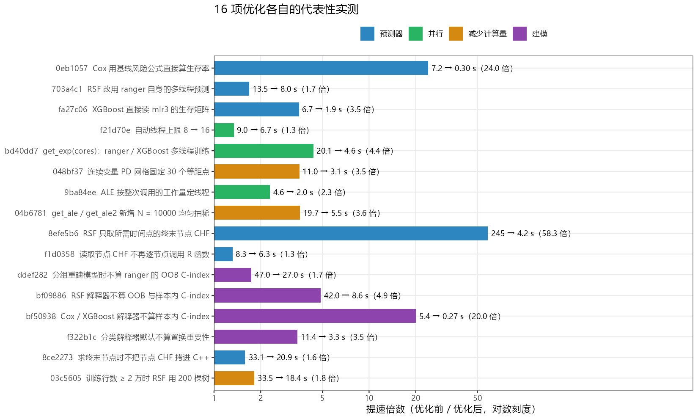
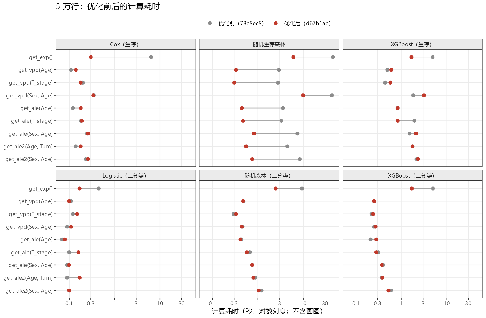
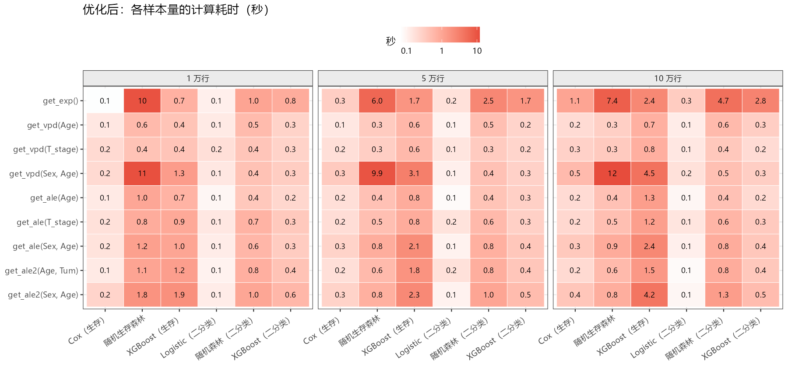

本页属于 [跨包性能评估](performance-evaluation.qmd)，评估对象是 MLR（[pkgdown 站点](https://hui950319.github.io/MLR/)）的 `get_vpd()`、`get_ale()`、`get_ale2()`，以及它们共同的上游 `get_exp()`。这三个函数先用 `get_exp()` 建好解释器，再在上面算部分依赖（PD）或累积局部效应（ALE），所以建模和预测两头都要快。

## 主要结果

- **随机生存森林提速最多。**5 万行时九个调用合计从 120.2 s 降到 19.5 s（约 6 倍）：`get_exp()` 44.8 → **6.0 s**，分组 `get_vpd(c("Sex", "Age"))` 42.8 → **9.9 s**，其余单变量 PD、ALE 和 `get_ale2()` 从 2.8–8.3 s 降到 **0.3–0.8 s**。
- **其他模型的提速集中在 `get_exp()`。**5 万行时 Cox 6.4 → 0.30 s，XGBoost（生存）4.9 → 1.7 s，二分类随机森林 9.4 → 2.5 s，二分类 XGBoost 5.0 → 1.7 s。它们的 PD / ALE 本来就在 0.1–3 s，前后差别在测量波动之内。
- **优化后 10 万行：**54 个调用里只有 8 个超过 2 s，最慢的是随机生存森林的分组 `get_vpd()`（12.0 s）和 `get_exp()`（7.4 s），时间主要花在训练森林；其余 PD / ALE 大多在 1 s 以内。
- **1 万行时随机生存森林的 `get_exp()` 和分组 PD 前后差别不大**（11.1 → 10.4 s、12.4 → 11.0 s）。这两步在会话里第一次大规模建模，R 扩内存的垃圾回收（GC）占了大半；同一会话里连建 3 次分别是 6.4、3.1、3.0 s，其中 GC 5.2、1.8、1.8 s。单变量 PD / ALE 在 1 万行时也快了 2–3 倍。

::: {.callout-note}
### 大多数优化不改变结果

16 项优化里 11 项只改实现方式，预测、PD、ALE 与优化前逐位一致或差 < 1e-16。会改变数值的有 3 项：连续变量 PD 网格固定为 30 个等距点；`get_ale()` / `get_ale2()` 在超过 `N = 10000` 行时均匀抽稀；训练行数达到 2 万时随机生存森林用 200 棵树。另有 2 项改变了输出的形式：生存 ALE 去掉了 survex 在最小值处重复的那个点（曲线从下一个网格点开始）；分类解释器默认不算置换重要性，`get_exp()` 返回的重要性字段默认为 `NULL`。
:::

## 优化策略

这些优化分四类。下表里每项的“代表性实测”取自当次提交时的记录，数据和调用各不相同，只能看同一行的前后对比。

{#fig-mlr-vpd-commits width=100% fig-alt="16 项优化的提速倍数横向条形图，按预测器、并行、减少计算量、建模四类着色，每条标注优化前后的秒数。"}

### 1. 换用更快的生存预测

PD 和 ALE 的耗时几乎全在“对改过特征的数据重新预测生存率”。survex 默认的预测路径会先为每一行构造 mlr3 的分布对象，再从中读生存率，这一步比模型本身还慢。

| 提交 | 策略 | 代表性实测 | 耗时（秒） | 结果 |
|:--|:--|:--|:--|:--|
| 0eb1057 | Cox 用基线风险公式直接算生存率 | get_vpd 连续变量 PD 面板（8 worker），SEER 4017 行 | 7.2 → **0.30** | 一致（与 survfit 相同） |
| 703a4c1 | RSF 改用 ranger 自身的多线程预测 | get_vpd 分组 PD 面板，SEER 4017 行 | 13.5 → **8.0** | 一致（差 < 1e-16） |
| fa27c06 | XGBoost 直接读 mlr3 的生存矩阵 | get_vpd 连续变量 PD 面板，SEER 4017 行 | 6.7 → **1.9** | 一致（差 < 1e-16） |
| 8efe5b6 | RSF 只取所需时间点的终末节点 CHF | RSF 的 get_ale(Age)，7782 个连续事件时间，模拟 1 万行 | 245.0 → **4.2** | 一致 |
| f1d0358 | 读取节点 CHF 不再逐节点调用 R 函数 | RSF 的 get_ale2(Sex, Age)，模拟 5 万行 | 8.3 → **6.3** | 一致 |
| 8ce2273 | 求终末节点时不把节点 CHF 拷进 C++ | RSF 分组 get_vpd(Sex, Age)，交替各 2 轮，模拟 5 万行 | 33.1 → **20.9** | 一致 |

其中最关键的是随机生存森林。ranger 自带的 `predict()` 会把每棵树在**所有**不同事件时间上的累积风险（CHF）都平均一遍，而 PD / ALE 只需要一个预测时间点；每次调用还会把整片森林连同全部节点 CHF 拷进 C++。现在的做法是：用一份去掉 CHF 的森林副本求出每行在每棵树的终末节点，再只读这些节点在所需时间点的 CHF 求平均，结果就是 `predict()` 的值。

### 2. 并行

| 提交 | 策略 | 代表性实测 | 耗时（秒） | 结果 |
|:--|:--|:--|:--|:--|
| f21d70e | 自动线程上限 8 → 16 | RSF 在 4 万行 PD 网格上的预测，4 万行网格 | 9.0 → **6.7** | 一致 |
| bd40dd7 | get_exp(cores)：ranger / XGBoost 多线程训练 | RSF 生存解释器构建，SEER 4017 行 | 20.1 → **4.6** | 一致（1/5/16 线程同一森林） |
| 9ba84ee | ALE 按整次调用的工作量定线程 | RSF 分组 ALE，SEER 4017 行 | 4.6 → **2.0** | 一致；去掉最左端假水平段 |

线程数默认按每 1000 行 1 个、最多 16 个、留出 2 个逻辑核来定，模型本身不随线程数变化。在这台 8 个性能核 + 16 个能效核的机器上，16 线程以上没有稳定收益（训练用 22 线程两轮 7.5 / 8.6 s，16 线程 9.0 / 8.4 s）。

### 3. 减少计算量

| 提交 | 策略 | 代表性实测 | 耗时（秒） | 结果 |
|:--|:--|:--|:--|:--|
| 048bf37 | 连续变量 PD 网格固定 30 个等距点 | RSF 连续变量 PD 面板，SEER 4017 行 | 11.0 → **3.1** | 有变化：PD 曲线更粗 |
| 04b6781 | get_ale / get_ale2 新增 N = 10000 均匀抽稀 | RSF 的 get_ale(Age)（Windows），SEER 扩至 4 万行 | 19.7 → **5.5** | 超过 N 时有变化：最多差曲线幅度 7.3% |
| 03c5605 | 训练行数 ≥ 2 万时 RSF 用 200 棵树 | RSF 分组 get_vpd(Sex, Age)，交替各 2 轮，模拟 10 万行 | 33.5 → **18.4** | 2 万行以下一致；以上 C-index 相同、曲线略变 |

这三项会改变数值：PD 曲线的点变少（30 个等距点）；数据超过 `N` 行的 ALE 是抽稀后的近似；2 万行及以上的森林换成 200 棵树。树的数量在 2 万行以下不变，因此常见规模的临床数据结果与之前相同。

### 4. 建模时去掉不必要的计算

| 提交 | 策略 | 代表性实测 | 耗时（秒） | 结果 |
|:--|:--|:--|:--|:--|
| ddef282 | 分组重建模型时不算 ranger 的 OOB C-index | RSF 分组 get_vpd(Sex, Age)，模拟 5 万行 | 47.0 → **27.0** | 一致 |
| bf09886 | RSF 解释器不算 OOB 与样本内 C-index | RSF 的 get_exp()，模拟 5 万行 | 42.0 → **8.6** | 一致 |
| bf50938 | Cox / XGBoost 解释器不算样本内 C-index | Cox 的 get_exp()，模拟 5 万行 | 5.4 → **0.27** | 一致 |
| f322b1c | 分类解释器默认不算置换重要性 | 二分类 RF 的 get_exp()，模拟 5 万行 | 11.4 → **3.3** | 预测一致；重要性字段默认 NULL |

C-index 要比较每一对病例，样本一大就是建模里最慢的部分，而原来只是为了打印。现在生存解释器只打印模型本身；需要样本内 C-index 时，可以按需计算：

```r
res <- get_exp(d, vars = c("Age", "Sex", "T_stage"), surv = 120, model = "ranger")
survival::concordance(survival::Surv(time, DSS) ~ yhat[, 1], data = res$dat)
```

## 优化前后实测

用同一个脚本、同一份模拟数据，在优化前（2026-10-05，MLR 提交 78e5ec5）和优化后（2026-10-06，提交 d67b1ae）各跑一遍。78e5ec5 时，按时间排在前面的 9 项（0eb1057 到 8efe5b6）已经完成，所以这里的前后差别来自之后的 7 项：f1d0358、ddef282、bf09886、bf50938、f322b1c、8ce2273、03c5605。更早几项的效果见上一节的提交实测。

{#fig-mlr-vpd-50k width=100% fig-alt="六个分面的点线图，每个分面是一种模型，纵轴九个调用，横轴是秒的对数刻度，灰点为优化前、红点为优化后。"}

### 5 万行

**生存（`surv = 120`）**（秒）

| 调用 | Cox | 随机生存森林 | XGBoost |
|:--|--:|--:|--:|
| `get_exp()` | 6.4 → **0.30** | 44.8 → **6.0** | 4.9 → **1.7** |
| `get_vpd(Age)` | 0.11 → **0.14** | 2.9 → **0.33** | 0.49 → **0.60** |
| `get_vpd(T_stage)` | 0.20 → **0.18** | 2.8 → **0.30** | 0.44 → **0.57** |
| `get_vpd(Sex, Age)` | 0.35 → **0.34** | 42.8 → **9.9** | 1.8 → **3.1** |
| `get_ale(Age)` | 0.12 → **0.18** | 3.5 → **0.44** | 0.82 → **0.83** |
| `get_ale(T_stage)` | 0.18 → **0.19** | 3.3 → **0.47** | 1.9 → **0.83** |
| `get_ale(Sex, Age)` | 0.25 → **0.26** | 7.4 → **0.82** | 1.5 → **2.1** |
| `get_ale2(Age, Tum)` | 0.14 → **0.18** | 4.4 → **0.55** | 1.8 → **1.8** |
| `get_ale2(Sex, Age)` | 0.23 → **0.26** | 8.3 → **0.75** | 2.2 → **2.3** |

**二分类（`surv = "DSS"`）**（秒）

| 调用 | Logistic | 随机森林 | XGBoost |
|:--|--:|--:|--:|
| `get_exp()` | 0.45 → **0.17** | 9.4 → **2.5** | 5.0 → **1.7** |
| `get_vpd(Age)` | 0.11 → **0.10** | 0.48 → **0.47** | 0.25 → **0.25** |
| `get_vpd(T_stage)` | 0.12 → **0.15** | 0.29 → **0.33** | 0.22 → **0.24** |
| `get_vpd(Sex, Age)` | 0.09 → **0.11** | 0.46 → **0.44** | 0.25 → **0.27** |
| `get_ale(Age)` | 0.07 → **0.08** | 0.43 → **0.41** | 0.21 → **0.28** |
| `get_ale(T_stage)` | 0.10 → **0.16** | 0.66 → **0.57** | 0.31 → **0.28** |
| `get_ale(Sex, Age)` | 0.09 → **0.10** | 0.75 → **0.75** | 0.40 → **0.37** |
| `get_ale2(Age, Tum)` | 0.09 → **0.17** | 0.87 → **0.79** | 0.37 → **0.38** |
| `get_ale2(Sex, Age)` | 0.10 → **0.10** | 1.2 → **1.0** | 0.59 → **0.52** |

Cox、Logistic 和 XGBoost 的 PD / ALE 路径在这期间没有改动，表里这些格子前后相差 0.1–1.3 s，是两天两次单轮测量之间的波动（XGBoost 生存模型的分组 PD 波动最大）。

### 1 万行

**生存（`surv = 120`）**（秒）

| 调用 | Cox | 随机生存森林 | XGBoost |
|:--|--:|--:|--:|
| `get_exp()` | 0.42 → **0.07** | 11.1 → **10.4** | 0.72 → **0.72** |
| `get_vpd(Age)` | 0.11 → **0.14** | 1.5 → **0.55** | 0.29 → **0.41** |
| `get_vpd(T_stage)` | 0.17 → **0.21** | 1.2 → **0.42** | 0.24 → **0.40** |
| `get_vpd(Sex, Age)` | 0.20 → **0.21** | 12.4 → **11.0** | 0.92 → **1.3** |
| `get_ale(Age)` | 0.09 → **0.13** | 1.9 → **0.99** | 0.52 → **0.68** |
| `get_ale(T_stage)` | 0.13 → **0.17** | 1.9 → **0.83** | 1.3 → **0.92** |
| `get_ale(Sex, Age)` | 0.18 → **0.16** | 3.4 → **1.2** | 0.74 → **1.0** |
| `get_ale2(Age, Tum)` | 0.14 → **0.13** | 2.5 → **1.1** | 0.70 → **1.2** |
| `get_ale2(Sex, Age)` | 0.16 → **0.25** | 4.5 → **1.8** | 1.3 → **1.9** |

**二分类（`surv = "DSS"`）**（秒）

| 调用 | Logistic | 随机森林 | XGBoost |
|:--|--:|--:|--:|
| `get_exp()` | 0.31 → **0.11** | 5.1 → **1.1** | 3.4 → **0.83** |
| `get_vpd(Age)` | 0.11 → **0.13** | 0.33 → **0.53** | 0.23 → **0.26** |
| `get_vpd(T_stage)` | 0.14 → **0.18** | 0.22 → **0.39** | 0.22 → **0.26** |
| `get_vpd(Sex, Age)` | 0.11 → **0.14** | 0.29 → **0.43** | 0.25 → **0.31** |
| `get_ale(Age)` | 0.07 → **0.09** | 0.32 → **0.36** | 0.21 → **0.23** |
| `get_ale(T_stage)` | 0.10 → **0.14** | 0.44 → **0.68** | 0.28 → **0.35** |
| `get_ale(Sex, Age)` | 0.09 → **0.12** | 0.41 → **0.61** | 0.29 → **0.32** |
| `get_ale2(Age, Tum)` | 0.08 → **0.10** | 0.55 → **0.76** | 0.34 → **0.42** |
| `get_ale2(Sex, Age)` | 0.09 → **0.12** | 0.89 → **1.0** | 0.47 → **0.60** |

1 万行低于 2 万行的阈值，森林仍是 500 棵树。随机生存森林的 `get_exp()` 是这一档里第一次大规模建模，GC 占了大半（见[会话状态与 GC](#会话状态与-gc)）；分组 PD 要为两个性别水平各建一次模型，同样受影响。

### 优化后：10 万行

**生存（`surv = 120`）**（秒）

| 调用 | Cox | 随机生存森林 | XGBoost |
|:--|--:|--:|--:|
| `get_exp()` | 1.1 | 7.4 | 2.4 |
| `get_vpd(Age)` | 0.20 | 0.29 | 0.74 |
| `get_vpd(T_stage)` | 0.27 | 0.34 | 0.76 |
| `get_vpd(Sex, Age)` | 0.54 | 12.0 | 4.5 |
| `get_ale(Age)` | 0.20 | 0.44 | 1.3 |
| `get_ale(T_stage)` | 0.22 | 0.47 | 1.2 |
| `get_ale(Sex, Age)` | 0.35 | 0.86 | 2.4 |
| `get_ale2(Age, Tum)` | 0.21 | 0.55 | 1.5 |
| `get_ale2(Sex, Age)` | 0.38 | 0.79 | 4.2 |

**二分类（`surv = "DSS"`）**（秒）

| 调用 | Logistic | 随机森林 | XGBoost |
|:--|--:|--:|--:|
| `get_exp()` | 0.32 | 4.7 | 2.8 |
| `get_vpd(Age)` | 0.12 | 0.55 | 0.30 |
| `get_vpd(T_stage)` | 0.14 | 0.36 | 0.20 |
| `get_vpd(Sex, Age)` | 0.17 | 0.46 | 0.30 |
| `get_ale(Age)` | 0.09 | 0.44 | 0.21 |
| `get_ale(T_stage)` | 0.15 | 0.64 | 0.34 |
| `get_ale(Sex, Age)` | 0.11 | 0.84 | 0.37 |
| `get_ale2(Age, Tum)` | 0.08 | 0.83 | 0.36 |
| `get_ale2(Sex, Age)` | 0.09 | 1.3 | 0.51 |

{#fig-mlr-vpd-after width=100% fig-alt="三个分面的热图，分别是 1 万、5 万、10 万行，横轴六种模型，纵轴九个调用，格内标注秒数。"}

画图另算：10 万行时连续变量 `get_vpd()` 的原始数据散点加平滑曲线要画约 1–3.5 s，ALE 的图约 1–2 s，`get_ale2()` 的热图约 0.1 s。

## 随机生存森林专项

随机生存森林（RSF）是六种模型里最慢的，下面几项评估都只针对它。

### 每次预测的固定开销

5 万行数据的分组 PD 里，每个性别水平（约 2.5 万行）重新训练的森林约有 100 万个终末节点，每个节点存一条 235 个时间点的 CHF，合计约 1.9 GB。ranger 每次 `predict()` 都要把它们转进 C++，所以只求终末节点也要约 1.2 s，与预测多少行无关：10 行 1.29 s、3000 行 1.20 s、2.5 万行 1.53 s；换成去掉 CHF 的副本后，3000 行只要 0.12 s，节点编号完全一致。分组 PD 每个水平要预测 3 次，这笔固定开销曾占 24 s 里的约 8 s。改动前后交替各跑两轮（5 万行）：

| 调用 | 改前（两轮，秒） | 改后（两轮，秒） |
|:--|:--|:--|
| `get_exp()` | 14.5 / 15.7 | **14.1 / 12.9** |
| `get_vpd(Age)` | 2.2 / 2.8 | **0.76 / 0.71** |
| `get_vpd(T_stage)` | 1.9 / 2.2 | **0.63 / 0.66** |
| `get_vpd(Sex, Age)` | 30.1 / 36.0 | **20.7 / 21.0** |
| `get_ale(Age)` | 2.8 / 2.9 | **0.97 / 1.1** |
| `get_ale(T_stage)` | 2.6 / 2.8 | **0.99 / 1.1** |
| `get_ale(Sex, Age)` | 5.2 / 5.3 | **1.8 / 2.1** |
| `get_ale2(Age, Tum)` | 3.8 / 3.9 | **1.2 / 1.4** |
| `get_ale2(Sex, Age)` | 6.7 / 6.3 | **2.0 / 2.2** |

### 树的数量与终末节点最小样本数

10 万行建模、2 万行留出（同一生成器），两轮倒序、换种子。建模耗时包括训练、构建解释器和全量 `yhat` 预测。

| 树 / 最小节点样本数 | 建模（秒） | 其中 GC（秒） | 终末节点（百万） | 留出 C-index | Brier（120 月） |
|:--|:--|:--|:--|:--|:--|
| 500 / 3（现状默认） | 11.3 / 12.7 | 1.8 / 3.0 | 0.60 | 0.7132 / 0.7129 | 0.1907 / 0.1908 |
| 300 / 3 | 5.9 / 7.4 | 0.48 / 1.8 | 0.36 | 0.7132 / 0.7129 | 0.1907 / 0.1909 |
| 200 / 3 | 4.1 / 4.0 | 0.54 / 0.54 | 0.24 | 0.7131 / 0.7130 | 0.1907 / 0.1908 |
| 500 / 15 | 14.3 / 12.5 | 4.7 / 2.4 | 0.50 | 0.7133 / 0.7132 | 0.1907 / 0.1907 |
| 200 / 15 | 3.9 / 4.0 | 0.53 / 0.57 | 0.20 | 0.7131 / 0.7132 | 0.1907 / 0.1907 |
| 500 / 30 | 10.1 / 14.9 | 1.7 / 5.4 | 0.40 | 0.7136 / 0.7134 | 0.1906 / 0.1906 |

真实线性预测值在留出样本上的 C-index 是 0.7166，作为上限参照。200 棵树把建模时间降到约三分之一，C-index 只差 0.0001–0.0003，和现状换一个种子的差别一样大；把 `min.node.size` 调大到 15 或 30 并不能稳定提速，终末节点只少了 17%–33%。据此只在训练行数达到 2 万时改用 200 棵树。改动前后交替各跑两轮（10 万行）：

| 调用 | 改前（两轮，秒） | 改后（两轮，秒） |
|:--|:--|:--|
| `get_exp()` | 16.2 / 22.9 | **13.4 / 10.3** |
| `get_vpd(Age)` | 0.65 / 0.74 | **0.44 / 0.78** |
| `get_vpd(Sex, Age)` | 27.2 / 39.9 | **20.1 / 16.8** |
| `get_ale(Age)` | 1.9 / 1.8 | **0.61 / 0.57** |
| `get_ale(Sex, Age)` | 2.7 / 2.6 | **1.3 / 1.0** |
| `get_ale2(Sex, Age)` | 2.3 / 2.7 | **1.2 / 1.4** |

### 会话状态与 GC

同一个 10 万行的 `get_exp(model = "ranger")`，耗时随会话状态在 11–29 s 之间变化，差别主要是 R 的垃圾回收（GC）：森林交回 R 时会生成几十万个 CHF 向量，每次完整 GC 都要扫一遍所有活着的对象，会话里加载的包越多就越慢。R 只在启动时读取 GC 参数，包里调不了。

| 会话状态（10 万行，500 棵树） | 耗时（秒） | 其中 GC（秒） | CPU 时间（秒） |
|:--|--:|--:|--:|
| 只加载 ranger 相关包 | 10.9 | 2.0 | 118.1 |
| 按测速脚本预热后（加载画图、survex、iml 等） | 23.5 | 11.4 | 151.7 |
| 再跑完 Cox 的 8 个调用并画图后 | 28.7 | 9.0 | 160.8 |
| 紧接着再跑一次 | 15.9 | 2.5 | 136.4 |

### 试过但没有采用

分组 PD 改成“逐个水平建模、算完就释放”，GC 从约 5.4 s 降到 4.3 s，总耗时只快约 1.4 s（约 8%），与两轮之间的波动相当。代价是建模和抽样消耗随机数的顺序变了，同一种子下曲线最多差 0.010（换一个种子差 0.035），用户以前用固定种子画的图会对不上，因此撤回。

## 测试口径

| 项目 | 设置 |
|:--|:--|
| 日期、环境 | 2026-10-05 至 10-06；WSL Ubuntu-22.04；R 4.4.3；Intel Core Ultra 9 275HX（8 性能核 + 16 能效核，无超线程）；`OPENBLAS_NUM_THREADS=1` |
| MLR 版本 | 优化前 78e5ec5（2026-10-05 18:00）；优化后 d67b1ae（2026-10-06） |
| 数据 | 模拟数据：年龄 N(60, 10)、肿瘤大小对数正态、性别、T 分期三级；指数风险，线性预测值 `0.06·(Age−60) + 0.01·(Tum−20) + 0.5·男 + 0.7·T 分期`；删失 U(24, 240) 月；时间按月取整，约 238 个不同事件时间，事件率约 44% |
| 模型 | `get_exp(vars = c("Age", "Tum", "Sex", "T_stage"))`：生存 `surv = 120`，`model` 为 `"default"`（Cox）、`"ranger"`、`"xgboost"`；二分类 `surv = "DSS"`，同样三种 |
| 调用 | 每种模型 9 个：`get_exp()`；`get_vpd()`、`get_ale()` 各取 `Age`、`T_stage`、`c("Sex", "Age")`；`get_ale2()` 取 `c("Age", "Tum")`、`c("Sex", "Age")`；全部默认参数 |
| 计时 | `system.time()` 的实际耗时，只计算结果对象，画图另计；先在 400 行上把每个调用跑一遍预热；`cores = NULL`（大数据时 16 线程） |
| 重复 | 全矩阵每档样本量各跑 1 次；第 3 类、第 1 类中两项的关键对比是新旧版本交替各跑 2 轮 |

## 局限

- 全矩阵只跑了一次，机器负载和会话状态会带来 ±20%–30% 的波动，RSF 的 `get_exp()` 受 GC 影响更大；跨表比较只看量级。
- 模拟数据只有 4 个变量、信号简单。变量多、信号弱的真实数据里，树少了预测波动会更大，200 棵与 500 棵的差距可能比这里明显。
- “代表性实测”来自各次提交时的记录，数据规模不同（SEER 4017 行、模拟 1 万 / 5 万 / 10 万行），不能互相比较。

## 下载

- 优化前后全矩阵计时：[mlr_vpd_20261006_timing.csv](bench/mlr_vpd_20261006_timing.csv)
- 16 项提交的代表性实测：[mlr_vpd_20261006_commits.csv](bench/mlr_vpd_20261006_commits.csv)
- RSF 新旧交替计时：[mlr_vpd_20261006_rsf_interleaved.csv](bench/mlr_vpd_20261006_rsf_interleaved.csv)
- RSF 树数量与 C-index：[mlr_vpd_20261006_rsf_trees.csv](bench/mlr_vpd_20261006_rsf_trees.csv)
- RSF 会话状态与 GC：[mlr_vpd_20261006_rsf_session_gc.csv](bench/mlr_vpd_20261006_rsf_session_gc.csv)
- 测速脚本：[mlr_vpd_20261006_benchmark.R](bench/mlr_vpd_20261006_benchmark.R)；作图脚本：[mlr_vpd_20261006_figures.R](bench/mlr_vpd_20261006_figures.R)
- 图的 PDF：[优化前后 5 万行](bench/mlr_vpd_20261006_before_after_50k.pdf)、[16 项提速](bench/mlr_vpd_20261006_commits.pdf)、[优化后各样本量](bench/mlr_vpd_20261006_after_by_n.pdf)
