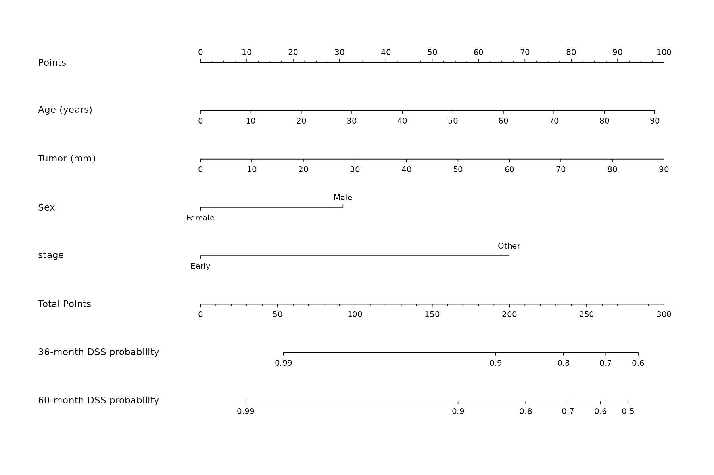
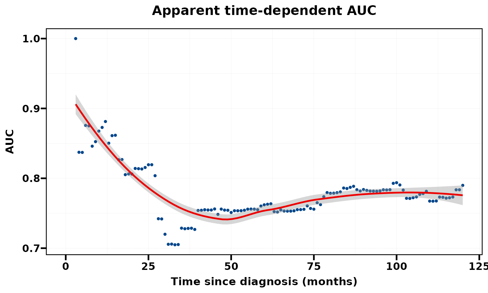
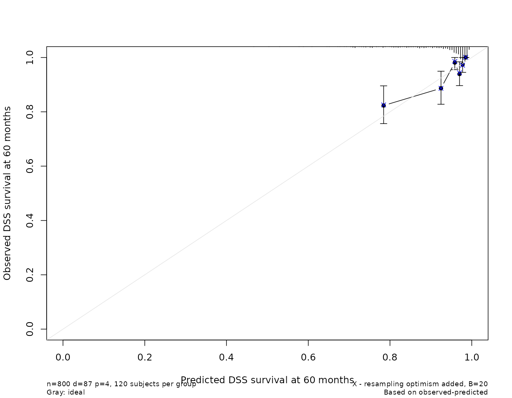
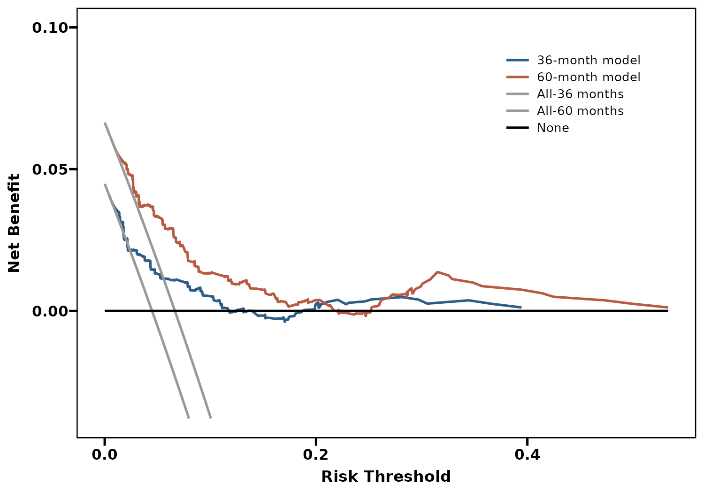
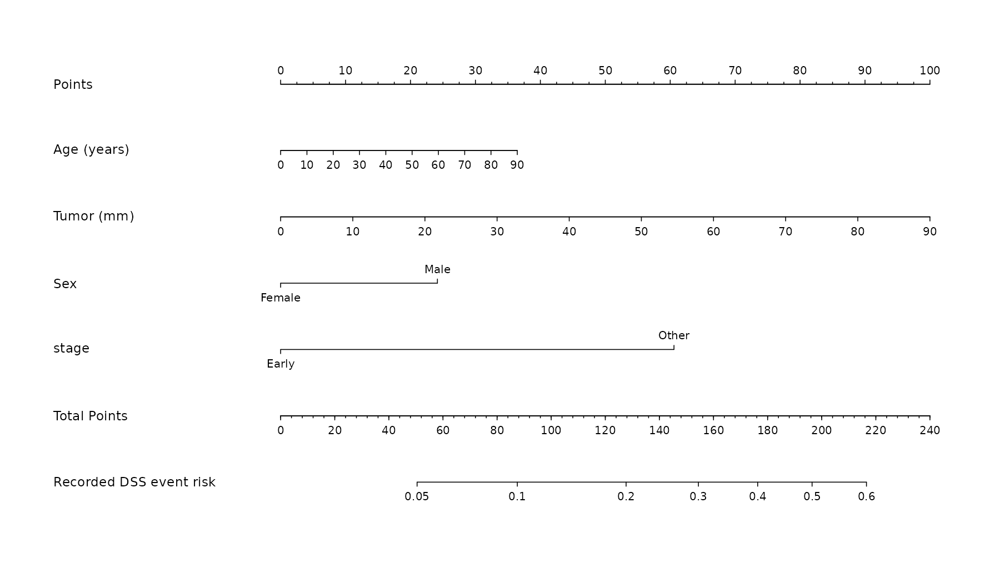
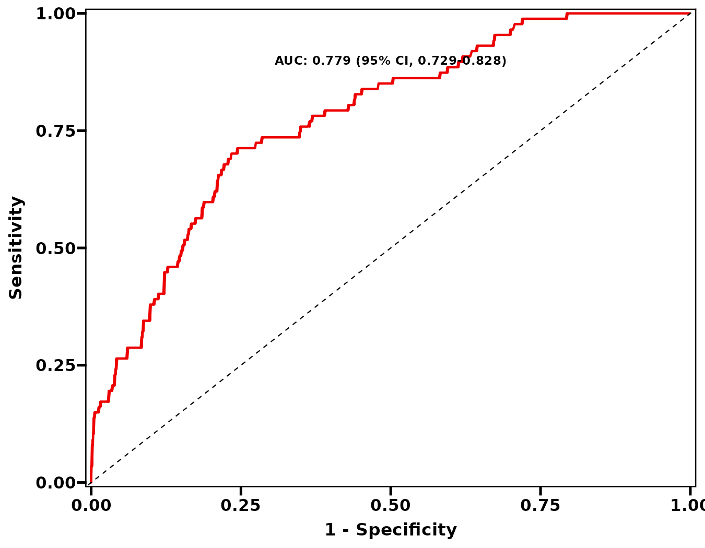
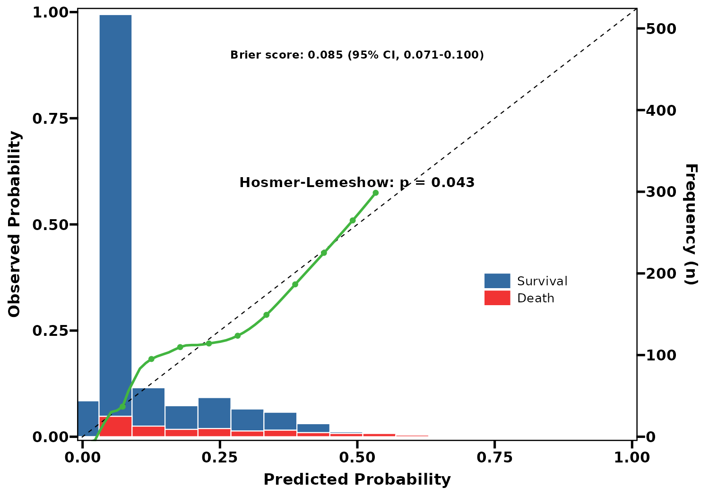
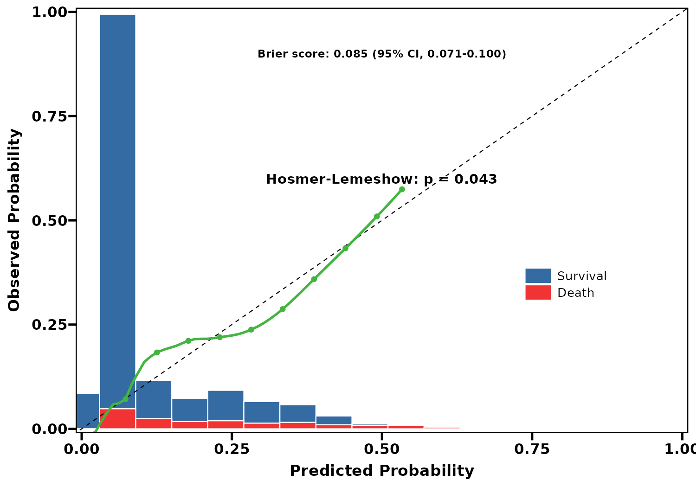
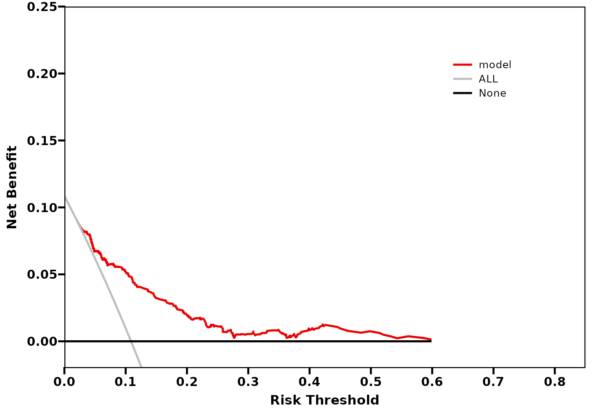

列线图只是预测模型的读数形式。区分度、校准和决策曲线需要分别评价，不能用一张漂亮列线图代替。本页实际运行 Cox 与 Logistic 的 8 个接口，并演示如何处理当前函数中的固定展示标签。

**版本与执行范围：** 按 RegR 0.1.3 当前源码核对，使用 WSL R 4.4.3 实际运行下面的示例并保存汇总输出。示例用于理解接口和输出；不构成外部验证或临床效果结论。

## 数据准备与复现


使用 RegR 自带的 SEER 甲状腺髓样癌队列。保留完整模型变量、正随访时间及肿瘤大小在 0–200 mm 内的记录，再固定种子抽取最多 800 人。`stage` 合并为 T1/T2 与其余分期，`surgery` 为无手术与任一手术。它们是本页的演示编码。时间单位沿用原始队列的月。只发布汇总结果。

```r
library(RegR)
library(ggplot2)
library(survival)
data("seer_thyroid_mtc_2026", package = "RegR")
d <- as.data.frame(seer_thyroid_mtc_2026)
d[["DSS"]] <- as.integer(as.character(d[["DSS"]]))
d[["OS"]] <- as.integer(as.character(d[["OS"]]))
needed <- c("time", "DSS", "OS", "Age", "Tum", "Sex", "Race", "T_stage", "Sur")
d <- d[complete.cases(d[needed]) & d[["time"]] > 0 &
       d[["Tum"]] > 0 & d[["Tum"]] < 200, , drop = FALSE]
d[["stage"]] <- factor(ifelse(d[["T_stage"]] %in% c("T1", "T2"), "Early", "Other"))
d[["surgery"]] <- factor(ifelse(d[["Sur"]] == "No surgery", "No", "Yes"),
                          levels = c("No", "Yes"))
set.seed(20261001)
d <- droplevels(d[sample.int(nrow(d), min(800L, nrow(d))), , drop = FALSE])
```


## 共用计算与返回对象


模型变量预先指定。Cox 接口固定 Surv(time,DSS)；Logistic 显式给 outcome="DSS"，只描述记录的事件状态。下面保留月单位。显示层的修正不改变拟合、预测和曲线数值；没有修改 RegR 包源码。

```r
predictors <- c("Age", "Tum", "Sex", "stage")
# 当前 ROC/校准 ggplot 存在固定的 1000 Bootstrap 文本。
# 本页 R=0，不显示这个不符合本次预算的图层。
drop_fixed_boot_label <- function(p) {
  keep <- vapply(p[["layers"]], function(layer) {
    label <- layer[["aes_params"]][["label"]]
    if (is.data.frame(layer[["data"]])) label <- c(label, layer[["data"]][["label"]])
    !any(grepl("1000 Bootstrap", label, fixed = TRUE))
  }, logical(1))
  p[["layers"]] <- p[["layers"]][keep]
  p
}
set.seed(20261001)
```


## 八个接口与参数预算


| 任务 | Cox | Logistic | 本页规格 |
|:--|:--|:--|:--|
| 列线图 | get_nom_cox | get_nom_log | Cox nom_times=36/60，cs_times=NULL |
| 区分度 | get_roc_cox | get_roc_log | Cox AUC=NULL；Logistic R=0 |
| 校准 | get_cal_cox | get_cal_log | B=20 演示；Cox IBS=NULL；Logistic R=0 |
| 净获益曲线 | get_dca_cox | get_dca_log | Cox 36/60 月；二分类按记录状态 |

get_roc_cox 默认 AUC 字符串、get_cal_cox 默认 IBS 字符串都是示例占位，函数不会据此运行 1000 次自举。本页显式设为 NULL。Logistic 的 R 控制 Score 路线，B 控制 rms 校准，两个参数不是同一预算；R=0 时不做 Score 重采样。

## Cox 列线图：正确的终点与时间轴


原接口的概率轴固定写 day OS，但拟合公式实际是 DSS。本例将返回 nomogram 的 funlabel 与对应列表名称一起改为 month DSS，然后重画。首图 36/60 月预测概率对应同一个 Cox 模型，未经独立验证。

列线图的变量积分和总分来自 Cox 模型；概率轴已注明月和 DSS。

```r
nom <- get_nom_cox(d, vars = predictors, nom_times = c(36, 60),
  cs_times = NULL, name_map = c(Age = "Age (years)", Tum = "Tumor (mm)"))
info <- attr(nom, "info")
old <- info[["funlabel"]]
new <- sub("-day OS", "-month DSS", old, fixed = TRUE)
names(nom)[match(old, names(nom))] <- new
info[["funlabel"]] <- new
attr(nom, "info") <- info
plot(nom, xfrac = 0.35, cex.axis = 0.8, cex.var = 0.95)
```


{fig-alt="36/60 月 DSS；列线图的变量积分和总分来自 Cox 模型；概率轴已注明月和 DSS。"}


## Cox 时点 AUC 与校准


get_roc_cox() 对整数时间网格求 AUC，并用 loess 展示；默认 C-index 文本是跨时点平均及其离散程度，并非 Harrell C 或标准综合 AUC 区间。首图只展示实际 AUC 数据和曲线，去掉该平均值注释。校准图则使用返回的 calibrations 重画 60 月对象，并明确 B=20。

::: {.panel-tabset}


### 时点 AUC {.unnumbered}


原始时间单位为月，max_time=120；没有占位 bootstrap 注释。

```r
p <- get_roc_cox(d, vars = predictors, max_time = 120, AUC = NULL)
# 去掉固定位置的跨时点平均 C-index 文本；点和曲线保持不变。
p[["layers"]] <- p[["layers"]][!vapply(p[["layers"]], function(z) {
  label <- z[["aes_params"]][["label"]]
  if (is.data.frame(z[["data"]])) label <- c(label, z[["data"]][["label"]])
  any(grepl("C-index:", label, fixed = TRUE))
}, logical(1))]
p + labs(x = "Time since diagnosis (months)", title = "Apparent time-dependent AUC")
```


{fig-alt="时点 AUC；原始时间单位为月，max_time=120；没有占位 bootstrap 注释。"}


### 60 月校准 {.unnumbered}


rms 校准对象的实际重画，B=20 仅为接口示例。

```r
set.seed(20261001)
cal <- run_quiet({get_cal_cox(d, vars = predictors,
  cal_times = 60, m = 120, B = 20, IBS = NULL)})
plot(cal[["calibrations"]][["60"]], xlim = c(0, 1), ylim = c(0, 1),
  xlab = "Predicted DSS survival at 60 months",
  ylab = "Observed DSS survival at 60 months")
```


{fig-alt="60 月校准；rms 校准对象的实际重画，B=20 仅为接口示例。"}


:::


## Cox 决策曲线


净获益依赖阈值概率对应的行动成本与获益，以及明确的终点与时间窗。DCA 的曲线高低不能自动证明临床获益；这张图仍是在同一演示人群内拟合和计算。

同时比较两个时点的模型、全部处理和不处理策略；显示标签改为月。

```r
p <- get_dca_cox(d, vars = predictors, dca_times = c(36, 60))
p + scale_colour_manual(
  values = c("#2C5E8A", "#B85B43", "grey60", "grey60", "black"),
  labels = c("36-month model", "60-month model", "All-36 months", "All-60 months", "None"))
```


{fig-alt="36/60 月 DCA；同时比较两个时点的模型、全部处理和不处理策略；显示标签改为月。"}


## Logistic 列线图与 ROC


预测的是 DSS 记录状态的概率，没有指定随访时点。ROC 图计算本页的表观 AUC；R=0 时不做 bootstrap，固定 1000 Bootstrap 注释被显式删除。

::: {.panel-tabset}


### 二分类列线图 {.unnumbered}


概率轴注明记录期间的 DSS 事件，不称为 60 月风险。

```r
nom <- get_nom_log(d, vars = predictors, outcome = "DSS",
  name_map = c(Age = "Age (years)", Tum = "Tumor (mm)"))
info <- attr(nom, "info")
old <- info[["funlabel"]]
new <- "Recorded DSS event risk"
names(nom)[match(old, names(nom))] <- new
info[["funlabel"]] <- new
attr(nom, "info") <- info
plot(nom, xfrac = 0.35, cex.axis = 0.8, cex.var = 0.95)
```


{fig-alt="二分类列线图；概率轴注明记录期间的 DSS 事件，不称为 60 月风险。"}


### 表观 ROC {.unnumbered}


R=0；图上的 AUC 来自本次数据，没有伪称 1000 次自举。

```r
p <- get_roc_log(d, vars = predictors, outcome = "DSS", R = 0)
drop_fixed_boot_label(p)
```


{fig-alt="表观 ROC；R=0；图上的 AUC 来自本次数据，没有伪称 1000 次自举。"}


:::


## Logistic 校准：原始曲线与频数轴


get_cal_log() 虽运行 rms::calibrate，但当前图读取 calibrated.orig，即表观校准曲线，没有显示 calibrated.corrected。B=20 的偏倚校正计算不能因此被宣称为已经画出的校正曲线。图中的 Hosmer–Lemeshow P 值受样本量和分组影响，不能单独证明校准良好。

::: {.panel-tabset}


### 带频数轴 {.unnumbered}


表观校准曲线、预测概率直方图及频数轴；B=20，R=0。

```r
set.seed(20261001)
p <- get_cal_log(d, vars = predictors, outcome = "DSS",
  B = 20, R = 0, show_sec_axis = TRUE)
drop_fixed_boot_label(p)
```


{fig-alt="带频数轴；表观校准曲线、预测概率直方图及频数轴；B=20，R=0。"}


### 隐藏频数轴 {.unnumbered}


相同配置隐藏第二坐标轴；直方图仍为缩放后的频数，不是概率曲线。

```r
set.seed(20261001)
p <- get_cal_log(d, vars = predictors, outcome = "DSS",
  B = 20, R = 0, show_sec_axis = FALSE)
drop_fixed_boot_label(p)
```


{fig-alt="隐藏频数轴；相同配置隐藏第二坐标轴；直方图仍为缩放后的频数，不是概率曲线。"}


:::


## Logistic 决策曲线


与 Cox DCA 不同，这里没有时间窗和删失处理。选择阈值范围时应与真实决策场景一致，而不是只寻找图中净获益最高的区间。

同一记录结局下的模型、全部处理与不处理策略。

```r
get_dca_log(d, vars = predictors, outcome = "DSS")
```


{fig-alt="二分类 DCA；同一记录结局下的模型、全部处理与不处理策略。"}


## 使用边界、保存与复现记录


本页所有模型使用同一示例队列，未进行外部验证。默认 cs_times 在 Cox 列线图中使用边际 KM S(s) 作条件概率分母，而分子来自个体 Cox 预测，不能自动当作 S(t|X)/S(s|X)；因此本页明确关闭该分支。真正的条件生存另见对应页面。复制图时应同时复制代码中的 AUC=NULL、IBS=NULL、实际 B/R 及终点/单位修正，避免把占位文字当成计算结果。

绘图调色、字体和布局只改变展示；模型、编码、样本、预测时间或权重改变后需要重新计算。带 `save` 的接口按帮助页传入保存配置；其余返回图可用 `ggplot2::ggsave()` 或 `RegR::save_plt()`，表格按返回类型使用 `save_tb()` / `save_gt()`。重采样示例的预算仅用于演示，应结合实际分析目的增加并报告失败与收敛情况。

## 相关页面与源码


- [评价指标与验证人群](model-evaluation-guide.qmd)

- [MLR 校准与 DCA](../mlr/calibration-dca-guide.qmd)

- [RegR 函数参考](https://hui950319.github.io/RegR/reference/index.html)

- [nomogram-cox.R](https://github.com/HUI950319/RegR/blob/2e56cc6e06d548786b0a43d3449e463a0b36b252/R/nomogram-cox.R)

- [nomogram-log.R](https://github.com/HUI950319/RegR/blob/2e56cc6e06d548786b0a43d3449e463a0b36b252/R/nomogram-log.R)

- [msr-riskRegression.R](https://github.com/HUI950319/RegR/blob/2e56cc6e06d548786b0a43d3449e463a0b36b252/R/msr-riskRegression.R)


```r
packageVersion("RegR")
sessionInfo()
```
