`get_rcs_all()` 把未调整、调整后的限制性立方样条（RCS）曲线组成一幅图。本页沿用 [SHAP 示例页](../mlr/shap-guide.qmd) 的展示方式：代码与实际图形相邻，关键选项放在标签页中比较，点击图片可以放大。切点分析接着看 [get_cut 系列教程](cut-guide.qmd)。

**版本与执行范围：** 接口按 RegR **0.1.3**、本机源码快照 `0add2bb` 核对；用 WSL R **4.4.3** 实际拟合并绘制 **16 张图**，覆盖全部 **7 种 `panel_show`**。VPD 使用 MLR **0.1.13** 的默认 Cox 解释模型。页面显示保存的图形，复制代码时需安装相应版本及依赖。

## 示例准备与读图尺度 {#data}

使用 `ToyData::toy_ptc_m1_cnd`，与本站 [森林图教程](forest-guide.qmd) 使用同一份 **598 人 M1 PTC 队列**。本页所选列没有缺失；`Tum_3` 的 `Unknown` 是已有因子水平。连续肿瘤大小 `Tum` 的缺失情况不等于这个分组列的缺失情况，完整数据来源见 [ToyData 数据介绍](../toydata/index.qmd)。

```r
library(RegR)
library(ToyData)
library(ggplot2)
library(patchwork)
library(survival)

vars <- c("time", "DSS", "event", "Age", "Sex", "Race", "Tum_3")
d <- as.data.frame(ToyData::toy_ptc_m1_cnd[, vars])
d <- droplevels(d[complete.cases(d), , drop = FALSE])

adj <- c("Sex", "Race", "Tum_3")
adj_group <- c("Race", "Tum_3")
```

| 内容 | 本页设置 |
|:--|:--|
| 年龄 `Age` | 20–90 岁；中位数 63 岁 |
| 性别 `Sex` | Female 359 人、Male 239 人；Female 是参考水平 |
| 随访 `time` | 1–239 月；单位为月 |
| 疾病特异结局 `DSS` | 175 人发生甲状腺癌死亡；其余按 Cox 路径删失 |
| 竞争风险 `event` | 0 = 删失 / 存活（328 人），1 = 目标死亡（175 人），2 = 其他死亡（95 人） |
| 单变量调整 | Sex、Race、Tum_3 |
| 性别 × 年龄调整 | Race、Tum_3；Sex 和 Age 不重复列入调整项 |

| 纵轴 | 曲线含义 | 读数 |
|:--|:--|:--|
| HR | Cox 危险比 | 1 为无相对差异；不是发生概率 |
| subHR / sHR | Fine–Gray 亚分布危险比 | 1 为无相对差异；不是普通 HR 或 CIF |
| OR | Logistic 优势比 | 1 为无相对差异 |
| Death rate | Poisson 事件数 / 人时 | 本页统一为每 1000 人年 |
| Rate difference | Male 减 Female 的死亡率 | 0 为无差异；可为负值 |
| S(60) | 60 月疾病特异生存模型的预测 | 0–1；本页由 Cox/DSS 后端产生 |
| S(60) difference | Male 减 Female 的预测生存差 | 0.10 表示 10 个百分点 |

观察性队列中的样条形状与性别对比用于说明关联和接口行为。因果效果、临床切点与外部预测性能需要另外的研究设计和验证。

### 图片的排版准备

为避免 A/B 标签遮住左上角的 P 值，下列 `rcs_view()` 把现有标签移到右上角，并显示各面板自己的 y 轴刻度。VPD 纵轴只保留预测量名称，VD / PD 的区别看条带与正文说明。它是**本页的排版函数**，不是 RegR 的导出接口；曲线、置信区间与模型检验保持原值。尤其率差面板可能有不同的下界，应读各自刻度。

::: {.callout-note collapse="true" title="复制图形代码前，先运行这个排版函数"}

```r
rcs_view <- function (p)
{
    for (i in seq_len(length(p))) {
        child <- p[[i]]
        ylabel <- child[["labels"]][["y"]]
        if (is.character(ylabel) && length(ylabel) == 1L &&
            grepl("^(Unadjusted|Adjusted) [0-9]+-year", ylabel)) {
            child[["labels"]][["y"]] <- sub("^(Unadjusted|Adjusted) ", "", ylabel)
        }
        for (j in seq_along(child[["layers"]])) {
            layer <- child[["layers"]][[j]]
            if (inherits(layer[["geom"]], "GeomLabelNpc") &&
                is.data.frame(layer[["data"]])) {
                layer[["data"]][["npcx"]] <- 0.98
                child[["layers"]][[j]] <- layer
            }
        }
        p[[i]] <- child
    }
    p & theme(axis.text.y = element_text(size = 12, face = "bold"),
        axis.ticks.y = element_line(linewidth = 0.4))
}
```

:::

## 接口与 7 种组合模式 {#interface}

下面保留当前完整参数名与默认值。`adj_var` 在 `formals()` 中是必填位置；不调整时显式传 `NULL`。`get_rcs_all()` 的 `n`、`conf.level` 与底层 `get_rcs()` 的 `n_knots`、`conf_level` 名称不同，复制代码时应以所调用的入口为准。

```r
get_rcs_all(
  data, rcs_var, adj_var,
  surv = 12 * 1000, n = 3L, conf.level = 0.95,
  ylim_max = NULL, ybre = NULL,
  legend.position = c(0.05, 0.95), colors = NULL,
  panel_show = c("haz_poi", "haz", "haz_poi.dif", "haz_vpd",
                 "haz_vpd.dif", "poi_poi.dif", "vpd_vpd.dif"),
  adj_show = c("both", "adj", "unadj"),
  strip_list = list(
    strip_style = c("panel", "grid"),
    top_label = NULL, right_label = NULL, top_right_fill = NULL,
    adj_position = c("auto", "right", "bottom")
  ),
  name_map = NULL, xlim = NULL, xbreaks = NULL, xtitle = NULL,
  fmt_ref = list(), fmt_his = list(), fmt_rcs = list(), xlabs = NULL,
  poi_time = NULL, vpd_time = NULL,
  cut_arg = list(), pnl_value = NULL, save = list()
)
```

### surv 首先选择模型

| `surv` | 相对效应面板 | 所需结局列 |
|:--|:--|:--|
| `TRUE` 或数值 | Cox HR | time、DSS |
| `FALSE` | Fine–Gray subHR | time、event；须有完整 0/1/2 编码 |
| `"结局列名"` | 二分类 Logistic OR | 指定二分类列；核对事件编码与因子水平 |

`surv = FALSE` 只把 **haz 行**切换到 Fine–Gray。组合中的 Poisson 仍用 DSS/time，生存 VPD 仍使用 Cox/DSS 的预测，并不会一起转成 CIF。当前 Fine–Gray 适配器通过 `finegray()` 扩展数据，再使用 `fgwt` 加权 Cox，设置 `robust = FALSE`、无 cluster 项；该区间应按这个实现的方差约定理解。[survival 的 finegray 官方说明](https://therneau.r-universe.dev/survival/doc/manual.html#finegray)解释了这条加权拟合路径。

### panel_show 选择展示的量

| 模式 | 第一行 / 第一对 | 第二行 / 第二对 | 限制 |
|:--|:--|:--|:--|
| [`haz`](#haz) | 未调整、调整 HR / subHR / OR | 无 | 两图上下排 |
| [`haz_poi`](#poisson) | 未调整、调整相对效应 | 未调整、调整死亡率 | 生存分支；默认模式 |
| [`haz_poi.dif`](#poisson) | 未调整、调整相对效应 | 未调整、调整率差 | 生存分支；需分组变量 |
| [`poi_poi.dif`](#poisson) | 未调整、调整死亡率 | 未调整、调整率差 | 生存分支；需分组变量 |
| [`haz_vpd`](#vpd) | 未调整、调整相对效应 | VD、PD | 需要 MLR |
| [`haz_vpd.dif`](#vpd) | 未调整、调整相对效应 | VD 差、PD 差 | 需要 MLR 和分组变量 |
| [`vpd_vpd.dif`](#vpd) | VD、PD | VD 差、PD 差 | 需要 MLR 和分组变量 |

所有差值模式需要 `rcs_var = c("一个分类变量", "一个连续变量")`。除了 `haz`，其余默认是四联图。Logistic 可用 `haz` 和三种 VPD 模式；死亡率模式属于生存分支。

### poi_time 与 vpd_time 的单位

| 控制项 | 本页写法 | 意义 |
|:--|:--|:--|
| `poi_time` | `12 * 1000` | 随访为月时，将事件率缩放为每 1000 人年；不是预测时间点 |
| `vpd_time` | `60` | 在 60 月预测；须与 time 单位相同且不超过观察随访范围 |
| 数值 `surv` | 兼容旧调用 | Poisson 模式作率倍数，VPD 模式作预测时间；显式 poi_time / vpd_time 优先 |

因此五年 VPD 用 `vpd_time = 60`，不是 `12 * 1000`。只画 Cox HR 时用 `surv = TRUE` 即可。Logistic VPD 没有随访时间点概念。

## 相对效应：HR、subHR 与 OR {#haz}

一个连续变量时，曲线表示相对其内部参照值的效应。`adj_show = "adj"` 保留调整后面板；实现仍拟合两套模型，以保持与完整图的显示尺度可比较。两张图并不能仅凭曲线重叠与否检验调整前后的差异。

::: {.panel-tabset}

### Cox：未调整与调整 {.unnumbered}

```r
rcs_view(get_rcs_all(d, rcs_var = "Age", adj_var = adj,
            surv = TRUE, panel_show = "haz", xtitle = "Age (years)"))
```

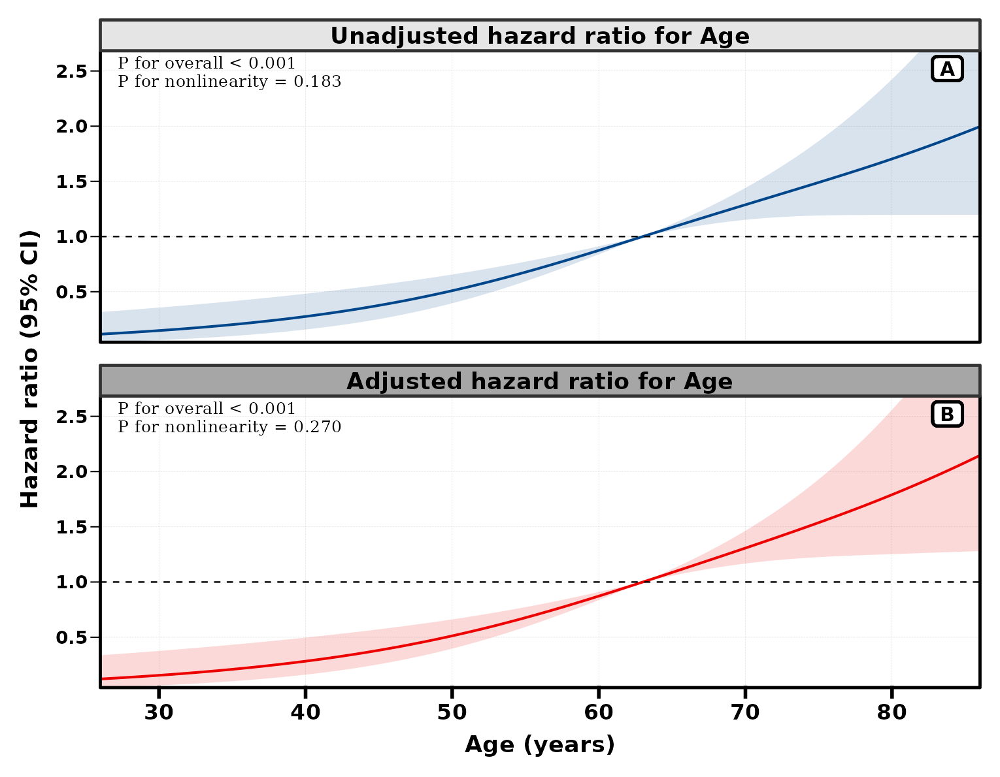{fig-alt="年龄的 Cox HR；上方未调整，下方调整 Sex、Race、Tum_3。"}

### 只看调整后 {.unnumbered}

```r
rcs_view(get_rcs_all(d, rcs_var = "Age", adj_var = adj,
            surv = TRUE, panel_show = "haz", adj_show = "adj",
            xtitle = "Age (years)"))
```

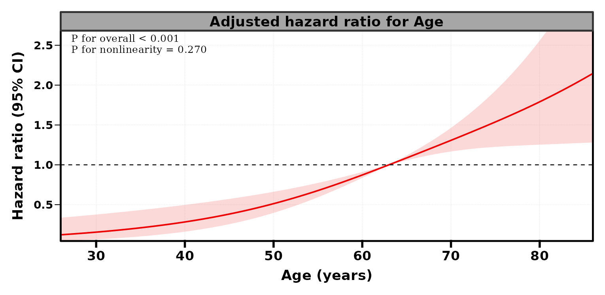{fig-alt="adj_show 为 adj，只展示调整后的年龄 HR。"}

### Fine–Gray {.unnumbered}

```r
rcs_view(get_rcs_all(d, rcs_var = "Age", adj_var = adj,
            surv = FALSE, panel_show = "haz", xtitle = "Age (years)"))
```

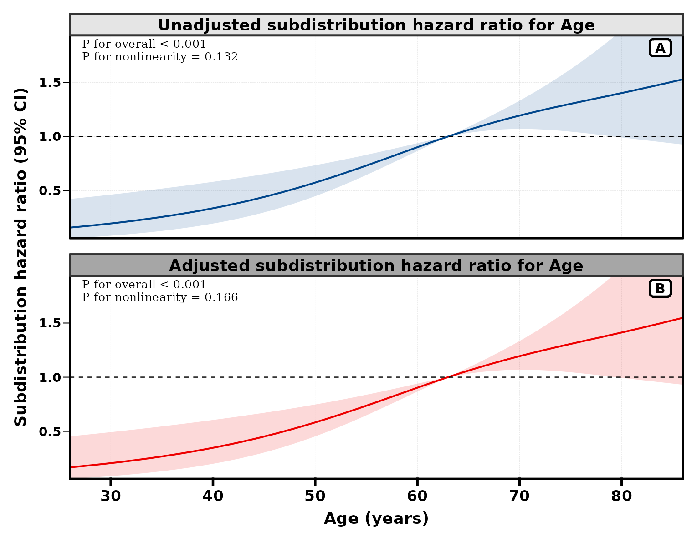{fig-alt="目标死亡与其他原因死亡共同进入 event 编码；纵轴为 subHR。"}

### Logistic {.unnumbered}

这里以 `DSS` 的 0/1 指示列演示二分类接口，**没有利用随访时间或删失机制**。它不是固定五年死亡率模型，也不能替代前面的生存分析。

```r
rcs_view(get_rcs_all(d, rcs_var = "Age", adj_var = adj,
            surv = "DSS", panel_show = "haz", xtitle = "Age (years)"))
```

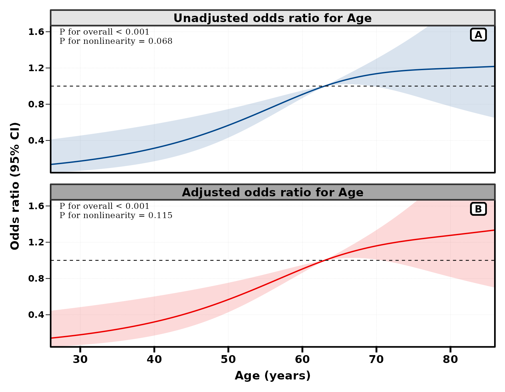{fig-alt="以 DSS 指示列作为二分类结局的 OR；仅用于展示 Logistic 分派。"}

:::

## 分组 RCS：对比曲线的方向 {#grouped}

`rcs_var = c("Sex", "Age")` 的 Cox / Logistic 相对效应面板默认使用交互 RCS。图上的 `Male vs Female` 是**同一年龄处的性别对比**，不是两条“各性别相对其自身参照年龄”的 HR。两变量顺序可互换，函数会把分类变量规范到前面。

Poisson 行则按性别分别拟合曲线；调整预测采用全数据共同的协变量代表值。交互 HR、分层死亡率和二者的差值应分别解释。

::: {.panel-tabset}

### Cox 性别对比 {.unnumbered}

```r
rcs_view(get_rcs_all(d, rcs_var = c("Sex", "Age"), adj_var = adj_group,
            surv = TRUE, panel_show = "haz", xtitle = "Age (years)"))
```

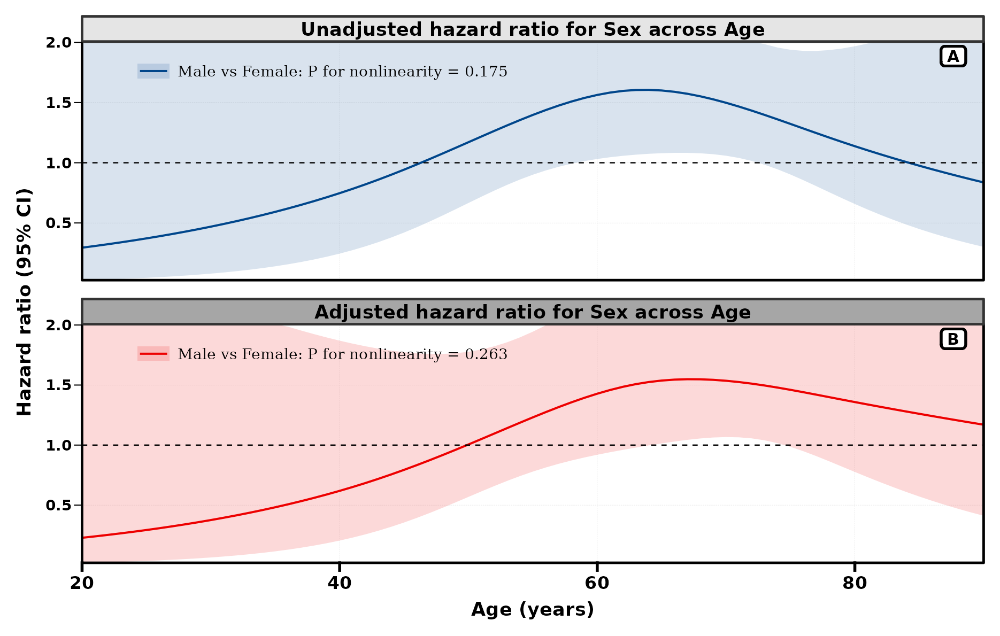{fig-alt="Male 相对 Female 的 HR 随年龄变化；上下为未调整与调整。"}

### Fine–Gray 性别对比 {.unnumbered}

```r
rcs_view(get_rcs_all(d, rcs_var = c("Sex", "Age"), adj_var = adj_group,
            surv = FALSE, panel_show = "haz", xtitle = "Age (years)"))
```

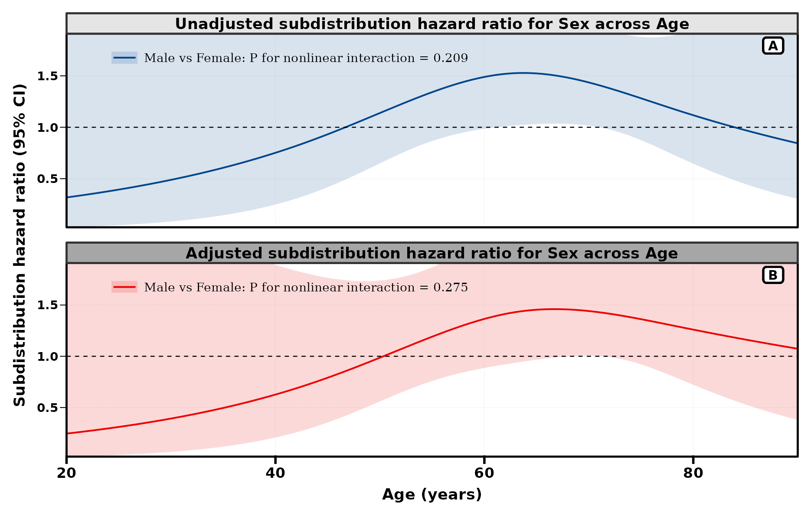{fig-alt="Male 相对 Female 的 subHR 随年龄变化，使用 event 的竞争风险编码。"}

:::

单变量的非线性 P 值针对样条的非线性部分；分组相对效应图需要按交互 / 对比曲线理解。率差图的非线性检验针对**响应尺度上率差是否线性**，不是率差是否等于零。曲线接近水平、通过无效应线、非线性 P 值较大，回答的是不同问题。

## 相对效应、死亡率与率差 {#poisson}

以下统一使用 `strip_style = "grid"`、`adj_position = "right"`，左列未调整、右列调整。右侧条带用短标签，完整量与单位保留在 y 轴上。率差始终按 **Male − Female** 读取；每 1000 人年的率不能读成某个时间点的死亡概率。

::: {.panel-tabset}

### HR + 死亡率 {.unnumbered}

```r
rcs_view(get_rcs_all(d, rcs_var = c("Sex", "Age"), adj_var = adj_group,
            surv = TRUE, poi_time = 12 * 1000, panel_show = "haz_poi",
            strip_list = list(strip_style = "grid", adj_position = "right",
                              right_label = c("HR", "Death rate")),
            xtitle = "Age (years)"))
```

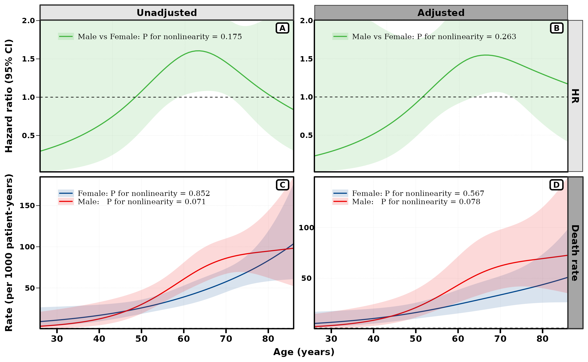{fig-alt="上方 HR，下方按性别分层的每 1000 人年死亡率。"}

### HR + 率差 {.unnumbered}

```r
rcs_view(get_rcs_all(d, rcs_var = c("Sex", "Age"), adj_var = adj_group,
            surv = TRUE, poi_time = 12 * 1000, panel_show = "haz_poi.dif",
            strip_list = list(strip_style = "grid", adj_position = "right",
                              right_label = c("HR", "Rate difference")),
            xtitle = "Age (years)"))
```

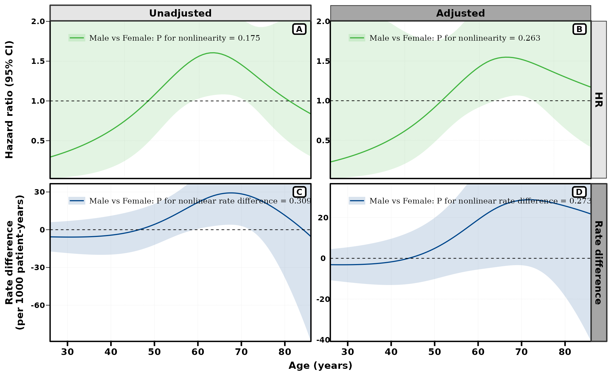{fig-alt="上方 HR，下方 Male 减 Female 的死亡率差；两个下方面板读取各自 y 轴。"}

### 死亡率 + 率差 {.unnumbered}

```r
rcs_view(get_rcs_all(d, rcs_var = c("Sex", "Age"), adj_var = adj_group,
            surv = TRUE, poi_time = 12 * 1000, panel_show = "poi_poi.dif",
            strip_list = list(strip_style = "grid", adj_position = "right",
                              right_label = c("Death rate", "Rate difference")),
            xtitle = "Age (years)"))
```

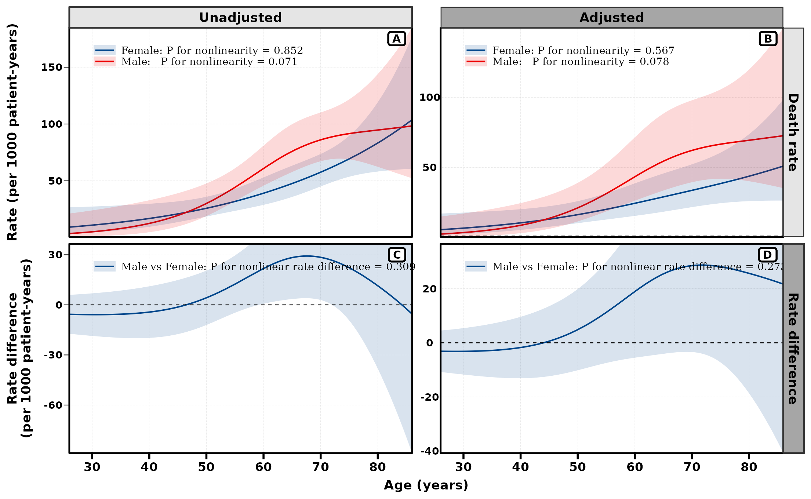{fig-alt="第一行展示两组死亡率，第二行展示其差值。"}

:::

## VPD：VD、PD 及组间差值 {#vpd}

这些模式通过 `MLR::get_vpd()` 生成变量分布（VD）和部分依赖（PD）面板，本页设定 **60 月**。默认解释器用包含 Sex、Age、Race、Tum_3 的 Cox 模型。

VD 使用观测上的 x / yhat；PD 汇总改变变量后生成的 ICE 预测。它们是模型预测展示，读数与 Cox 相对效应 RCS 不在同一尺度。

::: {.callout-note title="VPD 的两个位置表示 VD 与 PD"}
`haz_vpd` 及 `haz_vpd.dif` 的下方两图实际是 **VD 与 PD（或各自差值）**，来自同一个含调整项的解释模型。不能把它们理解成两套未调整 / 调整 VPD。示例显式把列标题写为 `Unadjusted HR / VD` 与 `Adjusted HR / PD`；`vpd_vpd.dif` 的列标题直接写为 VD、PD。
:::

::: {.panel-tabset}

### HR + VD / PD {.unnumbered}

```r
set.seed(246)
rcs_view(get_rcs_all(d, rcs_var = c("Sex", "Age"), adj_var = adj_group,
            surv = TRUE, vpd_time = 60, panel_show = "haz_vpd",
            strip_list = list(strip_style = "grid", adj_position = "right",
                              right_label = c("HR", "S(60)"),
                              top_label = c("Unadjusted HR / VD", "Adjusted HR / PD")),
            xtitle = "Age (years)"))
```

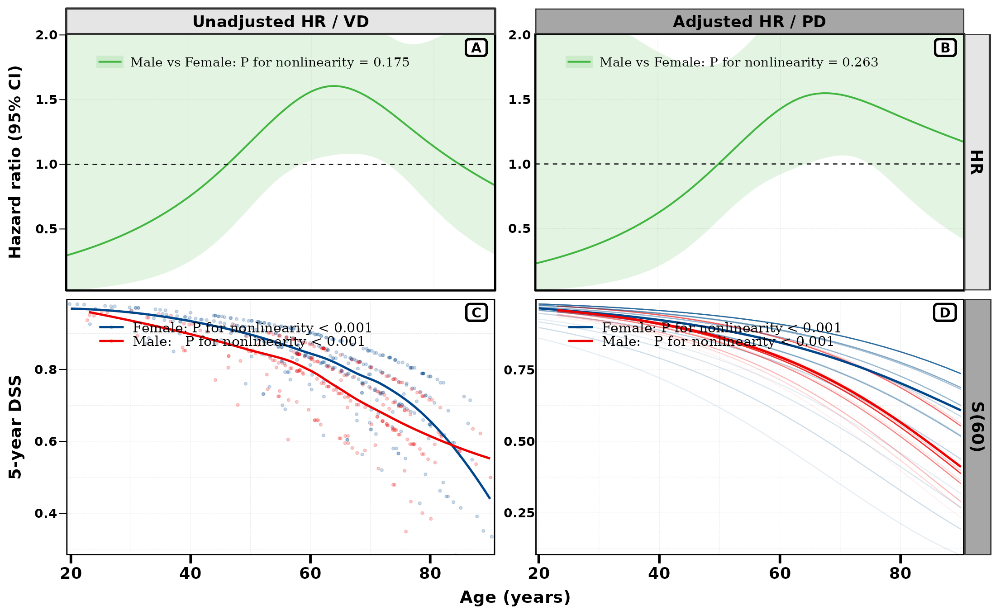{fig-alt="上方未调整与调整 HR；下方左为 VD，右为 PD，均为 60 月预测生存。"}

### HR + VD / PD 差 {.unnumbered}

```r
set.seed(246)
rcs_view(get_rcs_all(d, rcs_var = c("Sex", "Age"), adj_var = adj_group,
            surv = TRUE, vpd_time = 60, panel_show = "haz_vpd.dif",
            strip_list = list(strip_style = "grid", adj_position = "right",
                              right_label = c("HR", "S(60) difference"),
                              top_label = c("Unadjusted HR / VD", "Adjusted HR / PD")),
            xtitle = "Age (years)"))
```

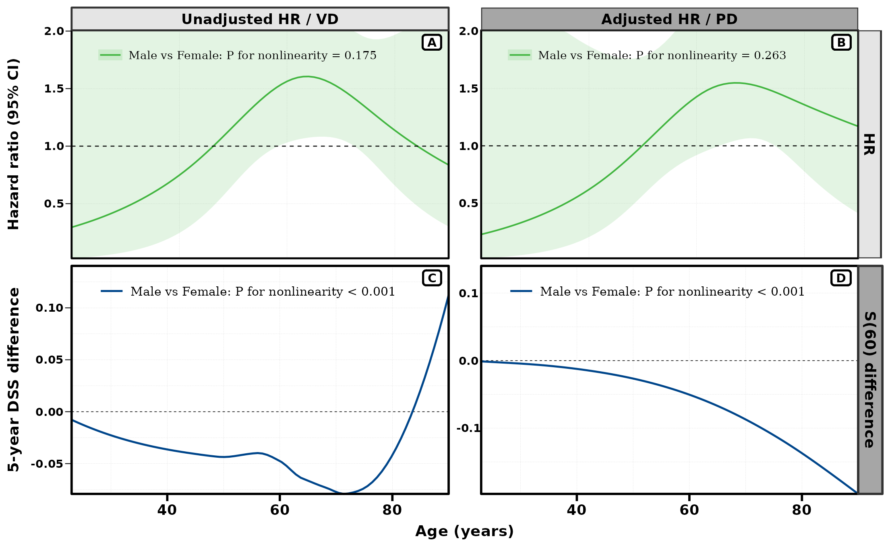{fig-alt="下方是 Male 减 Female 的 VD 差和 PD 差；差值曲线不带模型置信区间。"}

### VD / PD + 对应差值 {.unnumbered}

```r
set.seed(246)
rcs_view(get_rcs_all(d, rcs_var = c("Sex", "Age"), adj_var = adj_group,
            surv = TRUE, vpd_time = 60, panel_show = "vpd_vpd.dif",
            strip_list = list(strip_style = "grid", adj_position = "right",
                              right_label = c("S(60)", "S(60) difference"),
                              top_label = c("VD", "PD")),
            xtitle = "Age (years)"))
```

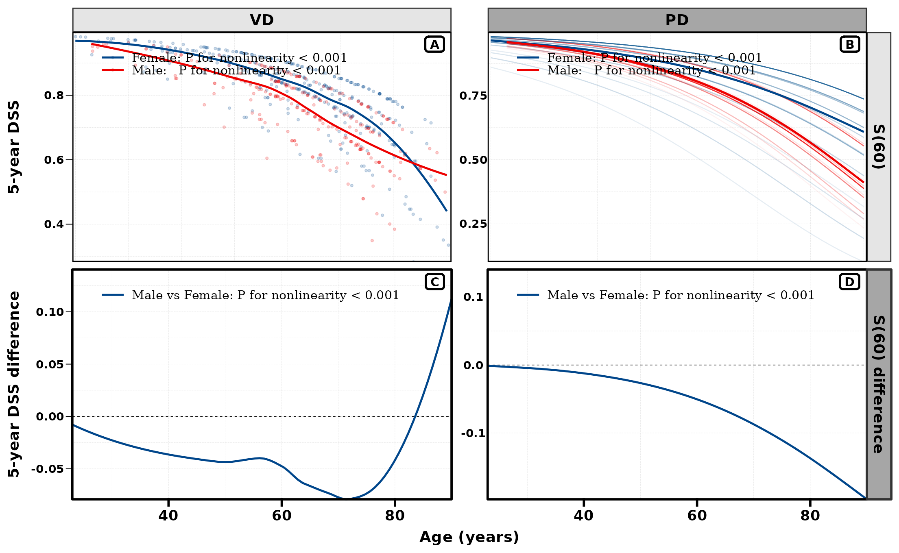{fig-alt="第一行左 VD 右 PD；第二行为各自 Male 减 Female 的差值，复用同一 VPD 拟合。"}

:::

当前 VPD 差值取两组平滑预测曲线之差，没有置信带；不能把平滑线的稳定外观当作区间很窄。即使组合的 haz 行换成 Fine–Gray，VPD 行仍是 Cox/DSS 预测。

## 条带、方向与调整面板 {#layout}

`strip_list` 接受局部覆盖。`panel` 逐面板标题默认把调整状态放在列上；`grid` 共享条带默认把调整状态放在行上。用 `adj_position` 显式设为 `right` 或 `bottom` 可避免依赖这种默认差异。

::: {.panel-tabset}

### 每幅图一个标题 {.unnumbered}

```r
rcs_view(get_rcs_all(d, rcs_var = c("Sex", "Age"), adj_var = adj_group,
            surv = TRUE, poi_time = 12 * 1000, panel_show = "haz_poi",
            strip_list = list(strip_style = "panel", adj_position = "right"),
            xtitle = "Age (years)"))
```

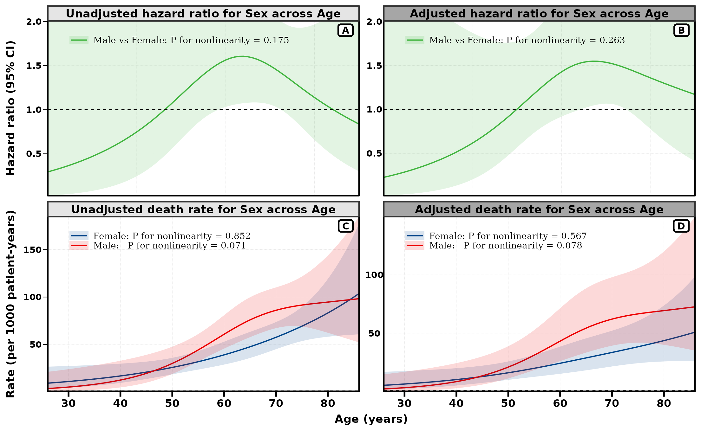{fig-alt="strip_style 为 panel，调整后放在右列。"}

### 共享条带、调整在右 {.unnumbered}

```r
rcs_view(get_rcs_all(d, rcs_var = c("Sex", "Age"), adj_var = adj_group,
            surv = TRUE, poi_time = 12 * 1000, panel_show = "haz_poi",
            strip_list = list(strip_style = "grid", adj_position = "right",
                              right_label = c("HR", "Death rate")),
            xtitle = "Age (years)"))
```

{fig-alt="strip_style 为 grid，显式把调整后放在右列。"}

### 共享条带、调整在下 {.unnumbered}

```r
rcs_view(get_rcs_all(d, rcs_var = c("Sex", "Age"), adj_var = adj_group,
            surv = TRUE, poi_time = 12 * 1000, panel_show = "haz_poi",
            strip_list = list(strip_style = "grid", adj_position = "bottom",
                              top_label = c("HR", "Death rate"),
                              right_label = c("Unadjusted", "Adjusted")),
            xtitle = "Age (years)"))
```

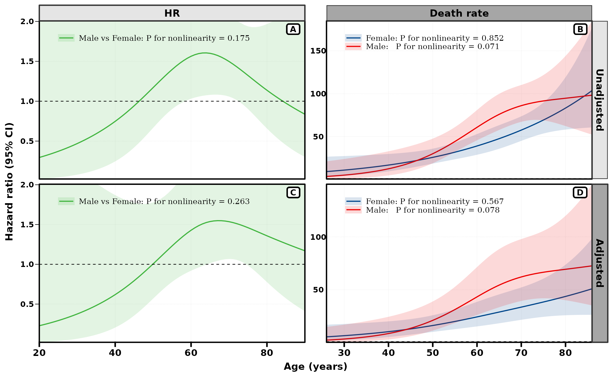{fig-alt="grid 布局按调整状态分行：上方未调整，下方调整；HR 与死亡率分列。"}

:::

`top_label`、`right_label` 仅控制共享条带文字；`top_right_fill` 可给出一至两个顺序 HCL 调色板名。`adj_show` 决定保留哪一套调整状态，不改变 `conf.level`、`ylim_max`、`ybre` 的原始 p1–p4 参数索引。

## 结点、参考线、分布与坐标 {#format}

`n = 3L` 是 3 个结点，默认按暴露分位数放置；`n = c(35, 55, 75)` 是年龄原始尺度上的 3 个具体位置。允许 3–7 个结点，具体位置须互异且在观察范围内。手动结点供所有面板复用，但**不会把 55 岁自动定义为临床切点或相对效应参考年龄**。[rms 官方手册](https://stat.ethz.ch/CRAN/web/packages/rms/refman/rms.html)记录了整数结点数与位置向量的约定。

::: {.panel-tabset}

### 指定结点与颜色 {.unnumbered}

```r
rcs_view(get_rcs_all(d, rcs_var = "Age", adj_var = adj,
            surv = TRUE, n = c(35, 55, 75), panel_show = "haz",
            colors = c("#2166AC", "#B2182B"), xtitle = "Age (years)"))
```

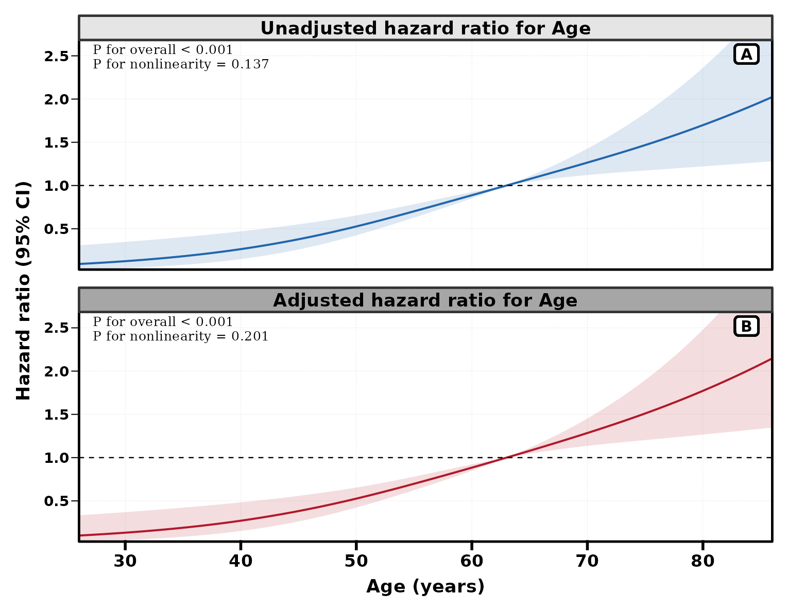{fig-alt="以 35、55、75 岁指定样条结点；颜色分别对应未调整和调整面板。"}

### 参考线与年龄分布 {.unnumbered}

55 岁红线是读图标记，灰色分布层展示样本支持范围；两者都没有重新拟合模型或改变 HR 的参考点。

```r
rcs_view(get_rcs_all(d, rcs_var = "Age", adj_var = adj,
            surv = TRUE, panel_show = "haz", adj_show = "adj",
            xbreaks = seq(20, 90, 10), xtitle = "Age (years)",
            fmt_ref = list(x = 55, color = "#B2182B"),
            fmt_his = list(type = "d", data = d, con_var = "Age",
                           binwidth = 2, his_alpha = 0.35, height_ratio = 0.3)))
```

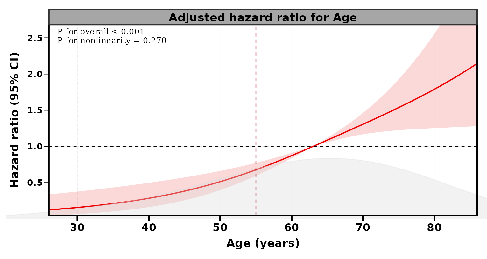{fig-alt="调整后的年龄 HR，加 55 岁参考线和年龄分布层。"}

:::

| 参数 | 设置与边界 |
|:--|:--|
| `conf.level` | 标量或循环使用的面板向量，控制置信带；当前 y 轴固定写 95% CI，因此本页统一使用 0.95 |
| `ylim_max` | 上界；默认 haz 与差值对的上界按有限点估计最大值 × 1.25 设置，尾部置信带可能被截取 |
| `ybre` | 刻度位置；向量应用所有面板，list 按原始 p1–p4 指定；不改变范围 |
| `xlim` | 传给 scale_x_continuous 的限制，可能移除范围外的绘图点；不能当作纯坐标放大 |
| `xbreaks` / `xtitle` | 横轴刻度 / 标题；xlabs 是已弃用的 xtitle 别名 |
| `legend.position` | 面板内 c(x, y)，或 `"none"` 隐藏图例；分组 P 值常在图例中 |
| `colors` | 单色、面板覆盖向量或调色板来源；VPD 面板使用 MLR 自己的调色板 |
| `name_map` | 列名到显示标签的映射；不会改数据编码或重新定义组别 |
| `fmt_ref` / `fmt_his` | 参考线 / 分布层参数 list；为空时不添加 |
| `fmt_rcs` | 对拟合后曲线做几何变换；变换后不再是原始模型估计，原模型 P 值被移除 |
| `pnl_value` | 替换显示的非线性 P 值；不重新计算检验，只应填入已有、来源明确的结果 |

默认的有限显示范围适合观察主体曲线；需要阅读完整尾部区间时，应给足够大的 `ylim_max` 并逐面板检查。只添加 `fmt_ref` 的竖线，与 `fmt_rcs` 平移整条曲线，有不同的作用。

## 返回对象、切点衔接与保存 {#output}

返回一个 `patchwork`。连续子图和组合图携带 `cut_curve_data`，供 `get_cut_plot()` 读取；旧图对象或截图本身没有这个分析属性。

```r
p <- get_rcs_all(d, rcs_var = "Age", adj_var = adj,
                 surv = TRUE, panel_show = "haz")

# 默认分析调整后的连续 RCS 曲线。
cut <- RegR::run_quiet(get_cut_plot(p))
cut[["summary"]]
cut[["table"]]
```

`cut_arg` 在函数结束时运行曲线切点分析、打印 / 保存表格，**结果不保存在返回图中**。需要 summary、tables 等组件时，像上面那样另调 `get_cut_plot()`。

```r
# 写入临时目录，避免在当前分析目录产生演示文件。
get_rcs_all(
  d, rcs_var = "Age", adj_var = adj,
  surv = TRUE, panel_show = "haz",
  save = list(filename = file.path(tempdir(), "age-rcs.pdf"),
              width = 8, height = 7)
)

# 同时保存并列曲线切点表；get_rcs_all 仍返回图。
get_rcs_all(
  d, rcs_var = "Age", adj_var = adj,
  surv = TRUE, panel_show = "haz",
  cut_arg = list(which = c(1, 2), breakpoint = 55,
                 save_arg = list(path = tempdir(), title = "Age curve threshold"))
)
```

`save = list()` / `NULL` 没有文件输出；非空 `save` 交给 `RegR::save_plt()`。本机调用会打印推荐保存尺寸：haz 双面板约 8 × 7 英寸，四联图约 10 × 7 英寸；含长图例时可以增大宽度。示例图片为 PNG；上述 PDF 与 Word 路径已在临时目录实际核验。

继续阅读 [get_cut、get_cut_ci 与 get_cut_plot](cut-guide.qmd)，理解原始结局切点、曲线切点和 bootstrap 区间的区别。

## 复现版本与源码入口 {#source}

| 包 | 本页执行版本 |
|:--|:--|
| RegR / MLR / ToyData | 0.1.3 / 0.1.13 / 0.1.0 |
| UtilsR / rms | 0.6.8 / 6.8.2 |
| survival / segmented / flextable | 3.8.12 / 2.1.1 / 0.9.10 |

源码入口为 [RegR/R/rcs-all.R](https://github.com/HUI950319/RegR/blob/main/R/rcs-all.R)，底层单面板与 Fine–Gray 适配分别在 [rcs-get.R](https://github.com/HUI950319/RegR/blob/main/R/rcs-get.R)、[rcs-crr.R](https://github.com/HUI950319/RegR/blob/main/R/rcs-crr.R)。该快照的实际图形已核验；版本升级后应重新核对 formals 与帮助页。
