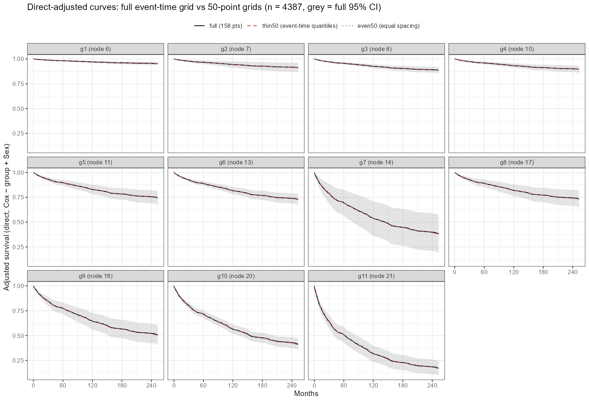

```{r}
#| label: setup
#| include: false
tm <- read.csv("bench/rpa_cox_timing.csv")
kn <- read.csv("bench/rpa_cox_knobs.csv")
op <- read.csv("bench/rpa_cox_optim.csv")
pct <- function(x) ifelse(is.na(x), "—", sprintf("%.2f", 100 * x))
main <- tm[tm$run == "main", ]
w <- reshape(main[, c("n", "cell", "sec")], idvar = "n", timevar = "cell", direction = "wide")
names(w) <- sub("^sec\\.", "", names(w))
w <- w[order(w$n), ]
mem <- reshape(main[, c("n", "cell", "peak_mb")], idvar = "n", timevar = "cell", direction = "wide")
names(mem) <- sub("^peak_mb\\.", "", names(mem))
mem <- mem[order(mem$n), ]
n_lab <- function(n) ifelse(n > 4387, paste0(format(n, big.mark = ","), "\\*"), format(n, big.mark = ","))
f2 <- function(x) ifelse(is.na(x), "未测", ifelse(x < 10, sprintf("%.2f", x), sprintf("%.1f", x)))
gb <- function(x) ifelse(is.na(x), "—", sprintf("%.1f", x / 1024))
```

评估对象是 RegR 0.1.3 中 `get_rpa()` 的生存路径（`surv = TRUE`）。传入 `adj_var` 后，`get_rpa()` 在终末节点分组上调用一次：

```r
get_cat(dat, cat_var = "group", adj_var = adj_var, surv = TRUE,
        timepoint = 120, methods_obj = c("unadj", "direct"))
```

`get_cat()` 的结果由三块组成，本页分别计时：

| 组成部分 | 内部调用 | 在 RPA 图表中的位置 |
|:--|:--|:--|
| `cat$obj` 曲线 | `.get.obj(times = NULL)` → `adjustedCurves::adjustedsurv()`，未调整用 `"km"`，调整用 `"direct"` | `plt_rpa_km()` 左右两列、`plt.sur`、`plt.rpa1`、`plt.rpa2` |
| `cat$UM` 的 haz 表 | `.get.UM.haz()` → `survival::coxph()` | HR1 / HR2 |
| `cat$UM` 的 sur 表 | `.get.UM.sur(time = 120)` → `.get.obj(times = 120)` | SP1 / SD1、SP2 / SD2 |

: get_cat 的组成和对应的耗时单元。 {#tbl-parts}

`"direct"` 是直接标准化（g-computation）：先拟合 `Surv(time, DSS) ~ group + adj_var` 的 Cox 模型，再把每个人分别放进每一组预测生存曲线，然后取平均。置信区间由 `riskRegression::ate()` 的影响函数给出。

## 结论

1. **慢的只有调整后的生存曲线。**n = 4387 时整个 `get_cat()` 用了 18.3 s，其中调整后的曲线占 17.4 s。HR 表在 n = 100000 时也只要 0.7 s；120 个月生存率表（含调整）在 n = 100000 时要 14 s；未调整的 KM 曲线始终不超过 1.7 s。
2. **调整后曲线随 n 增长很快。**n = 15000、30000、50000 时分别要 65 s、160 s、262 s，峰值内存 6.6、11.2、18.6 GB。按 8000 到 50000 拟合，耗时约按 n^1.25^ 增长，内存基本与 n 成正比。外推到 n = 100000 约需 10 分钟、37 GB 内存（未实测）。
3. **耗时几乎都花在置信区间上。**同样的调整曲线不求置信区间（`conf_int = FALSE`）时，n = 50000 也只要 6.7 s。
4. **根源是 `ate()` 默认计算所有组之间的两两对比。**11 个组共 55 对，每对都要在约 157 个事件时间上算影响函数；adjustedCurves 实际只用到各组自己的平均生存率。改成"参照组对其余各组"的 10 对后，n = 8000 时从 40.6 s 降到 7.7 s，11 个组在所有时间点上的生存率、标准误和置信区间与默认结果完全相同。
5. **减少时间点也有效。**曲线改为每 6 个月取一个点，n = 8000 时从 35 s 降到 5.7 s，n = 30000 时从 145 s 降到 18 s；120 个月处的估计值和置信区间不变，但曲线变粗。
6. **方案 A 和改良后的方案 B 已于 2026-10-02 并入 RegR。**B 改成了「最多 50 个时间点，按事件时间抽取」。11 组、n = 30000 的 `get_cat()` 从 171 s 降到 14 s；保留下来的每个时间点上，曲线、标准误和置信区间与原来完全相同，HR 和生存率表一字不差。A 同样用于竞争风险的 CSC 模型；FGR 不经过 `ate()`，A 对它不适用，B 也没有让它变快。`get_facet()` 的调整曲线后来也加上了 B。见「已并入 RegR 的优化」。
7. **再去掉曲线的置信带（方案 C），大样本时曲线这一步还能快 3.6–5 倍，但尚未并入 RegR。**在 A + B 的基础上，n = 100000 时调整曲线从 37 s 降到 7 s，n = 200000 时从 75 s 降到 21 s，点估计不变；代价是图上的调整曲线和差值曲线都没有置信带。整个 `get_cat()` 估计快 2–3 倍，因为 120 个月生存率表本身需要置信区间，C 管不到。见「方案 C：不画置信带（评估）」。
8. **竞争风险已改用 mets（2026-10-02 并入 RegR）。**sHR、亚组交互 P、`get_inter()` 的模型和 Fine-Gray 调整 CIF 都改由 mets 计算，调整 CIF 不再做 bootstrap。1 万例时 `get_eff(surv = FALSE)` 从 42 s 降到 9 s，`get_cat()` 从 98 s 降到 20 s，`get_facet(method = "direct")` 从 13 s 降到 3 s。按整月记录的数据上 sHR 变化约 1%，调整 CIF 的点估计基本不变，置信区间由 bootstrap 改为 Wald 区间。`get_rpa()` 只走 Cox，不受影响。见「竞争风险改用 mets：1 万例前后对比」。

## 测试设置

- **环境：**Windows 11，Intel Core Ultra 9 275HX（24 逻辑核），128 GB 内存；R 4.4.3，RegR 0.1.3（Windows R 安装版），adjustedCurves 0.11.4，riskRegression 2025.5.20，survival 3.8.12。注意：[竞争风险 CIF 基准](get-eff-cif-benchmark.qmd)是在 WSL 上测的，环境不同，两页的绝对耗时不能直接比较。
- **数据：**`RegR::seer_thyroid_mtc_2026`，n = 4387，DSS 事件 597 个。先在完整数据上运行 `get_rpa(d, c("Age", "T_stage"), adj_var = "Sex", surv = TRUE)`，得到 11 个终末节点分组；更大的 n 对这份带分组的数据按行有放回重抽样（表中标 \*），因此事件时间点始终是同样的 157 个。真实的大队列通常有更多不同的事件时间，调整曲线的耗时会更高。
- **调整变量：**只有 `Sex`。
- **计时：**每个单元只跑一次，记录 `system.time()` 的墙钟时间；峰值内存取 `gc(reset = TRUE)` 之后 `gc()` 的 "max used"，只统计 R 堆内存。只有一个分组变量时，RegR 的外层不会并行，所有调用都是单进程。
- **波动：**同一份 n = 8000 数据上，同一个调整曲线调用先后测到 26–41 s。表中数字只用来看量级和增长趋势。

## 耗时结果

```{r}
#| label: fig-timing
#| echo: false
#| fig-cap: "各步骤的墙钟耗时（秒），双对数坐标。虚线右侧为重抽样放大的样本。n = 100000 时没有测调整后的曲线。"
#| fig-width: 7.5
#| fig-height: 4.4
#| renderings: [light, dark]
library(ggplot2)
lab <- c(curve_direct = "调整曲线（带 CI）", as_direct_noCI = "调整曲线（不带 CI）",
         SP_direct = "120 月生存率 · 调整", curve_unadj = "KM 曲线 · 未调整",
         SP_unadj = "120 月生存率 · 未调整", HR_direct = "HR · 调整", HR_unadj = "HR · 未调整")
col <- c("#b4532a", "#d9a441", "#1f6f5c", "#6b7a8f", "#7fb3a4", "#9a8a3a", "#b9c0bb")
pd <- main[main$cell %in% names(lab), ]
pd$cell <- factor(pd$cell, levels = names(lab), labels = lab)
p <- ggplot(pd, aes(n, sec, colour = cell)) +
  geom_vline(xintercept = 4387, linetype = 3, colour = "grey55") +
  geom_line(linewidth = 0.9) + geom_point(size = 1.8) +
  scale_x_log10(breaks = unique(pd$n), labels = function(x) paste0(round(x / 1000, 1), "k")) +
  scale_y_log10(breaks = c(0.1, 1, 10, 100), labels = function(x) paste(x, "s")) +
  scale_colour_manual(values = col, name = NULL) +
  labs(x = "样本量 n（对数）", y = "墙钟耗时（对数）") +
  guides(colour = guide_legend(nrow = 3))
th <- function(fg, bg, grid) theme_minimal(base_size = 11) +
  theme(legend.position = "bottom", panel.grid.minor = element_blank(),
        panel.grid.major = element_line(colour = grid),
        text = element_text(colour = fg), axis.text = element_text(colour = fg),
        plot.background = element_rect(fill = bg, colour = NA))
p + th("#1d2421", "white", "grey90")
p + th("#dee2e6", "#222222", "#3a3f44")
```

::: {.nowrap .column-page}

```{r}
#| label: tbl-timing
#| echo: false
#| tbl-cap: "各步骤墙钟耗时（秒）与调整曲线的峰值内存（GB）。“曲线”是整个随访期的曲线（cat$obj），“120 月”是 timepoint = 120 的生存率与生存率差表。"
knitr::kable(data.frame(
  n = n_lab(w$n),
  `KM 曲线` = f2(w$curve_unadj),
  `调整曲线` = paste0("**", f2(w$curve_direct), "**"),
  `其内存` = gb(mem$curve_direct),
  `调整曲线（不带 CI）` = f2(w$as_direct_noCI),
  `HR 未调整` = f2(w$HR_unadj), `HR 调整` = f2(w$HR_direct),
  `120 月 未调整` = f2(w$SP_unadj), `120 月 调整` = f2(w$SP_direct),
  check.names = FALSE), align = "rrrrrrrrr")
```

:::

```{r}
#| label: getcat-total
#| include: false
pil <- tm[tm$run == "pilot", ]
gct <- pil$sec[pil$cell == "get_cat_total"]
cdp <- pil$sec[pil$cell == "curve_direct"]
```

另外在 n = 4387 上测了一次完整的 `get_cat()`：`r sprintf("%.1f", gct)` s，其中调整曲线这一步 `r sprintf("%.1f", cdp)` s。`.get.obj()` 在 `times = NULL` 时还会打印一张诊断曲线图，直接调 `adjustedsurv()` 的耗时（`as_direct_CI`，见 CSV）比经过 RegR 包装的版本少 1–10 s，主要是这部分画图和包装开销，也夹杂了计时波动。

## 慢在哪里

调整曲线走的是 adjustedCurves 内部的 `surv_direct()`，Cox 模型在这里直接交给 `riskRegression::ate()`：

```r
surv <- riskRegression::ate(event = outcome_model, treatment = variable,
                            data = data, estimator = "Gformula", times = times,
                            se = conf_int, verbose = verbose, cause = 1, ...)
```

`times = NULL` 时，`times` 是全部事件时间（本数据 157 个）。`ate()` 的 `allContrasts` 默认取所有组的两两组合，11 个组就是 55 对，每对的风险差和风险比都要算影响函数。adjustedCurves 只读取其中的 `meanRisk`（各组自己的平均风险），两两对比算完就丢掉了。

`adjustedsurv()` 会把 `...` 原样传给 `ate()`，所以可以从外面指定只算"参照组对其余各组"：

```{r}
#| label: tbl-contrast
#| echo: false
#| tbl-cap: "n = 8000，同一份数据、同一个 Cox 模型，只改 ate() 的 allContrasts。"
kc <- kn[kn$batch == "contrast", ]
knitr::kable(data.frame(
  `allContrasts` = c("默认：所有两两组合（55 对）", "rbind(参照组, 其余各组)（10 对）"),
  `耗时（s）` = sprintf("%.1f", kc$sec),
  `输出行数` = kc$rows,
  `与默认结果比较` = c("—", "11 组 × 全部时间点的 surv、se、CI 最大差值均为 0"),
  check.names = FALSE), align = "lrrl")
```

如果只传一对（`matrix(lv[1:2], nrow = 2)`），耗时会降到 1 s 左右，但 `ate()` 只输出这两个组，其余 9 组的曲线没了，所以不能这样用。

## 减少时间点

```{r}
#| label: tbl-grid
#| echo: false
#| tbl-cap: "带置信区间的调整曲线在不同时间网格下的耗时。最右列是第 1 组在 120 个月处的生存率（95% CI）。"
kg <- kn[kn$batch == "grid" & kn$setting != "allContrasts_1pair", ]
glab <- c(all_event_times = "全部事件时间（现在的做法）",
          times_by_6 = "seq(0, 240, by = 6)", times_by_12 = "seq(0, 240, by = 12)")
knitr::kable(data.frame(
  n = format(kg$n, big.mark = ","), `时间网格` = glab[kg$setting],
  `时间点 × 组` = kg$rows, `耗时（s）` = sprintf("%.1f", kg$sec),
  `峰值内存（GB）` = sprintf("%.1f", kg$peak_mb / 1024),
  `S(120) 第 1 组` = sprintf("%.4f (%.4f, %.4f)", kg$s120_g1, kg$ci_low, kg$ci_high),
  check.names = FALSE), align = "rlrrrr")
```

`ate()` 在每个时间点上的估计互不依赖，所以只要 120 个月仍在网格里，该点的估计和置信区间就与全部事件时间时完全相同。代价是曲线从 145–158 个点降到 41 个（每 6 个月）或 21 个（每 12 个月），图形会变粗。

## 已并入 RegR 的优化（A + B）

2026-10-02 起，下面两项已并入 RegR（版本号仍是 0.1.3，对应提交 `63541f6`、`c71fe16`、`c1f6435`，B 之后又在 `27980d2`、`f30bc69` 中调整，见下表）。本节的「改动前 / 改动后」都在同一台机器、同一份数据上，用 Windows R 先后装两个版本各跑一次 `get_cat(..., timepoint = 120)`，环境同「测试设置」。

| 优化 | 改了什么 | 作用范围 | 对结果的影响 |
|:--|:--|:--|:--|
| A | `.get.obj()` 的 direct 分支给 `adjustedsurv()` / `adjustedcif()` 传 `allContrasts = rbind(参照组, 其余各组)` | Cox 调整生存曲线；竞争风险 `cif_args = list(model = "CSC")` 的调整 CIF；也包括走同一函数的 120 月生存率（CIF）表 | 无。每组的估计、标准误、CI 与默认的两两对比完全相同 |
| B | `.get.obj()` 的可选参数 `max_times` / `keep_times`（默认不限点数）。打开后，调整曲线最多保留 `max_times` 个时间点：按 DSS（竞争风险为结局 1）的事件时间均匀抽点，再加上 0、`keep_times` 和任一结局的最后一个事件时间。`get_cat()` 取 50 个点并保留 `timepoint`；`get_facet()` 取 50 个点并保留 `timepoint` 和 `max_t` | `get_cat()` 与 `get_facet()` 的调整曲线，Cox 与竞争风险（CSC、FGR）都适用，因此也覆盖 `get_rpa()`、`plt_cat1/2/3()`、`plt_rpa_km()` | 保留的时间点上数值完全相同；点与点之间的连线最多偏离约 1 个百分点 |

: 已实施的两项优化（B 为 `f30bc69` 之后的形式）。 {#tbl-applied}

不受影响的部分：

- KM、IPTW、匹配曲线照常使用全部事件时间：它们本来就快，而且 KM 要画成阶梯。
- B 默认关闭，只有 `get_cat()` 和 `get_facet()` 这两个只拿曲线画图的调用方打开它。`get_facet_diff()` 等调用方会从 `times = NULL` 的曲线对象上读取 60、120、180 个月的数值，抽点会改变这些数，所以它们仍使用全部事件时间。
- 最初的实现（`c71fe16`）只在 `get_cat()` 里生成网格，经内部参数 `direct_times` 传给 `.get.obj()`。`f30bc69` 把网格移进 `.get.obj()`，改成 `max_times` / `keep_times`，并让 `get_facet()` 也用上。`27980d2` 把任一结局的最后一个事件时间加进网格：竞争风险的完整 CIF 一直画到任一结局的最后一个事件，只按结局 1 抽点时，本数据会停在 253 个月，而完整曲线到 263 个月。
- direct 方法失败而回退到 KM 或 Aalen-Johansen 时，回退曲线仍使用全部事件时间，因为抽点网格只交给 direct 方法。
- 从 `cat$obj$direct` 自行计算中位生存时间或 RMST 时，结果现在是近似值。

```{r}
#| label: optim-total
#| include: false
oa <- op[op$part == "A_cox_getcat" & op$case == "cox11" & op$n == 30000, ]
ob <- op[op$part == "B_getcat" & op$case == "cox11" & op$n == 30000, ]
```

合计效果以 11 组 Cox、n = 30000 为例：`get_cat()` 原来 `r sprintf("%.0f", oa$sec[oa$setting == "before"])` s，加上 A 后 `r sprintf("%.0f", oa$sec[oa$setting == "after"])` s（另一轮测得 `r sprintf("%.0f", ob$sec[ob$setting == "before"])` s），再加上 B 后 `r sprintf("%.0f", ob$sec[ob$setting == "after"])` s，前后约快 `r sprintf("%.0f", oa$sec[oa$setting == "before"] / ob$sec[ob$setting == "after"])` 倍。

### 方案 A：只算参照组对其余各组

```{r}
#| label: tbl-a-cox
#| echo: false
#| tbl-cap: "方案 A 前后的 get_cat()（Cox）。结果比较包括：调整与未调整曲线的生存率、se、CI 最大差值为 0；HR / 生存率四张表和 2 组时的多时点生存率差表 identical()；去掉 obj$call 后整个结果 all.equal() 为 TRUE（新版 call 里多了 allContrasts）。"
a  <- op[op$part == "A_cox_getcat", ]
b4 <- a[a$setting == "before", ]; af <- a[a$setting == "after", ]
sc <- c(cox11 = "11 组，按 Sex 调整", sex2 = "2 组（Sex），按 Age 调整")
knitr::kable(data.frame(
  `场景` = unname(sc[b4$case]), n = format(b4$n, big.mark = ","),
  `改动前（s）` = sprintf("%.1f", b4$sec), `改动后（s）` = sprintf("%.1f", af$sec),
  `结果比较` = ifelse(b4$case == "sex2", "完全相同（只有 1 对，没有可省的）", "完全相同"),
  check.names = FALSE), align = "lrrrl")
```

竞争风险的 CSC 模型同样走 `ate()`。adjustedCurves 的 `cif_direct()` 在 `outcome_model` 是 `CauseSpecificCox` 时调用 `ate()`，其余模型（包括 FGR）改走 `cif_g_comp()`。所以 A 只加在 CSC 上，FGR 不传这个参数。

```{r}
#| label: tbl-a-csc
#| echo: false
#| tbl-cap: "方案 A 用于 CSC：直接调 adjustedcif(method = \"direct\")，n = 4387，11 组，按 Sex 调整。"
k <- op[op$part == "A_csc_adjustedcif", ]
knitr::kable(data.frame(
  `时间点` = rep(c("全部 227 个事件时间", "方案 B 的 50 个点"), each = 2),
  `allContrasts` = rep(c("默认（55 对）", "参照组对其余各组（10 对）"), 2),
  `耗时（s）` = sprintf("%.2f", k$sec),
  `峰值内存（GB）` = sprintf("%.2f", k$peak_mb / 1024),
  `输出行数` = k$rows,
  `与默认结果比较` = ifelse(is.na(k$max_diff_kept), "—", "CIF、se、CI 最大差值 0"),
  check.names = FALSE), align = "llrrrl")
```

```{r}
#| label: a-csc-getcat
#| include: false
cg <- op[op$part == "A_csc_getcat", ]
cgv <- function(n, s) sprintf("%.1f", cg$sec[cg$n == n & cg$setting == s])
```

放到整个 `get_cat(surv = FALSE, cif_args = list(model = "CSC"))` 里（已含方案 B），n = 4387 时从 `r cgv(4387, "before")` s 降到 `r cgv(4387, "after")` s，n = 30000 时只从 `r cgv(30000, "before")` s 降到 `r cgv(30000, "after")` s。CIF、标准误、CI 和所有表格都与改动前完全相同。n = 30000 时提速不明显，原因见本节最后一小节。

### 方案 B：最多 50 个时间点

先比较了几种取点方式。调整曲线本来就画成折线（`steps = FALSE`），所以用「抽点后的折线」和「完整曲线」在全部事件时间上的最大差值，来衡量画出来的偏移。

```{r}
#| label: tbl-b-grid
#| echo: false
#| tbl-cap: "不同时间网格下带置信区间的调整曲线（Cox，11 组，已含方案 A）。偏移以百分点计，0.01 即 1 个百分点。这里的抽点网格是 0 加 49 个事件时间；现行版本是 47 个事件时间加 0、timepoint 和任一结局的最后一个事件时间。"
g <- op[op$part == "B_grid_eval", ]
glab <- c(full = "全部事件时间（158 个）", thin50 = "按事件时间均匀抽 50 个",
          even50 = "0 到最后事件时间等间距 50 个", even25 = "等间距 25 个")
knitr::kable(data.frame(
  n = format(g$n, big.mark = ","), `时间网格` = unname(glab[g$setting]),
  `耗时（s）` = sprintf("%.1f", g$sec),
  `峰值内存（GB）` = sprintf("%.1f", g$peak_mb / 1024),
  `曲线最大偏移` = pct(g$dev_est), `CI 下限偏移` = pct(g$dev_ci_lower),
  `CI 上限偏移` = pct(g$dev_ci_upper),
  check.names = FALSE), align = "rlrrrrr")
```

按事件时间抽点比等间距更准，因为事件密集的早期取的点也多。实施时选了这种方式，并补上 `timepoint`，让曲线在 120 个月处与生存率表的数值一致；`get_facet()` 还补上 `max_t`，让曲线正好画到坐标轴的终点。所有方式在保留的时间点上都与完整计算完全相同：`ate()` 在每个时间点上的估计互不依赖。

{#fig-grid}

```{r}
#| label: tbl-b-getcat
#| echo: false
#| tbl-cap: "方案 B 前后的 get_cat()（11 组，按 Sex 调整，已含方案 A）。四个场景的 HR / 生存率（CIF）表和未调整曲线都与改动前 identical()。这组对比在 c71fe16 上测（48 个事件时间加 0 和 timepoint）；现行版本少抽 1 个点、多保留最后一个事件时间，Cox 曲线因此是 49 个点，没有重测。"
bb <- op[op$part == "B_getcat", ]
b4 <- bb[bb$setting == "before", ]; af <- bb[bb$setting == "after", ]
sc <- c(cox11 = "Cox", csc11 = "竞争风险 · CSC", fgr11 = "竞争风险 · FGR")
dv <- ifelse(is.na(af$dev_ci_lower), pct(af$dev_est),
             sprintf("%s（CI %s / %s）", pct(af$dev_est), pct(af$dev_ci_lower), pct(af$dev_ci_upper)))
knitr::kable(data.frame(
  `模型` = unname(sc[b4$case]), n = format(b4$n, big.mark = ","),
  `调整曲线时间点` = paste0(b4$n_times, " → ", af$n_times),
  `改动前（s）` = sprintf("%.1f", b4$sec), `改动后（s）` = sprintf("%.1f", af$sec),
  `保留点上的差值` = "0", `曲线最大偏移（百分点）` = dv,
  check.names = FALSE), align = "llrrrrl")
```

FGR 的置信区间来自 bootstrap（`boot_adj`），在 50 个保留点上与改动前的差值也是 0。但 FGR **没有变快**：它的时间花在 50 次 bootstrap 重新拟合 Fine-Gray 模型上，与要预测多少个时间点关系不大。n = 4387 的 Cox 也看不出差别，因为这时调整曲线已经不是主要耗时（见「局限」）。

### n = 30000 的竞争风险还慢在哪里

```{r}
#| label: tbl-csc-parts
#| echo: false
#| tbl-cap: "n = 30000、11 组、cif_args = list(model = \"CSC\") 时 get_cat() 各步骤的耗时（A + B 都已实施）。"
pp <- op[op$part == "csc30k_parts", ]
pp <- pp[order(-pp$sec), ]
plab <- c(HR_crr_direct = "HR · 调整（Fine-Gray crr）", HR_crr_unadj = "HR · 未调整（Fine-Gray crr）",
          curve_CSC_direct = "调整 CIF 曲线（CSC，50 个点）", CIF120_CSC = "120 月 CIF · 调整（CSC）",
          curve_AJ_unadj = "未调整 CIF 曲线（Aalen-Johansen）", CIF120_unadj = "120 月 CIF · 未调整")
knitr::kable(data.frame(
  `步骤` = unname(plab[pp$setting]), `耗时（s）` = sprintf("%.1f", pp$sec),
  `占比` = sprintf("%.0f%%", 100 * pp$sec / sum(pp$sec)),
  check.names = FALSE), align = "lrr")
```

不论 `cif_args` 选哪个模型，竞争风险的 HR 都用 Fine-Gray（`crr`）计算。两次 `crr` 拟合加起来占了六成，是现在的主要瓶颈，A 和 B 都不涉及这一步。这一步后来改用 mets，见「竞争风险改用 mets：1 万例前后对比」。

## 方案 C：不画置信带（评估）

A + B 之后，调整曲线的大部分时间仍花在置信区间上。方案 C 是在曲线上不求置信区间（`conf_int = FALSE`），只保留点估计。本节在 A + B 的基础上评估 C 在大样本时还能省多少时间；**C 尚未并入 RegR**。

测法与前面相同：Windows R，11 组，按 `Sex` 调整，每个单元只跑一次。曲线这一格直接调 `adjustedsurv()` / `adjustedcif()`，三种做法用同一个 Cox / CSC 模型：

- **A + B**：50 个时间点，带置信区间，`allContrasts` 只取参照组对其余各组。这是现行做法。
- **B + C**：同样 50 个时间点，不带置信区间。
- **只用 C**：全部 158 个事件时间，不带置信区间。

另外两列是同一轮里的 120 个月生存率表（`.get.UM.sur()`，它本身需要置信区间，C 不涉及）和整个 `get_cat()`。`get_cat()` 用的是当时安装的 RegR（已含 A 和 `max_times = 50` 的 B）。

```{r}
#| label: tbl-c-cox
#| echo: false
#| tbl-cap: "方案 C 的评估：Cox 调整曲线（秒，括号内为峰值内存 GB）。n = 4387 的第一格是脚本里的第一次调用，包含加载 adjustedCurves 和 riskRegression 的开销，所以比后面整个 get_cat() 还慢。B + C 与 A + B 的点估计最大差值均为 0。"
ce <- op[op$part == "C_eval" & op$case == "cox11", ]
cv <- function(cell, mem = TRUE) {
  x <- ce[ce$setting == cell, ]; x <- x[order(x$n), ]
  if (mem) sprintf("%.1f（%.1f）", x$sec, x$peak_mb / 1024) else sprintf("%.1f", x$sec)
}
nn <- sort(unique(ce$n))
knitr::kable(data.frame(
  n = format(nn, big.mark = ","),
  `A + B（带 CI）` = cv("curve_AB_CI"),
  `B + C（不带 CI）` = paste0("**", cv("curve_BC_noCI"), "**"),
  `只用 C（158 点，不带 CI）` = cv("curve_C_noCI_full"),
  `120 月生存率表（需 CI）` = cv("SP120_direct", FALSE),
  `整个 get_cat()（A + B）` = cv("get_cat_total_AB", FALSE),
  check.names = FALSE), align = "rrrrrr")
```

```{r}
#| label: c-numbers
#| include: false
cs <- function(model, n, cell) op$sec[op$part == "C_eval" & op$case == model & op$n == n & op$setting == cell]
save_s <- function(n) cs("cox11", n, "curve_AB_CI") - cs("cox11", n, "curve_BC_noCI")
est_s  <- function(n) cs("cox11", n, "get_cat_total_AB") - save_s(n)
```

竞争风险的 CSC 调整 CIF（50 个时间点）也一样：n = 30000 时从 `r sprintf("%.1f", cs("csc11", 30000, "curve_AB_CI"))` s 降到 `r sprintf("%.1f", cs("csc11", 30000, "curve_BC_noCI"))` s，n = 100000 时从 `r sprintf("%.1f", cs("csc11", 100000, "curve_AB_CI"))` s 降到 `r sprintf("%.1f", cs("csc11", 100000, "curve_BC_noCI"))` s。

**对整个 `get_cat()` 的影响（估算，未实测）。**C 只省掉「曲线求置信区间」这一部分，即上表 A + B 与 B + C 之差：n = 30000、100000、200000 时分别约 `r sprintf("%.0f", save_s(30000))`、`r sprintf("%.0f", save_s(100000))`、`r sprintf("%.0f", save_s(200000))` s。从同一轮的 `get_cat()` 总耗时里减掉，约为 `r sprintf("%.0f", est_s(30000))`、`r sprintf("%.0f", est_s(100000))`、`r sprintf("%.0f", est_s(200000))` s，比现在快 2–3 倍。各格分开计时，有约 ±25% 的波动：n = 200000 时，分项加起来甚至略超过 `get_cat()` 的总耗时，所以这只是量级上的估计。C 之后剩下的主要是 120 个月生存率表和不带置信区间的曲线本身。

不求置信区间时，再加 B 的额外收益已经不大：n = 200000 时，只用 C 是 `r sprintf("%.1f", cs("cox11", 200000, "curve_C_noCI_full"))` s，B + C 是 `r sprintf("%.1f", cs("cox11", 200000, "curve_BC_noCI"))` s。这时 B 的作用主要是省内存（`r sprintf("%.1f", op$peak_mb[op$part == "C_eval" & op$case == "cox11" & op$n == 200000 & op$setting == "curve_C_noCI_full"] / 1024)` GB 降到 `r sprintf("%.1f", op$peak_mb[op$part == "C_eval" & op$case == "cox11" & op$n == 200000 & op$setting == "curve_BC_noCI"] / 1024)` GB）。

C 的代价：

- `plt_cat1/2/3()`、`plt_rpa_km()` 右列以及 `get_rpa()` 组合图里的调整曲线，都不再有置信带。`plt_cat2()` 底部的生存率差曲线要用标准误，也会失去置信区间。
- HR 表和 120 个月生存率表不受影响，照常有置信区间。
- 要在 RegR 里实现 C，不能只传 `conf_int = FALSE`。`.plot.obj()` 和 `.plot.dif()` 目前默认按「有置信区间」来画，也得跟着改。所以 C 更适合做成可选开关（大样本探索时关掉置信带），不宜改成默认。

## 竞争风险改用 mets：1 万例前后对比

上面的「竞争风险还慢在哪里」一节显示，竞争风险的 HR 每次都要用 `crr` 拟合；Fine-Gray 的调整 CIF 更慢，要做 50 次 bootstrap，每次重新拟合一遍 `crr`。2026-10-02 起，RegR 把这几处改由 [mets](https://kkholst.github.io/mets/) 计算：

- **sHR**：`mets::cifregFG()`，收敛容差收紧到 1e-10（默认值会让稀疏的组偏差约 0.2%）。mets 报错时给出警告，改回 `crr`。
- **亚组交互 P**（`get_eff(sub_var =)`、`get_facet()`）：在同一个 mets 拟合上对交互项做联合 Wald 检验，与原来 `rms::anova()` 报告的检验相同。
- **`get_inter()`** 的竞争风险模型同样改用 mets。
- **Fine-Gray 调整 CIF**：`mets::survivalGtime()` 按 g-formula 标准化，用影响函数标准误给出 Wald 区间（截断到 0–1），不再 bootstrap。点估计仍是同一个 Fine-Gray g-formula。

测试设置：

- **环境：**WSL Ubuntu 22.04，R 4.4.3，mets 1.3.13，`OMP_NUM_THREADS=1`。环境与本页其余部分（Windows R）不同，绝对耗时不能直接比较。WSL 的多线程 BLAS 会让 mets 空转，一段 6 s 的计算能用掉 100 多 CPU 秒，其他进程一忙计时就大幅波动；设为单线程后才稳定。Windows R 的 BLAS 本来就是单线程。
- **版本：**改动前为 RegR 254c339，改动后为 6d5faa8。两版装进两个独立的库，各在一个独立进程里依次运行。
- **数据：**本页的 4387 例 RPA 分组数据，多取竞争风险的 `event` 列（597 个目标事件、583 个竞争事件），有放回重抽样到 10000 例。时间以整月记录，同一时间点有大量事件。
- **计时：**每个调用跑 2 次，取较短的一次。

```r
get_eff(d, cat_var = "group", adj_var = c("Sex", "Age"), surv = FALSE, time = 120)
get_eff(d, cat_var = "Sex", sub_var = "AgeGrp", adj_var = "Age", surv = FALSE, methods = "unadj")
get_inter(d, exposure_names = c("Sex", "AgeGrp"), adj_var = "Age", surv = FALSE)
get_cat(d, cat_var = "group", adj_var = c("Sex", "Age"), surv = FALSE, timepoint = 120)
get_facet(d, split_var = "AgeGrp", cat_var = "Sex", adj_var = "Age", surv = FALSE, method = "direct")
get_facet_diff(d, split_var = "AgeGrp", cat_var = "Sex", adj_var = "Age", surv = FALSE)
get_rpa(d, c("Age", "Sex"), adj_var = "Age", surv = FALSE)
```

```{r}
#| label: tbl-mets-10k
#| echo: false
#| tbl-cap: "竞争风险各函数在 n = 10000 时改用 mets 前后的耗时（秒）与结果变化。11 组（get_cat / get_eff），其余按 Sex 与年龄分组；AgeGrp 为是否 ≥ 55 岁。"
mt <- read.csv("bench/cr_mets_10k.csv", encoding = "UTF-8")
fn <- c(get_eff = "`get_eff()`", get_eff_sub = "`get_eff(sub_var)` 交互 P", get_inter = "`get_inter()`",
        get_cat = "`get_cat()`", get_facet = "`get_facet(method = \"direct\")`",
        get_facet_diff = "`get_facet_diff()`", get_rpa = "`get_rpa()`")
knitr::kable(data.frame(
  函数 = fn[mt$fun],
  改动前 = sprintf("%.1f", mt$before_sec),
  改动后 = sprintf("%.1f", mt$after_sec),
  提速 = ifelse(mt$fun == "get_rpa", "—", sprintf("%.1f×", mt$before_sec / mt$after_sec)),
  结果变化 = mt$change,
  check.names = FALSE), align = "lrrrl", row.names = FALSE)
```

```{r}
#| label: tbl-mets-cif
#| echo: false
#| tbl-cap: "get_eff() 中 120 个月的调整 CIF（95% CI）。点估计不变；区间从 50 次 bootstrap 的百分位区间改为影响函数的 Wald 区间。"
cf <- read.csv("bench/cr_mets_10k_cif.csv", encoding = "UTF-8")
knitr::kable(data.frame(组 = cf$group, 改动前 = cf$before, 改动后 = cf$after,
                        check.names = FALSE), align = "lll")
```

几点说明：

- **耗时省在哪里。**另一轮分步计时（未设 `OMP_NUM_THREADS`）中，改动前 `get_eff()` 的 49.1 s 里有 43.2 s 花在调整 CIF 的 bootstrap 上，改动后这一步只要 2.6 s。1 万例时 sHR 拟合本身快不了多少，`crr` 和 mets 都要 2–3 s；`crr` 的方差计算随 n 大约按 n² 增长，所以收益在大样本：10 万例时单次 `crr` 约 10 分钟，mets 约 20–30 s，整个 `get_eff(surv = FALSE)` 用 70 s。
- **结果为什么会变。**同一时间点有大量事件时，mets 与 `crr` 处理并列时间的方式不同，sHR 相差约 1%；没有并列时间时两者相差不到 1e-4（模拟数据上约 1e-7），标准误之比为 1.000。调整 CIF 的点估计最多差约 0.002；区间宽度中位数约为原来的 1.1 倍，多数时点在 0.9–1.3 倍之间（`get_facet()` 个别早期时点达 1.8 倍），因为原来的区间来自只有 50 次重抽样的 bootstrap。
- **`get_rpa()` 不受影响。**它内部固定按 Cox（`surv = TRUE`）调用 `get_cat()`，前后结果相同。表中的耗时差异来自计时波动。
- **对比中发现并修复的两个问题。**一是新会话里还没加载 adjustedCurves 时，mets 生成的曲线用泛型 `plot()` 画图会出错，`.get.obj()` 随即悄悄改用 IPTW。二是传入 tibble 时 mets 报错，又悄悄退回旧的 bootstrap。两者都已修复，上表是修复后的结果。
- **mets 的两个坑（RegR 已绕开）。**`survivalG()` 恰好在有并列事件的时间点上取值时，只计入其中第一个事件：按整月记录的数据上，1 个月时 CIF 读成 0.0014，实际约为 0.02。RegR 改为在略晚一点的时间取值。`cifregFG()` 的默认收敛容差太松，RegR 已收紧。

**`get_facet()` / `get_facet_diff()` 的并行默认值。**竞争风险原来在 Windows（没有 adjustedCurves 的 fork 后端）上一律默认串行，因为 Fine-Gray 调整 CIF 里嵌套的 bootstrap 集群会在外层并行时崩溃，然后悄悄改用 IPTW。现在调整 CIF 不再 bootstrap，所以两个函数在 Cox 和竞争风险下都默认 `parallel = 4L`。下表在 3 个分层上比较了串行和并行，两种跑法得到的所有数据表都完全相同（`identical()`），每个分层用的都是 direct 方法：

```{r}
#| label: tbl-mets-parallel
#| echo: false
#| tbl-cap: "n = 10000，按 3 个分层（RPA 组合并为 low / mid / high）运行，parallel = 1L 与 4L 的耗时（秒）。"
pr <- read.csv("bench/cr_mets_parallel.csv")
knitr::kable(data.frame(
  函数 = paste0("`", pr$fun, "()`"), 环境 = pr$os,
  串行 = sprintf("%.1f", pr$serial_sec), `4 个并行` = sprintf("%.1f", pr$parallel_sec),
  结果相同 = ifelse(pr$identical, "是", "否"),
  check.names = FALSE), align = "llrrl")
```

Windows 上并行要先启动 4 个 R 进程并在每个进程里加载 RegR，所以只有 3 个分层时省得不多；分层越多，并行越划算。

## 可选的改进

下表是最初评估时列出的做法。A 已原样实施；B 实施时改成了「最多 50 个时间点、按事件时间抽取」，见「已并入 RegR 的优化」；C 在 A + B 之上的大样本评估见上一节，尚未实施；D 没有采用。

| 方案 | 改什么 | 提速 | 代价 |
|:--|:--|:--|:--|
| A | 在 `.get.obj()` 的 direct 生存分支给 `adjustedsurv()` 加 `allContrasts = rbind(参照组, 其余各组)` | 调整曲线约 5 倍（n = 8000 实测）；120 月生存率表走同一个函数，预计也会受益，但没有单独测 | 结果完全相同，返回结构不变 |
| B | 调整曲线改用每 6 个月一个点的时间网格 | 6–8 倍 | 曲线点数从 145–158 降到 41，图形变粗 |
| C | 调整曲线不画置信带（`conf_int = FALSE`） | 25–48 倍 | 图上没有置信带 |
| D | 不改 | — | n = 50000 时一次 `get_rpa()` 光调整曲线就要约 4.5 分钟、19 GB 内存 |

: 加速调整曲线的几种做法（最初评估时的版本）。A 和 B 叠加后的实测效果见上一节。 {#tbl-options}

## 局限

- 只在 Windows R 上测了一次，每个单元只跑一次，耗时有约 ±25% 的波动。
- 只测了 11 个分组、1 个调整变量的情形。两两对比的数量是 k(k−1)/2，分组越多，方案 A 的收益越大；只有 2 个组时只有 1 对，方案 A 没有作用。
- n > 4387 的数据是重抽样放大的，事件时间点固定为 157 个，只能用来看耗时的增长趋势，不能拿来解释效应大小。
- 没有计时 `get_rpa()` 里的建树（`partykit::ctree`）和拼图部分。
- 峰值内存只统计 R 堆，不含 R 之外的分配。
- 优化前后的对比每个场景也只跑一次。n = 4387 时整个 `get_cat()` 只要几秒到十几秒，其中包括首次加载包的开销：同一个版本在两轮里分别测得 10.8 s 和 6.1 s，所以小样本的前后差别看不出来。
- 方案 B 只在 11 组、事件时间以整月计（最多两三百个不同时间）的数据上评估过。时间以天计的数据会有上千个事件时间，B 的收益会更大，但没有实测。
- 方案 C 的曲线耗时是直接调 adjustedCurves 测的，没有经过 RegR 的包装和诊断图；它对整个 `get_cat()` 的影响是用分项相减估算的。

## 复现脚本

脚本在 Windows R 的 Rscript 下运行，输出写到当前工作目录。本页图表直接读取 [`regr/bench/`](https://github.com/HUI950319/Rnotes/tree/main/regr/bench) 下的 `rpa_cox_timing.csv`（计时矩阵；`run = "pilot"` 是包含完整 `get_cat()` 的初测）和 `rpa_cox_knobs.csv`（`ate()` 两个开关的试验）。这些文件只有汇总结果，不含个体数据。

```{r}
#| label: code-bench
#| file: bench/rpa_cox_bench.R
#| eval: false
#| code-fold: true
#| code-summary: "rpa_cox_bench.R：计时矩阵与 ate() 开关试验"
```

「已并入 RegR 的优化」一节读取 `rpa_cox_optim.csv`，其中只有汇总结果。「方案 C」一节也读取这个文件（`part = "C_eval"`）。产生这些数字的几个独立脚本按运行顺序原样收录在 `rpa_cox_optim.R` 里，每段单独保存成 .R 后运行；文件开头写明了每段的 before / after 各对应哪个 RegR 版本。第 7 段（方案 C）里有一格仍按旧接口传了 `direct_times`，运行时报错，结果没有计入。

```{r}
#| label: code-optim
#| file: bench/rpa_cox_optim.R
#| eval: false
#| code-fold: true
#| code-summary: "rpa_cox_optim.R：方案 A / B 的前后对比"
```

「竞争风险改用 mets」一节读取 `cr_mets_10k.csv`、`cr_mets_10k_cif.csv` 和 `cr_mets_parallel.csv`，同样只有汇总结果。它们由 `cr_mets_10k.R` 在 WSL 上生成，文件开头写明了前后两版各对应哪个 RegR 版本，以及串行与并行对比的调用方式。

```{r}
#| label: code-mets
#| file: bench/cr_mets_10k.R
#| eval: false
#| code-fold: true
#| code-summary: "cr_mets_10k.R：竞争风险改用 mets 的前后对比"
```
