递归分区从候选变量中寻找结局差异较大的分组。先用 get_rpa() 建树和组织节点结果，再按需要展示树、节点生存曲线、效应表或计数热图。下面用同一演示队列比较算法与图形参数，每个标签页都附可复现代码和实际输出。

**版本与执行范围：** 按 RegR 0.1.3 当前源码核对，使用 WSL R 4.4.3 实际运行下面的示例并保存汇总输出。示例用于理解接口和输出；不构成外部验证或临床效果结论。

## 数据准备与复现


使用 RegR 自带的 SEER 甲状腺髓样癌队列。保留完整模型变量、正随访时间及肿瘤大小在 0–200 mm 内的记录，再固定种子抽取最多 800 人。`stage` 合并为 T1/T2 与其余分期，`surgery` 为无手术与任一手术。它们是本页的演示编码。时间单位沿用原始队列的月。只发布汇总结果。

```r
library(RegR)
library(ggplot2)
library(survival)
data("seer_thyroid_mtc_2026", package = "RegR")
d <- as.data.frame(seer_thyroid_mtc_2026)
d[["DSS"]] <- as.integer(as.character(d[["DSS"]]))
d[["OS"]] <- as.integer(as.character(d[["OS"]]))
needed <- c("time", "DSS", "OS", "Age", "Tum", "Sex", "Race", "T_stage", "Sur")
d <- d[complete.cases(d[needed]) & d[["time"]] > 0 &
       d[["Tum"]] > 0 & d[["Tum"]] < 200, , drop = FALSE]
d[["stage"]] <- factor(ifelse(d[["T_stage"]] %in% c("T1", "T2"), "Early", "Other"))
d[["surgery"]] <- factor(ifelse(d[["Sur"]] == "No surgery", "No", "Yes"),
                          levels = c("No", "Yes"))
set.seed(20261001)
d <- droplevels(d[sample.int(nrow(d), min(800L, nrow(d))), , drop = FALSE])
```


## 共用计算与返回对象


`surv` 的类型决定路径：逻辑值 TRUE/FALSE 均进入 `Surv(time, DSS)` 生存分支，字符列名进入 Logistic 分支；此处 `FALSE` 不表示 Fine–Gray。此处 DSS 是随访中记录的目标死亡状态，二分类图只演示该入口，不是固定时间风险预测。`cit` 使用 ctree 的生存分裂检验；`mob` 使用截距型 Weibull AFT 模型参数不稳定性分裂。这两个模式的 `adj_var` 用于建树后的效应与曲线；调整后建树须显式选择下表的 `*_adj` 模式。返回 `dat`、`dat_all`、`fit`、`rpa_var`、`rpa.eff` 与 `ft.pair`；Logistic 还含 `rpa.gg1`/`rpa.gg2`。`dat_all` 包含多个层级节点，不能直接作为互斥终末组计算总体人数。

```r
rpa_cit <- run_quiet({get_rpa(d, rpa_var = c("Age", "stage"),
  adj_var = "Sex", surv = TRUE, rpa_model = "cit",
  cat_arg = list(timepoint = 60))})
rpa_mob <- run_quiet({get_rpa(d, rpa_var = c("Age", "stage"),
  adj_var = "Sex", surv = TRUE, rpa_model = "mob",
  cat_arg = list(timepoint = 60))})
rpa_log <- run_quiet({get_rpa(d, rpa_var = c("Age", "stage"),
  adj_var = "Sex", surv = "DSS")})
```


## 当前接口与函数选择


```r
get_rpa(data, rpa_var, adj_var = NULL, surv = TRUE,
        testtype = c("Bonferroni", "Univariate"),
        rpa_model = c("cit", "mob", "cit_adj", "mob_adj",
                      "mob_int", "mob_adj_int"),
        cat_arg = list(conf_level = 0.95, timepoint = 120,
          time_dif = NULL,
          curve_args = list(ci = TRUE, max_times = 50L,
                            contrasts = "reference")))
```

| 接口 | 输入 | 输出与选择 |
|:--|:--|:--|
| get_rpa | 数据、候选分裂变量 | 模型及节点结果 list |
| plt_rpa | 生存 RPA 结果 | ggparty 树；count/compact/unadj/adjus/all 控制终末标签 |
| plt_rpa_km | 生存 RPA 结果 | 节点分面曲线与内嵌表 |
| plt_rpa_tab | 生存 RPA 结果 | 节点汇总表，返回分面 ggplot |
| plt_rpa_heat | 数据框及三列 | 计数热图，不接收完整 RPA list |
| rpa.gg1 / rpa.gg2 | Logistic 返回字段 | bar/pie 节点图 |

默认 cit 的 minsplit/minbucket 均为 20，alpha 为 0.05；mob 的 minsize 为 20、alpha 为 0.05。当前公共接口不提供这些控制参数，不能把额外参数当作已支持。Bonferroni 针对节点分裂检验；它不校正用同一数据发现分组后再报告的全部节点效应。

## 六种建树模式与节点规则 {#get-rpa-current}

接口与本节输出按 2026-10-05 源码 `3411eb0` 核对。`timepoint` 已移入 `cat_arg`；改变这些节点后估计设置不改变分裂规则。

| `rpa_model` | 建树时的调整与分裂含义 |
|:--|:--|
| `cit` | 未调整的 log-rank 分数；`adj_var` 只用于节点后分析 |
| `cit_adj` | 每个节点重拟合调整 Cox 模型，对鞅残差分裂；须提供 `adj_var` |
| `mob` | 截距型 Weibull AFT，检测截距与 `Log(scale)` 不稳定性 |
| `mob_adj` | 节点内 Weibull AFT 调整 `adj_var`，检测基线参数不稳定性 |
| `mob_int` | 截距型 Weibull AFT，只检测截距；形状变化本身不选变量 |
| `mob_adj_int` | 调整 Weibull AFT，只检测截距；须提供 `adj_var` |

MOB 候选子节点须达到每个 Weibull 参数至少 5 个事件的门槛。`cit_adj` 中拟合失败的节点停止分裂；不完全收敛的拟合仍可能被使用并发出警告，分析时需检查。

```r
rpa_adj <- run_quiet(get_rpa(d, c("Age", "stage"), adj_var = "Sex",
  rpa_model = "cit_adj",
  cat_arg = list(timepoint = 60,
    curve_args = list(ci = FALSE, max_times = 25L))))
plt_rpa(rpa_adj, term_label = "compact")

# dat 是互斥终末组；rule 字段用于阅读和报告。
unique(rpa_cit[["dat"]][c("group", "node_rule", "node_rule2")])
rpa_cit[["ft.pair"]]
```

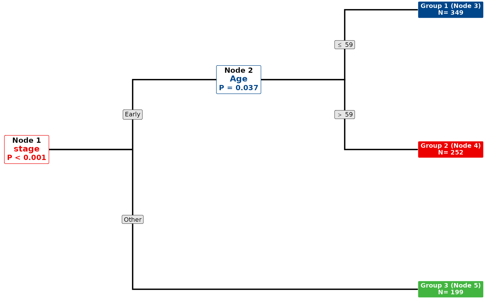{fig-alt="逐节点调整 Cox 鞅残差得到的 RPA 树。"}

`node_rule` 保留分裂路径，`node_rule2` 合并重复变量的条件；两者均为展示文字。实际分组来自树的节点预测，不能把规则字符串当作可执行筛选表达式。建树丢弃的记录不进入终末节点后的效应样本；未分裂的树仍返回一个组，此时 `ft.pair` 为 `NULL`。曲线绘制失败时可保留估计与节点结果，应检查警告和缺失图字段。

`cat_arg$conf_level` 控制节点后区间。当它不是 0.95 时，`get_cat()` 的 `p_value` 从该区间按固定 95% 换算规则回推，可能随置信水平改变；原始 95% Wald P 保存在 `p.value_0.95`。不能将变化的 `p_value` 当作新的分裂检验。

## 树图：终末标签、方向与算法


固定同一棵 cit 树比较标签和方向。另一个标签页换为 mob；换算法会改变分组，不能只按面板编号比较相同患者。

::: {.panel-tabset}


### 人数标签 {.unnumbered}


cit：终末节点显示人数；分裂变量和切点沿树读取。

```r
plt_rpa(rpa_cit, term_label = "count",
        text_args = list(node = 10, edge = 9, term = 9))
```


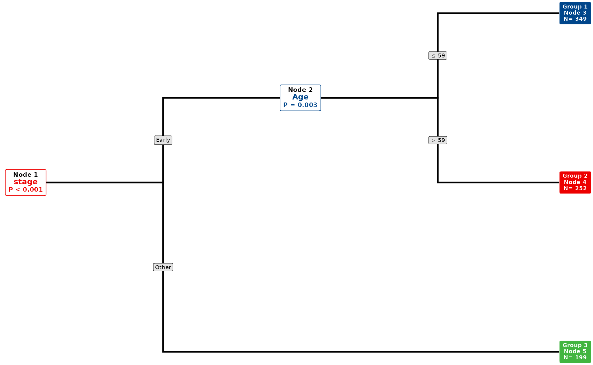{fig-alt="人数标签；cit：终末节点显示人数；分裂变量和切点沿树读取。"}


### 紧凑效应 {.unnumbered}


同一 cit 树展示紧凑的节点效应；参考节点的选择会影响 HR。

```r
plt_rpa(rpa_cit, term_label = "compact",
        text_args = list(node = 10, edge = 9, term = 9))
```


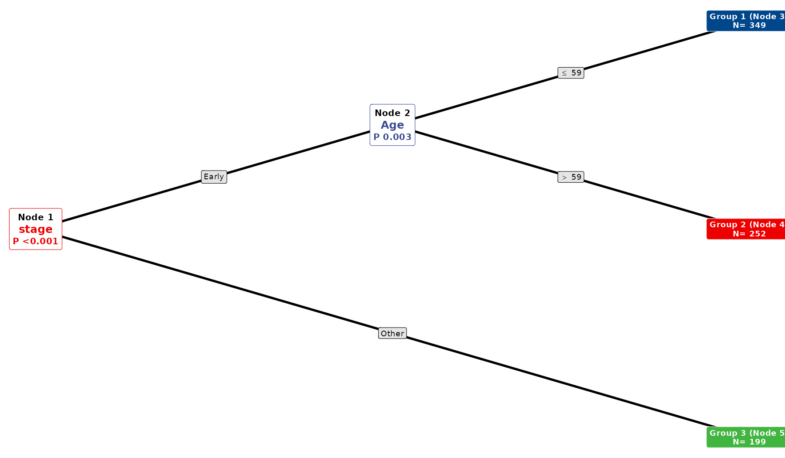{fig-alt="紧凑效应；同一 cit 树展示紧凑的节点效应；参考节点的选择会影响 HR。"}


### 纵向树 {.unnumbered}


只改变树的方向，节点分组和模型结果保持一致。

```r
plt_rpa(rpa_cit, term_label = "count", horizontal = FALSE,
        text_args = list(node = 9, edge = 8, term = 8))
```


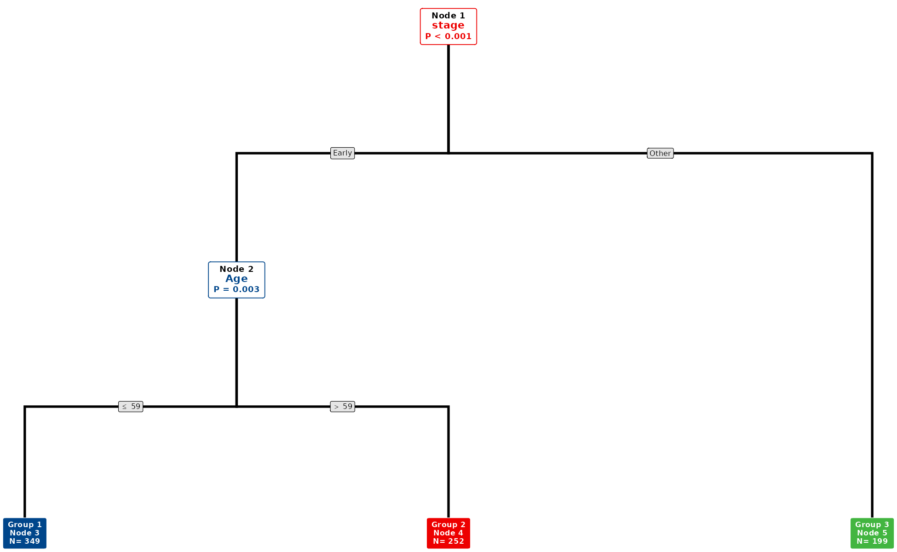{fig-alt="纵向树；只改变树的方向，节点分组和模型结果保持一致。"}


### mob 算法 {.unnumbered}


Weibull AFT 参数分区的 mob 树；不应将分裂模型系数直接读作 Cox HR。

```r
plt_rpa(rpa_mob, term_label = "count",
        text_args = list(node = 10, edge = 9, term = 9))
```


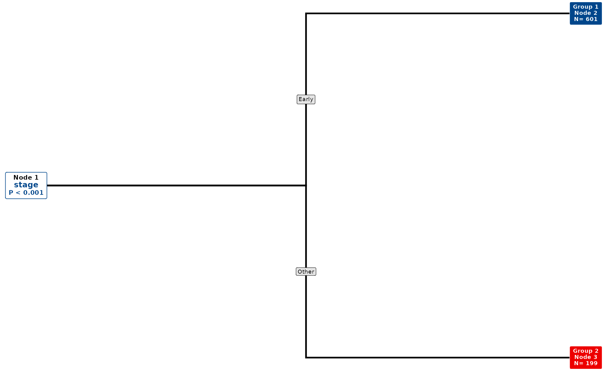{fig-alt="mob 算法；Weibull AFT 参数分区的 mob 树；不应将分裂模型系数直接读作 Cox HR。"}


:::


## plt_rpa()：连线、配色和组合布局 {#plt-rpa-current}

默认 `edge_type = "elbow"`、`equal_width = TRUE`。`text_args` 集中控制字号、边框、行高和 `edge_sep`；`color_args$groups` 是由终末组序号组成的 list，只合并显示颜色，不合并患者分组或重算模型。每个组必须恰好出现一次；第 i 个 list 元素使用第 i 种颜色，元素可以不命名。

::: {.panel-tabset}

### 直线与自然宽度

```r
plt_rpa(rpa_cit, edge_type = "diagonal", equal_width = FALSE)
```

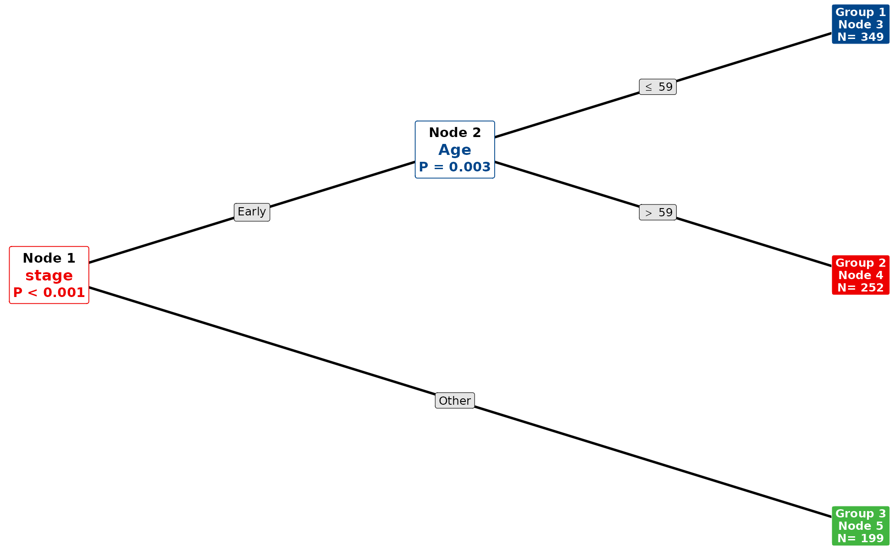{fig-alt="直线连线与不等宽终末节点对照。"}

### 标签与共同颜色

```r
plt_rpa(rpa_cit,
  name_map = c(Age = "Age (years)", stage = "Tumor stage"),
  color_args = list(groups = list(1:2, 3)))
```

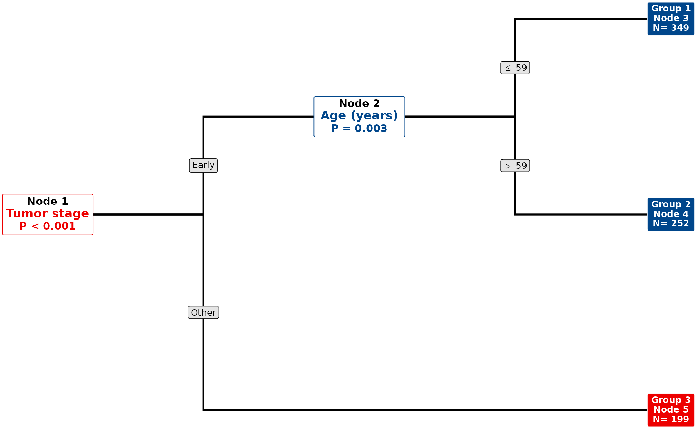{fig-alt="变量重命名和终末组颜色映射。"}

### 树与 KM

```r
plt_rpa(rpa_cit, km = TRUE,
  km_args = list(axis_args = list(xlim = c(0, 120),
                                  xbre = seq(0, 120, 24))))
```

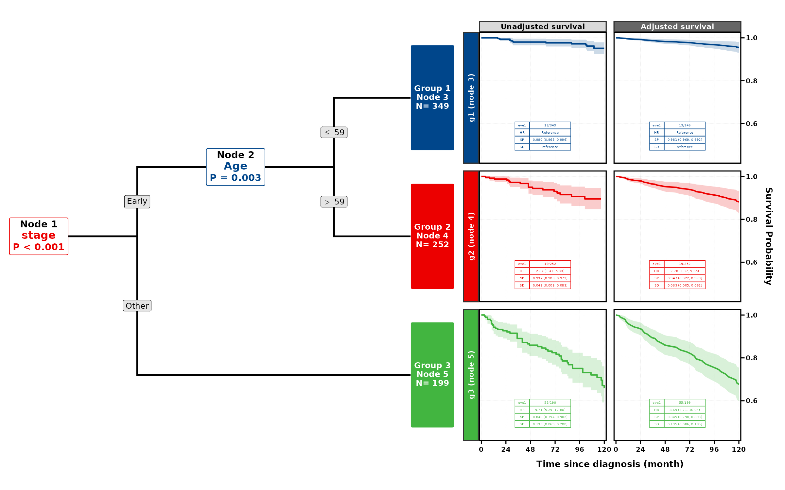{fig-alt="RPA 树与未调整和调整生存曲线的组合图。"}

### 树与效应表

```r
plt_rpa(rpa_cit, tab = TRUE,
  tab_args = list(ratio = c(1, 1.5)))
```

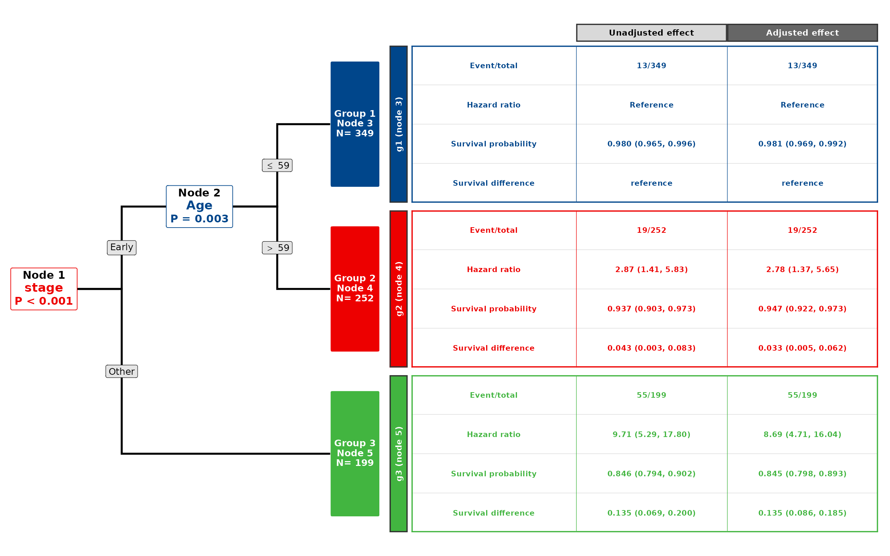{fig-alt="RPA 树与效应表的组合图。"}

:::

`km` 与 `tab` 不能同时为 `TRUE`。`horizontal = FALSE` 将组合改为树在上、曲线或表在下。`term_span` 默认 0.8，控制组合图中终末框占对应面板跨度的比例；`km_args` / `tab_args` 的 `ratio` 控制两部分大小，`panel_spacing` 单位为 pt。`get_rpa()` 自动返回的 `rpa.eff$plt.rpa1` / `plt.rpa2` 现为两个方向的树与 KM 组合图。

## 节点曲线、表格与计数


本页明确提供 Sex 作为调整项，曲线和表中的 adjusted 才有对应的调整模型。60 月概率及差值是节点后估计；曲线晚期样本稀少时应结合在险人数和不确定性阅读。

::: {.panel-tabset}


### 节点曲线 {.unnumbered}


按终末节点分面显示生存曲线；表中的 SP 对应设定的 60 月。

```r
plt_rpa_km(rpa_cit,
           table_args = list(labels = c("eve1", "HR", "SP", "SD"),
                             rows = 1:3, size = 4))
```


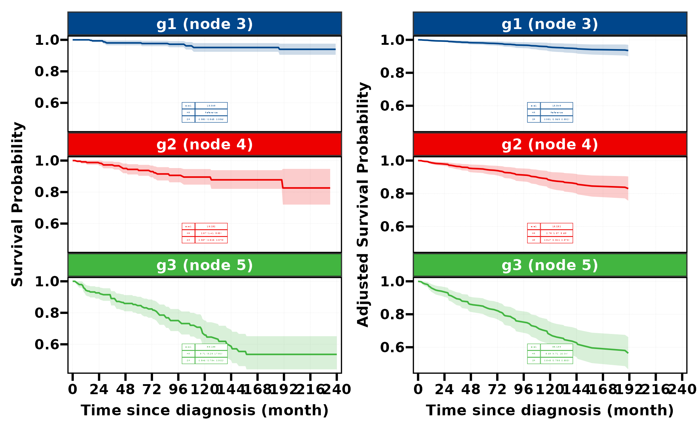{fig-alt="节点曲线；按终末节点分面显示生存曲线；表中的 SP 对应设定的 60 月。"}


### 节点效应表 {.unnumbered}


节点的未调整与调整汇总表；结果属于当前数据上的探索性比较。

```r
plt_rpa_tab(rpa_cit,
            table_args = list(labels = c("eve1", "HR", "SP", "SD"),
                              rows = 1:3, size = 9))
```


{fig-alt="节点效应表；节点的未调整与调整汇总表；结果属于当前数据上的探索性比较。"}


### 节点计数热图 {.unnumbered}


横轴为演示分期，纵轴为终末节点；每个格子的填色对应唯一节点，文字是人数。

```r
plt_rpa_heat(rpa_cit[["dat"]], x_var = "stage", y_var = "group",
             color_var = "group", base_size = 10)
```


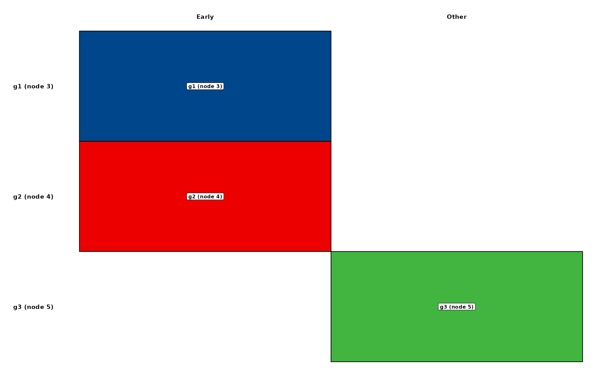{fig-alt="节点计数热图；横轴为演示分期，纵轴为终末节点；每个格子的填色对应唯一节点，文字是人数。"}


:::


## Logistic 路径的节点图


二分类分支使用 ctree，返回专门的 bar/pie 树图。`rpa_model` 只作用于生存分支；Logistic 结果应读取自己的图字段。

::: {.panel-tabset}


### 节点条形图 {.unnumbered}


Logistic 节点条形图：展示 DSS 的两类计数或比例；不处理随访删失。

```r
rpa_log[["rpa.gg1"]]
```


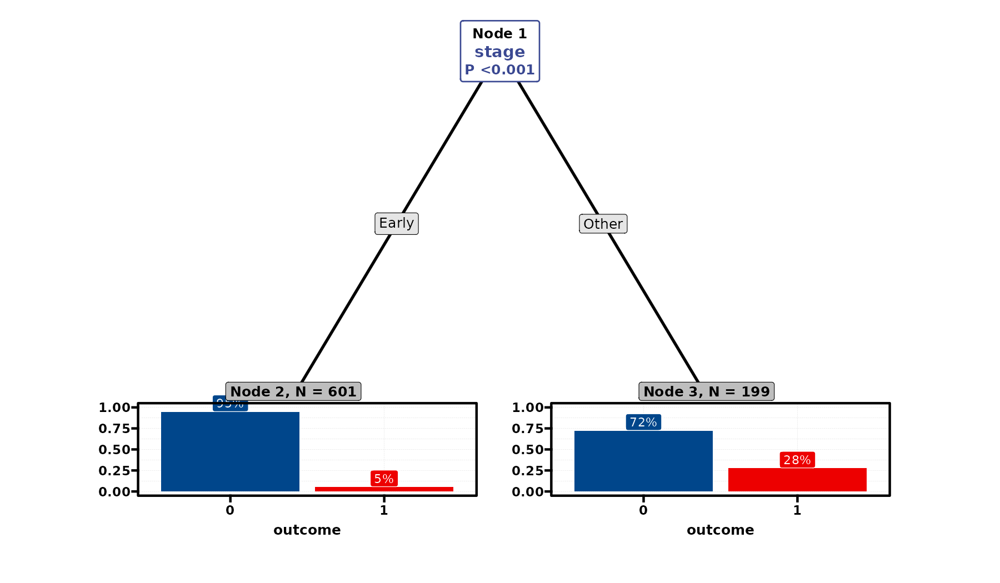{fig-alt="节点条形图；Logistic 节点条形图：展示 DSS 的两类计数或比例；不处理随访删失。"}


### 节点饼图 {.unnumbered}


同一 Logistic 分组换成节点饼图；不构成固定时点累计死亡概率。

```r
rpa_log[["rpa.gg2"]]
```


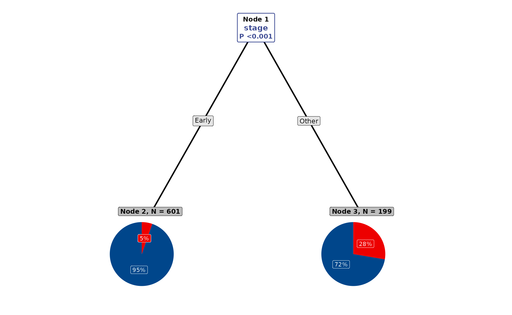{fig-alt="节点饼图；同一 Logistic 分组换成节点饼图；不构成固定时点累计死亡概率。"}


:::


## 使用边界、保存与复现记录


建树和节点后效应在同一演示队列上完成，没有独立验证集，也没有进行分组稳定性分析。终末节点的显著差异不能据此视为已验证的预后分层。DSS 以其他原因死亡为删失时，对应的是该编码下的生存分析；此入口的 surv=FALSE 仍走相同生存分支。分组热图只显示人数，不能代替风险或效应估计。plt_rpa* 目前没有统一 save 参数，保存返回图时使用外部 saver。

绘图调色、字体和布局只改变展示；模型、编码、样本、预测时间或权重改变后需要重新计算。带 `save` 的接口按帮助页传入保存配置；其余返回图可用 `ggplot2::ggsave()` 或 `RegR::save_plt()`，表格按返回类型使用 `save_tb()` / `save_gt()`。重采样示例的预算仅用于演示，应结合实际分析目的增加并报告失败与收敛情况。

## 相关页面与源码


- [森林图与效应估计](forest-guide.qmd)

- [KM/CIF 组合图](cat-guide.qmd)

- [RegR 函数参考](https://hui950319.github.io/RegR/reference/index.html)

- [rpa-get.R](https://github.com/HUI950319/RegR/blob/3411eb0/R/rpa-get.R)

- [rpa-plt.R](https://github.com/HUI950319/RegR/blob/3411eb0/R/rpa-plt.R)


```r
packageVersion("RegR")
sessionInfo()
```
