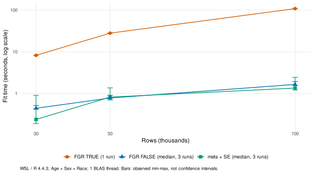

本页属于 [跨包性能评估](performance-evaluation.qmd)，记录 Logistic 与 Fine–Gray 的拟合耗时、数值核对及似然指标后端选择。

## 本轮评估结论 {#scoring-fit-20261003}

2026-10-03 的补充测试回答了四个问题：`get_score()` 的 Logistic 分支如何拟合，3万、5万、10万行是否慢，FGR 的方差计算开销有多大，以及是否应把 mets 换成 `FGR(variance = FALSE)`。

| 问题 | 本轮证据支持的结论 |
|:--|:--|
| `stats::glm()` 在10万行是否很慢？ | 本轮低维 Logistic 模型不慢；单线程中位数为0.122秒和0.395秒。完整评分与重采样另有开销。 |
| FGR 方差开关是否影响速度？ | 影响明显：10万行 TRUE 单次108.233秒，FALSE 三次中位数1.643秒。两者输出的推断信息不同。 |
| AIC、BIC、PVE 能否使用 FGR(FALSE)？ | 可以。三个指标使用系数、完整/零系数模型似然和样本计数，不依赖系数方差矩阵。 |
| 有必要仅为提速将 mets 换成 FGR(FALSE)？ | 没有稳定的大幅提速证据。若目的是统一 `get_fit_stats()` 与 `get_score()` 的似然口径，则有明确价值。 |

::: {.callout-note}
### 比较时的版本与当前源码状态

下文 mets 指标对照来自切换前的 `get_fit_stats()`，其竞争风险分支使用 `mets::cifregFG()`；[RegR 源码快照 d5084cb](https://github.com/HUI950319/RegR/blob/d5084cb/R/msr-fit-stats.R) 保留了这一实现。

本页编写时检查的 **2026-10-03 工作区源码** 已将该分支改为 `FGR(variance = FALSE)`，帮助文件也说明了这一变化。因此，“是否更换”是对更换理由的评估，不表示当前源码仍使用旧后端；工作区状态也不等同于所有已安装版本或已发布版本。本次页面更新不修改 RegR 源码。
:::

## 测试条件与计时范围

测试环境为 WSL Ubuntu-22.04、R 4.4.3、Intel Core Ultra 9 275HX（24个逻辑 CPU），OpenBLAS pthread。竞争风险依赖版本为 `riskRegression 2026.3.11`、`cmprsk 2.2-12`、`mets 1.3.13`、`prodlim 2026.3.11`、`timereg 2.0.5`。机器存在其他 R 进程，不能视为独占环境。

数据来自 `RegR/data/seer_thyroid_mtc_2026.rda`，原始4387行。固定随机种子 `20261003`，按各实验所需变量取完整病例后，有放回抽取10万行，再取前3万、5万、10万行作为嵌套样本。**扩展行数不代表新增独立患者，这些样本只用于计算性能评估。** 两类实验取完整病例的变量不同，不能把 Logistic 与 Fine–Gray 耗时差解释为相同数据上的纯算法差异。

| 设置 | Logistic | FGR / mets |
|:--|:--|:--|
| 原始分析样本 | 两个公式涉及变量共同完整病例4017行；DSS事件470例 | `time/event/Age/Sex/Race` 完整且 `time > 0` 的4387行；目标事件597例、竞争事件583例、删失3207例 |
| 扩展样本目标事件数（3万/5万/10万） | 3505 / 5869 / 11631 | 4017 / 6670 / 13448 |
| 时间处理 | 二分类模型不使用随访时间 | 原始月份时间，未加 jitter；每档均有157个不同目标事件时点 |
| 线程 | 分别测试 BLAS 1线程与本机原设置24线程；不改变生产设置 | 每个独立 R 子进程 BLAS / OpenMP 均1线程 |
| 预热与重复 | 每个公式5000行预热；每格5次；每轮随机模型/样本量顺序 | 每格500行预热；TRUE每格1次，FALSE及mets每格3次；方法顺序未交替 |
| 安全上限与状态 | 60次主拟合全部完成 | 单次拟合180秒上限；9格、21次主拟合全部完成，无超时 |

计时包含公式处理、设计矩阵构造、优化与拟合对象构造，以及配置要求的系数标准误计算；不含包/数据加载、样本扩展、计时前 GC、指标提取、预测、`Score()`、bootstrap 和绘图。下表中的区间是重复计时的最小—最大值，**不是统计置信区间**。本轮没有重新计时完整 `get_score()`。

## Logistic 分支与大样本拟合

### `get_score()` 的实际调用

`surv = "DSS"` 这样的单个结局列名进入 Logistic 分支，模型为 `DSS ~ predictors`，使用 `stats::glm(..., family = stats::binomial())`。`surv = TRUE` 为 Cox，`surv = FALSE` 为 Fine–Gray。`vars = c("Age", "Sex")` 分别拟合两个模型；联合模型应写成 `vars = list(c("Age", "Sex"))`。

评分使用预测概率，AUC/Brier 不需要将概率按0.5切成类别。Logistic 的评分不使用生存时点；`R = NULL/0/1` 不重采样，`R >= 2` 时 AUC/BS 进入 `bootcv` 袋外评估。若同时选择 AIC/BIC/PVE，它们复用原样本及各 bootstrap 训练样本的拟合。似然指标与袋外预测指标的评价对象不同。

```r
data(seer_thyroid_mtc_2026, package = "RegR")
d <- as.data.frame(seer_thyroid_mtc_2026)

# 一个联合 Logistic 模型；R = 0 不重采样
RegR::get_score(
  d, vars = list(clinical = c("Age", "Sex", "Race")),
  surv = "DSS", R = 0,
  metrics = c("AUC", "BS", "AIC", "BIC", "PVE")
)
```

上述代码为可复制的调用示例，本页渲染不运行重型基准。选择似然指标时，函数使用所有候选模型预测变量与结局的共同完整病例；Logistic 不要求 `time` 完整。

### 3万、5万、10万行实测

简单模型为 `DSS ~ Age + Sex + Race`，因子展开后5个参数（含截距），IRLS 5次；临床模型为 `DSS ~ Age + Sex + Race + Tum + Nod_4 + M + Sur + Rad + Che`，展开后18个参数（含截距），IRLS 6次。保留默认 `glm.control(epsilon = 1e-8, maxit = 25)` 与默认返回字段。

每格5次，表中为 **中位数（最小—最大），单位秒**。

| 行数 | 简单模型：1线程 | 临床模型：1线程 | 简单模型：24线程 | 临床模型：24线程 |
|--:|--:|--:|--:|--:|
| 30,000 | 0.028（0.027–0.029） | 0.077（0.065–0.089） | 0.186（0.060–0.842） | 1.934（0.117–2.801） |
| 50,000 | 0.056（0.054–0.058） | 0.130（0.118–0.142） | 0.130（0.096–0.235） | 2.810（0.219–3.126） |
| 100,000 | 0.122（0.117–0.131） | 0.395（0.378–0.471） | 0.227（0.154–0.706） | 2.846（1.115–6.507） |

60次主拟合全部收敛、设计矩阵满秩、无警告；相同数据/公式跨重复和线程设置的系数、拟合概率、deviance 最大绝对差均为0。主测试先测24线程、后测1线程，因此补充10万行临床模型交替线程检查（顺序1/24/24/1/1/24）：1线程三次为0.648、0.326、0.315秒；24线程三次为3.757、2.033、3.039秒。中位数分别0.326和3.039秒，数值差仍为0。

这支持本机低维模型中多线程调度开销较大的判断，不能据此普遍关闭其他计算的 BLAS 并行。单次 `glm()` 在本轮规模下不是主要慢点；完整评分慢时，还应定位概率预测、AUC/Brier 的标准误计算、重采样次数、候选模型数及绘图。结果不能外推到高维、完全分离、极稀有结局或复杂交互模型。

## FGR 方差 TRUE / FALSE 与 mets

### 对齐模型设置

三种配置使用同一 `Age + Sex + Race` 公式，展开后4个系数、不含截距；0为删失、1为目标事件、2为竞争事件。

```r
Hist <- prodlim::Hist
Event <- timereg::Event

fit_true <- riskRegression::FGR(
  Hist(time, event) ~ Age + Sex + Race,
  data = d, cause = 1, variance = TRUE
)
fit_false <- riskRegression::FGR(
  Hist(time, event) ~ Age + Sex + Race,
  data = d, cause = 1, variance = FALSE
)
fit_mets <- mets::cifreg(
  Event(time, event) ~ Age + Sex + Race,
  data = d, cause = 1, cens.code = 0,
  propodds = NULL, stderr = TRUE, cox.prep = FALSE
)
```

`mets::cifreg()` 默认 `propodds = 1` 是 CIF 的 logit 比例优势模型；设置 `propodds = NULL` 才是本次比较的 Fine–Gray 模型。[mets 官方接口说明](https://kkholst.github.io/mets/reference/cifreg.html)。本轮 mets 保留系数标准误；FGR 使用默认优化控制 `gtol = 1e-6`、`maxiter = 10`。

### 拟合耗时

| 行数 | FGR(TRUE)：单次 | FGR(FALSE)：三次中位数（范围） | mets（含SE）：三次中位数（范围） | TRUE单次 / FALSE中位数 |
|--:|--:|--:|--:|--:|
| 30,000 | 8.201 | 0.440（0.422–0.512） | 0.237（0.189–0.900） | 18.6× |
| 50,000 | 27.923 | 0.774（0.768–0.901） | 0.815（0.692–1.358） | 36.1× |
| 100,000 | 108.233 | 1.643（1.540–1.918） | 1.343（1.209–2.427） | 65.9× |

{#fig-fgr-fitting-time}

FGR(FALSE) 与 mets 处于同一耗时量级，5万行时 FGR(FALSE) 还略快。**不能把 FGR(TRUE) 对 mets 的巨大速度比，套用于已经关闭系数方差计算的路径。** TRUE 每格仅一次，表中倍数是描述性对照，不是精密的交替重复基准结论。

FGR 将 `variance` 传给 `cmprsk::crr()`。`FALSE` 省略系数方差与残差计算，仍保留系数优化和预测所需的基线累计亚分布风险；本次随样本量增大，方差计算是主要耗时来源。[cmprsk 官方说明](https://search.r-project.org/CRAN/refmans/cmprsk/html/crr.html)及[底层 Fortran 实现](https://raw.githubusercontent.com/cran/cmprsk/master/src/crr.f)。mets 有自己的风险集累加与影响函数实现，本轮保留标准误仍较快；具体速度以实测为准。[mets 方法说明](https://kkholst.github.io/mets/articles/cifreg.html)。

### 数值核对与使用边界

FGR(TRUE/FALSE) 在三档样本中系数和 sHR 最大差均为0；对每档前50行、36/60/120个月的 CIF 预测，最大差也均为0。这是已测样本与时点的一致性，未覆盖全部预测时点。21次主拟合均无警告；FGR 显式报告收敛，mets 的系数/方差有限、方差对角线为正、最大 Newton 步长小于 `2.1e-13`，未虚构 mets 的 `converged` 字段。

| 行数 | mets vs FGR：最大sHR相对差 | 最大SE相对差 | 最大95% CI端点绝对差 |
|--:|--:|--:|--:|
| 30,000 | 0.0870% | 0.1819% | 0.002241 |
| 50,000 | 0.0872% | 0.1838% | 0.002172 |
| 100,000 | 0.0853% | 0.1708% | 0.002040 |

SE/CI 比较使用 FGR(TRUE)，FGR(FALSE) 没有可用的系数标准误。mets 与 FGR 的点估计接近，但不能宣称逐数值等价；本轮也没有核对两后端预测的一致性。

同一3万行样本随机重排行顺序（种子 `20261004`）后，mets 的最大 log-sHR 变化为 `8.97e-5`，sHR 为 `1.17e-4`，SE 为 `6.62e-6`；FGR(FALSE) 的最大 log-sHR 变化为 `1.75e-14`。该并列时间数据上观察到 mets 的轻微行顺序敏感性，不能据此断言所有后端差异都只由并列时间造成。

只取点估计、预测或另做重抽样时，可以考虑 FGR(FALSE)。需要系数 Wald SE、P 值、CI 或依赖解析方差/影响函数的预测区间时，应保留提供这些信息的拟合与推断路径；关闭方差不能直接替代这些输出。

## AIC、BIC、PVE 可以直接使用 FGR(FALSE)

对于拟合成功的 FGR 对象，读取 `fit[["crrFit"]]` 中的 `loglik`、`loglik.null`、`coef` 即可；不需要方差矩阵，也不需要另拟合一个零系数模型。[cmprsk 返回字段说明](https://search.r-project.org/CRAN/refmans/cmprsk/html/crr.html)。

令 $LL$ 为完整模型 log pseudo-likelihood，$LL_0$ 为零系数模型 log pseudo-likelihood，$k$ 为系数个数，$n$ 为分析样本行数，$E$ 为目标事件数。本页采用 RegR 的口径：

$$
\mathrm{AIC}=-2LL+2k,\qquad
\mathrm{BIC}=-2LL+k\log E,\qquad
\mathrm{PVE}=1-\exp\{-2(LL-LL_0)/n\}.
$$

Fine–Gray 的 BIC 使用目标事件数是这里明确采用的约定；Logistic 的 BIC 使用分析样本数。PVE 的分母在各模式下均为分析样本数，它是 Cox–Snell 型似然伪 $R^2$，不是 Nagelkerke 标准化 $R^2$，也不是结局方差被解释的实际比例。Fine–Gray 使用伪/部分似然，这些指标应在**相同结局、相同分析样本、相同似然口径**下比较，不能跨模型家族比较绝对 AIC/BIC。

```r
z <- fit_false[["crrFit"]]
stopifnot(isTRUE(z[["converged"]]))
LL <- z[["loglik"]]
LL0 <- z[["loglik.null"]]
k <- length(z[["coef"]])
n <- nrow(d)                        # d须为实际进入拟合的完整分析样本
E <- sum(d[["event"]] == 1)
c(AIC = -2 * LL + 2 * k,
  BIC = -2 * LL + log(E) * k,
  PVE = -expm1(-2 * max(0, LL - LL0) / n))

# 本页编写时源码中的公开接口
RegR::get_fit_stats(
  d, vars = list(c("Age", "Sex", "Race")), surv = FALSE, R = 0
)
```

另以2000行小样本直接核对方差开关：$E=267$、$k=4$，TRUE/FALSE 的完整与零系数模型似然完全相同，三个指标也相同：AIC 3774.870、BIC 3789.219、PVE 0.04382931。这里只证明已测模型的一致性，仍需检查收敛、有限似然与设计矩阵秩。

若用 subject bootstrap 估计指标的 SE/百分位区间，每个重抽样拟合仍可用 FGR(FALSE)，区间来自重抽样分布。`get_score()` 的 AUC/Brier 标准误由评分流程计算，不能把“关闭系数方差”理解成“关闭所有不确定性计算”。

## 是否值得把 mets 换成 FGR(FALSE)

### 更换会改变指标数值

同一嵌套样本、同一预测变量，对照切换前 mets `get_fit_stats()` 与 FGR(FALSE) 的指标结果如下。**差值为 FGR 减 mets，属于同一模型的后端差异。**

| 行数 | AIC差 | BIC差 | PVE差 |
|--:|--:|--:|--:|
| 30,000 | +12.067807 | +12.067807 | −0.0000829734 |
| 50,000 | +20.443100 | +20.443100 | −0.0000887039 |
| 100,000 | +40.964754 | +40.964754 | −0.0000878518 |

例如10万行 PVE：mets 为0.0341458955，FGR 为0.0340580437。AIC/BIC差源于后端似然数值差异，不能解释为 FGR 模型更差，也不能混用两个后端的指标给候选模型排序。本轮没有检验多个候选模型的排序是否改变。

这次补充指标检查每档仅一次：mets 全部指标处理耗时0.858/1.127/1.651秒，FGR 拟合加提取为0.973/0.743/1.542秒。两端计时边界略有差别，且没有重复，故不用于精确速度比；性能判断以主拟合的重复计时为主要依据。

### 评估建议与当前实现

| 更换目的 | 判断 |
|:--|:--|
| 仅为提速 | 证据不足以支持必须更换。FGR(FALSE) 与 mets 耗时接近，重复范围有重叠，也没有完整函数的稳定收益证明。 |
| 让 `get_fit_stats()` 与 `get_score()` 的竞争风险 AIC/BIC/PVE 使用同一似然 | 值得局部统一到 FGR(FALSE)，两函数可复用同一套提取逻辑。本页编写时的工作区源码已采用此方案。 |
| 保持旧结果完全不变 | 不能保证：点估计和似然存在实测差异，`obj` 中的拟合对象也从 `cifreg` 变为 `FGR`，下游对象访问须核对。 |
| 将全包 mets 推断和标准化路径全部替换 | 本轮证据不支持。其他功能仍需系数 SE、解析推断或影响函数，不能直接用 FGR(FALSE) 覆盖。 |

更换的主要收益是**统一统计口径和对象使用逻辑**。它不是已经证明的大幅性能优化，也不意味着可以移除全包的 mets 依赖。已有 mets 结果如需与新结果比较，应对全部候选模型用同一后端、同一样本重算。

## 完整评分补充评估

本页的主拟合比较不含Score与bootstrap。随后完成的 [get_score大样本与100次bootstrap评估](get-score-benchmark-20261003.qmd) 覆盖1万至10万行完整调用、100个生存时点、指标配置与30分钟停止记录；可据此区分单次拟合和验证集指标计算的成本。

## 原始记录与复现

[下载本轮证据包：计时、数值核对、环境和拟合脚本](bench/scoring_fit_20261003_evidence.zip)。压缩包分为 `glm/` 与 `fgr-mets/`，包含逐次计时、汇总、线程交替检查、行顺序检查、指标后端差值、元数据及 R 会话版本；不含患者原始数据。`README.md` 说明路径与版本限制。

两份主拟合脚本使用当时的 WSL 数据路径 `/mnt/e/Rpackage/RegR/data/seer_thyroid_mtc_2026.rda`；在其他环境中须修改脚本的数据路径，并先创建输出目录。复现时应核对原始数据哈希、依赖版本、线程与样本构造方式，而不是期待不同机器返回相同秒数。

```bash
# 解压后，在具备相同依赖的 WSL R 环境中运行；输出目录须已存在
Rscript glm/benchmark-glm.R /absolute/output/glm
Rscript glm/benchmark-glm.R /absolute/output/glm thread-check
Rscript fgr-mets/benchmark-fgr-mets.R /absolute/output/fgr-mets
```

指标差值 CSV 保留的是切换前的 mets 对照，不能以当前 FGR 版 `get_fit_stats()` 重跑并称作 mets 结果。可查阅上述旧源码快照中的似然提取规则。本页发布只整理已有实测，没有重跑耗时矩阵，也没有修改包默认参数。
