`plt_cat()` 用一个公共入口组织 11 种分类图形。本页先比较同一张频数表的显示方式，再分别展示流向、弦图和集合交集。图形选项放在标签页中，点击结果图可放大。

**版本与执行范围：** 本页按 UtilsR **0.6.8** 的公共接口核对；31 个示例已在 WSL R 4.4.3 中实际执行，其中 31 张图已完成构建与 PNG 导出。使用固定随机种子的模拟数据。

## 数据准备与输入约定 {#data}

`stat.by`、`group.by`、`split.by` 使用列名字符串。模拟数据包含 240 行；`stage` 是统计变量，`cohort` 是分组变量，`batch` 用于分层，`region` 用于背景分组。集合图另用 0/1 含义明确的 Yes/No 列。

```r
library(UtilsR)
library(ggplot2)
set.seed(1001)
dat <- data.frame(
  stage = factor(sample(c("I", "II", "III"), 240, TRUE,
                        prob = c(0.5, 0.3, 0.2)), levels = c("I", "II", "III")),
  cohort = factor(rep(c("A", "B", "C"), c(100, 60, 80))),
  batch = factor(sample(c("Batch 1", "Batch 2"), 240, TRUE)))
dat[["region"]] <- factor(ifelse(dat[["cohort"]] == "C", "Region 2", "Region 1"))
binary <- data.frame(
  Surgery = sample(c("Yes", "No"), 240, TRUE, c(0.7, 0.3)),
  Radiation = sample(c("Yes", "No"), 240, TRUE, c(0.4, 0.6)),
  Drug = sample(c("Yes", "No"), 240, TRUE, c(0.55, 0.45)))
dat_na <- dat
dat_na[["stage"]][1:24] <- NA
dat_empty <- dat[dat[["stage"]] != "III", , drop = FALSE]
```

## 函数选择与重要参数 {#parameters}

| 调整目标 | 参数与默认值 | 作用与条件 |
|:--|:--|:--|
| 统计变量 | `stat.by`，必填 | 标准图只用首列；流向/弦/集合图至少两列 |
| 分组与分层 | `group.by = NULL`、`split.by = NULL` | 分组决定标准图百分比分母；分层先拆数据再分别绘图 |
| 图形选择 | `type = "bar"` | 11 种类型；不同类型的适用参数不同 |
| 数量或比例 | `stat = "percent"` | 标准图百分比按当前组内有效行数计算；`"count"` 保留人数 |
| 堆积或并排 | `position = "stack"` | `"dodge"` 并排；不是将百分比分母改为全样本 |
| 颜色 | `palette = NULL`、`alpha = 0.8` | 配色名或颜色向量；因子水平顺序决定颜色对应 |
| 标签 | `label = FALSE`、`label.size = 3.5` | `label.fg`、`label.bg`、`label.bg.r` 控制标签外观 |
| 背景分组 | `bg.by = NULL`、`bg_palette = NULL`、`bg_alpha = 0.15` | 标准并排图使用；每个分组须唯一归属一个背景组 |
| 缺失 | `NA_stat = FALSE`、`NA_color = "grey80"` | 默认去除涉及列中的缺失行；开启后把 NA 作为类别 |
| 空水平 | `keep_empty = FALSE` | 接口用于保留空水平；本页单变量实例中两种设置结果相同，需查看下方实际对照 |
| 集合成员 | `stat_level = NULL` | 只用于 Venn/UpSet；显式指定各列的阳性水平更易复核 |
| 布局 | `flip = FALSE`、`aspect.ratio = NULL` | 翻转和面板高宽比；极坐标类型默认等比 |
| 分层排版 | `facet_nrow`、`facet_ncol`、`facet_byrow = TRUE` | 控制 `split.by` 生成的组合图 |
| 图例与字号 | `legend.position = "right"`、`legend.direction = "vertical"`、`base_size = 14` | 只改变显示 |
| 高基数限制 | `force = FALSE` | 变量超过 100 水平默认拒绝；适宜先整理水平再画图 |

标准类型包括 `bar/rose/ring/pie/trend/area/dot`；`sankey/chord/venn/upset` 则有不同的数据准备。集合类型会忽略 `group.by`，不能把标准图的所有参数都按相同含义套用。

## 计数、比例与方向

::: {.panel-tabset}

### 组内百分比 {.unnumbered}

每个 cohort 内的 stage 比例合计为 100%；三组人数不同，相同高度不代表相同人数。

```r
plt_cat(dat, "stage", "cohort", type = "bar", label = TRUE)
```

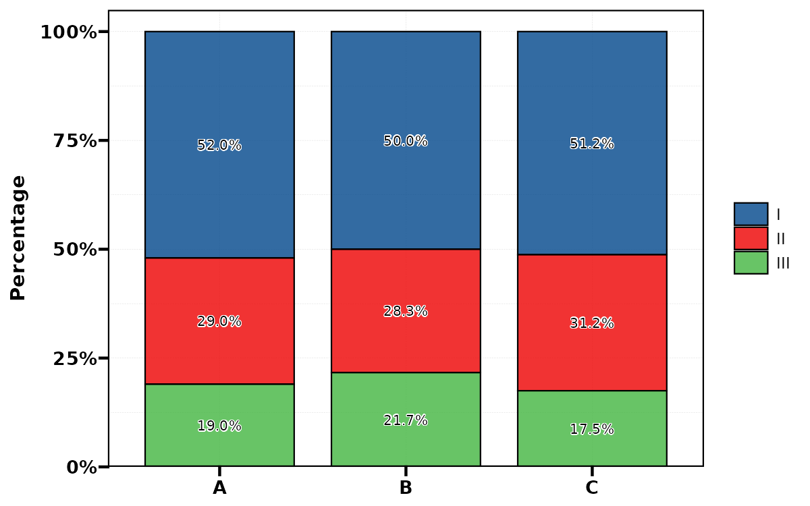{fig-alt="分类变量：plt_cat 的 11 种图形与重要参数；组内百分比；固定模拟数据的实际参数对照结果。"}

### 原始计数 {.unnumbered}

只改变 stat，保留各组总人数的差异。

```r
plt_cat(dat, "stage", "cohort", type = "bar", stat = "count", label = TRUE)
```

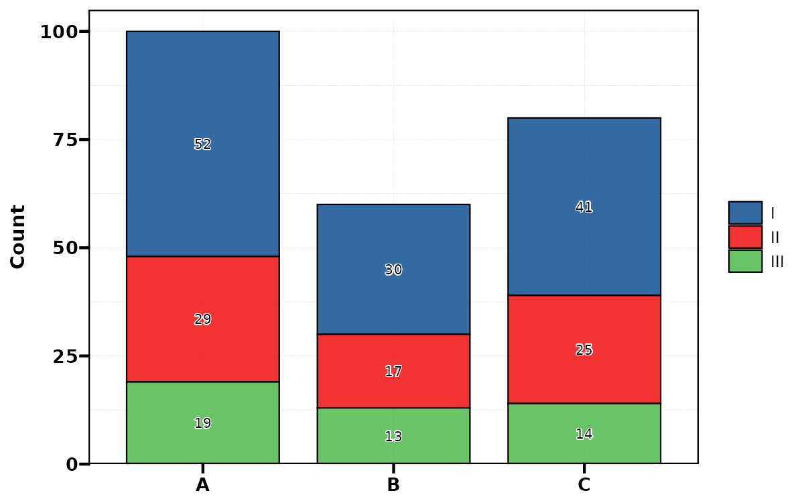{fig-alt="分类变量：plt_cat 的 11 种图形与重要参数；原始计数；固定模拟数据的实际参数对照结果。"}

### 并排比较 {.unnumbered}

只改变 position，百分比仍为组内比例，便于比较同一 stage 在不同组的构成。

```r
plt_cat(dat, "stage", "cohort", type = "bar", position = "dodge", label = TRUE)
```

{fig-alt="分类变量：plt_cat 的 11 种图形与重要参数；并排比较；固定模拟数据的实际参数对照结果。"}

### 横向排列 {.unnumbered}

横向图适合较长组名；人数没有变化。

```r
plt_cat(dat, "stage", "cohort", type = "bar", stat = "count", flip = TRUE, label = TRUE)
```

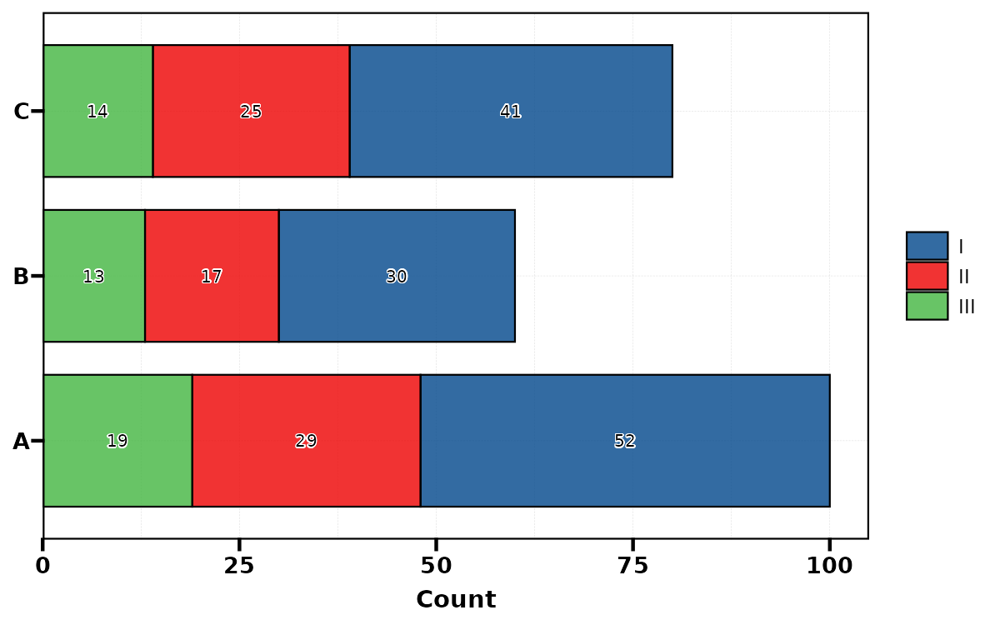{fig-alt="分类变量：plt_cat 的 11 种图形与重要参数；横向排列；固定模拟数据的实际参数对照结果。"}

### 单变量 {.unnumbered}

省略 group.by，直接显示全样本 stage 的频数。

```r
plt_cat(dat, "stage", type = "bar", stat = "count", label = TRUE, legend.position = "none")
```

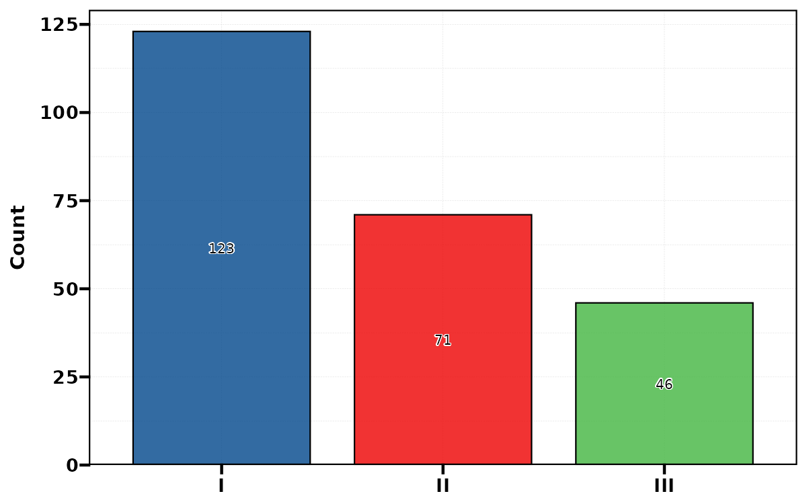{fig-alt="分类变量：plt_cat 的 11 种图形与重要参数；单变量；固定模拟数据的实际参数对照结果。"}

:::

## 背景、标签与配色

::: {.panel-tabset}

### 背景分组 {.unnumbered}

A/B 属于 Region 1，C 属于 Region 2；背景表达分组归属，不是额外统计量。

```r
plt_cat(dat, "stage", "cohort", position = "dodge", bg.by = "region", label = TRUE)
```

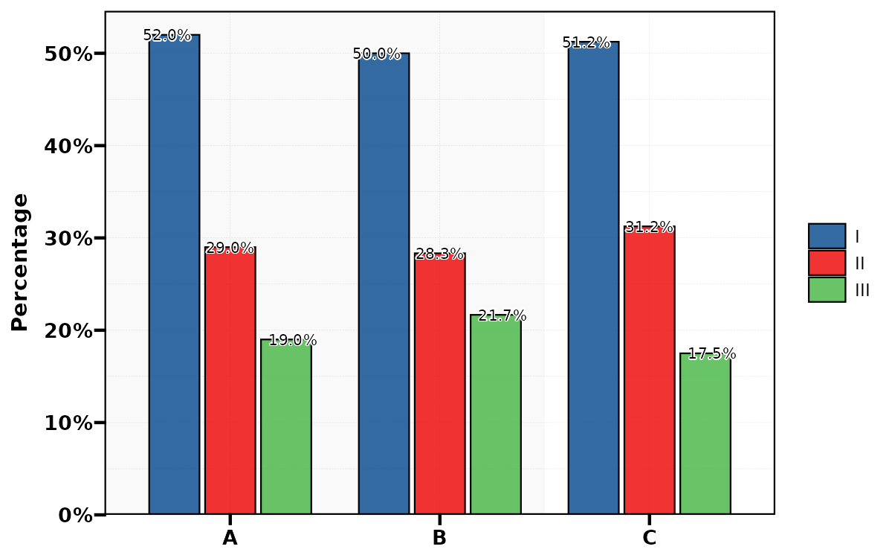{fig-alt="分类变量：plt_cat 的 11 种图形与重要参数；背景分组；固定模拟数据的实际参数对照结果。"}

### 背景颜色与透明度 {.unnumbered}

用 bg_palette 与 bg_alpha 单独控制背景，避免和 stage 的填色混淆。

```r
plt_cat(dat, "stage", "cohort", position = "dodge", bg.by = "region",
        bg_palette = c("#DCEEF8", "#FFF0CD"), bg_alpha = 0.35)
```

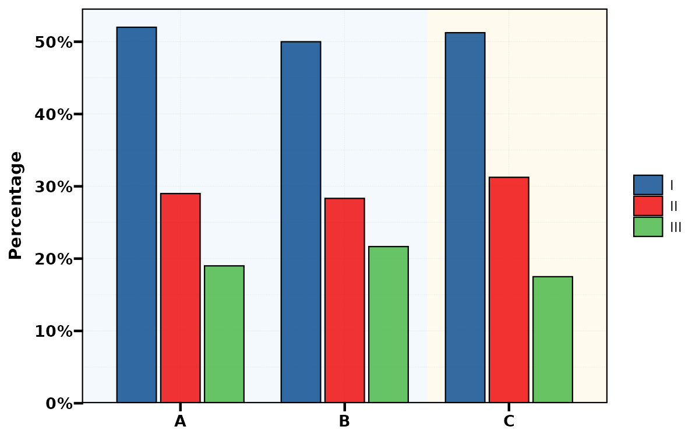{fig-alt="分类变量：plt_cat 的 11 种图形与重要参数；背景颜色与透明度；固定模拟数据的实际参数对照结果。"}

### 标签外观 {.unnumbered}

数值标签改变前景、背景和圆角；标签内容仍由 stat 决定。

```r
plt_cat(dat, "stage", "cohort", stat = "count", position = "dodge",
        label = TRUE, label.size = 4, label.fg = "white",
        label.bg = "#263238", label.bg.r = 0.15)
```

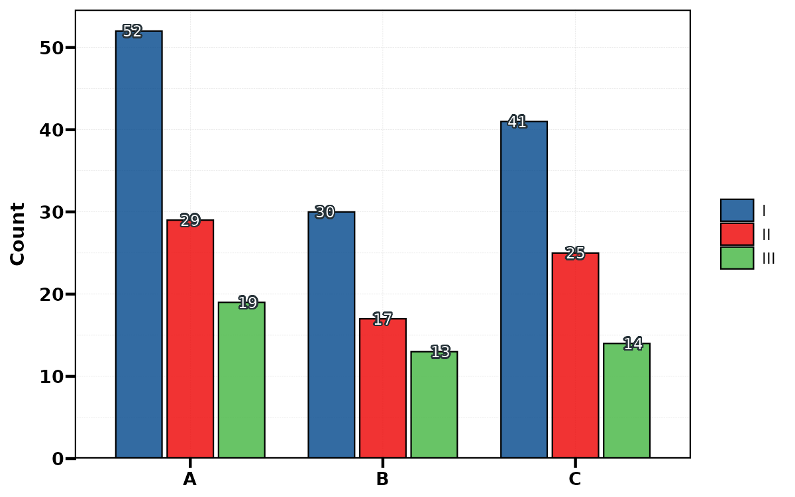{fig-alt="分类变量：plt_cat 的 11 种图形与重要参数；标签外观；固定模拟数据的实际参数对照结果。"}

### 固定颜色 {.unnumbered}

颜色按 I、II、III 的因子水平顺序映射；同一项目应跨图保持这一对应。

```r
plt_cat(dat, "stage", "cohort", palette = c("#0072B2", "#E69F00", "#009E73"),
        alpha = 0.9, legend.position = "bottom", legend.direction = "horizontal")
```

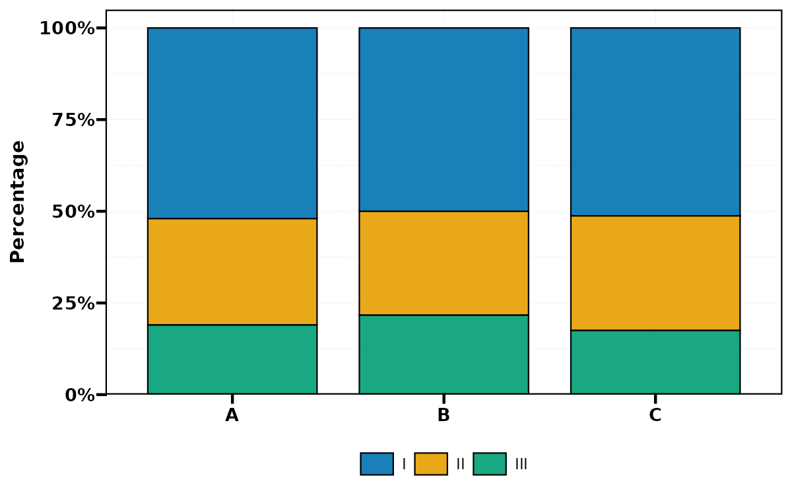{fig-alt="分类变量：plt_cat 的 11 种图形与重要参数；固定颜色；固定模拟数据的实际参数对照结果。"}

### 面板比例与标题 {.unnumbered}

调整字号、标题和面板比例；纵轴标签明确写出百分比分母。

```r
plt_cat(dat, "stage", "cohort", aspect.ratio = 0.5, base_size = 16,
        title = "Stage composition", subtitle = "Simulated data, n = 240",
        xlab = "Cohort", ylab = "Within-cohort percentage")
```

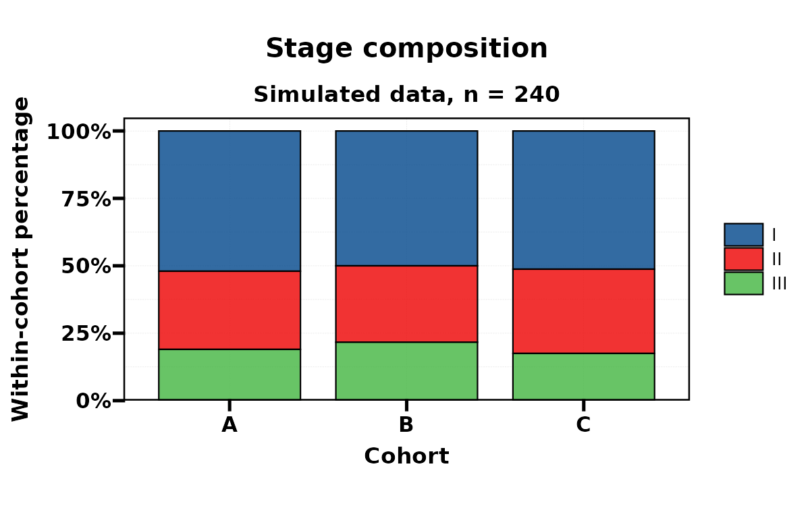{fig-alt="分类变量：plt_cat 的 11 种图形与重要参数；面板比例与标题；固定模拟数据的实际参数对照结果。"}

:::

## 分层、缺失与空水平

::: {.panel-tabset}

### 拆分为两面板 {.unnumbered}

每个 batch 独立计算各 cohort 内比例；分层后的比例不能直接当作全样本比例。

```r
plt_cat(dat, "stage", "cohort", split.by = "batch",
        facet_ncol = 2, label = TRUE)
```

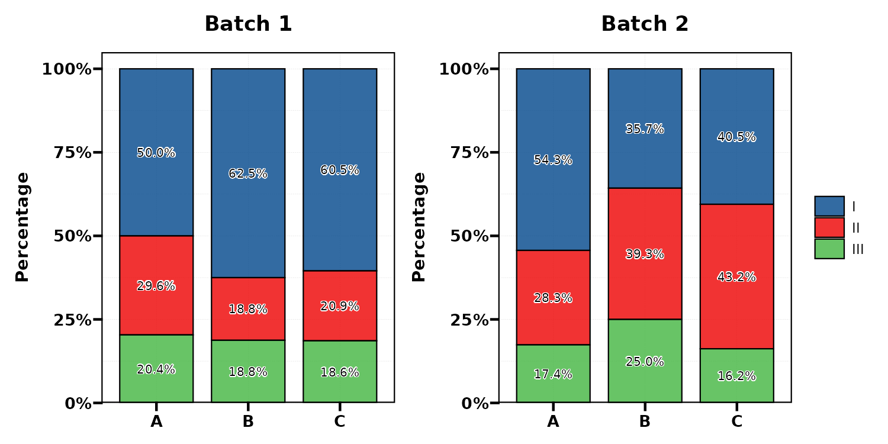{fig-alt="分类变量：plt_cat 的 11 种图形与重要参数；拆分为两面板；固定模拟数据的实际参数对照结果。"}

### 改为纵向面板 {.unnumbered}

用 facet_ncol 与 facet_byrow 控制组合图布局；这里改用计数以展示各层样本量。

```r
plt_cat(dat, "stage", "cohort", split.by = "batch",
        facet_ncol = 1, facet_byrow = FALSE, stat = "count", label = TRUE)
```

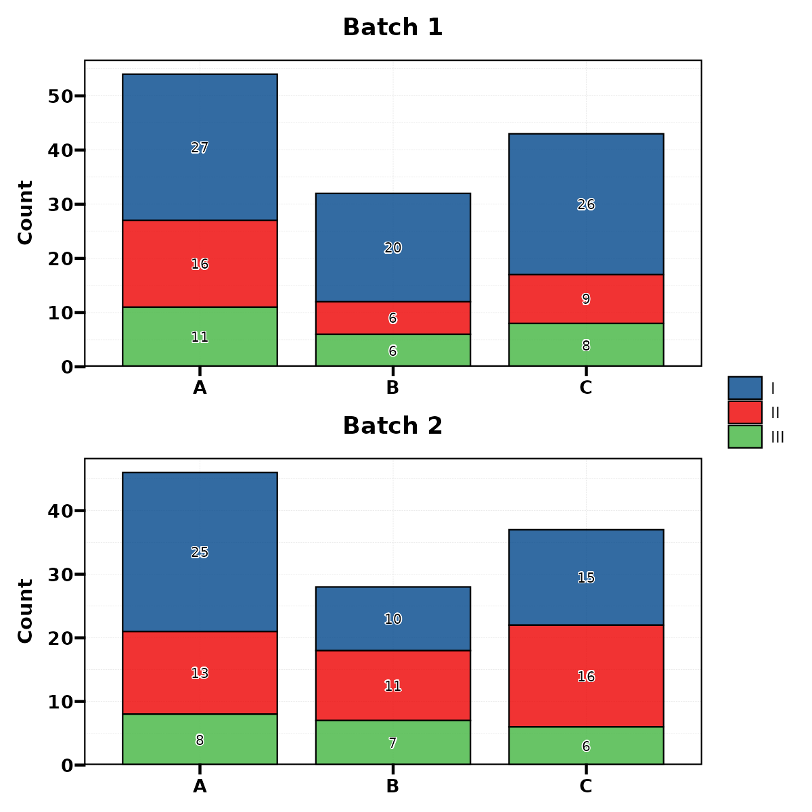{fig-alt="分类变量：plt_cat 的 11 种图形与重要参数；改为纵向面板；固定模拟数据的实际参数对照结果。"}

### 默认去掉 NA {.unnumbered}

24 个 stage 缺失行被排除，组内百分比分母随有效行数改变。

```r
plt_cat(dat_na, "stage", "cohort", label = TRUE)
```

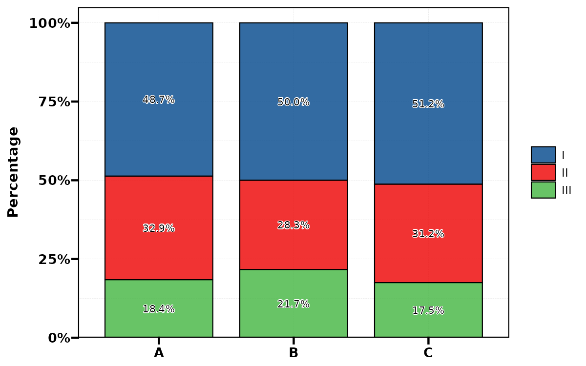{fig-alt="分类变量：plt_cat 的 11 种图形与重要参数；默认去掉 NA；固定模拟数据的实际参数对照结果。"}

### 把 NA 画为类别 {.unnumbered}

NA_stat 开启后把缺失纳入分母，用单独灰色显示；不等于完成缺失值填补。

```r
plt_cat(dat_na, "stage", "cohort", NA_stat = TRUE,
        NA_color = "#777777", label = TRUE)
```

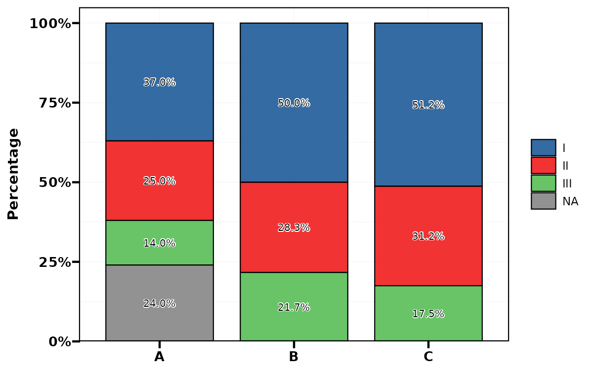{fig-alt="分类变量：plt_cat 的 11 种图形与重要参数；把 NA 画为类别；固定模拟数据的实际参数对照结果。"}

### 删除空水平 {.unnumbered}

示例删去全部 III 期观测，默认不显示其空条目。

```r
plt_cat(dat_empty, "stage", type = "bar", stat = "count", keep_empty = FALSE, label = TRUE)
```

{fig-alt="分类变量：plt_cat 的 11 种图形与重要参数；删除空水平；固定模拟数据的实际参数对照结果。"}

### 开启空水平选项 {.unnumbered}

当前 0.6.8 实例中，开启后图像仍与 FALSE 相同，III 未重新显示。输入保留了 III 因子水平，但当前准备过程会重建因子，不能将此选项当作已经验证有效的跨图补齐办法。

```r
plt_cat(dat_empty, "stage", type = "bar", stat = "count", keep_empty = TRUE, label = TRUE)
```

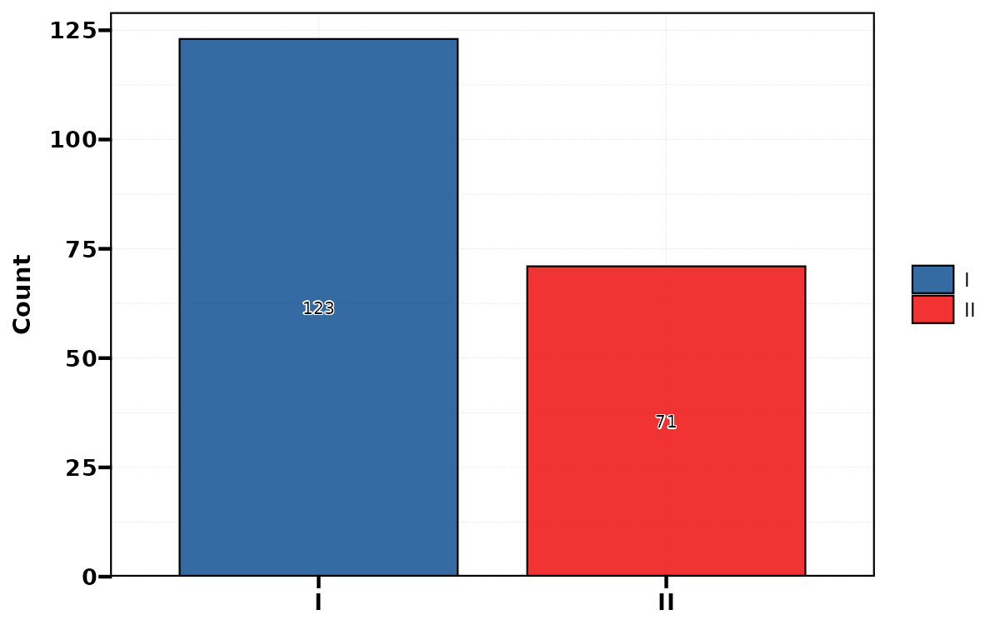{fig-alt="分类变量：plt_cat 的 11 种图形与重要参数；开启空水平选项；固定模拟数据的实际参数对照结果。"}

:::

## 极坐标：玫瑰、环形与饼图

::: {.panel-tabset}

### 玫瑰图 {.unnumbered}

玫瑰图把条形高度放到半径方向；极坐标面积会放大视觉差异。

```r
plt_cat(dat, "stage", "cohort", type = "rose", stat = "count")
```

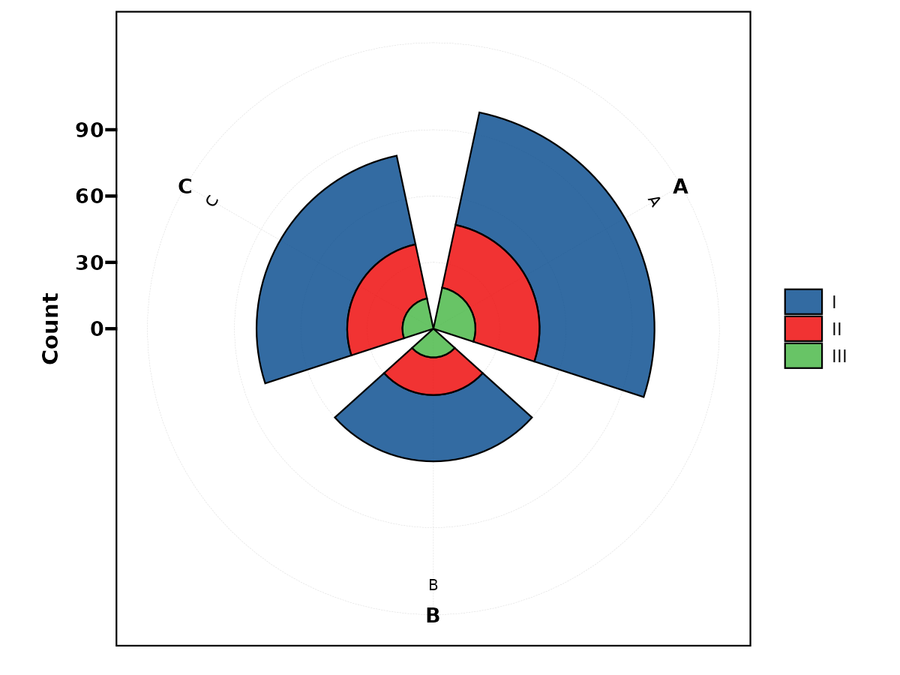{fig-alt="分类变量：plt_cat 的 11 种图形与重要参数；玫瑰图；固定模拟数据的实际参数对照结果。"}

### 并排玫瑰图 {.unnumbered}

并排方式展示同一 cohort 的各 stage，读数仍应以人数和图例为准。

```r
plt_cat(dat, "stage", "cohort", type = "rose", stat = "count", position = "dodge")
```

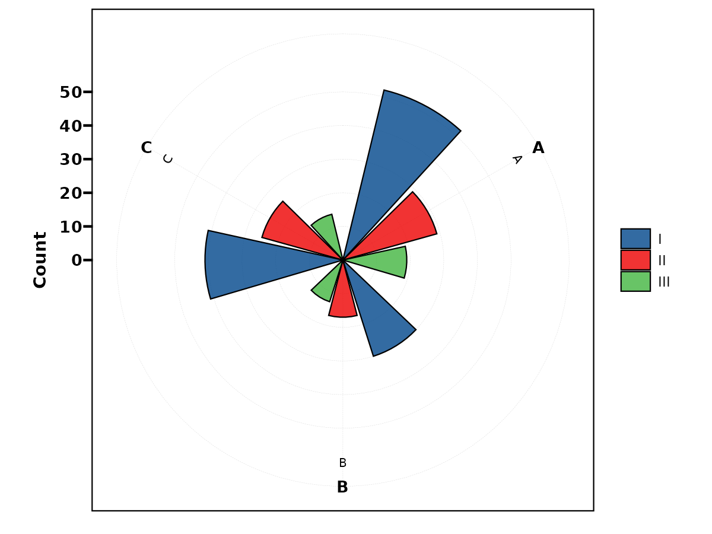{fig-alt="分类变量：plt_cat 的 11 种图形与重要参数；并排玫瑰图；固定模拟数据的实际参数对照结果。"}

### 环形图 {.unnumbered}

单变量环形图展示全样本构成，三个类别比例合计为 100%。

```r
plt_cat(dat, "stage", type = "ring", label = TRUE)
```

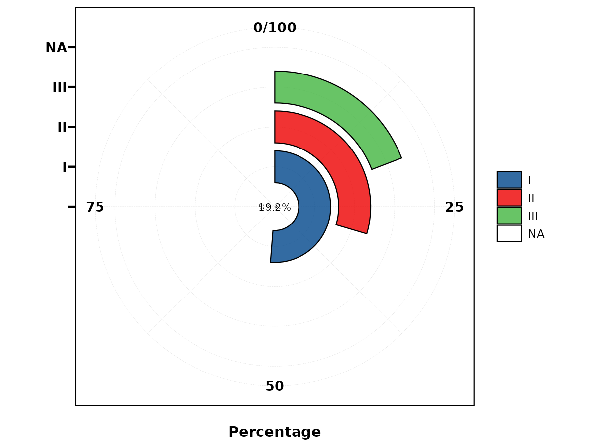{fig-alt="分类变量：plt_cat 的 11 种图形与重要参数；环形图；固定模拟数据的实际参数对照结果。"}

### 分组环形 {.unnumbered}

当前实现的分组环形为并排极坐标显示；比较数值可回看普通柱形图。

```r
plt_cat(dat, "stage", "cohort", type = "ring", position = "dodge", stat = "count")
```

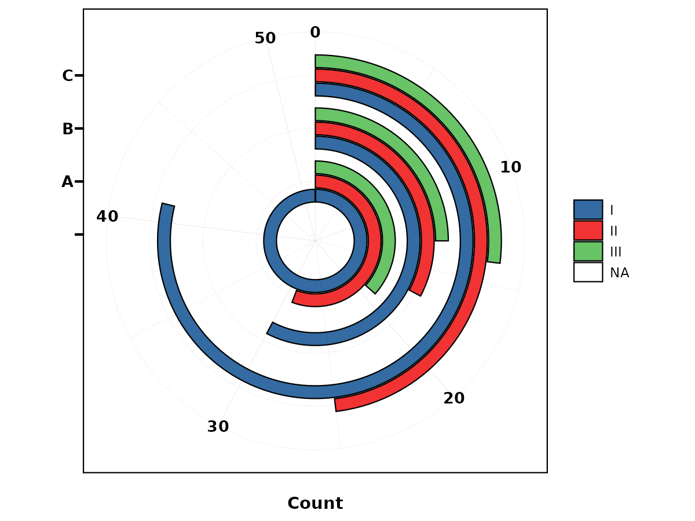{fig-alt="分类变量：plt_cat 的 11 种图形与重要参数；分组环形；固定模拟数据的实际参数对照结果。"}

### 饼图 {.unnumbered}

饼图适合较少类别的构成展示；颜色与图例按因子水平对应。

```r
plt_cat(dat, "stage", type = "pie", label = TRUE,
        palette = "Set2", legend.position = "bottom")
```

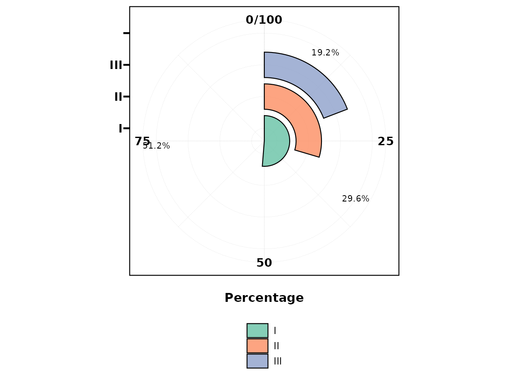{fig-alt="分类变量：plt_cat 的 11 种图形与重要参数；饼图；固定模拟数据的实际参数对照结果。"}

:::

## 趋势、面积与点图

::: {.panel-tabset}

### 趋势叠加 {.unnumbered}

按 A/B/C 的既定水平顺序连接显示；cohort 没有时间含义，图形也不会创造时间趋势。

```r
plt_cat(dat, "stage", "cohort", type = "trend", stat = "count", label = TRUE)
```

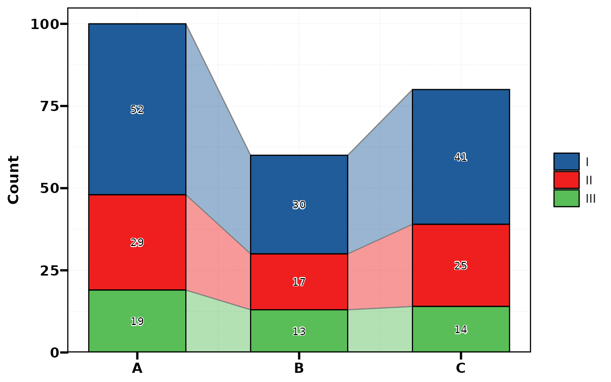{fig-alt="分类变量：plt_cat 的 11 种图形与重要参数；趋势叠加；固定模拟数据的实际参数对照结果。"}

### 堆积面积 {.unnumbered}

堆积面积展示类别数量随分组顺序的变化；换顺序会改变连线外观。

```r
plt_cat(dat, "stage", "cohort", type = "area", stat = "count")
```

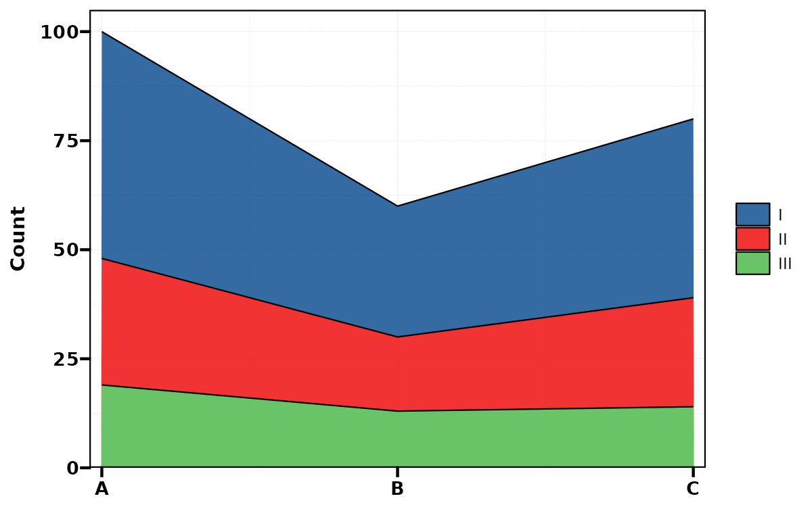{fig-alt="分类变量：plt_cat 的 11 种图形与重要参数；堆积面积；固定模拟数据的实际参数对照结果。"}

### 分开展示面积 {.unnumbered}

position 改变面积组织方式；各组的频数表没有改变。

```r
plt_cat(dat, "stage", "cohort", type = "area", stat = "count", position = "dodge")
```

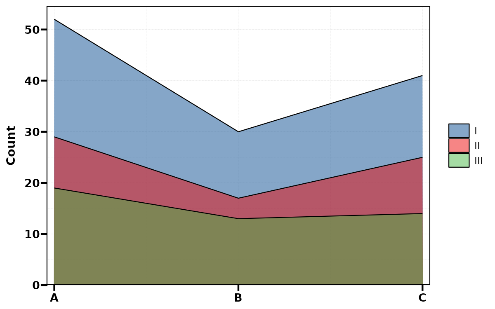{fig-alt="分类变量：plt_cat 的 11 种图形与重要参数；分开展示面积；固定模拟数据的实际参数对照结果。"}

### 气泡点图 {.unnumbered}

点的大小编码组内比例；用标签辅助读值，避免把点直径当作比例。

```r
plt_cat(dat, "stage", "cohort", type = "dot", stat = "percent", label = TRUE)
```

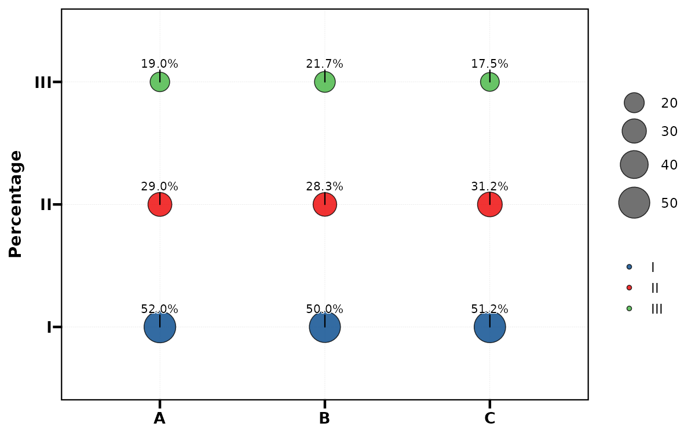{fig-alt="分类变量：plt_cat 的 11 种图形与重要参数；气泡点图；固定模拟数据的实际参数对照结果。"}

:::

## 流向、弦图与集合

::: {.panel-tabset}

### 两个分类变量 {.unnumbered}

stat.by 的两个变量变成两列节点，连接表示同一行观测的类别组合。

```r
plt_cat(dat, c("stage", "cohort"), type = "sankey")
```

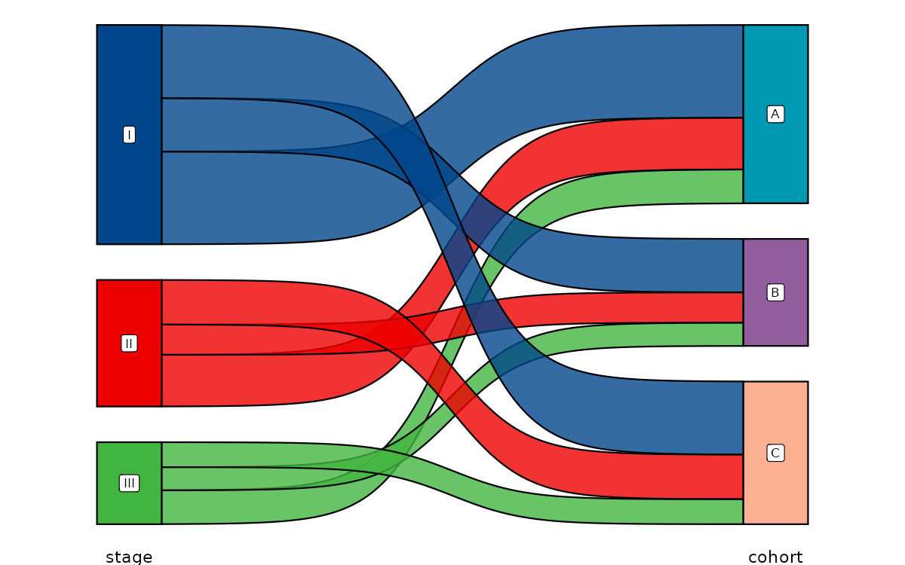{fig-alt="分类变量：plt_cat 的 11 种图形与重要参数；两个分类变量；固定模拟数据的实际参数对照结果。"}

### 增加第三列 {.unnumbered}

三列节点按 stat.by 的顺序排列；节点列顺序不同，路径图的叙述也不同。

```r
plt_cat(dat, c("stage", "cohort", "batch"), type = "sankey", alpha = 0.45)
```

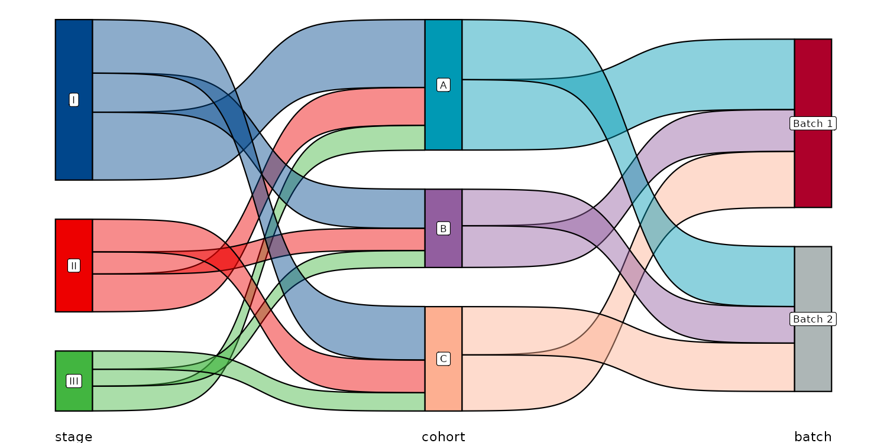{fig-alt="分类变量：plt_cat 的 11 种图形与重要参数；增加第三列；固定模拟数据的实际参数对照结果。"}

### 弦图 {.unnumbered}

弦图使用两个变量的交叉计数，直接在图形设备绘制，返回 recordedplot。

```r
plt_cat(dat, c("stage", "cohort"), type = "chord", alpha = 0.6)
```

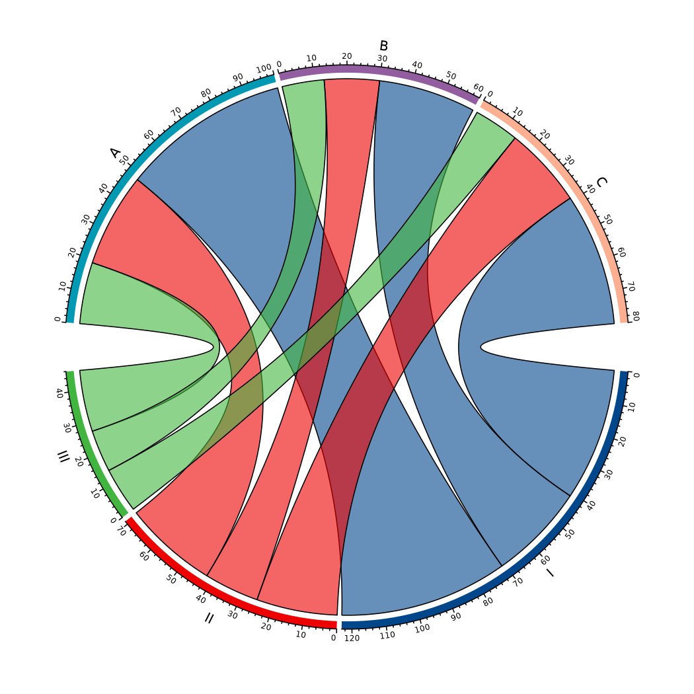{fig-alt="分类变量：plt_cat 的 11 种图形与重要参数；弦图；固定模拟数据的实际参数对照结果。"}

### 明确阳性水平 {.unnumbered}

三列各自的 Yes 构成集合，重叠区域表示同一行同时属于多个集合。

```r
plt_cat(binary, c("Surgery", "Radiation", "Drug"), type = "venn",
        stat_level = "Yes")
```

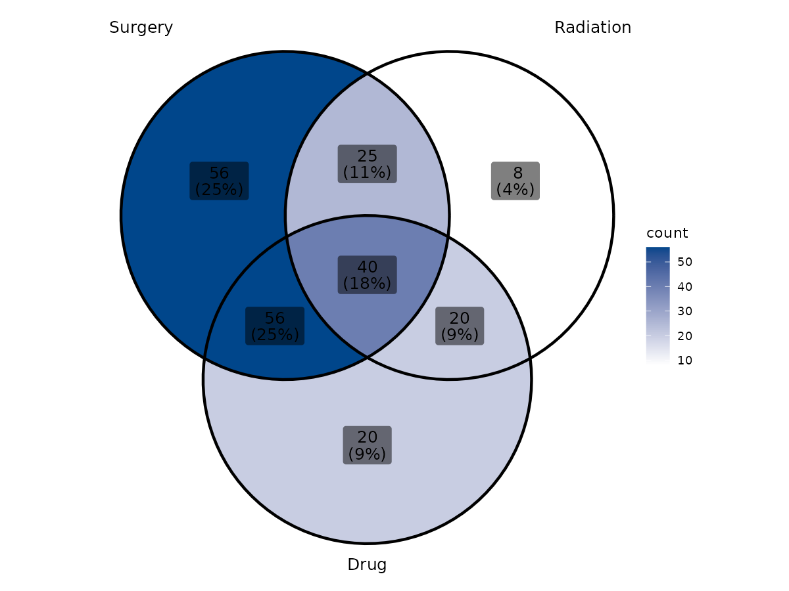{fig-alt="分类变量：plt_cat 的 11 种图形与重要参数；明确阳性水平；固定模拟数据的实际参数对照结果。"}

### 交集柱形 {.unnumbered}

每根柱子对应一个精确成员组合；完全不属于任何集合的行在当前 UpSet 分支中被排除。

```r
plt_cat(binary, c("Surgery", "Radiation", "Drug"), type = "upset",
        stat_level = "Yes", label.size = 3)
```

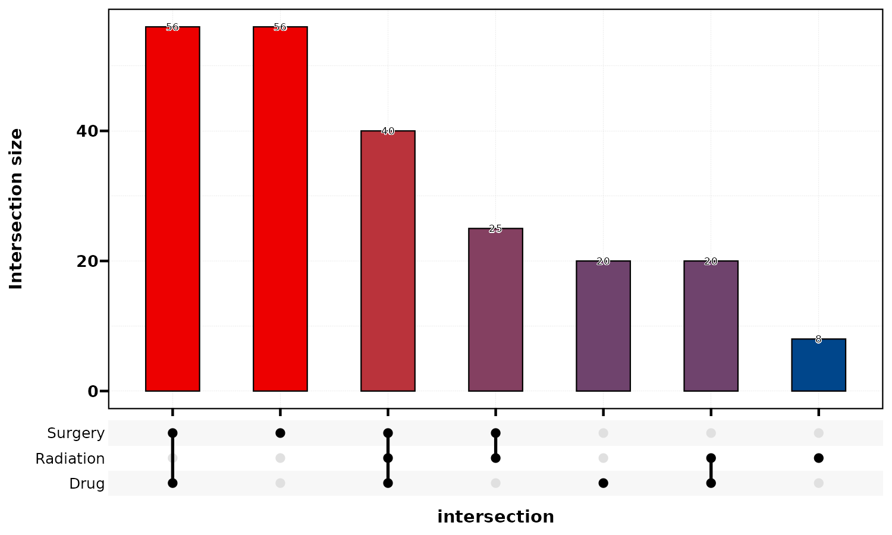{fig-alt="分类变量：plt_cat 的 11 种图形与重要参数；交集柱形；固定模拟数据的实际参数对照结果。"}

### 各列选择不同成员 {.unnumbered}

用命名 list 指定每列的成员条件；一个集合是 II/III 期，另一个是 cohort A。

```r
plt_cat(dat, c("stage", "cohort"), type = "venn",
        stat_level = list(stage = c("II", "III"), cohort = "A"))
```

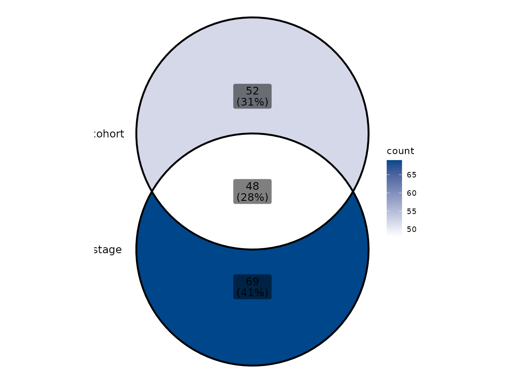{fig-alt="分类变量：plt_cat 的 11 种图形与重要参数；各列选择不同成员；固定模拟数据的实际参数对照结果。"}

:::

## 返回对象、保存与使用边界 {#output}

标准类型返回 ggplot；`split.by` 通常返回 patchwork。弦图分支返回 recordedplot，并已经在当前设备绘制，不能将它直接传给 `ggsave()`。

```r
p <- plt_cat(dat, "stage", "cohort", stat = "count")
# ggplot2::ggsave("stage-count.pdf", p, width = 8, height = 5)

# 弦图：在设备内重新执行绘图调用。
# grDevices::pdf("stage-chord.pdf", width = 7, height = 7)
# plt_cat(dat, c("stage", "cohort"), type = "chord")
# grDevices::dev.off()
```

当前 `plt_cat()` 没有统一的 `save` 参数。绘图类型、标签、配色和布局不会给频数图添加统计推断；筛选、缺失处理与分层会改变实际参与计算的观测。

## 当前完整接口 {#interfaces}

点击展开查看本次实际执行版本的参数及默认值。

<details>
<summary>公共函数签名</summary>

```r
plt_cat <-
function (data, stat.by, group.by = NULL, split.by = NULL, type = c("bar", "rose", "ring",
    "pie", "trend", "area", "dot", "sankey", "chord", "venn", "upset"), stat = c("percent",
    "count"), position = c("stack", "dodge"), palette = NULL, alpha = 0.8, label = FALSE, label.size = 3.5,
    label.fg = "black", label.bg = "white", label.bg.r = 0.1, bg.by = NULL, bg_palette = NULL,
    bg_alpha = 0.15, flip = FALSE, NA_color = "grey80", NA_stat = FALSE, keep_empty = FALSE,
    stat_level = NULL, title = NULL, subtitle = NULL, xlab = NULL, ylab = NULL, legend.position = "right",
    legend.direction = "vertical", aspect.ratio = NULL, facet_nrow = NULL, facet_ncol = NULL,
    facet_byrow = TRUE, base_size = 14, force = FALSE, ...)
NULL

```

</details>

## 验证范围与参考 {#references}

本页实际执行了全部列出的图形类型及参数对照，并核对标准百分比图组内合计为 100%、计数图总数等于输入行数。流向/集合分支按自己的数据规则解释，不将标准分支的百分比规则推广到所有类型。

本次绘制出现的提示记录如下；对应示例仍通过实际构建和导出检查。

<details>
<summary>绘图提示</summary>

- `attributes are not identical across measure variables; they will be dropped`

</details>

- [UtilsR 函数参考](https://hui950319.github.io/UtilsR/reference/index.html)
- [UtilsR 源码](https://github.com/HUI950319/UtilsR/tree/main/R)
- [专题目录](index.qmd)

<details>
<summary>执行环境</summary>

```text
R version 4.4.3 (2025-02-28)
Platform: x86_64-pc-linux-gnu
Running under: Ubuntu 22.04.2 LTS

Matrix products: default
BLAS:   /usr/lib/x86_64-linux-gnu/openblas-pthread/libblas.so.3
LAPACK: /usr/lib/x86_64-linux-gnu/openblas-pthread/libopenblasp-r0.3.20.so;  LAPACK version 3.10.0

locale:
 [1] LC_CTYPE=C.UTF-8       LC_NUMERIC=C           LC_TIME=C.UTF-8        LC_COLLATE=C.UTF-8
 [5] LC_MONETARY=C.UTF-8    LC_MESSAGES=C.UTF-8    LC_PAPER=C.UTF-8       LC_NAME=C
 [9] LC_ADDRESS=C           LC_TELEPHONE=C         LC_MEASUREMENT=C.UTF-8 LC_IDENTIFICATION=C

time zone: Asia/Shanghai
tzcode source: system (glibc)

attached base packages:
[1] stats     graphics  grDevices utils     datasets  methods   base

other attached packages:
[1] ggplot2_4.0.3 UtilsR_0.6.8

loaded via a namespace (and not attached):
 [1] gtable_0.3.6        jsonlite_2.0.0      dplyr_1.2.0         compiler_4.4.3
 [5] tidyselect_1.2.1    Rcpp_1.1.1          stringr_1.6.0       dichromat_2.0-0.1
 [9] tidyr_1.3.2         systemfonts_1.1.0   scales_1.4.0        textshaping_0.4.0
[13] ggVennDiagram_1.5.4 R6_2.6.1            labeling_0.4.3      generics_0.1.4
[17] patchwork_1.3.2     shape_1.4.6.1       ggsankey_0.0.99999  httr2_1.2.2
[21] ggrepel_0.9.8       circlize_0.4.16     tibble_3.3.1        ellmer_0.4.0
[25] ggupset_0.4.0       pillar_1.11.1       RColorBrewer_1.1-3  rlang_1.3.0
[29] stringi_1.8.7       GlobalOptions_0.1.2 S7_0.2.2            otel_0.2.0
[33] cli_3.6.6           withr_3.0.3         magrittr_2.0.4      digest_0.6.39
[37] grid_4.4.3          rappdirs_0.3.4      lifecycle_1.0.5     coro_1.1.0
[41] vctrs_0.7.3         ggprism_1.0.7       glue_1.8.1          farver_2.1.2
[45] ragg_1.5.2          geomtextpath_0.1.4  colorspace_2.1-2    purrr_1.2.1
[49] tools_4.4.3         pkgconfig_2.0.3     mcptools_0.2.1
```

</details>
