堆积与并排双侧柱形、min-max 和透明度映射、镜像分布、蜂群与配对哑铃插图。各节用固定输入比较重要参数，标签页中展示可复制代码与实际结果。

**版本与执行范围：** 本页按 UtilsR **0.6.8** 的公共接口核对；21 个示例已在 WSL R 4.4.3 中实际执行，其中 21 张图已完成构建与 PNG 导出。使用固定随机种子的模拟数据。

## 数据准备与输入约定 {#data}

bar_dat 是已计算的分类摘要；wide_left/right 和 long 用于分布展示；paired 每行是一个独立模拟单位的两次测量，供哑铃与配对插图使用。

```r
library(UtilsR)
library(ggplot2)
set.seed(1009)
bar_dat <- expand.grid(term = paste0("Term ", 1:6), response = c("Type 1", "Type 2"),
                       cohort = c("Left", "Right"), stringsAsFactors = FALSE)
bar_dat[["value"]] <- sample(5:35, nrow(bar_dat), TRUE)
bar_dat[["weight"]] <- runif(nrow(bar_dat), 0.2, 0.9)
wide_left <- data.frame(M1 = rnorm(50, 1.1, 0.3), M2 = rnorm(50, 0.5, 0.2), M3 = rnorm(50, 1.5, 0.4))
wide_right <- data.frame(M1 = rnorm(50, 0.8, 0.3), M2 = rnorm(50, 0.9, 0.2), M3 = rnorm(50, 1.1, 0.4))
long <- expand.grid(term = paste0("M", 1:3), cohort = c("Left", "Right"),
                    subtype = c("S1", "S2"), replicate = 1:25, stringsAsFactors = FALSE)
long[["value"]] <- rnorm(nrow(long), 1, 0.35) + ifelse(long[["subtype"]] == "S2", 0.3, 0)
paired <- data.frame(category = paste0("Unit ", 1:14), start = rnorm(14, 5, 1))
paired[["end"]] <- paired[["start"]] + rnorm(14, 0.5, 0.7)
custom_inset <- ggplot(paired, aes(start, end)) + geom_point(color = "#0072B2", size = 1.5) +
  geom_abline(slope = 1, intercept = 0, linetype = "dashed") + theme_my(base_size = 9)
```

## 函数选择与重要参数 {#parameters}

| 目标 | 参数 | 语义 |
|:--|:--|:--|
| 双侧柱形 | `PlotButterfly(type="bar")`、`stat.by/fill.by/value.by/group.by` | 长表给出已计算数值，group.by 必须恰好两组；两侧不自动代表正负效应 |
| 并排与排序 | `type="bar_dodge"`、`levels=NULL/"up"/"down"/向量` | 改堆积方式或类别次序；不是重新估计数值 |
| 标准化 | `minmax=FALSE` | 各 group.by×fill.by 内的 value min-max；标准化后不能读原始人数或效应单位 |
| 透明度 | `alpha.by=NULL`、`alpha.range=c(0.3,1)` | 以指定列映射柱形透明度，覆盖固定 alpha |
| 镜像分布 | `data.left/data.right`、`add_box/add_point/ref.line` | 两张宽表；行数可以不同，不自动进行配对检验 |
| 长表分布 | `PlotButterfly2(stat.by,value.by,group.by,fill.by=NULL)` | fill.by 增加每侧内部子组；两主组按数据首次出现顺序确定 |
| 五种 type | `violin_box/violin/box/beeswarm/beeswarm_quasirandom` | 不带 fill.by 的 box 当前转发为小提琴叠箱线；本页独立箱线示例明确给 fill.by |
| 点与子组布局 | `dodge.width/violin.scale/box.width/pt.size/pt.alpha/cex` | 点密度、子组避让与分布宽度分别控制 |
| 蜂群颜色 | `color_by="fixed"/"logFC"`、`fixed_color/gradient_colors` | logFC 选项按 value.by 着色，没有自动计算 log fold change |
| 哑铃排序 | `sort_by="end"`、`sort_descending=FALSE`、`top_n=NULL` | 当前先排序，再保留尾部 top_n；降序时尾部是较小值 |
| 差值标签 | `show_delta=FALSE`、`delta_digits/size/color` | 差值为 end−start，标签位于两点更右的一端 |
| 辅助线 | `show_zero_line/show_mean_lines/dot_guide` | 均值线和自动插图基于排序和 top_n 后的当前行 |
| 自动插图 | `inset_plot="auto"`、`inset_type`、`inset_test` | boxplot/violin；t.test/wilcox/none，使用双侧配对检验 |
| 插图布局 | `inset_left/bottom/right/top`、`inset_paired_line/inset_jitter` | panel 的相对位置；或传入自定义 ggplot |
| 配色与保存 | `palette/legend.position` 或 `color_x/color_xend/legend_pos`；`filename` | 各函数沿用自身接口，下方签名提供全部默认值 |

## 双侧柱形比较

::: {.panel-tabset}

### 堆积柱 {.unnumbered}

已给定的两类数值在每侧堆积；左图轴方向反转显示镜像，数值本身未变成负数。

```r
PlotButterfly(bar_dat, stat.by = "term", fill.by = "response",
              value.by = "value", group.by = "cohort", palette = c("#0072B2", "#E69F00"))
```

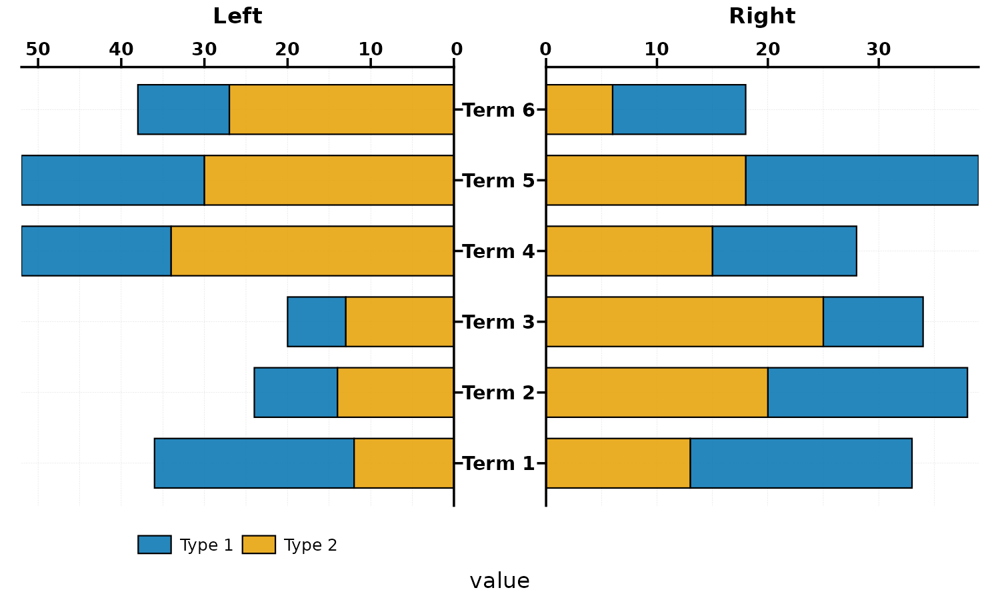{fig-alt="双侧比较图：Butterfly、分布镜像与 Dumbbell；堆积柱；固定模拟数据的实际参数对照结果。"}

### 并排柱 {.unnumbered}

同一输入改为子类并排，便于直接比较每个子类。

```r
PlotButterfly(bar_dat, type = "bar_dodge", stat.by = "term", fill.by = "response",
              value.by = "value", group.by = "cohort", palette = c("#0072B2", "#E69F00"), bar.width = 0.6)
```

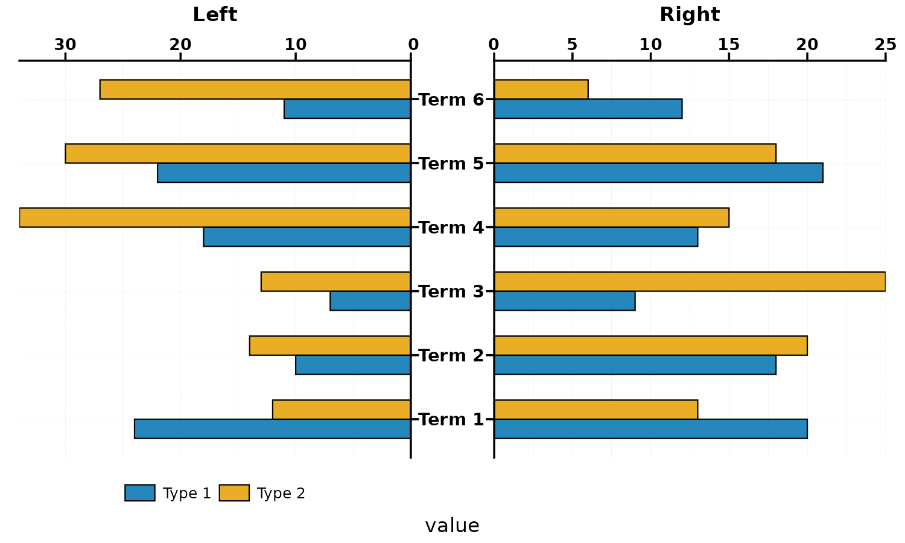{fig-alt="双侧比较图：Butterfly、分布镜像与 Dumbbell；并排柱；固定模拟数据的实际参数对照结果。"}

### 明确类别顺序 {.unnumbered}

按显式顺序排列两侧类别，避免排序规则误解。

```r
PlotButterfly(bar_dat, stat.by = "term", fill.by = "response", value.by = "value",
              group.by = "cohort", levels = paste0("Term ", 6:1), alpha = 0.7)
```

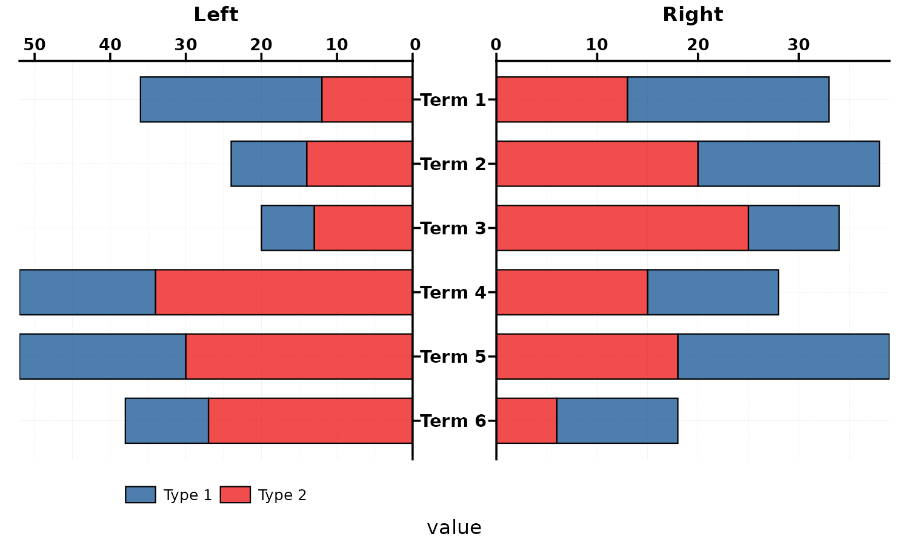{fig-alt="双侧比较图：Butterfly、分布镜像与 Dumbbell；明确类别顺序；固定模拟数据的实际参数对照结果。"}

### 组内 min-max {.unnumbered}

各主组×子类的数值缩放到 0–1；堆积后合计可以大于 1，不能解释为概率。

```r
PlotButterfly(bar_dat, stat.by = "term", fill.by = "response", value.by = "value",
              group.by = "cohort", minmax = TRUE, xlab = "Within-group scaled value")
```

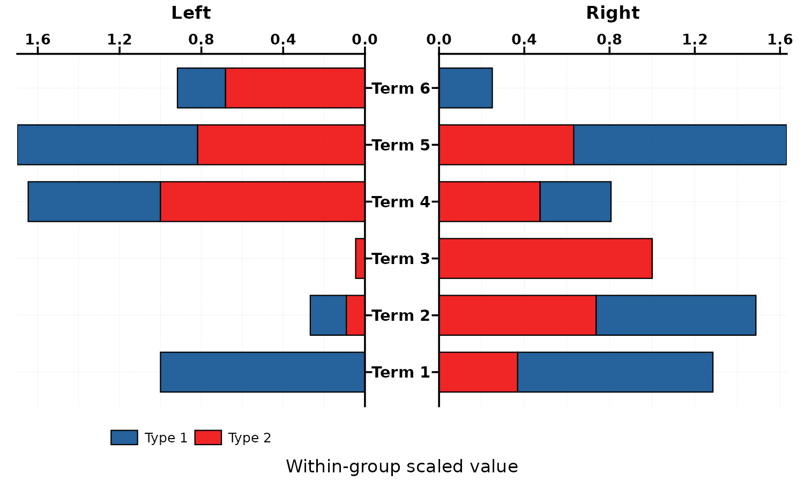{fig-alt="双侧比较图：Butterfly、分布镜像与 Dumbbell；组内 min-max；固定模拟数据的实际参数对照结果。"}

### 透明度映射 {.unnumbered}

柱形高度编码 value，颜色透明度另外编码 weight；两者不能混读。

```r
PlotButterfly(bar_dat, stat.by = "term", fill.by = "response", value.by = "value",
              group.by = "cohort", alpha.by = "weight", alpha.range = c(0.2, 1))
```

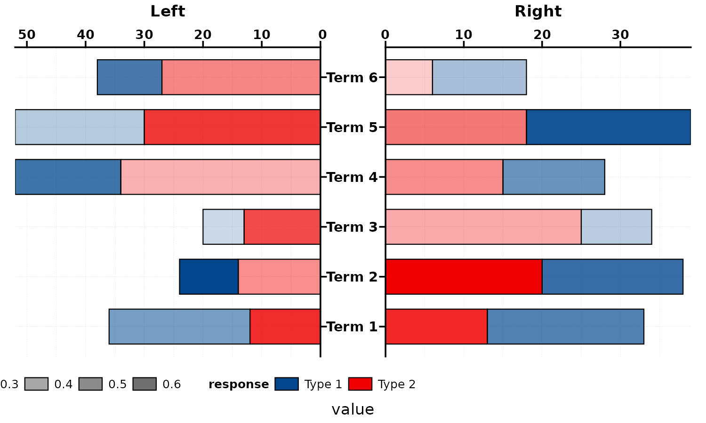{fig-alt="双侧比较图：Butterfly、分布镜像与 Dumbbell；透明度映射；固定模拟数据的实际参数对照结果。"}

:::

## 宽表镜像分布

::: {.panel-tabset}

### 小提琴与箱线 {.unnumbered}

两侧每列是一组分布；每行原始测量不自动在图中配对。

```r
PlotButterfly(type = "violin", data.left = wide_left, data.right = wide_right,
              left.title = "Left", right.title = "Right")
```

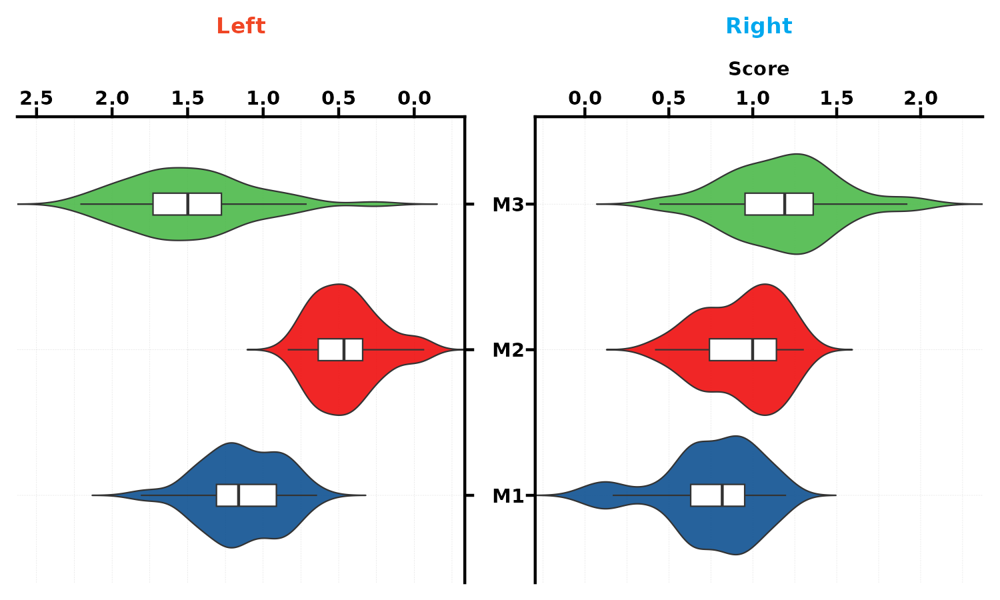{fig-alt="双侧比较图：Butterfly、分布镜像与 Dumbbell；小提琴与箱线；固定模拟数据的实际参数对照结果。"}

### 原始点和参考线 {.unnumbered}

去掉箱线，叠加原始点，并在原始测量值 1 处加参考线。

```r
PlotButterfly(type = "violin", data.left = wide_left, data.right = wide_right,
              add_box = FALSE, add_point = TRUE, pt.size = 0.9, pt.alpha = 0.4,
              ref.line = 1, ref.color = "#333333", palette = c("#0072B2", "#E69F00", "#009E73"))
```

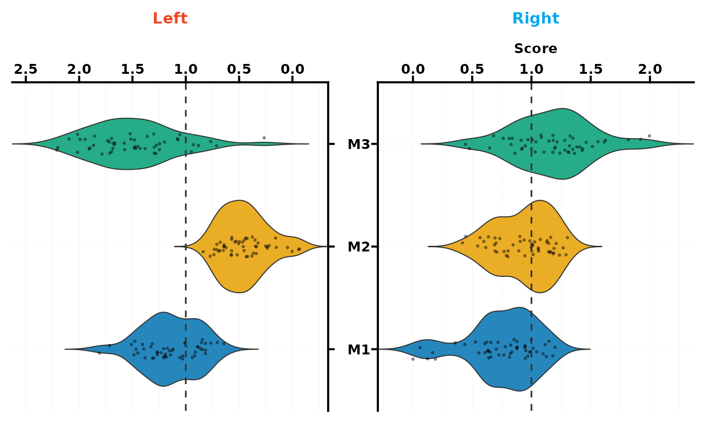{fig-alt="双侧比较图：Butterfly、分布镜像与 Dumbbell；原始点和参考线；固定模拟数据的实际参数对照结果。"}

:::

## 长表分布和蜂群

::: {.panel-tabset}

### 不带内部子组 {.unnumbered}

长表转换为两侧宽表后复用 PlotButterfly，默认组合小提琴与箱线。

```r
PlotButterfly2(long, "term", "value", "cohort", type = "violin_box")
```

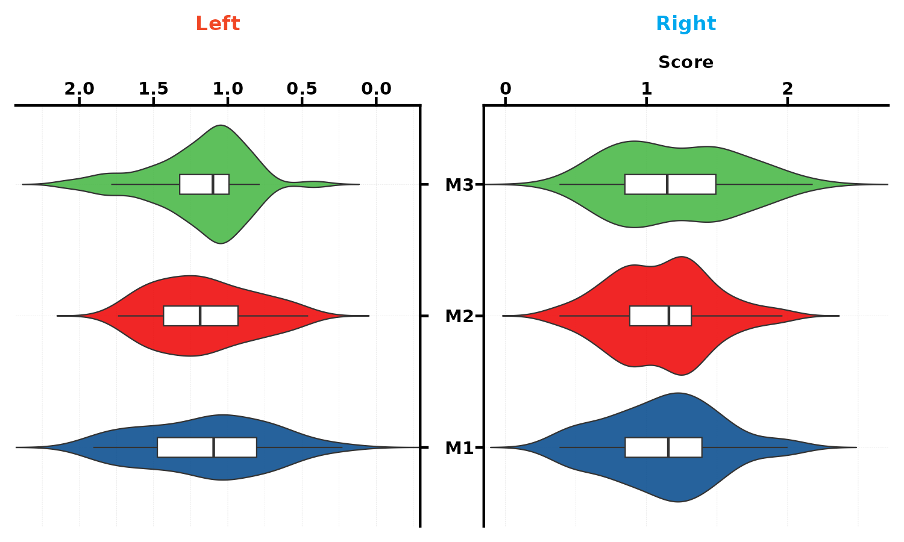{fig-alt="双侧比较图：Butterfly、分布镜像与 Dumbbell；不带内部子组；固定模拟数据的实际参数对照结果。"}

### 内部子组 {.unnumbered}

fill.by 区分每侧的 S1/S2，内部子组并排避让。

```r
PlotButterfly2(long, "term", "value", "cohort", fill.by = "subtype",
               type = "violin_box", palette = c("#0072B2", "#E69F00"), dodge.width = 0.7)
```

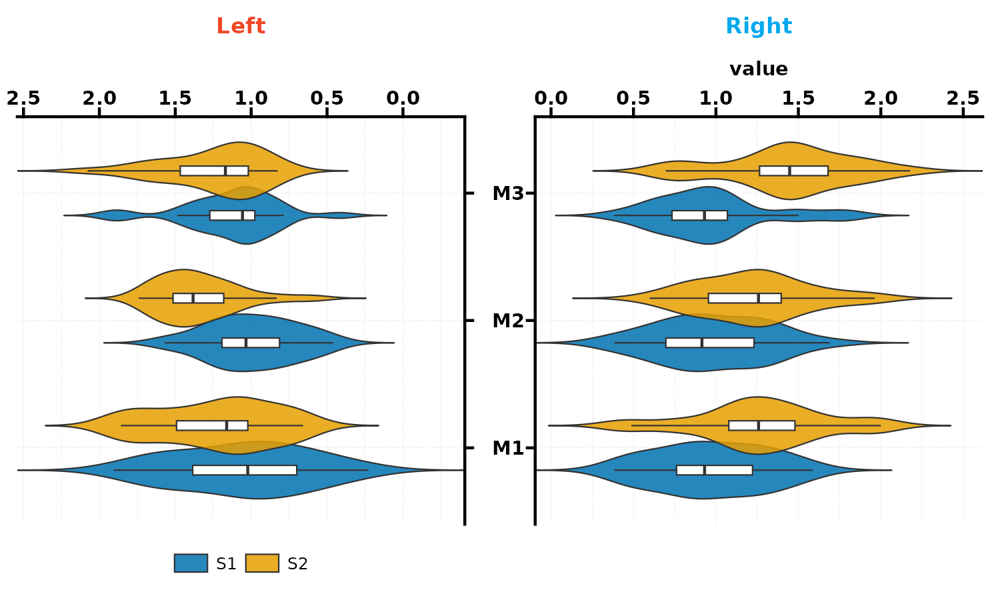{fig-alt="双侧比较图：Butterfly、分布镜像与 Dumbbell；内部子组；固定模拟数据的实际参数对照结果。"}

### 明确箱线分支 {.unnumbered}

给出 fill.by 后走直接绘制分支，独立箱线与原始点实际显示。

```r
PlotButterfly2(long, "term", "value", "cohort", fill.by = "subtype",
               type = "box", box.width = 0.3, add_point = TRUE, pt.alpha = 0.25)
```

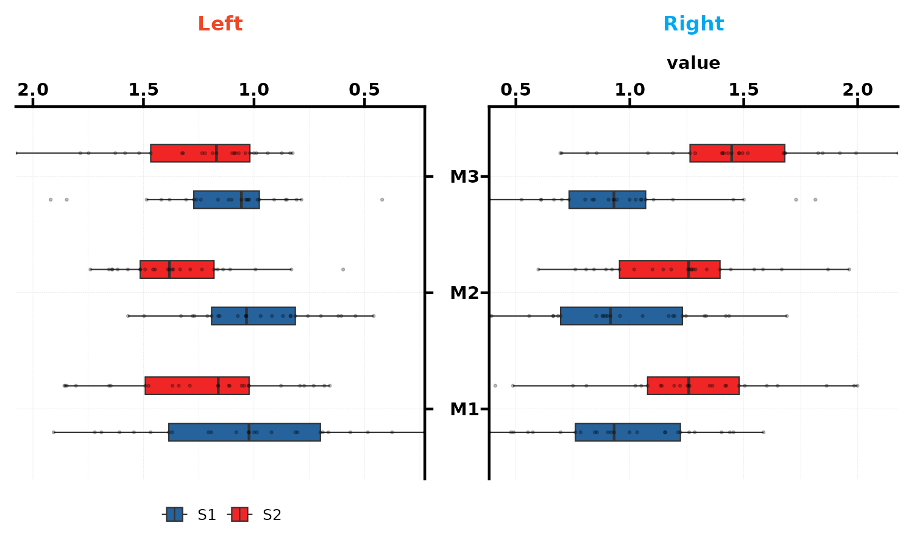{fig-alt="双侧比较图：Butterfly、分布镜像与 Dumbbell；明确箱线分支；固定模拟数据的实际参数对照结果。"}

### 固定色蜂群 {.unnumbered}

蜂群把重叠点展开；cex 控制布局密度，与 pt.size 的点大小不同。

```r
PlotButterfly2(long, "term", "value", "cohort", type = "beeswarm",
               color_by = "fixed", fixed_color = "#0072B2", pt.size = 1.5, cex = 0.4)
```

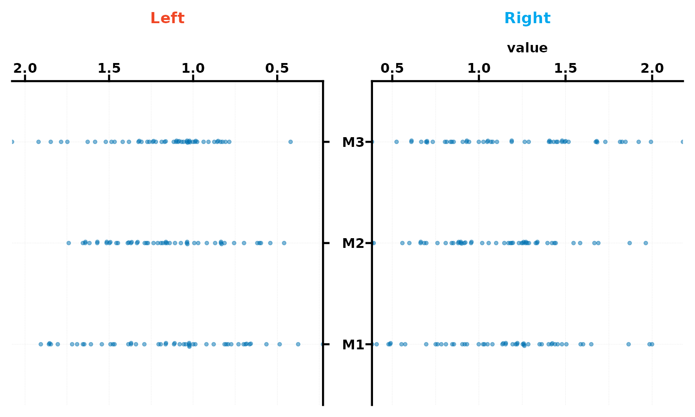{fig-alt="双侧比较图：Butterfly、分布镜像与 Dumbbell；固定色蜂群；固定模拟数据的实际参数对照结果。"}

### 数值渐变准随机点 {.unnumbered}

这里颜色按模拟 value 渐变，形状表示 subtype；logFC 是选项名，没有计算任何折叠变化。

```r
PlotButterfly2(long, "term", "value", "cohort", fill.by = "subtype",
               type = "beeswarm_quasirandom", color_by = "logFC",
               gradient_colors = c("#2166AC", "white", "#B2182B"), pt.size = 1.5, dodge.width = 0.6)
```

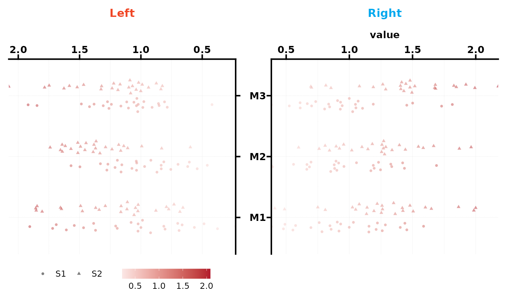{fig-alt="双侧比较图：Butterfly、分布镜像与 Dumbbell；数值渐变准随机点；固定模拟数据的实际参数对照结果。"}

:::

## 哑铃排序和差值

::: {.panel-tabset}

### 默认终点排序 {.unnumbered}

每条线连接同一单位的 start/end，默认按 end 升序。

```r
PlotDumbbell(paired, label_x = "Before", label_xend = "After", legend_pos = "bottom")
```

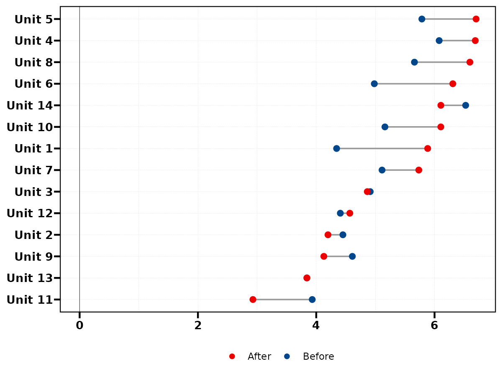{fig-alt="双侧比较图：Butterfly、分布镜像与 Dumbbell；默认终点排序；固定模拟数据的实际参数对照结果。"}

### 差值标签与排序 {.unnumbered}

按 end−start 的有符号差值排序，负值表示终点小于起点。

```r
PlotDumbbell(paired, sort_by = "delta", show_delta = TRUE, delta_digits = 2,
             delta_size = 3, label_x = "Before", label_xend = "After", legend_pos = "bottom")
```

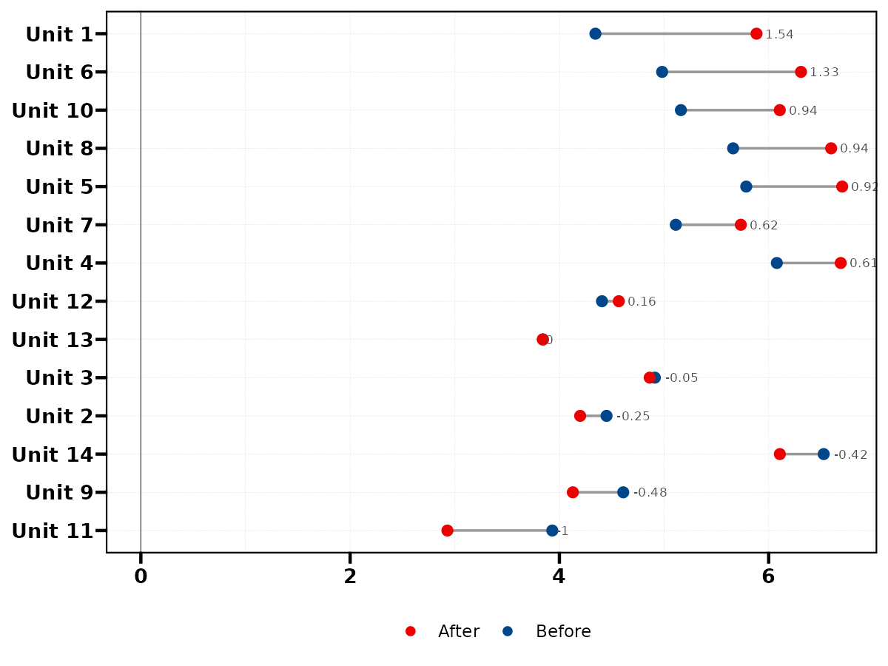{fig-alt="双侧比较图：Butterfly、分布镜像与 Dumbbell；差值标签与排序；固定模拟数据的实际参数对照结果。"}

### 升序后的尾部五行 {.unnumbered}

当前实现取排序结果的尾部；升序时保留最大的五个 end。

```r
PlotDumbbell(paired, sort_by = "end", sort_descending = FALSE, top_n = 5,
             show_delta = TRUE, legend_pos = "bottom")
```

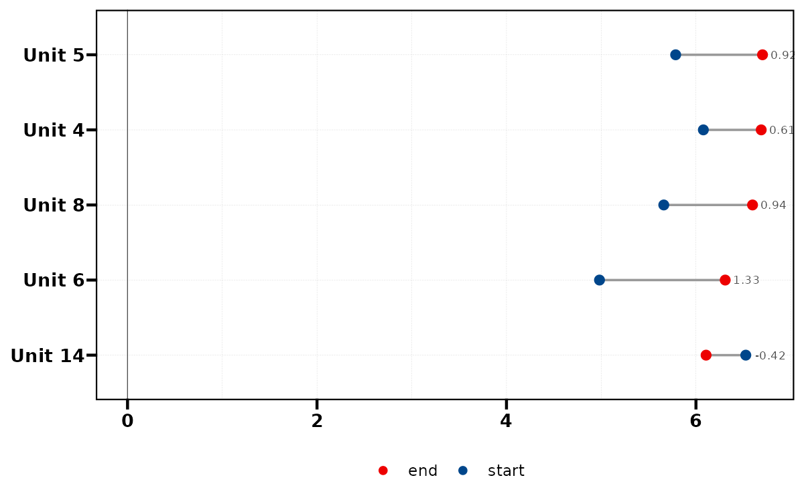{fig-alt="双侧比较图：Butterfly、分布镜像与 Dumbbell；升序后的尾部五行；固定模拟数据的实际参数对照结果。"}

### 降序后的尾部五行 {.unnumbered}

同样 top_n=5，降序后取尾部保留较小的五个 end；不能简单把 top_n 理解为最大五个。

```r
PlotDumbbell(paired, sort_by = "end", sort_descending = TRUE, top_n = 5,
             show_delta = TRUE, legend_pos = "bottom")
```

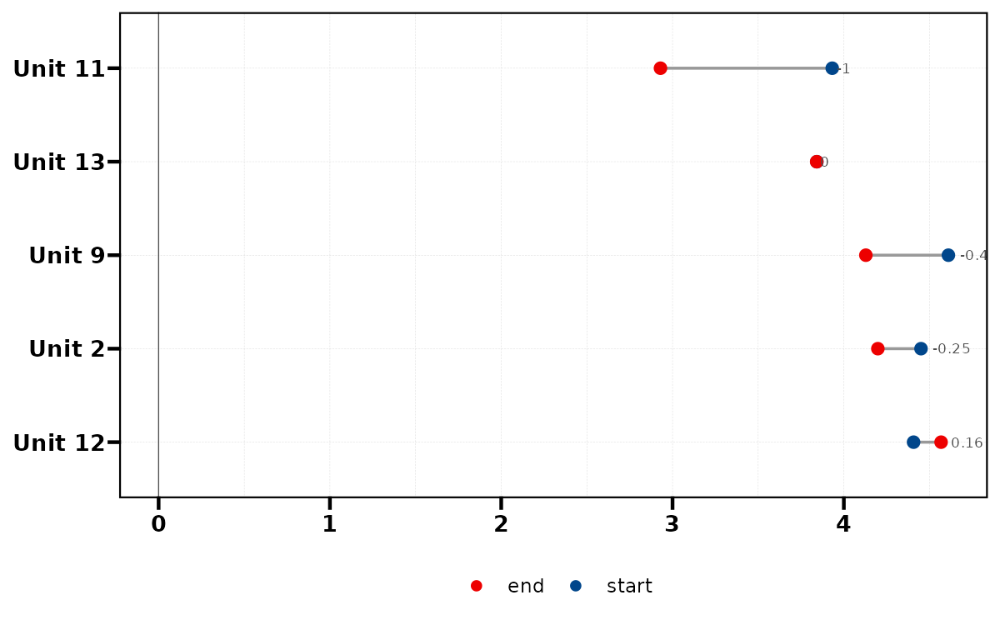{fig-alt="双侧比较图：Butterfly、分布镜像与 Dumbbell；降序后的尾部五行；固定模拟数据的实际参数对照结果。"}

:::

## 辅助线、样式和图例

::: {.panel-tabset}

### 均值与横向辅助线 {.unnumbered}

两条竖线为当前输入两列的均值；此图使用完整 14 行。

```r
PlotDumbbell(paired, show_mean_lines = TRUE, dot_guide = TRUE,
             show_zero_line = FALSE, label_x = "Before", label_xend = "After", legend_pos = "bottom")
```

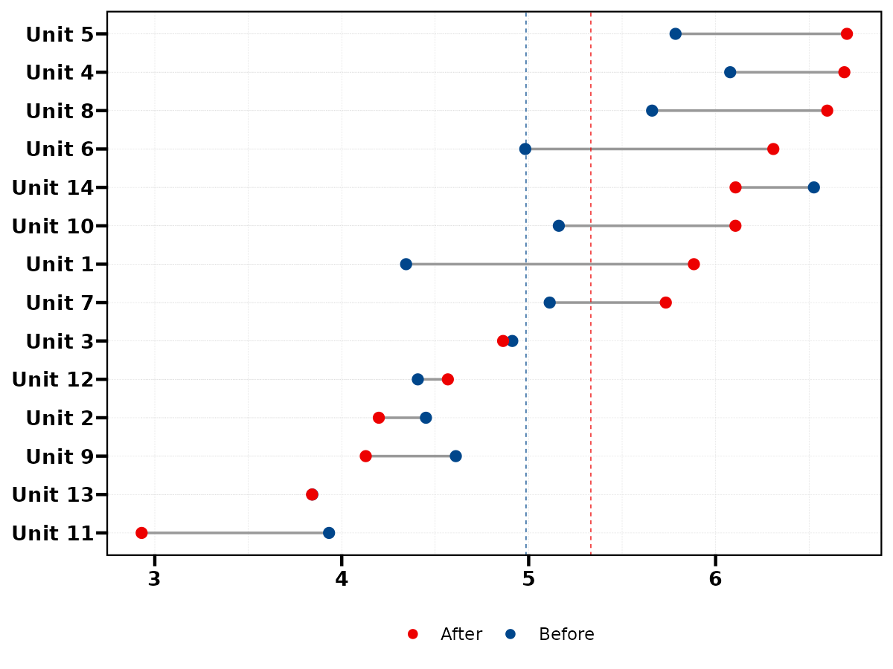{fig-alt="双侧比较图：Butterfly、分布镜像与 Dumbbell；均值与横向辅助线；固定模拟数据的实际参数对照结果。"}

### 点线和文字 {.unnumbered}

颜色区分前后测量，点形和连接线样式分别设置。

```r
PlotDumbbell(paired, color_x = "#0072B2", color_xend = "#D55E00",
             point_size = 4, point_shape = 17, seg_color = "grey75", seg_size = 1,
             x_label = "Simulated score", y_label = "Paired unit", legend_pos = "top")
```

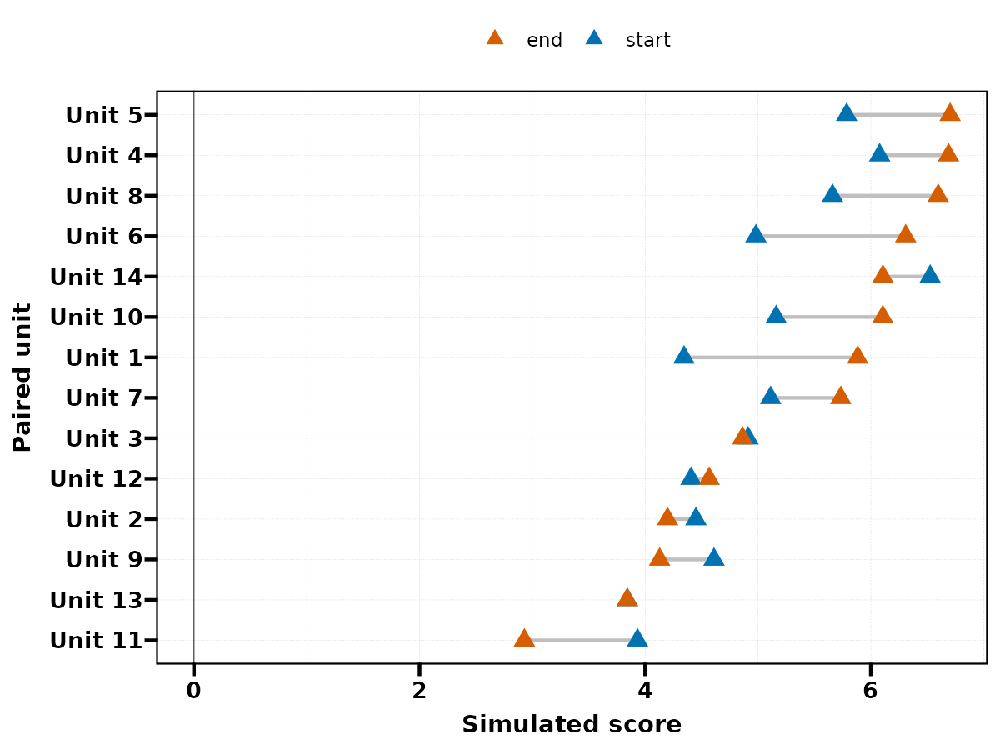{fig-alt="双侧比较图：Butterfly、分布镜像与 Dumbbell；点线和文字；固定模拟数据的实际参数对照结果。"}

:::

## 自动与自定义插图

::: {.panel-tabset}

### 配对箱线插图 {.unnumbered}

插图用当前行做双侧配对 t 检验；本页每行是独立模拟单位，没有将组别汇总当作受试者。

```r
PlotDumbbell(paired, inset_plot = "auto", inset_type = "boxplot", inset_test = "t.test",
             label_x = "Before", label_xend = "After", legend_pos = "bottom",
             inset_left = 0.04, inset_bottom = 0.55, inset_right = 0.38, inset_top = 0.96)
```

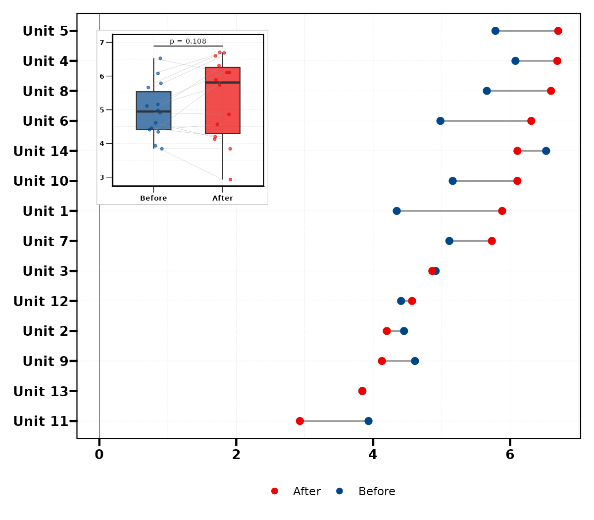{fig-alt="双侧比较图：Butterfly、分布镜像与 Dumbbell；配对箱线插图；固定模拟数据的实际参数对照结果。"}

### 小提琴插图与 Wilcoxon {.unnumbered}

关闭配对线和抖动点只改变显示，配对检验仍保留；改为 Wilcoxon。

```r
PlotDumbbell(paired, inset_plot = "auto", inset_type = "violin", inset_test = "wilcox",
             inset_paired_line = FALSE, inset_jitter = FALSE, legend_pos = "bottom",
             inset_left = 0.04, inset_bottom = 0.55, inset_right = 0.38, inset_top = 0.96)
```

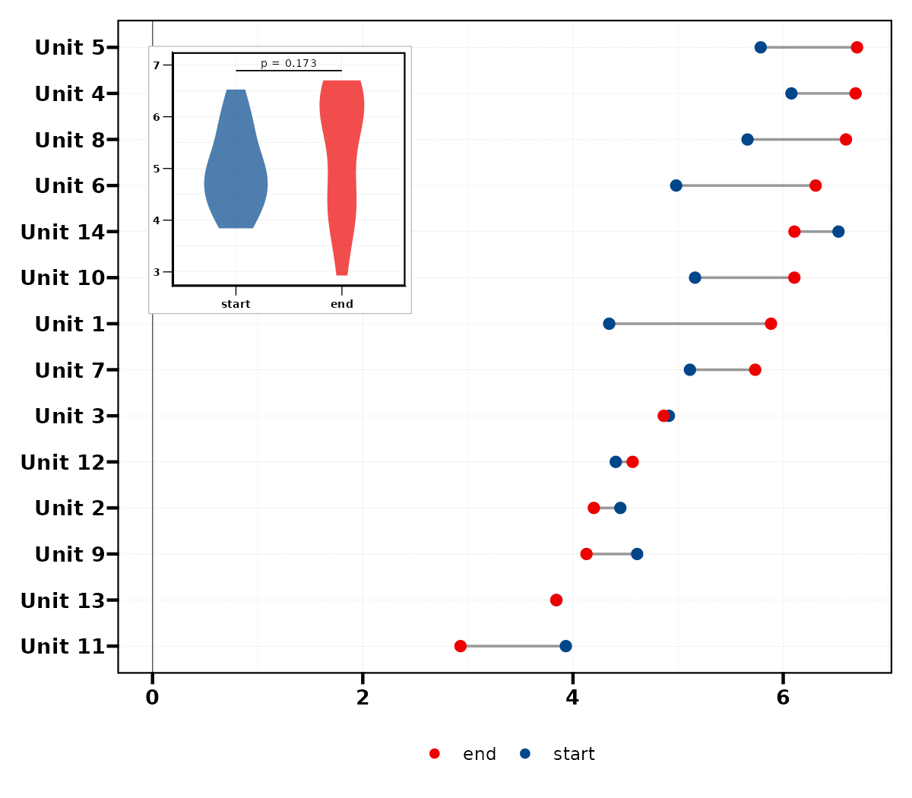{fig-alt="双侧比较图：Butterfly、分布镜像与 Dumbbell；小提琴插图与 Wilcoxon；固定模拟数据的实际参数对照结果。"}

### 自定义散点插图 {.unnumbered}

插入已创建的 ggplot，这个分支不自动执行 inset_test。

```r
PlotDumbbell(paired, inset_plot = custom_inset, legend_pos = "bottom",
             inset_left = 0.04, inset_bottom = 0.55, inset_right = 0.38, inset_top = 0.96)
```

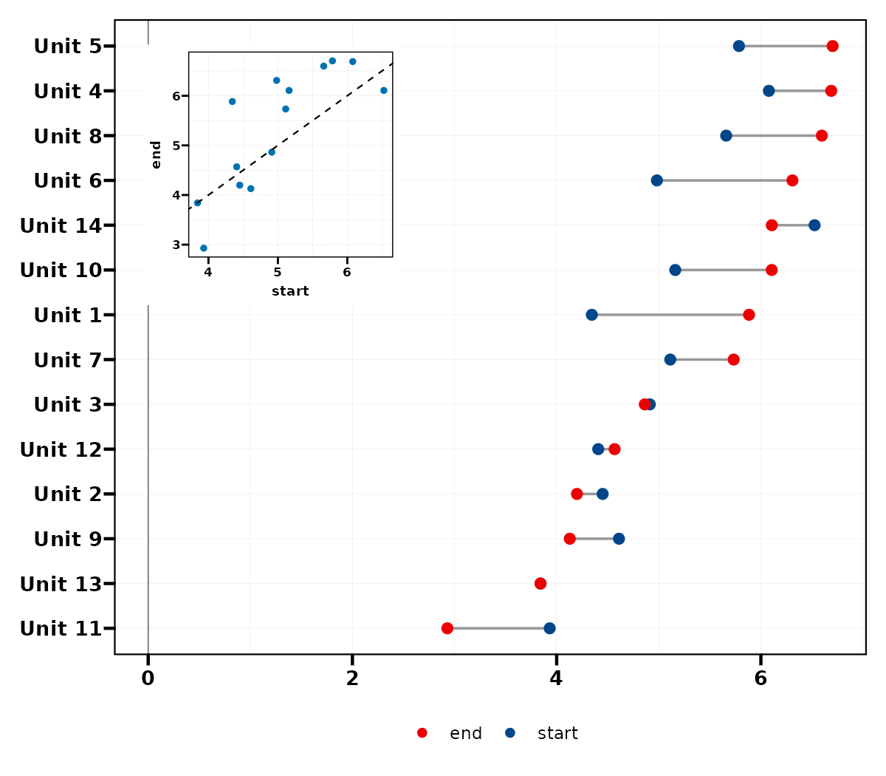{fig-alt="双侧比较图：Butterfly、分布镜像与 Dumbbell；自定义散点插图；固定模拟数据的实际参数对照结果。"}

:::

## 返回对象、保存与使用边界 {#output}

Butterfly 返回 patchwork；Dumbbell 不可见返回 ggplot/patchwork。可赋值后使用外部 ggsave，或给 filename 使用函数自身保存入口。

排序、镜像轴、透明度与 min-max 都是显示或数值转换，不会产生效应估计。Butterfly 镜像分布没有自动统计检验。Dumbbell 自动插图对当前绘图行进行双侧配对检验；top_n 之后只用筛选后的行，均值线也随之改变。做推断时不能按最大差值筛选后把该检验解释成全样本检验。

当前 `PlotButterfly2(type="box", fill.by=NULL)` 转发到小提琴叠箱线；`PlotDumbbell(top_n=...)` 取排序结果尾部。本页按真实输出说明这两处行为，并提供可用调用，不修改包接口。

## 当前完整接口 {#interfaces}

点击展开查看本次实际执行版本的参数及默认值。

<details>
<summary>公共函数签名</summary>

```r
PlotButterfly <-
function (data = NULL, type = c("bar", "bar_dodge", "violin"), stat.by = NULL, fill.by = NULL,
    value.by = NULL, group.by = NULL, data.left = NULL, data.right = NULL, left.title = NULL,
    right.title = NULL, levels = NULL, palette = NULL, alpha = 0.85, alpha.by = NULL, alpha.range = c(0.3,
        1), minmax = FALSE, bar.width = 0.7, bar.border = "black", add_box = TRUE, box.width = 0.15,
    add_point = FALSE, pt.size = 0.8, pt.alpha = 0.5, ref.line = NULL, ref.color = "#bf1a2c",
    text.colors = NULL, left.title.color = "#f04625", right.title.color = "#00a8ee", title = NULL,
    xlab = NULL, base_size = 14, legend.position = "bottom", legend_theme = NULL, width = 12,
    height = 8, filename = NULL)
NULL

PlotButterfly2 <-
function (data, stat.by = NULL, value.by = NULL, group.by = NULL, fill.by = NULL, type = c("violin_box",
    "violin", "box", "beeswarm", "beeswarm_quasirandom"), levels = NULL, palette = NULL, alpha = 0.85,
    box.width = 0.15, add_point = FALSE, pt.size = 0.8, pt.alpha = 0.5, violin.scale = "width",
    dodge.width = 0.8, color_by = c("fixed", "logFC"), fixed_color = "#f33131", gradient_colors = c("#2166AC",
        "white", "#B2182B"), cex = 0.3, ref.line = NULL, ref.color = "#bf1a2c", text.colors = NULL,
    left.title = NULL, right.title = NULL, left.title.color = "#f04625", right.title.color = "#00a8ee",
    title = NULL, xlab = NULL, base_size = 14, legend.position = "bottom", legend_theme = NULL,
    width = 12, height = 8, filename = NULL)
NULL

PlotDumbbell <-
function (data, x_col = "start", xend_col = "end", y_col = "category", sort_by = "end", sort_descending = FALSE,
    top_n = NULL, color_x = "#00468BFF", color_xend = "#ED0000FF", label_x = NULL, label_xend = NULL,
    seg_color = "grey60", seg_size = 0.8, point_size = 3, point_shape = 19, show_delta = FALSE,
    delta_size = 3, delta_digits = 2, delta_color = "grey30", show_zero_line = TRUE, zero_line_color = "grey30",
    zero_line_width = 0.3, show_mean_lines = FALSE, mean_line_width = 0.3, dot_guide = FALSE,
    dot_guide_color = "grey80", dot_guide_size = 0.15, x_label = NULL, y_label = NULL, title = NULL,
    legend_pos = "auto", legend_theme = NULL, theme_use = theme_my, inset_plot = NULL, inset_type = "boxplot",
    inset_test = "t.test", inset_paired_line = TRUE, inset_jitter = TRUE, inset_theme_use = NULL,
    inset_left = 0.04, inset_bottom = 0.68, inset_right = 0.35, inset_top = 0.94, filename = NULL,
    width = 8, height = 6, dpi = 300, bg = "white")
NULL

```

</details>

## 验证范围与参考 {#references}

本页列出的调用均已实际执行；所有展示的 ggplot/patchwork 图通过 `ggplot_build()` 和 PNG 导出，表格来自同一组代码的实际返回。未修改 UtilsR 源码或重新运行全包测试。

本次绘制出现的提示记录如下；对应示例仍通过实际构建和导出检查。

<details>
<summary>绘图提示</summary>

- `Vectorized input to 'element_text()' is not officially supported. ℹ Results may be unexpected or may change in future versions of ggplot2.`
- `No shared levels found between 'names(values)' of the manual scale and the data's colour values.`

</details>

- [UtilsR 函数参考](https://hui950319.github.io/UtilsR/reference/index.html)
- [UtilsR 源码](https://github.com/HUI950319/UtilsR/tree/main/R)
- [专题目录](index.qmd)

<details>
<summary>执行环境</summary>

```text
R version 4.4.3 (2025-02-28)
Platform: x86_64-pc-linux-gnu
Running under: Ubuntu 22.04.2 LTS

Matrix products: default
BLAS:   /usr/lib/x86_64-linux-gnu/openblas-pthread/libblas.so.3
LAPACK: /usr/lib/x86_64-linux-gnu/openblas-pthread/libopenblasp-r0.3.20.so;  LAPACK version 3.10.0

locale:
 [1] LC_CTYPE=C.UTF-8       LC_NUMERIC=C           LC_TIME=C.UTF-8        LC_COLLATE=C.UTF-8
 [5] LC_MONETARY=C.UTF-8    LC_MESSAGES=C.UTF-8    LC_PAPER=C.UTF-8       LC_NAME=C
 [9] LC_ADDRESS=C           LC_TELEPHONE=C         LC_MEASUREMENT=C.UTF-8 LC_IDENTIFICATION=C

time zone: Asia/Shanghai
tzcode source: system (glibc)

attached base packages:
[1] stats     graphics  grDevices utils     datasets  methods   base

other attached packages:
[1] ggplot2_4.0.3 UtilsR_0.6.8

loaded via a namespace (and not attached):
 [1] gtable_0.3.6       jsonlite_2.0.0     dplyr_1.2.0        compiler_4.4.3     tidyselect_1.2.1
 [6] Rcpp_1.1.1         ggbeeswarm_0.7.3   dichromat_2.0-0.1  tidyr_1.3.2        systemfonts_1.1.0
[11] scales_1.4.0       textshaping_0.4.0  R6_2.6.1           labeling_0.4.3     generics_0.1.4
[16] patchwork_1.3.2    httr2_1.2.2        ggrepel_0.9.8      tibble_3.3.1       ellmer_0.4.0
[21] pillar_1.11.1      RColorBrewer_1.1-3 rlang_1.3.0        S7_0.2.2           otel_0.2.0
[26] cli_3.6.6          withr_3.0.3        magrittr_2.0.4     digest_0.6.39      grid_4.4.3
[31] rappdirs_0.3.4     beeswarm_0.4.0     lifecycle_1.0.5    vipor_0.4.7        coro_1.1.0
[36] vctrs_0.7.3        ggprism_1.0.7      glue_1.8.1         farver_2.1.2       ragg_1.5.2
[41] purrr_1.2.1        tools_4.4.3        pkgconfig_2.0.3    mcptools_0.2.1
```

</details>
