嵌套 patchwork 的选择和重排、gtable 边缘组件与插图、两种 raster 后端、面板尺寸和真实 PDF 比较。各节用固定输入比较重要参数，标签页中展示可复制代码与实际结果。

**版本与执行范围：** 本页按 UtilsR **0.6.8** 的公共接口核对；28 个示例已在 WSL R 4.4.3 中实际执行，其中 22 张图已完成构建与 PNG 导出。使用固定随机种子的模拟数据。

## 数据准备与输入约定 {#data}

dat 为 3,000 行固定种子的模拟数据，small 为其中 120 行；p1–p4 用同一输入生成四种图，标题带 A–D 以便核对展平和重排。

```r
library(UtilsR)
library(ggplot2)
library(patchwork)
set.seed(1012)
dat <- data.frame(x = rnorm(3000), group = factor(sample(c("A", "B", "C"), 3000, TRUE)))
dat[["y"]] <- 0.55 * dat[["x"]] + rnorm(nrow(dat), 0, 0.8)
small <- dat[1:120, ]
cols <- c(A = "#0072B2", B = "#E69F00", C = "#009E73")
p1 <- ggplot(small, aes(x, y, color = group)) + geom_point(size = 1.8, alpha = 0.65) +
  scale_color_manual(values = cols) + labs(title = "A: scatter") + theme_my(base_size = 11)
p2 <- ggplot(small, aes(group, y, fill = group)) + geom_boxplot(width = 0.5) +
  scale_fill_manual(values = cols) + labs(title = "B: boxplot") + theme_my(base_size = 11)
p3 <- ggplot(small, aes(x)) + geom_histogram(bins = 15, fill = "#56B4E9", color = "white") +
  labs(title = "C: histogram") + theme_my(base_size = 11)
p4 <- ggplot(small, aes(y, fill = group)) + geom_density(alpha = 0.35) +
  scale_fill_manual(values = cols) + labs(title = "D: density") + theme_my(base_size = 11)
nested <- ((p1 | p2) / (p3 | p4)) + plot_annotation(title = "Outer annotation", tag_levels = "A")
side_x <- ggplot(small, aes(x)) + geom_density(fill = "#56B4E9", alpha = 0.6) + theme_void()
side_y <- ggplot(small, aes(y)) + geom_density(fill = "#E69F00", alpha = 0.6) +
  coord_flip() + theme_void()
inset <- ggplot(small, aes(group, y, fill = group)) + geom_boxplot(width = 0.5) +
  scale_fill_manual(values = cols, guide = "none") + theme_my(base_size = 7) +
  theme(plot.background = element_rect(fill = "white", color = "grey60"),
        plot.margin = margin(3, 3, 3, 3)) + labs(x = NULL, y = NULL)
dense <- ggplot(dat, aes(x, y, color = group)) + geom_point(size = 0.8, alpha = 0.3) +
  scale_color_manual(values = cols) + labs(title = "3,000 simulated observations") +
  annotate("text", x = -2.1, y = 2.4, label = "Text layer", size = 3) + theme_my(base_size = 11)
```

## 函数选择与重要参数 {#parameters}

| 目标 | 重要参数 | 作用与适用条件 |
|:--|:--|:--|
| 展平嵌套 | `flatten_patchwork(plots,...)` | 递归取 patchwork 子图，再调用 wrap_plots；外层标题、原设计和相对尺寸需重新设定 |
| 选择和重排 | `select_inds=NULL/nrow_inds_order=NULL` | 先展平，再选索引；nrow_inds_order=2 对四图得到 1,3,2,4 |
| 重新排版 | ... 中 `nrow/ncol/widths/heights/guides` | 直接交给 wrap_plots；不把已有 list 当作已支持的展平输入 |
| grob 转换 | `grob_as(plot,...)` | ggplot→gtable、gList→grobTree、现有 gtable 保持；patchwork 完整转换用 patchworkGrob |
| 边缘附加 | `grob_add(position,space=NULL,clip="on")` | top/bottom/left/right/none；space 用 grid::unit 明确高度或宽度，本页使用单面板 |
| 插图边界 | `left/bottom/right/top` | 默认 0–1 的相对坐标，支持 grid unit；顺序必须组成正的宽和高 |
| 插图基准 | `align_to="panel"/"plot"/"full"` | panel 对齐面板区域；plot 使用背景区域；full 使用整个 gtable，本例后两者可重合 |
| 插图叠放 | `on_top=TRUE/clip=TRUE` | on_top 控制 z 顺序，clip 控制区域裁剪；关闭上层不保证不被面板背景遮挡 |
| 包装成 ggplot | `grob_to_gg(grob)` | 用 annotation_custom 绘制完整 grob；适合保存与组合，不能再直接修改内部原图尺度 |
| 栅格化后端 | `fmt_raster(method="ggrastr"/"ragg")` | ggrastr 标记支持的 geom 层；ragg 把检测到的面板转成位图再保留部分文字组件 |
| 解析度 | `dpi=300` | 影响位图清晰度和文件大小；网页 PNG 只检查外观，PDF 才展示混合矢量输出 |
| ragg 面板尺寸 | `width/height=NULL`、`units="in"/"cm"/"mm"` | 固定的是面板，非整张图；可以为 1 或面板数长度，优先显式设值避免设备推算 |
| ragg 返回尺寸 | `attr(result,"size")` | 包含整张图 width/height/units，可用于导出，防止固定面板被小画布裁剪 |
| 设备和背景 | `dev="ragg"/bg="transparent"` | dev 用于 ggrastr；bg 用于 ragg 面板，外部 ggsave 背景另行设置 |

## 嵌套图的展平与选择

::: {.panel-tabset}

### 原始嵌套组合 {.unnumbered}

两行各有一个左右组合；标题与自动 tag 在最外层。

```r
nested
```

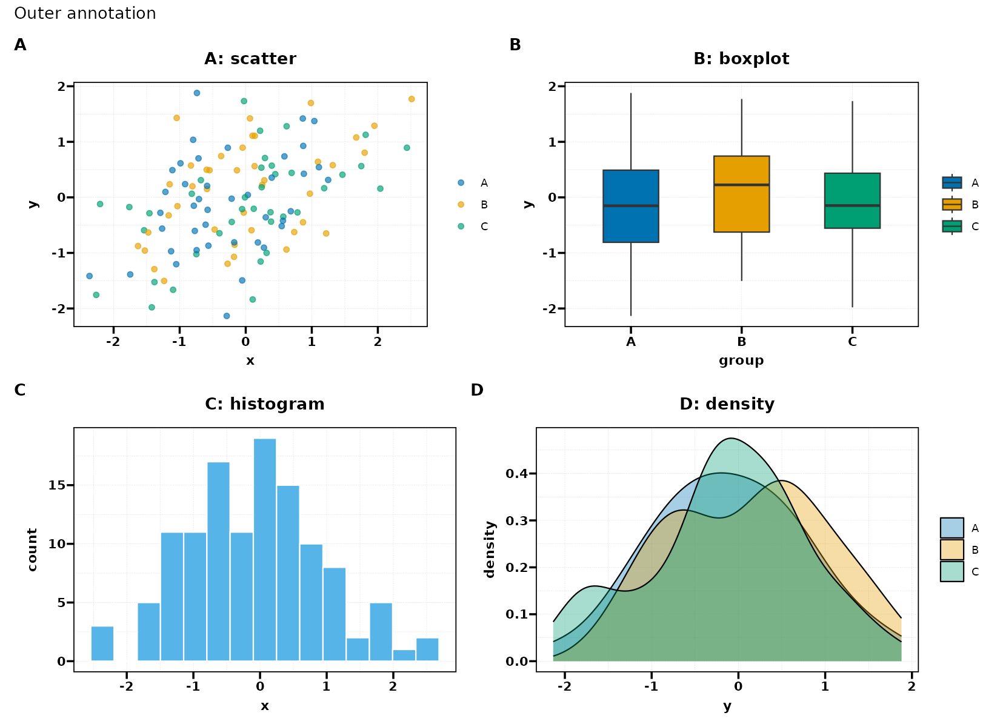{fig-alt="图形组合与导出：展平、grob、插图和栅格化；原始嵌套组合；固定模拟数据的实际参数对照结果。"}

### 展平成一行 {.unnumbered}

四张图递归展平，再统一排一行；外层 Outer annotation 和自动 tag 不会保留。

```r
flatten_patchwork(nested, nrow = 1)
```

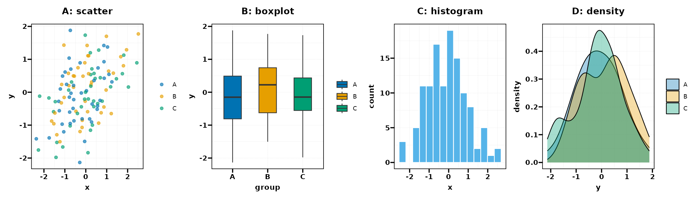{fig-alt="图形组合与导出：展平、grob、插图和栅格化；展平成一行；固定模拟数据的实际参数对照结果。"}

### 选第 1 和第 3 图 {.unnumbered}

索引在展平后，选择 scatter 和 histogram；不是按嵌套顶层两行选取。

```r
flatten_patchwork(nested, select_inds = c(1, 3), ncol = 2)
```

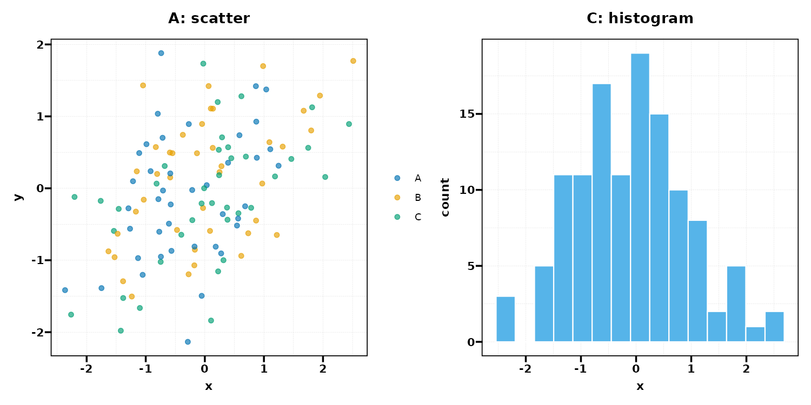{fig-alt="图形组合与导出：展平、grob、插图和栅格化；选第 1 和第 3 图；固定模拟数据的实际参数对照结果。"}

### 交错重排 {.unnumbered}

顺序为 A,C,B,D；本例标题自带字母，便于核对实际位置。

```r
flatten_patchwork(nested, nrow_inds_order = 2, ncol = 2)
```

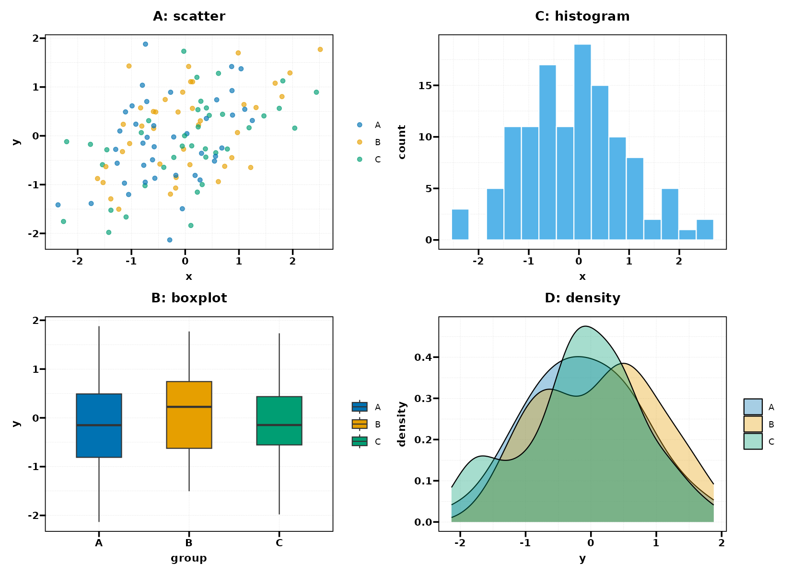{fig-alt="图形组合与导出：展平、grob、插图和栅格化；交错重排；固定模拟数据的实际参数对照结果。"}

### 重新给布局和总标题 {.unnumbered}

重新定义列宽、行高与外层标题；收集的相同图例仍需核对内容是否完全一致。

```r
flatten_patchwork(nested, ncol = 2, widths = c(1.5, 1), heights = c(1, 0.8),
                  guides = "collect") + plot_annotation(title = "Rebuilt layout") &
  theme(legend.position = "bottom")
```

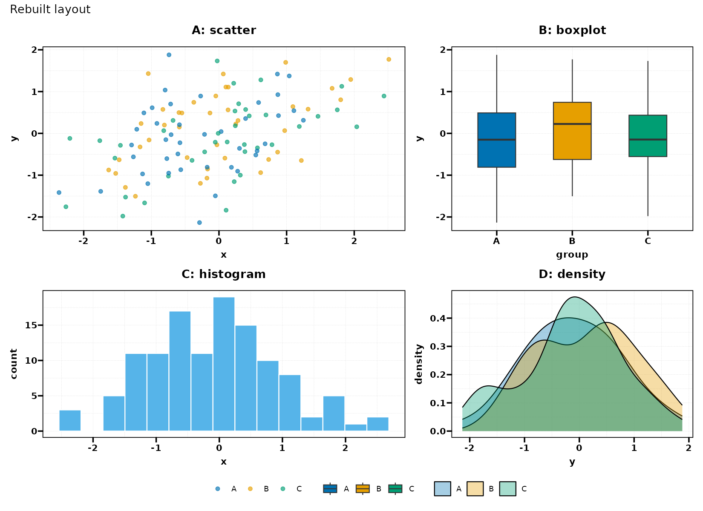{fig-alt="图形组合与导出：展平、grob、插图和栅格化；重新给布局和总标题；固定模拟数据的实际参数对照结果。"}

:::

## grob 类型与完整转换

::: {.panel-tabset}

### 转换类型 {.unnumbered}

gtable 可直接 grid.draw；gList 变成 grobTree，不能把所有输出都当作 ggplot。

```r
objects <- list(single = grob_as(p1), existing_gtable = grob_as(ggplotGrob(p1)),
                grob_list = grob_as(grid::gList(grid::textGrob("A"), grid::rectGrob())),
                patchwork_full = patchwork::patchworkGrob(nested))
data.frame(input = names(objects), output_class = vapply(objects, function(z) paste(class(z), collapse = "/"), character(1)))
```

|                |input           |output_class            |
|:---------------|:---------------|:-----------------------|
|single          |single          |gtable/gTree/grob/gDesc |
|existing_gtable |existing_gtable |gtable/gTree/grob/gDesc |
|grob_list       |grob_list       |gTree/grob/gDesc        |
|patchwork_full  |patchwork_full  |gtable/gTree/grob/gDesc |

### 核对完整组合的面板 {.unnumbered}

这里统计最外层 gtable 的 panel 条目；完整嵌套的内部 gtable 还包含子图，所以 3 不等于只有三张图。下一组图片直接核对转换结果。

```r
g1 <- grob_as(nested)
g2 <- patchwork::patchworkGrob(nested)
data.frame(converter = c("UtilsR::grob_as", "patchwork::patchworkGrob"),
           panel_entries = c(sum(grepl("panel", g1$layout$name)),
                             sum(grepl("panel", g2$layout$name))))
```

|converter                | panel_entries|
|:------------------------|-------------:|
|UtilsR::grob_as          |             1|
|patchwork::patchworkGrob |             3|

### 当前直接转换结果 {.unnumbered}

当前 grob_as 的 patchwork 分支使用 ggplotGrob；本例嵌套组合只得到空白主面板，四张子图均未保留。下一示例完整转换后显示全部四图。

```r
grob_to_gg(grob_as(nested))
```

{fig-alt="图形组合与导出：展平、grob、插图和栅格化；当前直接转换结果；固定模拟数据的实际参数对照结果。"}

### 完整组合包装保存 {.unnumbered}

先完整转换，再包装；外层标签和四张子图都进入最终 grob。

```r
grob_to_gg(patchwork::patchworkGrob(nested))
```

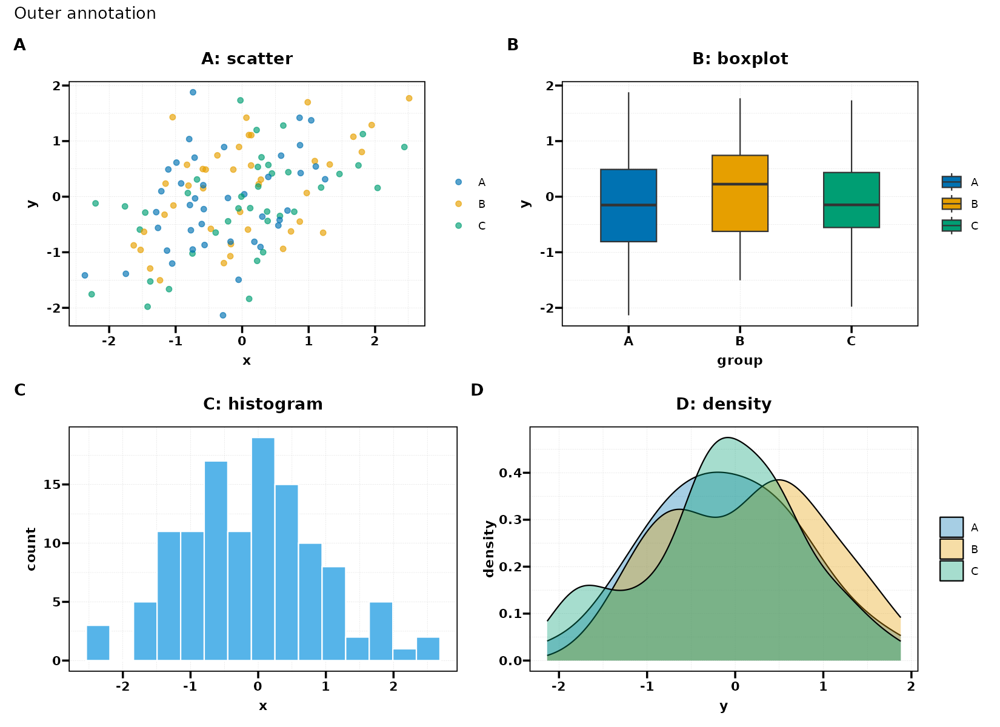{fig-alt="图形组合与导出：展平、grob、插图和栅格化；完整组合包装保存；固定模拟数据的实际参数对照结果。"}

:::

## 边缘组件与空间

::: {.panel-tabset}

### 上侧密度组件 {.unnumbered}

space 明确给组件高度；这里只复用变量 x 的密度图，并未自动同步坐标限和轴宽。

```r
gt <- grob_add(p1, side_x, position = "top", space = grid::unit(1.8, "cm"))
grob_to_gg(gt)
```

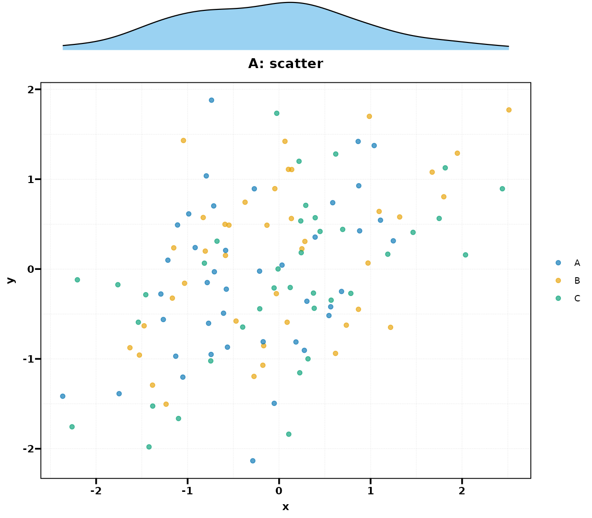{fig-alt="图形组合与导出：展平、grob、插图和栅格化；上侧密度组件；固定模拟数据的实际参数对照结果。"}

### 右侧组件 {.unnumbered}

右侧 space 是宽度；grob_add 添加布局单元，不会自动检查边际数据或坐标对齐。

```r
gt <- grob_add(p1, side_y, position = "right", space = grid::unit(2.2, "cm"), clip = "off")
grob_to_gg(gt)
```

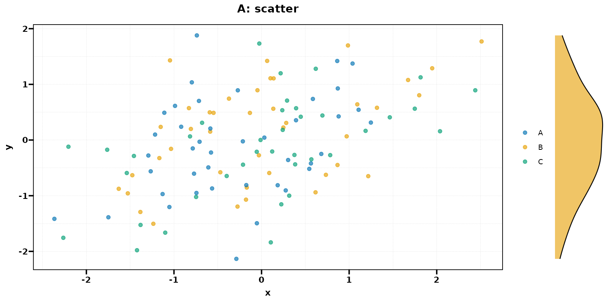{fig-alt="图形组合与导出：展平、grob、插图和栅格化；右侧组件；固定模拟数据的实际参数对照结果。"}

### 连续追加两侧 {.unnumbered}

第二次继续操作 gtable，把顶侧和右侧都保留；本页使用单面板避免多面板平均位置的歧义。

```r
gt <- grob_add(p1, side_x, "top", space = grid::unit(1.4, "cm"))
gt <- grob_add(gt, side_y, "right", space = grid::unit(2, "cm"))
grob_to_gg(gt)
```

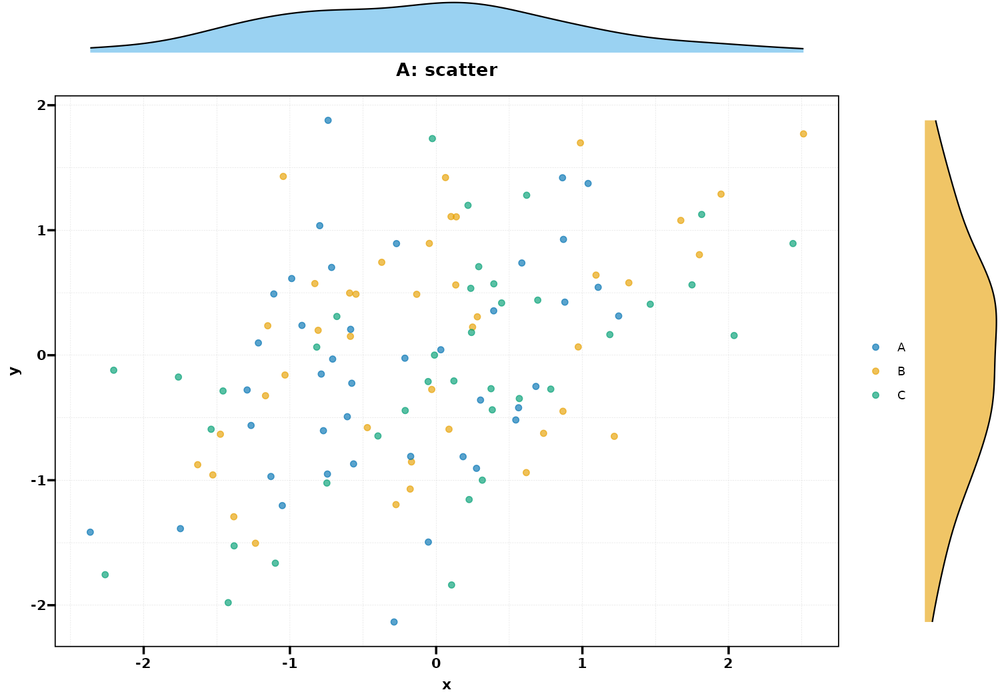{fig-alt="图形组合与导出：展平、grob、插图和栅格化；连续追加两侧；固定模拟数据的实际参数对照结果。"}

### 关闭附加 {.unnumbered}

none 返回主图的 gtable；作为配置开关时不用另写附加组件分支。

```r
grob_to_gg(grob_add(p1, side_x, position = "none"))
```

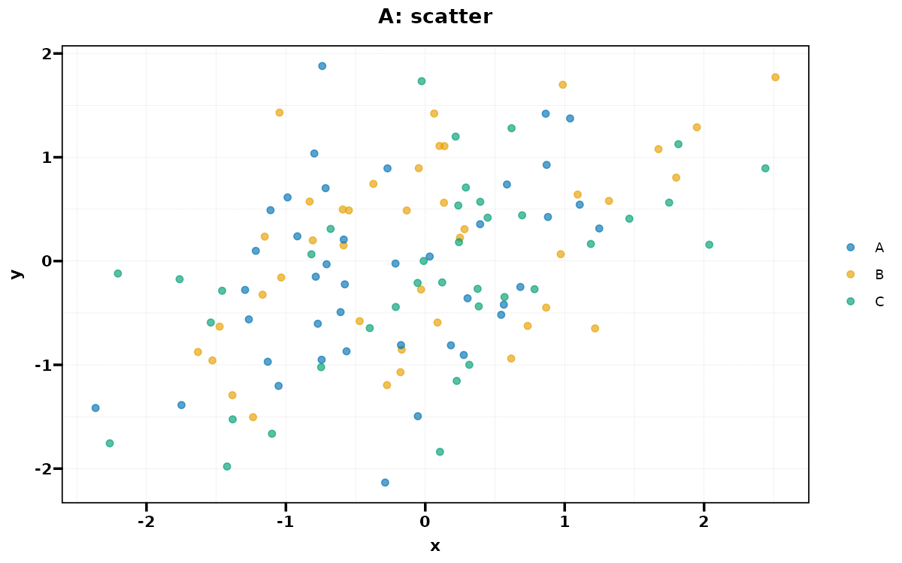{fig-alt="图形组合与导出：展平、grob、插图和栅格化；关闭附加；固定模拟数据的实际参数对照结果。"}

:::

## 插图位置与裁剪

::: {.panel-tabset}

### 按面板相对坐标 {.unnumbered}

四个边界相对于主面板；插图位于右下角，背景显式为白色以便阅读。

```r
gt <- grob_insert(p1, inset, left = 0.62, bottom = 0.03, right = 0.99, top = 0.42)
grob_to_gg(gt)
```

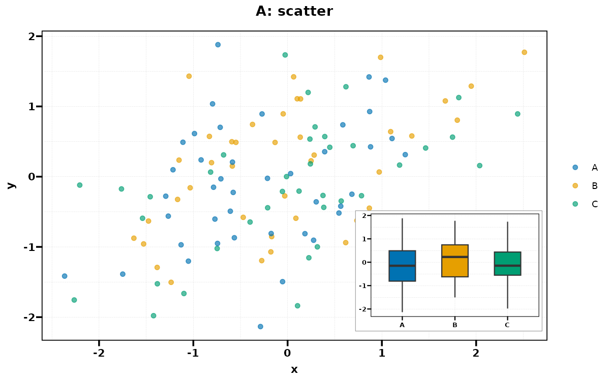{fig-alt="图形组合与导出：展平、grob、插图和栅格化；按面板相对坐标；固定模拟数据的实际参数对照结果。"}

### 按整个画布定位 {.unnumbered}

full 把轴、标题、图例所占空间纳入定位；与相同数字的 panel 布局不同。

```r
gt <- grob_insert(p1, inset, left = 0.64, bottom = 0.04, right = 0.98, top = 0.4,
                  align_to = "full", on_top = TRUE, clip = FALSE)
grob_to_gg(gt)
```

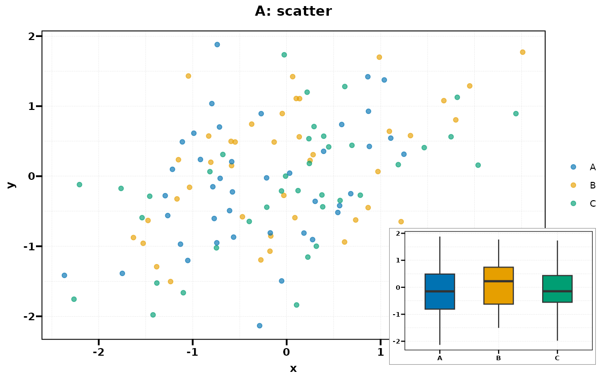{fig-alt="图形组合与导出：展平、grob、插图和栅格化；按整个画布定位；固定模拟数据的实际参数对照结果。"}

### 混用相对和固定距离 {.unnumbered}

插图固定宽 3 cm、高 2.3 cm，贴面板右侧；最终画布缩放会改变其相对面积。

```r
gt <- grob_insert(p1, inset, left = grid::unit(1, "npc") - grid::unit(3, "cm"),
                  bottom = grid::unit(0.3, "cm"), right = grid::unit(1, "npc"),
                  top = grid::unit(2.6, "cm"), align_to = "panel")
grob_to_gg(gt)
```

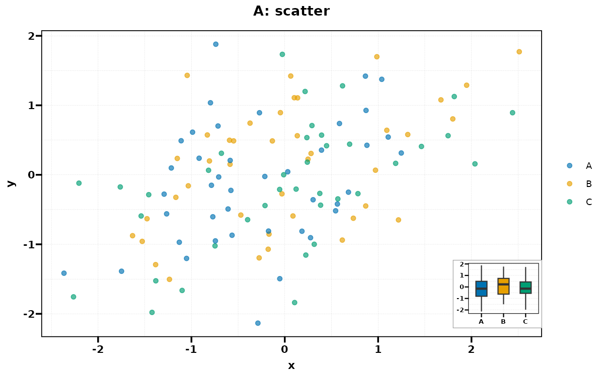{fig-alt="图形组合与导出：展平、grob、插图和栅格化；混用相对和固定距离；固定模拟数据的实际参数对照结果。"}

### grob 再参与排版 {.unnumbered}

包装后可加入 patchwork，但 wrapped 内部轴文字和原始 geom 已是 grob，不能用新的 scale 改回原图。

```r
wrapped <- grob_to_gg(grob_insert(p1, inset, left = 0.62, bottom = 0.03, right = 0.99, top = 0.42))
wrapped | p3
```

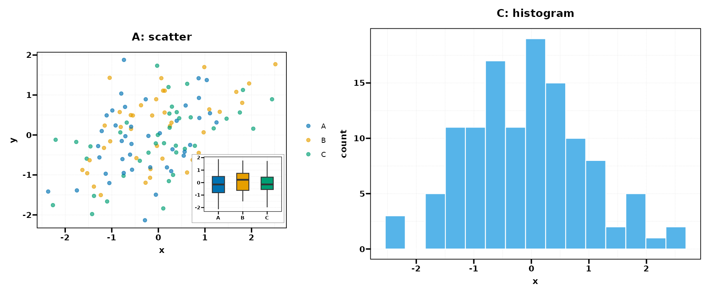{fig-alt="图形组合与导出：展平、grob、插图和栅格化；grob 再参与排版；固定模拟数据的实际参数对照结果。"}

:::

## 栅格化后端和分辨率

::: {.panel-tabset}

### 原始散点 {.unnumbered}

3,000 个点作为同一输入，用来比较栅格化外观和实际 PDF 字节；几何与统计含义保持一致。

```r
dense
```

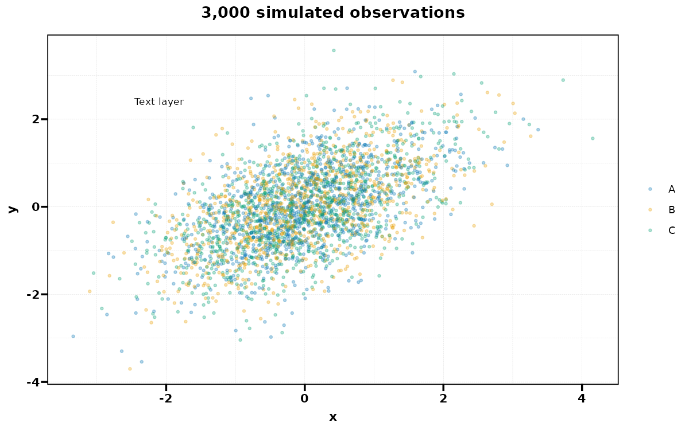{fig-alt="图形组合与导出：展平、grob、插图和栅格化；原始散点；固定模拟数据的实际参数对照结果。"}

### ggrastr 150 dpi {.unnumbered}

标记 ggrastr 支持的层，输出时才栅格化；文字、图例、轴及未匹配层保留原绘制路径。

```r
fmt_raster(dense, method = "ggrastr", dpi = 150, dev = "ragg")
```

{fig-alt="图形组合与导出：展平、grob、插图和栅格化；ggrastr 150 dpi；固定模拟数据的实际参数对照结果。"}

### ggrastr 300 dpi {.unnumbered}

同一物理尺寸下提高位图解析度；网页预览差异可能不明显，最终 PDF 放大时更易判断。

```r
fmt_raster(dense, method = "ggrastr", dpi = 300)
```

{fig-alt="图形组合与导出：展平、grob、插图和栅格化；ggrastr 300 dpi；固定模拟数据的实际参数对照结果。"}

### 列表与原布局 {.unnumbered}

ggrastr 后端返回与输入一致的 list；再显式 wrap_plots。本例列表支持不应类推到 ragg。

```r
plots <- fmt_raster(list(p1, dense), method = "ggrastr", dpi = 150)
patchwork::wrap_plots(plots, ncol = 2)
```

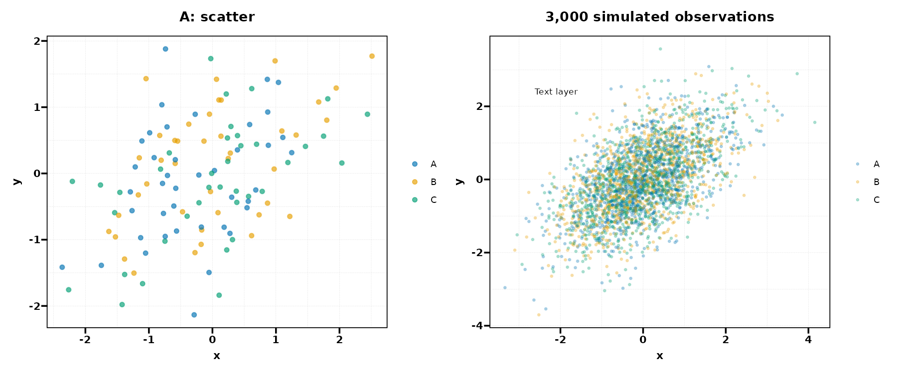{fig-alt="图形组合与导出：展平、grob、插图和栅格化；列表与原布局；固定模拟数据的实际参数对照结果。"}

:::

## 固定面板尺寸与导出

::: {.panel-tabset}

### ragg 固定英寸面板 {.unnumbered}

固定的是面板 4×3 英寸，图例和轴另占空间；返回包装的 patchwork，而不是原始散点 ggplot。

```r
p <- fmt_raster(dense, method = "ragg", dpi = 150, width = 4, height = 3, units = "in")
p
```

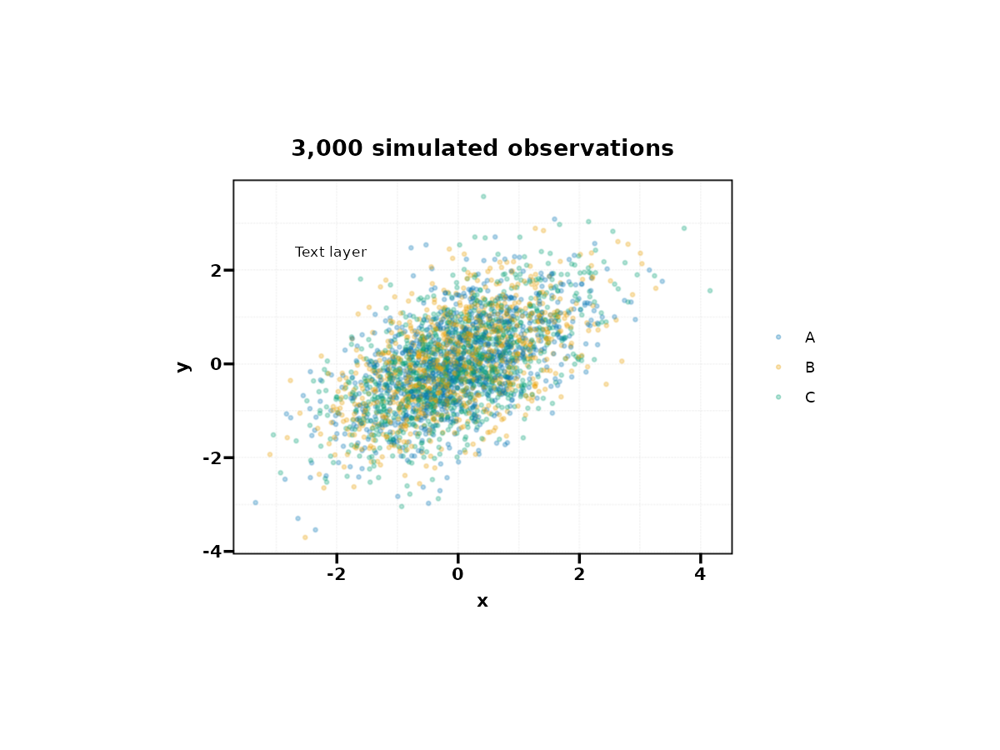{fig-alt="图形组合与导出：展平、grob、插图和栅格化；ragg 固定英寸面板；固定模拟数据的实际参数对照结果。"}

### 厘米和面板背景 {.unnumbered}

先把原面板背景设透明，再指定位图底色；厘米单位、面板底色和整张页面背景分别控制。

```r
p <- dense + theme(panel.background = element_rect(fill = "transparent", color = NA))
fmt_raster(p, method = "ragg", dpi = 300, width = 11, height = 8,
           units = "cm", bg = "#F2F6FA")
```

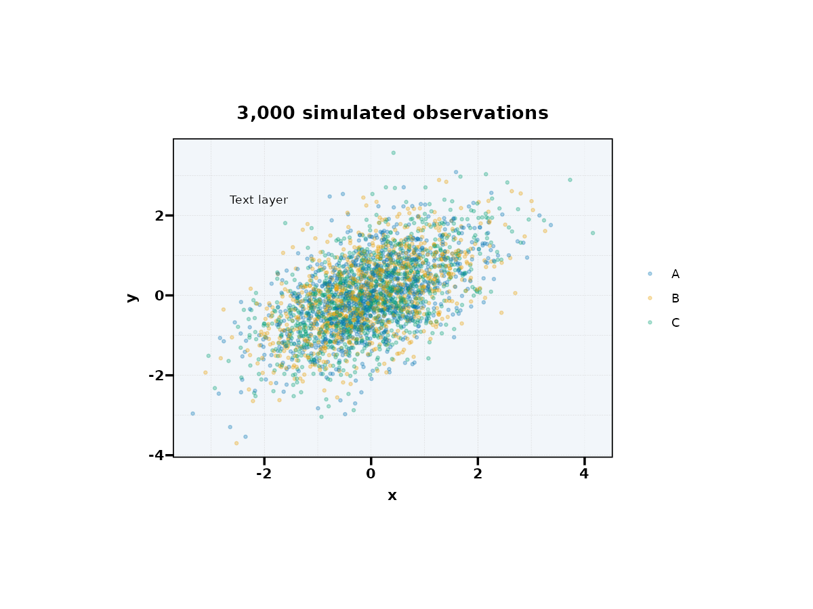{fig-alt="图形组合与导出：展平、grob、插图和栅格化；厘米和面板背景；固定模拟数据的实际参数对照结果。"}

### 完整多图先转 gtable {.unnumbered}

两个实际面板可给两个尺寸；先完整转 gtable，避免 grob_as 的 patchwork 转换遗漏子图。

```r
gt <- patchwork::patchworkGrob(p1 | p3)
p <- fmt_raster(gt, method = "ragg", dpi = 150,
                width = c(3.2, 2.5), height = c(3, 3), units = "in")
p
```

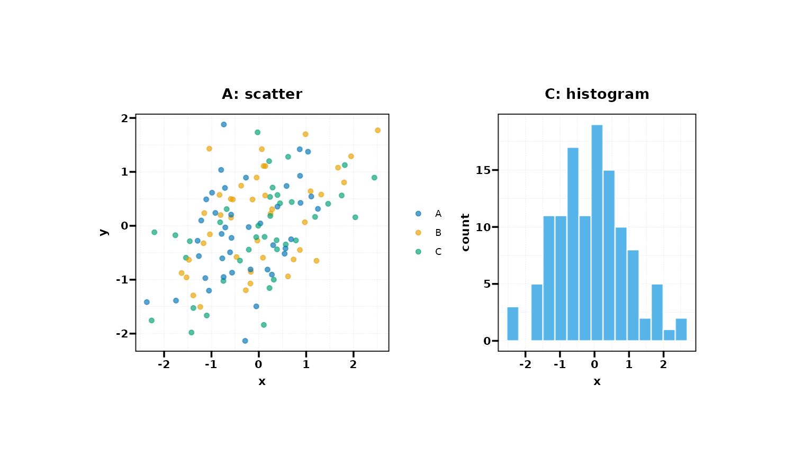{fig-alt="图形组合与导出：展平、grob、插图和栅格化；完整多图先转 gtable；固定模拟数据的实际参数对照结果。"}

### 按返回总尺寸保存 {.unnumbered}

按整张图的 size 属性导出实际 PDF，图宽高会大于面板宽高；避免把两个尺寸合同混为一谈。

```r
p <- fmt_raster(dense, method = "ragg", dpi = 150, width = 4, height = 3)
sz <- attr(p, "size")
pdf_path <- file.path(tempdir(), "utilsr-fixed-panel.pdf")
ggsave(pdf_path, p, width = sz[["width"]], height = sz[["height"]], units = sz[["units"]], bg = "white")
data.frame(plot_width = sz[["width"]], plot_height = sz[["height"]], units = sz[["units"]],
           pdf_exists = file.exists(pdf_path), bytes = file.info(pdf_path)[["size"]])
```

| plot_width| plot_height|units |pdf_exists |  bytes|
|----------:|-----------:|:-----|:----------|------:|
|     5.3698|        3.93|in    |TRUE       | 206841|

:::

## 真实文件与当前边界

::: {.panel-tabset}

### 实际 PDF 字节对照 {.unnumbered}

同一画布实际生成矢量和三档 dpi 的 PDF；本例体积随 dpi 改变，不能承诺所有图都更小。75 dpi 用于展示代价，需按最终用途选择清晰度。

```r
vector_pdf <- file.path(tempdir(), "utilsr-vector.pdf")
ggsave(vector_pdf, dense, width = 7, height = 5, device = "pdf")
dpis <- c(75, 150, 300)
raster_pdfs <- file.path(tempdir(), paste0("utilsr-raster-", dpis, ".pdf"))
for (i in seq_along(dpis)) {
  ggsave(raster_pdfs[i], fmt_raster(dense, dpi = dpis[i]), width = 7, height = 5, device = "pdf")
}
paths <- c(vector_pdf, raster_pdfs)
data.frame(output = c("Vector points", paste("Raster points:", dpis, "dpi")),
           bytes = file.info(paths)[["size"]], files_exist = file.exists(paths))
```

|output                 |  bytes|files_exist |
|:----------------------|------:|:-----------|
|Vector points          | 180828|TRUE        |
|Raster points: 75 dpi  |  82469|TRUE        |
|Raster points: 150 dpi | 250316|TRUE        |
|Raster points: 300 dpi | 779367|TRUE        |

### 当前 ggrastr 层匹配接口 {.unnumbered}

UtilsR 的 ggrastr 后端未传 layers，自身没有该参数；本表按当前依赖方法签名核对默认匹配范围。

```r
print(args(utils::getFromNamespace("rasterise.ggplot", "ggrastr")))
```

```text
function (input, ..., layers = c("Point", "Tile"), dpi = NULL,
    dev = "cairo", scale = 1)
NULL
```

### 两种列表边界 {.unnumbered}

当前 flatten_patchwork 的递归入口和 ragg 后端不能直接处理普通 list；使用 wrap_plots 或逐图调用，再按需要组合。

```r
messages <- c(
  tryCatch(flatten_patchwork(list(p1, p2)), error = conditionMessage),
  tryCatch(fmt_raster(list(p1, p2), method = "ragg", width = 3, height = 3), error = conditionMessage))
cat(paste(seq_along(messages), messages, sep = ". ", collapse = "\n"))
```

```text
1. Only know how to add <ggplot> and/or <grob> objects
2. Cannot convert input to a gtable.
```

:::

## 返回对象、保存与使用边界 {#output}

flatten_patchwork 返回 patchwork；grob_as 返回 grob/gtable；grob_add 与 grob_insert 返回 gtable，可用 grid.draw，或 grob_to_gg 包装后保存。grob_to_gg 不恢复原始 ggplot 数据层结构。

当前 grob_as(patchwork) 复用 ggplotGrob，实测会遗漏组合子图；先用 patchwork::patchworkGrob 完整转换，再交给 UtilsR 的 grob 工具或 ragg 后端。grob_add 的对齐位置取面板布局行列的均值，多面板时不能保证对每个面板分别对齐，本页边缘组件只用单面板。

ggrastr 后端继承当前依赖的默认 layers 匹配，未向所有 geom 无差别栅格化；可查看本页实际方法签名。ragg 后端以面板子 grob 名称、class、viewport 等启发式保留文字，并非任意注释都保证矢量。两者都应在最终 PDF 的所需放大倍率检查可读性。

本页 PNG 只用于显示结果，真实临时 PDF 用于核对生成、尺寸和字节。默认调用不保存；实际保存均写入 tempdir，没有在用户工作目录留下临时文件。只改变组合和绘制过程，未新增模型或改变统计估计。

## 当前完整接口 {#interfaces}

点击展开查看本次实际执行版本的参数及默认值。

<details>
<summary>公共函数签名</summary>

```r
flatten_patchwork <-
function (plots, ..., select_inds = NULL, nrow_inds_order = NULL)
NULL

grob_as <-
function (plot, ...)
NULL

grob_add <-
function (plot, grob, position = c("top", "bottom", "left", "right", "none"), space = NULL,
    clip = "on")
NULL

grob_insert <-
function (plot, inset, left = 0.6, bottom = 0.6, right = 1, top = 1, align_to = c("panel",
    "plot", "full"), on_top = TRUE, clip = TRUE)
NULL

grob_to_gg <-
function (grob, ...)
NULL

fmt_raster <-
function (plot, method = c("ggrastr", "ragg"), dpi = 300, width = NULL, height = NULL, units = c("in",
    "cm", "mm"), dev = "ragg", bg = "transparent")
NULL

```

</details>

## 验证范围与参考 {#references}

全部代码在 WSL R 中实际运行，展示图完成构建或设备绘制与 PNG 导出；另外核对展平顺序、索引选择、grob 返回类型、两后端输入边界及真实临时 PDF 的尺寸和字节。未修改 UtilsR 源码。

本次绘制出现的提示记录如下；对应示例仍通过实际构建和导出检查。

<details>
<summary>绘图提示</summary>

- `Cannot convert object of class 'list' into a grob.`

</details>

- [UtilsR 函数参考](https://hui950319.github.io/UtilsR/reference/index.html)
- [UtilsR 源码](https://github.com/HUI950319/UtilsR/tree/main/R)
- [专题目录](index.qmd)

<details>
<summary>执行环境</summary>

```text
R version 4.4.3 (2025-02-28)
Platform: x86_64-pc-linux-gnu
Running under: Ubuntu 22.04.2 LTS

Matrix products: default
BLAS:   /usr/lib/x86_64-linux-gnu/openblas-pthread/libblas.so.3
LAPACK: /usr/lib/x86_64-linux-gnu/openblas-pthread/libopenblasp-r0.3.20.so;  LAPACK version 3.10.0

locale:
 [1] LC_CTYPE=C.UTF-8       LC_NUMERIC=C           LC_TIME=C.UTF-8        LC_COLLATE=C.UTF-8
 [5] LC_MONETARY=C.UTF-8    LC_MESSAGES=C.UTF-8    LC_PAPER=C.UTF-8       LC_NAME=C
 [9] LC_ADDRESS=C           LC_TELEPHONE=C         LC_MEASUREMENT=C.UTF-8 LC_IDENTIFICATION=C

time zone: Asia/Shanghai
tzcode source: system (glibc)

attached base packages:
[1] stats     graphics  grDevices utils     datasets  methods   base

other attached packages:
[1] patchwork_1.3.2 ggplot2_4.0.3   UtilsR_0.6.8

loaded via a namespace (and not attached):
 [1] gtable_0.3.6       jsonlite_2.0.0     dplyr_1.2.0        compiler_4.4.3     tidyselect_1.2.1
 [6] Rcpp_1.1.1         ggbeeswarm_0.7.3   dichromat_2.0-0.1  systemfonts_1.1.0  scales_1.4.0
[11] textshaping_0.4.0  R6_2.6.1           labeling_0.4.3     generics_0.1.4     knitr_1.51
[16] httr2_1.2.2        ggrepel_0.9.8      tibble_3.3.1       ellmer_0.4.0       pillar_1.11.1
[21] RColorBrewer_1.1-3 rlang_1.3.0        xfun_0.57          S7_0.2.2           otel_0.2.0
[26] cli_3.6.6          withr_3.0.3        magrittr_2.0.4     digest_0.6.39      grid_4.4.3
[31] rappdirs_0.3.4     beeswarm_0.4.0     lifecycle_1.0.5    vipor_0.4.7        ggrastr_1.0.2
[36] coro_1.1.0         vctrs_0.7.3        evaluate_1.0.5     ggprism_1.0.7      glue_1.8.1
[41] farver_2.1.2       ragg_1.5.2         tools_4.4.3        pkgconfig_2.0.3    mcptools_0.2.1
```

</details>
