plt_con 的四种图形、箱线与原始点叠加、统计标注、纵轴观察窗和多变量布局。各节用固定输入比较重要参数，标签页中展示可复制代码与实际结果。

**版本与执行范围：** 本页按 UtilsR **0.6.8** 的公共接口核对；23 个示例已在 WSL R 4.4.3 中实际执行，其中 23 张图已完成构建与 PNG 导出。使用固定随机种子的模拟数据。

## 数据准备与输入约定 {#data}

所有示例使用下列模拟数据，因子水平显式固定，重复执行可得到相同输入。

```r
library(UtilsR)
library(ggplot2)
library(patchwork)
set.seed(1002)
dat <- data.frame(group = factor(rep(c("A", "B", "C"), each = 60)),
                  batch = factor(rep(c("Batch 1", "Batch 2"), 90)))
dat[["marker1"]] <- rnorm(180, rep(c(5, 6.5, 8), each = 60), 1.4)
dat[["marker2"]] <- rnorm(180, rep(c(12, 15, 13), each = 60), 2.5)
dat[["region"]] <- factor(ifelse(dat[["group"]] == "C", "R2", "R1"))
```

## 函数选择与重要参数 {#parameters}

| 目标 | 参数及默认值 | 作用与适用范围 |
|:--|:--|:--|
| 图形 | `type = "violin"` | `violin/box/bar/dot`；柱形为均值及 SD，不是完整分布 |
| 统计和分组 | `stat.by`、`group.by = NULL` | 多个数值变量可共同输入；列名用字符向量 |
| 分层与填色 | `split.by = NULL`、`fill.by = "group"` | 可改按 `"feature"` 填色；分层后各层独立作图 |
| 箱线叠加 | `add_box = FALSE`、`box_width = 0.1` | 配合小提琴展示分位数；`box_color` 控制边框 |
| 点叠加 | `add_point = FALSE` | `pt.size/pt.alpha/pt.color`、`jitter.width/height` 和 `seed = 11` 控制点层 |
| 趋势 | `add_trend = FALSE` | 小提琴/箱线连接中位数；柱形连接均值，点图分支不使用 |
| 两两比较 | `comparisons = NULL`、`pairwise_method = "wilcox.test"` | 长度为 2 的组名向量 list；可改 `"t.test"` |
| 整体比较 | `multiplegroup_comparisons = FALSE`、`multiple_method = "kruskal.test"` | 展示整体检验；不等于两两比较 |
| 标签 | `sig_label = "p.signif"`、`sig_labelsize = 3.5` | 可用 `"p.format"` 显示数值 |
| 纵轴 | `same.y.lims = FALSE`、`y.min/y.max = NULL` | 数字或 `"qN"` 百分位控制观察窗，`y.nbreaks = 5` 控制刻度 |
| 水平顺序 | `sort = FALSE` | `TRUE/"decreasing"` 降序中位数，`"increasing"` 升序；从当前数据计算 |
| 布局 | `stack = FALSE`、`flip = FALSE`、`facet_nrow/ncol` | 多变量叠放、横向及组合排版 |
| 返回结构 | `combine = TRUE` | `FALSE` 返回命名图列表，适合外部自行排版 |
| 背景和主题 | `bg.by`、`bg_palette`、`bg_alpha = 0.15`、`base_size = 14` | 背景归属必须与分组兼容；主题和配色不改变检验数据 |

## 四种基础图形

::: {.panel-tabset}

### 小提琴 {.unnumbered}

小提琴展示平滑分布；宽度被标准化，不代表组内人数。

```r
plt_con(dat, "marker1", "group")
```

{fig-alt="连续变量：分布、统计比较与多面板布局；小提琴；固定模拟数据的实际参数对照结果。"}

### 箱线 {.unnumbered}

箱线展示中位数和分位数，离群点仍来自原始输入。

```r
plt_con(dat, "marker1", "group", type = "box")
```

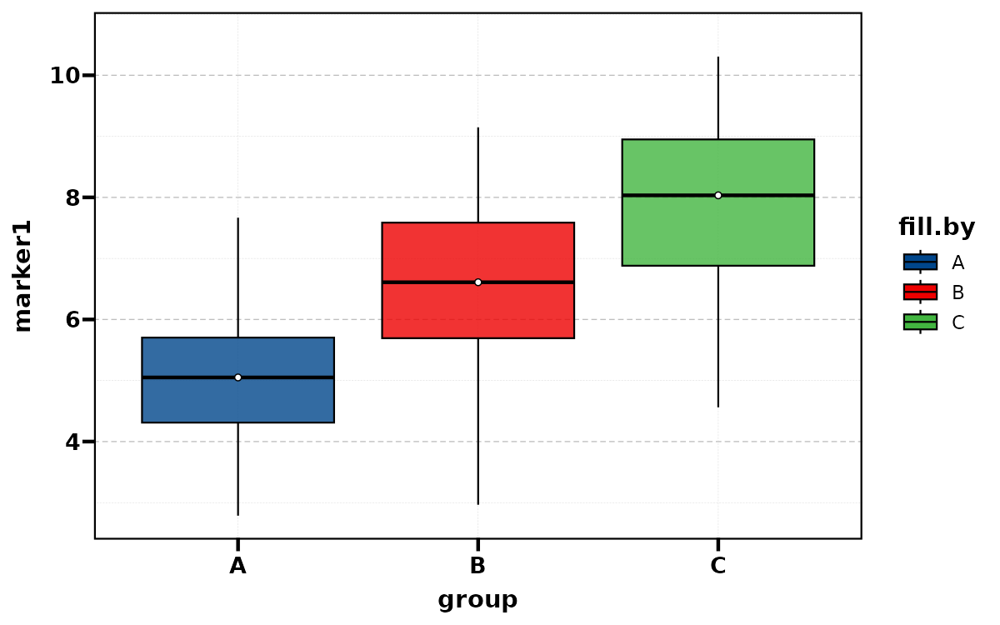{fig-alt="连续变量：分布、统计比较与多面板布局；箱线；固定模拟数据的实际参数对照结果。"}

### 均值与 SD {.unnumbered}

柱形为均值，误差线来自 mean_sdl(mult=1)，为均值加减一个 SD；不是 SE 或 95% CI。

```r
plt_con(dat, "marker1", "group", type = "bar")
```

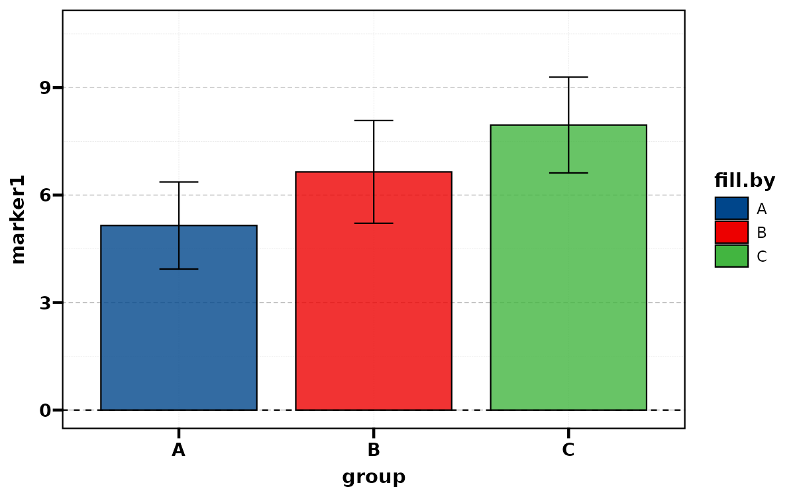{fig-alt="连续变量：分布、统计比较与多面板布局；均值与 SD；固定模拟数据的实际参数对照结果。"}

### 点图 {.unnumbered}

当前点图按数值分箱后，以箱中点定位气泡、大小表达箱内频数；不能把气泡位置当作未经分箱的原始观测值。

```r
plt_con(dat, "marker1", "group", type = "dot", pt.size = 1.5, pt.alpha = 0.65)
```

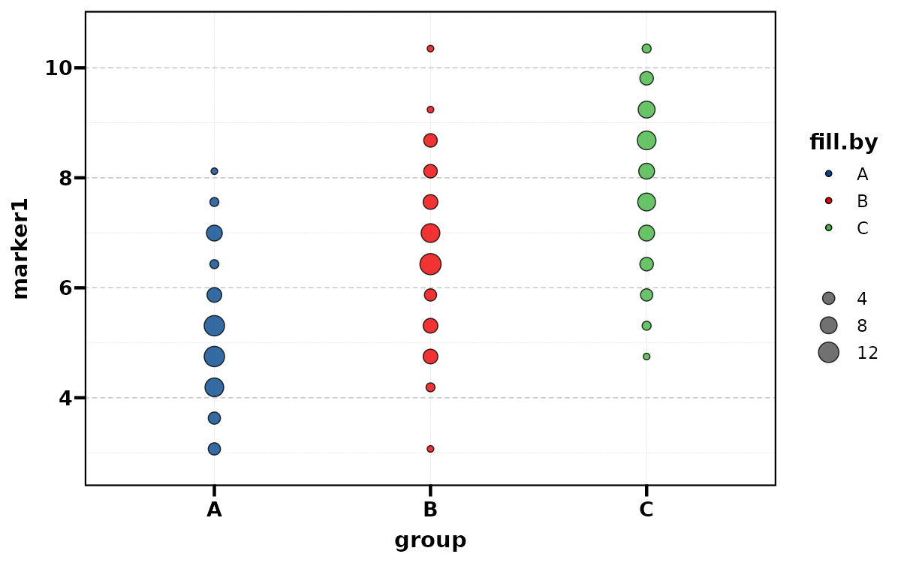{fig-alt="连续变量：分布、统计比较与多面板布局；点图；固定模拟数据的实际参数对照结果。"}

:::

## 分布叠加与趋势

::: {.panel-tabset}

### 叠加箱线 {.unnumbered}

同一份数据叠加分位数摘要，箱线宽度单独控制。

```r
plt_con(dat, "marker1", "group", add_box = TRUE,
        box_width = 0.16, box_color = "#333333")
```

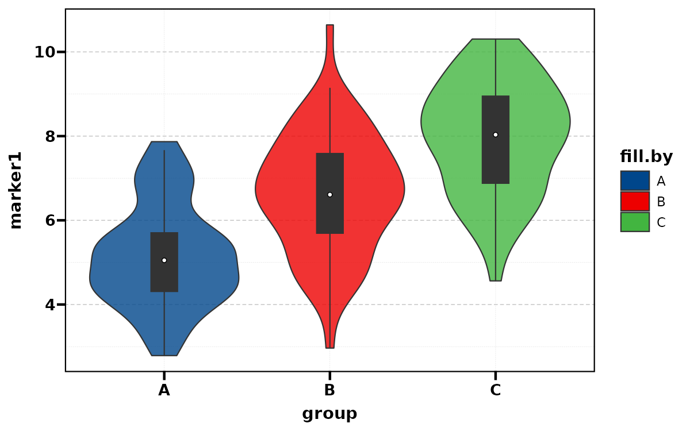{fig-alt="连续变量：分布、统计比较与多面板布局；叠加箱线；固定模拟数据的实际参数对照结果。"}

### 叠加原始点 {.unnumbered}

纵向抖动设为零，保持真实纵轴数值；横向抖动只减少遮挡。

```r
plt_con(dat, "marker1", "group", add_point = TRUE,
        pt.size = 1.5, pt.alpha = 0.4, pt.color = "#333333",
        jitter.width = 0.18, jitter.height = 0, seed = 24)
```

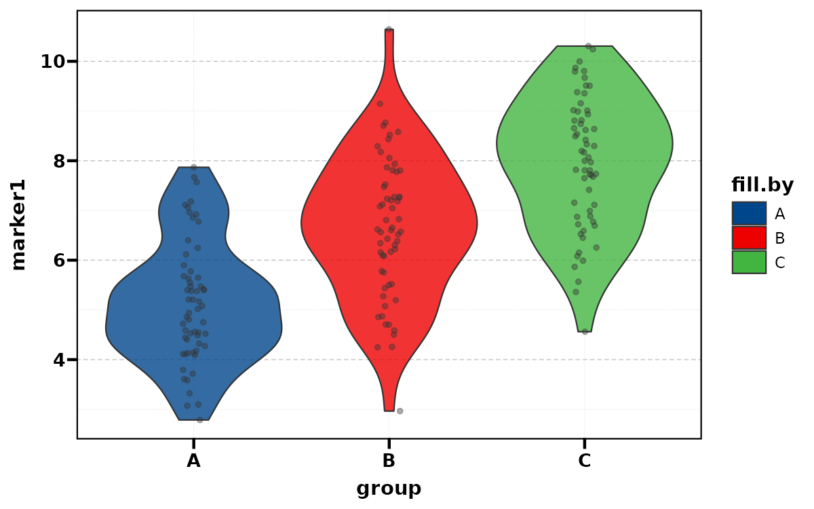{fig-alt="连续变量：分布、统计比较与多面板布局；叠加原始点；固定模拟数据的实际参数对照结果。"}

### 箱线、点与小提琴 {.unnumbered}

三个图层分别提供平滑分布、分位数和原始观测信息。

```r
plt_con(dat, "marker1", "group", add_box = TRUE, add_point = TRUE,
        box_width = 0.15, pt.alpha = 0.35, jitter.width = 0.15, jitter.height = 0)
```

{fig-alt="连续变量：分布、统计比较与多面板布局；箱线、点与小提琴；固定模拟数据的实际参数对照结果。"}

### 连接中位数 {.unnumbered}

箱线分支连接各组中位数；A/B/C 为分组顺序，不自动具有时间含义。

```r
plt_con(dat, "marker1", "group", type = "box", add_trend = TRUE,
        trend_color = "#111111", trend_linewidth = 0.8, trend_ptsize = 3)
```

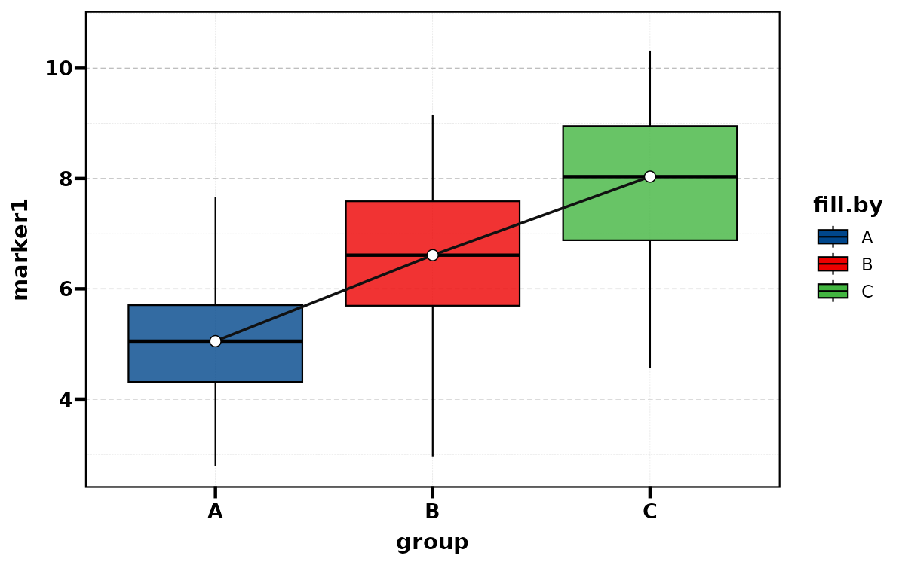{fig-alt="连续变量：分布、统计比较与多面板布局；连接中位数；固定模拟数据的实际参数对照结果。"}

### 连接均值 {.unnumbered}

柱形分支连接均值，与上一标签页的中位数不是同一统计量。

```r
plt_con(dat, "marker1", "group", type = "bar", add_trend = TRUE)
```

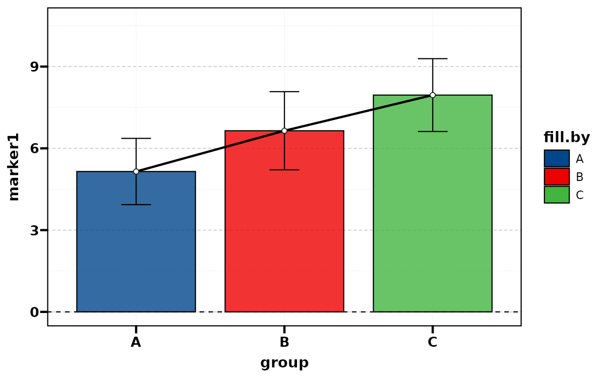{fig-alt="连续变量：分布、统计比较与多面板布局；连接均值；固定模拟数据的实际参数对照结果。"}

:::

## 统计比较

::: {.panel-tabset}

### 指定比较组 {.unnumbered}

明确列出两个比较，展示数值 P 值；本页未声称这些标注经过多重性校正。

```r
plt_con(dat, "marker1", "group", type = "box",
        comparisons = list(c("A", "B"), c("A", "C")),
        pairwise_method = "wilcox.test", sig_label = "p.format")
```

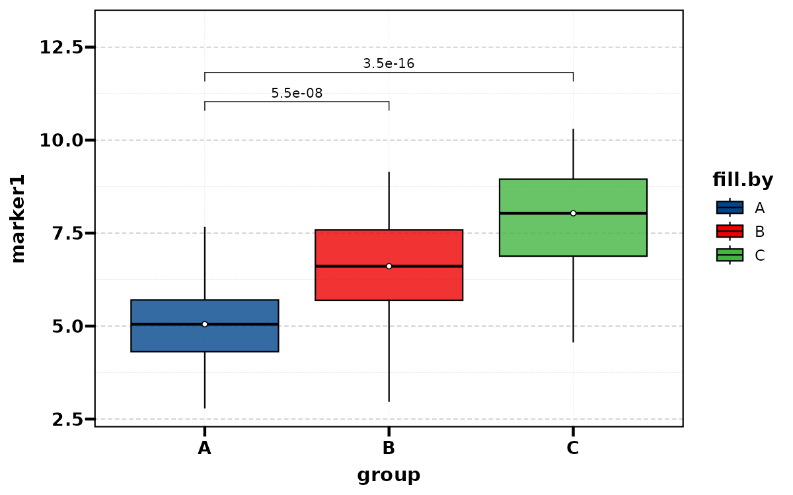{fig-alt="连续变量：分布、统计比较与多面板布局；指定比较组；固定模拟数据的实际参数对照结果。"}

### 更换两样本检验 {.unnumbered}

相同模拟数据改用 t 检验；当前接口没有配对标识，应按独立组示例理解。

```r
plt_con(dat, "marker1", "group", type = "box",
        comparisons = list(c("A", "B")), pairwise_method = "t.test",
        sig_label = "p.format", sig_labelsize = 4)
```

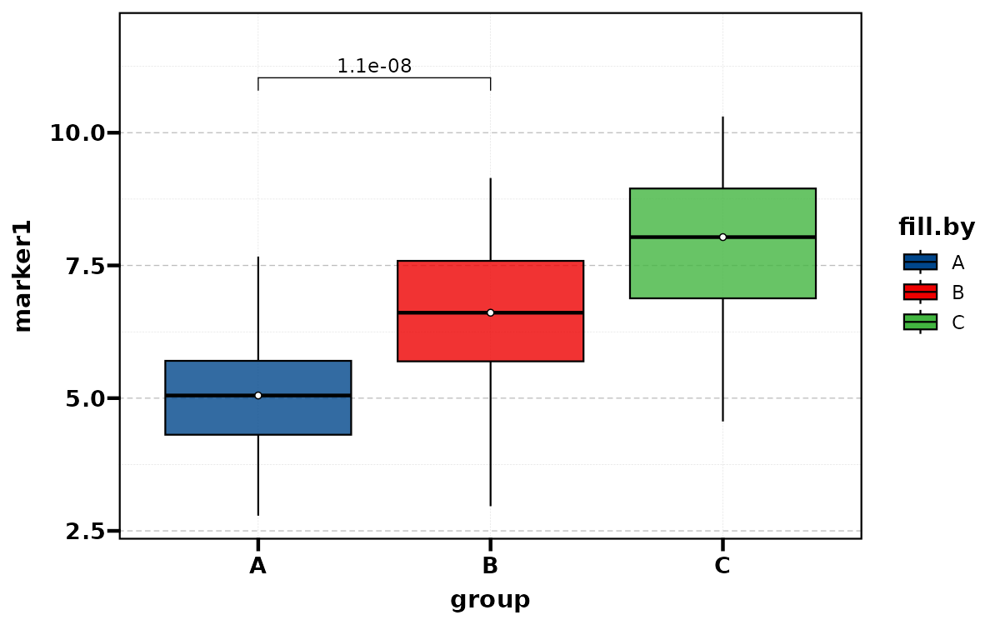{fig-alt="连续变量：分布、统计比较与多面板布局；更换两样本检验；固定模拟数据的实际参数对照结果。"}

### 整体 Kruskal 检验 {.unnumbered}

整体检验回答三组是否有总体差异，不能据此认定每对组都不同。

```r
plt_con(dat, "marker1", "group", type = "box",
        multiplegroup_comparisons = TRUE, multiple_method = "kruskal.test",
        sig_label = "p.format")
```

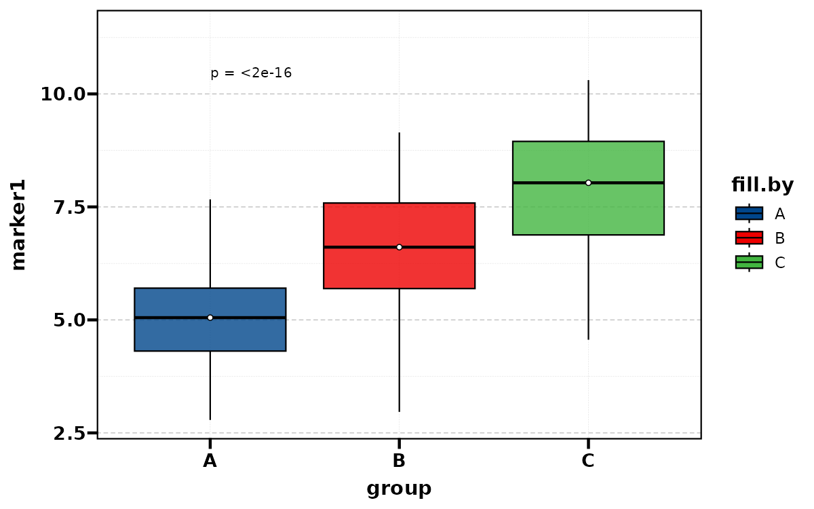{fig-alt="连续变量：分布、统计比较与多面板布局；整体 Kruskal 检验；固定模拟数据的实际参数对照结果。"}

### 星号标签 {.unnumbered}

星号表达当前检验阈值；需要精确读值时使用 p.format。

```r
plt_con(dat, "marker1", "group", type = "box",
        comparisons = list(c("A", "B"), c("B", "C")), sig_label = "p.signif")
```

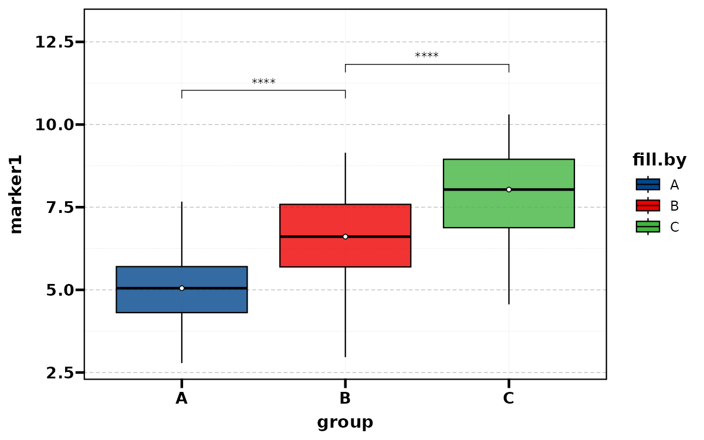{fig-alt="连续变量：分布、统计比较与多面板布局；星号标签；固定模拟数据的实际参数对照结果。"}

:::

## 纵轴、排序与背景

::: {.panel-tabset}

### 百分位观察窗 {.unnumbered}

这里使用坐标观察窗，窗外数据仍参与箱线计算；图上不可见不等于被删除。

```r
plt_con(dat, "marker1", "group", type = "box", add_point = TRUE,
        y.min = "q5", y.max = "q95", y.nbreaks = 4, jitter.height = 0)
```

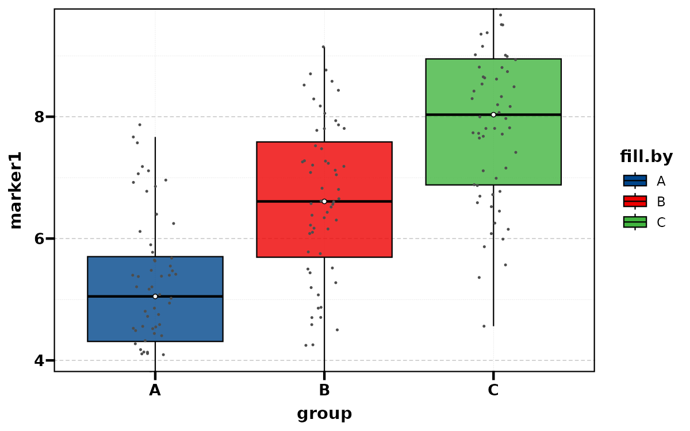{fig-alt="连续变量：分布、统计比较与多面板布局；百分位观察窗；固定模拟数据的实际参数对照结果。"}

### 固定范围 {.unnumbered}

固定刻度范围适合多张图间比较；范围应与变量单位一致。

```r
plt_con(dat, "marker1", "group", type = "box", y.min = 0, y.max = 12, y.nbreaks = 7)
```

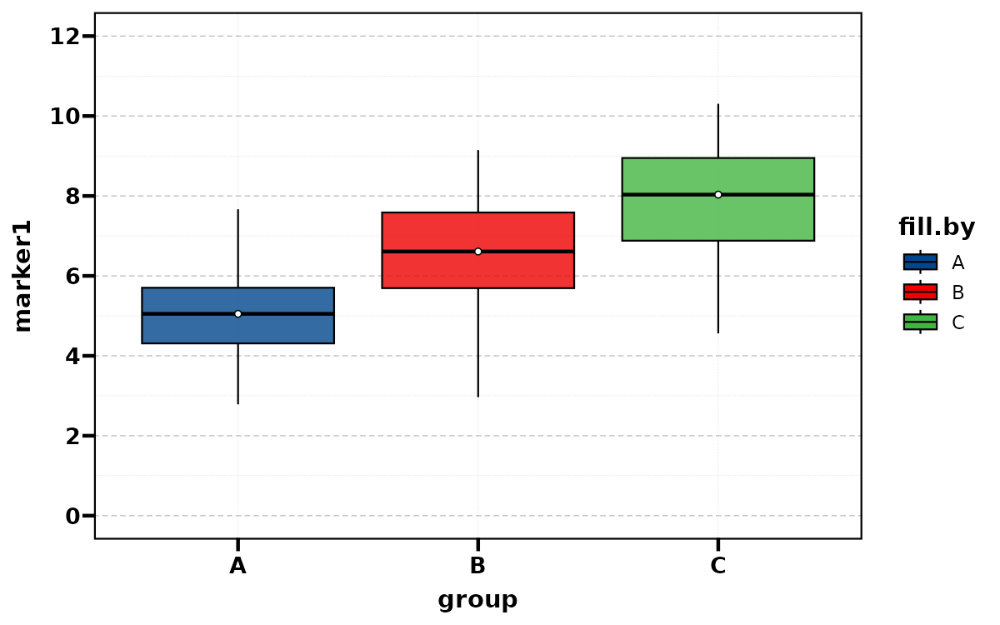{fig-alt="连续变量：分布、统计比较与多面板布局；固定范围；固定模拟数据的实际参数对照结果。"}

### 按中位数排序 {.unnumbered}

组别按当前中位数降序排列，横向展示；并未改变组内数值。

```r
plt_con(dat, "marker1", "group", type = "box", sort = "decreasing", flip = TRUE)
```

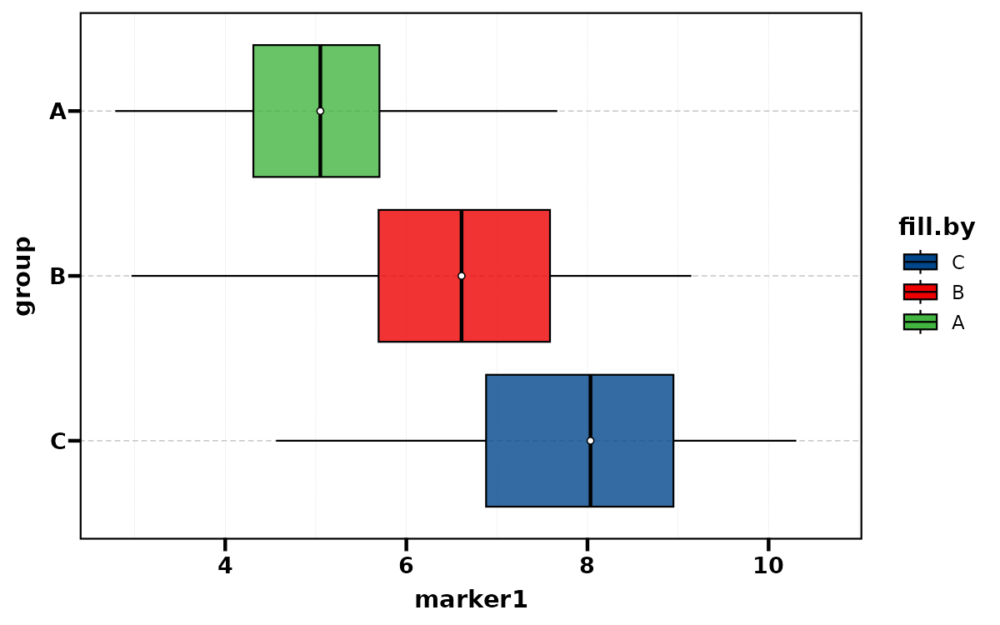{fig-alt="连续变量：分布、统计比较与多面板布局；按中位数排序；固定模拟数据的实际参数对照结果。"}

### 背景归属 {.unnumbered}

A/B 和 C 的背景归属不同；背景分组和观测值填色分别控制。

```r
plt_con(dat, "marker1", "group", type = "box", bg.by = "region",
        bg_palette = c("#EEF3FA", "#FFF4DC"), bg_alpha = 0.4)
```

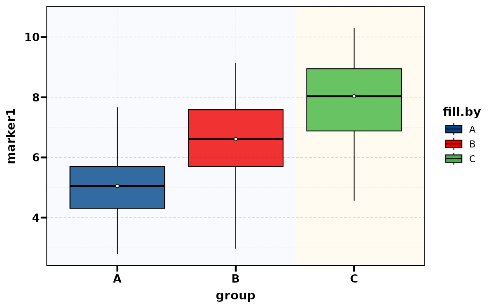{fig-alt="连续变量：分布、统计比较与多面板布局；背景归属；固定模拟数据的实际参数对照结果。"}

:::

## 多变量与分层布局

::: {.panel-tabset}

### 各自纵轴 {.unnumbered}

不同面板各自定标，有利于观察各变量内部差异，不能直接比较图上高度。

```r
plt_con(dat, c("marker1", "marker2"), "group", type = "box",
        same.y.lims = FALSE, facet_ncol = 2)
```

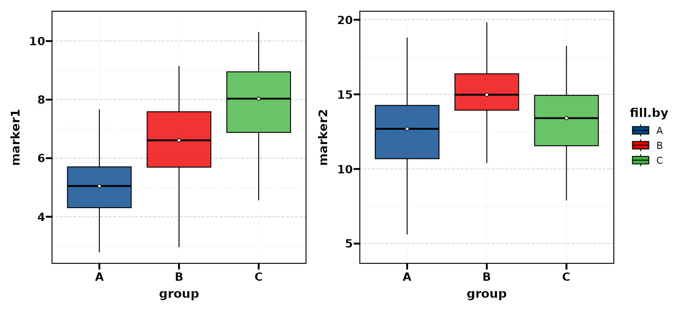{fig-alt="连续变量：分布、统计比较与多面板布局；各自纵轴；固定模拟数据的实际参数对照结果。"}

### 共享纵轴 {.unnumbered}

同样数值在两面板使用同一纵轴范围；真实项目还须确认两个变量的单位可比。

```r
plt_con(dat, c("marker1", "marker2"), "group", type = "box",
        same.y.lims = TRUE, facet_ncol = 2)
```

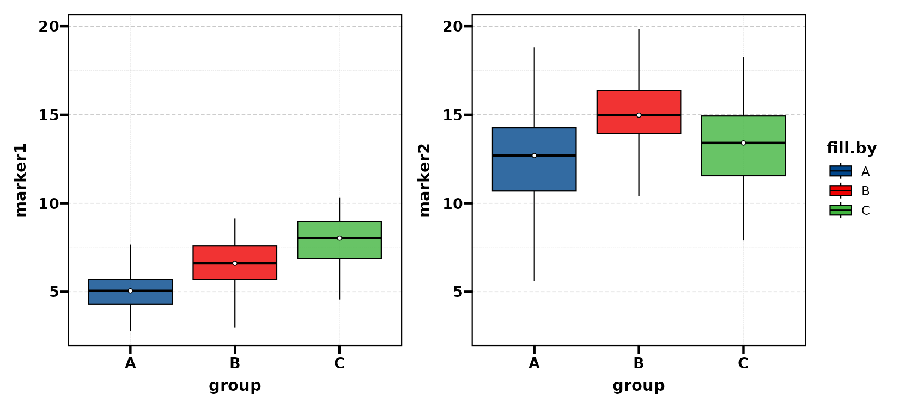{fig-alt="连续变量：分布、统计比较与多面板布局；共享纵轴；固定模拟数据的实际参数对照结果。"}

### 按变量填色 {.unnumbered}

fill.by 改为 feature 后颜色识别变量，分组仍由横轴给出。

```r
plt_con(dat, c("marker1", "marker2"), "group", type = "box",
        fill.by = "feature", facet_ncol = 2, palette = c("#0072B2", "#E69F00"))
```

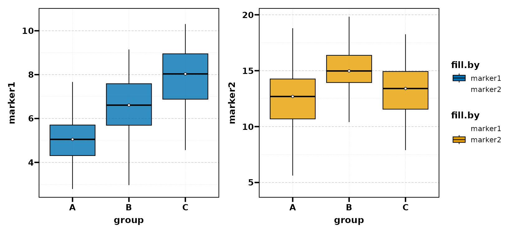{fig-alt="连续变量：分布、统计比较与多面板布局；按变量填色；固定模拟数据的实际参数对照结果。"}

### 叠放面板 {.unnumbered}

stack 将多个变量组织为上下分面；纵轴规则按当前实现与结果图核对。

```r
plt_con(dat, c("marker1", "marker2"), "group", type = "box",
        stack = TRUE, fill.by = "feature")
```

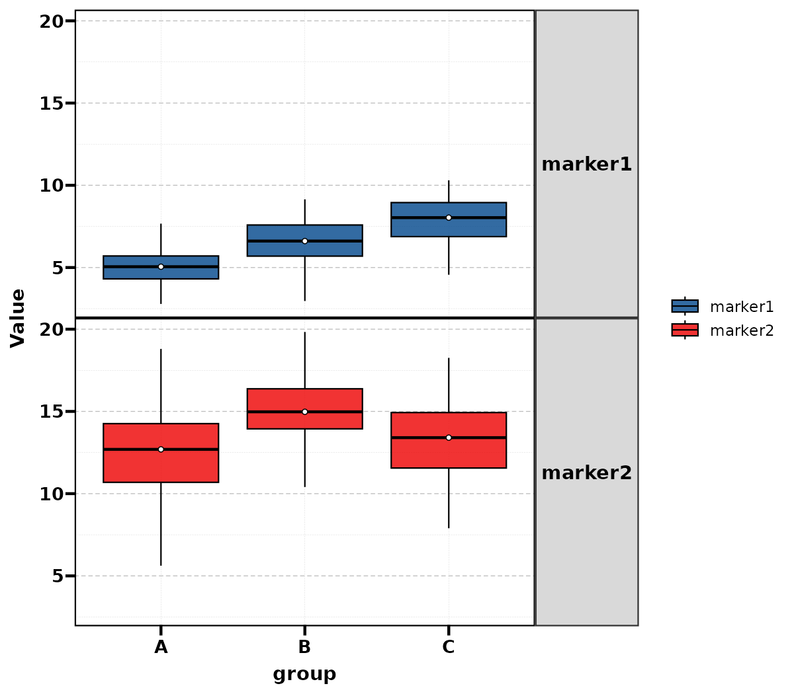{fig-alt="连续变量：分布、统计比较与多面板布局；叠放面板；固定模拟数据的实际参数对照结果。"}

### 按批次分层 {.unnumbered}

每层只使用对应 batch 的观测；共享范围方便比较分层图。

```r
plt_con(dat, "marker1", "group", split.by = "batch", type = "box",
        same.y.lims = TRUE, facet_ncol = 2)
```

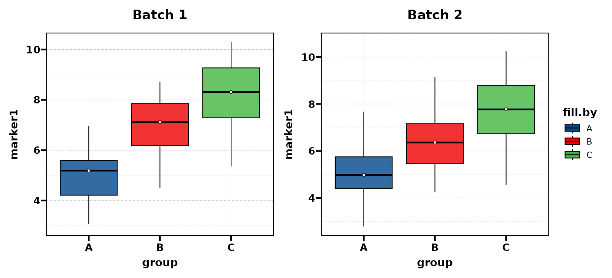{fig-alt="连续变量：分布、统计比较与多面板布局；按批次分层；固定模拟数据的实际参数对照结果。"}

### 返回列表再排版 {.unnumbered}

combine=FALSE 返回命名图列表；可以用 wrap_plots 独立控制最终排版。

```r
plots <- plt_con(dat, c("marker1", "marker2"), "group", type = "box", combine = FALSE)
patchwork::wrap_plots(plots, ncol = 1)
```

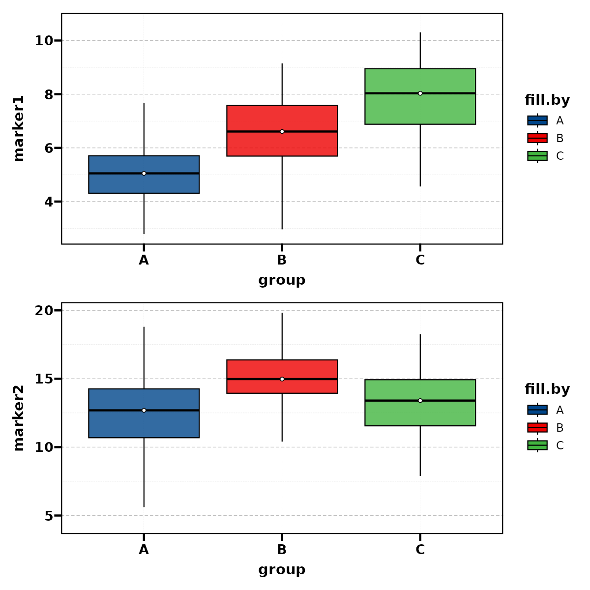{fig-alt="连续变量：分布、统计比较与多面板布局；返回列表再排版；固定模拟数据的实际参数对照结果。"}

:::

## 返回对象、保存与使用边界 {#output}

`combine = TRUE` 返回 ggplot/patchwork；`FALSE` 返回命名图列表。`plt_con()` 当前没有 `save` 参数，可外部导出：

```r
p <- plt_con(dat, "marker1", "group", type = "box")
# ggplot2::ggsave("marker-box.pdf", p, width = 8, height = 5)
```

当前标注调用 ggpubr，展示层不能替代研究设计、模型调整或多重检验处理。`ref_group` 和 `comparisons` 的组合以具体 ggpubr 版本为准；本页演示采用显式比较对。缺失或非有限值会在对应变量分支去除。

## 当前完整接口 {#interfaces}

点击展开查看本次实际执行版本的参数及默认值。

<details>
<summary>公共函数签名</summary>

```r
plt_con <-
function (data, stat.by, group.by = NULL, split.by = NULL, bg.by = NULL, type = c("violin",
    "box", "bar", "dot"), fill.by = c("group", "feature"), palette = NULL, alpha = 0.8, add_box = FALSE,
    box_color = "black", box_width = 0.1, add_point = FALSE, pt.color = "grey30", pt.size = NULL,
    pt.alpha = 1, jitter.width = 0.4, jitter.height = 0.1, add_trend = FALSE, trend_color = "black",
    trend_linewidth = 1, trend_ptsize = 2, comparisons = NULL, ref_group = NULL, pairwise_method = "wilcox.test",
    multiplegroup_comparisons = FALSE, multiple_method = "kruskal.test", sig_label = c("p.signif",
        "p.format"), sig_labelsize = 3.5, same.y.lims = FALSE, y.min = NULL, y.max = NULL,
    y.nbreaks = 5, sort = FALSE, stack = FALSE, flip = FALSE, title = NULL, subtitle = NULL,
    xlab = NULL, ylab = NULL, legend.position = "right", legend.direction = "vertical", aspect.ratio = NULL,
    base_size = 14, bg_palette = NULL, bg_alpha = 0.15, facet_nrow = NULL, facet_ncol = NULL,
    combine = TRUE, force = FALSE, seed = 11)
NULL

```

</details>

## 验证范围与参考 {#references}

本页列出的调用均已实际执行；所有展示的 ggplot/patchwork 图通过 `ggplot_build()` 和 PNG 导出，表格来自同一组代码的实际返回。未修改 UtilsR 源码或重新运行全包测试。

- [UtilsR 函数参考](https://hui950319.github.io/UtilsR/reference/index.html)
- [UtilsR 源码](https://github.com/HUI950319/UtilsR/tree/master/R)
- [专题目录](index.qmd)

<details>
<summary>执行环境</summary>

```text
R version 4.4.3 (2025-02-28)
Platform: x86_64-pc-linux-gnu
Running under: Ubuntu 22.04.2 LTS

Matrix products: default
BLAS:   /usr/lib/x86_64-linux-gnu/openblas-pthread/libblas.so.3
LAPACK: /usr/lib/x86_64-linux-gnu/openblas-pthread/libopenblasp-r0.3.20.so;  LAPACK version 3.10.0

locale:
 [1] LC_CTYPE=C.UTF-8       LC_NUMERIC=C           LC_TIME=C.UTF-8        LC_COLLATE=C.UTF-8
 [5] LC_MONETARY=C.UTF-8    LC_MESSAGES=C.UTF-8    LC_PAPER=C.UTF-8       LC_NAME=C
 [9] LC_ADDRESS=C           LC_TELEPHONE=C         LC_MEASUREMENT=C.UTF-8 LC_IDENTIFICATION=C

time zone: Asia/Shanghai
tzcode source: system (glibc)

attached base packages:
[1] stats     graphics  grDevices utils     datasets  methods   base

other attached packages:
[1] patchwork_1.3.2 ggplot2_4.0.3   UtilsR_0.6.8

loaded via a namespace (and not attached):
 [1] gtable_0.3.6       jsonlite_2.0.0     dplyr_1.2.0        compiler_4.4.3     tidyselect_1.2.1
 [6] Rcpp_1.1.1         dichromat_2.0-0.1  systemfonts_1.1.0  scales_1.4.0       textshaping_0.4.0
[11] R6_2.6.1           labeling_0.4.3     generics_0.1.4     httr2_1.2.2        ggrepel_0.9.8
[16] tibble_3.3.1       ellmer_0.4.0       pillar_1.11.1      RColorBrewer_1.1-3 rlang_1.3.0
[21] S7_0.2.2           otel_0.2.0         cli_3.6.6          withr_3.0.3        magrittr_2.0.4
[26] digest_0.6.39      grid_4.4.3         rappdirs_0.3.4     lifecycle_1.0.5    coro_1.1.0
[31] vctrs_0.7.3        ggprism_1.0.7      glue_1.8.1         farver_2.1.2       ragg_1.5.2
[36] tools_4.4.3        pkgconfig_2.0.3    mcptools_0.2.1
```

</details>
