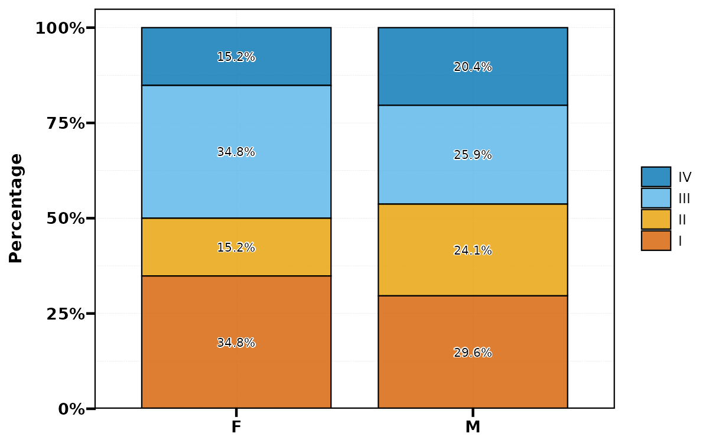
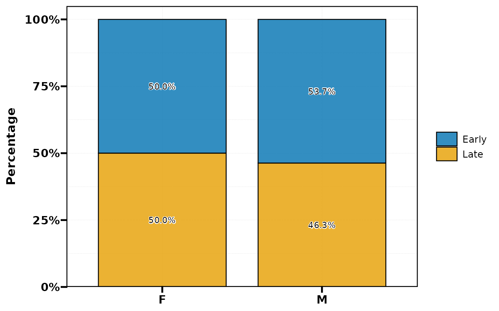
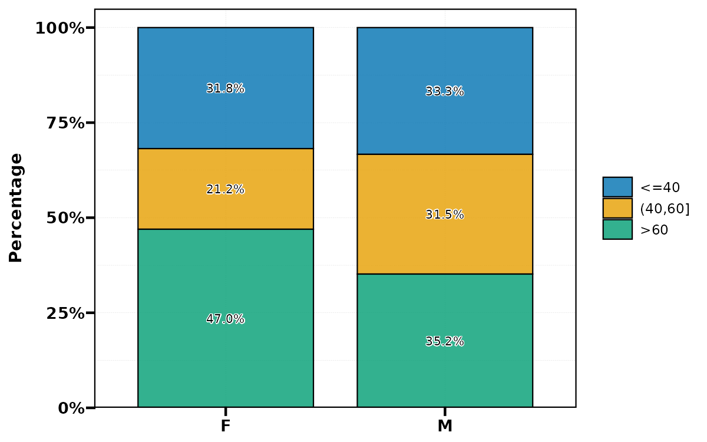

fct_cat 的互斥模式、临床水平顺序、固定与自动分箱、列组合与缺失，以及 CI/P 值的格式和边界。各节用固定输入比较重要参数，标签页中展示可复制代码与实际结果。

**版本与执行范围：** 本页按 UtilsR **0.6.8** 的公共接口核对；33 个示例已在 WSL R 4.4.3 中实际执行，其中 3 张图已完成构建与 PNG 导出。使用固定随机种子的模拟数据。

## 数据准备与输入约定 {#data}

stage 和 boundary 专门包含临床顺序、切点及 NA；dat 用固定随机种子模拟年龄、性别和分期。fct_show 是本页局部的水平计数展示 helper，不属于 UtilsR 接口。

```r
library(UtilsR)
library(ggplot2)
set.seed(1011)
stage <- factor(c("I", "II", "III", "IV", "I", "II", "III", "I", "III", "IV", "II", NA),
                levels = c("I", "II", "III", "IV"))
dat <- data.frame(stage = factor(sample(c("I", "II", "III", "IV"), 120, TRUE),
                                levels = c("I", "II", "III", "IV")),
                  sex = factor(sample(c("F", "M"), 120, TRUE), levels = c("F", "M")),
                  age = round(runif(120, 18, 80)))
boundary <- c(30, 40, 49.9, 50, 50.1, 60, 70, NA)
fct_show <- function(x) {
  data.frame(order = seq_along(levels(x)), level = levels(x), n = as.integer(table(x)))
}
pvals <- c(0.00003, 0.001, 0.01, 0.05, 0.1, 0.6, NA)
est <- c(1.2, 0.7, 1.5)
lo <- c(0.8, 0.4, 1.1)
hi <- c(1.6, 1, 1.9)
```

## 函数选择与重要参数 {#parameters}

| 目标 | 重要参数 | 语义与边界 |
|:--|:--|:--|
| 重排水平 | `fct_cat(x, ...)`，... 无名 | 名称或 1-based 整数位置，指定的先排，其余水平依原顺序追加 |
| 重编码或合并 | ... 全部命名，如 `Early=c("I","II")` | 名称是新水平，值是原水平名或原位置；未匹配水平保留 |
| 互斥模式 | `reverse=FALSE/binary_ref=NULL/groups=NULL/new_labels=NULL` | 一次只选其中一种；不同时命名和不命名 ... |
| 二分类 | `binary_ref` 为整数位置 | 参考水平合为原名称的下划线连接；其他水平统一 Oth |
| 分组列表 | `groups` 或 `fct_to_group(g_lis)` | groups 必须有名字；g_lis 可自动命名，name_prefix/name_sep 定义显示名 |
| 单纯换名 | `new_labels` 或 `fct_label(labels)` | 与当前水平数和顺序对应；不会根据字面意义推断临床顺序 |
| 数据框换名 | `fct_label(data,var,labels)` | var 支持裸列名或字符串，返回整个修改后的数据框，须接收返回值 |
| 固定分箱 | `fct_num(breaks,labels)` | 自动补 ±Inf，cut 采用右闭区间，切点属于下方那组；labels 数为切点数+1 |
| 自动分箱 | `nbins`、`type="quantile"/"equal"` | 与 breaks 互斥；quantile 等人数倾向、equal 等宽；重复分位点会减少实际组数 |
| 多列组合 | `fct_to_combine(vars,var_name=NULL,sep=" & ")` | 至少两列；默认新列名由原列名用下划线连接；水平遵循各输入因子顺序 |
| 缺失组合 | 输入 NA | 当前 paste 会将 NA 变成文字 NA，结果不是缺失因子；明确选择保留文字或恢复 NA |
| CI 与 SD | `stat_ci(x,y,z=NULL,digits,bracket,sep)` | 三个数值向量为估计和上下界，两个为均值与 SD；只格式化，未计算区间 |
| P 值显示 | `stat_pval(mode="stars"/"pvalue"/"plain",digits,map_signif)` | 阈值星号包含等于边界；digits 控制显示，不调整原始检验结果 |
| 外部星号 | `add_star_p` | 根据已有 P 值给任意字符追加星号；此时 digits 和 mode 不参与数字重格式化 |
| 区间解析 | `stat_ci_parse(output,exp,level,digits,map_signif)` | 默认把输入当 95% CI，exp=TRUE 采用 log 比值尺度；推算 P 值是正态近似 |

## 水平顺序与分类合并

::: {.panel-tabset}

### 原始顺序和人数 {.unnumbered}

顺序明确为 I→IV；汇总 table 不计 NA，下方缺失示例另行核对。

```r
fct_show(stage)
```

| order|level |  n|
|-----:|:-----|--:|
|     1|I     |  3|
|     2|II    |  3|
|     3|III   |  3|
|     4|IV    |  2|

### 字符默认顺序 {.unnumbered}

字符转因子默认字母顺序，High 会排在 Low 前；有临床含义时应先显式给水平。

```r
x <- c("Low", "High", "Middle", "Low")
data.frame(default = levels(fct_cat(x)),
           specified = levels(fct_cat(factor(x, levels = c("Low", "Middle", "High")))))
```

|default |specified |
|:-------|:---------|
|High    |Low       |
|Low     |Middle    |
|Middle  |High      |

### 按名称部分重排 {.unnumbered}

先 IV、I，未提到的 II、III 追加，原始观测值和人数不变。

```r
fct_show(fct_cat(stage, "IV", "I"))
```

| order|level |  n|
|-----:|:-----|--:|
|     1|IV    |  2|
|     2|I     |  3|
|     3|II    |  3|
|     4|III   |  3|

### 按位置重排 {.unnumbered}

1-based 位置对应当前 levels(stage)，与上一个名称调用一致。

```r
fct_show(fct_cat(stage, 4, 1))
```

| order|level |  n|
|-----:|:-----|--:|
|     1|IV    |  2|
|     2|I     |  3|
|     3|II    |  3|
|     4|III   |  3|

### 反转水平 {.unnumbered}

只反转水平順序，不倒置观测行顺序。

```r
fct_show(fct_cat(stage, reverse = TRUE))
```

| order|level |  n|
|-----:|:-----|--:|
|     1|IV    |  2|
|     2|III   |  3|
|     3|II    |  3|
|     4|I     |  3|

### 按名称合并 {.unnumbered}

命名 ... 表示新水平=原水平；合并是分类定义的改变，不是显示排序。

```r
fct_show(fct_cat(stage, Early = c("I", "II"), Late = c("III", "IV")))
```

| order|level |  n|
|-----:|:-----|--:|
|     1|Early |  6|
|     2|Late  |  5|

### 指定参考位置 {.unnumbered}

I 和 II 合为 I_II，III/IV 合为 Oth；先核对当前水平位置，避免参考组错选。

```r
fct_show(fct_cat(stage, binary_ref = 1:2))
```

| order|level |  n|
|-----:|:-----|--:|
|     1|I_II  |  6|
|     2|Oth   |  5|

### 命名 list 和未分组水平 {.unnumbered}

只合并 I/II，未列出的 III/IV 保留，并非被排除。

```r
fct_show(fct_cat(stage, groups = list(Early = 1:2)))
```

| order|level |  n|
|-----:|:-----|--:|
|     1|Early |  6|
|     2|III   |  3|
|     3|IV    |  2|

### 全部换名 {.unnumbered}

新名称逐一对应当前水平，长度必须为四；可以含未出现但保留的水平。

```r
fct_show(fct_cat(stage, new_labels = c("Stage I", "Stage II", "Stage III", "Stage IV")))
```

| order|level     |  n|
|-----:|:---------|--:|
|     1|Stage I   |  3|
|     2|Stage II  |  3|
|     3|Stage III |  3|
|     4|Stage IV  |  2|

:::

## 换名与再分组

::: {.panel-tabset}

### 向量 S3 入口 {.unnumbered}

公开通用入口按向量派发，返回因子。

```r
fct_show(fct_label(stage, labels = c("One", "Two", "Three", "Four")))
```

| order|level |  n|
|-----:|:-----|--:|
|     1|One   |  3|
|     2|Two   |  3|
|     3|Three |  3|
|     4|Four  |  2|

### 数据框裸名和字符串 {.unnumbered}

两种列名写法均已执行；原 dat 保持原值，须接收新的返回数据框。

```r
renamed1 <- fct_label(dat, stage, c("S1", "S2", "S3", "S4"))
renamed2 <- fct_label(renamed1, "sex", c("Female", "Male"))
head(renamed2)
```

|stage |sex    | age|
|:-----|:------|---:|
|S3    |Male   |  24|
|S4    |Male   |  19|
|S1    |Male   |  61|
|S2    |Female |  64|
|S1    |Male   |  68|
|S1    |Female |  69|

### 自动组名 {.unnumbered}

默认 name_prefix=g、name_sep=/，得到 g1/3 和 g2/4。

```r
fct_show(fct_to_group(stage, list(c(1, 3), c(2, 4))))
```

| order|level |  n|
|-----:|:-----|--:|
|     1|g1/3  |  6|
|     2|g2/4  |  5|

### 自定义名称与连接符 {.unnumbered}

已给名称的 Early 优先；未给名称的第二组自动命名 Stage3+4。

```r
fct_show(fct_to_group(stage, list(Early = 1:2, 3:4), name_prefix = "Stage", name_sep = "+"))
```

| order|level    |  n|
|-----:|:--------|--:|
|     1|Early    |  6|
|     2|Stage3+4 |  5|

:::

## 数值分箱和边界

::: {.panel-tabset}

### 核对切点归属 {.unnumbered}

50 被放入下方组，尽管自动标签为 below_50；本例用 <=50 明确右闭边界。

```r
data.frame(age = boundary, auto_label = fct_num(boundary, breaks = 50),
           explicit_label = fct_num(boundary, breaks = 50, labels = c("<=50", ">50")))
```

|  age|auto_label |explicit_label |
|----:|:----------|:--------------|
| 30.0|below_50   |<=50           |
| 40.0|below_50   |<=50           |
| 49.9|below_50   |<=50           |
| 50.0|below_50   |<=50           |
| 50.1|above_50   |>50            |
| 60.0|above_50   |>50            |
| 70.0|above_50   |>50            |
|   NA|NA         |NA             |

### 两个切点和标签 {.unnumbered}

40 属于第一组，60 属于第二组；NA 仍是 NA。

```r
data.frame(age = boundary, age_group = fct_num(boundary, breaks = c(40, 60),
           labels = c("<=40", "(40,60]", ">60")))
```

|  age|age_group |
|----:|:---------|
| 30.0|<=40      |
| 40.0|<=40      |
| 49.9|(40,60]   |
| 50.0|(40,60]   |
| 50.1|(40,60]   |
| 60.0|(40,60]   |
| 70.0|>60       |
|   NA|NA        |

### 四分位分组 {.unnumbered}

切点来自当前输入年龄，目标为约等人数；年龄取整和并列会让各组人数不完全相等。

```r
fct_show(fct_num(dat[["age"]], nbins = 4, type = "quantile"))
```

| order|level     |  n|
|-----:|:---------|--:|
|     1|low       | 30|
|     2|medium    | 30|
|     3|high      | 32|
|     4|very_high | 28|

### 等宽分组 {.unnumbered}

同一年龄改为等宽四组，组内人数可不同；自动标签不能替代具体区间定义。

```r
fct_show(fct_num(dat[["age"]], nbins = 4, type = "equal"))
```

| order|level     |  n|
|-----:|:---------|--:|
|     1|low       | 29|
|     2|medium    | 24|
|     3|high      | 24|
|     4|very_high | 43|

### 重复分位点 {.unnumbered}

当前数据的重复分位点使组数少于请求的四组，并产生明确提示；不能硬配四个标签。

```r
tied <- c(rep(1, 12), rep(2, 4), rep(3, 4))
fct_show(fct_num(tied, nbins = 4))
```

| order|level |  n|
|-----:|:-----|--:|
|     1|low   | 16|
|     2|high  |  4|

:::

## 组合列与缺失

::: {.panel-tabset}

### 两个向量组合 {.unnumbered}

组合因子按 sex 水平再按 stage 水平排序，未把临床 stage 字母排序覆盖。

```r
g <- fct_to_combine(dat[["sex"]], dat[["stage"]], sep = " / ")
fct_show(g)
```

| order|level   |  n|
|-----:|:-------|--:|
|     1|F / I   | 23|
|     2|F / II  | 10|
|     3|F / III | 23|
|     4|F / IV  | 10|
|     5|M / I   | 16|
|     6|M / II  | 13|
|     7|M / III | 14|
|     8|M / IV  | 11|

### 数据框返回和新列 {.unnumbered}

追加 sex_stage 并返回整个数据框；var_name 省略时也采用 sex_stage。

```r
combined <- fct_to_combine(dat, c("sex", "stage"), var_name = "sex_stage", sep = " | ")
head(combined)
```

|stage |sex | age|sex_stage    |
|:-----|:---|---:|:------------|
|III   |M   |  24|M &#124; III |
|IV    |M   |  19|M &#124; IV  |
|I     |M   |  61|M &#124; I   |
|II    |F   |  64|F &#124; II  |
|I     |M   |  68|M &#124; I   |
|I     |F   |  69|F &#124; I   |

### 在 mutate 中解析列名 {.unnumbered}

只在 dplyr 数据掩码内把字符向量解析为列名；在外部直接给一个字符向量会按列名解析并报错。

```r
dplyr::mutate(dat, group = fct_to_combine(c("sex", "stage"))) |> head()
```

|stage |sex | age|group   |
|:-----|:---|---:|:-------|
|III   |M   |  24|M & III |
|IV    |M   |  19|M & IV  |
|I     |M   |  61|M & I   |
|II    |F   |  64|F & II  |
|I     |M   |  68|M & I   |
|I     |F   |  69|F & I   |

### 缺失变成文字的边界 {.unnumbered}

原始 NA 被 paste 转成字符串中的 NA，组合因子的 is.na 为 FALSE；这会影响缺失计数。

```r
s <- factor(c("F", "M", NA), levels = c("F", "M"))
t <- factor(c("I", NA, "II"), levels = c("I", "II"))
g <- fct_to_combine(s, t)
data.frame(sex = s, stage = t, combined = g, is_na = is.na(g))
```

|sex |stage |combined |is_na |
|:---|:-----|:--------|:-----|
|F   |I     |F & I    |FALSE |
|M   |NA    |M & NA   |FALSE |
|NA  |II    |NA & II  |FALSE |

### 按原变量恢复缺失 {.unnumbered}

延续上例，任一原变量缺失时显式恢复 NA；先明确分析中的缺失定义。

```r
g <- fct_to_combine(s, t)
g[is.na(s) | is.na(t)] <- NA
data.frame(combined = g, is_na = is.na(g))
```

|combined |is_na |
|:--------|:-----|
|F & I    |FALSE |
|NA       |TRUE  |
|NA       |TRUE  |

:::

## 绘图前整理分类

::: {.panel-tabset}

### 调整顺序再画图 {.unnumbered}

因子顺序进入绘图和图例，比例按 sex 内计算；重排不改变原始人数。

```r
d <- dat
d[["stage"]] <- fct_cat(d[["stage"]], reverse = TRUE)
plt_cat(d, "stage", "sex", label = TRUE, palette = c("#0072B2", "#56B4E9", "#E69F00", "#D55E00"))
```

{fig-alt="因子与统计文本：排序、合并、分箱和区间格式化；调整顺序再画图；固定模拟数据的实际参数对照结果。"}

### 合并后再画图 {.unnumbered}

合并四类为两类改变了分类摘要，颜色也只需要两个；该操作没有自动改变任何回归参考组。

```r
d <- dat
d[["stage"]] <- fct_cat(d[["stage"]], Early = 1:2, Late = 3:4)
plt_cat(d, "stage", "sex", label = TRUE, palette = c("#0072B2", "#E69F00"))
```

{fig-alt="因子与统计文本：排序、合并、分箱和区间格式化；合并后再画图；固定模拟数据的实际参数对照结果。"}

### 固定切点的分类图 {.unnumbered}

显示预设切点分组；分箱会损失连续年龄信息，不能把图形便利当作选择最佳切点的证据。

```r
d <- dat
d[["age_group"]] <- fct_num(d[["age"]], breaks = c(40, 60), labels = c("<=40", "(40,60]", ">60"))
plt_cat(d, "age_group", "sex", label = TRUE, palette = c("#0072B2", "#E69F00", "#009E73"))
```

{fig-alt="因子与统计文本：排序、合并、分箱和区间格式化；固定切点的分类图；固定模拟数据的实际参数对照结果。"}

:::

## 区间与 P 值文本

::: {.panel-tabset}

### CI 的位数和分隔符 {.unnumbered}

三个输入依次为估计、下界、上界；函数只按已有数值格式化，不估计或校验统计模型。

```r
data.frame(default = stat_ci(est, lo, hi),
           custom = stat_ci(est, lo, hi, digits = 3, bracket = "[", sep = " to "))
```

|default          |custom                 |
|:----------------|:----------------------|
|1.20 (0.80–1.60) |1.200 [0.800 to 1.600] |
|0.70 (0.40–1.00) |0.700 [0.400 to 1.000] |
|1.50 (1.10–1.90) |1.500 [1.100 to 1.900] |

### 均值和 SD 模式 {.unnumbered}

只给两个数值向量会进入均值(SD)格式，第二个数字不是 CI 下界；字符区间可仅更换显示格式。

```r
data.frame(mean_sd = stat_ci(c(5.22, 6.48), c(0.73, 1.15), digits = 2),
           ci_reformat = stat_ci(c("1.2 (0.8, 1.6)", "0.7 [0.4, 1.0]"), bracket = "[", sep = " to "))
```

|mean_sd    |ci_reformat      |
|:----------|:----------------|
|5.22(0.73) |1.2 [0.8 to 1.6] |
|6.48(1.15) |0.7 [0.4 to 1.0] |

### P 值三种格式 {.unnumbered}

相同原始 P 值分别显示星号、小值阈值、普通小数；plain 会把极小值显示成 0.000。

```r
data.frame(p = pvals, stars = stat_pval(pvals),
           pvalue = stat_pval(pvals, mode = "pvalue", digits = 4),
           plain = stat_pval(pvals, mode = "plain", digits = 3))
```

|     p|stars     |pvalue  |plain |
|-----:|:---------|:-------|:-----|
| 0.000|<0.001*** |<0.0001 |0.000 |
| 0.001|0.001***  |0.0010  |0.001 |
| 0.010|0.010**   |0.0100  |0.010 |
| 0.050|0.050*    |0.0500  |0.050 |
| 0.100|0.100.    |0.1000  |0.100 |
| 0.600|0.600     |0.6000  |0.600 |
|    NA|NA        |NA      |NA    |

### 给区间追加原始检验星号 {.unnumbered}

优先使用模型已有 P 值；给 add_star_p 后不会自动重格式化区间中的数字。阈值包括恰好等于。

```r
data.frame(ci = stat_ci(est, lo, hi),
           annotated = stat_pval(stat_ci(est, lo, hi), add_star_p = c(0.001, 0.05, 0.6),
                                 map_signif = c("***" = 0.001, "*" = 0.05)))
```

|ci               |annotated           |
|:----------------|:-------------------|
|1.20 (0.80–1.60) |1.20 (0.80–1.60)*** |
|0.70 (0.40–1.00) |0.70 (0.40–1.00)*   |
|1.50 (1.10–1.90) |1.50 (1.10–1.90)    |

### 明确工作尺度的近似解析 {.unnumbered}

输入按 95% CI 处理；差值尺度和 log 比值尺度明确指定，P 值只是区间宽度推出的正态近似。

```r
difference <- "0.50 (0.10, 0.90)"
ratio <- "1.49 (1.00, 2.23)"
data.frame(scale = c("Difference: null=0", "Ratio: null=1"),
           ci_and_approx_p = c(stat_ci_parse(difference, output = "ci_p", exp = FALSE),
                               stat_ci_parse(ratio, output = "ci_p", exp = TRUE)))
```

|scale              |ci_and_approx_p            |
|:------------------|:--------------------------|
|Difference: null=0 |0.50 (0.10, 0.90), p=0.014 |
|Ratio: null=1      |1.49 (1.00, 2.23), p=0.051 |

### 改变显示置信水平的边界 {.unnumbered}

当前函数在 level 改变后把新区间再次当作 95% CI 推出 P，因此这里的 P 会改变；不能把它报告为原模型检验 P 值。

```r
x <- "0.50 (0.10, 0.90)"
data.frame(shown_95 = stat_ci_parse(x, output = "ci_p", exp = FALSE),
           shown_90 = stat_ci_parse(x, output = "ci_p", exp = FALSE, level = 0.90, digits = 3))
```

|shown_95                   |shown_90                      |
|:--------------------------|:-----------------------------|
|0.50 (0.10, 0.90), p=0.014 |0.500 (0.164, 0.836), p=0.004 |

:::

## 输入合同与错误

::: {.panel-tabset}

### 实际错误示例 {.unnumbered}

捕获并展示互斥模式、混合 ...、两种分箱输入冲突及标签长度错误；适合定位调用合同。

```r
messages <- c(
  tryCatch(fct_cat(stage, reverse = TRUE, binary_ref = 1), error = conditionMessage),
  tryCatch(fct_cat(stage, "I", Late = "IV"), error = conditionMessage),
  tryCatch(fct_num(boundary, breaks = 50, nbins = 2), error = conditionMessage),
  tryCatch(fct_label(stage, c("A", "B")), error = conditionMessage))
cat(paste(seq_along(messages), messages, sep = ". ", collapse = "\n"))
```

```text
1. Only one mode at a time: `binary_ref`, `groups`, `new_labels`, or `reverse`.
2. `...` must be ALL named (recode) or ALL unnamed (reorder). Mixed named/unnamed args are not
allowed.
3. Use `breaks` or `nbins`, not both.
4. `new_labels` must have length 4 (same as number of levels), got 2.
```

:::

## 返回对象、保存与使用边界 {#output}

fct_cat/fct_num/fct_to_group 和向量方法返回因子；fct_label/fct_to_combine 的数据框方法返回整个新数据框，必须赋值或在管道中接续。换水平、合并和分箱是不同操作：重排不会改计数，合并会改分类；用于模型的参考水平还要核对模型 contrasts 和建模代码。

stat_ci/stat_pval 返回字符向量，只负责已有结果的显示。stat_ci_parse 的 p 返回 numeric，其它 output 返回 character；近似推算假定输入为 95% CI、可用正态/Wald近似，不能恢复 profile likelihood、bootstrap、离散精确检验或调整后的原始 P 值。exp=auto 可能误判效果尺度，应显式写 TRUE/FALSE。

当前 level 改变会同时改变推算 P 值，示例已把该行为展示出来。论文表格应优先传入模型的原始 P 值并使用 add_star_p，仅需美化 CI 时使用 stat_ci；统计格式函数不做多重检验校正。所有字符结果都适合加入数据框再交给表格工具，本页无需另存文件。

## 当前完整接口 {#interfaces}

点击展开查看本次实际执行版本的参数及默认值。

<details>
<summary>公共函数签名</summary>

```r
fct_cat <-
function (x, ..., reverse = FALSE, binary_ref = NULL, groups = NULL, new_labels = NULL)
NULL

fct_num <-
function (x, breaks = NULL, labels = NULL, nbins = NULL, type = c("quantile", "equal"))
NULL

fct_label <-
function (x, ...)
NULL

fct_label.default <-
function (x, labels, ...)
NULL

fct_label.data.frame <-
function (x, var, labels, ...)
NULL

fct_to_combine <-
function (...)
NULL

fct_to_combine.default <-
function (..., sep = " & ")
NULL

fct_to_combine.data.frame <-
function (x, vars, var_name = NULL, sep = " & ", ...)
NULL

fct_to_group <-
function (x, g_lis, name_prefix = "g", name_sep = "/")
NULL

stat_ci <-
function (x, y = NULL, z = NULL, digits = NULL, bracket = c("(", "["), sep = c("–", ", ",
    " to "))
NULL

stat_pval <-
function (x, add_star_p = NULL, digits = NULL, mode = c("stars", "pvalue", "plain"), map_signif = c(`***` = 0.001,
    `**` = 0.01, `*` = 0.05, . = 0.1))
NULL

stat_ci_parse <-
function (x, output = c("ci", "p", "ci_p", "ci_star", "p_star"), level = NULL, exp = "auto",
    digits = NULL, map_signif = c(`***` = 0.001, `**` = 0.01, `*` = 0.05))
NULL

```

</details>

## 验证范围与参考 {#references}

本页列出的调用均已实际执行；所有展示的 ggplot/patchwork 图通过 `ggplot_build()` 和 PNG 导出，表格来自同一组代码的实际返回。未修改 UtilsR 源码或重新运行全包测试。

本次绘制出现的提示记录如下；对应示例仍通过实际构建和导出检查。

<details>
<summary>绘图提示</summary>

- `Ties in quantiles reduced 4 bins to 2.`

</details>

- [UtilsR 函数参考](https://hui950319.github.io/UtilsR/reference/index.html)
- [UtilsR 源码](https://github.com/HUI950319/UtilsR/tree/main/R)
- [专题目录](index.qmd)

<details>
<summary>执行环境</summary>

```text
R version 4.4.3 (2025-02-28)
Platform: x86_64-pc-linux-gnu
Running under: Ubuntu 22.04.2 LTS

Matrix products: default
BLAS:   /usr/lib/x86_64-linux-gnu/openblas-pthread/libblas.so.3
LAPACK: /usr/lib/x86_64-linux-gnu/openblas-pthread/libopenblasp-r0.3.20.so;  LAPACK version 3.10.0

locale:
 [1] LC_CTYPE=C.UTF-8       LC_NUMERIC=C           LC_TIME=C.UTF-8        LC_COLLATE=C.UTF-8
 [5] LC_MONETARY=C.UTF-8    LC_MESSAGES=C.UTF-8    LC_PAPER=C.UTF-8       LC_NAME=C
 [9] LC_ADDRESS=C           LC_TELEPHONE=C         LC_MEASUREMENT=C.UTF-8 LC_IDENTIFICATION=C

time zone: Asia/Shanghai
tzcode source: system (glibc)

attached base packages:
[1] stats     graphics  grDevices utils     datasets  methods   base

other attached packages:
[1] ggplot2_4.0.3 UtilsR_0.6.8

loaded via a namespace (and not attached):
 [1] gtable_0.3.6       jsonlite_2.0.0     dplyr_1.2.0        compiler_4.4.3     tidyselect_1.2.1
 [6] Rcpp_1.1.1         dichromat_2.0-0.1  textshaping_0.4.0  systemfonts_1.1.0  scales_1.4.0
[11] R6_2.6.1           labeling_0.4.3     generics_0.1.4     patchwork_1.3.2    httr2_1.2.2
[16] knitr_1.51         ggrepel_0.9.8      tibble_3.3.1       ellmer_0.4.0       pillar_1.11.1
[21] RColorBrewer_1.1-3 rlang_1.3.0        xfun_0.57          S7_0.2.2           otel_0.2.0
[26] cli_3.6.6          withr_3.0.3        magrittr_2.0.4     digest_0.6.39      grid_4.4.3
[31] rappdirs_0.3.4     lifecycle_1.0.5    coro_1.1.0         vctrs_0.7.3        evaluate_1.0.5
[36] ggprism_1.0.7      glue_1.8.1         farver_2.1.2       ragg_1.5.2         tools_4.4.3
[41] pkgconfig_2.0.3    mcptools_0.2.1
```

</details>
