plt_dist 的分派，plt_alluvial 的比例、间隔和命名 list，plt_sankey 的节点次序与标签。各节用固定输入比较重要参数，标签页中展示可复制代码与实际结果。

**版本与执行范围：** 本页按 UtilsR **0.6.8** 的公共接口核对；21 个示例已在 WSL R 4.4.3 中实际执行，其中 21 张图已完成构建与 PNG 导出。使用固定随机种子的模拟数据。

## 数据准备与输入约定 {#data}

每行是一条模拟观测，stage、regimen、response 是同一行的分类属性。tile_dat 专用于每格唯一的类别矩阵，与行级流向数据分别准备。

```r
library(UtilsR)
library(ggplot2)
set.seed(1007)
dat <- data.frame(stage = factor(sample(c("I", "II", "III"), 240, TRUE,
                                         c(0.5, 0.3, 0.2)), levels = c("I", "II", "III")),
                  response = factor(sample(c("CR", "PR", "SD"), 240, TRUE,
                                            c(0.5, 0.35, 0.15)), levels = c("CR", "PR", "SD")),
                  regimen = factor(sample(c("R1", "R2"), 240, TRUE)),
                  cohort = factor(sample(c("Training", "Validation"), 240, TRUE, c(0.65, 0.35))))
cols <- c("#0072B2", "#E69F00", "#009E73")
tile_dat <- expand.grid(stage = c("I", "II", "III"), response = c("CR", "PR", "SD"))
tile_dat[["label"]] <- factor(c("Low", "Medium", "High", "Medium", "Low", "High", "High", "Medium", "Low"))
```

## 函数选择与重要参数 {#parameters}

| 入口 | 重要参数与默认值 | 作用 |
|:--|:--|:--|
| `plt_dist()` | `dis_vars`、`type="alluvial"` | 两列为分布 Alluvial 或 bar；三列进入类别矩阵分支，不能理解成三步流向 |
| `plt_dist()` | `facet/color/alpha/label/gap/curve_type/theme_use` | 两列 alluvial 转发给 plt_alluvial；三列分支不使用分面和流向设置 |
| `plt_alluvial()` | `cat_var/group/facet`、`y_type="percent"` | group 在每个 cat_var×facet 内的比例或计数 |
| 流带 | `flow_args=list(alpha=0.4,curve_type="linear")` | alpha 0–1；linear/cubic/quintic/sine/arctangent/sigmoid/xspline |
| 节点与间隔 | `stratum_args=list(width=0.5,color="gray50",linewidth=0.3,gap=0.01)` | percent 模式为每段总高度比例；count 模式按分面最大类别总数缩放 |
| 标签 | `label_args` 的 `style/min_pct/size/color/box/fill/alpha` | style 可 count_percent/count/percent/name/none；min_pct 0–1，按原始比例筛标签 |
| 分面 | `facet_args=list(nrow=NULL,ncol=NULL,scales="fixed")` | 分面独立归一化；count 图使用 free_y 时不能直接比较面板高度 |
| 图例 | `legend_args=list(ncol=1,position="right")` | right/left/top/bottom/none，颜色映射 group |
| PDF 保存 | `save=list()` | plt_alluvial 非空 list 允许 filename/width/height，转交 RegR::save_plt |
| `plt_sankey()` | `vars`、`reverse_levels=TRUE` | 至少两列，按 vars 从左到右；反转每列因子水平顺序 |
| Sankey 标签 | `show_text="all"`、`label_size=3`、`label_hjust=0.5` | all/n/pct/name；百分比分母是输入总行数 |
| Sankey 外观 | `width=0.4`、`space=NULL`、`alpha=0.6`、`palette=NULL` | palette 控制节点填色，当前流带固定灰色；alpha 改流带透明度 |

## 选择分布入口

::: {.panel-tabset}

### 两列分布流带 {.unnumbered}

两列默认转发到 plt_alluvial：比较各 stage 内的 response 构成，不追踪单个受试者迁移。

```r
plt_dist(dat, c("stage", "response"))
```

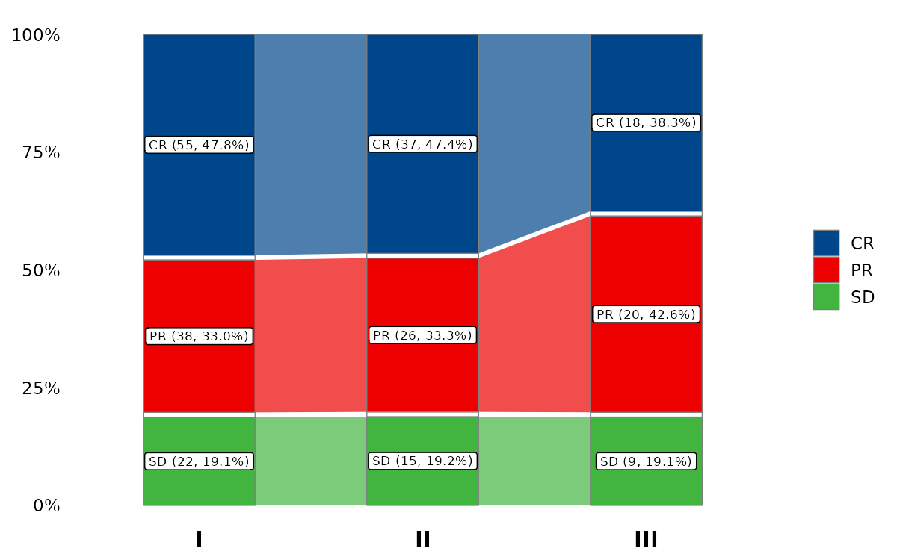{fig-alt="分类分布与流向：堆积柱、Alluvial 和 Sankey；两列分布流带；固定模拟数据的实际参数对照结果。"}

### 同一分布的堆积柱 {.unnumbered}

每个 stage 内比例为 100%；同一数据与流带图对照。

```r
plt_dist(dat, c("stage", "response"), type = "bar", label = "count_percent", color = cols)
```

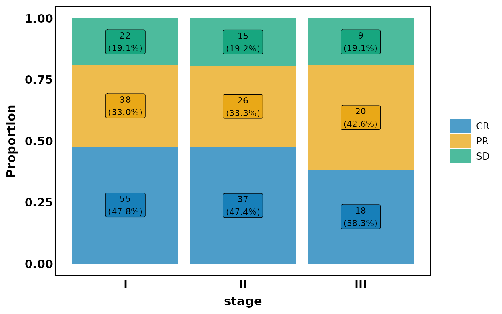{fig-alt="分类分布与流向：堆积柱、Alluvial 和 Sankey；同一分布的堆积柱；固定模拟数据的实际参数对照结果。"}

### 分层堆积柱 {.unnumbered}

分母在每个 cohort×stage 内确定，不是整个输入的总行数。

```r
plt_dist(dat, c("stage", "response"), type = "bar", facet = "cohort",
         color = cols, label = "percent")
```

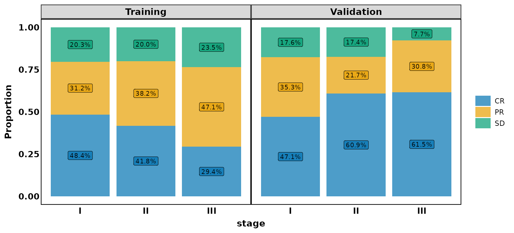{fig-alt="分类分布与流向：堆积柱、Alluvial 和 Sankey；分层堆积柱；固定模拟数据的实际参数对照结果。"}

### 三列类别矩阵 {.unnumbered}

前两列给网格位置，第三列给颜色和名称；这里确保每格只有一个第三列类别，避免多个类别的矩形互相覆盖。

```r
plt_dist(tile_dat, c("stage", "response", "label"), type = "bar", color = cols)
```

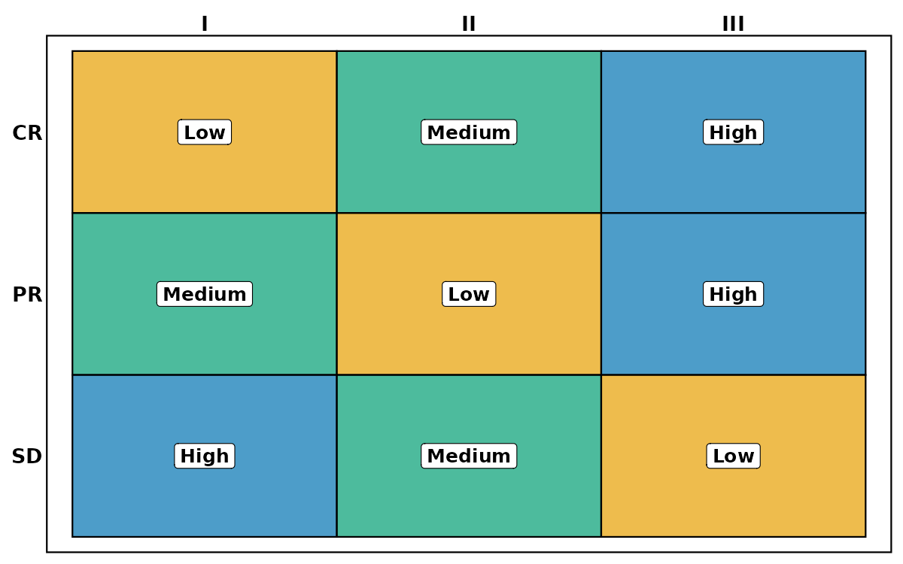{fig-alt="分类分布与流向：堆积柱、Alluvial 和 Sankey；三列类别矩阵；固定模拟数据的实际参数对照结果。"}

:::

## 比例、计数与分面

::: {.panel-tabset}

### 比例模式 {.unnumbered}

组内真实比例先归一化，再为 gap 让出空间；标签仍显示原始比例。

```r
plt_alluvial(dat, "stage", "response", y_type = "percent", color = cols)
```

{fig-alt="分类分布与流向：堆积柱、Alluvial 和 Sankey；比例模式；固定模拟数据的实际参数对照结果。"}

### 计数模式 {.unnumbered}

改为人数尺度，stage 总人数不同会形成不同总高度。

```r
plt_alluvial(dat, "stage", "response", y_type = "count", color = cols)
```

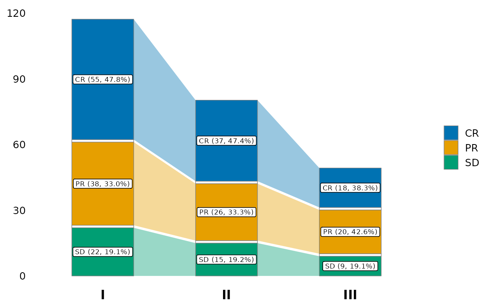{fig-alt="分类分布与流向：堆积柱、Alluvial 和 Sankey；计数模式；固定模拟数据的实际参数对照结果。"}

### 分面独立归一化 {.unnumbered}

两个 cohort 分别计算各 stage 内的构成。

```r
plt_alluvial(dat, "stage", "response", facet = "cohort", color = cols,
             facet_args = list(ncol = 2, scales = "fixed"))
```

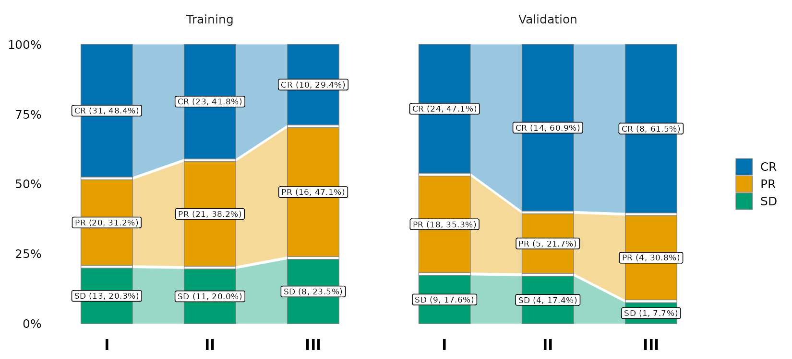{fig-alt="分类分布与流向：堆积柱、Alluvial 和 Sankey；分面独立归一化；固定模拟数据的实际参数对照结果。"}

### 分面计数与自由纵轴 {.unnumbered}

自由纵轴帮助看小样本层内部构成；跨层不能凭图形高度直接比较人数。

```r
plt_alluvial(dat, "stage", "response", facet = "cohort", y_type = "count",
             color = cols, facet_args = list(ncol = 2, scales = "free_y"))
```

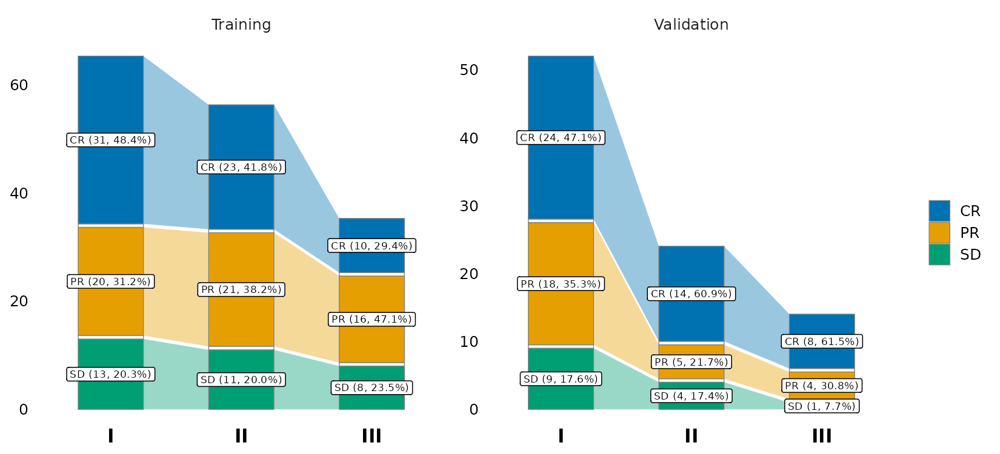{fig-alt="分类分布与流向：堆积柱、Alluvial 和 Sankey；分面计数与自由纵轴；固定模拟数据的实际参数对照结果。"}

:::

## 流带、节点与间隔

::: {.panel-tabset}

### 平滑流带 {.unnumbered}

只调整连带透明度与曲线，分类频数和比例不变。

```r
plt_alluvial(dat, "stage", "response", color = cols,
             flow_args = list(alpha = 0.65, curve_type = "sigmoid"))
```

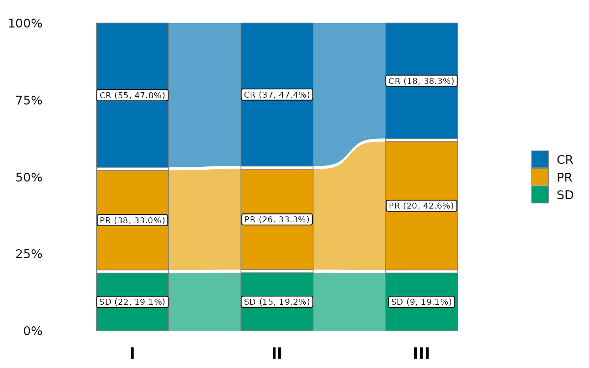{fig-alt="分类分布与流向：堆积柱、Alluvial 和 Sankey；平滑流带；固定模拟数据的实际参数对照结果。"}

### 无间隔 {.unnumbered}

去掉透明间隔，比例堆积总高度为 1。

```r
plt_alluvial(dat, "stage", "response", color = cols,
             stratum_args = list(gap = 0, width = 0.35))
```

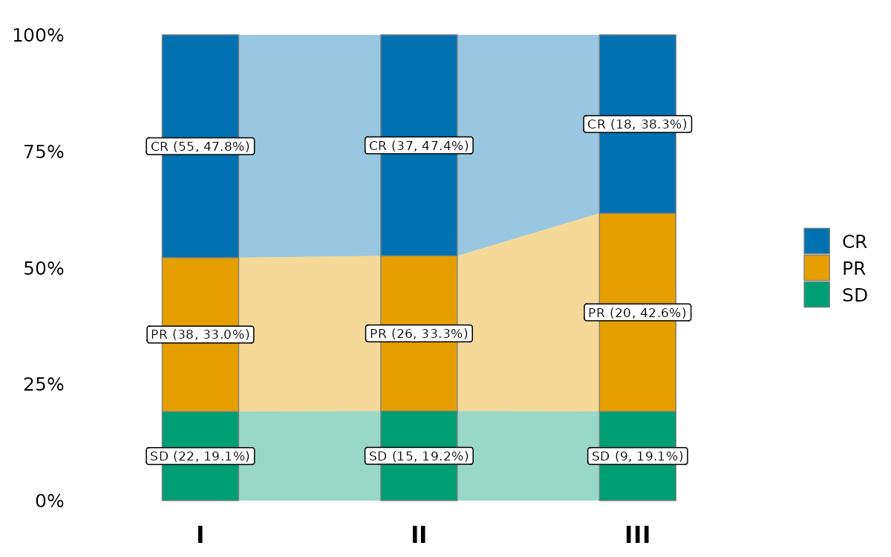{fig-alt="分类分布与流向：堆积柱、Alluvial 和 Sankey；无间隔；固定模拟数据的实际参数对照结果。"}

### 较大间隔和边框 {.unnumbered}

三组间共有两处间隔，各占 4%；真实 strata 总高度压缩到 92%。

```r
plt_alluvial(dat, "stage", "response", color = cols,
             stratum_args = list(gap = 0.04, width = 0.6, color = "white", linewidth = 0.8))
```

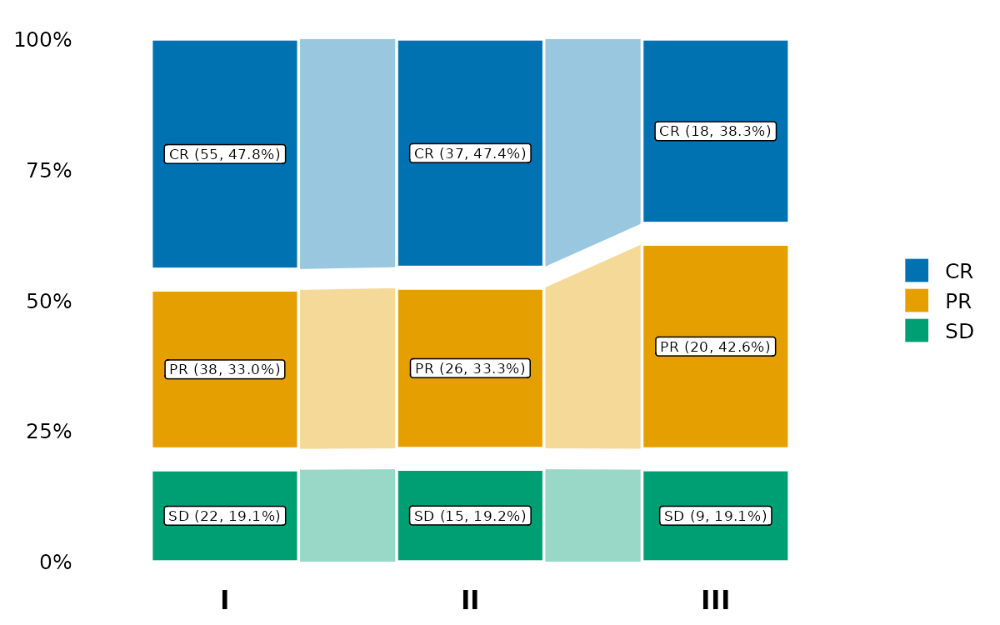{fig-alt="分类分布与流向：堆积柱、Alluvial 和 Sankey；较大间隔和边框；固定模拟数据的实际参数对照结果。"}

:::

## 标签内容与筛选

::: {.panel-tabset}

### 比例与最小标签阈值 {.unnumbered}

只隐藏小于 20% 的标签，不删除相应组或改变分母。

```r
plt_alluvial(dat, "stage", "response", color = cols,
             label_args = list(style = "percent", min_pct = 0.2, size = 3.5))
```

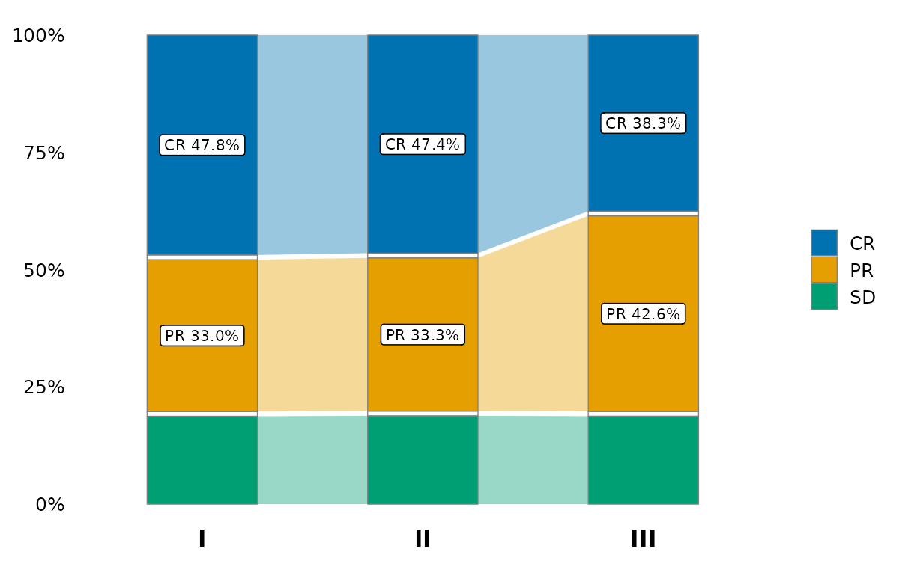{fig-alt="分类分布与流向：堆积柱、Alluvial 和 Sankey；比例与最小标签阈值；固定模拟数据的实际参数对照结果。"}

### 计数标签 {.unnumbered}

显示组名与计数，使用纯文本而非标签框。

```r
plt_alluvial(dat, "stage", "response", color = cols,
             label_args = list(style = "count", box = FALSE, color = "#222222", size = 3.5))
```

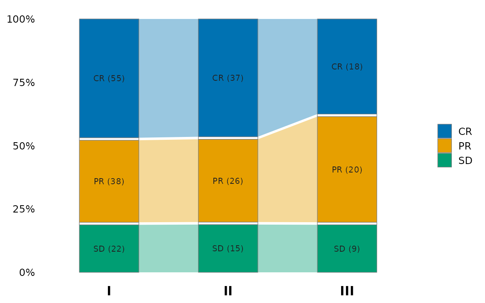{fig-alt="分类分布与流向：堆积柱、Alluvial 和 Sankey；计数标签；固定模拟数据的实际参数对照结果。"}

### 只显示组名 {.unnumbered}

保留组名标签，标签框背景独立于节点填色。

```r
plt_alluvial(dat, "stage", "response", color = cols,
             label_args = list(style = "name", fill = "#F4F7FB", alpha = 0.8))
```

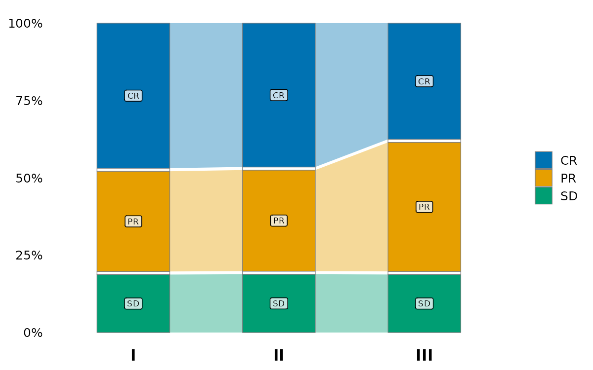{fig-alt="分类分布与流向：堆积柱、Alluvial 和 Sankey；只显示组名；固定模拟数据的实际参数对照结果。"}

### 关闭标签并保留图例 {.unnumbered}

数据标签关闭后，用共用颜色图例识别 response。

```r
plt_alluvial(dat, "stage", "response", color = cols,
             label_args = list(style = "none"), legend_args = list(position = "bottom", ncol = 3))
```

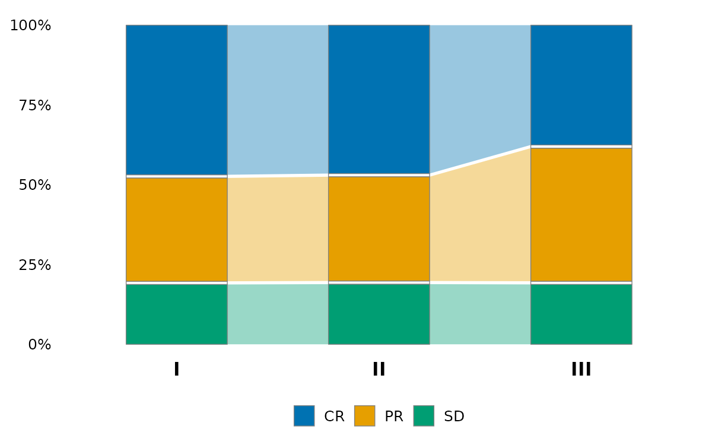{fig-alt="分类分布与流向：堆积柱、Alluvial 和 Sankey；关闭标签并保留图例；固定模拟数据的实际参数对照结果。"}

:::

## 节点路径与标签

::: {.panel-tabset}

### 两列节点路径 {.unnumbered}

每一行在两列变量之间形成连接；节点人数和比例使用全体输入行。

```r
plt_sankey(dat, c("stage", "response"))
```

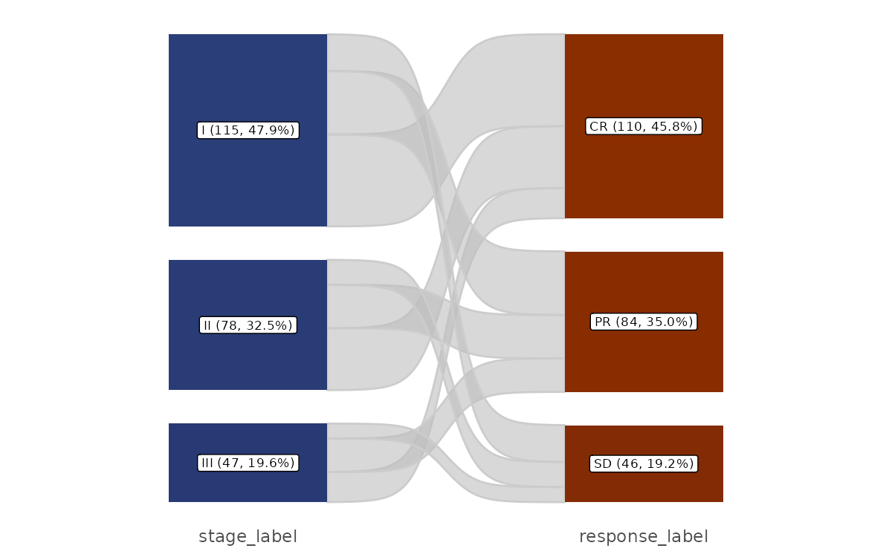{fig-alt="分类分布与流向：堆积柱、Alluvial 和 Sankey；两列节点路径；固定模拟数据的实际参数对照结果。"}

### 三列节点路径 {.unnumbered}

三个变量按顺序显示，同一行的组合形成完整路径；不自动产生时间或因果含义。

```r
plt_sankey(dat, c("stage", "regimen", "response"), show_text = "all")
```

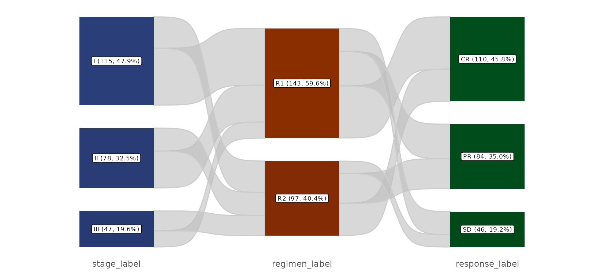{fig-alt="分类分布与流向：堆积柱、Alluvial 和 Sankey；三列节点路径；固定模拟数据的实际参数对照结果。"}

### 保留原因子顺序 {.unnumbered}

关闭反转后按既定因子水平排列；show_text=name 只显示名称。

```r
plt_sankey(dat, c("stage", "regimen", "response"), reverse_levels = FALSE, show_text = "name")
```

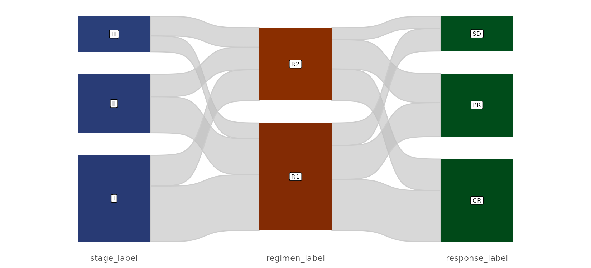{fig-alt="分类分布与流向：堆积柱、Alluvial 和 Sankey；保留原因子顺序；固定模拟数据的实际参数对照结果。"}

### 百分比标签 {.unnumbered}

palette 改节点色，流带仍为灰色；百分比是节点在输入总行数中的比例。

```r
plt_sankey(dat, c("stage", "response"), show_text = "pct",
           palette = "Paired", label_size = 3.5)
```

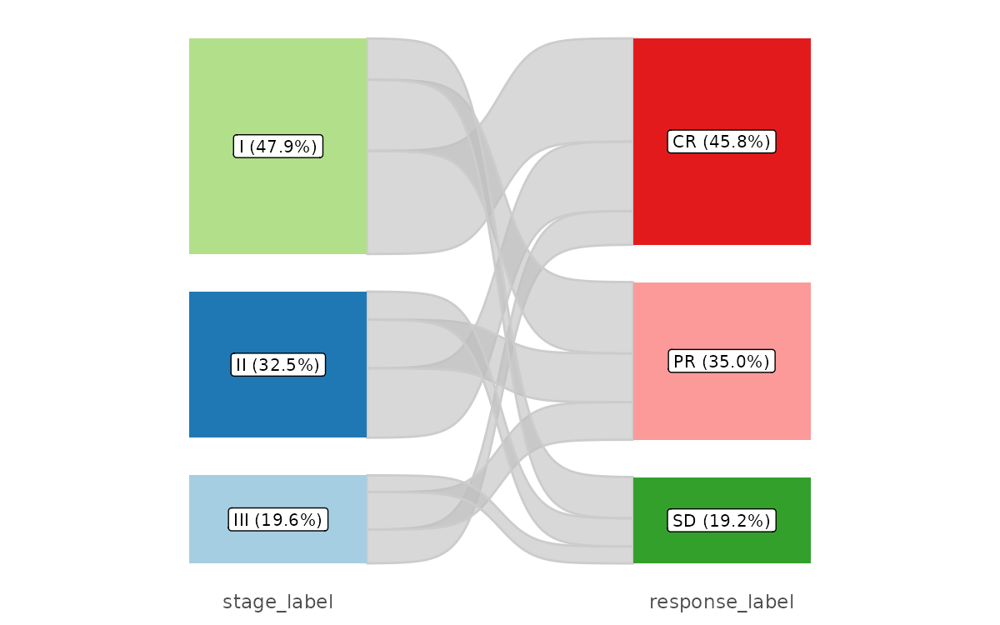{fig-alt="分类分布与流向：堆积柱、Alluvial 和 Sankey；百分比标签；固定模拟数据的实际参数对照结果。"}

### 宽度、间隔和透明度 {.unnumbered}

space=0 移除节点间隔，width 控制节点和端点宽度；标签显示名称与人数。

```r
plt_sankey(dat, c("stage", "regimen", "response"), width = 0.25, space = 0,
           alpha = 0.35, show_text = "n", label_size = 3, base_size = 13)
```

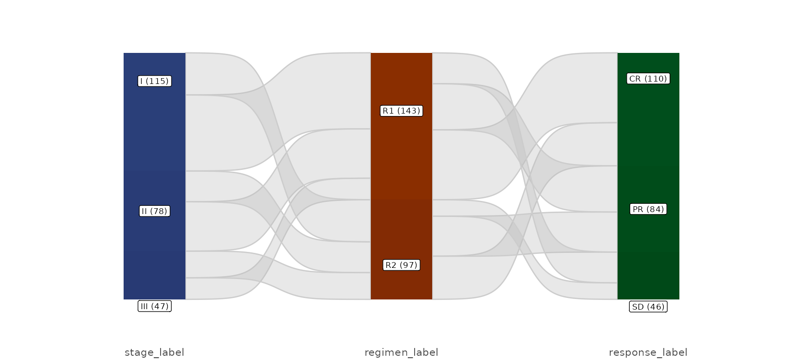{fig-alt="分类分布与流向：堆积柱、Alluvial 和 Sankey；宽度、间隔和透明度；固定模拟数据的实际参数对照结果。"}

:::

## 真实保存示例

::: {.panel-tabset}

### 保存到临时目录 {.unnumbered}

本例实际调用非空 save，核对临时 PDF 已生成；工作目录不产生输出文件。

```r
pdf_path <- file.path(tempdir(), "utilsr-alluvial-demo.pdf")
p <- plt_alluvial(dat, "stage", "response", color = cols,
                  save = list(filename = pdf_path, width = 8, height = 5))
stopifnot(file.exists(pdf_path), file.info(pdf_path)[["size"]] > 1000)
p
```

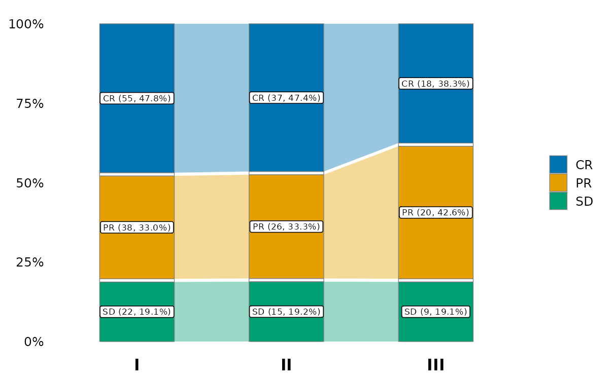{fig-alt="分类分布与流向：堆积柱、Alluvial 和 Sankey；保存到临时目录；固定模拟数据的实际参数对照结果。"}

:::

## 返回对象、保存与使用边界 {#output}

三个入口返回 ggplot。`plt_alluvial()` 的非空 save 调用 RegR::save_plt 保存 PDF，本页已实际核对一次；另外两个入口当前没有 save 参数，可外部使用 ggsave。

`plt_alluvial()` 连接的是同一 group 在不同类别中的边际分布，每个 facet×cat_var 独立归一化；不能据此读出某个个体从一类别流向另一类别。`plt_sankey()` 使用行内多变量组合建立路径。三列 `plt_dist()` 则是类别矩阵，输入若一个格子有多个第三列类别，图层会重叠；本页用每格唯一的数据演示。

流带的方向与宽度来自输入结构和频数，不构成因果作用估计。NA 行的处理按所选分支核对；plt_alluvial 会移除必要变量中的不完整行并报告。

## 当前完整接口 {#interfaces}

点击展开查看本次实际执行版本的参数及默认值。

<details>
<summary>公共函数签名</summary>

```r
plt_dist <-
function (data, dis_vars, type = c("alluvial", "bar"), facet = NULL, color = NULL, alpha = 0.7,
    label = c("count_percent", "count", "percent", "none"), gap = 0.01, curve_type = "linear",
    theme_use = theme_heat(14))
NULL

plt_alluvial <-
function (data, cat_var, group, facet = NULL, y_type = c("percent", "count"), color = pal_lancet,
    flow_args = list(alpha = 0.4, curve_type = "linear"), stratum_args = list(width = 0.5,
        color = "gray50", linewidth = 0.3, gap = 0.01), label_args = list(style = "count_percent",
        min_pct = 0, size = 3, color = "black", box = TRUE, fill = "white", alpha = 1), facet_args = list(nrow = NULL,
        ncol = NULL, scales = "fixed"), legend_args = list(ncol = 1, position = "right"), theme_use = theme_alluvia(15),
    save = list())
NULL

plt_sankey <-
function (data, vars, palette = NULL, reverse_levels = TRUE, show_text = c("all", "n", "pct",
    "name"), width = 0.4, space = NULL, label_size = 3, label_hjust = 0.5, alpha = 0.6, base_size = 14)
NULL

```

</details>

## 验证范围与参考 {#references}

本页列出的调用均已实际执行；所有展示的 ggplot/patchwork 图通过 `ggplot_build()` 和 PNG 导出，表格来自同一组代码的实际返回。未修改 UtilsR 源码或重新运行全包测试。

本次绘制出现的提示记录如下；对应示例仍通过实际构建和导出检查。

<details>
<summary>绘图提示</summary>

- `attributes are not identical across measure variables; they will be dropped`
- `The 'size' argument of 'element_rect()' is deprecated as of ggplot2 3.4.0. ℹ Please use the 'linewidth' argument instead. ℹ The deprecated feature was likely used in the ggsankey package.   Please report the issue at <https://github.com/davidsjoberg/ggsankey/issues>.`

</details>

- [UtilsR 函数参考](https://hui950319.github.io/UtilsR/reference/index.html)
- [UtilsR 源码](https://github.com/HUI950319/UtilsR/tree/main/R)
- [专题目录](index.qmd)

<details>
<summary>执行环境</summary>

```text
R version 4.4.3 (2025-02-28)
Platform: x86_64-pc-linux-gnu
Running under: Ubuntu 22.04.2 LTS

Matrix products: default
BLAS:   /usr/lib/x86_64-linux-gnu/openblas-pthread/libblas.so.3
LAPACK: /usr/lib/x86_64-linux-gnu/openblas-pthread/libopenblasp-r0.3.20.so;  LAPACK version 3.10.0

locale:
 [1] LC_CTYPE=C.UTF-8       LC_NUMERIC=C           LC_TIME=C.UTF-8        LC_COLLATE=C.UTF-8
 [5] LC_MONETARY=C.UTF-8    LC_MESSAGES=C.UTF-8    LC_PAPER=C.UTF-8       LC_NAME=C
 [9] LC_ADDRESS=C           LC_TELEPHONE=C         LC_MEASUREMENT=C.UTF-8 LC_IDENTIFICATION=C

time zone: Asia/Shanghai
tzcode source: system (glibc)

attached base packages:
[1] stats     graphics  grDevices utils     datasets  methods   base

other attached packages:
[1] ggplot2_4.0.3 UtilsR_0.6.8

loaded via a namespace (and not attached):
 [1] gtable_0.3.6       jsonlite_2.0.0     dplyr_1.2.0        compiler_4.4.3     tidyselect_1.2.1
 [6] Rcpp_1.1.1         stringr_1.6.0      dichromat_2.0-0.1  tidyr_1.3.2        textshaping_0.4.0
[11] systemfonts_1.1.0  scales_1.4.0       R6_2.6.1           labeling_0.4.3     generics_0.1.4
[16] patchwork_1.3.2    ggsankey_0.0.99999 httr2_1.2.2        forcats_1.0.1      ggrepel_0.9.8
[21] tibble_3.3.1       ellmer_0.4.0       pillar_1.11.1      RColorBrewer_1.1-3 rlang_1.3.0
[26] stringi_1.8.7      RegR_0.1.3         S7_0.2.2           ggalluvial_0.12.5  otel_0.2.0
[31] cli_3.6.6          withr_3.0.3        magrittr_2.0.4     digest_0.6.39      grid_4.4.3
[36] rappdirs_0.3.4     lifecycle_1.0.5    coro_1.1.0         vctrs_0.7.3        ggprism_1.0.7
[41] glue_1.8.1         farver_2.1.2       ragg_1.5.2         purrr_1.2.1        tools_4.4.3
[46] pkgconfig_2.0.3    mcptools_0.2.1
```

</details>
