fmt_plot 和常用 fmt_* 的前后对照、主题选择、坐标尺度及多面板格式化。各节用固定输入比较重要参数，标签页中展示可复制代码与实际结果。

**版本与执行范围：** 本页按 UtilsR **0.6.8** 的公共接口核对；31 个示例已在 WSL R 4.4.3 中实际执行，其中 31 张图已完成构建与 PNG 导出。使用固定随机种子的模拟数据。

## 数据准备与输入约定 {#data}

所有示例使用下列模拟数据，因子水平显式固定，重复执行可得到相同输入。

```r
library(UtilsR)
library(ggplot2)
library(patchwork)
set.seed(1003)
dat <- data.frame(group = factor(rep(c("A", "B", "C"), each = 60)),
                  batch = factor(rep(c("Batch 1", "Batch 2"), 90)),
                  x = rnorm(180))
dat[["y"]] <- 0.7 * dat[["x"]] + rnorm(180, sd = 0.6) + rep(c(0, 0.4, 0.9), each = 60)
cols <- c(A = "#0072B2", B = "#E69F00", C = "#009E73")
p <- ggplot(dat, aes(x, y, colour = group)) + geom_point(alpha = 0.6) +
  scale_colour_manual(values = cols) + theme_my()
p_box <- ggplot(dat, aes(group, y, fill = group)) + geom_violin(alpha = 0.65) +
  scale_fill_manual(values = cols) + theme_my()
p_facet <- p + facet_wrap(vars(batch))
p_matrix <- wrap_plots(p, p_box, p, p_box, ncol = 2)
```

## 函数选择与重要参数 {#parameters}

| 函数 | 本页重点参数 | 语义与条件 |
|:--|:--|:--|
| `fmt_plot()` | `fmt_axis_list`、`fmt_tag_list`、`fmt_legend_list`、`fmt_ref_list` | 用命名 list 组合对应函数设置；默认均为 NULL |
| `fmt_plot_base()` | `ggtheme`、`labs_list`、`scale_y_list/scale_x_list` | 将 ggplot 组件广播到组合图；scale list 用连续轴设置 |
| `theme_my()` | `base_size = 14`、`base_family = "sans"`、`border = TRUE`、`panel.grid` | 统一基础字号、字体、边框和网格 |
| `fmt_axis()` | `x.axis = FALSE`、`y.axis = FALSE`、`plot_dims = NULL` | TRUE 表示隐藏；也可用子图索引或维度选择隐藏位置 |
| `fmt_axisText()` | `x/y = NULL`、`size/color/face` | x/y 是角度，自动匹配常用文字对齐 |
| `fmt_axisTile()` | `colors`、`mode = "tile"`、`axis = "x"`、`tile_height/width` | 离散轴用颜色块或文字编码，颜色按轴类别对应 |
| `fmt_text()` | `xlab/ylab/title/subtitle/caption`、`title_size/color/hjust` | 文字和样式可按子图向量化 |
| `fmt_panel()` | `grid = "none"`、`border`、`bg`、`grid_color/linewidth` | 网格可选 none/major/minor/both/x/y |
| `fmt_legend()` | `legend.position/direction`、`collect = FALSE`、`ncol/nrow`、`scale` | 合并图例需映射与标签一致；缩放影响显示尺寸 |
| `fmt_tag()` | `labels`、`label_position = c(0.02,0.98)`、`size = 18` | NPC 位置是相对面板位置；tl-out 等关键字放在图外 |
| `fmt_ref()` | `x/y`、`linetype = "dashed"`、`linewidth = 0.5`、`color` | 按实际数据坐标放参考线，可多个值 |
| `fmt_strip()` | `label`、`label_fill/color`、`strip = TRUE` | 增加或改条带；FALSE 去掉条带 |
| `fmt_strip2()` | `top_label/right_label`、`ncol`、`top_fill/right_fill` | 为规则矩阵组合图增加列和行标签 |
| `fmt_bg()` | `palcolor/palette`、`alpha = 0.3`、`bg_axis = "x"` | 离散类别背景，与点层填色分别控制 |
| `fmt_his()` | `type = "histogram"`、`height_ratio = 0.3`、`con_var`、`binwidth/adjust` | 插入分布层；直方图与密度各用不同设置 |
| `fmt_scale()` | `x/y` 命名 list | breaks、labels、limits、trans 等交给对应 scale；limits 会移除范围外数据 |
| `fmt_expand()` | `mult = 0`、`add = c(0,0)`、`axis = NULL` | 改两端留白，add 是数据尺度上的扩展 |
| `fmt_point()` | `type = "point"`、`jitter.args`、`sample_n`、`white_border` | jitter/beeswarm 减少重叠；sample_n 为每组的绘图抽样数 |
| `fmt_boxplot()` | `boxplot.args`、`inherit.aes = TRUE` | list 控制图层；当前实现不显示箱线自身的离群点 |
| `fmt_com()` | `com_method = "con"`、`label.y/label.y.prop`、`label` | 统计比较标注，不能当作纯主题调整 |

## 基础图与主题

::: {.panel-tabset}

### 基础散点图 {.unnumbered}

后续坐标、图例和标签对照都使用这份基础图。

```r
p
```

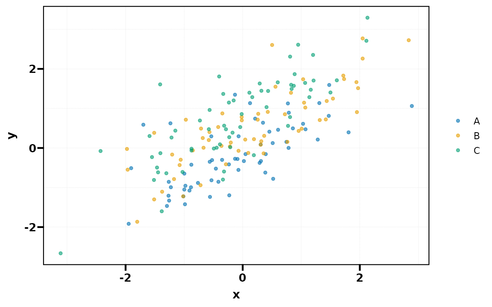{fig-alt="ggplot 格式化：主题、坐标、图例、条带与面板标签；基础散点图；固定模拟数据的实际参数对照结果。"}

### 去边框和网格 {.unnumbered}

字号、边框和网格同时调整，点的数据保持一致。

```r
p + theme_my(base_size = 16, border = FALSE,
             panel.grid = element_blank(), panel.grid.minor = element_blank())
```

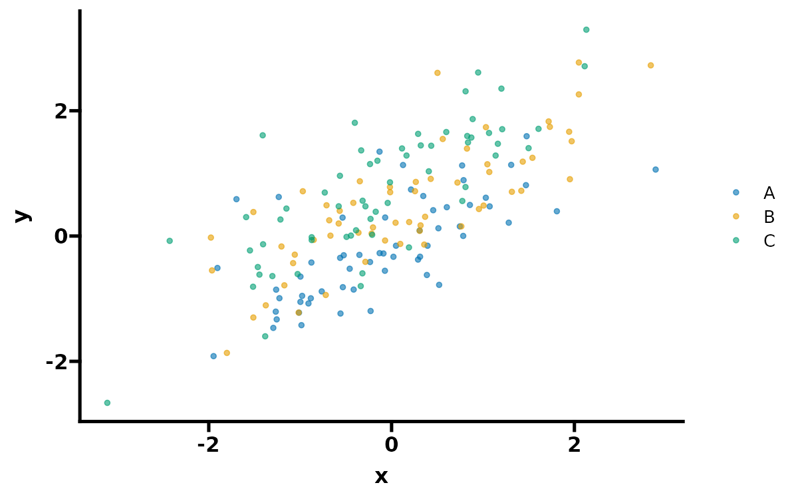{fig-alt="ggplot 格式化：主题、坐标、图例、条带与面板标签；去边框和网格；固定模拟数据的实际参数对照结果。"}

### 热图主题 {.unnumbered}

展示 theme_heat 的实际坐标与图例样式；选择主题后仍可继续用 fmt_* 调整。

```r
p + theme_heat(base_size = 16)
```

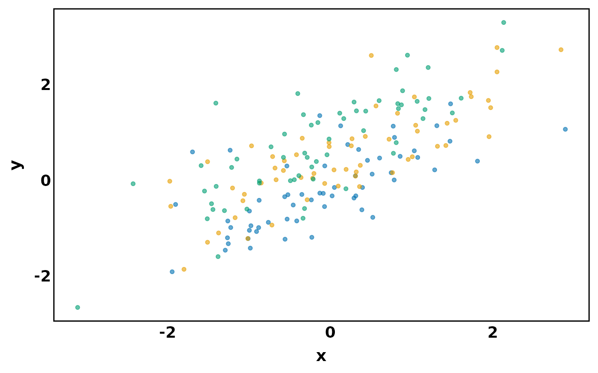{fig-alt="ggplot 格式化：主题、坐标、图例、条带与面板标签；热图主题；固定模拟数据的实际参数对照结果。"}

### 简化坐标箭头 {.unnumbered}

theme_blank 返回主题和注释组合，可直接加到图上。

```r
p + theme_blank(xlab = "Axis 1", ylab = "Axis 2", lab_size = 14)
```

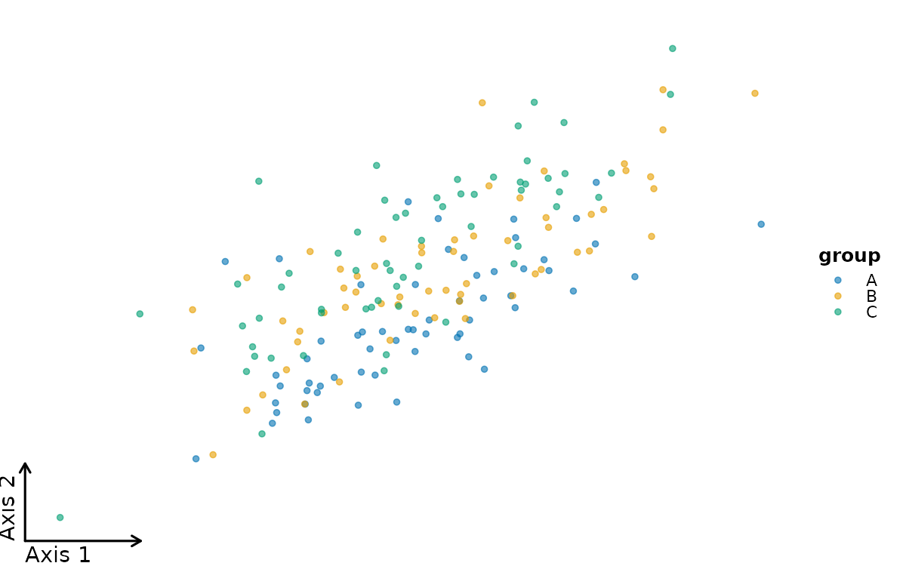{fig-alt="ggplot 格式化：主题、坐标、图例、条带与面板标签；简化坐标箭头；固定模拟数据的实际参数对照结果。"}

:::

## 坐标、网格与文字

::: {.panel-tabset}

### 隐藏坐标 {.unnumbered}

x.axis=TRUE 隐藏横轴；FALSE 表示这一调用不额外隐藏对应轴。

```r
fmt_axis(p, x.axis = TRUE, y.axis = FALSE)
```

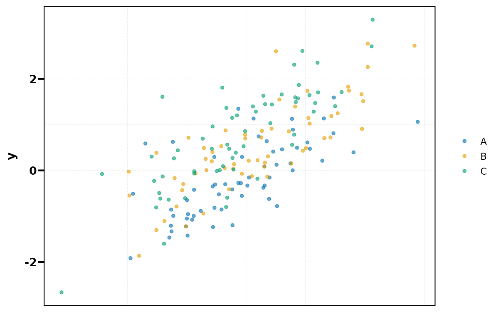{fig-alt="ggplot 格式化：主题、坐标、图例、条带与面板标签；隐藏坐标；固定模拟数据的实际参数对照结果。"}

### 旋转轴标签 {.unnumbered}

x 控制文字角度而不是轴范围；旋转后的对齐由函数自动处理。

```r
fmt_axisText(p_box, x = 45, size = 12, color = "#37474F")
```

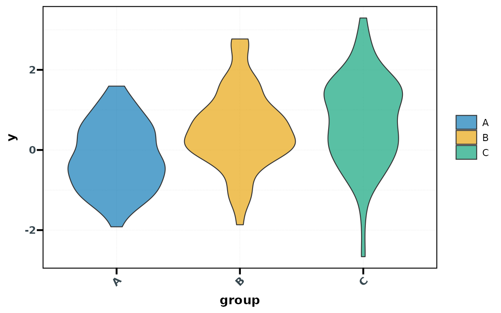{fig-alt="ggplot 格式化：主题、坐标、图例、条带与面板标签；旋转轴标签；固定模拟数据的实际参数对照结果。"}

### 轴颜色条 {.unnumbered}

在离散横轴外增加颜色条，与 A/B/C 的类别固定对应。

```r
fmt_axisTile(p_box, colors = cols, mode = "tile", axis = "x",
             tile_height = 0.08, tile_border = "white")
```

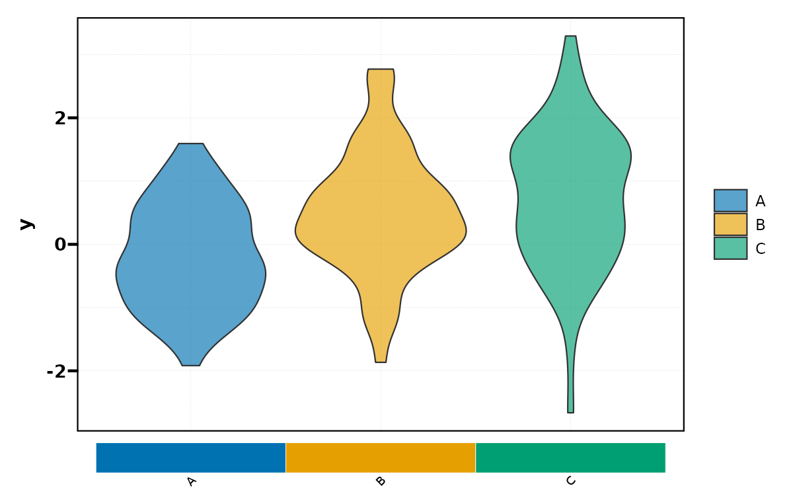{fig-alt="ggplot 格式化：主题、坐标、图例、条带与面板标签；轴颜色条；固定模拟数据的实际参数对照结果。"}

### 彩色轴文字 {.unnumbered}

改用文字颜色编码类别；没有额外轴颜色块。

```r
fmt_axisTile(p_box, colors = cols, mode = "text", axis = "x",
             text_size = 13, text_face = "bold")
```

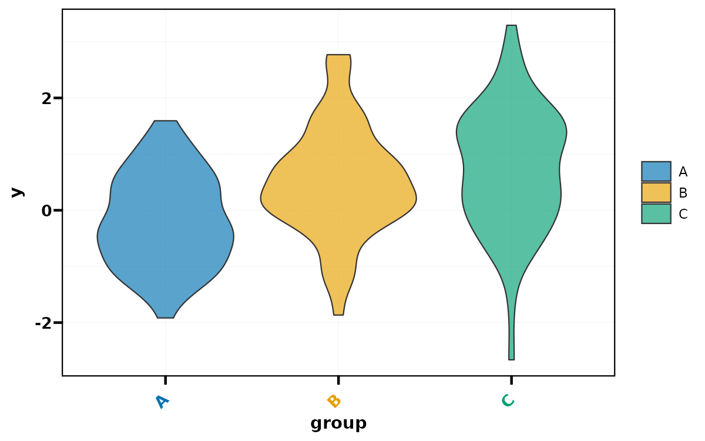{fig-alt="ggplot 格式化：主题、坐标、图例、条带与面板标签；彩色轴文字；固定模拟数据的实际参数对照结果。"}

### 网格和背景 {.unnumbered}

只保留 y 方向网格，边框和背景独立设置。

```r
fmt_panel(p, grid = "y", grid_color = "#CAD5DF", grid_linewidth = 0.3,
          border = TRUE, border_linewidth = 0.7, bg = "#F5F8FC")
```

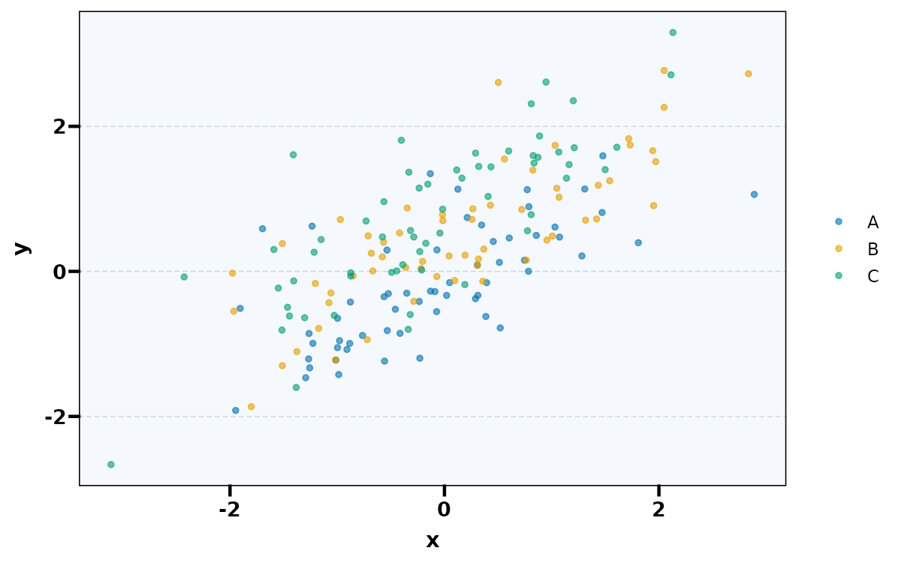{fig-alt="ggplot 格式化：主题、坐标、图例、条带与面板标签；网格和背景；固定模拟数据的实际参数对照结果。"}

### 标题与字号 {.unnumbered}

文字样式由 fmt_text 控制，示例明确标注模拟数据。

```r
fmt_text(p, xlab = "Standardized exposure", ylab = "Simulated response",
         title = "Scatter comparison", subtitle = "Fixed simulated input",
         caption = "No causal interpretation", title_size = 18,
         title_color = "#263238", title_hjust = 0, axis_title_size = 14)
```

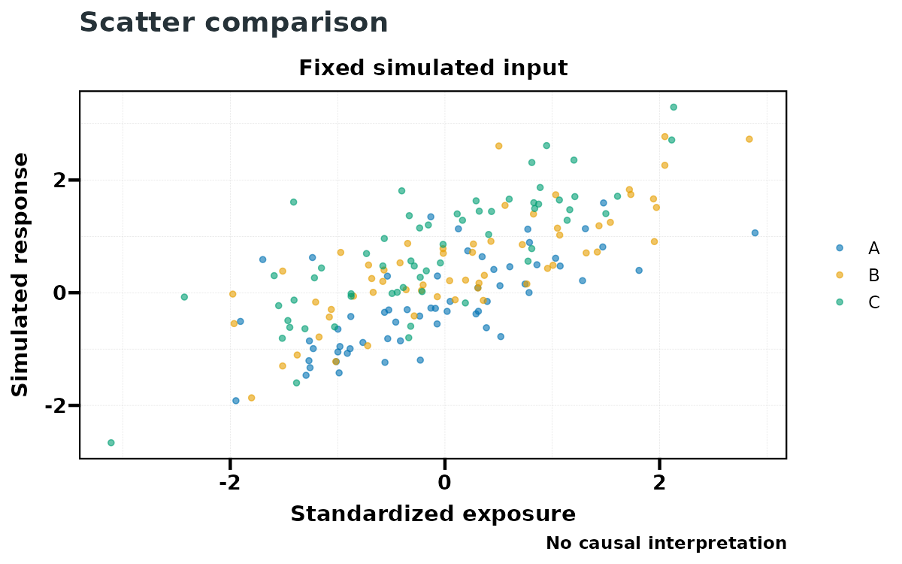{fig-alt="ggplot 格式化：主题、坐标、图例、条带与面板标签；标题与字号；固定模拟数据的实际参数对照结果。"}

:::

## 图例与参考线

::: {.panel-tabset}

### 底部横向图例 {.unnumbered}

图例位置、方向、列数与标题可以分别设置。

```r
fmt_legend(p, legend.position = "bottom", legend.direction = "horizontal",
           ncol = 3, title = "Cohort")
```

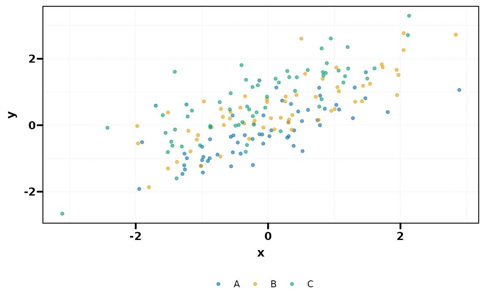{fig-alt="ggplot 格式化：主题、坐标、图例、条带与面板标签；底部横向图例；固定模拟数据的实际参数对照结果。"}

### 缩放图例 {.unnumbered}

放大图例元素以配合大画布，数据点的大小未因此改变。

```r
fmt_legend(p, legend.position = "right", scale = 1.4)
```

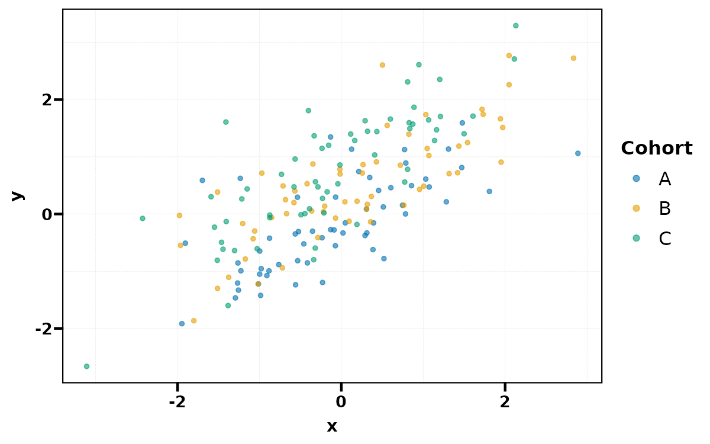{fig-alt="ggplot 格式化：主题、坐标、图例、条带与面板标签；缩放图例；固定模拟数据的实际参数对照结果。"}

### 组合图共用图例 {.unnumbered}

两个面板使用相同颜色映射与图例名称，适合合并图例。

```r
fmt_legend(wrap_plots(p, p, ncol = 2), collect = TRUE,
           legend.position = "bottom", title = "Cohort")
```

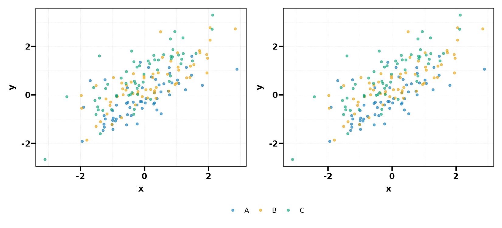{fig-alt="ggplot 格式化：主题、坐标、图例、条带与面板标签；组合图共用图例；固定模拟数据的实际参数对照结果。"}

### 多条参考线 {.unnumbered}

参考线使用真实数据坐标；颜色、线型会按线条数循环对应。

```r
fmt_ref(p, x = 0, y = c(0, 1), color = c("#777777", "#B2182B"),
        linetype = c("dashed", "dotted"), linewidth = 0.7)
```

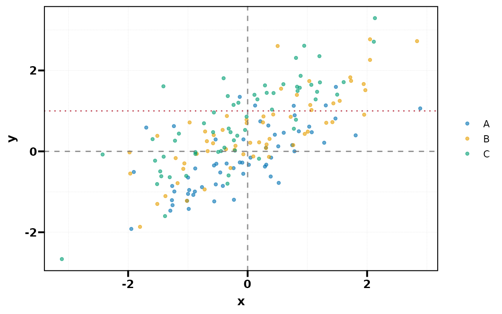{fig-alt="ggplot 格式化：主题、坐标、图例、条带与面板标签；多条参考线；固定模拟数据的实际参数对照结果。"}

:::

## 条带与面板编号

::: {.panel-tabset}

### 给单图加条带 {.unnumbered}

单图也可用条带标明结果类型。

```r
fmt_strip(p_box, label = "Distribution", label_fill = "#DCECF5", label_color = "#16324F")
```

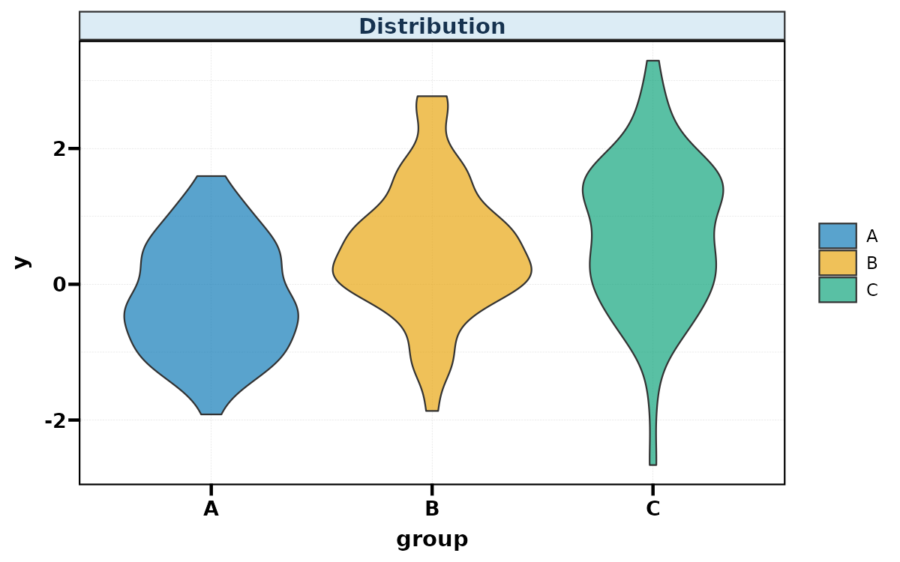{fig-alt="ggplot 格式化：主题、坐标、图例、条带与面板标签；给单图加条带；固定模拟数据的实际参数对照结果。"}

### 隐藏分面条带 {.unnumbered}

隐藏文字与条带背景，保留两个实际分面。

```r
fmt_strip(p_facet, strip = FALSE)
```

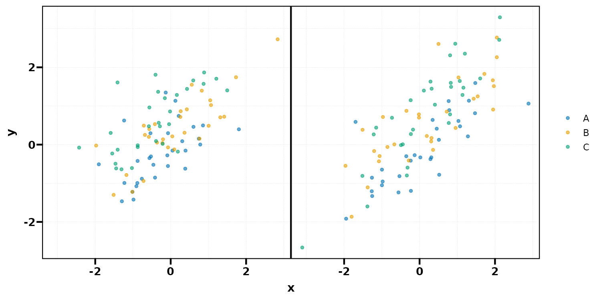{fig-alt="ggplot 格式化：主题、坐标、图例、条带与面板标签；隐藏分面条带；固定模拟数据的实际参数对照结果。"}

### 图内编号 {.unnumbered}

使用相对面板位置添加 A–D 编号；不会改变横纵轴数值。

```r
fmt_tag(p_matrix, labels = c("A", "B", "C", "D"),
        label_position = "tl", size = 14, label.size = 0.4)
```

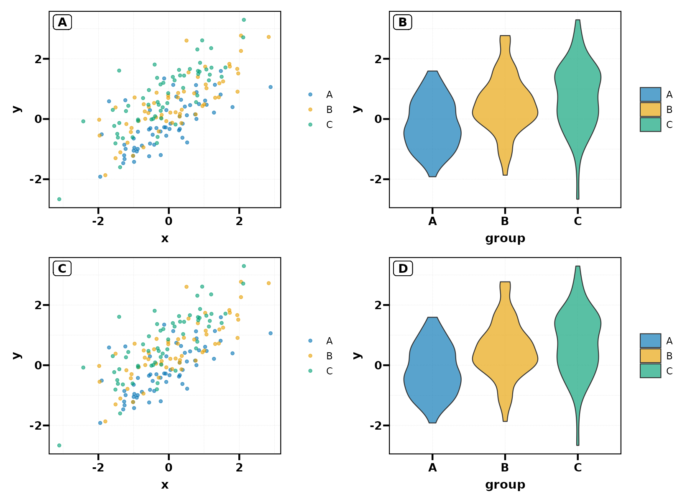{fig-alt="ggplot 格式化：主题、坐标、图例、条带与面板标签；图内编号；固定模拟数据的实际参数对照结果。"}

### 图外编号 {.unnumbered}

tl-out 将标签放在整幅子图边缘，适合避免遮挡数据；padding 明确给出四个方向的单位值。

```r
fmt_tag(p_matrix, labels = c("A", "B", "C", "D"),
        label_position = "tl-out", size = 13, label.padding = grid::unit(rep(0.12, 4), "lines"))
```

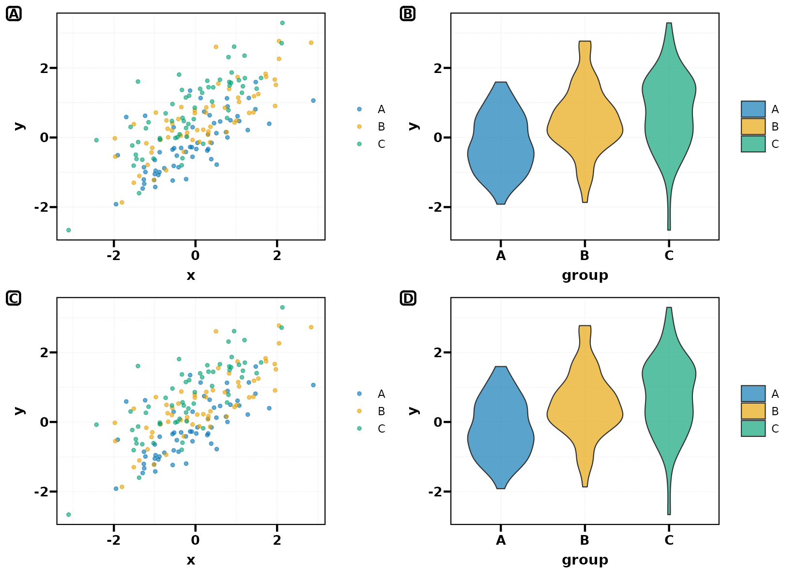{fig-alt="ggplot 格式化：主题、坐标、图例、条带与面板标签；图外编号；固定模拟数据的实际参数对照结果。"}

### 行列双层标签 {.unnumbered}

规则两列矩阵增加列标题与行标题，行列颜色分别指定。

```r
fmt_strip2(p_matrix, top_label = c("Scatter", "Distribution"),
           right_label = c("Row 1", "Row 2"), ncol = 2,
           top_fill = c("#DDEBF7", "#FCE4D6"), right_fill = c("#E2F0D9", "#EDEDED"))
```

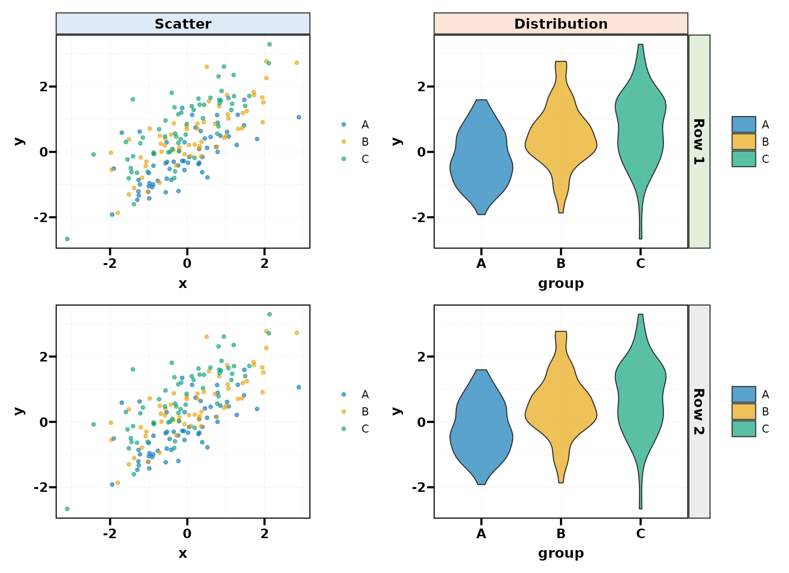{fig-alt="ggplot 格式化：主题、坐标、图例、条带与面板标签；行列双层标签；固定模拟数据的实际参数对照结果。"}

:::

## 尺度、留白与分布插图

::: {.panel-tabset}

### 刻度和格式 {.unnumbered}

只设置 breaks/labels，改变刻度与格式而不筛去观测。

```r
fmt_scale(p, x = list(breaks = seq(-2, 2, 1)),
          y = list(breaks = seq(-1, 3, 1), labels = scales::label_number(accuracy = 0.1)))
```

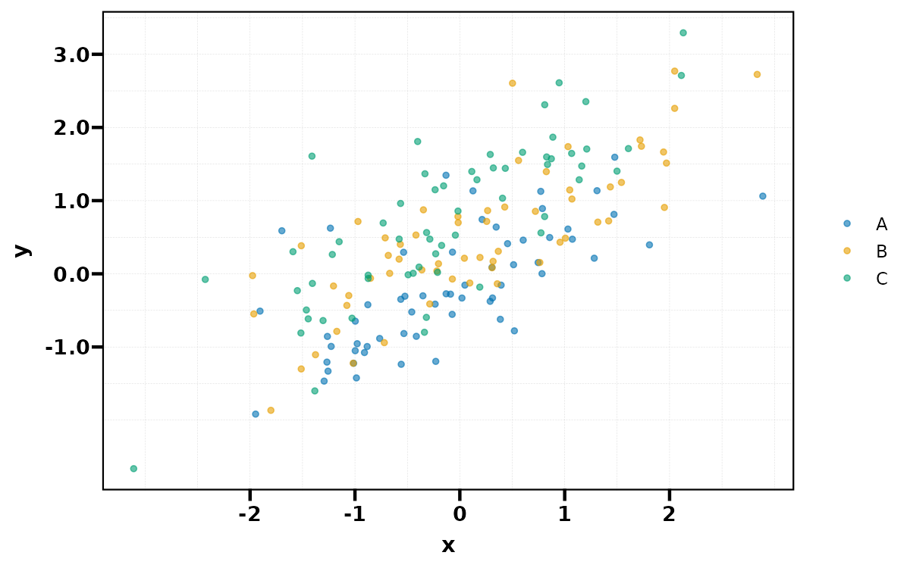{fig-alt="ggplot 格式化：主题、坐标、图例、条带与面板标签；刻度和格式；固定模拟数据的实际参数对照结果。"}

### scale 范围限制 {.unnumbered}

scale limits 将范围外点移除；需要保留统计计算数据的观察窗时，使用 coord_cartesian。

```r
fmt_scale(p, y = list(limits = c(-1, 2)))
```

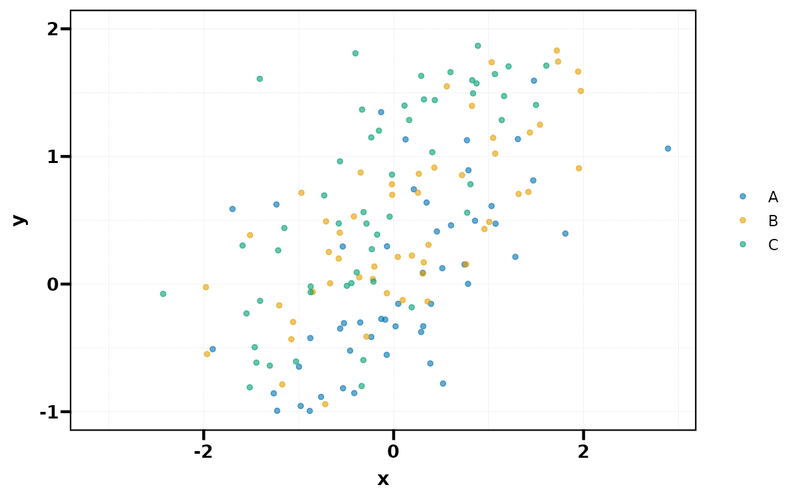{fig-alt="ggplot 格式化：主题、坐标、图例、条带与面板标签；scale 范围限制；固定模拟数据的实际参数对照结果。"}

### 两端留白 {.unnumbered}

左端留白 3%、右端留白 15%，给图内注释预留横向空间。

```r
fmt_expand(p, mult = c(0.03, 0.15), add = c(0, 0), axis = "x")
```

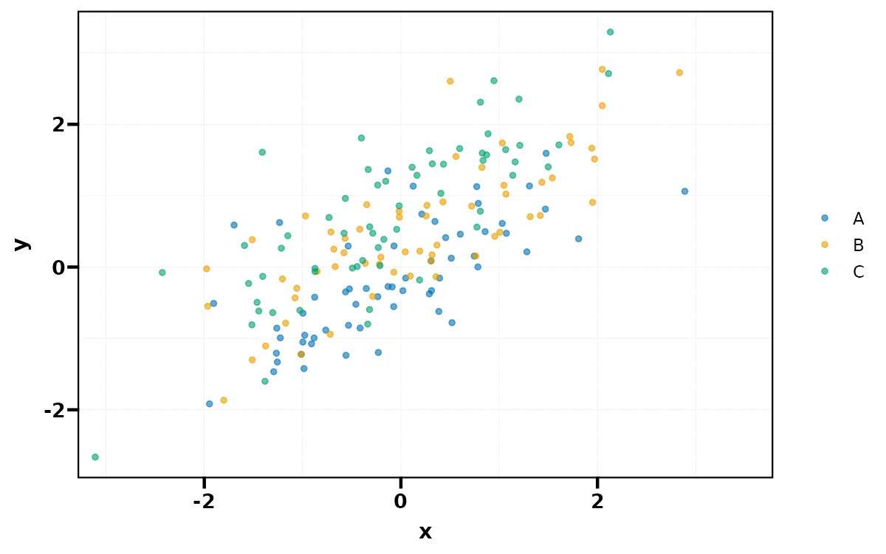{fig-alt="ggplot 格式化：主题、坐标、图例、条带与面板标签；两端留白；固定模拟数据的实际参数对照结果。"}

### 插入直方图 {.unnumbered}

直方图的横轴来自 x，binwidth 决定分箱；height_ratio 控制插入的相对高度。

```r
fmt_his(p, type = "histogram", con_var = "x", height_ratio = 0.25,
        binwidth = 0.4, his_color = "#9AB8D1", his_alpha = 0.6)
```

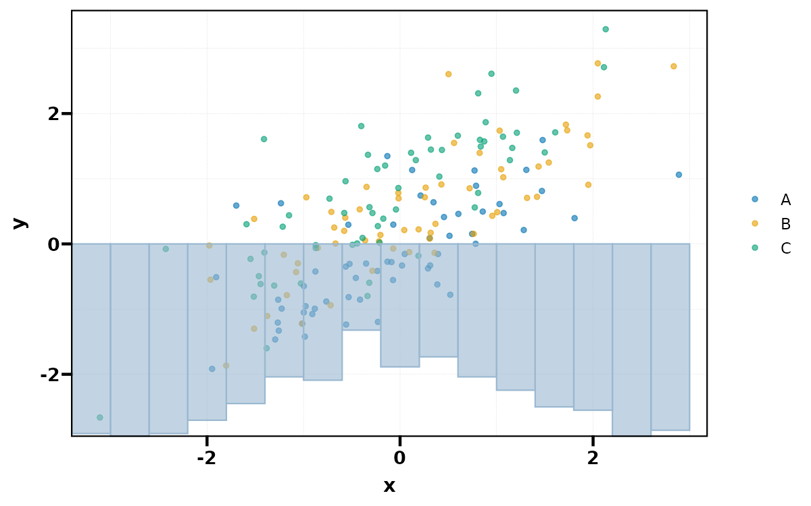{fig-alt="ggplot 格式化：主题、坐标、图例、条带与面板标签；插入直方图；固定模拟数据的实际参数对照结果。"}

### 插入密度 {.unnumbered}

密度平滑用 adjust 控制，与直方图 binwidth 的含义不同。

```r
fmt_his(p, type = "density", con_var = "x", height_ratio = 0.3,
        adjust = 0.8, his_color = "#9AB8D1")
```

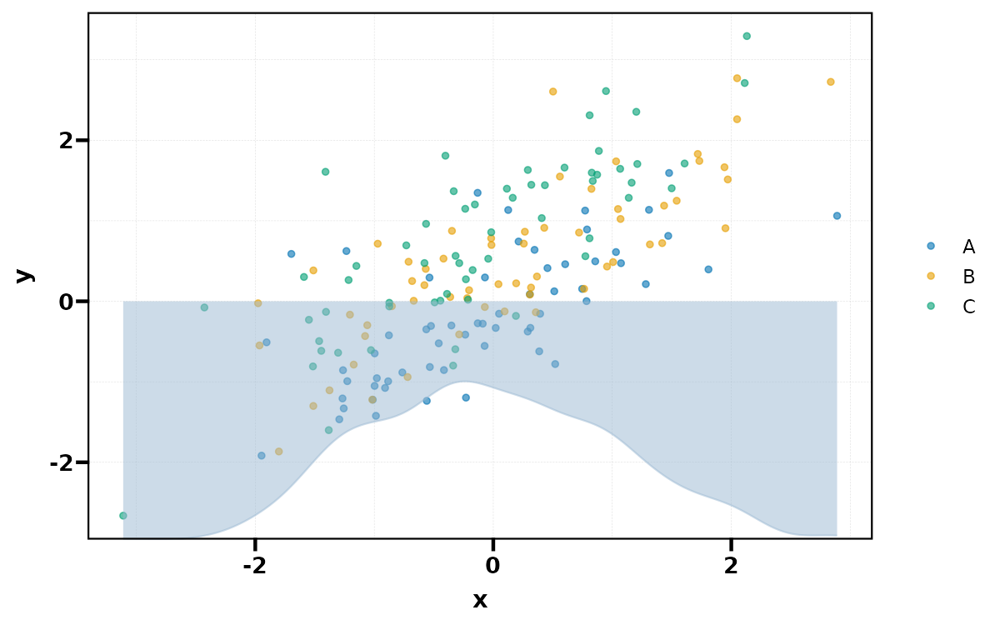{fig-alt="ggplot 格式化：主题、坐标、图例、条带与面板标签；插入密度；固定模拟数据的实际参数对照结果。"}

:::

## 图层叠加与统一入口

::: {.panel-tabset}

### 分类背景 {.unnumbered}

离散轴每个类别增加背景色，与小提琴的颜色映射分别设置。

```r
fmt_bg(p_box, palcolor = c("#E8F1F8", "#FFF1D6", "#E4F3EA"), alpha = 0.45)
```

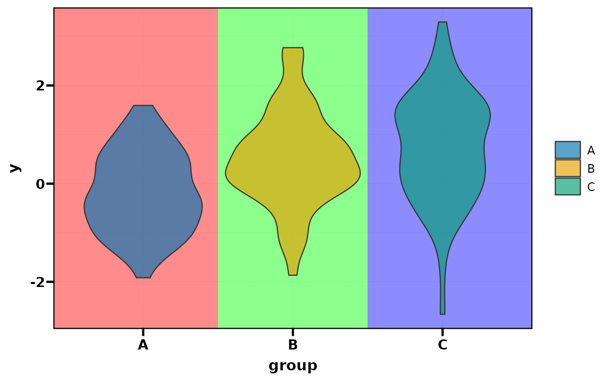{fig-alt="ggplot 格式化：主题、坐标、图例、条带与面板标签；分类背景；固定模拟数据的实际参数对照结果。"}

### 抖动点与白边 {.unnumbered}

点层横向抖动减少遮挡，纵向不抖动；白边通过可填色点形实现。

```r
fmt_point(p_box, type = "jitter", size = 1.6, white_border = TRUE,
          jitter.args = list(width = 0.16, height = 0), seed = 32)
```

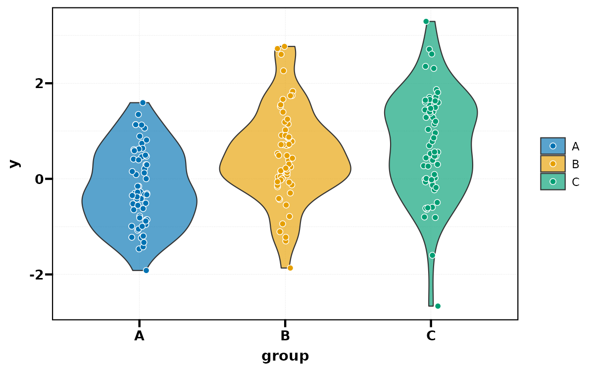{fig-alt="ggplot 格式化：主题、坐标、图例、条带与面板标签；抖动点与白边；固定模拟数据的实际参数对照结果。"}

### 每组抽样 {.unnumbered}

每组抽取 20 个点用于显示，基础小提琴仍使用完整数据。

```r
fmt_point(p_box, type = "jitter", sample_n = 20, seed = 32,
          jitter.args = list(width = 0.16, height = 0))
```

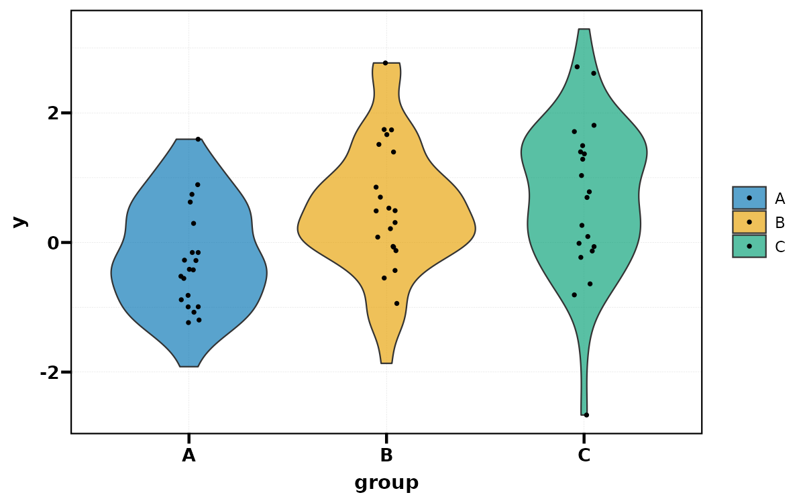{fig-alt="ggplot 格式化：主题、坐标、图例、条带与面板标签；每组抽样；固定模拟数据的实际参数对照结果。"}

### 箱线叠加 {.unnumbered}

通过命名 list 调整箱线图层，函数不显示箱线自身的离群点。

```r
fmt_boxplot(p_box, boxplot.args = list(width = 0.18, alpha = 0.25, colour = "#222222"))
```

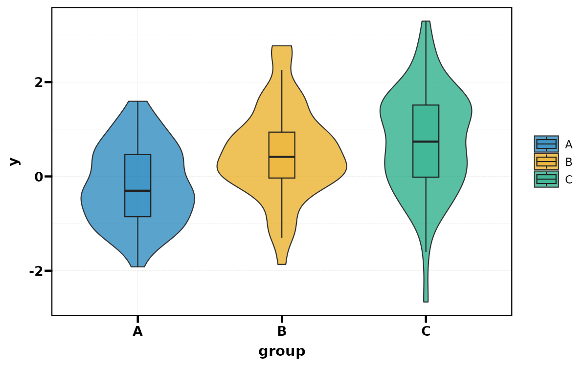{fig-alt="ggplot 格式化：主题、坐标、图例、条带与面板标签；箱线叠加；固定模拟数据的实际参数对照结果。"}

### 比较标注 {.unnumbered}

con 在当前横轴顺序上比较相邻组，标注高度与图形数据范围相联系。

```r
fmt_com(p_box, com_method = "con", label = "p.format", label.y.prop = 1.15)
```

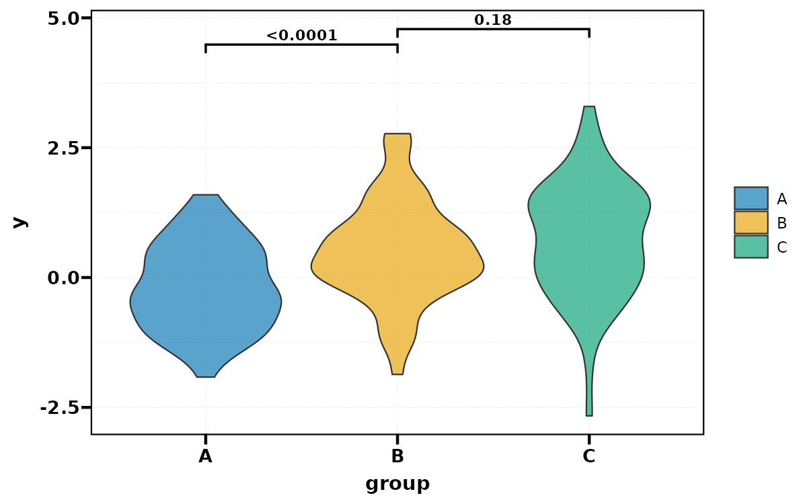{fig-alt="ggplot 格式化：主题、坐标、图例、条带与面板标签；比较标注；固定模拟数据的实际参数对照结果。"}

### 命名 list 组合格式 {.unnumbered}

fmt_plot 复用对应 formatter 的命名 list，重要设置显式写入各自入口。

```r
fmt_plot(p, fmt_legend_list = list(legend.position = "bottom", ncol = 3),
         fmt_ref_list = list(y = 0, color = "#B2182B", linewidth = 0.7),
         fmt_tag_list = list(labels = "A", label_position = "tr", size = 15),
         plot.margin = c(10, 10, 10, 10))
```

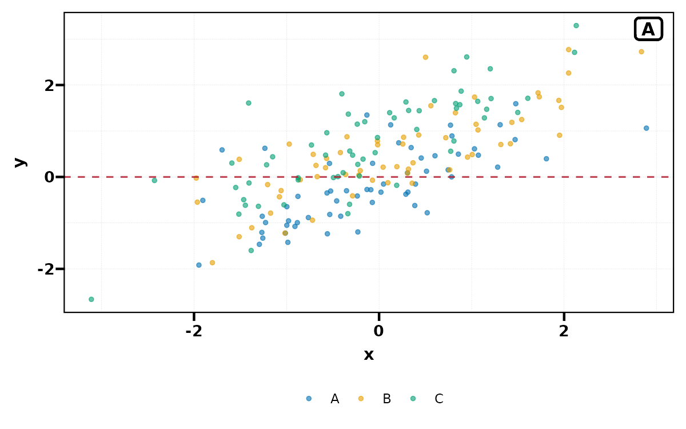{fig-alt="ggplot 格式化：主题、坐标、图例、条带与面板标签；命名 list 组合格式；固定模拟数据的实际参数对照结果。"}

### 广播主题与标签 {.unnumbered}

统一主题和文字应用到组合图各子图；保留组合布局。

```r
fmt_plot_base(p_matrix, ggtheme = theme_my(base_size = 12, border = FALSE),
              labs_list = list(caption = "Simulated data"))
```

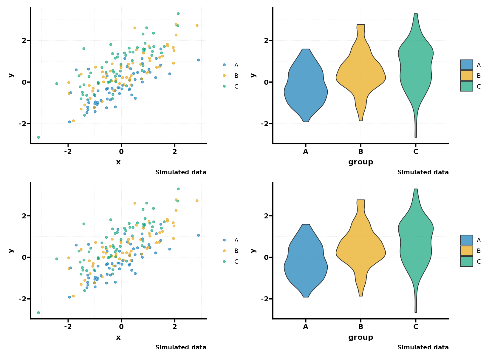{fig-alt="ggplot 格式化：主题、坐标、图例、条带与面板标签；广播主题与标签；固定模拟数据的实际参数对照结果。"}

:::

## 嵌套布局、索引与可重复格式化 {#current-layout}

本节按 UtilsR 0.6.8 源码 `6b498cc` 核对，下方三组新增图在 WSL R 4.4.3 中执行；原有简单布局图保留 2026-10-01 记录。

`fmt_axis()` 的整数索引按可编辑子图递归编号，spacer、guide area、固定包装图和 inset 不占索引。`TRUE` 在单图上隐藏该轴，在容器上分别保留最后一个可编辑图的 x 轴、第一个图的 y 轴；`FALSE` 保持当前状态，不恢复已经隐藏的元素。`plot_dims = c(nrow,ncol)` 根据实际布局选择外边界轴，并覆盖手动选择；它不会重排子图，也不会统一不同图的尺度。

嵌套矩阵、跨单元格的设计、按列填充和最后一行的空格均按当前布局处理。次坐标轴及 guide 自带的主题也会隐藏；`coord_radial()` 中 x 选择角度轴、y 选择半径轴。数据、坐标变换和轴线保持原样。

`fmt_tag()` 跳过占位元素，默认按 A–Z、AA、AB…连续编号；重复调用会替换该函数自己的标签，保留用户的其他注释。图内标签位置按显示面板解释，包括翻转与非线性坐标。

`fmt_strip(strip=FALSE)` 隐藏条带；再次启用可恢复保留的标签与样式。`fmt_strip2()` 针对对齐的规则网格添加列/行标题，最后一行的标题放在最右侧实际面板。它不会重新布局，不支持不对齐嵌套或不规则 design；固定 `wrap_elements()` 图应在包装前格式化。

::: {.panel-tabset}

### 占位图与递归索引

```r
nested_fmt <- (p | plot_spacer()) / (p_box | p)
# 可编辑图按 p、p_box、p 编号为 1、2、3。
tagged_fmt <- fmt_tag(nested_fmt, labels = c("A", "B", "C"), size = 13)
fmt_axis(tagged_fmt, plot_dims = c(2, 2))
```

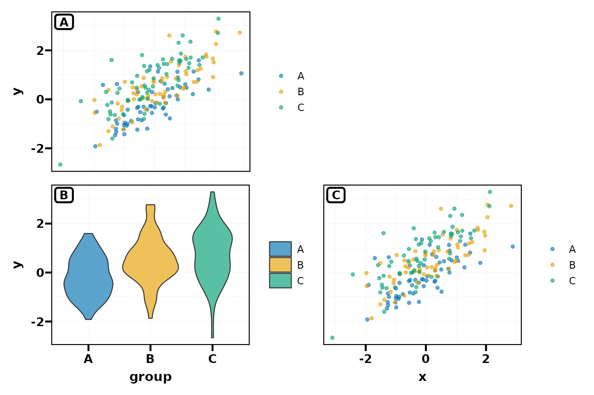{fig-alt="嵌套组合图右上角为空格，三个实际面板标为 A、B、C，保留边界坐标轴。"}

### 标签重复应用

```r
twice <- fmt_tag(p + coord_flip(), labels = "Old", size = 13)
fmt_tag(twice, labels = "New", label_position = "tr", size = 13,
  label.padding = grid::unit(c(0.1, 0.4, 0.1, 0.2), "lines"))
```

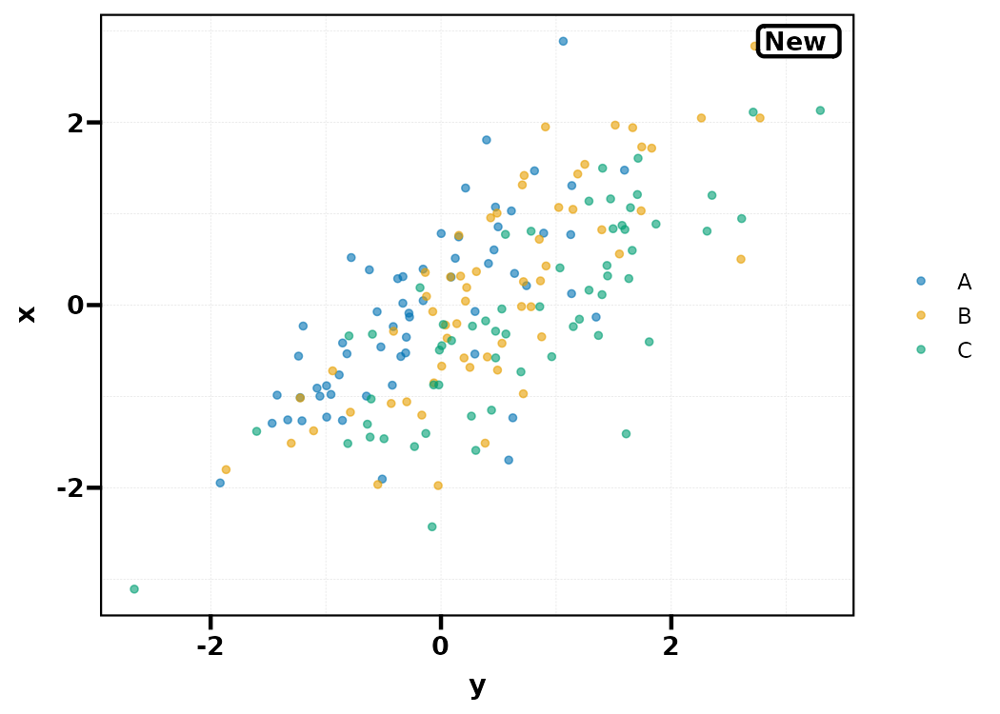{fig-alt="翻转坐标的散点图只有 New 标签，位于右上角，使用不对称内边距。"}

### 共享条带与标签组合

```r
shared <- fmt_strip2(p_matrix, top_label = c("Scatter", "Distribution"),
  right_label = c("Row 1", "Row 2"), ncol = 2,
  top_fill = c("#DDEBF7", NA), right_fill = "#E2F0D9")
fmt_tag(fmt_axis(shared, plot_dims = c(2, 2)), size = 13)
```

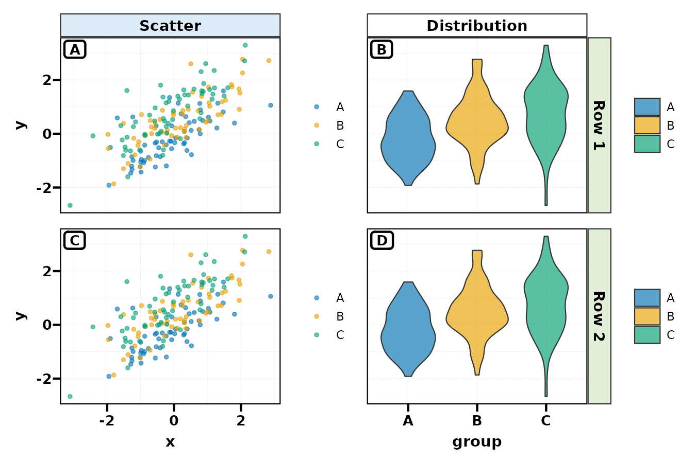{fig-alt="规则四面板布局有列标题、行标题、A 至 D 标签，第二列条带背景透明。"}

:::

## 返回对象、保存与使用边界 {#output}

多数 formatter 支持 ggplot、patchwork 和图列表，尽量保留输入对象类型。`fmt_axisTile(mode="tile")`、插图及图外标签可能把结果组织为 patchwork。格式化顺序有实际影响：后添加的 theme/scale 可能覆盖前面的设置。

```r
final_plot <- fmt_legend(p, legend.position = "bottom")
# ggplot2::ggsave("formatted-scatter.pdf", final_plot, width = 8, height = 5)
```

坐标观察窗、scale limits 与绘图抽样的作用不同。统计标注、添加箱线和分布图层会增加新的计算；配色、字号和标签位置主要改变显示。组合图中共享图例应保证类别映射一致。

## 当前完整接口 {#interfaces}

点击展开查看本次实际执行版本的参数及默认值。

<details>
<summary>公共函数签名</summary>

```r
fmt_plot <-
function (plot, fmt_axis_list = NULL, fmt_tag_list = NULL, fmt_legend_list = NULL, fmt_ref_list = NULL,
    plot.margin = NULL, tag_levels = NULL, axis_titles = NULL, ...)
NULL

fmt_plot_base <-
function (plot, ggtheme = NULL, labs_list = NULL, scale_y_list = NULL, scale_x_list = NULL)
NULL

fmt_axis <-
function (plot, x.axis = FALSE, y.axis = FALSE, plot_dims = NULL)
NULL

fmt_axisText <-
function (plot, x = NULL, y = NULL, x_hjust = NULL, x_vjust = NULL, y_hjust = NULL, y_vjust = NULL,
    size = NULL, color = NULL, face = NULL, ...)
NULL

fmt_axisTile <-
function (plot, colors, mode = c("tile", "text"), axis = c("x", "y"), tile_height = 0.06, tile_width = 0.06,
    tile_border = "white", tile_border_width = 0.2, text_size = 9, text_face = "plain", text_angle = NULL,
    text_color = "black", show_text = TRUE)
NULL

fmt_text <-
function (plot, xlab = NULL, ylab = NULL, title = NULL, subtitle = NULL, caption = NULL, legend_title = NULL,
    title_size = NULL, title_face = NULL, title_color = NULL, title_hjust = NULL, subtitle_size = NULL,
    subtitle_face = NULL, subtitle_color = NULL, caption_size = NULL, caption_face = NULL,
    caption_color = NULL, axis_title_size = NULL, axis_title_face = NULL, axis_title_color = NULL,
    ...)
NULL

fmt_panel <-
function (plot, grid = c("none", "major", "minor", "both", "x", "y"), grid_color = NULL, grid_linewidth = NULL,
    grid_linetype = NULL, border = NULL, border_linewidth = 0.5, bg = NULL, ...)
NULL

fmt_legend <-
function (plot, legend.position = NULL, legend.direction = NULL, legend_theme = NULL, collect = FALSE,
    title = NULL, scale = NULL, scale_width = NULL, scale_height = NULL, ncol = NULL, nrow = NULL,
    ...)
NULL

fmt_tag <-
function (plot, labels = NULL, label_position = c(0.02, 0.98), size = 18, color = "black",
    fontface = "bold", label.size = 1, label.padding = grid::unit(c(0.2, 0.3, 0.2, 0.3), "lines"),
    label.r = grid::unit(0.2, "lines"), ...)
NULL

fmt_ref <-
function (plot, x = NULL, y = NULL, linetype = "dashed", linewidth = 0.5, color = "gray50",
    alpha = 0.8, ...)
NULL

fmt_strip <-
function (plot, label = NULL, label_color = "black", label_fill = NULL, strip = TRUE)
NULL

fmt_strip2 <-
function (plot, top_label = NULL, right_label = NULL, ncol = NULL, top_fill = NULL, right_fill = NULL,
    label_color = "black", top_right_fill = c("Grays", "Greens"))
NULL

fmt_bg <-
function (plot, palette = NULL, palcolor = NULL, alpha = 0.3, bg_axis = c("x", "y"))
NULL

fmt_his <-
function (plot, type = c("histogram", "density", "h", "d"), height_ratio = 0.3, data = NULL,
    con_var = NULL, ...)
NULL

fmt_scale <-
function (plot, x = NULL, y = NULL)
NULL

fmt_expand <-
function (plot, mult = 0, add = c(0, 0), axis = NULL)
NULL

fmt_boxplot <-
function (plot, boxplot.args = list(), inherit.aes = TRUE)
NULL

fmt_point <-
function (plot, type = c("point", "jitter", "beeswarm"), data = NULL, shape = 19, size = 1,
    white_border = FALSE, dodge.width = 0.8, jitter.args = list(width = 0.2, height = 0), beeswarm.args = list(cex = 3,
        corral = "wrap", corral.width = 0.5), sample_n = NULL, seed = 42, rasterize = FALSE,
    rasterize.dpi = 300, ...)
NULL

fmt_com <-
function (plot, com_method = "con", label.y = NULL, label.y.prop = NULL, label = c("p.signif",
    "{p.format}{p.signif}", "p.format"), tip.length = 0.025, step.increase = 0.05, size = 0.8,
    ...)
NULL

theme_my <-
function (palette = "black_and_white", base_size = 14, base_family = "sans", base_fontface = "bold",
    base_line_size = base_size/14, base_rect_size = base_size/14, axis_text_angle = 0, border = TRUE,
    legend.position = "right", panel.grid = element_line(color = "lightgray", linetype = "dashed",
        linewidth = 0.1), panel.grid.minor = element_line(color = "lightgray", linetype = "dashed",
        linewidth = 0.1), panel.spacing = unit(0, "pt"), plot.margin = NULL)
NULL

theme_heat <-
function (base_size = 14, ...)
NULL

theme_blank <-
function (add_coord = TRUE, xlen_npc = 0.15, ylen_npc = 0.15, xlab = "", ylab = "", lab_size = 12,
    ...)
NULL

```

</details>

## 验证范围与参考 {#references}

本页列出的调用均已实际执行；所有展示的 ggplot/patchwork 图通过 `ggplot_build()` 和 PNG 导出，表格来自同一组代码的实际返回。未修改 UtilsR 源码或重新运行全包测试。

本次绘制出现的提示记录如下；对应示例仍通过实际构建和导出检查。

<details>
<summary>绘图提示</summary>

- `Vectorized input to 'element_text()' is not officially supported. ℹ Results may be unexpected or may change in future versions of ggplot2.`
- `Removed 25 rows containing missing values or values outside the scale range ('geom_point()').`

</details>

- [UtilsR 函数参考](https://hui950319.github.io/UtilsR/reference/index.html)
- [UtilsR 源码](https://github.com/HUI950319/UtilsR/tree/main/R)
- [专题目录](index.qmd)

<details>
<summary>执行环境</summary>

```text
R version 4.4.3 (2025-02-28)
Platform: x86_64-pc-linux-gnu
Running under: Ubuntu 22.04.2 LTS

Matrix products: default
BLAS:   /usr/lib/x86_64-linux-gnu/openblas-pthread/libblas.so.3
LAPACK: /usr/lib/x86_64-linux-gnu/openblas-pthread/libopenblasp-r0.3.20.so;  LAPACK version 3.10.0

locale:
 [1] LC_CTYPE=C.UTF-8       LC_NUMERIC=C           LC_TIME=C.UTF-8        LC_COLLATE=C.UTF-8
 [5] LC_MONETARY=C.UTF-8    LC_MESSAGES=C.UTF-8    LC_PAPER=C.UTF-8       LC_NAME=C
 [9] LC_ADDRESS=C           LC_TELEPHONE=C         LC_MEASUREMENT=C.UTF-8 LC_IDENTIFICATION=C

time zone: Asia/Shanghai
tzcode source: system (glibc)

attached base packages:
[1] stats     graphics  grDevices utils     datasets  methods   base

other attached packages:
[1] patchwork_1.3.2 ggplot2_4.0.3   UtilsR_0.6.8

loaded via a namespace (and not attached):
 [1] gtable_0.3.6        circlize_0.4.16     shape_1.4.6.1       httr2_1.2.2
 [5] GlobalOptions_0.1.2 ggrepel_0.9.8       rstatix_0.7.3       lattice_0.23-1
 [9] vctrs_0.7.3         tools_4.4.3         generics_0.1.4      tibble_3.3.1
[13] pkgconfig_2.0.3     ggpp_0.6.0          ggnewscale_0.5.0    RColorBrewer_1.1-3
[17] S7_0.2.2            lifecycle_1.0.5     compiler_4.4.3      farver_2.1.2
[21] stringr_1.6.0       textshaping_0.4.0   ggprism_1.0.7       carData_3.0-6
[25] Formula_1.2-6       car_3.1-5           pillar_1.11.1       ggpubr_0.6.3
[29] tidyr_1.3.2         MASS_7.3-64         plotthis_0.8.2      abind_1.4-8
[33] tidyselect_1.2.1    ggh4x_0.3.1         digest_0.6.39       stringi_1.8.7
[37] dplyr_1.2.0         purrr_1.2.1         labeling_0.4.3      forcats_1.0.1
[41] cowplot_1.2.0       grid_4.4.3          colorspace_2.1-2    cli_3.6.6
[45] magrittr_2.0.4      dichromat_2.0-0.1   broom_1.0.12        withr_3.0.3
[49] scales_1.4.0        backports_1.5.1     rappdirs_0.3.4      otel_0.2.0
[53] ggsignif_0.6.4      ragg_1.5.2          mcptools_0.2.1      zoo_1.9-1
[57] rlang_1.3.0         gridtext_0.1.5      Rcpp_1.1.1          glue_1.8.1
[61] polynom_1.4-1       xml2_1.5.2          coro_1.1.0          jsonlite_2.0.0
[65] ellmer_0.4.0        R6_2.6.1            systemfonts_1.1.0
```

</details>
