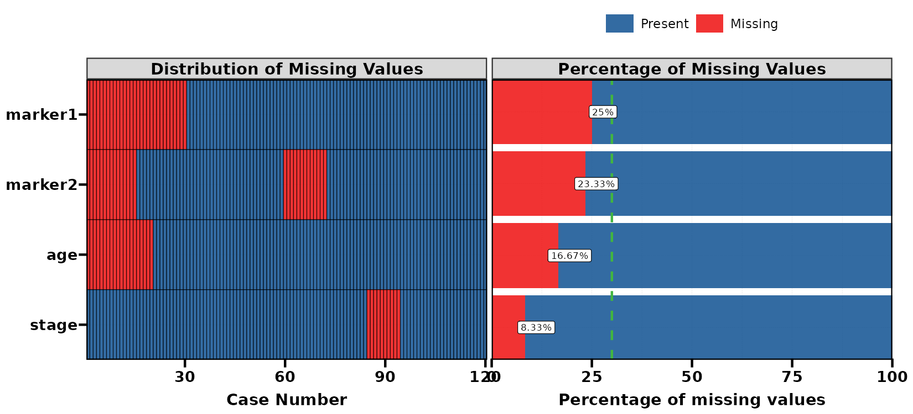
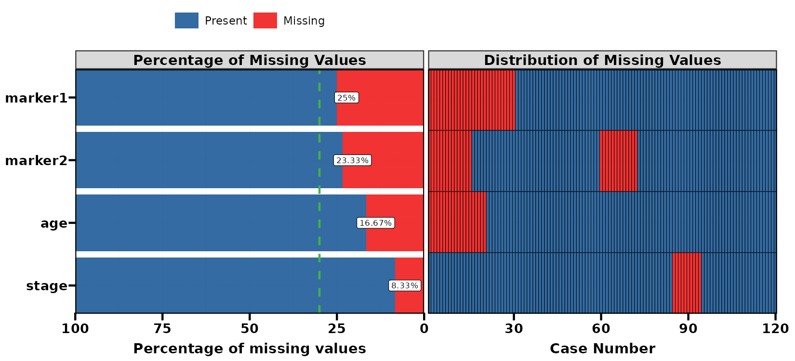
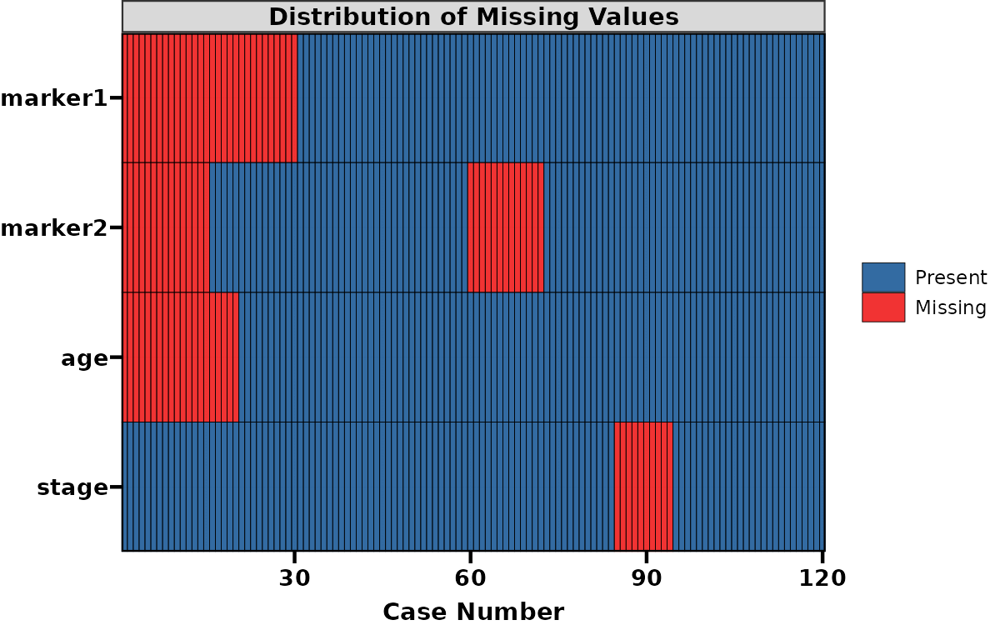
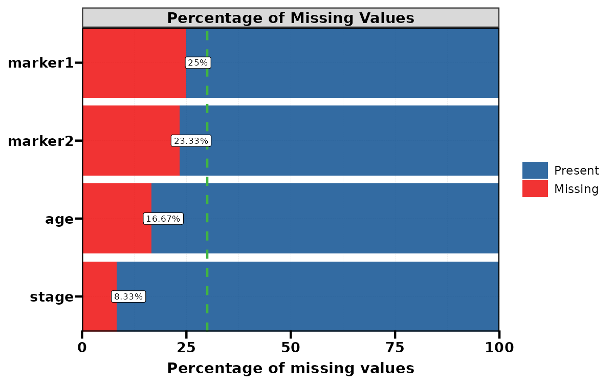
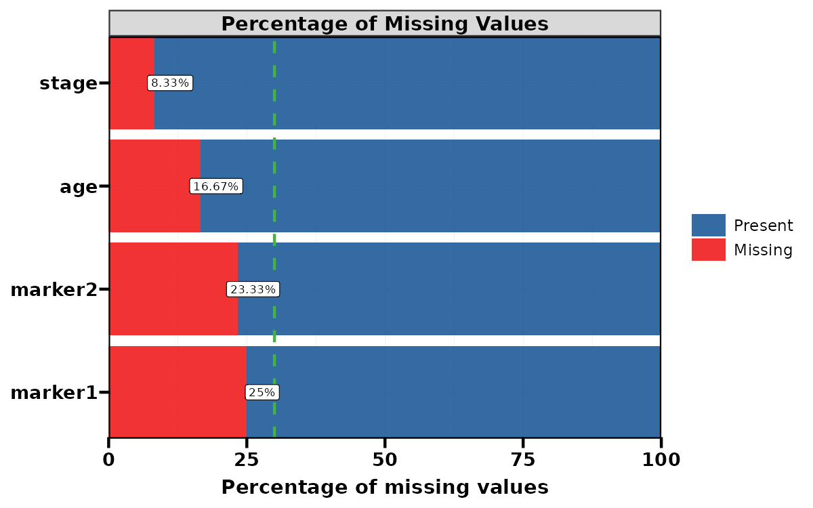
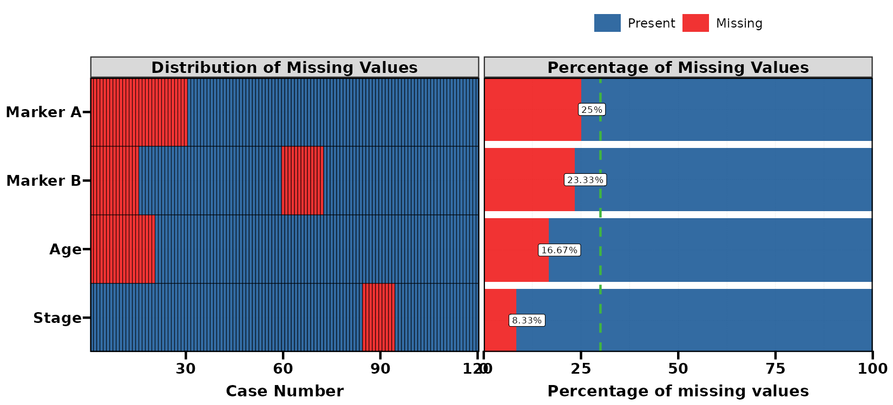
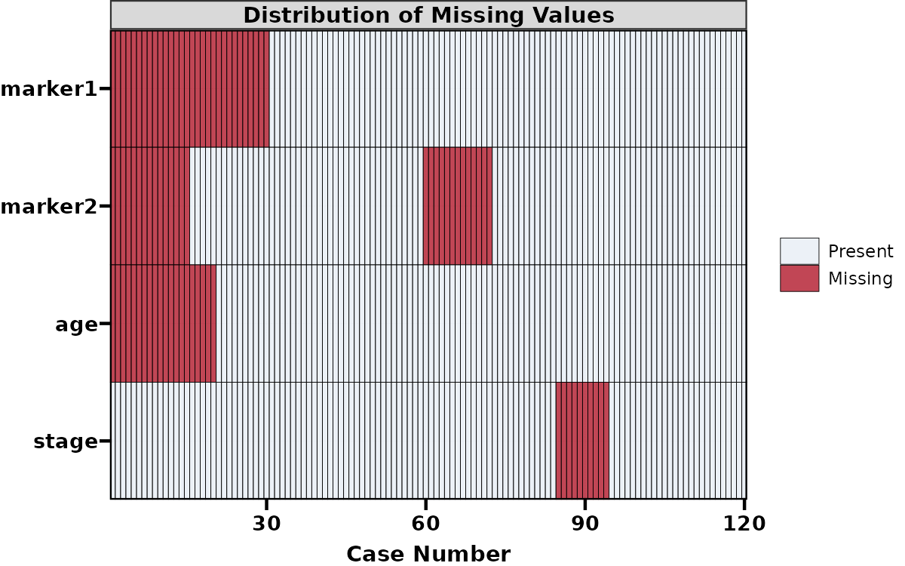
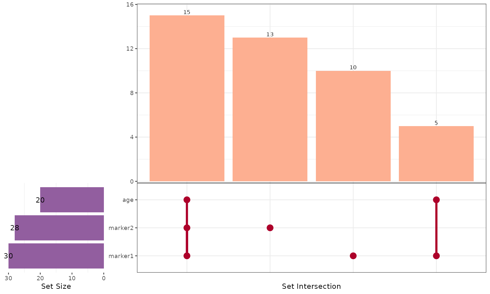
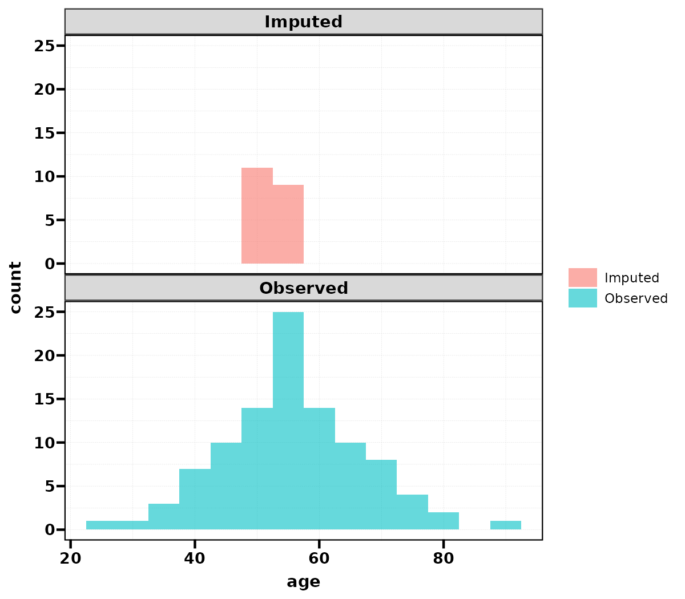

lv 和 check_na 的选择与分组，plt_na 四种布局，联合缺失及 impute_na_knn 的 k 对照。各节用固定输入比较重要参数，标签页中展示可复制代码与实际结果。

**版本与执行范围：** 本页按 UtilsR **0.6.8** 的公共接口核对；23 个示例已在 WSL R 4.4.3 中实际执行，其中 9 张图已完成构建与 PNG 导出。使用固定随机种子的模拟数据。

## 数据准备与输入约定 {#data}

人为设置联合 NA 模式，并保留 unknown、空串和 n/a 字符串供检视；插补输入不含 note，避免将特殊编码当作正常类别。

```r
library(UtilsR)
library(ggplot2)
set.seed(1005)
dat <- data.frame(group = factor(rep(c("A", "B"), each = 60)),
                  age = round(rnorm(120, 55, 10)),
                  marker1 = rnorm(120, 5, 1), marker2 = rnorm(120, 12, 3),
                  stage = factor(sample(c("I", "II", "III"), 120, TRUE)),
                  note = rep(c("known", "unknown", "", "n/a"), 30))
dat[["marker1"]] <- dat[["marker1"]] + dat[["age"]] / 20
dat[["age"]][1:20] <- NA
dat[["marker1"]][1:30] <- NA
dat[["marker2"]][c(1:15, 60:72)] <- NA
dat[["stage"]][85:94] <- NA
impute_input <- dat[c("group", "age", "marker1", "marker2", "stage")]
set.seed(1005)
filled1 <- impute_na_knn(impute_input, k = 1, verbose = FALSE)
set.seed(1005)
filled5 <- impute_na_knn(impute_input, k = 5, verbose = FALSE)
```

## 函数选择与重要参数 {#parameters}

| 函数 | 重要参数 | 当前行为 |
|:--|:--|:--|
| `lv()` | `...`、`pattern=NULL` | tidyselect 选择列或正则选择；教程显式给 data，避免依赖全局 data/data_all |
| `lv()` | `group=NULL`、`count=NULL` | group 是分组摘要；count 是一个或多个交叉计数变量，优先走交叉表模式 |
| `lv()` | `cat_args=list()` | 非空时额外调用 RegR::get_gt_cat；依赖 RegR，结果并不替代基础检视表 |
| `check_na()` | `.../pattern`、`show_all=FALSE` | 默认只列问题变量；show_all 包括无缺失变量；pattern 优先于列选择 |
| `plt_na()` | `output="both"` | both/both_reverse/matrix/percentage 四种布局 |
| `plt_na()` | `sort="desc"`、`name.map=NULL` | 按缺失率排序；命名字符向量替换显示名称 |
| `plt_na()` | `miss_palette` | 前三色依次为存在、缺失和 30% 参考线；只显示存在 NA 的列 |
| `plt_upset()` | `vars`、`levels=NA`、`output`、`label` | 把每列缺失行当作一个集合，查看联合缺失 |
| `impute_na_knn()` | `k=5`、`verbose=TRUE` | k 为邻居数，不超过每个待插补变量的观察供体数；数字用距离加权均值 |
| `check_system()` | `return_result=FALSE`、`show_warnings=FALSE` | 返回系统与 R 环境 list；WSL 结果描述 WSL 进程所在环境 |

## 变量选择和分组检视

::: {.panel-tabset}

### 明确选择列 {.unnumbered}

实际打印的分类变量摘要；lv 不把报告表当作返回值。

```r
lv(dat, group, stage)
```

```{=html}
<div id="xmemfexpdc" style="padding-left:0px;padding-right:0px;padding-top:10px;padding-bottom:10px;overflow-x:auto;overflow-y:auto;width:auto;height:auto;">

  <table class="gt_table" data-quarto-disable-processing="false" data-quarto-bootstrap="false" style="-webkit-font-smoothing: antialiased; -moz-osx-font-smoothing: grayscale; font-family: Calibri, system-ui, 'Segoe UI', Roboto, Helvetica, Arial, sans-serif, 'Apple Color Emoji', 'Segoe UI Emoji', 'Segoe UI Symbol', 'Noto Color Emoji'; display: table; border-collapse: collapse; line-height: normal; margin-left: auto; margin-right: auto; color: #333333; font-size: 16px; font-weight: normal; font-style: normal; background-color: #FFFFFF; width: auto; border-top-style: solid; border-top-width: 2px; border-top-color: #000000; border-right-style: solid; border-right-width: 2px; border-right-color: #000000; border-bottom-style: solid; border-bottom-width: 2px; border-bottom-color: #000000; border-left-style: solid; border-left-width: 2px; border-left-color: #000000;" bgcolor="#FFFFFF">
  <thead style="border-style: none;">
    <tr class="gt_heading" style="border-style: none; background-color: #F0F8FF; text-align: center; border-bottom-color: #FFFFFF; border-left-style: none; border-left-width: 1px; border-left-color: #D3D3D3; border-right-style: none; border-right-width: 1px; border-right-color: #D3D3D3;" bgcolor="#F0F8FF" align="center">
      <td colspan="6" class="gt_heading gt_title gt_font_normal" style="border-style: none; color: #333333; font-size: 125%; padding-top: 4px; padding-bottom: 4px; padding-left: 5px; padding-right: 5px; border-bottom-width: 0; background-color: #F0F8FF; text-align: center; border-bottom-color: #FFFFFF; border-left-style: none; border-left-width: 1px; border-left-color: #D3D3D3; border-right-style: none; border-right-width: 1px; border-right-color: #D3D3D3; font-weight: normal;" bgcolor="#F0F8FF" align="center"><span class="gt_from_md"><strong style="margin-top: 0; margin-bottom: 0;">Variable Summary</strong></span></td>
    </tr>
    <tr class="gt_heading" style="border-style: none; background-color: #F0F8FF; text-align: center; border-bottom-color: #FFFFFF; border-left-style: none; border-left-width: 1px; border-left-color: #D3D3D3; border-right-style: none; border-right-width: 1px; border-right-color: #D3D3D3;" bgcolor="#F0F8FF" align="center">
      <td colspan="6" class="gt_heading gt_subtitle gt_font_normal gt_bottom_border" style="border-style: none; color: #333333; font-size: 85%; padding-top: 3px; padding-bottom: 5px; padding-left: 5px; padding-right: 5px; border-top-color: #FFFFFF; border-top-width: 0; background-color: #F0F8FF; text-align: center; border-left-style: none; border-left-width: 1px; border-left-color: #D3D3D3; border-right-style: none; border-right-width: 1px; border-right-color: #D3D3D3; border-bottom-style: solid; border-bottom-width: 2px; border-bottom-color: #000000; font-weight: normal;" bgcolor="#F0F8FF" align="center"><span class="gt_from_md">Dataset: <em style="margin-top: 0;">120</em> observations, <em>2</em> variables, <em>1</em> missing, <em style="margin-bottom: 0;">0</em> Unknown/Blank/N/A</span></td>
    </tr>
    <tr class="gt_col_headings" style="border-style: none; border-top-style: none; border-top-width: 2px; border-top-color: #D3D3D3; border-bottom-style: solid; border-bottom-width: 2px; border-bottom-color: #000000; border-left-style: none; border-left-width: 1px; border-left-color: #D3D3D3; border-right-style: none; border-right-width: 1px; border-right-color: #D3D3D3;">
      <th class="gt_col_heading gt_columns_bottom_border gt_left" rowspan="1" colspan="1" style="border-style: none; color: #333333; background-color: #E8F4FD; font-size: 85%; text-transform: inherit; border-right-style: none; border-right-width: 1px; border-right-color: #D3D3D3; vertical-align: bottom; padding-top: 5px; padding-bottom: 6px; padding-left: 5px; padding-right: 5px; overflow-x: hidden; text-align: left; border-left-width: 2px; border-left-style: solid; border-left-color: black; font-weight: bold;" scope="col" id="vars" bgcolor="#E8F4FD" valign="bottom" align="left">vars</th>
      <th class="gt_col_heading gt_columns_bottom_border gt_left" rowspan="1" colspan="1" style="border-style: none; color: #333333; background-color: #E8F4FD; font-size: 85%; text-transform: inherit; border-left-style: none; border-left-width: 1px; border-left-color: #D3D3D3; border-right-style: none; border-right-width: 1px; border-right-color: #D3D3D3; vertical-align: bottom; padding-top: 5px; padding-bottom: 6px; padding-left: 5px; padding-right: 5px; overflow-x: hidden; text-align: left; font-weight: bold;" scope="col" id="class" bgcolor="#E8F4FD" valign="bottom" align="left">class</th>
      <th class="gt_col_heading gt_columns_bottom_border gt_center" rowspan="1" colspan="1" style="border-style: none; color: #333333; background-color: #E8F4FD; font-size: 85%; text-transform: inherit; border-left-style: none; border-left-width: 1px; border-left-color: #D3D3D3; border-right-style: none; border-right-width: 1px; border-right-color: #D3D3D3; vertical-align: bottom; padding-top: 5px; padding-bottom: 6px; padding-left: 5px; padding-right: 5px; overflow-x: hidden; text-align: center; font-weight: bold;" scope="col" id="n_unique" bgcolor="#E8F4FD" valign="bottom" align="center">n_unique</th>
      <th class="gt_col_heading gt_columns_bottom_border gt_center" rowspan="1" colspan="1" style="border-style: none; color: #333333; background-color: #E8F4FD; font-size: 85%; text-transform: inherit; border-left-style: none; border-left-width: 1px; border-left-color: #D3D3D3; border-right-style: none; border-right-width: 1px; border-right-color: #D3D3D3; vertical-align: bottom; padding-top: 5px; padding-bottom: 6px; padding-left: 5px; padding-right: 5px; overflow-x: hidden; text-align: center; font-weight: bold;" scope="col" id="n_na" bgcolor="#E8F4FD" valign="bottom" align="center">n_na</th>
      <th class="gt_col_heading gt_columns_bottom_border gt_right" rowspan="1" colspan="1" style="border-style: none; color: #333333; background-color: #E8F4FD; font-size: 85%; text-transform: inherit; border-left-style: none; border-left-width: 1px; border-left-color: #D3D3D3; border-right-style: none; border-right-width: 1px; border-right-color: #D3D3D3; vertical-align: bottom; padding-top: 5px; padding-bottom: 6px; padding-left: 5px; padding-right: 5px; overflow-x: hidden; text-align: right; font-variant-numeric: tabular-nums; font-weight: bold;" scope="col" id="n_special" bgcolor="#E8F4FD" valign="bottom" align="right">n_special</th>
      <th class="gt_col_heading gt_columns_bottom_border gt_center" rowspan="1" colspan="1" style="border-style: none; color: #333333; background-color: #E8F4FD; font-size: 85%; text-transform: inherit; border-left-style: none; border-left-width: 1px; border-left-color: #D3D3D3; vertical-align: bottom; padding-top: 5px; padding-bottom: 6px; padding-left: 5px; padding-right: 5px; overflow-x: hidden; text-align: center; border-right-width: 2px; border-right-style: solid; border-right-color: black; font-weight: bold;" scope="col" id="unique" bgcolor="#E8F4FD" valign="bottom" align="center">unique</th>
    </tr>
  </thead>
  <tbody class="gt_table_body" style="border-style: none; border-top-style: solid; border-top-width: 2px; border-top-color: #D3D3D3; border-bottom-style: solid; border-bottom-width: 2px; border-bottom-color: #D3D3D3;">
    <tr style="border-style: none;"><td headers="vars" class="gt_row gt_left" style="border-style: none; padding-top: 1px; padding-bottom: 1px; padding-left: 5px; padding-right: 5px; margin: 10px; vertical-align: middle; overflow-x: hidden; text-align: left; border-left-width: 2px; border-left-style: solid; border-left-color: black; border-right-width: 1px; border-right-style: solid; border-right-color: black; border-top-width: 1px; border-top-style: solid; border-top-color: black; border-bottom-width: 1px; border-bottom-style: solid; border-bottom-color: black;" valign="middle" align="left">group</td>
<td headers="class" class="gt_row gt_left" style="border-style: none; padding-top: 1px; padding-bottom: 1px; padding-left: 5px; padding-right: 5px; margin: 10px; vertical-align: middle; overflow-x: hidden; text-align: left; border-left-width: 1px; border-left-style: solid; border-left-color: black; border-right-width: 1px; border-right-style: solid; border-right-color: black; border-top-width: 1px; border-top-style: solid; border-top-color: black; border-bottom-width: 1px; border-bottom-style: solid; border-bottom-color: black;" valign="middle" align="left">factor</td>
<td headers="n_unique" class="gt_row gt_center" style="border-style: none; padding-top: 1px; padding-bottom: 1px; padding-left: 5px; padding-right: 5px; margin: 10px; vertical-align: middle; overflow-x: hidden; text-align: center; border-left-width: 1px; border-left-style: solid; border-left-color: black; border-right-width: 1px; border-right-style: solid; border-right-color: black; border-top-width: 1px; border-top-style: solid; border-top-color: black; border-bottom-width: 1px; border-bottom-style: solid; border-bottom-color: black;" valign="middle" align="center">2</td>
<td headers="n_na" class="gt_row gt_center" style="border-style: none; padding-top: 1px; padding-bottom: 1px; padding-left: 5px; padding-right: 5px; margin: 10px; vertical-align: middle; overflow-x: hidden; text-align: center; border-left-width: 1px; border-left-style: solid; border-left-color: black; border-right-width: 1px; border-right-style: solid; border-right-color: black; border-top-width: 1px; border-top-style: solid; border-top-color: black; border-bottom-width: 1px; border-bottom-style: solid; border-bottom-color: black;" valign="middle" align="center">0</td>
<td headers="n_special" class="gt_row gt_right" style="border-style: none; padding-top: 1px; padding-bottom: 1px; padding-left: 5px; padding-right: 5px; margin: 10px; vertical-align: middle; overflow-x: hidden; text-align: right; font-variant-numeric: tabular-nums; border-left-width: 1px; border-left-style: solid; border-left-color: black; border-right-width: 1px; border-right-style: solid; border-right-color: black; border-top-width: 1px; border-top-style: solid; border-top-color: black; border-bottom-width: 1px; border-bottom-style: solid; border-bottom-color: black;" valign="middle" align="right">0</td>
<td headers="unique" class="gt_row gt_center" style="border-style: none; padding-top: 1px; padding-bottom: 1px; padding-left: 5px; padding-right: 5px; margin: 10px; vertical-align: middle; overflow-x: hidden; text-align: center; border-left-width: 1px; border-left-style: solid; border-left-color: black; border-right-width: 2px; border-right-style: solid; border-right-color: black; border-top-width: 1px; border-top-style: solid; border-top-color: black; border-bottom-width: 1px; border-bottom-style: solid; border-bottom-color: black;" valign="middle" align="center">get_flt(group %in% c("A","B"))</td></tr>
    <tr style="border-style: none;"><td headers="vars" class="gt_row gt_left gt_striped" style="border-style: none; padding-top: 1px; padding-bottom: 1px; padding-left: 5px; padding-right: 5px; margin: 10px; vertical-align: middle; overflow-x: hidden; background-color: #D3D3D3; text-align: left; border-left-width: 2px; border-left-style: solid; border-left-color: black; border-right-width: 1px; border-right-style: solid; border-right-color: black; border-top-width: 1px; border-top-style: solid; border-top-color: black; border-bottom-width: 2px; border-bottom-style: solid; border-bottom-color: black;" valign="middle" bgcolor="#D3D3D3" align="left">stage</td>
<td headers="class" class="gt_row gt_left gt_striped" style="border-style: none; padding-top: 1px; padding-bottom: 1px; padding-left: 5px; padding-right: 5px; margin: 10px; vertical-align: middle; overflow-x: hidden; background-color: #D3D3D3; text-align: left; border-left-width: 1px; border-left-style: solid; border-left-color: black; border-right-width: 1px; border-right-style: solid; border-right-color: black; border-top-width: 1px; border-top-style: solid; border-top-color: black; border-bottom-width: 2px; border-bottom-style: solid; border-bottom-color: black;" valign="middle" bgcolor="#D3D3D3" align="left">factor</td>
<td headers="n_unique" class="gt_row gt_center gt_striped" style="border-style: none; padding-top: 1px; padding-bottom: 1px; padding-left: 5px; padding-right: 5px; margin: 10px; vertical-align: middle; overflow-x: hidden; background-color: #D3D3D3; text-align: center; border-left-width: 1px; border-left-style: solid; border-left-color: black; border-right-width: 1px; border-right-style: solid; border-right-color: black; border-top-width: 1px; border-top-style: solid; border-top-color: black; border-bottom-width: 2px; border-bottom-style: solid; border-bottom-color: black;" valign="middle" bgcolor="#D3D3D3" align="center">3</td>
<td headers="n_na" class="gt_row gt_center gt_striped" style="border-style: none; padding-top: 1px; padding-bottom: 1px; padding-left: 5px; padding-right: 5px; margin: 10px; vertical-align: middle; overflow-x: hidden; background-color: #D3D3D3; text-align: center; border-left-width: 1px; border-left-style: solid; border-left-color: black; border-right-width: 1px; border-right-style: solid; border-right-color: black; border-top-width: 1px; border-top-style: solid; border-top-color: black; border-bottom-width: 2px; border-bottom-style: solid; border-bottom-color: black;" valign="middle" bgcolor="#D3D3D3" align="center">10</td>
<td headers="n_special" class="gt_row gt_right gt_striped" style="border-style: none; padding-top: 1px; padding-bottom: 1px; padding-left: 5px; padding-right: 5px; margin: 10px; vertical-align: middle; overflow-x: hidden; background-color: #D3D3D3; text-align: right; font-variant-numeric: tabular-nums; border-left-width: 1px; border-left-style: solid; border-left-color: black; border-right-width: 1px; border-right-style: solid; border-right-color: black; border-top-width: 1px; border-top-style: solid; border-top-color: black; border-bottom-width: 2px; border-bottom-style: solid; border-bottom-color: black;" valign="middle" bgcolor="#D3D3D3" align="right">0</td>
<td headers="unique" class="gt_row gt_center gt_striped" style="border-style: none; padding-top: 1px; padding-bottom: 1px; padding-left: 5px; padding-right: 5px; margin: 10px; vertical-align: middle; overflow-x: hidden; background-color: #D3D3D3; text-align: center; border-left-width: 1px; border-left-style: solid; border-left-color: black; border-right-width: 2px; border-right-style: solid; border-right-color: black; border-top-width: 1px; border-top-style: solid; border-top-color: black; border-bottom-width: 2px; border-bottom-style: solid; border-bottom-color: black;" valign="middle" bgcolor="#D3D3D3" align="center">get_flt(stage %in% c("I","II","III"))</td></tr>
  </tbody>

</table>
</div>
```

### 正则选择 {.unnumbered}

选择两个 marker 列；显示当前调用打印的最后一张摘要表。

```r
lv(dat, pattern = "^marker")
```

```{=html}
<div id="arkdanvveh" style="padding-left:0px;padding-right:0px;padding-top:10px;padding-bottom:10px;overflow-x:auto;overflow-y:auto;width:auto;height:auto;">

  <table class="gt_table" data-quarto-disable-processing="false" data-quarto-bootstrap="false" style="-webkit-font-smoothing: antialiased; -moz-osx-font-smoothing: grayscale; font-family: Calibri, system-ui, 'Segoe UI', Roboto, Helvetica, Arial, sans-serif, 'Apple Color Emoji', 'Segoe UI Emoji', 'Segoe UI Symbol', 'Noto Color Emoji'; display: table; border-collapse: collapse; line-height: normal; margin-left: auto; margin-right: auto; color: #333333; font-size: 16px; font-weight: normal; font-style: normal; background-color: #FFFFFF; width: auto; border-top-style: solid; border-top-width: 2px; border-top-color: #000000; border-right-style: solid; border-right-width: 2px; border-right-color: #000000; border-bottom-style: solid; border-bottom-width: 2px; border-bottom-color: #000000; border-left-style: solid; border-left-width: 2px; border-left-color: #000000;" bgcolor="#FFFFFF">
  <thead style="border-style: none;">
    <tr class="gt_heading" style="border-style: none; background-color: #F0F8FF; text-align: center; border-bottom-color: #FFFFFF; border-left-style: none; border-left-width: 1px; border-left-color: #D3D3D3; border-right-style: none; border-right-width: 1px; border-right-color: #D3D3D3;" bgcolor="#F0F8FF" align="center">
      <td colspan="6" class="gt_heading gt_title gt_font_normal" style="border-style: none; color: #333333; font-size: 125%; padding-top: 4px; padding-bottom: 4px; padding-left: 5px; padding-right: 5px; border-bottom-width: 0; background-color: #F0F8FF; text-align: center; border-bottom-color: #FFFFFF; border-left-style: none; border-left-width: 1px; border-left-color: #D3D3D3; border-right-style: none; border-right-width: 1px; border-right-color: #D3D3D3; font-weight: normal;" bgcolor="#F0F8FF" align="center"><span class="gt_from_md"><strong style="margin-top: 0; margin-bottom: 0;">Variable Summary</strong></span></td>
    </tr>
    <tr class="gt_heading" style="border-style: none; background-color: #F0F8FF; text-align: center; border-bottom-color: #FFFFFF; border-left-style: none; border-left-width: 1px; border-left-color: #D3D3D3; border-right-style: none; border-right-width: 1px; border-right-color: #D3D3D3;" bgcolor="#F0F8FF" align="center">
      <td colspan="6" class="gt_heading gt_subtitle gt_font_normal gt_bottom_border" style="border-style: none; color: #333333; font-size: 85%; padding-top: 3px; padding-bottom: 5px; padding-left: 5px; padding-right: 5px; border-top-color: #FFFFFF; border-top-width: 0; background-color: #F0F8FF; text-align: center; border-left-style: none; border-left-width: 1px; border-left-color: #D3D3D3; border-right-style: none; border-right-width: 1px; border-right-color: #D3D3D3; border-bottom-style: solid; border-bottom-width: 2px; border-bottom-color: #000000; font-weight: normal;" bgcolor="#F0F8FF" align="center"><span class="gt_from_md">Dataset: <em style="margin-top: 0;">120</em> observations, <em>2</em> variables, <em>2</em> missing, <em style="margin-bottom: 0;">0</em> Unknown/Blank/N/A</span></td>
    </tr>
    <tr class="gt_col_headings" style="border-style: none; border-top-style: none; border-top-width: 2px; border-top-color: #D3D3D3; border-bottom-style: solid; border-bottom-width: 2px; border-bottom-color: #000000; border-left-style: none; border-left-width: 1px; border-left-color: #D3D3D3; border-right-style: none; border-right-width: 1px; border-right-color: #D3D3D3;">
      <th class="gt_col_heading gt_columns_bottom_border gt_left" rowspan="1" colspan="1" style="border-style: none; color: #333333; background-color: #E8F4FD; font-size: 85%; text-transform: inherit; border-right-style: none; border-right-width: 1px; border-right-color: #D3D3D3; vertical-align: bottom; padding-top: 5px; padding-bottom: 6px; padding-left: 5px; padding-right: 5px; overflow-x: hidden; text-align: left; border-left-width: 2px; border-left-style: solid; border-left-color: black; font-weight: bold;" scope="col" id="vars" bgcolor="#E8F4FD" valign="bottom" align="left">vars</th>
      <th class="gt_col_heading gt_columns_bottom_border gt_left" rowspan="1" colspan="1" style="border-style: none; color: #333333; background-color: #E8F4FD; font-size: 85%; text-transform: inherit; border-left-style: none; border-left-width: 1px; border-left-color: #D3D3D3; border-right-style: none; border-right-width: 1px; border-right-color: #D3D3D3; vertical-align: bottom; padding-top: 5px; padding-bottom: 6px; padding-left: 5px; padding-right: 5px; overflow-x: hidden; text-align: left; font-weight: bold;" scope="col" id="class" bgcolor="#E8F4FD" valign="bottom" align="left">class</th>
      <th class="gt_col_heading gt_columns_bottom_border gt_center" rowspan="1" colspan="1" style="border-style: none; color: #333333; background-color: #E8F4FD; font-size: 85%; text-transform: inherit; border-left-style: none; border-left-width: 1px; border-left-color: #D3D3D3; border-right-style: none; border-right-width: 1px; border-right-color: #D3D3D3; vertical-align: bottom; padding-top: 5px; padding-bottom: 6px; padding-left: 5px; padding-right: 5px; overflow-x: hidden; text-align: center; font-weight: bold;" scope="col" id="n_unique" bgcolor="#E8F4FD" valign="bottom" align="center">n_unique</th>
      <th class="gt_col_heading gt_columns_bottom_border gt_center" rowspan="1" colspan="1" style="border-style: none; color: #333333; background-color: #E8F4FD; font-size: 85%; text-transform: inherit; border-left-style: none; border-left-width: 1px; border-left-color: #D3D3D3; border-right-style: none; border-right-width: 1px; border-right-color: #D3D3D3; vertical-align: bottom; padding-top: 5px; padding-bottom: 6px; padding-left: 5px; padding-right: 5px; overflow-x: hidden; text-align: center; font-weight: bold;" scope="col" id="n_na" bgcolor="#E8F4FD" valign="bottom" align="center">n_na</th>
      <th class="gt_col_heading gt_columns_bottom_border gt_right" rowspan="1" colspan="1" style="border-style: none; color: #333333; background-color: #E8F4FD; font-size: 85%; text-transform: inherit; border-left-style: none; border-left-width: 1px; border-left-color: #D3D3D3; border-right-style: none; border-right-width: 1px; border-right-color: #D3D3D3; vertical-align: bottom; padding-top: 5px; padding-bottom: 6px; padding-left: 5px; padding-right: 5px; overflow-x: hidden; text-align: right; font-variant-numeric: tabular-nums; font-weight: bold;" scope="col" id="n_special" bgcolor="#E8F4FD" valign="bottom" align="right">n_special</th>
      <th class="gt_col_heading gt_columns_bottom_border gt_center" rowspan="1" colspan="1" style="border-style: none; color: #333333; background-color: #E8F4FD; font-size: 85%; text-transform: inherit; border-left-style: none; border-left-width: 1px; border-left-color: #D3D3D3; vertical-align: bottom; padding-top: 5px; padding-bottom: 6px; padding-left: 5px; padding-right: 5px; overflow-x: hidden; text-align: center; border-right-width: 2px; border-right-style: solid; border-right-color: black; font-weight: bold;" scope="col" id="unique" bgcolor="#E8F4FD" valign="bottom" align="center">unique</th>
    </tr>
  </thead>
  <tbody class="gt_table_body" style="border-style: none; border-top-style: solid; border-top-width: 2px; border-top-color: #D3D3D3; border-bottom-style: solid; border-bottom-width: 2px; border-bottom-color: #D3D3D3;">
    <tr style="border-style: none;"><td headers="vars" class="gt_row gt_left" style="border-style: none; padding-top: 1px; padding-bottom: 1px; padding-left: 5px; padding-right: 5px; margin: 10px; vertical-align: middle; overflow-x: hidden; text-align: left; border-left-width: 2px; border-left-style: solid; border-left-color: black; border-right-width: 1px; border-right-style: solid; border-right-color: black; border-top-width: 1px; border-top-style: solid; border-top-color: black; border-bottom-width: 1px; border-bottom-style: solid; border-bottom-color: black;" valign="middle" align="left">marker1</td>
<td headers="class" class="gt_row gt_left" style="border-style: none; padding-top: 1px; padding-bottom: 1px; padding-left: 5px; padding-right: 5px; margin: 10px; vertical-align: middle; overflow-x: hidden; text-align: left; border-left-width: 1px; border-left-style: solid; border-left-color: black; border-right-width: 1px; border-right-style: solid; border-right-color: black; border-top-width: 1px; border-top-style: solid; border-top-color: black; border-bottom-width: 1px; border-bottom-style: solid; border-bottom-color: black;" valign="middle" align="left">numeric</td>
<td headers="n_unique" class="gt_row gt_center" style="border-style: none; padding-top: 1px; padding-bottom: 1px; padding-left: 5px; padding-right: 5px; margin: 10px; vertical-align: middle; overflow-x: hidden; text-align: center; border-left-width: 1px; border-left-style: solid; border-left-color: black; border-right-width: 1px; border-right-style: solid; border-right-color: black; border-top-width: 1px; border-top-style: solid; border-top-color: black; border-bottom-width: 1px; border-bottom-style: solid; border-bottom-color: black;" valign="middle" align="center">90</td>
<td headers="n_na" class="gt_row gt_center" style="border-style: none; padding-top: 1px; padding-bottom: 1px; padding-left: 5px; padding-right: 5px; margin: 10px; vertical-align: middle; overflow-x: hidden; text-align: center; border-left-width: 1px; border-left-style: solid; border-left-color: black; border-right-width: 1px; border-right-style: solid; border-right-color: black; border-top-width: 1px; border-top-style: solid; border-top-color: black; border-bottom-width: 1px; border-bottom-style: solid; border-bottom-color: black;" valign="middle" align="center">30</td>
<td headers="n_special" class="gt_row gt_right" style="border-style: none; padding-top: 1px; padding-bottom: 1px; padding-left: 5px; padding-right: 5px; margin: 10px; vertical-align: middle; overflow-x: hidden; text-align: right; font-variant-numeric: tabular-nums; border-left-width: 1px; border-left-style: solid; border-left-color: black; border-right-width: 1px; border-right-style: solid; border-right-color: black; border-top-width: 1px; border-top-style: solid; border-top-color: black; border-bottom-width: 1px; border-bottom-style: solid; border-bottom-color: black;" valign="middle" align="right">0</td>
<td headers="unique" class="gt_row gt_center" style="border-style: none; padding-top: 1px; padding-bottom: 1px; padding-left: 5px; padding-right: 5px; margin: 10px; vertical-align: middle; overflow-x: hidden; text-align: center; border-left-width: 1px; border-left-style: solid; border-left-color: black; border-right-width: 2px; border-right-style: solid; border-right-color: black; border-top-width: 1px; border-top-style: solid; border-top-color: black; border-bottom-width: 1px; border-bottom-style: solid; border-bottom-color: black;" valign="middle" align="center">get_flt(marker1 %in% c("8.11986200856372","6.87593135623814","8.50130766764412","6.7321583012915","8.83808948326518","9.77113086035416","9.61443556055998","7.07240342184546","..."))</td></tr>
    <tr style="border-style: none;"><td headers="vars" class="gt_row gt_left gt_striped" style="border-style: none; padding-top: 1px; padding-bottom: 1px; padding-left: 5px; padding-right: 5px; margin: 10px; vertical-align: middle; overflow-x: hidden; background-color: #D3D3D3; text-align: left; border-left-width: 2px; border-left-style: solid; border-left-color: black; border-right-width: 1px; border-right-style: solid; border-right-color: black; border-top-width: 1px; border-top-style: solid; border-top-color: black; border-bottom-width: 2px; border-bottom-style: solid; border-bottom-color: black;" valign="middle" bgcolor="#D3D3D3" align="left">marker2</td>
<td headers="class" class="gt_row gt_left gt_striped" style="border-style: none; padding-top: 1px; padding-bottom: 1px; padding-left: 5px; padding-right: 5px; margin: 10px; vertical-align: middle; overflow-x: hidden; background-color: #D3D3D3; text-align: left; border-left-width: 1px; border-left-style: solid; border-left-color: black; border-right-width: 1px; border-right-style: solid; border-right-color: black; border-top-width: 1px; border-top-style: solid; border-top-color: black; border-bottom-width: 2px; border-bottom-style: solid; border-bottom-color: black;" valign="middle" bgcolor="#D3D3D3" align="left">numeric</td>
<td headers="n_unique" class="gt_row gt_center gt_striped" style="border-style: none; padding-top: 1px; padding-bottom: 1px; padding-left: 5px; padding-right: 5px; margin: 10px; vertical-align: middle; overflow-x: hidden; background-color: #D3D3D3; text-align: center; border-left-width: 1px; border-left-style: solid; border-left-color: black; border-right-width: 1px; border-right-style: solid; border-right-color: black; border-top-width: 1px; border-top-style: solid; border-top-color: black; border-bottom-width: 2px; border-bottom-style: solid; border-bottom-color: black;" valign="middle" bgcolor="#D3D3D3" align="center">92</td>
<td headers="n_na" class="gt_row gt_center gt_striped" style="border-style: none; padding-top: 1px; padding-bottom: 1px; padding-left: 5px; padding-right: 5px; margin: 10px; vertical-align: middle; overflow-x: hidden; background-color: #D3D3D3; text-align: center; border-left-width: 1px; border-left-style: solid; border-left-color: black; border-right-width: 1px; border-right-style: solid; border-right-color: black; border-top-width: 1px; border-top-style: solid; border-top-color: black; border-bottom-width: 2px; border-bottom-style: solid; border-bottom-color: black;" valign="middle" bgcolor="#D3D3D3" align="center">28</td>
<td headers="n_special" class="gt_row gt_right gt_striped" style="border-style: none; padding-top: 1px; padding-bottom: 1px; padding-left: 5px; padding-right: 5px; margin: 10px; vertical-align: middle; overflow-x: hidden; background-color: #D3D3D3; text-align: right; font-variant-numeric: tabular-nums; border-left-width: 1px; border-left-style: solid; border-left-color: black; border-right-width: 1px; border-right-style: solid; border-right-color: black; border-top-width: 1px; border-top-style: solid; border-top-color: black; border-bottom-width: 2px; border-bottom-style: solid; border-bottom-color: black;" valign="middle" bgcolor="#D3D3D3" align="right">0</td>
<td headers="unique" class="gt_row gt_center gt_striped" style="border-style: none; padding-top: 1px; padding-bottom: 1px; padding-left: 5px; padding-right: 5px; margin: 10px; vertical-align: middle; overflow-x: hidden; background-color: #D3D3D3; text-align: center; border-left-width: 1px; border-left-style: solid; border-left-color: black; border-right-width: 2px; border-right-style: solid; border-right-color: black; border-top-width: 1px; border-top-style: solid; border-top-color: black; border-bottom-width: 2px; border-bottom-style: solid; border-bottom-color: black;" valign="middle" bgcolor="#D3D3D3" align="center">get_flt(marker2 %in% c("11.9697555089297","7.56220419440746","10.5346175770749","10.6577125497485","9.84424234431863","8.80373398549144","10.1768875031838","13.0685812392882","..."))</td></tr>
  </tbody>

</table>
</div>
```

### 按组摘要 {.unnumbered}

group 分组统计与列选择独立；本例捕获实际打印的分组摘要 gt 表。

```r
lv(dat, age, marker1, marker2, group = "group")
```

```{=html}
<div id="efturydecy" style="padding-left:0px;padding-right:0px;padding-top:10px;padding-bottom:10px;overflow-x:auto;overflow-y:auto;width:auto;height:auto;">

  <table class="gt_table" data-quarto-disable-processing="false" data-quarto-bootstrap="false" style="-webkit-font-smoothing: antialiased; -moz-osx-font-smoothing: grayscale; font-family: system-ui, 'Segoe UI', Roboto, Helvetica, Arial, sans-serif, 'Apple Color Emoji', 'Segoe UI Emoji', 'Segoe UI Symbol', 'Noto Color Emoji'; display: table; border-collapse: collapse; line-height: normal; margin-left: auto; margin-right: auto; color: #333333; font-size: 13px; font-weight: normal; font-style: normal; background-color: #FFFFFF; width: auto; border-top-style: solid; border-top-width: 2px; border-top-color: #A8A8A8; border-right-style: none; border-right-width: 2px; border-right-color: #D3D3D3; border-bottom-style: solid; border-bottom-width: 2px; border-bottom-color: #A8A8A8; border-left-style: none; border-left-width: 2px; border-left-color: #D3D3D3;" bgcolor="#FFFFFF">
  <thead style="border-style: none;">
    <tr class="gt_col_headings" style="border-style: none; border-top-style: solid; border-top-width: 2px; border-top-color: #D3D3D3; border-bottom-style: solid; border-bottom-width: 2px; border-bottom-color: #D3D3D3; border-left-style: none; border-left-width: 1px; border-left-color: #D3D3D3; border-right-style: none; border-right-width: 1px; border-right-color: #D3D3D3;">
      <th class="gt_col_heading gt_columns_bottom_border gt_left" rowspan="1" colspan="1" scope="col" id="label" style="border-style: none; color: #333333; background-color: #FFFFFF; font-size: 100%; font-weight: normal; text-transform: inherit; border-left-style: none; border-left-width: 1px; border-left-color: #D3D3D3; border-right-style: none; border-right-width: 1px; border-right-color: #D3D3D3; vertical-align: bottom; padding-top: 5px; padding-bottom: 6px; padding-left: 5px; padding-right: 5px; overflow-x: hidden; text-align: left;" bgcolor="#FFFFFF" valign="bottom" align="left"><span class="gt_from_md"><strong style="margin-top: 0; margin-bottom: 0;">Characteristic</strong></span></th>
      <th class="gt_col_heading gt_columns_bottom_border gt_center" rowspan="1" colspan="1" scope="col" id="stat_0" style="border-style: none; color: #333333; background-color: #FFFFFF; font-size: 100%; font-weight: normal; text-transform: inherit; border-left-style: none; border-left-width: 1px; border-left-color: #D3D3D3; border-right-style: none; border-right-width: 1px; border-right-color: #D3D3D3; vertical-align: bottom; padding-top: 5px; padding-bottom: 6px; padding-left: 5px; padding-right: 5px; overflow-x: hidden; text-align: center;" bgcolor="#FFFFFF" valign="bottom" align="center"><span class="gt_from_md"><strong style="margin-top: 0;">Overall</strong><br style="margin-bottom: 0;">
N = 120</span></th>
      <th class="gt_col_heading gt_columns_bottom_border gt_center" rowspan="1" colspan="1" scope="col" id="stat_1" style="border-style: none; color: #333333; background-color: #FFFFFF; font-size: 100%; font-weight: normal; text-transform: inherit; border-left-style: none; border-left-width: 1px; border-left-color: #D3D3D3; border-right-style: none; border-right-width: 1px; border-right-color: #D3D3D3; vertical-align: bottom; padding-top: 5px; padding-bottom: 6px; padding-left: 5px; padding-right: 5px; overflow-x: hidden; text-align: center;" bgcolor="#FFFFFF" valign="bottom" align="center"><span class="gt_from_md"><strong style="margin-top: 0;">A</strong><br style="margin-bottom: 0;">
N = 60</span></th>
      <th class="gt_col_heading gt_columns_bottom_border gt_center" rowspan="1" colspan="1" scope="col" id="stat_2" style="border-style: none; color: #333333; background-color: #FFFFFF; font-size: 100%; font-weight: normal; text-transform: inherit; border-left-style: none; border-left-width: 1px; border-left-color: #D3D3D3; border-right-style: none; border-right-width: 1px; border-right-color: #D3D3D3; vertical-align: bottom; padding-top: 5px; padding-bottom: 6px; padding-left: 5px; padding-right: 5px; overflow-x: hidden; text-align: center;" bgcolor="#FFFFFF" valign="bottom" align="center"><span class="gt_from_md"><strong style="margin-top: 0;">B</strong><br style="margin-bottom: 0;">
N = 60</span></th>
    </tr>
  </thead>
  <tbody class="gt_table_body" style="border-style: none; border-top-style: solid; border-top-width: 2px; border-top-color: #D3D3D3; border-bottom-style: solid; border-bottom-width: 2px; border-bottom-color: #D3D3D3;">
    <tr style="border-style: none;"><td headers="label" class="gt_row gt_left" style="border-style: none; padding-top: 1px; padding-bottom: 1px; padding-left: 5px; padding-right: 5px; margin: 10px; border-top-style: solid; border-top-width: 1px; border-top-color: #D3D3D3; border-left-style: none; border-left-width: 1px; border-left-color: #D3D3D3; border-right-style: none; border-right-width: 1px; border-right-color: #D3D3D3; vertical-align: middle; overflow-x: hidden; text-align: left; font-weight: bold;" valign="middle" align="left">age</td>
<td headers="stat_0" class="gt_row gt_center" style="border-style: none; padding-top: 1px; padding-bottom: 1px; padding-left: 5px; padding-right: 5px; margin: 10px; border-top-style: solid; border-top-width: 1px; border-top-color: #D3D3D3; border-left-style: none; border-left-width: 1px; border-left-color: #D3D3D3; border-right-style: none; border-right-width: 1px; border-right-color: #D3D3D3; vertical-align: middle; overflow-x: hidden; text-align: center;" valign="middle" align="center"><br></td>
<td headers="stat_1" class="gt_row gt_center" style="border-style: none; padding-top: 1px; padding-bottom: 1px; padding-left: 5px; padding-right: 5px; margin: 10px; border-top-style: solid; border-top-width: 1px; border-top-color: #D3D3D3; border-left-style: none; border-left-width: 1px; border-left-color: #D3D3D3; border-right-style: none; border-right-width: 1px; border-right-color: #D3D3D3; vertical-align: middle; overflow-x: hidden; text-align: center;" valign="middle" align="center"><br></td>
<td headers="stat_2" class="gt_row gt_center" style="border-style: none; padding-top: 1px; padding-bottom: 1px; padding-left: 5px; padding-right: 5px; margin: 10px; border-top-style: solid; border-top-width: 1px; border-top-color: #D3D3D3; border-left-style: none; border-left-width: 1px; border-left-color: #D3D3D3; border-right-style: none; border-right-width: 1px; border-right-color: #D3D3D3; vertical-align: middle; overflow-x: hidden; text-align: center;" valign="middle" align="center"><br></td></tr>
    <tr style="border-style: none;"><td headers="label" class="gt_row gt_left" style="border-style: none; padding-top: 1px; padding-bottom: 1px; padding-left: 5px; padding-right: 5px; margin: 10px; border-top-style: solid; border-top-width: 1px; border-top-color: #D3D3D3; border-left-style: none; border-left-width: 1px; border-left-color: #D3D3D3; border-right-style: none; border-right-width: 1px; border-right-color: #D3D3D3; vertical-align: middle; overflow-x: hidden; text-align: left;" valign="middle" align="left">    Median [Q1, Q3]</td>
<td headers="stat_0" class="gt_row gt_center" style="border-style: none; padding-top: 1px; padding-bottom: 1px; padding-left: 5px; padding-right: 5px; margin: 10px; border-top-style: solid; border-top-width: 1px; border-top-color: #D3D3D3; border-left-style: none; border-left-width: 1px; border-left-color: #D3D3D3; border-right-style: none; border-right-width: 1px; border-right-color: #D3D3D3; vertical-align: middle; overflow-x: hidden; text-align: center;" valign="middle" align="center">55 [49, 63]</td>
<td headers="stat_1" class="gt_row gt_center" style="border-style: none; padding-top: 1px; padding-bottom: 1px; padding-left: 5px; padding-right: 5px; margin: 10px; border-top-style: solid; border-top-width: 1px; border-top-color: #D3D3D3; border-left-style: none; border-left-width: 1px; border-left-color: #D3D3D3; border-right-style: none; border-right-width: 1px; border-right-color: #D3D3D3; vertical-align: middle; overflow-x: hidden; text-align: center;" valign="middle" align="center">55 [49, 64]</td>
<td headers="stat_2" class="gt_row gt_center" style="border-style: none; padding-top: 1px; padding-bottom: 1px; padding-left: 5px; padding-right: 5px; margin: 10px; border-top-style: solid; border-top-width: 1px; border-top-color: #D3D3D3; border-left-style: none; border-left-width: 1px; border-left-color: #D3D3D3; border-right-style: none; border-right-width: 1px; border-right-color: #D3D3D3; vertical-align: middle; overflow-x: hidden; text-align: center;" valign="middle" align="center">55 [49, 63]</td></tr>
    <tr style="border-style: none;"><td headers="label" class="gt_row gt_left" style="border-style: none; padding-top: 1px; padding-bottom: 1px; padding-left: 5px; padding-right: 5px; margin: 10px; border-top-style: solid; border-top-width: 1px; border-top-color: #D3D3D3; border-left-style: none; border-left-width: 1px; border-left-color: #D3D3D3; border-right-style: none; border-right-width: 1px; border-right-color: #D3D3D3; vertical-align: middle; overflow-x: hidden; text-align: left;" valign="middle" align="left">    缺失</td>
<td headers="stat_0" class="gt_row gt_center" style="border-style: none; padding-top: 1px; padding-bottom: 1px; padding-left: 5px; padding-right: 5px; margin: 10px; border-top-style: solid; border-top-width: 1px; border-top-color: #D3D3D3; border-left-style: none; border-left-width: 1px; border-left-color: #D3D3D3; border-right-style: none; border-right-width: 1px; border-right-color: #D3D3D3; vertical-align: middle; overflow-x: hidden; text-align: center;" valign="middle" align="center">20</td>
<td headers="stat_1" class="gt_row gt_center" style="border-style: none; padding-top: 1px; padding-bottom: 1px; padding-left: 5px; padding-right: 5px; margin: 10px; border-top-style: solid; border-top-width: 1px; border-top-color: #D3D3D3; border-left-style: none; border-left-width: 1px; border-left-color: #D3D3D3; border-right-style: none; border-right-width: 1px; border-right-color: #D3D3D3; vertical-align: middle; overflow-x: hidden; text-align: center;" valign="middle" align="center">20</td>
<td headers="stat_2" class="gt_row gt_center" style="border-style: none; padding-top: 1px; padding-bottom: 1px; padding-left: 5px; padding-right: 5px; margin: 10px; border-top-style: solid; border-top-width: 1px; border-top-color: #D3D3D3; border-left-style: none; border-left-width: 1px; border-left-color: #D3D3D3; border-right-style: none; border-right-width: 1px; border-right-color: #D3D3D3; vertical-align: middle; overflow-x: hidden; text-align: center;" valign="middle" align="center">0</td></tr>
    <tr style="border-style: none;"><td headers="label" class="gt_row gt_left" style="border-style: none; padding-top: 1px; padding-bottom: 1px; padding-left: 5px; padding-right: 5px; margin: 10px; border-top-style: solid; border-top-width: 1px; border-top-color: #D3D3D3; border-left-style: none; border-left-width: 1px; border-left-color: #D3D3D3; border-right-style: none; border-right-width: 1px; border-right-color: #D3D3D3; vertical-align: middle; overflow-x: hidden; text-align: left; font-weight: bold;" valign="middle" align="left">marker1</td>
<td headers="stat_0" class="gt_row gt_center" style="border-style: none; padding-top: 1px; padding-bottom: 1px; padding-left: 5px; padding-right: 5px; margin: 10px; border-top-style: solid; border-top-width: 1px; border-top-color: #D3D3D3; border-left-style: none; border-left-width: 1px; border-left-color: #D3D3D3; border-right-style: none; border-right-width: 1px; border-right-color: #D3D3D3; vertical-align: middle; overflow-x: hidden; text-align: center;" valign="middle" align="center"><br></td>
<td headers="stat_1" class="gt_row gt_center" style="border-style: none; padding-top: 1px; padding-bottom: 1px; padding-left: 5px; padding-right: 5px; margin: 10px; border-top-style: solid; border-top-width: 1px; border-top-color: #D3D3D3; border-left-style: none; border-left-width: 1px; border-left-color: #D3D3D3; border-right-style: none; border-right-width: 1px; border-right-color: #D3D3D3; vertical-align: middle; overflow-x: hidden; text-align: center;" valign="middle" align="center"><br></td>
<td headers="stat_2" class="gt_row gt_center" style="border-style: none; padding-top: 1px; padding-bottom: 1px; padding-left: 5px; padding-right: 5px; margin: 10px; border-top-style: solid; border-top-width: 1px; border-top-color: #D3D3D3; border-left-style: none; border-left-width: 1px; border-left-color: #D3D3D3; border-right-style: none; border-right-width: 1px; border-right-color: #D3D3D3; vertical-align: middle; overflow-x: hidden; text-align: center;" valign="middle" align="center"><br></td></tr>
    <tr style="border-style: none;"><td headers="label" class="gt_row gt_left" style="border-style: none; padding-top: 1px; padding-bottom: 1px; padding-left: 5px; padding-right: 5px; margin: 10px; border-top-style: solid; border-top-width: 1px; border-top-color: #D3D3D3; border-left-style: none; border-left-width: 1px; border-left-color: #D3D3D3; border-right-style: none; border-right-width: 1px; border-right-color: #D3D3D3; vertical-align: middle; overflow-x: hidden; text-align: left;" valign="middle" align="left">    Median [Q1, Q3]</td>
<td headers="stat_0" class="gt_row gt_center" style="border-style: none; padding-top: 1px; padding-bottom: 1px; padding-left: 5px; padding-right: 5px; margin: 10px; border-top-style: solid; border-top-width: 1px; border-top-color: #D3D3D3; border-left-style: none; border-left-width: 1px; border-left-color: #D3D3D3; border-right-style: none; border-right-width: 1px; border-right-color: #D3D3D3; vertical-align: middle; overflow-x: hidden; text-align: center;" valign="middle" align="center">7.72 [6.89, 8.50]</td>
<td headers="stat_1" class="gt_row gt_center" style="border-style: none; padding-top: 1px; padding-bottom: 1px; padding-left: 5px; padding-right: 5px; margin: 10px; border-top-style: solid; border-top-width: 1px; border-top-color: #D3D3D3; border-left-style: none; border-left-width: 1px; border-left-color: #D3D3D3; border-right-style: none; border-right-width: 1px; border-right-color: #D3D3D3; vertical-align: middle; overflow-x: hidden; text-align: center;" valign="middle" align="center">7.78 [6.82, 8.63]</td>
<td headers="stat_2" class="gt_row gt_center" style="border-style: none; padding-top: 1px; padding-bottom: 1px; padding-left: 5px; padding-right: 5px; margin: 10px; border-top-style: solid; border-top-width: 1px; border-top-color: #D3D3D3; border-left-style: none; border-left-width: 1px; border-left-color: #D3D3D3; border-right-style: none; border-right-width: 1px; border-right-color: #D3D3D3; vertical-align: middle; overflow-x: hidden; text-align: center;" valign="middle" align="center">7.69 [6.99, 8.38]</td></tr>
    <tr style="border-style: none;"><td headers="label" class="gt_row gt_left" style="border-style: none; padding-top: 1px; padding-bottom: 1px; padding-left: 5px; padding-right: 5px; margin: 10px; border-top-style: solid; border-top-width: 1px; border-top-color: #D3D3D3; border-left-style: none; border-left-width: 1px; border-left-color: #D3D3D3; border-right-style: none; border-right-width: 1px; border-right-color: #D3D3D3; vertical-align: middle; overflow-x: hidden; text-align: left;" valign="middle" align="left">    缺失</td>
<td headers="stat_0" class="gt_row gt_center" style="border-style: none; padding-top: 1px; padding-bottom: 1px; padding-left: 5px; padding-right: 5px; margin: 10px; border-top-style: solid; border-top-width: 1px; border-top-color: #D3D3D3; border-left-style: none; border-left-width: 1px; border-left-color: #D3D3D3; border-right-style: none; border-right-width: 1px; border-right-color: #D3D3D3; vertical-align: middle; overflow-x: hidden; text-align: center;" valign="middle" align="center">30</td>
<td headers="stat_1" class="gt_row gt_center" style="border-style: none; padding-top: 1px; padding-bottom: 1px; padding-left: 5px; padding-right: 5px; margin: 10px; border-top-style: solid; border-top-width: 1px; border-top-color: #D3D3D3; border-left-style: none; border-left-width: 1px; border-left-color: #D3D3D3; border-right-style: none; border-right-width: 1px; border-right-color: #D3D3D3; vertical-align: middle; overflow-x: hidden; text-align: center;" valign="middle" align="center">30</td>
<td headers="stat_2" class="gt_row gt_center" style="border-style: none; padding-top: 1px; padding-bottom: 1px; padding-left: 5px; padding-right: 5px; margin: 10px; border-top-style: solid; border-top-width: 1px; border-top-color: #D3D3D3; border-left-style: none; border-left-width: 1px; border-left-color: #D3D3D3; border-right-style: none; border-right-width: 1px; border-right-color: #D3D3D3; vertical-align: middle; overflow-x: hidden; text-align: center;" valign="middle" align="center">0</td></tr>
    <tr style="border-style: none;"><td headers="label" class="gt_row gt_left" style="border-style: none; padding-top: 1px; padding-bottom: 1px; padding-left: 5px; padding-right: 5px; margin: 10px; border-top-style: solid; border-top-width: 1px; border-top-color: #D3D3D3; border-left-style: none; border-left-width: 1px; border-left-color: #D3D3D3; border-right-style: none; border-right-width: 1px; border-right-color: #D3D3D3; vertical-align: middle; overflow-x: hidden; text-align: left; font-weight: bold;" valign="middle" align="left">marker2</td>
<td headers="stat_0" class="gt_row gt_center" style="border-style: none; padding-top: 1px; padding-bottom: 1px; padding-left: 5px; padding-right: 5px; margin: 10px; border-top-style: solid; border-top-width: 1px; border-top-color: #D3D3D3; border-left-style: none; border-left-width: 1px; border-left-color: #D3D3D3; border-right-style: none; border-right-width: 1px; border-right-color: #D3D3D3; vertical-align: middle; overflow-x: hidden; text-align: center;" valign="middle" align="center"><br></td>
<td headers="stat_1" class="gt_row gt_center" style="border-style: none; padding-top: 1px; padding-bottom: 1px; padding-left: 5px; padding-right: 5px; margin: 10px; border-top-style: solid; border-top-width: 1px; border-top-color: #D3D3D3; border-left-style: none; border-left-width: 1px; border-left-color: #D3D3D3; border-right-style: none; border-right-width: 1px; border-right-color: #D3D3D3; vertical-align: middle; overflow-x: hidden; text-align: center;" valign="middle" align="center"><br></td>
<td headers="stat_2" class="gt_row gt_center" style="border-style: none; padding-top: 1px; padding-bottom: 1px; padding-left: 5px; padding-right: 5px; margin: 10px; border-top-style: solid; border-top-width: 1px; border-top-color: #D3D3D3; border-left-style: none; border-left-width: 1px; border-left-color: #D3D3D3; border-right-style: none; border-right-width: 1px; border-right-color: #D3D3D3; vertical-align: middle; overflow-x: hidden; text-align: center;" valign="middle" align="center"><br></td></tr>
    <tr style="border-style: none;"><td headers="label" class="gt_row gt_left" style="border-style: none; padding-top: 1px; padding-bottom: 1px; padding-left: 5px; padding-right: 5px; margin: 10px; border-top-style: solid; border-top-width: 1px; border-top-color: #D3D3D3; border-left-style: none; border-left-width: 1px; border-left-color: #D3D3D3; border-right-style: none; border-right-width: 1px; border-right-color: #D3D3D3; vertical-align: middle; overflow-x: hidden; text-align: left;" valign="middle" align="left">    Median [Q1, Q3]</td>
<td headers="stat_0" class="gt_row gt_center" style="border-style: none; padding-top: 1px; padding-bottom: 1px; padding-left: 5px; padding-right: 5px; margin: 10px; border-top-style: solid; border-top-width: 1px; border-top-color: #D3D3D3; border-left-style: none; border-left-width: 1px; border-left-color: #D3D3D3; border-right-style: none; border-right-width: 1px; border-right-color: #D3D3D3; vertical-align: middle; overflow-x: hidden; text-align: center;" valign="middle" align="center">11.41 [9.81, 13.36]</td>
<td headers="stat_1" class="gt_row gt_center" style="border-style: none; padding-top: 1px; padding-bottom: 1px; padding-left: 5px; padding-right: 5px; margin: 10px; border-top-style: solid; border-top-width: 1px; border-top-color: #D3D3D3; border-left-style: none; border-left-width: 1px; border-left-color: #D3D3D3; border-right-style: none; border-right-width: 1px; border-right-color: #D3D3D3; vertical-align: middle; overflow-x: hidden; text-align: center;" valign="middle" align="center">11.26 [10.01, 12.71]</td>
<td headers="stat_2" class="gt_row gt_center" style="border-style: none; padding-top: 1px; padding-bottom: 1px; padding-left: 5px; padding-right: 5px; margin: 10px; border-top-style: solid; border-top-width: 1px; border-top-color: #D3D3D3; border-left-style: none; border-left-width: 1px; border-left-color: #D3D3D3; border-right-style: none; border-right-width: 1px; border-right-color: #D3D3D3; vertical-align: middle; overflow-x: hidden; text-align: center;" valign="middle" align="center">11.59 [9.15, 13.68]</td></tr>
    <tr style="border-style: none;"><td headers="label" class="gt_row gt_left" style="border-style: none; padding-top: 1px; padding-bottom: 1px; padding-left: 5px; padding-right: 5px; margin: 10px; border-top-style: solid; border-top-width: 1px; border-top-color: #D3D3D3; border-left-style: none; border-left-width: 1px; border-left-color: #D3D3D3; border-right-style: none; border-right-width: 1px; border-right-color: #D3D3D3; vertical-align: middle; overflow-x: hidden; text-align: left;" valign="middle" align="left">    缺失</td>
<td headers="stat_0" class="gt_row gt_center" style="border-style: none; padding-top: 1px; padding-bottom: 1px; padding-left: 5px; padding-right: 5px; margin: 10px; border-top-style: solid; border-top-width: 1px; border-top-color: #D3D3D3; border-left-style: none; border-left-width: 1px; border-left-color: #D3D3D3; border-right-style: none; border-right-width: 1px; border-right-color: #D3D3D3; vertical-align: middle; overflow-x: hidden; text-align: center;" valign="middle" align="center">28</td>
<td headers="stat_1" class="gt_row gt_center" style="border-style: none; padding-top: 1px; padding-bottom: 1px; padding-left: 5px; padding-right: 5px; margin: 10px; border-top-style: solid; border-top-width: 1px; border-top-color: #D3D3D3; border-left-style: none; border-left-width: 1px; border-left-color: #D3D3D3; border-right-style: none; border-right-width: 1px; border-right-color: #D3D3D3; vertical-align: middle; overflow-x: hidden; text-align: center;" valign="middle" align="center">16</td>
<td headers="stat_2" class="gt_row gt_center" style="border-style: none; padding-top: 1px; padding-bottom: 1px; padding-left: 5px; padding-right: 5px; margin: 10px; border-top-style: solid; border-top-width: 1px; border-top-color: #D3D3D3; border-left-style: none; border-left-width: 1px; border-left-color: #D3D3D3; border-right-style: none; border-right-width: 1px; border-right-color: #D3D3D3; vertical-align: middle; overflow-x: hidden; text-align: center;" valign="middle" align="center">12</td></tr>
  </tbody>

</table>
</div>
```

### 两变量交叉表 {.unnumbered}

count 计算 group×stage 交叉频数；有缺失时也须核对分母。

```r
lv(dat, count = c("group", "stage"))
```

```{=html}
<div id="jfczfyzobx" style="padding-left:0px;padding-right:0px;padding-top:10px;padding-bottom:10px;overflow-x:auto;overflow-y:auto;width:auto;height:auto;">

  <table class="gt_table" data-quarto-disable-processing="false" data-quarto-bootstrap="false" style="-webkit-font-smoothing: antialiased; -moz-osx-font-smoothing: grayscale; font-family: Calibri, system-ui, 'Segoe UI', Roboto, Helvetica, Arial, sans-serif, 'Apple Color Emoji', 'Segoe UI Emoji', 'Segoe UI Symbol', 'Noto Color Emoji'; display: table; border-collapse: collapse; line-height: normal; margin-left: auto; margin-right: auto; color: #333333; font-size: 16px; font-weight: normal; font-style: normal; background-color: #FFFFFF; width: auto; border-top-style: solid; border-top-width: 2px; border-top-color: #000000; border-right-style: solid; border-right-width: 2px; border-right-color: #000000; border-bottom-style: solid; border-bottom-width: 2px; border-bottom-color: #000000; border-left-style: solid; border-left-width: 2px; border-left-color: #000000;" bgcolor="#FFFFFF">
  <thead style="border-style: none;">
    <tr class="gt_heading" style="border-style: none; background-color: #F0F8FF; text-align: left; border-bottom-color: #FFFFFF; border-left-style: none; border-left-width: 1px; border-left-color: #D3D3D3; border-right-style: none; border-right-width: 1px; border-right-color: #D3D3D3;" bgcolor="#F0F8FF" align="left">
      <td colspan="6" class="gt_heading gt_title gt_font_normal" style="border-style: none; color: #333333; font-size: 125%; padding-top: 4px; padding-bottom: 4px; padding-left: 5px; padding-right: 5px; border-bottom-width: 0; background-color: #F0F8FF; text-align: left; border-bottom-color: #FFFFFF; border-left-style: none; border-left-width: 1px; border-left-color: #D3D3D3; border-right-style: none; border-right-width: 1px; border-right-color: #D3D3D3; font-weight: normal;" bgcolor="#F0F8FF" align="left"><span class="gt_from_md"><strong style="margin-top: 0; margin-bottom: 0;">group × stage</strong></span></td>
    </tr>
    <tr class="gt_heading" style="border-style: none; background-color: #F0F8FF; text-align: left; border-bottom-color: #FFFFFF; border-left-style: none; border-left-width: 1px; border-left-color: #D3D3D3; border-right-style: none; border-right-width: 1px; border-right-color: #D3D3D3;" bgcolor="#F0F8FF" align="left">
      <td colspan="6" class="gt_heading gt_subtitle gt_font_normal gt_bottom_border" style="border-style: none; color: #333333; font-size: 85%; padding-top: 3px; padding-bottom: 5px; padding-left: 5px; padding-right: 5px; border-top-color: #FFFFFF; border-top-width: 0; background-color: #F0F8FF; text-align: left; border-left-style: none; border-left-width: 1px; border-left-color: #D3D3D3; border-right-style: none; border-right-width: 1px; border-right-color: #D3D3D3; border-bottom-style: solid; border-bottom-width: 2px; border-bottom-color: #000000; font-weight: normal;" bgcolor="#F0F8FF" align="left"><span class="gt_from_md">Cross-tabulation (n = 120)</span></td>
    </tr>
    <tr class="gt_col_headings" style="border-style: none; border-top-style: none; border-top-width: 2px; border-top-color: #D3D3D3; border-bottom-style: solid; border-bottom-width: 2px; border-bottom-color: #000000; border-left-style: none; border-left-width: 1px; border-left-color: #D3D3D3; border-right-style: none; border-right-width: 1px; border-right-color: #D3D3D3;">
      <th class="gt_col_heading gt_columns_bottom_border gt_left" rowspan="1" colspan="1" scope="col" id="a::stub" style="border-style: none; color: #333333; background-color: #E8F4FD; font-size: 85%; font-weight: bold; text-transform: inherit; border-left-style: none; border-left-width: 1px; border-left-color: #D3D3D3; border-right-style: none; border-right-width: 1px; border-right-color: #D3D3D3; vertical-align: bottom; padding-top: 5px; padding-bottom: 6px; padding-left: 5px; padding-right: 5px; overflow-x: hidden; text-align: left;" bgcolor="#E8F4FD" valign="bottom" align="left"><span class="gt_from_md"><strong style="margin-top: 0; margin-bottom: 0;">group</strong></span></th>
      <th class="gt_col_heading gt_columns_bottom_border gt_right" rowspan="1" colspan="1" scope="col" id="I" style="border-style: none; color: #333333; background-color: #E8F4FD; font-size: 85%; font-weight: bold; text-transform: inherit; border-left-style: none; border-left-width: 1px; border-left-color: #D3D3D3; border-right-style: none; border-right-width: 1px; border-right-color: #D3D3D3; vertical-align: bottom; padding-top: 5px; padding-bottom: 6px; padding-left: 5px; padding-right: 5px; overflow-x: hidden; text-align: right; font-variant-numeric: tabular-nums;" bgcolor="#E8F4FD" valign="bottom" align="right">I</th>
      <th class="gt_col_heading gt_columns_bottom_border gt_right" rowspan="1" colspan="1" scope="col" id="II" style="border-style: none; color: #333333; background-color: #E8F4FD; font-size: 85%; font-weight: bold; text-transform: inherit; border-left-style: none; border-left-width: 1px; border-left-color: #D3D3D3; border-right-style: none; border-right-width: 1px; border-right-color: #D3D3D3; vertical-align: bottom; padding-top: 5px; padding-bottom: 6px; padding-left: 5px; padding-right: 5px; overflow-x: hidden; text-align: right; font-variant-numeric: tabular-nums;" bgcolor="#E8F4FD" valign="bottom" align="right">II</th>
      <th class="gt_col_heading gt_columns_bottom_border gt_right" rowspan="1" colspan="1" scope="col" id="III" style="border-style: none; color: #333333; background-color: #E8F4FD; font-size: 85%; font-weight: bold; text-transform: inherit; border-left-style: none; border-left-width: 1px; border-left-color: #D3D3D3; border-right-style: none; border-right-width: 1px; border-right-color: #D3D3D3; vertical-align: bottom; padding-top: 5px; padding-bottom: 6px; padding-left: 5px; padding-right: 5px; overflow-x: hidden; text-align: right; font-variant-numeric: tabular-nums;" bgcolor="#E8F4FD" valign="bottom" align="right">III</th>
      <th class="gt_col_heading gt_columns_bottom_border gt_right" rowspan="1" colspan="1" scope="col" id="NA" style="border-style: none; color: #333333; background-color: #E8F4FD; font-size: 85%; font-weight: bold; text-transform: inherit; border-left-style: none; border-left-width: 1px; border-left-color: #D3D3D3; border-right-style: none; border-right-width: 1px; border-right-color: #D3D3D3; vertical-align: bottom; padding-top: 5px; padding-bottom: 6px; padding-left: 5px; padding-right: 5px; overflow-x: hidden; text-align: right; font-variant-numeric: tabular-nums;" bgcolor="#E8F4FD" valign="bottom" align="right">NA</th>
      <th class="gt_col_heading gt_columns_bottom_border gt_right" rowspan="1" colspan="1" style="border-style: none; color: #333333; background-color: #E8F4FD; font-size: 85%; font-weight: bold; text-transform: inherit; border-left-style: none; border-left-width: 1px; border-left-color: #D3D3D3; vertical-align: bottom; padding-top: 5px; padding-bottom: 6px; padding-left: 5px; padding-right: 5px; overflow-x: hidden; text-align: right; font-variant-numeric: tabular-nums; border-right-width: 2px; border-right-style: solid; border-right-color: black;" scope="col" id="Total" bgcolor="#E8F4FD" valign="bottom" align="right">Total</th>
    </tr>
  </thead>
  <tbody class="gt_table_body" style="border-style: none; border-top-style: solid; border-top-width: 2px; border-top-color: #D3D3D3; border-bottom-style: solid; border-bottom-width: 2px; border-bottom-color: #D3D3D3;">
    <tr style="border-style: none;"><th id="stub_1_1" scope="row" class="gt_row gt_center gt_stub" style="border-style: none; padding-top: 1px; padding-bottom: 1px; margin: 10px; border-top-style: solid; border-top-width: 1px; border-top-color: #000000; vertical-align: middle; overflow-x: hidden; color: #333333; background-color: #F5F5F5; font-size: 100%; font-weight: initial; text-transform: inherit; border-right-style: solid; border-right-width: 2px; border-right-color: #000000; padding-left: 5px; padding-right: 5px; text-align: center; border-left-width: 2px; border-left-style: solid; border-left-color: black;" valign="middle" bgcolor="#F5F5F5" align="center">A</th>
<td headers="stub_1_1 I" class="gt_row gt_right" style="border-style: none; padding-top: 1px; padding-bottom: 1px; padding-left: 5px; padding-right: 5px; margin: 10px; vertical-align: middle; overflow-x: hidden; text-align: right; font-variant-numeric: tabular-nums; border-left-width: 1px; border-left-style: solid; border-left-color: black; border-right-width: 1px; border-right-style: solid; border-right-color: black; border-top-width: 1px; border-top-style: solid; border-top-color: black; border-bottom-width: 1px; border-bottom-style: solid; border-bottom-color: black;" valign="middle" align="right">20</td>
<td headers="stub_1_1 II" class="gt_row gt_right" style="border-style: none; padding-top: 1px; padding-bottom: 1px; padding-left: 5px; padding-right: 5px; margin: 10px; vertical-align: middle; overflow-x: hidden; text-align: right; font-variant-numeric: tabular-nums; border-left-width: 1px; border-left-style: solid; border-left-color: black; border-right-width: 1px; border-right-style: solid; border-right-color: black; border-top-width: 1px; border-top-style: solid; border-top-color: black; border-bottom-width: 1px; border-bottom-style: solid; border-bottom-color: black;" valign="middle" align="right">20</td>
<td headers="stub_1_1 III" class="gt_row gt_right" style="border-style: none; padding-top: 1px; padding-bottom: 1px; padding-left: 5px; padding-right: 5px; margin: 10px; vertical-align: middle; overflow-x: hidden; text-align: right; font-variant-numeric: tabular-nums; border-left-width: 1px; border-left-style: solid; border-left-color: black; border-right-width: 1px; border-right-style: solid; border-right-color: black; border-top-width: 1px; border-top-style: solid; border-top-color: black; border-bottom-width: 1px; border-bottom-style: solid; border-bottom-color: black;" valign="middle" align="right">20</td>
<td headers="stub_1_1 NA" class="gt_row gt_right" style="border-style: none; padding-top: 1px; padding-bottom: 1px; padding-left: 5px; padding-right: 5px; margin: 10px; vertical-align: middle; overflow-x: hidden; text-align: right; font-variant-numeric: tabular-nums; border-left-width: 1px; border-left-style: solid; border-left-color: black; border-right-width: 1px; border-right-style: solid; border-right-color: black; border-top-width: 1px; border-top-style: solid; border-top-color: black; border-bottom-width: 1px; border-bottom-style: solid; border-bottom-color: black;" valign="middle" align="right">0</td>
<td headers="stub_1_1 Total" class="gt_row gt_right" style="border-style: none; padding-top: 1px; padding-bottom: 1px; padding-left: 5px; padding-right: 5px; margin: 10px; vertical-align: middle; overflow-x: hidden; text-align: right; font-variant-numeric: tabular-nums; border-left-width: 1px; border-left-style: solid; border-left-color: black; border-right-width: 2px; border-right-style: solid; border-right-color: black; border-top-width: 1px; border-top-style: solid; border-top-color: black; border-bottom-width: 1px; border-bottom-style: solid; border-bottom-color: black;" valign="middle" align="right">60</td></tr>
    <tr style="border-style: none;"><th id="stub_1_2" scope="row" class="gt_row gt_center gt_stub" style="border-style: none; padding-top: 1px; padding-bottom: 1px; margin: 10px; border-top-style: solid; border-top-width: 1px; border-top-color: #000000; vertical-align: middle; overflow-x: hidden; color: #333333; background-color: #F5F5F5; font-size: 100%; font-weight: initial; text-transform: inherit; border-right-style: solid; border-right-width: 2px; border-right-color: #000000; padding-left: 5px; padding-right: 5px; text-align: center; border-left-width: 2px; border-left-style: solid; border-left-color: black; border-bottom-width: 2px; border-bottom-style: solid; border-bottom-color: black;" valign="middle" bgcolor="#F5F5F5" align="center">B</th>
<td headers="stub_1_2 I" class="gt_row gt_right gt_striped" style="border-style: none; padding-top: 1px; padding-bottom: 1px; padding-left: 5px; padding-right: 5px; margin: 10px; vertical-align: middle; overflow-x: hidden; background-color: #D3D3D3; text-align: right; font-variant-numeric: tabular-nums; border-left-width: 1px; border-left-style: solid; border-left-color: black; border-right-width: 1px; border-right-style: solid; border-right-color: black; border-top-width: 1px; border-top-style: solid; border-top-color: black; border-bottom-width: 2px; border-bottom-style: solid; border-bottom-color: black;" valign="middle" bgcolor="#D3D3D3" align="right">11</td>
<td headers="stub_1_2 II" class="gt_row gt_right gt_striped" style="border-style: none; padding-top: 1px; padding-bottom: 1px; padding-left: 5px; padding-right: 5px; margin: 10px; vertical-align: middle; overflow-x: hidden; background-color: #D3D3D3; text-align: right; font-variant-numeric: tabular-nums; border-left-width: 1px; border-left-style: solid; border-left-color: black; border-right-width: 1px; border-right-style: solid; border-right-color: black; border-top-width: 1px; border-top-style: solid; border-top-color: black; border-bottom-width: 2px; border-bottom-style: solid; border-bottom-color: black;" valign="middle" bgcolor="#D3D3D3" align="right">20</td>
<td headers="stub_1_2 III" class="gt_row gt_right gt_striped" style="border-style: none; padding-top: 1px; padding-bottom: 1px; padding-left: 5px; padding-right: 5px; margin: 10px; vertical-align: middle; overflow-x: hidden; background-color: #D3D3D3; text-align: right; font-variant-numeric: tabular-nums; border-left-width: 1px; border-left-style: solid; border-left-color: black; border-right-width: 1px; border-right-style: solid; border-right-color: black; border-top-width: 1px; border-top-style: solid; border-top-color: black; border-bottom-width: 2px; border-bottom-style: solid; border-bottom-color: black;" valign="middle" bgcolor="#D3D3D3" align="right">19</td>
<td headers="stub_1_2 NA" class="gt_row gt_right gt_striped" style="border-style: none; padding-top: 1px; padding-bottom: 1px; padding-left: 5px; padding-right: 5px; margin: 10px; vertical-align: middle; overflow-x: hidden; background-color: #D3D3D3; text-align: right; font-variant-numeric: tabular-nums; border-left-width: 1px; border-left-style: solid; border-left-color: black; border-right-width: 1px; border-right-style: solid; border-right-color: black; border-top-width: 1px; border-top-style: solid; border-top-color: black; border-bottom-width: 2px; border-bottom-style: solid; border-bottom-color: black;" valign="middle" bgcolor="#D3D3D3" align="right">10</td>
<td headers="stub_1_2 Total" class="gt_row gt_right gt_striped" style="border-style: none; padding-top: 1px; padding-bottom: 1px; padding-left: 5px; padding-right: 5px; margin: 10px; vertical-align: middle; overflow-x: hidden; background-color: #D3D3D3; text-align: right; font-variant-numeric: tabular-nums; border-left-width: 1px; border-left-style: solid; border-left-color: black; border-right-width: 2px; border-right-style: solid; border-right-color: black; border-top-width: 1px; border-top-style: solid; border-top-color: black; border-bottom-width: 2px; border-bottom-style: solid; border-bottom-color: black;" valign="middle" bgcolor="#D3D3D3" align="right">60</td></tr>
    <tr style="border-style: none;"><th id="grand_summary_stub_1" scope="row" class="gt_row gt_left gt_stub gt_grand_summary_row gt_first_grand_summary_row gt_last_summary_row" style="border-style: none; margin: 10px; border-left-style: none; border-left-width: 1px; border-left-color: #000000; vertical-align: middle; overflow-x: hidden; font-size: 100%; font-weight: initial; border-right-style: solid; border-right-width: 2px; border-right-color: #000000; border-bottom-style: solid; border-bottom-width: 2px; border-bottom-color: #D3D3D3; color: #333333; background-color: #FFFFFF; text-transform: inherit; padding-top: 8px; padding-bottom: 8px; padding-left: 5px; padding-right: 5px; border-top-style: double; border-top-width: 6px; border-top-color: #D3D3D3; text-align: left;" valign="middle" bgcolor="#FFFFFF" align="left">Total</th>
<td headers="grand_summary_stub_1 I" class="gt_row gt_right gt_grand_summary_row gt_first_grand_summary_row gt_last_summary_row" style="border-style: none; margin: 10px; border-left-style: none; border-left-width: 1px; border-left-color: #000000; border-right-style: none; border-right-width: 1px; border-right-color: #000000; vertical-align: middle; overflow-x: hidden; border-bottom-style: solid; border-bottom-width: 2px; border-bottom-color: #D3D3D3; color: #333333; background-color: #FFFFFF; text-transform: inherit; padding-top: 8px; padding-bottom: 8px; padding-left: 5px; padding-right: 5px; border-top-style: double; border-top-width: 6px; border-top-color: #D3D3D3; text-align: right; font-variant-numeric: tabular-nums;" valign="middle" bgcolor="#FFFFFF" align="right">31</td>
<td headers="grand_summary_stub_1 II" class="gt_row gt_right gt_grand_summary_row gt_first_grand_summary_row gt_last_summary_row" style="border-style: none; margin: 10px; border-left-style: none; border-left-width: 1px; border-left-color: #000000; border-right-style: none; border-right-width: 1px; border-right-color: #000000; vertical-align: middle; overflow-x: hidden; border-bottom-style: solid; border-bottom-width: 2px; border-bottom-color: #D3D3D3; color: #333333; background-color: #FFFFFF; text-transform: inherit; padding-top: 8px; padding-bottom: 8px; padding-left: 5px; padding-right: 5px; border-top-style: double; border-top-width: 6px; border-top-color: #D3D3D3; text-align: right; font-variant-numeric: tabular-nums;" valign="middle" bgcolor="#FFFFFF" align="right">40</td>
<td headers="grand_summary_stub_1 III" class="gt_row gt_right gt_grand_summary_row gt_first_grand_summary_row gt_last_summary_row" style="border-style: none; margin: 10px; border-left-style: none; border-left-width: 1px; border-left-color: #000000; border-right-style: none; border-right-width: 1px; border-right-color: #000000; vertical-align: middle; overflow-x: hidden; border-bottom-style: solid; border-bottom-width: 2px; border-bottom-color: #D3D3D3; color: #333333; background-color: #FFFFFF; text-transform: inherit; padding-top: 8px; padding-bottom: 8px; padding-left: 5px; padding-right: 5px; border-top-style: double; border-top-width: 6px; border-top-color: #D3D3D3; text-align: right; font-variant-numeric: tabular-nums;" valign="middle" bgcolor="#FFFFFF" align="right">39</td>
<td headers="grand_summary_stub_1 NA" class="gt_row gt_right gt_grand_summary_row gt_first_grand_summary_row gt_last_summary_row" style="border-style: none; margin: 10px; border-left-style: none; border-left-width: 1px; border-left-color: #000000; border-right-style: none; border-right-width: 1px; border-right-color: #000000; vertical-align: middle; overflow-x: hidden; border-bottom-style: solid; border-bottom-width: 2px; border-bottom-color: #D3D3D3; color: #333333; background-color: #FFFFFF; text-transform: inherit; padding-top: 8px; padding-bottom: 8px; padding-left: 5px; padding-right: 5px; border-top-style: double; border-top-width: 6px; border-top-color: #D3D3D3; text-align: right; font-variant-numeric: tabular-nums;" valign="middle" bgcolor="#FFFFFF" align="right">10</td>
<td headers="grand_summary_stub_1 Total" class="gt_row gt_right gt_grand_summary_row gt_first_grand_summary_row gt_last_summary_row" style="border-style: none; margin: 10px; border-left-style: none; border-left-width: 1px; border-left-color: #000000; border-right-style: none; border-right-width: 1px; border-right-color: #000000; vertical-align: middle; overflow-x: hidden; border-bottom-style: solid; border-bottom-width: 2px; border-bottom-color: #D3D3D3; color: #333333; background-color: #FFFFFF; text-transform: inherit; padding-top: 8px; padding-bottom: 8px; padding-left: 5px; padding-right: 5px; border-top-style: double; border-top-width: 6px; border-top-color: #D3D3D3; text-align: right; font-variant-numeric: tabular-nums;" valign="middle" bgcolor="#FFFFFF" align="right">120</td></tr>
  </tbody>

</table>
</div>
```

:::

## 数据质量报告

::: {.panel-tabset}

### 只显示问题变量 {.unnumbered}

NA 与特殊字符串分开列示；unknown 和空字符串不会自动转为 NA。

```r
check_na(dat)
```

```{=html}
<div id="jrtlfetwsh" style="padding-left:0px;padding-right:0px;padding-top:10px;padding-bottom:10px;overflow-x:auto;overflow-y:auto;width:auto;height:auto;">

  <table class="gt_table" data-quarto-disable-processing="false" data-quarto-bootstrap="false" style="-webkit-font-smoothing: antialiased; -moz-osx-font-smoothing: grayscale; font-family: system-ui, 'Segoe UI', Roboto, Helvetica, Arial, sans-serif, 'Apple Color Emoji', 'Segoe UI Emoji', 'Segoe UI Symbol', 'Noto Color Emoji'; display: table; border-collapse: collapse; line-height: normal; margin-left: auto; margin-right: auto; color: #333333; font-size: 12px; font-weight: normal; font-style: normal; background-color: #FFFFFF; width: auto; border-top-style: solid; border-top-width: 2px; border-top-color: #A8A8A8; border-right-style: none; border-right-width: 2px; border-right-color: #D3D3D3; border-bottom-style: solid; border-bottom-width: 2px; border-bottom-color: #A8A8A8; border-left-style: none; border-left-width: 2px; border-left-color: #D3D3D3;" bgcolor="#FFFFFF">
  <thead style="border-style: none;">
    <tr class="gt_heading" style="border-style: none; background-color: #F0F8FF; text-align: center; border-bottom-color: #FFFFFF; border-left-style: none; border-left-width: 1px; border-left-color: #D3D3D3; border-right-style: none; border-right-width: 1px; border-right-color: #D3D3D3;" bgcolor="#F0F8FF" align="center">
      <td colspan="4" class="gt_heading gt_title gt_font_normal" style="border-style: none; color: #333333; font-size: 125%; padding-top: 4px; padding-bottom: 4px; padding-left: 5px; padding-right: 5px; border-bottom-width: 0; background-color: #F0F8FF; text-align: center; border-bottom-color: #FFFFFF; border-left-style: none; border-left-width: 1px; border-left-color: #D3D3D3; border-right-style: none; border-right-width: 1px; border-right-color: #D3D3D3; font-weight: normal;" bgcolor="#F0F8FF" align="center"><span class="gt_from_md"><strong style="margin-top: 0; margin-bottom: 0;">Missing &amp; Special Value Analysis</strong></span></td>
    </tr>
    <tr class="gt_heading" style="border-style: none; background-color: #F0F8FF; text-align: center; border-bottom-color: #FFFFFF; border-left-style: none; border-left-width: 1px; border-left-color: #D3D3D3; border-right-style: none; border-right-width: 1px; border-right-color: #D3D3D3;" bgcolor="#F0F8FF" align="center">
      <td colspan="4" class="gt_heading gt_subtitle gt_font_normal gt_bottom_border" style="border-style: none; color: #333333; font-size: 85%; padding-top: 3px; padding-bottom: 5px; padding-left: 5px; padding-right: 5px; border-top-color: #FFFFFF; border-top-width: 0; background-color: #F0F8FF; text-align: center; border-left-style: none; border-left-width: 1px; border-left-color: #D3D3D3; border-right-style: none; border-right-width: 1px; border-right-color: #D3D3D3; border-bottom-style: solid; border-bottom-width: 2px; border-bottom-color: #D3D3D3; font-weight: normal;" bgcolor="#F0F8FF" align="center"><span class="gt_from_md">Dataset: <em style="margin-top: 0;">120</em> observations, <em>6</em> variables, <em>4</em> missing, <em style="margin-bottom: 0;">1</em> Unknown/Blank/N/A</span></td>
    </tr>
    <tr class="gt_col_headings" style="border-style: none; border-top-style: solid; border-top-width: 2px; border-top-color: #D3D3D3; border-bottom-style: solid; border-bottom-width: 2px; border-bottom-color: #D3D3D3; border-left-style: none; border-left-width: 1px; border-left-color: #D3D3D3; border-right-style: none; border-right-width: 1px; border-right-color: #D3D3D3;">
      <th class="gt_col_heading gt_columns_bottom_border gt_left" rowspan="1" colspan="1" style="border-style: none; color: #333333; background-color: #E8F4FD; font-size: 100%; text-transform: inherit; border-left-style: none; border-left-width: 1px; border-left-color: #D3D3D3; border-right-style: none; border-right-width: 1px; border-right-color: #D3D3D3; vertical-align: bottom; padding-top: 5px; padding-bottom: 6px; padding-left: 5px; padding-right: 5px; overflow-x: hidden; text-align: left; font-weight: bold;" scope="col" id="variable" bgcolor="#E8F4FD" valign="bottom" align="left"><span class="gt_from_md"><strong style="margin-top: 0; margin-bottom: 0;">Variable</strong></span></th>
      <th class="gt_col_heading gt_columns_bottom_border gt_right" rowspan="1" colspan="1" style="border-style: none; color: #333333; background-color: #E8F4FD; font-size: 100%; text-transform: inherit; border-left-style: none; border-left-width: 1px; border-left-color: #D3D3D3; border-right-style: none; border-right-width: 1px; border-right-color: #D3D3D3; vertical-align: bottom; padding-top: 5px; padding-bottom: 6px; padding-left: 5px; padding-right: 5px; overflow-x: hidden; text-align: right; font-variant-numeric: tabular-nums; font-weight: bold;" scope="col" id="missing_combined" bgcolor="#E8F4FD" valign="bottom" align="right"><span class="gt_from_md"><strong style="margin-top: 0; margin-bottom: 0;">Missing</strong></span></th>
      <th class="gt_col_heading gt_columns_bottom_border gt_right" rowspan="1" colspan="1" style="border-style: none; color: #333333; background-color: #E8F4FD; font-size: 100%; text-transform: inherit; border-left-style: none; border-left-width: 1px; border-left-color: #D3D3D3; border-right-style: none; border-right-width: 1px; border-right-color: #D3D3D3; vertical-align: bottom; padding-top: 5px; padding-bottom: 6px; padding-left: 5px; padding-right: 5px; overflow-x: hidden; text-align: right; font-variant-numeric: tabular-nums; font-weight: bold;" scope="col" id="special_combined" bgcolor="#E8F4FD" valign="bottom" align="right"><span class="gt_from_md"><strong style="margin-top: 0; margin-bottom: 0;">Unknown/Blank/N/A</strong></span></th>
      <th class="gt_col_heading gt_columns_bottom_border gt_left" rowspan="1" colspan="1" style="border-style: none; color: #333333; background-color: #E8F4FD; font-size: 100%; text-transform: inherit; border-left-style: none; border-left-width: 1px; border-left-color: #D3D3D3; border-right-style: none; border-right-width: 1px; border-right-color: #D3D3D3; vertical-align: bottom; padding-top: 5px; padding-bottom: 6px; padding-left: 5px; padding-right: 5px; overflow-x: hidden; text-align: left; font-weight: bold;" scope="col" id="data_type" bgcolor="#E8F4FD" valign="bottom" align="left"><span class="gt_from_md"><strong style="margin-top: 0; margin-bottom: 0;">Data Type</strong></span></th>
    </tr>
  </thead>
  <tbody class="gt_table_body" style="border-style: none; border-top-style: solid; border-top-width: 2px; border-top-color: #D3D3D3; border-bottom-style: solid; border-bottom-width: 2px; border-bottom-color: #D3D3D3;">
    <tr style="border-style: none;"><td headers="variable" class="gt_row gt_left" style="border-style: none; padding-top: 8px; padding-bottom: 8px; padding-left: 5px; padding-right: 5px; margin: 10px; border-top-style: solid; border-top-width: 1px; border-top-color: #D3D3D3; border-left-style: none; border-left-width: 1px; border-left-color: #D3D3D3; border-right-style: none; border-right-width: 1px; border-right-color: #D3D3D3; vertical-align: middle; overflow-x: hidden; text-align: left; background-color: #FFF3E0;" bgcolor="#FFF3E0" valign="middle" align="left">marker1</td>
<td headers="missing_combined" class="gt_row gt_right" style="border-style: none; padding-top: 8px; padding-bottom: 8px; padding-left: 5px; padding-right: 5px; margin: 10px; border-top-style: solid; border-top-width: 1px; border-top-color: #D3D3D3; border-left-style: none; border-left-width: 1px; border-left-color: #D3D3D3; border-right-style: none; border-right-width: 1px; border-right-color: #D3D3D3; vertical-align: middle; overflow-x: hidden; font-variant-numeric: tabular-nums; text-align: center; background-color: #FFCC80;" align="center" bgcolor="#FFCC80" valign="middle">30 (25.0%)</td>
<td headers="special_combined" class="gt_row gt_right" style="border-style: none; padding-top: 8px; padding-bottom: 8px; padding-left: 5px; padding-right: 5px; margin: 10px; border-top-style: solid; border-top-width: 1px; border-top-color: #D3D3D3; border-left-style: none; border-left-width: 1px; border-left-color: #D3D3D3; border-right-style: none; border-right-width: 1px; border-right-color: #D3D3D3; vertical-align: middle; overflow-x: hidden; font-variant-numeric: tabular-nums; text-align: center;" align="center" valign="middle">0 (0.0%)</td>
<td headers="data_type" class="gt_row gt_left" style="border-style: none; padding-top: 8px; padding-bottom: 8px; padding-left: 5px; padding-right: 5px; margin: 10px; border-top-style: solid; border-top-width: 1px; border-top-color: #D3D3D3; border-left-style: none; border-left-width: 1px; border-left-color: #D3D3D3; border-right-style: none; border-right-width: 1px; border-right-color: #D3D3D3; vertical-align: middle; overflow-x: hidden; text-align: left; background-color: #FFF3E0;" bgcolor="#FFF3E0" valign="middle" align="left">numeric</td></tr>
    <tr style="border-style: none;"><td headers="variable" class="gt_row gt_left" style="border-style: none; padding-top: 8px; padding-bottom: 8px; padding-left: 5px; padding-right: 5px; margin: 10px; border-top-style: solid; border-top-width: 1px; border-top-color: #D3D3D3; border-left-style: none; border-left-width: 1px; border-left-color: #D3D3D3; border-right-style: none; border-right-width: 1px; border-right-color: #D3D3D3; vertical-align: middle; overflow-x: hidden; text-align: left; background-color: #FFF3E0;" bgcolor="#FFF3E0" valign="middle" align="left">marker2</td>
<td headers="missing_combined" class="gt_row gt_right" style="border-style: none; padding-top: 8px; padding-bottom: 8px; padding-left: 5px; padding-right: 5px; margin: 10px; border-top-style: solid; border-top-width: 1px; border-top-color: #D3D3D3; border-left-style: none; border-left-width: 1px; border-left-color: #D3D3D3; border-right-style: none; border-right-width: 1px; border-right-color: #D3D3D3; vertical-align: middle; overflow-x: hidden; font-variant-numeric: tabular-nums; text-align: center; background-color: #FFCC80;" align="center" bgcolor="#FFCC80" valign="middle">28 (23.3%)</td>
<td headers="special_combined" class="gt_row gt_right" style="border-style: none; padding-top: 8px; padding-bottom: 8px; padding-left: 5px; padding-right: 5px; margin: 10px; border-top-style: solid; border-top-width: 1px; border-top-color: #D3D3D3; border-left-style: none; border-left-width: 1px; border-left-color: #D3D3D3; border-right-style: none; border-right-width: 1px; border-right-color: #D3D3D3; vertical-align: middle; overflow-x: hidden; font-variant-numeric: tabular-nums; text-align: center;" align="center" valign="middle">0 (0.0%)</td>
<td headers="data_type" class="gt_row gt_left" style="border-style: none; padding-top: 8px; padding-bottom: 8px; padding-left: 5px; padding-right: 5px; margin: 10px; border-top-style: solid; border-top-width: 1px; border-top-color: #D3D3D3; border-left-style: none; border-left-width: 1px; border-left-color: #D3D3D3; border-right-style: none; border-right-width: 1px; border-right-color: #D3D3D3; vertical-align: middle; overflow-x: hidden; text-align: left; background-color: #FFF3E0;" bgcolor="#FFF3E0" valign="middle" align="left">numeric</td></tr>
    <tr style="border-style: none;"><td headers="variable" class="gt_row gt_left" style="border-style: none; padding-top: 8px; padding-bottom: 8px; padding-left: 5px; padding-right: 5px; margin: 10px; border-top-style: solid; border-top-width: 1px; border-top-color: #D3D3D3; border-left-style: none; border-left-width: 1px; border-left-color: #D3D3D3; border-right-style: none; border-right-width: 1px; border-right-color: #D3D3D3; vertical-align: middle; overflow-x: hidden; text-align: left; background-color: #FEF9E7;" bgcolor="#FEF9E7" valign="middle" align="left">age</td>
<td headers="missing_combined" class="gt_row gt_right" style="border-style: none; padding-top: 8px; padding-bottom: 8px; padding-left: 5px; padding-right: 5px; margin: 10px; border-top-style: solid; border-top-width: 1px; border-top-color: #D3D3D3; border-left-style: none; border-left-width: 1px; border-left-color: #D3D3D3; border-right-style: none; border-right-width: 1px; border-right-color: #D3D3D3; vertical-align: middle; overflow-x: hidden; font-variant-numeric: tabular-nums; text-align: center; background-color: #FFF176;" align="center" bgcolor="#FFF176" valign="middle">20 (16.7%)</td>
<td headers="special_combined" class="gt_row gt_right" style="border-style: none; padding-top: 8px; padding-bottom: 8px; padding-left: 5px; padding-right: 5px; margin: 10px; border-top-style: solid; border-top-width: 1px; border-top-color: #D3D3D3; border-left-style: none; border-left-width: 1px; border-left-color: #D3D3D3; border-right-style: none; border-right-width: 1px; border-right-color: #D3D3D3; vertical-align: middle; overflow-x: hidden; font-variant-numeric: tabular-nums; text-align: center;" align="center" valign="middle">0 (0.0%)</td>
<td headers="data_type" class="gt_row gt_left" style="border-style: none; padding-top: 8px; padding-bottom: 8px; padding-left: 5px; padding-right: 5px; margin: 10px; border-top-style: solid; border-top-width: 1px; border-top-color: #D3D3D3; border-left-style: none; border-left-width: 1px; border-left-color: #D3D3D3; border-right-style: none; border-right-width: 1px; border-right-color: #D3D3D3; vertical-align: middle; overflow-x: hidden; text-align: left; background-color: #FEF9E7;" bgcolor="#FEF9E7" valign="middle" align="left">numeric</td></tr>
    <tr style="border-style: none;"><td headers="variable" class="gt_row gt_left" style="border-style: none; padding-top: 8px; padding-bottom: 8px; padding-left: 5px; padding-right: 5px; margin: 10px; border-top-style: solid; border-top-width: 1px; border-top-color: #D3D3D3; border-left-style: none; border-left-width: 1px; border-left-color: #D3D3D3; border-right-style: none; border-right-width: 1px; border-right-color: #D3D3D3; vertical-align: middle; overflow-x: hidden; text-align: left; background-color: #FEF9E7;" bgcolor="#FEF9E7" valign="middle" align="left">stage</td>
<td headers="missing_combined" class="gt_row gt_right" style="border-style: none; padding-top: 8px; padding-bottom: 8px; padding-left: 5px; padding-right: 5px; margin: 10px; border-top-style: solid; border-top-width: 1px; border-top-color: #D3D3D3; border-left-style: none; border-left-width: 1px; border-left-color: #D3D3D3; border-right-style: none; border-right-width: 1px; border-right-color: #D3D3D3; vertical-align: middle; overflow-x: hidden; font-variant-numeric: tabular-nums; text-align: center; background-color: #FFF176;" align="center" bgcolor="#FFF176" valign="middle">10 (8.3%)</td>
<td headers="special_combined" class="gt_row gt_right" style="border-style: none; padding-top: 8px; padding-bottom: 8px; padding-left: 5px; padding-right: 5px; margin: 10px; border-top-style: solid; border-top-width: 1px; border-top-color: #D3D3D3; border-left-style: none; border-left-width: 1px; border-left-color: #D3D3D3; border-right-style: none; border-right-width: 1px; border-right-color: #D3D3D3; vertical-align: middle; overflow-x: hidden; font-variant-numeric: tabular-nums; text-align: center;" align="center" valign="middle">0 (0.0%)</td>
<td headers="data_type" class="gt_row gt_left" style="border-style: none; padding-top: 8px; padding-bottom: 8px; padding-left: 5px; padding-right: 5px; margin: 10px; border-top-style: solid; border-top-width: 1px; border-top-color: #D3D3D3; border-left-style: none; border-left-width: 1px; border-left-color: #D3D3D3; border-right-style: none; border-right-width: 1px; border-right-color: #D3D3D3; vertical-align: middle; overflow-x: hidden; text-align: left; background-color: #FEF9E7;" bgcolor="#FEF9E7" valign="middle" align="left">factor</td></tr>
    <tr style="border-style: none;"><td headers="variable" class="gt_row gt_left" style="border-style: none; padding-top: 8px; padding-bottom: 8px; padding-left: 5px; padding-right: 5px; margin: 10px; border-top-style: solid; border-top-width: 1px; border-top-color: #D3D3D3; border-left-style: none; border-left-width: 1px; border-left-color: #D3D3D3; border-right-style: none; border-right-width: 1px; border-right-color: #D3D3D3; vertical-align: middle; overflow-x: hidden; text-align: left;" valign="middle" align="left">note</td>
<td headers="missing_combined" class="gt_row gt_right" style="border-style: none; padding-top: 8px; padding-bottom: 8px; padding-left: 5px; padding-right: 5px; margin: 10px; border-top-style: solid; border-top-width: 1px; border-top-color: #D3D3D3; border-left-style: none; border-left-width: 1px; border-left-color: #D3D3D3; border-right-style: none; border-right-width: 1px; border-right-color: #D3D3D3; vertical-align: middle; overflow-x: hidden; font-variant-numeric: tabular-nums; text-align: center;" align="center" valign="middle">0 (0.0%)</td>
<td headers="special_combined" class="gt_row gt_right" style="border-style: none; padding-top: 8px; padding-bottom: 8px; padding-left: 5px; padding-right: 5px; margin: 10px; border-top-style: solid; border-top-width: 1px; border-top-color: #D3D3D3; border-left-style: none; border-left-width: 1px; border-left-color: #D3D3D3; border-right-style: none; border-right-width: 1px; border-right-color: #D3D3D3; vertical-align: middle; overflow-x: hidden; font-variant-numeric: tabular-nums; text-align: center; background-color: #E3F2FD;" align="center" bgcolor="#E3F2FD" valign="middle">90 (75.0%)</td>
<td headers="data_type" class="gt_row gt_left" style="border-style: none; padding-top: 8px; padding-bottom: 8px; padding-left: 5px; padding-right: 5px; margin: 10px; border-top-style: solid; border-top-width: 1px; border-top-color: #D3D3D3; border-left-style: none; border-left-width: 1px; border-left-color: #D3D3D3; border-right-style: none; border-right-width: 1px; border-right-color: #D3D3D3; vertical-align: middle; overflow-x: hidden; text-align: left;" valign="middle" align="left">character</td></tr>
  </tbody>
  <tfoot style="border-style: none;">
    <tr class="gt_sourcenotes" style="border-style: none; color: #333333; background-color: #FFFFFF; border-bottom-style: none; border-bottom-width: 2px; border-bottom-color: #D3D3D3; border-left-style: none; border-left-width: 2px; border-left-color: #D3D3D3; border-right-style: none; border-right-width: 2px; border-right-color: #D3D3D3;" bgcolor="#FFFFFF">
      <td class="gt_sourcenote" colspan="4" style="border-style: none; font-size: 90%; padding-top: 4px; padding-bottom: 4px; padding-left: 5px; padding-right: 5px;"><span class="gt_from_md"><strong style="margin-top: 0; margin-bottom: 0;">Summary:</strong> 88 missing values (12.22%), 90 special values (12.50%) out of 720 total data points</span></td>
    </tr>
  </tfoot>
</table>
</div>
```

### 包括完整变量 {.unnumbered}

显示 group 等无缺失变量，方便核对整个输入范围。

```r
check_na(dat, show_all = TRUE)
```

```{=html}
<div id="znwpxtsiso" style="padding-left:0px;padding-right:0px;padding-top:10px;padding-bottom:10px;overflow-x:auto;overflow-y:auto;width:auto;height:auto;">

  <table class="gt_table" data-quarto-disable-processing="false" data-quarto-bootstrap="false" style="-webkit-font-smoothing: antialiased; -moz-osx-font-smoothing: grayscale; font-family: system-ui, 'Segoe UI', Roboto, Helvetica, Arial, sans-serif, 'Apple Color Emoji', 'Segoe UI Emoji', 'Segoe UI Symbol', 'Noto Color Emoji'; display: table; border-collapse: collapse; line-height: normal; margin-left: auto; margin-right: auto; color: #333333; font-size: 12px; font-weight: normal; font-style: normal; background-color: #FFFFFF; width: auto; border-top-style: solid; border-top-width: 2px; border-top-color: #A8A8A8; border-right-style: none; border-right-width: 2px; border-right-color: #D3D3D3; border-bottom-style: solid; border-bottom-width: 2px; border-bottom-color: #A8A8A8; border-left-style: none; border-left-width: 2px; border-left-color: #D3D3D3;" bgcolor="#FFFFFF">
  <thead style="border-style: none;">
    <tr class="gt_heading" style="border-style: none; background-color: #F0F8FF; text-align: center; border-bottom-color: #FFFFFF; border-left-style: none; border-left-width: 1px; border-left-color: #D3D3D3; border-right-style: none; border-right-width: 1px; border-right-color: #D3D3D3;" bgcolor="#F0F8FF" align="center">
      <td colspan="4" class="gt_heading gt_title gt_font_normal" style="border-style: none; color: #333333; font-size: 125%; padding-top: 4px; padding-bottom: 4px; padding-left: 5px; padding-right: 5px; border-bottom-width: 0; background-color: #F0F8FF; text-align: center; border-bottom-color: #FFFFFF; border-left-style: none; border-left-width: 1px; border-left-color: #D3D3D3; border-right-style: none; border-right-width: 1px; border-right-color: #D3D3D3; font-weight: normal;" bgcolor="#F0F8FF" align="center"><span class="gt_from_md"><strong style="margin-top: 0; margin-bottom: 0;">Missing &amp; Special Value Analysis</strong></span></td>
    </tr>
    <tr class="gt_heading" style="border-style: none; background-color: #F0F8FF; text-align: center; border-bottom-color: #FFFFFF; border-left-style: none; border-left-width: 1px; border-left-color: #D3D3D3; border-right-style: none; border-right-width: 1px; border-right-color: #D3D3D3;" bgcolor="#F0F8FF" align="center">
      <td colspan="4" class="gt_heading gt_subtitle gt_font_normal gt_bottom_border" style="border-style: none; color: #333333; font-size: 85%; padding-top: 3px; padding-bottom: 5px; padding-left: 5px; padding-right: 5px; border-top-color: #FFFFFF; border-top-width: 0; background-color: #F0F8FF; text-align: center; border-left-style: none; border-left-width: 1px; border-left-color: #D3D3D3; border-right-style: none; border-right-width: 1px; border-right-color: #D3D3D3; border-bottom-style: solid; border-bottom-width: 2px; border-bottom-color: #D3D3D3; font-weight: normal;" bgcolor="#F0F8FF" align="center"><span class="gt_from_md">Dataset: <em style="margin-top: 0;">120</em> observations, <em>6</em> variables, <em>4</em> missing, <em style="margin-bottom: 0;">1</em> Unknown/Blank/N/A</span></td>
    </tr>
    <tr class="gt_col_headings" style="border-style: none; border-top-style: solid; border-top-width: 2px; border-top-color: #D3D3D3; border-bottom-style: solid; border-bottom-width: 2px; border-bottom-color: #D3D3D3; border-left-style: none; border-left-width: 1px; border-left-color: #D3D3D3; border-right-style: none; border-right-width: 1px; border-right-color: #D3D3D3;">
      <th class="gt_col_heading gt_columns_bottom_border gt_left" rowspan="1" colspan="1" style="border-style: none; color: #333333; background-color: #E8F4FD; font-size: 100%; text-transform: inherit; border-left-style: none; border-left-width: 1px; border-left-color: #D3D3D3; border-right-style: none; border-right-width: 1px; border-right-color: #D3D3D3; vertical-align: bottom; padding-top: 5px; padding-bottom: 6px; padding-left: 5px; padding-right: 5px; overflow-x: hidden; text-align: left; font-weight: bold;" scope="col" id="variable" bgcolor="#E8F4FD" valign="bottom" align="left"><span class="gt_from_md"><strong style="margin-top: 0; margin-bottom: 0;">Variable</strong></span></th>
      <th class="gt_col_heading gt_columns_bottom_border gt_right" rowspan="1" colspan="1" style="border-style: none; color: #333333; background-color: #E8F4FD; font-size: 100%; text-transform: inherit; border-left-style: none; border-left-width: 1px; border-left-color: #D3D3D3; border-right-style: none; border-right-width: 1px; border-right-color: #D3D3D3; vertical-align: bottom; padding-top: 5px; padding-bottom: 6px; padding-left: 5px; padding-right: 5px; overflow-x: hidden; text-align: right; font-variant-numeric: tabular-nums; font-weight: bold;" scope="col" id="missing_combined" bgcolor="#E8F4FD" valign="bottom" align="right"><span class="gt_from_md"><strong style="margin-top: 0; margin-bottom: 0;">Missing</strong></span></th>
      <th class="gt_col_heading gt_columns_bottom_border gt_right" rowspan="1" colspan="1" style="border-style: none; color: #333333; background-color: #E8F4FD; font-size: 100%; text-transform: inherit; border-left-style: none; border-left-width: 1px; border-left-color: #D3D3D3; border-right-style: none; border-right-width: 1px; border-right-color: #D3D3D3; vertical-align: bottom; padding-top: 5px; padding-bottom: 6px; padding-left: 5px; padding-right: 5px; overflow-x: hidden; text-align: right; font-variant-numeric: tabular-nums; font-weight: bold;" scope="col" id="special_combined" bgcolor="#E8F4FD" valign="bottom" align="right"><span class="gt_from_md"><strong style="margin-top: 0; margin-bottom: 0;">Unknown/Blank/N/A</strong></span></th>
      <th class="gt_col_heading gt_columns_bottom_border gt_left" rowspan="1" colspan="1" style="border-style: none; color: #333333; background-color: #E8F4FD; font-size: 100%; text-transform: inherit; border-left-style: none; border-left-width: 1px; border-left-color: #D3D3D3; border-right-style: none; border-right-width: 1px; border-right-color: #D3D3D3; vertical-align: bottom; padding-top: 5px; padding-bottom: 6px; padding-left: 5px; padding-right: 5px; overflow-x: hidden; text-align: left; font-weight: bold;" scope="col" id="data_type" bgcolor="#E8F4FD" valign="bottom" align="left"><span class="gt_from_md"><strong style="margin-top: 0; margin-bottom: 0;">Data Type</strong></span></th>
    </tr>
  </thead>
  <tbody class="gt_table_body" style="border-style: none; border-top-style: solid; border-top-width: 2px; border-top-color: #D3D3D3; border-bottom-style: solid; border-bottom-width: 2px; border-bottom-color: #D3D3D3;">
    <tr style="border-style: none;"><td headers="variable" class="gt_row gt_left" style="border-style: none; padding-top: 8px; padding-bottom: 8px; padding-left: 5px; padding-right: 5px; margin: 10px; border-top-style: solid; border-top-width: 1px; border-top-color: #D3D3D3; border-left-style: none; border-left-width: 1px; border-left-color: #D3D3D3; border-right-style: none; border-right-width: 1px; border-right-color: #D3D3D3; vertical-align: middle; overflow-x: hidden; text-align: left; background-color: #FFF3E0;" bgcolor="#FFF3E0" valign="middle" align="left">marker1</td>
<td headers="missing_combined" class="gt_row gt_right" style="border-style: none; padding-top: 8px; padding-bottom: 8px; padding-left: 5px; padding-right: 5px; margin: 10px; border-top-style: solid; border-top-width: 1px; border-top-color: #D3D3D3; border-left-style: none; border-left-width: 1px; border-left-color: #D3D3D3; border-right-style: none; border-right-width: 1px; border-right-color: #D3D3D3; vertical-align: middle; overflow-x: hidden; font-variant-numeric: tabular-nums; text-align: center; background-color: #FFCC80;" align="center" bgcolor="#FFCC80" valign="middle">30 (25.0%)</td>
<td headers="special_combined" class="gt_row gt_right" style="border-style: none; padding-top: 8px; padding-bottom: 8px; padding-left: 5px; padding-right: 5px; margin: 10px; border-top-style: solid; border-top-width: 1px; border-top-color: #D3D3D3; border-left-style: none; border-left-width: 1px; border-left-color: #D3D3D3; border-right-style: none; border-right-width: 1px; border-right-color: #D3D3D3; vertical-align: middle; overflow-x: hidden; font-variant-numeric: tabular-nums; text-align: center;" align="center" valign="middle">0 (0.0%)</td>
<td headers="data_type" class="gt_row gt_left" style="border-style: none; padding-top: 8px; padding-bottom: 8px; padding-left: 5px; padding-right: 5px; margin: 10px; border-top-style: solid; border-top-width: 1px; border-top-color: #D3D3D3; border-left-style: none; border-left-width: 1px; border-left-color: #D3D3D3; border-right-style: none; border-right-width: 1px; border-right-color: #D3D3D3; vertical-align: middle; overflow-x: hidden; text-align: left; background-color: #FFF3E0;" bgcolor="#FFF3E0" valign="middle" align="left">numeric</td></tr>
    <tr style="border-style: none;"><td headers="variable" class="gt_row gt_left" style="border-style: none; padding-top: 8px; padding-bottom: 8px; padding-left: 5px; padding-right: 5px; margin: 10px; border-top-style: solid; border-top-width: 1px; border-top-color: #D3D3D3; border-left-style: none; border-left-width: 1px; border-left-color: #D3D3D3; border-right-style: none; border-right-width: 1px; border-right-color: #D3D3D3; vertical-align: middle; overflow-x: hidden; text-align: left; background-color: #FFF3E0;" bgcolor="#FFF3E0" valign="middle" align="left">marker2</td>
<td headers="missing_combined" class="gt_row gt_right" style="border-style: none; padding-top: 8px; padding-bottom: 8px; padding-left: 5px; padding-right: 5px; margin: 10px; border-top-style: solid; border-top-width: 1px; border-top-color: #D3D3D3; border-left-style: none; border-left-width: 1px; border-left-color: #D3D3D3; border-right-style: none; border-right-width: 1px; border-right-color: #D3D3D3; vertical-align: middle; overflow-x: hidden; font-variant-numeric: tabular-nums; text-align: center; background-color: #FFCC80;" align="center" bgcolor="#FFCC80" valign="middle">28 (23.3%)</td>
<td headers="special_combined" class="gt_row gt_right" style="border-style: none; padding-top: 8px; padding-bottom: 8px; padding-left: 5px; padding-right: 5px; margin: 10px; border-top-style: solid; border-top-width: 1px; border-top-color: #D3D3D3; border-left-style: none; border-left-width: 1px; border-left-color: #D3D3D3; border-right-style: none; border-right-width: 1px; border-right-color: #D3D3D3; vertical-align: middle; overflow-x: hidden; font-variant-numeric: tabular-nums; text-align: center;" align="center" valign="middle">0 (0.0%)</td>
<td headers="data_type" class="gt_row gt_left" style="border-style: none; padding-top: 8px; padding-bottom: 8px; padding-left: 5px; padding-right: 5px; margin: 10px; border-top-style: solid; border-top-width: 1px; border-top-color: #D3D3D3; border-left-style: none; border-left-width: 1px; border-left-color: #D3D3D3; border-right-style: none; border-right-width: 1px; border-right-color: #D3D3D3; vertical-align: middle; overflow-x: hidden; text-align: left; background-color: #FFF3E0;" bgcolor="#FFF3E0" valign="middle" align="left">numeric</td></tr>
    <tr style="border-style: none;"><td headers="variable" class="gt_row gt_left" style="border-style: none; padding-top: 8px; padding-bottom: 8px; padding-left: 5px; padding-right: 5px; margin: 10px; border-top-style: solid; border-top-width: 1px; border-top-color: #D3D3D3; border-left-style: none; border-left-width: 1px; border-left-color: #D3D3D3; border-right-style: none; border-right-width: 1px; border-right-color: #D3D3D3; vertical-align: middle; overflow-x: hidden; text-align: left; background-color: #FEF9E7;" bgcolor="#FEF9E7" valign="middle" align="left">age</td>
<td headers="missing_combined" class="gt_row gt_right" style="border-style: none; padding-top: 8px; padding-bottom: 8px; padding-left: 5px; padding-right: 5px; margin: 10px; border-top-style: solid; border-top-width: 1px; border-top-color: #D3D3D3; border-left-style: none; border-left-width: 1px; border-left-color: #D3D3D3; border-right-style: none; border-right-width: 1px; border-right-color: #D3D3D3; vertical-align: middle; overflow-x: hidden; font-variant-numeric: tabular-nums; text-align: center; background-color: #FFF176;" align="center" bgcolor="#FFF176" valign="middle">20 (16.7%)</td>
<td headers="special_combined" class="gt_row gt_right" style="border-style: none; padding-top: 8px; padding-bottom: 8px; padding-left: 5px; padding-right: 5px; margin: 10px; border-top-style: solid; border-top-width: 1px; border-top-color: #D3D3D3; border-left-style: none; border-left-width: 1px; border-left-color: #D3D3D3; border-right-style: none; border-right-width: 1px; border-right-color: #D3D3D3; vertical-align: middle; overflow-x: hidden; font-variant-numeric: tabular-nums; text-align: center;" align="center" valign="middle">0 (0.0%)</td>
<td headers="data_type" class="gt_row gt_left" style="border-style: none; padding-top: 8px; padding-bottom: 8px; padding-left: 5px; padding-right: 5px; margin: 10px; border-top-style: solid; border-top-width: 1px; border-top-color: #D3D3D3; border-left-style: none; border-left-width: 1px; border-left-color: #D3D3D3; border-right-style: none; border-right-width: 1px; border-right-color: #D3D3D3; vertical-align: middle; overflow-x: hidden; text-align: left; background-color: #FEF9E7;" bgcolor="#FEF9E7" valign="middle" align="left">numeric</td></tr>
    <tr style="border-style: none;"><td headers="variable" class="gt_row gt_left" style="border-style: none; padding-top: 8px; padding-bottom: 8px; padding-left: 5px; padding-right: 5px; margin: 10px; border-top-style: solid; border-top-width: 1px; border-top-color: #D3D3D3; border-left-style: none; border-left-width: 1px; border-left-color: #D3D3D3; border-right-style: none; border-right-width: 1px; border-right-color: #D3D3D3; vertical-align: middle; overflow-x: hidden; text-align: left; background-color: #FEF9E7;" bgcolor="#FEF9E7" valign="middle" align="left">stage</td>
<td headers="missing_combined" class="gt_row gt_right" style="border-style: none; padding-top: 8px; padding-bottom: 8px; padding-left: 5px; padding-right: 5px; margin: 10px; border-top-style: solid; border-top-width: 1px; border-top-color: #D3D3D3; border-left-style: none; border-left-width: 1px; border-left-color: #D3D3D3; border-right-style: none; border-right-width: 1px; border-right-color: #D3D3D3; vertical-align: middle; overflow-x: hidden; font-variant-numeric: tabular-nums; text-align: center; background-color: #FFF176;" align="center" bgcolor="#FFF176" valign="middle">10 (8.3%)</td>
<td headers="special_combined" class="gt_row gt_right" style="border-style: none; padding-top: 8px; padding-bottom: 8px; padding-left: 5px; padding-right: 5px; margin: 10px; border-top-style: solid; border-top-width: 1px; border-top-color: #D3D3D3; border-left-style: none; border-left-width: 1px; border-left-color: #D3D3D3; border-right-style: none; border-right-width: 1px; border-right-color: #D3D3D3; vertical-align: middle; overflow-x: hidden; font-variant-numeric: tabular-nums; text-align: center;" align="center" valign="middle">0 (0.0%)</td>
<td headers="data_type" class="gt_row gt_left" style="border-style: none; padding-top: 8px; padding-bottom: 8px; padding-left: 5px; padding-right: 5px; margin: 10px; border-top-style: solid; border-top-width: 1px; border-top-color: #D3D3D3; border-left-style: none; border-left-width: 1px; border-left-color: #D3D3D3; border-right-style: none; border-right-width: 1px; border-right-color: #D3D3D3; vertical-align: middle; overflow-x: hidden; text-align: left; background-color: #FEF9E7;" bgcolor="#FEF9E7" valign="middle" align="left">factor</td></tr>
    <tr style="border-style: none;"><td headers="variable" class="gt_row gt_left" style="border-style: none; padding-top: 8px; padding-bottom: 8px; padding-left: 5px; padding-right: 5px; margin: 10px; border-top-style: solid; border-top-width: 1px; border-top-color: #D3D3D3; border-left-style: none; border-left-width: 1px; border-left-color: #D3D3D3; border-right-style: none; border-right-width: 1px; border-right-color: #D3D3D3; vertical-align: middle; overflow-x: hidden; text-align: left;" valign="middle" align="left">note</td>
<td headers="missing_combined" class="gt_row gt_right" style="border-style: none; padding-top: 8px; padding-bottom: 8px; padding-left: 5px; padding-right: 5px; margin: 10px; border-top-style: solid; border-top-width: 1px; border-top-color: #D3D3D3; border-left-style: none; border-left-width: 1px; border-left-color: #D3D3D3; border-right-style: none; border-right-width: 1px; border-right-color: #D3D3D3; vertical-align: middle; overflow-x: hidden; font-variant-numeric: tabular-nums; text-align: center;" align="center" valign="middle">0 (0.0%)</td>
<td headers="special_combined" class="gt_row gt_right" style="border-style: none; padding-top: 8px; padding-bottom: 8px; padding-left: 5px; padding-right: 5px; margin: 10px; border-top-style: solid; border-top-width: 1px; border-top-color: #D3D3D3; border-left-style: none; border-left-width: 1px; border-left-color: #D3D3D3; border-right-style: none; border-right-width: 1px; border-right-color: #D3D3D3; vertical-align: middle; overflow-x: hidden; font-variant-numeric: tabular-nums; text-align: center; background-color: #E3F2FD;" align="center" bgcolor="#E3F2FD" valign="middle">90 (75.0%)</td>
<td headers="data_type" class="gt_row gt_left" style="border-style: none; padding-top: 8px; padding-bottom: 8px; padding-left: 5px; padding-right: 5px; margin: 10px; border-top-style: solid; border-top-width: 1px; border-top-color: #D3D3D3; border-left-style: none; border-left-width: 1px; border-left-color: #D3D3D3; border-right-style: none; border-right-width: 1px; border-right-color: #D3D3D3; vertical-align: middle; overflow-x: hidden; text-align: left;" valign="middle" align="left">character</td></tr>
    <tr style="border-style: none;"><td headers="variable" class="gt_row gt_left" style="border-style: none; padding-top: 8px; padding-bottom: 8px; padding-left: 5px; padding-right: 5px; margin: 10px; border-top-style: solid; border-top-width: 1px; border-top-color: #D3D3D3; border-left-style: none; border-left-width: 1px; border-left-color: #D3D3D3; border-right-style: none; border-right-width: 1px; border-right-color: #D3D3D3; vertical-align: middle; overflow-x: hidden; text-align: left;" valign="middle" align="left">group</td>
<td headers="missing_combined" class="gt_row gt_right" style="border-style: none; padding-top: 8px; padding-bottom: 8px; padding-left: 5px; padding-right: 5px; margin: 10px; border-top-style: solid; border-top-width: 1px; border-top-color: #D3D3D3; border-left-style: none; border-left-width: 1px; border-left-color: #D3D3D3; border-right-style: none; border-right-width: 1px; border-right-color: #D3D3D3; vertical-align: middle; overflow-x: hidden; font-variant-numeric: tabular-nums; text-align: center;" align="center" valign="middle">0 (0.0%)</td>
<td headers="special_combined" class="gt_row gt_right" style="border-style: none; padding-top: 8px; padding-bottom: 8px; padding-left: 5px; padding-right: 5px; margin: 10px; border-top-style: solid; border-top-width: 1px; border-top-color: #D3D3D3; border-left-style: none; border-left-width: 1px; border-left-color: #D3D3D3; border-right-style: none; border-right-width: 1px; border-right-color: #D3D3D3; vertical-align: middle; overflow-x: hidden; font-variant-numeric: tabular-nums; text-align: center;" align="center" valign="middle">0 (0.0%)</td>
<td headers="data_type" class="gt_row gt_left" style="border-style: none; padding-top: 8px; padding-bottom: 8px; padding-left: 5px; padding-right: 5px; margin: 10px; border-top-style: solid; border-top-width: 1px; border-top-color: #D3D3D3; border-left-style: none; border-left-width: 1px; border-left-color: #D3D3D3; border-right-style: none; border-right-width: 1px; border-right-color: #D3D3D3; vertical-align: middle; overflow-x: hidden; text-align: left;" valign="middle" align="left">factor</td></tr>
  </tbody>
  <tfoot style="border-style: none;">
    <tr class="gt_sourcenotes" style="border-style: none; color: #333333; background-color: #FFFFFF; border-bottom-style: none; border-bottom-width: 2px; border-bottom-color: #D3D3D3; border-left-style: none; border-left-width: 2px; border-left-color: #D3D3D3; border-right-style: none; border-right-width: 2px; border-right-color: #D3D3D3;" bgcolor="#FFFFFF">
      <td class="gt_sourcenote" colspan="4" style="border-style: none; font-size: 90%; padding-top: 4px; padding-bottom: 4px; padding-left: 5px; padding-right: 5px;"><span class="gt_from_md"><strong style="margin-top: 0; margin-bottom: 0;">Summary:</strong> 88 missing values (12.22%), 90 special values (12.50%) out of 720 total data points</span></td>
    </tr>
  </tfoot>
</table>
</div>
```

### 指定缺失列 {.unnumbered}

正则选择年龄和 marker 列，不包括 note 的特殊字符串。

```r
check_na(dat, pattern = "^(age|marker)")
```

```{=html}
<div id="htvruppmuv" style="padding-left:0px;padding-right:0px;padding-top:10px;padding-bottom:10px;overflow-x:auto;overflow-y:auto;width:auto;height:auto;">

  <table class="gt_table" data-quarto-disable-processing="false" data-quarto-bootstrap="false" style="-webkit-font-smoothing: antialiased; -moz-osx-font-smoothing: grayscale; font-family: system-ui, 'Segoe UI', Roboto, Helvetica, Arial, sans-serif, 'Apple Color Emoji', 'Segoe UI Emoji', 'Segoe UI Symbol', 'Noto Color Emoji'; display: table; border-collapse: collapse; line-height: normal; margin-left: auto; margin-right: auto; color: #333333; font-size: 12px; font-weight: normal; font-style: normal; background-color: #FFFFFF; width: auto; border-top-style: solid; border-top-width: 2px; border-top-color: #A8A8A8; border-right-style: none; border-right-width: 2px; border-right-color: #D3D3D3; border-bottom-style: solid; border-bottom-width: 2px; border-bottom-color: #A8A8A8; border-left-style: none; border-left-width: 2px; border-left-color: #D3D3D3;" bgcolor="#FFFFFF">
  <thead style="border-style: none;">
    <tr class="gt_heading" style="border-style: none; background-color: #F0F8FF; text-align: center; border-bottom-color: #FFFFFF; border-left-style: none; border-left-width: 1px; border-left-color: #D3D3D3; border-right-style: none; border-right-width: 1px; border-right-color: #D3D3D3;" bgcolor="#F0F8FF" align="center">
      <td colspan="4" class="gt_heading gt_title gt_font_normal" style="border-style: none; color: #333333; font-size: 125%; padding-top: 4px; padding-bottom: 4px; padding-left: 5px; padding-right: 5px; border-bottom-width: 0; background-color: #F0F8FF; text-align: center; border-bottom-color: #FFFFFF; border-left-style: none; border-left-width: 1px; border-left-color: #D3D3D3; border-right-style: none; border-right-width: 1px; border-right-color: #D3D3D3; font-weight: normal;" bgcolor="#F0F8FF" align="center"><span class="gt_from_md"><strong style="margin-top: 0; margin-bottom: 0;">Missing &amp; Special Value Analysis</strong></span></td>
    </tr>
    <tr class="gt_heading" style="border-style: none; background-color: #F0F8FF; text-align: center; border-bottom-color: #FFFFFF; border-left-style: none; border-left-width: 1px; border-left-color: #D3D3D3; border-right-style: none; border-right-width: 1px; border-right-color: #D3D3D3;" bgcolor="#F0F8FF" align="center">
      <td colspan="4" class="gt_heading gt_subtitle gt_font_normal gt_bottom_border" style="border-style: none; color: #333333; font-size: 85%; padding-top: 3px; padding-bottom: 5px; padding-left: 5px; padding-right: 5px; border-top-color: #FFFFFF; border-top-width: 0; background-color: #F0F8FF; text-align: center; border-left-style: none; border-left-width: 1px; border-left-color: #D3D3D3; border-right-style: none; border-right-width: 1px; border-right-color: #D3D3D3; border-bottom-style: solid; border-bottom-width: 2px; border-bottom-color: #D3D3D3; font-weight: normal;" bgcolor="#F0F8FF" align="center"><span class="gt_from_md">Dataset: <em style="margin-top: 0;">120</em> observations, <em>3</em> variables, <em>3</em> missing, <em style="margin-bottom: 0;">0</em> Unknown/Blank/N/A</span></td>
    </tr>
    <tr class="gt_col_headings" style="border-style: none; border-top-style: solid; border-top-width: 2px; border-top-color: #D3D3D3; border-bottom-style: solid; border-bottom-width: 2px; border-bottom-color: #D3D3D3; border-left-style: none; border-left-width: 1px; border-left-color: #D3D3D3; border-right-style: none; border-right-width: 1px; border-right-color: #D3D3D3;">
      <th class="gt_col_heading gt_columns_bottom_border gt_left" rowspan="1" colspan="1" style="border-style: none; color: #333333; background-color: #E8F4FD; font-size: 100%; text-transform: inherit; border-left-style: none; border-left-width: 1px; border-left-color: #D3D3D3; border-right-style: none; border-right-width: 1px; border-right-color: #D3D3D3; vertical-align: bottom; padding-top: 5px; padding-bottom: 6px; padding-left: 5px; padding-right: 5px; overflow-x: hidden; text-align: left; font-weight: bold;" scope="col" id="variable" bgcolor="#E8F4FD" valign="bottom" align="left"><span class="gt_from_md"><strong style="margin-top: 0; margin-bottom: 0;">Variable</strong></span></th>
      <th class="gt_col_heading gt_columns_bottom_border gt_right" rowspan="1" colspan="1" style="border-style: none; color: #333333; background-color: #E8F4FD; font-size: 100%; text-transform: inherit; border-left-style: none; border-left-width: 1px; border-left-color: #D3D3D3; border-right-style: none; border-right-width: 1px; border-right-color: #D3D3D3; vertical-align: bottom; padding-top: 5px; padding-bottom: 6px; padding-left: 5px; padding-right: 5px; overflow-x: hidden; text-align: right; font-variant-numeric: tabular-nums; font-weight: bold;" scope="col" id="missing_combined" bgcolor="#E8F4FD" valign="bottom" align="right"><span class="gt_from_md"><strong style="margin-top: 0; margin-bottom: 0;">Missing</strong></span></th>
      <th class="gt_col_heading gt_columns_bottom_border gt_right" rowspan="1" colspan="1" style="border-style: none; color: #333333; background-color: #E8F4FD; font-size: 100%; text-transform: inherit; border-left-style: none; border-left-width: 1px; border-left-color: #D3D3D3; border-right-style: none; border-right-width: 1px; border-right-color: #D3D3D3; vertical-align: bottom; padding-top: 5px; padding-bottom: 6px; padding-left: 5px; padding-right: 5px; overflow-x: hidden; text-align: right; font-variant-numeric: tabular-nums; font-weight: bold;" scope="col" id="special_combined" bgcolor="#E8F4FD" valign="bottom" align="right"><span class="gt_from_md"><strong style="margin-top: 0; margin-bottom: 0;">Unknown/Blank/N/A</strong></span></th>
      <th class="gt_col_heading gt_columns_bottom_border gt_left" rowspan="1" colspan="1" style="border-style: none; color: #333333; background-color: #E8F4FD; font-size: 100%; text-transform: inherit; border-left-style: none; border-left-width: 1px; border-left-color: #D3D3D3; border-right-style: none; border-right-width: 1px; border-right-color: #D3D3D3; vertical-align: bottom; padding-top: 5px; padding-bottom: 6px; padding-left: 5px; padding-right: 5px; overflow-x: hidden; text-align: left; font-weight: bold;" scope="col" id="data_type" bgcolor="#E8F4FD" valign="bottom" align="left"><span class="gt_from_md"><strong style="margin-top: 0; margin-bottom: 0;">Data Type</strong></span></th>
    </tr>
  </thead>
  <tbody class="gt_table_body" style="border-style: none; border-top-style: solid; border-top-width: 2px; border-top-color: #D3D3D3; border-bottom-style: solid; border-bottom-width: 2px; border-bottom-color: #D3D3D3;">
    <tr style="border-style: none;"><td headers="variable" class="gt_row gt_left" style="border-style: none; padding-top: 8px; padding-bottom: 8px; padding-left: 5px; padding-right: 5px; margin: 10px; border-top-style: solid; border-top-width: 1px; border-top-color: #D3D3D3; border-left-style: none; border-left-width: 1px; border-left-color: #D3D3D3; border-right-style: none; border-right-width: 1px; border-right-color: #D3D3D3; vertical-align: middle; overflow-x: hidden; text-align: left; background-color: #FFF3E0;" bgcolor="#FFF3E0" valign="middle" align="left">marker1</td>
<td headers="missing_combined" class="gt_row gt_right" style="border-style: none; padding-top: 8px; padding-bottom: 8px; padding-left: 5px; padding-right: 5px; margin: 10px; border-top-style: solid; border-top-width: 1px; border-top-color: #D3D3D3; border-left-style: none; border-left-width: 1px; border-left-color: #D3D3D3; border-right-style: none; border-right-width: 1px; border-right-color: #D3D3D3; vertical-align: middle; overflow-x: hidden; font-variant-numeric: tabular-nums; text-align: center; background-color: #FFCC80;" align="center" bgcolor="#FFCC80" valign="middle">30 (25.0%)</td>
<td headers="special_combined" class="gt_row gt_right" style="border-style: none; padding-top: 8px; padding-bottom: 8px; padding-left: 5px; padding-right: 5px; margin: 10px; border-top-style: solid; border-top-width: 1px; border-top-color: #D3D3D3; border-left-style: none; border-left-width: 1px; border-left-color: #D3D3D3; border-right-style: none; border-right-width: 1px; border-right-color: #D3D3D3; vertical-align: middle; overflow-x: hidden; font-variant-numeric: tabular-nums; text-align: center;" align="center" valign="middle">0 (0.0%)</td>
<td headers="data_type" class="gt_row gt_left" style="border-style: none; padding-top: 8px; padding-bottom: 8px; padding-left: 5px; padding-right: 5px; margin: 10px; border-top-style: solid; border-top-width: 1px; border-top-color: #D3D3D3; border-left-style: none; border-left-width: 1px; border-left-color: #D3D3D3; border-right-style: none; border-right-width: 1px; border-right-color: #D3D3D3; vertical-align: middle; overflow-x: hidden; text-align: left; background-color: #FFF3E0;" bgcolor="#FFF3E0" valign="middle" align="left">numeric</td></tr>
    <tr style="border-style: none;"><td headers="variable" class="gt_row gt_left" style="border-style: none; padding-top: 8px; padding-bottom: 8px; padding-left: 5px; padding-right: 5px; margin: 10px; border-top-style: solid; border-top-width: 1px; border-top-color: #D3D3D3; border-left-style: none; border-left-width: 1px; border-left-color: #D3D3D3; border-right-style: none; border-right-width: 1px; border-right-color: #D3D3D3; vertical-align: middle; overflow-x: hidden; text-align: left; background-color: #FFF3E0;" bgcolor="#FFF3E0" valign="middle" align="left">marker2</td>
<td headers="missing_combined" class="gt_row gt_right" style="border-style: none; padding-top: 8px; padding-bottom: 8px; padding-left: 5px; padding-right: 5px; margin: 10px; border-top-style: solid; border-top-width: 1px; border-top-color: #D3D3D3; border-left-style: none; border-left-width: 1px; border-left-color: #D3D3D3; border-right-style: none; border-right-width: 1px; border-right-color: #D3D3D3; vertical-align: middle; overflow-x: hidden; font-variant-numeric: tabular-nums; text-align: center; background-color: #FFCC80;" align="center" bgcolor="#FFCC80" valign="middle">28 (23.3%)</td>
<td headers="special_combined" class="gt_row gt_right" style="border-style: none; padding-top: 8px; padding-bottom: 8px; padding-left: 5px; padding-right: 5px; margin: 10px; border-top-style: solid; border-top-width: 1px; border-top-color: #D3D3D3; border-left-style: none; border-left-width: 1px; border-left-color: #D3D3D3; border-right-style: none; border-right-width: 1px; border-right-color: #D3D3D3; vertical-align: middle; overflow-x: hidden; font-variant-numeric: tabular-nums; text-align: center;" align="center" valign="middle">0 (0.0%)</td>
<td headers="data_type" class="gt_row gt_left" style="border-style: none; padding-top: 8px; padding-bottom: 8px; padding-left: 5px; padding-right: 5px; margin: 10px; border-top-style: solid; border-top-width: 1px; border-top-color: #D3D3D3; border-left-style: none; border-left-width: 1px; border-left-color: #D3D3D3; border-right-style: none; border-right-width: 1px; border-right-color: #D3D3D3; vertical-align: middle; overflow-x: hidden; text-align: left; background-color: #FFF3E0;" bgcolor="#FFF3E0" valign="middle" align="left">numeric</td></tr>
    <tr style="border-style: none;"><td headers="variable" class="gt_row gt_left" style="border-style: none; padding-top: 8px; padding-bottom: 8px; padding-left: 5px; padding-right: 5px; margin: 10px; border-top-style: solid; border-top-width: 1px; border-top-color: #D3D3D3; border-left-style: none; border-left-width: 1px; border-left-color: #D3D3D3; border-right-style: none; border-right-width: 1px; border-right-color: #D3D3D3; vertical-align: middle; overflow-x: hidden; text-align: left; background-color: #FEF9E7;" bgcolor="#FEF9E7" valign="middle" align="left">age</td>
<td headers="missing_combined" class="gt_row gt_right" style="border-style: none; padding-top: 8px; padding-bottom: 8px; padding-left: 5px; padding-right: 5px; margin: 10px; border-top-style: solid; border-top-width: 1px; border-top-color: #D3D3D3; border-left-style: none; border-left-width: 1px; border-left-color: #D3D3D3; border-right-style: none; border-right-width: 1px; border-right-color: #D3D3D3; vertical-align: middle; overflow-x: hidden; font-variant-numeric: tabular-nums; text-align: center; background-color: #FFF176;" align="center" bgcolor="#FFF176" valign="middle">20 (16.7%)</td>
<td headers="special_combined" class="gt_row gt_right" style="border-style: none; padding-top: 8px; padding-bottom: 8px; padding-left: 5px; padding-right: 5px; margin: 10px; border-top-style: solid; border-top-width: 1px; border-top-color: #D3D3D3; border-left-style: none; border-left-width: 1px; border-left-color: #D3D3D3; border-right-style: none; border-right-width: 1px; border-right-color: #D3D3D3; vertical-align: middle; overflow-x: hidden; font-variant-numeric: tabular-nums; text-align: center;" align="center" valign="middle">0 (0.0%)</td>
<td headers="data_type" class="gt_row gt_left" style="border-style: none; padding-top: 8px; padding-bottom: 8px; padding-left: 5px; padding-right: 5px; margin: 10px; border-top-style: solid; border-top-width: 1px; border-top-color: #D3D3D3; border-left-style: none; border-left-width: 1px; border-left-color: #D3D3D3; border-right-style: none; border-right-width: 1px; border-right-color: #D3D3D3; vertical-align: middle; overflow-x: hidden; text-align: left; background-color: #FEF9E7;" bgcolor="#FEF9E7" valign="middle" align="left">numeric</td></tr>
  </tbody>
  <tfoot style="border-style: none;">
    <tr class="gt_sourcenotes" style="border-style: none; color: #333333; background-color: #FFFFFF; border-bottom-style: none; border-bottom-width: 2px; border-bottom-color: #D3D3D3; border-left-style: none; border-left-width: 2px; border-left-color: #D3D3D3; border-right-style: none; border-right-width: 2px; border-right-color: #D3D3D3;" bgcolor="#FFFFFF">
      <td class="gt_sourcenote" colspan="4" style="border-style: none; font-size: 90%; padding-top: 4px; padding-bottom: 4px; padding-left: 5px; padding-right: 5px;"><span class="gt_from_md"><strong style="margin-top: 0; margin-bottom: 0;">Summary:</strong> 78 missing values (21.67%), 0 special values (0.00%) out of 360 total data points</span></td>
    </tr>
  </tfoot>
</table>
</div>
```

### 字符串识别的边界 {.unnumbered}

当前按子串搜索并累计匹配，banana 会匹配 na，unknown missing 会匹配两个模式；特殊值计数不是唯一问题行数。须先核对编码，再决定清洗。

```r
check_na(data.frame(note = c("banana", "unknown missing", "known")), show_all = TRUE)
```

```{=html}
<div id="heklitoday" style="padding-left:0px;padding-right:0px;padding-top:10px;padding-bottom:10px;overflow-x:auto;overflow-y:auto;width:auto;height:auto;">

  <table class="gt_table" data-quarto-disable-processing="false" data-quarto-bootstrap="false" style="-webkit-font-smoothing: antialiased; -moz-osx-font-smoothing: grayscale; font-family: system-ui, 'Segoe UI', Roboto, Helvetica, Arial, sans-serif, 'Apple Color Emoji', 'Segoe UI Emoji', 'Segoe UI Symbol', 'Noto Color Emoji'; display: table; border-collapse: collapse; line-height: normal; margin-left: auto; margin-right: auto; color: #333333; font-size: 12px; font-weight: normal; font-style: normal; background-color: #FFFFFF; width: auto; border-top-style: solid; border-top-width: 2px; border-top-color: #A8A8A8; border-right-style: none; border-right-width: 2px; border-right-color: #D3D3D3; border-bottom-style: solid; border-bottom-width: 2px; border-bottom-color: #A8A8A8; border-left-style: none; border-left-width: 2px; border-left-color: #D3D3D3;" bgcolor="#FFFFFF">
  <thead style="border-style: none;">
    <tr class="gt_heading" style="border-style: none; background-color: #F0F8FF; text-align: center; border-bottom-color: #FFFFFF; border-left-style: none; border-left-width: 1px; border-left-color: #D3D3D3; border-right-style: none; border-right-width: 1px; border-right-color: #D3D3D3;" bgcolor="#F0F8FF" align="center">
      <td colspan="4" class="gt_heading gt_title gt_font_normal" style="border-style: none; color: #333333; font-size: 125%; padding-top: 4px; padding-bottom: 4px; padding-left: 5px; padding-right: 5px; border-bottom-width: 0; background-color: #F0F8FF; text-align: center; border-bottom-color: #FFFFFF; border-left-style: none; border-left-width: 1px; border-left-color: #D3D3D3; border-right-style: none; border-right-width: 1px; border-right-color: #D3D3D3; font-weight: normal;" bgcolor="#F0F8FF" align="center"><span class="gt_from_md"><strong style="margin-top: 0; margin-bottom: 0;">Missing &amp; Special Value Analysis</strong></span></td>
    </tr>
    <tr class="gt_heading" style="border-style: none; background-color: #F0F8FF; text-align: center; border-bottom-color: #FFFFFF; border-left-style: none; border-left-width: 1px; border-left-color: #D3D3D3; border-right-style: none; border-right-width: 1px; border-right-color: #D3D3D3;" bgcolor="#F0F8FF" align="center">
      <td colspan="4" class="gt_heading gt_subtitle gt_font_normal gt_bottom_border" style="border-style: none; color: #333333; font-size: 85%; padding-top: 3px; padding-bottom: 5px; padding-left: 5px; padding-right: 5px; border-top-color: #FFFFFF; border-top-width: 0; background-color: #F0F8FF; text-align: center; border-left-style: none; border-left-width: 1px; border-left-color: #D3D3D3; border-right-style: none; border-right-width: 1px; border-right-color: #D3D3D3; border-bottom-style: solid; border-bottom-width: 2px; border-bottom-color: #D3D3D3; font-weight: normal;" bgcolor="#F0F8FF" align="center"><span class="gt_from_md">Dataset: <em style="margin-top: 0;">3</em> observations, <em>1</em> variables, <em>0</em> missing, <em style="margin-bottom: 0;">1</em> Unknown/Blank/N/A</span></td>
    </tr>
    <tr class="gt_col_headings" style="border-style: none; border-top-style: solid; border-top-width: 2px; border-top-color: #D3D3D3; border-bottom-style: solid; border-bottom-width: 2px; border-bottom-color: #D3D3D3; border-left-style: none; border-left-width: 1px; border-left-color: #D3D3D3; border-right-style: none; border-right-width: 1px; border-right-color: #D3D3D3;">
      <th class="gt_col_heading gt_columns_bottom_border gt_left" rowspan="1" colspan="1" style="border-style: none; color: #333333; background-color: #E8F4FD; font-size: 100%; text-transform: inherit; border-left-style: none; border-left-width: 1px; border-left-color: #D3D3D3; border-right-style: none; border-right-width: 1px; border-right-color: #D3D3D3; vertical-align: bottom; padding-top: 5px; padding-bottom: 6px; padding-left: 5px; padding-right: 5px; overflow-x: hidden; text-align: left; font-weight: bold;" scope="col" id="variable" bgcolor="#E8F4FD" valign="bottom" align="left"><span class="gt_from_md"><strong style="margin-top: 0; margin-bottom: 0;">Variable</strong></span></th>
      <th class="gt_col_heading gt_columns_bottom_border gt_right" rowspan="1" colspan="1" style="border-style: none; color: #333333; background-color: #E8F4FD; font-size: 100%; text-transform: inherit; border-left-style: none; border-left-width: 1px; border-left-color: #D3D3D3; border-right-style: none; border-right-width: 1px; border-right-color: #D3D3D3; vertical-align: bottom; padding-top: 5px; padding-bottom: 6px; padding-left: 5px; padding-right: 5px; overflow-x: hidden; text-align: right; font-variant-numeric: tabular-nums; font-weight: bold;" scope="col" id="missing_combined" bgcolor="#E8F4FD" valign="bottom" align="right"><span class="gt_from_md"><strong style="margin-top: 0; margin-bottom: 0;">Missing</strong></span></th>
      <th class="gt_col_heading gt_columns_bottom_border gt_right" rowspan="1" colspan="1" style="border-style: none; color: #333333; background-color: #E8F4FD; font-size: 100%; text-transform: inherit; border-left-style: none; border-left-width: 1px; border-left-color: #D3D3D3; border-right-style: none; border-right-width: 1px; border-right-color: #D3D3D3; vertical-align: bottom; padding-top: 5px; padding-bottom: 6px; padding-left: 5px; padding-right: 5px; overflow-x: hidden; text-align: right; font-variant-numeric: tabular-nums; font-weight: bold;" scope="col" id="special_combined" bgcolor="#E8F4FD" valign="bottom" align="right"><span class="gt_from_md"><strong style="margin-top: 0; margin-bottom: 0;">Unknown/Blank/N/A</strong></span></th>
      <th class="gt_col_heading gt_columns_bottom_border gt_left" rowspan="1" colspan="1" style="border-style: none; color: #333333; background-color: #E8F4FD; font-size: 100%; text-transform: inherit; border-left-style: none; border-left-width: 1px; border-left-color: #D3D3D3; border-right-style: none; border-right-width: 1px; border-right-color: #D3D3D3; vertical-align: bottom; padding-top: 5px; padding-bottom: 6px; padding-left: 5px; padding-right: 5px; overflow-x: hidden; text-align: left; font-weight: bold;" scope="col" id="data_type" bgcolor="#E8F4FD" valign="bottom" align="left"><span class="gt_from_md"><strong style="margin-top: 0; margin-bottom: 0;">Data Type</strong></span></th>
    </tr>
  </thead>
  <tbody class="gt_table_body" style="border-style: none; border-top-style: solid; border-top-width: 2px; border-top-color: #D3D3D3; border-bottom-style: solid; border-bottom-width: 2px; border-bottom-color: #D3D3D3;">
    <tr style="border-style: none;"><td headers="variable" class="gt_row gt_left" style="border-style: none; padding-top: 8px; padding-bottom: 8px; padding-left: 5px; padding-right: 5px; margin: 10px; border-top-style: solid; border-top-width: 1px; border-top-color: #D3D3D3; border-left-style: none; border-left-width: 1px; border-left-color: #D3D3D3; border-right-style: none; border-right-width: 1px; border-right-color: #D3D3D3; vertical-align: middle; overflow-x: hidden; text-align: left;" valign="middle" align="left">note</td>
<td headers="missing_combined" class="gt_row gt_right" style="border-style: none; padding-top: 8px; padding-bottom: 8px; padding-left: 5px; padding-right: 5px; margin: 10px; border-top-style: solid; border-top-width: 1px; border-top-color: #D3D3D3; border-left-style: none; border-left-width: 1px; border-left-color: #D3D3D3; border-right-style: none; border-right-width: 1px; border-right-color: #D3D3D3; vertical-align: middle; overflow-x: hidden; font-variant-numeric: tabular-nums; text-align: center;" align="center" valign="middle">0 (0.0%)</td>
<td headers="special_combined" class="gt_row gt_right" style="border-style: none; padding-top: 8px; padding-bottom: 8px; padding-left: 5px; padding-right: 5px; margin: 10px; border-top-style: solid; border-top-width: 1px; border-top-color: #D3D3D3; border-left-style: none; border-left-width: 1px; border-left-color: #D3D3D3; border-right-style: none; border-right-width: 1px; border-right-color: #D3D3D3; vertical-align: middle; overflow-x: hidden; font-variant-numeric: tabular-nums; text-align: center; background-color: #E3F2FD;" align="center" bgcolor="#E3F2FD" valign="middle">3 (100.0%)</td>
<td headers="data_type" class="gt_row gt_left" style="border-style: none; padding-top: 8px; padding-bottom: 8px; padding-left: 5px; padding-right: 5px; margin: 10px; border-top-style: solid; border-top-width: 1px; border-top-color: #D3D3D3; border-left-style: none; border-left-width: 1px; border-left-color: #D3D3D3; border-right-style: none; border-right-width: 1px; border-right-color: #D3D3D3; vertical-align: middle; overflow-x: hidden; text-align: left;" valign="middle" align="left">character</td></tr>
  </tbody>
  <tfoot style="border-style: none;">
    <tr class="gt_sourcenotes" style="border-style: none; color: #333333; background-color: #FFFFFF; border-bottom-style: none; border-bottom-width: 2px; border-bottom-color: #D3D3D3; border-left-style: none; border-left-width: 2px; border-left-color: #D3D3D3; border-right-style: none; border-right-width: 2px; border-right-color: #D3D3D3;" bgcolor="#FFFFFF">
      <td class="gt_sourcenote" colspan="4" style="border-style: none; font-size: 90%; padding-top: 4px; padding-bottom: 4px; padding-left: 5px; padding-right: 5px;"><span class="gt_from_md"><strong style="margin-top: 0; margin-bottom: 0;">Summary:</strong> 0 missing values (0.00%), 3 special values (100.00%) out of 3 total data points</span></td>
    </tr>
  </tfoot>
</table>
</div>
```

:::

## 缺失图的四种布局

::: {.panel-tabset}

### 矩阵与比例 {.unnumbered}

左侧按输入行号显示缺失分布，右侧展示每列 NA 比例；30% 虚线是固定参考，不是删除阈值。外层右留白避免最右刻度在导出时被裁切。

```r
p <- plt_na(dat, output = "both")
p + patchwork::plot_annotation(theme = theme(plot.margin = margin(5, 18, 5, 5)))
```

{fig-alt="数据检视与缺失：摘要、缺失模式和 KNN 插补；矩阵与比例；固定模拟数据的实际参数对照结果。"}

### 比例放左侧 {.unnumbered}

比例轴反向配合左侧布局；缺失值本身没有改变。外层留白适配当前导出画布。

```r
p <- plt_na(dat, output = "both_reverse")
p + patchwork::plot_annotation(theme = theme(plot.margin = margin(5, 18, 5, 5)))
```

{fig-alt="数据检视与缺失：摘要、缺失模式和 KNN 插补；比例放左侧；固定模拟数据的实际参数对照结果。"}

### 仅矩阵 {.unnumbered}

每个色块是一行一列的 NA 指示，不包含完整无缺失的 group 列。

```r
plt_na(dat, output = "matrix")
```

{fig-alt="数据检视与缺失：摘要、缺失模式和 KNN 插补；仅矩阵；固定模拟数据的实际参数对照结果。"}

### 仅比例 {.unnumbered}

只保留各变量的 NA 比例，方便放在汇报图中。

```r
plt_na(dat, output = "percentage")
```

{fig-alt="数据检视与缺失：摘要、缺失模式和 KNN 插补；仅比例；固定模拟数据的实际参数对照结果。"}

:::

## 排序、名称和颜色

::: {.panel-tabset}

### 缺失率升序 {.unnumbered}

换成升序后，缺失较少的变量优先显示。

```r
plt_na(dat, output = "percentage", sort = "asc")
```

{fig-alt="数据检视与缺失：摘要、缺失模式和 KNN 插补；缺失率升序；固定模拟数据的实际参数对照结果。"}

### 替换显示名称 {.unnumbered}

映射键是原列名，值是显示名称；原始数据列名保持不变。

```r
p <- plt_na(dat, name.map = c(age = "Age", marker1 = "Marker A",
                              marker2 = "Marker B", stage = "Stage"))
p + patchwork::plot_annotation(theme = theme(plot.margin = margin(5, 18, 5, 5)))
```

{fig-alt="数据检视与缺失：摘要、缺失模式和 KNN 插补；替换显示名称；固定模拟数据的实际参数对照结果。"}

### 自定义缺失配色 {.unnumbered}

存在值浅色、缺失值深红，第三色仅用于比例图参考线。

```r
plt_na(dat, output = "matrix",
       miss_palette = c("#E7EEF5", "#B2182B", "#E69F00"))
```

{fig-alt="数据检视与缺失：摘要、缺失模式和 KNN 插补；自定义缺失配色；固定模拟数据的实际参数对照结果。"}

:::

## 联合缺失

::: {.panel-tabset}

### UpSet 缺失组合 {.unnumbered}

每根柱表示选中三列中的一个精确缺失组合；完全没有选中缺失的行不构成集合交集柱。当前返回 upset_plot/aplot，示例用 print 绘制。

```r
print(plt_upset(dat, vars = c("age", "marker1", "marker2"),
                levels = NA, output = "upset", label = "count"))
```

{fig-alt="数据检视与缺失：摘要、缺失模式和 KNN 插补；UpSet 缺失组合；固定模拟数据的实际参数对照结果。"}

:::

## KNN 邻居数对照

::: {.panel-tabset}

### 一个邻居 {.unnumbered}

k=1 从近邻取值；本页只使用预先准备的五列，避免把行号当作距离特征。

```r
data.frame(row = 1:8, age_before = impute_input[["age"]][1:8],
           age_after = filled1[["age"]][1:8],
           marker_after = filled1[["marker1"]][1:8])
```

| row| age_before| age_after| marker_after|
|---:|----------:|---------:|------------:|
|   1|         NA|        37|       6.9050|
|   2|         NA|        37|       6.9050|
|   3|         NA|        57|      11.3521|
|   4|         NA|        37|       6.9050|
|   5|         NA|        37|       6.9050|
|   6|         NA|        57|      11.3521|
|   7|         NA|        49|       9.6522|
|   8|         NA|        49|       9.6522|

### 五个邻居 {.unnumbered}

数字变量使用距离加权均值；年龄插补可能出现小数。k 不决定插补不确定性区间。

```r
data.frame(row = 1:8, age_k1 = filled1[["age"]][1:8],
           age_k5 = filled5[["age"]][1:8],
           marker_k1 = filled1[["marker1"]][1:8], marker_k5 = filled5[["marker1"]][1:8])
```

| row| age_k1|  age_k5| marker_k1| marker_k5|
|---:|------:|-------:|---------:|---------:|
|   1|     37| 50.9142|    6.9050|    7.5842|
|   2|     37| 50.9142|    6.9050|    7.5842|
|   3|     57| 55.6589|   11.3521|    8.0358|
|   4|     37| 50.9142|    6.9050|    7.5842|
|   5|     37| 50.9142|    6.9050|    7.5842|
|   6|     57| 55.6589|   11.3521|    8.0358|
|   7|     49| 50.8606|    9.6522|    8.3056|
|   8|     49| 50.8606|    9.6522|    8.3056|

### 观察值与填充值 {.unnumbered}

区分原始观察和本次填充值，检查分布；两组人数不同，直方图用计数刻度。

```r
show_dat <- data.frame(age = c(impute_input[["age"]][!is.na(impute_input[["age"]])],
                              filled5[["age"]][is.na(impute_input[["age"]])]),
                       source = c(rep("Observed", sum(!is.na(impute_input[["age"]]))),
                                  rep("Imputed", sum(is.na(impute_input[["age"]])))))
ggplot(show_dat, aes(age, fill = source)) + geom_histogram(binwidth = 5, alpha = 0.6, position = "identity") +
  facet_wrap(vars(source), ncol = 1) + theme_my()
```

{fig-alt="数据检视与缺失：摘要、缺失模式和 KNN 插补；观察值与填充值；固定模拟数据的实际参数对照结果。"}

:::

## 返回结构与边界

::: {.panel-tabset}

### 插补前后 NA 计数 {.unnumbered}

本次所有 NA 均有供体，插补后计数为零；这不是对所有数据都能成功的保证。

```r
data.frame(variable = names(impute_input),
           before = colSums(is.na(impute_input)), after = colSums(is.na(filled5)))
```

|        |variable | before| after|
|:-------|:--------|------:|-----:|
|group   |group    |      0|     0|
|age     |age      |     20|     0|
|marker1 |marker1  |     30|     0|
|marker2 |marker2  |     28|     0|
|stage   |stage    |     10|     0|

### 供体数不足 {.unnumbered}

供体不足会明确报错，不静默降低 k；全缺失变量也没有可用供体。

```r
tryCatch(impute_na_knn(data.frame(x = c(1, NA, NA), y = 1:3), k = 5),
         error = function(e) cat(conditionMessage(e), "\n"))
```

```text
Not enough observed donors for `k = 5`.
✖ Insufficient donors: x (1).
ℹ Reduce `k` or provide more observed values.
```

### 无 NA 输入 {.unnumbered}

完整数据会给出提示并返回 NULL；这时不应继续传给 ggsave。

```r
res <- plt_na(filled5)
print(is.null(res))
```

```text
[1] TRUE
```

:::

## 环境诊断附录

::: {.panel-tabset}

### 提取 R 环境结果 {.unnumbered}

只摘录本次执行环境的 OS/R 信息；内存、CPU 和时间等动态字段可从返回 list 读取。

```r
invisible(capture.output(sys <- check_system(return_result = TRUE, show_warnings = FALSE)))
data.frame(field = c("OS", "R version", "R platform"),
           value = c(sys[["system_info"]][["os_name"]], sys[["r_environment"]][["version"]],
                     sys[["r_environment"]][["platform"]]))
```

|field      |value               |
|:----------|:-------------------|
|OS         |Linux               |
|R version  |4.4.3               |
|R platform |x86_64-pc-linux-gnu |

:::

## 返回对象、保存与使用边界 {#output}

`lv()` 和 `check_na()` 打印报告并不可见返回输入数据；选列后返回范围按实际调用核对，不能把返回对象误当报告表。`plt_na()` 有缺失时返回 ggplot/patchwork，无缺失时返回 NULL。`impute_na_knn()` 返回插补后的 data.frame/tibble，并保留原始观察值。本页表格捕获实际打印的 gt/gtsummary 结果，没有把 invisible(data) 冒充报告表。

KNN 是本次单次插补，缺失率图不能识别 MCAR/MAR/MNAR。预测建模时，供体、距离特征与预处理应在训练数据中确定；本接口示例是数据整理，未演示独立的训练/新数据转换器。未知编码、空串及特殊字符串先清洗，再决定是否纳入插补。

```r
p <- plt_na(dat, output = "percentage")
# ggplot2::ggsave("missing-percentage.pdf", p, width = 8, height = 5)
```

本次验证保留了原有观察值、因子类型，并核对供体不足时报错。

## 当前完整接口 {#interfaces}

点击展开查看本次实际执行版本的参数及默认值。

<details>
<summary>公共函数签名</summary>

```r
lv <-
function (data, ...)
NULL

lv.data.frame <-
function (data, ..., pattern = NULL, group = NULL, count = NULL, cat_args = list())
NULL

check_na <-
function (data, ..., pattern = NULL, show_all = FALSE)
NULL

plt_na <-
function (data, name.map = NULL, miss_palette = as.character(pal_lancet[c(1, 2, 3)]), output = c("both",
    "both_reverse", "matrix", "percentage"), sort = c("desc", "asc"))
NULL

impute_na_knn <-
function (data, k = 5, verbose = TRUE)
NULL

plt_upset <-
function (data, vars = NULL, levels = c("Yes", "yes"), colors = NULL, output = c("both", "venn",
    "upset", "data", "all"), label = c("both", "count", "percent", "none"), label_geom = c("label",
    "text"), label_color = "black", label_size = 3.5, label_alpha = 0.6, venn.fill = c("gradient",
    "gradient_rev", "category", "none"), venn.alpha = 0.5, edge.color = "grey30", edge.size = 1,
    set.name.size = 4, set.labels = NULL)
NULL

check_system <-
function (return_result = FALSE, show_warnings = FALSE)
NULL

```

</details>

## 验证范围与参考 {#references}

本页列出的调用均已实际执行；所有展示的 ggplot/patchwork 图通过 `ggplot_build()` 和 PNG 导出，表格来自同一组代码的实际返回。未修改 UtilsR 源码或重新运行全包测试。

本次绘制出现的提示记录如下；对应示例仍通过实际构建和导出检查。

<details>
<summary>绘图提示</summary>

- `No missing values found in the dataset.`

</details>

- [UtilsR 函数参考](https://hui950319.github.io/UtilsR/reference/index.html)
- [UtilsR 源码](https://github.com/HUI950319/UtilsR/tree/main/R)
- [专题目录](index.qmd)

<details>
<summary>执行环境</summary>

```text
R version 4.4.3 (2025-02-28)
Platform: x86_64-pc-linux-gnu
Running under: Ubuntu 22.04.2 LTS

Matrix products: default
BLAS:   /usr/lib/x86_64-linux-gnu/openblas-pthread/libblas.so.3
LAPACK: /usr/lib/x86_64-linux-gnu/openblas-pthread/libopenblasp-r0.3.20.so;  LAPACK version 3.10.0

locale:
 [1] LC_CTYPE=C.UTF-8       LC_NUMERIC=C           LC_TIME=C.UTF-8        LC_COLLATE=C.UTF-8
 [5] LC_MONETARY=C.UTF-8    LC_MESSAGES=C.UTF-8    LC_PAPER=C.UTF-8       LC_NAME=C
 [9] LC_ADDRESS=C           LC_TELEPHONE=C         LC_MEASUREMENT=C.UTF-8 LC_IDENTIFICATION=C

time zone: Asia/Shanghai
tzcode source: system (glibc)

attached base packages:
[1] stats     graphics  grDevices utils     datasets  methods   base

other attached packages:
[1] ggplot2_4.0.3 UtilsR_0.6.8

loaded via a namespace (and not attached):
 [1] gtable_0.3.6       httr2_1.2.2        ggrepel_0.9.8      VIM_6.2.2          lattice_0.23-1
 [6] vctrs_0.7.3        tools_4.4.3        generics_0.1.4     tibble_3.3.1       proxy_0.4-27
[11] DEoptimR_1.1-3     pkgconfig_2.0.3    Matrix_1.7-6       data.table_1.17.8  RColorBrewer_1.1-3
[16] S7_0.2.2           lifecycle_1.0.5    compiler_4.4.3     farver_2.1.2       textshaping_0.4.0
[21] ggprism_1.0.7      carData_3.0-6      class_7.3-23       Formula_1.2-6      pillar_1.11.1
[26] car_3.1-5          tidyr_1.3.2        MASS_7.3-64        boot_1.3-31        abind_1.4-8
[31] robustbase_0.99-4  tidyselect_1.2.1   ggh4x_0.3.1        digest_0.6.39      dplyr_1.2.0
[36] purrr_1.2.1        labeling_0.4.3     forcats_1.0.1      labelled_2.16.0    grid_4.4.3
[41] colorspace_2.1-2   cli_3.6.6          magrittr_2.0.4     patchwork_1.3.2    dichromat_2.0-0.1
[46] vcd_1.4-12         e1071_1.7-14       withr_3.0.3        scales_1.4.0       rappdirs_0.3.4
[51] sp_2.1-4           otel_0.2.0         nnet_7.3-20        ranger_0.18.0      ragg_1.5.2
[56] mcptools_0.2.1     zoo_1.9-1          hms_1.1.4          haven_2.5.5        laeken_0.5.3
[61] lmtest_0.9-40      rlang_1.3.0        Rcpp_1.1.1         glue_1.8.1         coro_1.1.0
[66] jsonlite_2.0.0     ellmer_0.4.0       R6_2.6.1           systemfonts_1.1.0
```

</details>
