pal_list、pal_get、pal_show 及 Brewer、HCL、ggsci、viridis 色卡，命名映射与热图应用。各节用固定输入比较重要参数，标签页中展示可复制代码与实际结果。

**版本与执行范围：** 本页按 UtilsR **0.6.8** 的公共接口核对；21 个示例已在 WSL R 4.4.3 中实际执行，其中 19 张图已完成构建与 PNG 导出。使用固定随机种子的模拟数据。

## 数据准备与输入约定 {#data}

本页使用三组柱形摘要和围绕零变化的规则数值网格；内置色板对象直接来自安装版 UtilsR。

```r
library(UtilsR)
library(ggplot2)
library(patchwork)
set.seed(1004)
dat <- data.frame(group = factor(c("A", "B", "C"), levels = c("A", "B", "C")),
                  value = c(12, 18, 9))
grid_dat <- expand.grid(x = 1:12, y = 1:8)
grid_dat[["score"]] <- sin(grid_dat[["x"]] / 2) * cos(grid_dat[["y"]] / 2)
p_bar <- ggplot(dat, aes(group, value, fill = group)) + geom_col(width = 0.65) + theme_my()
p_heat <- ggplot(grid_dat, aes(x, y, fill = score)) + geom_tile() + coord_equal() + theme_heat()
```

## 函数选择与重要参数 {#parameters}

| 目标 | 参数及默认值 | 使用要点 |
|:--|:--|:--|
| 检索色板 | `pal_list(pattern=NULL, type="all", show=TRUE)` | 正则过滤名字；type 为 discrete/continuous；show=FALSE 仍打印名称，返回 list 不可见 |
| 提取颜色 | `pal_get(palette="Paired", n=NULL, x=NULL)` | 名称、颜色向量或完整命名的色板 list；x 与 n 同时给出时优先 x |
| 稳定类别映射 | `x` 为 factor/character | factor 按 levels，character 按首次出现顺序；当前最后的字符转换会丢弃名称，须显式 setNames |
| 颜色数量 | `n` | n 不超过已有长度时取前 n 色，超过时插值；连续色板的短截取不自动覆盖全部色域 |
| 顺序与透明度 | `reverse=FALSE`、`alpha=1` | 返回颜色顺序反转和透明通道；alpha 范围 0–1 |
| 色卡输出 | `pal_show(output="gt")` | 默认 gt 表格；本页图形用 output="gg"；console 输出控制台色卡 |
| 色卡布局 | `max_colors=20`、`index=NULL`、`label=TRUE`、`label_size=3`、`ncol=NULL` | index 选择色板；自定义颜色向量可控制标签和每行列数 |
| Brewer | `type="all"`、`n=NULL` | qual/seq/div 分类；最大原生颜色数受该色板限制 |
| HCL | `n=8`、`type="all"` | qualitative/sequential/diverging；从指定方案生成 n 色 |
| ggsci | `pattern/index`、`n`、`reverse/alpha` | 使用完整色板名或正则；如 ggsci_npg_nrc，而不是只有期刊缩写 |
| viridis | `n=8`、`begin=0`、`end=1`、`direction=1`、`alpha=1` | begin/end 控制取色域，direction=-1 反向；生成时覆盖指定范围 |
| 已内置对象 | `pal_lancet/pal_bar/pal_paraSC/pal_other/pal_heat` | 是颜色向量或 list；热图 pal_heat 用连续插值，不能当作五个离散等级 |

## 检索与内置色卡

::: {.panel-tabset}

### 按名称检索 {.unnumbered}

实际返回的色板名称、颜色数量和类型；名称必须按当前目录核对。

```r
pals <- pal_list(pattern = "^(lancet|Paired|Blues|viridis)$", show = FALSE)
data.frame(palette = names(pals), colors = lengths(pals),
           type = vapply(pals, function(z) attr(z, "type"), character(1)))
```

|        |palette | colors|type       |
|:-------|:-------|------:|:----------|
|Paired  |Paired  |     12|discrete   |
|Blues   |Blues   |      9|continuous |
|viridis |viridis |    256|continuous |
|lancet  |lancet  |     15|discrete   |

### Lancet 向量 {.unnumbered}

内置向量可直接展示；关闭标签便于快速比较色调。

```r
pal_show(pal_lancet, output = "gg", label = FALSE)
```

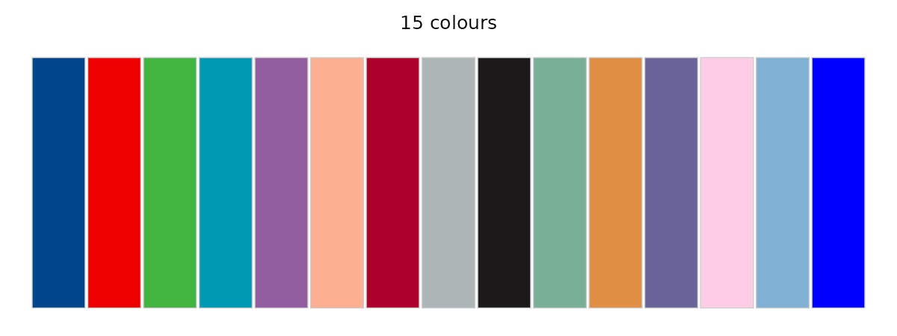{fig-alt="配色系统：检索、颜色映射与离散和连续色阶；Lancet 向量；固定模拟数据的实际参数对照结果。"}

### 柱形色板 {.unnumbered}

每行五个色块，显示当前颜色编码。

```r
pal_show(pal_bar, output = "gg", ncol = 5, label_size = 3)
```

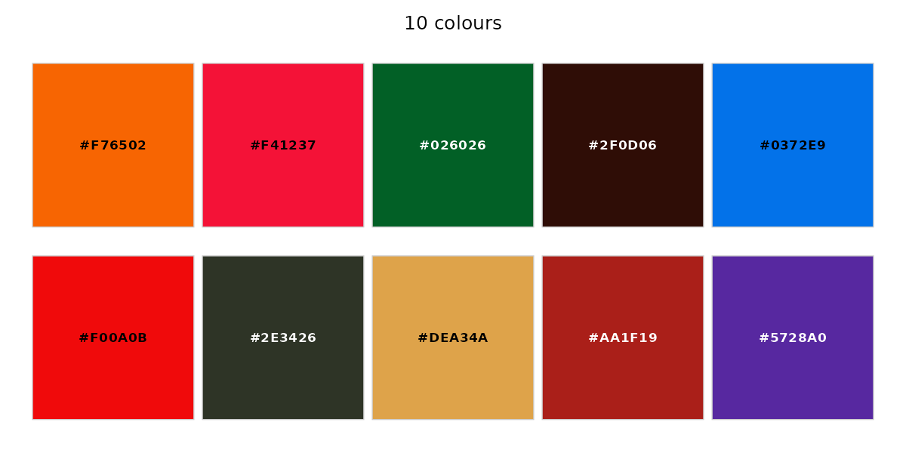{fig-alt="配色系统：检索、颜色映射与离散和连续色阶；柱形色板；固定模拟数据的实际参数对照结果。"}

### 发散色板集合 {.unnumbered}

展示精选三套发散色板，中间颜色为白色。

```r
pal_show(pal_heat[c("blue_red", "purple_teal", "indigo_gold")], output = "gg")
```

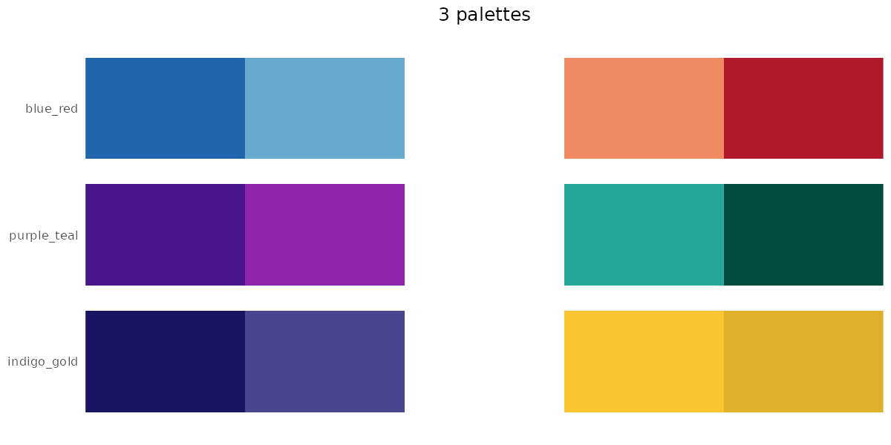{fig-alt="配色系统：检索、颜色映射与离散和连续色阶；发散色板集合；固定模拟数据的实际参数对照结果。"}

:::

## 颜色数量、顺序与透明度

::: {.panel-tabset}

### 自定义命名颜色 {.unnumbered}

命名颜色向量保留图例类别含义，不需要登记到色板库。

```r
pal_show(c(Control = "#0072B2", Treatment = "#D55E00", Other = "#009E73"),
         output = "gg", label = TRUE, label_size = 4)
```

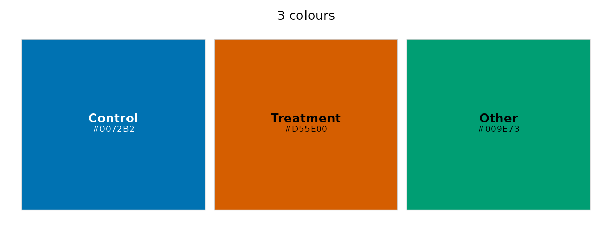{fig-alt="配色系统：检索、颜色映射与离散和连续色阶；自定义命名颜色；固定模拟数据的实际参数对照结果。"}

### 从三色插值到九色 {.unnumbered}

n 超过输入颜色数时插值生成九色；这里把色块当作连续梯度预览。

```r
pal_show(pal_get(c("#2166AC", "#FFFFFF", "#B2182B"), n = 9),
         output = "gg", label = FALSE)
```

{fig-alt="配色系统：检索、颜色映射与离散和连续色阶；从三色插值到九色；固定模拟数据的实际参数对照结果。"}

### 反向颜色 {.unnumbered}

先选择六色，再反转这六色的顺序。

```r
pal_show(pal_get(pal_lancet, n = 6, reverse = TRUE), output = "gg")
```

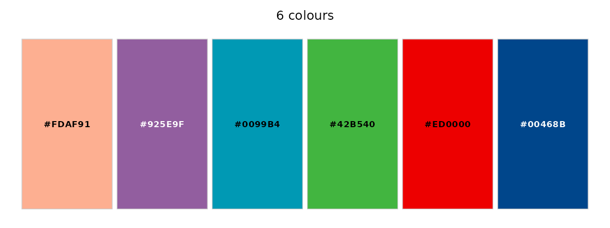{fig-alt="配色系统：检索、颜色映射与离散和连续色阶；反向颜色；固定模拟数据的实际参数对照结果。"}

### 半透明颜色 {.unnumbered}

在白背景显示 alpha=0.4 的颜色；合成后的视觉色会受背景影响。

```r
pal_show(pal_get(pal_lancet, n = 6, alpha = 0.4), output = "gg")
```

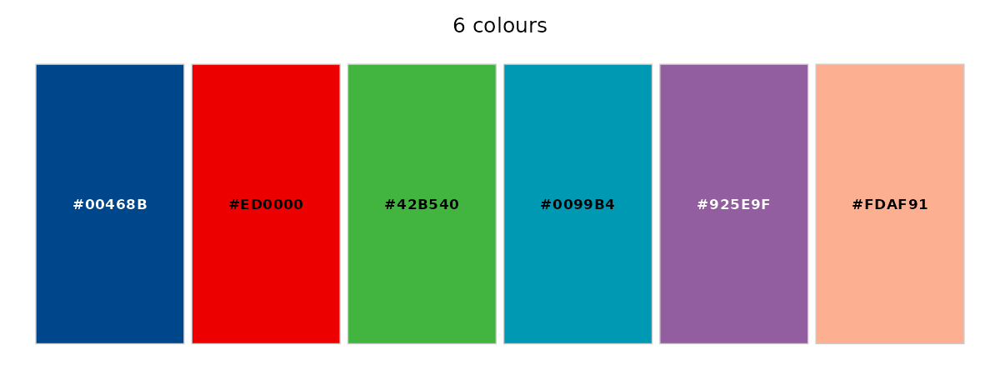{fig-alt="配色系统：检索、颜色映射与离散和连续色阶；半透明颜色；固定模拟数据的实际参数对照结果。"}

### 数值 x 的当前行为 {.unnumbered}

当前 numeric x 只按 length(x) 等距生成颜色，未按 x 的实际数值距离映射；两组数值产生相同颜色。数值绘图请使用 ggplot 连续 scale。

```r
x1 <- c(0, 1, 100)
x2 <- c(0, 50, 100)
data.frame(x1, x2, col1 = pal_get("viridis", x = x1),
           col2 = pal_get("viridis", x = x2))
```

|  x1|  x2|col1    |col2    |
|---:|---:|:-------|:-------|
|   0|   0|#440154 |#440154 |
|   1|  50|#21908C |#21908C |
| 100| 100|#FDE725 |#FDE725 |

:::

## 来源色卡

::: {.panel-tabset}

### Brewer 离散 {.unnumbered}

同一颜色数量比较三个分类色板。

```r
pal_show_brewer(c("Set2", "Dark2", "Paired"), n = 6, output = "gg")
```

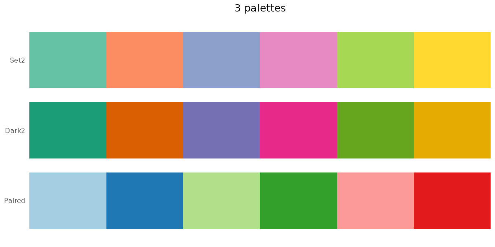{fig-alt="配色系统：检索、颜色映射与离散和连续色阶；Brewer 离散；固定模拟数据的实际参数对照结果。"}

### Brewer 顺序 {.unnumbered}

顺序色板适合从小到大的数值。

```r
pal_show_brewer(c("Blues", "YlGnBu"), n = 8, output = "gg")
```

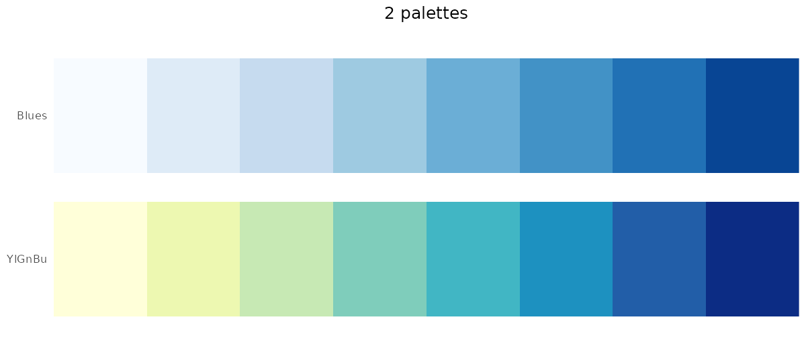{fig-alt="配色系统：检索、颜色映射与离散和连续色阶；Brewer 顺序；固定模拟数据的实际参数对照结果。"}

### Brewer 发散 {.unnumbered}

发散色板适合围绕明确中心的数值。

```r
pal_show_brewer(c("RdBu", "PRGn"), n = 9, output = "gg")
```

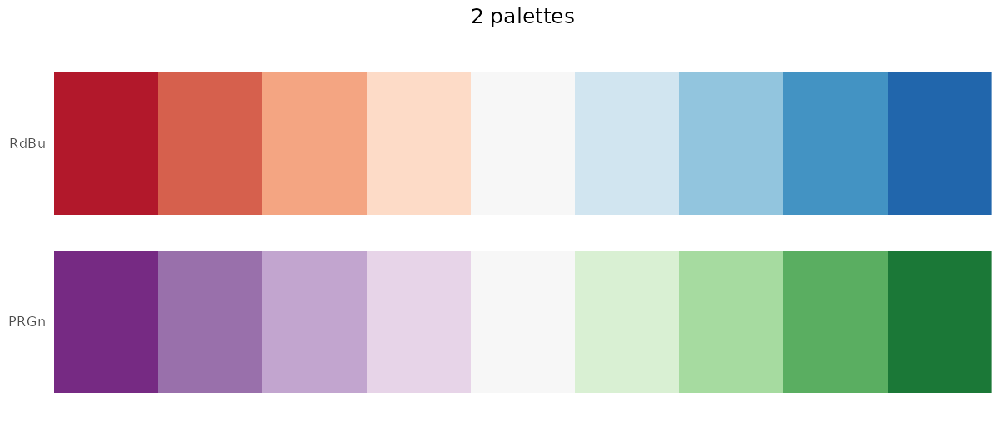{fig-alt="配色系统：检索、颜色映射与离散和连续色阶；Brewer 发散；固定模拟数据的实际参数对照结果。"}

### HCL 方案 {.unnumbered}

从对应 HCL 方案生成九色，覆盖离散、顺序、发散三种用途。

```r
pal_show_hcl(c("Dark 3", "Blues 3", "Blue-Red 3"), n = 9, output = "gg")
```

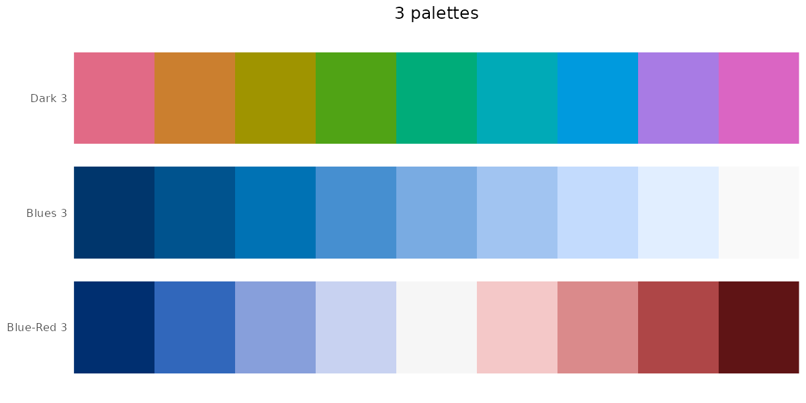{fig-alt="配色系统：检索、颜色映射与离散和连续色阶；HCL 方案；固定模拟数据的实际参数对照结果。"}

### ggsci 名称筛选 {.unnumbered}

用完整名称末尾筛选三套 ggsci 色板，避免缩写造成匹配失败。

```r
pal_show_ggsci(pattern = "(npg_nrc|lancet_lanonc|nejm_default)$", n = 6, output = "gg")
```

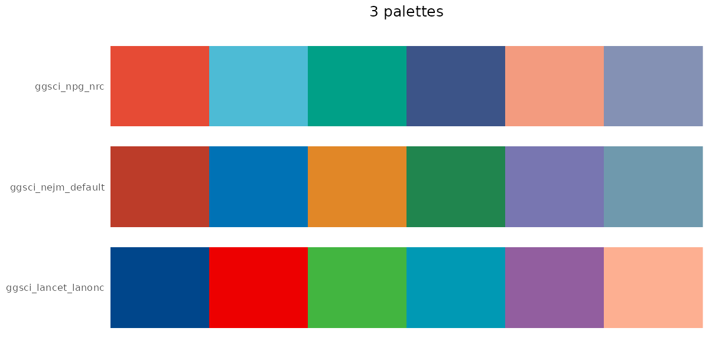{fig-alt="配色系统：检索、颜色映射与离散和连续色阶；ggsci 名称筛选；固定模拟数据的实际参数对照结果。"}

:::

## viridis 的色域控制

::: {.panel-tabset}

### 完整范围 {.unnumbered}

生成的九个颜色覆盖各自完整色域。

```r
pal_show_viridis(c("viridis", "magma", "cividis"), n = 9, output = "gg")
```

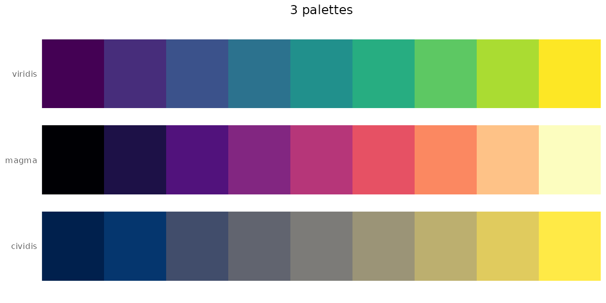{fig-alt="配色系统：检索、颜色映射与离散和连续色阶；完整范围；固定模拟数据的实际参数对照结果。"}

### 截取中间色域 {.unnumbered}

排除最深和最亮的两端，比较中间色域。

```r
pal_show_viridis("viridis", n = 9, begin = 0.2, end = 0.8, output = "gg")
```

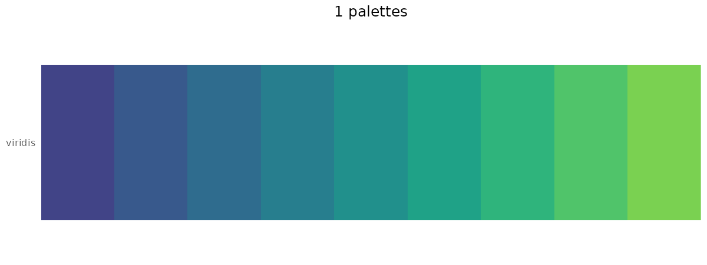{fig-alt="配色系统：检索、颜色映射与离散和连续色阶；截取中间色域；固定模拟数据的实际参数对照结果。"}

### 反向与透明度 {.unnumbered}

方向和透明度是两个独立设置。

```r
pal_show_viridis("viridis", n = 9, direction = -1, alpha = 0.65, output = "gg")
```

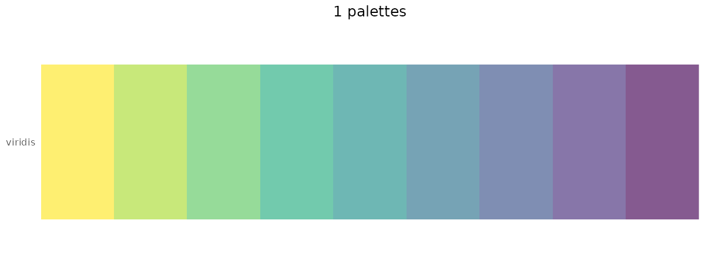{fig-alt="配色系统：检索、颜色映射与离散和连续色阶；反向与透明度；固定模拟数据的实际参数对照结果。"}

:::

## 用于真实图层的映射

::: {.panel-tabset}

### 按因子水平固定颜色 {.unnumbered}

当前 pal_get 返回时会丢弃名称，因此用 setNames 显式补上 A/B/C；筛选或改顺序后，命名映射才保持同组同色。

```r
lvls <- levels(dat[["group"]])
named_cols <- setNames(pal_get("lancet", x = lvls), lvls)
p_bar + scale_fill_manual(values = named_cols)
```

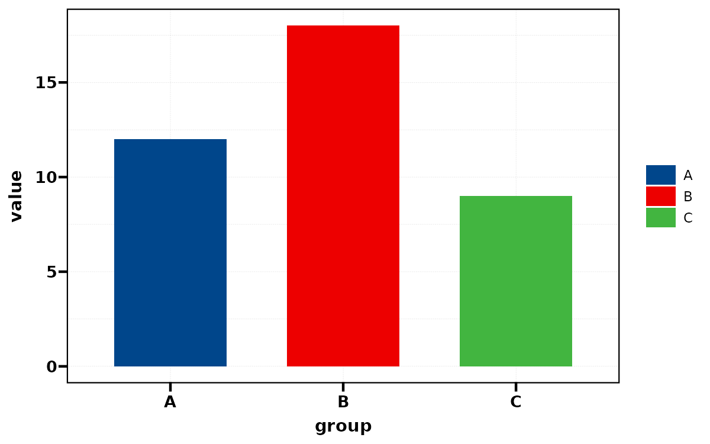{fig-alt="配色系统：检索、颜色映射与离散和连续色阶；按因子水平固定颜色；固定模拟数据的实际参数对照结果。"}

### 连续色阶 {.unnumbered}

提供完整颜色序列，由连续 scale 按实际 score 数值映射。

```r
p_heat + scale_fill_gradientn(colours = pal_get("viridis"), limits = c(-1, 1))
```

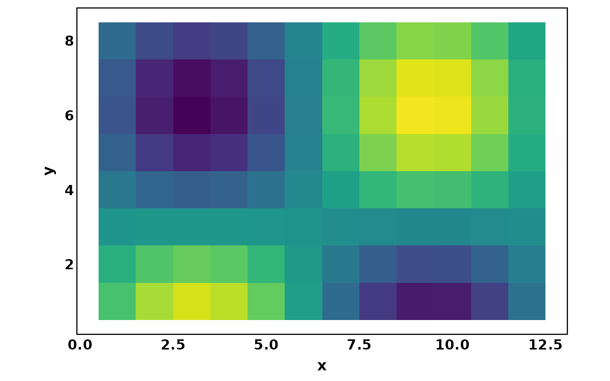{fig-alt="配色系统：检索、颜色映射与离散和连续色阶；连续色阶；固定模拟数据的实际参数对照结果。"}

### 以零为中心的热图 {.unnumbered}

固定 -1 到 1 的对称范围，使白色对应零；不同图必须使用同一范围才方便比较。

```r
p_heat + scale_fill_gradientn(colours = pal_heat[["purple_teal"]],
                             limits = c(-1, 1), breaks = c(-1, 0, 1))
```

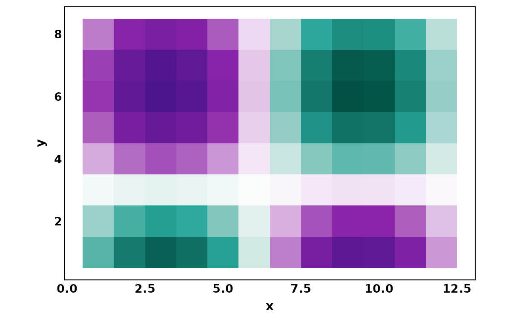{fig-alt="配色系统：检索、颜色映射与离散和连续色阶；以零为中心的热图；固定模拟数据的实际参数对照结果。"}

### 短截取与完整色域对照 {.unnumbered}

当前 pal_get(n=9) 取已有色板前九色，和覆盖完整范围的九色不同；两种行为用实际色卡并排核对。

```r
cols_short <- pal_get("viridis", n = 9)
cols_full <- grDevices::colorRampPalette(pal_get("viridis"))(9)
wrap_plots(pal_show(cols_short, output = "gg", label = FALSE) + labs(title = "First 9 colors"),
           pal_show(cols_full, output = "gg", label = FALSE) + labs(title = "Full range"), ncol = 1)
```

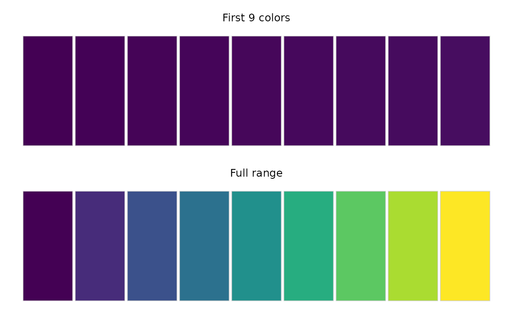{fig-alt="配色系统：检索、颜色映射与离散和连续色阶；短截取与完整色域对照；固定模拟数据的实际参数对照结果。"}

:::

## 返回对象、保存与使用边界 {#output}

`pal_get()` 返回颜色向量，当前会丢弃向量名称；输入色板 list 时保留外层 list 名称。`pal_list()` 返回不可见 list。`pal_show*()` 的返回类型由 output 决定：gt_tbl、ggplot 或控制台结果。先明确用途，再选择类别颜色或连续 scale。

```r
lvls <- levels(dat[["group"]])
p <- p_bar + scale_fill_manual(values = setNames(pal_get("lancet", x = lvls), lvls))
# ggplot2::ggsave("palette-bars.pdf", p, width = 7, height = 5)
```

当前 `pal_get()` 的 numeric x 不按数值间隔映射，n 小于已有长度时只是截取前 n 色。本页已展示这两个行为；连续图层示例使用 ggplot 的连续 scale 完成数值映射。色板名称、颜色对象和各来源生成函数不是同一种输入。

## 当前完整接口 {#interfaces}

点击展开查看本次实际执行版本的参数及默认值。

<details>
<summary>公共函数签名</summary>

```r
pal_list <-
function (pattern = NULL, type = c("all", "discrete", "continuous"), show = TRUE)
NULL

pal_get <-
function (palette = "Paired", n = NULL, x = NULL, reverse = FALSE, alpha = 1)
NULL

pal_show <-
function (palette = NULL, n = NULL, pattern = NULL, type = c("all", "discrete", "continuous"),
    max_colors = 20, index = NULL, output = c("gt", "gg", "console"), label = TRUE, label_size = 3,
    ncol = NULL)
NULL

pal_show_brewer <-
function (palette = NULL, n = NULL, type = c("all", "qual", "seq", "div"), pattern = NULL,
    index = NULL, max_colors = 20, output = c("gt", "gg", "console"))
NULL

pal_show_hcl <-
function (palette = NULL, n = 8, type = c("all", "qualitative", "sequential", "diverging"),
    pattern = NULL, index = NULL, max_colors = 20, output = c("gt", "gg", "console"))
NULL

pal_show_ggsci <-
function (palette = NULL, n = NULL, alpha = 1, reverse = FALSE, pattern = NULL, index = NULL,
    max_colors = 20, output = c("gt", "gg", "console"))
NULL

pal_show_viridis <-
function (palette = NULL, n = 8, begin = 0, end = 1, direction = 1, alpha = 1, pattern = NULL,
    index = NULL, max_colors = 20, output = c("gt", "gg", "console"))
NULL

```

</details>

## 验证范围与参考 {#references}

本页列出的调用均已实际执行；所有展示的 ggplot/patchwork 图通过 `ggplot_build()` 和 PNG 导出，表格来自同一组代码的实际返回。未修改 UtilsR 源码或重新运行全包测试。

- [UtilsR 函数参考](https://hui950319.github.io/UtilsR/reference/index.html)
- [UtilsR 源码](https://github.com/HUI950319/UtilsR/tree/main/R)
- [专题目录](index.qmd)

<details>
<summary>执行环境</summary>

```text
R version 4.4.3 (2025-02-28)
Platform: x86_64-pc-linux-gnu
Running under: Ubuntu 22.04.2 LTS

Matrix products: default
BLAS:   /usr/lib/x86_64-linux-gnu/openblas-pthread/libblas.so.3
LAPACK: /usr/lib/x86_64-linux-gnu/openblas-pthread/libopenblasp-r0.3.20.so;  LAPACK version 3.10.0

locale:
 [1] LC_CTYPE=C.UTF-8       LC_NUMERIC=C           LC_TIME=C.UTF-8        LC_COLLATE=C.UTF-8
 [5] LC_MONETARY=C.UTF-8    LC_MESSAGES=C.UTF-8    LC_PAPER=C.UTF-8       LC_NAME=C
 [9] LC_ADDRESS=C           LC_TELEPHONE=C         LC_MEASUREMENT=C.UTF-8 LC_IDENTIFICATION=C

time zone: Asia/Shanghai
tzcode source: system (glibc)

attached base packages:
[1] stats     graphics  grDevices utils     datasets  methods   base

other attached packages:
[1] patchwork_1.3.2 ggplot2_4.0.3   UtilsR_0.6.8

loaded via a namespace (and not attached):
 [1] gtable_0.3.6       jsonlite_2.0.0     dplyr_1.2.0        compiler_4.4.3     tidyselect_1.2.1
 [6] Rcpp_1.1.1         dichromat_2.0-0.1  textshaping_0.4.0  systemfonts_1.1.0  scales_1.4.0
[11] R6_2.6.1           labeling_0.4.3     generics_0.1.4     httr2_1.2.2        knitr_1.51
[16] ggrepel_0.9.8      tibble_3.3.1       ellmer_0.4.0       pillar_1.11.1      RColorBrewer_1.1-3
[21] rlang_1.3.0        ggsci_4.2.0        xfun_0.57          S7_0.2.2           otel_0.2.0
[26] viridisLite_0.4.3  cli_3.6.6          withr_3.0.3        magrittr_2.0.4     digest_0.6.39
[31] grid_4.4.3         rappdirs_0.3.4     lifecycle_1.0.5    coro_1.1.0         vctrs_0.7.3
[36] evaluate_1.0.5     ggprism_1.0.7      glue_1.8.1         farver_2.1.2       ragg_1.5.2
[41] tools_4.4.3        pkgconfig_2.0.3    mcptools_0.2.1
```

</details>
