排名高亮与截断、两种组内缩放、秩和原始分数相关、点映射、共享特征连线及圆形布局。各节用固定输入比较重要参数，标签页中展示可复制代码与实际结果。

**版本与执行范围：** 本页按 UtilsR **0.6.8** 的公共接口核对；28 个示例已在 WSL R 4.4.3 中实际执行，其中 25 张图已完成构建与 PNG 导出。使用固定随机种子的模拟数据。

## 数据准备与输入约定 {#data}

score_mat 与 rank_long 是相同的三组模拟分数，两种输入用于交叉演示；cor_long 在相同名称上制造两方法差异；circle_dat 同时包含五个共享名称和各组三个独有名称。

```r
library(UtilsR)
library(ggplot2)
set.seed(1010)
feat <- c("HALLMARK_ALPHA", "HALLMARK_BETA", "KEGG_GAMMA", "TF_DELTA(+)",
          "GOBP_EPSILON", paste0("Gene_", 6:12))
score_mat <- cbind(A = runif(12, 2, 10), B = runif(12, 10, 40), C = runif(12, 0.1, 1))
rownames(score_mat) <- feat
rank_long <- do.call(rbind, lapply(colnames(score_mat), function(g)
  data.frame(cell = g, feature = feat, score = score_mat[, g], row.names = NULL)))
cor_long <- subset(rank_long, cell %in% c("A", "B"))
cor_long[["method"]] <- "Method 1"
method2 <- cor_long
method2[["method"]] <- "Method 2"
method2[["score"]] <- 1.5 * method2[["score"]] + rnorm(nrow(method2), 0, 3)
cor_long <- rbind(cor_long, method2)
cor_long[["weight"]] <- rep(seq(0.2, 1, length.out = 12), 4)
cor_signed <- cor_long
cor_signed[["score"]] <- cor_signed[["score"]] - 10
circle_dat <- do.call(rbind, lapply(c("A", "B", "C"), function(g)
  data.frame(group = g, name = c(paste0("Shared", 1:5), paste0(g, "_Unique", 1:3)),
             value = runif(8, 0.1, if (g == "A") 0.9 else 0.6))))
circle_dat[["color"]] <- ifelse(grepl("Shared", circle_dat[["name"]]), "#0072B2", "#D55E00")
```

## 函数选择与重要参数 {#parameters}

| 入口与目标 | 重要参数 | 语义与条件 |
|:--|:--|:--|
| Rank 输入 | `data`、`group_col/name_col/value_col` | 命名数值向量、行名为特征的矩阵或长表；矩阵列名为组 |
| 排名展示 | `top_n=5L`、`max_show=200L` | top_n 只高亮前 n；max_show 才截断每组显示行数，两者不是同一筛选 |
| 分组选取 | `groups/group_levels`、`ncol=4L` | 选择、顺序、分面列数；Rank 分面采用自由坐标 |
| Rank 缩放 | `value_scale="none"/"group"/"top_n"` | group 用完整原组范围；top_n 用 max_show 后所有显示值范围，未只用高亮的 n 行 |
| 标签和点 | `clean_names/label_size/point_size/highlight_color/base_color` | 清理路径前缀、末尾调控符号和下划线；不会合并清理后同名条目 |
| 排名返回 | `return_type="plot"/"data"/"both"` | 数据列 Group/Rank/Score/Label/IsTop；缩放时 Score 已是变换后值 |
| 两方法比较 | `stat.by/value.by/group.by/method.by` | method.by 恰好两种值，首次出现顺序决定横纵轴；建议每特征×组×方法唯一 |
| 秩或分数 | `use_rank=TRUE` | TRUE 按组×方法降序排秩，ties 为平均秩，相关用 Spearman；FALSE 用显示值 Pearson |
| 分数变换 | `scale_x/scale_y="none"` | 仅 use_rank=FALSE；none/minmax/zscore/log1p/rank，各组分别计算；log1p 为带符号变换 |
| 点映射 | `size_by/size_range`、`alpha_by/alpha_range` | 指定列先在特征×组内跨两方法取均值，再映射点大小或透明度 |
| 相关图外观 | `show.label/show.diag/max.overlaps/legend.position/palette` | y=x 是参考线；同秩相关较高不代表分数单位、数值或模型表现一致 |
| 圆形选取 | `top_n=NULL`、`value_scale` | 圆图的 top_n 真正筛选每组前 n 行；group 按原组范围，top_n 按筛选后组内范围 |
| 圆形共享 | `common_color/unique_color/color_col/show_links` | 共享按筛选后是否出现在至少两组判定；color_col 可覆盖点的共享配色 |
| 标签位置 | `label_side="inside"/"outside"/"outer"`、`label_cex/label_height` | 内侧、灰色扇区内、最外圈；label_height 单位 mm |
| 圆形布局 | `track_height/gap_after/gap_between/start_degree` | 轨道高度比例、最后间隔角度、组间角度和起始角度；单位不能混用 |
| 连线和轴 | `link_h/link_lwd/link_color/show_yaxis/yaxis_label` | 连线表示共享名称，不表示相关、因果或流量 |
| 保存 | `filename/width/height/dpi` | Rank/RankCor 返回 ggplot；Circle 在设备上直接画，返回 invisible(NULL) |

## 排名输入与筛选

::: {.panel-tabset}

### 命名向量 {.unnumbered}

一个命名向量进入单面板；名称是特征，数值是排序依据。

```r
PlotRank(score_mat[, "A"], top_n = 4, title = "Single group A")
```

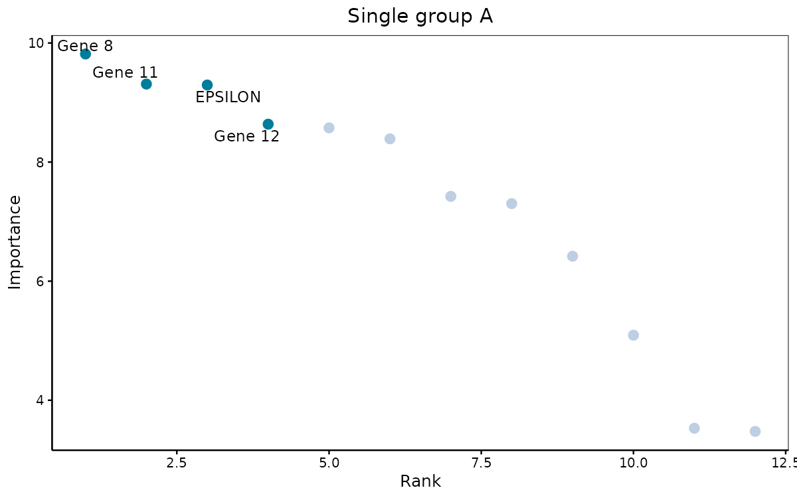{fig-alt="排名与共享特征：Rank、方法一致性和圆形棒棒糖；命名向量；固定模拟数据的实际参数对照结果。"}

### 多组矩阵 {.unnumbered}

矩阵行名为特征、列名为组；各组内部独立排序和自由坐标，原始分数跨度不同。

```r
PlotRank(score_mat, top_n = 4, ncol = 3, label_size = 3)
```

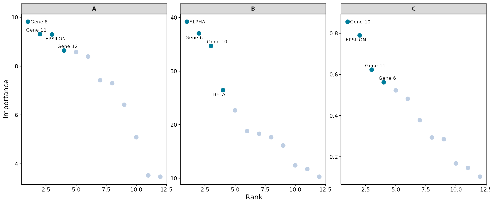{fig-alt="排名与共享特征：Rank、方法一致性和圆形棒棒糖；多组矩阵；固定模拟数据的实际参数对照结果。"}

### 长表和组序 {.unnumbered}

用列名声明长表输入，与矩阵相同数据；group_levels 改变组序。

```r
PlotRank(rank_long, "cell", "feature", "score", group_levels = c("C", "B", "A"),
         top_n = 3, ncol = 3, label_size = 3)
```

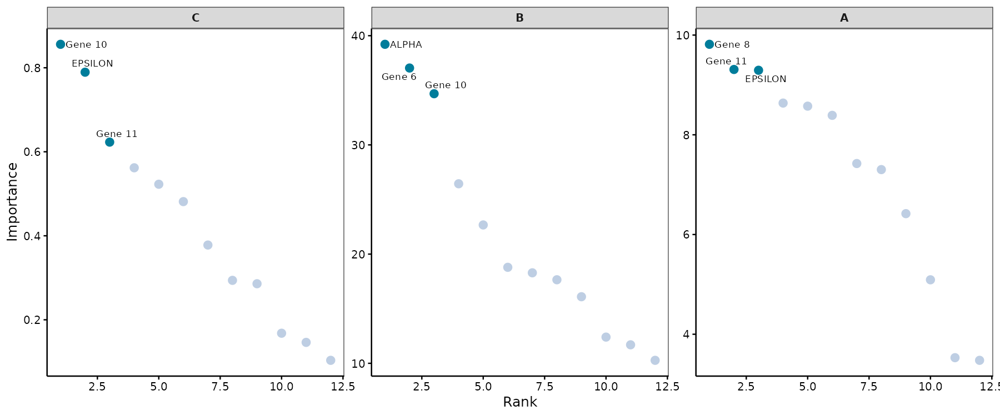{fig-alt="排名与共享特征：Rank、方法一致性和圆形棒棒糖；长表和组序；固定模拟数据的实际参数对照结果。"}

### 选两个组 {.unnumbered}

groups 先选择组；没有被选择的 C 不参与展示。

```r
PlotRank(score_mat, groups = c("B", "A"), top_n = 3, ncol = 2)
```

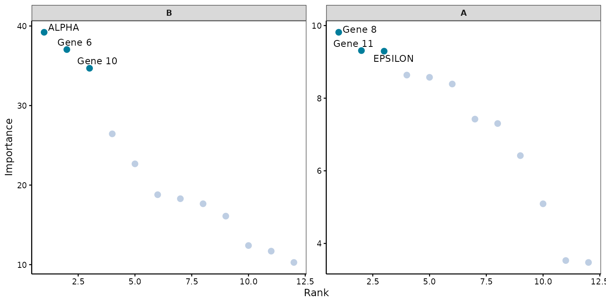{fig-alt="排名与共享特征：Rank、方法一致性和圆形棒棒糖；选两个组；固定模拟数据的实际参数对照结果。"}

### 增加高亮数 {.unnumbered}

top_n 从 4 改为 7，只增加高亮和标签，全部 12 个点仍在。

```r
PlotRank(score_mat[, "A"], top_n = 7, point_size = 2.5, label_size = 3)
```

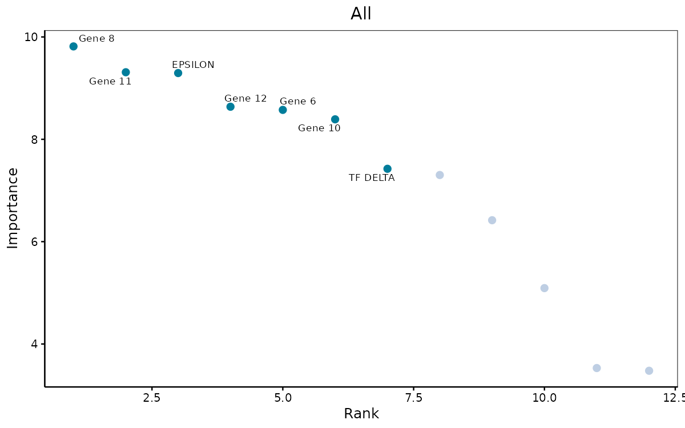{fig-alt="排名与共享特征：Rank、方法一致性和圆形棒棒糖；增加高亮数；固定模拟数据的实际参数对照结果。"}

### 截断显示行 {.unnumbered}

max_show=6 才把图和返回数据缩减为排名前六；其余特征未展示。

```r
PlotRank(score_mat[, "A"], top_n = 3, max_show = 6)
```

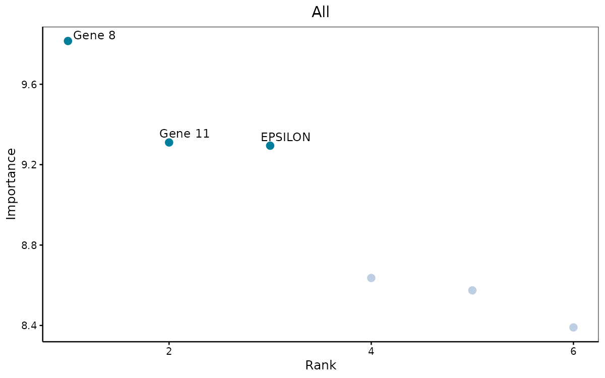{fig-alt="排名与共享特征：Rank、方法一致性和圆形棒棒糖；截断显示行；固定模拟数据的实际参数对照结果。"}

:::

## 排名缩放与返回

::: {.panel-tabset}

### 完整组范围缩放 {.unnumbered}

采用原始每组 12 个值的 min-max，截断后最低显示值通常仍大于 0。

```r
PlotRank(score_mat, top_n = 3, max_show = 6, value_scale = "group",
         ylab = "Scaled against full group", ncol = 3, label_size = 3)
```

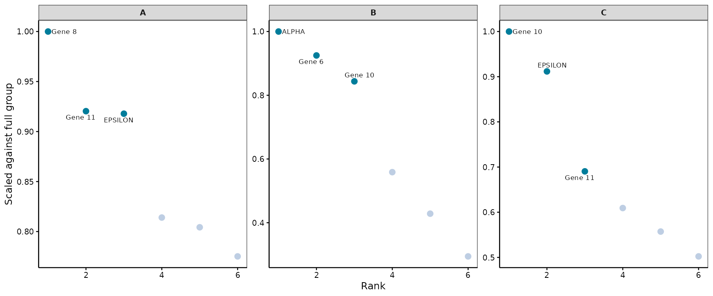{fig-alt="排名与共享特征：Rank、方法一致性和圆形棒棒糖；完整组范围缩放；固定模拟数据的实际参数对照结果。"}

### 显示范围缩放 {.unnumbered}

选项名为 top_n，实际按 max_show 后六个显示值缩放；每组最低显示点为 0。

```r
PlotRank(score_mat, top_n = 3, max_show = 6, value_scale = "top_n",
         ylab = "Scaled against displayed rows", ncol = 3, label_size = 3)
```

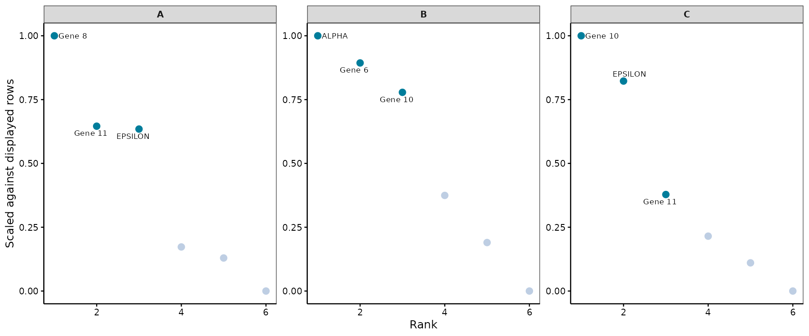{fig-alt="排名与共享特征：Rank、方法一致性和圆形棒棒糖；显示范围缩放；固定模拟数据的实际参数对照结果。"}

### 保留原特征名称 {.unnumbered}

关闭名称清理，保留前缀、下划线及 (+)；清理只改变显示标签。

```r
PlotRank(score_mat[, "A"], clean_names = FALSE, top_n = 4,
         highlight_color = "#D55E00", base_color = "#E1E5EB", label_size = 3)
```

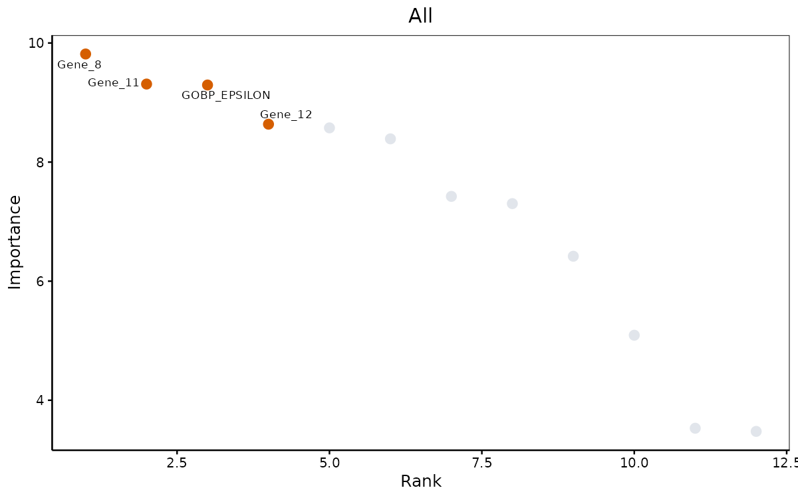{fig-alt="排名与共享特征：Rank、方法一致性和圆形棒棒糖；保留原特征名称；固定模拟数据的实际参数对照结果。"}

### 核对数据和高亮 {.unnumbered}

both 的 plot 可继续排版，data 可核对排序、缩放和 IsTop；这里展示实际返回前八行。

```r
res <- PlotRank(score_mat, max_show = 6, top_n = 3, value_scale = "top_n", return_type = "both")
res[["data"]][1:8, ]
```

|        |Group | Rank|  Score|Label   |IsTop |
|:-------|:-----|----:|------:|:-------|:-----|
|Gene 8  |A     |    1| 1.0000|Gene 8  |TRUE  |
|Gene 11 |A     |    2| 0.6458|Gene 11 |TRUE  |
|EPSILON |A     |    3| 0.6346|EPSILON |TRUE  |
|Gene 12 |A     |    4| 0.1727|Gene 12 |FALSE |
|Gene 6  |A     |    5| 0.1294|Gene 6  |FALSE |
|Gene 10 |A     |    6| 0.0000|Gene 10 |FALSE |
|ALPHA   |B     |    1| 1.0000|ALPHA   |TRUE  |
|Gene 61 |B     |    2| 0.8936|Gene 6  |TRUE  |

:::

## 秩相关与数值相关

::: {.panel-tabset}

### 组内秩比较 {.unnumbered}

每组×方法先降序排秩，再按同名特征对齐；图中统计为组内 Spearman。

```r
PlotRankCor(cor_long, "feature", "score", "cell", "method",
            label.size = 2.7, max.overlaps = Inf) +
  theme(plot.margin = margin(8, 22, 8, 8))
```

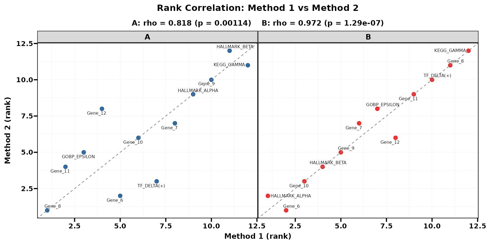{fig-alt="排名与共享特征：Rank、方法一致性和圆形棒棒糖；组内秩比较；固定模拟数据的实际参数对照结果。"}

### 原始分数比较 {.unnumbered}

横纵轴为两方法原始分数，相关改为 Pearson；Method 2 的单位尺度是本页人为改变的。

```r
PlotRankCor(cor_long, "feature", "score", "cell", "method", use_rank = FALSE,
            show.label = FALSE, pt.size = 3.5) +
  theme(plot.margin = margin(8, 22, 8, 8))
```

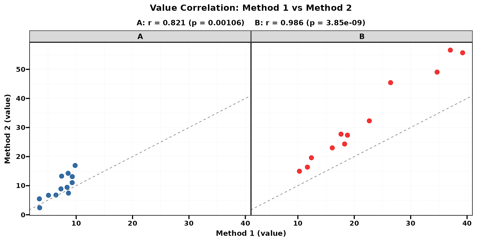{fig-alt="排名与共享特征：Rank、方法一致性和圆形棒棒糖；原始分数比较；固定模拟数据的实际参数对照结果。"}

### 分别 min-max {.unnumbered}

每组内两个方法分别缩放到 0–1，数值可比较但绝对分数信息消失。

```r
PlotRankCor(cor_long, "feature", "score", "cell", "method", use_rank = FALSE,
            scale_x = "minmax", scale_y = "minmax", show.label = FALSE) +
  theme(plot.margin = margin(8, 22, 8, 8))
```

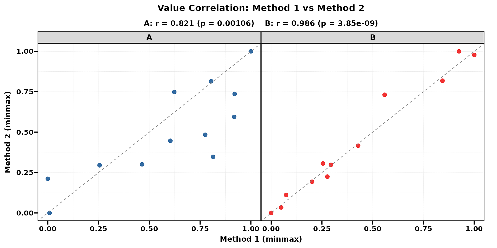{fig-alt="排名与共享特征：Rank、方法一致性和圆形棒棒糖；分别 min-max；固定模拟数据的实际参数对照结果。"}

### 分别标准化 {.unnumbered}

按各组×方法的均值和 SD 标准化；线性变换不改变该组 Pearson 相关。

```r
PlotRankCor(cor_long, "feature", "score", "cell", "method", use_rank = FALSE,
            scale_x = "zscore", scale_y = "zscore", show.label = FALSE) +
  theme(plot.margin = margin(8, 22, 8, 8))
```

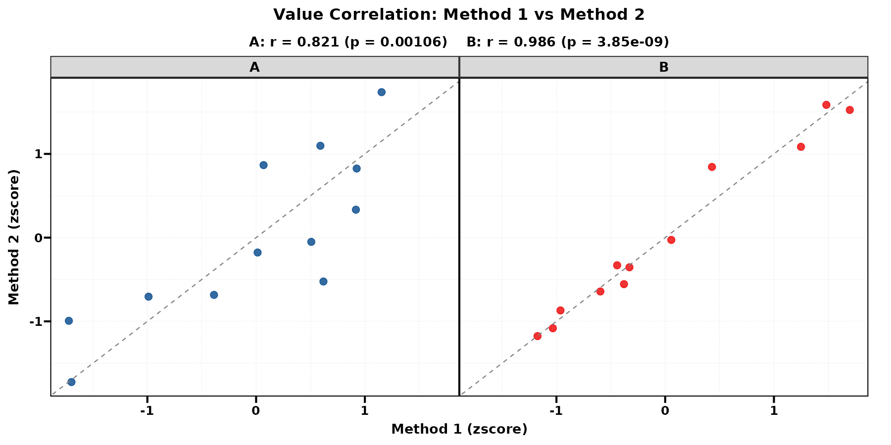{fig-alt="排名与共享特征：Rank、方法一致性和圆形棒棒糖；分别标准化；固定模拟数据的实际参数对照结果。"}

### 带符号 log1p {.unnumbered}

变换为 sign(x)×log1p(abs(x))，允许负数；Pearson 在变换后显示值上计算，可能改变相关。

```r
PlotRankCor(cor_signed, "feature", "score", "cell", "method", use_rank = FALSE,
            scale_x = "log1p", scale_y = "log1p", show.label = FALSE) +
  theme(plot.margin = margin(8, 22, 8, 8))
```

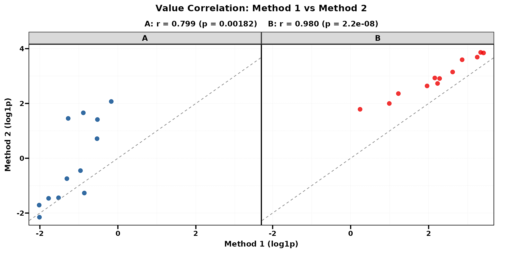{fig-alt="排名与共享特征：Rank、方法一致性和圆形棒棒糖；带符号 log1p；固定模拟数据的实际参数对照结果。"}

:::

## 点映射与对齐数据

::: {.panel-tabset}

### 大小与透明度映射 {.unnumbered}

点大小和透明度均编码同一辅助 weight；输入跨两方法一致，平均后保持该值。

```r
PlotRankCor(cor_long, "feature", "score", "cell", "method", size_by = "weight",
            size_range = c(2, 7), alpha_by = "weight", alpha_range = c(0.25, 1),
            show.label = FALSE, legend.position = "bottom", palette = c("#0072B2", "#D55E00")) +
  theme(plot.margin = margin(8, 22, 8, 8))
```

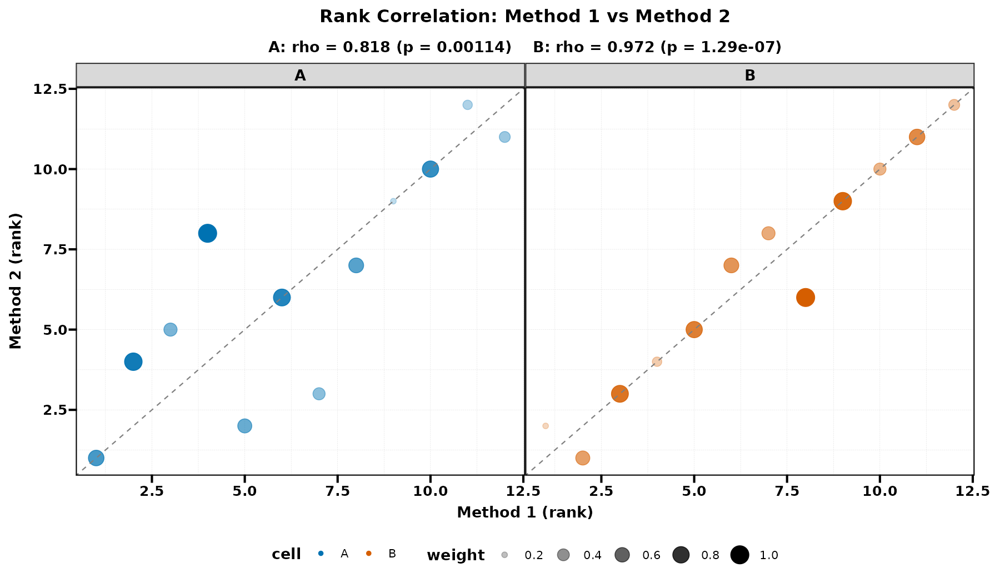{fig-alt="排名与共享特征：Rank、方法一致性和圆形棒棒糖；大小与透明度映射；固定模拟数据的实际参数对照结果。"}

### 关闭参考线和标签 {.unnumbered}

参考线和标签只影响显示，组内的秩和相关计算保持不变。

```r
PlotRankCor(cor_long, "feature", "score", "cell", "method", show.diag = FALSE,
            show.label = FALSE, pt.size = 4, alpha = 0.55, legend.position = "bottom") +
  theme(plot.margin = margin(8, 22, 8, 8))
```

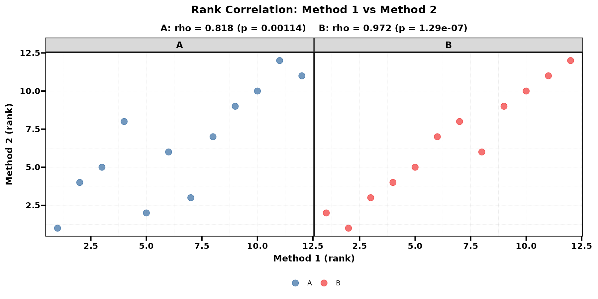{fig-alt="排名与共享特征：Rank、方法一致性和圆形棒棒糖；关闭参考线和标签；固定模拟数据的实际参数对照结果。"}

### 对齐后的数据 {.unnumbered}

ggplot 的 data 包含两方法列；可检查同名特征对齐及平均秩，不用从图片反推数值。

```r
p <- PlotRankCor(cor_long, "feature", "score", "cell", "method", show.label = FALSE)
head(p$data, 8)
```

|   |feature |cell | Method 1| Method 2|
|:--|:-------|:----|--------:|--------:|
|1  |Gene_10 |A    |        6|        6|
|3  |Gene_10 |B    |        3|        3|
|5  |Gene_11 |A    |        2|        4|
|7  |Gene_11 |B    |        9|        9|
|9  |Gene_12 |A    |        4|        8|
|11 |Gene_12 |B    |        8|        6|
|13 |Gene_6  |A    |        5|        2|
|15 |Gene_6  |B    |        2|        1|

:::

## 圆形共享特征

::: {.panel-tabset}

### 默认共享与独有 {.unnumbered}

24 个条目，Shared1–5 在三组都有；颜色及内弧表示名称共享，独有条目用另一色。

```r
PlotCircleLollipop(circle_dat, label_cex = 0.55)
```

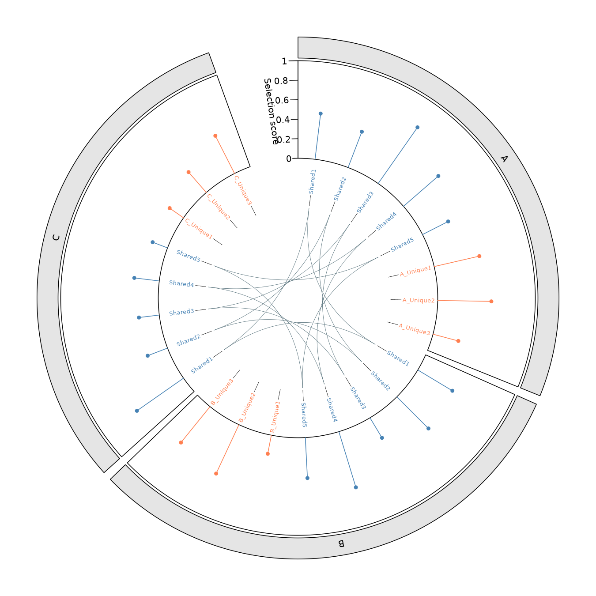{fig-alt="排名与共享特征：Rank、方法一致性和圆形棒棒糖；默认共享与独有；固定模拟数据的实际参数对照结果。"}

### 每组选前五 {.unnumbered}

这里 top_n 真正删掉每组未入选行，共享判定也在筛选后重算；与 PlotRank 的高亮含义不同。

```r
PlotCircleLollipop(circle_dat, top_n = 5, label_cex = 0.65)
```

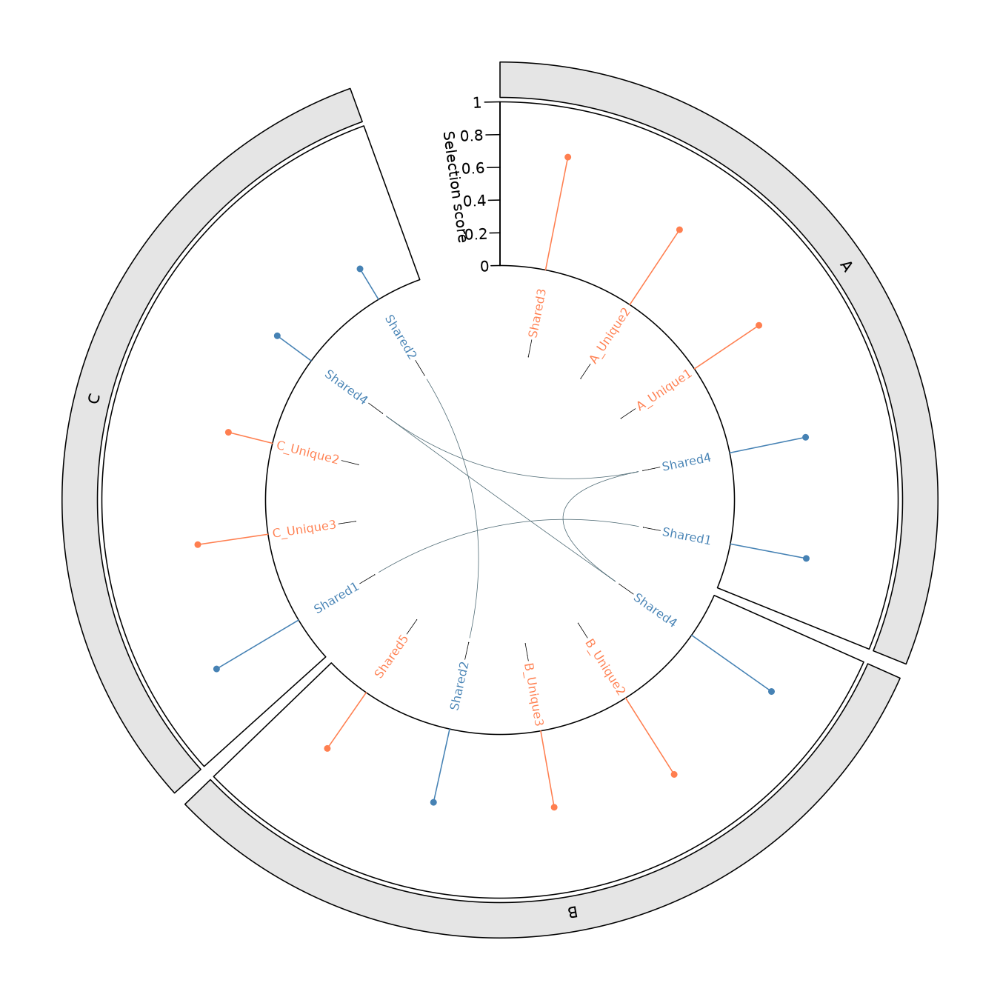{fig-alt="排名与共享特征：Rank、方法一致性和圆形棒棒糖；每组选前五；固定模拟数据的实际参数对照结果。"}

### 按完整组缩放 {.unnumbered}

原始每组八个值确定 min-max，再显示前五；最低入选值通常不为 0。

```r
PlotCircleLollipop(circle_dat, top_n = 5, value_scale = "group",
                   label_cex = 0.6, yaxis_label = "Full-group scaled score")
```

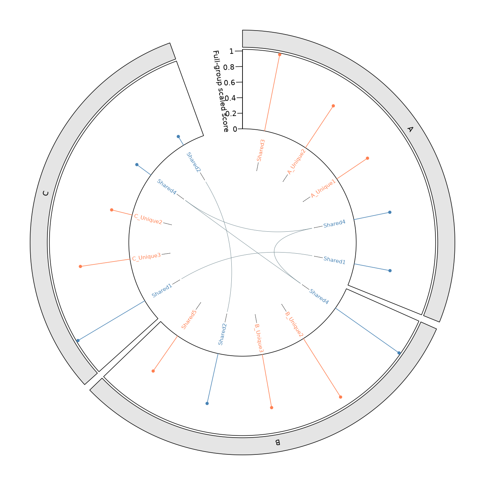{fig-alt="排名与共享特征：Rank、方法一致性和圆形棒棒糖；按完整组缩放；固定模拟数据的实际参数对照结果。"}

### 按入选组缩放 {.unnumbered}

各组入选五个值伸展到 0–1，不能用径向长度比较不同组原始分数大小。

```r
PlotCircleLollipop(circle_dat, top_n = 5, value_scale = "top_n",
                   label_cex = 0.6, yaxis_label = "Selected scaled score")
```

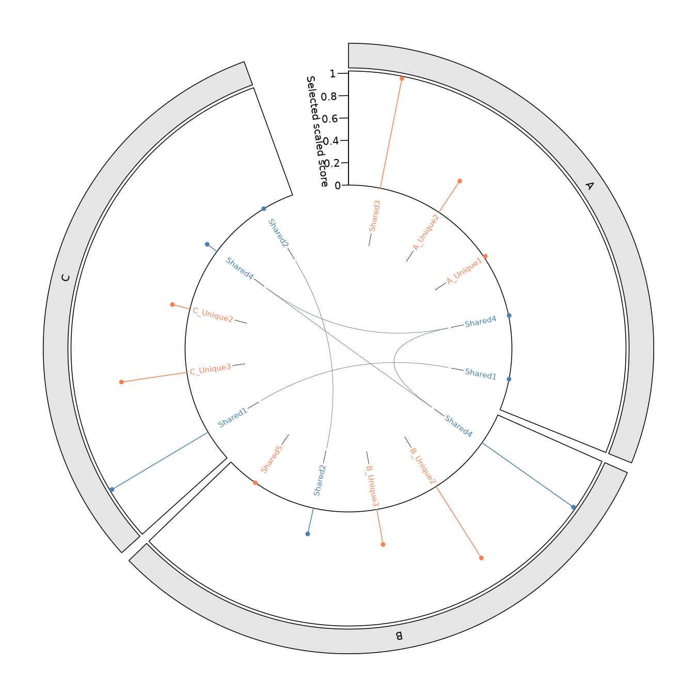{fig-alt="排名与共享特征：Rank、方法一致性和圆形棒棒糖；按入选组缩放；固定模拟数据的实际参数对照结果。"}

:::

## 圆形标签与布局

::: {.panel-tabset}

### 标签在扇区内 {.unnumbered}

outside 把标签置于灰色扇区框内；height 控制连接线长度而不是字体大小。

```r
PlotCircleLollipop(circle_dat, top_n = 5, label_side = "outside",
                   label_cex = 0.6, label_height = 3, point_cex = 1, sector_bg = "#EDF2F7")
```

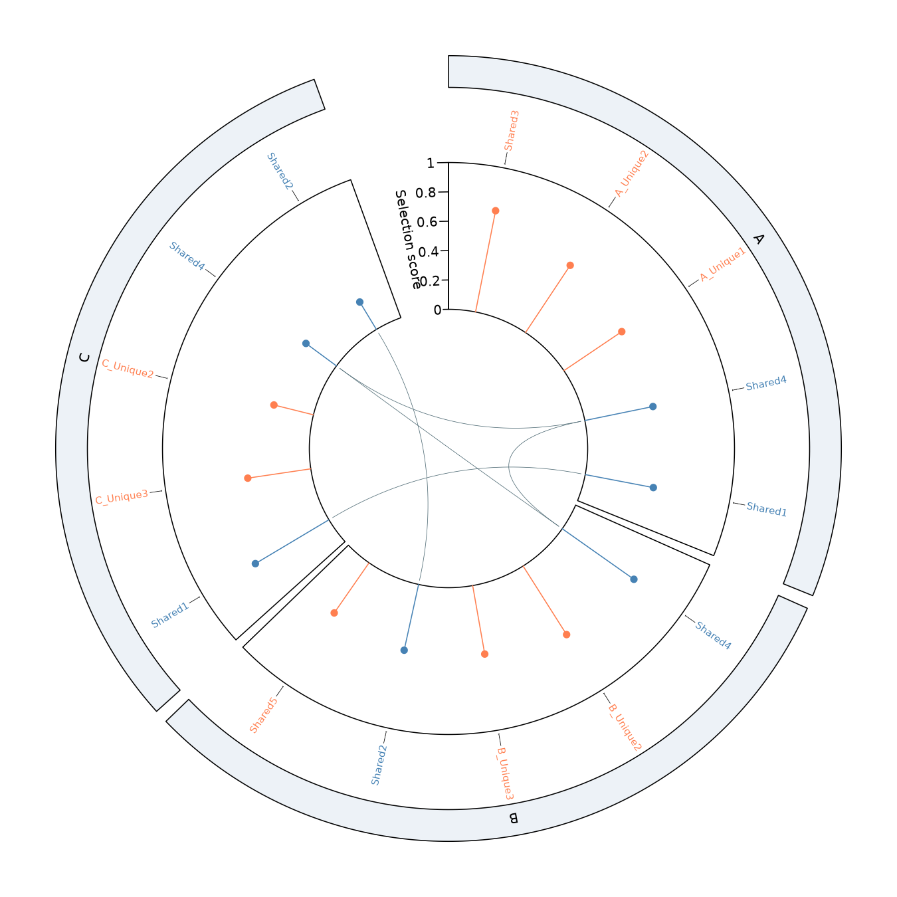{fig-alt="排名与共享特征：Rank、方法一致性和圆形棒棒糖；标签在扇区内；固定模拟数据的实际参数对照结果。"}

### 标签移到外圈 {.unnumbered}

outer 把名称放在最外圈，减小轨道高度给标签留空间。

```r
PlotCircleLollipop(circle_dat, label_side = "outer", label_cex = 0.5,
                   label_height = 3, track_height = 0.28)
```

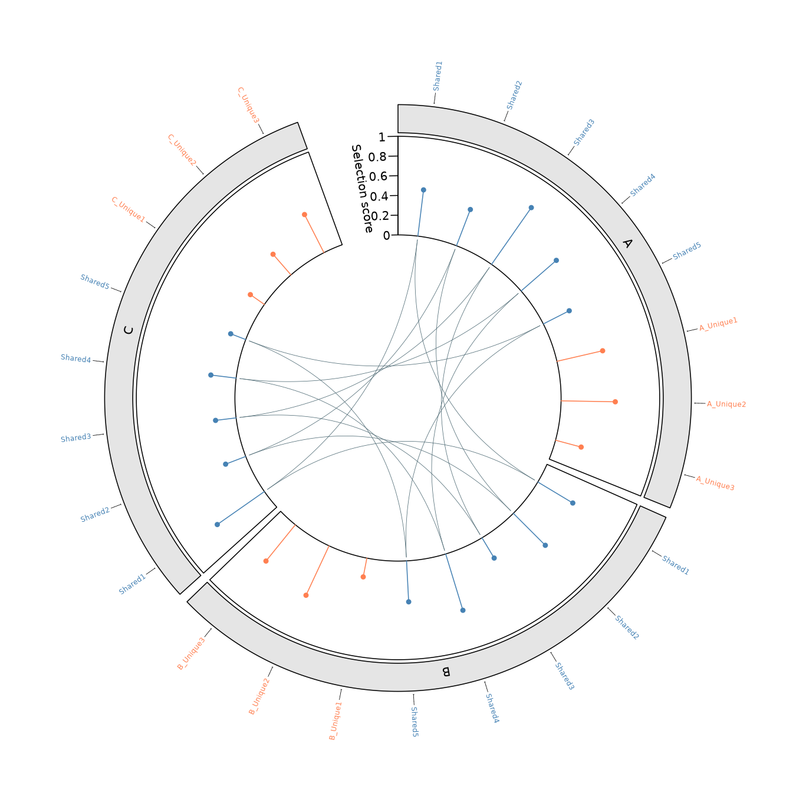{fig-alt="排名与共享特征：Rank、方法一致性和圆形棒棒糖；标签移到外圈；固定模拟数据的实际参数对照结果。"}

### 旋转和组间间隔 {.unnumbered}

同时展示组序、旋转、末端开口与内弧高度；数值和入选条目不变。

```r
PlotCircleLollipop(circle_dat, top_n = 5, group_levels = c("C", "B", "A"),
                   start_degree = 45, gap_after = 35, gap_between = 7,
                   track_height = 0.28, link_h = 0.45, link_lwd = 1, label_cex = 0.55)
```

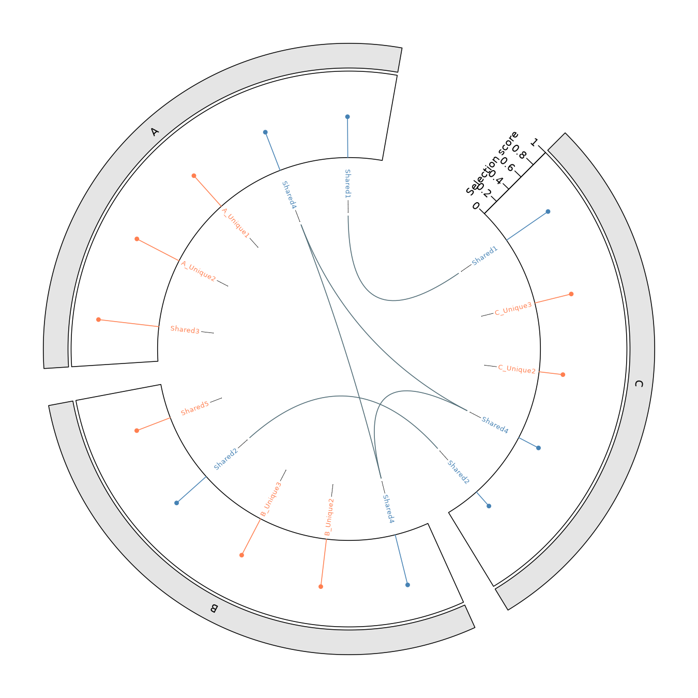{fig-alt="排名与共享特征：Rank、方法一致性和圆形棒棒糖；旋转和组间间隔；固定模拟数据的实际参数对照结果。"}

### 无标签和内弧 {.unnumbered}

减少装饰仍保留共享配色，但缺少条目标签时需要配套数据表。

```r
PlotCircleLollipop(circle_dat, show_links = FALSE, show_labels = FALSE,
                   show_yaxis = FALSE, common_color = "#009E73", unique_color = "#CC79A7")
```

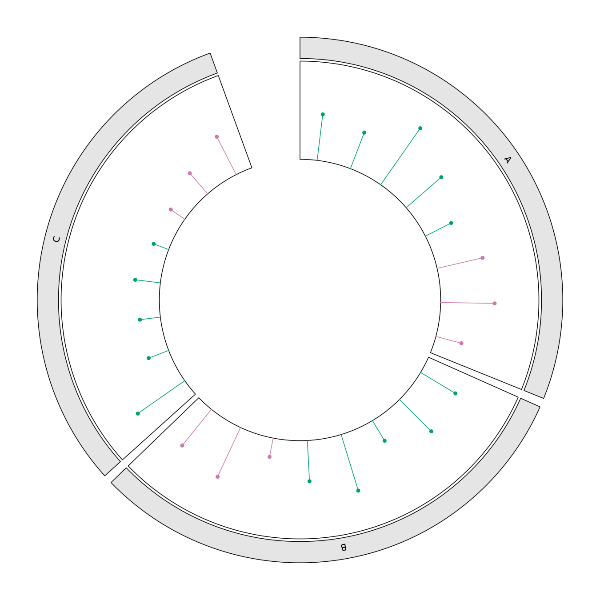{fig-alt="排名与共享特征：Rank、方法一致性和圆形棒棒糖；无标签和内弧；固定模拟数据的实际参数对照结果。"}

### 逐行配色 {.unnumbered}

使用明确的逐行颜色列，覆盖 common/unique 配色；本例保留原行序和全部条目。

```r
PlotCircleLollipop(circle_dat, color_col = "color", show_links = FALSE,
                   label_side = "outside", label_cex = 0.5)
```

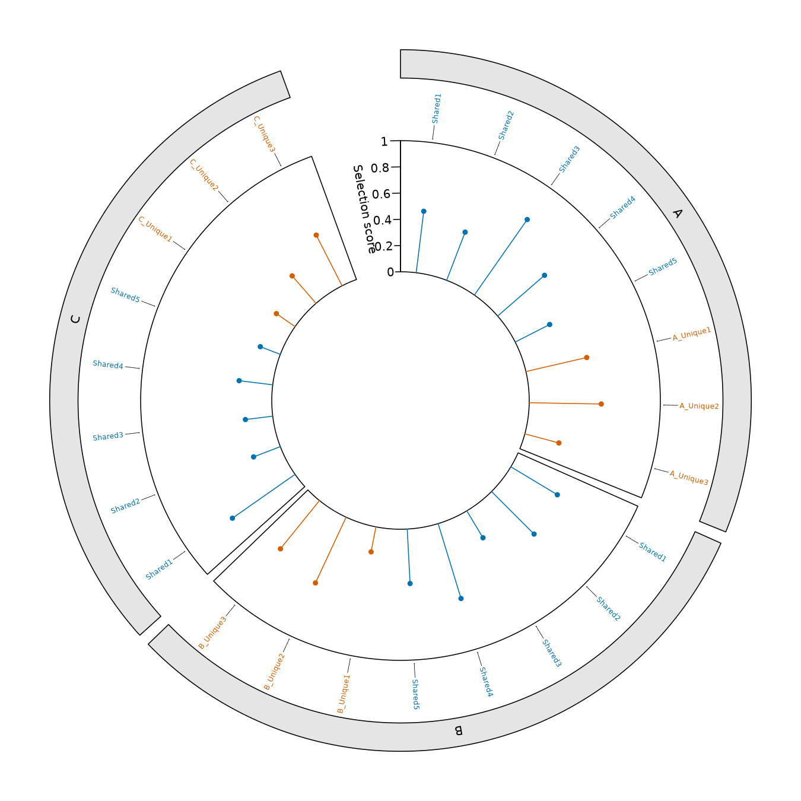{fig-alt="排名与共享特征：Rank、方法一致性和圆形棒棒糖；逐行配色；固定模拟数据的实际参数对照结果。"}

:::

## 圆图保存与对象

::: {.panel-tabset}

### 实际保存 PDF {.unnumbered}

圆图直接在设备上画，不返回 ggplot；本例已真实生成临时 PDF 并核对文件。

```r
pdf_path <- file.path(tempdir(), "utilsr-circle-demo.pdf")
res <- PlotCircleLollipop(circle_dat, top_n = 5, filename = pdf_path, width = 8, height = 8)
data.frame(return_is_null = is.null(res), pdf_exists = file.exists(pdf_path),
           pdf_bytes = file.info(pdf_path)[["size"]])
```

|return_is_null |pdf_exists | pdf_bytes|
|:--------------|:----------|---------:|
|TRUE           |TRUE       |     23166|

:::

## 返回对象、保存与使用边界 {#output}

Rank 和 RankCor 返回 ggplot；Rank 另可返回排名数据或 plot/data。圆形棒棒糖通过 circlize 在当前设备直接绘图，返回 invisible(NULL)，不能传给 ggsave。需要保存时使用圆图自己的 filename，或先打开 PDF/PNG 设备再调用；本页已核对真实 PDF。

圆图 value_scale=none 的值若超出 [0,1]，当前实现仍以所有入选值的全局 min-max 转成径向位置，并将最小位置下限设为 0.05。因此“none”不保证任意原始单位按原值映射半径。本页默认 circle_dat 已在 [0,1]。

Rank 排的是输入分数，不能从高亮推出显著性；清理后同名条目不会自动合并。RankCor 相关只使用两列都有效的对齐特征：use_rank=TRUE 用 Spearman；FALSE 用 Pearson，即使控制台字段仍写 rho。重复特征×组×方法记录会在排秩之后按均值合并，适宜在输入阶段先明确定义聚合规则。圆图连线只表示筛选后名称共享，不表示方法一致性、网络强度或统计检验。

## 当前完整接口 {#interfaces}

点击展开查看本次实际执行版本的参数及默认值。

<details>
<summary>公共函数签名</summary>

```r
PlotRank <-
function (data, group_col = "cell_type", name_col = "gene", value_col = "importance", groups = NULL,
    group_levels = NULL, top_n = 5L, max_show = 200L, value_scale = c("none", "group", "top_n"),
    highlight_color = "#007D9B", base_color = "#BECEE3", label_size = 4, point_size = 3, title = NULL,
    ylab = "Importance", base_size = 12, ncol = 4L, clean_names = TRUE, return_type = c("plot",
        "data", "both"), filename = NULL, width = 12, height = 10, dpi = 300)
NULL

PlotRankCor <-
function (data, stat.by = NULL, value.by = NULL, group.by = NULL, method.by = NULL, use_rank = TRUE,
    scale_x = "none", scale_y = "none", size_by = NULL, size_range = c(1, 6), alpha_by = NULL,
    alpha_range = c(0.3, 1), palette = NULL, pt.size = 3, alpha = 0.8, label.size = 3, max.overlaps = 20,
    show.label = TRUE, show.diag = TRUE, title = NULL, xlab = NULL, ylab = NULL, base_size = 13,
    legend.position = "none", width = 12, height = 6, filename = NULL)
NULL

PlotCircleLollipop <-
function (data, group_col = "group", name_col = "name", value_col = "value", top_n = NULL,
    value_scale = c("none", "group", "top_n"), group_levels = NULL, common_color = "#4682B4",
    unique_color = "#FF7F50", color_col = NULL, show_links = TRUE, link_color = "#4e6a74",
    link_lwd = 0.5, link_h = 0.7, show_labels = TRUE, label_side = c("inside", "outside", "outer"),
    label_cex = 0.7, label_height = 4, point_cex = 0.8, line_lwd = 1, sector_bg = "grey90",
    sector_cex = 0.8, track_height = 0.37, gap_after = 20, gap_between = 2, start_degree = 90,
    show_yaxis = TRUE, yaxis_label = "Selection score", filename = NULL, width = 10, height = 10,
    dpi = 300)
NULL

```

</details>

## 验证范围与参考 {#references}

本页全部调用均在 WSL 实际执行。ggplot 示例完成构建与 PNG 导出；圆形图在 ragg 设备上直接执行并导出。另核对每组排名行数、高亮数、显示范围缩放端点、两方法对齐行数和真实临时 PDF。未修改 UtilsR 源码。

- [UtilsR 函数参考](https://hui950319.github.io/UtilsR/reference/index.html)
- [UtilsR 源码](https://github.com/HUI950319/UtilsR/tree/main/R)
- [专题目录](index.qmd)

<details>
<summary>执行环境</summary>

```text
R version 4.4.3 (2025-02-28)
Platform: x86_64-pc-linux-gnu
Running under: Ubuntu 22.04.2 LTS

Matrix products: default
BLAS:   /usr/lib/x86_64-linux-gnu/openblas-pthread/libblas.so.3
LAPACK: /usr/lib/x86_64-linux-gnu/openblas-pthread/libopenblasp-r0.3.20.so;  LAPACK version 3.10.0

locale:
 [1] LC_CTYPE=C.UTF-8       LC_NUMERIC=C           LC_TIME=C.UTF-8        LC_COLLATE=C.UTF-8
 [5] LC_MONETARY=C.UTF-8    LC_MESSAGES=C.UTF-8    LC_PAPER=C.UTF-8       LC_NAME=C
 [9] LC_ADDRESS=C           LC_TELEPHONE=C         LC_MEASUREMENT=C.UTF-8 LC_IDENTIFICATION=C

time zone: Asia/Shanghai
tzcode source: system (glibc)

attached base packages:
[1] stats     graphics  grDevices utils     datasets  methods   base

other attached packages:
[1] ggplot2_4.0.3 UtilsR_0.6.8

loaded via a namespace (and not attached):
 [1] gtable_0.3.6       jsonlite_2.0.0     dplyr_1.2.0        compiler_4.4.3     tidyselect_1.2.1
 [6] Rcpp_1.1.1         dichromat_2.0-0.1  systemfonts_1.1.0  scales_1.4.0       textshaping_0.4.0
[11] R6_2.6.1           labeling_0.4.3     generics_0.1.4     patchwork_1.3.2    httr2_1.2.2
[16] ggrepel_0.9.8      tibble_3.3.1       ellmer_0.4.0       pillar_1.11.1      RColorBrewer_1.1-3
[21] rlang_1.3.0        S7_0.2.2           otel_0.2.0         cli_3.6.6          withr_3.0.3
[26] magrittr_2.0.4     digest_0.6.39      grid_4.4.3         rappdirs_0.3.4     lifecycle_1.0.5
[31] coro_1.1.0         vctrs_0.7.3        ggprism_1.0.7      glue_1.8.1         farver_2.1.2
[36] ragg_1.5.2         tools_4.4.3        pkgconfig_2.0.3    mcptools_0.2.1
```

</details>
