PlotScatter1/2/3 的点、椭圆、回归、相关、边际布局、栅格化和配对差值插图。各节用固定输入比较重要参数，标签页中展示可复制代码与实际结果。

**版本与执行范围：** 本页按 UtilsR **0.6.8** 的公共接口核对；23 个示例已在 WSL R 4.4.3 中实际执行，其中 23 张图已完成构建与 PNG 导出。使用固定随机种子的模拟数据。

## 数据准备与输入约定 {#data}

dat 用于二维分组散点；paired 每行包含同一单位的两个模拟测量。Highlight 依据本页差值阈值选择显示，未进行显著性判定。

```r
library(UtilsR)
library(ggplot2)
set.seed(1006)
dat <- data.frame(cohort = factor(rep(c("A", "B", "C"), each = 45)),
                  batch = rep(c("Batch 1", "Batch 2", "Batch 3"), 45))
dat[["x"]] <- rnorm(135, rep(c(-0.8, 0, 0.8), each = 45), 0.8)
dat[["y"]] <- 0.6 * dat[["x"]] + rnorm(135, sd = 0.65)
cols <- c(A = "#0072B2", B = "#E69F00", C = "#009E73")
paired <- data.frame(Control = rnorm(100, 0, 0.8))
paired[["Treat"]] <- paired[["Control"]] + rnorm(100, 0.35, 0.6)
paired[["group"]] <- factor(ifelse(abs(paired[["Treat"]] - paired[["Control"]]) > 0.8,
                                  "Highlight", "Reference"), levels = c("Reference", "Highlight"))
```

## 函数选择与重要参数 {#parameters}

| 任务 | 函数及重点参数 | 条件与区别 |
|:--|:--|:--|
| 单分组散点 | `PlotScatter1(data,x,y,group)` | 主散点、上侧与右侧边际图、注释面板；颜色与形状都映射同一个组 |
| 双分组编码 | `PlotScatter2(...,group2=NULL)` | group 映射颜色，group2 映射形状及另一组边际；不是交互模型 |
| 行内配对 | `PlotScatter3(x="Control",y="Treat",group="group")` | 同一行是同一配对单位；group 必须两水平，第二水平高亮 |
| 点样式 | `point_size/point_alpha`、`colors/shapes` | 1/2 的颜色、形状；3 用 highlight_color/insig_border/point_shape/point_stroke |
| 椭圆与零线 | `show_ellipse`、`ellipse_level`、`show_refline` | ellipse_level 仅 1 有独立参数；1 默认显示椭圆，2 默认不显示 |
| 拟合与相关 | `show_regression=FALSE`、`reg_method="lm"`、`show_cor=FALSE`、`cor_method="pearson"` | 1/2 的回归与相关基于全部行，不按颜色组独立估计 |
| 边际分布 | `marginal_type`、`violin_scale/box_jitter` | 1/2 支持 boxplot/violin/violin_box；后两参数仅 1 |
| 尺度与布局 | `xlim/ylim/layout_ratio/legend_pos` | 1 的边际:主图比例；2 用 layout_main/layout_margin/x_top |
| 图层栅格化 | `raster=FALSE`、`raster_method`、`raster.dpi=512` | 仅 1；scattermore 的像素数与 ggrastr 的 DPI 含义不同 |
| 配对检验 | `test_method="wilcox"`、`p_digits/p_size/p_x/p_y` | 3 支持 wilcox/t.test/none；检验始终是全体行的双侧配对检验 |
| 差值直方图 | `hist_bins=30`、`hist_x_limits/breaks`、`median_label_size` | 3 的差值为 y−x，线与标签是整体差值中位数 |
| 插图位置 | `inset_left/bottom/right/top`、`inset_angle=-45`、`plot_margin` | 3 的旋转插图依赖画布空间，修改后检查导出结果 |
| 保存 | `filename=NULL`、`width/height/dpi` | 三者均支持自身保存参数，默认不保存；外部 ggsave 也可用于返回图 |

## 单分组和边际分布

::: {.panel-tabset}

### 默认箱线边际 {.unnumbered}

同一组在主图用颜色与形状表示，上侧和右侧按相同组展示分布。

```r
PlotScatter1(dat, "x", "y", "cohort", colors = cols)
```

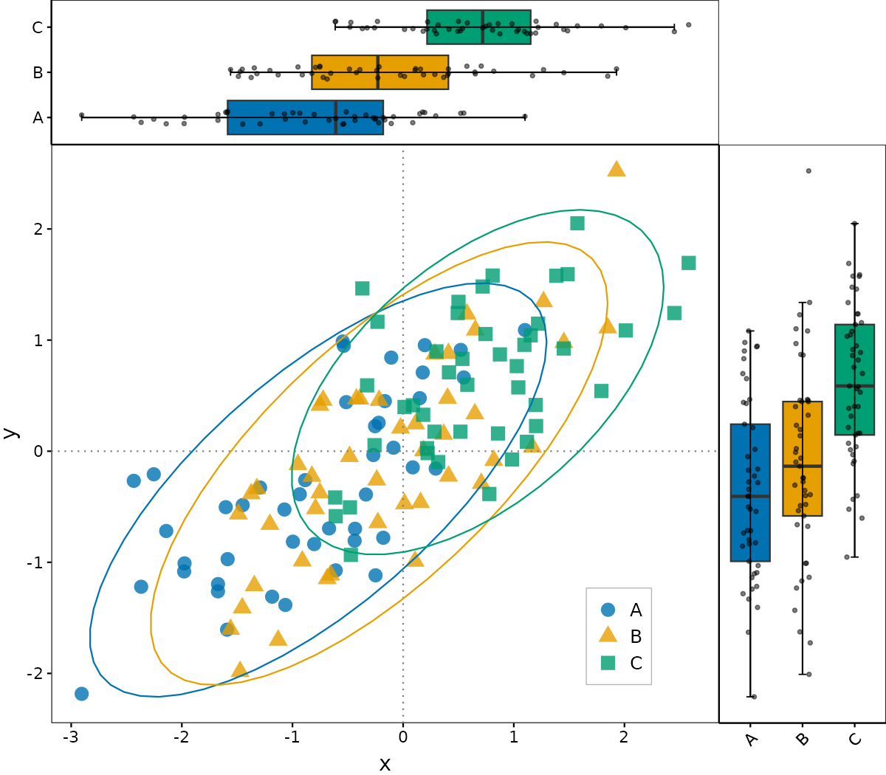{fig-alt="组合散点图：边际分布、双分组与配对差值；默认箱线边际；固定模拟数据的实际参数对照结果。"}

### 小提琴边际 {.unnumbered}

width 标准化每组最大宽度；边际小提琴的宽度不能直接读为组内人数。

```r
PlotScatter1(dat, "x", "y", "cohort", colors = cols, marginal_type = "violin",
             violin_scale = "width", box_jitter = FALSE)
```

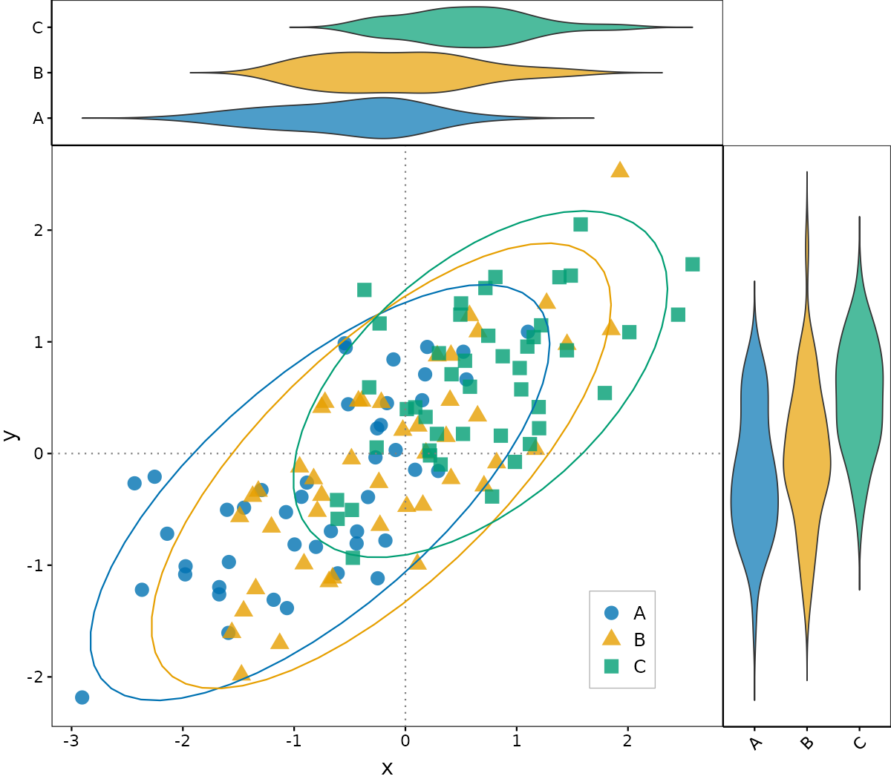{fig-alt="组合散点图：边际分布、双分组与配对差值；小提琴边际；固定模拟数据的实际参数对照结果。"}

### 小提琴叠箱线 {.unnumbered}

平滑分布和分位数在边际图中同时展示。

```r
PlotScatter1(dat, "x", "y", "cohort", colors = cols, marginal_type = "violin_box",
             box_jitter = FALSE)
```

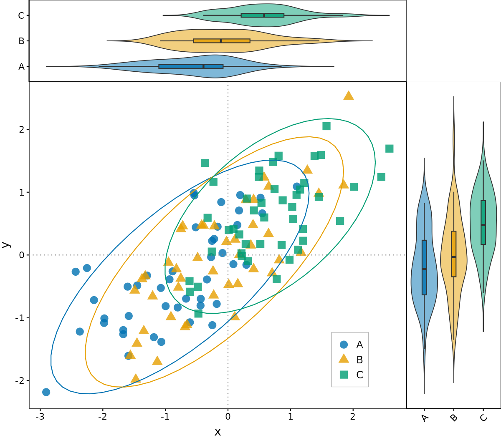{fig-alt="组合散点图：边际分布、双分组与配对差值；小提琴叠箱线；固定模拟数据的实际参数对照结果。"}

### 边际不叠点 {.unnumbered}

关闭边际抖动点，主散点仍显示所有输入行。

```r
PlotScatter1(dat, "x", "y", "cohort", colors = cols, box_jitter = FALSE)
```

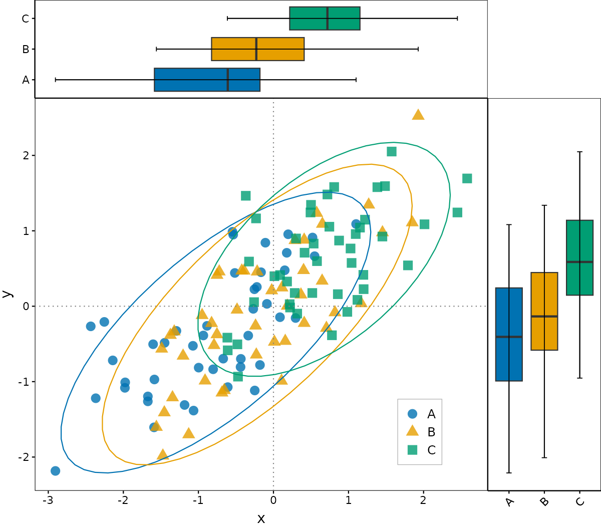{fig-alt="组合散点图：边际分布、双分组与配对差值；边际不叠点；固定模拟数据的实际参数对照结果。"}

:::

## 点、椭圆与参考线

::: {.panel-tabset}

### 改变椭圆覆盖水平 {.unnumbered}

椭圆由当前组内二维分布绘制，level=0.8；不是回归斜率的置信区间。

```r
PlotScatter1(dat, "x", "y", "cohort", colors = cols, ellipse_level = 0.8)
```

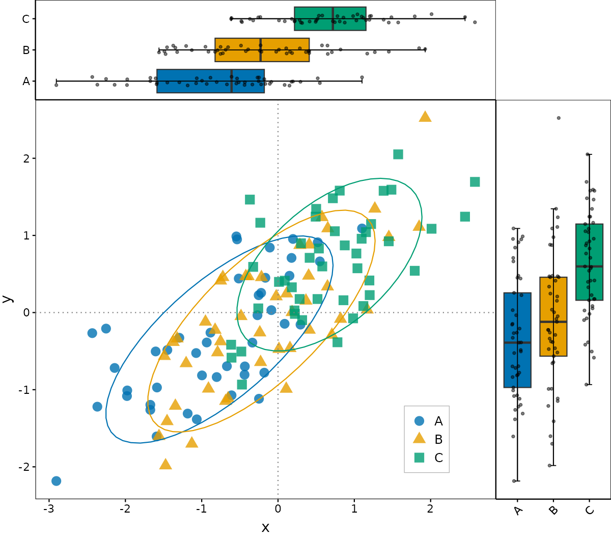{fig-alt="组合散点图：边际分布、双分组与配对差值；改变椭圆覆盖水平；固定模拟数据的实际参数对照结果。"}

### 关闭椭圆和零线 {.unnumbered}

点较密时可减小大小和透明度，保持数据数值不变。

```r
PlotScatter1(dat, "x", "y", "cohort", colors = cols, show_ellipse = FALSE,
             show_refline = FALSE, point_size = 2, point_alpha = 0.45)
```

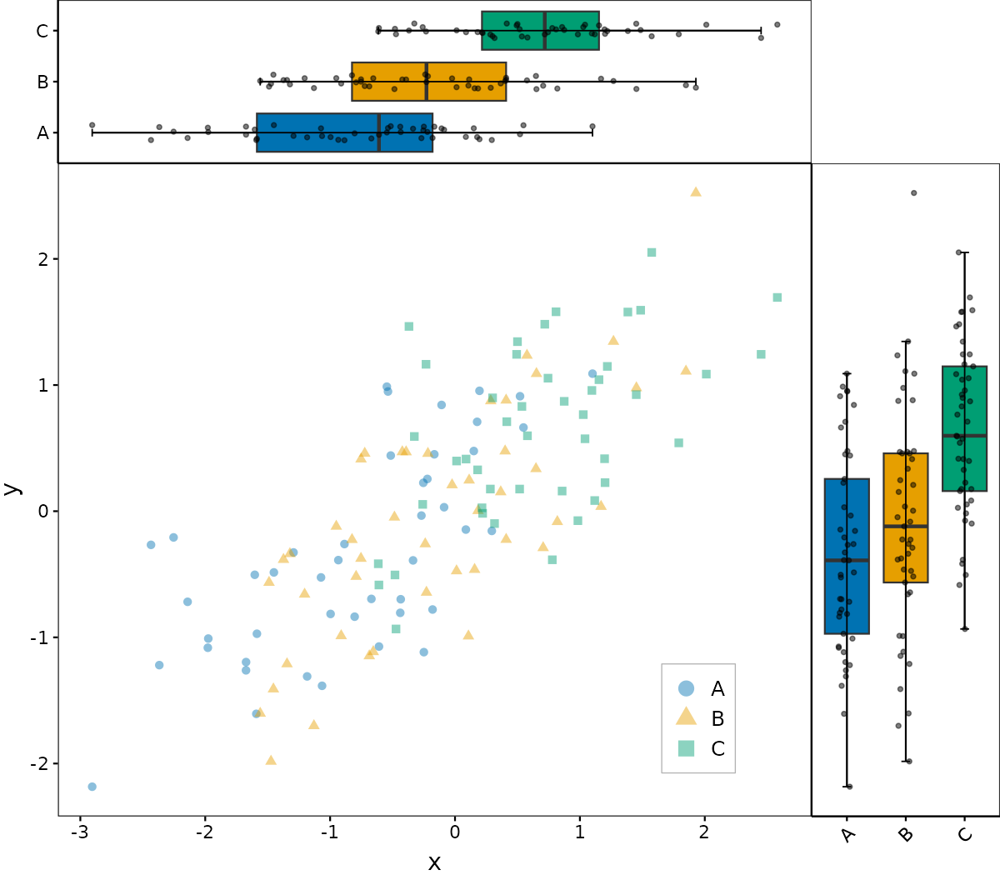{fig-alt="组合散点图：边际分布、双分组与配对差值；关闭椭圆和零线；固定模拟数据的实际参数对照结果。"}

### 更换点形和组序 {.unnumbered}

group_levels 固定顺序，命名颜色保持类别映射，未命名形状按新顺序匹配。

```r
PlotScatter1(dat, "x", "y", "cohort", colors = cols, shapes = c(15, 16, 17),
             group_levels = c("C", "B", "A"), point_size = 3)
```

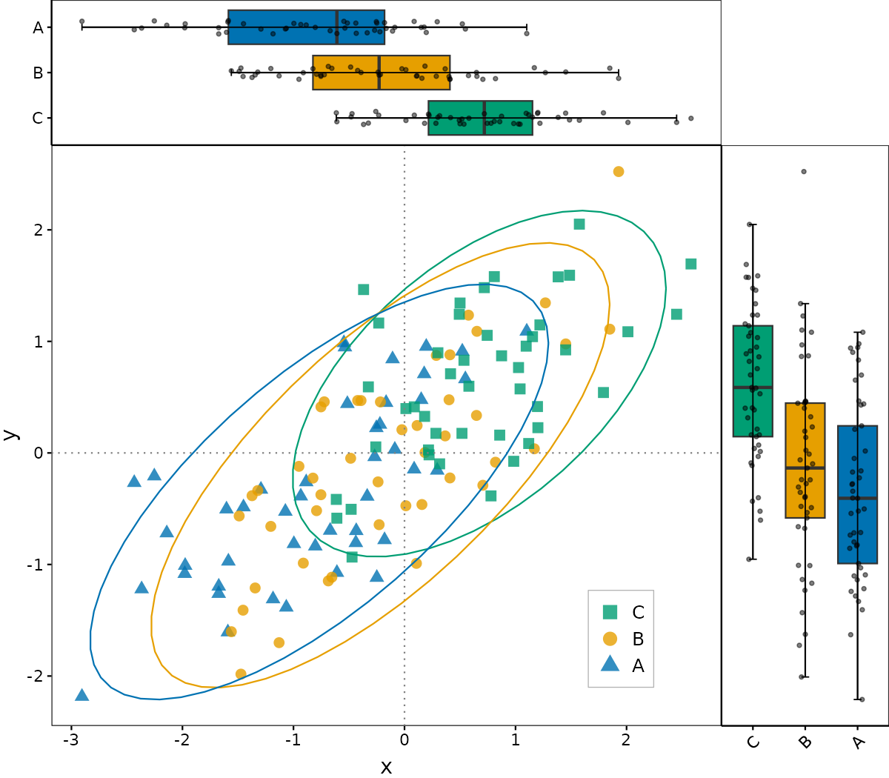{fig-alt="组合散点图：边际分布、双分组与配对差值；更换点形和组序；固定模拟数据的实际参数对照结果。"}

:::

## 拟合、相关和注释

::: {.panel-tabset}

### 整体线性拟合与 Pearson {.unnumbered}

红色拟合线与注释相关系数均使用全部观测；不同颜色没有各自独立的拟合线。

```r
PlotScatter1(dat, "x", "y", "cohort", colors = cols, show_regression = TRUE,
             reg_method = "lm", show_cor = TRUE, cor_method = "pearson")
```

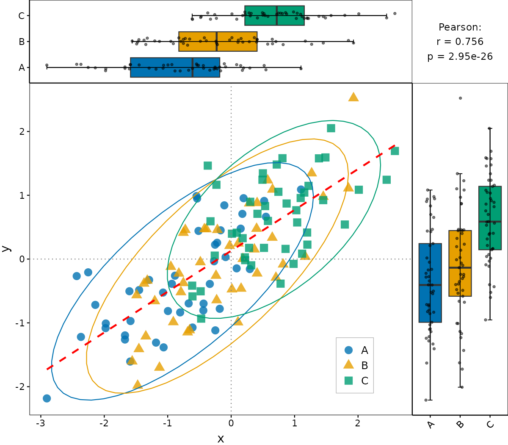{fig-alt="组合散点图：边际分布、双分组与配对差值；整体线性拟合与 Pearson；固定模拟数据的实际参数对照结果。"}

### Loess 与 Spearman {.unnumbered}

Loess 是平滑趋势；Spearman 衡量秩相关，两者不是同一统计计算。

```r
PlotScatter1(dat, "x", "y", "cohort", colors = cols, show_regression = TRUE,
             reg_method = "loess", show_cor = TRUE, cor_method = "spearman")
```

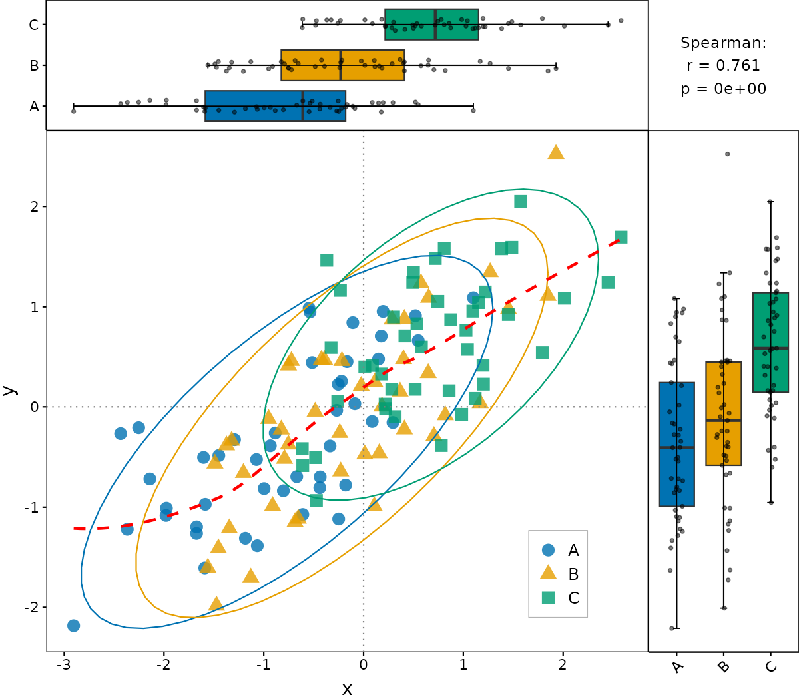{fig-alt="组合散点图：边际分布、双分组与配对差值；Loess 与 Spearman；固定模拟数据的实际参数对照结果。"}

### 自定义说明文字 {.unnumbered}

自定义注释作为文本展示，不会触发 PERMANOVA 或其它模型估计。

```r
PlotScatter1(dat, "x", "y", "cohort", colors = cols,
             annot_text = "Simulated coordinates\n135 observations", annot_size = 4)
```

{fig-alt="组合散点图：边际分布、双分组与配对差值；自定义说明文字；固定模拟数据的实际参数对照结果。"}

:::

## 尺度、布局与栅格化

::: {.panel-tabset}

### 坐标观察窗 {.unnumbered}

固定主轴和边际范围，并减小边际占比；应在最终画布核对面板对齐。

```r
PlotScatter1(dat, "x", "y", "cohort", colors = cols,
             xlim = c(-3, 3), ylim = c(-3, 3), layout_ratio = c(1, 5),
             legend_pos = c(0.8, 0.12))
```

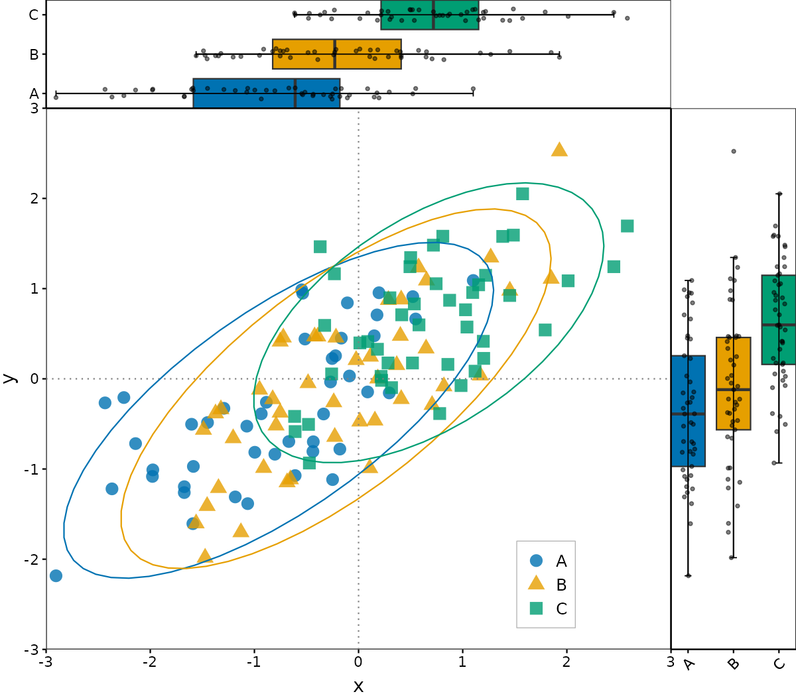{fig-alt="组合散点图：边际分布、双分组与配对差值；坐标观察窗；固定模拟数据的实际参数对照结果。"}

### 栅格化散点层 {.unnumbered}

仅主散点层转为栅格，轴文字和边际组件仍可保持矢量；PNG 中用于检查显示，PDF 中才体现混合输出。

```r
PlotScatter1(dat, "x", "y", "cohort", colors = cols, raster = TRUE,
             raster_method = "ggrastr", raster.dpi = 300)
```

{fig-alt="组合散点图：边际分布、双分组与配对差值；栅格化散点层；固定模拟数据的实际参数对照结果。"}

:::

## 双分组散点

::: {.panel-tabset}

### 只给一个分组 {.unnumbered}

group2 为 NULL 时不增加第二套形状分组。

```r
PlotScatter2(dat, "x", "y", "cohort", colors = cols, group2 = NULL)
```

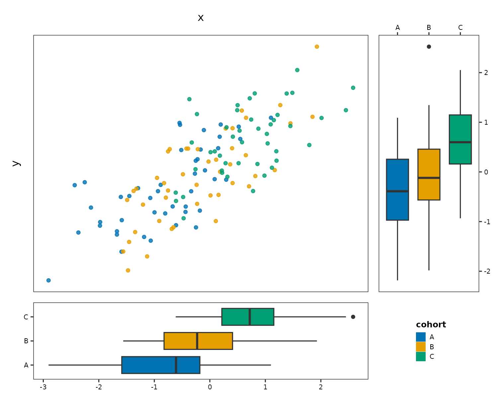{fig-alt="组合散点图：边际分布、双分组与配对差值；只给一个分组；固定模拟数据的实际参数对照结果。"}

### 颜色与形状双编码 {.unnumbered}

颜色表示 cohort，形状表示 batch；边际分别对应两种分组。

```r
PlotScatter2(dat, "x", "y", "cohort", group2 = "batch", colors = cols,
             shapes = c(16, 17, 15), fill_colors_shape = c("#E8EEF4", "#FBE8D6", "#E0EEDB"))
```

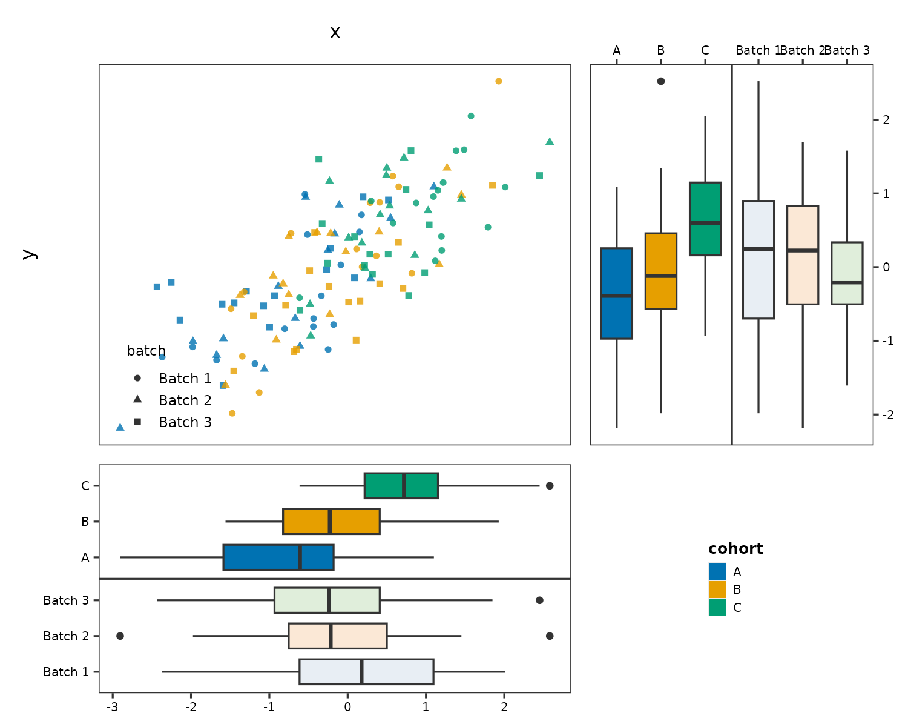{fig-alt="组合散点图：边际分布、双分组与配对差值；颜色与形状双编码；固定模拟数据的实际参数对照结果。"}

### 双分组边际小提琴 {.unnumbered}

用小提琴叠箱线展示边际，主图增加 cohort 椭圆。

```r
PlotScatter2(dat, "x", "y", "cohort", group2 = "batch", colors = cols,
             marginal_type = "violin_box", show_ellipse = TRUE, box_width = 0.6)
```

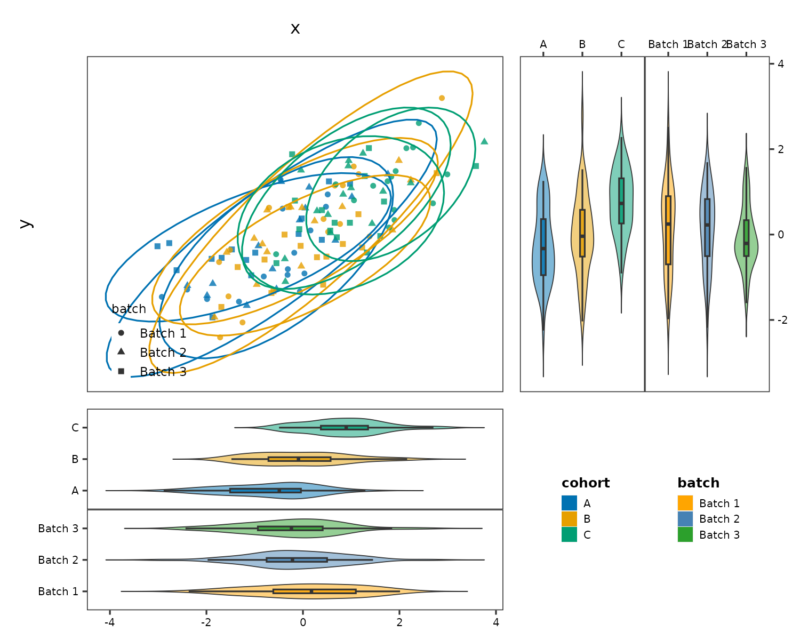{fig-alt="组合散点图：边际分布、双分组与配对差值；双分组边际小提琴；固定模拟数据的实际参数对照结果。"}

### 更改轴位置和布局 {.unnumbered}

主面板相对增大，横轴放下侧；形状图例的位置单独控制。

```r
PlotScatter2(dat, "x", "y", "cohort", group2 = "batch", colors = cols,
             x_top = FALSE, layout_main = 12, layout_margin = 2, base_size = 13,
             legend_shape_pos = c(0.2, 0.15))
```

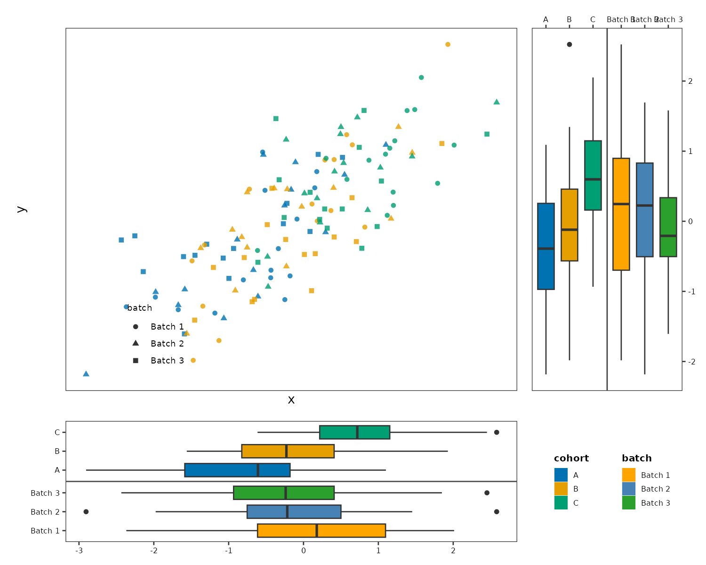{fig-alt="组合散点图：边际分布、双分组与配对差值；更改轴位置和布局；固定模拟数据的实际参数对照结果。"}

### 整体相关与回归 {.unnumbered}

整体相关文字放在主图指定数据坐标；若另给 annot_text，自定义文本优先。

```r
PlotScatter2(dat, "x", "y", "cohort", group2 = "batch", colors = cols,
             show_cor = TRUE, cor_method = "spearman", show_regression = TRUE,
             reg_method = "lm", annot_pos = c(-2.5, 2.4), annot_size = 4)
```

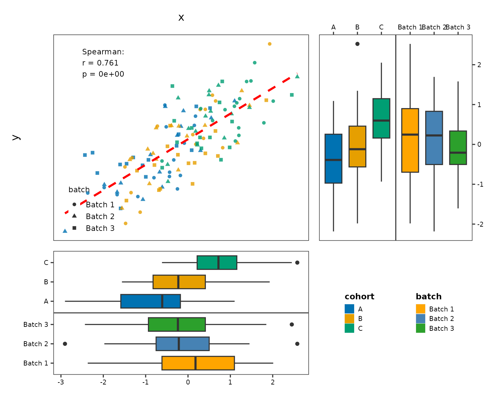{fig-alt="组合散点图：边际分布、双分组与配对差值；整体相关与回归；固定模拟数据的实际参数对照结果。"}

:::

## 配对散点与差值

::: {.panel-tabset}

### 默认配对 Wilcoxon {.unnumbered}

每行两列是同一配对单位，旋转插图显示 Treat−Control。Highlight 仅为本页显示分组，不代表显著性。

```r
PlotScatter3(paired, group_levels = c("Reference", "Highlight"))
```

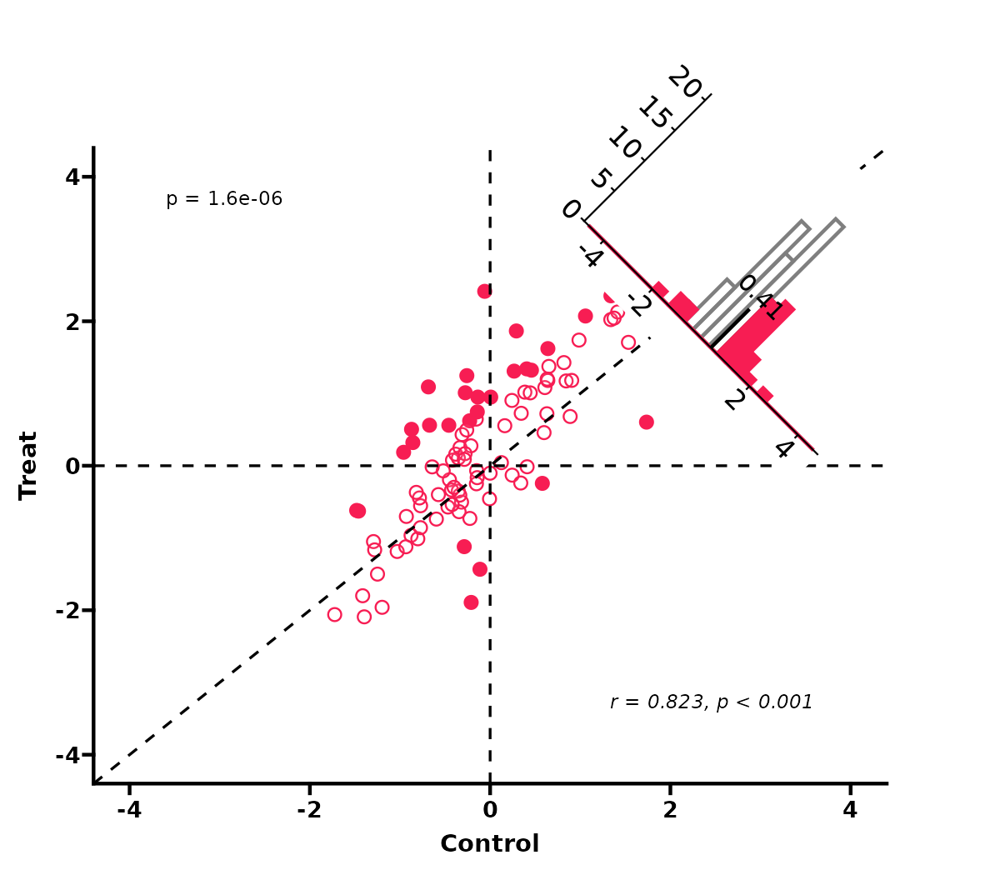{fig-alt="组合散点图：边际分布、双分组与配对差值；默认配对 Wilcoxon；固定模拟数据的实际参数对照结果。"}

### 配对 t 检验 {.unnumbered}

双侧配对 t 检验用于整体行内差值；固定相同横纵轴范围便于读 y=x。

```r
PlotScatter3(paired, test_method = "t.test", p_digits = 3,
             p_size = 3.5, axis_limits = c(-3, 3), axis_breaks = seq(-3, 3, 1))
```

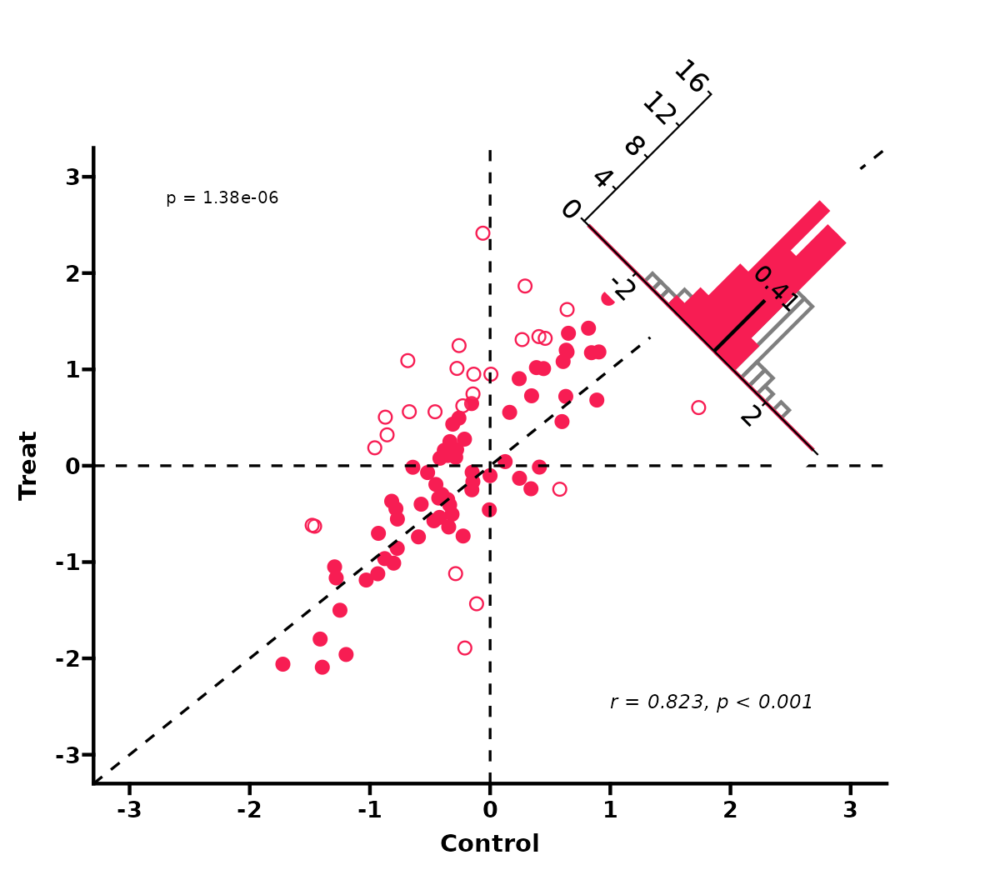{fig-alt="组合散点图：边际分布、双分组与配对差值；配对 t 检验；固定模拟数据的实际参数对照结果。"}

### 关闭统计标注 {.unnumbered}

关闭 P 值、相关与参考线，仍保留差值直方图和中位数。

```r
PlotScatter3(paired, test_method = "none", cor_method = "none", show_refline = FALSE)
```

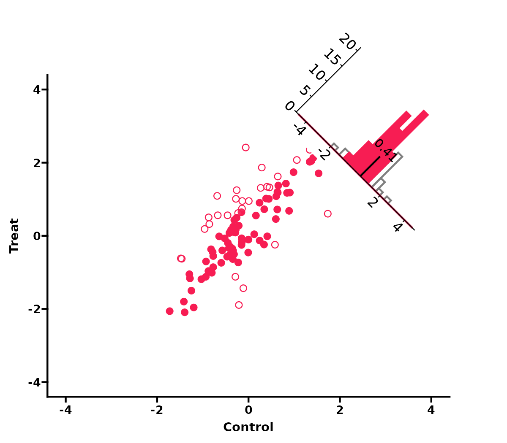{fig-alt="组合散点图：边际分布、双分组与配对差值；关闭统计标注；固定模拟数据的实际参数对照结果。"}

### 更换相关及点样式 {.unnumbered}

相关回答两列是否共同变化，配对检验回答差值；二者不能互相替代。

```r
PlotScatter3(paired, cor_method = "spearman", highlight_color = "#0072B2",
             insig_border = "grey60", point_size = 2.5, point_stroke = 0.5, point_shape = 21)
```

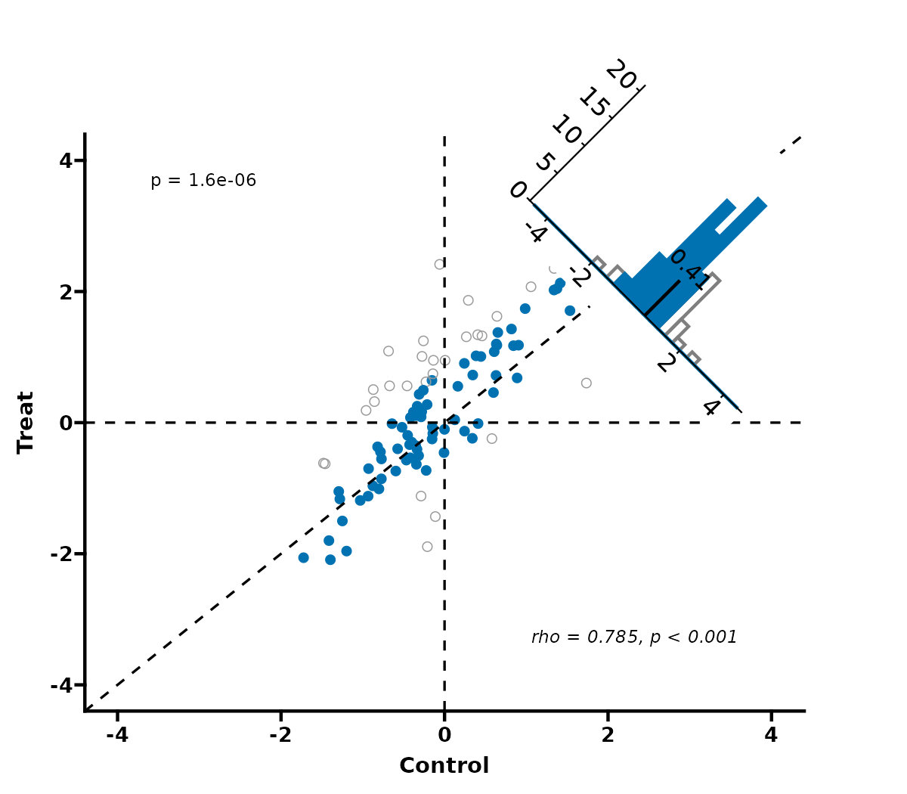{fig-alt="组合散点图：边际分布、双分组与配对差值；更换相关及点样式；固定模拟数据的实际参数对照结果。"}

### 差值分箱和范围 {.unnumbered}

差值范围与主图范围分别设置，分箱数会改变直方图外观而不改变整体中位数。

```r
PlotScatter3(paired, hist_bins = 12, hist_x_limits = c(-2, 2),
             hist_x_breaks = seq(-2, 2, 0.5), hist_border = "grey40",
             median_label_size = 4)
```

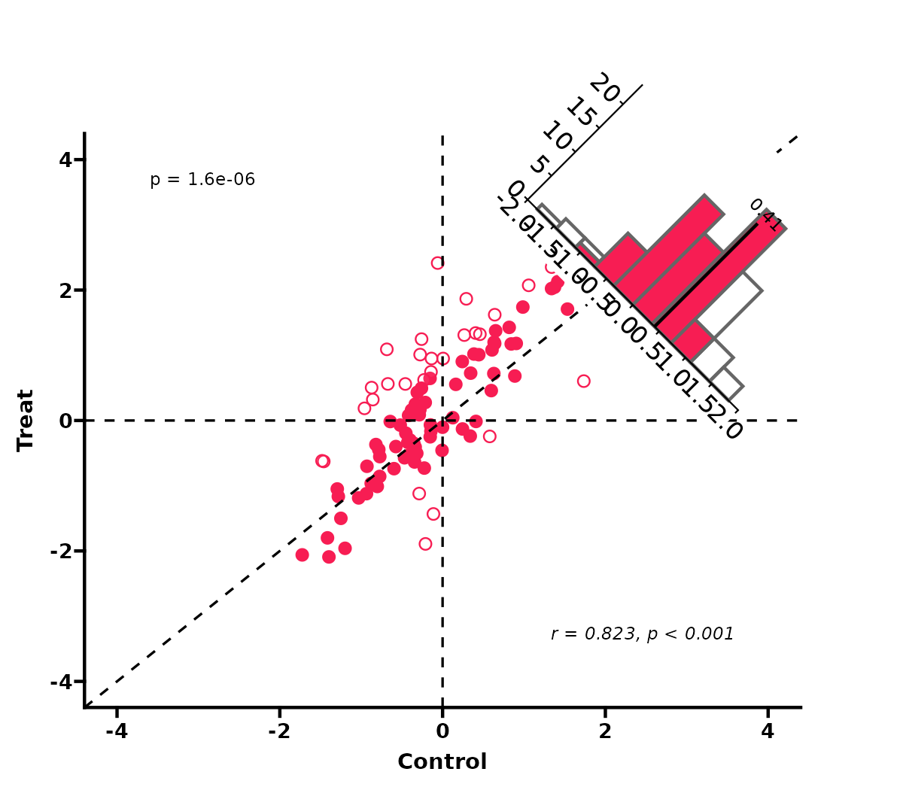{fig-alt="组合散点图：边际分布、双分组与配对差值；差值分箱和范围；固定模拟数据的实际参数对照结果。"}

### 插图位置与旋转 {.unnumbered}

调整旋转插图和上右留白，避免与主图遮挡；布局与最终导出宽高一起检查。

```r
PlotScatter3(paired, inset_left = 0.55, inset_bottom = 0.62,
             inset_right = 1.05, inset_top = 1.1, inset_angle = -30,
             inset_vp_width = 0.8, inset_vp_height = 0.65, plot_margin = c(85, 65, 5, 5))
```

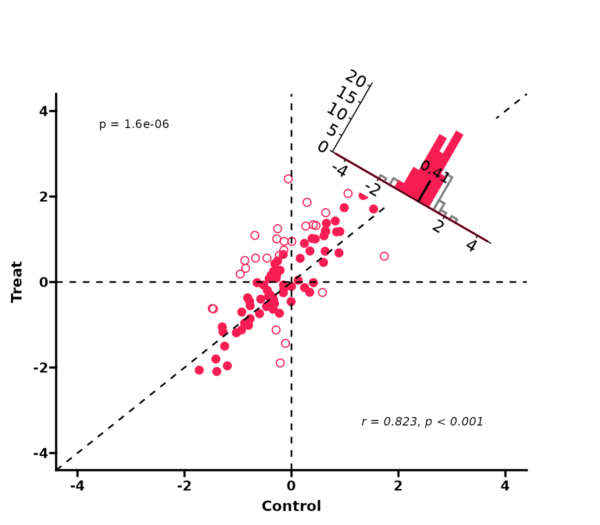{fig-alt="组合散点图：边际分布、双分组与配对差值；插图位置与旋转；固定模拟数据的实际参数对照结果。"}

:::

## 返回对象、保存与使用边界 {#output}

三个函数返回 patchwork。`filename = NULL` 不保存；给出文件名时由函数按 width/height/dpi 导出。当前接口使用 filename，并非统一 save list。

```r
p <- PlotScatter1(dat, "x", "y", "cohort", colors = cols)
# ggplot2::ggsave("scatter-marginals.pdf", p, width = 10, height = 8)
```

1/2 的回归和相关均为全部输入行的描述，颜色分组不会自动调整混杂或拟合组间交互。3 的检验使用 paired=TRUE、双侧，对全部行进行一次整体配对检验。保证行内配对关系，并处理缺失和非有限值；固定 scale 范围会影响可见数据，但统计标注在绘制前已由输入数据计算。

## 当前完整接口 {#interfaces}

点击展开查看本次实际执行版本的参数及默认值。

<details>
<summary>公共函数签名</summary>

```r
PlotScatter1 <-
function (data, x, y, group, group_levels = NULL, colors = NULL, shapes = NULL, point_size = 4,
    point_alpha = 0.8, show_ellipse = TRUE, ellipse_level = 0.95, show_refline = TRUE, show_regression = FALSE,
    reg_method = "lm", show_cor = FALSE, cor_method = "pearson", annot_text = NULL, annot_size = 4,
    xlim = NULL, ylim = NULL, xlab = NULL, ylab = NULL, title = NULL, marginal_type = c("boxplot",
        "violin", "violin_box"), violin_scale = "width", box_jitter = TRUE, layout_ratio = c(1,
        4), legend_pos = c(0.85, 0.15), legend_theme = NULL, theme_use = NULL, raster = FALSE,
    raster_method = c("scattermore", "ggrastr"), raster.dpi = 512, filename = NULL, width = 10,
    height = 8, dpi = 300)
NULL

PlotScatter2 <-
function (data, x, y, group, group2 = NULL, colors = NULL, shapes = NULL, fill_colors_shape = NULL,
    point_size = 2, point_alpha = 0.8, show_ellipse = FALSE, show_cor = FALSE, cor_method = "pearson",
    show_regression = FALSE, reg_method = "lm", annot_text = NULL, annot_pos = NULL, annot_size = 5,
    xlab = NULL, ylab = NULL, x_top = TRUE, marginal_type = c("boxplot", "violin", "violin_box"),
    box_width = 0.7, base_size = 16, legend_color_pos = "none", legend_shape_pos = c(0.15,
        0.15), layout_main = 10, layout_margin = 3, filename = NULL, width = 14, height = 12,
    dpi = 300)
NULL

PlotScatter3 <-
function (data, x = "Control", y = "Treat", group = "group", group_levels = NULL, highlight_color = "#f71d53",
    insig_border = NULL, point_shape = 21, point_size = 3, point_stroke = 0.8, xlab = "Control",
    ylab = "Treat", axis_limits = NULL, axis_breaks = NULL, show_refline = TRUE, test_method = "wilcox",
    p_digits = 2, p_size = 4, p_x = NULL, p_y = NULL, cor_method = "pearson", cor_size = 4,
    cor_x = NULL, cor_y = NULL, hist_bins = 30, hist_x_limits = NULL, hist_x_breaks = NULL,
    hist_border = NULL, median_label_size = 5, median_line_yend = NULL, inset_left = 0.6, inset_bottom = 0.6,
    inset_right = 1.1, inset_top = 1.1, inset_angle = -45, inset_vp_width = 0.85, inset_vp_height = 0.75,
    theme_use = theme_my(border = FALSE, panel.grid = ggplot2::element_blank()), plot_margin = c(80,
        60, 5, 5), filename = NULL, width = 6, height = 6.5, dpi = 300, bg = "white")
NULL

```

</details>

## 验证范围与参考 {#references}

本页列出的调用均已实际执行；所有展示的 ggplot/patchwork 图通过 `ggplot_build()` 和 PNG 导出，表格来自同一组代码的实际返回。未修改 UtilsR 源码或重新运行全包测试。

本次绘制出现的提示记录如下；对应示例仍通过实际构建和导出检查。

<details>
<summary>绘图提示</summary>

- `Removed 4 rows containing missing values or values outside the scale range ('geom_bar()').`
- `cannot clip to rotated viewport`
- `Removed 2 rows containing missing values or values outside the scale range ('geom_point()').`
- `Removed 1 row containing non-finite outside the scale range ('stat_bin()').`

</details>

- [UtilsR 函数参考](https://hui950319.github.io/UtilsR/reference/index.html)
- [UtilsR 源码](https://github.com/HUI950319/UtilsR/tree/master/R)
- [专题目录](index.qmd)

<details>
<summary>执行环境</summary>

```text
R version 4.4.3 (2025-02-28)
Platform: x86_64-pc-linux-gnu
Running under: Ubuntu 22.04.2 LTS

Matrix products: default
BLAS:   /usr/lib/x86_64-linux-gnu/openblas-pthread/libblas.so.3
LAPACK: /usr/lib/x86_64-linux-gnu/openblas-pthread/libopenblasp-r0.3.20.so;  LAPACK version 3.10.0

locale:
 [1] LC_CTYPE=C.UTF-8       LC_NUMERIC=C           LC_TIME=C.UTF-8        LC_COLLATE=C.UTF-8
 [5] LC_MONETARY=C.UTF-8    LC_MESSAGES=C.UTF-8    LC_PAPER=C.UTF-8       LC_NAME=C
 [9] LC_ADDRESS=C           LC_TELEPHONE=C         LC_MEASUREMENT=C.UTF-8 LC_IDENTIFICATION=C

time zone: Asia/Shanghai
tzcode source: system (glibc)

attached base packages:
[1] stats     graphics  grDevices utils     datasets  methods   base

other attached packages:
[1] ggplot2_4.0.3 UtilsR_0.6.8

loaded via a namespace (and not attached):
 [1] Matrix_1.7-6       gtable_0.3.6       jsonlite_2.0.0     dplyr_1.2.0        compiler_4.4.3
 [6] tidyselect_1.2.1   Rcpp_1.1.1         ggbeeswarm_0.7.3   dichromat_2.0-0.1  gridExtra_2.3
[11] splines_4.4.3      textshaping_0.4.0  systemfonts_1.1.0  scales_1.4.0       lattice_0.23-1
[16] R6_2.6.1           labeling_0.4.3     generics_0.1.4     patchwork_1.3.2    httr2_1.2.2
[21] Cairo_1.7-0        MASS_7.3-64        ggrepel_0.9.8      tibble_3.3.1       ellmer_0.4.0
[26] pillar_1.11.1      RColorBrewer_1.1-3 rlang_1.3.0        S7_0.2.2           otel_0.2.0
[31] cli_3.6.6          mgcv_1.9-3         withr_3.0.3        magrittr_2.0.4     digest_0.6.39
[36] grid_4.4.3         rappdirs_0.3.4     beeswarm_0.4.0     nlme_3.1-167       lifecycle_1.0.5
[41] vipor_0.4.7        ggrastr_1.0.2      coro_1.1.0         vctrs_0.7.3        ggprism_1.0.7
[46] glue_1.8.1         farver_2.1.2       ragg_1.5.2         tools_4.4.3        pkgconfig_2.0.3
[51] mcptools_0.2.1
```

</details>
