plt_upset 的列表和指示列输入、区域标签和返回数据，PlotHeatmapJaccard 的顺序、色阶和矩阵。各节用固定输入比较重要参数，标签页中展示可复制代码与实际结果。

**版本与执行范围：** 本页按 UtilsR **0.6.8** 的公共接口核对；22 个示例已在 WSL R 4.4.3 中实际执行，其中 17 张图已完成构建与 PNG 导出。使用固定随机种子的模拟数据。

## 数据准备与输入约定 {#data}

集合成员是模拟 g1…g25；列表覆盖并集，members 明确给出 25 元素的外部总体，long 是每组成员的长表。

```r
library(UtilsR)
library(ggplot2)
sets <- list(A = paste0("g", 1:10), B = paste0("g", 6:15),
             C = paste0("g", c(2, 4, 6, 12, 18)), D = paste0("g", c(1, 7, 14, 17, 19)))
sets3 <- sets[1:3]
members <- data.frame(element = paste0("g", 1:25))
for (nm in names(sets3)) members[[nm]] <- as.integer(members[["element"]] %in% sets3[[nm]])
long <- do.call(rbind, lapply(names(sets), function(nm) {
  data.frame(set = nm, feature = sets[[nm]])
}))
long[["set"]] <- factor(long[["set"]], levels = names(sets))
strip_cols <- c("#0072B2", "#E69F00", "#009E73", "#CC79A7")
```

## 函数选择与重要参数 {#parameters}

| 目标 | 参数与默认值 | 当前行为 |
|:--|:--|:--|
| 元素集合输入 | `plt_upset(data=命名list)` | 每个元素是成员向量；vars/levels 被忽略；同一元素值定义交集 |
| 指示列输入 | `vars`、`levels=c("Yes","yes")` | 以行号定义共同元素；0/1 数据须明确 levels=1；levels=NA 表示缺失集合 |
| 输出 | `output="both"` | venn/upset/both/data/all；UpSet 实际为 upset_plot/aplot；data 增加 intersect_group |
| 区域标签 | `label="both"`、`label_geom="label"`、`label_size/color/alpha` | 主要控制 Venn 的区域标签，不控制 UpSet 顶柱标签 |
| Venn 填色 | `venn.fill="gradient"`、`colors` | gradient/gradient_rev/none；category 当前使用 RdBu 区域色阶，colors 用于边界色 |
| 现有无效设置 | `venn.alpha=0.5` | 当前函数体没有将其用于图层，不把它作为有效透明度控制演示 |
| UpSet 配色 | `colors` | 顺序为集合边柱、交集顶柱、交集点阵三色 |
| 边界与名称 | `edge.color/edge.size/set.name.size/set.labels` | set.labels 为原集合名到显示名的命名向量 |
| Jaccard 输入 | `group_col="cell_type"`、`name_col="gene"` | 长表每行给一个组内成员，计算交集大小/并集大小；重复成员不增加权重 |
| Jaccard 显示 | `group_levels/title/show_diag=FALSE/text_size=2.5` | 顺序同时作用两轴；隐藏对角线只改变显示，返回矩阵保留对角线 |
| 色阶与条带 | `midpoint=0.1`、`low_color/high_color/show_strip/strip_colors/strip_size` | 数值色阶固定 0–1；条带在当前图的下侧与左侧；midpoint 不是显著性阈值 |
| Jaccard 返回 | `return_type="plot"` | data 返回矩阵，both 返回 plot/matrix list；filename/width/height/dpi 可保存 |

## 两种集合输入

::: {.panel-tabset}

### 命名列表 Venn {.unnumbered}

同名元素在不同集合中形成交集，输入只覆盖三集合的并集。

```r
plt_upset(sets3, output = "venn", label = "count")
```

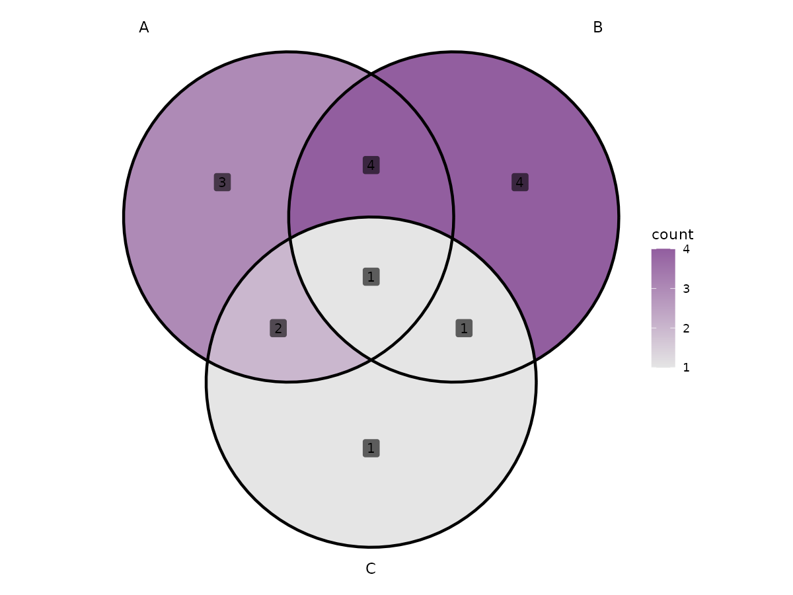{fig-alt="集合比较：Venn、UpSet、成员分组与 Jaccard 热图；命名列表 Venn；固定模拟数据的实际参数对照结果。"}

### 命名列表 UpSet {.unnumbered}

交集顶柱是精确成员组合，不是所有包含该组合的累计人数；显式 print 渲染 aplot。

```r
print(plt_upset(sets3, output = "upset"))
```

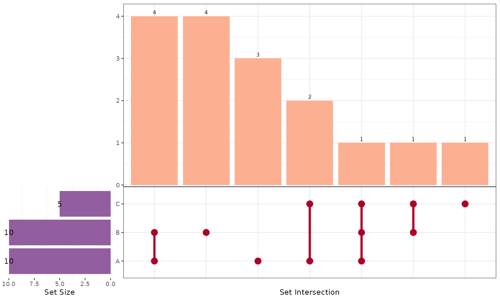{fig-alt="集合比较：Venn、UpSet、成员分组与 Jaccard 热图；命名列表 UpSet；固定模拟数据的实际参数对照结果。"}

### 0/1 指示列 {.unnumbered}

同一行是共同元素；与列表的交集计数一致，输入中另有不属于任何集合的元素。

```r
plt_upset(members, vars = c("A", "B", "C"), levels = 1, output = "venn", label = "count")
```

{fig-alt="集合比较：Venn、UpSet、成员分组与 Jaccard 热图；0/1 指示列；固定模拟数据的实际参数对照结果。"}

### both 的当前回退 {.unnumbered}

本次依赖组合下，直接合并失败并报告警告，实际回退为 UpSet 图。下面另给显式转换后的完整组合方式。

```r
print(plt_upset(sets3, output = "both"))
```

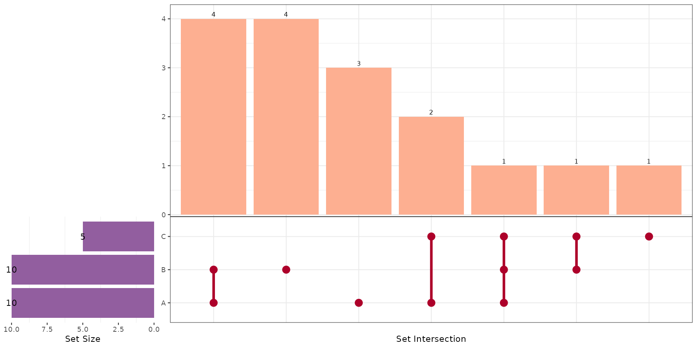{fig-alt="集合比较：Venn、UpSet、成员分组与 Jaccard 热图；both 的当前回退；固定模拟数据的实际参数对照结果。"}

### 显式组合两个图 {.unnumbered}

先将 aplot 转成 patchwork，再与 Venn 排版；此调用实际验证显示两个结果。

```r
p_v <- plt_upset(sets3, output = "venn")
p_u <- plt_upset(sets3, output = "upset")
patchwork::wrap_plots(p_v, aplot::as.patchwork(p_u), ncol = 2, widths = c(0.45, 1))
```

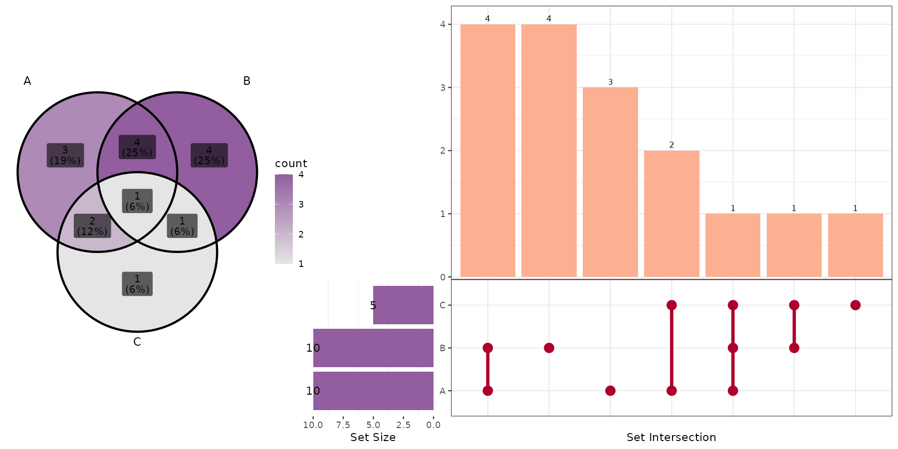{fig-alt="集合比较：Venn、UpSet、成员分组与 Jaccard 热图；显式组合两个图；固定模拟数据的实际参数对照结果。"}

:::

## Venn 填色和标签

::: {.panel-tabset}

### 反向计数色阶 {.unnumbered}

连续填色编码区域人数，gradient_rev 把较大计数显示为较浅颜色。

```r
plt_upset(sets3, output = "venn", venn.fill = "gradient_rev",
          colors = "#0072B2", label = "both")
```

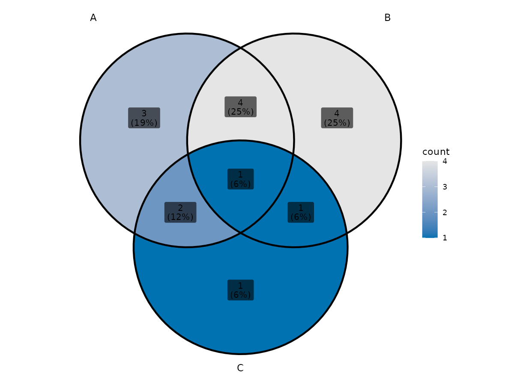{fig-alt="集合比较：Venn、UpSet、成员分组与 Jaccard 热图；反向计数色阶；固定模拟数据的实际参数对照结果。"}

### 白色区域和文字标签 {.unnumbered}

none 当前把区域填成白色；文字标签无背景框，并非透明背景的文件导出。

```r
plt_upset(sets3, output = "venn", venn.fill = "none", label = "count",
          label_geom = "text", label_color = "#222222", edge.color = "grey30", edge.size = 0.7)
```

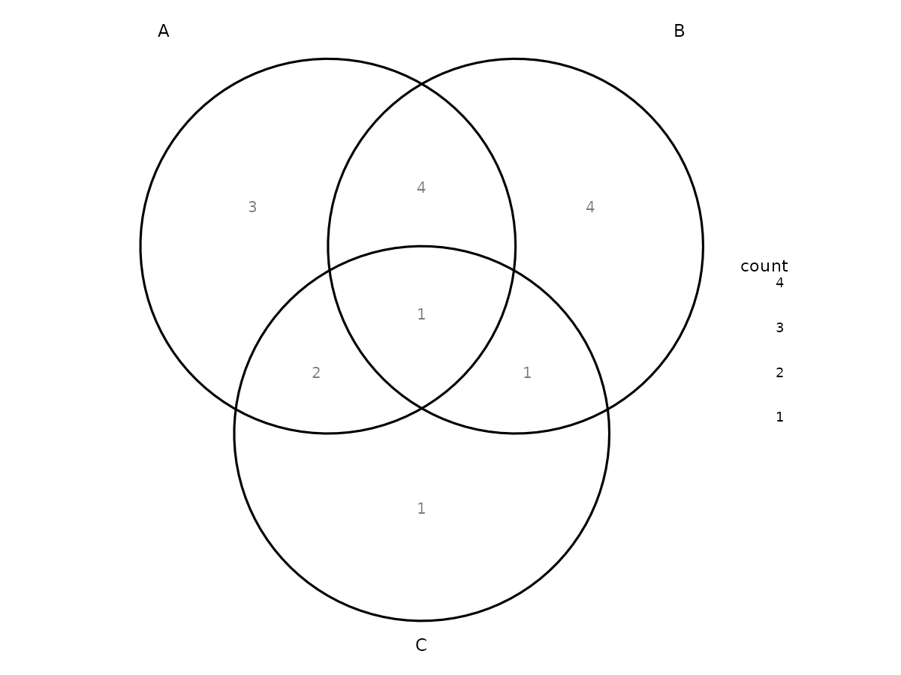{fig-alt="集合比较：Venn、UpSet、成员分组与 Jaccard 热图；白色区域和文字标签；固定模拟数据的实际参数对照结果。"}

### 当前 category 分支 {.unnumbered}

当前 category 分支的区域填色使用 RdBu distiller，提供的 colors 映射边界；不按参数名推断为独立集合透明叠色。

```r
plt_upset(sets3, output = "venn", venn.fill = "category",
          colors = c("#0072B2", "#E69F00", "#009E73"), label = "count")
```

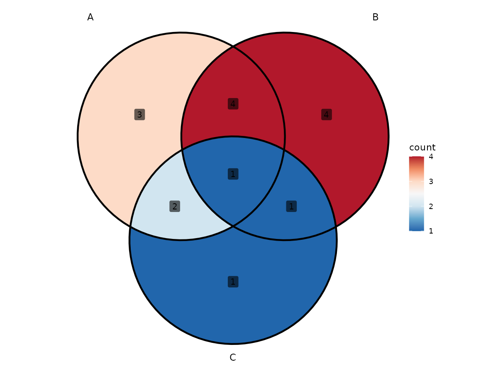{fig-alt="集合比较：Venn、UpSet、成员分组与 Jaccard 热图；当前 category 分支；固定模拟数据的实际参数对照结果。"}

### 百分比与标签框 {.unnumbered}

Venn 区域百分比按集合并集计算；不包括指示表中完全不属于任何集合的行。

```r
plt_upset(sets3, output = "venn", label = "percent", label_geom = "label",
          label_alpha = 0.9, label_size = 4, colors = "#CC79A7")
```

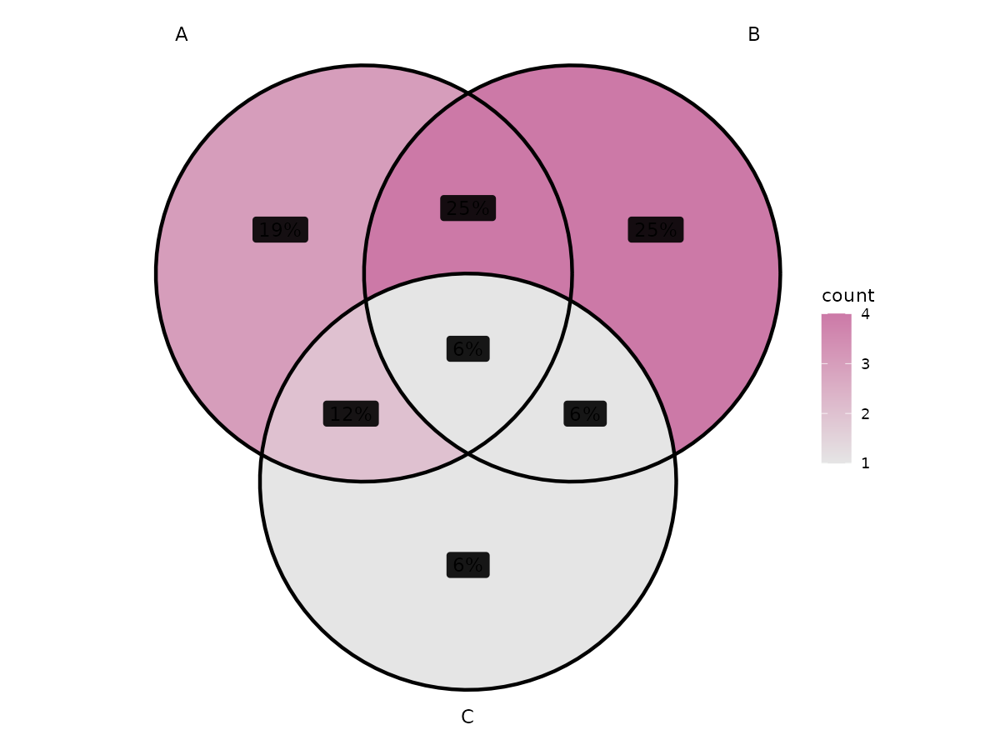{fig-alt="集合比较：Venn、UpSet、成员分组与 Jaccard 热图；百分比与标签框；固定模拟数据的实际参数对照结果。"}

### 显示名称和字号 {.unnumbered}

集合显示名替换不改变成员；set.labels 的键必须是输入集合名。

```r
plt_upset(sets3, output = "venn", label = "count",
          set.labels = c(A = "Screen A", B = "Screen B", C = "Screen C"),
          set.name.size = 5, label_size = 3.5)
```

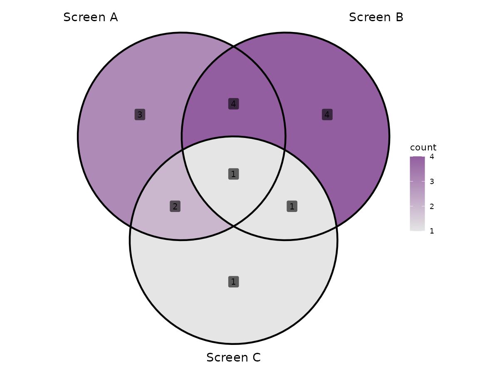{fig-alt="集合比较：Venn、UpSet、成员分组与 Jaccard 热图；显示名称和字号；固定模拟数据的实际参数对照结果。"}

:::

## UpSet 配色与成员返回

::: {.panel-tabset}

### 三种图形部件颜色 {.unnumbered}

三色分别用于集合边柱、交集顶柱、点阵，未逐集合指定颜色。

```r
print(plt_upset(sets, output = "upset",
                colors = c("#0072B2", "#D55E00", "#333333")))
```

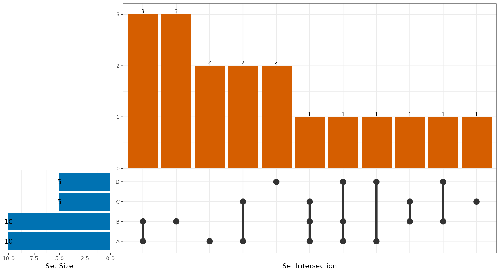{fig-alt="集合比较：Venn、UpSet、成员分组与 Jaccard 热图；三种图形部件颜色；固定模拟数据的实际参数对照结果。"}

### 每行的交集组 {.unnumbered}

返回保留每行及 intersect_group，完全非成员行分组为 None；图中的交集柱不包含 None。

```r
grouped <- plt_upset(members, vars = c("A", "B", "C"), levels = 1, output = "data")
head(grouped, 12)
```

|element |  A|  B|  C|intersect_group |
|:-------|--:|--:|--:|:---------------|
|g1      |  1|  0|  0|A               |
|g2      |  1|  0|  1|A/C             |
|g3      |  1|  0|  0|A               |
|g4      |  1|  0|  1|A/C             |
|g5      |  1|  0|  0|A               |
|g6      |  1|  1|  1|A/B/C           |
|g7      |  1|  1|  0|A/B             |
|g8      |  1|  1|  0|A/B             |
|g9      |  1|  1|  0|A/B             |
|g10     |  1|  1|  0|A/B             |
|g11     |  0|  1|  0|B               |
|g12     |  0|  1|  1|B/C             |

### 核对完整输入分母 {.unnumbered}

这张实际频数表包括 None，可以核对集合图未显示的完整输入行数。

```r
grouped <- plt_upset(members, vars = c("A", "B", "C"), levels = 1, output = "data")
as.data.frame(table(grouped[["intersect_group"]], useNA = "ifany"))
```

|Var1  | Freq|
|:-----|----:|
|B     |    4|
|A/B   |    4|
|A     |    3|
|A/C   |    2|
|C     |    1|
|B/C   |    1|
|A/B/C |    1|
|None  |    9|

### 所有结果的类型 {.unnumbered}

all 返回 venn/upset/combined/data；不能把整个 list 直接作为一个 ggplot 保存。

```r
out <- plt_upset(sets3, output = "all")
data.frame(component = names(out), class = vapply(out, function(z) paste(class(z), collapse = "/"), character(1)))
```

|         |component |class                                           |
|:--------|:---------|:-----------------------------------------------|
|venn     |venn      |ggplot2::ggplot/ggplot/ggplot2::gg/S7_object/gg |
|upset    |upset     |upset_plot/aplot                                |
|combined |combined  |upset_plot/aplot                                |
|data     |data      |data.frame                                      |

:::

## Jaccard 热图参数

::: {.panel-tabset}

### 默认隐藏对角线 {.unnumbered}

集合相似度介于 0 和 1，默认对角线显示浅灰；不是连续数值相关系数。

```r
PlotHeatmapJaccard(long, group_col = "set", name_col = "feature")
```

{fig-alt="集合比较：Venn、UpSet、成员分组与 Jaccard 热图；默认隐藏对角线；固定模拟数据的实际参数对照结果。"}

### 显示对角线 {.unnumbered}

非空集合与自身的相似度为 1，展示这一恒等关系。

```r
PlotHeatmapJaccard(long, "set", "feature", show_diag = TRUE, text_size = 3.5)
```

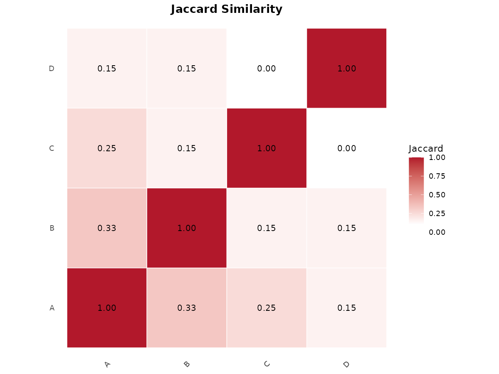{fig-alt="集合比较：Venn、UpSet、成员分组与 Jaccard 热图；显示对角线；固定模拟数据的实际参数对照结果。"}

### 改变轴顺序 {.unnumbered}

两轴同步按明确顺序排列，不执行聚类排序。

```r
PlotHeatmapJaccard(long, "set", "feature", group_levels = c("D", "C", "B", "A"),
                   title = "Ordered set similarity")
```

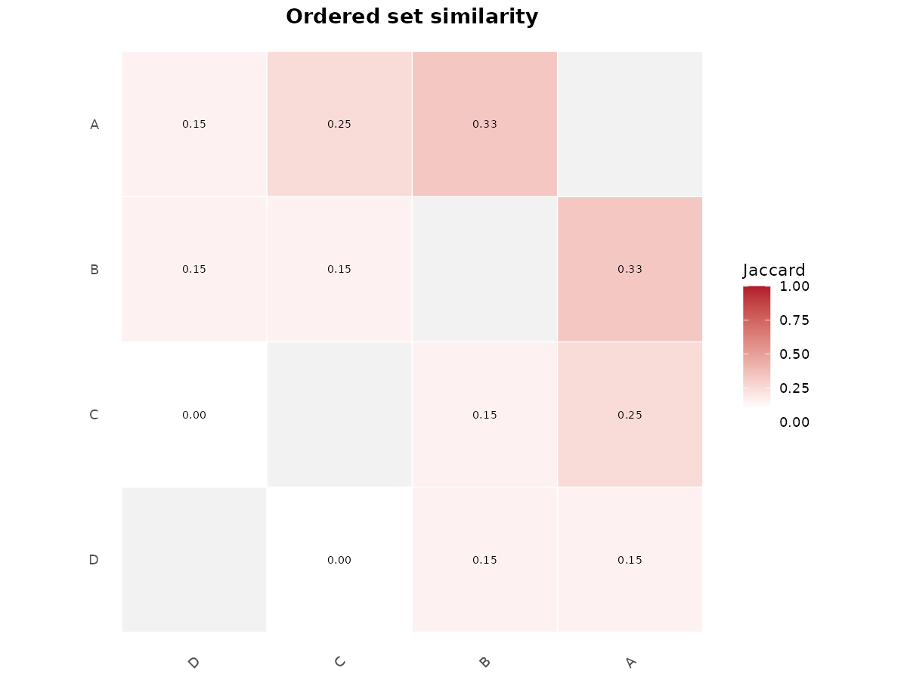{fig-alt="集合比较：Venn、UpSet、成员分组与 Jaccard 热图；改变轴顺序；固定模拟数据的实际参数对照结果。"}

### 色阶中点和数值标签 {.unnumbered}

midpoint 调整渐变中心，不改变计算值；text_size=0 隐藏单元数值。

```r
PlotHeatmapJaccard(long, "set", "feature", midpoint = 0.4,
                   low_color = "#DCEAF7", high_color = "#542788", text_size = 0)
```

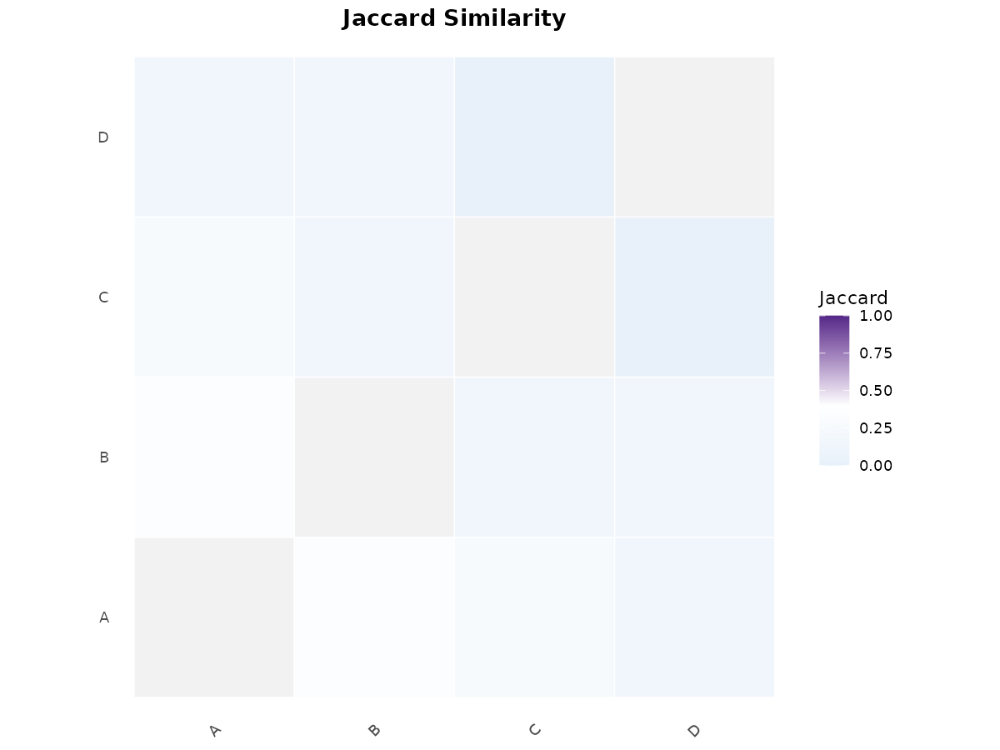{fig-alt="集合比较：Venn、UpSet、成员分组与 Jaccard 热图；色阶中点和数值标签；固定模拟数据的实际参数对照结果。"}

### 集合颜色条带 {.unnumbered}

下侧与左侧条带按当前集合顺序编码组别，和单元的数值色阶独立。

```r
PlotHeatmapJaccard(long, "set", "feature", show_strip = TRUE,
                   strip_colors = strip_cols, strip_size = 0.35)
```

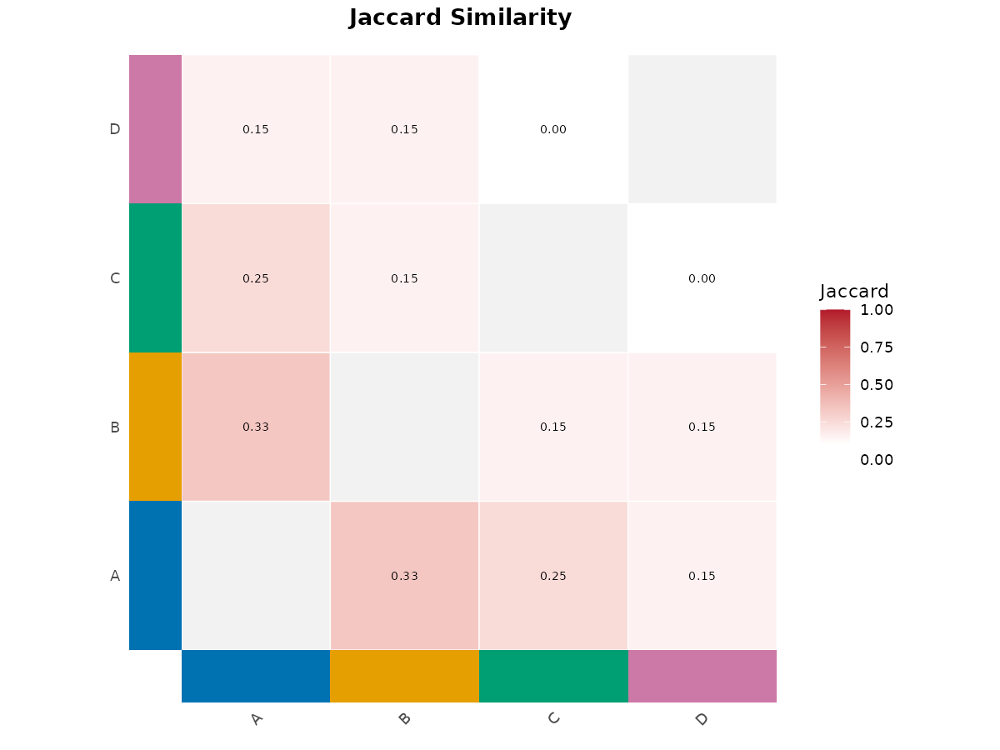{fig-alt="集合比较：Venn、UpSet、成员分组与 Jaccard 热图；集合颜色条带；固定模拟数据的实际参数对照结果。"}

:::

## 矩阵返回与数值核对

::: {.panel-tabset}

### 完整矩阵 {.unnumbered}

返回矩阵保留对角线，即使默认图把它隐藏；A/B 交集五个、并集十五个，因此为 1/3。

```r
PlotHeatmapJaccard(long, "set", "feature", return_type = "data")
```

|   |      A|      B|      C|      D|
|:--|------:|------:|------:|------:|
|A  | 1.0000| 0.3333| 0.2500| 0.1538|
|B  | 0.3333| 1.0000| 0.1538| 0.1538|
|C  | 0.2500| 0.1538| 1.0000| 0.0000|
|D  | 0.1538| 0.1538| 0.0000| 1.0000|

### both 的图和矩阵 {.unnumbered}

both 同时返回图与矩阵；通过明确的 plot 元素继续格式化或保存。

```r
res <- PlotHeatmapJaccard(long, "set", "feature", return_type = "both")
res[["plot"]]
```

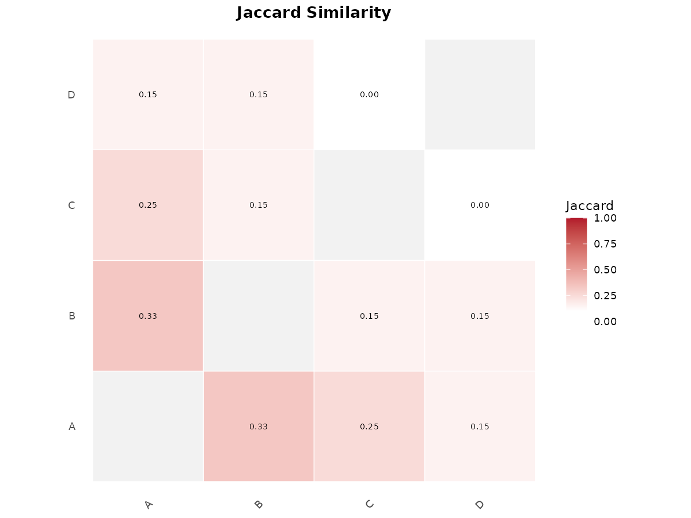{fig-alt="集合比较：Venn、UpSet、成员分组与 Jaccard 热图；both 的图和矩阵；固定模拟数据的实际参数对照结果。"}

### 重复元素不改变 Jaccard {.unnumbered}

使用集合 union/intersect，重复记录不增加相似度权重；这个例子实际验证去重后的集合语义。

```r
m1 <- PlotHeatmapJaccard(long, "set", "feature", return_type = "data")
m2 <- PlotHeatmapJaccard(rbind(long, long[1:5, ]), "set", "feature", return_type = "data")
data.frame(identical_matrix = identical(m1, m2), A_B = m1["A", "B"])
```

|identical_matrix |    A_B|
|:----------------|------:|
|TRUE             | 0.3333|

:::

## 返回对象、保存与使用边界 {#output}

`plt_upset()` 的 Venn 是 ggplot，UpSet 当前是 upset_plot/aplot；本次 output=both 直接组合失败后回退为 UpSet，并记录警告。显式使用 aplot::as.patchwork 转换后再组合已通过实际验证。data/all 适合核对完整输入行数和交集组。

`PlotHeatmapJaccard()` 的 data 返回完整数值矩阵，both 返回 plot/matrix。filename 可保存图，或外部 ggsave(res[["plot"]])。矩阵采用唯一成员集合，未使用排名、重要性大小或表达值权重；NA 成员和空组须在分析前明确处理。空并集在当前实现中取 0。集合重叠与 Jaccard 相似度都没有附带显著性检验。

`venn.alpha` 当前没有用于函数体图层；category 分支也未实现帮助文字描述的独立集合透明叠色。本页按实际源码和输出说明，没有修改包。

## 当前完整接口 {#interfaces}

点击展开查看本次实际执行版本的参数及默认值。

<details>
<summary>公共函数签名</summary>

```r
plt_upset <-
function (data, vars = NULL, levels = c("Yes", "yes"), colors = NULL, output = c("both", "venn",
    "upset", "data", "all"), label = c("both", "count", "percent", "none"), label_geom = c("label",
    "text"), label_color = "black", label_size = 3.5, label_alpha = 0.6, venn.fill = c("gradient",
    "gradient_rev", "category", "none"), venn.alpha = 0.5, edge.color = "grey30", edge.size = 1,
    set.name.size = 4, set.labels = NULL)
NULL

PlotHeatmapJaccard <-
function (data, group_col = "cell_type", name_col = "gene", title = "Jaccard Similarity", group_levels = NULL,
    midpoint = 0.1, text_size = 2.5, show_diag = FALSE, low_color = "white", high_color = "#B2182B",
    show_strip = FALSE, strip_colors = NULL, strip_size = 0.45, return_type = c("plot", "data",
        "both"), filename = NULL, width = 10, height = 9, dpi = 300)
NULL

```

</details>

## 验证范围与参考 {#references}

本页列出的调用均已实际执行；所有展示的 ggplot/patchwork 图通过 `ggplot_build()` 和 PNG 导出，表格来自同一组代码的实际返回。未修改 UtilsR 源码或重新运行全包测试。

本次绘制出现的提示记录如下；对应示例仍通过实际构建和导出检查。

<details>
<summary>绘图提示</summary>

- `Combined layout failed: Only know how to add <ggplot> and/or <grob> objects. Returning plots separately.`

</details>

- [UtilsR 函数参考](https://hui950319.github.io/UtilsR/reference/index.html)
- [UtilsR 源码](https://github.com/HUI950319/UtilsR/tree/master/R)
- [专题目录](index.qmd)

<details>
<summary>执行环境</summary>

```text
R version 4.4.3 (2025-02-28)
Platform: x86_64-pc-linux-gnu
Running under: Ubuntu 22.04.2 LTS

Matrix products: default
BLAS:   /usr/lib/x86_64-linux-gnu/openblas-pthread/libblas.so.3
LAPACK: /usr/lib/x86_64-linux-gnu/openblas-pthread/libopenblasp-r0.3.20.so;  LAPACK version 3.10.0

locale:
 [1] LC_CTYPE=C.UTF-8       LC_NUMERIC=C           LC_TIME=C.UTF-8        LC_COLLATE=C.UTF-8
 [5] LC_MONETARY=C.UTF-8    LC_MESSAGES=C.UTF-8    LC_PAPER=C.UTF-8       LC_NAME=C
 [9] LC_ADDRESS=C           LC_TELEPHONE=C         LC_MEASUREMENT=C.UTF-8 LC_IDENTIFICATION=C

time zone: Asia/Shanghai
tzcode source: system (glibc)

attached base packages:
[1] stats     graphics  grDevices utils     datasets  methods   base

other attached packages:
[1] ggplot2_4.0.3 UtilsR_0.6.8

loaded via a namespace (and not attached):
 [1] gtable_0.3.6        jsonlite_2.0.0      dplyr_1.2.0         compiler_4.4.3
 [5] aplot_0.2.3         tidyselect_1.2.1    Rcpp_1.1.1          gridGraphics_0.5-1
 [9] dichromat_2.0-0.1   ggplotify_0.1.2     ggfun_0.1.6         systemfonts_1.1.0
[13] scales_1.4.0        textshaping_0.4.0   ggVennDiagram_1.5.4 R6_2.6.1
[17] labeling_0.4.3      generics_0.1.4      patchwork_1.3.2     httr2_1.2.2
[21] yulab.utils_0.2.0   forcats_1.0.1       ggrepel_0.9.8       tibble_3.3.1
[25] ellmer_0.4.0        pillar_1.11.1       RColorBrewer_1.1-3  rlang_1.3.0
[29] fs_2.0.1            S7_0.2.2            otel_0.2.0          cli_3.6.6
[33] withr_3.0.3         magrittr_2.0.4      digest_0.6.39       grid_4.4.3
[37] rappdirs_0.3.4      lifecycle_1.0.5     coro_1.1.0          vctrs_0.7.3
[41] ggprism_1.0.7       glue_1.8.1          farver_2.1.2        ragg_1.5.2
[45] colorspace_2.1-2    tools_4.4.3         pkgconfig_2.0.3     mcptools_0.2.1
```

</details>
