plt_upset 的列表和指示列输入、区域标签和返回数据，PlotHeatmapJaccard 的顺序、色阶和矩阵。各节用固定输入比较重要参数，标签页中展示可复制代码与实际结果。

::: {.callout-note collapse="true" title="版本与复现记录"}
2026-10-31 追加按已推送 UtilsR `dd654ef1`（0.6.19）导出源码；配套依赖固定为 RegR `5067cdf`、UtilsR `dd654ef1`，在 Windows / WSL R 4.4.3 独立运行下述合成示例。旧图保留原执行快照；此次没有重跑历史模型或安装包。

2026-10-31补充按已推送 UtilsR `05f4c963`（0.6.18）导出源码，在 Windows / WSL R4.4.3 独立运行下述合成示例。旧图保留原执行快照；此次没有重跑历史模型或安装包。

**版本与执行范围：** 本页按 UtilsR **0.6.8** 的公共接口核对；22 个示例已在 WSL R 4.4.3 中实际执行，其中 17 张图已完成构建与 PNG 导出。使用固定随机种子的模拟数据。
:::

## 数据准备与输入约定 {#data}

集合成员是模拟 g1…g25；列表覆盖并集，members 明确给出 25 元素的外部总体，long 是每组成员的长表。

```r
library(UtilsR)
library(ggplot2)
sets <- list(A = paste0("g", 1:10), B = paste0("g", 6:15),
             C = paste0("g", c(2, 4, 6, 12, 18)), D = paste0("g", c(1, 7, 14, 17, 19)))
sets3 <- sets[1:3]
members <- data.frame(element = paste0("g", 1:25))
for (nm in names(sets3)) members[[nm]] <- as.integer(members[["element"]] %in% sets3[[nm]])
long <- do.call(rbind, lapply(names(sets), function(nm) {
  data.frame(set = nm, feature = sets[[nm]])
}))
long[["set"]] <- factor(long[["set"]], levels = names(sets))
strip_cols <- c("#0072B2", "#E69F00", "#009E73", "#CC79A7")
```

## 函数选择与重要参数 {#parameters}

| 目标 | 参数与默认值 | 当前行为 |
|:--|:--|:--|
| 元素集合输入 | `plt_upset(data=命名list)` | 每个元素是成员向量；vars/levels 被忽略；同一元素值定义交集 |
| 指示列输入 | `vars`、`levels=c("Yes","yes")` | 以行号定义共同元素；0/1 数据须明确 levels=1；levels=NA 表示缺失集合 |
| 输出 | `output="both"` | venn/upset/both/data/all；UpSet 实际为 upset_plot/aplot；data 增加 intersect_group |
| 区域标签 | `label="both"`、`label_geom="label"`、`label_size/color/alpha` | 主要控制 Venn 的区域标签，不控制 UpSet 顶柱标签 |
| Venn 填色 | `venn.fill="gradient"`、`colors` | gradient/gradient_rev/none；category 当前使用 RdBu 区域色阶，colors 用于边界色 |
| 现有无效设置 | `venn.alpha=0.5` | 当前函数体没有将其用于图层，不把它作为有效透明度控制演示 |
| UpSet 配色 | `colors` | 顺序为集合边柱、交集顶柱、交集点阵三色 |
| 边界与名称 | `edge.color/edge.size/set.name.size/set.labels` | set.labels 为原集合名到显示名的命名向量 |
| Jaccard 输入 | `group_col="cell_type"`、`name_col="gene"` | 长表每行给一个组内成员，计算交集大小/并集大小；重复成员不增加权重 |
| Jaccard 显示 | `group_levels/title/show_diag=FALSE/text_size=2.5` | 顺序同时作用两轴；隐藏对角线只改变显示，返回矩阵保留对角线 |
| 色阶与条带 | `midpoint=0.1`、`low_color/high_color/show_strip/strip_colors/strip_size` | 数值色阶固定 0–1；条带在当前图的下侧与左侧；midpoint 不是显著性阈值 |
| Jaccard 返回 | `return_type="plot"` | data 返回矩阵，both 返回 plot/matrix list；filename/width/height/dpi 可保存 |

## 两种集合输入

::: {.panel-tabset}

### 命名列表 Venn {.unnumbered}

同名元素在不同集合中形成交集，输入只覆盖三集合的并集。

```r
plt_upset(sets3, output = "venn", label = "count")
```

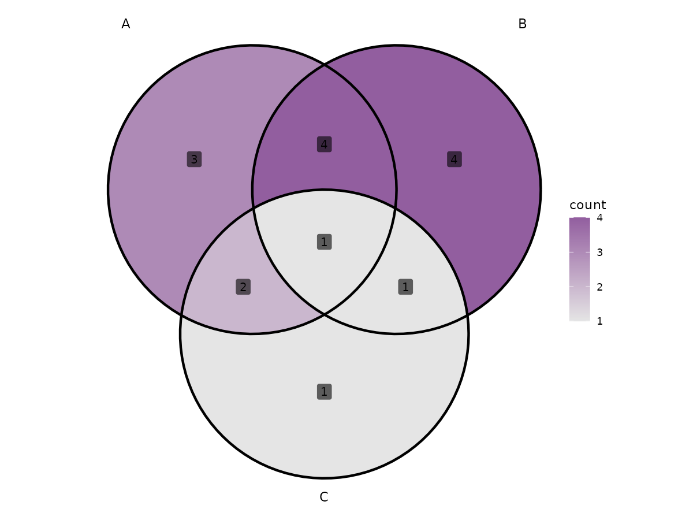{fig-alt="集合比较：Venn、UpSet、成员分组与 Jaccard 热图；命名列表 Venn；固定模拟数据的实际参数对照结果。"}

### 命名列表 UpSet {.unnumbered}

交集顶柱是精确成员组合，不是所有包含该组合的累计人数；显式 print 渲染 aplot。

```r
print(plt_upset(sets3, output = "upset"))
```

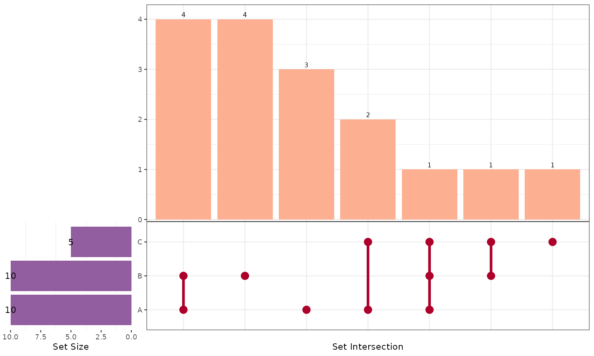{fig-alt="集合比较：Venn、UpSet、成员分组与 Jaccard 热图；命名列表 UpSet；固定模拟数据的实际参数对照结果。"}

### 0/1 指示列 {.unnumbered}

同一行是共同元素；与列表的交集计数一致，输入中另有不属于任何集合的元素。

```r
plt_upset(members, vars = c("A", "B", "C"), levels = 1, output = "venn", label = "count")
```

{fig-alt="集合比较：Venn、UpSet、成员分组与 Jaccard 热图；0/1 指示列；固定模拟数据的实际参数对照结果。"}

### both 的历史回退（0.6.8） {.unnumbered}

以下是0.6.8历史截图：当时直接合并回退为UpSet。当前完整组合见[2026-10-31示例](#identity-20261031)。

```r
print(plt_upset(sets3, output = "both"))
```

。](images/sets-guide/combined.png){fig-alt="集合比较：Venn、UpSet、成员分组与 Jaccard 热图；both 的当前回退；固定模拟数据的实际参数对照结果。"}

### 显式组合两个图 {.unnumbered}

先将 aplot 转成 patchwork，再与 Venn 排版；此调用实际验证显示两个结果。

```r
p_v <- plt_upset(sets3, output = "venn")
p_u <- plt_upset(sets3, output = "upset")
patchwork::wrap_plots(p_v, aplot::as.patchwork(p_u), ncol = 2, widths = c(0.45, 1))
```

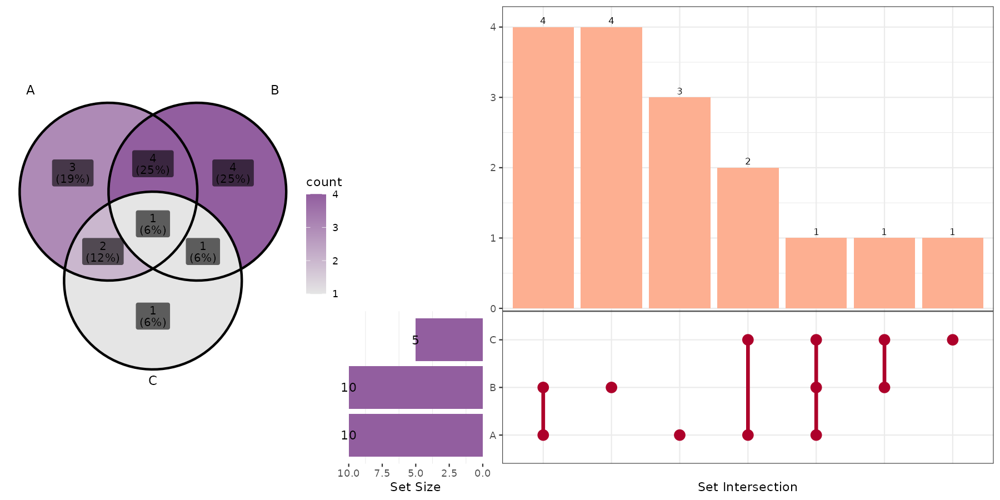{fig-alt="集合比较：Venn、UpSet、成员分组与 Jaccard 热图；显式组合两个图；固定模拟数据的实际参数对照结果。"}

:::

### 集合身份、原始缺失与当前组合图（2026-10-31） {#identity-20261031}

<!-- update-20261031: utils_sets -->

`set.labels` 改显示名称，原集合列和成员身份不变。重复标签、标签中的斜线和名为 `None` 的集合不会把不同交集压成一组；返回的交集名会加后缀以区分冲突，不能只靠显示文字推断原集合。

```r
members31 <- data.frame(.idx = 11:15, .element = paste0("g", 1:5),
  A = c(1, 1, 0, 0, 0), B = c(0, 1, 1, 0, 0), C = c(0, 1, 0, 1, 0))
members_before31 <- members31
labels31 <- c(A = "X", B = "X", C = "None")
sets_all31 <- UtilsR::plt_upset(members31, vars = c("A", "B", "C"), levels = 1,
  set.labels = labels31, output = "all", label = "count", venn.fill = "category",
  colors = c("#367E9D", "#D8933D", "#599B77"), venn.alpha = .28,
  edge.color = "#333333", set.name.size = 3,
  save = list(filename = file.path(tempdir(), "20261031-update-sets-combined.pdf"), width = 10, height = 5.5))
```

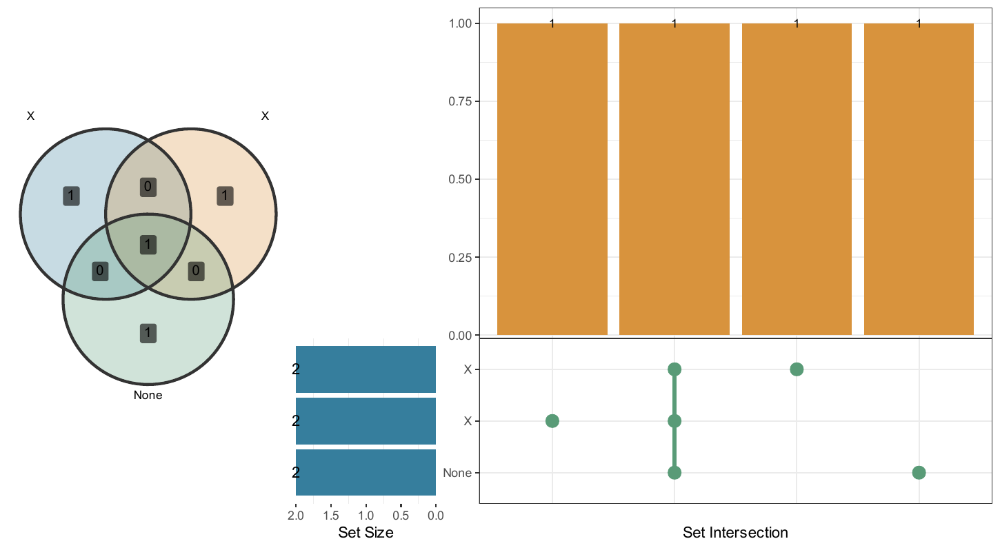{fig-alt="同一调用生成左右Venn和UpSet，三个集合显示X、X、None，Venn按集合填色并保留透明重叠。"}

[下载原生 PDF](images/sets-guide/20261031-update-sets-combined.pdf)。当前 `both` 直接返回完整组合；`all` 包含 `venn/upset/combined/data`。本例有5行外部总体、4行属于集合并集；完全不属于任何集合的第5行仍在返回数据中，Venn比例的分母仍为并集。

::: {.callout-note collapse="true" title="复核代码"}
```r
stopifnot(identical(members31, members_before31),
  identical(sets_all31$data[names(members31)], members31),
  length(unique(as.character(sets_all31$data$intersect_group))) == 5L,
  inherits(sets_all31$combined, "patchwork"), inherits(sets_all31$venn, "ggplot"),
  inherits(sets_all31$upset, "aplot"),
  length(sets_all31$combined$patches$plots) >= 1L)
```
:::

`category` 用请求的集合色和 `venn.alpha` 透明叠色；`none` 使区域透明，`edge.color` 只控制边界，不改集合名字颜色。下面给淡色面板背景，方便辨认透明区域。

```r
sets_none31 <- UtilsR::plt_upset(list(A = c("g1", "g2"), B = c("g2", "g3")),
  output = "venn", venn.fill = "none", label = "count", label_geom = "text",
  edge.color = "#8B3A62") + ggplot2::theme(panel.background = ggplot2::element_rect(fill = "#F0E9D8"))
RegR::save_plt(sets_none31,
  filename = file.path(tempdir(), "20261031-update-sets-transparent.pdf"), width = 6, height = 6)
```

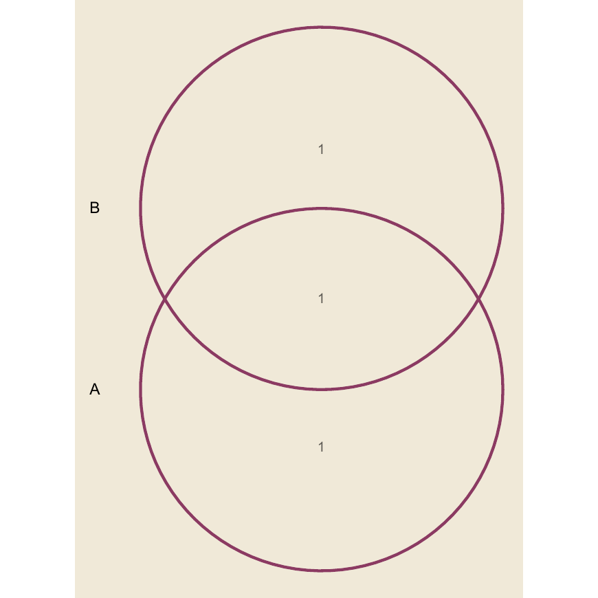{fig-alt="两个Venn集合区域没有白色覆盖，透出面板底色，集合名字保持原文字颜色。"}

[下载原生 PDF](images/sets-guide/20261031-update-sets-transparent.pdf)

::: {.callout-note collapse="true" title="复核代码"}
```r
none_build31 <- ggplot2::ggplot_build(sets_none31)
stopifnot(all(grDevices::col2rgb(none_build31$data[[1]]$fill, alpha = TRUE)[4, ] == 0),
  all(none_build31$data[[2]]$colour == "#8B3A62"))
```
:::

`levels=NA` 使用原始列的缺失掩码，含SPSS用户缺失；显式NA因子水平仍按该列 `is.na()` 判定。仅需成员分组时用 `output="data"`，不会先构建Venn或UpSet。

```r
set_na31 <- data.frame(A = haven::labelled_spss(c(1, 99, 8, 3),
  na_values = 99, na_range = c(8, 9)), B = c(1, NA, 2, 3))
set_missing31 <- UtilsR::plt_upset(set_na31, vars = c("A", "B"), levels = NA, output = "data")
set_mask31 <- as.data.frame(lapply(set_na31, is.na))
set_reference31 <- UtilsR::plt_upset(set_mask31, vars = c("A", "B"), levels = TRUE, output = "data")
set_element31 <- UtilsR::plt_upset(list(.element = c("g1", "g2"), B = c("g2", "g3")), output = "data")
```

::: {.callout-note collapse="true" title="复核代码"}
```r
stopifnot(identical(as.character(set_missing31$intersect_group),
  as.character(set_reference31$intersect_group)),
  identical(set_element31[[".element.1"]], c("g1", "g2", "g3")))
empty_set31 <- UtilsR::plt_upset(data.frame(A = integer(), B = integer()),
  vars = c("A", "B"), levels = 1, output = "data")
bad_set31 <- tryCatch(UtilsR::plt_upset(list(A = character(), B = character()), output = "venn"),
  error = conditionMessage)
stopifnot(nrow(empty_set31) == 0L, is.character(bad_set31), nzchar(bad_set31))
validation_values <- list(input_rows = nrow(members31), union_rows = 4L,
  groups = as.character(sets_all31$data$intersect_group), missing_groups = as.character(set_missing31$intersect_group),
  member_columns = names(set_element31), empty_plot_error = bad_set31)
```
:::

集合名、选列和映射键须唯一且非空；`intersect_group` 已存在时，`data/all` 会要求先改名，避免覆盖。Venn最多7集合；超过7个时 `both/all` 返回UpSet并提示，明确请求 `venn` 会报错。无成员时仍可返回合法空分组数据，但不画空图。

<!-- /update-20261031: utils_sets -->

### 分层前固定成员定义与混合因子标签（2026-10-31） {#facets-20261031b}

<!-- update-20261031b: utils_sets_facets -->

`plt_cat(type="venn"/"upset")` 在分层前确定每列的阳性水平，再沿用到所有层，避免某层只有FALSE时把FALSE误认成阳性。`group.by` 对集合类型被忽略，不据此删除行；`split.by` 才控制分层。下面4行在negative层A全FALSE，positive层A全TRUE，而B始终TRUE。

```r
set_facets31b <- data.frame(A = c(FALSE, FALSE, TRUE, TRUE), B = TRUE,
  site = c("negative", "negative", "positive", "positive"), ignored_group = NA_character_)
set_default31b <- UtilsR::plt_cat(set_facets31b, c("A", "B"), type = "upset",
  split.by = "site", group.by = "ignored_group", label = TRUE,
  save = list(filename = file.path(tempdir(), "20261031b-update-sets-facets.pdf")))
set_explicit31b <- UtilsR::plt_cat(set_facets31b, c("A", "B"), type = "upset", split.by = "site",
  stat_level = list(A = FALSE, B = TRUE), label = TRUE,
  save = list(filename = file.path(tempdir(), "20261031b-update-sets-explicit.pdf")))
mixed_sets31b <- list(A = factor(c("id2", "id10"), levels = c("id10", "id2")),
  B = c("id10", "id30"))
mixed_members31b <- UtilsR::plt_upset(mixed_sets31b, output = "data")
text_members31b <- UtilsR::plt_upset(list(A = as.character(mixed_sets31b$A), B = mixed_sets31b$B), output = "data")
```

::: {.panel-tabset}
#### 默认TRUE为成员 {.unnumbered}

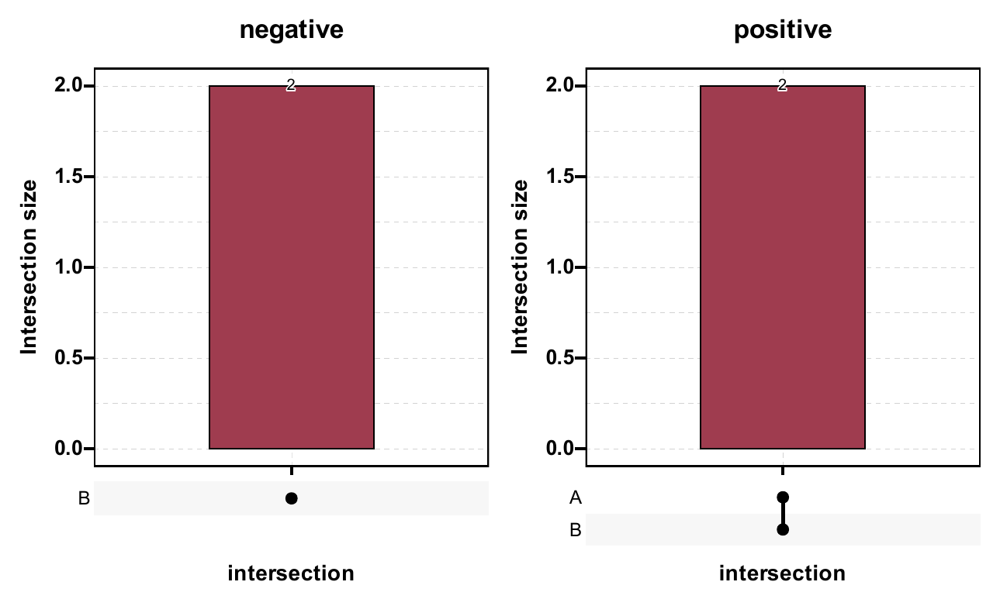{fig-alt="两个分层各两行，默认逻辑TRUE为阳性，negative层不能因A全FALSE而把它改成阳性。"}

[原生 PDF](images/sets-guide/20261031b-update-sets-facets.pdf)

#### 显式A的FALSE为成员 {.unnumbered}

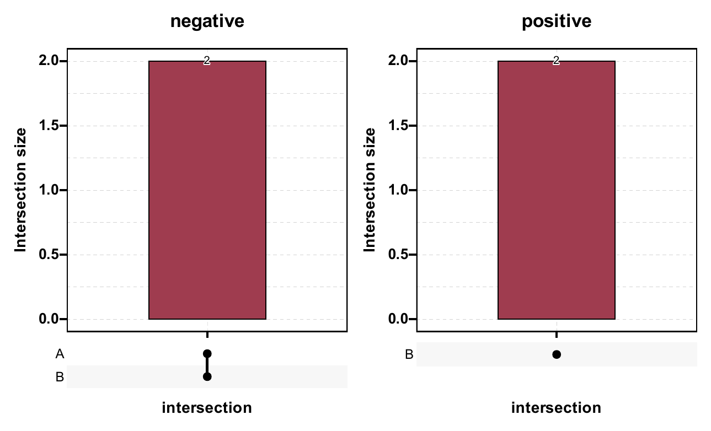{fig-alt="使用stat_level指定A的FALSE与B的TRUE为成员，两层交集按同一定义反转。"}

[原生 PDF](images/sets-guide/20261031b-update-sets-explicit.pdf)
:::

::: {.callout-note collapse="true" title="复核代码"}
```r
stopifnot(identical(set_default31b[[1]]$data$intersection, list("B", "B")),
  identical(set_default31b[[2]]$data$intersection, rep(list(c("A", "B")), 2)),
  identical(set_explicit31b[[1]]$data$intersection, rep(list(c("A", "B")), 2)),
  identical(set_explicit31b[[2]]$data$intersection, list("B", "B")),
  isTRUE(all.equal(mixed_members31b, text_members31b)),
  setequal(mixed_members31b[[".element"]], c("id2", "id10", "id30")))
validation_values <- list(rows = nrow(set_facets31b), default = lapply(seq_len(2), function(i)
  set_default31b[[i]]$data$intersection), explicit = lapply(seq_len(2), function(i)
  set_explicit31b[[i]]$data$intersection), mixed_member_ids = mixed_members31b[[".element"]])
```
:::

混合“因子成员＋字符成员”列表时，`plt_upset()` 使用因子**标签**作为成员ID，不把内部整数代码当成员。返回的3个并集成员与预先转为字符的结果一致；`output="data"` 只生成成员表。集合阳性定义改变的是集合含义，应显式写进图注；单纯改分层或显示标签不应改变它。

<!-- /update-20261031b: utils_sets_facets -->

### 分类入口的单行与透明度（2026-11-01） {#cat-upset-20261101}

UtilsR `129c5a71` 的 `plt_cat(type="upset")` 修复单行及每层单行绘制，并将alpha传给交集柱；忽略的group.by不会参与列值验证或NA筛选。[分类图实测](categorical-guide.qmd#upset-20261101)展示相同8行的透明度对照和两层单行图。

后续已推送 `5cab2565` 补充[分类入口的20交集提示和空分层占位](categorical-guide.qmd#upset-bounds-20261101b)：31种交集只显示20种时明确警告，无匹配成员的层保留占位。

这不是本页 `plt_upset()` 的新参数或返回合同：`plt_cat(type="upset")` 排除完全不属于任何集合的行，而 `plt_upset(output="data")` 保留完整返回行。两者的成员和分母仍按各自入口解释；本节只链接已执行示例，不重复生成同一组图。

## Venn 填色和标签

::: {.panel-tabset}

### 反向计数色阶 {.unnumbered}

连续填色编码区域人数，gradient_rev 把较大计数显示为较浅颜色。

```r
plt_upset(sets3, output = "venn", venn.fill = "gradient_rev",
          colors = "#0072B2", label = "both")
```

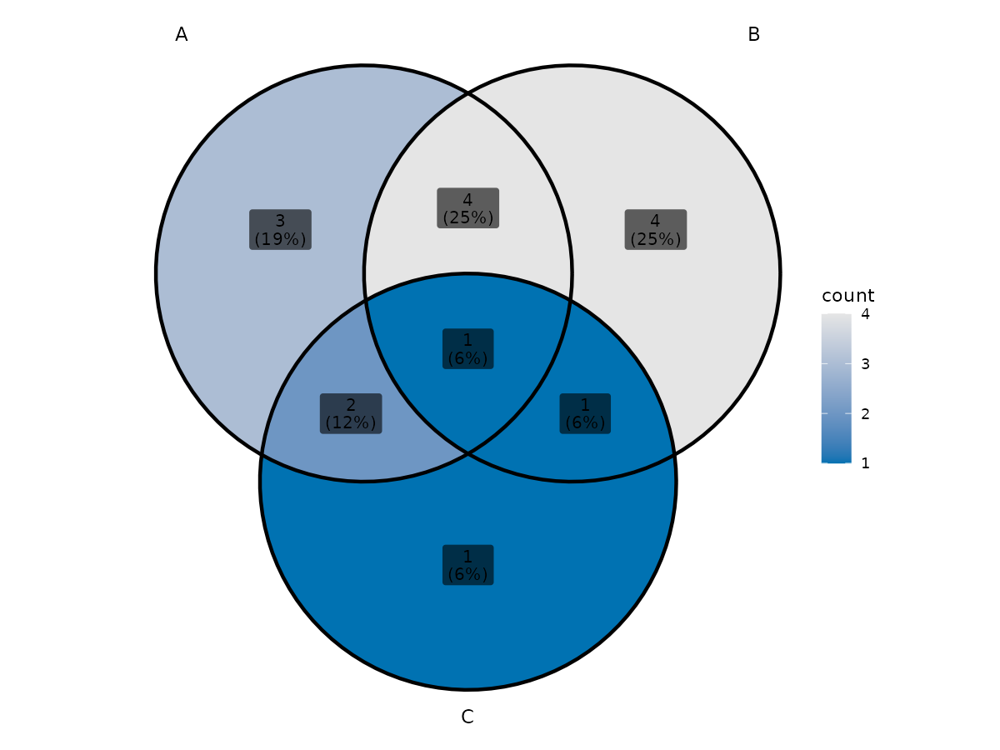{fig-alt="集合比较：Venn、UpSet、成员分组与 Jaccard 热图；反向计数色阶；固定模拟数据的实际参数对照结果。"}

### none 的历史白色填充（0.6.8） {.unnumbered}

以下是0.6.8历史截图：当时none为白色填充。当前区域透明，见[2026-10-31示例](#identity-20261031)。

```r
plt_upset(sets3, output = "venn", venn.fill = "none", label = "count",
          label_geom = "text", label_color = "#222222", edge.color = "grey30", edge.size = 0.7)
```

。](images/sets-guide/no-fill.png){fig-alt="集合比较：Venn、UpSet、成员分组与 Jaccard 热图；白色区域和文字标签；固定模拟数据的实际参数对照结果。"}

### category 的历史填色（0.6.8） {.unnumbered}

以下是0.6.8历史截图：当时category使用RdBu色阶。当前按集合颜色和venn.alpha透明叠色，见[2026-10-31示例](#identity-20261031)。

```r
plt_upset(sets3, output = "venn", venn.fill = "category",
          colors = c("#0072B2", "#E69F00", "#009E73"), label = "count")
```

。](images/sets-guide/category.png){fig-alt="集合比较：Venn、UpSet、成员分组与 Jaccard 热图；当前 category 分支；固定模拟数据的实际参数对照结果。"}

### 百分比与标签框 {.unnumbered}

Venn 区域百分比按集合并集计算；不包括指示表中完全不属于任何集合的行。

```r
plt_upset(sets3, output = "venn", label = "percent", label_geom = "label",
          label_alpha = 0.9, label_size = 4, colors = "#CC79A7")
```

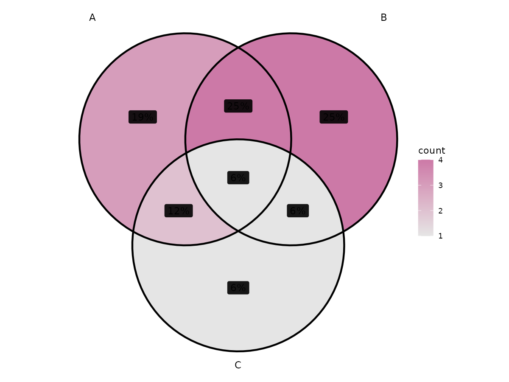{fig-alt="集合比较：Venn、UpSet、成员分组与 Jaccard 热图；百分比与标签框；固定模拟数据的实际参数对照结果。"}

### 显示名称和字号 {.unnumbered}

集合显示名替换不改变成员；set.labels 的键必须是输入集合名。

```r
plt_upset(sets3, output = "venn", label = "count",
          set.labels = c(A = "Screen A", B = "Screen B", C = "Screen C"),
          set.name.size = 5, label_size = 3.5)
```

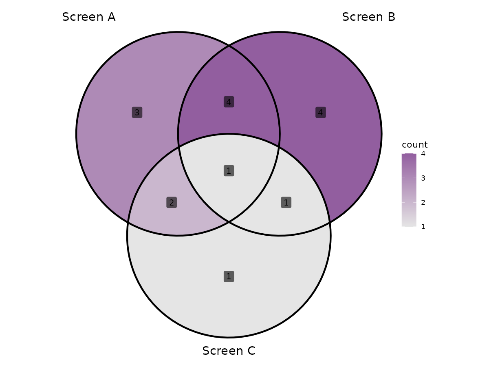{fig-alt="集合比较：Venn、UpSet、成员分组与 Jaccard 热图；显示名称和字号；固定模拟数据的实际参数对照结果。"}

:::

## UpSet 配色与成员返回

::: {.panel-tabset}

### 三种图形部件颜色 {.unnumbered}

三色分别用于集合边柱、交集顶柱、点阵，未逐集合指定颜色。

```r
print(plt_upset(sets, output = "upset",
                colors = c("#0072B2", "#D55E00", "#333333")))
```

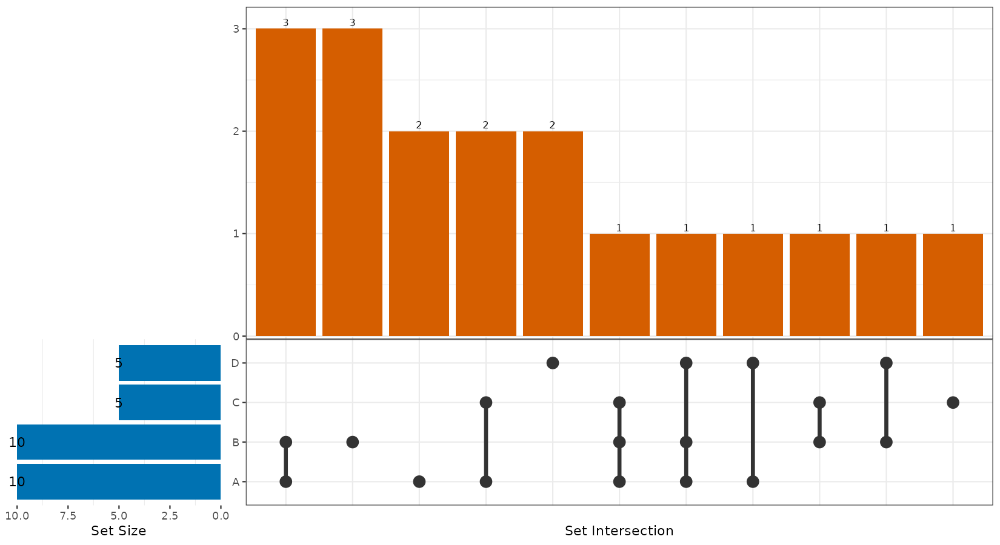{fig-alt="集合比较：Venn、UpSet、成员分组与 Jaccard 热图；三种图形部件颜色；固定模拟数据的实际参数对照结果。"}

### 每行的交集组 {.unnumbered}

返回保留每行及 intersect_group，完全非成员行分组为 None；图中的交集柱不包含 None。

```r
grouped <- plt_upset(members, vars = c("A", "B", "C"), levels = 1, output = "data")
head(grouped, 12)
```

|element |  A|  B|  C|intersect_group |
|:-------|--:|--:|--:|:---------------|
|g1      |  1|  0|  0|A               |
|g2      |  1|  0|  1|A/C             |
|g3      |  1|  0|  0|A               |
|g4      |  1|  0|  1|A/C             |
|g5      |  1|  0|  0|A               |
|g6      |  1|  1|  1|A/B/C           |
|g7      |  1|  1|  0|A/B             |
|g8      |  1|  1|  0|A/B             |
|g9      |  1|  1|  0|A/B             |
|g10     |  1|  1|  0|A/B             |
|g11     |  0|  1|  0|B               |
|g12     |  0|  1|  1|B/C             |

### 核对完整输入分母 {.unnumbered}

这张实际频数表包括 None，可以核对集合图未显示的完整输入行数。

```r
grouped <- plt_upset(members, vars = c("A", "B", "C"), levels = 1, output = "data")
as.data.frame(table(grouped[["intersect_group"]], useNA = "ifany"))
```

|Var1  | Freq|
|:-----|----:|
|B     |    4|
|A/B   |    4|
|A     |    3|
|A/C   |    2|
|C     |    1|
|B/C   |    1|
|A/B/C |    1|
|None  |    9|

### 所有结果的类型 {.unnumbered}

all返回venn/upset/combined/data；不能把整个list直接作为一个ggplot保存。下面的类型表来自0.6.8历史运行，combined当前为patchwork。

```r
out <- plt_upset(sets3, output = "all")
data.frame(component = names(out), class = vapply(out, function(z) paste(class(z), collapse = "/"), character(1)))
```

:::: {.table-responsive tabindex="0" role="region" aria-label="返回对象类型，可横向滚动"}

|         |component |class                                           |
|:--------|:---------|:-----------------------------------------------|
|venn     |venn      |ggplot2::ggplot/ggplot/ggplot2::gg/S7_object/gg |
|upset    |upset     |upset_plot/aplot                                |
|combined |combined  |upset_plot/aplot                                |
|data     |data      |data.frame                                      |

::::

:::

## Jaccard 热图参数

::: {.panel-tabset}

### 默认隐藏对角线 {.unnumbered}

集合相似度介于 0 和 1，默认对角线显示浅灰；不是连续数值相关系数。

```r
PlotHeatmapJaccard(long, group_col = "set", name_col = "feature")
```

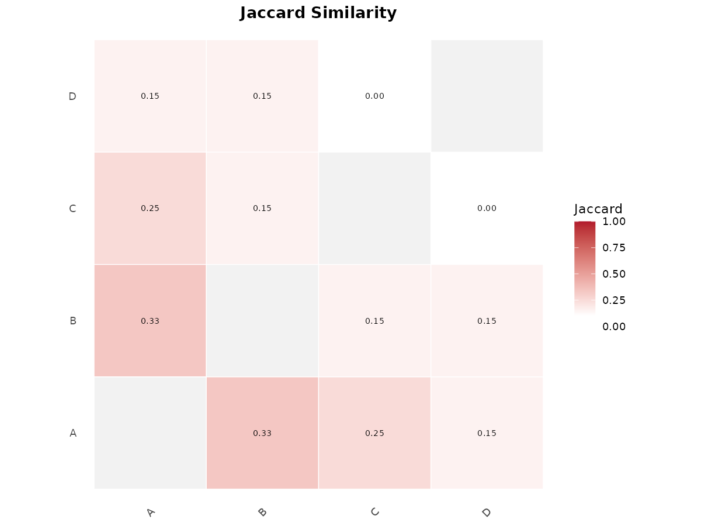{fig-alt="集合比较：Venn、UpSet、成员分组与 Jaccard 热图；默认隐藏对角线；固定模拟数据的实际参数对照结果。"}

### 显示对角线 {.unnumbered}

非空集合与自身的相似度为 1，展示这一恒等关系。

```r
PlotHeatmapJaccard(long, "set", "feature", show_diag = TRUE, text_size = 3.5)
```

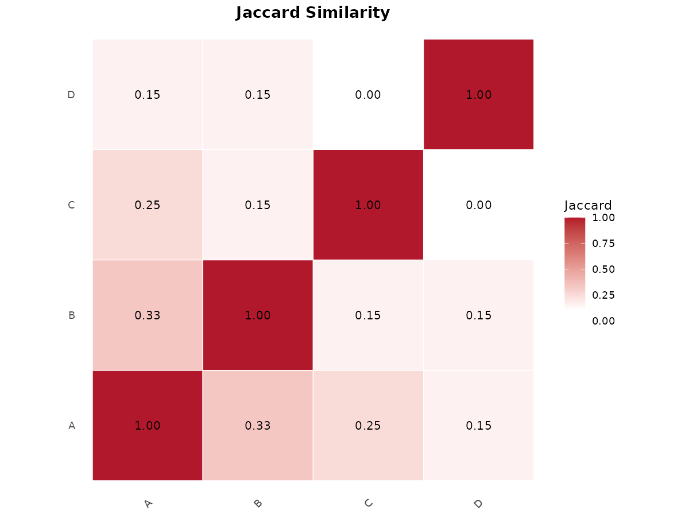{fig-alt="集合比较：Venn、UpSet、成员分组与 Jaccard 热图；显示对角线；固定模拟数据的实际参数对照结果。"}

### 改变轴顺序 {.unnumbered}

两轴同步按明确顺序排列，不执行聚类排序。

```r
PlotHeatmapJaccard(long, "set", "feature", group_levels = c("D", "C", "B", "A"),
                   title = "Ordered set similarity")
```

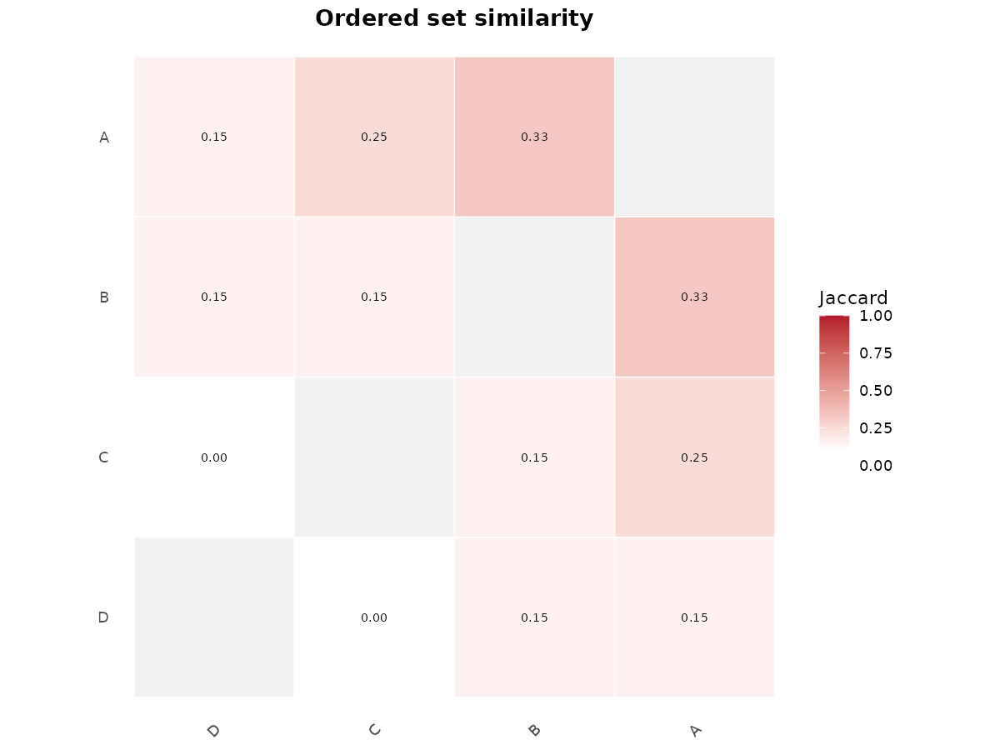{fig-alt="集合比较：Venn、UpSet、成员分组与 Jaccard 热图；改变轴顺序；固定模拟数据的实际参数对照结果。"}

### 色阶中点和数值标签 {.unnumbered}

midpoint 调整渐变中心，不改变计算值；text_size=0 隐藏单元数值。

```r
PlotHeatmapJaccard(long, "set", "feature", midpoint = 0.4,
                   low_color = "#DCEAF7", high_color = "#542788", text_size = 0)
```

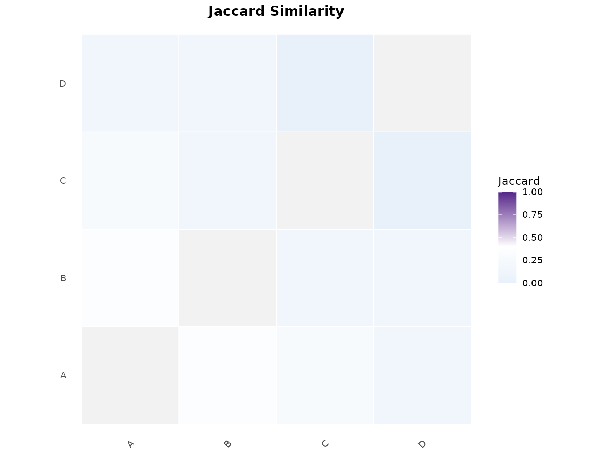{fig-alt="集合比较：Venn、UpSet、成员分组与 Jaccard 热图；色阶中点和数值标签；固定模拟数据的实际参数对照结果。"}

### 集合颜色条带 {.unnumbered}

下侧与左侧条带按当前集合顺序编码组别，和单元的数值色阶独立。

```r
PlotHeatmapJaccard(long, "set", "feature", show_strip = TRUE,
                   strip_colors = strip_cols, strip_size = 0.35)
```

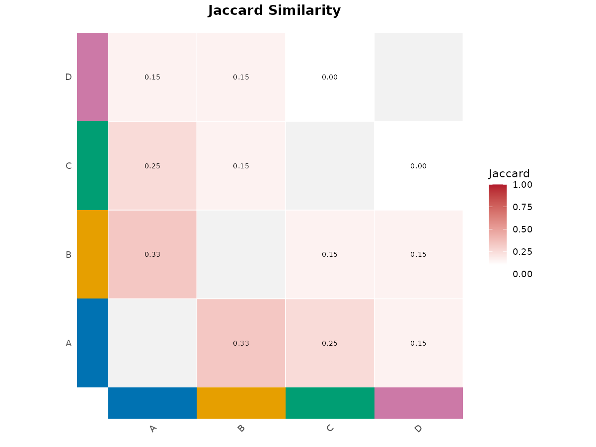{fig-alt="集合比较：Venn、UpSet、成员分组与 Jaccard 热图；集合颜色条带；固定模拟数据的实际参数对照结果。"}

:::

### Jaccard：缺失成员与多组条带（2026-10-24） {#jaccard-20261024}

<!-- update-20261024: jaccard -->

2026-10-24 按已推送 UtilsR `875c710` 在 Windows / WSL R 4.4.3 执行。缺失组名不建立一个“NA 组”，缺失特征也不作为各组共有成员；重复成员仍按集合去重。返回矩阵和画图用的隐藏对角线需分开读取。

```r
library(UtilsR)
library(ggplot2)
d_jac <- data.frame(group = factor(c("A", "A", "A", "A", "B", "B", NA),
  levels = c("B", "A", "empty")), feature = c("g1", "g2", "g1", NA, "g2", NA, "orphan"))
jac <- PlotHeatmapJaccard(d_jac, group_col = "group", name_col = "feature",
  show_diag = TRUE, return_type = "both", title = "Missing names do not create shared features")
expected_jac <- rbind(c(1, .5, 0), c(.5, 1, 0), c(0, 0, 0))
dimnames(expected_jac) <- list(c("B", "A", "empty"), c("B", "A", "empty"))
jac_hidden <- PlotHeatmapJaccard(d_jac, "group", "feature", return_type = "both")
ggsave(file.path(tempdir(), "20261024-update-jaccard-missing.pdf"), jac[["plot"]], width = 6.5, height = 5)
```

::: {.callout-note collapse="true" title="复核代码"}
生成本页时运行的检查，接在上面的代码之后运行；只读教程可以跳过。

```r
stopifnot(identical(jac[["matrix"]], expected_jac), identical(jac[["matrix"]], t(jac[["matrix"]])))
stopifnot(identical(jac_hidden[["matrix"]], jac[["matrix"]]),
  all(is.na(jac_hidden[["plot"]][["data"]][["Jaccard"]][
    jac_hidden[["plot"]][["data"]][["Group1"]] == jac_hidden[["plot"]][["data"]][["Group2"]]])))
```
:::

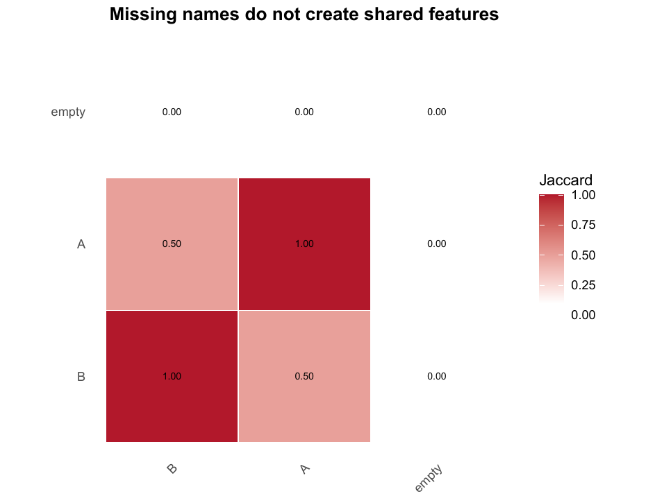{fig-alt="三组Jaccard矩阵，顺序B、A、empty；A与B为0.5，两个非空组对角线为1，空集合对角线与其他单元为0。"}

[下载 PDF](images/sets-guide/20261024-update-jaccard-missing.pdf)

A 的有效集合为 `{g1,g2}`，B 为 `{g2}`，所以 Jaccard 为 1/2，不能把两组都有的 NA 计成交集。显式因子水平 `empty` 保留为空集合；本函数约定并集为空时相似度为 **0**，不是 1。`show_diag=FALSE` 只把图中对角线设为 NA / 灰色，返回矩阵仍保留计算值。

#### 超过 16 组时颜色循环，组名仍是身份依据

```r
d_jac17 <- do.call(rbind, lapply(sprintf("G%02d", 1:17), function(g)
  data.frame(group = g, feature = c("shared", paste0("gene_", g)))))
jac17 <- PlotHeatmapJaccard(d_jac17, "group", "feature", show_strip = TRUE,
  text_size = 0, return_type = "both", title = "Seventeen groups: read group labels")
strip_layers <- ggplot_build(jac17[["plot"]])[["data"]]
strip_fill <- strip_layers[[2]][["fill"]]
bad_jac <- tryCatch(PlotHeatmapJaccard(data.frame(group = NA_character_, feature = "x"),
  "group", "feature"), error = identity)
ggsave(file.path(tempdir(), "20261024-update-jaccard-strip17.pdf"), jac17[["plot"]], width = 8, height = 7)
```

::: {.callout-note collapse="true" title="复核代码"}
生成本页时运行的检查，接在上面的代码之后运行；只读教程可以跳过。

```r
stopifnot(length(strip_fill) == 17L, !anyNA(strip_fill),
  identical(strip_fill[[17]], strip_fill[[1]]), identical(strip_layers[[3]][["fill"]], strip_fill),
  isTRUE(all.equal(unname(jac17[["matrix"]][upper.tri(jac17[["matrix"]])]), rep(1/3, 136))))
stopifnot(inherits(bad_jac, "error"))
validation_values <- list(matrix = unclass(jac[["matrix"]]), matrix17 = unclass(jac17[["matrix"]]), strip_colors = strip_fill)
```
:::

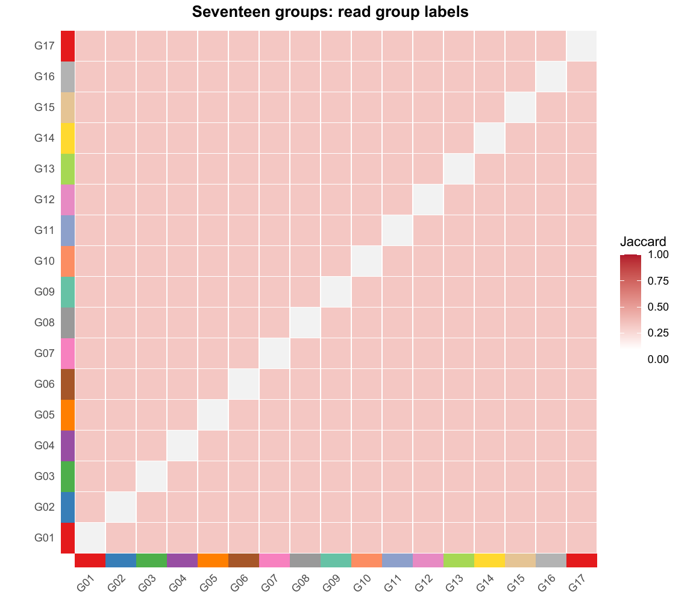{fig-alt="17乘17的Jaccard热图，所有不同组共享一个特征，相似度均为三分之一；两侧条带颜色循环，G17与G01同色但组名不同。"}

[下载 PDF](images/sets-guide/20261024-update-jaccard-strip17.pdf)

默认条带有 16 色，更多组循环使用；较短的自定义 `strip_colors` 也循环。颜色可能重复，不适合单独作为组标识，需保留轴标签。矩阵现在利用对称性逐对计算，仍输出完整方阵；这里不据此宣称固定速度倍数。

<!-- /update-20261024: jaccard -->

## 矩阵返回与数值核对

::: {.panel-tabset}

### 完整矩阵 {.unnumbered}

返回矩阵保留对角线，即使默认图把它隐藏；A/B 交集五个、并集十五个，因此为 1/3。

```r
PlotHeatmapJaccard(long, "set", "feature", return_type = "data")
```

|   |      A|      B|      C|      D|
|:--|------:|------:|------:|------:|
|A  | 1.0000| 0.3333| 0.2500| 0.1538|
|B  | 0.3333| 1.0000| 0.1538| 0.1538|
|C  | 0.2500| 0.1538| 1.0000| 0.0000|
|D  | 0.1538| 0.1538| 0.0000| 1.0000|

### both 的图和矩阵 {.unnumbered}

both 同时返回图与矩阵；通过明确的 plot 元素继续格式化或保存。

```r
res <- PlotHeatmapJaccard(long, "set", "feature", return_type = "both")
res[["plot"]]
```

{fig-alt="集合比较：Venn、UpSet、成员分组与 Jaccard 热图；both 的图和矩阵；固定模拟数据的实际参数对照结果。"}

### 重复元素不改变 Jaccard {.unnumbered}

使用集合 union/intersect，重复记录不增加相似度权重；这个例子实际验证去重后的集合语义。

```r
m1 <- PlotHeatmapJaccard(long, "set", "feature", return_type = "data")
m2 <- PlotHeatmapJaccard(rbind(long, long[1:5, ]), "set", "feature", return_type = "data")
data.frame(identical_matrix = identical(m1, m2), A_B = m1["A", "B"])
```

|identical_matrix |    A_B|
|:----------------|------:|
|TRUE             | 0.3333|

:::

## 返回对象、保存与使用边界 {#output}

`plt_upset()` 的Venn是ggplot，UpSet是upset_plot/aplot；当前both返回完整patchwork组合，all同时提供三个图对象和分组数据。上方0.6.8的回退截图与返回类型表是历史记录；当前行为见[实跑示例](#identity-20261031)。

`PlotHeatmapJaccard()` 的 data 返回完整数值矩阵，both 返回 plot/matrix。filename 可保存图，或外部 ggsave(res[["plot"]])。矩阵采用唯一成员集合，未使用排名、重要性大小或表达值权重；NA 成员和空组须在分析前明确处理。空并集在当前实现中取 0。集合重叠与 Jaccard 相似度都没有附带显著性检验。

`venn.alpha` 当前没有用于函数体图层；category 分支也未实现帮助文字描述的独立集合透明叠色。本页按实际源码和输出说明，没有修改包。

## 当前按内容保存 PDF {#save-20261020}

2026-10-20 按已推送 UtilsR `cea978f4`（保存接口自 `0f7fe0b`）与 RegR `da6157be`，在 Windows / WSL R 4.4.3 实际执行本节。上方历史参数图保留原执行快照。这里另用固定输入演示保存，不重新选择统计模型或分组。

`save = list()` 或 `NULL` 不写文件；非空列表给 `filename`，可再给英寸单位的 `width` / `height`。文件仅支持 PDF，没有扩展名时补 `.pdf`。省略的尺寸取当前图按内容估算的画布，控制台会打印尺寸及可复制保存语句，图对象可读取 `attr(p, "plot_size")`。显式给尺寸只覆盖该维度。

<!-- refresh-20261020: sets_save -->
```r
library(UtilsR)
d_sets <- data.frame(A = c("Yes", "Yes", "No", "No", "Yes", "No"),
  B = c("Yes", "No", "Yes", "No", "No", "Yes"),
  C = c("No", "Yes", "Yes", "No", "Yes", "Yes"))
p_saved <- plt_upset(d_sets, vars = c("A", "B", "C"), output = "venn",
  save = list(filename = file.path(tempdir(), "20261020-refresh-sets.pdf")))
size <- attr(p_saved, "plot_size")
size
```

::: {.callout-note collapse="true" title="复核代码"}
生成本页时运行的检查，接在上面的代码之后运行；只读教程可以跳过。

```r
stopifnot(length(size) == 2L, all(is.finite(size)), all(size > 0))
```
:::

<!-- /refresh-20261020: sets_save -->

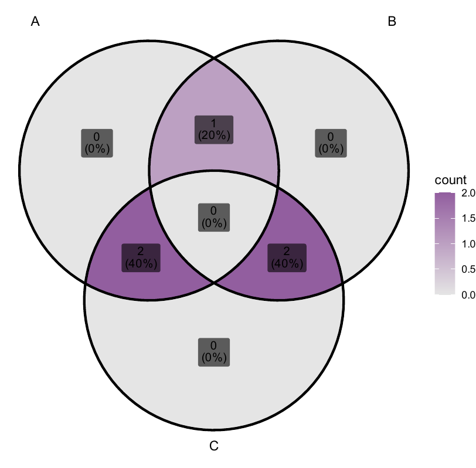{fig-alt="sets教程的固定输入保存示例，预览由实际导出的PDF转换，展示按内容估算的画布。"}

[下载本图 PDF](images/sets-guide/20261020-refresh-sets.pdf)

`output = "data"` 不画图，非空 `save` 会报错；`output = "all"` 仍返回列表，保存的是其中 combined 图，并非自动拆成多个 PDF。组合失败时要检查返回类型与提示。

UtilsR 的绘图本身不以 RegR 为硬依赖；当前 RegR 可用时才会提供尺寸提示和 `plot_size`，非空保存配置也需要它。缺少兼容 RegR 时，空保存配置仍可画图；此时不要假定图一定有 `plot_size`。本节使用的两包提交已一起验证，版本号相同不代表旧安装含有这些更新。

## 当前完整接口 {#interfaces}

点击展开查看本次实际执行版本的参数及默认值。

<details>
<summary>公共函数签名</summary>

```r
plt_upset <-
function (data, vars = NULL, levels = c("Yes", "yes"), colors = NULL, output = c("both", "venn",
    "upset", "data", "all"), label = c("both", "count", "percent", "none"), label_geom = c("label",
    "text"), label_color = "black", label_size = 3.5, label_alpha = 0.6, venn.fill = c("gradient",
    "gradient_rev", "category", "none"), venn.alpha = 0.5, edge.color = "grey30", edge.size = 1,
    set.name.size = 4, set.labels = NULL, save = list())
NULL

PlotHeatmapJaccard <-
function (data, group_col = "cell_type", name_col = "gene", title = "Jaccard Similarity", group_levels = NULL,
    midpoint = 0.1, text_size = 2.5, show_diag = FALSE, low_color = "white", high_color = "#B2182B",
    show_strip = FALSE, strip_colors = NULL, strip_size = 0.45, return_type = c("plot", "data",
        "both"), filename = NULL, width = 10, height = 9, dpi = 300)
NULL

```

</details>

## 验证范围与参考 {#references}

本页列出的调用均已实际执行；所有展示的 ggplot/patchwork 图通过 `ggplot_build()` 和 PNG 导出，表格来自同一组代码的实际返回。未修改 UtilsR 源码或重新运行全包测试。

本次绘制出现的提示记录如下；对应示例仍通过实际构建和导出检查。

<details>
<summary>绘图提示</summary>

- `Combined layout failed: Only know how to add <ggplot> and/or <grob> objects. Returning plots separately.`

</details>

- [UtilsR 函数参考](https://hui950319.github.io/UtilsR/reference/index.html)
- [UtilsR 源码](https://github.com/HUI950319/UtilsR/tree/master/R)
- [专题目录](index.qmd)

<details>
<summary>执行环境</summary>

```text
R version 4.4.3 (2025-02-28)
Platform: x86_64-pc-linux-gnu
Running under: Ubuntu 22.04.2 LTS

Matrix products: default
BLAS:   /usr/lib/x86_64-linux-gnu/openblas-pthread/libblas.so.3
LAPACK: /usr/lib/x86_64-linux-gnu/openblas-pthread/libopenblasp-r0.3.20.so;  LAPACK version 3.10.0

locale:
 [1] LC_CTYPE=C.UTF-8       LC_NUMERIC=C           LC_TIME=C.UTF-8        LC_COLLATE=C.UTF-8
 [5] LC_MONETARY=C.UTF-8    LC_MESSAGES=C.UTF-8    LC_PAPER=C.UTF-8       LC_NAME=C
 [9] LC_ADDRESS=C           LC_TELEPHONE=C         LC_MEASUREMENT=C.UTF-8 LC_IDENTIFICATION=C

time zone: Asia/Shanghai
tzcode source: system (glibc)

attached base packages:
[1] stats     graphics  grDevices utils     datasets  methods   base

other attached packages:
[1] ggplot2_4.0.3 UtilsR_0.6.8

loaded via a namespace (and not attached):
 [1] gtable_0.3.6        jsonlite_2.0.0      dplyr_1.2.0         compiler_4.4.3
 [5] aplot_0.2.3         tidyselect_1.2.1    Rcpp_1.1.1          gridGraphics_0.5-1
 [9] dichromat_2.0-0.1   ggplotify_0.1.2     ggfun_0.1.6         systemfonts_1.1.0
[13] scales_1.4.0        textshaping_0.4.0   ggVennDiagram_1.5.4 R6_2.6.1
[17] labeling_0.4.3      generics_0.1.4      patchwork_1.3.2     httr2_1.2.2
[21] yulab.utils_0.2.0   forcats_1.0.1       ggrepel_0.9.8       tibble_3.3.1
[25] ellmer_0.4.0        pillar_1.11.1       RColorBrewer_1.1-3  rlang_1.3.0
[29] fs_2.0.1            S7_0.2.2            otel_0.2.0          cli_3.6.6
[33] withr_3.0.3         magrittr_2.0.4      digest_0.6.39       grid_4.4.3
[37] rappdirs_0.3.4      lifecycle_1.0.5     coro_1.1.0          vctrs_0.7.3
[41] ggprism_1.0.7       glue_1.8.1          farver_2.1.2        ragg_1.5.2
[45] colorspace_2.1-2    tools_4.4.3         pkgconfig_2.0.3     mcptools_0.2.1
```

</details>

## 更新记录 {#page-updates}

::: {.callout-note collapse="true" title="本页更新记录"}
- 2026-11-01：[区分分类UpSet入口](#cat-upset-20261101)，补充单行、透明度与忽略列的链接。
- 2026-10-31：[固定分层前成员定义](#facets-20261031b)，补充显式阳性水平和混合因子成员ID。
- 2026-10-31：[补充集合身份、原始缺失、透明填色和完整组合图](#identity-20261031)。
- 2026-10-24：[Jaccard：缺失成员与多组条带](#jaccard-20261024)
:::
